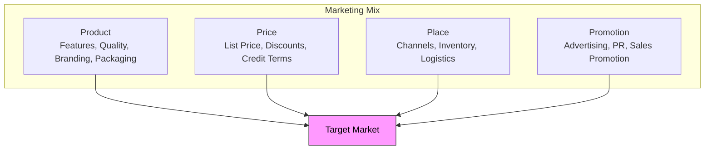
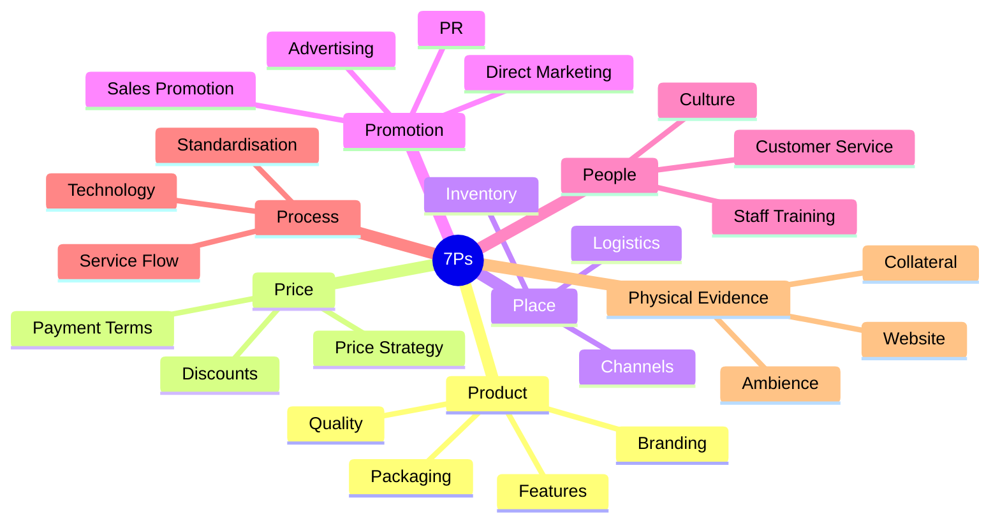
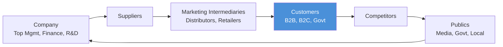
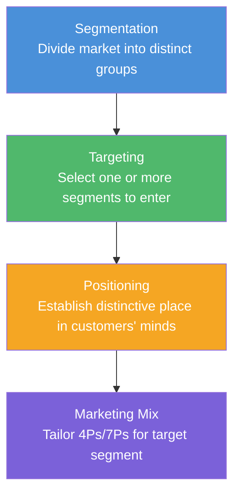
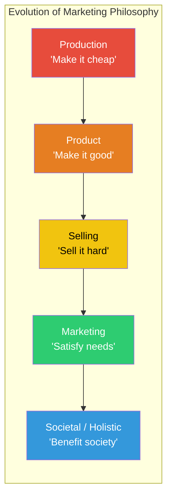

# Chapter 1: Marketing Concepts

## Learning Objectives

By the end of this chapter, you will be able to:
- Define marketing from multiple perspectives (Kotler, AMA, societal)
- Explain the marketing mix and its evolution from 4Ps to 7Ps for services
- Analyse the marketing environment using micro and macro frameworks
- Apply the STP (Segmentation, Targeting, Positioning) process
- Compare marketing philosophies from production to holistic orientation

---

## Theory

### 1.1 What Is Marketing?

Marketing is not merely selling or advertising. It is the process of identifying, anticipating, and satisfying customer needs profitably.

**Key Definitions:**

| Source | Definition |
|--------|------------|
| **Philip Kotler** | Marketing is a social and managerial process by which individuals and groups obtain what they need and want through creating, offering, and exchanging products of value with others |
| **American Marketing Association (AMA)** | Marketing is the activity, set of institutions, and processes for creating, communicating, delivering, and exchanging offerings that have value for customers, clients, partners, and society at large |
| **Societal Marketing** | Marketing decisions should consider consumer wants, company requirements, society's long-term interests |

**Core Marketing Concepts:**

- **Needs** — Basic human requirements (food, shelter, belonging)
- **Wants** — Needs shaped by culture and personality (a burger vs fried rice for hunger)
- **Demands** — Wants backed by purchasing power
- **Exchange** — The act of obtaining a desired object by offering something in return
- **Transaction** — A trade of values between two parties
- **Value** — The ratio of perceived benefits to price paid

### 1.2 The Marketing Mix

The marketing mix is the set of controllable tactical marketing tools that a firm blends to produce the response it wants from the target market.

#### The 4Ps Framework (Goods)



#### Extended 7Ps for Services

Services are intangible, heterogeneous, perishable, and inseparable — requiring three additional Ps:

| P | Meaning | Example in Services |
|---|---------|---------------------|
| **Product** | Core service offering | Insurance policy, bank account |
| **Price** | Fee, premium, interest | Loan interest rate, annual fee |
| **Place** | Distribution access | Branch, ATM, mobile app |
| **Promotion** | Communication mix | Ads, referrals, social media |
| **People** | All human actors in service delivery | Bank teller, call centre agent |
| **Process** | Procedures, mechanisms, flow of activities | Loan approval workflow |
| **Physical Evidence** | Tangible cues that demonstrate service quality | Bank interior, website design, statements |



### 1.3 Marketing Environment

The marketing environment consists of all actors and forces outside marketing that affect the marketing management's ability to build and maintain successful relationships with target customers.

#### Microenvironment

Actors close to the company that affect its ability to serve customers:



| Actor | Role & Impact |
|-------|--------------|
| **Company** | Internal coordination across departments |
| **Suppliers** | Provide resources; shortages or delays affect marketing |
| **Intermediaries** | Distributors, retailers, agents who help promote and sell |
| **Customers** | Consumer, business, government, reseller, international markets |
| **Competitors** | Firms offering similar products; must monitor strategies |
| **Publics** | Financial, media, government, citizen-action, local, general, internal |

#### Macroenvironment (PESTLE)

Broader societal forces that affect the entire microenvironment:

| Force | Factors |
|-------|---------|
| **Political** | Government policies, tax laws, trade restrictions |
| **Economic** | Inflation, income levels, employment, interest rates |
| **Social** | Demographics, lifestyle changes, cultural values |
| **Technological** | R&D, automation, digital transformation |
| **Legal** | Consumer protection, competition law, advertising regulation |
| **Environmental** | Sustainability, climate change, green marketing |

### 1.4 Market Segmentation, Targeting, and Positioning (STP)

The STP process is the foundation of modern marketing strategy.



#### Segmentation Bases

| Base | Variables | Example |
|------|-----------|---------|
| **Geographic** | Region, city, climate, population density | Selling air conditioners in hot regions |
| **Demographic** | Age, gender, income, education, occupation | Premium credit cards for high-income earners |
| **Psychographic** | Lifestyle, personality, values, social class | Luxury cars for status-conscious buyers |
| **Behavioural** | Usage rate, brand loyalty, benefits sought, occasion | Airlines: frequent flyers get loyalty programs |

**Effective segmentation criteria:** Measurable, Accessible, Substantial, Differentiable, Actionable (MآS-DA).

#### Targeting Strategies

| Strategy | Description | Best For |
|----------|-------------|----------|
| **Undifferentiated (Mass)** | One offer to entire market | Commodity products (salt, sugar) |
| **Differentiated** | Separate offers to multiple segments | Large companies with resources |
| **Concentrated (Niche)** | Focus on one or few segments | Startups with limited resources |
| **Micromarketing** | Tailoring to individuals or local groups | Local businesses, custom products |

#### Positioning

Positioning is designing the company's offering and image to occupy a distinctive place in the target market's mind.

**Positioning tools:**
- **Perceptual maps** — Visual representation of consumer perceptions of brands
- **USP (Unique Selling Proposition)** — A distinct benefit that sets the product apart
- **Brand mantra** — A short internal guiding statement

**Positioning errors:** Under-positioning (fuzzy image), over-positioning (too narrow), confused positioning (multiple messages), doubtful positioning (claims not believable).

### 1.5 Marketing Philosophies

Five competing concepts under which organisations conduct marketing activities:



| Philosophy | Focus | Key Slogan | Example |
|------------|-------|------------|---------|
| **Production** | Low cost, mass distribution | "Make it cheap and available" | Henry Ford's Model T |
| **Product** | Superior quality, innovation | "Make a better mousetrap" | Apple iPhone |
| **Selling** | Aggressive promotion | "Sell what we make, not what market wants" | Timeshare, insurance |
| **Marketing** | Customer needs, integrated effort | "Love the customer, not the product" | Amazon |
| **Societal / Holistic** | Ethical, environmental, social responsibility | "Do well by doing good" | Patagonia, TOMS |

#### Holistic Marketing Concept

Holistic marketing recognises that everything matters in marketing and that a broad, integrated perspective is necessary. It has four components:

1. **Relationship marketing** — Building long-term relationships with customers, partners, channel members
2. **Integrated marketing** — All marketing activities (promotion, product, price, place) work together
3. **Internal marketing** — Hiring, training, and motivating capable employees who serve customers well
4. **Socially responsible marketing** — Ethical, environmental, legal, and social context

### 1.6 Customer Relationship Management (CRM)

CRM is the process of managing detailed information about individual customers and carefully managing customer touchpoints to maximise customer loyalty.

**Key CRM metrics:**
- **Customer Lifetime Value (CLV)** — Total net profit a company earns from a customer over the entire relationship
- **Customer Acquisition Cost (CAC)** — Total cost of acquiring a new customer
- **Customer Retention Rate** — Percentage of customers retained over a period
- **Net Promoter Score (NPS)** — Willingness to recommend the brand

---

## Examples: 20 Solved MCQs

### Example 1: Marketing Definitions

**Q1.** According to Philip Kotler, marketing is best described as:

a) A set of activities focused on selling and advertising
b) A social and managerial process of obtaining what individuals need through exchange
c) The process of maximising company profits through any means
d) A function limited to the advertising department

```typescript
// TypeScript: Marketing Definition Classifier
type DefinitionSource = "kotler" | "ama" | "societal";

interface MarketingDefinition {
  source: DefinitionSource;
  keywords: string[];
}

function classifyDefinition(statement: string): DefinitionSource | null {
  const defs: MarketingDefinition[] = [
    { source: "kotler", keywords: ["social", "managerial", "need", "want", "exchange"] },
    { source: "ama", keywords: ["create", "communicate", "deliver", "value", "institution"] },
    { source: "societal", keywords: ["society", "long-term", "interest", "ethical"] },
  ];
  for (const d of defs) {
    if (d.keywords.every(k => statement.toLowerCase().includes(k))) return d.source;
  }
  return null;
}
console.log(classifyDefinition("A social and managerial process by which individuals obtain what they need through exchange"));
// Output: kotler
```

<details>
<summary>Answer</summary>
**b) A social and managerial process of obtaining what individuals need through exchange.** Kotler defines marketing as a social and managerial process by which individuals and groups obtain what they need and want through creating, offering, and exchanging products of value. Options (a), (c), and (d) are too narrow or incorrect.
</details>

---

**Q2.** Which of the following is NOT one of the core marketing concepts?

a) Need
b) Exchange
c) Depreciation
d) Value

```typescript
// TypeScript: Core Marketing Concepts Checker
const coreConcepts = ["needs", "wants", "demands", "exchange", "transaction", "value", "product", "market"];
function isCoreConcept(term: string): boolean {
  return coreConcepts.includes(term.toLowerCase());
}
console.log(isCoreConcept("depreciation")); // false
console.log(isCoreConcept("exchange"));     // true
```

<details>
<summary>Answer</summary>
**c) Depreciation.** Depreciation is an accounting concept, not a core marketing concept. The core marketing concepts include needs, wants, demands, exchange, transactions, value, product, and market.
</details>

---

### Example 2: Marketing Mix (4Ps to 7Ps)

**Q3.** Which of the following correctly lists the 4Ps of marketing?

a) Product, Price, Promotion, People
b) Product, Price, Place, Promotion
c) Product, Price, People, Process
d) Product, Price, Place, Physical Evidence

```typescript
// TypeScript: 4Ps Validator
type PElement = "Product" | "Price" | "Place" | "Promotion" | "People" | "Process" | "Physical Evidence";

function validate4Ps(input: PElement[]): boolean {
  const fourPs: PElement[] = ["Product", "Price", "Place", "Promotion"];
  return fourPs.every(p => input.includes(p)) && input.length === 4;
}
console.log(validate4Ps(["Product", "Price", "Place", "Promotion"]));  // true
console.log(validate4Ps(["Product", "Price", "People", "Process"]));   // false
```

<details>
<summary>Answer</summary>
**b) Product, Price, Place, Promotion.** The original 4Ps (McCarthy) are Product, Price, Place, and Promotion. People, Process, and Physical Evidence are additions for the 7Ps framework used in services marketing.
</details>

---

**Q4.** For service industries, the marketing mix is extended to 7Ps. Which THREE Ps are added to the original 4Ps?

a) People, Process, Physical Evidence
b) People, Profit, Positioning
c) Process, Promotion, Packaging
d) Physical Evidence, Price, Penetration

<details>
<summary>Answer</summary>
**a) People, Process, Physical Evidence.** The 7Ps for services add People (all human actors), Process (procedures and flow of activities), and Physical Evidence (tangible cues of service quality) to the original 4Ps.
</details>

---

### Example 3: Marketing Environment

**Q5.** Which of the following is part of a company's microenvironment?

a) Demographic trends
b) Technological developments
c) Marketing intermediaries
d) Political factors

<details>
<summary>Answer</summary>
**c) Marketing intermediaries.** The microenvironment includes the company, suppliers, intermediaries, customers, competitors, and publics. Demographic trends, technological developments, and political factors are part of the macroenvironment (PESTLE).
</details>

---

**Q6.** Inflation, interest rates, and income levels fall under which macroenvironmental force?

a) Political
b) Economic
c) Social
d) Legal

```typescript
// TypeScript: PESTLE Classifier
type PestleForce = "Political" | "Economic" | "Social" | "Technological" | "Legal" | "Environmental";

const pestleMap: Record<string, PestleForce[]> = {
  inflation: ["Economic"],
  "interest rate": ["Economic"],
  income: ["Economic"],
  demographics: ["Social"],
  "data privacy": ["Legal", "Technological"],
  climate: ["Environmental"],
};

function classifyPestle(factor: string): PestleForce[] {
  return pestleMap[factor.toLowerCase()] || ["Unknown"];
}
console.log(classifyPestle("inflation")); // ["Economic"]
```

<details>
<summary>Answer</summary>
**b) Economic.** Inflation, interest rates, employment levels, and income distribution are all part of the economic environment — a key macroenvironmental force.
</details>

---

### Example 4: STP Process

**Q7.** The correct sequence of the STP process is:

a) Targeting → Segmentation → Positioning
b) Positioning → Segmentation → Targeting
c) Segmentation → Targeting → Positioning
d) Segmentation → Positioning → Targeting

<details>
<summary>Answer</summary>
**c) Segmentation → Targeting → Positioning.** STP stands for Segmentation (divide market), Targeting (select segment), and Positioning (establish image). This is the logical order.
</details>

---

**Q8.** Dividing a market into distinct groups based on age, gender, and income is an example of:

a) Geographic segmentation
b) Demographic segmentation
c) Psychographic segmentation
d) Behavioural segmentation

```typescript
// TypeScript: Segmentation Base Identifier
type SegmentationBase = "Geographic" | "Demographic" | "Psychographic" | "Behavioural";

const variableMap: Record<string, SegmentationBase> = {
  age: "Demographic",
  gender: "Demographic",
  income: "Demographic",
  education: "Demographic",
  region: "Geographic",
  city: "Geographic",
  climate: "Geographic",
  lifestyle: "Psychographic",
  personality: "Psychographic",
  "usage rate": "Behavioural",
  "brand loyalty": "Behavioural",
};

function identifyBase(variable: string): SegmentationBase | undefined {
  return variableMap[variable.toLowerCase()];
}
console.log(identifyBase("age"));    // Demographic
console.log(identifyBase("lifestyle")); // Psychographic
```

<details>
<summary>Answer</summary>
**b) Demographic segmentation.** Age, gender, income, education, and occupation are demographic variables. Geographic relates to region/climate; psychographic to lifestyle/personality; behavioural to usage/loyalty.
</details>

---

**Q9.** A luxury watchmaker targets only ultra-high-net-worth individuals. This targeting strategy is called:

a) Undifferentiated marketing
b) Differentiated marketing
c) Concentrated marketing
d) Micromarketing

<details>
<summary>Answer</summary>
**c) Concentrated marketing (Niche).** Concentrated marketing focuses on a single, well-defined market segment. Undifferentiated targets the whole market, differentiated targets multiple segments, and micromarketing targets individuals or local groups.
</details>

---

**Q10.** Which of the following is NOT a criterion for effective segmentation?

a) Measurable
b) Accessible
c) Affordable
d) Substantial

<details>
<summary>Answer</summary>
**c) Affordable.** The five criteria for effective segmentation are Measurable, Accessible, Substantial, Differentiable, and Actionable (MآS-DA). "Affordable" is not among them.
</details>

---

### Example 5: Positioning

**Q11.** Designing the company's offering to occupy a distinctive place in the target market's mind is called:

a) Segmentation
b) Targeting
c) Positioning
d) Promotion

<details>
<summary>Answer</summary>
**c) Positioning.** Positioning is the act of designing the company's offering and image to occupy a distinctive place in the target market's mind. It follows segmentation and targeting.
</details>

---

**Q12.** When a brand claims to be "the safest car in the world" but cannot substantiate it, the positioning error is called:

a) Under-positioning
b) Over-positioning
c) Doubtful positioning
d) Confused positioning

<details>
<summary>Answer</summary>
**c) Doubtful positioning.** When a company makes claims that consumers find hard to believe given the product's features, price, or manufacturer's reputation, it is doubtful positioning.
</details>

---

### Example 6: Marketing Philosophies

**Q13.** "Consumers prefer products that are widely available and inexpensive." This orientation describes the:

a) Production concept
b) Product concept
c) Selling concept
d) Marketing concept

<details>
<summary>Answer</summary>
**a) Production concept.** The production concept holds that consumers favour products that are widely available and inexpensive. Management focuses on high production efficiency and mass distribution.
</details>

---

**Q14.** Which marketing philosophy emphasises aggressive promotion and selling efforts?

a) Production concept
b) Product concept
c) Selling concept
d) Societal marketing concept

<details>
<summary>Answer</summary>
**c) Selling concept.** The selling concept holds that consumers will not buy enough of the firm's products unless it undertakes a large-scale selling and promotion effort. Common for unsought goods like insurance.
</details>

---

**Q15.** The societal marketing concept differs from the marketing concept in that it considers:

a) Customer wants only
b) Company profits only
c) Society's long-term interests
d) Employee satisfaction only

<details>
<summary>Answer</summary>
**c) Society's long-term interests.** The societal marketing concept adds the dimension of society's well-being to themarketing concept's focus on customer wants and company profits.
</details>

---

### Example 7: Holistic Marketing

**Q16.** Which component of holistic marketing involves building long-term relationships with customers and partners?

a) Internal marketing
b) Integrated marketing
c) Relationship marketing
d) Socially responsible marketing

<details>
<summary>Answer</summary>
**c) Relationship marketing.** Relationship marketing focuses on building mutually satisfying long-term relationships with key parties (customers, suppliers, distributors) to earn and retain their business.
</details>

---

**Q17.** Integrated marketing requires that:

a) All marketing activities work together harmoniously
b) Marketing department works in isolation
c) Advertising budget is maximised
d) Price is the only differentiator

<details>
<summary>Answer</summary>
**a) All marketing activities work together harmoniously.** Integrated marketing ensures that all promotional tools and marketing mix elements deliver a consistent message and work together to achieve marketing objectives.
</details>

---

### Example 8: CRM Concepts

**Q18.** The total net profit a company earns from a customer over the entire relationship is called:

a) Customer Acquisition Cost
b) Customer Lifetime Value
c) Net Promoter Score
d) Return on Investment

```typescript
// TypeScript: CLV Calculator
interface Customer {
  id: string;
  annualRevenue: number;
  retentionRate: number; // as decimal (0.8 = 80%)
  years: number;
  acquisitionCost: number;
}

function calculateCLV(customer: Customer): number {
  let totalRevenue = 0;
  let retainedProbability = 1;
  for (let year = 1; year <= customer.years; year++) {
    retainedProbability *= customer.retentionRate;
    totalRevenue += customer.annualRevenue * retainedProbability;
  }
  return totalRevenue - customer.acquisitionCost;
}

const customer: Customer = {
  id: "C001",
  annualRevenue: 5000,
  retentionRate: 0.8,
  years: 5,
  acquisitionCost: 2000,
};
console.log("CLV:", calculateCLV(customer)); // ~CLV: 13984
```

<details>
<summary>Answer</summary>
**b) Customer Lifetime Value (CLV).** CLV represents the total net profit a company expects to earn from a customer over the entire duration of the relationship. CAC is the cost to acquire, NPS measures loyalty.
</details>

---

**Q19.** Net Promoter Score (NPS) measures:

a) The company's net profit
b) Customer willingness to recommend the brand
c) Advertising effectiveness
d) Market share growth

<details>
<summary>Answer</summary>
**b) Customer willingness to recommend the brand.** NPS is calculated based on the question "How likely are you to recommend our company to a friend or colleague?" on a 0–10 scale. Promoters (9–10) minus Detractors (0–6) gives the NPS.
</details>

---

**Q20.** A company that focuses on creating long-term customer loyalty by carefully managing every touchpoint is practising:

a) Transactional marketing
b) Customer Relationship Management
c) Mass marketing
d) Guerrilla marketing

<details>
<summary>Answer</summary>
**b) Customer Relationship Management (CRM).** CRM involves managing detailed information about individual customers and carefully managing customer touchpoints to maximise customer loyalty. Transactional marketing focuses on single sales, not relationships.
</details>

---

## Summary

- **Marketing** is the process of creating, communicating, delivering, and exchanging offerings that have value for customers and society
- The **marketing mix** (4Ps: Product, Price, Place, Promotion) is extended to **7Ps** (adding People, Process, Physical Evidence) for services
- The **marketing environment** consists of **micro** (company, suppliers, intermediaries, customers, competitors, publics) and **macro** (PESTLE: Political, Economic, Social, Technological, Legal, Environmental) forces
- **STP** is the strategic process of Segmentation, Targeting, and Positioning
- **Segmentation bases** include geographic, demographic, psychographic, and behavioural variables
- **Targeting strategies** range from undifferentiated (mass) to micromarketing (individual)
- **Positioning** uses perceptual maps and USP to occupy a distinctive place in consumer minds
- **Marketing philosophies** evolved from production/product/selling through marketing to societal/holistic
- **Holistic marketing** integrates relationship, integrated, internal, and socially responsible marketing
- **CRM** focuses on building long-term customer relationships measured through CLV, CAC, retention rate, and NPS

## Practical Takeaways

1. **For exams**: Remember STP order (Segmentation → Targeting → Positioning) and 4Ps → 7Ps additions
2. **For interviews**: Be ready to give real-world examples for each marketing philosophy
3. **For business strategy**: Always start with STP analysis before deciding the marketing mix
4. **For service businesses**: Apply the 7Ps framework — People, Process, and Physical Evidence are often where service businesses fail
5. **For CRM**: Focus on CLV over short-term profits — retaining a customer costs 5–7 times less than acquiring a new one

## Chapter Quiz

1. Which of the following is NOT one of the 7Ps of the services marketing mix?
   - A) Product
   - B) Price
   - C) Packaging
   - D) Physical Evidence

<details>
<summary>Answer</summary>
**C) Packaging.** The 7Ps are Product, Price, Place, Promotion, People, Process, and Physical Evidence. Packaging is part of the Product element, not a separate P.
</details>

2. If a company divides the market into urban, semi-urban, and rural segments, it is using which basis of segmentation?
   - A) Demographic
   - B) Geographic
   - C) Psychographic
   - D) Behavioural

<details>
<summary>Answer</summary>
**B) Geographic.** Geographic segmentation divides markets based on location — region, city size, density, climate. Urban/semi-urban/rural is a geographic variable.
</details>

3. The marketing concept holds that:
   - A) Consumers prefer inexpensive products
   - B) Aggressive selling is essential
   - C) Customer needs should be the starting point
   - D) Product quality is the only priority

<details>
<summary>Answer</summary>
**C) Customer needs should be the starting point.** The marketing concept focuses on identifying and satisfying customer needs better than competitors. It is customer-centric, not production-centric.
</details>

4. Which macroeconomic force includes demographic changes?
   - A) Political
   - B) Economic
   - C) Social
   - D) Legal

<details>
<summary>Answer</summary>
**C) Social.** The social/cultural environment includes demographics, lifestyle changes, values, and beliefs. Demographics (age, population, family structure) are social forces.
</details>

5. When a brand has a fuzzy and unclear image in consumers' minds, it is suffering from:
   - A) Over-positioning
   - B) Under-positioning
   - C) Doubtful positioning
   - D) Confused positioning

<details>
<summary>Answer</summary>
**B) Under-positioning.** Under-positioning occurs when consumers have a vague or unclear idea about the brand. They do not have a strong perception of what the brand stands for.
</details>

## Exercises

### Section A: Conceptual Understanding (Q1–Q10)

1. Define marketing according to the American Marketing Association. How does it differ from Kotler's definition?
2. Explain the three additional Ps in the services marketing mix. Why are they necessary?
3. Draw and explain the components of a company's microenvironment.
4. What are the five criteria for effective market segmentation? Explain each.
5. Distinguish between the selling concept and the marketing concept with an example.
6. What is holistic marketing? Explain its four components.
7. Explain positioning errors with examples of each.
8. What is a perceptual map? How is it used in positioning?
9. Define Customer Lifetime Value. How is it calculated?
10. What is the difference between need, want, and demand? Give an example of each.

### Section B: Application-Based (Q11–Q20)

11. A new organic skincare brand wants to enter the Indian market. Recommend an STP strategy.
12. A bank wants to market a new credit card to millennials. Which segmentation bases would you use?
13. A premium restaurant chain is positioning itself as "fine dining at affordable prices." Identify potential positioning errors.
14. A startup has launched a water purifier for rural India at ₹999. Which marketing philosophy does this reflect?
15. A luxury hotel chain uses velvet curtains, marble floors, and uniformed staff to signal quality. Which element of the 7Ps does this represent?
16. Calculate the CLV for a customer who spends ₹50,000 annually, has a retention rate of 75%, a projected relationship of 4 years, and an acquisition cost of ₹8,000.
17. A company selling life insurance relies heavily on door-to-door sales agents. Which marketing philosophy is being applied?
18. An e-commerce platform offers "cash on delivery" in small towns and "credit card only" in metros. Which segmentation base is being used?
19. A new entrant to the soft drink market chooses to compete only in the sugar-free segment. What targeting strategy is this?
20. A brand claims to be "the most innovative" but all its products are identical to competitors'. What positioning error is occurring?

### Section C: Advanced (Q21–30)

21. Compare and contrast the production concept with the product concept. Which is more relevant in today's market?
22. How does the societal marketing concept address criticism of the traditional marketing concept?
23. Explain the concept of "exchange" in marketing. What are the five conditions required for exchange to occur?
24. How do changes in the technological environment affect a company's marketing strategy? Give three examples.
25. A multinational company is entering the Indian market with a premium chocolate brand. Design a complete STP strategy including a positioning statement.
26. Explain the relationship between customer satisfaction and customer loyalty with reference to the service-profit chain.
27. "Marketing is everyone's job." Explain this statement in the context of internal marketing.
28. How does the marketing environment differ for a small local retailer versus a global corporation?
29. Using the Maslow's hierarchy framework, explain how marketers position products at each level.
30. A telecom company segments its market into heavy users, moderate users, light users, and non-users. Identify the segmentation base and suggest a targeting strategy for each segment.

### Answer Key

| Q | Ans | Key Explanation |
|---|-----|-----------------|
| 1 | AMA: activity, institutions, processes for creating, communicating, delivering, exchanging offerings of value | Kotler emphasises social/managerial process and exchange |
| 2 | People, Process, Physical Evidence | Services are intangible, inseparable, variable, perishable |
| 3 | Company, suppliers, intermediaries, customers, competitors, publics | Internal + external actors close to the firm |
| 4 | Measurable, Accessible, Substantial, Differentiable, Actionable | MآS-DA |
| 5 | Selling: inside-out (factory → product → selling → profit); Marketing: outside-in (market → customer needs → integrated marketing → profit) | Example: Insurance (selling) vs Apple (marketing) |
| 6 | Relationship, Integrated, Internal, Socially responsible marketing | Holistic marketing is the broadest perspective |
| 7 | Under, Over, Confused, Doubtful positioning | Refer to section 1.4 |
| 8 | A graph plotting brands on two dimensions (e.g., price vs quality) | Helps identify gaps and competitive positions |
| 9 | CLV = Σ(Annual revenue × Retention probability) − CAC | Measures long-term customer profitability |
| 10 | Need = basic human requirement; Want = need shaped by culture; Demand = want + purchasing power | Hunger (need) → Pizza (want) → Can afford pizza (demand) |
| 11 | Segment: health-conscious women 25–45; Target: urban organic buyers; Position: chemical-free luxury skincare | Niche strategy |
| 12 | Demographic (age, income), Psychographic (lifestyle, tech-savvy), Behavioural (spending habits, digital adoption) | Multi-base segmentation works best |
| 13 | Doubtful positioning — "fine dining" and "affordable" can contradict | Risk of credibility gap |
| 14 | Production concept — focuses on low cost and wide availability | ₹999 purifier for mass market |
| 15 | Physical Evidence — tangible cues of service quality | Part of 7Ps |
| 16 | CLV = (50000 × 0.75) + (50000 × 0.75²) + (50000 × 0.75³) + (50000 × 0.75⁴) − 8000 = ₹102,109 | Use retention probability chain |
| 17 | Selling concept — aggressive personal selling for unsought goods | Insurance is typically an unsought product |
| 18 | Geographic segmentation — different payment options for different locations | Rural vs urban |
| 19 | Concentrated (niche) marketing — focusing on one specific segment | Sugar-free soft drinks |
| 20 | Doubtful positioning — claim does not match product reality | Credibility gap |
| 21 | Production: cheap + available; Product: quality + innovation | Product concept more relevant in competitive markets |
| 22 | Societal concept adds society's well-being to customer satisfaction and company profit | Addresses criticism of marketing causing consumerism |
| 23 | Five conditions: two parties, each has something of value, each can communicate/deliver, each free to accept/reject, each believes dealing is appropriate | Exchange is the core concept |
| 24 | Digital transformation, AI in CRM, social media advertising | Technology changes how, when, and where marketing happens |
| 25 | Segment: premium chocolate buyers (affluent, 25–55); Target: urban professionals; Position: "European luxury, Indian soul" | Complete STP with positioning statement |
| 26 | Satisfied customers → repeat purchase → positive word-of-mouth → higher profits → better employee satisfaction → better service | Service-profit chain |
| 27 | Every employee (not just marketing dept) impacts customer satisfaction | Internal marketing ensures all staff are customer-oriented |
| 28 | Global firms deal with multiple macroenvironments; local retailers focus on immediate microenvironment | Scope and complexity differ |
| 29| Level 1 (Physiological): basic food; Level 2 (Safety): insurance; Level 3 (Social): Facebook; Level 4 (Esteem): luxury cars; Level 5 (Self-actualisation): premium education | Products mapped to needs hierarchy |
| 30 | Behavioural segmentation (usage rate). Heavy: loyalty programme; Moderate: value bundles; Light: usage incentives; Non-users: introductory offers | Different strategies for different usage segments |
