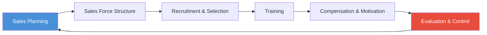
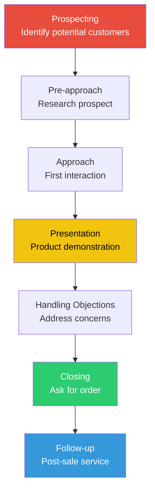
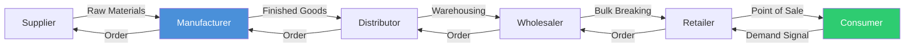

# Chapter 2: Sales Management and Distribution

## Learning Objectives

By the end of this chapter, you will be able to:
- Describe the personal selling process from prospecting to follow-up
- Identify sales forecasting methods and their appropriate use cases
- Explain sales quota types and territory management principles
- Distinguish between direct and indirect distribution channels
- Analyse intensive, selective, and exclusive distribution strategies
- Understand supply chain management, logistics, and D2C models

---

## Theory

### 2.1 Sales Management: An Overview

Sales management is the process of planning, directing, and controlling the personal selling activities of a business unit, including recruiting, selecting, training, equipping, assigning, routing, supervising, paying, and motivating the sales force.



### 2.2 The Personal Selling Process

Personal selling is face-to-face interaction with customers to present products and answer questions. It is the most effective but most expensive promotional tool.



| Step | Description | Key Activity |
|------|-------------|--------------|
| **Prospecting** | Identifying qualified potential customers | Lead generation through referrals, cold calling, databases |
| **Pre-approach** | Learning about the prospect before contact | Research needs, buying style, background |
| **Approach** | The first meeting with the prospect | Create favourable impression, establish rapport |
| **Presentation** | Demonstrating how the product solves problems | Use AIDA model (Attention, Interest, Desire, Action) |
| **Handling Objections** | Addressing doubts and resistance | Listen, acknowledge, respond with evidence |
| **Closing** | Asking for the order | Trial close, assumptive close, alternative choice close |
| **Follow-up** | Ensuring satisfaction after purchase | Check delivery, address issues, build long-term relationship |

#### Prospecting Methods

| Method | Description | Best For |
|--------|-------------|----------|
| Referrals | Existing customers recommend others | High conversion, trusted leads |
| Cold Calling | Contacting strangers without prior contact | Low conversion, high volume needed |
| Networking | Events, trade shows, conferences | B2B, relationship-based sales |
| Social Selling | LinkedIn, Twitter, professional platforms | Modern, scalable |
| Database Mining | Analysing existing data for leads | Data-rich organisations |

#### AIDA Model for Presentations

The AIDA model describes the stages a customer goes through during a sales presentation:

- **Attention** — Grab the prospect's attention (opening statement, question, demonstration)
- **Interest** — Build interest by highlighting relevant benefits
- **Desire** — Create desire by showing how the product solves specific needs
- **Action** — Motivate the prospect to take action (buy, sign up, commit)

### 2.3 Sales Forecasting

Sales forecasting estimates future sales over a specific period. It is essential for production planning, inventory management, budgeting, and setting sales targets.

#### Forecasting Methods

| Method | Type | Description | Example |
|--------|------|-------------|---------|
| **Sales Force Composite** | Subjective | Salespeople estimate their own territories | "I expect to sell 500 units next quarter" |
| **Jury of Executive Opinion** | Subjective | Top executives estimate based on experience | Panel of VPs gives consensus |
| **Delphi Method** | Subjective | Repeated rounds of expert estimates with feedback | Anonymised expert panel |
| **Time Series Analysis** | Quantitative | Using historical data to project future | Moving averages, exponential smoothing |
| **Regression Analysis** | Quantitative | Relating sales to independent variables | "Sales = a + b × Advertising spend" |
| **Market Test** | Quantitative | Test product in limited market to gauge demand | Test launch in one city |

```typescript
// TypeScript: Moving Average Sales Forecaster
class SalesForecaster {
  /**
   * Computes n-period simple moving average forecast
   */
  static movingAverage(historicalData: number[], periods: number): number {
    if (historicalData.length < periods) throw new Error("Insufficient data");
    const recent = historicalData.slice(-periods);
    return recent.reduce((sum, val) => sum + val, 0) / periods;
  }

  /**
   * Computes weighted moving average (more weight to recent periods)
   */
  static weightedMovingAverage(historicalData: number[], weights: number[]): number {
    if (historicalData.length < weights.length) throw new Error("Insufficient data");
    const recent = historicalData.slice(-weights.length);
    const totalWeight = weights.reduce((a, b) => a + b, 0);
    return recent.reduce((sum, val, i) => sum + val * weights[i], 0) / totalWeight;
  }

  /**
   * Computes exponential smoothing forecast
   */
  static exponentialSmoothing(data: number[], alpha: number): number[] {
    const forecast: number[] = [data[0]]; // initialise with first value
    for (let i = 1; i < data.length; i++) {
      forecast.push(alpha * data[i - 1] + (1 - alpha) * forecast[i - 1]);
    }
    return forecast;
  }
}

// Example usage
const monthlySales = [120, 135, 128, 145, 140, 150];
console.log("3-Month MA:", SalesForecaster.movingAverage(monthlySales, 3));
// (145 + 140 + 150) / 3 = 145

const weights = [0.5, 0.3, 0.2];
console.log("Weighted 3-Month MA:", SalesForecaster.weightedMovingAverage(monthlySales, weights));
// (150 × 0.5 + 140 × 0.3 + 145 × 0.2) / 1.0 = 146

const smoothed = SalesForecaster.exponentialSmoothing(monthlySales, 0.3);
console.log("Exponential Smoothing:", smoothed);
// [120, 120, 124.5, 125.55, 131.39, 133.97]
```

### 2.4 Sales Quotas

A sales quota is the performance goal assigned to a salesperson, territory, or branch for a specific period.

#### Types of Sales Quotas

| Quota Type | Description | Example |
|------------|-------------|---------|
| **Volume Quota** | Unit sales or revenue target | Sell 1,000 units this quarter |
| **Profit Quota** | Gross margin or net profit target | Achieve ₹5 lakh gross margin |
| **Activity Quota** | Specific selling activities | Make 50 calls, 20 demos per week |
| **Combination Quota** | Mix of multiple quota types | Volume + profit + activity |

### 2.5 Territory Management

A sales territory is a group of customers or a geographic area assigned to a salesperson.

**Steps in territory management:**
1. Define territory boundaries (geographic, industry, account size)
2. Analyse territory potential (market size, competition)
3. Assign salespeople (match skills to territory needs)
4. Establish call frequency norms (A-customers: monthly, B-customers: quarterly)
5. Route planning (minimise travel time, maximise selling time)

### 2.6 Distribution Channels

A distribution channel is a set of interdependent organisations involved in making a product available for consumption.

```mermaid
flowchart TD
    subgraph "Direct Channel"
        M1[Manufacturer] --> C1[Consumer]
    end
    subgraph "Indirect - 1 Level"
        M2[Manufacturer] --> R2[Retailer] --> C2[Consumer]
    end
    subgraph "Indirect - 2 Level"
        M3[Manufacturer] --> W3[Wholesaler] --> R3[Retailer] --> C3[Consumer]
    end
    subgraph "Indirect - 3 Level"
        M4[Manufacturer] --> A4[Agent] --> W4[Wholesaler] --> R4[Retailer] --> C4[Consumer]
    end
    style M1 fill:#e74c3c,color:#fff
    style M2 fill:#e74c3c,color:#fff
    style M3 fill:#e74c3c,color:#fff
    style M4 fill:#e74c3c,color:#fff
```



#### Channel Levels

| Level | Participants | When Used |
|-------|-------------|-----------|
| **Zero-level (Direct)** | Manufacturer → Consumer | D2C brands, online sales, services |
| **One-level** | Manufacturer → Retailer → Consumer | Large retailers, exclusive stores |
| **Two-level** | Manufacturer → Wholesaler → Retailer → Consumer | Fast-moving consumer goods (FMCG) |
| **Three-level** | Manufacturer → Agent → Wholesaler → Retailer → Consumer | Fragmented markets, small producers |

### 2.7 Distribution Intensity

Intensity refers to the number of intermediaries used at each channel level.

| Strategy | Number of Outlets | Characteristics | Examples |
|----------|-------------------|-----------------|----------|
| **Intensive Distribution** | Maximum outlets | Convenience goods, low involvement | Soft drinks, toothpaste, soaps |
| **Selective Distribution** | Moderate outlets | Shopping goods, moderate involvement | Electronic appliances, apparel |
| **Exclusive Distribution** | Few outlets | Specialty goods, high involvement, brand image | Luxury cars, high-end perfumes |

```typescript
// TypeScript: Distribution Strategy Recommender
type DistributionIntensity = "Intensive" | "Selective" | "Exclusive";

interface ProductAttributes {
  pricePoint: "low" | "medium" | "high" | "luxury";
  purchaseFrequency: "daily" | "weekly" | "monthly" | "yearly" | "once";
  customerEffort: "low" | "medium" | "high";
  brandImage: "commodity" | "standard" | "premium" | "luxury";
}

function recommendDistribution(product: ProductAttributes): DistributionIntensity {
  if (product.pricePoint === "luxury" || product.brandImage === "luxury") return "Exclusive";
  if (product.pricePoint === "high" || product.brandImage === "premium") return "Selective";
  if (product.purchaseFrequency === "daily" && product.customerEffort === "low") return "Intensive";
  return "Selective";
}

const toothpaste: ProductAttributes = {
  pricePoint: "low", purchaseFrequency: "daily",
  customerEffort: "low", brandImage: "commodity",
};
console.log("Toothpaste:", recommendDistribution(toothpaste)); // Intensive

const luxuryWatch: ProductAttributes = {
  pricePoint: "luxury", purchaseFrequency: "yearly",
  customerEffort: "high", brandImage: "luxury",
};
console.log("Luxury Watch:", recommendDistribution(luxuryWatch)); // Exclusive
```

### 2.8 Supply Chain Management (SCM)

SCM is the management of upstream and downstream value-added flows of materials, final goods, and related information among suppliers, the company, resellers, and final consumers.



#### Key SCM Activities

| Activity | Description | Technology Used |
|----------|-------------|-----------------|
| **Procurement** | Sourcing raw materials from suppliers | ERP, vendor portals |
| **Inventory Management** | Balancing stock levels with demand | Just-in-Time (JIT), EOQ model |
| **Warehousing** | Storage and movement of goods | WMS (Warehouse Management System) |
| **Transportation** | Movement of goods across locations | TMS (Transport Management System) |
| **Order Fulfilment** | Processing and delivering customer orders | Automated picking, tracking |
| **Returns Management** | Handling reverse logistics | RMAS (Returns Management) |

#### Economic Order Quantity (EOQ)

EOQ is the optimal order quantity that minimises total inventory costs.

```
EOQ = √(2DS / H)

Where:
D = Annual demand (units)
S = Ordering cost per order
H = Holding cost per unit per year
```

```typescript
// TypeScript: EOQ Calculator
function calculateEOQ(annualDemand: number, orderingCost: number, holdingCost: number): number {
  return Math.sqrt((2 * annualDemand * orderingCost) / holdingCost);
}

function totalInventoryCost(annualDemand: number, orderingCost: number, holdingCost: number, orderQty: number): number {
  const annualOrderingCost = (annualDemand / orderQty) * orderingCost;
  const annualHoldingCost = (orderQty / 2) * holdingCost;
  return annualOrderingCost + annualHoldingCost;
}

const D = 12000; // units per year
const S = 500;   // cost per order
const H = 60;    // holding cost per unit per year

const eoq = calculateEOQ(D, S, H);
console.log("EOQ:", Math.round(eoq), "units"); // EOQ: 447 units
console.log("Total Cost at EOQ:", Math.round(totalInventoryCost(D, S, H, eoq))); // ~26833

// Compare with ordering 1000 units at a time
console.log("Cost at 1000 units:", Math.round(totalInventoryCost(D, S, H, 1000))); // ~36000
```

### 2.9 E-Commerce and D2C Distribution

Direct-to-Consumer (D2C) brands bypass traditional intermediaries, selling directly to customers through digital channels.

| Channel Type | Examples | Characteristics |
|-------------|----------|-----------------|
| **Marketplace** | Amazon, Flipkart, Myntra | Platform connects buyers and sellers |
| **D2C Website** | boAt, Mamaearth, Wakefit | Brand-owned, full margin control |
| **Social Commerce** | Instagram Shops, Facebook Marketplace | Selling through social platforms |
| **Omni-channel** | Tata Cliq, Reliance Digital | Integrated online + offline experience |

**Advantages of D2C:**
- Higher margins (no intermediary cuts)
- Direct customer data and insights
- Full control over brand experience
- Faster feedback loop for product improvements

**Challenges of D2C:**
- Customer acquisition costs (CAC) can be high
- Logistics and fulfilment complexity
- Building trust without retail presence
- Returns management

### 2.10 Logistics and Physical Distribution

Logistics involves planning, implementing, and controlling the physical flow of goods, services, and information from point of origin to point of consumption.

**Logistics functions:**
- **Transportation** — Mode selection (road, rail, air, water, pipeline)
- **Warehousing** — Storage, cross-docking, consolidation
- **Inventory management** — Stock optimisation, safety stock
- **Order processing** — Order entry, picking, packing, shipping
- **Material handling** — Movement of goods within warehouse
- **Packaging** — Protective packaging for transit

#### Transportation Mode Comparison

| Mode | Speed | Cost | Capacity | Best For |
|------|-------|------|----------|----------|
| **Road** | Moderate | Moderate | Medium | Short-haul, door-to-door |
| **Rail** | Slow | Low | Very High | Bulk goods, long distance |
| **Air** | Fastest | Highest | Low | Perishable, high-value, urgent |
| **Water** | Slowest | Lowest | Highest | International bulk cargo |
| **Pipeline** | Continuous | Low | Continuous | Oil, gas, chemicals |

---

## Examples: 20 Solved MCQs

### Example 1: Sales Process

**Q1.** The correct sequence of steps in the personal selling process is:

a) Prospecting → Pre-approach → Approach → Presentation → Closing → Handling objections → Follow-up
b) Prospecting → Pre-approach → Approach → Presentation → Handling objections → Closing → Follow-up
c) Pre-approach → Prospecting → Approach → Presentation → Handling objections → Closing → Follow-up
d) Prospecting → Approach → Pre-approach → Presentation → Handling objections → Closing → Follow-up

<details>
<summary>Answer</summary>
**b) Prospecting → Pre-approach → Approach → Presentation → Handling objections → Closing → Follow-up.** Objections must be handled BEFORE closing, not after. Understanding the correct sequence is critical for exam questions.
</details>

---

**Q2.** In the AIDA model, what does the "I" stand for?

a) Integration
b) Interest
c) Interaction
d) Information

<details>
<summary>Answer</summary>
**b) Interest.** AIDA stands for Attention, Interest, Desire, Action. After gaining attention, the salesperson must build interest in the product by highlighting relevant benefits.
</details>

---

### Example 2: Prospecting

**Q3.** Which prospecting method typically has the highest conversion rate?

a) Cold calling
b) Email blasts
c) Customer referrals
d) Mass advertising

<details>
<summary>Answer</summary>
**c) Customer referrals.** Referred leads convert at a much higher rate because they come with built-in trust from the existing customer relationship. Cold calling has the lowest conversion rate.
</details>

---

**Q4.** A salesperson researches a prospect's company background, needs, and buying style before making contact. This step is called:

a) Prospecting
b) Pre-approach
c) Approach
d) Presentation

<details>
<summary>Answer</summary>
**b) Pre-approach.** The pre-approach step involves learning as much as possible about the prospect (needs, interests, buying style) before the first meeting. This helps tailor the approach.
</details>

---

### Example 3: Sales Forecasting

**Q5.** Which sales forecasting method involves obtaining estimates from a panel of experts with anonymous feedback?

a) Sales force composite
b) Jury of executive opinion
c) Delphi method
d) Time series analysis

```typescript
// TypeScript: Delphi Method Simulator
class DelphiForecaster {
  private experts: number[] = [];
  private rounds: number;

  constructor(expertCount: number, rounds: number = 3) {
    this.experts = new Array(expertCount).fill(0);
    this.rounds = rounds;
  }

  simulate(actualDemand: number, noiseLevel: number = 0.2): number[] {
    const estimates: number[] = [];
    let consensus = actualDemand * (1 + (Math.random() - 0.5) * noiseLevel);

    for (let round = 0; round < this.rounds; round++) {
      // Each expert provides estimate influenced by consensus
      const roundEstimates = this.experts.map(() =>
        consensus * (1 + (Math.random() - 0.5) * noiseLevel * (1 - round * 0.2))
      );
      consensus = roundEstimates.reduce((a, b) => a + b, 0) / roundEstimates.length;
      estimates.push(Math.round(consensus));
    }
    return estimates;
  }
}

const delphi = new DelphiForecaster(5, 4);
const roundResults = delphi.simulate(10000);
console.log("Delphi convergence:", roundResults);
// Output: [10234, 10112, 10056, 10023] (converges towards actual)
```

<details>
<summary>Answer</summary>
**c) Delphi method.** The Delphi method uses multiple rounds of anonymous expert estimates, with each round sharing summary statistics to build consensus without groupthink or dominance by strong personalities.
</details>

---

**Q6.** A company uses last year's sales of ₹50 lakh and advertising spend of ₹10 lakh to predict this year's sales. The relationship is Sales = 20 + 3 × Advertising. What is the forecasted sales?

a) ₹20 lakh
b) ₹30 lakh
c) ₹50 lakh
d) ₹80 lakh

<details>
<summary>Answer</summary>
**c) ₹50 lakh.** Sales = 20 + 3 × 10 = 20 + 30 = ₹50 lakh. This is a regression-based forecast where advertising spend is the independent variable.
</details>

---

**Q7.** Which forecasting method is most appropriate for a NEW product with no historical data?

a) Time series analysis
b) Regression analysis
c) Market test
d) Moving average

<details>
<summary>Answer</summary>
**c) Market test.** When no historical data exists, a market test (launching the product in a limited area) is most appropriate. Time series, regression, and moving averages all require historical data.
</details>

---

### Example 4: Sales Quotas

**Q8.** A quota that requires a salesperson to perform 30 demonstrations per week is an example of:

a) Volume quota
b) Profit quota
c) Activity quota
d) Combination quota

<details>
<summary>Answer</summary>
**c) Activity quota.** Activity quotas measure specific selling activities (calls, demos, proposals) rather than outcome metrics (revenue, profit). They are useful for new salespeople building their pipeline.
</details>

---

**Q9.** Setting sales targets higher than what most salespeople can achieve to motivate maximum effort is called:

a) Reasonable quota
b) Stretch quota
c) Minimum quota
d) Team quota

<details>
<summary>Answer</summary>
**b) Stretch quota.** A stretch quota is set deliberately higher than achievable targets to motivate salespeople to push beyond their comfort zone. It is often accompanied by bonus incentives.
</details>

---

### Example 5: Distribution Channels

**Q10.** Which distribution channel involves no intermediaries?

a) One-level channel
b) Two-level channel
c) Zero-level channel
d) Three-level channel

<details>
<summary>Answer</summary>
**c) Zero-level channel (Direct marketing).** Zero-level channel means the manufacturer sells directly to the consumer without intermediaries. Examples include online D2C brands and company-owned stores.
</details>

---

**Q11.** A manufacturer selling to a wholesaler, who sells to a retailer, who sells to the consumer is an example of:

a) One-level channel
b) Two-level channel
c) Three-level channel
d) Zero-level channel

<details>
<summary>Answer</summary>
**b) Two-level channel.** Manufacturer → Wholesaler → Retailer → Consumer: two intermediaries (wholesaler and retailer) between manufacturer and consumer.
</details>

---

### Example 6: Distribution Intensity

**Q12.** Luxury car manufacturers use which distribution intensity strategy?

a) Intensive
b) Selective
c) Exclusive
d) Mass

<details>
<summary>Answer</summary>
**c) Exclusive distribution.** Luxury car makers use exclusive distribution — very few dealerships in a region — to maintain brand prestige, provide personalised service, and control the customer experience.
</details>

---

**Q13.** Soft drinks are typically distributed using which intensity strategy?

a) Intensive distribution
b) Selective distribution
c) Exclusive distribution
d) Restricted distribution

<details>
<summary>Answer</summary>
**a) Intensive distribution.** Soft drinks are convenience goods that consumers buy frequently with minimal effort. They need to be available in every possible outlet — intensive distribution.
</details>

---

**Q14.** Electronic appliances like washing machines are usually distributed through:

a) Intensive distribution
b) Selective distribution
c) Exclusive distribution
d) Random distribution

<details>
<summary>Answer</summary>
**b) Selective distribution.** Washing machines are shopping goods. Consumers compare options and need some assistance. Selective distribution uses a moderate number of outlets, typically speciality stores and multi-brand outlets.
</details>

---

### Example 7: Supply Chain & Inventory

**Q15.** The EOQ model determines:

a) The maximum price a customer will pay
b) The optimal order quantity minimising total inventory costs
c) The number of salespeople needed
d) The best advertising medium

```typescript
// TypeScript: EOQ with Quantity Discounts
interface DiscountTier {
  minQty: number;
  unitPrice: number;
}

function eoqWithDiscounts(
  annualDemand: number,
  orderingCost: number,
  holdingCostPercent: number,
  discounts: DiscountTier[]
): { orderQty: number; totalCost: number; unitPrice: number } {
  let best = { orderQty: 0, totalCost: Infinity, unitPrice: 0 };

  for (const tier of discounts) {
    const holdingCost = tier.unitPrice * holdingCostPercent;
    const eoq = Math.sqrt((2 * annualDemand * orderingCost) / holdingCost);

    // Adjust qty to meet minimum for this tier
    const orderQty = Math.max(eoq, tier.minQty);

    const purchaseCost = annualDemand * tier.unitPrice;
    const annualOrderCost = (annualDemand / orderQty) * orderingCost;
    const annualHoldingCost = (orderQty / 2) * holdingCost;
    const totalCost = purchaseCost + annualOrderCost + annualHoldingCost;

    if (totalCost < best.totalCost) {
      best = { orderQty: Math.round(orderQty), totalCost: Math.round(totalCost), unitPrice: tier.unitPrice };
    }
  }
  return best;
}

const discounts: DiscountTier[] = [
  { minQty: 0, unitPrice: 100 },
  { minQty: 500, unitPrice: 92 },
  { minQty: 1000, unitPrice: 85 },
];
const result = eoqWithDiscounts(10000, 300, 0.2, discounts);
console.log(`Order ${result.orderQty} units at ₹${result.unitPrice} each — Total: ₹${result.totalCost}`);
```

<details>
<summary>Answer</summary>
**b) The optimal order quantity minimising total inventory costs.** EOQ (Economic Order Quantity) balances ordering costs and holding costs to find the most cost-effective order quantity. Formula: √(2DS/H).
</details>

---

**Q16.** Just-in-Time (JIT) inventory system aims to:

a) Maintain large safety stocks
b) Reduce inventory to near-zero levels
c) Increase warehouse space
d) Slow down production

<details>
<summary>Answer</summary>
**b) Reduce inventory to near-zero levels.** JIT aims to minimise inventory by receiving goods only as they are needed in the production process. It reduces holding costs but requires reliable suppliers.
</details>

---

### Example 8: Logistics & Transportation

**Q17.** Which mode of transportation is most suitable for transporting crude oil from the Middle East to India?

a) Road
b) Rail
c) Air
d) Water

<details>
<summary>Answer</summary>
**d) Water (sea).** For bulk commodities like crude oil over long distances, water transport (tankers) is the most economical. Air is too expensive, and road/rail are impractical for cross-ocean shipment.
</details>

---

**Q18.** Cross-docking in warehousing means:

a) Storing goods for extended periods
b) Transferring incoming shipments directly to outgoing trucks without storage
c) Doubling the warehouse capacity
d) Inspecting goods before storage

<details>
<summary>Answer</summary>
**b) Transferring incoming shipments directly to outgoing trucks without storage.** Cross-docking minimises storage time and handling costs by immediately sorting and transferring goods from inbound to outbound vehicles.
</details>

---

### Example 9: D2C and E-Commerce

**Q19.** Which of the following is an advantage of the D2C (Direct-to-Consumer) model?

a) Lower customer acquisition costs
b) Higher margin as intermediaries are eliminated
c) Simplified logistics
d) Immediate brand recognition

<details>
<summary>Answer</summary>
**b) Higher margin as intermediaries are eliminated.** D2C brands bypass wholesalers and retailers, capturing the margin that would go to intermediaries. However, CAC can be high, and logistics can be complex.
</details>

---

**Q20.** An omni-channel retail strategy means:

a) Selling only through online channels
b) Selling only through physical stores
c) Integrating online and offline channels seamlessly
d) Using a single distribution channel

<details>
<summary>Answer</summary>
**c) Integrating online and offline channels seamlessly.** Omni-channel retail provides a unified customer experience across all channels — buy online, pick up in store; browse in store, order online for home delivery; etc.
</details>

---

## Summary

- The **personal selling process** has 7 steps: prospecting, pre-approach, approach, presentation, handling objections, closing, and follow-up
- **Sales forecasting methods** include subjective (Delphi, jury, sales force composite) and quantitative (time series, regression, market test)
- **Sales quotas** can be volume-based, profit-based, activity-based, or combination
- **Territory management** involves defining boundaries, analysing potential, assigning salespeople, and planning routes
- **Distribution channels** range from zero-level (direct) to three-level (agent + wholesaler + retailer)
- **Distribution intensity** varies from intensive (maximising outlets) through selective to exclusive (minimising outlets)
- **Supply chain management** coordinates the flow of materials, goods, and information from suppliers to consumers
- **EOQ** is the order quantity that minimises total inventory costs (ordering + holding)
- **D2C models** bypass intermediaries for higher margins and direct customer relationships
- **Logistics** includes transportation, warehousing, inventory management, order processing, and material handling

## Practical Takeaways

1. **For exams**: Memorise the 7-step selling process sequence and the three intensity strategies with examples
2. **For interviews**: Be prepared to explain a sales situation using the AIDA model
3. **For business**: Use the EOQ formula to optimise inventory — it directly impacts cash flow and profitability
4. **For channel strategy**: Match distribution intensity to product type (intensive for convenience, selective for shopping, exclusive for specialty goods)
5. **For SCM**: Focus on the "total cost" approach — cheap transportation may lead to higher inventory costs

## Chapter Quiz

1. Which step in the personal selling process involves learning about the prospect before the first meeting?
   - A) Prospecting
   - B) Pre-approach
   - C) Approach
   - D) Presentation

<details>
<summary>Answer</summary>
**B) Pre-approach.** Researching the prospect's background, needs, and buying style before making contact defines the pre-approach step.
</details>

2. A company uses anonymous expert panels with multiple feedback rounds for sales forecasting. This is the:
   - A) Sales force composite
   - B) Jury of executive opinion
   - C) Delphi method
   - D) Time series method

<details>
<summary>Answer</summary>
**C) Delphi method.** The Delphi method uses multiple rounds of anonymous expert estimates with shared feedback to reach consensus.
</details>

3. Which distribution intensity is appropriate for a premium luxury watch brand?
   - A) Intensive
   - B) Selective
   - C) Exclusive
   - D) Mass

<details>
<summary>Answer</summary>
**C) Exclusive.** Luxury brands use exclusive distribution to maintain prestige and control the customer experience.
</details>

4. The EOQ formula is used to:
   - A) Calculate sales commission
   - B) Determine optimal inventory order quantity
   - C) Forecast market demand
   - D) Set product prices

<details>
<summary>Answer</summary>
**B) Determine optimal inventory order quantity.** EOQ = √(2DS/H) balances ordering and holding costs.
</details>

5. A channel with Manufacturer → Agent → Wholesaler → Retailer → Consumer has how many levels?
   - A) One-level
   - B) Two-level
   - C) Three-level
   - D) Four-level

<details>
<summary>Answer</summary>
**C) Three-level.** The three intermediaries are Agent, Wholesaler, and Retailer. Channel levels count the number of intermediaries.
</details>

## Exercises

### Section A: Conceptual Questions (Q1–Q10)

1. List and explain the seven steps of the personal selling process in sequence.
2. What is the difference between a sales quota and a sales forecast?
3. Explain the AIDA model with a practical example.
4. Distinguish between intensive, selective, and exclusive distribution with product examples for each.
5. What are the advantages and disadvantages of a direct (zero-level) distribution channel?
6. Explain the Delphi method of sales forecasting. Why is anonymity important?
7. What is territory management? Why is it important in sales management?
8. Define logistics and list its key functions.
9. What is the difference between a wholesaler and an agent in distribution?
10. Explain the concept of "total cost approach" in logistics management.

### Section B: Application Problems (Q11–Q20)

11. A company has annual demand of 24,000 units, ordering cost of ₹400 per order, and holding cost of ₹80 per unit per year. Calculate the EOQ and total inventory cost at EOQ.
12. Monthly sales data for six months: Jan (200), Feb (220), Mar (210), Apr (240), May (230), Jun (250). Forecast July sales using 3-month moving average and exponential smoothing (α = 0.4).
13. A pharma company uses a distribution channel: Manufacturer → Stockist → Wholesaler → Retailer → Consumer. Identify the number of levels and suggest how to shorten the channel.
14. A startup is launching premium organic snacks. Recommend a distribution strategy and justify.
15. A salesperson has 120 A-customers (visit monthly), 200 B-customers (visit quarterly), and 400 C-customers (visit half-yearly). How many sales calls per year? If a salesperson makes 20 calls per week (48 working weeks), how many salespeople are needed?
16. An FMCG company is launching a new soap. Should it use intensive, selective, or exclusive distribution? Why?
17. A furniture manufacturer uses the regression equation Sales = 50 + 4 × Advertising (₹ lakh). If advertising spend is ₹15 lakh, what is the forecasted sales?
18. Compare the cost, speed, and capacity of road, rail, air, and water transportation for a cement company shipping from plant to 500 km away.
19. A D2C apparel brand wants to expand to offline retail. What channel strategy would you recommend?
20. A salesperson has a volume quota of ₹20 lakh per quarter and an activity quota of 100 calls per month. Suggest a weekly plan.

### Section C: Advanced Questions (Q21–Q30)

21. Design a complete distribution strategy for a company launching home care products across rural India, considering infrastructure challenges.
22. "The shortest channel is not always the most efficient." Explain with examples.
23. A manufacturer currently uses Manufacturer → Wholesaler → Retailer → Consumer. They are considering Manufacturer → Consumer (D2C). Analyse the trade-offs.
24. How does e-commerce affect traditional distribution channels? Discuss disintermediation with examples.
25. A company has 10 sales territories. One territory generates 30% of total revenue but has the lowest customer satisfaction. Diagnose and recommend solutions.
26. Explain the concept of "channel conflict." When does it occur and how can it be resolved?
27. A company uses EOQ but faces stockouts during peak season. Should they maintain safety stock? How much?
28. Compare the traditional supply chain with a demand-driven supply chain. Which is more suitable for fast fashion?
29. An organic food brand uses farmers' markets, a website, and Amazon. Identify the channel strategy and suggest improvements.
30. A B2B software company sells through a direct sales force and channel partners. How should they manage channel conflict?

### Answer Key

| Q | Ans | Key Explanation |
|---|-----|-----------------|
| 1 | Prospecting → Pre-approach → Approach → Presentation → Handling objections → Closing → Follow-up | 7-step process |
| 2 | Forecast projects future sales; quota is the target/goal assigned | Forecast informs quota |
| 3 | AIDA: Attention, Interest, Desire, Action | Sales presentation framework |
| 4 | Intensive (soap), Selective (TV), Exclusive (Rolex) | Based on customer effort and price |
| 5 | Advantages: full margin, direct data; Disadvantages: high CAC, logistics complexity | Trade-off analysis |
| 6 | Anonymous rounds prevent groupthink and dominance | Convergence toward actual |
| 7 | Assigning geographic/account boundaries to salespeople | Improves coverage and accountability |
| 8 | 5 functions: Transport, Warehousing, Inventory, Order processing, Material handling | Physical distribution management |
| 9 | Wholesaler takes title to goods; Agent does not take title | Agent earns commission |
| 10 | Minimising total logistics cost, not just one component | Transportation + inventory + warehousing |
| 11 | EOQ = √(2×24000×400/80) = 490 units. TC = 24000/490×400 + 490/2×80 = ₹39,184 | JIT reduces inventory |
| 12 | 3-MA = (240+230+250)/3 = 240. ES: 250×0.4 + 240×0.6 = 244 | July forecasts |
| 13 | 3-level channel. Shorten by removing stockist | Channel rationalisation |
| 14 | Selective distribution — premium product needs curated outlets | Not mass market, not exclusive |
| 15 | Calls/year = 120×12 + 200×4 + 400×2 = 3,040. Salespeople = 3,040/(20×48) = 3.17 ≈ 4 | Territory workload calculation |
| 16 | Intensive — soap is a low-involvement convenience good | Maximum availability needed |
| 17 | Sales = 50 + 4×15 = ₹110 lakh | Simple linear regression |
| 18 | Rail best for 500 km bulk cement (low cost, adequate speed) | Mode selection by distance and weight |
| 19 | Selective distribution in premium malls, maintain D2C website | Omnichannel strategy |
| 20 | Weekly: ₹5 lakh revenue + 25 calls. A-customers get priority | Break down quota to daily/weekly |
| 21 | Use distributor + rural wholesaler + local retailer. Partner with FMCG distribution networks | Rural strategy |
| 22 | Direct may be costly per customer; intermediaries add efficiency for small orders | Channel economies |
| 23 | D2C: higher margin, better data, but logistics cost and brand awareness challenges | Channel trade-off analysis |
| 24 | E-commerce enables disintermediation (removing middlemen) | Example: Books (Amazon vs traditional) |
| 25 | High-revenue territory may be under-served. Add salesperson or restructure | Territory imbalance |
| 26 | Channel conflict: when one channel cannibalises another. Resolve through clear roles | Multi-channel management |
| 27 | Yes, safety stock = Z × σ × √L (Z = service level factor, σ = demand variability, L = lead time) | Buffer against uncertainty |
| 28 | Demand-driven (pull) is better for fast fashion — responds to trends | Push vs pull supply chain |
| 29 | Multi-channel: farmers' markets (direct), website (D2C), Amazon (marketplace) | Omnichannel with distinct roles |
| 30 | Define lead ownership rules, non-compete clauses, joint incentive programmes | Channel conflict resolution |
