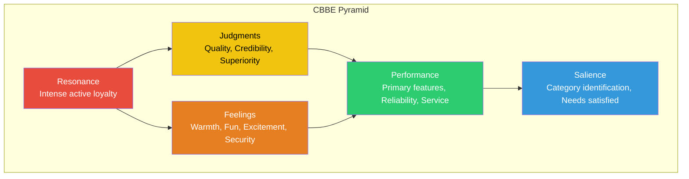
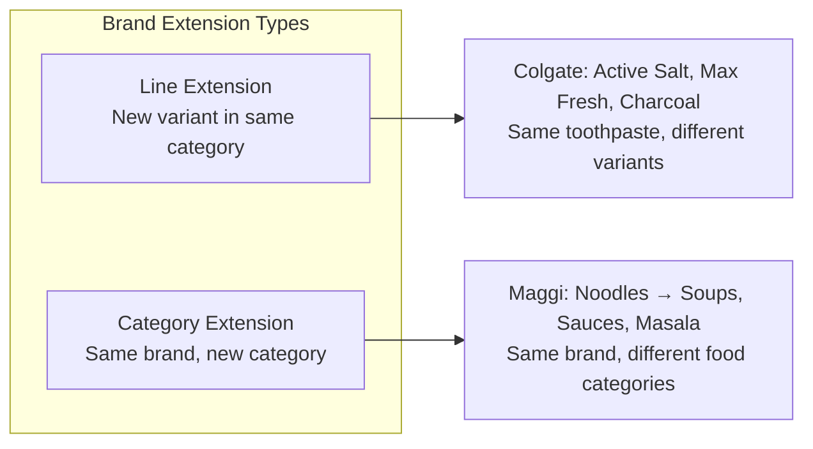
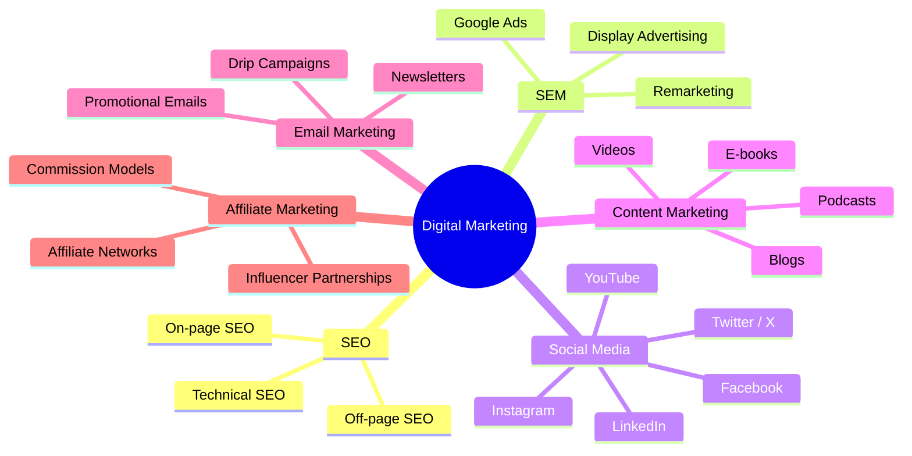
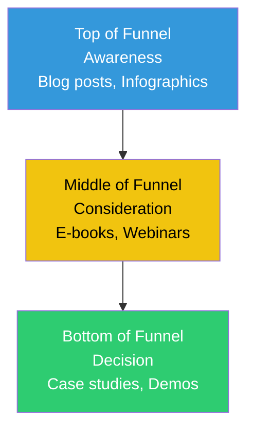

# Chapter 3: Brand Management and Digital Marketing

## Learning Objectives

By the end of this chapter, you will be able to:
- Define brand identity, brand image, brand equity, and brand loyalty
- Explain Keller's Customer-Based Brand Equity (CBBE) model
- Describe brand positioning, brand extensions, and co-branding strategies
- Compare digital marketing channels: SEO, SEM, social media, content, email, affiliate, and influencer marketing
- Understand CRM concepts including customer retention, loyalty programmes, and technology

---

## Theory

### 3.1 Understanding Brands

A **brand** is a name, term, sign, symbol, or design — or a combination of these — intended to identify the goods or services of one seller and differentiate them from competitors.

#### Key Brand Concepts

| Concept | Definition | Example |
|---------|------------|---------|
| **Brand Name** | The part of a brand that can be spoken | "Apple," "Tata" |
| **Brand Mark** | The visual element of a brand | Apple's bitten apple logo |
| **Brand Identity** | How the company wants the brand to be perceived | Apple identity: minimalist, innovative |
| **Brand Image** | How consumers actually perceive the brand | Apple image: premium, user-friendly |
| **Brand Equity** | The added value endowed to products from the brand name | Higher price for same specs |
| **Brand Loyalty** | Consumers' commitment to repurchase the brand | iPhone users upgrading each year |
| **Brand Awareness** | The ability of consumers to recognise/recall a brand | Coca-Cola has near-100% awareness |
| **Brand Associations** | Any mental links connected to the brand | Nike = athleticism, "Just Do It" |

### 3.2 Keller's Customer-Based Brand Equity (CBBE) Model

The CBBE model views brand equity from the perspective of the consumer — the power of a brand lies in what customers have learned, felt, seen, and heard about it.



**The four levels of the CBBE pyramid:**

| Level | Stage | Description | Key Question |
|-------|-------|-------------|--------------|
| **Level 1** | Salience | How often and how easily customers think of the brand | "Who are you?" |
| **Level 2** | Performance & Imagery | What the brand stands for and its personality | "What are you?" |
| **Level 3** | Judgments & Feelings | Customers' personal opinions and emotional responses | "What about you?" |
| **Level 4** | Resonance | The ultimate relationship with the brand | "What about you and me?" |

#### Brand Resonance

Brand resonance is the highest level of brand equity where customers feel a deep, psychological bond with the brand. It has four categories:

1. **Behavioural loyalty** — Repeat purchases, frequency
2. **Attitudinal attachment** — Love for the brand, recommendation
3. **Sense of community** — Feeling of kinship with other brand users
4. **Active engagement** — Joining brand clubs, following on social media, writing reviews

### 3.3 Brand Positioning

Brand positioning is designing the brand's offer and image to occupy a distinctive place in the target market's mind.

**Positioning framework:**

| Element | Description |
|---------|-------------|
| **Target market** | Who the brand is for |
| **Point of Parity (POP)** | Attributes that are NOT unique but necessary to compete |
| **Point of Difference (POD)** | Strong, favourable, unique brand associations |
| **Brand mantra** | A short (3–5 word) internal guiding statement |

**Example — Nike:**
- Target: Athletes and active individuals
- POP: Quality athletic footwear, stylish design
- POD: "Just Do It" attitude, inspirational marketing, innovation
- Brand mantra: "Authentic athletic performance"

#### Repositioning

Repositioning is changing the brand's position in the consumer's mind. Reasons include changing market conditions, declining sales, or shifting competition.

**Examples:** Old Spice (from "old man's brand" to "young, hip"), Domino's (from "average pizza" to "quality pizza with 30-minute delivery").

### 3.4 Brand Extensions

A brand extension uses an existing brand name to launch a product in a new category.



| Factor | Line Extension | Category Extension |
|--------|---------------|--------------------|
| **Definition** | New variant in existing product category | New product in different category |
| **Risk** | Lower — familiar category | Higher — unfamiliar territory |
| **Examples** | Apple iPhone 15 → iPhone 16 | Apple iPhone → Apple Watch, AirPods |
| **Success factor** | Fit with brand identity | Perceived expertise in new category |

**Advantages:** Lower launch cost, reduced risk of failure, parent brand equity transfers.

**Disadvantages:** Brand dilution risk, cannibalisation of existing products, brand name may not fit new category.

### 3.5 Co-Branding and Licensing

| Strategy | Definition | Example |
|----------|------------|---------|
| **Co-branding** | Two established brands collaborate on a single product | Nestlé + Starbucks (at-home coffee) |
| **Ingredient branding** | One brand appears as a component in another brand's product | Intel Inside in Dell laptops |
| **Licensing** | One company permits another to use its brand for a fee | Disney characters on lunchboxes |
| **Brand alliance** | Two brands partner for marketing | Uber + Spotify (ride + music) |

### 3.6 Digital Marketing

Digital marketing is the use of electronic media (websites, social media, email, search engines) to market products and services.



#### 3.6.1 Search Engine Optimisation (SEO)

SEO is the process of optimising website content to rank higher in organic (unpaid) search results.

| Type | Description | Techniques |
|------|-------------|------------|
| **On-page SEO** | Optimising content visible to users | Keyword in title, headers, meta description, internal links |
| **Off-page SEO** | Building external signals of authority | Backlinks, social shares, guest posting |
| **Technical SEO** | Optimising backend structure | Site speed, mobile-friendliness, sitemap, robots.txt |

```typescript
// TypeScript: SEO Keyword Density Analyser
class SEOAnalyzer {
  static keywordDensity(text: string, keyword: string): number {
    const words = text.toLowerCase().split(/\s+/);
    const keywordLower = keyword.toLowerCase();
    const keywordCount = words.filter(w => w.includes(keywordLower)).length;
    return (keywordCount / words.length) * 100;
  }

  static titleTagScore(title: string, keyword: string): number {
    const k = keyword.toLowerCase();
    const t = title.toLowerCase();
    if (t.startsWith(k)) return 100; // keyword at start of title is best
    if (t.includes(k)) return 70;
    return 30;
  }

  static readabilityScore(text: string): number {
    const sentences = text.split(/[.!?]+/).filter(s => s.trim().length > 0);
    const words = text.split(/\s+/);
    const avgWordsPerSentence = words.length / sentences.length;
    // Lower avg words per sentence = more readable
    if (avgWordsPerSentence <= 15) return 90;
    if (avgWordsPerSentence <= 20) return 70;
    if (avgWordsPerSentence <= 25) return 50;
    return 30;
  }
}

const content = "Digital marketing is essential for modern businesses. Learn SEO tips and strategies.";
console.log("Density:", SEOAnalyzer.keywordDensity(content, "SEO").toFixed(1) + "%");
console.log("Title score:", SEOAnalyzer.titleTagScore("SEO Tips for Beginners", "SEO"));
console.log("Readability:", SEOAnalyzer.readabilityScore(content));
```

#### 3.6.2 Search Engine Marketing (SEM)

SEM involves paid advertising on search engines, primarily Pay-Per-Click (PPC) advertising.

| Metric | Meaning | Formula |
|--------|---------|---------|
| **CTR (Click-Through Rate)** | % of impressions that resulted in clicks | Clicks / Impressions × 100 |
| **CPC (Cost Per Click)** | Average cost per ad click | Total Cost / Clicks |
| **CPA (Cost Per Acquisition)** | Cost per desired conversion | Total Cost / Conversions |
| **Quality Score** | Google's rating of ad relevance | Based on CTR, relevance, landing page |
| **ROAS (Return on Ad Spend)** | Revenue generated per rupee spent | Revenue / Ad Spend |

```typescript
// TypeScript: SEM Campaign Analyser
interface SEMCampaign {
  impressions: number;
  clicks: number;
  conversions: number;
  totalCost: number;
  revenue: number;
}

class SEMAnalyser {
  static analyze(campaign: SEMCampaign) {
    const ctr = (campaign.clicks / campaign.impressions) * 100;
    const cpc = campaign.totalCost / campaign.clicks;
    const cpa = campaign.totalCost / campaign.conversions;
    const conversionRate = (campaign.conversions / campaign.clicks) * 100;
    const roas = campaign.revenue / campaign.totalCost;

    return {
      CTR: ctr.toFixed(2) + "%",
      CPC: "₹" + cpc.toFixed(2),
      CPA: "₹" + cpa.toFixed(2),
      conversionRate: conversionRate.toFixed(2) + "%",
      ROAS: roas.toFixed(2) + "x",
      profit: campaign.revenue - campaign.totalCost,
    };
  }
}

const campaign: SEMCampaign = {
  impressions: 50000,
  clicks: 1200,
  conversions: 80,
  totalCost: 96000,
  revenue: 320000,
};
console.log(SEMAnalyser.analyze(campaign));
// { CTR: "2.40%", CPC: "₹80.00", CPA: "₹1,200.00", conversionRate: "6.67%", ROAS: "3.33x", profit: 224000 }
```

#### 3.6.3 Social Media Marketing

| Platform | Primary Use | Content Format | Audience |
|----------|-------------|----------------|----------|
| **Facebook** | Brand awareness, community building | Images, videos, text, carousel | Wide (25–55) |
| **Instagram** | Visual storytelling, lifestyle | Photos, Stories, Reels | Younger (18–35) |
| **LinkedIn** | B2B networking, professional branding | Articles, posts, company updates | Professionals (25–65) |
| **YouTube** | Video content, tutorials | Long-form and Shorts videos | All ages |
| **Twitter/X** | News, customer service, trends | Short text posts (up to 280 chars) | News-conscious (18–50) |

**Key social media metrics:**
- **Engagement rate** — (Likes + Comments + Shares) / Followers × 100
- **Reach** — Number of unique users who saw the content
- **Impressions** — Number of times content was displayed
- **Share of voice** — Brand mentions / Total industry mentions × 100

#### 3.6.4 Content Marketing

Content marketing focuses on creating and distributing valuable, relevant, and consistent content to attract and retain a clearly defined audience.

**Content types:**
- **Blog posts/articles** — Educational content for SEO and lead generation
- **E-books/whitepapers** — In-depth content for lead capture
- **Infographics** — Visual data representation
- **Videos/webinars** — Engaging, demo-style content
- **Podcasts** — Audio content for on-the-go consumption
- **Case studies** — Real-world proof of value

**Content marketing funnel:**



#### 3.6.5 Email Marketing

Email marketing is sending commercial messages to a targeted list of subscribers.

| Type | Purpose | Best Practice |
|------|---------|---------------|
| **Welcome email** | Onboard new subscribers | Send immediately after sign-up |
| **Newsletter** | Regular updates, value addition | Weekly/monthly; useful content |
| **Promotional email** | Sales, offers, discounts | Clear CTA, limited frequency |
| **Drip campaign** | Automated sequence over time | Trigger-based (abandoned cart, birthday) |
| **Re-engagement** | Win back inactive subscribers | Last resort before removing them |

**Key metrics:** Open rate, Click-Through Rate (CTR), Bounce rate, Unsubscribe rate, Conversion rate.

#### 3.6.6 Affiliate Marketing

Affiliate marketing is a performance-based model where a company pays external partners (affiliates) a commission for driving traffic or sales.

**Commission models:**
- **Pay-per-sale** — Commission only on completed sales
- **Pay-per-lead** — Commission on qualified leads (form fills, sign-ups)
- **Pay-per-click** — Commission on clicks to merchant site

#### 3.6.7 Influencer Marketing

Influencer marketing involves partnering with individuals who have a strong social media following to promote products.

| Influencer Tier | Follower Count | Pros | Cons |
|----------------|---------------|------|------|
| **Nano** | 1K–10K | High engagement, low cost, authentic | Limited reach |
| **Micro** | 10K–100K | Niche expertise, high trust | Moderate reach |
| **Macro** | 100K–1M | Wide reach, professional quality | Lower engagement, higher cost |
| **Mega/Celebrity** | 1M+ | Massive reach, prestige | Very expensive, lower trust |

### 3.7 Customer Relationship Management (CRM)

CRM is a strategy for managing all interactions with customers, leveraging technology to organise, automate, and synchronise sales, marketing, customer service, and technical support.

```typescript
// TypeScript: CRM Customer Segmentation Engine
type CustomerSegment = "VIP" | "Loyal" | "At-Risk" | "New" | "Inactive";

interface CustomerProfile {
  id: string;
  totalSpend: number;
  purchaseFrequency: number; // purchases per year
  recency: number; // days since last purchase
  isActive: boolean;
}

class CRMSegmenter {
  static segment(customer: CustomerProfile): CustomerSegment {
    if (!customer.isActive) return "Inactive";
    if (customer.totalSpend > 50000 && customer.purchaseFrequency > 6) return "VIP";
    if (customer.purchaseFrequency > 4 && customer.recency < 60) return "Loyal";
    if (customer.recency > 180) return "At-Risk";
    if (customer.purchaseFrequency <= 2 && customer.totalSpend < 5000) return "New";
    return "Loyal";
  }

  static segmentReport(customers: CustomerProfile[]): Record<CustomerSegment, number> {
    const report: Record<string, number> = { VIP: 0, Loyal: 0, "At-Risk": 0, New: 0, Inactive: 0 };
    for (const c of customers) {
      report[this.segment(c)]++;
    }
    return report;
  }
}

const customers: CustomerProfile[] = [
  { id: "C001", totalSpend: 120000, purchaseFrequency: 8, recency: 15, isActive: true },
  { id: "C002", totalSpend: 3000, purchaseFrequency: 1, recency: 200, isActive: true },
  { id: "C003", totalSpend: 60000, purchaseFrequency: 5, recency: 30, isActive: true },
  { id: "C004", totalSpend: 500, purchaseFrequency: 1, recency: 90, isActive: false },
];
console.log(CRMSegmenter.segmentReport(customers));
// { VIP: 1, Loyal: 1, At-Risk: 0, New: 1, Inactive: 1 }
```

#### CRM Technologies

| Technology | Function | Examples |
|------------|----------|----------|
| **CRM Software** | Centralising customer data | Salesforce, HubSpot, Zoho |
| **Marketing Automation** | Automating repetitive marketing tasks | Marketo, Mailchimp, Pardot |
| **Customer Service Platforms** | Managing support tickets | Zendesk, Freshdesk, ServiceNow |
| **Analytics** | Customer data analysis and insights | Google Analytics, Mixpanel |

#### Customer Retention vs Acquisition

| Metric | Acquisition | Retention |
|--------|-------------|-----------|
| **Cost** | 5–7× more expensive | Lower cost |
| **Probability of sale** | 5–20% for new | 60–70% for existing |
| **Profit increase** | 10% new customers | 25–95% from 5% retention increase |
| **Loyalty effect** | Short-term | Long-term |

---

## Examples: 20 Solved MCQs

### Example 1: Brand Concepts

**Q1.** The added value endowed to products and services as a result of the brand name is called:

a) Brand awareness
b) Brand equity
c) Brand loyalty
d) Brand identity

<details>
<summary>Answer</summary>
**b) Brand equity.** Brand equity is the marketing and financial value that a brand adds to a product. Consumers are willing to pay more for a branded product (e.g., branded aspirin costs more than generic but has the same chemical composition).
</details>

---

**Q2.** "How consumers actually perceive a brand" is called:

a) Brand identity
b) Brand image
c) Brand mark
d) Brand name

<details>
<summary>Answer</summary>
**b) Brand image.** Brand image is consumers' actual perception of the brand. Brand identity (in contrast) is how the company wants the brand to be perceived. Image is reality; identity is aspiration.
</details>

---

### Example 2: CBBE Model

**Q3.** Which level of the CBBE pyramid directly deals with the customer's feeling of kinship or community with other brand users?

a) Salience
b) Performance
c) Judgments
d) Resonance

<details>
<summary>Answer</summary>
**d) Resonance.** Brand resonance includes behavioural loyalty, attitudinal attachment, sense of community, and active engagement. A sense of community is feeling a kinship with other brand users (e.g., Harley Owners Group, Apple fan community).
</details>

---

**Q4.** In the CBBE model, "What are you?" corresponds to which level?

a) Salience
b) Performance and Imagery
c) Judgments and Feelings
d) Resonance

<details>
<summary>Answer</summary>
**b) Performance and Imagery.** Level 2 of the CBBE pyramid is Performance (intrinsic product attributes) and Imagery (extrinsic attributes, user profiles, usage situations). It answers "What are you?"
</details>

---

### Example 3: Brand Loyalty

**Q5.** A customer who insists on purchasing a specific brand and would accept no substitute shows:

a) Brand recognition
b) Brand preference
c) Brand insistence
d) Brand awareness

```typescript
// TypeScript: Brand Loyalty Level Classifier
type LoyaltyLevel = "None" | "Recognition" | "Preference" | "Insistence";

function classifyLoyalty(behavior: {
  recognizesBrand: boolean;
  prefersBrand: boolean;
  refusesSubstitute: boolean;
}): LoyaltyLevel {
  if (behavior.refusesSubstitute) return "Insistence";
  if (behavior.prefersBrand) return "Preference";
  if (behavior.recognizesBrand) return "Recognition";
  return "None";
}

const customer1 = { recognizesBrand: true, prefersBrand: true, refusesSubstitute: true };
const customer2 = { recognizesBrand: true, prefersBrand: false, refusesSubstitute: false };
console.log(classifyLoyalty(customer1)); // Insistence
console.log(classifyLoyalty(customer2)); // Recognition
```

<details>
<summary>Answer</summary>
**c) Brand insistence.** Brand insistence is the highest level of brand loyalty — consumers will accept no substitute and actively search for the brand. Brand preference means they prefer it but accept alternatives if needed.
</details>

---

**Q6.** The percentage of customers in the target market who can recall the brand (unaided recall) measures:

a) Brand equity
b) Brand awareness
c) Brand loyalty
d) Brand associations

<details>
<summary>Answer</summary>
**b) Brand awareness.** Unaided brand awareness measures the percentage of consumers who can name a brand when asked about a category without any prompts. Aided awareness measures recognition when the brand is shown.
</details>

---

### Example 4: Positioning

**Q7.** Points of Parity (POP) are:

a) Unique brand attributes
b) Attributes that are necessary but not unique
c) Emotional benefits
d) Price advantages

<details>
<summary>Answer</summary>
**b) Attributes that are necessary but not unique.** POPs are associations that are NOT unique to the brand but are necessary to be considered a legitimate player in the category. For example, a bank must have ATMs — that's a POP, not a POD.
</details>

---

**Q8.** A brand that changes its position in consumers' minds due to declining sales is practising:

a) Brand extension
b) Repositioning
c) Co-branding
d) Brand licensing

<details>
<summary>Answer</summary>
**b) Repositioning.** Repositioning deliberately changes the brand's position. Example: Old Spice repositioned from an older man's brand to a younger, humorous brand through its "The Man Your Man Could Smell Like" campaign.
</details>

---

### Example 5: Brand Extensions

**Q9.** Dove, a soap brand, launching Dove Shampoo is an example of:

a) Line extension
b) Category extension
c) Co-branding
d) New brand

<details>
<summary>Answer</summary>
**b) Category extension.** Dove moved from soap (personal cleansing) to shampoo (hair care) — a different product category. Line extension would be a new variant of soap (e.g., Dove White vs Dove Pink).
</details>

---

**Q10.** The biggest risk of brand extension is:

a) Increased marketing costs
b) Brand dilution
c) Higher prices
d) Channel conflict

<details>
<summary>Answer</summary>
**b) Brand dilution.** Brand dilution occurs when the brand extension weakens the core brand's associations. If a premium brand extends into cheap products, it may damage the parent brand's perception of quality.
</details>

---

### Example 6: Co-Branding and Licensing

**Q11.** "Intel Inside" on Dell computers is an example of:

a) Co-branding
b) Ingredient branding
c) Licensing
d) Brand alliance

<details>
<summary>Answer</summary>
**b) Ingredient branding.** Ingredient branding features one brand as a component of another brand's product. Intel provides the processor inside Dell computers, and Dell advertises "Intel Inside" as a quality signal.
</details>

---

**Q12.** The use of Disney characters on a child's lunchbox is an example of:

a) Co-branding
b) Ingredient branding
c) Licensing
d) Brand extension

<details>
<summary>Answer</summary>
**c) Licensing.** Disney licenses its characters to other manufacturers for a fee. The lunchbox manufacturer pays Disney for the right to use Mickey Mouse on their product. It is not co-branding because the lunchbox brand is secondary.
</details>

---

### Example 7: SEO & SEM

**Q13.** Organic search results on Google are improved through:

a) SEM (Search Engine Marketing)
b) SEO (Search Engine Optimisation)
c) Social media marketing
d) Email marketing

<details>
<summary>Answer</summary>
**b) SEO (Search Engine Optimisation).** SEO improves organic (unpaid) search ranking. SEM involves paid advertising. SEO covers on-page, off-page, and technical optimisation to improve visibility in organic results.
</details>

---

**Q14.** In Google Ads, a high Quality Score means:

a) Higher cost per click
b) Lower ad position
c) Lower cost per click and better ad position
d) No ad at all

<details>
<summary>Answer</summary>
**c) Lower cost per click and better ad position.** Quality Score is Google's rating of ad relevance based on CTR, keyword relevance, and landing page quality. A high Quality Score leads to lower CPC and better ad rankings.
</details>

---

**Q15.** If an ad campaign spends ₹50,000, gets 10,000 impressions and 500 clicks, the CTR is:

a) 2%
b) 5%
c) 10%
d) 20%

<details>
<summary>Answer</summary>
**b) 5%.** CTR = (Clicks ÷ Impressions) × 100 = (500 ÷ 10,000) × 100 = 5%. The ₹50,000 spend is not needed for CTR calculation.
</details>

---

### Example 8: Social Media & Influencer Marketing

**Q16.** A micro-influencer typically has followers in which range?

a) 1K–10K
b) 10K–100K
c) 100K–1M
d) 1M+

<details>
<summary>Answer</summary>
**b) 10K–100K.** Micro-influencers have 10,000 to 100,000 followers. They offer niche expertise, high engagement rates (often 3–6%), and authentic connections with their audience. They often have higher conversion rates than mega-influencers.
</details>

---

**Q17.** Which social media platform is most effective for B2B marketing?

a) Instagram
b) LinkedIn
c) Snapchat
d) TikTok

<details>
<summary>Answer</summary>
**b) LinkedIn.** LinkedIn is the premier platform for B2B marketing due to its professional user base, company pages, targeted advertising by job title/industry, and content suited for professional networking.
</details>

---

### Example 9: Content & Email Marketing

**Q18.** An automated email sequence triggered by user behaviour (e.g., abandoned cart) is called:

a) Newsletter
b) Drip campaign
c) Promotional email
d) Welcome email

```typescript
// TypeScript: Email Campaign Effectiveness Tracker
interface EmailCampaign {
  sent: number;
  delivered: number;
  opened: number;
  clicked: number;
  unsubscribed: number;
}

class EmailAnalyser {
  static analyze(emails: Record<string, EmailCampaign>) {
    for (const [name, data] of Object.entries(emails)) {
      const deliveryRate = (data.delivered / data.sent) * 100;
      const openRate = (data.opened / data.delivered) * 100;
      const clickRate = (data.clicked / data.opened) * 100;
      const unsubscribeRate = (data.unsubscribed / data.delivered) * 100;
      console.log(`${name}: Open=${openRate.toFixed(1)}% CTR=${clickRate.toFixed(1)}% Unsub=${unsubscribeRate.toFixed(1)}%`);
    }
  }
}

const campaigns = {
  Welcome: { sent: 10000, delivered: 9800, opened: 5880, clicked: 1764, unsubscribed: 49 },
  AbandonedCart: { sent: 5000, delivered: 4900, opened: 2940, clicked: 1176, unsubscribed: 98 },
};
EmailAnalyser.analyze(campaigns);
// Welcome: Open=60.0% CTR=30.0% Unsub=0.5%
// AbandonedCart: Open=60.0% CTR=40.0% Unsub=2.0%
```

<details>
<summary>Answer</summary>
**b) Drip campaign.** A drip campaign sends a pre-written set of automated emails triggered by specific user actions (e.g., abandoned cart, website visit, form completion). Each email "drips" based on timing and behaviour.
</details>

---

**Q19.** The primary goal of content marketing is:

a) Immediate sales
b) Building long-term trust and authority
c) Viral advertising
d) Email list growth

<details>
<summary>Answer</summary>
**b) Building long-term trust and authority.** Content marketing focuses on providing value first (educational content, insights, solutions) to build trust and authority over time, which eventually converts to sales. It is a "pull" rather than "push" strategy.
</details>

---

### Example 10: CRM

**Q20.** Which CRM metric indicates the total net profit a company can expect from a single customer over the entire relationship?

a) CAC (Customer Acquisition Cost)
b) CLV (Customer Lifetime Value)
c) NPS (Net Promoter Score)
d) ROI (Return on Investment)

<details>
<summary>Answer</summary>
**b) CLV (Customer Lifetime Value).** CLV predicts the total net profit a company will earn from a customer throughout the relationship. It guides customer acquisition spending — you should not spend more to acquire a customer than their expected CLV.
</details>

---

## Summary

- A **brand** is a name, term, sign, symbol, or design identifying a seller's goods and differentiating them from competitors
- **Brand equity** is the added value endowed by the brand name; **CBBE** measures equity through a four-level pyramid (Salience → Performance/Imagery → Judgments/Feelings → Resonance)
- **Brand positioning** involves defining the target market, POP, POD, and brand mantra
- **Brand extensions** (line and category) leverage existing brand equity but risk dilution
- **Co-branding** and **licensing** are strategies for leveraging brand partnerships
- **Digital marketing** includes SEO (organic), SEM (paid), social media marketing, content marketing, email marketing, affiliate marketing, and influencer marketing
- **SEO** improves organic rankings through on-page, off-page, and technical optimisation
- **SEM** uses PPC advertising with metrics like CTR, CPC, CPA, and ROAS
- **Social media marketing** uses platforms like Facebook, Instagram, LinkedIn, and YouTube based on target audience
- **CRM** is a technology-enabled strategy for managing customer interactions and building long-term loyalty

## Practical Takeaways

1. **For exams**: Remember CBBE pyramid levels (Salience → Performance/Imagery → Judgments/Feelings → Resonance) and the distinction between brand identity (company's intent) and brand image (consumer's perception)
2. **For interviews**: Be able to give a real-world example of successful repositioning and failed brand extension
3. **For digital strategy**: Master the SEO vs SEM distinction — SEO builds long-term assets, SEM delivers short-term traffic
4. **For social media**: Choose platforms based on where your target audience spends time, not where you are most comfortable
5. **For CRM**: Customer retention is 5–7× cheaper than acquisition; invest in loyalty programmes and personalised communication

## Chapter Quiz

1. The highest level of the CBBE pyramid where customers feel a deep psychological bond with the brand is called:
   - A) Salience
   - B) Performance
   - C) Judgments
   - D) Resonance

<details>
<summary>Answer</summary>
**D) Resonance.** Brand resonance is the pinnacle of the CBBE pyramid, characterised by behavioural loyalty, attitudinal attachment, sense of community, and active engagement.
</details>

2. A soda company launching a new flavour of soda is an example of:
   - A) Category extension
   - B) Line extension
   - C) Co-branding
   - D) Brand licensing

<details>
<summary>Answer</summary>
**B) Line extension.** A line extension offers a new variant within the same product category. Category extension would be entering a different category (e.g., soda company launching chips).
</details>

3. Which digital marketing metric measures Revenue ÷ Ad Spend?
   - A) CPC
   - B) CPA
   - C) ROAS
   - D) CTR

<details>
<summary>Answer</summary>
**C) ROAS (Return on Ad Spend).** ROAS = Revenue / Ad Spend. A ROAS of 4.0 means ₹4 earned for every ₹1 spent.
</details>

4. "Intel Inside" on laptops is a classic example of:
   - A) Co-branding
   - B) Ingredient branding
   - C) Brand extension
   - D) Licensing

<details>
<summary>Answer</summary>
**B) Ingredient branding.** Ingredient branding features one brand as a component within another brand's product. Intel Inside signals quality and reliability to consumers.
</details>

5. The "S" in SEO stands for:
   - A) Social
   - B) Search
   - C) Sales
   - D) Service

<details>
<summary>Answer</summary>
**B) Search.** SEO = Search Engine Optimisation. It is the process of improving a website's visibility in organic (unpaid) search engine results.
</details>

## Exercises

### Section A: Conceptual Questions (Q1–Q10)

1. Define brand equity and explain its importance in marketing.
2. What is the difference between brand identity and brand image? Give an example of each.
3. Explain the four levels of Keller's CBBE model pyramid.
4. What are the differences between line extension and category extension? Give two examples of each.
5. Distinguish between co-branding and ingredient branding with examples.
6. What is brand positioning? Explain the POP and POD framework.
7. Define SEO and list the three types of SEO activities.
8. What is the difference between affinity, reach, and engagement in social media marketing?
9. Explain the concept of "drip campaign" in email marketing.
10. What is customer lifetime value (CLV) and why is it important?

### Section B: Application Problems (Q11–Q20)

11. An FMCG company launches a premium soap brand at ₹150 per unit. Suggest a positioning strategy using POP and POD.
12. Calculate the CTR, CPC, and CPA for a campaign with 50,000 impressions, 1,500 clicks, 60 conversions, and ₹90,000 spend.
13. A bank wants to increase customer retention. Design a CRM-driven customer loyalty programme for premium banking customers.
14. A fashion brand is considering a line extension vs a category extension. Evaluate the risks and recommend a strategy.
15. Calculate the email open rate and click-through rate for a campaign: sent 20,000, delivered 19,200, opened 8,640, clicked 2,592, unsubscribed 192.
16. A brand with strong loyalty among seniors wants to reposition for younger consumers. Suggest a strategy with examples of successful repositioning.
17. A startup wants to launch on a ₹2 lakh digital marketing budget. Recommend an allocation across SEO, SEM, social media, and content.
18. A luxury hotel brand wants to maintain exclusivity through selective licensing. Identify potential partners and risks.
19. A tech company sells both to consumers (B2C) and businesses (B2B). Recommend different social media strategies for each.
20. A retailer wants to implement a CRM system. What data should they capture, and how should they segment customers?

### Section C: Advanced Questions (Q21–Q30)

21. "Brand equity is built over decades but can be destroyed overnight." Explain with real-world examples of brand crises.
22. Compare and contrast the AIDA model in personal selling with the content marketing funnel. Where do they converge?
23. Design a complete digital marketing campaign for a new health food brand targeting urban professionals.
24. How does influencer marketing differ from celebrity endorsement? Analyse the trust factor for each.
25. A brand is considering extending from premium chocolates to chocolate ice cream. Evaluate using the concepts of fit, category knowledge, and brand dilution.
26. Explain the role of "touchpoints" in CRM. Create a touchpoint map for a retail bank.
27. A company has 1,00,000 email subscribers but only 15% open rate. Diagnose and suggest improvements.
28. Compare Google Ads (SEM) with Facebook Ads. When would you choose each?
29. How do brand communities (e.g., Harley Owners Group, Apple fan forums) create value for the brand? Analyse using the resonance level of CBBE.
30. A traditional brand with strong offline presence wants to go digital. Create a 6-month digital transformation roadmap.

### Answer Key

| Q | Ans | Key Explanation |
|---|-----|-----------------|
| 1 | Brand equity = added value from brand name; higher margins, customer loyalty, resilience | Most valuable intangible asset for many firms |
| 2 | Identity = how company wants to be perceived; Image = how consumers actually perceive | Gap between identity and image needs management |
| 3 | Salience → Performance/Imagery → Judgments/Feelings → Resonance | Building block model |
| 4 | Line: same category new variant (iPhone 15→16); Category: same brand new category (iPhone→Watch) | Different risk levels |
| 5 | Co-branding = two brands collaborate on same product; Ingredient = one brand in another | Intel Inside is ingredient, not co-branding |
| 6 | POP = necessary but not unique; POD = unique and superior | Framework for differentiation |
| 7 | On-page (content), Off-page (backlinks), Technical (site speed) | Three pillars of SEO |
| 8 | Affinity = relevance; Reach = unique viewers; Engagement = interaction rate | Different metrics for different goals |
| 9 | Automated sequence of emails triggered by behaviour | Nurtures leads over time |
| 10 | CLV = total profit from customer over entire relationship | Determines max CAC |
| 11 | POP: quality ingredients, moisturising; POD: organic certification, ayurvedic ingredients | Premium positioning |
| 12 | CTR = 3%, CPC = ₹60, CPA = ₹1,500 | Standard SEM metrics |
| 13 | Tiered loyalty: points, exclusive services, personalised RM, priority service | Retention strategy |
| 14 | Line extension safer; category extension risks dilution | Fit with brand is critical |
| 15 | Open rate = 45%, Click rate = 30% | Industry benchmark comparison |
| 16 | Use new packaging, influencer partnerships, product innovation | Repositioning case study |
| 17 | SEO (40%), SEM (30%), Social (20%), Content (10%) | Balanced approach |
| 18 | Licence to premium hotels, airlines, exclusive clubs | Maintain brand control |
| 19 | B2C: Instagram, Facebook; B2B: LinkedIn, Twitter | Platform selection by audience |
| 20 | Capture: demographics, purchase history, preferences, feedback | Segment by RFM (Recency, Frequency, Monetary) |
| 21 | Examples: Maggi (2015 ban), Volkswagen (Dieselgate) | Crisis management critical to brand |
| 22 | AIDA = personal selling; Funnel = content marketing; both move prospect to action | Different contexts, same psychology |
| 23 | Instagram (visual), health blogs (content), fitness influencers | 360-degree campaign design |
| 24 | Influencer = authentic niche voice; Celebrity = mass appeal, higher cost | Trust higher for micro-influencers |
| 25 | Good fit if premium perception transfers; risk if chocolate quality not replicated | Extension evaluation framework |
| 26 | Touchpoints: website, branch, ATM, call centre, app, social media | Map journey to find gaps |
| 27 | Check deliverability, subject lines, segmentation, timing, content relevance | Fix email performance |
| 28 | Google = intent-based (searching); Facebook = interest-based (browsing) | Context matters |
| 29 | Community creates active engagement (Level 4 resonance) | Belonging drives loyalty |
| 30 | Month 1–2: Website + SEO; Month 3–4: Social + Content; Month 5–6: SEM + Email | Phased approach |
