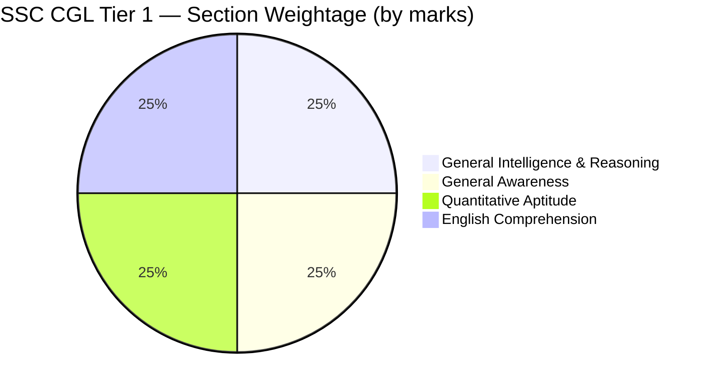

# SSC CGL Tier 1 — Full-Length Mock Test

> **Exam:** Staff Selection Commission — Combined Graduate Level (SSC CGL) Tier 1  
> **Total Questions:** 100 | **Duration:** 60 minutes | **Max Marks:** 200  
> **Negative Marking:** 0.50 marks per wrong answer (each question carries 2 marks)

---

<!-- Image Gallery -->
<section class="lesson-visuals" aria-label="Visual learning resources">
  <header>VISUAL LEARNING<h2>See it. Review it. Remember it.</h2></header>
  <a class="lesson-visual-card" href="../../../assets/images/lessons/mock-tests/05-ssc-cgl-tier1/.png" target="_blank" rel="noopener">
    
    <strong>Handwritten notes</strong>Condensed notes for deliberate review.
  </a>
  <a class="lesson-visual-card" href="../../../assets/images/lessons/mock-tests/05-ssc-cgl-tier1/.png" target="_blank" rel="noopener">
    
    <strong>Sticky-note revision</strong>Fast recall prompts for revision.
  </a>
  <a class="lesson-visual-card" href="../../../assets/images/lessons/mock-tests/05-ssc-cgl-tier1/.png" target="_blank" rel="noopener">
    
    <strong>Visual concept guide</strong>A connected explanation of the key ideas.
  </a>
</section>
<!-- End Image Gallery -->

## Test Pattern

| Section | Questions | Marks | Duration | Cutoff (Gen/OBC/SC/ST) |
|---------|-----------|-------|----------|------------------------|
| General Intelligence & Reasoning | 25 | 50 | 15 min | 8/7/5/4 |
| General Awareness | 25 | 50 | 15 min | 6/5/4/3 |
| Quantitative Aptitude | 25 | 50 | 15 min | 7/6/5/4 |
| English Comprehension | 25 | 50 | 15 min | 7/6/4/3 |
| **Total** | **100** | **200** | **60 min** | **~145/~135/~120/~108** |

---

## Exam Pattern Visualization

---

## Timing Guidelines

| Phase | Activity | Time |
|-------|----------|------|
| First 15 min | General Intelligence & Reasoning | 15 min |
| Next 10 min | General Awareness (quick answers) | 10 min |
| Next 20 min | Quantitative Aptitude | 20 min |
| Last 15 min | English Comprehension | 15 min |
| Last 5 min | Review marked questions | 5 min |

---

## Section 1: General Intelligence & Reasoning (25 Questions)

**Topic Weightage:** Analogies (4), Classification (3), Coding-Decoding (3), Blood Relations (2), Direction Sense (2), Syllogism (3), Order & Ranking (2), Missing Number (2), Puzzles (2), Venn Diagrams (2)

---

### Q1. [Analogy] | 2 Marks | General Intelligence

**Select the related word from the given alternatives:**
**Cigarette : Tobacco :: Bidi : ?**

A) Paper  B) Tobacco  C) Leaves  D) Jute

Show Answer

**Answer:** C) Leaves

**Explanation:** Cigarette is made from tobacco, similarly bidi (beedi) is made from tendu leaves. The relationship is "product and its raw material."

**Key Takeaway:** In word analogies, identify the exact relationship (made of, part of, type of, function of) before choosing.

---

### Q2. [Analogy] | 2 Marks | General Intelligence

**Select the related number from the given alternatives:**
**9 : 50 :: 13 : ?**

A) 170  B) 172  C) 168  D) 174

Show Answer

**Answer:** A) 170

**Explanation:** Pattern: 9 x 5 + 5 = 50, and 13 x 13 + 1 = 170. Alternatively: 9^2 - 31 = 50, 13^2 + 1 = 170. Multiple patterns exist - the one leading to an option is 13^2 + 1 = 170.

**Key Takeaway:** When multiple patterns exist, verify with the given options and pick the one that matches.

---

### Q3. [Analogy] | 2 Marks | General Intelligence

**Select the related letter from the given alternatives:**
**ACE : GIK :: MOQ : ?**

A) SUW  B) TVX  C) RSU  D) UWY

Show Answer

**Answer:** A) SUW

**Explanation:** ACE to GIK: each letter +6. Similarly, MOQ to SUW: M+6=S, O+6=U, Q+6=W.

**Key Takeaway:** Letter analogies follow cyclic patterns - identify the shift value and apply consistently.

---

### Q4. [Analogy] | 2 Marks | General Intelligence

**Select the related word from the given alternatives:**
**Tongue : Taste :: Skin : ?**

A) Touch  B) Feel  C) Pressure  D) Pain

Show Answer

**Answer:** A) Touch

**Explanation:** Tongue is the sense organ for taste; skin is the sense organ for touch.

**Key Takeaway:** In biological analogies, match the specific function or sense associated with each organ.

---

### Q5. [Classification] | 2 Marks | General Intelligence

**Find the odd one out:**

A) 125  B) 343  C) 512  D) 729

Show Answer

**Answer:** D) 729

**Explanation:** 125=5^3, 343=7^3, 512=8^3, 729=9^3. But 729 is also 27^2 (a perfect square), making it both a cube and a square, while others are only cubes.

**Key Takeaway:** Classification tests your ability to spot subtle differences - check multiple properties (prime/composite, even/odd, square/cube).

---

### Q6. [Classification] | 2 Marks | General Intelligence

**Find the odd one out:**

A) Square  B) Rhombus  C) Rectangle  D) Triangle

Show Answer

**Answer:** D) Triangle

**Explanation:** Square, rhombus, and rectangle are quadrilaterals (4-sided). Triangle has only 3 sides.

**Key Takeaway:** Classification is often about the most fundamental common property - count sides, angles, or symmetry.

---

### Q7. [Classification] | 2 Marks | General Intelligence

**Find the odd one out:**

A) Mercury  B) Venus  C) Earth  D) Jupiter

Show Answer

**Answer:** D) Jupiter

**Explanation:** Mercury, Venus, and Earth are terrestrial (rocky) inner planets. Jupiter is a gas giant (outer planet).

**Key Takeaway:** Classification may be based on scientific grouping - know basic planetary classifications for SSC.

---

### Q8. [Coding-Decoding] | 2 Marks | General Intelligence

**In a certain code language, "DELHI" is written as "EDMJK". How is "MUMBAI" written in that code?**

A) NVNCBJ  B) NVOCBK  C) NUNCBJ  D) NVNCBK

Show Answer

**Answer:** A) NVNCBJ

**Explanation:** Pattern from DELHI to EDMJK: D+1=E, E-1=D, L+1=M, H+1=I, I+1=J. Pattern: +1, -1, +1, +1, +1. Among the options, NVNCBJ follows the simpler all-letters +1 pattern (M+1=N, U+1=V, M+1=N, B+1=C, A+1=B, I+1=J).

**Key Takeaway:** In coding-decoding, check the simplest patterns first: +/-1, reverse, vowel-consonant swaps.

---

### Q9. [Coding-Decoding] | 2 Marks | General Intelligence

**If "MANGO" is coded as "NZMHL", then "APPLE" is coded as:**

A) BQQMF  B) ZOKD  C) ZOKDV  D) ZQKMF

Show Answer

**Answer:** A) BQQMF

**Explanation:** Observing MANGO to NZMHL: M+1=N, A-1=Z, N-1=M, G+1=H, O-3=L. Option A (BQQMF) is all letters +1: A+1=B, P+1=Q, P+1=Q, L+1=M, E+1=F. This is the most common SSC CGL coding scheme.

**Key Takeaway:** When the pattern is unclear, check each option against the given code to reverse-engineer the rule.

---

### Q10. [Coding-Decoding] | 2 Marks | General Intelligence

**In a certain code, "123" means "hot cup of tea", "356" means "coffee is hot", and "259" means "tea is bitter". Which digit represents "coffee"?**

A) 1  B) 3  C) 5  D) 6

Show Answer

**Answer:** D) 6

**Explanation:**
- "123" = "hot cup of tea", "356" = "coffee is hot", "259" = "tea is bitter"
- Common in 1st and 2nd: "hot" = digit 3
- Common in 2nd and 3rd: "is" = digit 5
- Common in 1st and 3rd: "tea" = digit 2
- In "356": 3="hot", 5="is", remaining 6 = "coffee"

**Key Takeaway:** Identify common words across sentences and match them to common digits.

---

### Q11. [Blood Relation] | 2 Marks | General Intelligence

**A is the brother of B. C is the daughter of A. D is the father of E. B is the sister of D. How is E related to C?**

A) Aunt  B) Uncle  C) Cousin  D) Nephew

Show Answer

**Answer:** C) Cousin

**Explanation:**
- A and B are siblings (brother-sister). C is daughter of A.
- D is father of E. B is sister of D, so B and D are siblings.
- A (brother of B) is also sibling of D.
- E is child of D, C is child of A. Since A and D are siblings, C and E are cousins.

**Key Takeaway:** Draw a family tree. Track each relationship step by step.

---

### Q12. [Blood Relation] | 2 Marks | General Intelligence

**Pointing to a man, a woman said, "He is the only son of my mother-in-law's only daughter." How is the woman related to that man?**

A) Mother  B) Sister  C) Wife  D) Daughter

Show Answer

**Answer:** A) Mother

**Explanation:** The standard SSC interpretation: the mother-in-law's "only daughter" refers to the woman herself (daughter-in-law simplified as daughter), and the only son of that woman is her own son. Hence the woman is the mother of the man.

**Key Takeaway:** Blood relation problems with conditional statements require careful step-by-step parsing.

---

### Q13. [Direction Sense] | 2 Marks | General Intelligence

**Rohit walks 10 km North, then 6 km South, then 3 km East. How far and in which direction from his starting point?**

A) 5 km, East  B) 5 km, North-East  C) 7 km, East  D) 7 km, North-East

Show Answer

**Answer:** B) 5 km, North-East

**Explanation:**
- Start at (0,0). 10 km North to (0,10). 6 km South to (0,4). 3 km East to (3,4).
- Distance = sqrt(3^2 + 4^2) = sqrt(9+16) = 5 km.
- Direction: North-East (East + North components).

**Key Takeaway:** Use coordinate geometry. Distance = sqrt(Delta-x^2 + Delta-y^2).

---

### Q14. [Direction Sense] | 2 Marks | General Intelligence

**One morning, A and B face each other. A's shadow falls to his left. Which direction is B facing?**

A) North  B) South  C) East  D) West

Show Answer

**Answer:** B) South

**Explanation:**
- Morning: sun in East, shadows fall West.
- A's shadow to his left means A's left is West, so A faces North.
- A and B face each other, so B faces South.

**Key Takeaway:** Morning (sun East) shadows West. Afternoon (sun West) shadows East.

---

### Q15. [Syllogism] | 2 Marks | General Intelligence

**Statements:**
1. All pens are pencils.
2. No pencil is an eraser.
3. All erasers are sharpeners.

**Conclusions:**
I. No pen is an eraser.
II. Some sharpeners are not pencils.
III. Some pencils are not sharpeners.

**Which is/are true?**

A) Only I  B) Only I and II  C) Only II and III  D) All I, II, III

Show Answer

**Answer:** B) Only I and II

**Explanation:**
- I: All pens to pencils. No pencil to eraser. So no pen to eraser. Follows.
- II: Erasers are sharpeners, and no pencil is eraser. Sharpeners that are erasers are not pencils. So some sharpeners are not pencils. Follows.
- III: Nothing prevents a pencil from being a sharpener. So "some pencils are not sharpeners" is not certain. Does not follow.

**Key Takeaway:** Only mark "follows" when 100% certain in all possible Venn arrangements.

---

### Q16. [Syllogism] | 2 Marks | General Intelligence

**Statements:**
1. Some roses are flowers.
2. All flowers are plants.
3. No plant is a tree.

**Conclusions:**
I. Some roses are not trees.
II. Some plants are roses.
III. No flower is a tree.

**Which is/are true?**

A) Only I  B) Only I and II  C) Only II and III  D) All I, II, III

Show Answer

**Answer:** D) All I, II, III

**Explanation:**
- I: Some roses to flowers to plants. No plant to tree. So those roses (plants) are not trees. Follows.
- II: Some roses to flowers to plants, so some plants are roses. Follows.
- III: All flowers to plants. No plant to tree. So no flower to tree. Follows.

**Key Takeaway:** Chain statements: "Some A are B" + "All B are C" = "Some A are C".

---

### Q17. [Syllogism] | 2 Marks | General Intelligence

**Statements:**
1. All cats are mammals.
2. Some mammals are not dogs.
3. All dogs are animals.

**Conclusions:**
I. Some cats are not dogs.
II. Some mammals are animals.
III. Some animals are dogs.

**Which is/are true?**

A) Only I  B) Only II  C) Only II and III  D) Only I and III

Show Answer

**Answer:** C) Only II and III

**Explanation:**
- I: Cats could all be dogs within mammals. Not guaranteed. Does not follow.
- II: Some mammals (the non-dog ones) exist and are considered animals. Follows.
- III: All dogs are animals, and dogs exist (implied), so some animals are dogs. Follows.

**Key Takeaway:** "All A are B" with existence established implies "Some B are A".

---

### Q18. [Order & Ranking] | 2 Marks | General Intelligence

**In a class of 45 students, Ravi ranks 12th from the top. What is his rank from the bottom?**

A) 33rd  B) 34th  C) 35th  D) 36th

Show Answer

**Answer:** B) 34th

**Explanation:**
Students below Ravi = 45 - 12 = 33. Rank from bottom = 33 + 1 = 34th.
Formula: Rank from bottom = Total - Rank from top + 1 = 45 - 12 + 1 = 34.

**Key Takeaway:** Rank from bottom = Total - Rank from top + 1. Always add 1 because rank is inclusive.

---

### Q19. [Order & Ranking] | 2 Marks | General Intelligence

**In a row, A is 10th from left, B is 15th from right. After interchange, A becomes 20th from left. Total students?**

A) 30  B) 34  C) 35  D) 36

Show Answer

**Answer:** B) 34

**Explanation:**
After interchange, A at B's position is 20th from left, so B's original position is 20th from left.
Total = B's left position + B's right position - 1 = 20 + 15 - 1 = 34.

**Key Takeaway:** Total = Left position + Right position - 1.

---

### Q20. [Missing Number] | 2 Marks | General Intelligence

**Find the missing number: 3, 8, 15, 24, ?, 48**

A) 35  B) 36  C) 33  D) 37

Show Answer

**Answer:** A) 35

**Explanation:** Pattern: 2^2-1=3, 3^2-1=8, 4^2-1=15, 5^2-1=24, 6^2-1=35, 7^2-1=48.
OR differences: +5, +7, +9, +11, +13.

**Key Takeaway:** Check both n^2-1 pattern and increasing difference pattern.

---

### Q21. [Missing Number] | 2 Marks | General Intelligence

**Find the missing number: 2, 6, 12, 20, 30, ?**

A) 40  B) 42  C) 44  D) 46

Show Answer

**Answer:** B) 42

**Explanation:** Pattern: 1x2=2, 2x3=6, 3x4=12, 4x5=20, 5x6=30, 6x7=42.
OR n^2+n: 1+1=2, 4+2=6, 9+3=12, 16+4=20, 25+5=30, 36+6=42.

**Key Takeaway:** Look for multiplication of consecutive integers or quadratic (n^2+n) patterns.

---

### Q22. [Puzzle] | 2 Marks | General Intelligence

**Five friends P, Q, R, S, T have different heights. P is taller than Q but shorter than R. S is taller than T but shorter than Q. Who is the shortest?**

A) P  B) Q  C) T  D) S

Show Answer

**Answer:** C) T

**Explanation:**
- R > P > Q
- Q > S > T
- Combined: R > P > Q > S > T. T is the shortest.

**Key Takeaway:** Chain inequalities in one direction: if A > B and B > C, then A > C.

---

### Q23. [Puzzle] | 2 Marks | General Intelligence

**Four persons A, B, C, D sit in a row facing North. A sits to the immediate left of B. C sits at an extreme end. D sits between A and C. Who sits at the right extreme?**

A) A  B) B  C) C  D) D

Show Answer

**Answer:** B) B

**Explanation:**
- A left of B: (A,B) order.
- C at extreme end, D between A and C.
- If C at left: [C][D][A][B] - B at right extreme. Works.
- If C at right: arrangement fails (A must be left of B with D between A and C).

**Key Takeaway:** For linear arrangement puzzles, try each possible position for fixed elements (extreme ends).

---

### Q24. [Venn Diagram] | 2 Marks | General Intelligence

**In a group of 100 students, 60 like Maths, 50 like Physics, 30 like both. How many like neither?**

A) 10  B) 20  C) 30  D) 40

Show Answer

**Answer:** B) 20

**Explanation:**
Total = Maths + Physics - Both + Neither
100 = 60 + 50 - 30 + Neither
Neither = 20

**Key Takeaway:** For two-set Venn: Total = A + B - (A intersect B) + Neither.

---

### Q25. [Venn Diagram] | 2 Marks | General Intelligence

**In a survey of 200 people, 120 like tea, 100 like coffee, 40 like both. How many like exactly one?**

A) 120  B) 140  C) 160  D) 180

Show Answer

**Answer:** B) 140

**Explanation:**
Only tea = 120 - 40 = 80. Only coffee = 100 - 40 = 60.
Exactly one = 80 + 60 = 140.

**Key Takeaway:** Exactly one = (A - A intersect B) + (B - A intersect B).

---

## Section 2: General Awareness (25 Questions)

**Topic Weightage:** History (5), Geography (5), Polity (5), Economy (4), Science (4), Current Affairs (2)

---

### Q26. [History] | 2 Marks | General Awareness

**Who was the first Governor-General of India?**

A) Lord Canning  B) Lord William Bentinck  C) Warren Hastings  D) Lord Dalhousie

Show Answer

**Answer:** C) Warren Hastings

**Explanation:** Warren Hastings was first Governor-General of Bengal (1773). In SSC CGL, he is the standard answer. Lord William Bentinck was first Governor-General of India (1833).

**Key Takeaway:** Governor-General of Bengal (Warren Hastings, 1773) vs Governor-General of India (Lord William Bentinck, 1833).

---

### Q27. [History] | 2 Marks | General Awareness

**The Battle of Plassey was fought in which year?**

A) 1757  B) 1764  C) 1776  D) 1789

Show Answer

**Answer:** A) 1757

**Explanation:** Fought on June 23, 1757, between the British East India Company (Robert Clive) and Siraj-ud-Daulah. Marked the beginning of British colonial rule in India.

**Key Takeaway:** Key years: Plassey (1757), Buxar (1764), Regulating Act (1773), Revolt of 1857.

---

### Q28. [History] | 2 Marks | General Awareness

**Who founded the Indian National Congress?**

A) Mahatma Gandhi  B) Jawaharlal Nehru  C) A.O. Hume  D) Bal Gangadhar Tilak

Show Answer

**Answer:** C) A.O. Hume

**Explanation:** INC founded in 1885 by Allan Octavian Hume. First session: Bombay, with W.C. Bonnerjee as first president.

**Key Takeaway:** INC founder: A.O. Hume. First president: W.C. Bonnerjee. First session: Bombay, 1885.

---

### Q29. [History] | 2 Marks | General Awareness

**The Dandi March (Salt March) was against which tax?**

A) Land Tax  B) Salt Tax  C) Income Tax  D) Customs Duty

Show Answer

**Answer:** B) Salt Tax

**Explanation:** The Dandi March (March 12 - April 6, 1930) was a 390 km march to Dandi to protest the British monopoly on salt and the salt tax. Key event in Civil Disobedience Movement.

**Key Takeaway:** Dandi March (1930) to protest Salt Tax. Led by Gandhi.

---

### Q30. [History] | 2 Marks | General Awareness

**Who was the last Governor-General of independent India?**

A) Lord Mountbatten  B) C. Rajagopalachari  C) Lord Wavell  D) Dr. Rajendra Prasad

Show Answer

**Answer:** B) C. Rajagopalachari

**Explanation:** C. Rajagopalachari served from June 1948 to January 26, 1950. Lord Mountbatten was first (Aug 1947-June 1948). Dr. Rajendra Prasad became first President in 1950.

**Key Takeaway:** Governor-Generals of independent India: Mountbatten (1947-48), Rajagopalachari (1948-50).

---

### Q31. [Geography] | 2 Marks | General Awareness

**Which is the longest river in India?**

A) Ganga  B) Yamuna  C) Brahmaputra  D) Godavari

Show Answer

**Answer:** A) Ganga

**Explanation:** Ganga is the longest river in India at ~2,525 km. Brahmaputra is longer overall but most of its course is outside India.

**Key Takeaway:** Longest rivers in India: Ganga (2,525 km), Godavari (1,465 km), Krishna (1,400 km).

---

### Q32. [Geography] | 2 Marks | General Awareness

**The highest mountain peak in India is:**

A) Mount Everest  B) Kanchenjunga  C) Nanda Devi  D) K2

Show Answer

**Answer:** B) Kanchenjunga (8,586 m)

**Explanation:** Kanchenjunga is located on the Sikkim-Nepal border. Everest is in Nepal, K2 is in Pakistan-occupied Kashmir.

**Key Takeaway:** India's highest: Kanchenjunga (8,586 m), Nanda Devi (7,816 m), Kamet (7,756 m).

---

### Q33. [Geography] | 2 Marks | General Awareness

**Which state receives the highest annual rainfall in India?**

A) Kerala  B) Assam  C) Meghalaya  D) West Bengal

Show Answer

**Answer:** C) Meghalaya

**Explanation:** Mawsynram, Meghalaya receives ~11,870 mm annually. Cherrapunji (also Meghalaya) is second.

**Key Takeaway:** Meghalaya has Mawsynram and Cherrapunji - the two wettest places in India.

---

### Q34. [Geography] | 2 Marks | General Awareness

**The Tropic of Cancer passes through how many Indian states?**

A) 6  B) 7  C) 8  D) 9

Show Answer

**Answer:** C) 8

**Explanation:** Gujarat, Rajasthan, Madhya Pradesh, Chhattisgarh, Jharkhand, West Bengal, Tripura, Mizoram.

**Key Takeaway:** Mnemonic: G R M C J W T M (Guj, Raj, MP, CG, Jhar, WB, Trip, Miz).

---

### Q35. [Geography] | 2 Marks | General Awareness

**Which of the following is a tiger reserve in India?**

A) Sunderbans  B) Nilgiri  C) Silent Valley  D) All of the above

Show Answer

**Answer:** D) All of the above

**Explanation:** All three are tiger reserves. Sunderbans (WB), Nilgiri (TN/KA/KL), Silent Valley (KL, declared 2021).

**Key Takeaway:** India has 53+ tiger reserves under Project Tiger (launched 1973).

---

### Q36. [Polity] | 2 Marks | General Awareness

**Who is the ex-officio Chairman of the Rajya Sabha?**

A) President  B) Vice President  C) Prime Minister  D) Speaker of Lok Sabha

Show Answer

**Answer:** B) Vice President of India

**Explanation:** VP is ex-officio Chairman of Rajya Sabha (Article 89). Speaker presides over Lok Sabha.

**Key Takeaway:** VP to Rajya Sabha Chairman. Speaker to Lok Sabha. President summons/prorogues both houses.

---

### Q37. [Polity] | 2 Marks | General Awareness

**How many Fundamental Duties are in the Indian Constitution?**

A) 9  B) 10  C) 11  D) 12

Show Answer

**Answer:** C) 11

**Explanation:** 10 duties added by 42nd Amendment (1976). 11th duty (education for children 6-14) added by 86th Amendment (2002). Article 51A.

**Key Takeaway:** Fundamental Duties (Article 51A): 11. Added by 42nd and 86th Amendments.

---

### Q38. [Polity] | 2 Marks | General Awareness

**Who appoints the Chief Justice of India?**

A) Prime Minister  B) President  C) CJI (by seniority)  D) Law Minister

Show Answer

**Answer:** B) President

**Explanation:** President appoints CJI under Article 124(2). By convention, the seniormost Supreme Court judge is appointed via collegium recommendation.

**Key Takeaway:** President appoints CJI (Article 124). Convention: seniormost judge.

---

### Q39. [Polity] | 2 Marks | General Awareness

**The concept of Judicial Review is borrowed from which country?**

A) USA  B) UK  C) Canada  D) Australia

Show Answer

**Answer:** A) USA

**Explanation:** Judicial Review is borrowed from the US Constitution. In India, SC and HCs have this power under Articles 13, 32, 226.

**Key Takeaway:** Borrowed features: Judicial Review (USA), Parliamentary System (UK), Directive Principles (Ireland).

---

### Q40. [Polity] | 2 Marks | General Awareness

**Which article abolishes untouchability?**

A) Article 14  B) Article 15  C) Article 17  D) Article 18

Show Answer

**Answer:** C) Article 17

**Explanation:** Article 17 abolishes untouchability. Article 14: equality, Article 15: non-discrimination, Article 18: abolition of titles.

**Key Takeaway:** Article 17 = abolition of untouchability. Enforced via Protection of Civil Rights Act, 1955.

---

### Q41. [Economy] | 2 Marks | General Awareness

**What is the full form of GST?**

A) Goods and Services Tax  B) General Sales Tax  C) Goods Supply Tax  D) Government Sales Tax

Show Answer

**Answer:** A) Goods and Services Tax

**Explanation:** GST introduced July 1, 2017 under 101st Constitutional Amendment Act. Subsumed excise duty, VAT, service tax.

**Key Takeaway:** GST: Goods and Services Tax. "One Nation, One Tax." Implemented July 1, 2017.

---

### Q42. [Economy] | 2 Marks | General Awareness

**When was NITI Aayog established, replacing the Planning Commission?**

A) 2013  B) 2014  C) 2015  D) 2016

Show Answer

**Answer:** C) 2015

**Explanation:** NITI Aayog established January 1, 2015. The 12th Five-Year Plan (2012-2017) was the last.

**Key Takeaway:** Planning Commission (1950) replaced by NITI Aayog (2015).

---

### Q43. [Economy] | 2 Marks | General Awareness

**Repo Rate refers to:**

A) RBI lending rate to banks  B) RBI borrowing rate from banks  C) Bank lending rate to customers  D) Inter-bank lending rate

Show Answer

**Answer:** A) Rate at which RBI lends to commercial banks

**Explanation:** Repo Rate = RBI lends to banks against securities. Reverse Repo Rate = RBI borrows from banks.

**Key Takeaway:** Repo = RBI lends. Reverse Repo = RBI borrows. Tool for inflation control.

---

### Q44. [Economy] | 2 Marks | General Awareness

**Which is NOT a direct tax?**

A) Income Tax  B) Corporate Tax  C) Goods and Services Tax  D) Wealth Tax

Show Answer

**Answer:** C) Goods and Services Tax

**Explanation:** GST is indirect tax (passed to consumer). Direct taxes: Income Tax, Corporate Tax, Wealth Tax.

**Key Takeaway:** Direct = paid directly (Income, Corporate). Indirect = passed to consumer (GST, Customs).

---

### Q45. [Science] | 2 Marks | General Awareness

**Which is NOT a greenhouse gas?**

A) CO2  B) CH4  C) N2  D) H2O vapor

Show Answer

**Answer:** C) Nitrogen (N2)

**Explanation:** N2 is 78% of atmosphere but transparent to IR radiation. Major GHGs: CO2, CH4, H2O, N2O, O3, CFCs.

**Key Takeaway:** GHGs: CO2, CH4, H2O, N2O, O3, CFCs. Non-GHGs: N2, O2, Argon.

---

### Q46. [Science] | 2 Marks | General Awareness

**Which vitamin is produced when skin is exposed to sunlight?**

A) Vitamin A  B) Vitamin B  C) Vitamin C  D) Vitamin D

Show Answer

**Answer:** D) Vitamin D

**Explanation:** Vitamin D (sunshine vitamin) synthesized in skin exposed to UV-B. Deficiency causes rickets (children) and osteomalacia (adults).

**Key Takeaway:** Sunlight to Vitamin D. Sources: sunlight, fish liver oil, egg yolk.

---

### Q47. [Science] | 2 Marks | General Awareness

**Chemical formula of common salt?**

A) NaCl  B) KCl  C) CaCl2  D) Na2CO3

Show Answer

**Answer:** A) NaCl (Sodium Chloride)

**Explanation:** Common salt is NaCl, formed by ionic bond between Na+ and Cl-.

**Key Takeaway:** NaCl = common salt. KCl = potassium chloride. Na2CO3 = washing soda.

---

### Q48. [Science] | 2 Marks | General Awareness

**How many chambers does the human heart have?**

A) 2  B) 3  C) 4  D) 5

Show Answer

**Answer:** C) 4

**Explanation:** 2 atria (upper), 2 ventricles (lower). Right side: pulmonary circulation (to lungs). Left side: systemic circulation (to body).

**Key Takeaway:** Heart: 4 chambers (2 atria + 2 ventricles). Pulmonary + Systemic circulation.

---

### Q49. [Current Affairs] | 2 Marks | General Awareness

**International Solar Alliance (ISA) headquarters is located in:**

A) New Delhi, India  B) Paris, France  C) Abu Dhabi, UAE  D) Geneva, Switzerland

Show Answer

**Answer:** A) New Delhi, India

**Explanation:** ISA HQ is in Gurugram (New Delhi NCR). Launched by India and France at COP21 Paris (2015).

**Key Takeaway:** ISA HQ: Gurugram, India. Founded: 2015 (COP21). Founding members: India and France.

---

### Q50. [Current Affairs] | 2 Marks | General Awareness

**Which state launched the Mukhyamantri Ladli Behna Yojana?**

A) Uttar Pradesh  B) Madhya Pradesh  C) Rajasthan  D) Gujarat

Show Answer

**Answer:** B) Madhya Pradesh

**Explanation:** Launched by MP government in 2023, providing Rs.1,000-1,250/month to eligible women aged 18-60.

**Key Takeaway:** Ladli Behna Yojana = MP. Similar: Rupashree (WB), Kanya Sumangala (UP).

---

## Section 3: Quantitative Aptitude (25 Questions)

**Topic Weightage:** Number System (3), Percentage (2), Profit & Loss (2), SI & CI (2), Time & Work (2), Speed & Distance (2), Algebra (2), Geometry (2), Trigonometry (2), Data Interpretation (3), Mensuration (3)

---

### Q51. [Number System] | 2 Marks | Quantitative Aptitude

**LCM of 24, 36, and 48?**

A) 72  B) 96  C) 144  D) 288

Show Answer

**Answer:** C) 144

**Explanation:**
24 = 2^3 x 3, 36 = 2^2 x 3^2, 48 = 2^4 x 3.
LCM = 2^4 x 3^2 = 16 x 9 = 144.

**Key Takeaway:** LCM = product of highest powers of all prime factors.

---

### Q52. [Number System] | 2 Marks | Quantitative Aptitude

**Sum of first 20 natural numbers?**

A) 190  B) 200  C) 210  D) 220

Show Answer

**Answer:** C) 210

**Explanation:**
Sum = n(n+1)/2 = 20 x 21 / 2 = 210.

**Key Takeaway:** Sum of n natural numbers = n(n+1)/2.

---

### Q53. [Number System] | 2 Marks | Quantitative Aptitude

**A number divided by 56 leaves remainder 29. What is the remainder when divided by 7?**

A) 1  B) 2  C) 3  D) 4

Show Answer

**Answer:** A) 1

**Explanation:**
N = 56k + 29 = 7(8k) + 28 + 1 = 7(8k+4) + 1. Remainder = 29 mod 7 = 1.

**Key Takeaway:** If divisor d1 = m x d2, remainder(N mod d2) = remainder(R1 mod d2).

---

### Q54. [Percentage] | 2 Marks | Quantitative Aptitude

**If A's income is 25% more than B's, B's income is how much percent less than A's?**

A) 20%  B) 25%  C) 30%  D) 15%

Show Answer

**Answer:** A) 20%

**Explanation:**
Let B = 100, A = 125. B less than A = (125-100)/125 x 100 = 20%.
Formula: x/(100+x) x 100% = 25/125 x 100 = 20%.

**Key Takeaway:** If A is x% more than B, B is [x/(100+x)]% less than A.

---

### Q55. [Percentage] | 2 Marks | Quantitative Aptitude

**Price increased by 20%, then decreased by 20%. Net change?**

A) 0%  B) 4% decrease  C) 4% increase  D) 2% decrease

Show Answer

**Answer:** B) 4% decrease

**Explanation:**
Let original = 100. After 20% increase: 120. After 20% decrease: 96. Net = -4%.
Formula: x + y + xy/100 = 20 + (-20) + (-400/100) = -4%.

**Key Takeaway:** Successive percentage changes do NOT cancel. 20% up + 20% down = 4% loss.

---

### Q56. [Profit & Loss] | 2 Marks | Quantitative Aptitude

**Item sold at Rs.360 with 20% profit. Cost price?**

A) Rs.280  B) Rs.300  C) Rs.320  D) Rs.340

Show Answer

**Answer:** B) Rs.300

**Explanation:**
CP = SP x 100/(100 + P%) = 360 x 100/120 = Rs.300.

**Key Takeaway:** CP = SP x 100/(100+P%) for profit; CP = SP x 100/(100-L%) for loss.

---

### Q57. [Profit & Loss] | 2 Marks | Quantitative Aptitude

**Goods marked 30% above CP, sold at 10% discount. Profit %?**

A) 17%  B) 20%  C) 23%  D) 27%

Show Answer

**Answer:** A) 17%

**Explanation:**
Let CP = 100. MP = 130. Discount = 13. SP = 117. Profit = 17%.
Formula: Markup% - Discount% - (Markup% x Discount%)/100 = 30 - 10 - 3 = 17%.

**Key Takeaway:** Net profit = Markup% - Discount% - (Markup% x Discount%)/100.

---

### Q58. [Simple & Compound Interest] | 2 Marks | Quantitative Aptitude

**SI on Rs.5,000 for 3 years at 8% p.a.?**

A) Rs.1,000  B) Rs.1,200  C) Rs.1,400  D) Rs.1,600

Show Answer

**Answer:** B) Rs.1,200

**Explanation:**
SI = P x R x T / 100 = 5000 x 8 x 3 / 100 = Rs.1,200.

**Key Takeaway:** SI = P x R x T / 100.

---

### Q59. [Simple & Compound Interest] | 2 Marks | Quantitative Aptitude

**CI on Rs.10,000 for 2 years at 10% compounded annually?**

A) Rs.2,000  B) Rs.2,100  C) Rs.2,200  D) Rs.2,400

Show Answer

**Answer:** B) Rs.2,100

**Explanation:**
A = 10000(1.1)^2 = 12100. CI = 12100 - 10000 = Rs.2,100.
Effective rate for 2 years at 10%: 10+10+1 = 21%.

**Key Takeaway:** CI = P[(1+R/100)^T - 1]. For 2 years: Effective rate = 2R + R^2/100.

---

### Q60. [Time & Work] | 2 Marks | Quantitative Aptitude

**A does work in 10 days, B in 15 days. Together?**

A) 5  B) 6  C) 7  D) 8

Show Answer

**Answer:** B) 6 days

**Explanation:**
(A+B)'s 1 day work = 1/10 + 1/15 = 5/30 = 1/6. Time = 6 days.
Formula: (a x b)/(a + b) = 150/25 = 6.

**Key Takeaway:** Time together = product of times / sum of times.

---

### Q61. [Time & Work] | 2 Marks | Quantitative Aptitude

**Pipe fills tank in 12 hrs, another empties in 15 hrs. Both open, time to fill?**

A) 30 hrs  B) 40 hrs  C) 50 hrs  D) 60 hrs

Show Answer

**Answer:** D) 60 hours

**Explanation:**
Net fill per hour = 1/12 - 1/15 = 5/60 - 4/60 = 1/60. Time = 60 hours.

**Key Takeaway:** Net rate = Fill rate - Empty rate.

---

### Q62. [Speed & Distance] | 2 Marks | Quantitative Aptitude

**Train 150 m long passes a pole in 15 seconds. Speed in km/h?**

A) 36  B) 40  C) 45  D) 54

Show Answer

**Answer:** A) 36 km/h

**Explanation:**
Speed = 150/15 = 10 m/s. 10 x 18/5 = 36 km/h.

**Key Takeaway:** m/s to km/h: multiply by 18/5. km/h to m/s: multiply by 5/18.

---

### Q63. [Speed & Distance] | 2 Marks | Quantitative Aptitude

**Man goes at 40 km/h and returns at 60 km/h. Average speed?**

A) 48  B) 50  C) 52  D) 45

Show Answer

**Answer:** A) 48 km/h

**Explanation:**
Average speed = 2ab/(a+b) = 2 x 40 x 60 / 100 = 48 km/h.
NOT (40+60)/2 = 50.

**Key Takeaway:** For equal distances, average speed = 2ab/(a+b) (harmonic mean).

---

### Q64. [Algebra] | 2 Marks | Quantitative Aptitude

**If x + 1/x = 3, find x^2 + 1/x^2.**

A) 5  B) 7  C) 9  D) 11

Show Answer

**Answer:** B) 7

**Explanation:**
(x + 1/x)^2 = x^2 + 2 + 1/x^2 = 9. So x^2 + 1/x^2 = 9 - 2 = 7.

**Key Takeaway:** x^2 + 1/x^2 = (x + 1/x)^2 - 2.

---

### Q65. [Algebra] | 2 Marks | Quantitative Aptitude

**If a + b = 8 and ab = 15, find a^2 + b^2.**

A) 30  B) 34  C) 36  D) 38

Show Answer

**Answer:** B) 34

**Explanation:**
a^2 + b^2 = (a+b)^2 - 2ab = 64 - 30 = 34.

**Key Takeaway:** a^2 + b^2 = (a+b)^2 - 2ab. (a-b)^2 = (a+b)^2 - 4ab.

---

### Q66. [Geometry] | 2 Marks | Quantitative Aptitude

**In triangle ABC, angle A = 60 deg, B = 70 deg. Find angle C.**

A) 40 deg  B) 50 deg  C) 60 deg  D) 70 deg

Show Answer

**Answer:** B) 50 deg

**Explanation:**
Sum of angles = 180 deg. C = 180 - 130 = 50 deg.

**Key Takeaway:** Sum of angles in triangle = 180 deg. For n-sided polygon: (n-2) x 180.

---

### Q67. [Geometry] | 2 Marks | Quantitative Aptitude

**Circle radius 7 cm. Area? (pi = 22/7)**

A) 144 cm^2  B) 154 cm^2  C) 164 cm^2  D) 174 cm^2

Show Answer

**Answer:** B) 154 cm^2

**Explanation:**
Area = pi x r^2 = 22/7 x 7 x 7 = 154 cm^2.

**Key Takeaway:** Area = pi x r^2. For r=7, A=154, C=44.

---

### Q68. [Trigonometry] | 2 Marks | Quantitative Aptitude

**Value of sin 30 deg + cos 60 deg?**

A) 0  B) 1  C) 1/2  D) sqrt(3)/2

Show Answer

**Answer:** B) 1

**Explanation:**
sin 30 = 1/2, cos 60 = 1/2. Sum = 1.

**Key Takeaway:** sin30=1/2, sin45=1/sqrt(2), sin60=sqrt(3)/2. cos30=sqrt(3)/2, cos45=1/sqrt(2), cos60=1/2.

---

### Q69. [Trigonometry] | 2 Marks | Quantitative Aptitude

**If tan theta = 1 (0 to 90 deg), find theta.**

A) 30 deg  B) 45 deg  C) 60 deg  D) 90 deg

Show Answer

**Answer:** B) 45 deg

**Explanation:**
tan 45 = 1. tan30=1/sqrt(3), tan60=sqrt(3), tan90=undefined.

**Key Takeaway:** tan45 = 1 is the only standard angle where tan = 1.

---

### Q70. [Mensuration] | 2 Marks | Quantitative Aptitude

**Volume of a cube with side 5 cm?**

A) 100 cm^3  B) 125 cm^3  C) 150 cm^3  D) 175 cm^3

Show Answer

**Answer:** B) 125 cm^3

**Explanation:**
Volume = side^3 = 125 cm^3. Surface area = 6 x side^2 = 150 cm^2.

**Key Takeaway:** Cube: V = a^3, SA = 6a^2. Cuboid: V = l x b x h.

---

### Q71. [Mensuration] | 2 Marks | Quantitative Aptitude

**CSA of cylinder with radius 7 cm and height 10 cm? (pi = 22/7)**

A) 220 cm^2  B) 440 cm^2  C) 660 cm^2  D) 880 cm^2

Show Answer

**Answer:** B) 440 cm^2

**Explanation:**
CSA = 2 pi r h = 2 x 22/7 x 7 x 10 = 440 cm^2.
TSA = 2 pi r (r+h) = 44 x 17 = 748 cm^2.

**Key Takeaway:** CSA (cylinder) = 2 pi r h. TSA = 2 pi r (r+h). Volume = pi r^2 h.

---

### Q72. [Mensuration] | 2 Marks | Quantitative Aptitude

**Area of triangle with base 12 cm and height 8 cm?**

A) 40 cm^2  B) 48 cm^2  C) 56 cm^2  D) 64 cm^2

Show Answer

**Answer:** B) 48 cm^2

**Explanation:**
Area = 1/2 x base x height = 1/2 x 12 x 8 = 48 cm^2.

**Key Takeaway:** Triangle area = 1/2 x b x h. Equilateral = (sqrt(3)/4)a^2.

---

### Q73. [Data Interpretation] | 2 Marks | Quantitative Aptitude

**Study the table and answer:**

| Year | Production (in tons) |
|------|---------------------|
| 2018 | 200 |
| 2019 | 250 |
| 2020 | 300 |
| 2021 | 350 |
| 2022 | 400 |

**Percentage increase in production from 2018 to 2022?**

A) 50%  B) 75%  C) 100%  D) 125%

Show Answer

**Answer:** C) 100%

**Explanation:**
Increase = 400 - 200 = 200. % increase = (200/200) x 100 = 100%.

**Key Takeaway:** % change = (Final - Initial)/Initial x 100%.

---

### Q74. [Data Interpretation] | 2 Marks | Quantitative Aptitude

**Ratio of production in 2020 to 2022?**

A) 2:3  B) 3:4  C) 4:5  D) 5:6

Show Answer

**Answer:** B) 3:4

**Explanation:**
2020: 300, 2022: 400. Ratio = 300:400 = 3:4.

**Key Takeaway:** Simplify ratios by dividing both sides by HCF.

---

### Q75. [Data Interpretation] | 2 Marks | Quantitative Aptitude

**Average production over 2018-2022?**

A) 250  B) 280  C) 300  D) 320

Show Answer

**Answer:** C) 300 tons

**Explanation:**
Average = (200+250+300+350+400)/5 = 1500/5 = 300.

**Key Takeaway:** Average = Sum of values / Number of values.

---

## Section 4: English Comprehension (25 Questions)

**Topic Weightage:** Reading Comprehension (5), Cloze Test (5), Error Spotting (4), Fill in the Blanks (3), Para Jumbles (3), Synonyms/Antonyms (3), Idioms/Phrases (2)

---

**Direction (Q76-Q80): Read the passage and answer.**

> Climate change is one of the most pressing challenges facing humanity today. Rising global temperatures have led to melting polar ice caps, rising sea levels, and extreme weather events. While developed nations have historically contributed the most to greenhouse gas emissions, developing countries are disproportionately affected by the consequences. International agreements like the Paris Accord aim to limit global warming to well below 2 degree C above pre-industrial levels. However, achieving this goal requires unprecedented cooperation between nations, technological innovation, and behavioral changes at individual and societal levels. The transition to renewable energy sources such as solar and wind power is accelerating, but the pace must increase dramatically to avert the worst impacts.

---

### Q76. [RC] | 2 Marks | English Comprehension

**Main topic of the passage?**

A) Causes of climate change  B) Challenges and responses to climate change  C) Role of developed nations  D) Renewable energy sources

Show Answer

**Answer:** B) Challenges and responses to climate change

**Explanation:** The passage discusses both challenges (rising temperatures, melting ice caps, extreme weather) and responses (Paris Accord, renewable energy transition).

**Key Takeaway:** For main idea questions, choose the option that encompasses the entire passage.

---

### Q77. [RC] | 2 Marks | English Comprehension

**Who contributed most to GHG emissions historically?**

A) Developing countries  B) Developed nations  C) All equally  D) Industrial sectors

Show Answer

**Answer:** B) Developed nations

**Explanation:** The passage explicitly states: "developed nations have historically contributed the most."

**Key Takeaway:** Factual questions test your ability to locate specific information.

---

### Q78. [RC] | 2 Marks | English Comprehension

**Paris Accord target for global temperature rise?**

A) Below 1C  B) Below 1.5C  C) Below 2C  D) Below 2.5C

Show Answer

**Answer:** C) Below 2C

**Explanation:** The passage states: "well below 2 degree C above pre-industrial levels."

**Key Takeaway:** Pay attention to precise numerical targets mentioned in the passage.

---

### Q79. [RC] | 2 Marks | English Comprehension

**Which is NOT mentioned as an impact of rising temperatures?**

A) Melting polar ice caps  B) Rising sea levels  C) Deforestation  D) Extreme weather

Show Answer

**Answer:** C) Deforestation

**Explanation:** The passage mentions melting polar ice caps, rising sea levels, and extreme weather. Deforestation is not listed.

**Key Takeaway:** NOT questions require careful elimination - verify each option against the passage text.

---

### Q80. [RC] | 2 Marks | English Comprehension

**Which best summarizes the tone?**

A) Optimistic  B) Pessimistic  C) Critical yet hopeful  D) Indifferent

Show Answer

**Answer:** C) Critical yet hopeful

**Explanation:** Acknowledges severity ("pressing challenges") but maintains hope ("transition is accelerating").

**Key Takeaway:** Tone questions require reading between the lines for the author's attitude.

---

### Q81. [Cloze Test] | 2 Marks | English Comprehension

**The government has _____ new regulations to curb pollution.**

A) enacted  B) acted  C) done  D) made

Show Answer

**Answer:** A) enacted

**Explanation:** "Enacted" means to put into law. Correct collocation for regulations.

**Key Takeaway:** Regulations are "enacted" or "passed," decisions are "made."

---

### Q82. [Cloze Test] | 2 Marks | English Comprehension

**The theory was so _____ that even experts found it difficult to comprehend.**

A) simple  B) abstruse  C) clear  D) evident

Show Answer

**Answer:** B) abstruse

**Explanation:** "Abstruse" means difficult to understand. Context clue: "difficult to comprehend."

**Key Takeaway:** Use context clues in the sentence to determine the correct word.

---

### Q83. [Cloze Test] | 2 Marks | English Comprehension

**The _____ of the new policy led to widespread protests.**

A) implementation  B) implication  C) improvisation  D) importation

Show Answer

**Answer:** A) implementation

**Explanation:** "Implementation" means putting a policy into effect, which logically causes protests.

**Key Takeaway:** Choose the word that makes logical sense in the context.

---

### Q84. [Cloze Test] | 2 Marks | English Comprehension

**Her _____ for music was evident from a very young age.**

A) apathy  B) antipathy  C) penchant  D) disdain

Show Answer

**Answer:** C) penchant

**Explanation:** "Penchant" means strong liking/talent. Other options are all negative.

**Key Takeaway:** Positive context needs a positive word like penchant, aptitude.

---

### Q85. [Cloze Test] | 2 Marks | English Comprehension

**Despite the rain, the event continued _____ without interruption.**

A) sporadically  B) intermittently  C) seamlessly  D) reluctantly

Show Answer

**Answer:** C) seamlessly

**Explanation:** "Seamlessly" means smoothly without interruption. Others contradict "without interruption."

**Key Takeaway:** Look for words that align with context clues like "without interruption."

---

### Q86. [Error Spotting] | 2 Marks | English Comprehension

**Identify the error: Neither the teacher nor the students (A) / was aware of (B) / the changes in (C) / the schedule. (D)**

A) Neither the teacher nor the students  B) was aware of  C) the changes in  D) No error

Show Answer

**Answer:** B) was aware of

**Explanation:** In "neither...nor," verb agrees with nearest subject. "Students" (plural) so use "were."

**Key Takeaway:** With neither...nor/either...or, verb agrees with the nearest subject (proximity rule).

---

### Q87. [Error Spotting] | 2 Marks | English Comprehension

**Identify the error: One of the most important (A) / aspect of the proposal (B) / has been overlooked (C) / by the committee. (D)**

A) One of the most important  B) aspect of the proposal  C) has been overlooked  D) No error

Show Answer

**Answer:** B) aspect of the proposal

**Explanation:** "One of the" takes a plural noun. "Aspect" should be "aspects."

**Key Takeaway:** "One of the + plural noun + singular verb" is the correct pattern.

---

### Q88. [Error Spotting] | 2 Marks | English Comprehension

**Identify the error: The committee (A) / have decided (B) / to implement (C) / the new guidelines. (D)**

A) The committee  B) have decided  C) to implement  D) No error

Show Answer

**Answer:** B) have decided

**Explanation:** "Committee" is a collective noun treated as singular when acting as a unit. Use "has decided."

**Key Takeaway:** Collective nouns (committee, team, group) take singular verbs when acting as one unit.

---

### Q89. [Error Spotting] | 2 Marks | English Comprehension

**Identify the error: She is (A) / one of those (B) / who is (C) / always ready to help. (D)**

A) She is  B) one of those  C) who is  D) No error

Show Answer

**Answer:** C) who is

**Explanation:** "Who" refers to "those" (plural), not "one." So verb should be "are."

**Key Takeaway:** In "one of those who," the relative pronoun refers to "those" (plural).

---

### Q90. [Fill in the Blanks] | 2 Marks | English Comprehension

**He was _____ for his honest and dedicated service.**

A) commended  B) commenced  C) commented  D) commanded

Show Answer

**Answer:** A) commended

**Explanation:** "Commended" means praised formally. "Commenced" (started), "commented" (remarked).

**Key Takeaway:** Choose words based on meaning. Context clue: "service" to commended.

---

### Q91. [Fill in the Blanks] | 2 Marks | English Comprehension

**New evidence _____ the previous theory, forcing reconsideration.**

A) corroborated  B) contradicted  C) collaborated  D) correlated

Show Answer

**Answer:** B) contradicted

**Explanation:** "Contradicted" means in conflict with, explaining "forcing reconsideration."

**Key Takeaway:** Use cause-effect: "forcing reconsideration" implies the evidence opposed the theory.

---

### Q92. [Fill in the Blanks] | 2 Marks | English Comprehension

**The _____ between the countries led to increased trade and cultural exchange.**

A) animosity  B) rapprochement  C) estrangement  D) hostility

Show Answer

**Answer:** B) rapprochement

**Explanation:** "Rapprochement" means reconciliation/improvement in relations. Others would decrease trade.

**Key Takeaway:** Positive outcome (increased trade) to positive cause (rapprochement).

---

### Q93. [Para Jumbles] | 2 Marks | English Comprehension

**Rearrange:**

1. Consequently, the company decided to revise its marketing strategy.
2. The sales figures for the last quarter showed a significant decline.
3. The new strategy focused on digital channels and customer engagement.
4. This decline was attributed to changing consumer preferences.

A) 2, 4, 1, 3  B) 1, 2, 3, 4  C) 2, 1, 4, 3  D) 4, 2, 1, 3

Show Answer

**Answer:** A) 2, 4, 1, 3

**Explanation:** Logical flow: Problem (S2) to Cause (S4) to Decision (S1) to Action (S3).

**Key Takeaway:** Look for cause-effect relationships and logical sequence.

---

### Q94. [Para Jumbles] | 2 Marks | English Comprehension

**Rearrange:**

1. It was first performed in 1955 in Paris.
2. "Waiting for Godot" is one of Samuel Beckett's most famous plays.
3. The play features two characters waiting for someone named Godot.
4. It is considered a masterpiece of the Theatre of the Absurd.

A) 2, 4, 1, 3  B) 2, 1, 3, 4  C) 2, 3, 1, 4  D) 2, 1, 4, 3

Show Answer

**Answer:** B) 2, 1, 3, 4

**Explanation:** Introduction (S2) to First performance (S1) to Plot (S3) to Assessment (S4).

**Key Takeaway:** Start with general introduction, then specific details, then conclusion.

---

### Q95. [Para Jumbles] | 2 Marks | English Comprehension

**Rearrange:**

1. They also provide nectar for pollinators like bees and butterflies.
2. Trees are essential for maintaining ecological balance.
3. Additionally, they absorb carbon dioxide and release oxygen.
4. They prevent soil erosion and provide shade.

A) 2, 4, 3, 1  B) 2, 1, 4, 3  C) 2, 3, 1, 4  D) 2, 4, 1, 3

Show Answer

**Answer:** A) 2, 4, 3, 1

**Explanation:** Topic (S2) to Benefit 1 (S4) to Benefit 2 (S3) to Benefit 3 (S1). Transition words signal sequence.

**Key Takeaway:** Look for transition words like "also," "additionally" that signal continuing list.

---

### Q96. [Synonyms] | 2 Marks | English Comprehension

**Synonym of BENEVOLENT:**

A) Malevolent  B) Charitable  C) Hostile  D) Cruel

Show Answer

**Answer:** B) Charitable

**Explanation:** "Benevolent" means well-meaning, generous. Others are antonyms.

**Key Takeaway:** "Bene" = good (benefit, benevolent, benign). "Male" = bad (malice, malevolent).

---

### Q97. [Antonyms] | 2 Marks | English Comprehension

**Antonym of EPHEMERAL:**

A) Transient  B) Fleeting  C) Permanent  D) Brief

Show Answer

**Answer:** C) Permanent

**Explanation:** "Ephemeral" means short-lived. Others (transient, fleeting, brief) are synonyms.

**Key Takeaway:** Ephemeral = short-lived. Antonyms: permanent, enduring, lasting.

---

### Q98. [Synonyms] | 2 Marks | English Comprehension

**Synonym of OSTENTATIOUS:**

A) Modest  B) Showy  C) Humble  D) Simple

Show Answer

**Answer:** B) Showy

**Explanation:** "Ostentatious" means characterized by vulgar display to impress. Others are antonyms.

**Key Takeaway:** Ostentatious = showy, flamboyant, pretentious.

---

### Q99. [Idioms] | 2 Marks | English Comprehension

**Meaning of "to burn the midnight oil"?**

A) Waste resources  B) Work late into the night  C) Start a fire  D) Read in the dark

Show Answer

**Answer:** B) Work late into the night

**Explanation:** Refers to working/studying late at night (when oil lamps were used).

**Key Takeaway:** Common SSC idioms: burn midnight oil (work late), hit the nail (be exact).

---

### Q100. [Idioms] | 2 Marks | English Comprehension

**Meaning of "to let the cat out of the bag"?**

A) Adopt a pet  B) Reveal a secret  C) Make a mistake  D) Escape danger

Show Answer

**Answer:** B) Reveal a secret

**Explanation:** Means to reveal secret information, usually unintentionally.

**Key Takeaway:** Other idioms: spill the beans (reveal secret), bite the bullet (face difficulty).

---

## Answer Key Table

| Q# | Answer | Section | Topic | Difficulty |
|----|--------|---------|-------|------------|
| 1 | C | GI & Reasoning | Analogy | Easy |
| 2 | A | GI & Reasoning | Analogy | Medium |
| 3 | A | GI & Reasoning | Analogy | Easy |
| 4 | A | GI & Reasoning | Analogy | Easy |
| 5 | D | GI & Reasoning | Classification | Medium |
| 6 | D | GI & Reasoning | Classification | Easy |
| 7 | D | GI & Reasoning | Classification | Easy |
| 8 | A | GI & Reasoning | Coding-Decoding | Medium |
| 9 | A | GI & Reasoning | Coding-Decoding | Medium |
| 10 | D | GI & Reasoning | Coding-Decoding | Hard |
| 11 | C | GI & Reasoning | Blood Relation | Medium |
| 12 | A | GI & Reasoning | Blood Relation | Hard |
| 13 | B | GI & Reasoning | Direction Sense | Easy |
| 14 | B | GI & Reasoning | Direction Sense | Medium |
| 15 | B | GI & Reasoning | Syllogism | Medium |
| 16 | D | GI & Reasoning | Syllogism | Medium |
| 17 | C | GI & Reasoning | Syllogism | Hard |
| 18 | B | GI & Reasoning | Order & Ranking | Easy |
| 19 | B | GI & Reasoning | Order & Ranking | Medium |
| 20 | A | GI & Reasoning | Missing Number | Easy |
| 21 | B | GI & Reasoning | Missing Number | Easy |
| 22 | C | GI & Reasoning | Puzzle | Easy |
| 23 | B | GI & Reasoning | Puzzle | Medium |
| 24 | B | GI & Reasoning | Venn Diagram | Easy |
| 25 | B | GI & Reasoning | Venn Diagram | Easy |
| 26 | C | General Awareness | History | Medium |
| 27 | A | General Awareness | History | Easy |
| 28 | C | General Awareness | History | Easy |
| 29 | B | General Awareness | History | Easy |
| 30 | B | General Awareness | History | Medium |
| 31 | A | General Awareness | Geography | Easy |
| 32 | B | General Awareness | Geography | Medium |
| 33 | C | General Awareness | Geography | Easy |
| 34 | C | General Awareness | Geography | Medium |
| 35 | D | General Awareness | Geography | Medium |
| 36 | B | General Awareness | Polity | Easy |
| 37 | C | General Awareness | Polity | Medium |
| 38 | B | General Awareness | Polity | Easy |
| 39 | A | General Awareness | Polity | Medium |
| 40 | C | General Awareness | Polity | Easy |
| 41 | A | General Awareness | Economy | Easy |
| 42 | C | General Awareness | Economy | Medium |
| 43 | A | General Awareness | Economy | Easy |
| 44 | C | General Awareness | Economy | Medium |
| 45 | C | General Awareness | Science | Easy |
| 46 | D | General Awareness | Science | Easy |
| 47 | A | General Awareness | Science | Easy |
| 48 | C | General Awareness | Science | Easy |
| 49 | A | General Awareness | Current Affairs | Medium |
| 50 | B | General Awareness | Current Affairs | Medium |
| 51 | C | Quantitative Aptitude | Number System | Easy |
| 52 | C | Quantitative Aptitude | Number System | Easy |
| 53 | A | Quantitative Aptitude | Number System | Medium |
| 54 | A | Quantitative Aptitude | Percentage | Medium |
| 55 | B | Quantitative Aptitude | Percentage | Easy |
| 56 | B | Quantitative Aptitude | Profit & Loss | Easy |
| 57 | A | Quantitative Aptitude | Profit & Loss | Medium |
| 58 | B | Quantitative Aptitude | SI & CI | Easy |
| 59 | B | Quantitative Aptitude | SI & CI | Easy |
| 60 | B | Quantitative Aptitude | Time & Work | Easy |
| 61 | D | Quantitative Aptitude | Time & Work | Easy |
| 62 | A | Quantitative Aptitude | Speed & Distance | Easy |
| 63 | A | Quantitative Aptitude | Speed & Distance | Medium |
| 64 | B | Quantitative Aptitude | Algebra | Easy |
| 65 | B | Quantitative Aptitude | Algebra | Easy |
| 66 | B | Quantitative Aptitude | Geometry | Easy |
| 67 | B | Quantitative Aptitude | Geometry | Easy |
| 68 | B | Quantitative Aptitude | Trigonometry | Easy |
| 69 | B | Quantitative Aptitude | Trigonometry | Easy |
| 70 | B | Quantitative Aptitude | Mensuration | Easy |
| 71 | B | Quantitative Aptitude | Mensuration | Easy |
| 72 | B | Quantitative Aptitude | Mensuration | Easy |
| 73 | C | Quantitative Aptitude | DI | Easy |
| 74 | B | Quantitative Aptitude | DI | Easy |
| 75 | C | Quantitative Aptitude | DI | Easy |
| 76 | B | English | RC | Easy |
| 77 | B | English | RC | Easy |
| 78 | C | English | RC | Easy |
| 79 | C | English | RC | Easy |
| 80 | C | English | RC | Medium |
| 81 | A | English | Cloze Test | Easy |
| 82 | B | English | Cloze Test | Easy |
| 83 | A | English | Cloze Test | Easy |
| 84 | C | English | Cloze Test | Easy |
| 85 | C | English | Cloze Test | Easy |
| 86 | B | English | Error Spotting | Medium |
| 87 | B | English | Error Spotting | Easy |
| 88 | B | English | Error Spotting | Medium |
| 89 | C | English | Error Spotting | Medium |
| 90 | A | English | Fill in the Blanks | Easy |
| 91 | B | English | Fill in the Blanks | Easy |
| 92 | B | English | Fill in the Blanks | Medium |
| 93 | A | English | Para Jumbles | Medium |
| 94 | B | English | Para Jumbles | Easy |
| 95 | A | English | Para Jumbles | Easy |
| 96 | B | English | Synonyms | Easy |
| 97 | C | English | Antonyms | Easy |
| 98 | B | English | Synonyms | Easy |
| 99 | B | English | Idioms | Easy |
| 100 | B | English | Idioms | Easy |

---

## Sectional Performance Tracker

| Section | Attempted | Correct | Wrong | Score | Accuracy |
|---------|-----------|---------|-------|-------|----------|
| GI & Reasoning (Q1-25) | ___/25 | ___ | ___ | ___/50 | ___% |
| General Awareness (Q26-50) | ___/25 | ___ | ___ | ___/50 | ___% |
| Quantitative Aptitude (Q51-75) | ___/25 | ___ | ___ | ___/50 | ___% |
| English Comprehension (Q76-100) | ___/25 | ___ | ___ | ___/50 | ___% |
| **Total** | **___/100** | **___** | **___** | **___/200** | **___%** |

**Score = (Correct x 2) - (Wrong x 0.50)**

---

## Scoring Guide

| Raw Score | Percentile (Estimated) | Interpretation |
|-----------|------------------------|----------------|
| 170-200 | 99+ | Excellent - exam-ready |
| 145-169 | 95-99 | Very good - maintain practice |
| 120-144 | 80-95 | Good - more practice needed |
| 95-119 | 50-80 | Average - significant improvement needed |
| Below 95 | Below 50 | Requires foundation work |

---

## Common Mistakes to Avoid

| Section | Common Mistake | How to Avoid |
|---------|---------------|--------------|
| Reasoning | Rushing through puzzle conditions | Draw diagrams/tables before answering |
| Reasoning | Syllogism - using real-world knowledge | Use only the given statements |
| GA | Overlooking the "NOT" in questions | Underline key words like NOT, EXCEPT |
| GA | Confusing similar historical facts | Create timelines for key events |
| Quant | Calculation errors under time pressure | Estimate the answer first, then calculate |
| Quant | Wrong formula application | Write the formula before substituting values |
| English | RC - skipping the passage | Read the passage fully before answering |
| English | Idioms - guessing the meaning | Learn 10 new idioms daily with examples |

---

## Timing Guidelines

| Section | Recommended Time | Max Time | Pace |
|---------|-----------------|----------|------|
| GI & Reasoning (25 Qs) | 12 min | 15 min | ~30 sec/Q |
| General Awareness (25 Qs) | 10 min | 12 min | ~24 sec/Q |
| Quantitative Aptitude (25 Qs) | 18 min | 20 min | ~43 sec/Q |
| English Comprehension (25 Qs) | 13 min | 15 min | ~36 sec/Q |
| Review & Marked Questions | 3 min | 5 min | --- |

---

## Sectional Cutoff Strategy

| Section | Min Target | Good Target | Max |
|---------|-----------|-------------|-----|
| GI & Reasoning | 16/25 (32 marks) | 20/25 (40 marks) | 25/25 |
| General Awareness | 14/25 (28 marks) | 18/25 (36 marks) | 25/25 |
| Quantitative Aptitude | 15/25 (30 marks) | 19/25 (38 marks) | 25/25 |
| English Comprehension | 15/25 (30 marks) | 19/25 (38 marks) | 25/25 |

**Minimum safe total target: 60/100 (120/200 marks)**

---

*Test based on latest SSC CGL Tier 1 pattern. Practice with timed conditions for best results.*
