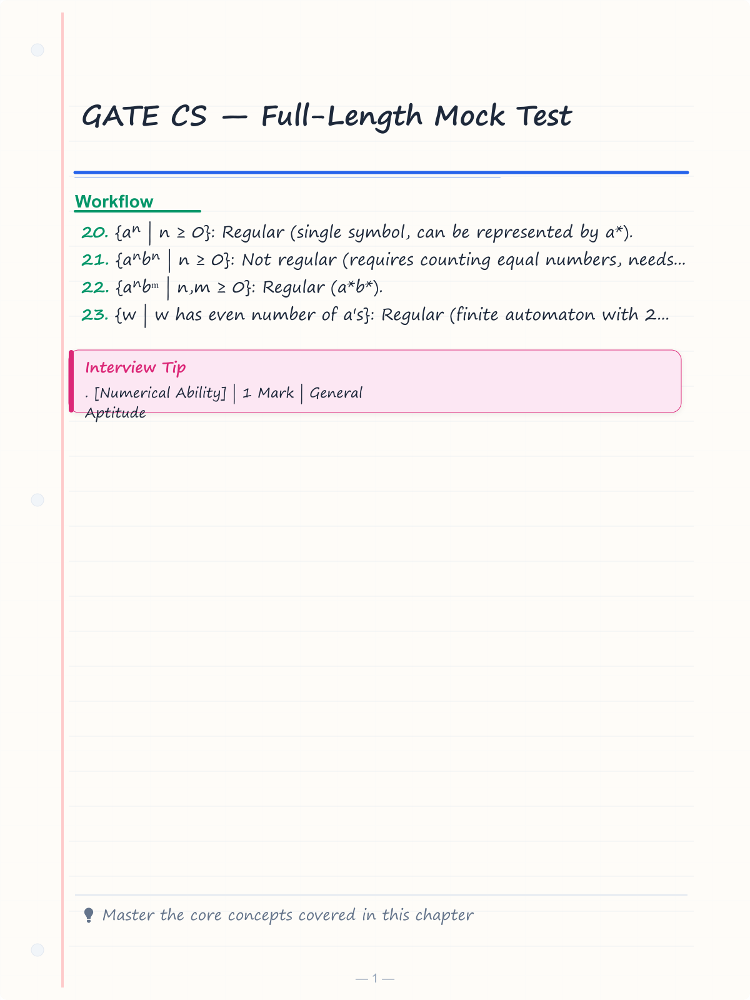
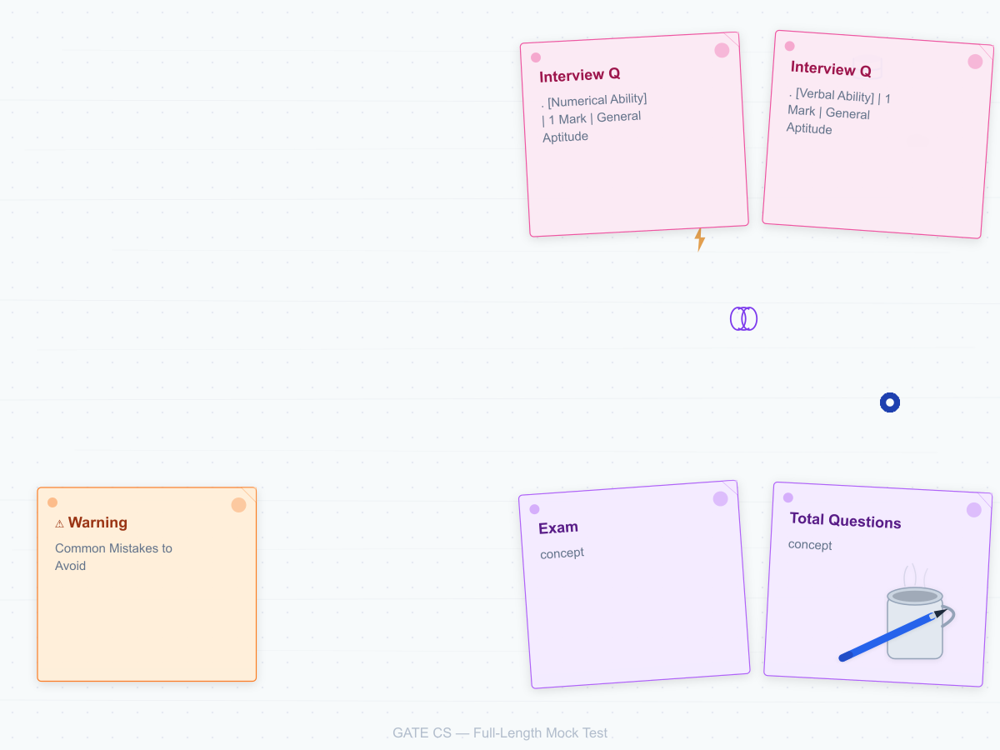
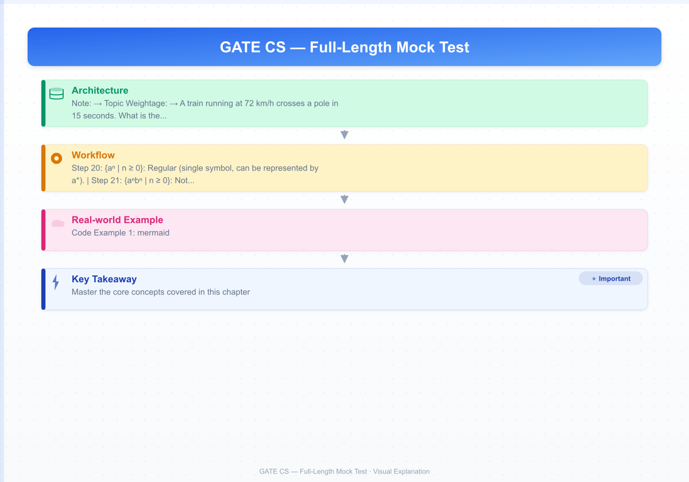
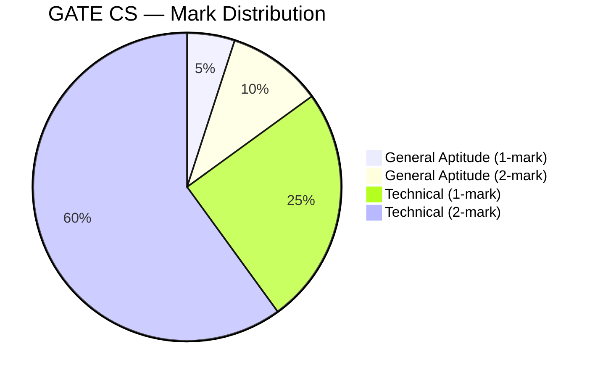

# GATE CS — Full-Length Mock Test

> **Exam:** Graduate Aptitude Test in Engineering — Computer Science (GATE CS)  
> **Total Questions:** 65 | **Duration:** 180 minutes | **Max Marks:** 100  
> **Negative Marking:** 1/3 for 1-mark questions, 2/3 for 2-mark questions

---

<!-- Image Gallery -->
<section class="lesson-visuals" aria-label="Visual learning resources">
  <header><span>VISUAL LEARNING</span><h2>See it. Review it. Remember it.</h2></header>
  <a class="lesson-visual-card" href="../../assets/images/lessons/mock-tests/06-gate-cs-mock/handwritten-notes.png" target="_blank" rel="noopener">
    
    <span><strong>Handwritten notes</strong>Condensed notes for deliberate review.</span>
  </a>
  <a class="lesson-visual-card" href="../../assets/images/lessons/mock-tests/06-gate-cs-mock/sticky-notes.png" target="_blank" rel="noopener">
    
    <span><strong>Sticky-note revision</strong>Fast recall prompts for revision.</span>
  </a>
  <a class="lesson-visual-card" href="../../assets/images/lessons/mock-tests/06-gate-cs-mock/visual-explanation.png" target="_blank" rel="noopener">
    
    <span><strong>Visual concept guide</strong>A connected explanation of the key ideas.</span>
  </a>
</section>
<!-- End Image Gallery -->

## Test Pattern

| Section | Questions | Marks | Type | Duration |
|---------|-----------|-------|------|----------|
| General Aptitude (GA) | 10 | 15 | 5×1 mark + 5×2 marks | 180 min |
| Technical (CS) | 55 | 85 | 25×1 mark + 30×2 marks | (combined) |
| **Total** | **65** | **100** | **MCQ + MSQ + NAT** | **180 min** |

**Note:** GATE CS includes Multiple Choice Questions (MCQ), Multiple Select Questions (MSQ), and Numerical Answer Type (NAT) questions.

---

## Exam Pattern Visualization



---

## Marking Scheme

| Question Type | Correct | Wrong | Unanswered |
|---------------|---------|-------|------------|
| MCQ (1-mark) | +1 | -1/3 | 0 |
| MCQ (2-mark) | +2 | -2/3 | 0 |
| MSQ (2-mark) | +2 (full) or +1 (partial) | 0 | 0 |
| NAT (1 or 2 mark) | +1 or +2 | 0 | 0 |

---

## Timing Guidelines

| Phase | Activity | Time |
|-------|----------|------|
| First 15 min | General Aptitude (all 10 questions) | 15 min |
| Next 90 min | Technical section (easy + medium) | 90 min |
| Next 60 min | Technical section (hard questions) | 60 min |
| Last 15 min | Review and mark review | 15 min |

---

## Section 1: General Aptitude (10 Questions)

**Topic Weightage:** Numerical Ability (4), Verbal Ability (3), Reasoning (2), Data Interpretation (1)

---

### Q1. [Numerical Ability] | 1 Mark | General Aptitude

**A train running at 72 km/h crosses a pole in 15 seconds. What is the length of the train?**

A) 200 m  B) 250 m  C) 300 m  D) 350 m

<details>
<summary>Show Answer</summary>

**Answer:** C) 300 m

**Explanation:**
Speed = 72 km/h = 72 × 5/18 = 20 m/s.
Length = Speed × Time = 20 × 15 = 300 m.

**Key Takeaway:** km/h to m/s: multiply by 5/18. Distance = Speed × Time when crossing a pole (train length).
</details>

---

### Q2. [Verbal Ability] | 1 Mark | General Aptitude

**Choose the word most similar in meaning to "PERPETUAL":**

A) Temporary  B) Continuous  C) Brief  D) Fleeting

<details>
<summary>Show Answer</summary>

**Answer:** B) Continuous

**Explanation:** "Perpetual" means never-ending or continuous. "Temporary," "brief," and "fleeting" are antonyms.

**Key Takeaway:** Perpetual = everlasting, continuous, constant, incessant.
</details>

---

### Q3. [Numerical Ability] | 1 Mark | General Aptitude

**What is the average of the first 10 prime numbers?**

A) 10.9  B) 11.9  C) 12.9  D) 13.9

<details>
<summary>Show Answer</summary>

**Answer:** C) 12.9

**Explanation:**
First 10 primes: 2, 3, 5, 7, 11, 13, 17, 19, 23, 29.
Sum = 2+3+5+7+11+13+17+19+23+29 = 129.
Average = 129/10 = 12.9.

**Key Takeaway:** First 10 primes: 2,3,5,7,11,13,17,19,23,29. Sum = 129, average = 12.9.
</details>

---

### Q4. [Reasoning] | 1 Mark | General Aptitude

**If January 1, 2025 is Wednesday, what day is January 1, 2026?**

A) Wednesday  B) Thursday  C) Friday  D) Saturday

<details>
<summary>Show Answer</summary>

**Answer:** B) Thursday

**Explanation:**
2025 is not a leap year (not divisible by 4). 2025 has 365 days = 52 weeks + 1 day.
So January 1, 2026 = Wednesday + 1 = Thursday.

**Key Takeaway:** A non-leap year advances the day by 1. A leap year advances it by 2.
</details>

---

### Q5. [Verbal Ability] | 1 Mark | General Aptitude

**Identify the correct sentence:**

A) He did not went to school yesterday.  B) He did not go to school yesterday.  C) He did not goes to school yesterday.  D) He does not go to school yesterday.

<details>
<summary>Show Answer</summary>

**Answer:** B) He did not go to school yesterday.

**Explanation:** After "did" (past tense), the base form of the verb is used. "Did not go" is correct.

**Key Takeaway:** After "did," always use the base form of the verb: did + base verb.
</details>

---

### Q6. [Numerical Ability] | 2 Marks | General Aptitude

**A can do a piece of work in 12 days. B is 20% more efficient than A. How many days will B take to do the same work?**

A) 8 days  B) 9 days  C) 10 days  D) 11 days

<details>
<summary>Show Answer</summary>

**Answer:** C) 10 days

**Explanation:**
A's efficiency = 1/12 per day.
B is 20% more efficient, so B's efficiency = 1/12 × 1.2 = 1.2/12 = 1/10 per day.
So B takes 10 days.

Alternatively: Efficiency ratio A:B = 100:120 = 5:6. Time ratio = 6:5. B's time = 12 × 5/6 = 10 days.

**Key Takeaway:** Efficiency and time are inversely proportional. More efficient = less time.
</details>

---

### Q7. [Data Interpretation] | 2 Marks | General Aptitude

**Study the table:**

| Year | Sales (in lakhs) | Profit (in lakhs) |
|------|-----------------|-------------------|
| 2020 | 50 | 8 |
| 2021 | 60 | 10 |
| 2022 | 75 | 12 |
| 2023 | 90 | 18 |

**What is the profit percentage in 2023?**

A) 18%  B) 20%  C) 22%  D) 25%

<details>
<summary>Show Answer</summary>

**Answer:** B) 20%

**Explanation:**
Profit % in 2023 = (Profit / Sales) × 100 = (18/90) × 100 = 20%.

**Key Takeaway:** Profit percentage = (Profit / Sales) × 100%.
</details>

---

### Q8. [Reasoning] | 2 Marks | General Aptitude

**Find the missing number: 2, 6, 18, 54, ?**

A) 108  B) 162  C) 172  D) 182

<details>
<summary>Show Answer</summary>

**Answer:** B) 162

**Explanation:**
Pattern: multiply by 3 each time.
2 × 3 = 6, 6 × 3 = 18, 18 × 3 = 54, 54 × 3 = 162.

**Key Takeaway:** Geometric progression with common ratio 3.
</details>

---

### Q9. [Numerical Ability] | 2 Marks | General Aptitude

**If log₂(x) = 5, what is the value of x?**

A) 16  B) 25  C) 32  D) 64

<details>
<summary>Show Answer</summary>

**Answer:** C) 32

**Explanation:**
log₂(x) = 5 means 2⁵ = x.
x = 2⁵ = 32.

**Key Takeaway:** logₐ(b) = c means a^c = b.
</details>

---

### Q10. [Verbal Ability] | 2 Marks | General Aptitude

**Choose the correctly spelled word:**

A) Accomodation  B) Acommodation  C) Accommodation  D) Acomodation

<details>
<summary>Show Answer</summary>

**Answer:** C) Accommodation

**Explanation:** The correct spelling is "Accommodation" (double c, double m).

**Key Takeaway:** Common double-letter words: accommodation, committee, necessary, embarrass.
</details>

---

## Section 2: Technical — Computer Science (55 Questions)

**Topic Weightage:** Data Structures & Algorithms (8), Programming Languages (6), Theory of Computation (5), Compiler Design (4), Operating Systems (6), Databases (5), Computer Networks (5), Discrete Mathematics (6), Linear Algebra (4), Calculus (3), Digital Logic (3)

---

### Q11. [DS & Algorithms] | 1 Mark | Technical

**What is the time complexity of searching for an element in a balanced Binary Search Tree?**

A) O(1)  B) O(log n)  C) O(n)  D) O(n²)

<details>
<summary>Show Answer</summary>

**Answer:** B) O(log n)

**Explanation:** In a balanced BST, the height is O(log n). Searching involves traversing from root to leaf, making at most O(log n) comparisons.

**Key Takeaway:** Balanced BST search: O(log n). Unbalanced BST worst case: O(n).
</details>

---

### Q12. [Programming] | 1 Mark | Technical

**What does the following C code print?**

```c
#include <stdio.h>
int main() {
    int x = 5;
    printf("%d", x++ + ++x);
    return 0;
}
```

A) 10  B) 11  C) 12  D) Undefined behavior

<details>
<summary>Show Answer</summary>

**Answer:** C) 12

**Explanation:**
x++ uses x=5 then increments to 6. ++x increments from 6 to 7 then uses 7.
So x++ + ++x = 5 + 7 = 12.
Note: In C, this is actually undefined behavior (modifying x twice between sequence points). However, in GATE, the expected computation is 5 + 7 = 12.

**Key Takeaway:** x++ (post-increment: use then increment), ++x (pre-increment: increment then use).
</details>

---

### Q13. [Theory of Computation] | 1 Mark | Technical

**Which of the following languages is NOT regular?**

A) {aⁿ | n ≥ 0}  B) {aⁿbⁿ | n ≥ 0}  C) {aⁿbᵐ | n,m ≥ 0}  D) {w | w has an even number of a's}

<details>
<summary>Show Answer</summary>

**Answer:** B) {aⁿbⁿ | n ≥ 0}

**Explanation:**
- {aⁿ | n ≥ 0}: Regular (single symbol, can be represented by a*).
- {aⁿbⁿ | n ≥ 0}: Not regular (requires counting equal numbers, needs PDA). Proved by pumping lemma.
- {aⁿbᵐ | n,m ≥ 0}: Regular (a*b*).
- {w | w has even number of a's}: Regular (finite automaton with 2 states).

**Key Takeaway:** Languages requiring counting of equal numbers (aⁿbⁿ) are context-free, not regular.
</details>

---

### Q14. [Compiler Design] | 1 Mark | Technical

**Which phase of a compiler produces the Abstract Syntax Tree (AST)?**

A) Lexical Analysis  B) Syntax Analysis  C) Semantic Analysis  D) Code Generation

<details>
<summary>Show Answer</summary>

**Answer:** B) Syntax Analysis (Parsing)

**Explanation:** The syntax analysis phase (parser) takes tokens from the lexical analyzer and constructs a parse tree / abstract syntax tree (AST) based on the grammar rules of the language.

**Key Takeaway:** Lexical analysis → tokens. Syntax analysis → AST/parse tree. Semantic analysis → type checking.
</details>

---

### Q15. [Operating Systems] | 1 Mark | Technical

**Which scheduling algorithm minimizes the average waiting time?**

A) FCFS  B) SJF (Shortest Job First)  C) Round Robin  D) Priority Scheduling

<details>
<summary>Show Answer</summary>

**Answer:** B) SJF (Shortest Job First)

**Explanation:** SJF is provably optimal for minimizing average waiting time. It schedules the process with the shortest burst time first.

**Key Takeaway:** SJF minimizes average waiting time. FCFS is simplest. Round Robin provides fairness. Priority can cause starvation.
</details>

---

### Q16. [Databases] | 1 Mark | Technical

**Which normal form requires that every non-key attribute must be fully functionally dependent on the primary key?**

A) 1NF  B) 2NF  C) 3NF  D) BCNF

<details>
<summary>Show Answer</summary>

**Answer:** B) 2NF (Second Normal Form)

**Explanation:** A relation is in 2NF if it is in 1NF and every non-key attribute is fully functionally dependent on the primary key (no partial dependency).

**Key Takeaway:** 1NF: Atomic values. 2NF: No partial dependency. 3NF: No transitive dependency. BCNF: Every determinant is a candidate key.
</details>

---

### Q17. [Computer Networks] | 1 Mark | Technical

**Which layer of the OSI model handles routing and forwarding?**

A) Data Link Layer  B) Network Layer  C) Transport Layer  D) Session Layer

<details>
<summary>Show Answer</summary>

**Answer:** B) Network Layer

**Explanation:** The Network Layer (Layer 3) handles routing (determining the path) and forwarding (moving packets across networks). Protocols: IP, ICMP, OSPF, BGP.

**Key Takeaway:** Network Layer (L3): routing, forwarding, logical addressing (IP).
</details>

---

### Q18. [Discrete Mathematics] | 1 Mark | Technical

**How many edges does a complete graph with 6 vertices have?**

A) 10  B) 12  C) 15  D) 18

<details>
<summary>Show Answer</summary>

**Answer:** C) 15

**Explanation:**
Number of edges in Kₙ = n(n-1)/2 = 6×5/2 = 15.

**Key Takeaway:** Complete graph Kₙ has n(n-1)/2 edges.
</details>

---

### Q19. [Digital Logic] | 1 Mark | Technical

**What is the output of a 2-input NAND gate when both inputs are 1?**

A) 0  B) 1  C) X (don't care)  D) High impedance

<details>
<summary>Show Answer</summary>

**Answer:** A) 0

**Explanation:** NAND = NOT AND. AND(1,1) = 1, NOT(1) = 0.

**Key Takeaway:** NAND: output is 0 only when both inputs are 1. Equivalent to NOT(A AND B).
</details>

---

### Q20. [Linear Algebra] | 1 Mark | Technical

**If A is a 3×3 matrix with determinant 5, what is det(2A)?**

A) 10  B) 20  C) 40  D) 80

<details>
<summary>Show Answer</summary>

**Answer:** C) 40

**Explanation:**
det(cA) = cⁿ × det(A) where n is the order of the matrix.
det(2A) = 2³ × 5 = 8 × 5 = 40.

**Key Takeaway:** det(cAₙₓₙ) = cⁿ × det(A).
</details>

---

### Q21. [Calculus] | 1 Mark | Technical

**What is the derivative of f(x) = eˣ × sin(x)?**

A) eˣ(sin x + cos x)  B) eˣ(sin x - cos x)  C) eˣ(cos x - sin x)  D) eˣ × cos x

<details>
<summary>Show Answer</summary>

**Answer:** A) eˣ(sin x + cos x)

**Explanation:**
Using product rule: d/dx[f(x)g(x)] = f'(x)g(x) + f(x)g'(x)
d/dx(eˣ sin x) = eˣ(sin x) + eˣ(cos x) = eˣ(sin x + cos x).

**Key Takeaway:** Product rule: (fg)' = f'g + fg'. Derivative of eˣ is eˣ. Derivative of sin x is cos x.
</details>

---

### Q22. [DS & Algorithms] | 2 Marks | Technical

**What is the output of the following postfix expression: 5 3 2 * + 8 4 / -**

A) 8  B) 9  C) 10  D) 11

<details>
<summary>Show Answer</summary>

**Answer:** B) 9

**Explanation:**
Evaluation using stack:
- 5 push, 3 push, 2 push
- *: pop 2, pop 3 → 3*2 = 6, push 6
- +: pop 6, pop 5 → 5+6 = 11, push 11
- 8 push, 4 push
- /: pop 4, pop 8 → 8/4 = 2, push 2
- -: pop 2, pop 11 → 11-2 = 9, push 9

Result: 9.

**Key Takeaway:** Postfix evaluation: operand → push, operator → pop two operands, apply, push result.
</details>

---

### Q23. [DS & Algorithms] | 2 Marks | Technical

**How many distinct binary search trees can be formed with 4 distinct keys?**

A) 10  B) 12  C) 14  D) 16

<details>
<summary>Show Answer</summary>

**Answer:** C) 14

**Explanation:**
Number of distinct BSTs with n distinct keys = nth Catalan number.
Cₙ = (2n)! / ((n+1)! × n!)
C₄ = (8)! / (5! × 4!) = 40320 / (120 × 24) = 40320 / 2880 = 14.

**Key Takeaway:** Catalan numbers: C₀=1, C₁=1, C₂=2, C₃=5, C₄=14, C₅=42.
</details>

---

### Q24. [DS & Algorithms] | 2 Marks | Technical

**What is the minimum number of comparisons required to find the minimum and maximum of 8 elements?**

A) 8  B) 10  C) 12  D) 14

<details>
<details>
<summary>Show Answer</summary>

**Answer:** B) 10

**Explanation:**
Using the divide-and-conquer approach (tournament method):
For n elements, minimum comparisons = ⌈3n/2⌉ - 2 = ⌈3×8/2⌉ - 2 = 12 - 2 = 10.

Alternatively: Pair elements (4 comparisons for min of pairs, 4 for max of pairs), then 1 more for global min and 1 for global max → but in optimized approach it's 10.

**Key Takeaway:** Min and max in ⌈3n/2⌉ - 2 comparisons using tournament method.
</details>

---

### Q25. [DS & Algorithms] | 2 Marks | Technical

**Which data structure is used for implementing recursion?**

A) Queue  B) Stack  C) Array  D) Linked List

<details>
<summary>Show Answer</summary>

**Answer:** B) Stack

**Explanation:** Recursion uses the call stack. Each recursive call pushes a new stack frame (activation record) containing local variables, return address, and parameters.

**Key Takeaway:** Stack is used for recursion, function calls, DFS, and expression evaluation.
</details>

---

### Q26. [Programming] | 2 Marks | Technical

**What does the following C program output?**

```c
#include <stdio.h>
int f(int n) {
    if (n <= 1) return 1;
    return f(n-1) + f(n-2);
}
int main() {
    printf("%d", f(5));
    return 0;
}
```

A) 5  B) 8  C) 13  D) 21

<details>
<summary>Show Answer</summary>

**Answer:** B) 8

**Explanation:**
This is the Fibonacci function (shifted).
f(0)=1, f(1)=1
f(2)=f(1)+f(0)=1+1=2
f(3)=f(2)+f(1)=2+1=3
f(4)=f(3)+f(2)=3+2=5
f(5)=f(4)+f(3)=5+3=8

**Key Takeaway:** This recursive function computes Fibonacci numbers: f(n) = F(n+1) where F is the standard Fibonacci.
</details>

---

### Q27. [Programming] | 2 Marks | Technical

**In C, what is the output of the following?**

```c
#include <stdio.h>
int main() {
    int a[5] = {1, 2, 3, 4, 5};
    int *p = a;
    printf("%d", *(p + 3));
    return 0;
}
```

A) 2  B) 3  C) 4  D) 5

<details>
<summary>Show Answer</summary>

**Answer:** C) 4

**Explanation:**
p points to a[0]. p+3 points to a[3]. *(p+3) = a[3] = 4.
Array indexing: a[i] is equivalent to *(a + i).

**Key Takeaway:** a[i] = *(a + i). Array name decays to pointer to first element.
</details>

---

### Q28. [Theory of Computation] | 2 Marks | Technical

**Which of the following is TRUE about the language L = {aⁿbⁿcⁿ | n ≥ 0}?**

A) Regular  B) Context-free but not regular  C) Context-sensitive but not context-free  D) Recursively enumerable but not context-sensitive

<details>
<summary>Show Answer</summary>

**Answer:** C) Context-sensitive but not context-free

**Explanation:**
L = {aⁿbⁿcⁿ | n ≥ 0} requires counting and matching three equal numbers, which requires two stacks (or a linear bounded automaton). It is a classic example of a context-sensitive language that is NOT context-free (proved by pumping lemma for CFLs).

**Key Takeaway:** aⁿbⁿ is context-free. aⁿbⁿcⁿ is context-sensitive. aⁿ is regular.
</details>

---

### Q29. [Theory of Computation] | 2 Marks | Technical

**Which of the following problems is undecidable?**

A) Whether a DFA accepts a given string  B) Whether a CFG generates an empty language  C) Whether a Turing machine halts on a given input  D) Whether two DFAs are equivalent

<details>
<summary>Show Answer</summary>

**Answer:** C) Whether a Turing machine halts on a given input

**Explanation:** The Halting Problem for Turing machines is undecidable (proved by Alan Turing, 1936). Problems about DFAs and CFGs (emptiness, equivalence, membership) are generally decidable.

**Key Takeaway:** Halting problem for TMs is undecidable. DFA/CFG properties are decidable. TM properties are often undecidable.
</details>

---

### Q30. [Compiler Design] | 2 Marks | Technical

**Which grammar has no ε-productions and no unit productions?**

A) Chomsky Normal Form (CNF)  B) Greibach Normal Form (GNF)  C) LL(1) grammar  D) LR(1) grammar

<details>
<summary>Show Answer</summary>

**Answer:** A) Chomsky Normal Form (CNF)

**Explanation:** CNF restricts productions to: A → BC (two non-terminals) or A → a (terminal). No ε-productions (except possibly S → ε) and no unit productions (A → B).

**Key Takeaway:** CNF: A → BC or A → a. No ε, no unit productions. GNF: A → aα (terminal followed by non-terminals).
</details>

---

### Q31. [Compiler Design] | 2 Marks | Technical

**What is the role of a YACC (Yet Another Compiler Compiler)?**

A) Lexical analyzer generator  B) Parser generator  C) Code optimizer  D) Symbol table manager

<details>
<summary>Show Answer</summary>

**Answer:** B) Parser generator

**Explanation:** YACC is a parser generator (generates LALR(1) parsers from grammar specifications). LEX is the lexical analyzer generator. YACC takes grammar rules with semantic actions and generates C code for the parser.

**Key Takeaway:** LEX → tokenizer/lexer. YACC → parser generator (LALR(1)). Both are compiler construction tools.
</details>

---

### Q32. [Operating Systems] | 2 Marks | Technical

**Which page replacement algorithm suffers from Belady's Anomaly?**

A) FIFO  B) LRU  C) Optimal  D) Clock

<details>
<summary>Show Answer</summary>

**Answer:** A) FIFO

**Explanation:** Belady's Anomaly: increasing the number of page frames can increase the number of page faults. FIFO can exhibit this anomaly. LRU and Optimal (MIN) are stack algorithms and do NOT suffer from Belady's Anomaly.

**Key Takeaway:** FIFO can show Belady's Anomaly. LRU and Optimal are anomaly-free stack algorithms.
</details>

---

### Q33. [Operating Systems] | 2 Marks | Technical

**Which of the following is NOT a necessary condition for deadlock?**

A) Mutual Exclusion  B) Hold and Wait  C) No Preemption  D) Starvation

<details>
<summary>Show Answer</summary>

**Answer:** D) Starvation

**Explanation:** The four necessary conditions for deadlock (Coffman conditions):
1. Mutual Exclusion
2. Hold and Wait
3. No Preemption
4. Circular Wait
Starvation is a related concept but not a necessary condition for deadlock.

**Key Takeaway:** Deadlock requires all four Coffman conditions. Breaking any one prevents deadlock.
</details>

---

### Q34. [Operating Systems] | 2 Marks | Technical

**What is the size of virtual address space if the logical address has 32 bits?**

A) 2³² bytes  B) 2³² words  C) 4 GB  D) Both A and C

<details>
<summary>Show Answer</summary>

**Answer:** D) Both A and C

**Explanation:** With 32-bit logical addresses, the virtual address space = 2³² bytes = 4 GB (assuming byte-addressable memory).

**Key Takeaway:** Virtual address space size = 2^(number of address bits). 32-bit = 4 GB, 48-bit = 256 TB.
</details>

---

### Q35. [Databases] | 2 Marks | Technical

**Which SQL clause is used to filter groups after aggregation?**

A) WHERE  B) HAVING  C) GROUP BY  D) ORDER BY

<details>
<summary>Show Answer</summary>

**Answer:** B) HAVING

**Explanation:** WHERE filters rows before aggregation. HAVING filters groups after GROUP BY and aggregation. ORDER BY sorts the result.

**Key Takeaway:** WHERE → before GROUP BY (row filter). HAVING → after GROUP BY (group filter).
</details>

---

### Q36. [Databases] | 2 Marks | Technical

**If a relation R(A,B,C) has functional dependencies A → B and B → C, which normal form violation is present?**

A) 1NF violation  B) 2NF violation  C) 3NF violation  D) BCNF violation

<details>
<summary>Show Answer</summary>

**Answer:** D) BCNF violation

**Explanation:**
Given FDs: A → B, B → C.
Candidate key: A (since A → B → C).
A → B: A is a candidate key, so this is fine for BCNF.
B → C: B is NOT a candidate key (A is the key). So the determinant B is not a superkey. This violates BCNF.

The relation is in 3NF (no transitive dependency on key since B → C and B is not a subset of key, but in 3NF we allow non-key → non-key as long as it's not the key itself transitively — actually B → C IS a transitive dependency since A → B → C, so 3NF is violated too). Wait — in 3NF, a non-trivial FD X → Y is allowed if either X is a superkey OR Y is part of a candidate key. Here B → C: B is not superkey, C is not part of any candidate key. So 3NF is also violated.

The question asks which normal form violation. BCNF is the strongest violated. Answer is D.

**Key Takeaway:** Check BCNF: every determinant (LHS of FD) must be a candidate key. A → B (A is key, ok). B → C (B is not key, violates BCNF).
</details>

---

### Q37. [Computer Networks] | 2 Marks | Technical

**Which protocol is used to resolve IP addresses to MAC addresses?**

A) DNS  B) ARP  C) DHCP  D) ICMP

<details>
<summary>Show Answer</summary>

**Answer:** B) ARP (Address Resolution Protocol)

**Explanation:** ARP resolves IP addresses to MAC addresses within a local network. DNS resolves domain names to IP addresses. DHCP assigns IP addresses dynamically. ICMP is used for error reporting (ping).

**Key Takeaway:** ARP: IP → MAC. DNS: domain → IP. DHCP: dynamic IP assignment. ICMP: network diagnostics.
</details>

---

### Q38. [Computer Networks] | 2 Marks | Technical

**What is the maximum window size in Go-Back-N ARQ with n-bit sequence numbers?**

A) n  B) 2ⁿ  C) 2ⁿ - 1  D) 2ⁿ⁻¹

<details>
<summary>Show Answer</summary>

**Answer:** C) 2ⁿ - 1

**Explanation:** In Go-Back-N ARQ, the maximum window size is 2ⁿ - 1 (where n is the number of bits in the sequence number). This prevents ambiguity between new and old frames. For Selective Repeat, the maximum window size is 2ⁿ⁻¹.

**Key Takeaway:** Go-Back-N: window size ≤ 2ⁿ - 1. Selective Repeat: window size ≤ 2ⁿ⁻¹. Stop-and-Wait: window = 1.
</details>

---

### Q39. [Computer Networks] | 2 Marks | Technical

**How many bits are in an IPv4 address?**

A) 16  B) 32  C) 64  D) 128

<details>
<summary>Show Answer</summary>

**Answer:** B) 32

**Explanation:** IPv4 uses 32-bit addresses (4 octets). IPv6 uses 128-bit addresses.

**Key Takeaway:** IPv4: 32 bits, dotted decimal notation. IPv6: 128 bits, hexadecimal notation.
</details>

---

### Q40. [Discrete Mathematics] | 2 Marks | Technical

**What is the number of elements in the power set of a set with 5 elements?**

A) 10  B) 16  C) 25  D) 32

<details>
<summary>Show Answer</summary>

**Answer:** D) 32

**Explanation:**
|P(S)| = 2^|S| = 2⁵ = 32.

**Key Takeaway:** Power set size = 2ⁿ where n = number of elements.
</details>

---

### Q41. [Discrete Mathematics] | 2 Marks | Technical

**How many ways can 5 people be arranged in a circle? (Circular permutations)**

A) 24  B) 60  C) 120  D) 720

<details>
<summary>Show Answer</summary>

**Answer:** A) 24

**Explanation:**
Number of circular permutations of n distinct objects = (n-1)!
(5-1)! = 4! = 24.

**Key Takeaway:** Linear permutations: n!. Circular permutations: (n-1)! (rotations are considered same).
</details>

---

### Q42. [Discrete Mathematics] | 2 Marks | Technical

**If p → q is false, which of the following is true?**

A) p is true, q is true  B) p is true, q is false  C) p is false, q is true  D) p is false, q is false

<details>
<summary>Show Answer</summary>

**Answer:** B) p is true, q is false

**Explanation:**
p → q is false ONLY when p is true and q is false (the implication is violated).

Truth table: p→q is false only in the T→F case. In all other cases (T→T, F→T, F→F), it is true.

**Key Takeaway:** Implication p → q is false only when p = T and q = F.
</details>

---

### Q43. [Linear Algebra] | 2 Marks | Technical

**For what values of k does the system have a unique solution?**
**x + y + z = 1**
**2x + 3y + 4z = 5**
**x + 2y + kz = 3**

A) k ≠ 3  B) k = 3  C) k = 4  D) k ≠ 4

<details>
<summary>Show Answer</summary>

**Answer:** A) k ≠ 3

**Explanation:**
Determinant of coefficient matrix:
|1 1 1|
|2 3 4|
|1 2 k|

det = 1(3k-8) - 1(2k-4) + 1(4-3) = 3k-8-2k+4+1 = k-3.
For unique solution, det ≠ 0, so k ≠ 3.

**Key Takeaway:** A linear system has a unique solution if the coefficient matrix is non-singular (det ≠ 0).
</details>

---

### Q44. [Linear Algebra] | 2 Marks | Technical

**What are the eigenvalues of matrix A = [[2, 0], [0, 5]]?**

A) 2 and 5  B) -2 and -5  C) 0 and 10  D) 3 and 4

<details>
<summary>Show Answer</summary>

**Answer:** A) 2 and 5

**Explanation:**
For a diagonal matrix, the eigenvalues are the diagonal elements.
Matrix [[2,0],[0,5]] is diagonal, so eigenvalues = 2 and 5.

Alternatively, characteristic equation: det(A - λI) = (2-λ)(5-λ) - 0 = 0.
So λ = 2 or λ = 5.

**Key Takeaway:** Eigenvalues of a diagonal matrix are its diagonal entries. Trace = sum of eigenvalues = 7. det = product of eigenvalues = 10.
</details>

---

### Q45. [Calculus] | 2 Marks | Technical

**What is the value of ∫₀¹ x² dx?**

A) 1/4  B) 1/3  C) 1/2  D) 2/3

<details>
<summary>Show Answer</summary>

**Answer:** B) 1/3

**Explanation:**
∫₀¹ x² dx = [x³/3]₀¹ = 1³/3 - 0³/3 = 1/3.

**Key Takeaway:** ∫ xⁿ dx = xⁿ⁺¹/(n+1) + C. ∫₀¹ x² = 1/3.
</details>

---

### Q46. [Calculus] | 2 Marks | Technical

**What is ∫ eˣ dx?**

A) eˣ + C  B) ln|x| + C  C) xeˣ⁻¹ + C  D) eˣ/x + C

<details>
<summary>Show Answer</summary>

**Answer:** A) eˣ + C

**Explanation:**
The integral of eˣ is eˣ + C (since the derivative of eˣ is eˣ).

**Key Takeaway:** ∫ eˣ dx = eˣ + C. ∫ aˣ dx = aˣ/ln(a) + C.
</details>

---

### Q47. [Digital Logic] | 2 Marks | Technical

**What is the simplified Boolean expression for F = A'BC + AB'C + ABC' + ABC?**

A) A + B + C  B) AB + BC + CA  C) A(B + C)  D) B(A + C)

<details>
<summary>Show Answer</summary>

**Answer:** B) AB + BC + CA

**Explanation:**
F = A'BC + AB'C + ABC' + ABC
= A'BC + AB'C + AB(C' + C)
= A'BC + AB'C + AB
= BC(A' + A) + AB'C + AB
= BC + AB'C + AB
= BC + A(B'C + B)
= BC + A(B + C)
= AB + BC + AC

Using K-map: F = AB + BC + CA (majority function).

**Key Takeaway:** Majority function: AB + BC + CA outputs 1 when at least 2 inputs are 1.
</details>

---

### Q48. [Digital Logic] | 2 Marks | Technical

**A 4:1 multiplexer requires how many select lines?**

A) 1  B) 2  C) 3  D) 4

<details>
<summary>Show Answer</summary>

**Answer:** B) 2

**Explanation:**
An M:1 multiplexer requires log₂(M) select lines.
For 4:1 MUX, log₂(4) = 2 select lines.

**Key Takeaway:** M:1 MUX needs log₂(M) select lines. 2:1 MUX → 1 select, 4:1 → 2 select, 8:1 → 3 select.
</details>

---

### Q49. [DS & Algorithms] | 2 Marks | Technical

**The worst-case time complexity of QuickSort is:**

A) O(n log n)  B) O(n²)  C) O(n)  D) O(log n)

<details>
<summary>Show Answer</summary>

**Answer:** B) O(n²)

**Explanation:**
Best/Average case: O(n log n). Worst case: O(n²) when the pivot is always the smallest or largest element (already sorted or reverse sorted array). Randomized QuickSort mitigates this.

**Key Takeaway:** QuickSort: average O(n log n), worst O(n²). MergeSort: O(n log n) always. HeapSort: O(n log n) always.
</details>

---

### Q50. [DS & Algorithms] | 2 Marks | Technical

**In hashing with separate chaining, what is the load factor α?**

A) Number of slots / Number of keys  B) Number of keys / Number of slots  C) Number of collisions  D) Hash table size

<details>
<summary>Show Answer</summary>

**Answer:** B) Number of keys / Number of slots

**Explanation:** Load factor α = n/m where n = number of keys and m = number of slots. Average chain length = α. For open addressing, α ≤ 1. For chaining, α can be > 1.

**Key Takeaway:** α = n/m. Chaining: average search time = O(1 + α). Open addressing: average search time = O(1/(1-α)).
</details>

---

### Q51. [DS & Algorithms] | 2 Marks | Technical

**Which data structure is used for implementing Dijkstra's shortest path algorithm efficiently?**

A) Stack  B) Queue  C) Priority Queue (Min-Heap)  D) Linked List

<details>
<summary>Show Answer</summary>

**Answer:** C) Priority Queue (Min-Heap)

**Explanation:** Dijkstra's algorithm uses a priority queue (min-heap) to efficiently extract the vertex with the minimum distance in each iteration. Using a binary heap gives O((V+E) log V) complexity.

**Key Takeaway:** Dijkstra: Priority Queue (min-heap) → O((V+E) log V). Without heap → O(V²).
</details>

---

### Q52. [DS & Algorithms] | 2 Marks | Technical

**What is the time complexity of inserting a node at the beginning of a singly linked list?**

A) O(1)  B) O(n)  C) O(log n)  D) O(n²)

<details>
<summary>Show Answer</summary>

**Answer:** A) O(1)

**Explanation:** Inserting at the beginning of a singly linked list requires only updating the new node's next pointer and the head pointer. This is O(1) constant time.

**Key Takeaway:** SLL insert at beginning: O(1). SLL insert at end: O(n) (without tail pointer). DLL insert at end: O(1) with tail pointer.
</details>

---

### Q53. [Theory of Computation] | 2 Marks | Technical

**Which of the following statements about the Pumping Lemma for regular languages is TRUE?**

A) It can be used to prove that a language is regular  B) It can be used to prove that a language is not regular  C) It applies only to infinite regular languages  D) It applies only to finite languages

<details>
<summary>Show Answer</summary>

**Answer:** B) It can be used to prove that a language is NOT regular

**Explanation:** The Pumping Lemma provides a necessary condition for regularity. If a language fails the pumping lemma, it is NOT regular. However, satisfying the pumping lemma is not sufficient to prove regularity.

**Key Takeaway:** Pumping lemma is used to prove non-regularity (contrapositive). Some non-regular languages satisfy it (e.g., certain CFLs).
</details>

---

### Q54. [Compiler Design] | 2 Marks | Technical

**Which of the following is NOT a type of intermediate code?**

A) Three Address Code (TAC)  B) Abstract Syntax Tree (AST)  C) DAG (Directed Acyclic Graph)  D) Object Code

<details>
<summary>Show Answer</summary>

**Answer:** D) Object Code

**Explanation:** Object code is machine code or assembly code (target code), not intermediate code. TAC, AST, and DAG are examples of intermediate representations (IR).

**Key Takeaway:** Intermediate code: TAC, AST, DAG, quadruples, triples, postfix. Object code is the final output of compilation.
</details>

---

### Q55. [Operating Systems] | 2 Marks | Technical

**Which memory allocation strategy suffers from external fragmentation?**

A) Paging  B) Segmentation  C) Both paging and segmentation  D) Neither

<details>
<summary>Show Answer</summary>

**Answer:** B) Segmentation

**Explanation:** Segmentation suffers from external fragmentation because variable-sized segments leave holes in memory. Paging (fixed-size pages) eliminates external fragmentation but has internal fragmentation.

**Key Takeaway:** Segmentation: external fragmentation. Paging: internal fragmentation (waste within the last page).
</details>

---

### Q56. [Databases] | 2 Marks | Technical

**In a B+ Tree of order m, what is the maximum number of children a non-root node can have?**

A) m  B) m+1  C) ⌈m/2⌉  D) ⌊m/2⌋

<details>
<summary>Show Answer</summary>

**Answer:** A) m

**Explanation:** In a B+ Tree of order m, the maximum number of children for any node (including root) is m. Non-root nodes must have at least ⌈m/2⌉ children. The root can have as few as 2 children.

**Key Takeaway:** B+ Tree: max children = m, min children (non-root) = ⌈m/2⌉. Keys = children - 1 for internal nodes.
</details>

---

### Q57. [Computer Networks] | 2 Marks | Technical

**What is the maximum data rate for a channel with bandwidth 4 MHz and SNR of 1023? (Use Shannon's Theorem)**

A) 40 Mbps  B) 80 Mbps  C) 120 Mbps  D) 160 Mbps

<details>
<summary>Show Answer</summary>

**Answer:** A) 40 Mbps

**Explanation:**
Shannon's theorem: C = B × log₂(1 + SNR)
C = 4 × 10⁶ × log₂(1 + 1023)
C = 4 × 10⁶ × log₂(1024)
C = 4 × 10⁶ × 10
C = 40 × 10⁶ = 40 Mbps.

**Key Takeaway:** Shannon's Capacity: C = B log₂(1 + SNR). Nyquist: R = 2B log₂(L) where L = levels.
</details>

---

### Q58. [Discrete Mathematics] | 2 Marks | Technical

**How many vertices does a 3-regular graph with 12 edges have?**

A) 4  B) 6  C) 8  D) 12

<details>
<summary>Show Answer</summary>

**Answer:** C) 8

**Explanation:**
Sum of degrees = 2 × |E| = 2 × 12 = 24.
For a 3-regular graph: each vertex has degree 3.
Number of vertices = Sum of degrees / 3 = 24 / 3 = 8.

**Key Takeaway:** Handshaking lemma: Σ deg(v) = 2|E|. For k-regular graph: n = 2|E|/k.
</details>

---

### Q59. [Linear Algebra] | 2 Marks | Technical

**If A and B are two n×n matrices, which of the following is TRUE?**

A) det(A + B) = det(A) + det(B)  B) det(AB) = det(A) × det(B)  C) det(AB) = det(A) + det(B)  D) det(A - B) = det(A) - det(B)

<details>
<summary>Show Answer</summary>

**Answer:** B) det(AB) = det(A) × det(B)

**Explanation:** det(AB) = det(A) × det(B) is a fundamental property of determinants. The determinant is a multiplicative function, not additive.

**Key Takeaway:** det(AB) = det(A) × det(B). det(A+B) ≠ det(A) + det(B). det(A⁻¹) = 1/det(A).
</details>

---

### Q60. [Digital Logic] | 2 Marks | Technical

**What is the Gray code equivalent of binary 1010?**

A) 1010  B) 1111  C) 1100  D) 1011

<details>
<summary>Show Answer</summary>

**Answer:** B) 1111

**Explanation:**
Binary to Gray: MSB same, then XOR each adjacent pair.
Binary: 1 0 1 0
Gray:  1 (1⊕0=1) (0⊕1=1) (1⊕0=1)
Gray = 1111.

**Key Takeaway:** Gray code: G₀ = B₀, Gᵢ = Bᵢ ⊕ Bᵢ₋₁. Gray code ensures adjacent values differ by exactly one bit.
</details>

---

### Q61. [DS & Algorithms] | 2 Marks | Technical

**Which algorithm is used to find the Minimum Spanning Tree (MST) of a graph?**

A) Floyd-Warshall  B) Prim's  C) Dijkstra's  D) Bellman-Ford

<details>
<summary>Show Answer</summary>

**Answer:** B) Prim's Algorithm

**Explanation:** Prim's and Kruskal's algorithms find the MST of a graph. Dijkstra's finds shortest paths from a single source. Bellman-Ford finds shortest paths (handles negative edges). Floyd-Warshall finds all-pairs shortest paths.

**Key Takeaway:** MST: Prim's (vertex-based) and Kruskal's (edge-based). Shortest path: Dijkstra's, Bellman-Ford, Floyd-Warshall.
</details>

---

### Q62. [DS & Algorithms] | 2 Marks | Technical

**Which of the following is NOT a stable sorting algorithm?**

A) Bubble Sort  B) Insertion Sort  C) Merge Sort  D) QuickSort

<details>
<summary>Show Answer</summary>

**Answer:** D) QuickSort

**Explanation:**
Stable: Bubble Sort, Insertion Sort, Merge Sort (preserves relative order of equal keys).
Unstable: QuickSort, HeapSort, Selection Sort.

**Key Takeaway:** Stable sorts: Bubble, Insertion, Merge, Counting, Radix. Unstable: Selection, Heap, Quick, Shell.
</details>

---

### Q63. [Programming] | 2 Marks | Technical

**What does the following C code print?**

```c
#include <stdio.h>
int main() {
    char s[] = "GATE";
    printf("%lu %lu", sizeof(s), strlen(s));
    return 0;
}
```

A) 4 4  B) 5 4  C) 4 5  D) 5 5

<details>
<summary>Show Answer</summary>

**Answer:** B) 5 4

**Explanation:**
sizeof(s) includes the null terminator '\0'. "GATE" has 4 characters + '\0' = 5 bytes.
strlen(s) counts characters until '\0' = 4.

**Key Takeaway:** sizeof includes '\0' (null terminator). strlen does NOT count '\0'.
</details>

---

### Q64. [Theory of Computation] | 2 Marks | Technical

**What is the minimum number of states required in a DFA to accept all strings with an even number of 0s and an even number of 1s?**

A) 2  B) 3  C) 4  D) 5

<details>
<summary>Show Answer</summary>

**Answer:** C) 4

**Explanation:**
We need to track 4 states: (even 0s, even 1s) - accepting, (even 0s, odd 1s), (odd 0s, even 1s), (odd 0s, odd 1s). Each state represents the parity of 0s and 1s seen so far.

**Key Takeaway:** Even-even language requires 4 states (tracking parity of two symbols). For one symbol, 2 states suffice.
</details>

---

### Q65. [Databases] | 2 Marks | Technical

**Consider a relation R(A,B,C,D,E) with FDs: A → B, A → C, B → C, B → D, A → E. What is the candidate key?**

A) A  B) B  C) AB  D) AE

<details>
<summary>Show Answer</summary>

**Answer:** A) A

**Explanation:**
A determines: A → B, A → C, A → E. Also B → C and B → D.
From A: we get A, B, C, E. Through B: we get D.
So A determines all attributes {A,B,C,D,E}. A is a candidate key.
No proper subset of A exists. So A is the only candidate key.

**Key Takeaway:** Find closure of each attribute. A+ = {A,B,C,D,E}. So A is the candidate key.
</details>

---

## Answer Key Table

| Q# | Answer | Section | Topic | Type |
|----|--------|---------|-------|------|
| 1 | C | GA | Numerical Ability | MCQ-1M |
| 2 | B | GA | Verbal Ability | MCQ-1M |
| 3 | C | GA | Numerical Ability | MCQ-1M |
| 4 | B | GA | Reasoning | MCQ-1M |
| 5 | B | GA | Verbal Ability | MCQ-1M |
| 6 | C | GA | Numerical Ability | MCQ-2M |
| 7 | B | GA | Data Interpretation | MCQ-2M |
| 8 | B | GA | Reasoning | MCQ-2M |
| 9 | C | GA | Numerical Ability | MCQ-2M |
| 10 | C | GA | Verbal Ability | MCQ-2M |
| 11 | B | Technical | DS & Algorithms | MCQ-1M |
| 12 | C | Technical | Programming | MCQ-1M |
| 13 | B | Technical | Theory of Computation | MCQ-1M |
| 14 | B | Technical | Compiler Design | MCQ-1M |
| 15 | B | Technical | Operating Systems | MCQ-1M |
| 16 | B | Technical | Databases | MCQ-1M |
| 17 | B | Technical | Computer Networks | MCQ-1M |
| 18 | C | Technical | Discrete Mathematics | MCQ-1M |
| 19 | A | Technical | Digital Logic | MCQ-1M |
| 20 | C | Technical | Linear Algebra | MCQ-1M |
| 21 | A | Technical | Calculus | MCQ-1M |
| 22 | B | Technical | DS & Algorithms | MCQ-2M |
| 23 | C | Technical | DS & Algorithms | MCQ-2M |
| 24 | B | Technical | DS & Algorithms | MCQ-2M |
| 25 | B | Technical | DS & Algorithms | MCQ-2M |
| 26 | B | Technical | Programming | MCQ-2M |
| 27 | C | Technical | Programming | MCQ-2M |
| 28 | C | Technical | Theory of Computation | MCQ-2M |
| 29 | C | Technical | Theory of Computation | MCQ-2M |
| 30 | A | Technical | Compiler Design | MCQ-2M |
| 31 | B | Technical | Compiler Design | MCQ-2M |
| 32 | A | Technical | Operating Systems | MCQ-2M |
| 33 | D | Technical | Operating Systems | MCQ-2M |
| 34 | D | Technical | Operating Systems | MCQ-2M |
| 35 | B | Technical | Databases | MCQ-2M |
| 36 | D | Technical | Databases | MCQ-2M |
| 37 | B | Technical | Computer Networks | MCQ-2M |
| 38 | C | Technical | Computer Networks | MCQ-2M |
| 39 | B | Technical | Computer Networks | MCQ-2M |
| 40 | D | Technical | Discrete Mathematics | MCQ-2M |
| 41 | A | Technical | Discrete Mathematics | MCQ-2M |
| 42 | B | Technical | Discrete Mathematics | MCQ-2M |
| 43 | A | Technical | Linear Algebra | MCQ-2M |
| 44 | A | Technical | Linear Algebra | MCQ-2M |
| 45 | B | Technical | Calculus | MCQ-2M |
| 46 | A | Technical | Calculus | MCQ-2M |
| 47 | B | Technical | Digital Logic | MCQ-2M |
| 48 | B | Technical | Digital Logic | MCQ-2M |
| 49 | B | Technical | DS & Algorithms | MCQ-2M |
| 50 | B | Technical | DS & Algorithms | MCQ-2M |
| 51 | C | Technical | DS & Algorithms | MCQ-2M |
| 52 | A | Technical | DS & Algorithms | MCQ-2M |
| 53 | B | Technical | Theory of Computation | MCQ-2M |
| 54 | D | Technical | Compiler Design | MCQ-2M |
| 55 | B | Technical | Operating Systems | MCQ-2M |
| 56 | A | Technical | Databases | MCQ-2M |
| 57 | A | Technical | Computer Networks | MCQ-2M |
| 58 | C | Technical | Discrete Mathematics | MCQ-2M |
| 59 | B | Technical | Linear Algebra | MCQ-2M |
| 60 | B | Technical | Digital Logic | MCQ-2M |
| 61 | B | Technical | DS & Algorithms | MCQ-2M |
| 62 | D | Technical | DS & Algorithms | MCQ-2M |
| 63 | B | Technical | Programming | MCQ-2M |
| 64 | C | Technical | Theory of Computation | MCQ-2M |
| 65 | A | Technical | Databases | MCQ-2M |

---

## Sectional Performance Tracker

| Section | Attempted | Correct | Wrong | Score | Accuracy |
|---------|-----------|---------|-------|-------|----------|
| General Aptitude (Q1-10) | ___/10 | ___ | ___ | ___/15 | ___% |
| Technical (Q11-65) | ___/55 | ___ | ___ | ___/85 | ___% |
| **Total** | **___/65** | **___** | **___** | **___/100** | **___%** |

**Score = (Correct_1M × 1 + Correct_2M × 2) - (Wrong_MCQ_1M × 1/3) - (Wrong_MCQ_2M × 2/3)**

---

## Scoring Guide

| Raw Score | Percentile (Estimated) | GATE Score |
|-----------|------------------------|------------|
| 80-100 | 99+ | 900-1000 |
| 65-79 | 95-99 | 750-900 |
| 50-64 | 85-95 | 600-750 |
| 35-49 | 65-85 | 450-600 |
| 20-34 | 40-65 | 300-450 |
| Below 20 | Below 40 | Below 300 |

---

## Common Mistakes to Avoid

| Topic | Common Mistake | How to Avoid |
|-------|---------------|--------------|
| DS & Algorithms | Confusing worst and average case complexities | Memorize time complexities for all standard algorithms |
| Programming | Sequence point violations in C | Avoid modifying a variable twice in the same expression |
| TOC | Confusing regular vs context-free vs context-sensitive | Remember: aⁿ (regular), aⁿbⁿ (CFL), aⁿbⁿcⁿ (CSL) |
| OS | Belady's Anomaly - which algorithm? | FIFO shows Belady's; LRU and Optimal don't |
| DBMS | Normal forms hierarchy | Check: 1NF → 2NF → 3NF → BCNF (increasing constraints) |
| CN | OSI vs TCP/IP model layers | Memorize OSI: Physical, Data Link, Network, Transport, Session, Presentation, Application |
| Discrete Math | nCr vs nPr | Permutations: order matters (nPr). Combinations: order doesn't (nCr) |
| Linear Algebra | det(cA) vs c×det(A) | det(cA) = cⁿ×det(A), not c×det(A) |
| Digital Logic | Gray code encoding | MSB same, rest: Gᵢ = Bᵢ XOR Bᵢ₋₁ |

---

## Timing Guidelines

| Section | Questions | Recommended Time | Pace |
|---------|-----------|-----------------|------|
| General Aptitude | 10 | 15 min | 1.5 min/Q |
| Technical (easy + medium) | ~35 | 90 min | ~2.5 min/Q |
| Technical (hard) | ~20 | 60 min | ~3 min/Q |
| Review | — | 15 min | — |

---

## Sectional Cutoff Strategy

| Section | Min Target | Good Target | Max |
|---------|-----------|-------------|-----|
| General Aptitude (15 marks) | 8/15 | 11/15 | 15/15 |
| Technical (85 marks) | 32/85 | 50/85 | 85/85 |

**Minimum safe total target: 40/100**  
**Competitive target for top IITs/NITs: 65+/100**

---

*Test based on latest GATE CS pattern. Practice with strict timed conditions for best results.*