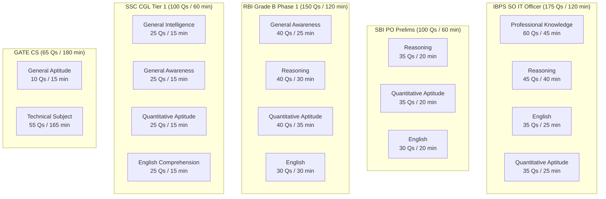
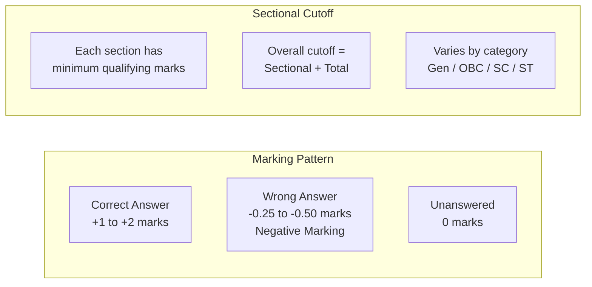
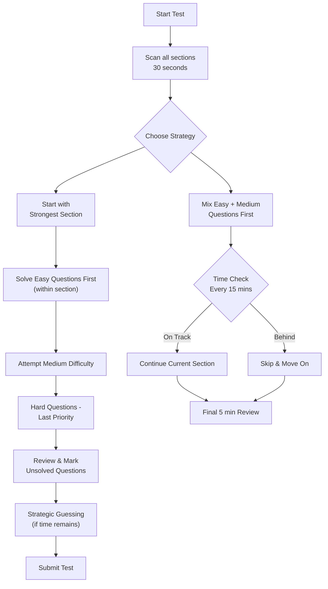
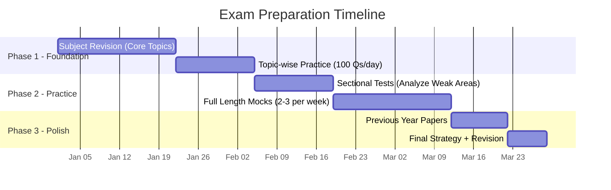
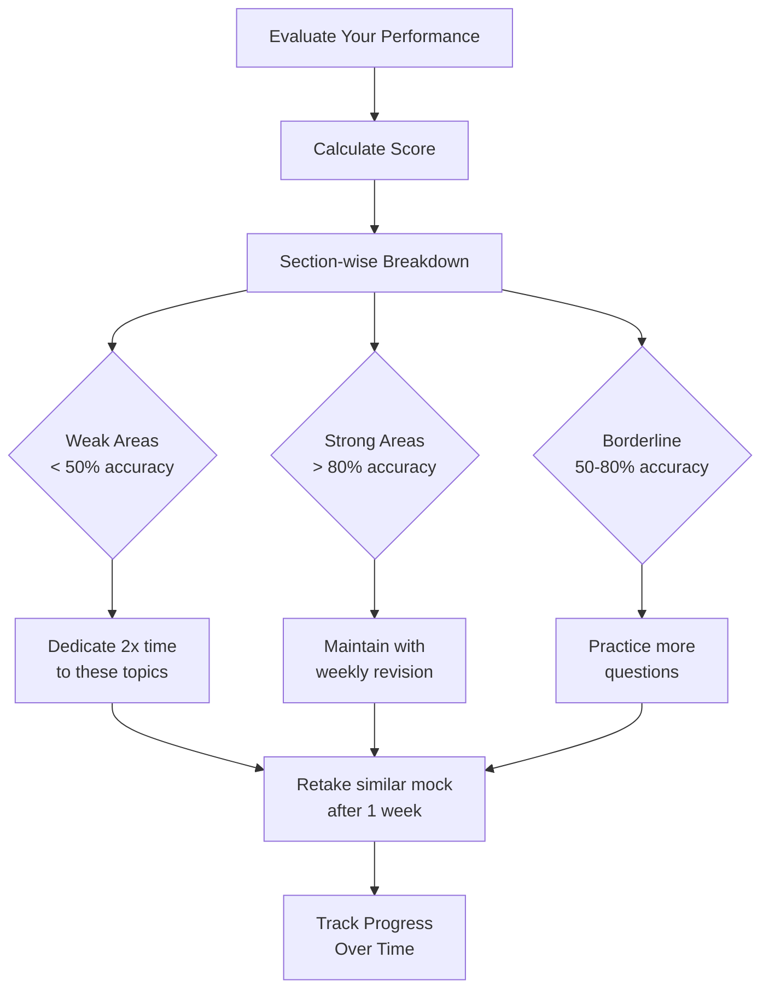

# Government Exam Mock Tests — Complete Practice Suite

> A comprehensive collection of full-length mock tests for India's top government recruitment examinations. Each test is designed to mirror the actual exam pattern, difficulty level, and time constraints of the respective exam.

---

## 📋 Test Suite Overview

This repository contains **6 full-length mock tests** covering the most sought-after government examinations in India. Every test is built with exam-accurate question distribution, sectional timing, and marking schemes based on the latest official patterns.

| # | Exam | Conducting Body | Level | Sections | Total Questions |
|---|------|-----------------|-------|----------|-----------------|
| 1 | **IBPS SO IT Officer Scale 1** | IBPS | National | 4 | 175 |
| 2 | **NIC Scientist B** | NIC/MeitY | National | 3 | 100 |
| 3 | **SBI PO Prelims** | SBI | National | 3 | 100 |
| 4 | **RBI Grade B Phase 1** | RBI | National | 4 | 150 |
| 5 | **SSC CGL Tier 1** | SSC | National | 4 | 100 |
| 6 | **GATE CS** | IIT/IISC | National | 2 | 65 |

---

## 📊 Exam Pattern Comparison



---

## 📈 Section-Wise Marking Schemes



---

## 🗓️ Study Plan & Preparation Strategy

### Phase 1: Foundation Building (Weeks 1–4)

| Week | Focus Area | Hours/Day | Mock Test |
|------|-----------|-----------|-----------|
| 1 | Core concepts — subject-wise revision | 3–4 hrs | None |
| 2 | Practice MCQs topic-wise (100/day) | 4–5 hrs | None |
| 3 | Attempt sectional tests | 3–4 hrs | Sectional |
| 4 | Analyze weak areas | 2–3 hrs | Sectional |

### Phase 2: Intensive Practice (Weeks 5–8)

| Week | Focus Area | Hours/Day | Mock Test |
|------|-----------|-----------|-----------|
| 5 | Full-length mock — 2 per week | 5–6 hrs | 2 FTs |
| 6 | Full-length mock — 3 per week | 5–6 hrs | 3 FTs |
| 7 | Full-length mock — 4 per week | 5–6 hrs | 4 FTs |
| 8 | Speed + accuracy drills | 4–5 hrs | 3 FTs |

### Phase 3: Revision & Polish (Weeks 9–10)

| Week | Focus Area | Hours/Day | Mock Test |
|------|-----------|-----------|-----------|
| 9 | Previous year papers | 3–4 hrs | 2 PYQs |
| 10 | Final revision + strategy | 2–3 hrs | 1 FT |

---

## 🧠 Test-Taking Strategy Guide

### Before the Test

| Step | Action | Details |
|------|--------|---------|
| 1 | Know the pattern | Memorize sections, time limits, marking scheme |
| 2 | Plan section order | Start with your strongest section |
| 3 | Set time budgets | Allocate minutes per question type |
| 4 | Prepare materials | Admit card, ID, stationery, water |
| 5 | Sleep well | Minimum 7–8 hours before exam day |

### During the Test — Time Management



### Question Prioritization Matrix

| Priority | Question Type | Action | Time Budget |
|----------|--------------|--------|-------------|
| **High** | Direct formula-based, Short RC, Single-step DI | Attempt first | 30–45 sec |
| **Medium** | 2-step problems, Medium puzzles, Grammar | Attempt second | 45–90 sec |
| **Low** | Lengthy calculations, Complex puzzles | Attempt last / skip | 90–120 sec |

### The Elimination Technique

When unsure of an answer:

1. **Eliminate obviously wrong options** — improbable values, opposite meanings
2. **Check units, decimal places, signs** — common traps
3. **Use option substitution** — plug options back into the question
4. **Look for mutually exclusive options** — if two say opposite things, one is true
5. **Apply common sense** — extreme values are usually wrong

### Guessing Strategy

| Confidence Level | Action | Expected Value |
|-----------------|--------|----------------|
| 100% sure | Answer | Full marks |
| 75% sure | Answer | Positive expected value |
| 50% sure | Answer if elimination possible | Break-even |
| < 50% sure | Skip (if negative marking) | Negative expected value |

---

## 🎯 Scoring Guide & Cutoff Analysis

### Historical Cutoff Trends (Last 3 Years)

| Exam | Category | 2023 Cutoff | 2024 Cutoff | 2025 Cutoff | Trend |
|------|----------|-------------|-------------|-------------|-------|
| **IBPS SO IT** | General | 52.5 | 54.0 | 53.0 | Stable |
| | OBC | 48.0 | 49.5 | 48.5 | Stable |
| | SC | 38.0 | 39.5 | 38.5 | Stable |
| | ST | 32.5 | 33.0 | 33.5 | Slight ↑ |
| **SBI PO** | General | 58.75 | 60.25 | 59.50 | Stable |
| | OBC | 54.50 | 56.00 | 55.25 | Stable |
| | SC | 45.00 | 46.50 | 45.75 | Stable |
| | ST | 38.00 | 39.50 | 39.00 | Stable |
| **RBI Grade B** | General | 62.0 | 64.5 | 63.0 | Fluctuating |
| | OBC | 57.0 | 59.0 | 58.0 | Stable |
| | SC | 47.0 | 49.0 | 48.0 | Stable |
| | ST | 40.0 | 42.0 | 41.0 | Stable |
| **SSC CGL Tier 1** | General | 142.5 | 148.0 | 145.0 | Fluctuating |
| | OBC | 132.0 | 137.5 | 134.5 | Fluctuating |
| | SC | 118.0 | 123.0 | 120.5 | Fluctuating |
| | ST | 106.0 | 110.0 | 108.0 | Fluctuating |
| **GATE CS** | General | 34.7 | 36.2 | 35.5 | Stable |
| | OBC | 31.2 | 32.6 | 31.9 | Stable |
| | SC | 23.1 | 24.5 | 23.8 | Stable |

### Target Score Calculator

Use this formula to set your target:

```
Target = (Previous Year Cutoff × 1.15) × Category Factor
```

| Category | Factor | Reasoning |
|----------|--------|-----------|
| General | 1.00 | Base cutoff |
| OBC | 0.92 | ~8% relaxation |
| SC | 0.80 | ~20% relaxation |
| ST | 0.72 | ~28% relaxation |

**Example:** If RBI Grade B cutoff for General is 63:
```
Your Target = 63 × 1.15 = 72.45 marks
```

### How to Calculate Your Expected Score

```
Expected Score = (Correct Qs × Mark per Q) + (Wrong Qs × Negative Mark per Q)
```

| Exam | Marks per Q | Negative Mark | Max Raw Score |
|------|-------------|---------------|---------------|
| IBPS SO | 1 | -0.25 | 175 |
| SBI PO Prelims | 1 | -0.25 | 100 |
| RBI Grade B | 1 | -0.25 | 200 |
| SSC CGL Tier 1 | 2 | -0.50 | 200 |
| GATE CS | 1 or 2 | -0.33 or -0.66 | 100 |

---

## 📚 Section-Wise Preparation Tips

### Professional Knowledge / Technical Subjects

| Subject | Weightage | Key Topics | Preparation Time |
|---------|-----------|------------|------------------|
| DBMS | 18–22% | Normalization, SQL, Transactions, Indexing | 2 weeks |
| Computer Networks | 15–18% | OSI Model, TCP/IP, Routing, Security | 2 weeks |
| Operating Systems | 15–18% | Processes, Memory, File Systems, Scheduling | 2 weeks |
| Data Structures | 12–15% | Trees, Graphs, Sorting, Hashing | 2 weeks |
| Software Engineering | 8–10% | SDLC, Agile, Testing, UML | 1 week |
| OOP Concepts | 8–10% | Java/C++, Inheritance, Polymorphism | 1 week |
| Web Technologies | 5–8% | HTML, CSS, JavaScript, HTTP | 1 week |
| Cloud Computing | 3–5% | IaaS/PaaS/SaaS, AWS/Azure basics | 3–4 days |
| Cyber Security | 3–5% | Cryptography, Network Security, Threats | 3–4 days |

### Reasoning Ability

| Topic | Weightage | Difficulty | Tricks |
|-------|-----------|------------|--------|
| Puzzles (Circular/Linear/Floor) | 25–30% | High | Draw diagrams, use tables |
| Seating Arrangement | 15–20% | High | Start with fixed positions |
| Syllogism | 10–15% | Medium | Venn diagrams, check all cases |
| Inequalities | 8–10% | Easy | Chain inequalities, check signs |
| Data Sufficiency | 8–10% | Medium | Check each statement independently |
| Blood Relations | 5–8% | Easy | Draw family tree |
| Coding-Decoding | 5–8% | Medium | Identify pattern rules |
| Order & Ranking | 5–8% | Easy | Use number line |

### Quantitative Aptitude

| Topic | Weightage | Formula Count | Practice Needed |
|-------|-----------|---------------|-----------------|
| Data Interpretation | 25–30% | 10+ formulas | High |
| Number Series | 10–15% | 15+ patterns | Medium |
| Quadratic Equations | 8–10% | 5 formulas | Medium |
| Simplification | 8–10% | 8 formulas | Low |
| Profit & Loss | 5–8% | 6 formulas | Medium |
| Time & Work | 5–8% | 4 formulas | Medium |
| Speed & Distance | 5–8% | 3 formulas | Medium |
| Simple/Compound Interest | 5–8% | 4 formulas | Medium |
| Permutation & Combination | 3–5% | 4 formulas | High |
| Probability | 3–5% | 3 formulas | High |

### English Language

| Topic | Weightage | Strategy |
|-------|-----------|----------|
| Reading Comprehension | 30–35% | Read questions first, then passage |
| Cloze Test | 10–15% | Context clues, collocations |
| Error Spotting | 10–15% | Grammar rules, common errors |
| Fill in the Blanks | 8–10% | Vocabulary, context |
| Para Jumbles | 8–10% | Logical flow, linking words |
| Sentence Improvement | 5–8% | Grammar, conciseness |
| Vocabulary | 5–8% | Root words, mnemonics |

---

## 📅 Weekly Practice Schedule (10-Week Plan)



### Daily Routine (Recommended)

| Time | Activity | Duration |
|------|----------|----------|
| 6:00 – 7:00 AM | Wake up, exercise, freshen up | 60 min |
| 7:00 – 9:00 AM | **Quantitative Aptitude** (concepts + practice) | 120 min |
| 9:00 – 9:30 AM | Breakfast break | 30 min |
| 9:30 – 11:30 AM | **Reasoning** (puzzles + practice) | 120 min |
| 11:30 – 12:30 PM | **English** (grammar + RC) | 60 min |
| 12:30 – 2:00 PM | Lunch + rest | 90 min |
| 2:00 – 4:00 PM | **Technical/Professional Knowledge** | 120 min |
| 4:00 – 5:00 PM | **Current Affairs** / **General Awareness** | 60 min |
| 5:00 – 6:00 PM | Break / walk | 60 min |
| 6:00 – 8:00 PM | **Mock Test** or **Revision** | 120 min |
| 8:00 – 9:00 PM | Dinner | 60 min |
| 9:00 – 10:00 PM | Analysis of mistakes | 60 min |
| 10:00 – 10:30 PM | Plan next day + wind down | 30 min |
| 10:30 PM | Sleep | 7.5 hrs |

---

## 🔄 How to Use These Mock Tests

### Step 1: Choose Your Exam
Navigate to the specific mock test file for your target examination.

### Step 2: Simulate Exam Conditions
- Set a timer for the exact duration
- No distractions, no interruptions
- Answer on paper or a separate document first
- Do NOT peek at answers while attempting

### Step 3: Attempt All Questions
- Follow the section order specified in the test
- Mark questions you're unsure about
- Adhere to time limits per section

### Step 4: Self-Evaluate
- Open the collapsible `<details>` tags to check answers
- Read explanations carefully — even for correct answers
- Note down concepts you got wrong

### Step 5: Analyze Performance



### Step 6: Track Your Progress

Create a progress tracker like this:

| Mock # | Date | Section 1 % | Section 2 % | Section 3 % | Section 4 % | Overall % | Rank Estimate |
|--------|------|-------------|-------------|-------------|-------------|-----------|---------------|
| 1 | | | | | | | |
| 2 | | | | | | | |
| 3 | | | | | | | |
| 4 | | | | | | | |
| 5 | | | | | | | |

---

## ⚠️ Common Mistakes to Avoid

### Mistake 1: Not Reading the Question Fully
- **Issue:** Rushing leads to misreading keywords like "not", "except", "always"
- **Fix:** Underline key words in the question before looking at options

### Mistake 2: Spending Too Much Time on One Question
- **Issue:** Getting stuck on a hard question wastes time for easier ones
- **Fix:** Use the 90-second rule — if stuck, mark and move on

### Mistake 3: Ignoring Negative Marking
- **Issue:** Blind guessing reduces overall score
- **Fix:** Only guess when you can eliminate at least 2 options

### Mistake 4: Poor Time Allocation Per Section
- **Issue:** Running out of time in the last section
- **Fix:** Wear a watch and check time every 10 questions

### Mistake 5: Skipping the Analysis Phase
- **Issue:** Attempting mocks without analysis yields no improvement
- **Fix:** Spend equal time analyzing as attempting

### Mistake 6: Neglecting Weak Areas
- **Issue:** Only practicing strong subjects
- **Fix:** Dedicate 60% time to weak areas, 40% to strong areas

### Mistake 7: Ignoring Current Affairs
- **Issue:** Last-minute cramming for GA section
- **Fix:** Read daily news for 30 minutes consistently

---

## 📊 Performance Benchmarking

### Percentile Estimation Guide

| Score Range (%) | Percentile Estimate | Interpretation |
|-----------------|---------------------|----------------|
| 85–100% | 99+ percentile | Excellent — ready for exam |
| 70–84% | 95–99 percentile | Very good — minor polish needed |
| 55–69% | 80–95 percentile | Good — need more practice |
| 40–54% | 50–80 percentile | Average — significant improvement needed |
| Below 40% | Below 50 percentile | Needs foundation work |

### Sectional Accuracy Targets

| Section | Minimum Accuracy | Target Accuracy | Max Time per Question |
|---------|-----------------|-----------------|----------------------|
| Technical | 65% | 80% | 45 sec |
| Reasoning | 60% | 75% | 60 sec |
| Quantitative | 55% | 70% | 60 sec |
| English | 65% | 80% | 45 sec |
| General Awareness | 60% | 75% | 30 sec |

---

## 📚 Additional Resources

### Recommended Books

| Exam | Book | Author/Publisher |
|------|------|------------------|
| IBPS SO IT | Objective Computer Science | G.K. Publications |
| IBPS SO IT | Computer Awareness | Arihant |
| SBI PO | Quantitative Aptitude | R.S. Aggarwal |
| SBI PO | Analytical Reasoning | M.K. Pandey |
| RBI Grade B | Indian Economy | Ramesh Singh |
| SSC CGL | Lucent's General Knowledge | Lucent |
| GATE CS | GATE Previous Year Papers | Made Easy |

### Useful Websites

| Website | Purpose |
|---------|---------|
| [IBPS.in](https://ibps.in) | Official IBPS notifications |
| [SBI.co.in](https://sbi.co.in) | Official SBI recruitment |
| [RBI.org.in](https://rbi.org.in) | Official RBI recruitment |
| [SSC.nic.in](https://ssc.nic.in) | Official SSC website |
| [Gate.iisc.ac.in](https://gate.iisc.ac.in) | Official GATE website |
| [Testbook.com](https://testbook.com) | Mock tests & practice |
| [Gradeup.co](https://gradeup.co) | Exam preparation |

---

## 🏁 Quick Links to Mocks

| Mock Test | File | Questions | Duration |
|-----------|------|-----------|----------|
| IBPS SO IT Officer Scale 1 | [01-ibps-so-it-officer-scale1.md](./01-ibps-so-it-officer-scale1.md) | 175 Qs | 120 min |
| NIC Scientist B | [02-nic-scientist-b.md](./02-nic-scientist-b.md) | 100 Qs | 120 min |
| SBI PO Prelims | [03-sbi-po-prelims.md](./03-sbi-po-prelims.md) | 100 Qs | 60 min |
| RBI Grade B Phase 1 | [04-rbi-grade-b.md](./04-rbi-grade-b.md) | 150 Qs | 120 min |
| SSC CGL Tier 1 | [05-ssc-cgl-tier1.md](./05-ssc-cgl-tier1.md) | 100 Qs | 60 min |
| GATE CS | [06-gate-cs-mock.md](./06-gate-cs-mock.md) | 65 Qs | 180 min |

---

## 📝 Answer Sheet Template

Use this template to record your answers while attempting the mock:

```
Mock Test: _________________   Date: _________________

Section 1: [Name]
Q01:___  Q02:___  Q03:___  Q04:___  Q05:___  Q06:___  Q07:___  Q08:___  Q09:___  Q10:___
Q11:___  Q12:___  Q13:___  Q14:___  Q15:___  Q16:___  Q17:___  Q18:___  Q19:___  Q20:___
...

Section 2: [Name]
Q01:___  Q02:___  Q03:___  Q04:___  Q05:___  Q06:___  Q07:___  Q08:___  Q09:___  Q10:___
...

Total Correct: ___   Total Wrong: ___   Unattempted: ___
Raw Score: ___   Normalized Score: ___
```

---

## 🎯 Final Words of Motivation

> *"Success is the sum of small efforts, repeated day in and day out."* — Robert Collier

- **Consistency beats intensity** — studying 3 hours daily beats 10 hours once a week
- **Quality over quantity** — understanding one concept deeply beats skimming ten
- **Analysis is more important than attempts** — one thoroughly analyzed mock is worth ten rushed ones
- **Health matters** — sleep, exercise, and breaks are not optional; they're essential for peak performance
- **Trust the process** — if you follow the plan, the results will follow

---

## 🏆 Chapter Quiz: Test Your Preparation Knowledge

### Q1. What is the total number of questions in SBI PO Prelims?
A) 75
B) 100
C) 150
D) 175

<details>
<summary>Show Answer</summary>

**Answer:** B) 100

**Explanation:** SBI PO Prelims consists of 3 sections — Reasoning (35 Qs), Quantitative Aptitude (35 Qs), and English (30 Qs) — totaling 100 questions to be solved in 60 minutes.

**Key Takeaway:** Know the exact exam pattern before you start preparing.
</details>

### Q2. What is the negative marking for SSC CGL Tier 1?
A) 0.25 marks per wrong answer
B) 0.50 marks per wrong answer
C) 1 mark per wrong answer
D) No negative marking

<details>
<summary>Show Answer</summary>

**Answer:** B) 0.50 marks per wrong answer

**Explanation:** In SSC CGL Tier 1, each question carries 2 marks, and 0.50 marks are deducted for each incorrect answer. This is a penalty of 25% per question.

**Key Takeaway:** Negative marking makes accuracy more important than speed.
</details>

### Q3. In IBPS SO IT Officer exam, how many questions come from Professional Knowledge?
A) 45
B) 50
C) 55
D) 60

<details>
<summary>Show Answer</summary>

**Answer:** D) 60

**Explanation:** The Professional Knowledge section in IBPS SO IT Officer Scale 1 exam has 60 questions, making it the highest weightage section in the exam.

**Key Takeaway:** Technical subjects account for ~34% of the total marks in IBPS SO IT.
</details>

### Q4. Which exam has the longest duration among the following?
A) SBI PO Prelims
B) SSC CGL Tier 1
C) GATE CS
D) IBPS SO IT

<details>
<summary>Show Answer</summary>

**Answer:** C) GATE CS

**Explanation:** GATE CS is a 3-hour (180 minutes) examination, while SBI PO Prelims is 60 minutes, SSC CGL Tier 1 is 60 minutes, and IBPS SO IT is 120 minutes. GATE also has the most complex marking scheme with multiple question types.

**Key Takeaway:** GATE requires sustained concentration over a longer period — practice longer study sessions.
</details>

### Q5. What is the recommended target score calculation formula for a safe preparation?
A) Previous Year Cutoff × 1.05
B) Previous Year Cutoff × 1.15
C) Previous Year Cutoff × 1.25
D) Previous Year Cutoff × 1.50

<details>
<summary>Show Answer</summary>

**Answer:** B) Previous Year Cutoff × 1.15

**Explanation:** Adding a 15% margin over the previous year's cutoff gives you a safe target that accounts for fluctuation in difficulty levels and competition intensity.

**Key Takeaway:** Always set targets higher than the cutoff to build a safety margin.
</details>

---

## 🔢 Answer Key Table

| Q# | Answer | Topic | Difficulty |
|----|--------|-------|------------|
| 1 | B | Exam Pattern | Easy |
| 2 | B | Marking Scheme | Easy |
| 3 | D | IBPS SO Pattern | Medium |
| 4 | C | Exam Duration | Easy |
| 5 | B | Target Setting | Medium |

---

*Last Updated: January 2026 | Next Review: June 2026*
