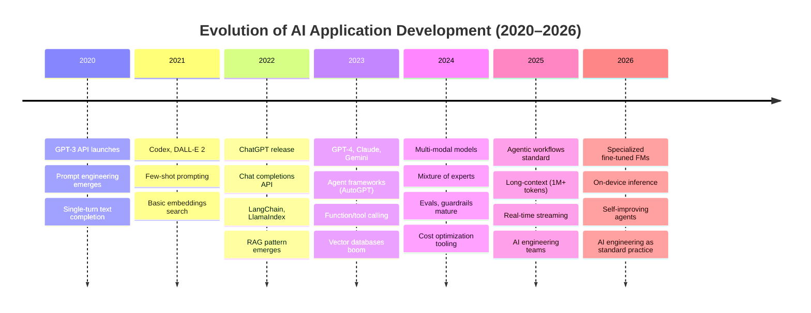
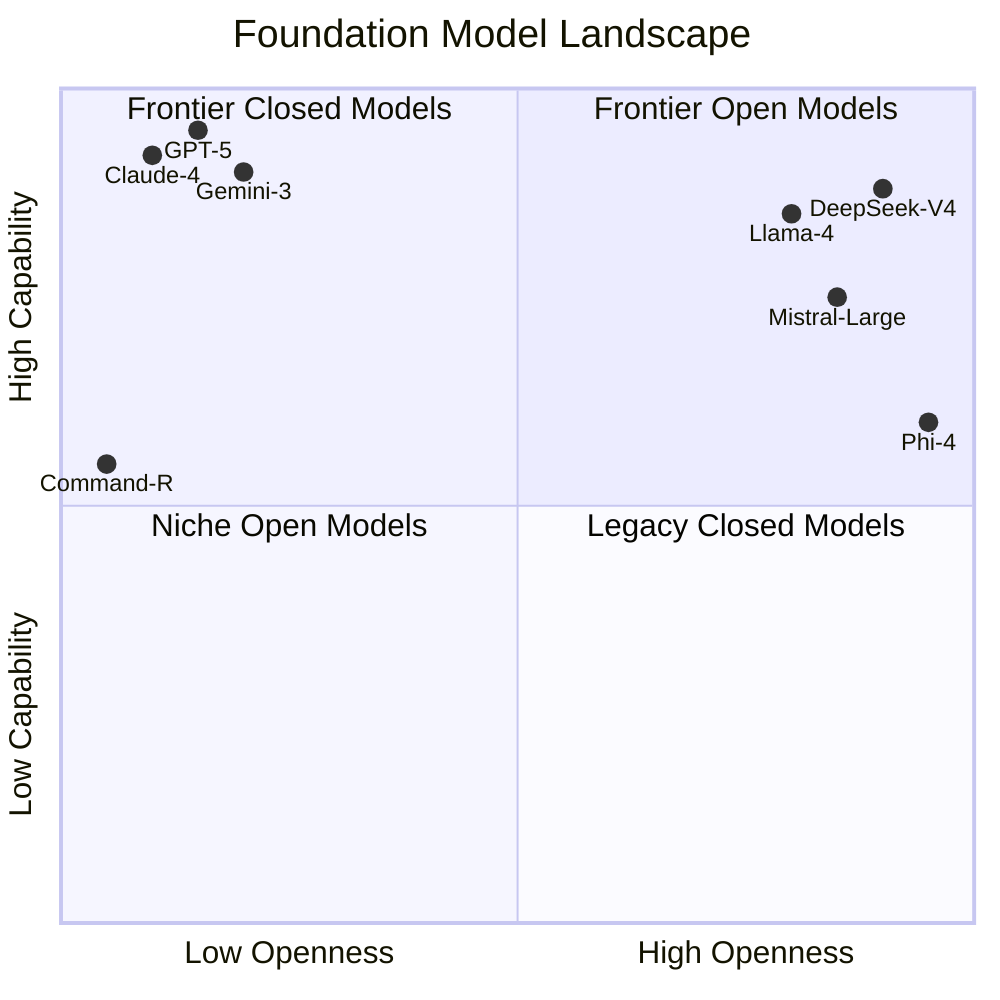
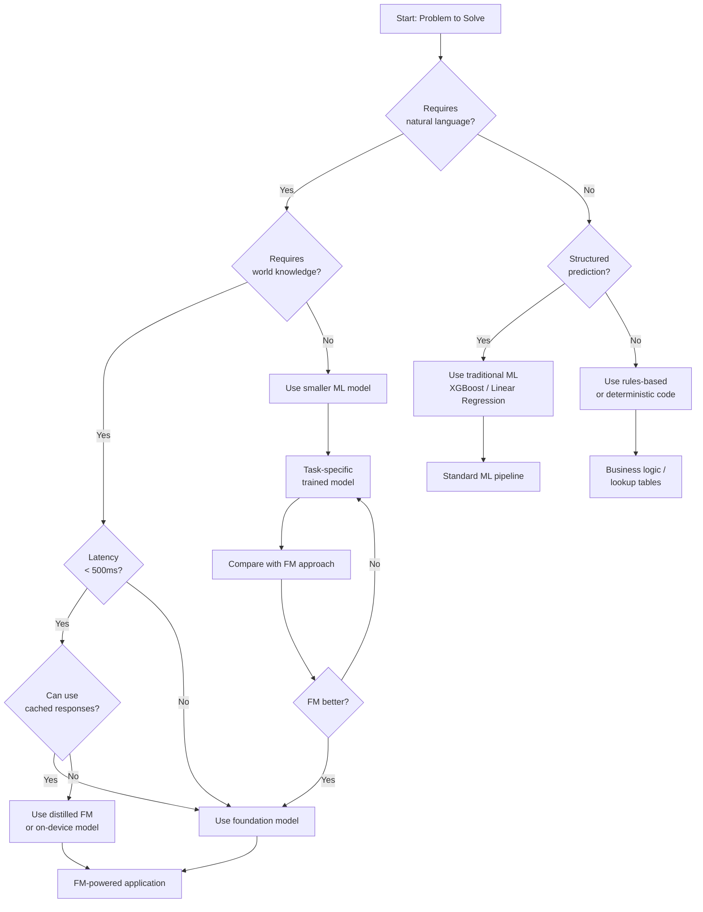
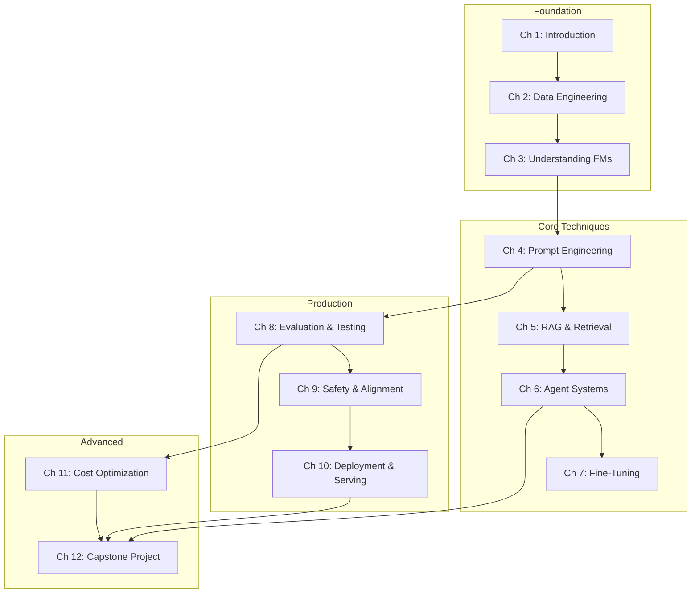

# Chapter 1: Introduction to AI Engineering

## Learning Objectives

| Objective | Description |
|-----------|-------------|
| LO1 | Define AI engineering and distinguish it from ML engineering and traditional software engineering |
| LO2 | Trace the evolution of building AI applications from 2020 to 2026 |
| LO3 | Navigate the foundation model landscape including GPT, Claude, Gemini, Llama, and Mistral |
| LO4 | Apply a decision framework for determining when to use foundation models vs traditional approaches |
| LO5 | Describe the four-layer AI engineering stack: data, model, application, and deployment |
| LO6 | Identify key challenges in production AI systems and their mitigation strategies |
## 1.1 What is AI Engineering?

AI engineering is the discipline of building production-ready applications powered by foundation models. It sits at the intersection of machine learning engineering, software engineering, and systems design, but introduces unique concerns that neither field addresses alone.

**AI Engineering vs ML Engineering**

Traditional ML engineering focuses on training, evaluating, and deploying custom models. The ML engineer curates labeled datasets, selects model architectures, tunes hyperparameters, and manages training infrastructure. In contrast, AI engineering largely works with pretrained foundation models accessed via APIs or self-hosted endpoints. The emphasis shifts from training to orchestration: prompt engineering, retrieval-augmented generation (RAG), tool use, output validation, and cost optimization.

| Aspect | ML Engineering | AI Engineering |
|--------|---------------|----------------|
| Model | Train custom models | Use pretrained FMs |
| Data | Labeled training sets | Unstructured, context documents |
| Compute | GPU clusters for training | Inference serving, caching |
| Pipeline | Training → eval → deploy | Prompt → retrieval → generation → validation |
| Iteration | Retrain on new data | Prompt engineering, RAG tuning |

**AI Engineering vs Software Engineering**

Traditional software engineering produces deterministic systems. Given the same input, a function always returns the same output. AI engineering embraces nondeterminism — the same prompt may produce different responses across calls. This requires new testing strategies (semantic eval, adversarial testing), new debugging tools (tracing, token inspection), and new deployment patterns (guardrails, fallback chains, human-in-the-loop).

## 1.2 The Evolution of Building AI Applications

The landscape of AI application development has changed dramatically between 2020 and 2026. What began as experimental notebook-style prototypes has matured into a structured engineering discipline with production-grade tooling.



**Key Milestones Explained**

- **2020 — The API Era Begins**: GPT-3 (175B parameters) launched via API, introducing the world to prompt-based interaction. Developers experimented with few-shot learning but had no structured frameworks.

- **2022 — The ChatGPT Inflection**: ChatGPT reached 100M users in two months. The chat completions API made building conversational AI accessible. LangChain and LlamaIndex provided the first abstractions for chaining LLM calls.

- **2023 — Agents and Tools**: Function calling enabled LLMs to interact with external systems. AutoGPT and BabyAGI popularized autonomous agent loops. Vector databases like Pinecone and Weaviate became essential infrastructure.

- **2024 — Production Hardening**: Evaluation frameworks, guardrails (Nvidia NeMo, Guardrails AI), and observability tools (LangSmith, Weights & Biases Prompts) matured. The focus shifted from "can it work" to "can it work reliably in production."

- **2025 — Agentic Workflows**: Multi-agent systems, human-in-the-loop feedback integration, and long-context reasoning became standard. Foundation models supported 1M+ token context windows, reducing the need for complex RAG pipelines.

- **2026 — Mature Engineering Discipline**: AI engineering emerged as a distinct role with dedicated tooling, career paths, and best practices. On-device inference brought FM-powered apps to edge devices.

## 1.3 The Foundation Model Landscape

Foundation models are large-scale neural networks trained on diverse internet-scale data that can be adapted to a wide range of downstream tasks. The ecosystem has diversified significantly since GPT-3.



**Major Model Families**

| Model | Creator | Open Weight | Context Window (2026) | Key Strengths |
|-------|---------|-------------|----------------------|---------------|
| GPT-5 | OpenAI | No | 2M tokens | Reasoning, coding, multimodal |
| Claude 4 | Anthropic | No | 1M tokens | Safety, long-document analysis |
| Gemini 3 | Google DeepMind | No | 2M tokens | Multimodal, search integration |
| Llama 4 | Meta | Yes | 512K tokens | Open ecosystem, fine-tuning |
| Mistral Large | Mistral AI | Yes | 256K tokens | Efficiency, EU compliance |
| DeepSeek V4 | DeepSeek | Yes | 1M tokens | Math, reasoning, cost-efficiency |
| Phi-4 | Microsoft | Yes | 128K tokens | Small, efficient, on-device |

**Open vs Closed Models**

Closed models offer convenience and cutting-edge performance but introduce vendor lock-in, data privacy concerns, and usage-based costs. Open-weight models require infrastructure investment but provide data sovereignty, customization via fine-tuning, and predictable costs at scale.

The decision between open and closed depends on:
- **Data sensitivity**: Can data leave your network?
- **Scale**: At high volume, open models are typically cheaper per token.
- **Customization**: Fine-tuning requires access to weights.
- **Latency requirements**: Self-hosting allows tail-latency optimization.

## 1.4 When to Use Foundation Models

Not every problem benefits from a foundation model. The following decision flow helps engineers determine whether to use an FM, a smaller ML model, or a rules-based approach.



**Decision Rules**

1. **Natural language understanding**: If the task involves generation, summarization, translation, or conversational AI, FMs are the natural choice.
2. **World knowledge**: Tasks requiring broad commonsense or factual knowledge benefit from FM pretraining. For narrow domains, smaller fine-tuned models may suffice.
3. **Latency sensitivity**: Real-time applications (chat, voice) need sub-500ms responses. FMs may be too slow without caching, speculative decoding, or distillation.
4. **Cost constraints**: At very high throughput, the per-token cost of API-based FMs can exceed self-hosted or traditional approaches.
5. **Structured prediction**: For classification, regression, or ranking tasks with labeled data, traditional ML models often outperform FMs at lower cost.

## 1.5 The AI Engineering Stack

Building production AI applications requires coordinating across four distinct layers. Each layer has its own concerns, tooling, and best practices.


**Layer Details**

| Layer | Components | Key Tools (2026) |
|-------|-----------|------------------|
| Data | Collection pipelines, ETL, vector stores, data catalogs | LangChain, LlamaIndex, Chroma, Weaviate, Pinecone |
| Model | FM APIs, self-hosted endpoints, embedding models, LoRA adapters | OpenAI, Anthropic, vLLM, Text Generation Inference, Ollama |
| Application | Prompt templates, RAG chains, agent loops, guardrails, output parsers | LangGraph, CrewAI, Guardrails AI, Instructor |
| Deployment | Inference servers, caching, monitoring, canary deployments | BentoML, Ray Serve, LangSmith, Helicone |

## 1.6 Key Challenges

Production AI engineering introduces challenges that traditional software engineering rarely encounters. The table below summarizes the most critical ones.

| Challenge | Description | Impact | Mitigation |
|-----------|-------------|--------|------------|
| Hallucinations | Model generates plausible-sounding but incorrect information | Erosion of user trust, regulatory risk | RAG with citation, factual consistency checks, constrained decoding |
| Cost | API token costs at scale can exceed infrastructure costs | Unsustainable unit economics | Caching, prompt compression, model distillation, batch processing |
| Latency | FM inference is slow (500ms–10s per response) | Poor user experience, timeouts | Speculative decoding, KV-cache optimization, small models for simple tasks |
| Evaluation | No single metric captures output quality; human eval is expensive | Difficulty comparing models, regressions | LLM-as-judge, semantic similarity, task-specific metrics, AI-assisted eval |
| Safety | Models may generate harmful, biased, or toxic content | Brand damage, legal liability | Guardrails, content filters, red-teaming, RLHF, constitutional AI |
| Data Privacy | User data sent to third-party APIs may be stored/trained on | Regulatory non-compliance (GDPR, CCPA) | Self-hosting, data anonymization, prompt encryption, data retention agreements |

## 1.7 Course Architecture

This course is organized around the AI engineering stack. Each chapter builds on the previous ones, progressing from foundational concepts to advanced production patterns.



**Chapter Mapping to the AI Stack**

| Chapter | Layer | Focus |
|---------|-------|-------|
| 1: Introduction | All | Course foundation, key concepts, AI engineering landscape |
| 2: Data Engineering | Data | Collection, quality, preprocessing, labeling, synthetic data |
| 3: Understanding FMs | Model | Transformers, pretraining, capabilities, model selection |
| 4: Prompt Engineering | Application | Prompt design, structured outputs, chain-of-thought |
| 5: RAG & Retrieval | Data + Application | Vector search, hybrid retrieval, context management |
| 6: Agent Systems | Application | Tool use, multi-agent orchestration, planning |
| 7: Fine-Tuning | Model | LoRA, full fine-tuning, domain adaptation |
| 8: Evaluation & Testing | All | Metrics, benchmarks, adversarial testing, evals |
| 9: Safety & Alignment | Application + Deployment | Guardrails, harm detection, RLHF, constitutional AI |
| 10: Deployment & Serving | Deployment | Inference optimization, monitoring, caching |
| 11: Cost Optimization | All | Token reduction, model routing, caching strategies |
| 12: Capstone Project | All | End-to-end AI application with all layers |

## TypeScript: AIEngineeringConfig

The following production-ready class provides a model registry, cost tracking, and usage analytics for AI engineering projects.

```typescript
/**
 * AIEngineeringConfig — Central configuration registry for AI applications.
 * Manages model definitions, pricing, rate limits, and usage analytics.
 */

interface ModelConfig {
  id: string;
  provider: 'openai' | 'anthropic' | 'google' | 'meta' | 'mistral' | 'deepseek' | 'custom';
  displayName: string;
  contextWindow: number;
  inputPricePer1KTokens: number;
  outputPricePer1KTokens: number;
  supportedCapabilities: string[];
  maxBatchSize: number;
  rateLimitRPM: number;
  rateLimitTPM: number;
  latencyP50: number;
  latencyP99: number;
}

interface UsageRecord {
  modelId: string;
  inputTokens: number;
  outputTokens: number;
  timestamp: Date;
  latency: number;
  success: boolean;
  errorCode?: string;
  cacheHit: boolean;
}

interface CostReport {
  totalCost: number;
  costByModel: Record<string, number>;
  costByProvider: Record<string, number>;
  averageCostPerRequest: number;
  projectedMonthlyCost: number;
}

class AIEngineeringConfig {
  private models: Map<string, ModelConfig> = new Map();
  private usageLog: UsageRecord[] = [];
  private configVersion: string;

  constructor(configVersion: string = '1.0.0') {
    this.configVersion = configVersion;
    this.registerDefaultModels();
  }

  private registerDefaultModels(): void {
    this.registerModel({
      id: 'gpt-5',
      provider: 'openai',
      displayName: 'GPT-5',
      contextWindow: 2_000_000,
      inputPricePer1KTokens: 0.01,
      outputPricePer1KTokens: 0.03,
      supportedCapabilities: ['text', 'code', 'reasoning', 'multimodal', 'function-calling'],
      maxBatchSize: 100,
      rateLimitRPM: 500,
      rateLimitTPM: 2_000_000,
      latencyP50: 800,
      latencyP99: 3000,
    });

    this.registerModel({
      id: 'claude-4',
      provider: 'anthropic',
      displayName: 'Claude 4',
      contextWindow: 1_000_000,
      inputPricePer1KTokens: 0.015,
      outputPricePer1KTokens: 0.045,
      supportedCapabilities: ['text', 'code', 'reasoning', 'long-document', 'function-calling'],
      maxBatchSize: 50,
      rateLimitRPM: 200,
      rateLimitTPM: 1_000_000,
      latencyP50: 900,
      latencyP99: 3500,
    });

    this.registerModel({
      id: 'gemini-3',
      provider: 'google',
      displayName: 'Gemini 3',
      contextWindow: 2_000_000,
      inputPricePer1KTokens: 0.005,
      outputPricePer1KTokens: 0.015,
      supportedCapabilities: ['text', 'code', 'reasoning', 'multimodal', 'search'],
      maxBatchSize: 200,
      rateLimitRPM: 1000,
      rateLimitTPM: 4_000_000,
      latencyP50: 600,
      latencyP99: 2500,
    });

    this.registerModel({
      id: 'llama-4-70b',
      provider: 'meta',
      displayName: 'Llama 4 70B',
      contextWindow: 512_000,
      inputPricePer1KTokens: 0.002,
      outputPricePer1KTokens: 0.006,
      supportedCapabilities: ['text', 'code', 'reasoning', 'function-calling'],
      maxBatchSize: 100,
      rateLimitRPM: 100,
      rateLimitTPM: 500_000,
      latencyP50: 1200,
      latencyP99: 5000,
    });

    this.registerModel({
      id: 'mistral-large',
      provider: 'mistral',
      displayName: 'Mistral Large',
      contextWindow: 256_000,
      inputPricePer1KTokens: 0.002,
      outputPricePer1KTokens: 0.006,
      supportedCapabilities: ['text', 'code', 'reasoning', 'function-calling', 'multilingual'],
      maxBatchSize: 50,
      rateLimitRPM: 300,
      rateLimitTPM: 1_000_000,
      latencyP50: 700,
      latencyP99: 2800,
    });

    this.registerModel({
      id: 'deepseek-v4',
      provider: 'deepseek',
      displayName: 'DeepSeek V4',
      contextWindow: 1_000_000,
      inputPricePer1KTokens: 0.0005,
      outputPricePer1KTokens: 0.002,
      supportedCapabilities: ['text', 'code', 'reasoning', 'math'],
      maxBatchSize: 100,
      rateLimitRPM: 500,
      rateLimitTPM: 2_000_000,
      latencyP50: 1000,
      latencyP99: 4000,
    });
  }

  registerModel(config: ModelConfig): void {
    if (this.models.has(config.id)) {
      throw new Error(`Model ${config.id} is already registered`);
    }
    this.models.set(config.id, { ...config });
  }

  getModel(modelId: string): ModelConfig {
    const model = this.models.get(modelId);
    if (!model) {
      throw new Error(`Unknown model: ${modelId}. Available: ${Array.from(this.models.keys()).join(', ')}`);
    }
    return { ...model };
  }

  listModels(filter?: { provider?: string; minContextWindow?: number }): ModelConfig[] {
    const all = Array.from(this.models.values());
    if (!filter) {
      return all.map((m) => ({ ...m }));
    }
    return all
      .filter((m) => !filter.provider || m.provider === filter.provider)
      .filter((m) => !filter.minContextWindow || m.contextWindow >= filter.minContextWindow!)
      .map((m) => ({ ...m }));
  }

  logUsage(record: Omit<UsageRecord, 'timestamp'>): void {
    this.usageLog.push({
      ...record,
      timestamp: new Date(),
    });
  }

  getUsageLog(options?: {
    startDate?: Date;
    endDate?: Date;
    modelId?: string;
    limit?: number;
  }): UsageRecord[] {
    let filtered = [...this.usageLog];

    if (options?.startDate) {
      filtered = filtered.filter((r) => r.timestamp >= options.startDate!);
    }
    if (options?.endDate) {
      filtered = filtered.filter((r) => r.timestamp <= options.endDate!);
    }
    if (options?.modelId) {
      filtered = filtered.filter((r) => r.modelId === options.modelId);
    }

    filtered.sort((a, b) => b.timestamp.getTime() - a.timestamp.getTime());

    if (options?.limit) {
      filtered = filtered.slice(0, options.limit);
    }

    return filtered.map((r) => ({ ...r }));
  }

  generateCostReport(): CostReport {
    const costByModel: Record<string, number> = {};
    const costByProvider: Record<string, number> = {};

    let totalCost = 0;

    for (const record of this.usageLog) {
      const model = this.models.get(record.modelId);
      if (!model) {
        continue;
      }

      if (record.cacheHit) {
        continue;
      }

      const inputCost = (record.inputTokens / 1000) * model.inputPricePer1KTokens;
      const outputCost = (record.outputTokens / 1000) * model.outputPricePer1KTokens;
      const recordCost = inputCost + outputCost;

      totalCost += recordCost;

      costByModel[record.modelId] = (costByModel[record.modelId] || 0) + recordCost;
      costByProvider[model.provider] = (costByProvider[model.provider] || 0) + recordCost;
    }

    const requestCount = this.usageLog.filter((r) => !r.cacheHit).length;
    const averageCostPerRequest = requestCount > 0 ? totalCost / requestCount : 0;

    const now = new Date();
    const oneDayAgo = new Date(now.getTime() - 24 * 60 * 60 * 1000);
    const dailyCost = this.usageLog
      .filter((r) => r.timestamp >= oneDayAgo && !r.cacheHit)
      .reduce((sum, r) => {
        const model = this.models.get(r.modelId);
        if (!model) {
          return sum;
        }
        return sum + (r.inputTokens / 1000) * model.inputPricePer1KTokens
          + (r.outputTokens / 1000) * model.outputPricePer1KTokens;
      }, 0);

    return {
      totalCost: Math.round(totalCost * 10000) / 10000,
      costByModel,
      costByProvider,
      averageCostPerRequest: Math.round(averageCostPerRequest * 1000000) / 1000000,
      projectedMonthlyCost: Math.round(dailyCost * 30 * 100) / 100,
    };
  }

  getConfigVersion(): string {
    return this.configVersion;
  }
}
```

## TypeScript: AIMetricsCollector

A lightweight collector for tracking token counts, latency distributions, and cost across inference calls.

```typescript
/**
 * AIMetricsCollector — Real-time metrics collection for AI inference.
 * Tracks token usage, latency percentiles, error rates, and cache efficiency.
 */

interface MetricsSnapshot {
  totalRequests: number;
  successfulRequests: number;
  failedRequests: number;
  totalInputTokens: number;
  totalOutputTokens: number;
  averageLatencyMs: number;
  p50LatencyMs: number;
  p95LatencyMs: number;
  p99LatencyMs: number;
  totalCostUsd: number;
  cacheHitRate: number;
  errorRate: number;
}

class AIMetricsCollector {
  private latencies: number[] = [];
  private inputTokens: number[] = [];
  private outputTokens: number[] = [];
  private costs: number[] = [];
  private errors: number = 0;
  private cacheHits: number = 0;
  private totalRequests: number = 0;
  private successfulRequests: number = 0;
  private inputPricePerToken: number;
  private outputPricePerToken: number;

  constructor(inputPricePerToken: number = 0.00001, outputPricePerToken: number = 0.00003) {
    this.inputPricePerToken = inputPricePerToken;
    this.outputPricePerToken = outputPricePerToken;
  }

  recordRequest(
    latencyMs: number,
    inputTokens: number,
    outputTokens: number,
    success: boolean,
    cacheHit: boolean = false,
    errorCode?: string,
  ): void {
    this.totalRequests++;
    this.latencies.push(latencyMs);
    this.inputTokens.push(inputTokens);
    this.outputTokens.push(outputTokens);

    const cost = (inputTokens * this.inputPricePerToken) + (outputTokens * this.outputPricePerToken);
    this.costs.push(cost);

    if (cacheHit) {
      this.cacheHits++;
    }

    if (success) {
      this.successfulRequests++;
    } else {
      this.errors++;
    }
  }

  private percentile(sorted: number[], p: number): number {
    if (sorted.length === 0) {
      return 0;
    }
    const index = Math.ceil((p / 100) * sorted.length) - 1;
    return sorted[Math.max(0, Math.min(index, sorted.length - 1))];
  }

  snapshot(): MetricsSnapshot {
    const sortedLatencies = [...this.latencies].sort((a, b) => a - b);

    const totalInput = this.inputTokens.reduce((sum, t) => sum + t, 0);
    const totalOutput = this.outputTokens.reduce((sum, t) => sum + t, 0);
    const totalCost = this.costs.reduce((sum, c) => sum + c, 0);
    const avgLatency = this.latencies.length > 0
      ? this.latencies.reduce((sum, l) => sum + l, 0) / this.latencies.length
      : 0;

    return {
      totalRequests: this.totalRequests,
      successfulRequests: this.successfulRequests,
      failedRequests: this.errors,
      totalInputTokens: totalInput,
      totalOutputTokens: totalOutput,
      averageLatencyMs: Math.round(avgLatency * 100) / 100,
      p50LatencyMs: Math.round(this.percentile(sortedLatencies, 50) * 100) / 100,
      p95LatencyMs: Math.round(this.percentile(sortedLatencies, 95) * 100) / 100,
      p99LatencyMs: Math.round(this.percentile(sortedLatencies, 99) * 100) / 100,
      totalCostUsd: Math.round(totalCost * 100000) / 100000,
      cacheHitRate: this.totalRequests > 0
        ? Math.round((this.cacheHits / this.totalRequests) * 10000) / 100
        : 0,
      errorRate: this.totalRequests > 0
        ? Math.round((this.errors / this.totalRequests) * 10000) / 100
        : 0,
    };
  }

  reset(): void {
    this.latencies = [];
    this.inputTokens = [];
    this.outputTokens = [];
    this.costs = [];
    this.errors = 0;
    this.cacheHits = 0;
    this.totalRequests = 0;
    this.successfulRequests = 0;
  }
}
```

## Summary

AI engineering is the discipline of building production applications powered by foundation models. It differs from traditional ML engineering by focusing on orchestrating pretrained models rather than training custom ones, and from traditional software engineering by embracing nondeterminism as a first-class concern. The field has evolved rapidly from 2020 to 2026, transitioning through API-based experimentation, the ChatGPT inflection, agent frameworks, production hardening, and finally into a mature engineering discipline. The foundation model landscape now offers diverse options across the open-closed spectrum, with models from OpenAI, Anthropic, Google, Meta, Mistral, and DeepSeek. The AI engineering stack comprises four layers — data, model, application, and deployment — each with distinct tools and challenges. Key challenges including hallucinations, cost, latency, evaluation, safety, and data privacy require deliberate mitigation strategies. This course is organized to guide learners through each layer of the stack, culminating in a production-ready capstone project.

## Practical Takeaways

1. **Understand the landscape before choosing tools**: Map your problem to the AI engineering stack before selecting frameworks or models.
2. **Start with APIs, migrate to self-hosting at scale**: Begin with managed APIs for rapid prototyping; invest in self-hosted infrastructure when usage patterns stabilize.
3. **Build cost tracking from day one**: Integrate usage logging and cost calculation before going to production — retrofitting is painful.
4. **Design for nondeterminism**: Write tests that check semantic equivalence, not exact string matches. Use guardrails to constrain outputs.
5. **Plan for evaluation early**: Establish ground-truth datasets and eval metrics before building the application — they guide every architectural decision.

## Chapter Quiz

**Q1**: What distinguishes AI engineering from traditional ML engineering?

A) AI engineering uses smaller models
B) AI engineering primarily works with pretrained foundation models rather than training custom models
C) AI engineering does not require any data processing
D) AI engineering replaces all software engineering concerns

**Q2**: Which year saw the release of ChatGPT, marking a major inflection point for AI applications?

A) 2020
B) 2021
C) 2022
D) 2023

**Q3**: Which of the following is NOT a key challenge in production AI systems?

A) Hallucinations
B) Cost management
C) Deterministic output guarantee
D) Evaluation difficulty

**Q4**: What is the primary role of the data layer in the AI engineering stack?

A) Model inference optimization
B) Prompt template management
C) Data collection, processing, vector storage, and governance
D) Monitoring and observability

**Q5**: In the decision framework, which factor would lead you to choose a smaller ML model over a foundation model?

A) The task requires world knowledge
B) The task involves structured prediction with labeled data
C) The task requires natural language generation
D) The task needs conversational ability

**Answer Key**

| Question | Answer |
|----------|--------|
| Q1 | B |
| Q2 | C |
| Q3 | C |
| Q4 | C |
| Q5 | B |

## Exercises

**Exercise 1**

Analyze a customer support chatbot use case. The system needs to answer product questions, escalate issues to human agents, and maintain conversation history. Using the decision framework from Section 1.4, determine whether to use a foundation model, a smaller ML model, or a rules-based approach for each component.

<details>
<summary>Solution</summary>

The customer support chatbot can be decomposed into three components:

1. **Intent classification** (structured prediction with labeled data): Use a smaller ML model (e.g., BERT classifier) or a rules-based classifier for common intents. This is faster and cheaper than calling an FM for every message.

2. **Response generation** (requires natural language + world knowledge): Use a foundation model. The FM can generate contextually appropriate responses, handle novel questions, and maintain conversational flow.

3. **Escalation routing** (rules-based decision): Use deterministic code based on sentiment thresholds, keyword matching, and customer tier. This ensures consistent, auditable escalation decisions.

A hybrid approach is optimal: use the ML classifier for intent detection, route simple queries to templated responses, use the FM for complex or generative responses, and apply deterministic rules for escalation.
</details>

**Exercise 2**

Design a cost projection model for an application that makes 1 million API calls per month. Using the cost data from the `AIEngineeringConfig` class, calculate the monthly cost for GPT-5 versus DeepSeek V4. Assume each call averages 1,000 input tokens and 200 output tokens. Factor in a 30% cache hit rate.

<details>
<summary>Solution</summary>

**GPT-5 costs:**
- Input: 1,000,000 × 70% (non-cached) × (1,000 / 1,000) × $0.01 = $7,000
- Output: 1,000,000 × 70% × (200 / 1,000) × $0.03 = $4,200
- Total: $11,200/month

**DeepSeek V4 costs:**
- Input: 1,000,000 × 70% × (1,000 / 1,000) × $0.0005 = $350
- Output: 1,000,000 × 70% × (200 / 1,000) × $0.002 = $280
- Total: $630/month

DeepSeek V4 is approximately 18× cheaper for this workload. However, consider latency differences (GPT-5 P50: 800ms, DeepSeek V4 P50: 1000ms) and capability differences when choosing.

The `CostReport` from `generateCostReport()` would show `projectedMonthlyCost` of approximately $11,200 for GPT-5 and $630 for DeepSeek V4.
</details>

**Exercise 3**

Implement a function that uses `AIMetricsCollector` to compare the real-world performance of two models (e.g., GPT-5 and Llama 4 70B) across 100 requests each. Generate a metrics snapshot for each and determine which model has better P95 latency.

<details>
<summary>Solution</summary>

```typescript
function compareModelPerformance(): void {
  const gptCollector = new AIMetricsCollector(0.00001, 0.00003);
  const llamaCollector = new AIMetricsCollector(0.000002, 0.000006);

  // Simulate 100 requests for GPT-5
  for (let i = 0; i < 100; i++) {
    const latency = 600 + Math.random() * 2000;
    const inputTokens = 800 + Math.floor(Math.random() * 400);
    const outputTokens = 150 + Math.floor(Math.random() * 100);
    const success = Math.random() > 0.02;
    const cacheHit = Math.random() < 0.3;
    gptCollector.recordRequest(latency, inputTokens, outputTokens, success, cacheHit);
  }

  // Simulate 100 requests for Llama 4 70B (self-hosted)
  for (let i = 0; i < 100; i++) {
    const latency = 900 + Math.random() * 4000;
    const inputTokens = 800 + Math.floor(Math.random() * 400);
    const outputTokens = 150 + Math.floor(Math.random() * 100);
    const success = Math.random() > 0.03;
    const cacheHit = Math.random() < 0.3;
    llamaCollector.recordRequest(latency, inputTokens, outputTokens, success, cacheHit);
  }

  const gptSnapshot = gptCollector.snapshot();
  const llamaSnapshot = llamaCollector.snapshot();

  console.log('GPT-5 P95 Latency:', gptSnapshot.p95LatencyMs, 'ms');
  console.log('Llama 4 70B P95 Latency:', llamaSnapshot.p95LatencyMs, 'ms');

  if (gptSnapshot.p95LatencyMs < llamaSnapshot.p95LatencyMs) {
    console.log('GPT-5 has better P95 latency');
  } else {
    console.log('Llama 4 70B has better P95 latency');
  }
}
```
</details>

**Exercise 4**

Using the AI engineering stack framework from Section 1.5, design a system architecture for a document analysis application that answers questions about uploaded PDFs. Specify which tools and technologies you would use at each layer and justify your choices.

<details>
<summary>Solution</summary>

**Data Layer:**
- Document parsing: Unstructured.io or PyMuPDF for PDF extraction
- Chunking: LangChain text splitter with overlap (250 token chunks, 25 token overlap)
- Vector storage: Chroma (for prototyping) or Pinecone (for production)
- Embedding model: `text-embedding-3-large` (OpenAI) for 2,048-dimension vectors
- Metadata store: SQLite for document metadata (title, upload date, page count)

**Model Layer:**
- Primary model: Claude 4 (Anthropic) with 1M context window for long documents
- Embedding model: OpenAI `text-embedding-3-small` for cost-efficient retrieval
- Fallback model: Llama 4 70B (self-hosted via vLLM) for sensitive documents

**Application Layer:**
- RAG pipeline: LangChain `RetrievalQA` chain with custom prompt
- Prompt management: LangSmith Hub with versioned prompt templates
- Guardrails: Guardrails AI for citation verification and hallucination detection
- Streaming: Server-Sent Events for real-time answer streaming

**Deployment Layer:**
- Inference: Claude API with semantic cache (Redis) for repeated queries
- Monitoring: LangSmith tracing with custom evaluators
- CI/CD: GitHub Actions + prompt diff checking
- Load balancing: Round-robin across model providers for redundancy
</details>

**Exercise 5**

Explain how the definition of AI engineering has evolved between 2020 and 2026. Identify three key inflection points and describe how each changed the practice of building AI applications.

<details>
<summary>Solution</summary>

**2020 — The API Era (GPT-3 launch):**
Before 2020, building NLP applications required training custom models (BERT, GPT-2). GPT-3's API introduced prompt-based interaction, allowing developers to build language applications without ML expertise. Inflection: AI applications shifted from "train a model" to "write a prompt."

**2022 — The ChatGPT Inflection:**
ChatGPT made conversational AI mainstream with the chat completions API and instruction following. This created the need for prompt engineering, context management, and the first orchestration frameworks (LangChain, LlamaIndex). Inflection: AI applications shifted from single-turn to multi-turn conversations with state management.

**2025 — Agentic Workflows:**
Function calling, tool use, and multi-agent orchestration matured. AI systems could autonomously plan, execute tools, and iterate. Long-context models (1M+ tokens) reduced the need for complex RAG pipelines. Inflection: AI applications shifted from "call a model" to "deploy an agent."

Each inflection point expanded the scope of AI engineering from a niche ML concern to a full-stack engineering discipline encompassing data, model orchestration, safety, evaluation, deployment, and cost management.
</details>
