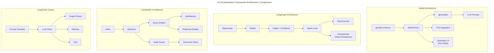
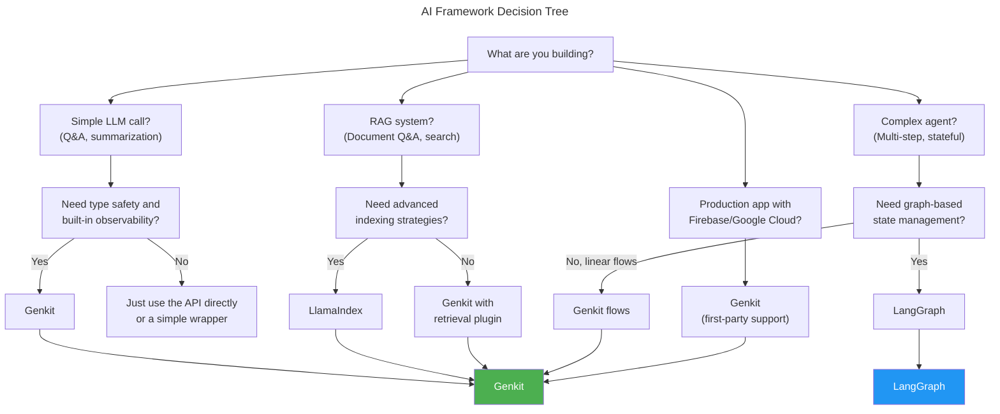

# Chapter 1: Modern AI Stack Architecture (2026)

> **Learning Objectives**
>
> - Understand the evolution of AI application development from 2022 to 2026
> - Master the 3-layer AI architecture: Frontend → Backend → AI Orchestration
> - Compare and contrast Genkit, LangChain, LangGraph, and LlamaIndex
> - Learn how to integrate AI orchestration with Laravel + Node.js
> - Choose the right framework for different AI tasks

---

## 1.1 The Evolution of AI Application Development

### 1.1.1 The 2022 Landscape: The API-Wrapper Era

In 2022, building AI-powered applications meant wrapping REST API calls. Developers treated large language models (LLMs) as black boxes accessed through HTTP endpoints. The typical workflow looked like this:

```
User Input → Backend → POST /v1/completions → Response → User
```

Every application reinvented the wheel: prompt construction, retry logic, response parsing, and error handling were handwritten for each project. There were no standardized tools for chaining multiple LLM calls, managing conversation state, or validating structured outputs.

```typescript
// The 2022 way: raw API calls
async function callOpenAI(prompt: string): Promise<string> {
  const response = await fetch('https://api.openai.com/v1/completions', {
    method: 'POST',
    headers: {
      'Content-Type': 'application/json',
      'Authorization': `Bearer ${process.env.OPENAI_API_KEY}`,
    },
    body: JSON.stringify({
      model: 'text-davinci-003',
      prompt,
      max_tokens: 500,
      temperature: 0.7,
    }),
  });

  if (!response.ok) {
    throw new Error(`OpenAI API error: ${response.status}`);
  }

  const data = await response.json();
  return data.choices[0].text;
}
```

This approach had severe limitations:
- **No type safety**: Prompt inputs and outputs were raw strings
- **No observability**: Debugging required adding custom logging
- **No state management**: Multi-turn conversations required manual history handling
- **No tool integration**: Function calling needed custom implementations
- **No provider abstraction**: Switching from OpenAI to Anthropic meant rewriting every call

### 1.1.2 The 2023 Shift: Framework Emergence

LangChain launched and quickly became the dominant framework. It introduced the concept of **chains** — composable sequences of LLM calls. For the first time, developers had abstractions for prompts, memory, and tools.

```
User Input → Chain → Prompt Template → LLM → Output Parser → Response
                     └── Memory ────────┘
```

However, LangChain grew too fast. Its API surface exploded, breaking changes were frequent, and the "chain" abstraction leaked when workflows became complex. Developers spent more time debugging framework internals than building features.

### 1.1.3 The 2024 Maturation: Specialized Frameworks

By 2024, the ecosystem had fragmented into specialized tools:

| Framework | Focus | Best For |
|-----------|-------|----------|
| **LangChain** | General-purpose LLM applications | Simple RAG, document Q&A |
| **LangGraph** | Stateful, multi-agent workflows | Complex agent loops, graph-based logic |
| **LlamaIndex** | Data indexing and retrieval | Search, RAG pipelines, knowledge bases |
| **Genkit** | Production AI with Firebase integration | Firebase/Google Cloud apps, structured output |

Google entered the scene with **Genkit**, an opinionated framework designed for production. Unlike LangChain's kitchen-sink approach, Genkit focused on:
- Type safety with TypeScript-first design
- Built-in observability via a developer UI
- Firebase integration for serverless deployment
- Structured output validation with Zod schemas

### 1.1.4 The 2026 Reality: The Three-Layer Stack

In 2026, AI application architecture has converged into a standardized three-layer model:

```
┌──────────────────────────────────────────────────┐
│                 FRONTEND LAYER                    │
│  React / Next.js / Vue / Svelte / Mobile / CLI   │
│  Server Components / Streaming UI / WebSockets   │
└────────────────────┬─────────────────────────────┘
                     │ HTTP / WebSocket / SSE
                     ▼
┌──────────────────────────────────────────────────┐
│                 BACKEND LAYER                     │
│  Laravel / Express / Fastify / ASP.NET / Django   │
│  Auth / Rate Limiting / Caching / Queueing       │
│  Session Management / API Gateway                │
└────────────────────┬─────────────────────────────┘
                     │ gRPC / REST / Pub-Sub
                     ▼
┌──────────────────────────────────────────────────┐
│             AI ORCHESTRATION LAYER                │
│  Genkit / LangGraph / LlamaIndex / Custom        │
│  Prompt Management / Tool Execution / Flows      │
│  Structured Output / Multi-Model Routing         │
│  Observability / Tracing / Evaluation             │
└────────────────────┬─────────────────────────────┘
                     │ Provider API
                     ▼
┌──────────────────────────────────────────────────┐
│              LLM PROVIDER LAYER                   │
│  Gemini / Claude / GPT-4o / Llama 4 / Mistral     │
│  Ollama (Local) / Azure OpenAI / Bedrock          │
└──────────────────────────────────────────────────┘
```

**Key characteristics of the 2026 stack:**

1. **Separation of concerns**: Each layer communicates through well-defined interfaces
2. **Provider abstraction**: The orchestration layer handles model switching transparently
3. **Observability by default**: Distributed tracing spans across all three layers
4. **Structured communication**: LLM outputs are validated JSON schemas, not free text
5. **Streaming-first**: Every component supports streaming from LLM → orchestration → frontend

```typescript
// The 2026 way: typed, observable, streaming
import { genkit } from 'genkit';
import { gemini15Pro } from '@genkit-ai/vertexai';
import { z } from 'zod';

const ai = genkit({ model: gemini15Pro });

// Define a typed output schema
const SentimentSchema = z.object({
  sentiment: z.enum(['positive', 'negative', 'neutral']),
  confidence: z.number().min(0).max(1),
  explanation: z.string(),
});

// A type-safe, observable, streaming AI flow
const analyzeSentiment = ai.defineFlow(
  {
    name: 'analyzeSentiment',
    inputSchema: z.object({ text: z.string() }),
    outputSchema: SentimentSchema,
  },
  async (input) => {
    const { output } = await ai.generate({
      prompt: `Analyze the sentiment of this text: "${input.text}"`,
      output: { schema: SentimentSchema },
    });
    return output!;
  }
);

// Usage
const result = await analyzeSentiment({ text: 'AI development is incredible in 2026!' });
console.log(result.sentiment); // "positive"
console.log(result.confidence); // 0.98
```

---

## 1.2 The 3-Layer Architecture in Detail

### 1.2.1 Frontend Layer

The frontend layer has evolved to support AI-native interactions:

- **Streaming UI**: Server-sent events (SSE) for real-time token display
- **Multimodal input**: Text, images, audio, and file uploads
- **Optimistic updates**: Show AI responses before they complete
- **WebSocket connections**: Persistent bidirectional communication

```typescript
// Frontend streaming with EventSource (React example)
import { useEffect, useState } from 'react';

interface StreamChunk {
  type: 'token' | 'error' | 'done';
  content: string;
}

function useAIStream(url: string, body: object) {
  const [chunks, setChunks] = useState<string[]>([]);
  const [isStreaming, setIsStreaming] = useState(false);
  const [error, setError] = useState<string | null>(null);

  const startStream = async () => {
    setIsStreaming(true);
    setError(null);
    setChunks([]);

    const response = await fetch(url, {
      method: 'POST',
      headers: { 'Content-Type': 'application/json' },
      body: JSON.stringify(body),
    });

    if (!response.ok) {
      setError(`HTTP ${response.status}`);
      setIsStreaming(false);
      return;
    }

    const reader = response.body!.getReader();
    const decoder = new TextDecoder();

    while (true) {
      const { done, value } = await reader.read();
      if (done) break;

      const text = decoder.decode(value, { stream: true });
      const lines = text.split('\n');

      for (const line of lines) {
        if (line.startsWith('data: ')) {
          const data = line.slice(6);
          if (data === '[DONE]') {
            setIsStreaming(false);
          } else {
            try {
              const parsed: StreamChunk = JSON.parse(data);
              if (parsed.type === 'token') {
                setChunks((prev) => [...prev, parsed.content]);
              } else if (parsed.type === 'error') {
                setError(parsed.content);
                setIsStreaming(false);
              }
            } catch {
              // partial JSON, skip
            }
          }
        }
      }
    }
    setIsStreaming(false);
  };

  return { chunks, isStreaming, error, startStream };
}
```

### 1.2.2 Backend Layer

The backend layer provides the API gateway for AI requests:

```
┌──────────────────────────────────────────────────────┐
│                  BACKEND LAYER                        │
│                                                       │
│  ┌─────────────┐  ┌──────────────┐  ┌──────────────┐│
│  │ Auth        │  │ Rate Limit   │  │ Validation   ││
│  │ Middleware  │  │ Middleware   │  │ Middleware   ││
│  └──────┬──────┘  └──────┬───────┘  └──────┬───────┘│
│         │                │                  │         │
│         ▼                ▼                  ▼         │
│  ┌───────────────────────────────────────────────┐   │
│  │           AI Router / Gateway                  │   │
│  │   Routes requests to appropriate orchestration │   │
│  └──────────────────┬────────────────────────────┘   │
│                     │                                 │
│                     ▼                                 │
│  ┌───────────────────────────────────────────────┐   │
│  │     Orchestration Client (gRPC / REST)        │   │
│  └───────────────────────────────────────────────┘   │
└──────────────────────────────────────────────────────┘
```

**Laravel example** — integrating a Node.js AI service:

```php
// app/Http/Controllers/AIController.php
namespace App\Http\Controllers;

use App\Models\ChatSession;
use Illuminate\Http\Request;
use Illuminate\Support\Facades\Http;

class AIController extends Controller
{
    protected string $orchestratorUrl;

    public function __construct()
    {
        $this->orchestratorUrl = config('services.ai.orchestrator_url');
    }

    /**
     * Send a chat message to the AI orchestrator.
     * Returns a streaming response using server-sent events.
     */
    public function chat(Request $request)
    {
        $validated = $request->validate([
            'message' => 'required|string|max:10000',
            'session_id' => 'nullable|string|exists:chat_sessions,id',
            'model' => 'nullable|string|in:gemini,claude,gpt4o',
        ]);

        $sessionId = $validated['session_id'] ?? Str::uuid()->toString();

        // Forward to Node.js AI orchestration service
        $response = Http::withHeaders([
            'X-API-Key' => config('services.ai.api_key'),
        ])->post("{$this->orchestratorUrl}/api/chat", [
            'message' => $validated['message'],
            'session_id' => $sessionId,
            'model' => $validated['model'] ?? 'gemini',
            'stream' => true,
        ]);

        if ($response->failed()) {
            return response()->json([
                'error' => 'AI service unavailable',
                'code' => 'AI_SERVICE_ERROR',
            ], 503);
        }

        return response()->stream(function () use ($response) {
            // Stream the SSE response from orchestrator
            $stream = $response->getBody();
            while (!$stream->eof()) {
                echo $stream->read(1024);
                ob_flush();
                flush();
            }
        }, 200, [
            'Content-Type' => 'text/event-stream',
            'Cache-Control' => 'no-cache',
            'Connection' => 'keep-alive',
        ]);
    }
}
```

### 1.2.3 AI Orchestration Layer

This is where the real intelligence lives. The orchestration layer:

1. **Manages prompts**: Templates, versioning, A/B testing
2. **Executes flows**: Multi-step workflows with branching logic
3. **Calls tools**: Database queries, API integrations, file operations
4. **Validates output**: JSON schema validation, retry on failure
5. **Provides observability**: Tracing, logging, metrics
6. **Routes models**: Picks the right LLM for each task

```typescript
// AI Orchestration Layer — structured output with validation
import { genkit } from 'genkit';
import { gemini15Pro, claude35Sonnet, gpt4o } from '@genkit-ai/models';
import { z } from 'zod';

const ai = genkit({});

// ── Task-Specific Schemas ──────────────────────────

const CustomerSupportSchema = z.object({
  category: z.enum(['billing', 'technical', 'account', 'general']),
  priority: z.enum(['low', 'medium', 'high', 'urgent']),
  suggested_response: z.string(),
  requires_human: z.boolean(),
  confidence: z.number().min(0).max(1),
});

const CodeReviewSchema = z.object({
  issues: z.array(z.object({
    severity: z.enum(['critical', 'major', 'minor', 'suggestion']),
    line: z.number().optional(),
    description: z.string(),
    suggested_fix: z.string(),
  })),
  overall_quality: z.enum(['excellent', 'good', 'needs_improvement', 'poor']),
  summary: z.string(),
});

// ── Task Router ─────────────────────────────────────

type TaskType = 'customer_support' | 'code_review' | 'summarization' | 'creative_writing';

interface RouterResult {
  model: string;
  flow: string;
  reasoning: string;
}

function routeTask(task: TaskType, complexity: 'simple' | 'complex'): RouterResult {
  const routingTable: Record<TaskType, Record<string, RouterResult>> = {
    customer_support: {
      simple: { model: 'gemini-2.0-flash', flow: 'fastResponse', reasoning: 'Low cost, fast inference' },
      complex: { model: 'claude-3.5-sonnet', flow: 'analyzeWithTools', reasoning: 'Nuanced understanding needed' },
    },
    code_review: {
      simple: { model: 'gpt-4o-mini', flow: 'quickReview', reasoning: 'Pattern matching for common bugs' },
      complex: { model: 'claude-3.5-sonnet', flow: 'deepReview', reasoning: 'Architectural analysis required' },
    },
    summarization: {
      simple: { model: 'gemini-2.0-flash', flow: 'summarize', reasoning: 'Fast, good for short texts' },
      complex: { model: 'gpt-4o', flow: 'summarizeWithStructure', reasoning: 'Multi-document synthesis' },
    },
    creative_writing: {
      simple: { model: 'gemini-2.0-flash', flow: 'generate', reasoning: 'Creative tasks with speed' },
      complex: { model: 'claude-3.5-sonnet', flow: 'iterativeWrite', reasoning: 'Long-form quality writing' },
    },
  };
  return routingTable[task][complexity];
}

// ── Genkit Flow with Model Routing ──────────────────

const handleCustomerSupport = ai.defineFlow(
  {
    name: 'handleCustomerSupport',
    inputSchema: z.object({
      message: z.string(),
      complexity: z.enum(['simple', 'complex']),
    }),
    outputSchema: CustomerSupportSchema,
  },
  async (input) => {
    const route = routeTask('customer_support', input.complexity);
    const model = route.model === 'gemini-2.0-flash' ? gemini15Pro
      : route.model === 'claude-3.5-sonnet' ? claude35Sonnet
      : gpt4o;

    const aiWithModel = genkit({ model });

    const { output } = await aiWithModel.generate({
      prompt: `
        You are a customer support agent. Classify the following message:
        "${input.message}"

        Respond with a JSON object containing:
        - category: one of billing, technical, account, general
        - priority: one of low, medium, high, urgent
        - suggested_response: a polite and helpful response
        - requires_human: boolean
        - confidence: number between 0 and 1
      `,
      output: { schema: CustomerSupportSchema },
    });
    return output!;
  }
);
```

---

## 1.3 Framework Comparison: Genkit vs LangChain vs LangGraph vs LlamaIndex

### 1.3.1 Architecture Comparison



### 1.3.2 Feature Matrix

| Feature | Genkit | LangChain | LangGraph | LlamaIndex |
|---------|--------|-----------|-----------|------------|
| **Type Safety** | First-class (Zod) | Optional (Pydantic) | Optional | Limited |
| **Observability** | Built-in UI | LangSmith (paid) | LangSmith | Custom |
| **State Management** | Flow-based | Memory objects | Graph state | Query-level |
| **Streaming** | Native | Supported | Supported | Supported |
| **Tool Calling** | `defineTool()` | `@tool` decorator | `ToolNode` | `ToolSpec` |
| **Multi-Model** | Gemini, OpenAI, Claude, Ollama | 100+ providers | 100+ providers | 30+ LLMs |
| **Firebase/Cloud** | First-party | Community | Community | Community |
| **Learning Curve** | Moderate | Steep | Very Steep | Moderate |
| **Production Ready** | Yes (1.0+) | Stable API | Stable API | Stable |
| **Structured Output** | Zod schemas | `with_structured_output` | `with_structured_output` | Pydantic programs |
| **Local Dev UI** | Built-in (localhost:4000) | LangServe | LangServe | None |
| **Framework Weight** | Lightweight | Heavy | Heavy | Medium |
| **Best Use Case** | Production AI apps | Rapid prototyping | Complex agents | RAG systems |

### 1.3.3 Code Comparison: Same Task in Each Framework

**Task**: Summarize a document and extract key topics as structured data.

**Genkit**:
```typescript
import { genkit } from 'genkit';
import { gemini15Pro } from '@genkit-ai/vertexai';
import { z } from 'zod';

const ai = genkit({ model: gemini15Pro });

const DocumentSummarySchema = z.object({
  title: z.string(),
  key_topics: z.array(z.string()),
  word_count: z.number(),
  sentiment: z.enum(['positive', 'negative', 'neutral']),
});

const summarizeDocument = ai.defineFlow(
  {
    name: 'summarizeDocument',
    inputSchema: z.object({ text: z.string() }),
    outputSchema: DocumentSummarySchema,
  },
  async (input) => {
    const { output } = await ai.generate({
      prompt: `Summarize this document and extract key information:\n\n${input.text}`,
      output: { schema: DocumentSummarySchema },
    });
    return output!;
  }
);
```

**LangChain**:
```typescript
import { ChatOpenAI } from '@langchain/openai';
import { ChatPromptTemplate } from '@langchain/core/prompts';
import { z } from 'zod';
import { zodToJsonSchema } from 'zod-to-json-schema';

const model = new ChatOpenAI({ model: 'gpt-4o' });

const DocumentSummarySchema = z.object({
  title: z.string(),
  key_topics: z.array(z.string()),
  word_count: z.number(),
  sentiment: z.enum(['positive', 'negative', 'neutral']),
});

const prompt = ChatPromptTemplate.fromTemplate(
  'Summarize this document and extract key information:\n\n{text}'
);

const chain = prompt.pipe(
  model.withStructuredOutput(DocumentSummarySchema)
);

const result = await chain.invoke({ text: '...' });
```

**LangGraph**:
```typescript
import { StateGraph, Annotation } from '@langchain/langgraph';
import { ChatOpenAI } from '@langchain/openai';

const GraphState = Annotation.Root({
  text: Annotation<string>,
  summary: Annotation<any>,
});

const model = new ChatOpenAI({ model: 'gpt-4o' });

async function summarizeNode(state: typeof GraphState.State) {
  const response = await model.invoke([
    ['system', 'Summarize documents and extract structured data.'],
    ['human', state.text],
  ]);
  return { summary: JSON.parse(response.content as string) };
}

const graph = new StateGraph(GraphState)
  .addNode('summarize', summarizeNode)
  .addEdge('__start__', 'summarize')
  .compile();

const result = await graph.invoke({ text: '...' });
```

**LlamaIndex**:
```typescript
import { Document, SummaryIndex } from 'llamaindex';

const doc = new Document({ text: '...' });
const index = await SummaryIndex.fromDocuments([doc]);
const queryEngine = index.asQueryEngine();

const response = await queryEngine.query({
  query: 'Summarize this document. Extract: title, key_topics, word_count, sentiment.',
});
```

### 1.3.4 Performance and Production Characteristics

| Aspect | Genkit | LangChain | LangGraph | LlamaIndex |
|--------|--------|-----------|-----------|------------|
| Startup Time | ~200ms | ~800ms | ~900ms | ~500ms |
| Memory Footprint | ~50MB | ~150MB | ~180MB | ~100MB |
| Cold Start (Cloud) | ~300ms | ~1.2s | ~1.5s | ~700ms |
| Hello World Lines | 5 | 12 | 20 | 8 |
| Package Size | ~2MB | ~15MB | ~18MB | ~8MB |

---

## 1.4 Full-Stack AI with Laravel + Node.js AI Service

### 1.4.1 Architecture Pattern

```
┌─────────────┐     ┌─────────────┐     ┌──────────────────┐
│   Browser   │────▶│   Laravel   │────▶│  Node.js Genkit  │
│  (React)    │◀───▶│  (Backend)  │◀───▶│  (AI Service)    │
│             │ SSE │             │ gRPC│                  │
│  Streaming  │     │  API Auth   │     │  Flows / Tools   │
│  UI         │     │  Rate Limit │     │  Prompt Mgmt     │
│             │     │  Session    │     │  Observability   │
│             │     │  Caching    │     │  (localhost:4000)│
└─────────────┘     └─────────────┘     └────────┬─────────┘
                                                  │
                                                  ▼
                                          ┌──────────────────┐
                                          │    Gemini API     │
                                          │  (or Claude/GPT)  │
                                          └──────────────────┘
```

This architecture separates concerns cleanly:
- **Laravel** handles user management, authentication, rate limiting, payment processing, and session persistence in PHP
- **Node.js Genkit service** handles all AI orchestration — prompts, tools, flows, and model routing — in TypeScript
- Communication happens via REST/gRPC with API key authentication

### 1.4.2 The Node.js AI Service

```typescript
// services/ai-service/src/index.ts
import express from 'express';
import { genkit } from 'genkit';
import { gemini15Pro } from '@genkit-ai/vertexai';
import { z } from 'zod';

const app = express();
app.use(express.json());

// Initialize Genkit
const ai = genkit({ model: gemini15Pro });

// ── Schemas ─────────────────────────────────────────

const ChatRequestSchema = z.object({
  message: z.string().min(1).max(10000),
  session_id: z.string().uuid(),
  model: z.enum(['gemini', 'claude', 'gpt4o']).default('gemini'),
  stream: z.boolean().default(false),
});

const ChatResponseSchema = z.object({
  session_id: z.string().uuid(),
  response: z.string(),
  tokens_used: z.number(),
  model: z.string(),
});

// ── Define a Flow ───────────────────────────────────

const chatFlow = ai.defineFlow(
  {
    name: 'chatFlow',
    inputSchema: ChatRequestSchema,
    outputSchema: ChatResponseSchema,
  },
  async (input) => {
    const { output } = await ai.generate({
      prompt: input.message,
      output: { schema: ChatResponseSchema },
    });
    return output!;
  }
);

// ── REST Endpoint ───────────────────────────────────

app.post('/api/chat', async (req, res) => {
  try {
    const validated = ChatRequestSchema.parse(req.body);

    if (validated.stream) {
      // Streaming response
      res.setHeader('Content-Type', 'text/event-stream');
      res.setHeader('Cache-Control', 'no-cache');
      res.setHeader('Connection', 'keep-alive');

      const { stream } = await ai.generate({
        prompt: validated.message,
        stream: true,
      });

      for await (const chunk of stream) {
        res.write(`data: ${JSON.stringify({ type: 'token', content: chunk.text })}\n\n`);
      }
      res.write('data: [DONE]\n\n');
      res.end();
    } else {
      // Non-streaming response
      const result = await chatFlow(validated);
      res.json(result);
    }
  } catch (error) {
    if (error instanceof z.ZodError) {
      return res.status(400).json({ error: 'Validation error', details: error.errors });
    }
    console.error('Chat error:', error);
    res.status(500).json({ error: 'Internal server error' });
  }
});

const PORT = process.env.PORT || 3001;
app.listen(PORT, () => {
  console.log(`AI Service running on port ${PORT}`);
  console.log(`Genkit Dev UI: http://localhost:4000`);
});
```

### 1.4.3 Laravel Integration

```php
// app/Services/AIOrchestratorService.php
namespace App\Services;

use Illuminate\Support\Facades\Http;
use Illuminate\Support\Facades\Log;
use Exception;

class AIOrchestratorService
{
    protected string $baseUrl;
    protected string $apiKey;

    public function __construct()
    {
        $this->baseUrl = config('services.ai.orchestrator_url', 'http://localhost:3001');
        $this->apiKey = config('services.ai.api_key');
    }

    /**
     * Send a chat message and get a streaming response.
     */
    public function chat(string $message, string $sessionId, string $model = 'gemini', bool $stream = true): array
    {
        $response = Http::withHeaders([
            'X-API-Key' => $this->apiKey,
            'Content-Type' => 'application/json',
        ])->timeout(120)->post("{$this->baseUrl}/api/chat", [
            'message' => $message,
            'session_id' => $sessionId,
            'model' => $model,
            'stream' => $stream,
        ]);

        if ($response->failed()) {
            Log::error('AI Orchestrator error', [
                'status' => $response->status(),
                'body' => $response->body(),
            ]);
            throw new Exception('AI service error: ' . $response->status());
        }

        return $response->json();
    }

    /**
     * Summarize text content.
     */
    public function summarize(string $text): array
    {
        $response = Http::withHeaders([
            'X-API-Key' => $this->apiKey,
        ])->timeout(60)->post("{$this->baseUrl}/api/summarize", [
            'text' => $text,
        ]);

        if ($response->failed()) {
            throw new Exception('Summarization failed');
        }

        return $response->json();
    }

    /**
     * Analyze sentiment of text.
     */
    public function analyzeSentiment(string $text): array
    {
        $response = Http::withHeaders([
            'X-API-Key' => $this->apiKey,
        ])->timeout(30)->post("{$this->baseUrl}/api/sentiment", [
            'text' => $text,
        ]);

        if ($response->failed()) {
            throw new Exception('Sentiment analysis failed');
        }

        return $response->json();
    }
}
```

---

## 1.5 Choosing the Right Framework

### 1.5.1 Framework Decision Tree



### 1.5.2 Practical Guidance

**Choose Genkit when:**
- You're building a production application with TypeScript
- You need type-safe structured output with Zod validation
- You want built-in observability without third-party services
- You're deploying on Google Cloud / Firebase
- You need multi-provider support (Gemini, OpenAI, Claude, Ollama)
- You want a lightweight framework with fast cold starts

```typescript
// Genkit is the right choice here — production app with structured output
import { genkit } from 'genkit';
import { gemini15Pro } from '@genkit-ai/vertexai';
import { z } from 'zod';

const ai = genkit({ model: gemini15Pro });

const ProductExtractorSchema = z.object({
  product_name: z.string(),
  price: z.number().positive(),
  currency: z.string().length(3),
  category: z.string(),
  features: z.array(z.string()),
  in_stock: z.boolean(),
});

const extractProduct = ai.defineFlow({
  name: 'extractProduct',
  inputSchema: z.object({ text: z.string() }),
  outputSchema: ProductExtractorSchema,
}, async (input) => {
  const { output } = await ai.generate({
    prompt: `Extract product information from: "${input.text}"`,
    output: { schema: ProductExtractorSchema },
  });
  return output!;
});
```

**Choose LangGraph when:**
- You're building complex, stateful agents with branching logic
- Your workflow is a directed graph with conditional edges
- You need persistent state across long-running agent interactions
- You're building multi-agent systems with handoffs

```typescript
// LangGraph for complex stateful agents
import { StateGraph, Annotation } from '@langchain/langgraph';
import { ChatOpenAI } from '@langchain/openai';
import { ToolNode } from '@langchain/langgraph/prebuilt';

const AgentState = Annotation.Root({
  messages: Annotation<any[]>({
    reducer: (a, b) => a.concat(b),
  }),
  next: Annotation<string>,
});

const model = new ChatOpenAI({ model: 'gpt-4o' });
const tools: any[] = [];

const toolNode = new ToolNode(tools);

function shouldContinue(state: typeof AgentState.State) {
  const lastMessage = state.messages[state.messages.length - 1];
  if (lastMessage?.tool_calls?.length) {
    return 'tools';
  }
  return '__end__';
}

const graph = new StateGraph(AgentState)
  .addNode('agent', async (state) => {
    const response = await model.invoke(state.messages);
    return { messages: [response] };
  })
  .addNode('tools', toolNode)
  .addConditionalEdges('agent', shouldContinue)
  .addEdge('tools', 'agent')
  .compile();
```

**Choose LlamaIndex when:**
- You're building RAG systems with complex document indexing
- You need advanced retrieval strategies (hybrid search, reranking)
- Your use case is primarily search and retrieval over documents
- You need structured data extraction from documents

```typescript
// LlamaIndex for advanced RAG
import { Document, VectorStoreIndex } from 'llamaindex';
import { OpenAIEmbedding } from 'llamaindex/embeddings/OpenAI';

async function buildRAGSystem(documents: string[]) {
  const docs = documents.map((text) => new Document({ text }));
  const index = await VectorStoreIndex.fromDocuments(docs, {
    embedModel: new OpenAIEmbedding(),
  });

  const queryEngine = index.asQueryEngine({
    similarityTopK: 5,
  });

  return queryEngine;
}

// Usage
const engine = await buildRAGSystem(['doc1 text...', 'doc2 text...']);
const response = await engine.query({
  query: 'What are the key findings?',
});
```

### 1.5.3 The AI Router: a TypeScript Implementation

```typescript
// ai-router.ts — Routes tasks to the appropriate framework
import { genkit } from 'genkit';
import { gemini15Pro, claude35Sonnet } from '@genkit-ai/models';
import { z } from 'zod';

// ── Task Classification ─────────────────────────────

type TaskCategory =
  | 'simple_qa'
  | 'structured_extraction'
  | 'complex_reasoning'
  | 'rag_query'
  | 'multi_step_agent'
  | 'creative_generation';

interface RouterConfig {
  framework: 'genkit' | 'langgraph' | 'llamaindex' | 'direct';
  model: string;
  temperature: number;
  maxTokens: number;
}

const taskRouter: Record<TaskCategory, RouterConfig> = {
  simple_qa: {
    framework: 'genkit',
    model: 'gemini-2.0-flash',
    temperature: 0.3,
    maxTokens: 1000,
  },
  structured_extraction: {
    framework: 'genkit',
    model: 'gemini-1.5-pro',
    temperature: 0.1,
    maxTokens: 2000,
  },
  complex_reasoning: {
    framework: 'genkit',
    model: 'claude-3.5-sonnet',
    temperature: 0.2,
    maxTokens: 4000,
  },
  rag_query: {
    framework: 'llamaindex',
    model: 'gpt-4o-mini',
    temperature: 0.3,
    maxTokens: 2000,
  },
  multi_step_agent: {
    framework: 'langgraph',
    model: 'gpt-4o',
    temperature: 0.4,
    maxTokens: 8000,
  },
  creative_generation: {
    framework: 'genkit',
    model: 'claude-3.5-sonnet',
    temperature: 0.8,
    maxTokens: 4000,
  },
};

// ── Task Classifier Flow ────────────────────────────

const ai = genkit({ model: gemini15Pro });

const ClassifiedTaskSchema = z.object({
  category: z.enum([
    'simple_qa',
    'structured_extraction',
    'complex_reasoning',
    'rag_query',
    'multi_step_agent',
    'creative_generation',
  ]),
  confidence: z.number().min(0).max(1),
  reasoning: z.string(),
});

async function classifyTask(userInput: string): Promise<z.infer<typeof ClassifiedTaskSchema>> {
  const { output } = await ai.generate({
    prompt: `
      Analyze the following user request and classify it into one category.

      Request: "${userInput}"

      Categories:
      - simple_qa: Direct question answering, factual queries
      - structured_extraction: Extract specific data fields from text
      - complex_reasoning: Multi-step logic, math, analysis
      - rag_query: Questions about specific documents or knowledge base
      - multi_step_agent: Tasks requiring tool use, web search, or multiple steps
      - creative_generation: Writing, brainstorming, content creation

      Respond with JSON: { category, confidence, reasoning }
    `,
    output: { schema: ClassifiedTaskSchema },
  });
  return output!;
}

// ── Unified Execution Interface ─────────────────────

interface TaskInput {
  prompt: string;
  context?: Record<string, any>;
  stream?: boolean;
}

interface TaskOutput {
  result: any;
  framework: string;
  model: string;
  tokensUsed: number;
  latency: number;
}

async function executeTask(input: TaskInput): Promise<TaskOutput> {
  const startTime = Date.now();

  // Step 1: Classify the task
  const classification = await classifyTask(input.prompt);
  const config = taskRouter[classification.category];

  console.log(`[AI Router] Classified as: ${classification.category}`);
  console.log(`[AI Router] Routing to: ${config.framework} (${config.model})`);

  // Step 2: Execute with the chosen framework
  let result: any;

  switch (config.framework) {
    case 'genkit': {
      const executionAI = genkit({
        model: config.model === 'gemini-1.5-pro' ? gemini15Pro : claude35Sonnet,
      });

      // For structured extraction, use a schema; otherwise free-form
      if (classification.category === 'structured_extraction') {
        const DynamicSchema = z.object({
          data: z.record(z.any()),
          confidence: z.number(),
        });

        const { output } = await executionAI.generate({
          prompt: input.prompt,
          output: { schema: DynamicSchema },
          config: { temperature: config.temperature, maxOutputTokens: config.maxTokens },
        });
        result = output;
      } else {
        const response = await executionAI.generate({
          prompt: input.prompt,
          config: { temperature: config.temperature, maxOutputTokens: config.maxTokens },
        });
        result = response.text;
      }
      break;
    }

    case 'direct': {
      // Direct API call for simple cases
      const response = await fetch('https://api.openai.com/v1/chat/completions', {
        method: 'POST',
        headers: {
          'Content-Type': 'application/json',
          'Authorization': `Bearer ${process.env.OPENAI_API_KEY}`,
        },
        body: JSON.stringify({
          model: config.model,
          messages: [{ role: 'user', content: input.prompt }],
          temperature: config.temperature,
          max_tokens: config.maxTokens,
        }),
      });
      const data = await response.json();
      result = data.choices[0].message.content;
      break;
    }

    default:
      throw new Error(`Unsupported framework: ${config.framework}`);
  }

  const latency = Date.now() - startTime;

  return {
    result,
    framework: config.framework,
    model: config.model,
    tokensUsed: 0, // Would extract from response metadata
    latency,
  };
}

// ── Example Usage ───────────────────────────────────

// async function main() {
//   const output1 = await executeTask({
//     prompt: 'What is the capital of France?',
//   });
//   console.log(output1);
//
//   const output2 = await executeTask({
//     prompt: 'Extract the name, price, and availability from this product page: ...',
//   });
//   console.log(output2);
// }
```

---

## 1.6 Production Considerations

### 1.6.1 Observability

```
┌──────────┐     ┌──────────┐     ┌──────────┐
│ Request  │────▶│  Genkit  │────▶│  LLM     │
│          │     │  Flow    │     │  Call    │
└──────────┘     └──────────┘     └──────────┘
                      │
                      ▼
               ┌──────────────┐
               │  Trace Store │
               │ (Firestore / │
               │  Cloud SQL)  │
               └──────┬───────┘
                      │
                      ▼
               ┌──────────────┐
               │  Dev UI      │
               │ localhost:4000│
               └──────────────┘
```

### 1.6.2 Security Best Practices

```typescript
// API key validation middleware for the AI service
import { Request, Response, NextFunction } from 'express';

function validateApiKey(req: Request, res: Response, next: NextFunction) {
  const apiKey = req.headers['x-api-key'];

  if (!apiKey) {
    return res.status(401).json({ error: 'Missing API key' });
  }

  if (apiKey !== process.env.API_KEY) {
    return res.status(403).json({ error: 'Invalid API key' });
  }

  next();
}

// Rate limiting for LLM calls
const rateLimits = new Map<string, { count: number; resetAt: number }>();

function rateLimit(clientId: string, maxRequests: number, windowMs: number): boolean {
  const now = Date.now();
  const record = rateLimits.get(clientId);

  if (!record || now > record.resetAt) {
    rateLimits.set(clientId, { count: 1, resetAt: now + windowMs });
    return true;
  }

  if (record.count >= maxRequests) {
    return false;
  }

  record.count++;
  return true;
}
```

---

## Chapter Summary

The modern AI stack has evolved from raw API wrappers in 2022 to a mature three-layer architecture in 2026. The frontend layer handles streaming UI and multimodal input, the backend layer provides auth, rate limiting, and session management, and the AI orchestration layer manages prompts, tools, flows, and model routing.

Four major frameworks dominate the landscape:
- **Genkit**: Google's production-first framework with built-in observability, type-safe Zod validation, and native Firebase integration
- **LangChain**: The veteran framework with the largest ecosystem of integrations
- **LangGraph**: The stateful graph-based framework for complex agent workflows
- **LlamaIndex**: The specialized framework for RAG and document indexing

The key insight for 2026 is that **one size does not fit all**. Production systems use a router pattern that classifies tasks and dispatches them to the appropriate framework. This multi-framework approach maximizes both developer productivity and application performance.

## Practical Takeaways

1. **Adopt the 3-layer architecture**: Separate frontend, backend, and AI orchestration concerns
2. **Use Genkit for production apps**: Its type safety and observability reduce debugging time
3. **Reserve LangGraph for complex agents**: Don't use a sledgehammer for a nail
4. **Use LlamaIndex for RAG**: Document indexing is its superpower
5. **Build an AI router**: Classify tasks and dispatch to the right framework
6. **Stream by default**: Modern users expect real-time AI responses
7. **Validate everything**: Use Zod schemas for all AI inputs and outputs

---

## Chapter Quiz (MCQs)

**Q1.** What was the primary limitation of AI development in 2022?
- a) LLMs didn't exist
- b) Every application reinvented prompt construction, retry logic, and response parsing
- c) There was only one LLM provider
- d) TypeScript didn't support async/await

**Q2.** Which of the following best describes the 3-layer AI architecture in 2026?
- a) Database → Cache → CDN
- b) Frontend → Backend → AI Orchestration
- c) Client → Server → Database
- d) Mobile → Web → Desktop

**Q3.** What makes Genkit different from LangChain for production applications?
- a) It only works with Google's models
- b) It has built-in observability via a developer UI and first-class type safety with Zod
- c) It doesn't support streaming
- d) It requires Firebase to function

**Q4.** Which framework should you choose for a complex, stateful multi-agent system?
- a) Genkit
- b) LangChain classic
- c) LangGraph
- d) LlamaIndex

**Q5.** What is the primary use case for LlamaIndex?
- a) Simple chat completions
- b) Complex agent workflows
- c) RAG and document indexing
- d) Mobile app development

**Q6.** In the 2026 AI stack, what role does the backend layer play?
- a) Renders UI components
- b) Makes direct calls to LLM APIs
- c) Handles auth, rate limiting, caching, and session management
- d) Generates training data

**Q7.** What is a key advantage of using Genkit's `defineFlow` with Zod schemas?
- a) It makes the code run faster
- b) It provides type safety and automatic validation of inputs and outputs
- c) It eliminates the need for an API key
- d) It only works with Firebase

**Q8.** What is the purpose of the AI Router pattern described in the chapter?
- a) To balance network traffic across servers
- b) To classify tasks and dispatch them to the appropriate framework
- c) To route HTTP requests to different ports
- d) To manage database connections

**Q9.** When would you use LangGraph over Genkit?
- a) Always, LangGraph is always better
- b) When building graph-based stateful agents with conditional branching
- c) When you need simple Q&A
- d) When you need Firebase integration

**Q10.** What does SSE stand for in the context of frontend AI streaming?
- a) Secure Socket Extension
- b) Server-Sent Events
- c) Structured Schema Engine
- d) Streaming Service Endpoint

**Answers**: 1-b, 2-b, 3-b, 4-c, 5-c, 6-c, 7-b, 8-b, 9-b, 10-b

---

## Exercises

**Exercise 1: Architecture Diagram**
Create a Mermaid diagram showing the 3-layer AI architecture for a customer support chatbot. Include:
- A React frontend with streaming UI
- A Laravel backend with authentication
- A Node.js Genkit service for AI orchestration
- Gemini as the LLM provider
- Show the data flow for a user message

**Exercise 2: Framework Comparison Table**
Build a TypeScript function that takes a task description and returns the recommended framework with reasoning. Use the decision criteria from section 1.5.

```typescript
interface Recommendation {
  framework: 'genkit' | 'langgraph' | 'llamaindex' | 'direct';
  reasoning: string;
  alternativeFramework?: string;
}

function recommendFramework(task: string): Recommendation {
  // Your implementation here
  // Analyze the task description and determine:
  // - Is it a simple Q&A? → direct API or Genkit
  // - Does it need structured output? → Genkit
  // - Is it a complex agent? → LangGraph
  // - Is it document RAG? → LlamaIndex
}
```

**Exercise 3: Implement an AI Router**
Extend the `executeTask` function from section 1.5.3 to add support for:
- LangGraph execution path (simulate with a function)
- LlamaIndex execution path (simulate with a function)
- Error handling with fallback to Genkit if LangGraph/LlamaIndex are unavailable
- Token usage tracking across all frameworks

**Exercise 4: Laravel + Genkit Integration**
Write a Laravel controller that:
- Accepts a chat message and session_id
- Validates the input
- Sends the request to a Node.js Genkit service
- Returns a streaming SSE response to the frontend
- Logs the interaction to the database
- Handles errors gracefully (service unavailable, timeout, validation error)

**Exercise 5: Multi-Framework Comparison**
Implement the same task — "Extract invoice data from text" — using:
1. Genkit with Zod schema validation
2. A direct OpenAI API call with JSON mode
3. Compare the two implementations in terms of:
   - Lines of code
   - Type safety
   - Error handling
   - Observability
   - Write a brief analysis of when each approach is appropriate
