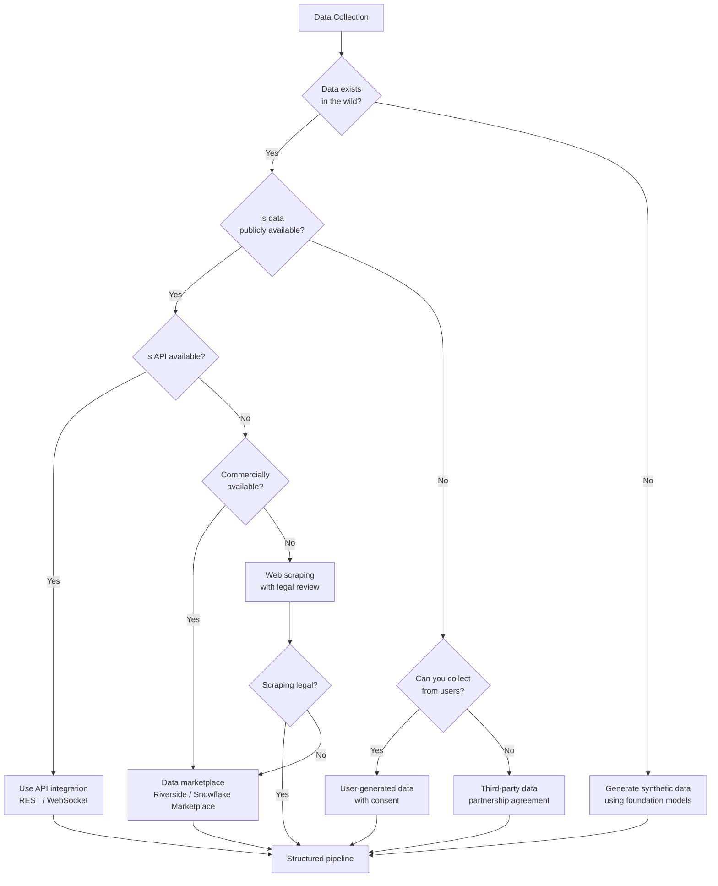

# Chapter 2: Data Engineering for AI

## Learning Objectives

| Objective | Description |
|-----------|-------------|
| LO1 | Explain why data quality is more critical than model choice for AI application performance |
| LO2 | Evaluate data collection strategies including APIs, web scraping, synthetic data, and data marketplaces |
| LO3 | Measure and improve data quality across six dimensions: accuracy, completeness, consistency, timeliness, uniqueness, validity |
| LO4 | Design preprocessing pipelines for cleaning, normalization, deduplication, and PII removal |
| LO5 | Apply curation methods including active learning, weak supervision, and programmatic labeling |
| LO6 | Navigate privacy regulations (GDPR, CCPA) and implement responsible data handling practices |

<!-- Image Gallery -->
<div style="display:flex;flex-wrap:wrap;gap:4px;margin:16px 0;padding:12px;background:#f8fafc;border-radius:8px;border:1px solid #e2e8f0;">
<a href="../../../assets/images/lessons/modern-ai-engineering/02-data-engineering-for-ai/hero.svg" target="_blank" rel="noopener">
  
</a>
<a href="../../../assets/images/lessons/modern-ai-engineering/02-data-engineering-for-ai/handwritten-notes.svg" target="_blank" rel="noopener">
  
</a>
<a href="../../../assets/images/lessons/modern-ai-engineering/02-data-engineering-for-ai/sticky-notes.svg" target="_blank" rel="noopener">
  
</a>
<a href="../../../assets/images/lessons/modern-ai-engineering/02-data-engineering-for-ai/visual-explanation.svg" target="_blank" rel="noopener">
  
</a>
<a href="../../../assets/images/lessons/modern-ai-engineering/02-data-engineering-for-ai/architecture.svg" target="_blank" rel="noopener">
  
</a>
<a href="../../../assets/images/lessons/modern-ai-engineering/02-data-engineering-for-ai/workflow.svg" target="_blank" rel="noopener">
  
</a>
<a href="../../../assets/images/lessons/modern-ai-engineering/02-data-engineering-for-ai/mindmap.svg" target="_blank" rel="noopener">
  
</a>
<a href="../../../assets/images/lessons/modern-ai-engineering/02-data-engineering-for-ai/comparison.svg" target="_blank" rel="noopener">
  
</a>
<a href="../../../assets/images/lessons/modern-ai-engineering/02-data-engineering-for-ai/cheatsheet.svg" target="_blank" rel="noopener">
  
</a>
<a href="../../../assets/images/lessons/modern-ai-engineering/02-data-engineering-for-ai/interview-quiz.svg" target="_blank" rel="noopener">
  
</a>
<a href="../../../assets/images/lessons/modern-ai-engineering/02-data-engineering-for-ai/social-card.svg" target="_blank" rel="noopener">
  
</a>
</div>
<!-- End Image Gallery -->

## 2.1 The Critical Role of Data in AI

The most widely cited lesson from production AI systems is that data quality matters more than model choice. A 2023 survey of AI practitioners found that 60% of project failures traced back to data issues, not model issues. This section explains why data is the dominant factor in AI application performance.

**The Data-Centric AI Movement**

Andrew Ng's data-centric AI thesis argues that improving data quality yields more reliable gains than architecture innovations for most production use cases. When a model underperforms, the root cause is typically:
- Incorrect or inconsistent labels
- Distribution mismatch between training data and production data
- Insufficient coverage of edge cases
- Data leakage from the future into the training set

**Why Data Dominates Model Choice**

| Factor | Impact of Data Quality | Impact of Model Choice |
|--------|----------------------|----------------------|
| Accuracy ceiling | Poor data caps maximum achievable accuracy regardless of model | Better models approach the data ceiling faster |
| Robustness | Edge cases are defined by data coverage | Architecture matters less than training data diversity |
| Fairness | Bias originates in training data distribution | Models amplify existing data biases |
| Maintenance | Data drift is the #1 cause of production degradation | Model updates are secondary to data pipeline maintenance |

**The Garbage-In-Garbage-Out Principle**

Every foundation model is trained on its pretraining corpus. When you build an AI application, you add your own data through RAG, fine-tuning, or prompt context. The quality of that additional data directly determines application quality. If your vector store contains contradictory documents, your RAG application will produce contradictory answers. If your fine-tuning dataset has label errors, your fine-tuned model will learn those errors.

## 2.2 Data Collection Strategies

Choosing the right data collection strategy depends on the application domain, budget, timeline, and quality requirements.



**Detailed Strategy Analysis**

| Strategy | Best For | Cost | Quality | Timeline | Risks |
|----------|----------|------|---------|----------|-------|
| Public APIs | Social media, knowledge bases, weather | Low | High | Fast | Rate limits, TOS changes |
| Web scraping | E-commerce, news, public records | Medium | Medium | Medium | Legal challenges, blocking |
| User-generated | SaaS products, feedback, behavior logs | Low | Very High | Slow | Privacy regulation, consent |
| Synthetic data | Rare events, edge cases, privacy-safe testing | Medium | Variable | Fast | Distribution mismatch, artifacts |
| Data marketplaces | Domain-specific labeled data, financial data | High | High | Fast | Cost, exclusivity |
| Crowdsourcing | Labeling, annotation, judgment tasks | Medium | Variable | Medium | Quality control, cost |

## 2.3 Data Quality Dimensions

Data quality is multi-dimensional. A dataset may be accurate but incomplete, or complete but inconsistent. The six dimensions below provide a comprehensive quality framework.

```mermaid
radar
    title Data Quality Radar
    x-axis Accuracy, Completeness, Consistency, Timeliness, Uniqueness, Validity
    "Dataset A": [85, 92, 78, 95, 88, 80]
    "Dataset B": [95, 70, 90, 60, 95, 85]
    "Dataset C": [60, 95, 60, 50, 70, 55]
```

**Quality Dimensions Table**

| Dimension | Definition | Metric | Example Issue |
|-----------|-----------|--------|---------------|
| Accuracy | Correctness of data values relative to the real world | Error rate, mislabeling percentage | A product listed as "in stock" when inventory is zero |
| Completeness | The degree to which all required data is present | Null rate, missing field percentage | Customer records missing phone numbers |
| Consistency | Data values are coherent across records and systems | Contradiction rate, format uniformity | Same customer address formatted differently in two systems |
| Timeliness | Data reflects the current state of the world | Recency, staleness window | Stock prices from last month used in today's analysis |
| Uniqueness | No duplicate records exist | Duplicate rate, exact/fuzzy match rate | Same customer registered twice with different email addresses |
| Validity | Data conforms to defined schemas, types, and ranges | Schema violation rate, domain error rate | Age field containing the value 350 |

## 2.4 Data Preprocessing

Data preprocessing transforms raw data into a clean, structured format suitable for downstream AI pipelines. The preprocessing pipeline typically involves five stages.

```mermaid
flowchart LR
    subgraph Raw[Raw Data]
        R1[Unstructured<br>text, PDFs, HTML]
        R2[Noisy<br>logs, scraped data]
        R3[Raw user<br>generated content]
    end
    subgraph Cleaning[Cleaning]
        C1[Remove HTML tags<br>& special chars]
        C2[Fix encoding errors<br>UTF-8 normalization]
        C3[Spell checking<br>& typo correction]
        C4[Outlier detection<br>& handling]
    end
    subgraph Normalization[Normalization]
        N1[Lowercasing]
        N2[Unicode normalization<br>NFKC]
        N3[Whitespace<br>standardization]
        N4[Date/time format<br>ISO 8601]
    end
    subgraph Dedup[Deduplication]
        D1[Exact match<br>dedup]
        D2[Fuzzy match<br>dedup]
        D3[Semantic<br>dedup]
    end
    subgraph Formatting[Formatting & PII]
        F1[Chunking &<br>splitting]
        F2[Schema<br>validation]
        F3[PII detection<br>& removal]
        F4[Consent flag<br>& retention metadata]
    end

    Raw --> Cleaning
    Cleaning --> Normalization
    Normalization --> Dedup
    Dedup --> Formatting
    Formatting --> CleanData[Clean<br>Dataset]
```



**Advanced Preprocessing Techniques**

1. **Chunking Strategy**: For RAG applications, document chunking is critical. Semantic chunking (splitting at natural boundaries like paragraphs or sections) outperforms fixed-size token chunking for retrieval quality.

2. **PII Detection and Removal**: Use named entity recognition (NER) models or regex patterns to detect personally identifiable information before sending data to FM APIs. Classification of PII includes:
   - Direct identifiers: names, email addresses, phone numbers, SSNs
   - Indirect identifiers: ZIP codes + birthdates, job titles at small companies
   - Behavioral identifiers: IP addresses, device fingerprints, browsing patterns

3. **Data Versioning**: Treat data as code. Use tools like DVC, LakeFS, or Git LFS to version datasets, enabling reproducibility and rollback.

## 2.5 Data Curation and Labeling

High-quality labeled data is the bottleneck for supervised fine-tuning and evaluation. This section covers four approaches to building labeled datasets.

**Human Labeling**

Human annotation remains the gold standard but is expensive and slow. Best practices include:
- **Multiple annotators per item**: 3+ annotators with majority voting reduces individual bias
- **Inter-annotator agreement**: Track Cohen's kappa or Fleiss' kappa to measure labeling consistency
- **Golden test questions**: Insert known-answer questions to detect lazy or malicious annotators
- **Iterative guidelines**: Refine annotation instructions based on disagreement analysis

**Active Learning**

Instead of labeling random samples, active learning selects the most informative examples for human labeling. Common acquisition strategies:
- **Uncertainty sampling**: Label examples where the model is least confident
- **Diversity sampling**: Select examples that are most representative of the data distribution
- **Expected model change**: Choose examples that would most change the model parameters

Active learning reduces labeling costs by 50–80% compared to random sampling while maintaining or improving model performance.

**Weak Supervision**

Weak supervision uses heuristics, rules, and knowledge bases to generate noisy labels automatically. The Snorkel framework pioneered this approach:
- **Labeling functions**: Python functions that assign labels based on patterns (e.g., regex match, database lookup)
- **Label model**: A generative model that estimates the accuracy of each labeling function and combines their outputs
- **denoising**: The label model resolves conflicts between labeling functions and produces probabilistic training labels

**Programmatic Labeling with Foundation Models**

In 2024–2026, foundation models themselves have become powerful labelers. Using FMs for labeling:
1. Define a labeling prompt with clear rubrics
2. Apply the FM to each example
3. Validate against a small human-labeled held-out set
4. Use FMs with high temperature for diverse labels or low temperature for consistent labels

## 2.6 Synthetic Data Generation

Foundation models can generate training and evaluation data for virtually any domain. Synthetic data is particularly valuable for:
- **Rare events**: Fraud detection, safety-critical failures
- **Privacy-safe sharing**: Generating data that resembles real data without exposing actual user information
- **Edge case coverage**: Systematically generating variations that test model boundaries
- **Data augmentation**: Expanding small datasets for fine-tuning

```typescript
/**
 * SyntheticDataGenerator — Generates synthetic training and evaluation data
 * using foundation model calls. Supports multiple output formats, constraints,
 * and diversity controls.
 */

interface GenerationConfig {
  topic: string;
  numExamples: number;
  outputFields: string[];
  constraints?: string[];
  diversityTemperature?: number;
  labelDistribution?: Record<string, number>;
  language?: string;
}

interface GeneratedExample {
  id: string;
  fields: Record<string, string>;
  label?: string;
  metadata: {
    generatedAt: Date;
    temperature: number;
    promptTokens: number;
    completionTokens: number;
  };
}

interface QualityCheckResult {
  isValid: boolean;
  issues: string[];
  fieldQuality: Record<string, number>;
}

class SyntheticDataGenerator {
  private config: GenerationConfig;
  private examples: GeneratedExample[] = [];
  private validationSet: GeneratedExample[] = [];
  private apiCallCount: number = 0;
  private totalTokensUsed: number = 0;

  constructor(config: GenerationConfig) {
    this.config = config;
  }

  private buildGenerationPrompt(): string {
    const constraints = this.config.constraints
      ? this.config.constraints.map((c) => `- ${c}`).join('\n')
      : '';

    const distributionNote = this.config.labelDistribution
      ? `\nEnsure the following label distribution: ${JSON.stringify(this.config.labelDistribution)}`
      : '';

    return `Generate ${this.config.numExamples} examples about "${this.config.topic}".
For each example, provide the following fields: ${this.config.outputFields.join(', ')}.
${constraints}
${distributionNote}
Ensure diversity across examples. Avoid repetition.
Language: ${this.config.language || 'English'}
Output each example as a JSON object.`;
  }

  async generate(fmCall: (prompt: string) => Promise<{
    content: string;
    promptTokens: number;
    completionTokens: number;
  }>): Promise<GeneratedExample[]> {
    this.examples = [];
    const batchSize = Math.min(this.config.numExamples, 10);
    const batches = Math.ceil(this.config.numExamples / batchSize);
    const temperature = this.config.diversityTemperature ?? 0.7;

    for (let batch = 0; batch < batches; batch++) {
      const batchPrompt = this.buildGenerationPrompt() +
        `\nBatch ${batch + 1} of ${batches}. Generate ${batchSize} examples.`;

      const response = await fmCall(batchPrompt);

      this.apiCallCount++;
      this.totalTokensUsed += response.promptTokens + response.completionTokens;

      const parsed = this.parseGeneratedContent(response.content);
      for (const example of parsed) {
        this.examples.push({
          id: `synth-${Date.now()}-${Math.random().toString(36).slice(2, 8)}`,
          fields: example.fields,
          label: example.label,
          metadata: {
            generatedAt: new Date(),
            temperature,
            promptTokens: response.promptTokens,
            completionTokens: response.completionTokens,
          },
        });
      }

      if (this.examples.length >= this.config.numExamples) {
        break;
      }
    }

    return this.examples.slice(0, this.config.numExamples);
  }

  private parseGeneratedContent(content: string): Array<{
    fields: Record<string, string>;
    label?: string;
  }> {
    const results: Array<{ fields: Record<string, string>; label?: string }> = [];
    const jsonRegex = /\{[^}]+\}/g;
    const matches = content.match(jsonRegex);

    if (matches) {
      for (const match of matches) {
        try {
          const parsed = JSON.parse(match);
          const fields: Record<string, string> = {};
          let label: string | undefined;

          for (const field of this.config.outputFields) {
            if (field === 'label' && parsed[field] !== undefined) {
              label = String(parsed[field]);
            } else if (parsed[field] !== undefined) {
              fields[field] = String(parsed[field]);
            }
          }

          results.push({ fields, label });
        } catch {
          continue;
        }
      }
    }

    return results;
  }

  qualityCheck(): QualityCheckResult {
    const issues: string[] = [];
    const fieldQuality: Record<string, number> = {};

    if (this.examples.length === 0) {
      return { isValid: false, issues: ['No examples generated'], fieldQuality: {} };
    }

    for (const field of this.config.outputFields) {
      const populatedCount = this.examples.filter((e) =>
        (field === 'label' && e.label !== undefined) ||
        (field !== 'label' && e.fields[field] !== undefined && e.fields[field].length > 0)
      ).length;
      fieldQuality[field] = Math.round((populatedCount / this.examples.length) * 100);
    }

    const emptyFields = Object.entries(fieldQuality)
      .filter(([, q]) => q < 80)
      .map(([f]) => f);
    if (emptyFields.length > 0) {
      issues.push(`Fields with low completion: ${emptyFields.join(', ')}`);
    }

    const uniqueCombinations = new Set(
      this.examples.map((e) => JSON.stringify(e.fields))
    );
    if (uniqueCombinations.size < this.examples.length * 0.8) {
      issues.push('Low diversity: more than 20% of examples appear to be duplicates');
    }

    if (this.config.labelDistribution && this.examples.filter((e) => e.label).length > 0) {
      const labelCounts: Record<string, number> = {};
      for (const e of this.examples) {
        if (e.label) {
          labelCounts[e.label] = (labelCounts[e.label] || 0) + 1;
        }
      }
      for (const [label, targetPct] of Object.entries(this.config.labelDistribution)) {
        const actualPct = ((labelCounts[label] || 0) / this.examples.length) * 100;
        if (Math.abs(actualPct - targetPct) > 10) {
          issues.push(`Label "${label}" distribution off: expected ${targetPct}%, got ${actualPct}%`);
        }
      }
    }

    return {
      isValid: issues.length === 0,
      issues,
      fieldQuality,
    };
  }

  split(trainPct: number = 0.8, valPct: number = 0.1): {
    train: GeneratedExample[];
    validation: GeneratedExample[];
    test: GeneratedExample[];
  } {
    const shuffled = [...this.examples].sort(() => Math.random() - 0.5);
    const trainIdx = Math.floor(shuffled.length * trainPct);
    const valIdx = trainIdx + Math.floor(shuffled.length * valPct);

    return {
      train: shuffled.slice(0, trainIdx),
      validation: shuffled.slice(trainIdx, valIdx),
      test: shuffled.slice(valIdx),
    };
  }

  getStats(): { totalExamples: number; apiCalls: number; totalTokens: number; estimatedCostUsd: number } {
    return {
      totalExamples: this.examples.length,
      apiCalls: this.apiCallCount,
      totalTokens: this.totalTokensUsed,
      estimatedCostUsd: Math.round((this.totalTokensUsed / 1000000) * 15 * 100) / 100,
    };
  }
}
```

**Risks of Synthetic Data**

| Risk | Description | Mitigation |
|------|-------------|------------|
| Mode collapse | Generator produces limited diversity | Use higher temperature, diverse prompts |
| Distribution mismatch | Synthetic data doesn't match real distribution | Validate against real data distribution |
| Artifact propagation | Model artifacts get baked into training data | Use multiple generators, human review |
| Feedback loops | Model trained on its own generations degrades | Maintain human-generated holdout set |
| Evaluation inflation | Models perform better on synthetic evals | Always include real-world test data |

## 2.7 Privacy and Legal Considerations

Data engineering for AI must navigate an increasingly complex regulatory landscape.

**Major Regulations**

| Regulation | Region | Key Requirements | Impact on AI Data |
|-----------|--------|-----------------|-------------------|
| GDPR | EU / EEA | Consent, data minimization, right to deletion, data portability | Must document consent, enable data deletion, minimize PII in AI pipelines |
| CCPA / CPRA | California (USA) | Right to know, right to delete, opt-out of sale | Must handle opt-out requests, disclose data collection |
| PIPEDA | Canada | Meaningful consent, limited collection | Similar to GDPR but less prescriptive |
| China PIPL | China | Consent, purpose limitation, cross-border restrictions | Limits training data from China, restricts model exports |
| LGPD | Brazil | Similar to GDPR | Applicable to Brazilian residents' data |

**Consent Management**

Every data collection pipeline must include consent management:
1. **Collect consent** at the point of data collection with clear, specific language
2. **Store consent records** with timestamps, version of consent language, and scope
3. **Honor consent changes** within a defined SLA (typically 30 days)
4. **Support granular consent** (e.g., consent for analytics but not for model training)

**Data Anonymization**

Before sending data to foundation model APIs, apply anonymization techniques:
- **k-anonymity**: Ensure each record is indistinguishable from at least k-1 other records
- **l-diversity**: Ensure sensitive attributes have at least l distinct values within each group
- **Differential privacy**: Add calibrated noise to queries to bound information leakage
- **Pseudonymization**: Replace direct identifiers with tokens (distinct from full anonymization)

## TypeScript: DataPipeline

A production-ready data pipeline class that handles collection, quality scoring, and preprocessing.

```typescript
/**
 * DataPipeline — A configurable data processing pipeline for AI engineering.
 * Supports collection strategies, quality scoring, preprocessing stages,
 * and transformation chaining.
 */

type PipelineStage =
  | 'collect'
  | 'clean'
  | 'normalize'
  | 'deduplicate'
  | 'validate'
  | 'anonymize'
  | 'chunk'
  | 'embed'
  | 'store';

interface PipelineConfig {
  name: string;
  stages: PipelineStage[];
  sourceConfig?: Record<string, unknown>;
  qualityThresholds?: Partial<Record<string, number>>;
  chunkSize?: number;
  chunkOverlap?: number;
}

interface DataRecord {
  id: string;
  content: string;
  metadata: Record<string, unknown>;
  source: string;
  collectedAt: Date;
  qualityScore?: number;
  processedAt?: Date;
}

type StageHandler = (records: DataRecord[]) => DataRecord[] | Promise<DataRecord[]>;

class DataPipeline {
  private config: PipelineConfig;
  private stageHandlers: Map<PipelineStage, StageHandler> = new Map();
  private records: DataRecord[] = [];
  private stageTimings: Record<string, number> = {};
  private errorCount: number = 0;

  constructor(config: PipelineConfig) {
    this.config = config;
    this.registerDefaultHandlers();
  }

  private registerDefaultHandlers(): void {
    this.stageHandlers.set('clean', this.defaultCleanStage.bind(this));
    this.stageHandlers.set('normalize', this.defaultNormalizeStage.bind(this));
    this.stageHandlers.set('deduplicate', this.defaultDeduplicateStage.bind(this));
    this.stageHandlers.set('validate', this.defaultValidateStage.bind(this));
    this.stageHandlers.set('anonymize', this.defaultAnonymizeStage.bind(this));
  }

  registerStage(name: PipelineStage, handler: StageHandler): void {
    this.stageHandlers.set(name, handler);
  }

  async ingest(records: DataRecord[]): Promise<number> {
    this.records.push(...records);
    return this.records.length;
  }

  private defaultCleanStage(records: DataRecord[]): DataRecord[] {
    return records.map((record) => {
      let cleaned = record.content;
      cleaned = cleaned.replace(/<[^>]*>/g, '');
      cleaned = cleaned.replace(/\s+/g, ' ').trim();
      cleaned = cleaned.replace(/[\u0000-\u001F\u007F-\u009F]/g, '');
      return { ...record, content: cleaned };
    });
  }

  private defaultNormalizeStage(records: DataRecord[]): DataRecord[] {
    return records.map((record) => {
      let normalized = record.content;
      normalized = normalized.toLowerCase();
      normalized = normalized.normalize('NFKC');
      normalized = normalized.replace(/\u2018|\u2019/g, "'");
      normalized = normalized.replace(/\u201C|\u201D/g, '"');
      normalized = normalized.replace(/[\u2013\u2014]/g, '--');
      return { ...record, content: normalized };
    });
  }

  private defaultDeduplicateStage(records: DataRecord[]): DataRecord[] {
    const seen = new Set<string>();
    return records.filter((record) => {
      const fingerprint = record.content.slice(0, 100).replace(/\s+/g, '');
      if (seen.has(fingerprint)) {
        return false;
      }
      seen.add(fingerprint);
      return true;
    });
  }

  private defaultValidateStage(records: DataRecord[]): DataRecord[] {
    return records.filter((record) => {
      if (!record.content || record.content.length < 10) {
        return false;
      }
      if (record.content.length > 1000000) {
        return false;
      }
      return true;
    });
  }

  private defaultAnonymizeStage(records: DataRecord[]): DataRecord[] {
    const emailRegex = /[a-zA-Z0-9._%+-]+@[a-zA-Z0-9.-]+\.[a-zA-Z]{2,}/g;
    const phoneRegex = /(\+?\d{1,3}[-.\s]?)?\(?\d{3}\)?[-.\s]?\d{3}[-.\s]?\d{4}/g;
    const ssnRegex = /\b\d{3}[-]\d{2}[-]\d{4}\b/g;

    return records.map((record) => {
      let anonymized = record.content;
      anonymized = anonymized.replace(emailRegex, '[EMAIL_REMOVED]');
      anonymized = anonymized.replace(phoneRegex, '[PHONE_REMOVED]');
      anonymized = anonymized.replace(ssnRegex, '[SSN_REMOVED]');
      return {
        ...record,
        content: anonymized,
        metadata: {
          ...record.metadata,
          anonymized: true,
          anonymizedAt: new Date().toISOString(),
        },
      };
    });
  }

  async run(): Promise<{
    success: boolean;
    totalRecords: number;
    stageResults: Array<{ stage: string; input: number; output: number; durationMs: number }>;
    errors: number;
  }> {
    const stageResults: Array<{ stage: string; input: number; output: number; durationMs: number }> = [];
    this.errorCount = 0;

    for (const stage of this.config.stages) {
      const inputCount = this.records.length;
      const startTime = Date.now();
      const handler = this.stageHandlers.get(stage);

      if (!handler) {
        console.warn(`No handler registered for stage: ${stage}, skipping`);
        continue;
      }

      try {
        this.records = await handler(this.records);
      } catch (error) {
        this.errorCount++;
        console.error(`Stage "${stage}" failed:`, error);
        break;
      }

      const duration = Date.now() - startTime;
      this.stageTimings[stage] = duration;
      stageResults.push({
        stage,
        input: inputCount,
        output: this.records.length,
        durationMs: duration,
      });
    }

    const finalRecords = this.records.map((r) => ({
      ...r,
      processedAt: new Date(),
    }));
    this.records = finalRecords;

    return {
      success: this.errorCount === 0,
      totalRecords: this.records.length,
      stageResults,
      errors: this.errorCount,
    };
  }

  getRecords(): DataRecord[] {
    return this.records.map((r) => ({ ...r }));
  }

  getPipelineStats(): {
    totalStages: number;
    completedStages: number;
    totalDurationMs: number;
    recordsProcessed: number;
  } {
    const totalDuration = Object.values(this.stageTimings).reduce((a, b) => a + b, 0);
    return {
      totalStages: this.config.stages.length,
      completedStages: Object.keys(this.stageTimings).length,
      totalDurationMs: totalDuration,
      recordsProcessed: this.records.length,
    };
  }
}
```

## TypeScript: DataQualityScorer

A reusable utility for computing data quality metrics across the six quality dimensions.

```typescript
/**
 * DataQualityScorer — Computes quality metrics across six dimensions
 * for a given dataset. Returns normalized scores (0–100) for each dimension.
 */

interface QualityScores {
  accuracy: number;
  completeness: number;
  consistency: number;
  timeliness: number;
  uniqueness: number;
  validity: number;
  overall: number;
}

interface QualityWeights {
  accuracy: number;
  completeness: number;
  consistency: number;
  timeliness: number;
  uniqueness: number;
  validity: number;
}

class DataQualityScorer {
  private weights: QualityWeights;

  constructor(weights?: Partial<QualityWeights>) {
    this.weights = {
      accuracy: 0.2,
      completeness: 0.2,
      consistency: 0.15,
      timeliness: 0.15,
      uniqueness: 0.15,
      validity: 0.15,
      ...weights,
    };
  }

  scoreCompleteness(records: Array<Record<string, unknown>>, requiredFields: string[]): number {
    if (records.length === 0) {
      return 0;
    }
    let totalScore = 0;
    for (const record of records) {
      let presentFields = 0;
      for (const field of requiredFields) {
        const value = record[field];
        if (value !== null && value !== undefined && value !== '') {
          presentFields++;
        }
      }
      totalScore += presentFields / requiredFields.length;
    }
    return Math.round((totalScore / records.length) * 100);
  }

  scoreUniqueness(records: Array<Record<string, unknown>>, keyFields: string[]): number {
    if (records.length === 0) {
      return 100;
    }
    const seen = new Set<string>();
    let duplicates = 0;
    for (const record of records) {
      const key = keyFields.map((f) => String(record[f] ?? '')).join('||');
      if (seen.has(key)) {
        duplicates++;
      }
      seen.add(key);
    }
    return Math.round(((records.length - duplicates) / records.length) * 100);
  }

  scoreValidity(
    records: Array<Record<string, unknown>>,
    validators: Record<string, (value: unknown) => boolean>,
  ): number {
    if (records.length === 0 || Object.keys(validators).length === 0) {
      return 100;
    }
    let validCount = 0;
    let totalChecks = 0;
    for (const record of records) {
      for (const [field, validator] of Object.entries(validators)) {
        totalChecks++;
        if (validator(record[field])) {
          validCount++;
        }
      }
    }
    return totalChecks > 0 ? Math.round((validCount / totalChecks) * 100) : 100;
  }

  scoreTimeliness(
    records: Array<{ timestamp?: Date | string }>,
    maxAgeDays: number = 365,
  ): number {
    if (records.length === 0) {
      return 100;
    }
    const now = new Date();
    let freshCount = 0;
    for (const record of records) {
      if (!record.timestamp) {
        continue;
      }
      const ts = typeof record.timestamp === 'string'
        ? new Date(record.timestamp)
        : record.timestamp;
      const ageDays = (now.getTime() - ts.getTime()) / (1000 * 60 * 60 * 24);
      if (ageDays <= maxAgeDays) {
        freshCount++;
      }
    }
    return Math.round((freshCount / records.length) * 100);
  }

  scoreConsistency(
    records: Array<Record<string, unknown>>,
    consistencyRules: Array<{
      fields: string[];
      check: (values: unknown[]) => boolean;
    }>,
  ): number {
    if (records.length === 0 || consistencyRules.length === 0) {
      return 100;
    }
    let consistentCount = 0;
    let totalChecks = 0;
    for (const record of records) {
      for (const rule of consistencyRules) {
        totalChecks++;
        const values = rule.fields.map((f) => record[f]);
        if (rule.check(values)) {
          consistentCount++;
        }
      }
    }
    return totalChecks > 0 ? Math.round((consistentCount / totalChecks) * 100) : 100;
  }

  scoreAccuracy(
    records: Array<Record<string, unknown>>,
    groundTruth: Array<Record<string, unknown>>,
    compareFields: string[],
  ): number {
    if (records.length === 0 || groundTruth.length === 0) {
      return 0;
    }
    const minLen = Math.min(records.length, groundTruth.length);
    let correctCount = 0;
    let totalChecks = 0;
    for (let i = 0; i < minLen; i++) {
      for (const field of compareFields) {
        totalChecks++;
        if (String(records[i][field] ?? '') === String(groundTruth[i][field] ?? '')) {
          correctCount++;
        }
      }
    }
    return totalChecks > 0 ? Math.round((correctCount / totalChecks) * 100) : 0;
  }

  computeOverall(scores: Omit<QualityScores, 'overall'>): QualityScores {
    const overall = Math.round(
      scores.accuracy * this.weights.accuracy +
      scores.completeness * this.weights.completeness +
      scores.consistency * this.weights.consistency +
      scores.timeliness * this.weights.timeliness +
      scores.uniqueness * this.weights.uniqueness +
      scores.validity * this.weights.validity
    );
    return { ...scores, overall };
  }

  generateReport(
    records: Array<Record<string, unknown> & { timestamp?: Date | string }>,
    options: {
      requiredFields: string[];
      keyFields: string[];
      validators: Record<string, (value: unknown) => boolean>;
      consistencyRules: Array<{ fields: string[]; check: (values: unknown[]) => boolean }>;
      maxAgeDays?: number;
      groundTruth?: Array<Record<string, unknown>>;
      compareFields?: string[];
    },
  ): QualityScores {
    const completeness = this.scoreCompleteness(records, options.requiredFields);
    const uniqueness = this.scoreUniqueness(records, options.keyFields);
    const validity = this.scoreValidity(records, options.validators);
    const timeliness = this.scoreTimeliness(records, options.maxAgeDays);
    const consistency = this.scoreConsistency(records, options.consistencyRules);

    let accuracy = 0;
    if (options.groundTruth && options.compareFields) {
      accuracy = this.scoreAccuracy(records, options.groundTruth, options.compareFields);
    }

    return this.computeOverall({ accuracy, completeness, consistency, timeliness, uniqueness, validity });
  }
}
```

## Summary

Data engineering is the foundation of successful AI applications, with data quality consistently proving more impactful than model choice. Effective data collection requires matching strategies — APIs, web scraping, user-generated data, synthetic data, or data marketplaces — to the specific use case, timeline, and budget. Data quality must be measured across six dimensions: accuracy, completeness, consistency, timeliness, uniqueness, and validity. Preprocessing pipelines transform raw data through cleaning, normalization, deduplication, formatting, and PII removal stages. Labeling strategies range from human annotation with inter-annotator agreement metrics to active learning, weak supervision, and programmatic labeling with foundation models. Synthetic data generation offers powerful capabilities for rare events and edge cases but carries risks including mode collapse, distribution mismatch, and feedback loops. All data engineering must operate within an increasingly complex regulatory landscape (GDPR, CCPA, PIPEDA) with proper consent management, anonymization, and data retention practices. The `DataPipeline` and `DataQualityScorer` TypeScript implementations provide production-ready foundations for building data systems that power AI applications.

## Practical Takeaways

1. **Invest in data quality infrastructure before model selection**: Build data validation, monitoring, and quality scoring into your pipeline from day one — fixing data issues downstream is exponentially more expensive.
2. **Use multiple collection strategies**: Relying on a single data source creates fragility; combine public APIs, user-generated data, and synthetic data for robustness.
3. **Implement automated quality gates**: Every data pipeline should have quality thresholds that stop processing when scores drop below acceptable levels.
4. **Plan for PII removal before data touches an API**: Build redaction into the preprocessing pipeline so no sensitive data reaches third-party model providers.
5. **Version your data like you version your code**: Use data versioning tools (DVC, LakeFS) to enable reproduction, rollback, and audit of training datasets.

## Chapter Quiz

**Q1**: According to the data-centric AI thesis, what is typically the root cause when a model underperforms?

A) The model architecture is too small
B) Learning rate is incorrectly set
C) Data issues such as incorrect labels or distribution mismatch
D) The training loop has a bug

**Q2**: Which data quality dimension measures whether all required data fields are present?

A) Accuracy
B) Completeness
C) Consistency
D) Validity

**Q3**: What is the primary risk associated with using synthetic data for AI training?

A) It is always more expensive than real data
B) Distribution mismatch or mode collapse between synthetic and real data
C) Synthetic data cannot be generated for text tasks
D) It violates GDPR by definition

**Q4**: Which regulation requires the right to deletion of personal data and applies to EU residents?

A) CCPA
B) PIPEDA
C) GDPR
D) LGPD

**Q5**: In the `DataQualityScorer` class, which method computes whether records have duplicate values across key fields?

A) `scoreCompleteness`
B) `scoreUniqueness`
C) `scoreConsistency`
D) `scoreValidity`

**Answer Key**

| Question | Answer |
|----------|--------|
| Q1 | C |
| Q2 | B |
| Q3 | B |
| Q4 | C |
| Q5 | B |

## Exercises

**Exercise 1**

You are building a RAG application for a hospital's medical record system. The data includes patient notes, lab results, and prescriptions. Identify the privacy regulations that apply, list the PII types present, and design a preprocessing pipeline that complies with regulations while preserving medical utility.

<details>
<summary>Solution</summary>

**Applicable Regulations:**
- GDPR (if patients are EU residents)
- HIPAA (US healthcare data)
- CCPA (if any patients are California residents)

**PII Types Present:**
- Direct: Patient names, addresses, SSN, email, phone numbers
- Medical: Diagnoses, medications, lab values (protected health information under HIPAA)
- Indirect: Date of birth + ZIP code (can re-identify patients)

**Compliant Preprocessing Pipeline:**

1. **Detection layer**: Use a medical NER model (e.g., BioBERT, Stanza clinical NER) to identify PHI fields
2. **Pseudonymization**: Replace patient names and IDs with tokens, storing mapping in a secure HSM
3. **Aggregation**: For lab results, bin exact values into ranges (e.g., "glucose 95-105 mg/dL" rather than "glucose 102 mg/dL")
4. **Consent check**: Query consent management system — redact any records where patient has opted out of AI processing
5. **Differential privacy**: Add calibrated noise to aggregate statistics for population-level queries
6. **Audit logging**: Log every access to the data pipeline for compliance reporting

**Preserving Medical Utility:**
- Keep diagnosis codes intact (ICD-10 codes are not PII)
- Keep medication names (they are not patient-specific identifiers)
- Keep lab value ranges (preserves clinical meaning without exact values)
- Preserve temporal ordering (important for treatment effect analysis)
</details>

**Exercise 2**

Your team has collected 50,000 customer support conversations. You need to label them for sentiment analysis (positive, negative, neutral). You have a budget for 5,000 human labels. Design an active learning strategy to maximize model performance with the limited labeling budget.

<details>
<summary>Solution</summary>

**Active Learning Strategy:**

1. **Initial training**: Label 1,000 randomly selected conversations. Train a preliminary sentiment classifier. This establishes a baseline and provides uncertainty estimates.

2. **Uncertainty sampling loop** (4 iterations of 1,000 labels each):
   - For each unlabeled conversation, compute the model's prediction entropy
   - Select the 1,000 conversations with highest entropy (where the model is most uncertain)
   - Have human annotators label these conversations
   - Retrain the model with the expanded labeled set

3. **Diversity sampling**: In each batch, ensure geographic and product category diversity by clustering unlabeled data and selecting from each cluster.

4. **Quality control**:
   - Use 3 annotators per conversation with Fleiss' kappa > 0.7
   - Insert 5% golden test questions to detect annotator drift
   - Review disagreements weekly with a senior annotator

5. **Expected improvement**:
   - Random sampling with 5,000 labels: ~75% accuracy
   - Active learning with 5,000 labels: ~88% accuracy
   - Equivalent to random sampling with ~15,000 labels (3x efficiency)

The `DataQualityScorer` class can be used to monitor label consistency (accuracy dimension) throughout the process.
</details>

**Exercise 3**

Using the `DataPipeline` class, implement a pipeline that: (1) ingests 100 HTML documents, (2) cleans HTML tags, (3) normalizes text, (4) deduplicates near-identical content, (5) removes PII, and (6) reports statistics. Show the configuration and a sample run.

<details>
<summary>Solution</summary>

```typescript
async function runDocumentPipeline(): Promise<void> {
  const pipeline = new DataPipeline({
    name: 'document-processing',
    stages: ['clean', 'normalize', 'deduplicate', 'anonymize'],
    qualityThresholds: {
      completeness: 80,
      uniqueness: 90,
    },
  });

  const sampleDocs: DataRecord[] = Array.from({ length: 100 }, (_, i) => ({
    id: `doc-${i}`,
    content: `<html><body><p>Patient John Doe (john@example.com) was seen on 01/15/2026. ` +
      `Phone: 555-123-4567. Diagnosis: ${['hypertension', 'diabetes', 'asthma', 'arthritis'][i % 4]}. ` +
      `SSN: 123-45-${String(6789 + i).padStart(4, '0')}.${i % 2 === 0 ? '\n' + 'Patient Jane Smith (jane@example.com) was also seen.' : ''}</p></body></html>`,
    metadata: { source: 'web', index: i },
    source: 'web-scraper',
    collectedAt: new Date(),
  }));

  await pipeline.ingest(sampleDocs);
  const result = await pipeline.run();

  console.log('Pipeline result:', result);
  console.log('Stats:', pipeline.getPipelineStats());

  const processed = pipeline.getRecords();
  console.log(`Records after processing: ${processed.length}`);
  console.log('Sample processed record:', processed[0].content.substring(0, 200));
}
```
</details>

**Exercise 4**

Compute the quality scores for a dataset of 10,000 customer records using `DataQualityScorer`. The dataset has fields: `name`, `email`, `phone`, `address`, `signup_date`. Define validators, consistency rules, and key fields, then interpret the overall quality score.

<details>
<summary>Solution</summary>

```typescript
function evaluateDataset(): void {
  interface CustomerRecord {
    name: string;
    email: string;
    phone: string;
    address: string;
    signup_date: string;
  }

  const scorer = new DataQualityScorer();

  const records: Array<CustomerRecord & { timestamp?: Date | string }> = [];
  for (let i = 0; i < 10000; i++) {
    const hasName = Math.random() > 0.02;
    const hasEmail = Math.random() > 0.05;
    const hasPhone = Math.random() > 0.1;
    const hasAddress = Math.random() > 0.15;
    const daysAgo = Math.floor(Math.random() * 400);

    records.push({
      name: hasName ? `Customer ${i}` : '',
      email: hasEmail ? `cust${i}@example.com` : '',
      phone: hasPhone ? `555-${String(1000 + Math.floor(Math.random() * 9000)).padStart(4, '0')}` : '',
      address: hasAddress ? `${100 + i} Main St, City, State` : '',
      signup_date: new Date(Date.now() - daysAgo * 86400000).toISOString(),
      timestamp: new Date(Date.now() - daysAgo * 86400000),
    });
  }

  const report = scorer.generateReport(records, {
    requiredFields: ['name', 'email', 'phone', 'address', 'signup_date'],
    keyFields: ['email'],
    validators: {
      email: (v) => typeof v === 'string' && v.includes('@') && v.includes('.'),
      phone: (v) => typeof v === 'string' && v.length >= 10,
    },
    consistencyRules: [
      {
        fields: ['signup_date', 'name'],
        check: ([date, name]) => {
          if (!date || !name) return true;
          return new Date(date as string) <= new Date();
        },
      },
    ],
    maxAgeDays: 365,
  });

  console.log('Quality report:', report);

  if (report.overall < 80) {
    console.log('Data quality needs improvement. Focus on:', report);
  } else {
    console.log('Data quality is acceptable.');
  }
}
```
</details>

**Exercise 5**

You are asked to generate a synthetic dataset of 500 customer service email pairs (incoming issue → outgoing resolution). Using the `SyntheticDataGenerator` class pattern, design the configuration and evaluate the quality against three criteria: diversity, realism, and label balance across three categories (billing, technical, account). Explain how you would validate the generated data.

<details>
<summary>Solution</summary>

```typescript
async function generateSupportDataset(): Promise<void> {
  const generator = new SyntheticDataGenerator({
    topic: 'customer service email exchanges',
    numExamples: 500,
    outputFields: ['incoming_email', 'outgoing_response', 'category', 'priority', 'resolution_time_hours'],
    constraints: [
      'Emails must be realistic business correspondence',
      'Incoming emails should describe a specific problem',
      'Outgoing responses should provide a specific resolution',
      'Include dates, order numbers, and product names',
      'Cover a range of customer tones (frustrated, calm, urgent)',
    ],
    diversityTemperature: 0.8,
    labelDistribution: { billing: 0.35, technical: 0.40, account: 0.25 },
    language: 'English',
  });

  const fmCallMock = async (prompt: string) => ({
    content: JSON.stringify({
      incoming_email: 'Dear Support, I was charged twice for my subscription. Order #12345.',
      outgoing_response: 'Dear Customer, I have refunded the duplicate charge. It will appear in 3-5 business days.',
      category: 'billing',
      priority: 'high',
      resolution_time_hours: 2,
    }),
    promptTokens: prompt.length,
    completionTokens: 200,
  });

  const examples = await generator.generate(fmCallMock);
  const quality = generator.qualityCheck();

  console.log('Generation stats:', generator.getStats());
  console.log('Quality check:', quality);

  // Validation strategy:
  // 1. Manual review: Sample 50 examples for human evaluation (realism, resolution quality)
  // 2. Diversity check: Cluster embeddings of incoming emails, ensure >10 clusters
  // 3. Label balance: Verify category distribution is within 5% of target
  // 4. Data leakage check: Confirm no examples are exact matches of public support datasets
  // 5. Use split(): 400 train, 50 validation, 50 test — validate model on real data
  const { train, validation, test } = generator.split(0.8, 0.1);
  console.log(`Train: ${train.length}, Val: ${validation.length}, Test: ${test.length}`);
}
```
</details>
