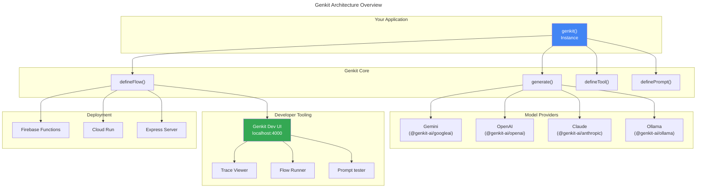
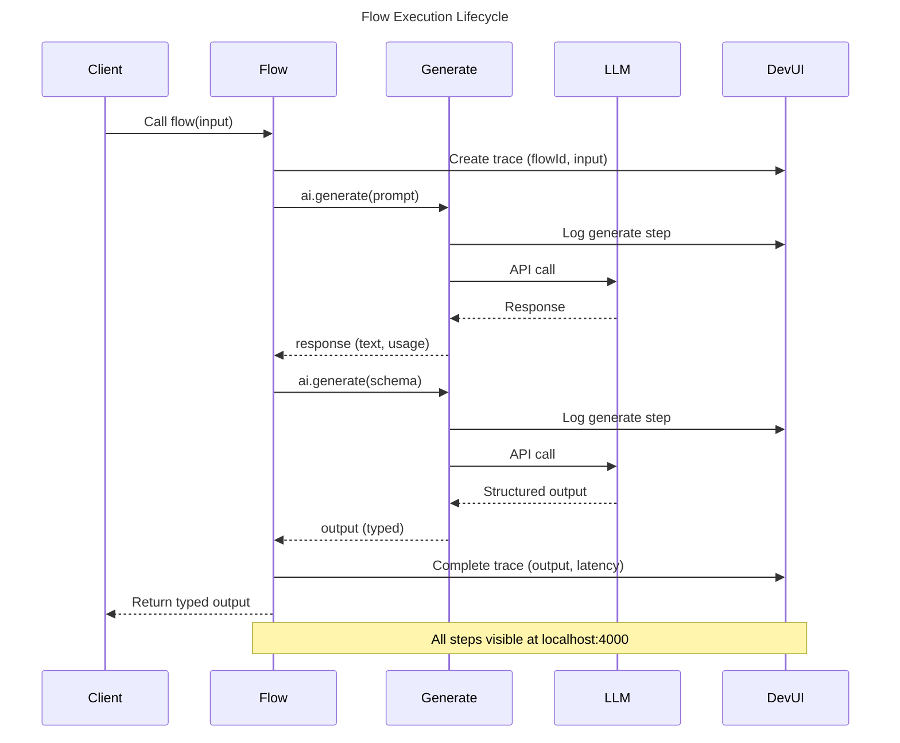
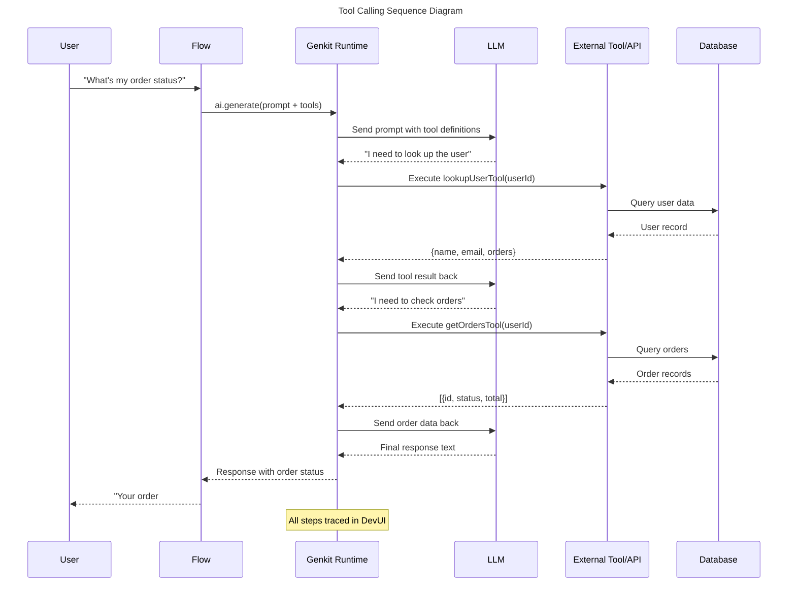

# Chapter 2: Genkit — Google's AI Orchestration Framework

> **Learning Objectives**
>
> - Understand what Genkit is and how it compares to Laravel for backend development
> - Install and configure Genkit with Node.js 20+
> - Master core concepts: `generate()`, flows, prompts, and tools
> - Build type-safe workflows with `defineFlow`
> - Manage prompts with reusable .prompt files
> - Connect LLMs to external APIs and databases via tool calling
> - Validate structured output with JSON schemas
> - Use the Developer UI for tracing and debugging
> - Configure multi-provider support for Gemini, OpenAI, Claude, and Ollama

---

## 2.1 What is Genkit?

### 2.1.1 The Laravel Analogy

If you know Laravel, you already understand Genkit's philosophy. Laravel didn't invent PHP — it created an opinionated framework that makes common backend tasks elegant and productive. Genkit does the same for AI application development.

```
Laravel : PHP :: Genkit : AI/LLM APIs
```

**Laravel provides:**
- Artisan CLI → `php artisan make:controller`
- Eloquent ORM → Typed database interactions
- Blade templating → Reusable view components
- Artisan commands → Task automation
- Telescope → Debugging and observability

**Genkit provides:**
- Genkit CLI → `genkit init`
- `defineFlow()` → Typed AI workflows
- `.prompt` files → Reusable prompt templates
- `defineTool()` → AI-callable functions
- Developer UI → Tracing and debugging

```typescript
// Laravel: Defining a route with controller
// Route::get('/users/{id}', [UserController::class, 'show']);

// Genkit: Defining an AI flow
const userSummaryFlow = ai.defineFlow(
  {
    name: 'userSummary',
    inputSchema: z.object({ userId: z.string() }),
    outputSchema: z.object({ summary: z.string(), sentiment: z.string() }),
  },
  async (input) => {
    const { output } = await ai.generate({
      prompt: `Summarize user ${input.userId}'s recent activity`,
      output: { schema: z.object({ summary: z.string(), sentiment: z.string() }) },
    });
    return output!;
  }
);
```

The key insight: **Genkit makes AI orchestration feel like regular backend development**. You define typed functions, call LLMs with clear interfaces, debug with a built-in UI, and deploy with Firebase.

### 2.1.2 Genkit Architecture



---

## 2.2 Installation and Setup

### 2.2.1 Prerequisites

- **Node.js 20+** (Genkit uses modern JavaScript features and the native fetch API)
- **npm 9+** or **yarn 1.22+** or **pnpm 8+**
- **A Google Cloud account** (optional, for Vertex AI — you can use local models with Ollama)

### 2.2.2 Installing Genkit CLI

```bash
# Install the Genkit CLI globally
npm install -g genkit

# Verify installation
genkit --version
# Expected output: genkit version 1.x.x
```

### 2.2.3 Creating a New Project

```bash
# Create a new project directory
mkdir my-genkit-app && cd my-genkit-app

# Initialize a Node.js project
npm init -y

# Initialize Genkit
genkit init

# This interactive command will:
# 1. Ask which model provider to configure
# 2. Create the project structure
# 3. Install required dependencies
```

The `genkit init` command creates this structure:

```
my-genkit-app/
├── src/
│   ├── index.ts              # Main entry point
│   ├── flows/                # Flow definitions
│   │   └── example.ts
│   ├── prompts/              # Prompt files (.prompt)
│   └── tools/                # Tool definitions
├── genkit.config.ts          # Genkit configuration
├── package.json
└── tsconfig.json
```

### 2.2.4 Manual Setup

If you prefer setting up manually:

```bash
# Install Genkit core and the Google AI plugin
npm install genkit @genkit-ai/googleai

# Install TypeScript and dev tools
npm install -D typescript @types/node ts-node tsx

# Create tsconfig.json
npx tsc --init --target es2022 --module nodenext --moduleResolution nodenext
```

```typescript
// genkit.config.ts — Genkit configuration
import { genkit } from 'genkit';
import { googleAI } from '@genkit-ai/googleai';

const ai = genkit({
  plugins: [
    googleAI({ apiKey: process.env.GOOGLE_GENAI_API_KEY }),
  ],
  model: 'googleai/gemini-2.0-flash', // Default model
});

export default ai;
```

```typescript
// src/index.ts — Main entry point
import ai from '../genkit.config';
import { z } from 'zod';

const helloFlow = ai.defineFlow(
  {
    name: 'helloFlow',
    inputSchema: z.object({ name: z.string() }),
    outputSchema: z.string(),
  },
  async (input) => {
    const response = await ai.generate({
      prompt: `Say hello to ${input.name} in a creative way.`,
    });
    return response.text;
  }
);

// Run locally
// helloFlow({ name: 'World' }).then(console.log);
```

### 2.2.5 Environment Configuration

```bash
# .env file
GOOGLE_GENAI_API_KEY=your-api-key-here
OPENAI_API_KEY=your-openai-key-here
ANTHROPIC_API_KEY=your-anthropic-key-here
PORT=3001
NODE_ENV=development
```

```typescript
// Load environment variables
import { config } from 'dotenv';
config();

// Validate required environment variables
const REQUIRED_ENV_VARS = [
  'GOOGLE_GENAI_API_KEY',
] as const;

for (const envVar of REQUIRED_ENV_VARS) {
  if (!process.env[envVar]) {
    throw new Error(`Missing required environment variable: ${envVar}`);
  }
}
```

---

## 2.3 Core Concepts

### 2.3.1 The `generate()` Function

The `generate()` function is Genkit's atomic unit of AI interaction. Every LLM call goes through this function.

```typescript
import { genkit } from 'genkit';
import { googleAI } from '@genkit-ai/googleai';

const ai = genkit({
  plugins: [googleAI()],
  model: 'googleai/gemini-2.0-flash',
});

// Basic generation
async function basicGenerate() {
  const response = await ai.generate({
    prompt: 'What is the capital of France?',
  });
  console.log(response.text);
  // Output: "The capital of France is Paris."
}

// Generation with system prompt
async function generateWithSystemPrompt() {
  const response = await ai.generate({
    system: 'You are a helpful math tutor. Explain concepts step by step.',
    prompt: 'What is the Pythagorean theorem?',
  });
  console.log(response.text);
}

// Generation with configuration
async function generateWithConfig() {
  const response = await ai.generate({
    prompt: 'Write a creative story about a robot learning to paint.',
    config: {
      temperature: 0.9,   // Higher creativity
      maxOutputTokens: 500,
      topP: 0.95,
      topK: 40,
      stopSequences: ['THE END'],
    },
  });
  console.log(response.text);
}
```

### 2.3.2 The `generate()` Response Object

```typescript
interface GenerateResponse {
  // The generated text content
  text: string;

  // Structured output if schema was provided (typed)
  output?: T;

  // Message history (useful for multi-turn)
  messages: Message[];

  // Usage metadata
  usage: {
    inputTokens: number;
    outputTokens: number;
    totalTokens: number;
  };

  // Raw response from the model provider
  raw: unknown;

  // Streaming response if stream: true
  stream?: AsyncIterable<GenerateResponseChunk>;
}

// Usage example
async function inspectResponse() {
  const response = await ai.generate({
    prompt: 'Explain quantum computing in one sentence.',
  });

  console.log('Text:', response.text);
  console.log('Input tokens:', response.usage.inputTokens);
  console.log('Output tokens:', response.usage.outputTokens);
  console.log('Total tokens:', response.usage.totalTokens);
}
```

### 2.3.3 Flows with `defineFlow()`

A **flow** is a type-safe, observable, reusable AI workflow. Flows are Genkit's primary abstraction for organizing AI logic.

```typescript
import { genkit } from 'genkit';
import { googleAI } from '@genkit-ai/googleai';
import { z } from 'zod';

const ai = genkit({
  plugins: [googleAI()],
  model: 'googleai/gemini-2.0-flash',
});

// ── Simple Flow ────────────────────────────────────

const simpleFlow = ai.defineFlow(
  {
    name: 'simpleFlow',
    inputSchema: z.object({ message: z.string() }),
    outputSchema: z.string(),
  },
  async (input) => {
    const response = await ai.generate({
      prompt: `Respond to: ${input.message}`,
    });
    return response.text;
  }
);

// Usage: const result = await simpleFlow({ message: 'Hello!' });

// ── Flow with Structured Output ─────────────────────

const BookReviewSchema = z.object({
  title: z.string(),
  author: z.string(),
  rating: z.number().min(1).max(5),
  summary: z.string().max(500),
  pros: z.array(z.string()),
  cons: z.array(z.string()),
  recommendation: z.enum(['must_read', 'recommended', 'average', 'skip']),
});

const reviewBookFlow = ai.defineFlow(
  {
    name: 'reviewBook',
    inputSchema: z.object({ bookTitle: z.string() }),
    outputSchema: BookReviewSchema,
  },
  async (input) => {
    const { output } = await ai.generate({
      prompt: `Provide a detailed review of the book "${input.bookTitle}".`,
      output: { schema: BookReviewSchema },
    });
    return output!;
  }
);

// Usage:
// const review = await reviewBookFlow({ bookTitle: '1984 by George Orwell' });
// console.log(review.rating); // 5
// console.log(review.recommendation); // "must_read"

// ── Flow with Multiple LLM Calls ────────────────────

const ResearchSchema = z.object({
  summary: z.string(),
  key_findings: z.array(z.string()),
  limitations: z.array(z.string()),
  suggested_follow_up: z.array(z.string()),
});

const researchAndReviewFlow = ai.defineFlow(
  {
    name: 'researchAndReview',
    inputSchema: z.object({ topic: z.string(), depth: z.enum(['quick', 'deep']) }),
    outputSchema: ResearchSchema,
  },
  async (input) => {
    // Step 1: Research the topic
    const researchResponse = await ai.generate({
      prompt: `Research the topic "${input.toptic}". 
               Provide comprehensive information including key concepts, recent developments, and controversies.`,
      config: { maxOutputTokens: input.depth === 'deep' ? 2000 : 800 },
    });
    const researchText = researchResponse.text;

    // Step 2: Analyze and structure the research
    const { output } = await ai.generate({
      prompt: `
        Based on this research about "${input.toptic}":
        
        ${researchText}
        
        Analyze and structure the information.
      `,
      output: { schema: ResearchSchema },
    });

    return output!;
  }
);
```

### 2.3.4 Flow Execution Lifecycle



### 2.3.5 Prompts with `definePrompt()`

Genkit allows you to define reusable prompts that can be loaded from `.prompt` files or defined programmatically.

```typescript
// Programmatic prompt definition
const summaryPrompt = ai.definePrompt({
  name: 'summaryPrompt',
  input: {
    schema: z.object({
      text: z.string(),
      maxLength: z.number().optional().default(200),
    }),
  },
  output: {
    schema: z.object({
      summary: z.string(),
      keyPoints: z.array(z.string()),
      readingTime: z.number(),
    }),
  },
  prompt: `Summarize the following text in at most {{maxLength}} words:

{{text}}

Provide the summary, key points, and estimated reading time.`,
});

// Using the prompt
async function usePrompt() {
  const result = await summaryPrompt({
    text: 'Long article text here...',
    maxLength: 150,
  });
  console.log(result.output?.summary);
}
```

### 2.3.6 Prompt Files (.prompt)

Genkit supports `.prompt` files for managing prompts outside of code. This is useful for:
- Non-developers (PMs, domain experts) editing prompts
- Version controlling prompts separately
- A/B testing different prompt versions

```
# src/prompts/customer-support.prompt

---
name: customerSupport
input:
  schema:
    type: object
    properties:
      query:
        type: string
        description: The customer's question
      tone:
        type: string
        enum: [empathetic, professional, casual]
        default: professional
output:
  schema:
    type: object
    properties:
      response:
        type: string
      category:
        type: string
        enum: [billing, technical, account, general]
      escalate:
        type: boolean
---

You are a {{tone}} customer support agent.

Customer query: {{query}}

Respond with:
1. A helpful response
2. The category of the issue
3. Whether this needs escalation to a human agent
```

Loading the prompt file:

```typescript
import { loadPromptFile } from 'genkit/prompts';

const customerPrompt = await loadPromptFile('src/prompts/customer-support.prompt');

const result = await customerPrompt({
  query: 'I was charged twice for my subscription',
  tone: 'empathetic',
});
```

---

## 2.4 Tools and Tool Calling

### 2.4.1 What are Tools?

Tools are functions that LLMs can invoke to interact with external systems. Think of them as **AI-callable APIs**. Genkit makes it trivial to define tools with type-safe inputs and outputs.

```typescript
// ── Basic Tool ──────────────────────────────────────

const getWeatherTool = ai.defineTool(
  {
    name: 'getWeather',
    description: 'Get the current weather for a city',
    inputSchema: z.object({
      city: z.string().describe('The city name'),
      units: z.enum(['celsius', 'fahrenheit']).default('celsius'),
    }),
    outputSchema: z.object({
      temperature: z.number(),
      conditions: z.string(),
      humidity: z.number(),
      windSpeed: z.number(),
    }),
  },
  async (input) => {
    // In production, call a real weather API
    const response = await fetch(
      `https://api.weather.com/current?city=${encodeURIComponent(input.city)}&units=${input.units}`
    );
    if (!response.ok) {
      throw new Error(`Weather API error: ${response.status}`);
    }
    return response.json();
  }
);

// ── Database Lookup Tool ────────────────────────────

const lookupUserTool = ai.defineTool(
  {
    name: 'lookupUser',
    description: 'Look up a user by email or ID in the database',
    inputSchema: z.object({
      searchBy: z.enum(['email', 'id']),
      value: z.string(),
    }),
    outputSchema: z.object({
      id: z.string(),
      name: z.string(),
      email: z.string(),
      role: z.string(),
      createdAt: z.string(),
      recentOrders: z.array(z.object({
        id: z.string(),
        total: z.number(),
        status: z.string(),
      })),
    }).nullable(),
  },
  async (input) => {
    // Simulate database lookup
    const db = await getDatabase();
    const query = input.searchBy === 'email'
      ? 'SELECT * FROM users WHERE email = $1'
      : 'SELECT * FROM users WHERE id = $1';
    const result = await db.query(query, [input.value]);
    return result.rows[0] || null;
  }
);

// ── Tool Execution Flow ─────────────────────────────

const customerSupportFlow = ai.defineFlow(
  {
    name: 'customerSupport',
    inputSchema: z.object({
      userId: z.string(),
      question: z.string(),
    }),
    outputSchema: z.string(),
  },
  async (input) => {
    // Genkit automatically routes tool calls to the LLM
    const response = await ai.generate({
      prompt: `
        User ${input.userId} asks: ${input.question}
        
        Use the available tools to:
        1. Look up the user's information
        2. Check their recent orders
        3. Answer their question based on the data
      `,
      tools: [lookupUserTool], // Available tools
    });
    return response.text;
  }
);
```

### 2.4.2 Tool Calling Sequence



### 2.4.3 Advanced Tool Patterns

```typescript
// ── Tool with Authentication ────────────────────────

const sendEmailTool = ai.defineTool(
  {
    name: 'sendEmail',
    description: 'Send an email to a customer',
    inputSchema: z.object({
      to: z.string().email(),
      subject: z.string().min(1).max(200),
      body: z.string().min(1).max(10000),
      priority: z.enum(['low', 'normal', 'high']).default('normal'),
    }),
    outputSchema: z.object({
      messageId: z.string(),
      status: z.enum(['sent', 'queued', 'failed']),
      estimatedDelivery: z.string(),
    }),
  },
  async (input) => {
    // Validate authorization
    if (!hasPermission('email:send')) {
      throw new Error('Unauthorized: Missing email:send permission');
    }

    // Send via email service
    const response = await fetch('https://api.sendgrid.com/v3/mail/send', {
      method: 'POST',
      headers: {
        'Authorization': `Bearer ${process.env.SENDGRID_API_KEY}`,
        'Content-Type': 'application/json',
      },
      body: JSON.stringify({
        personalizations: [{ to: [{ email: input.to }] }],
        from: { email: 'support@example.com' },
        subject: input.subject,
        content: [{ type: 'text/plain', value: input.body }],
      }),
    });

    if (!response.ok) {
      throw new Error(`Email service error: ${response.status}`);
    }

    return {
      messageId: crypto.randomUUID(),
      status: 'sent' as const,
      estimatedDelivery: new Date().toISOString(),
    };
  }
);

// ── Tool Composition ─────────────────────────────────

// A meta-tool that combines multiple tools
const fullCustomerProfileTool = ai.defineTool(
  {
    name: 'getFullCustomerProfile',
    description: 'Get complete customer profile including orders, support history, and preferences',
    inputSchema: z.object({ customerId: z.string() }),
    outputSchema: z.object({
      profile: z.any(),
      recentOrders: z.array(z.any()),
      supportTickets: z.array(z.any()),
      preferences: z.record(z.any()),
    }),
  },
  async (input) => {
    // Compose multiple data sources
    const [profile, orders, tickets, prefs] = await Promise.all([
      lookupUserTool({ searchBy: 'id', value: input.customerId }),
      getOrdersByCustomerTool({ customerId: input.customerId, limit: 5 }),
      getSupportTicketsTool({ customerId: input.customerId, limit: 10 }),
      getPreferencesTool({ customerId: input.customerId }),
    ]);

    return {
      profile,
      recentOrders: orders,
      supportTickets: tickets,
      preferences: prefs,
    };
  }
);
```

---

## 2.5 Structured Output and JSON Schema Validation

### 2.5.1 The Problem with Free-Text LLM Responses

Without structured output, LLM responses are unpredictable:

```typescript
// Without structured output — fragile parsing
async function extractProductInfo(text: string) {
  const response = await ai.generate({
    prompt: `Extract product info from: ${text}`,
  });

  // Fragile string parsing
  const lines = response.text.split('\n');
  const name = lines.find(l => l.startsWith('Name:'))?.replace('Name:', '').trim();
  const price = parseFloat(lines.find(l => l.startsWith('Price:'))?.replace('Price:', '').trim() || '0');

  return { name, price }; // May be wrong, may crash
}
```

### 2.5.2 Structured Output with Zod Schemas

```typescript
import { z } from 'zod';

// Define the schema
const ProductSchema = z.object({
  name: z.string().describe('The product name'),
  price: z.number().positive().describe('The price in USD'),
  currency: z.string().length(3).default('USD'),
  category: z.enum(['electronics', 'clothing', 'food', 'other']),
  inStock: z.boolean(),
  features: z.array(z.string()).min(1),
  sku: z.string().regex(/^[A-Z]{2}-\d{4}$/),
  dimensions: z.object({
    width: z.number(),
    height: z.number(),
    depth: z.number(),
    unit: z.enum(['cm', 'in']),
  }).optional(),
});

// Type inference
type Product = z.infer<typeof ProductSchema>;

// Genkit flow with structured output
const extractProductFlow = ai.defineFlow(
  {
    name: 'extractProduct',
    inputSchema: z.object({ text: z.string() }),
    outputSchema: ProductSchema,
  },
  async (input) => {
    const { output } = await ai.generate({
      prompt: `Extract product information from this text:\n\n${input.text}`,
      output: { schema: ProductSchema },
    });

    // output is typed as Product — TypeScript knows the shape
    return output!;
  }
);

// Usage
async function example() {
  const product = await extractProductFlow({
    text: 'Apple MacBook Pro 16-inch, $2499 USD, in stock. SKU: AP-0001. Features: M3 Pro chip, 18GB RAM, 512GB SSD.',
  });

  console.log(product.name); // "Apple MacBook Pro 16-inch"
  console.log(product.price); // 2499
  console.log(product.inStock); // true
  console.log(product.sku); // "AP-0001"

  // TypeScript enforces the shape
  // product.category // TypeScript knows this is 'electronics' | 'clothing' | 'food' | 'other'
}
```

### 2.5.3 Validation and Retry

```typescript
const InvoiceSchema = z.object({
  invoice_number: z.string(),
  date: z.string().regex(/^\d{4}-\d{2}-\d{2}$/),
  vendor: z.object({
    name: z.string(),
    tax_id: z.string().optional(),
    address: z.string(),
  }),
  items: z.array(z.object({
    description: z.string(),
    quantity: z.number().positive(),
    unit_price: z.number().positive(),
    total: z.number().positive(),
  })).min(1),
  subtotal: z.number().positive(),
  tax: z.number().min(0),
  total: z.number().positive(),
  currency: z.string().length(3),
});

async function extractInvoiceWithRetry(text: string, maxRetries = 3): Promise<z.infer<typeof InvoiceSchema>> {
  let lastError: Error | null = null;

  for (let attempt = 0; attempt < maxRetries; attempt++) {
    try {
      const { output } = await ai.generate({
        prompt: `
          Extract invoice data from the following text.
          Ensure all required fields are present and valid.
          
          Text: ${text}
          
          Pay special attention to:
          - Invoice number format
          - Date in YYYY-MM-DD format
          - All line items with correct math (qty × unit_price = total)
          - Subtotal, tax, and total must match
        `,
        output: { schema: InvoiceSchema },
        config: {
          temperature: 0.1, // Low temperature for precise extraction
        },
      });

      // Validate the output against the schema
      const validated = InvoiceSchema.parse(output);
      return validated;

    } catch (error) {
      lastError = error as Error;
      console.warn(`Attempt ${attempt + 1} failed:`, error.message);

      if (attempt < maxRetries - 1) {
        // Add the error context to the next attempt
        await ai.generate({
          prompt: `The previous extraction failed with error: ${error.message}
                   Please fix and try again with the original text.`,
        });
      }
    }
  }

  throw new Error(`Failed to extract invoice after ${maxRetries} attempts: ${lastError?.message}`);
}
```

---

## 2.6 Developer UI

### 2.6.1 Starting the Developer UI

Genkit includes a powerful developer UI that provides:
- **Trace viewer**: See every LLM call, tool execution, and flow step
- **Flow runner**: Test flows interactively
- **Prompt tester**: Experiment with prompts without code changes
- **Configuration viewer**: See your Genkit setup

```bash
# Start the Genkit Dev UI alongside your application
genkit start -- npx tsx src/index.ts

# Or start it separately
genkit start
```

The UI is available at **http://localhost:4000**.

### 2.6.2 Trace Inspection

```typescript
// Every flow execution is automatically traced
const flowWithTracing = ai.defineFlow(
  {
    name: 'tracedFlow',
    inputSchema: z.object({ query: z.string() }),
    outputSchema: z.string(),
  },
  async (input) => {
    // Step 1 — traced
    const research = await ai.generate({
      prompt: `Research: ${input.query}`,
    });

    // Step 2 — traced
    const analysis = await ai.generate({
      prompt: `Analyze this research: ${research.text}`,
    });

    // Step 3 — traced
    const final = await ai.generate({
      prompt: `Create a final answer from: ${analysis.text}`,
    });

    return final.text;
  }
);

// In the Dev UI, you'll see:
// ┌─────────────────────────────────────────┐
// │ Trace: tracedFlow                       │
// ├─────────────────────────────────────────┤
// │ Step 1: generate (research)             │
// │   Input tokens: 150                     │
// │   Output tokens: 300                    │
// │   Latency: 1.2s                         │
// ├─────────────────────────────────────────┤
// │ Step 2: generate (analysis)             │
// │   Input tokens: 450                     │
// │   Output tokens: 200                    │
// │   Latency: 0.8s                         │
// ├─────────────────────────────────────────┤
// │ Step 3: generate (final)                │
// │   Input tokens: 650                     │
// │   Output tokens: 150                    │
// │   Latency: 0.6s                         │
// ├─────────────────────────────────────────┤
// │ Total: 3.6s / 1100 tokens               │
// └─────────────────────────────────────────┘
```

### 2.6.3 Flow Runner

The Dev UI's flow runner lets you test flows with different inputs:

```
Flow: customerSupport
Input: {"userId": "usr_123", "question": "Where is my order?"}

▶ Run

Output:
"Hi! Let me look up your order status...

I can see your order #ORD-7890 is currently out for delivery.
It should arrive today by 5 PM. Would you like me to send
you the tracking link?"

Trace:
  └─ lookupUserTool → 30ms
  └─ getOrdersTool → 45ms
  └─ generate → 1.2s
Total: 1.3s
```

---

## 2.7 Multi-Provider Support

### 2.7.1 Supported Providers

Genkit supports multiple LLM providers through a unified interface:

| Provider | Plugin | Models | Key Feature |
|----------|--------|--------|-------------|
| **Google AI** | `@genkit-ai/googleai` | Gemini 2.0 Flash, Gemini 1.5 Pro | Free tier, 1M context |
| **Vertex AI** | `@genkit-ai/vertexai` | Gemini, Claude (on GCP) | Enterprise security |
| **OpenAI** | `@genkit-ai/openai` | GPT-4o, GPT-4o-mini, o1 | Broadest ecosystem |
| **Anthropic** | `@genkit-ai/anthropic` | Claude 3.5 Sonnet, Haiku | Best for reasoning |
| **Ollama** | `@genkit-ai/ollama` | Llama 4, Mistral, CodeLlama | Local, free, private |

### 2.7.2 Configuration with Multiple Providers

```typescript
// genkit.config.ts — Multi-provider configuration
import { genkit } from 'genkit';
import { googleAI } from '@genkit-ai/googleai';
import { openAI } from '@genkit-ai/openai';
import { anthropic } from '@genkit-ai/anthropic';
import { ollama } from '@genkit-ai/ollama';

const ai = genkit({
  plugins: [
    googleAI({ apiKey: process.env.GOOGLE_GENAI_API_KEY }),
    openAI({ apiKey: process.env.OPENAI_API_KEY }),
    anthropic({ apiKey: process.env.ANTHROPIC_API_KEY }),
    ollama({ serverAddress: 'http://127.0.0.1:11434' }),
  ],
  // Default model
  model: 'googleai/gemini-2.0-flash',
});

export default ai;
```

### 2.7.3 Switching Models Per Task

```typescript
// Use different models for different tasks
async function multiModelExample() {
  // Simple task → fast, cheap model
  const quickAnswer = await ai.generate({
    model: 'googleai/gemini-2.0-flash',
    prompt: 'What is 2+2?',
  });

  // Complex reasoning → powerful model
  const deepAnalysis = await ai.generate({
    model: 'anthropic/claude-3.5-sonnet',
    prompt: 'Analyze the implications of quantum computing on cryptography...',
    config: { temperature: 0.2, maxOutputTokens: 4000 },
  });

  // Creative task → balanced model
  const creativeWriting = await ai.generate({
    model: 'openai/gpt-4o',
    prompt: 'Write a short story about a time-traveling programmer.',
    config: { temperature: 0.8 },
  });

  // Local development → free, private model
  const quickTest = await ai.generate({
    model: 'ollama/llama4',
    prompt: 'Hello, what model are you?',
  });

  return { quickAnswer, deepAnalysis, creativeWriting, quickTest };
}
```

### 2.7.4 Provider Comparison in a Flow

```typescript
const ProviderComparisonSchema = z.object({
  gemini: z.string(),
  claude: z.string(),
  gpt4o: z.string(),
  winner: z.string(),
});

const compareProvidersFlow = ai.defineFlow(
  {
    name: 'compareProviders',
    inputSchema: z.object({ prompt: z.string() }),
    outputSchema: ProviderComparisonSchema,
  },
  async (input) => {
    // Run all three models in parallel
    const [gemini, claude, gpt4o] = await Promise.all([
      ai.generate({
        model: 'googleai/gemini-2.0-flash',
        prompt: input.prompt,
      }),
      ai.generate({
        model: 'anthropic/claude-3.5-sonnet',
        prompt: input.prompt,
      }),
      ai.generate({
        model: 'openai/gpt-4o',
        prompt: input.prompt,
      }),
    ]);

    // Ask a judge model to pick the best
    const { output } = await ai.generate({
      prompt: `
        Which of these three responses is best for the prompt "${input.prompt}"?

        Gemini: ${gemini.text}

        Claude: ${claude.text}

        GPT-4o: ${gpt4o.text}

        Pick the winner and explain why.
      `,
      output: { schema: z.object({
        winner: z.enum(['gemini', 'claude', 'gpt4o']),
        reasoning: z.string(),
      })},
    });

    return {
      gemini: gemini.text,
      claude: claude.text,
      gpt4o: gpt4o.text,
      winner: output!.winner,
    };
  }
);
```

---

## 2.8 Building a Complete Genkit Application

### 2.8.1 Project Structure

```
ai-support-system/
├── src/
│   ├── index.ts                 # Entry point, Express server
│   ├── genkit.config.ts         # Genkit configuration
│   ├── flows/
│   │   ├── customer-support.ts  # Customer support flow
│   │   ├── order-management.ts  # Order-related flows
│   │   └── analytics.ts         # Analytics flows
│   ├── tools/
│   │   ├── database.ts          # Database tools
│   │   ├── email.ts             # Email tools
│   │   └── payment.ts           # Payment tools
│   ├── prompts/
│   │   ├── greeting.prompt      # Greeting prompt file
│   │   └── escalation.prompt    # Escalation prompt file
│   └── schemas/
│       └── index.ts             # Zod schemas
├── genkit.config.ts
├── package.json
└── tsconfig.json
```

### 2.8.2 Complete Example: AI Support System

```typescript
// src/schemas/index.ts
import { z } from 'zod';

export const CustomerSchema = z.object({
  id: z.string(),
  name: z.string(),
  email: z.string().email(),
  tier: z.enum(['free', 'pro', 'enterprise']),
  created_at: z.string(),
});

export const OrderSchema = z.object({
  id: z.string(),
  customer_id: z.string(),
  status: z.enum(['pending', 'confirmed', 'shipped', 'delivered', 'cancelled']),
  total: z.number().positive(),
  items: z.array(z.object({
    name: z.string(),
    quantity: z.number().positive(),
    price: z.number().positive(),
  })),
  created_at: z.string(),
  estimated_delivery: z.string().optional(),
});

export const SupportTicketSchema = z.object({
  id: z.string(),
  customer_id: z.string(),
  subject: z.string(),
  description: z.string(),
  priority: z.enum(['low', 'medium', 'high', 'urgent']),
  status: z.enum(['open', 'in_progress', 'resolved', 'closed']),
  created_at: z.string(),
});

// src/tools/database.ts
import { z } from 'zod';
import { CustomerSchema, OrderSchema, SupportTicketSchema } from '../schemas';

// Simulated database tools
export const lookupCustomerTool = ai.defineTool(
  {
    name: 'lookupCustomer',
    description: 'Look up a customer by ID or email',
    inputSchema: z.object({
      identifier: z.string(),
      type: z.enum(['id', 'email']),
    }),
    outputSchema: CustomerSchema.nullable(),
  },
  async (input) => {
    // Database query would go here
    return {
      id: 'cust_123',
      name: 'John Doe',
      email: 'john@example.com',
      tier: 'pro',
      created_at: '2025-01-15T10:00:00Z',
    };
  }
);

export const getOrdersTool = ai.defineTool(
  {
    name: 'getOrders',
    description: 'Get orders for a customer, optionally filtered by status',
    inputSchema: z.object({
      customerId: z.string(),
      status: z.enum(['pending', 'confirmed', 'shipped', 'delivered', 'cancelled']).optional(),
      limit: z.number().min(1).max(50).default(10),
    }),
    outputSchema: z.array(OrderSchema),
  },
  async (input) => {
    return [{
      id: 'ord_789',
      customer_id: input.customerId,
      status: 'shipped',
      total: 299.99,
      items: [{ name: 'Wireless Headphones', quantity: 1, price: 299.99 }],
      created_at: '2026-06-28T14:00:00Z',
      estimated_delivery: '2026-07-02T18:00:00Z',
    }];
  }
);

export const createTicketTool = ai.defineTool(
  {
    name: 'createSupportTicket',
    description: 'Create a new support ticket',
    inputSchema: z.object({
      customerId: z.string(),
      subject: z.string(),
      description: z.string(),
      priority: z.enum(['low', 'medium', 'high', 'urgent']),
    }),
    outputSchema: SupportTicketSchema,
  },
  async (input) => {
    const ticket: z.infer<typeof SupportTicketSchema> = {
      id: `tkt_${crypto.randomUUID().slice(0, 8)}`,
      customer_id: input.customerId,
      subject: input.subject,
      description: input.description,
      priority: input.priority,
      status: 'open',
      created_at: new Date().toISOString(),
    };
    // Save to database
    return ticket;
  }
);

// src/flows/customer-support.ts
const CustomerSupportResponseSchema = z.object({
  response_text: z.string(),
  actions_taken: z.array(z.string()),
  needs_human_escalation: z.boolean(),
  ticket_id: z.string().optional(),
  customer_satisfaction_score: z.number().min(1).max(10).optional(),
});

export const customerSupportFlow = ai.defineFlow(
  {
    name: 'customerSupport',
    inputSchema: z.object({
      customerId: z.string(),
      message: z.string(),
      channel: z.enum(['chat', 'email', 'phone']).default('chat'),
    }),
    outputSchema: CustomerSupportResponseSchema,
  },
  async (input) => {
    // Step 1: Look up customer
    const customer = await lookupCustomerTool({
      identifier: input.customerId,
      type: 'id',
    });

    if (!customer) {
      return {
        response_text: "I couldn't find your account. Let me create a support ticket for you.",
        actions_taken: ['Customer lookup failed'],
        needs_human_escalation: true,
      };
    }

    // Step 2: Analyze the message and get recent orders
    const orders = await getOrdersTool({
      customerId: input.customerId,
      limit: 5,
    });

    // Step 3: Generate response using all available context
    const { output } = await ai.generate({
      prompt: `
        Customer: ${customer.name} (${customer.tier} tier)
        Message: ${input.message}
        Channel: ${input.channel}
        
        Recent Orders: ${JSON.stringify(orders)}
        
        Based on the customer's tier and order history, provide:
        1. A personalized response
        2. List of actions taken
        3. Whether this needs human escalation
        4. A satisfaction score prediction
        
        For enterprise tier customers, prioritize speed and personalization.
        For urgent issues, always suggest escalation.
      `,
      output: { schema: CustomerSupportResponseSchema },
      tools: [createTicketTool],
      config: { temperature: 0.3 },
    });

    // Step 4: Auto-create ticket for complex issues
    let ticketId = output!.ticket_id;
    if (output!.needs_human_escalation && !ticketId) {
      const ticket = await createTicketTool({
        customerId: input.customerId,
        subject: `Auto-generated: ${input.message.slice(0, 100)}`,
        description: input.message,
        priority: output!.customer_satisfaction_score! < 5 ? 'high' : 'medium',
      });
      ticketId = ticket.id;
    }

    return { ...output!, ticket_id: ticketId };
  }
);

// src/index.ts — Express server
import express from 'express';
import { customerSupportFlow } from './flows/customer-support';

const app = express();
app.use(express.json());

app.post('/api/support', async (req, res) => {
  try {
    const result = await customerSupportFlow(req.body);
    res.json(result);
  } catch (error) {
    console.error('Support flow error:', error);
    res.status(500).json({ error: 'Internal server error' });
  }
});

const PORT = process.env.PORT || 3001;
app.listen(PORT, () => {
  console.log(`AI Support System running on port ${PORT}`);
  console.log(`Genkit Dev UI: http://localhost:4000`);
});
```

---

## 2.9 Production Deployment

### 2.9.1 Firebase Functions Deployment

```typescript
// src/firebase.ts — Firebase Functions entry point
import { onFlow } from '@genkit-ai/firebase/functions';
import ai from './genkit.config';

const helloFlow = ai.defineFlow(
  { name: 'helloFlow', inputSchema: z.object({ name: z.string() }), outputSchema: z.string() },
  async (input) => {
    const response = await ai.generate({ prompt: `Say hello to ${input.name}` });
    return response.text;
  }
);

// Deploy as a Firebase Function
export const helloWorld = onFlow(helloFlow);
```

### 2.9.2 Docker Deployment

```dockerfile
FROM node:20-slim

WORKDIR /app

COPY package*.json ./
RUN npm ci --only=production

COPY dist/ ./dist/
COPY genkit.config.ts ./

EXPOSE 3001

CMD ["node", "dist/index.js"]
```

### 2.9.3 Environment-Specific Configuration

```typescript
// genkit.config.ts — Environment-aware configuration
import { genkit } from 'genkit';
import { googleAI } from '@genkit-ai/googleai';
import { ollama } from '@genkit-ai/ollama';

const isProduction = process.env.NODE_ENV === 'production';

const ai = genkit({
  plugins: isProduction
    ? [googleAI({ apiKey: process.env.GOOGLE_GENAI_API_KEY })]
    : [ollama({ serverAddress: 'http://127.0.0.1:11434' })],
  model: isProduction ? 'googleai/gemini-2.0-flash' : 'ollama/llama4',
  // Enable tracing in development, disable in production
  tracing: !isProduction,
  ...(isProduction ? {} : {
    logLevel: 'debug',
  }),
});

export default ai;
```

---

## Chapter Summary

Genkit is Google's opinionated framework for building production AI applications. Like Laravel revolutionized PHP backend development, Genkit brings structure, type safety, and developer tooling to AI orchestration.

**Key concepts:**
- **`generate()`**: The atomic unit of AI interaction, handling all LLM calls
- **`defineFlow()`**: Type-safe, observable AI workflows that compose multiple LLM calls
- **`defineTool()`**: AI-callable functions that connect LLMs to external systems
- **`definePrompt()`**: Reusable prompt templates with input/output schemas
- **Prompts files**: `.prompt` files for managing prompts outside of code
- **Developer UI**: Built-in observability at localhost:4000 with trace viewer and flow runner
- **Multi-provider**: Unified interface for Gemini, OpenAI, Claude, and Ollama

Genkit's production-readiness comes from its focus on:
- **Type safety**: Every flow and tool has validated Zod schemas for inputs and outputs
- **Observability**: Every execution is traced and visible in the Dev UI
- **Error handling**: Structured error handling with retry logic and validation
- **Deployment**: First-class support for Firebase Functions, Cloud Run, and Docker

## Practical Takeaways

1. **Always use structured output** with Zod schemas — never parse free-text LLM responses
2. **Use flows** to organize multi-step AI workflows; each flow should do one thing well
3. **Define tools** for every external interaction — database, API, file system
4. **Use the Dev UI** during development; it catches issues that logs miss
5. **Configure multiple providers** and switch models based on task complexity
6. **Use prompt files** for prompts that non-developers need to edit
7. **Add retry logic** with Zod validation for production extraction tasks

---

## Chapter Quiz (MCQs)

**Q1.** What is Genkit's primary purpose?
- a) A database management system
- b) An opinionated framework for building production AI applications
- c) A replacement for Node.js
- d) A CSS framework for AI interfaces

**Q2.** Which function is Genkit's atomic unit of AI interaction?
- a) `createFlow()`
- b) `generate()`
- c) `callLLM()`
- d) `prompt()`

**Q3.** What does `defineFlow()` provide that raw API calls lack?
- a) Type safety, observability, and composability
- b) Faster network requests
- c) Free API credits
- d) Automatic UI generation

**Q4.** How do you define a tool in Genkit?
- a) `createTool()`
- b) `defineTool()`
- c) `newTool()`
- d) `tool()`

**Q5.** What port does the Genkit Developer UI run on?
- a) 3000
- b) 4000
- c) 8080
- d) 5000

**Q6.** Which library does Genkit use for structured output validation?
- a) Joi
- b) Yup
- c) Zod
- d) Ajv

**Q7.** How do you specify which model to use for a specific `generate()` call?
- a) `model: 'googleai/gemini-2.0-flash'`
- b) `llm: gemini`
- c) `engine: 'gemini'`
- d) `provider: 'google'`

**Q8.** What is the purpose of `.prompt` files?
- a) To store compiled JavaScript
- b) To manage prompts outside of code for non-developer editing
- c) To define database schemas
- d) To configure environment variables

**Q9.** Which provider plugin is used for local, free LLM access?
- a) `@genkit-ai/googleai`
- b) `@genkit-ai/openai`
- c) `@genkit-ai/ollama`
- d) `@genkit-ai/anthropic`

**Q10.** What information does the Genkit Dev UI trace viewer show?
- a) Only the final output
- b) Every step: LLM calls, tool executions, latency, token counts
- c) Server CPU usage
- d) Database query performance

**Answers**: 1-b, 2-b, 3-a, 4-b, 5-b, 6-c, 7-a, 8-b, 9-c, 10-b

---

## Exercises

**Exercise 1: First Genkit Application**
Create a Genkit application that:
1. Initializes Genkit with the Google AI plugin
2. Defines a flow called `generateStory` that takes a `{ genre: string, characters: string[] }` input
3. Returns a structured output with `{ title: string, story: string, wordCount: number }`
4. Test it using the Genkit Dev UI flow runner
5. Measure the token usage and latency

**Exercise 2: Multi-Step Flow**
Build a flow that performs a three-step analysis on any input text:
1. **Summarize** the text (100 words max)
2. **Extract** key entities (people, places, organizations, dates)
3. **Classify** the sentiment and topic
Use Zod schemas for each step's output. The final output should combine all three analyses.

**Exercise 3: Tool Integration**
Create a `weatherAIAssistant` flow that:
1. Defines a `getWeather` tool that calls a weather API (or simulates one)
2. Defines a `getForecast` tool that returns a 5-day forecast
3. Defines a `sendWeatherAlert` tool that sends an email alert
4. Creates a flow that:
   - Takes a city name and user question
   - Uses the tools based on the question
   - Returns structured output with weather data and actions taken
5. Test various questions like "What's the weather in Tokyo?" and "Should I bring an umbrella to London tomorrow?"

**Exercise 4: Multi-Provider Router**
Implement a flow that:
1. Takes `{ prompt: string, taskType: 'code' | 'creative' | 'analysis' | 'simple' }`
2. Routes to different models based on task type:
   - `code` → Claude 3.5 Sonnet (best for code)
   - `creative` → GPT-4o (best for creativity)
   - `analysis` → Gemini 1.5 Pro (large context)
   - `simple` → Gemini 2.0 Flash (fast & cheap)
3. Returns the response along with which model was used and why
4. Add a fallback: if the primary model fails, try the next best

**Exercise 5: Production Support System**
Extend the customer support system from section 2.8 to add:
1. A `refundOrder` tool that processes refunds (with validation)
2. A `trackShipment` tool that calls a shipping API
3. A flow that:
   - Identifies the intent: refund, tracking, account issue, or general question
   - Routes to the appropriate sub-flow
   - Returns a structured response with ticket ID, actions taken, and estimated resolution time
4. Add rate limiting: max 30 requests per minute per customer
5. Add a cache layer: if the same question was asked in the last hour, use cached response
