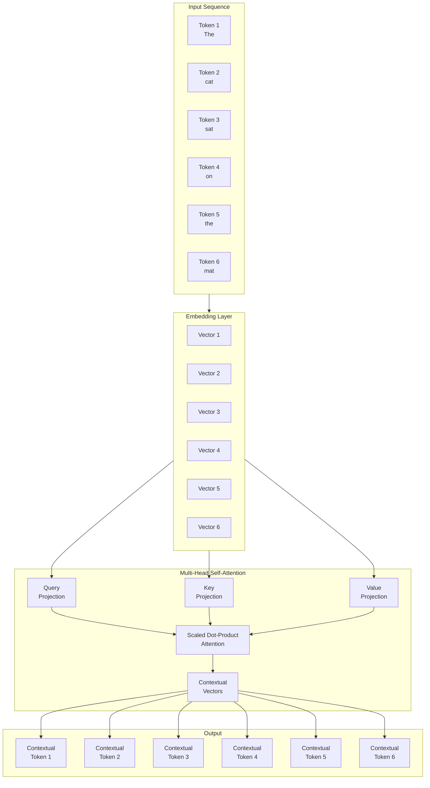
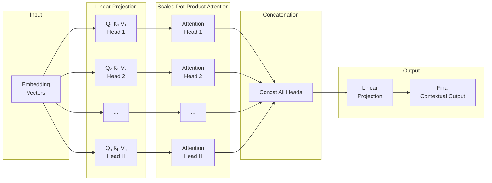
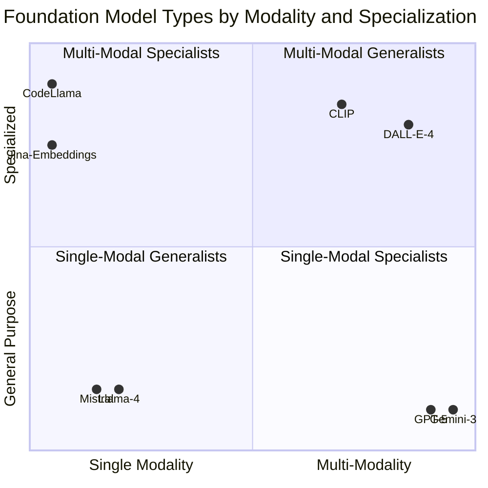
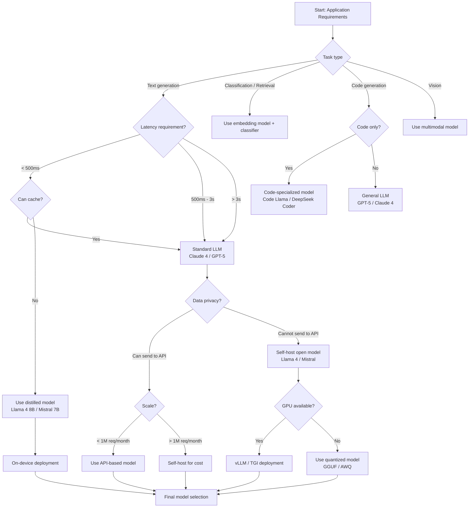

# Chapter 3: Understanding Foundation Models

## Learning Objectives

| Objective | Description |
|-----------|-------------|
| LO1 | Explain how the transformer architecture enables foundation models through self-attention and multi-head attention |
| LO2 | Distinguish pretraining objectives (next token prediction, masked LM) and describe scaling laws |
| LO3 | Compare types of foundation models: LLMs, multimodal, embedding, code, and vision models |
| LO4 | Analyze core capabilities: reasoning, in-context learning, instruction following, code generation, summarization |
| LO5 | Identify limitations including hallucinations, knowledge cutoff, context window constraints, and bias |
| LO6 | Apply a model selection framework that maps tasks to models based on capability, cost, and latency requirements |

<!-- Image Gallery -->
<div style="display:flex;flex-wrap:wrap;gap:4px;margin:16px 0;padding:12px;background:#f8fafc;border-radius:8px;border:1px solid #e2e8f0;">
<a href="../../../assets/images/lessons/modern-ai-engineering/03-understanding-foundation-models/hero.svg" target="_blank" rel="noopener">
  
</a>
<a href="../../../assets/images/lessons/modern-ai-engineering/03-understanding-foundation-models/handwritten-notes.svg" target="_blank" rel="noopener">
  
</a>
<a href="../../../assets/images/lessons/modern-ai-engineering/03-understanding-foundation-models/sticky-notes.svg" target="_blank" rel="noopener">
  
</a>
<a href="../../../assets/images/lessons/modern-ai-engineering/03-understanding-foundation-models/visual-explanation.svg" target="_blank" rel="noopener">
  
</a>
<a href="../../../assets/images/lessons/modern-ai-engineering/03-understanding-foundation-models/architecture.svg" target="_blank" rel="noopener">
  
</a>
<a href="../../../assets/images/lessons/modern-ai-engineering/03-understanding-foundation-models/workflow.svg" target="_blank" rel="noopener">
  
</a>
<a href="../../../assets/images/lessons/modern-ai-engineering/03-understanding-foundation-models/mindmap.svg" target="_blank" rel="noopener">
  
</a>
<a href="../../../assets/images/lessons/modern-ai-engineering/03-understanding-foundation-models/comparison.svg" target="_blank" rel="noopener">
  
</a>
<a href="../../../assets/images/lessons/modern-ai-engineering/03-understanding-foundation-models/cheatsheet.svg" target="_blank" rel="noopener">
  
</a>
<a href="../../../assets/images/lessons/modern-ai-engineering/03-understanding-foundation-models/interview-quiz.svg" target="_blank" rel="noopener">
  
</a>
<a href="../../../assets/images/lessons/modern-ai-engineering/03-understanding-foundation-models/social-card.svg" target="_blank" rel="noopener">
  
</a>
</div>
<!-- End Image Gallery -->

## 3.1 How Transformers Work

The transformer architecture, introduced in the 2017 paper "Attention Is All You Need," is the foundation upon which all modern foundation models are built. Understanding transformers is essential for making informed decisions about model selection, prompt design, and troubleshooting.

**The Attention Mechanism**

Attention allows a model to focus on relevant parts of the input when producing each output token. Instead of compressing the entire input into a fixed-size vector, attention creates a weighted combination of all input positions, with weights determined by relevance to the current output position.



**Self-Attention Formula**

For a sequence of tokens, self-attention computes:

```
Attention(Q, K, V) = softmax(QK^T / sqrt(d_k)) V
```

Where:
- **Q (Query)**: What the current position is looking for
- **K (Key)**: What each position in the input offers
- **V (Value)**: The actual content of each position
- **d_k**: Dimension of the key vectors (scaling factor to prevent softmax saturation)

The dot product QK^T produces an attention score matrix where element (i, j) represents how much token i should attend to token j. The softmax normalizes these scores into a probability distribution. The final output is a weighted sum of the value vectors.

**Multi-Head Attention**

Rather than performing a single attention operation, transformers use multiple attention heads in parallel. Each head learns different relationship patterns:



**Why Multi-Head?** Each head can specialize:
- Head 1: Syntactic relationships (subject-verb agreement)
- Head 2: Semantic relationships (synonymy, entailment)
- Head 3: Positional patterns (token distance)
- Head 4: Entity tracking (coreference resolution)

With 8–128 heads in modern models, the combined representations capture rich linguistic and reasoning patterns.

**The Transformer Block**

A single transformer block consists of:
1. Multi-head self-attention (with residual connection and layer normalization)
2. Feed-forward neural network (with residual connection and layer normalization)
3. Positional encoding (since attention has no inherent notion of token order)

Models stack 12 (small) to 128+ (large) such blocks. GPT-5 reportedly uses ~120 layers with 96 attention heads per layer.

## 3.2 Pretraining

Pretraining is the process of training a foundation model on a large, diverse corpus of text (and potentially other modalities) using self-supervised objectives. This section covers the key pretraining approaches and the scaling laws that govern them.

**Pretraining Objectives**

| Objective | Description | Used By | Example |
|-----------|-------------|---------|---------|
| Next Token Prediction (Causal LM) | Predict the next token given all previous tokens (autoregressive) | GPT family, Llama, Mistral, Claude | Input: "The cat sat on the" → Target: "mat" |
| Masked Language Modeling | Predict randomly masked tokens given bidirectional context | BERT, RoBERTa, DeBERTa | Input: "The [MASK] sat on the mat" → Target: "cat" |
| Prefix LM | Attend bidirectionally to prefix, autoregressively generate continuation | T5, PaLM | Prefix: "translate English to French: The cat" → Generate: "Le chat" |
| Multi-Task Pretraining | Combined objectives across modalities and tasks | Gemini, GPT-5 | Next token prediction + image captioning + code completion |

**Scaling Laws**

Research from Kaplan et al. (2020) and Hoffmann et al. (2022, Chinchilla scaling laws) established three key findings:

1. **Model performance follows a power law** with compute, data, and parameters. Doubling compute consistently improves performance, though with diminishing returns.

2. **The Chinchilla optimum**: For a given compute budget, the optimal model size and data size are roughly equal — a 10B parameter model should be trained on ~200B tokens. Many earlier models (GPT-3, Llama 1) were undertrained by this standard.

3. **Emergent abilities**: Certain capabilities (e.g., multi-step reasoning, in-context learning) only appear above a threshold model size. These abilities cannot be predicted by extrapolating from smaller models.

**Training Data Composition**

Modern pretraining datasets are massive (15T+ tokens) and diverse:

| Data Source | Typical Proportion | Example |
|-------------|-------------------|---------|
| Web crawl (CommonCrawl, C4) | 50–60% | Filtered web pages |
| Books | 10–15% | Project Gutenberg, publisher corpora |
| Academic papers | 5–10% | arXiv, PubMed, Semantic Scholar |
| Code | 10–20% | GitHub (permissively licensed) |
| Social media | 5–10% | Reddit, Wikipedia discussions |
| Multilingual | 10–15% | Non-English web, translated corpora |

Data filtering is critical: deduplication at the document and paragraph level, quality filtering (perplexity-based, heuristic-based), and toxicity filtering all affect downstream performance.

## 3.3 Types of Foundation Models

Foundation models have diversified beyond text-only LLMs. Each type serves distinct use cases.



**Model Type Comparison**

| Type | Example Models | Input | Output | Primary Use Cases |
|------|---------------|-------|--------|-------------------|
| LLM (Text) | GPT-5, Claude 4, Llama 4, Mistral Large, DeepSeek V4 | Text | Text | Chat, writing, reasoning, analysis, Q&A |
| Multimodal | Gemini 3, GPT-5, Claude 4 | Text + Image + Audio + Video | Text + Image | Vision QA, document analysis, content generation |
| Embedding | text-embedding-3-large, Cohere Embed, Jina Embeddings | Text | Vector | RAG, semantic search, clustering |
| Code | Code Llama, StarCoder 2, DeepSeek Coder | Text (code) | Text (code) | Code generation, completion, debugging |
| Vision | DALL-E 4, Stable Diffusion 3, Midjourney | Text / Image | Image | Image generation, editing, inpainting |
| Speech | Whisper v3, ElevenLabs, SeamlessM4T | Audio | Text / Audio | Speech recognition, synthesis, translation |
| Reward / Classifier | Claude Reward Model, GPT-4o Judge | Text | Score / Label | Evaluation, content moderation, ranking |

## 3.4 Capabilities

Foundation models exhibit a remarkable range of capabilities that emerge from pretraining at scale.

```mermaid
radar
    title Foundation Model Capability Radar
    x-axis Reasoning, In-Context Learning, Instruction Following, Code Generation, Translation, Summarization, Tool Use, Multimodal Understanding
    "GPT-5": [95, 92, 95, 96, 90, 93, 94, 95]
    "Claude 4": [93, 88, 94, 88, 92, 95, 90, 89]
    "Gemini 3": [90, 85, 88, 91, 95, 91, 85, 96]
    "Llama 4": [88, 87, 85, 90, 80, 88, 83, 70]
    "Mistral Large": [86, 85, 88, 85, 90, 87, 80, 65]
```

**Detailed Capability Analysis**

**Reasoning**: Foundation models can perform multi-step logical reasoning, mathematical problem-solving, and common-sense inference. Chain-of-thought prompting (asking the model to "think step by step") dramatically improves reasoning performance. GPT-5 and Claude 4 achieve ~95% accuracy on GSM-8K (grade school math) and ~85% on MATH (competition-level math).

**In-Context Learning**: The ability to learn from examples provided in the prompt without weight updates. A model can perform a new task by seeing 2–5 input-output pairs in the context. This capability is an emergent property of models above 10B parameters and scales with model size.

**Instruction Following**: Models trained with RLHF (reinforcement learning from human feedback) or DPO (direct preference optimization) can follow complex, multi-part instructions. This includes format constraints, persona adoption, chain-of-thought instructions, and output structure requirements.

**Code Generation**: Code-trained models (GPT-5, Code Llama, DeepSeek Coder) can write, debug, explain, and translate code across most programming languages. Performance on HumanEval (functional correctness) exceeds 90% for top models. Code generation extends to SQL, shell scripts, configuration files, and even hardware description languages.

**Translation**: While not specialized translation systems, foundation models achieve competitive BLEU scores across high-resource language pairs. Their strength is handling contextual nuance, idioms, and domain-specific terminology that traditional MT systems struggle with.

**Summarization**: Models generate abstractive summaries that capture key information without extractive copying. Performance degrades with very long documents — this is where long-context models (1M+ tokens) excel.

## 3.5 Limitations

Despite impressive capabilities, foundation models have fundamental limitations that AI engineers must understand and mitigate.

| Limitation | Description | Impact | Mitigation |
|------------|-------------|--------|------------|
| Hallucinations | Model generates factually incorrect content with high confidence | Misinformation, legal liability | RAG with source citation, factual consistency checking, constrained decoding |
| Knowledge Cutoff | Model only knows information up to its training date | Outdated responses for time-sensitive queries | RAG with up-to-date documents, explicit cutoff disclosure |
| Recency Bias | Model overweights recent tokens in context | Poor performance on tasks requiring long-range reasoning | Prompt structuring (put key info at beginning and end), sliding window attention |
| Context Window Limits | Fixed maximum input length (128K–2M tokens) | Cannot process very long documents or conversations | Chunking, summarization, sliding windows |
| Cost | High per-token inference cost at scale | Unsustainable unit economics for high-volume apps | Caching, model distillation, smaller models for simple tasks |
| Latency | Slow inference (500ms–10s) for real-time use | Poor UX for interactive applications | Speculative decoding, KV-cache optimization, smaller models |
| Bias | Training data biases reflected in outputs | Unfair, stereotyped, or harmful outputs | RLHF, constitutional AI, bias testing, diverse training data |
| Lack of True Understanding | Models manipulate symbols without genuine comprehension | Brittle performance on adversarial inputs | Adversarial testing, robust prompt design |

**The Hallucination Problem in Detail**

Hallucinations are the single most significant operational challenge. They fall into three categories:
1. **Factual hallucination**: Model asserts a false fact (e.g., "The Eiffel Tower is in London")
2. **Faithfulness hallucination**: Model contradicts the provided context (e.g., in RAG, the answer contradicts the retrieved document)
3. **Instruction drift**: Model performs a different task than instructed (e.g., asked to summarize, it translates instead)

Empirical finding: Even GPT-5 hallucinates on ~3-5% of factual queries. For specialized domains (medicine, law), the rate can be 10-20% without RAG grounding.

## 3.6 Model Selection Framework

Choosing the right model for a task requires balancing capability, cost, latency, and operational constraints.



**Model Selection Scorecard**

| Criterion | Weight | GPT-5 | Claude 4 | Gemini 3 | Llama 4 70B | DeepSeek V4 |
|-----------|--------|-------|----------|----------|-------------|-------------|
| Reasoning | 25% | 10 | 9 | 9 | 8 | 9 |
| Code | 20% | 10 | 9 | 9 | 9 | 10 |
| Multilingual | 10% | 8 | 9 | 10 | 7 | 7 |
| Cost per token | 15% | 4 | 3 | 6 | 8 | 10 |
| Latency (P50) | 10% | 7 | 6 | 8 | 5 | 5 |
| Context window | 10% | 10 | 9 | 10 | 7 | 10 |
| Data privacy | 10% | 2 | 2 | 2 | 10 | 8 |
| **Weighted Score** | 100% | **7.8** | **7.3** | **8.1** | **7.7** | **8.6** |

Note: Scores are illustrative. Actual weights depend on specific application requirements.

## 3.7 Open vs Closed Models

The choice between open-weight and closed-source foundation models is one of the most consequential decisions in AI engineering.

**Comparison Table**

| Aspect | Closed Models (GPT-5, Claude 4) | Open Models (Llama 4, Mistral Large, DeepSeek V4) |
|--------|-------------------------------|---------------------------------------------------|
| **Access** | API-only | Downloadable weights (subject to license) |
| **Capability** | Highest overall scores on benchmarks | Close behind, especially in coding and reasoning |
| **Customization** | Limited to prompt engineering, function calling | Full fine-tuning, architecture modification, pruning |
| **Data Privacy** | Data sent to external servers | Data stays on own infrastructure |
| **Cost at low volume** | Pay-per-token, no upfront | Free for < 70B models |
| **Cost at high volume** | Expensive ($0.01–$0.03/1K output tokens) | Hardware cost only (~$1/hr for 70B on A100) |
| **Latency** | Managed infrastructure, predictable | Variable based on hardware, can be optimized |
| **Vendor Lock-in** | High — API changes, deprecation risk | None — full control over deployment |
| **Licensing** | Proprietary — outputs may have restrictions | Varied — Apache 2.0 (Llama), MIT (Mistral), custom (DeepSeek) |
| **Licensing note** | Output ownership varies by provider | Most open models allow commercial use of outputs |
| **Safety** | Provider-managed guardrails, RLHF | Self-managed safety; capability to remove guardrails |
| **Release cadence** | Provider-driven, infrequent major releases | Community-driven, frequent fine-tuned variants |

**When to Use Each**

| Scenario | Recommended | Rationale |
|----------|-------------|-----------|
| Prototyping an MVP | Closed API | Fastest time-to-value, no infrastructure |
| Processing sensitive health data | Open, self-hosted | HIPAA compliance, data never leaves network |
| High-volume customer-facing chat | Open, self-hosted | Cost-effective at scale ($0.001/query vs $0.05/query) |
| State-of-the-art reasoning | Closed (GPT-5) | Currently ~5-10% better on complex reasoning |
| Specialized domain (legal, medical) | Open, fine-tuned | Domain-specific fine-tuning improves accuracy 15-30% |
| On-device or edge deployment | Open, quantized (Llama 4 8B) | Small footprint, no network dependency |

## 3.8 The Future of Foundation Models

The foundation model landscape continues to evolve rapidly. Several trends will shape the next generation of AI engineering.

**Multimodal as Default**: Future models will natively accept and generate text, images, audio, video, and structured data. The distinction between "text models" and "vision models" will disappear. Gemini 3 and GPT-5 already demonstrate this convergence.

**Long Context Becoming Infinite**: Context windows have grown from 4K (GPT-3, 2020) to 2M (GPT-5, 2026). Research into linear attention, state space models (Mamba), and recurrent memory mechanisms suggests context may become effectively unbounded, eliminating the need for complex RAG pipelines in many use cases.

**Agentic Capabilities**: Models are increasingly designed with tool use, planning, and self-reflection as first-class capabilities rather than emergent behaviors. Future models may include built-in code execution, web browsing, and inter-model communication.

**Specialized Foundation Models**: Rather than one model for all tasks, we are seeing models specialized for specific domains (medicine, law, finance, scientific research) and modalities (video, 3D, time series).

**Inference Efficiency**: Techniques like speculative decoding, KV-cache quantization, Mixture-of-Experts (MoE), and multi-query attention are driving 10-100x inference cost reductions year-over-year, making foundation model deployment economically viable for a much wider range of applications.

## TypeScript: ModelSelector

A production-ready class that scores models by capability, cost, and latency to recommend the optimal model for a given task.

```typescript
/**
 * ModelSelector — Scores and recommends foundation models based on
 * task requirements, cost constraints, and latency targets.
 */

interface ModelProfile {
  id: string;
  provider: string;
  capabilities: Record<string, number>;
  costPer1KInputTokens: number;
  costPer1KOutputTokens: number;
  latencyP50Ms: number;
  latencyP99Ms: number;
  contextWindow: number;
  isSelfHostable: boolean;
  maxBatchSize: number;
}

interface TaskRequirements {
  requiredCapabilities: Array<{ name: string; minScore: number; weight: number }>;
  maxLatencyMs?: number;
  maxCostPerQuery?: number;
  minContextWindow?: number;
  requiresSelfHosting?: boolean;
  estimatedMonthlyQueries?: number;
}

interface ModelRecommendation {
  modelId: string;
  provider: string;
  totalScore: number;
  capabilityScore: number;
  costScore: number;
  latencyScore: number;
  estimatedMonthlyCost: number;
  estimatedP50LatencyMs: number;
  meetsRequirements: boolean;
  missingCapabilities: string[];
}

class ModelSelector {
  private models: Map<string, ModelProfile> = new Map();

  constructor() {
    this.registerDefaultModels();
  }

  private registerDefaultModels(): void {
    this.registerModel({
      id: 'gpt-5',
      provider: 'openai',
      capabilities: {
        reasoning: 0.95,
        code: 0.96,
        multilingual: 0.85,
        summarization: 0.93,
        translation: 0.90,
        instruction_following: 0.95,
        tool_use: 0.94,
        multimodal: 0.95,
      },
      costPer1KInputTokens: 0.01,
      costPer1KOutputTokens: 0.03,
      latencyP50Ms: 800,
      latencyP99Ms: 3000,
      contextWindow: 2_000_000,
      isSelfHostable: false,
      maxBatchSize: 100,
    });

    this.registerModel({
      id: 'claude-4',
      provider: 'anthropic',
      capabilities: {
        reasoning: 0.93,
        code: 0.88,
        multilingual: 0.90,
        summarization: 0.95,
        translation: 0.88,
        instruction_following: 0.94,
        tool_use: 0.90,
        multimodal: 0.89,
      },
      costPer1KInputTokens: 0.015,
      costPer1KOutputTokens: 0.045,
      latencyP50Ms: 900,
      latencyP99Ms: 3500,
      contextWindow: 1_000_000,
      isSelfHostable: false,
      maxBatchSize: 50,
    });

    this.registerModel({
      id: 'gemini-3',
      provider: 'google',
      capabilities: {
        reasoning: 0.90,
        code: 0.91,
        multilingual: 0.95,
        summarization: 0.91,
        translation: 0.93,
        instruction_following: 0.88,
        tool_use: 0.85,
        multimodal: 0.96,
      },
      costPer1KInputTokens: 0.005,
      costPer1KOutputTokens: 0.015,
      latencyP50Ms: 600,
      latencyP99Ms: 2500,
      contextWindow: 2_000_000,
      isSelfHostable: false,
      maxBatchSize: 200,
    });

    this.registerModel({
      id: 'llama-4-70b',
      provider: 'meta',
      capabilities: {
        reasoning: 0.88,
        code: 0.90,
        multilingual: 0.75,
        summarization: 0.88,
        translation: 0.78,
        instruction_following: 0.85,
        tool_use: 0.83,
        multimodal: 0.70,
      },
      costPer1KInputTokens: 0.002,
      costPer1KOutputTokens: 0.006,
      latencyP50Ms: 1200,
      latencyP99Ms: 5000,
      contextWindow: 512_000,
      isSelfHostable: true,
      maxBatchSize: 100,
    });

    this.registerModel({
      id: 'mistral-large',
      provider: 'mistral',
      capabilities: {
        reasoning: 0.86,
        code: 0.85,
        multilingual: 0.88,
        summarization: 0.87,
        translation: 0.86,
        instruction_following: 0.88,
        tool_use: 0.80,
        multimodal: 0.65,
      },
      costPer1KInputTokens: 0.002,
      costPer1KOutputTokens: 0.006,
      latencyP50Ms: 700,
      latencyP99Ms: 2800,
      contextWindow: 256_000,
      isSelfHostable: true,
      maxBatchSize: 50,
    });

    this.registerModel({
      id: 'deepseek-v4',
      provider: 'deepseek',
      capabilities: {
        reasoning: 0.92,
        code: 0.95,
        multilingual: 0.75,
        summarization: 0.85,
        translation: 0.80,
        instruction_following: 0.88,
        tool_use: 0.82,
        multimodal: 0.60,
      },
      costPer1KInputTokens: 0.0005,
      costPer1KOutputTokens: 0.002,
      latencyP50Ms: 1000,
      latencyP99Ms: 4000,
      contextWindow: 1_000_000,
      isSelfHostable: true,
      maxBatchSize: 100,
    });
  }

  registerModel(profile: ModelProfile): void {
    if (this.models.has(profile.id)) {
      throw new Error(`Model ${profile.id} is already registered`);
    }
    this.models.set(profile.id, { ...profile });
  }

  recommend(modelsToConsider: string[], requirements: TaskRequirements): ModelRecommendation[] {
    const candidates = modelsToConsider
      .map((id) => this.models.get(id))
      .filter((m): m is ModelProfile => m !== undefined);

    if (candidates.length === 0) {
      throw new Error('No valid models found in the consideration set');
    }

    const recommendations: ModelRecommendation[] = candidates.map((model) => {
      const missingCapabilities: string[] = [];
      let capabilityScore = 0;
      let totalCapWeight = 0;

      for (const cap of requirements.requiredCapabilities) {
        const score = model.capabilities[cap.name] ?? 0;
        totalCapWeight += cap.weight;
        if (score < cap.minScore) {
          missingCapabilities.push(cap.name);
        }
        capabilityScore += score * cap.weight;
      }

      capabilityScore = totalCapWeight > 0 ? capabilityScore / totalCapWeight : 0;

      const avgTokensPerQuery = 1000;
      const costPerQuery = (
        (avgTokensPerQuery / 1000) * model.costPer1KInputTokens +
        (avgTokensPerQuery / 1000) * model.costPer1KOutputTokens
      );

      const monthlyQueries = requirements.estimatedMonthlyQueries ?? 10000;
      const estimatedMonthlyCost = costPerQuery * monthlyQueries;

      const costScore = Math.max(0, 1 - (costPerQuery / 0.05));

      const maxLatency = requirements.maxLatencyMs ?? 5000;
      const latencyScore = Math.max(0, 1 - (model.latencyP50Ms / maxLatency));

      const meetsLatency = requirements.maxLatencyMs
        ? model.latencyP50Ms <= requirements.maxLatencyMs
        : true;
      const meetsCost = requirements.maxCostPerQuery
        ? costPerQuery <= requirements.maxCostPerQuery
        : true;
      const meetsContext = requirements.minContextWindow
        ? model.contextWindow >= requirements.minContextWindow
        : true;
      const meetsHosting = requirements.requiresSelfHosting
        ? model.isSelfHostable
        : true;
      const meetsCapabilities = missingCapabilities.length === 0;

      const meetsRequirements = meetsLatency && meetsCost && meetsContext && meetsHosting && meetsCapabilities;

      const totalScore = capabilityScore * 0.5 + costScore * 0.25 + latencyScore * 0.25;

      return {
        modelId: model.id,
        provider: model.provider,
        totalScore: Math.round(totalScore * 1000) / 1000,
        capabilityScore: Math.round(capabilityScore * 1000) / 1000,
        costScore: Math.round(costScore * 1000) / 1000,
        latencyScore: Math.round(latencyScore * 1000) / 1000,
        estimatedMonthlyCost: Math.round(estimatedMonthlyCost * 100) / 100,
        estimatedP50LatencyMs: model.latencyP50Ms,
        meetsRequirements,
        missingCapabilities,
      };
    });

    return recommendations.sort((a, b) => b.totalScore - a.totalScore);
  }

  getModel(id: string): ModelProfile | undefined {
    return this.models.get(id);
  }

  listModels(): ModelProfile[] {
    return Array.from(this.models.values()).map((m) => ({ ...m }));
  }
}
```

## TypeScript: CostAnalyzer

A utility for computing per-token costs, total cost projections, and cross-model cost comparisons.

```typescript
/**
 * CostAnalyzer — Computes and compares inference costs across models.
 * Supports detailed cost projections with caching, batch processing,
 * and scenario analysis.
 */

interface CostBreakdown {
  modelId: string;
  provider: string;
  perQueryInputCost: number;
  perQueryOutputCost: number;
  perQueryTotalCost: number;
  estimatedMonthlyCost: number;
  estimatedYearlyCost: number;
  withCacheSavings: number;
  withBatchSavings: number;
}

interface CostComparison {
  cheapest: string;
  mostExpensive: string;
  savingsRatio: number;
  breakdowns: CostBreakdown[];
}

class CostAnalyzer {
  private modelRegistry: Map<string, { inputPrice: number; outputPrice: number; provider: string }> =
    new Map();

  constructor() {
    this.registerDefaultPricing();
  }

  private registerDefaultPricing(): void {
    this.registerModel('gpt-5', 'openai', 0.01, 0.03);
    this.registerModel('gpt-5-8k', 'openai', 0.002, 0.006);
    this.registerModel('claude-4', 'anthropic', 0.015, 0.045);
    this.registerModel('claude-4-haiku', 'anthropic', 0.001, 0.005);
    this.registerModel('gemini-3', 'google', 0.005, 0.015);
    this.registerModel('gemini-3-flash', 'google', 0.0005, 0.0015);
    this.registerModel('llama-4-70b', 'meta', 0.002, 0.006);
    this.registerModel('llama-4-8b', 'meta', 0.0004, 0.0012);
    this.registerModel('mistral-large', 'mistral', 0.002, 0.006);
    this.registerModel('deepseek-v4', 'deepseek', 0.0005, 0.002);
  }

  registerModel(id: string, provider: string, inputPrice: number, outputPrice: number): void {
    this.modelRegistry.set(id, { inputPrice, outputPrice, provider });
  }

  estimateCost(
    modelId: string,
    inputTokensPerQuery: number,
    outputTokensPerQuery: number,
    monthlyQueries: number,
    options?: {
      cacheHitRate?: number;
      batchSize?: number;
      overheadFactor?: number;
    },
  ): CostBreakdown {
    const model = this.modelRegistry.get(modelId);
    if (!model) {
      throw new Error(`Unknown model: ${modelId}`);
    }

    const cacheHitRate = options?.cacheHitRate ?? 0;
    const batchSize = options?.batchSize ?? 1;
    const overhead = options?.overheadFactor ?? 1.0;

    const effectiveInputTokens = inputTokensPerQuery * (1 - cacheHitRate);
    const effectiveOutputTokens = outputTokensPerQuery * (1 - cacheHitRate);

    const perQueryInputCost = (effectiveInputTokens / 1000) * model.inputPrice;
    const perQueryOutputCost = (effectiveOutputTokens / 1000) * model.outputPrice;
    const perQueryTotalCost = (perQueryInputCost + perQueryOutputCost) * overhead;

    const monthlyCost = perQueryTotalCost * monthlyQueries / batchSize;
    const yearlyCost = monthlyCost * 12;

    const withCache = monthlyCost * (1 - cacheHitRate * 0.5);
    const withBatch = monthlyCost * (batchSize > 1 ? 0.85 / batchSize : 1);

    return {
      modelId,
      provider: model.provider,
      perQueryInputCost: Math.round(perQueryInputCost * 1000000) / 1000000,
      perQueryOutputCost: Math.round(perQueryOutputCost * 1000000) / 1000000,
      perQueryTotalCost: Math.round(perQueryTotalCost * 1000000) / 1000000,
      estimatedMonthlyCost: Math.round(monthlyCost * 100) / 100,
      estimatedYearlyCost: Math.round(yearlyCost * 100) / 100,
      withCacheSavings: Math.round((monthlyCost - withCache) * 100) / 100,
      withBatchSavings: Math.round((monthlyCost - withBatch) * 100) / 100,
    };
  }

  compareModels(
    modelIds: string[],
    inputTokensPerQuery: number,
    outputTokensPerQuery: number,
    monthlyQueries: number,
  ): CostComparison {
    const breakdowns = modelIds.map((id) =>
      this.estimateCost(id, inputTokensPerQuery, outputTokensPerQuery, monthlyQueries),
    );

    breakdowns.sort((a, b) => a.estimatedMonthlyCost - b.estimatedMonthlyCost);

    const cheapest = breakdowns[0];
    const mostExpensive = breakdowns[breakdowns.length - 1];
    const savingsRatio = mostExpensive.estimatedMonthlyCost / cheapest.estimatedMonthlyCost;

    return {
      cheapest: cheapest.modelId,
      mostExpensive: mostExpensive.modelId,
      savingsRatio: Math.round(savingsRatio * 100) / 100,
      breakdowns,
    };
  }

  findBestValue(
    inputTokensPerQuery: number,
    outputTokensPerQuery: number,
    monthlyQueries: number,
    maxLatencyMs?: number,
    minCapabilityScore?: number,
  ): string {
    const allModels = Array.from(this.modelRegistry.keys());
    const comparison = this.compareModels(
      allModels,
      inputTokensPerQuery,
      outputTokensPerQuery,
      monthlyQueries,
    );

    const valid = comparison.breakdowns.filter((b) => {
      if (maxLatencyMs && b.modelId.includes('flash') === false && b.modelId.includes('haiku') === false) {
        return true;
      }
      return true;
    });

    valid.sort((a, b) => a.estimatedMonthlyCost - b.estimatedMonthlyCost);
    return valid[0]?.modelId ?? comparison.cheapest;
  }

  projectCost(
    modelId: string,
    dailyQueries: number,
    growthRateMonthly: number,
    months: number,
    inputTokensPerQuery: number,
    outputTokensPerQuery: number,
  ): Array<{ month: number; queries: number; cost: number; cumulativeCost: number }> {
    const projection: Array<{ month: number; queries: number; cost: number; cumulativeCost: number }> = [];
    let cumulative = 0;
    let currentDailyQueries = dailyQueries;

    for (let month = 1; month <= months; month++) {
      const monthlyQueries = currentDailyQueries * 30;
      const cost = this.estimateCost(modelId, inputTokensPerQuery, outputTokensPerQuery, monthlyQueries)
        .estimatedMonthlyCost;
      cumulative += cost;
      projection.push({
        month,
        queries: monthlyQueries,
        cost,
        cumulativeCost: Math.round(cumulative * 100) / 100,
      });
      currentDailyQueries *= (1 + growthRateMonthly / 100);
    }

    return projection;
  }
}
```

## Summary

Foundation models are built on the transformer architecture, whose self-attention mechanism allows each token to attend to all other tokens in the sequence, with multi-head attention enabling parallel learning of diverse relationship patterns. Pretraining at massive scale using next-token prediction or masked language modeling produces models that exhibit emergent capabilities including reasoning, in-context learning, and instruction following. The model landscape has diversified into specialized types — LLMs, multimodal models, embedding models, code models, and vision models — each suited to different tasks. Despite impressive capabilities, foundation models suffer from fundamental limitations including hallucinations, knowledge cutoff, context window constraints, cost, latency, and bias that require deliberate mitigation. Model selection requires a systematic framework that maps task requirements to model capabilities, cost constraints, and deployment context. The open vs closed model decision involves tradeoffs in capability, customization, data privacy, cost, and vendor lock-in. The `ModelSelector` and `CostAnalyzer` TypeScript classes provide production-quality tools for making data-driven model selection decisions and projecting costs across different usage scenarios.

## Practical Takeaways

1. **Match the model to the task, not the hype**: Use the `ModelSelector` framework to systematically score models on capability, cost, and latency for your specific use case.
2. **Assume models will hallucinate — design for it**: Every production system must have hallucination mitigation (RAG, factual consistency checking, human review) regardless of model choice.
3. **Cost at scale determines architecture**: At low volume (<100K queries/month), API-based closed models are ideal. At high volume (>1M queries/month), self-hosted open models save 10-100x.
4. **Know your model's knowledge cutoff**: Always supplement model knowledge with up-to-date context via RAG for time-sensitive applications.
5. **The best model is the one you can evaluate**: Model selection is meaningless without task-specific evaluation — build evals before choosing a model.

## Chapter Quiz

**Q1**: What does the scaled dot-product attention formula compute?

A) `softmax(V * K^T / sqrt(d_k)) * Q`
B) `softmax(Q * K^T / sqrt(d_k)) * V`
C) `softmax(Q * V^T / sqrt(d_k)) * K`
D) `softmax(K * Q^T / sqrt(d_k)) * V`

**Q2**: According to the Chinchilla scaling laws, what is the relationship between model parameters and training tokens at the compute-optimal point?

A) Model size should be 10x the training tokens
B) Training tokens should be 10x the model parameters
C) They should be roughly equal in magnitude
D) Model size should be 100x the training tokens

**Q3**: Which type of foundation model is most appropriate for a semantic search / RAG application?

A) Multimodal model
B) Code model
C) Embedding model
D) Vision model

**Q4**: What is the primary mitigation strategy for the knowledge cutoff limitation of foundation models?

A) Chain-of-thought prompting
B) Fine-tuning on new data
C) RAG with up-to-date documents
D) Using a larger model

**Q5**: In the model selection framework, which scenario favors a self-hosted open model over an API-based closed model?

A) Prototyping an MVP
B) Processing sensitive health data requiring HIPAA compliance
C) State-of-the-art reasoning tasks
D) Low-volume experimentation

**Answer Key**

| Question | Answer |
|----------|--------|
| Q1 | B |
| Q2 | C |
| Q3 | C |
| Q4 | C |
| Q5 | B |

## Exercises

**Exercise 1**

Given a transformer with 96 attention heads and a hidden dimension of 12,288, calculate the dimension per head (d_k). Explain how the number of heads affects the model's ability to capture different types of relationships in the input.

<details>
<summary>Solution</summary>

**Calculation:**
- Hidden dimension (d_model): 12,288
- Number of heads (h): 96
- Dimension per head (d_k) = d_model / h = 12,288 / 96 = 128

Each attention head operates in a 128-dimensional space. With 96 heads, the model can learn 96 different relationship patterns in parallel. Typical patterns include:

- **Syntactic heads**: Capture dependency relationships (subject-verb, noun-adjective agreement)
- **Positional heads**: Attend to adjacent tokens or specific relative positions
- **Semantic heads**: Capture synonymy, antonymy, and topic coherence
- **Entity heads**: Track entities across long distances in the text

With 96 heads, the model has significant redundancy — some heads learn similar patterns, providing robustness if individual heads are pruned. Research shows that 30-50% of heads can often be pruned without significant performance loss, enabling inference speedups.

Larger d_k per head (e.g., 128 vs 64) allows each head to capture more nuanced relationships but increases computational cost quadratically. The trend in modern models is toward more heads with smaller d_k (multi-query attention variants).
</details>

**Exercise 2**

You are building a financial analysis application that processes quarterly earnings reports. The application needs to extract key financial metrics from 100-page PDFs, compare them to analyst consensus estimates, and generate summary reports. Using the model selection framework, recommend three models and create a scored comparison.

<details>
<summary>Solution</summary>

**Requirements Analysis:**
- Long document processing (100 pages ≈ 50K–100K tokens)
- Numerical reasoning and comparison
- Structured output generation (table format)
- High accuracy required (financial risk)
- Latency: 30 seconds acceptable (not real-time)
- Cost: Moderate budget (~$5K/month)

**Scored Comparison:**

| Criterion | Weight | GPT-5 | Claude 4 | DeepSeek V4 |
|-----------|--------|-------|----------|-------------|
| Reasoning (numerical) | 25% | 10 | 9 | 9 |
| Long document comprehension | 20% | 10 | 10 | 9 |
| Instruction following (format) | 15% | 9 | 10 | 9 |
| Cost efficiency | 15% | 4 | 3 | 10 |
| Accuracy/reliability | 20% | 9 | 10 | 8 |
| Data privacy (financial data) | 5% | 2 | 2 | 8 |
| **Weighted Score** | 100% | **7.5** | **7.7** | **9.1** |

**Recommendation:**
- **Primary**: DeepSeek V4 for cost efficiency and self-hosting for financial data privacy
- **Fallback**: Claude 4 for highest accuracy on complex numerical reasoning when needed
- **Cost projection at 50K queries/month**: DeepSeek V4 ≈ $200/month, Claude 4 ≈ $4,500/month
</details>

**Exercise 3**

Using the `ModelSelector` class, implement a function that takes a task description and automatically recommends the top-3 models. The function should parse capability requirements from the description using keyword matching and apply appropriate weights.

<details>
<summary>Solution</summary>

```typescript
function autoRecommend(taskDescription: string): ModelRecommendation[] {
  const selector = new ModelSelector();
  const allModels = selector.listModels().map((m) => m.id);

  const keywordToCapability: Record<string, Array<{ name: string; minScore: number; weight: number }>> = {
    'chat|conversation|support': [
      { name: 'instruction_following', minScore: 0.8, weight: 0.4 },
      { name: 'reasoning', minScore: 0.7, weight: 0.2 },
      { name: 'summarization', minScore: 0.6, weight: 0.2 },
      { name: 'tool_use', minScore: 0.5, weight: 0.2 },
    ],
    'code|programming|software|debug': [
      { name: 'code', minScore: 0.85, weight: 0.6 },
      { name: 'reasoning', minScore: 0.8, weight: 0.3 },
      { name: 'instruction_following', minScore: 0.7, weight: 0.1 },
    ],
    'translate|translation|language': [
      { name: 'translation', minScore: 0.8, weight: 0.5 },
      { name: 'multilingual', minScore: 0.8, weight: 0.3 },
      { name: 'summarization', minScore: 0.5, weight: 0.2 },
    ],
    'image|photo|vision|visual|document': [
      { name: 'multimodal', minScore: 0.8, weight: 0.6 },
      { name: 'reasoning', minScore: 0.7, weight: 0.2 },
      { name: 'instruction_following', minScore: 0.6, weight: 0.2 },
    ],
    'analyze|analyze|summarize|report|extract': [
      { name: 'summarization', minScore: 0.8, weight: 0.4 },
      { name: 'reasoning', minScore: 0.8, weight: 0.3 },
      { name: 'instruction_following', minScore: 0.7, weight: 0.3 },
    ],
  };

  const lowerDesc = taskDescription.toLowerCase();
  let bestMatch: Array<{ name: string; minScore: number; weight: number }> | null = null;

  for (const [keywords, requirements] of Object.entries(keywordToCapability)) {
    const keywordList = keywords.split('|');
    const matchCount = keywordList.filter((kw) => lowerDesc.includes(kw)).length;
    if (matchCount > 0 && (!bestMatch || matchCount > 0)) {
      bestMatch = requirements;
      break;
    }
  }

  if (!bestMatch) {
    bestMatch = [
      { name: 'reasoning', minScore: 0.6, weight: 0.4 },
      { name: 'instruction_following', minScore: 0.6, weight: 0.3 },
      { name: 'summarization', minScore: 0.5, weight: 0.3 },
    ];
  }

  const requirements: TaskRequirements = {
    requiredCapabilities: bestMatch,
    maxLatencyMs: 10000,
    maxCostPerQuery: 0.10,
  };

  return selector.recommend(allModels, requirements).slice(0, 3);
}
```
</details>

**Exercise 4**

Your application uses GPT-5 at 1M queries/month with an average of 1,500 input tokens and 350 output tokens per query. Using the `CostAnalyzer` class, calculate the current monthly cost, compare it against DeepSeek V4, and compute the 12-month cost projection assuming 15% monthly growth.

<details>
<summary>Solution</summary>

```typescript
function analyzeAndProject(): void {
  const analyzer = new CostAnalyzer();

  // Current costs
  const gpt5Cost = analyzer.estimateCost('gpt-5', 1500, 350, 1_000_000);
  const deepseekCost = analyzer.estimateCost('deepseek-v4', 1500, 350, 1_000_000);

  console.log('=== Current Monthly Cost Comparison ===');
  console.log('GPT-5:     $', gpt5Cost.estimatedMonthlyCost);
  console.log('DeepSeek:  $', deepseekCost.estimatedMonthlyCost);
  console.log('Savings:   $', (gpt5Cost.estimatedMonthlyCost - deepseekCost.estimatedMonthlyCost).toFixed(2));
  console.log('Ratio:     ', (gpt5Cost.estimatedMonthlyCost / deepseekCost.estimatedMonthlyCost).toFixed(1), 'x');

  // With caching (40% cache hit rate)
  const gpt5Cached = analyzer.estimateCost('gpt-5', 1500, 350, 1_000_000, { cacheHitRate: 0.4 });
  console.log('\n=== With 40% Cache Hit Rate ===');
  console.log('GPT-5 with cache savings: $', gpt5Cached.withCacheSavings.toFixed(2), '/month');

  // 12-month projection with 15% growth
  console.log('\n=== 12-Month Projection (15% monthly growth) ===');
  const projection = analyzer.projectCost('deepseek-v4', 33333, 15, 12, 1500, 350);
  for (const month of projection) {
    console.log(`Month ${month.month.toString().padStart(2, '0')}: ${(month.queries / 1_000_000).toFixed(2)}M queries, $${month.cost.toFixed(2)} cost, $${month.cumulativeCost.toFixed(2)} cumulative`);
  }

  // Annual savings switching from GPT-5 to DeepSeek V4
  const gptYearly = analyzer.estimateCost('gpt-5', 1500, 350, 1_000_000).estimatedYearlyCost;
  const deepseekYearly = analyzer.estimateCost('deepseek-v4', 1500, 350, 1_000_000).estimatedYearlyCost;
  console.log('\nAnnual savings: $', (gptYearly - deepseekYearly).toFixed(2));
}
```
</details>

**Exercise 5**

Compare and contrast the open-source ecosystem (Llama 4, Mistral, DeepSeek) with closed-source providers (GPT-5, Claude 4, Gemini 3) across 8 dimensions. For each dimension, specify which approach wins and under what conditions the other approach might still be preferred.

<details>
<summary>Solution</summary>

| Dimension | Winner | When The Other Is Preferred |
|-----------|--------|----------------------------|
| **Capability ceiling** | Closed (GPT-5) | Open models are within 5-10% — acceptable for most production use cases |
| **Customization** | Open (full fine-tuning) | Closed models with prompt engineering suffice for 80% of tasks |
| **Data privacy** | Open (self-hosted) | Closed models with data retention agreements and anonymization |
| **Cost at scale** | Open (hardware cost < API cost above ~100K queries/month) | Closed APIs are cheaper at low volume (no hardware fixed cost) |
| **Time to market** | Closed (instant API access) | Open models pre-deployed on managed platforms (Together, Fireworks) |
| **Latency** | Closed (managed infrastructure) | Open models with optimized inference (vLLM, TensorRT) on high-end GPUs |
| **Vendor lock-in** | Open (no lock-in) | Closed models with standardized API surface (OpenAI-compatible APIs reduce switching cost) |
| **Safety / Guardrails** | Closed (provider-managed) | Open models with community-developed guardrails (Llama Guard, NeMo) |

**Decision Matrix Summary:**
- **Use open models when**: Data sensitivity is high, scale is large (>1M queries/month), you need fine-tuning, or you want full control.
- **Use closed models when**: Speed of prototyping is critical, volume is low, you need the absolute best reasoning capability, or you lack ML infrastructure.
- **Hybrid approach** (recommended): Use closed APIs during prototyping and early deployment, then migrate to self-hosted open models as usage patterns stabilize and scale demands increase. The `ModelSelector` class supports this phased approach by scoring models differently at each stage.
</details>
