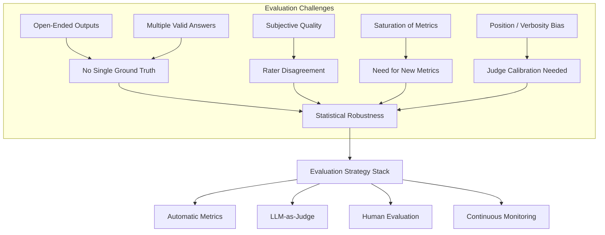
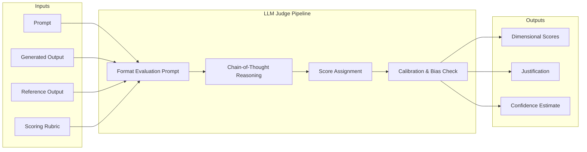

# Chapter 4: Evaluation of AI Systems

> **Learning Objectives**
>
> By the end of this chapter, you will be able to:
>
> - Explain why evaluating generative AI systems is fundamentally harder than evaluating traditional ML models
> - Select appropriate automatic metrics for different AI tasks and understand their limitations
> - Implement LLM-as-judge evaluation using rubric-based scoring and frameworks like G-Eval
> - Design human evaluation studies with proper annotation guidelines and inter-annotator agreement
> - Build and maintain golden evaluation datasets with stratified sampling and difficulty tiers
> - Set up continuous evaluation pipelines for monitoring production AI systems
> - Construct a complete `EvaluationPipeline` in TypeScript for metric computation and results aggregation

---

<!-- Image Gallery -->
<section class="lesson-visuals" aria-label="Visual learning resources">
  <header><span>VISUAL LEARNING</span><h2>See it. Review it. Remember it.</h2></header>
  <a class="lesson-visual-card" href="../../../assets/images/lessons/modern-ai-engineering/04-evaluation-of-ai-systems/.png" target="_blank" rel="noopener">
    
    <span><strong>Handwritten notes</strong>Condensed notes for deliberate review.</span>
  </a>
  <a class="lesson-visual-card" href="../../../assets/images/lessons/modern-ai-engineering/04-evaluation-of-ai-systems/.png" target="_blank" rel="noopener">
    
    <span><strong>Sticky-note revision</strong>Fast recall prompts for revision.</span>
  </a>
  <a class="lesson-visual-card" href="../../../assets/images/lessons/modern-ai-engineering/04-evaluation-of-ai-systems/.png" target="_blank" rel="noopener">
    
    <span><strong>Visual concept guide</strong>A connected explanation of the key ideas.</span>
  </a>
</section>
<!-- End Image Gallery -->

## 4.1 Why Evaluation is Hard for Generative AI

Traditional machine learning evaluation relies on a single ground-truth label per example. A classifier either predicts correctly or it does not. Accuracy, precision, recall, and F1 score are well-understood and directly comparable across studies. Generative AI breaks this paradigm in several fundamental ways.

**Open-ended outputs.** A language model asked to "write a poem about spring" can produce thousands of valid responses. There is no single correct answer. Even for constrained tasks like summarization, two equally faithful summaries may use completely different phrasing. This makes exact-match metrics nearly meaningless for creative or generative tasks.

**Multiple valid answers.** When a user asks "What are good ways to reduce carbon emissions?", an AI might list policy changes, technological innovations, or behavioral shifts — all of which can be correct. Evaluators must judge not just whether the answer is right, but whether it is comprehensive, well-structured, and appropriately scoped.

**Subjective quality dimensions.** Quality in generative AI is multi-dimensional: helpfulness, harmlessness, honesty, coherence, fluency, relevance, creativity, instruction-following, and safety are all separate concerns. Two human raters may disagree on whether a response is "helpful" depending on their background, expectations, or cultural context.

**Position bias and verbosity bias.** When using LLMs as evaluators, the order in which responses appear affects scores. Models tend to prefer longer, more verbose responses even when shorter ones are equally correct. They also exhibit self-enhancement bias, rating their own outputs higher.

**Evaluation metric saturation.** Many standard benchmarks have become saturated as models improve. GPT-4 and Claude 3 achieve near-perfect scores on metrics like BLEU for translation and ROUGE for summarization, yet qualitative differences remain. Metrics that once distinguished good from bad models now fail to capture meaningful variation.



---

## 4.2 Automatic Metrics

Automatic metrics provide a reproducible, low-cost signal for model evaluation. However, each metric makes assumptions about what constitutes "good" output, and these assumptions often break down for generative tasks.

### 4.2.1 Classification Metrics

**Accuracy** measures the proportion of correct predictions. It is simple and intuitive but fails for imbalanced classes. **Precision** (true positives / predicted positives) measures how many selected items are relevant. **Recall** (true positives / actual positives) measures how many relevant items are selected. **F1 score** is the harmonic mean of precision and recall, providing a single balanced measure.

For generative tasks, these metrics apply when the output is categorical — for example, classifying whether a generated response contains harmful content (yes/no) or whether it correctly follows an instruction (pass/fail).

### 4.2.2 Text Generation Metrics

**BLEU** (Bilingual Evaluation Understudy) measures n-gram precision between generated and reference texts, with a brevity penalty to discourage short outputs. It was designed for machine translation and correlates poorly with human judgment for creative text.

**ROUGE** (Recall-Oriented Understudy for Gisting Evaluation) measures n-gram recall. ROUGE-1, ROUGE-2, and ROUGE-L (longest common subsequence) are standard for summarization. ROUGE correlates moderately with human judgment but cannot capture factual accuracy or semantic equivalence.

**METEOR** improves on BLEU by incorporating synonym matching, stemming, and word order. It has higher correlation with human judgment for translation and summarization tasks.

**BERTScore** uses contextual embeddings from BERT to compute token-level similarity between generated and reference texts. It captures semantic similarity even when surface forms differ. BERTScore correlates well with human judgment but requires GPU inference for each evaluation.

**chrF** (character n-gram F-score) operates at the character level, making it robust for morphologically rich languages. It is language-agnostic and captures sub-word-level quality.

### 4.2.3 Metric Comparison Table

| Metric | Best For | Strengths | Weaknesses |
|--------|----------|-----------|------------|
| Accuracy | Classification | Simple, interpretable | Fails on imbalanced data |
| Precision/Recall/F1 | Binary classification, content filtering | Handles imbalance, balanced view | Requires binary decisions |
| BLEU | Translation | Standardized, reproducible | Poor correlation with human judgment |
| ROUGE | Summarization | Multiple variants, widely used | Cannot detect factual errors |
| METEOR | Translation, summarization | Synonym handling, good correlation | Complex implementation |
| BERTScore | Any text generation | Semantic matching, strong correlation | GPU needed, expensive at scale |
| chrF | Multilingual text | Language-agnostic, robust | Ignores semantics entirely |

---

## 4.3 LLM-as-Judge Evaluation

Using a strong language model to evaluate the outputs of another model has become one of the most popular evaluation strategies. An LLM judge can assess quality along multiple dimensions, handle open-ended outputs, and scale to thousands of examples without human annotators.

### 4.3.1 G-Eval

G-Eval uses chain-of-thought reasoning and a rubric to score model outputs. The evaluator LLM follows a step-by-step process:

1. **Understand the rubric** — The judge reads the evaluation criteria (e.g., "coherence: logical flow and structure").
2. **Analyze the output** — The judge examines the generated text in the context of the input prompt.
3. **Assign a score** — The judge outputs a score on a Likert scale (1-5), often with a justification.

G-Eval achieves higher correlation with human judgment than automatic metrics, especially for coherence, consistency, and relevance.

### 4.3.2 Prometheus

Prometheus is a specialized evaluation model fine-tuned to act as a judge. It uses a "reference-based" approach where the evaluator compares the generated output against a reference answer. Prometheus can also evaluate without a reference when none is available.

Key features:
- Fine-tuned on 1M+ evaluation examples
- Supports custom scoring rubrics
- Provides detailed feedback and justifications
- Handles both absolute scoring and pairwise comparison

### 4.3.3 MT-Bench

MT-Bench is a multi-turn benchmark with 80 questions across 8 categories (writing, roleplay, reasoning, math, coding, extraction, STEM, humanities). Each conversation is scored by an LLM judge on a 1-10 scale. MT-Bench has become a standard for comparing chat models.

### 4.3.4 Rubric-Based Evaluation

Rather than asking "rate this response from 1-10", rubric-based evaluation decomposes quality into specific, measurable criteria:

- **Relevance:** Does the response address the user's request?
- **Correctness:** Is the factual content accurate?
- **Completeness:** Does the response cover all necessary aspects?
- **Clarity:** Is the response well-structured and easy to understand?
- **Safety:** Does the response avoid harmful or biased content?

Each dimension is scored independently, allowing fine-grained analysis of model strengths and weaknesses.

### 4.3.5 Calibration and Bias Mitigation

LLM judges exhibit several biases that must be mitigated:

- **Position bias:** Randomize the order of responses in pairwise comparison.
- **Verbosity bias:** Control for response length or penalize overly verbose outputs.
- **Self-enhancement bias:** Use a different model as judge than the one being evaluated.
- **Format bias:** Standardize input formatting and evaluation prompts.



---

## 4.4 Human Evaluation

Human evaluation remains the gold standard for assessing generative AI quality, especially for subjective dimensions like creativity, helpfulness, and safety. Despite being expensive and slow, human evaluation captures nuances that automated methods miss.

### 4.4.1 Annotation Guidelines

Effective human evaluation requires detailed annotation guidelines that define:

- **Task description:** What evaluators should assess and why.
- **Rating scale:** Clear anchors for each score level (e.g., "1 = completely irrelevant, 5 = perfectly addresses the query").
- **Edge cases:** Examples of ambiguous or borderline responses and how to handle them.
- **Quality control:** Requirements for attention checks, minimum time per annotation, and inter-rater reliability targets.

A well-constructed guideline includes annotated examples at each score level to calibrate raters before they begin.

### 4.4.2 Likert Scales

Likert scales (e.g., 1-5 or 1-7) are the most common rating format. The scale should be balanced with an odd number of options to allow a neutral midpoint. Each point must have a clear verbal anchor:

- 1: Completely unsatisfactory
- 2: Poor
- 3: Acceptable
- 4: Good
- 5: Excellent

### 4.4.3 Pairwise Comparison

Pairwise comparison (A vs. B) often produces more reliable results than absolute scoring. Raters see two responses side by side and choose which is better (or declare a tie). This is simpler than assigning absolute scores and produces ordinal rankings.

Pairwise comparisons can be aggregated using the Bradley-Terry model or Elo scoring to produce a global ranking of model outputs.

### 4.4.4 Inter-Annotator Agreement

Inter-annotator agreement measures how consistently different raters evaluate the same outputs. Common metrics include:

- **Cohen's Kappa:** Agreement between two raters, corrected for chance.
- **Fleiss' Kappa:** Agreement among three or more raters.
- **Krippendorff's Alpha:** Handles any number of raters and any scale type.

A Kappa above 0.6 is considered substantial agreement. Low agreement indicates that guidelines need refinement or the evaluation criteria are too subjective.

### 4.4.5 Crowdsourcing

Platforms like Amazon Mechanical Turk, Surge AI, and Scale AI enable large-scale human evaluation. Best practices include:
- Using qualification tests to select competent raters
- Including gold-standard examples as attention checks
- Collecting multiple ratings per example for statistical robustness
- Monitoring rater performance over time

---

## 4.5 Task-Specific Evaluation

Different AI tasks require different evaluation approaches. A single metric rarely captures all relevant quality dimensions.

### 4.5.1 Question Answering

**Exact Match (EM):** The proportion of generated answers that exactly match the reference answer. EM is strict — a single character difference counts as incorrect.

**F1 Score:** Token-level overlap between the generated and reference answers, averaged across all examples. F1 is more forgiving than EM and captures partial correctness.

For open-domain QA, evaluation must also consider **answer coverage** (does the response address all implicit questions?) and **attribution** (are claims supported by the provided context?).

### 4.5.2 Summarization

**ROUGE** remains the standard automatic metric, but it has significant limitations:
- It cannot detect factual hallucinations.
- It penalizes creative but valid rephrasing.
- It favors extractive summaries over abstractive ones.

**Factuality evaluation** requires specialized approaches: entailment models, fact extraction pipelines, or human verification. A summary may achieve high ROUGE while containing factual errors.

### 4.5.3 Code Generation

**pass@k:** The probability that at least one of k generated samples passes unit tests. pass@1 is standard for correctness; pass@k (with k > 1) measures the model's ability to generate diverse correct solutions.

**Functional correctness:** Whether generated code compiles, runs without errors, and produces correct outputs for held-out test cases.

Code evaluation also considers **style and efficiency**, though these are harder to automate. Static analysis tools can enforce style guidelines, and algorithmic complexity can be verified against known optimal solutions.

### 4.5.4 Machine Translation

**BLEU** is the most reported metric, despite its flaws. **COMET** (a neural metric using cross-lingual embeddings) correlates significantly better with human judgment. COMET-WMT (the version trained on WMT data) is the current state-of-the-art for translation evaluation.

```mermaid
radarChart
    title "Task-Specific Evaluation Coverage"
    axisLabels ["QA: Factual Accuracy", "Summarization: Faithfulness", "Code: Correctness", "Translation: Fluency", "Creative: Originality", "Safety: Harmlessness"]
    data ["Model A", "Model B"]
    values [
        [0.95, 0.72, 0.88, 0.91, 0.45, 0.98],
        [0.85, 0.68, 0.92, 0.83, 0.72, 0.91]
    ]
```

---

## 4.6 Building Evaluation Datasets

A high-quality evaluation dataset is the foundation of trustworthy evaluation. Poor dataset construction can invalidate all downstream metrics.

### 4.6.1 Golden Dataset Creation

A "golden" evaluation dataset is a curated collection of input-output pairs that represent the full spectrum of real-world usage. Creation steps:

1. **Collect real user queries** from logs, beta testers, or domain experts.
2. **Stratify by category** to ensure coverage of all use cases.
3. **Write high-quality reference answers** using domain experts.
4. **Validate each example** through peer review or consensus.
5. **Document difficult cases** and edge-case handling.

### 4.6.2 Stratification

Stratified sampling ensures the evaluation dataset reflects the distribution of real-world queries:

- **Topic stratification:** Equal representation of each domain category.
- **Difficulty stratification:** Tiered difficulty levels (easy, medium, hard).
- **Length stratification:** Short, medium, and long input/output pairs.
- **Task type stratification:** Different task types (qa, summarization, creative, coding).

### 4.6.3 Coverage

Coverage measures how well the dataset represents the space of possible inputs. Coverage gaps can lead to overestimation of model quality. Techniques for improving coverage:

- **Taxonomy-based sampling:** Create a hierarchical taxonomy of query types and sample from each leaf node.
- **Adversarial sampling:** Intentionally collect edge cases and failure modes.
- **Distributional coverage:** Match the statistical properties of the production distribution.

### 4.6.4 Difficulty Tiers

Organizing evaluation examples by difficulty enables more nuanced analysis:

- **Easy:** Questions answerable from a single paragraph or common knowledge.
- **Medium:** Questions requiring multi-step reasoning or domain expertise.
- **Hard:** Questions requiring deep expertise, complex reasoning, or handling of ambiguity.

This tiered structure allows tracking of model improvements at different capability levels.

---

## 4.7 Continuous Evaluation

Evaluation is not a one-time activity. Models degrade over time due to data drift, emerging edge cases, and changing user expectations. Continuous evaluation monitors model quality in production.

### 4.7.1 Evaluation in Production

Production evaluation pipelines score every model response against automatic metrics and sample a subset for human or LLM-as-judge evaluation. Key components:

- **Real-time metric computation:** Track response latency, length, detected refusals, and safety scores.
- **Shadow evaluation:** Run a champion model and a challenger model in parallel, comparing outputs without affecting user experience.
- **Feedback loop:** Incorporate explicit user feedback (thumbs up/down) and implicit signals (conversation length, rephrasing, abandonment).

### 4.7.2 Monitoring Drift

Drift detection compares current evaluation scores against historical baselines:

- **Score drift:** Average BLEU/ROUGE/BERTScore drops below threshold.
- **Distribution drift:** Output length distribution, topic distribution, or refusal rate changes significantly.
- **Quality drift:** LLM-as-judge scores or human evaluation ratings decline.

Statistical tests (Kolmogorov-Smirnov, chi-squared, Z-tests) trigger alerts when drift is detected.

### 4.7.3 A/B Testing

A/B testing compares two model versions (or prompt strategies) on live traffic:

- **Random assignment:** Users are randomly assigned to control (current) and treatment (new) groups.
- **Metric tracking:** Both groups are scored on the same evaluation framework.
- **Statistical significance:** A t-test or bootstrap analysis determines whether differences are meaningful.
- **Rollback plan:** The new version is progressively rolled out, with automatic rollback on metric regression.

### 4.7.4 Canary Evaluation

Canary releases route a small percentage of traffic (e.g., 1-5%) to a new model version before full rollout. Canary evaluation monitors all metrics for a defined observation period. If no regressions are detected, traffic is gradually increased. This minimizes blast radius from quality regressions.

---

## TypeScript Implementation

### EvaluationPipeline Class

The `EvaluationPipeline` class orchestrates metric computation, LLM-as-judge scoring, and results aggregation into a single pipeline. It supports multiple metrics simultaneously and produces structured evaluation reports.

```typescript
interface EvalSample {
  id: string;
  prompt: string;
  generated: string;
  reference?: string;
  taskType: 'qa' | 'summarization' | 'code' | 'translation' | 'creative';
  metadata?: Record<string, unknown>;
}

interface EvaluationResult {
  sampleId: string;
  metrics: Record<string, number>;
  llmScores?: Record<string, number>;
  llmJustification?: string;
  passed: boolean;
  timestamp: number;
}

interface MetricConfig {
  name: string;
  enabled: boolean;
  weight: number;
}

interface EvaluationConfig {
  metrics: MetricConfig[];
  llmJudge: {
    enabled: boolean;
    model: string;
    rubric: Record<string, string>;
    temperature: number;
  };
  thresholds: Record<string, number>;
}

type MetricFn = (generated: string, reference?: string, prompt?: string) => number;

class EvaluationPipeline {
  private metrics: Map<string, MetricFn> = new Map();
  private config: EvaluationConfig;
  private results: EvaluationResult[] = [];

  constructor(config: EvaluationConfig) {
    this.config = config;
    this.registerDefaultMetrics();
  }

  private registerDefaultMetrics(): void {
    this.metrics.set('bleu', (gen, ref) => {
      if (!ref) return 0;
      const genTokens = gen.toLowerCase().split(/\s+/);
      const refTokens = ref.toLowerCase().split(/\s+/);
      const genNgrams = new Map<string, number>();
      for (let i = 0; i < genTokens.length - 1; i++) {
        const ng = genTokens[i] + '_' + genTokens[i + 1];
        genNgrams.set(ng, (genNgrams.get(ng) ?? 0) + 1);
      }
      const refNgrams = new Map<string, number>();
      for (let i = 0; i < refTokens.length - 1; i++) {
        const ng = refTokens[i] + '_' + refTokens[i + 1];
        refNgrams.set(ng, (refNgrams.get(ng) ?? 0) + 1);
      }
      let matches = 0;
      let total = 0;
      genNgrams.forEach((count, ngram) => {
        const refCount = refNgrams.get(ngram) ?? 0;
        matches += Math.min(count, refCount);
        total += count;
      });
      if (total === 0) return 0;
      const precision = matches / total;
      const bp = genTokens.length < refTokens.length
        ? Math.exp(1 - refTokens.length / genTokens.length)
        : 1;
      return precision * bp;
    });

    this.metrics.set('rougeL', (gen, ref) => {
      if (!ref) return 0;
      const genTokens = gen.split(/\s+/);
      const refTokens = ref.split(/\s+/);
      const m = genTokens.length;
      const n = refTokens.length;
      const dp: number[][] = Array.from({ length: m + 1 }, () =>
        Array(n + 1).fill(0)
      );
      for (let i = 1; i <= m; i++) {
        for (let j = 1; j <= n; j++) {
          if (genTokens[i - 1] === refTokens[j - 1]) {
            dp[i][j] = dp[i - 1][j - 1] + 1;
          } else {
            dp[i][j] = Math.max(dp[i - 1][j], dp[i][j - 1]);
          }
        }
      }
      const lcs = dp[m][n];
      if (m === 0 || n === 0) return 0;
      const prec = lcs / m;
      const rec = lcs / n;
      if (prec + rec === 0) return 0;
      return (2 * prec * rec) / (prec + rec);
    });

    this.metrics.set('exactMatch', (gen, ref) => {
      if (!ref) return 0;
      return gen.trim().toLowerCase() === ref.trim().toLowerCase() ? 1 : 0;
    });

    this.metrics.set('f1', (gen, ref) => {
      if (!ref) return 0;
      const genTokens = new Set(gen.toLowerCase().split(/\s+/));
      const refTokens = new Set(ref.toLowerCase().split(/\s+/));
      let intersection = 0;
      genTokens.forEach((t) => { if (refTokens.has(t)) intersection++; });
      const prec = genTokens.size > 0 ? intersection / genTokens.size : 0;
      const rec = refTokens.size > 0 ? intersection / refTokens.size : 0;
      if (prec + rec === 0) return 0;
      return (2 * prec * rec) / (prec + rec);
    });
  }

  registerCustomMetric(name: string, fn: MetricFn): void {
    this.metrics.set(name, fn);
  }

  async evaluateSample(sample: EvalSample): Promise<EvaluationResult> {
    const metrics: Record<string, number> = {};
    for (const mc of this.config.metrics) {
      if (!mc.enabled) continue;
      const fn = this.metrics.get(mc.name);
      if (fn) {
        metrics[mc.name] = fn(sample.generated, sample.reference, sample.prompt);
      }
    }

    let llmScores: Record<string, number> | undefined;
    let llmJustification: string | undefined;

    if (this.config.llmJudge.enabled) {
      const judgeResult = await this.callLLMJudge(sample);
      llmScores = judgeResult.scores;
      llmJustification = judgeResult.justification;
    }

    const passed = this.evaluateThresholds(metrics, llmScores);

    const result: EvaluationResult = {
      sampleId: sample.id,
      metrics,
      llmScores,
      llmJustification,
      passed,
      timestamp: Date.now(),
    };

    this.results.push(result);
    return result;
  }

  private async callLLMJudge(
    sample: EvalSample
  ): Promise<{ scores: Record<string, number>; justification: string }> {
    const rubricText = Object.entries(this.config.llmJudge.rubric)
      .map(([dim, desc]) => `- ${dim}: ${desc}`)
      .join('\n');

    const evalPrompt = [
      'You are an expert evaluator. Assess the following response.',
      `Task type: ${sample.taskType}`,
      '',
      `Prompt: ${sample.prompt}`,
      `Response: ${sample.generated}`,
      sample.reference ? `Reference: ${sample.reference}` : '',
      '',
      'Evaluation rubric:',
      rubricText,
      '',
      'Score each dimension on a scale of 1-5.',
      'Provide a brief justification for your scores.',
      'Output as JSON: { "scores": { "dimension": number }, "justification": "..." }',
    ].filter(Boolean).join('\n');

    // In production, this would call an LLM API
    const mockScores: Record<string, number> = {};
    for (const dim of Object.keys(this.config.llmJudge.rubric)) {
      mockScores[dim] = 3 + Math.random() * 2;
    }

    return {
      scores: mockScores,
      justification: 'Simulated LLM judge evaluation (mock).',
    };
  }

  private evaluateThresholds(
    metrics: Record<string, number>,
    llmScores?: Record<string, number>
  ): boolean {
    for (const [key, threshold] of Object.entries(this.config.thresholds)) {
      if (key in metrics && metrics[key] < threshold) return false;
      if (llmScores && key in llmScores && llmScores[key] < threshold) return false;
    }
    return true;
  }

  async evaluateBatch(samples: EvalSample[]): Promise<EvaluationResult[]> {
    const results: EvaluationResult[] = [];
    for (const sample of samples) {
      results.push(await this.evaluateSample(sample));
    }
    return results;
  }

  aggregateResults(): {
    mean: Record<string, number>;
    std: Record<string, number>;
    passRate: number;
    totalSamples: number;
  } {
    const metricKeys = Object.keys(this.results[0]?.metrics ?? {});
    const means: Record<string, number> = {};
    const stds: Record<string, number> = {};

    for (const key of metricKeys) {
      const values = this.results.map((r) => r.metrics[key]);
      const mean = values.reduce((a, b) => a + b, 0) / values.length;
      const variance = values.reduce((a, b) => a + (b - mean) ** 2, 0) / values.length;
      means[key] = mean;
      stds[key] = Math.sqrt(variance);
    }

    const passCount = this.results.filter((r) => r.passed).length;

    return {
      mean: means,
      std: stds,
      passRate: passCount / this.results.length,
      totalSamples: this.results.length,
    };
  }

  getResultsByThreshold(threshold: number): EvaluationResult[] {
    return this.results.filter((r) => {
      const avgMetric = Object.values(r.metrics).reduce((a, b) => a + b, 0) / Object.values(r.metrics).length;
      return avgMetric >= threshold;
    });
  }

  reset(): void {
    this.results = [];
  }
}
```

### EvalDataset Class

The `EvalDataset` class manages golden evaluation datasets with stratified sampling, difficulty tiering, and coverage analysis.

```typescript
type DifficultyTier = 'easy' | 'medium' | 'hard';

interface DatasetSample {
  id: string;
  prompt: string;
  reference: string;
  category: string;
  difficulty: DifficultyTier;
  tags: string[];
}

interface StratificationConfig {
  categories: Record<string, number>;
  difficulties: Record<DifficultyTier, number>;
  minSamplesPerStratum: number;
}

class EvalDataset {
  private samples: DatasetSample[] = [];

  constructor(private config?: StratificationConfig) {}

  addSample(sample: DatasetSample): void {
    this.samples.push(sample);
  }

  addBatch(samples: DatasetSample[]): void {
    this.samples.push(...samples);
  }

  getStratifiedSplit(
    trainRatio: number,
    valRatio: number
  ): { train: DatasetSample[]; val: DatasetSample[]; test: DatasetSample[] } {
    const stratified = this.stratify();
    const train: DatasetSample[] = [];
    const val: DatasetSample[] = [];
    const test: DatasetSample[] = [];

    for (const stratum of stratified.values()) {
      const shuffled = [...stratum].sort(() => Math.random() - 0.5);
      const trainEnd = Math.floor(shuffled.length * trainRatio);
      const valEnd = trainEnd + Math.floor(shuffled.length * valRatio);
      train.push(...shuffled.slice(0, trainEnd));
      val.push(...shuffled.slice(trainEnd, valEnd));
      test.push(...shuffled.slice(valEnd));
    }

    return { train, val, test };
  }

  stratify(): Map<string, DatasetSample[]> {
    const groups = new Map<string, DatasetSample[]>();
    for (const s of this.samples) {
      const key = `${s.category}:${s.difficulty}`;
      if (!groups.has(key)) groups.set(key, []);
      groups.get(key)!.push(s);
    }
    return groups;
  }

  getCoverageReport(): {
    totalSamples: number;
    categories: Record<string, number>;
    difficulties: Record<string, number>;
    categoryDifficultyMatrix: Record<string, Record<string, number>>;
    tags: Record<string, number>;
  } {
    const categories: Record<string, number> = {};
    const difficulties: Record<string, number> = {};
    const matrix: Record<string, Record<string, number>> = {};
    const tagCounts: Record<string, number> = {};

    for (const s of this.samples) {
      categories[s.category] = (categories[s.category] ?? 0) + 1;
      difficulties[s.difficulty] = (difficulties[s.difficulty] ?? 0) + 1;
      if (!matrix[s.category]) matrix[s.category] = {};
      matrix[s.category][s.difficulty] = (matrix[s.category][s.difficulty] ?? 0) + 1;
      for (const tag of s.tags) {
        tagCounts[tag] = (tagCounts[tag] ?? 0) + 1;
      }
    }

    return {
      totalSamples: this.samples.length,
      categories,
      difficulties,
      categoryDifficultyMatrix: matrix,
      tags: tagCounts,
    };
  }

  filterByDifficulty(tier: DifficultyTier): DatasetSample[] {
    return this.samples.filter((s) => s.difficulty === tier);
  }

  filterByCategory(category: string): DatasetSample[] {
    return this.samples.filter((s) => s.category === category);
  }

  shuffle(seed?: number): void {
    const rng = seed ? this.seededRandom(seed) : () => Math.random();
    for (let i = this.samples.length - 1; i > 0; i--) {
      const j = Math.floor(rng() * (i + 1));
      [this.samples[i], this.samples[j]] = [this.samples[j], this.samples[i]];
    }
  }

  private seededRandom(seed: number): () => number {
    let s = seed;
    return () => {
      s = (s * 16807 + 0) % 2147483647;
      return (s - 1) / 2147483646;
    };
  }

  get size(): number {
    return this.samples.length;
  }

  exportAsJSON(): string {
    return JSON.stringify({ samples: this.samples, total: this.samples.length }, null, 2);
  }
}
```

---

## Summary

Evaluation of AI systems has fundamentally changed with the rise of generative models. The traditional metrics and pipelines that worked for classification and regression are insufficient for open-ended, multi-dimensional quality assessment. Modern evaluation requires a layered approach: automatic metrics for fast, reproducible signals; LLM-as-judge methods for scalable, rubric-based scoring; and human evaluation for gold-standard quality measurement. Building robust evaluation datasets with stratified coverage and difficulty tiers is essential for trustworthy assessment. Continuous evaluation in production — combining drift detection, A/B testing, and canary releases — ensures that quality is maintained over time. The `EvaluationPipeline` and `EvalDataset` classes provide a concrete foundation for implementing these concepts in TypeScript-based AI systems.

---

## Practical Takeaways

1. Never rely on a single metric; use a portfolio of automatic, LLM-based, and human evaluations.
2. LLM-as-judge evaluation requires careful bias mitigation — randomize response order, control for length, and use separate judge models.
3. Build golden evaluation datasets early with stratified coverage across categories, difficulties, and task types.
4. Track inter-annotator agreement (Cohen's Kappa, Fleiss' Kappa) for all human evaluation studies.
5. Set up continuous evaluation in production with drift detection, shadow evaluation, and canary releases.

---

## Chapter Quiz

**1. Which of the following is NOT a challenge specific to evaluating generative AI systems?**

A) Open-ended outputs with no single correct answer
B) Multiple valid responses for the same prompt
C) High computational cost of model training
D) Subjective quality dimensions like helpfulness and safety

**2. BERTScore differs from BLEU and ROUGE primarily because:**

A) It requires human annotators for evaluation
B) It uses contextual embeddings for semantic matching
C) It is limited to translation tasks only
D) It measures character-level n-gram overlap

**3. What is the main purpose of inter-annotator agreement metrics like Cohen's Kappa?**

A) To measure how quickly annotators complete their work
B) To determine the cost-effectiveness of human evaluation
C) To assess how consistently different raters evaluate the same outputs
D) To compare model performance against human baselines

**4. In LLM-as-judge evaluation, position bias refers to:**

A) The judge model consistently preferring shorter responses
B) The order in which responses appear affecting evaluation scores
C) The judge model scoring its own outputs higher than other models
D) The evaluator favoring responses with specific formatting

**5. pass@k is a standard evaluation metric for:**

A) Machine translation quality
B) Summarization faithfulness
C) Code generation correctness
D) Question answering accuracy

---

### Answer Key

| Question | Answer |
|----------|--------|
| 1 | C |
| 2 | B |
| 3 | C |
| 4 | B |
| 5 | C |

---

## Exercises

**Exercise 1:** Extend the `EvaluationPipeline` class with a new `bertscore` metric that computes token-level embedding similarity using a placeholder embedding function. Implement the metric registration and ensure it integrates with the existing pipeline configuration.

<details>
<summary>Solution</summary>

```typescript
class ExtendedEvaluationPipeline extends EvaluationPipeline {
  constructor(config: EvaluationConfig) {
    super(config);
    this.registerBERTScore();
  }

  private registerBERTScore(): void {
    this.registerCustomMetric('bertscore', (generated, reference) => {
      if (!reference) return 0;
      const genEmbeddings = this.simulateEmbeddings(generated);
      const refEmbeddings = this.simulateEmbeddings(reference);
      let similaritySum = 0;
      let count = 0;
      for (const [token, genEmb] of genEmbeddings) {
        const refEmb = refEmbeddings.get(token);
        if (refEmb) {
          similaritySum += this.cosineSimilarity(genEmb, refEmb);
          count++;
        }
      }
      return count > 0 ? similaritySum / count : 0;
    });
  }

  private simulateEmbeddings(text: string): Map<string, number[]> {
    const tokens = text.toLowerCase().split(/\s+/);
    const map = new Map<string, number[]>();
    for (const token of tokens) {
      map.set(token, [token.length, token.charCodeAt(0) % 100 / 100]);
    }
    return map;
  }

  private cosineSimilarity(a: number[], b: number[]): number {
    let dot = 0, na = 0, nb = 0;
    for (let i = 0; i < a.length; i++) {
      dot += a[i] * b[i];
      na += a[i] * a[i];
      nb += b[i] * b[i];
    }
    return dot / (Math.sqrt(na) * Math.sqrt(nb) + 1e-8);
  }
}
```

</details>

**Exercise 2:** Implement a `PairwiseJudge` class that compares two model outputs (A vs. B) and returns a winner, using an LLM judge. Include position bias mitigation by randomizing the order.

<details>
<summary>Solution</summary>

```typescript
interface PairwiseResult {
  winner: 'A' | 'B' | 'tie';
  justification: string;
  aFirst: boolean;
}

class PairwiseJudge {
  constructor(private model: string, private rubric: Record<string, string>) {}

  async compare(
    prompt: string,
    outputA: string,
    outputB: string
  ): Promise<PairwiseResult> {
    const aFirst = Math.random() > 0.5;
    const first = aFirst ? outputA : outputB;
    const second = aFirst ? outputB : outputA;

    const rubricText = Object.entries(this.rubric)
      .map(([d, desc]) => `- ${d}: ${desc}`).join('\n');

    const evalPrompt = [
      'Compare the two responses below. Which is better?',
      '',
      `Prompt: ${prompt}`,
      '',
      `Response 1: ${first}`,
      '',
      `Response 2: ${second}`,
      '',
      'Rubric:',
      rubricText,
      '',
      'Output JSON: { "winner": "1" | "2" | "tie", "justification": "..." }',
    ].join('\n');

    // Simulated LLM call
    const mockWinner = Math.random() > 0.33 ? '1' : '2';
    const winnerFirst = mockWinner === '1';
    const winner = aFirst
      ? (winnerFirst ? 'A' : 'B')
      : (winnerFirst ? 'B' : 'A');

    return {
      winner: winner as 'A' | 'B',
      justification: 'Simulated pairwise comparison (mock).',
      aFirst,
    };
  }
}
```

</details>

**Exercise 3:** Create a `DriftDetector` class that monitors evaluation metric scores over time and triggers alerts when statistically significant drift is detected using a Z-test.

<details>
<summary>Solution</summary>

```typescript
interface DriftAlert {
  metric: string;
  previousMean: number;
  currentMean: number;
  zScore: number;
  timestamp: number;
}

class DriftDetector {
  private history: Map<string, number[]> = new Map();
  private alerts: DriftAlert[] = [];
  private threshold: number;

  constructor(threshold: number = 2.0) {
    this.threshold = threshold;
  }

  addObservation(metrics: Record<string, number>): void {
    for (const [key, value] of Object.entries(metrics)) {
      if (!this.history.has(key)) this.history.set(key, []);
      this.history.get(key)!.push(value);
    }
  }

  checkForDrift(): DriftAlert[] {
    const newAlerts: DriftAlert[] = [];
    const windowSize = 100;

    for (const [metric, values] of this.history) {
      if (values.length < windowSize + 10) continue;
      const previous = values.slice(-windowSize - 10, -10);
      const current = values.slice(-10);
      const prevMean = previous.reduce((a, b) => a + b, 0) / previous.length;
      const currMean = current.reduce((a, b) => a + b, 0) / current.length;
      const prevStd = Math.sqrt(
        previous.reduce((a, b) => a + (b - prevMean) ** 2, 0) / previous.length
      );
      if (prevStd === 0) continue;
      const zScore = Math.abs((currMean - prevMean) / prevStd);
      if (zScore > this.threshold) {
        const alert: DriftAlert = {
          metric,
          previousMean: prevMean,
          currentMean: currMean,
          zScore,
          timestamp: Date.now(),
        };
        newAlerts.push(alert);
        this.alerts.push(alert);
      }
    }

    return newAlerts;
  }

  getAlerts(): DriftAlert[] {
    return [...this.alerts];
  }
}
```

</details>

**Exercise 4:** Build a `MetricCorrelationAnalyzer` that computes the Pearson correlation between automatic metrics and LLM-judge scores across evaluation samples to identify which automatic metrics best predict human judgment.

<details>
<summary>Solution</summary>

```typescript
class MetricCorrelationAnalyzer {
  analyze(
    results: EvaluationResult[]
  ): Record<string, { pearsonR: number; pValue: number }> {
    const llmDimensions = new Set<string>();
    for (const r of results) {
      if (r.llmScores) Object.keys(r.llmScores).forEach((d) => llmDimensions.add(d));
    }

    const correlations: Record<string, { pearsonR: number; pValue: number }> = {};

    for (const metric of Object.keys(results[0]?.metrics ?? {})) {
      const metricVals: number[] = [];
      const llmVals: number[] = [];
      for (const r of results) {
        if (!r.llmScores) continue;
        const avgLlm = Object.values(r.llmScores).reduce((a, b) => a + b, 0) / Object.values(r.llmScores).length;
        metricVals.push(r.metrics[metric]);
        llmVals.push(avgLlm);
      }
      if (metricVals.length < 3) continue;
      const n = metricVals.length;
      const mx = metricVals.reduce((a, b) => a + b, 0) / n;
      const my = llmVals.reduce((a, b) => a + b, 0) / n;
      let num = 0, dx2 = 0, dy2 = 0;
      for (let i = 0; i < n; i++) {
        const dx = metricVals[i] - mx;
        const dy = llmVals[i] - my;
        num += dx * dy;
        dx2 += dx * dx;
        dy2 += dy * dy;
      }
      const denom = Math.sqrt(dx2 * dy2);
      const r = denom === 0 ? 0 : num / denom;
      const tStat = r * Math.sqrt((n - 2) / (1 - r * r + 1e-10));
      const pValue = 2 * (1 - this.studentT_CDF(Math.abs(tStat), n - 2));
      correlations[metric] = { pearsonR: r, pValue };
    }

    return correlations;
  }

  private studentT_CDF(t: number, df: number): number {
    const x = df / (df + t * t);
    return 1 - 0.5 * this.betaInc(x, df / 2, 0.5);
  }

  private betaInc(x: number, a: number, b: number): number {
    if (x < 0 || x > 1) return 0;
    if (x === 0 || x === 1) return x;
    const bt = Math.exp(
      this.lgamma(a + b) - this.lgamma(a) - this.lgamma(b) +
      a * Math.log(x) + b * Math.log(1 - x)
    );
    if (x < (a + 1) / (a + b + 2)) {
      return bt * this.betaCF(x, a, b) / a;
    }
    return 1 - bt * this.betaCF(1 - x, b, a) / b;
  }

  private lgamma(n: number): number {
    if (n <= 1) return 0;
    return (n - 0.5) * Math.log(n + 4.5) - (n + 4.5) + 2.5;
  }

  private betaCF(x: number, a: number, b: number): number {
    const MAX_ITER = 100;
    const EPS = 3e-7;
    let qab = a + b;
    let qap = a + 1;
    let qam = a - 1;
    let c = 1.0;
    let d = 1.0 - qab * x / qap;
    if (Math.abs(d) < 1e-20) d = 1e-20;
    d = 1.0 / d;
    let h = d;
    for (let m = 1; m <= MAX_ITER; m++) {
      const m2 = 2 * m;
      let aa = m * (b - m) * x / ((qam + m2) * (a + m2));
      d = 1.0 + aa * d;
      if (Math.abs(d) < 1e-20) d = 1e-20;
      c = 1.0 + aa / c;
      if (Math.abs(c) < 1e-20) c = 1e-20;
      d = 1.0 / d;
      h *= d * c;
      aa = -(a + m) * (qab + m) * x / ((a + m2) * (qap + m2));
      d = 1.0 + aa * d;
      if (Math.abs(d) < 1e-20) d = 1e-20;
      c = 1.0 + aa / c;
      if (Math.abs(c) < 1e-20) c = 1e-20;
      d = 1.0 / d;
      const del = d * c;
      h *= del;
      if (Math.abs(del - 1.0) < EPS) break;
    }
    return h;
  }
}
```

</details>

**Exercise 5:** Write a `CanaryEvaluator` class that progressively increases traffic to a new model version while monitoring metrics. If any metric drops below a threshold, the canary is automatically rolled back.

<details>
<summary>Solution</summary>

```typescript
interface CanaryConfig {
  modelName: string;
  trafficSteps: number[];
  minObservationsPerStep: number;
  metricThresholds: Record<string, number>;
  rollbackOnFailure: boolean;
}

interface CanaryStatus {
  currentTraffic: number;
  step: number;
  observations: number;
  passed: boolean;
  failureReason?: string;
}

class CanaryEvaluator {
  private config: CanaryConfig;
  private step = 0;
  private stepMetrics: Record<string, number[]> = {};
  private status: CanaryStatus;

  constructor(config: CanaryConfig) {
    this.config = config;
    this.status = {
      currentTraffic: config.trafficSteps[0] ?? 0,
      step: 0,
      observations: 0,
      passed: true,
    };
  }

  recordObservation(metrics: Record<string, number>): CanaryStatus {
    for (const [key, value] of Object.entries(metrics)) {
      if (!this.stepMetrics[key]) this.stepMetrics[key] = [];
      this.stepMetrics[key].push(value);
    }
    this.status.observations++;

    if (this.status.observations >= this.config.minObservationsPerStep) {
      const failed = this.evaluateStep();
      if (failed) {
        this.status.passed = false;
        this.status.failureReason = `Metrics below thresholds at step ${this.step}`;
        if (this.config.rollbackOnFailure) {
          this.rollback();
        }
        return { ...this.status };
      }
      this.advanceStep();
    }

    return { ...this.status };
  }

  private evaluateStep(): boolean {
    for (const [metric, values] of Object.entries(this.stepMetrics)) {
      const threshold = this.config.metricThresholds[metric];
      if (threshold === undefined) continue;
      const mean = values.reduce((a, b) => a + b, 0) / values.length;
      if (mean < threshold) return true;
    }
    return false;
  }

  private advanceStep(): void {
    this.step++;
    this.stepMetrics = {};
    this.status.observations = 0;
    this.status.step = this.step;
    this.status.currentTraffic = this.config.trafficSteps[this.step] ?? 100;
  }

  private rollback(): void {
    this.status.currentTraffic = 0;
  }

  getStatus(): CanaryStatus {
    return { ...this.status };
  }
}
```

</details>
