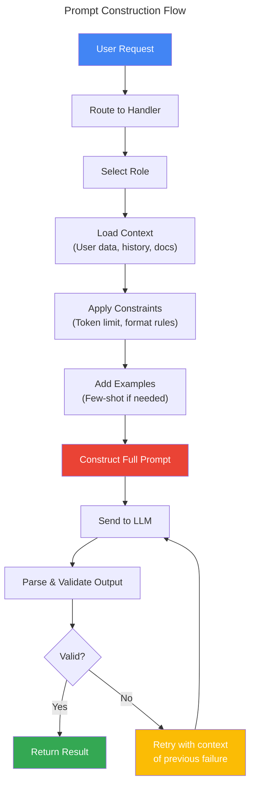
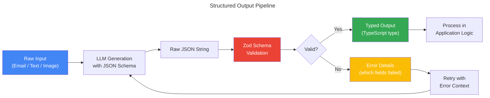
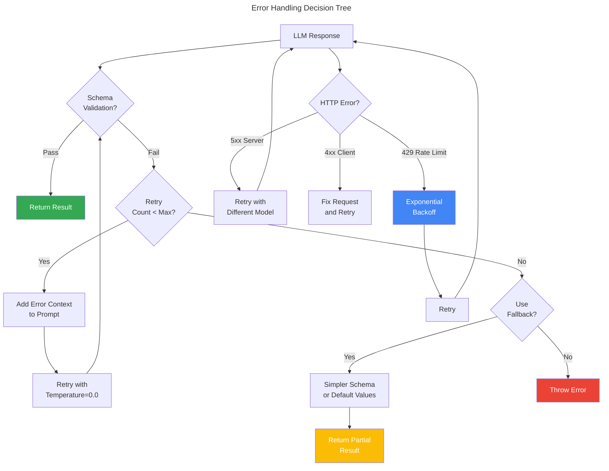

# Chapter 4: Prompt Engineering & Structured Output

> **Learning Objectives**
>
> - Master prompt engineering fundamentals: role, context, constraints
> - Implement few-shot prompting and chain-of-thought reasoning
> - Generate structured output with JSON mode and schema validation
> - Use Genkit's Zod-based structured output for type-safe AI responses
> - Implement error handling: retries, validation, and fallbacks
> - Build streaming responses for real-time user experiences

---

## 4.1 Prompt Engineering Fundamentals

### 4.1.1 What Makes a Good Prompt?

A well-crafted prompt is the difference between a useless AI response and a production-ready one. The anatomy of a great prompt follows a consistent structure:

```
┌─────────────────────────────────────────────────────────────┐
│                   PROMPT STRUCTURE                          │
│                                                             │
│  [ROLE]        Who the AI is pretending to be               │
│  "You are a senior software engineer..."                     │
│                                                             │
│  [CONTEXT]     Background information for the task          │
│  "We are building a payment system..."                       │
│                                                             │
│  [TASK]        What you want the AI to do                   │
│  "Review this code for security vulnerabilities..."         │
│                                                             │
│  [CONSTRAINTS] Rules the AI must follow                     │
│  "Only list critical issues. Be concise."                   │
│                                                             │
│  [FORMAT]      How the output should be structured          │
│  "Respond in JSON format with fields: issues[], summary"    │
│                                                             │
│  [EXAMPLES]    (Optional) Few-shot examples                  │
│  "Example 1: ..."                                            │
└─────────────────────────────────────────────────────────────┘
```

### 4.1.2 Prompt Construction Flow



### 4.1.3 Basic Prompt Patterns

```typescript
// ── Pattern 1: Simple Instruction ───────────────────

const simplePrompt = async () => {
  const ai = genkit({ model: gemini15Pro });

  const response = await ai.generate({
    prompt: 'List three benefits of TypeScript over JavaScript.',
  });
  console.log(response.text);
  // 1. Static type checking catches errors at compile time
  // 2. Better IDE support with autocomplete and refactoring
  // 3. Improved code documentation through type annotations
};

// ── Pattern 2: Role + Task ──────────────────────────

const rolePrompt = async () => {
  const ai = genkit({ model: gemini15Pro });

  const response = await ai.generate({
    system: 'You are a senior database architect with 15 years of experience.',
    prompt: 'Design a database schema for a multi-tenant SaaS application.',
  });
};

// ── Pattern 3: Role + Context + Task + Constraints ──

const fullPrompt = async () => {
  const ai = genkit({ model: gemini15Pro });

  const response = await ai.generate({
    system: `
      You are a technical documentation writer for a developer tools company.
      Your writing is clear, concise, and beginner-friendly.
    `,
    prompt: `
      CONTEXT:
      We are launching a new REST API for order management.
      The API has endpoints for creating, retrieving, updating, and canceling orders.
      
      TASK:
      Write the "Getting Started" section of our API documentation.
      
      CONSTRAINTS:
      - Maximum 500 words
      - Include a curl example
      - Must mention authentication requirements
      - Target audience: developers with basic REST knowledge
      - Do not use jargon without explanation
    `,
  });
};
```

---

## 4.2 System Prompts: Role, Context, and Constraints

### 4.2.1 The System Prompt Architecture

The system prompt is the most critical part of any LLM interaction. It establishes the AI's persona, defines behavioral boundaries, and sets quality expectations.

```typescript
// ── System Prompt Builder ───────────────────────────

interface SystemPromptConfig {
  role: string;
  expertise: string;
  tone: string;
  rules: string[];
  outputPreferences: string[];
  constrainingFactors: string[];
}

class SystemPromptBuilder {
  private config: SystemPromptConfig;

  constructor(config: Partial<SystemPromptConfig> = {}) {
    this.config = {
      role: config.role || 'helpful assistant',
      expertise: config.expertise || 'general knowledge',
      tone: config.tone || 'professional and clear',
      rules: config.rules || [],
      outputPreferences: config.outputPreferences || [],
      constrainingFactors: config.constrainingFactors || [],
    };
  }

  setRole(role: string): this {
    this.config.role = role;
    return this;
  }

  setExpertise(expertise: string): this {
    this.config.expertise = expertise;
    return this;
  }

  setTone(tone: string): this {
    this.config.tone = tone;
    return this;
  }

  addRule(rule: string): this {
    this.config.rules.push(rule);
    return this;
  }

  addOutputPreference(pref: string): this {
    this.config.outputPreferences.push(pref);
    return this;
  }

  addConstraint(constraint: string): this {
    this.config.constrainingFactors.push(constraint);
    return this;
  }

  build(): string {
    const parts: string[] = [
      `You are ${this.config.role} with expertise in ${this.config.expertise}.`,
      ``,
      `Tone: ${this.config.tone}.`,
    ];

    if (this.config.rules.length > 0) {
      parts.push(``, `Rules:`);
      this.config.rules.forEach((rule, i) => {
        parts.push(`${i + 1}. ${rule}`);
      });
    }

    if (this.config.outputPreferences.length > 0) {
      parts.push(``, `Output preferences:`);
      this.config.outputPreferences.forEach((pref, i) => {
        parts.push(`${i + 1}. ${pref}`);
      });
    }

    if (this.config.constrainingFactors.length > 0) {
      parts.push(``, `Constraints:`);
      this.config.constrainingFactors.forEach((c, i) => {
        parts.push(`${i + 1}. ${c}`);
      });
    }

    return parts.join('\n');
  }
}

// ── Usage ───────────────────────────────────────────

const codeReviewerPrompt = new SystemPromptBuilder()
  .setRole('a senior software engineer')
  .setExpertise('full-stack web development, security, and performance optimization')
  .setTone('direct, constructive, and educational')
  .addRule('Focus on security vulnerabilities first, then performance, then code quality')
  .addRule('Always explain WHY something is a problem, not just WHAT')
  .addRule('Provide specific, actionable code fixes')
  .addRule("If the code is good, say so — don't invent problems")
  .addOutputPreference('Use bullet points for issues')
  .addOutputPreference('Start with overall assessment (pass/fail/needs-work)')
  .addConstraint('Maximum 1000 words')
  .addConstraint('Only review the code provided — do not add unrelated suggestions')
  .build();

console.log(codeReviewerPrompt);
// You are a senior software engineer with expertise in full-stack web development...
// ...
```

### 4.2.2 Domain-Specific System Prompts

```typescript
// ── Medical Disclaimer Prompt ───────────────────────

const MEDICAL_SYSTEM_PROMPT = `You are a medical information assistant.

CRITICAL RULES:
1. You do NOT diagnose conditions or prescribe treatments
2. You only provide general health information that is widely accepted
3. Every response must include: "This is not medical advice. Consult a healthcare provider."
4. For any specific symptoms, advise seeing a doctor
5. Never recommend specific medications or dosages
6. If someone asks about an emergency, tell them to call 911 immediately

Tone: compassionate, careful, precise`;

// ── Financial Advisor Prompt ────────────────────────

const FINANCIAL_SYSTEM_PROMPT = `You are a financial information assistant.

CRITICAL RULES:
1. You do NOT give specific investment advice
2. You explain financial concepts and provide educational information
3. Every response about investments must include: "Past performance does not guarantee future results."
4. For specific portfolio questions: "Consult a licensed financial advisor."
5. Never promise specific returns on investments
6. Explain risk factors for any financial product discussed

Tone: informative, unbiased, cautious`;

// ── Customer Support Prompt ─────────────────────────

function createSupportSystemPrompt(companyName: string, policies: string[]): string {
  const policiesSection = policies
    .map((p, i) => `${i + 1}. ${p}`)
    .join('\n');

  return `
You are a customer support agent for ${companyName}.

PERSONALITY:
- Warm and empathetic
- Professional but friendly
- Patient with frustrated customers

RULES:
1. Always greet the customer by name if available
2. Acknowledge their issue before offering solutions
3. Never blame the customer for problems
4. If you cannot resolve the issue, escalate to a human agent
5. Never make promises about refunds or timelines without verification

COMPANY POLICIES:
${policiesSection}

OUTPUT FORMAT:
- Brief empathetic acknowledgment
- Clear explanation of the solution
- Next steps or expectations
- Offer of further assistance
`;
}
```

---

## 4.3 Few-Shot Prompting

### 4.3.1 What is Few-Shot Prompting?

Few-shot prompting provides the LLM with examples of the desired input-output pattern. This dramatically improves performance on tasks where the model needs to understand a specific format, style, or reasoning pattern.

```
Zero-shot:    "Classify this email as spam or not spam."
              → May be inconsistent

Few-shot:     "Email: 'Buy cheap drugs now!' → Spam
               Email: 'Meeting at 3pm tomorrow' → Not Spam
               Email: 'You won $1,000,000!!!' → ?"
              → Consistently follows the pattern
```

### 4.3.2 Few-Shot Implementation

```typescript
// ── Few-Shot Classification ─────────────────────────

const FEW_SHOT_CLASSIFICATION = `
Classify customer support tickets by priority and category.

Examples:

Ticket: "I can't log in to my account. It says 'invalid password' but I'm sure it's correct."
Priority: HIGH
Category: TECHNICAL
Reason: Account access issue blocking usage

Ticket: "What are your business hours during holidays?"
Priority: LOW
Category: GENERAL
Reason: Simple informational request

Ticket: "I was charged twice for my subscription this month. I need a refund immediately."
Priority: URGENT
Category: BILLING
Reason: Financial impact, customer distress

Ticket: "Your mobile app crashes when I try to upload a profile picture."
Priority: MEDIUM
Category: TECHNICAL
Reason: Bug affecting feature but not blocking core usage

---

Now classify this ticket:

Ticket: "{{TICKET}}"
Priority:
Category:
Reason:
`;

const classifyWithFewShot = ai.defineFlow(
  {
    name: 'classifyTicket',
    inputSchema: z.object({ ticket: z.string() }),
    outputSchema: z.object({
      priority: z.enum(['LOW', 'MEDIUM', 'HIGH', 'URGENT']),
      category: z.enum(['TECHNICAL', 'BILLING', 'ACCOUNT', 'GENERAL']),
      reason: z.string(),
    }),
  },
  async (input) => {
    const { output } = await ai.generate({
      prompt: FEW_SHOT_CLASSIFICATION.replace('{{TICKET}}', input.ticket),
      output: { schema: z.object({
        priority: z.enum(['LOW', 'MEDIUM', 'HIGH', 'URGENT']),
        category: z.enum(['TECHNICAL', 'BILLING', 'ACCOUNT', 'GENERAL']),
        reason: z.string(),
      })},
    });
    return output!;
  }
);

// ── Dynamic Few-Shot Selection ──────────────────────

// Instead of static examples, select the most relevant ones dynamically
class DynamicFewShotSelector {
  private examplePool: Array<{ input: string; output: any; tags: string[] }>;

  constructor(examples: Array<{ input: string; output: any; tags: string[] }>) {
    this.examplePool = examples;
  }

  /**
   * Select the N most relevant examples based on tag overlap.
   */
  selectExamples(query: string, tags: string[], n: number = 3) {
    // Score examples by tag overlap with the query tags
    const scored = this.examplePool.map((example) => {
      const tagOverlap = example.tags.filter((t) => tags.includes(t)).length;
      // Also check if query text overlaps
      const queryWords = query.toLowerCase().split(' ');
      const textOverlap = queryWords.filter((w) =>
        example.input.toLowerCase().includes(w)
      ).length;

      return { ...example, score: tagOverlap * 3 + textOverlap };
    });

    scored.sort((a, b) => b.score - a.score);
    return scored.slice(0, n);
  }

  /**
   * Build a few-shot prompt string from selected examples.
   */
  buildPrompt(query: string, tags: string[], userInput: string): string {
    const examples = this.selectExamples(query, tags);

    const exampleStrings = examples.map(
      (ex, i) => `Example ${i + 1}:\nInput: ${ex.input}\nOutput: ${JSON.stringify(ex.output, null, 2)}`
    );

    return `
You are a classification system. Here are examples of how to classify inputs:

${exampleStrings.join('\n\n')}

---

Now classify this input following the same pattern:

Input: ${userInput}
Output:
`;
  }
}

// Usage
// const selector = new DynamicFewShotSelector([
//   { input: 'I forgot my password', output: { intent: 'account_recovery', urgency: 'medium' }, tags: ['account', 'login'] },
//   { input: 'Where is my order?', output: { intent: 'order_status', urgency: 'low' }, tags: ['order', 'shipping'] },
//   // ... more examples
// ]);
//
// const prompt = selector.buildPrompt(
//   'I need help with my account',
//   ['account', 'login'],
//   'I can not access my account after the update'
// );
```

---

## 4.4 Chain-of-Thought Prompting

### 4.4.1 What is Chain-of-Thought?

Chain-of-thought (CoT) prompting encourages the LLM to reason step-by-step before giving an answer. This dramatically improves performance on complex reasoning tasks — math, logic, planning, and multi-step analysis.

```
Without CoT:
Q: "If a shirt costs $20 and is on sale for 15% off, what's the final price?"
A: "$17" ← May be wrong, no way to verify reasoning

With CoT:
Q: "If a shirt costs $20 and is on sale for 15% off, what's the final price?"
A: "Let's think step by step:
   1. The shirt costs $20
   2. 15% off means we subtract 15% of $20
   3. 15% of $20 = 0.15 × $20 = $3
   4. $20 - $3 = $17
   Final answer: $17" ← Correct and verifiable
```

### 4.4.2 CoT Implementation

```typescript
// ── Chain-of-Thought Flow ───────────────────────────

const CoTResponseSchema = z.object({
  reasoning: z.string().describe('Step-by-step reasoning process'),
  answer: z.string().describe('The final answer'),
  confidence: z.number().min(0).max(1).describe('Confidence in the answer'),
});

const chainOfThoughtFlow = ai.defineFlow(
  {
    name: 'chainOfThought',
    inputSchema: z.object({
      question: z.string(),
      domain: z.enum(['math', 'logic', 'planning', 'analysis', 'code']),
    }),
    outputSchema: CoTResponseSchema,
  },
  async (input) => {
    const domainPrompts: Record<string, string> = {
      math: 'Solve this step by step. Show all calculations.',
      logic: 'Reason through this logically. Consider edge cases.',
      planning: 'Break this down into sequential steps. Consider dependencies.',
      analysis: 'Analyze this systematically. Consider pros and cons.',
      code: 'Think through the algorithm step by step before writing code.',
    };

    const { output } = await ai.generate({
      prompt: `
        ${domainPrompts[input.domain]}
        
        Question: ${input.question}
        
        First, think through this step by step in the "reasoning" field.
        Then provide the final answer in the "answer" field.
        Finally, rate your confidence (0-1).
      `,
      output: { schema: CoTResponseSchema },
      config: { temperature: 0.2 },
    });

    return output!;
  }
);

// Usage
// const result = await chainOfThoughtFlow({
//   question: 'A bat and a ball cost $1.10. The bat costs $1.00 more than the ball. How much does the ball cost?',
//   domain: 'math',
// });
// console.log(result.reasoning);
// "1. Let the ball cost x dollars.
//  2. The bat costs $1.00 more than the ball, so the bat costs x + $1.00
//  3. Together they cost $1.10: x + (x + $1.00) = $1.10
//  4. 2x + $1.00 = $1.10
//  5. 2x = $0.10
//  6. x = $0.05
//  Final answer: The ball costs $0.05."

// ── Structured CoT with Verification ─────────────────

const VerifiedCoTSchema = z.object({
  reasoning: z.string(),
  answer: z.string(),
  verification: z.string().describe('Self-check of the answer'),
  is_correct: z.boolean(),
  alternative_answer: z.string().optional(),
});

const verifiedCoTFlow = ai.defineFlow(
  {
    name: 'verifiedCoT',
    inputSchema: z.object({ question: z.string() }),
    outputSchema: VerifiedCoTSchema,
  },
  async (input) => {
    // Step 1: Generate reasoning and answer
    const { output: initial } = await ai.generate({
      prompt: `
        Question: ${input.question}
        
        Think through this step by step, then provide your answer.
      `,
      output: { schema: z.object({
        reasoning: z.string(),
        answer: z.string(),
      })},
    });

    // Step 2: Verify the answer
    const { output: verified } = await ai.generate({
      prompt: `
        Question: ${input.question}
        Proposed answer: ${initial!.answer}
        Reasoning: ${initial!.reasoning}
        
        Verify this answer. Is it correct? If not, provide the correct answer.
        Check for:
        - Mathematical accuracy
        - Logical consistency
        - Edge cases
        - Common pitfalls
      `,
      output: { schema: z.object({
        is_correct: z.boolean(),
        verification: z.string(),
        corrected_answer: z.string().optional(),
      })},
    });

    return {
      reasoning: initial!.reasoning,
      answer: verified!.is_correct ? initial!.answer : verified!.corrected_answer!,
      verification: verified!.verification,
      is_correct: verified!.is_correct,
      alternative_answer: verified!.is_correct ? undefined : verified!.corrected_answer,
    };
  }
);
```

### 4.4.3 CoT Prompt Template

```typescript
const COT_TEMPLATES = {
  /** General purpose chain-of-thought */
  general: `
    Let's approach this step by step:
    
    1. First, understand what's being asked
    2. Break down the problem into smaller parts
    3. Work through each part systematically
    4. Check your work for errors
    5. Provide the final answer
    
    Question: {{QUESTION}}
  `,

  /** Mathematical reasoning */
  mathematical: `
    Let's solve this math problem step by step:
    
    Step 1: Identify what we know and what we need to find
    Step 2: Set up the equation
    Step 3: Solve step by step
    Step 4: Verify the answer makes sense
    
    Question: {{QUESTION}}
  `,

  /** Code debugging */
  codeDebugging: `
    Let's debug this code systematically:
    
    Step 1: Understand what the code should do
    Step 2: Trace through the execution with example input
    Step 3: Identify where the behavior diverges from expectations
    Step 4: Determine the root cause
    Step 5: Propose a fix
    
    Code: {{CODE}}
    Expected behavior: {{EXPECTED}}
    Actual behavior: {{ACTUAL}}
  `,

  /** Decision making */
  decisionMaking: `
    Let's analyze this decision systematically:
    
    Step 1: Define the decision criteria
    Step 2: List all options
    Step 3: Evaluate each option against the criteria
    Step 4: Consider trade-offs and risks
    Step 5: Recommend the best option with justification
    
    Decision needed: {{DECISION}}
    Context: {{CONTEXT}}
  `,
};
```

---

## 4.5 Structured Output with JSON Mode

### 4.5.1 Why Structured Output Matters

Without structured output, LLM responses are unpredictable strings that require fragile parsing:

```typescript
// ❌ WITHOUT STRUCTURED OUTPUT — brittle and dangerous
async function extractOrderInfo(rawText: string) {
  const response = await ai.generate({
    prompt: `Extract order info from: ${rawText}`,
  });

  // Fragile regex parsing
  const orderIdMatch = response.text.match(/order[:\s]+([A-Z0-9-]+)/i);
  const amountMatch = response.text.match(/total[:\s]+\$?(\d+\.?\d*)/i);

  return {
    orderId: orderIdMatch?.[1] ?? 'unknown',
    amount: amountMatch ? parseFloat(amountMatch[1]) : 0,
  };
  // If the LLM changes its output format, this silently breaks
}
```

### 4.5.2 JSON Mode with Zod Schemas

```typescript
// ✅ WITH STRUCTURED OUTPUT — type-safe and validated
import { z } from 'zod';

const OrderSchema = z.object({
  order_id: z.string().regex(/^ORD-\d{6}$/),
  customer: z.object({
    name: z.string(),
    email: z.string().email(),
    phone: z.string().optional(),
  }),
  items: z.array(z.object({
    sku: z.string(),
    name: z.string(),
    quantity: z.number().int().positive(),
    unit_price: z.number().positive(),
  })).min(1),
  subtotal: z.number().positive(),
  tax: z.number().min(0),
  total: z.number().positive(),
  status: z.enum(['pending', 'confirmed', 'shipped', 'delivered']),
  estimated_delivery: z.string().datetime().optional(),
});

type Order = z.infer<typeof OrderSchema>;

const extractOrderFlow = ai.defineFlow(
  {
    name: 'extractOrder',
    inputSchema: z.object({ emailText: z.string() }),
    outputSchema: OrderSchema,
  },
  async (input) => {
    const { output } = await ai.generate({
      system: `You are a precise data extraction system.
               Extract ONLY the requested information.
               If a field is not present, use null or reasonable defaults.
               Return ONLY valid JSON matching the schema.`,
      prompt: `Extract order information from this email:\n\n${input.emailText}`,
      output: { schema: OrderSchema },
      config: { temperature: 0.1 },
    });
    return output!;
  }
);
```

### 4.5.3 Structured Output Pipeline



### 4.5.4 Advanced Zod Schemas for Complex Outputs

```typescript
// ── Nested Schemas ──────────────────────────────────

const AddressSchema = z.object({
  street: z.string(),
  city: z.string(),
  state: z.string().length(2),
  zipCode: z.string().regex(/^\d{5}(-\d{4})?$/),
  country: z.string().default('US'),
});

const CustomerSchema = z.object({
  id: z.string(),
  name: z.string().min(1).max(100),
  email: z.string().email(),
  phone: z.string().regex(/^\+?1?\d{10,15}$/).optional(),
  billingAddress: AddressSchema,
  shippingAddress: AddressSchema.optional(),
  preferences: z.object({
    newsletter: z.boolean(),
    contactMethod: z.enum(['email', 'sms', 'phone']).default('email'),
    language: z.string().length(2).default('en'),
  }),
  createdAt: z.string().datetime(),
  tier: z.enum(['bronze', 'silver', 'gold', 'platinum']),
});

// ── Union and Discriminated Union ───────────────────

const PaymentSchema = z.discriminatedUnion('method', [
  z.object({
    method: z.literal('credit_card'),
    cardNumber: z.string().regex(/^\d{16}$/),
    expiryMonth: z.number().int().min(1).max(12),
    expiryYear: z.number().int().min(2024),
    cvv: z.string().length(3),
  }),
  z.object({
    method: z.literal('paypal'),
    email: z.string().email(),
  }),
  z.object({
    method: z.literal('bank_transfer'),
    accountNumber: z.string(),
    routingNumber: z.string().regex(/^\d{9}$/),
  }),
]);

// ── Recursive Schemas ───────────────────────────────

interface CategoryNode {
  id: string;
  name: string;
  children: CategoryNode[];
}

const CategorySchema: z.ZodType<CategoryNode> = z.lazy(() =>
  z.object({
    id: z.string(),
    name: z.string(),
    children: z.array(CategorySchema),
  })
);

// ── Schema with Refinements ─────────────────────────

const InvoiceItemSchema = z.object({
  description: z.string(),
  quantity: z.number().positive(),
  unitPrice: z.number().positive(),
  total: z.number().positive(),
}).refine(
  (item) => Math.abs(item.quantity * item.unitPrice - item.total) < 0.01,
  { message: 'Item total must equal quantity × unit price' }
);

const InvoiceSchema = z.object({
  invoiceNumber: z.string(),
  date: z.string().regex(/^\d{4}-\d{2}-\d{2}$/),
  vendor: z.object({
    name: z.string(),
    taxId: z.string().optional(),
  }),
  items: z.array(InvoiceItemSchema).min(1),
  subtotal: z.number().positive(),
  taxRate: z.number().min(0).max(1),
  taxAmount: z.number().min(0),
  total: z.number().positive(),
}).refine(
  (inv) => Math.abs(inv.subtotal + inv.taxAmount - inv.total) < 0.01,
  { message: 'Total must equal subtotal plus tax' }
).refine(
  (inv) => Math.abs(inv.subtotal * inv.taxRate - inv.taxAmount) < 0.01,
  { message: 'Tax amount must equal subtotal × tax rate' }
);
```

---

## 4.6 Genkit Structured Output with Zod Schemas

### 4.6.1 The Genkit + Zod Pattern

Genkit's structured output is one of its most powerful features. By passing a Zod schema to the `output` parameter, you get:
- **Type safety**: TypeScript knows the exact shape of the output
- **Validation**: The LLM response is validated against the schema
- **Retry**: Genkit can automatically retry if the output doesn't match
- **Documentation**: The schema serves as living documentation

```typescript
// ── Basic Structured Output ─────────────────────────

import { genkit } from 'genkit';
import { googleAI } from '@genkit-ai/googleai';
import { z } from 'zod';

const ai = genkit({
  plugins: [googleAI()],
  model: 'googleai/gemini-2.0-flash',
});

const MovieReviewSchema = z.object({
  title: z.string(),
  year: z.number().int().min(1900).max(2030),
  rating: z.number().min(1).max(10),
  summary: z.string().max(200),
  genres: z.array(z.string()).min(1).max(5),
  director: z.string(),
  cast: z.array(z.string()).max(5),
  recommendation: z.enum(['must_watch', 'recommended', 'average', 'skip']),
});

const reviewMovie = ai.defineFlow(
  {
    name: 'reviewMovie',
    inputSchema: z.object({ movieName: z.string() }),
    outputSchema: MovieReviewSchema,
  },
  async (input) => {
    const { output } = await ai.generate({
      prompt: `Provide a detailed review of "${input.movieName}".
               Include rating, genres, cast, and a recommendation.`,
      output: { schema: MovieReviewSchema },
      config: { temperature: 0.3 },
    });

    // `output` is typed as z.infer<typeof MovieReviewSchema>
    return output!;
  }
);

// ── Complex Nested Output ───────────────────────────

const AnalysisReportSchema = z.object({
  executive_summary: z.string().max(300),
  methodology: z.string(),
  findings: z.array(z.object({
    category: z.string(),
    severity: z.enum(['critical', 'high', 'medium', 'low', 'info']),
    description: z.string(),
    evidence: z.array(z.string()),
    recommendation: z.string(),
  })).min(1),
  metrics: z.object({
    total_findings: z.number(),
    critical_count: z.number(),
    high_count: z.number(),
    medium_count: z.number(),
    low_count: z.number(),
    coverage_percent: z.number().min(0).max(100),
  }),
  action_items: z.array(z.object({
    priority: z.enum(['immediate', 'short_term', 'long_term']),
    description: z.string(),
    owner: z.string().optional(),
    deadline: z.string().optional(),
  })),
});

const generateReport = ai.defineFlow(
  {
    name: 'generateAnalysisReport',
    inputSchema: z.object({ data: z.string(), focus: z.string() }),
    outputSchema: AnalysisReportSchema,
  },
  async (input) => {
    const { output } = await ai.generate({
      prompt: `
        Analyze the following data focusing on: ${input.focus}
        
        Data: ${input.data}
        
        Generate a comprehensive analysis report.
      `,
      output: { schema: AnalysisReportSchema },
    });
    return output!;
  }
);
```

### 4.6.2 Using Structured Output in Flows

```typescript
// ── Flow That Composes Multiple Structured Calls ────

const ContentPipelineSchema = z.object({
  title: z.string(),
  summary: z.string().max(200),
  key_points: z.array(z.string()).min(3).max(10),
  sentiment: z.enum(['positive', 'negative', 'neutral']),
  suggested_tags: z.array(z.string()).max(5),
  reading_time_minutes: z.number().min(1),
  target_audience: z.array(z.string()),
  seo_keywords: z.array(z.string()).max(10),
});

const contentAnalysisFlow = ai.defineFlow(
  {
    name: 'analyzeContent',
    inputSchema: z.object({ content: z.string(), contentType: z.string() }),
    outputSchema: ContentPipelineSchema,
  },
  async (input) => {
    // Step 1: Generate structured analysis
    const { output: analysis } = await ai.generate({
      system: 'You are a content analyst. Extract structured information from content.',
      prompt: `
        Content type: ${input.contentType}
        Content: ${input.content}
        
        Analyze this content and provide structured output.
      `,
      output: { schema: ContentPipelineSchema },
    });

    // Step 2: Enrich with additional analysis
    const { output: enrichment } = await ai.generate({
      system: 'You are a content quality reviewer.',
      prompt: `
        Based on this analysis:
        Title: ${analysis!.title}
        Key points: ${analysis!.key_points.join(', ')}
        
        Provide:
        1. A quality score (1-10)
        2. Suggestions for improvement
        3. Whether this is suitable for publication
      `,
      output: { schema: z.object({
        quality_score: z.number().min(1).max(10),
        improvement_suggestions: z.array(z.string()),
        publishable: z.boolean(),
        editorial_notes: z.string().optional(),
      })},
    });

    // Combine results
    return {
      ...analysis!,
      quality_score: enrichment!.quality_score,
      publishable: enrichment!.publishable,
      editorial_notes: enrichment!.editorial_notes,
    } as any;
  }
);
```

### 4.6.3 Handling Optional Fields and Defaults

```typescript
const FlexibleSchema = z.object({
  // Required field
  name: z.string(),

  // Optional field — will be set to undefined if missing
  description: z.string().optional(),

  // Optional with default — will be "general" if missing
  category: z.enum(['technology', 'science', 'arts', 'general']).default('general'),

  // Nullable — can be explicitly null
  rating: z.number().min(1).max(5).nullable(),

  // Optional with transform
  tags: z.array(z.string()).optional().default([]),

  // Union type
  status: z.union([z.literal('active'), z.literal('inactive'), z.literal('archived')]),

  // Unknown fields captured
  metadata: z.record(z.unknown()).optional(),
});

// Usage in a flow
const flexibleFlow = ai.defineFlow(
  {
    name: 'flexibleExtraction',
    inputSchema: z.object({ text: z.string() }),
    outputSchema: FlexibleSchema,
  },
  async (input) => {
    const { output } = await ai.generate({
      prompt: `Extract information from: ${input.text}`,
      output: { schema: FlexibleSchema },
    });

    // Safe defaults when fields are missing
    const category = output!.category; // "general" if not specified
    const tags = output!.tags; // [] if not specified
    const rating = output!.rating; // null if not applicable

    return output!;
  }
);
```

---

## 4.7 Error Handling: Retries, Validation, and Fallbacks

### 4.7.1 Common LLM Failure Modes



### 4.7.2 Comprehensive Error Handling Implementation

```typescript
// ── Retry with Exponential Backoff ──────────────────

interface RetryConfig {
  maxRetries: number;
  baseDelayMs: number;
  maxDelayMs: number;
  useJitter: boolean;
}

const DEFAULT_RETRY: RetryConfig = {
  maxRetries: 3,
  baseDelayMs: 1000,
  maxDelayMs: 30000,
  useJitter: true,
};

async function retryWithBackoff<T>(
  fn: () => Promise<T>,
  config: Partial<RetryConfig> = {}
): Promise<T> {
  const cfg = { ...DEFAULT_RETRY, ...config };

  for (let attempt = 0; attempt <= cfg.maxRetries; attempt++) {
    try {
      return await fn();
    } catch (error) {
      if (attempt === cfg.maxRetries) {
        throw error; // No more retries
      }

      const delay = Math.min(
        cfg.baseDelayMs * Math.pow(2, attempt),
        cfg.maxDelayMs
      );

      const jitter = cfg.useJitter ? Math.random() * delay * 0.1 : 0;
      const totalDelay = delay + jitter;

      console.warn(
        `[Retry ${attempt + 1}/${cfg.maxRetries}] Waiting ${Math.round(totalDelay)}ms after error:`,
        (error as Error).message
      );

      await new Promise((resolve) => setTimeout(resolve, totalDelay));
    }
  }

  throw new Error('Unreachable');
}

// ── Structured Output with Retry ────────────────────

const ExtractionResultSchema = z.object({
  success: z.boolean(),
  data: z.record(z.unknown()).optional(),
  error: z.string().optional(),
  attempts: z.number(),
});

async function extractWithRetry<T>(
  schema: z.ZodType<T>,
  prompt: string,
  maxRetries = 3
): Promise<{ data: T; attempts: number }> {
  const errors: string[] = [];

  for (let attempt = 0; attempt < maxRetries; attempt++) {
    try {
      const ai = genkit({ model: 'googleai/gemini-2.0-flash' });

      const { output } = await ai.generate({
        prompt: errors.length > 0
          ? `${prompt}\n\nPrevious attempts failed with:\n${errors.join('\n')}\nPlease fix these issues.`
          : prompt,
        output: { schema },
        config: { temperature: attempt === 0 ? 0.3 : 0.1 }, // Lower temperature on retry
      });

      // Validate the output
      const validated = schema.parse(output);
      return { data: validated, attempts: attempt + 1 };
    } catch (error) {
      const errorMessage = error instanceof z.ZodError
        ? `Validation error: ${error.errors.map((e) => `${e.path.join('.')}: ${e.message}`).join('; ')}`
        : (error as Error).message;

      errors.push(`Attempt ${attempt + 1}: ${errorMessage}`);

      if (attempt === maxRetries - 1) {
        throw new Error(`Failed after ${maxRetries} attempts: ${errorMessage}`);
      }
    }
  }

  throw new Error('Unreachable');
}

// ── Flow with Comprehensive Error Handling ──────────

const SafeExtractionSchema = z.object({
  invoice_number: z.string(),
  date: z.string(),
  total: z.number(),
  vendor: z.string(),
  line_items: z.array(z.object({
    description: z.string(),
    amount: z.number(),
  })).min(1),
});

const safeExtractionFlow = ai.defineFlow(
  {
    name: 'safeExtraction',
    inputSchema: z.object({ text: z.string() }),
    outputSchema: z.object({
      success: z.boolean(),
      data: SafeExtractionSchema.partial().optional(),
      error: z.string().optional(),
      attempts: z.number(),
      fallback_used: z.boolean(),
    }),
  },
  async (input) => {
    let attempts = 0;
    const MAX_ATTEMPTS = 3;

    for (let attempt = 0; attempt < MAX_ATTEMPTS; attempt++) {
      attempts++;
      try {
        const { output } = await ai.generate({
          system: 'You extract structured data from text. Return ONLY valid JSON.',
          prompt: `Extract invoice data from:\n\n${input.text}`,
          output: { schema: SafeExtractionSchema },
          config: { temperature: attempt > 0 ? 0.0 : 0.2 },
        });

        // Additional business logic validation
        if (output!.total <= 0) {
          throw new Error('Total must be positive');
        }

        return {
          success: true,
          data: output,
          attempts,
          fallback_used: false,
        };
      } catch (error) {
        console.warn(`Attempt ${attempt + 1} failed:`, (error as Error).message);

        if (attempt === MAX_ATTEMPTS - 1) {
          // Fallback: return partial data with simpler schema
          try {
            const { output: fallback } = await ai.generate({
              prompt: `Extract what you can from this invoice text:\n\n${input.text}`,
              output: { schema: z.object({
                vendor: z.string().optional(),
                total: z.number().optional(),
                invoice_number: z.string().optional(),
              })},
              config: { temperature: 0.0 },
            });

            return {
              success: true,
              data: fallback,
              attempts,
              fallback_used: true,
            };
          } catch (fallbackError) {
            return {
              success: false,
              error: `Extraction failed after ${MAX_ATTEMPTS} attempts: ${(error as Error).message}`,
              attempts,
              fallback_used: true,
            };
          }
        }
      }
    }

    return {
      success: false,
      error: 'Unexpected error',
      attempts,
      fallback_used: false,
    };
  }
);
```

### 4.7.3 Graceful Degradation Patterns

```typescript
// ── Fallback Chain ──────────────────────────────────

interface FallbackStep<T> {
  name: string;
  execute: () => Promise<T>;
  validate: (result: T) => boolean;
}

async function executeWithFallback<T>(
  steps: FallbackStep<T>[],
  options: { onFallback?: (from: string, to: string) => void } = {}
): Promise<{ result: T; usedStep: string }> {
  const errors: { step: string; error: string }[] = [];

  for (let i = 0; i < steps.length; i++) {
    try {
      const result = await steps[i].execute();

      if (steps[i].validate(result)) {
        if (i > 0 && options.onFallback) {
          options.onFallback(steps[i - 1].name, steps[i].name);
        }
        return { result, usedStep: steps[i].name };
      }

      errors.push({ step: steps[i].name, error: 'Validation failed' });
    } catch (error) {
      errors.push({ step: steps[i].name, error: (error as Error).message });
    }
  }

  throw new Error(
    `All fallback steps failed:\n${errors.map((e) => `  ${e.step}: ${e.error}`).join('\n')}`
  );
}

// Usage
const result = await executeWithFallback([
  {
    name: 'gpt-4o-full',
    execute: () => ai.generate({ model: 'openai/gpt-4o', prompt: '...', output: { schema: ComplexSchema } }),
    validate: (r) => r.output !== null,
  },
  {
    name: 'gemini-flash-full',
    execute: () => ai.generate({ model: 'googleai/gemini-2.0-flash', prompt: '...', output: { schema: ComplexSchema } }),
    validate: (r) => r.output !== null,
  },
  {
    name: 'gpt-4o-mini-simple',
    execute: () => ai.generate({ model: 'openai/gpt-4o-mini', prompt: '...', output: { schema: SimpleSchema } }),
    validate: (r) => r.output !== null,
  },
], {
  onFallback: (from, to) => console.warn(`Fell back from ${from} to ${to}`),
});
```

---

## 4.8 Streaming Responses

### 4.8.1 Why Streaming Matters

Streaming enables real-time display of LLM responses as they're generated. This is critical for:
- **User experience**: Users see responses token by token instead of waiting
- **Perceived performance**: Even slow models feel fast with streaming
- **Early display**: Users can start reading before the response is complete
- **Progress indication**: Users know the system is working

### 4.8.2 Genkit Streaming Implementation

```typescript
// ── Basic Streaming ─────────────────────────────────

async function streamBasicExample() {
  const ai = genkit({ model: 'googleai/gemini-2.0-flash' });

  const { stream, response } = await ai.generate({
    prompt: 'Write a short paragraph about the future of AI.',
    stream: true, // Enable streaming
  });

  // Process tokens as they arrive
  for await (const chunk of stream) {
    process.stdout.write(chunk.text); // Write each token to stdout
    // Or: updateUI(chunk.text);
  }

  // After streaming completes, the full response is available
  const fullText = (await response).text;
  console.log('\n\nFull response:', fullText);
  console.log('Total tokens:', (await response).usage.totalTokens);
}

// ── Express SSE Endpoint ────────────────────────────

import express, { Request, Response } from 'express';

const app = express();
app.use(express.json());

app.post('/api/stream', async (req: Request, res: Response) => {
  // Set SSE headers
  res.setHeader('Content-Type', 'text/event-stream');
  res.setHeader('Cache-Control', 'no-cache');
  res.setHeader('Connection', 'keep-alive');
  res.setHeader('X-Accel-Buffering', 'no'); // Disable nginx buffering

  const ai = genkit({ model: 'googleai/gemini-2.0-flash' });

  try {
    const { stream } = await ai.generate({
      prompt: req.body.prompt,
      stream: true,
      config: { temperature: req.body.temperature ?? 0.7 },
    });

    for await (const chunk of stream) {
      // Send each token as an SSE event
      res.write(`data: ${JSON.stringify({ type: 'token', content: chunk.text })}\n\n`);
    }

    // Signal completion
    res.write(`data: ${JSON.stringify({ type: 'done' })}\n\n`);
  } catch (error) {
    res.write(`data: ${JSON.stringify({ type: 'error', content: (error as Error).message })}\n\n`);
  } finally {
    res.end();
  }
});

// ── Streaming with Structured Output ────────────────

interface StreamChunk {
  type: 'token' | 'structured_partial' | 'error' | 'done';
  content: any;
}

async function streamWithStructuredOutput(prompt: string) {
  const ai = genkit({ model: 'googleai/gemini-2.0-flash' });

  const AnalysisSchema = z.object({
    sentiment: z.string(),
    key_phrases: z.array(z.string()),
    summary: z.string(),
    action_items: z.array(z.string()),
  });

  const { stream, response } = await ai.generate({
    prompt: `Analyze this text and provide structured output:\n\n${prompt}`,
    output: { schema: AnalysisSchema },
    stream: true,
  });

  // Stream raw tokens for real-time display
  for await (const chunk of stream) {
    if (chunk.text) {
      process.stdout.write(chunk.text);
    }
  }

  // Get the final structured output
  const finalResponse = await response;
  const structuredOutput = finalResponse.output;
  console.log('\n\nStructured:', JSON.stringify(structuredOutput, null, 2));
}

// ── Streaming Flow ──────────────────────────────────

const streamingFlow = ai.defineFlow(
  {
    name: 'streamingAnalysis',
    inputSchema: z.object({ text: z.string() }),
    outputSchema: z.string(),
    streamSchema: z.object({
      type: z.enum(['partial', 'final', 'error']),
      content: z.string(),
    }),
  },
  async (input, streamingCallback) => {
    const { stream, response } = await ai.generate({
      prompt: `Analyze this text:\n\n${input.text}`,
      stream: true,
    });

    for await (const chunk of stream) {
      // Send partial results to the streaming callback
      streamingCallback.send({
        type: 'partial',
        content: chunk.text,
      });
    }

    const final = await response;
    return final.text;
  }
);

// ── React Frontend Integration ──────────────────────

/*
// React component for streaming AI responses
function AIStreamComponent() {
  const [tokens, setTokens] = useState<string[]>([]);
  const [isLoading, setIsLoading] = useState(false);
  const [error, setError] = useState<string | null>(null);

  async function sendMessage(prompt: string) {
    setIsLoading(true);
    setError(null);
    setTokens([]);

    try {
      const response = await fetch('/api/stream', {
        method: 'POST',
        headers: { 'Content-Type': 'application/json' },
        body: JSON.stringify({ prompt }),
      });

      const reader = response.body!.getReader();
      const decoder = new TextDecoder();

      while (true) {
        const { done, value } = await reader.read();
        if (done) break;

        const text = decoder.decode(value, { stream: true });
        const lines = text.split('\n');

        for (const line of lines) {
          if (line.startsWith('data: ')) {
            const data = JSON.parse(line.slice(6));

            switch (data.type) {
              case 'token':
                setTokens((prev) => [...prev, data.content]);
                break;
              case 'error':
                setError(data.content);
                break;
              case 'done':
                setIsLoading(false);
                break;
            }
          }
        }
      }
    } catch (err) {
      setError((err as Error).message);
    } finally {
      setIsLoading(false);
    }
  }

  return (
    <div>
      <div>
        {tokens.map((token, i) => (
          <span key={i}>{token}</span>
        ))}
        {isLoading && <span className="cursor-blink">|</span>}
      </div>
      {error && <div className="error">{error}</div>}
    </div>
  );
}
*/
```

### 4.8.3 Streaming Best Practices

```typescript
// ── Streaming with Abort Controller ─────────────────

async function streamWithAbort(prompt: string, signal: AbortSignal) {
  const ai = genkit({ model: 'googleai/gemini-2.0-flash' });

  const { stream } = await ai.generate({
    prompt,
    stream: true,
  });

  for await (const chunk of stream) {
    if (signal.aborted) {
      console.log('Stream aborted by user');
      break;
    }
    process.stdout.write(chunk.text);
  }
}

// Usage
// const controller = new AbortController();
// setTimeout(() => controller.abort(), 5000); // Auto-abort after 5s
// streamWithAbort('Write a very long story...', controller.signal);

// ── Streaming with Token Count ──────────────────────

async function streamWithMetrics(prompt: string) {
  const ai = genkit({ model: 'googleai/gemini-2.0-flash' });

  const { stream, response } = await ai.generate({
    prompt,
    stream: true,
  });

  let tokenCount = 0;
  const startTime = Date.now();

  for await (const chunk of stream) {
    if (chunk.text) {
      tokenCount++;
      process.stdout.write(chunk.text);
    }
  }

  const elapsed = Date.now() - startTime;
  const final = await response;

  console.log(`\n\n--- Stream Metrics ---`);
  console.log(`Tokens: ${tokenCount}`);
  console.log(`Time: ${elapsed}ms`);
  console.log(`Speed: ${Math.round(tokenCount / (elapsed / 1000))} tokens/sec`);
  console.log(`Total cost: $${final.usage.totalTokens * 0.0000001}`);
}
```

---

## 4.9 Multi-Prompt Router for Different Tasks

### 4.9.1 Task-Specific Prompt Templates

```typescript
// ── Prompt Template Registry ────────────────────────

interface PromptTemplate {
  name: string;
  system: string;
  template: string;
  schema: z.ZodType<any>;
  temperature: number;
}

const PROMPT_REGISTRY: Record<string, PromptTemplate> = {
  summarize: {
    name: 'summarize',
    system: 'You are a professional summarizer. Create concise, accurate summaries.',
    template: `Summarize the following {{type}} in {{max_words}} words or fewer.
Focus on key points and main takeaways.

{{text}}

Summary:`,
    schema: z.object({
      summary: z.string(),
      key_points: z.array(z.string()).max(5),
      word_count: z.number(),
    }),
    temperature: 0.3,
  },

  analyze_sentiment: {
    name: 'analyze_sentiment',
    system: 'You are a sentiment analysis system. Analyze text objectively.',
    template: `Analyze the sentiment of this text:

"{{text}}"

Provide the overall sentiment, confidence score, and emotional tones detected.`,
    schema: z.object({
      overall_sentiment: z.enum(['positive', 'negative', 'neutral', 'mixed']),
      confidence: z.number().min(0).max(1),
      emotions: z.array(z.string()),
      sentiment_score: z.number().min(-1).max(1),
      key_triggers: z.array(z.string()).optional(),
    }),
    temperature: 0.1,
  },

  extract_entities: {
    name: 'extract_entities',
    system: 'You are an entity extraction system. Identify and classify named entities.',
    template: `Extract all named entities from this text:

"{{text}}"

Classify each entity by type.`,
    schema: z.object({
      entities: z.array(z.object({
        name: z.string(),
        type: z.enum(['person', 'organization', 'location', 'date', 'product', 'event', 'other']),
        mentions: z.number().int().min(1),
      })),
    }),
    temperature: 0.1,
  },

  generate_code: {
    name: 'generate_code',
    system: 'You are a senior software engineer. Write clean, efficient, well-documented code.',
    template: `Write {{language}} code that:

{{description}}

Requirements:
- {{requirements}}

{{#examples}}
Example:
Input: {{input}}
Output: {{output}}
{{/examples}}

Provide the code with explanation.`,
    schema: z.object({
      code: z.string(),
      explanation: z.string(),
      language: z.string(),
      complexity: z.enum(['O(1)', 'O(n)', 'O(n log n)', 'O(n²)', 'O(2ⁿ)']).optional(),
      dependencies: z.array(z.string()).optional(),
    }),
    temperature: 0.2,
  },
};

// ── Prompt Template Engine ──────────────────────────

class PromptEngine {
  private templates = PROMPT_REGISTRY;

  /**
   * Render a template with variables.
   * Supports {{variable}} and {{#section}}...{{/section}} syntax.
   */
  renderTemplate(template: string, variables: Record<string, any>): string {
    let result = template;

    // Simple variable substitution
    for (const [key, value] of Object.entries(variables)) {
      const placeholder = new RegExp(`\\{\\{${key}\\}\\}`, 'g');
      result = result.replace(placeholder, String(value));
    }

    // Handle sections (simple implementation)
    result = result.replace(/\{\{#(\w+)\}\}([\s\S]*?)\{\{\/\1\}\}/g, (match, name, content) => {
      if (variables[name]) {
        // Process the section content recursively
        return this.renderTemplate(content, variables);
      }
      return '';
    });

    return result;
  }

  /**
   * Execute a prompt template with the Genkit AI.
   */
  async executeTemplate<T>(
    templateName: string,
    variables: Record<string, any>,
    overrides?: Partial<PromptTemplate>
  ): Promise<T> {
    const template = { ...this.templates[templateName], ...overrides };
    if (!template) {
      throw new Error(`Unknown prompt template: ${templateName}`);
    }

    const renderedPrompt = this.renderTemplate(template.template, variables);
    const ai = genkit({ model: 'googleai/gemini-2.0-flash' });

    const { output } = await ai.generate({
      system: template.system,
      prompt: renderedPrompt,
      output: { schema: template.schema },
      config: { temperature: overrides?.temperature ?? template.temperature },
    });

    return output as T;
  }
}

// ── Multi-Prompt Router ─────────────────────────────

type TaskType = 'summarize' | 'analyze_sentiment' | 'extract_entities' | 'generate_code' | 'custom';

const taskRouter = ai.defineFlow(
  {
    name: 'taskRouter',
    inputSchema: z.object({
      task: z.enum(['summarize', 'analyze_sentiment', 'extract_entities', 'generate_code']),
      input: z.string(),
      options: z.record(z.unknown()).optional(),
    }),
    outputSchema: z.object({
      task: z.string(),
      result: z.any(),
      template_used: z.string(),
      processing_time_ms: z.number(),
    }),
  },
  async (input) => {
    const engine = new PromptEngine();
    const startTime = Date.now();

    let result: any;
    const variables: Record<string, any> = {
      text: input.input,
      ...(input.options as Record<string, any>),
    };

    switch (input.task) {
      case 'summarize':
        result = await engine.executeTemplate('summarize', {
          ...variables,
          type: variables.type || 'text',
          max_words: variables.maxWords || 150,
        });
        break;

      case 'analyze_sentiment':
        result = await engine.executeTemplate('analyze_sentiment', variables);
        break;

      case 'extract_entities':
        result = await engine.executeTemplate('extract_entities', variables);
        break;

      case 'generate_code':
        result = await engine.executeTemplate('generate_code', {
          ...variables,
          language: variables.language || 'TypeScript',
          description: variables.description || input.input,
          requirements: variables.requirements || 'Write clean code',
        });
        break;

      default:
        throw new Error(`Unknown task: ${input.task}`);
    }

    return {
      task: input.task,
      result,
      template_used: input.task,
      processing_time_ms: Date.now() - startTime,
    };
  }
);
```

---

## 4.10 Production Prompt Management

### 4.10.1 Prompt Versioning

```typescript
interface PromptVersion {
  version: string;
  content: string;
  schema: string; // JSON serialized Zod schema
  created_at: string;
  author: string;
  commit_message: string;
  metrics?: {
    avg_tokens: number;
    success_rate: number;
    avg_latency: number;
  };
}

class PromptVersionManager {
  private versions: Map<string, PromptVersion[]> = new Map();

  /**
   * Register a new version of a prompt.
   */
  registerVersion(
    promptName: string,
    content: string,
    schema: string,
    author: string,
    message: string
  ): PromptVersion {
    const existing = this.versions.get(promptName) || [];
    const version = existing.length + 1;
    const versionStr = `v${version}.0.0`;

    const entry: PromptVersion = {
      version: versionStr,
      content,
      schema,
      created_at: new Date().toISOString(),
      author,
      commit_message: message,
    };

    existing.push(entry);
    this.versions.set(promptName, existing);

    return entry;
  }

  /**
   * Get a specific version of a prompt.
   */
  getVersion(promptName: string, version?: string): PromptVersion | undefined {
    const versions = this.versions.get(promptName);
    if (!versions || versions.length === 0) return undefined;

    if (!version) {
      return versions[versions.length - 1]; // Latest
    }

    return versions.find((v) => v.version === version);
  }

  /**
   * Compare two versions of a prompt.
   */
  diffVersions(promptName: string, v1: string, v2: string): string {
    const ver1 = this.getVersion(promptName, v1);
    const ver2 = this.getVersion(promptName, v2);

    if (!ver1 || !ver2) {
      return 'Version not found';
    }

    const lines1 = ver1.content.split('\n');
    const lines2 = ver2.content.split('\n');

    const diff: string[] = [];
    const maxLen = Math.max(lines1.length, lines2.length);

    for (let i = 0; i < maxLen; i++) {
      if (lines1[i] !== lines2[i]) {
        if (lines1[i] !== undefined) {
          diff.push(`- ${lines1[i]}`);
        }
        if (lines2[i] !== undefined) {
          diff.push(`+ ${lines2[i]}`);
        }
      }
    }

    return diff.join('\n');
  }

  /**
   * A/B test two prompt versions.
   */
  async abTest(
    promptName: string,
    versionA: string,
    versionB: string,
    testInputs: string[],
    evaluator: (output: any) => number
  ): Promise<{ winner: string; scores: Record<string, number> }> {
    const verA = this.getVersion(promptName, versionA);
    const verB = this.getVersion(promptName, versionB);

    if (!verA || !verB) {
      throw new Error('Version not found');
    }

    let scoreA = 0;
    let scoreB = 0;

    for (const input of testInputs) {
      // Test version A
      const ai = genkit({ model: 'googleai/gemini-2.0-flash' });
      const responseA = await ai.generate({
        system: verA.content,
        prompt: input,
      });
      scoreA += evaluator(responseA.text);

      // Test version B
      const responseB = await ai.generate({
        system: verB.content,
        prompt: input,
      });
      scoreB += evaluator(responseB.text);
    }

    const avgA = scoreA / testInputs.length;
    const avgB = scoreB / testInputs.length;

    return {
      winner: avgA >= avgB ? versionA : versionB,
      scores: { [versionA]: avgA, [versionB]: avgB },
    };
  }
}
```

---

## Chapter Summary

Prompt engineering is the art and science of crafting inputs that elicit the desired outputs from LLMs. This chapter covered the full spectrum from basic prompt construction to production-grade structured output systems.

**Key concepts covered:**
- **Prompt structure**: Role, context, task, constraints, format, and examples
- **System prompts**: The most critical part — establishing persona, behavior, and rules
- **Few-shot prompting**: Providing examples to guide output format and reasoning
- **Chain-of-thought**: Encouraging step-by-step reasoning for complex tasks
- **Structured output**: Using Zod schemas with Genkit for type-safe, validated responses
- **Error handling**: Retry logic, fallback chains, and graceful degradation
- **Streaming**: Real-time token delivery for better user experience
- **Multi-prompt routing**: Task-specific templates routed through a central engine

The fundamental insight is that **prompts are code**. They need versioning, testing, monitoring, and iteration just like any other software component. Genkit's structured output with Zod validation makes this production-ready by ensuring that LLM outputs conform to expected schemas with automatic retry on failure.

## Practical Takeaways

1. **Structure every prompt**: Role → Context → Task → Constraints → Format
2. **Use system prompts religiously**: They dramatically improve consistency
3. **Prefer few-shot over zero-shot**: Examples are cheap and effective
4. **Use CoT for complex reasoning**: Step-by-step improves accuracy
5. **Always validate structured output**: Zod schemas prevent silent failures
6. **Implement retry with fallback**: LLMs fail; design for it
7. **Stream by default**: Better UX and perceived performance
8. **Version your prompts**: Treat them as production code
9. **Use lower temperature for extraction**: 0.0-0.2 for consistent results
10. **Test prompts with multiple inputs**: Verify they work across edge cases

---

## Chapter Quiz (MCQs)

**Q1.** What are the five components of a well-structured prompt?
- a) Greeting, question, examples, answer, closing
- b) Role, context, task, constraints, format
- c) Input, process, output, feedback, iteration
- d) System, user, assistant, function, tool

**Q2.** What is few-shot prompting?
- a) Using multiple LLMs simultaneously
- b) Providing examples of desired input-output patterns
- c) Sending multiple prompts in rapid succession
- d) Using a smaller context window

**Q3.** What does chain-of-thought prompting encourage the LLM to do?
- a) Respond as quickly as possible
- b) Reason step-by-step before giving an answer
- c) Use fewer tokens
- d) Ignore the system prompt

**Q4.** Why is structured output with Zod schemas preferred over free-text parsing?
- a) It's faster
- b) It's cheaper
- c) It provides type safety, validation, and prevents silent parsing failures
- d) It works with all LLM providers

**Q5.** In Genkit, how do you specify the output schema for a `generate()` call?
- a) `output: { schema: mySchema }`
- b) `format: 'json'`
- c) `response_type: mySchema`
- d) `schema: mySchema`

**Q6.** What is the recommended temperature for structured data extraction tasks?
- a) 0.8-1.0 (creative)
- b) 0.5-0.7 (balanced)
- c) 0.0-0.2 (deterministic)
- d) Temperature doesn't matter for extraction

**Q7.** What should you do when an LLM's structured output fails validation?
- a) Silently return a default value
- b) Retry with the error context added to the prompt
- c) Throw an exception and crash
- d) Ignore the validation failure

**Q8.** What is the primary benefit of streaming LLM responses?
- a) Reduced API costs
- b) Better user experience through real-time token display
- c) Higher quality outputs
- d) Smaller context windows

**Q9.** Which of the following is a best practice for system prompts?
- a) Keep them as short as possible
- b) Define the role, tone, rules, and output preferences explicitly
- c) Never change them between requests
- d) Include them in the user-facing UI

**Q10.** What is a fallback chain in the context of error handling?
- a) A sequence of increasingly complex prompts
- b) A series of fallback steps (different models, simpler schemas) tried in order
- c) A chain of tool calls
- d) A thread of conversation messages

**Answers**: 1-b, 2-b, 3-b, 4-c, 5-a, 6-c, 7-b, 8-b, 9-b, 10-b

---

## Exercises

**Exercise 1: Multi-Task Prompt Router**
Build a complete prompt routing system that:
1. Accepts a task description and input text
2. Classifies the task into one of: summarization, sentiment analysis, entity extraction, Q&A, or code generation
3. Selects the appropriate prompt template for each task
4. Uses Genkit structured output with Zod schemas for each task
5. Returns the result along with which template was used and the processing time
6. Handles unknown tasks by falling back to a general Q&A prompt

**Exercise 2: Structured Invoice Extractor with Retry**
Create an invoice extraction system that:
1. Defines a comprehensive Zod schema for invoices (line items, totals, vendor info, tax)
2. Includes validation rules (item total = qty × unit price, total = subtotal + tax)
3. Implements retry with up to 3 attempts
4. On each retry, adds the validation error context to the prompt
5. Falls back to a simpler schema (optional fields) after all retries fail
6. Returns detailed error information if extraction completely fails

**Exercise 3: Chain-of-Thought Math Solver**
Build a math problem solver that:
1. Uses chain-of-thought prompting with step-by-step reasoning
2. Works with word problems, algebra, calculus, and probability
3. Outputs structured data: reasoning steps, final answer, confidence score
4. Implements self-verification: the LLM checks its own work
5. Handles errors gracefully with retry
6. Returns the solution with all reasoning visible

**Exercise 4: Streaming Chat Interface**
Implement a streaming chat application that:
1. Accepts user messages via an Express endpoint
2. Uses Genkit with streaming enabled
3. Sends each token as an SSE event to the client
4. Handles client disconnection gracefully
5. Tracks and reports: total tokens, streaming time, tokens per second
6. Includes error handling for LLM failures and network issues

**Exercise 5: Prompt A/B Testing Framework**
Build a prompt testing framework that:
1. Maintains a registry of prompt versions with metadata
2. Runs two prompt versions against a test set of 10+ diverse inputs
3. Evaluates outputs using configurable criteria (length, keyword presence, JSON validity)
4. Produces a comparison report showing which version performed better
5. Includes statistical significance testing
6. Generates a Mermaid diagram showing the comparison results
