# Chapter 5: Prompt Engineering

> **Learning Objectives**
>
> By the end of this chapter, you will be able to:
>
> - Design effective prompts using clarity, specificity, role assignment, and output formatting principles
> - Choose between zero-shot and few-shot prompting strategies based on task requirements
> - Implement chain-of-thought, tree-of-thought, and self-consistency reasoning techniques
> - Enforce structured JSON output using schema constraints and TypeScript type guards
> - Manage long contexts with prompt compression, sliding windows, and dynamic insertion
> - Distinguish system prompts from user prompts and design secure prompt hierarchies
> - Set up prompt versioning, A/B testing, and automated regression testing pipelines
> - Debug prompt failures systematically through log analysis and failure categorization

---

## 5.1 Prompt Design Principles

A prompt is the interface between human intent and model behavior. Unlike traditional software where behavior is determined by imperative code, LLM behavior is shaped by natural language instructions. Small changes in wording can produce dramatically different outputs.

### 5.1.1 Clarity

<a href="../../assets/images/diagrams/modern-ai-engineering/05-prompt-engineering/5-1-1-clarity-handwritten.svg" target="_blank" rel="noopener">
  
</a>
<a href="../../assets/images/diagrams/modern-ai-engineering/05-prompt-engineering/5-1-1-clarity-diagram.svg" target="_blank" rel="noopener">
  
</a>
<a href="../../assets/images/diagrams/modern-ai-engineering/05-prompt-engineering/5-1-1-clarity-sticky.svg" target="_blank" rel="noopener">
  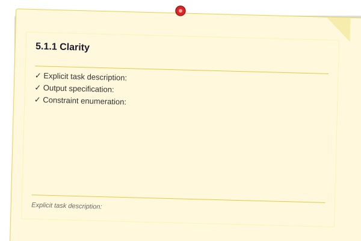
</a>


Clear prompts leave no room for ambiguity. Instead of "Write about AI," specify "Write a 200-word introduction to transformer-based language models, explaining the self-attention mechanism in simple terms suitable for a high school audience." Clarity includes:

- **Explicit task description:** State exactly what the model should do (summarize, classify, generate, extract).
- **Output specification:** Define format, length, tone, and audience.
- **Constraint enumeration:** List constraints (e.g., "do not include markdown formatting" or "use only information from the provided context").

### 5.1.2 Specificity

<a href="../../assets/images/diagrams/modern-ai-engineering/05-prompt-engineering/5-1-2-specificity-handwritten.svg" target="_blank" rel="noopener">
  
</a>
<a href="../../assets/images/diagrams/modern-ai-engineering/05-prompt-engineering/5-1-2-specificity-diagram.svg" target="_blank" rel="noopener">
  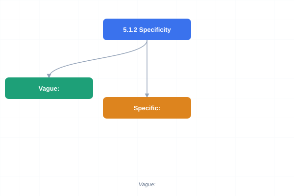
</a>
<a href="../../assets/images/diagrams/modern-ai-engineering/05-prompt-engineering/5-1-2-specificity-sticky.svg" target="_blank" rel="noopener">
  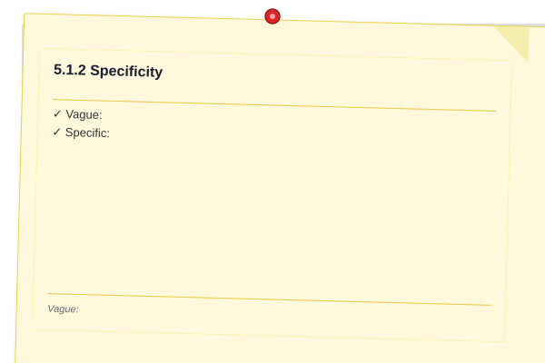
</a>


Specific prompts constrain the output space, reducing hallucinations and irrelevant content. Compare:

- **Vague:** "Explain machine learning."
- **Specific:** "Explain the bias-variance tradeoff in supervised learning using the example of polynomial regression. Include a definition of underfitting and overfitting, and describe how regularization helps balance them."

Specificity includes providing examples, defining key terms, and scoping the response to a particular subtopic.

### 5.1.3 Role Assignment

<a href="../../assets/images/diagrams/modern-ai-engineering/05-prompt-engineering/5-1-3-role-assignment-handwritten.svg" target="_blank" rel="noopener">
  
</a>
<a href="../../assets/images/diagrams/modern-ai-engineering/05-prompt-engineering/5-1-3-role-assignment-diagram.svg" target="_blank" rel="noopener">
  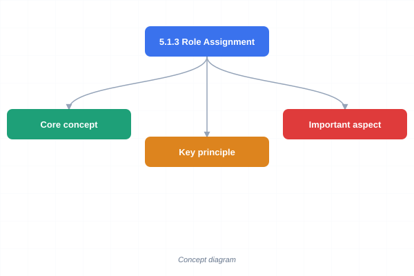
</a>
<a href="../../assets/images/diagrams/modern-ai-engineering/05-prompt-engineering/5-1-3-role-assignment-sticky.svg" target="_blank" rel="noopener">
  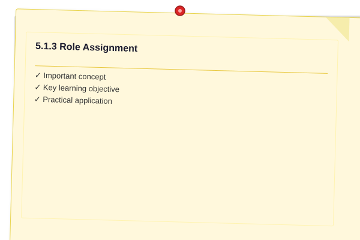
</a>


Assigning a role (persona) to the model improves output quality by activating relevant knowledge. Roles work because they prime the model to adopt specific reasoning patterns, vocabulary, and constraints:

- "You are a senior software engineer reviewing a pull request..."
- "You are a college professor explaining quantum computing to first-year physics students..."
- "You are a professional editor specializing in academic papers..."

Role assignment is most effective when the role implies specific expertise, constraints, and output standards.

### 5.1.4 Output Formatting

<a href="../../assets/images/diagrams/modern-ai-engineering/05-prompt-engineering/5-1-4-output-formatting-handwritten.svg" target="_blank" rel="noopener">
  
</a>
<a href="../../assets/images/diagrams/modern-ai-engineering/05-prompt-engineering/5-1-4-output-formatting-diagram.svg" target="_blank" rel="noopener">
  
</a>
<a href="../../assets/images/diagrams/modern-ai-engineering/05-prompt-engineering/5-1-4-output-formatting-sticky.svg" target="_blank" rel="noopener">
  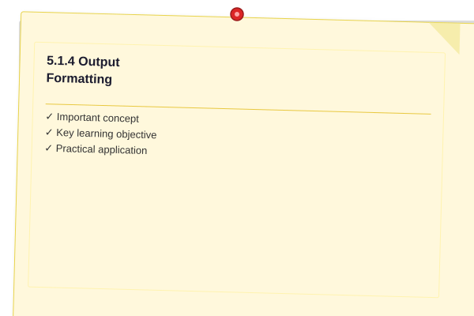
</a>


Explicit formatting instructions reduce parsing errors and improve downstream processing:

- "Output a JSON object with keys 'summary', 'key_points' (array), and 'sentiment' (positive/negative/neutral)."
- "Respond in bullet points, starting with a one-sentence overview."
- "Format the code block with TypeScript syntax highlighting."

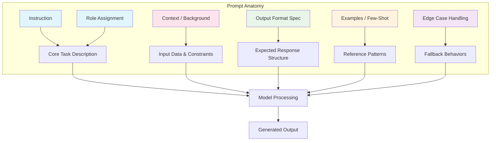
```mermaid
graph TD
    subgraph PromptAnatomy["Prompt Anatomy"]
        A[Instruction] --> B[Core Task Description]
        C[Role Assignment] --> B
        D[Context / Background] --> E[Input Data & Constraints]
        F[Output Format Spec] --> G[Expected Response Structure]
        H[Examples / Few-Shot] --> I[Reference Patterns]
        J[Edge Case Handling] --> K[Fallback Behaviors]
    end
    
    B --> L[Model Processing]
    E --> L
    G --> L
    I --> L
    K --> L
    L --> M[Generated Output]
    
    style A fill:#e1f5fe
    style C fill:#e1f5fe
    style D fill:#fce4ec
    style F fill:#e8f5e9
    style H fill:#fff3e0
    style J fill:#f3e5f5
```

---

## 5.2 Zero-Shot vs Few-Shot Prompting

### 5.2.1 Zero-Shot Prompting

<a href="../../assets/images/diagrams/modern-ai-engineering/05-prompt-engineering/5-2-1-zero-shot-prompting-handwritten.svg" target="_blank" rel="noopener">
  
</a>
<a href="../../assets/images/diagrams/modern-ai-engineering/05-prompt-engineering/5-2-1-zero-shot-prompting-diagram.svg" target="_blank" rel="noopener">
  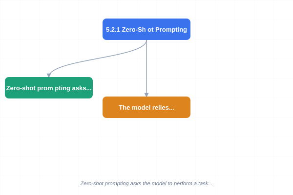
</a>
<a href="../../assets/images/diagrams/modern-ai-engineering/05-prompt-engineering/5-2-1-zero-shot-prompting-sticky.svg" target="_blank" rel="noopener">
  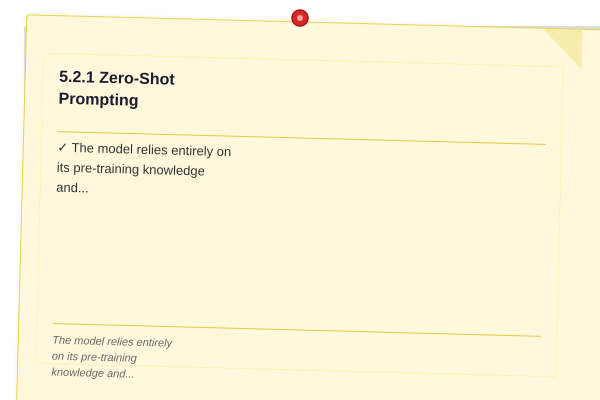
</a>


Zero-shot prompting asks the model to perform a task without providing any examples. The model relies entirely on its pre-training knowledge and instruction-following ability.

Zero-shot works well for:
- Common, well-understood tasks (translation, summarization, classification)
- Tasks with highly specific, unambiguous instructions
- Models with strong instruction-following capabilities (GPT-4, Claude 3, Gemini)

Zero-shot struggles with:
- Niche or domain-specific tasks requiring specialized output formats
- Tasks with complex constraints that are hard to describe in words
- Edge cases where the model's training data does not include relevant patterns

### 5.2.2 Few-Shot Prompting

<a href="../../assets/images/diagrams/modern-ai-engineering/05-prompt-engineering/5-2-2-few-shot-prompting-handwritten.svg" target="_blank" rel="noopener">
  
</a>
<a href="../../assets/images/diagrams/modern-ai-engineering/05-prompt-engineering/5-2-2-few-shot-prompting-diagram.svg" target="_blank" rel="noopener">
  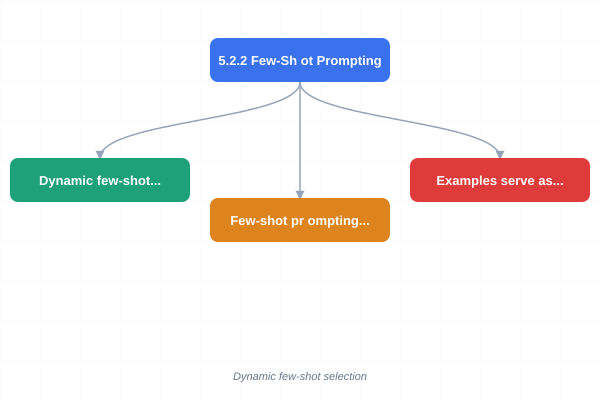
</a>
<a href="../../assets/images/diagrams/modern-ai-engineering/05-prompt-engineering/5-2-2-few-shot-prompting-sticky.svg" target="_blank" rel="noopener">
  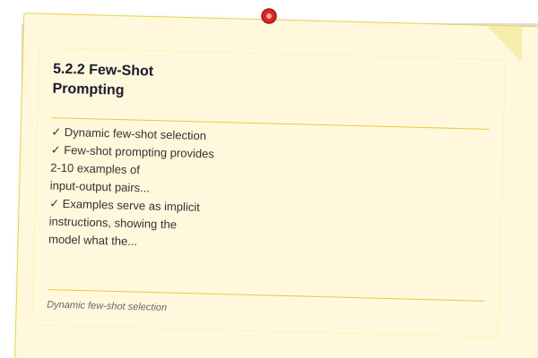
</a>


Few-shot prompting provides 2-10 examples of input-output pairs before asking the model to perform the task. Examples serve as implicit instructions, showing the model what the expected output looks like.

Few-shot is superior for:
- Tasks with specialized output formats or conventions
- Tasks requiring nuanced judgments (sentiment with specific categories)
- Smaller models that benefit from in-context learning

**Dynamic few-shot selection** improves performance by choosing the most relevant examples for each query. Rather than using the same examples for every query, a retrieval system selects examples similar to the current input. This is especially important when the task has diverse subcategories.

### 5.2.3 Example Quality

<a href="../../assets/images/diagrams/modern-ai-engineering/05-prompt-engineering/5-2-3-example-quality-handwritten.svg" target="_blank" rel="noopener">
  
</a>
<a href="../../assets/images/diagrams/modern-ai-engineering/05-prompt-engineering/5-2-3-example-quality-diagram.svg" target="_blank" rel="noopener">
  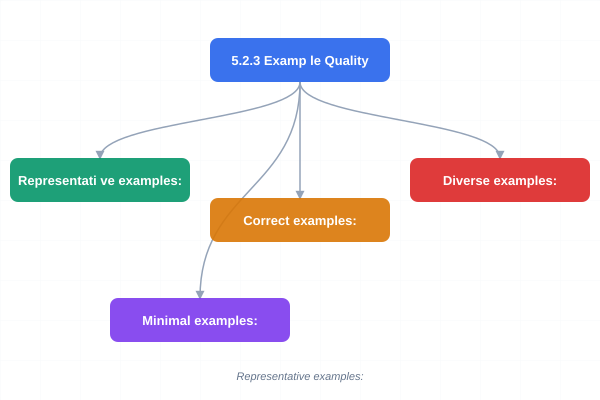
</a>
<a href="../../assets/images/diagrams/modern-ai-engineering/05-prompt-engineering/5-2-3-example-quality-sticky.svg" target="_blank" rel="noopener">
  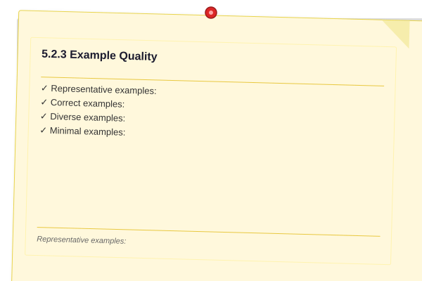
</a>


The quality of few-shot examples directly impacts performance. Best practices:

- **Representative examples:** Choose examples that cover the range of expected inputs and outputs.
- **Correct examples:** Every example must be accurate — errors propagate to the model's behavior.
- **Diverse examples:** Include edge cases and boundary conditions, not just typical cases.
- **Minimal examples:** Use the fewest examples that achieve the desired behavior. More examples consume context window and may introduce noise.

---

## 5.3 Chain-of-Thought and Reasoning

### 5.3.1 Chain-of-Thought Prompting

<a href="../../assets/images/diagrams/modern-ai-engineering/05-prompt-engineering/5-3-1-chain-of-thought-prompting-handwritten.svg" target="_blank" rel="noopener">
  
</a>
<a href="../../assets/images/diagrams/modern-ai-engineering/05-prompt-engineering/5-3-1-chain-of-thought-prompting-diagram.svg" target="_blank" rel="noopener">
  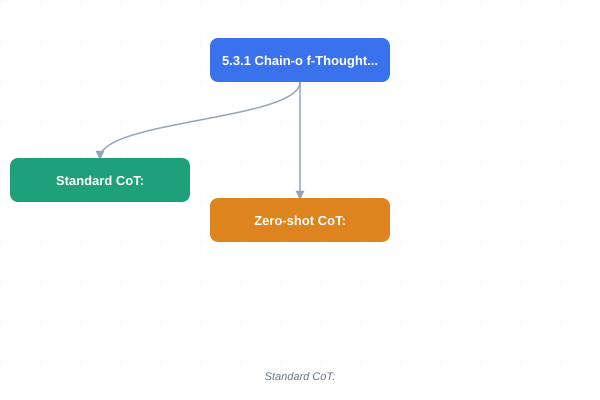
</a>
<a href="../../assets/images/diagrams/modern-ai-engineering/05-prompt-engineering/5-3-1-chain-of-thought-prompting-sticky.svg" target="_blank" rel="noopener">
  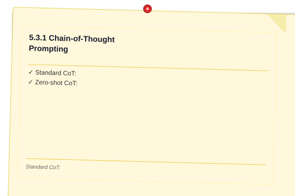
</a>


Chain-of-thought (CoT) prompting instructs the model to show its reasoning step by step before producing the final answer. CoT significantly improves performance on arithmetic, logical, and multi-step reasoning tasks.

**Standard CoT:** Provide examples that include intermediate reasoning steps. The model learns to produce similar step-by-step reasoning.

**Zero-shot CoT:** Simply append "Let's think step by step" to the prompt. This surprisingly effective technique activates the model's reasoning capabilities without any examples. Zero-shot CoT improves accuracy on GSM8K (math word problems) by 10-20 percentage points compared to direct answering.

### 5.3.2 Tree-of-Thought

<a href="../../assets/images/diagrams/modern-ai-engineering/05-prompt-engineering/5-3-2-tree-of-thought-handwritten.svg" target="_blank" rel="noopener">
  
</a>
<a href="../../assets/images/diagrams/modern-ai-engineering/05-prompt-engineering/5-3-2-tree-of-thought-diagram.svg" target="_blank" rel="noopener">
  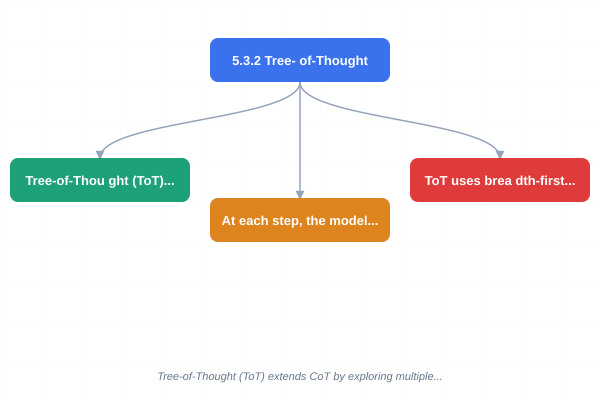
</a>
<a href="../../assets/images/diagrams/modern-ai-engineering/05-prompt-engineering/5-3-2-tree-of-thought-sticky.svg" target="_blank" rel="noopener">
  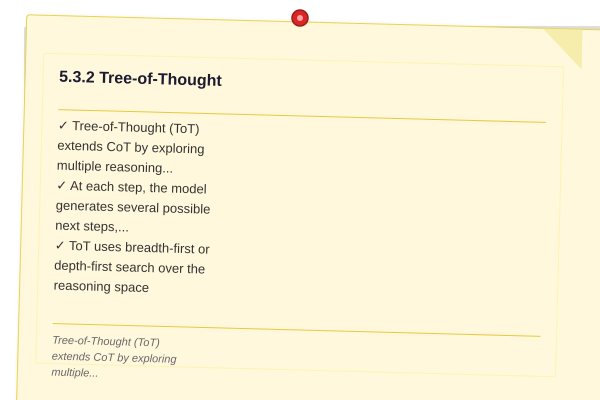
</a>


Tree-of-Thought (ToT) extends CoT by exploring multiple reasoning paths simultaneously. At each step, the model generates several possible next steps, evaluates them, and branches the most promising ones. ToT uses breadth-first or depth-first search over the reasoning space.

ToT is effective for:
- Complex planning tasks (writing a multi-step program)
- Puzzle solving (Sudoku, crosswords)
- Tasks requiring exploration of multiple solution strategies

The main cost is increased token usage — each reasoning path generates additional tokens, and branching multiplies this by the branching factor.

### 5.3.3 Self-Consistency

<a href="../../assets/images/diagrams/modern-ai-engineering/05-prompt-engineering/5-3-3-self-consistency-handwritten.svg" target="_blank" rel="noopener">
  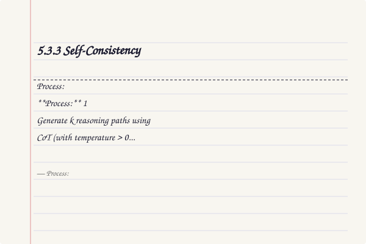
</a>
<a href="../../assets/images/diagrams/modern-ai-engineering/05-prompt-engineering/5-3-3-self-consistency-diagram.svg" target="_blank" rel="noopener">
  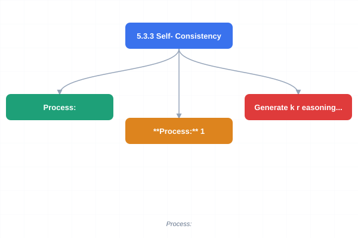
</a>
<a href="../../assets/images/diagrams/modern-ai-engineering/05-prompt-engineering/5-3-3-self-consistency-sticky.svg" target="_blank" rel="noopener">
  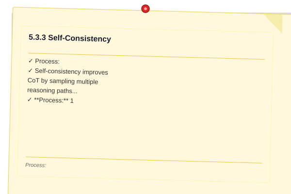
</a>


Self-consistency improves CoT by sampling multiple reasoning paths and selecting the most common answer. The intuition: while individual reasoning paths may contain errors, the correct answer will appear more frequently across diverse reasoning paths.

**Process:**
1. Generate k reasoning paths using CoT (with temperature > 0 for diversity).
2. Extract the final answer from each path.
3. Select the majority answer (for classification) or average numerical answers.

Self-consistency with k=5 typically outperforms greedy decoding by 5-15% on reasoning benchmarks.

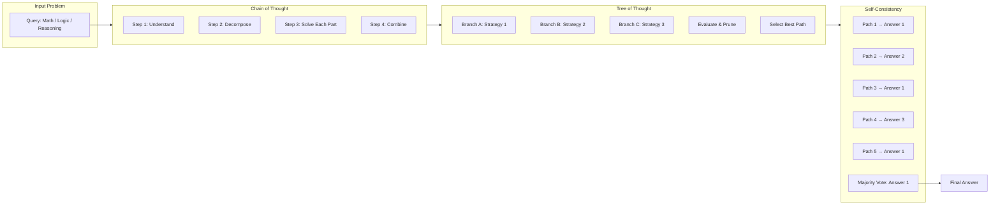
```mermaid
flowchart LR
    subgraph Input["Input Problem"]
        A[Query: Math / Logic / Reasoning]
    end
    
    subgraph CoT["Chain of Thought"]
        B["Step 1: Understand"]
        C["Step 2: Decompose"]
        D["Step 3: Solve Each Part"]
        E["Step 4: Combine"]
    end
    
    subgraph ToT["Tree of Thought"]
        F["Branch A: Strategy 1"]
        G["Branch B: Strategy 2"]
        H["Branch C: Strategy 3"]
        I["Evaluate & Prune"]
        J["Select Best Path"]
    end
    
    subgraph SelfCons["Self-Consistency"]
        K["Path 1 → Answer 1"]
        L["Path 2 → Answer 2"]
        M["Path 3 → Answer 1"]
        N["Path 4 → Answer 3"]
        O["Path 5 → Answer 1"]
        P["Majority Vote: Answer 1"]
    end
    
    A --> CoT
    CoT --> ToT
    ToT --> SelfCons
    P --> Q[Final Answer]
```

---

## 5.4 Structured Output Prompting

### 5.4.1 JSON Mode

<a href="../../assets/images/diagrams/modern-ai-engineering/05-prompt-engineering/5-4-1-json-mode-handwritten.svg" target="_blank" rel="noopener">
  
</a>
<a href="../../assets/images/diagrams/modern-ai-engineering/05-prompt-engineering/5-4-1-json-mode-diagram.svg" target="_blank" rel="noopener">
  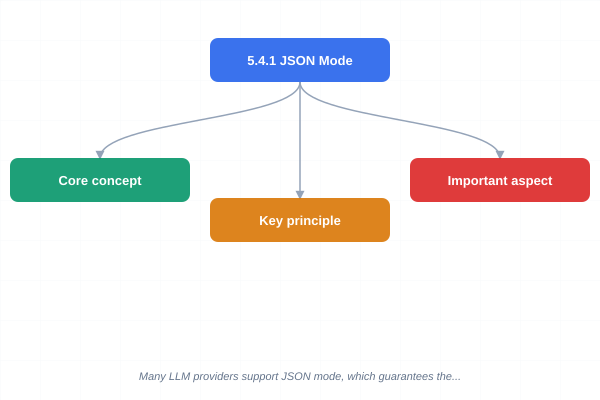
</a>
<a href="../../assets/images/diagrams/modern-ai-engineering/05-prompt-engineering/5-4-1-json-mode-sticky.svg" target="_blank" rel="noopener">
  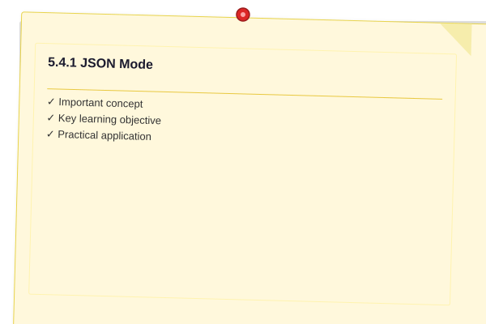
</a>


Many LLM providers support JSON mode, which guarantees the output can be parsed as valid JSON. OpenAI's JSON mode requires the prompt to contain the word "JSON" and the model is guided to produce a valid JSON object. However, JSON mode does not guarantee schema compliance — the output may be valid JSON but with missing or extra fields.

### 5.4.2 Grammar Constraints

<a href="../../assets/images/diagrams/modern-ai-engineering/05-prompt-engineering/5-4-2-grammar-constraints-handwritten.svg" target="_blank" rel="noopener">
  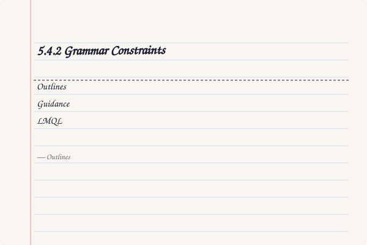
</a>
<a href="../../assets/images/diagrams/modern-ai-engineering/05-prompt-engineering/5-4-2-grammar-constraints-diagram.svg" target="_blank" rel="noopener">
  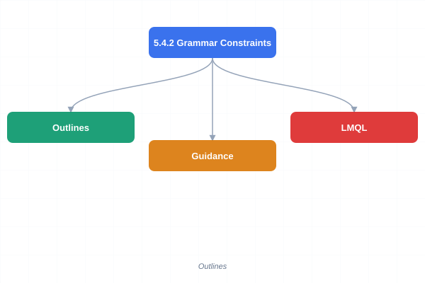
</a>
<a href="../../assets/images/diagrams/modern-ai-engineering/05-prompt-engineering/5-4-2-grammar-constraints-sticky.svg" target="_blank" rel="noopener">
  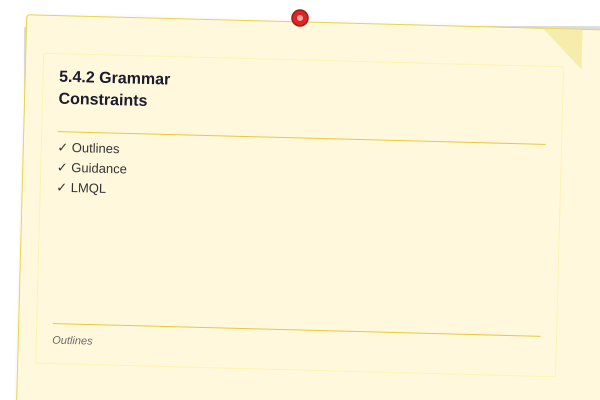
</a>


Libraries like **Outlines**, **Guidance**, and **LMQL** constrain model generation at the token level using context-free grammars. This guarantees that every token generated is valid according to the specified grammar. For JSON, the grammar enforces that only valid JSON tokens are produced at each position.

### 5.4.3 Schema Enforcement

<a href="../../assets/images/diagrams/modern-ai-engineering/05-prompt-engineering/5-4-3-schema-enforcement-handwritten.svg" target="_blank" rel="noopener">
  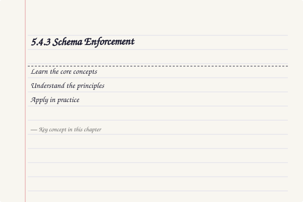
</a>
<a href="../../assets/images/diagrams/modern-ai-engineering/05-prompt-engineering/5-4-3-schema-enforcement-diagram.svg" target="_blank" rel="noopener">
  
</a>
<a href="../../assets/images/diagrams/modern-ai-engineering/05-prompt-engineering/5-4-3-schema-enforcement-sticky.svg" target="_blank" rel="noopener">
  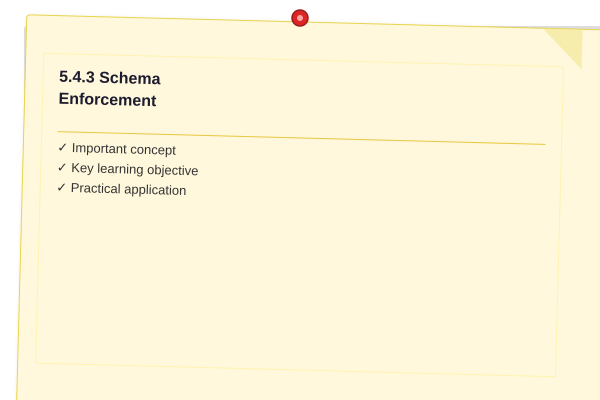
</a>


For production systems, schema enforcement at the application level is essential. After parsing the JSON, validate against a Zod schema or JSON Schema:

```typescript
import { z } from 'zod';

const ResponseSchema = z.object({
  summary: z.string().min(10).max(500),
  key_points: z.array(z.string()).min(1).max(10),
  sentiment: z.enum(['positive', 'negative', 'neutral']),
  confidence: z.number().min(0).max(1),
});

type ValidatedResponse = z.infer<typeof ResponseSchema>;
```

### 5.4.4 TypeScript Type Guards

<a href="../../assets/images/diagrams/modern-ai-engineering/05-prompt-engineering/5-4-4-typescript-type-guards-handwritten.svg" target="_blank" rel="noopener">
  
</a>
<a href="../../assets/images/diagrams/modern-ai-engineering/05-prompt-engineering/5-4-4-typescript-type-guards-diagram.svg" target="_blank" rel="noopener">
  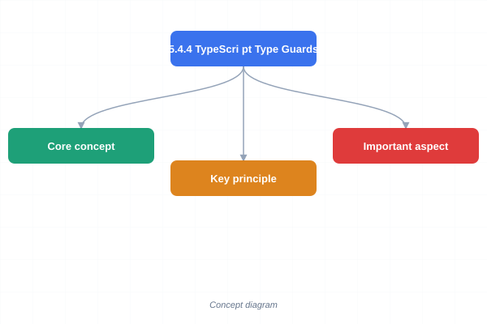
</a>
<a href="../../assets/images/diagrams/modern-ai-engineering/05-prompt-engineering/5-4-4-typescript-type-guards-sticky.svg" target="_blank" rel="noopener">
  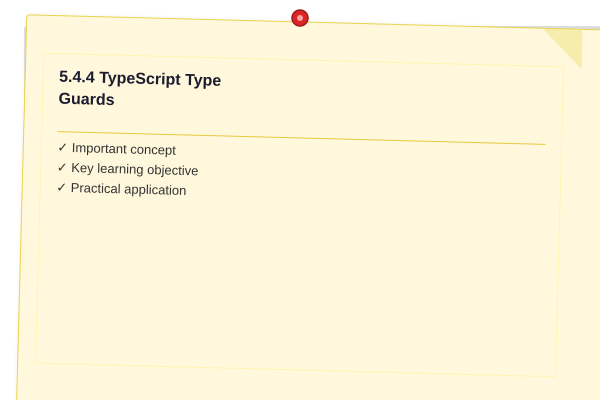
</a>


Type guards provide runtime validation with compile-time safety:

```typescript
interface StructuredOutput {
  summary: string;
  keyPoints: string[];
  sentiment: 'positive' | 'negative' | 'neutral';
  confidence: number;
}

function isStructuredOutput(obj: unknown): obj is StructuredOutput {
  if (typeof obj !== 'object' || obj === null) return false;
  const o = obj as Record<string, unknown>;
  return (
    typeof o.summary === 'string' &&
    Array.isArray(o.keyPoints) &&
    o.keyPoints.every((k: unknown) => typeof k === 'string') &&
    ['positive', 'negative', 'neutral'].includes(o.sentiment as string) &&
    typeof o.confidence === 'number' &&
    o.confidence >= 0 &&
    o.confidence <= 1
  );
}
```

---

## 5.5 Context Management

### 5.5.1 Prompt Compression

<a href="../../assets/images/diagrams/modern-ai-engineering/05-prompt-engineering/5-5-1-prompt-compression-handwritten.svg" target="_blank" rel="noopener">
  
</a>
<a href="../../assets/images/diagrams/modern-ai-engineering/05-prompt-engineering/5-5-1-prompt-compression-diagram.svg" target="_blank" rel="noopener">
  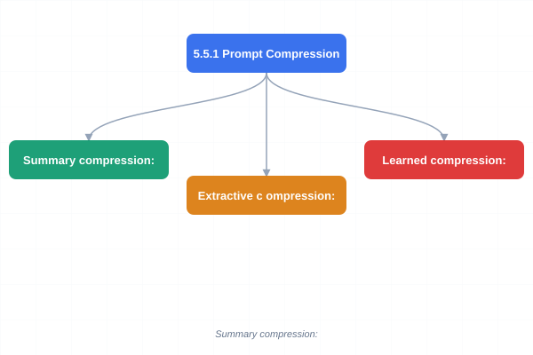
</a>
<a href="../../assets/images/diagrams/modern-ai-engineering/05-prompt-engineering/5-5-1-prompt-compression-sticky.svg" target="_blank" rel="noopener">
  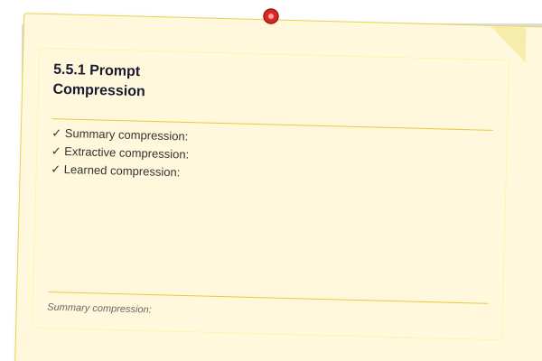
</a>


Long prompts degrade model performance due to the "lost in the middle" phenomenon — models pay less attention to content in the middle of long contexts. Compression strategies include:

- **Summary compression:** Replace verbose sections with shorter summaries.
- **Extractive compression:** Select only the most relevant sentences or tokens.
- **Learned compression:** Use a smaller LM to compress text while preserving semantic content.

LLMLingua and similar tools use small models to score token importance and remove low-information tokens, achieving 2-5x compression with minimal quality loss.

### 5.5.2 Sliding Window

<a href="../../assets/images/diagrams/modern-ai-engineering/05-prompt-engineering/5-5-2-sliding-window-handwritten.svg" target="_blank" rel="noopener">
  
</a>
<a href="../../assets/images/diagrams/modern-ai-engineering/05-prompt-engineering/5-5-2-sliding-window-diagram.svg" target="_blank" rel="noopener">
  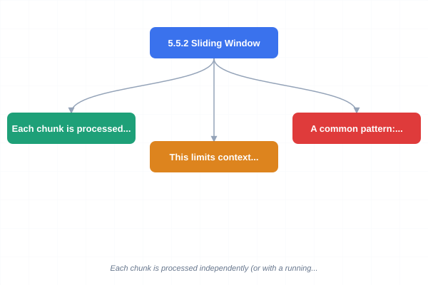
</a>
<a href="../../assets/images/diagrams/modern-ai-engineering/05-prompt-engineering/5-5-2-sliding-window-sticky.svg" target="_blank" rel="noopener">
  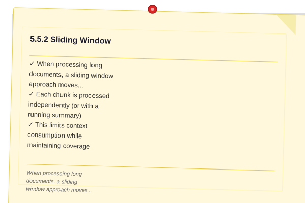
</a>


When processing long documents, a sliding window approach moves through the text in overlapping chunks. Each chunk is processed independently (or with a running summary). This limits context consumption while maintaining coverage.

A common pattern: process a document in 4000-token windows with 500-token overlap. The overlap ensures that information spanning chunk boundaries is not lost.

### 5.5.3 Dynamic Context Insertion

<a href="../../assets/images/diagrams/modern-ai-engineering/05-prompt-engineering/5-5-3-dynamic-context-insertion-handwritten.svg" target="_blank" rel="noopener">
  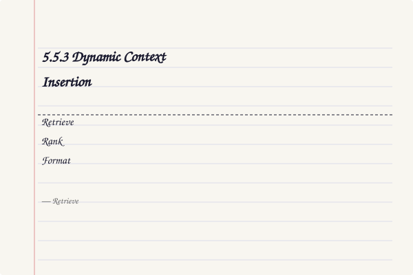
</a>
<a href="../../assets/images/diagrams/modern-ai-engineering/05-prompt-engineering/5-5-3-dynamic-context-insertion-diagram.svg" target="_blank" rel="noopener">
  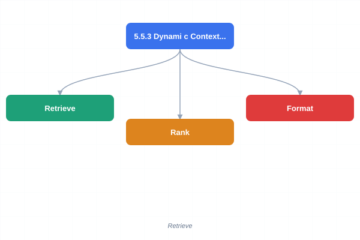
</a>
<a href="../../assets/images/diagrams/modern-ai-engineering/05-prompt-engineering/5-5-3-dynamic-context-insertion-sticky.svg" target="_blank" rel="noopener">
  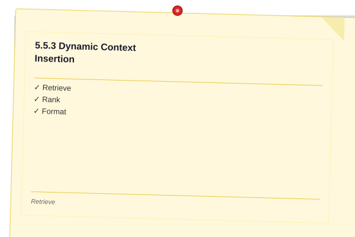
</a>


Rather than including all available context in every prompt, dynamically select the most relevant pieces:

1. **Retrieve** the top-k relevant context items using embedding similarity.
2. **Rank** items by relevance, placing the most important information at the beginning and end of the context.
3. **Format** the selected context into the prompt template.

This is the foundation of RAG (covered in Chapter 6) but applies broadly to any context-rich task.

### 5.5.4 Recursive Repositories

<a href="../../assets/images/diagrams/modern-ai-engineering/05-prompt-engineering/5-5-4-recursive-repositories-handwritten.svg" target="_blank" rel="noopener">
  
</a>
<a href="../../assets/images/diagrams/modern-ai-engineering/05-prompt-engineering/5-5-4-recursive-repositories-diagram.svg" target="_blank" rel="noopener">
  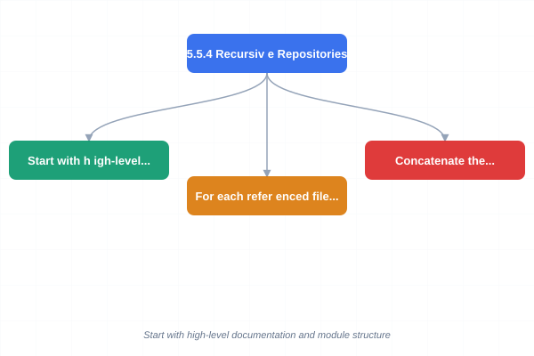
</a>
<a href="../../assets/images/diagrams/modern-ai-engineering/05-prompt-engineering/5-5-4-recursive-repositories-sticky.svg" target="_blank" rel="noopener">
  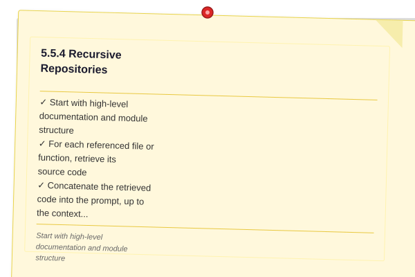
</a>


For code generation with large codebases, a recursive context-building approach navigates the codebase hierarchy:

1. Start with high-level documentation and module structure.
2. For each referenced file or function, retrieve its source code.
3. Concatenate the retrieved code into the prompt, up to the context limit.
4. If the context is exceeded, summarize less relevant files.

This allows models to work with codebases far larger than the context window.

---

## 5.6 System Prompts vs User Prompts

### 5.6.1 Separation of Concerns

<a href="../../assets/images/diagrams/modern-ai-engineering/05-prompt-engineering/5-6-1-separation-of-concerns-handwritten.svg" target="_blank" rel="noopener">
  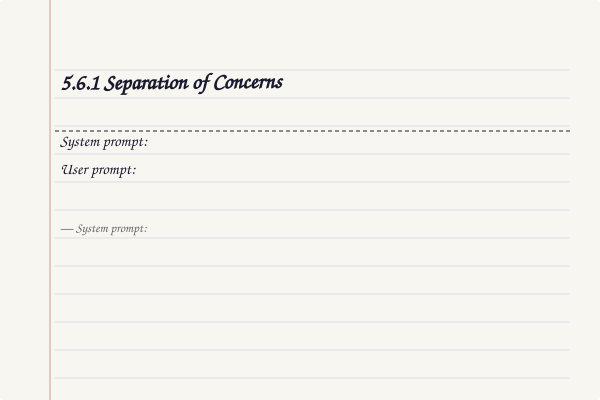
</a>
<a href="../../assets/images/diagrams/modern-ai-engineering/05-prompt-engineering/5-6-1-separation-of-concerns-diagram.svg" target="_blank" rel="noopener">
  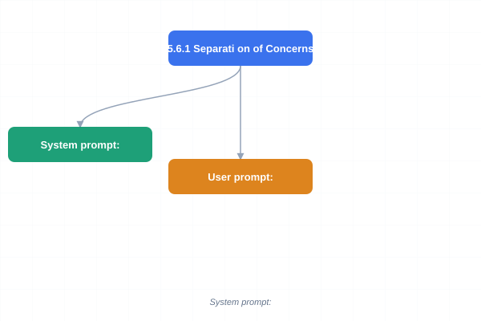
</a>
<a href="../../assets/images/diagrams/modern-ai-engineering/05-prompt-engineering/5-6-1-separation-of-concerns-sticky.svg" target="_blank" rel="noopener">
  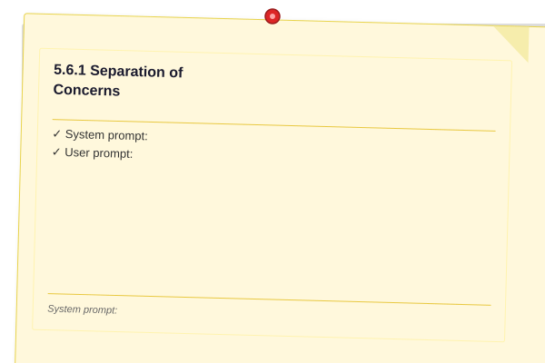
</a>


Modern LLM APIs separate prompts into two roles:

- **System prompt:** Set by the developer, defines the model's behavior, constraints, and persona. The system prompt is typically invisible to the end user.
- **User prompt:** Provided by the end user, contains the specific request or query.

This separation allows the developer to enforce safety rules, output formatting, and behavioral guidelines that the user cannot override.

### 5.6.2 System Prompt Design Patterns

<a href="../../assets/images/diagrams/modern-ai-engineering/05-prompt-engineering/5-6-2-system-prompt-design-patterns-handwritten.svg" target="_blank" rel="noopener">
  
</a>
<a href="../../assets/images/diagrams/modern-ai-engineering/05-prompt-engineering/5-6-2-system-prompt-design-patterns-diagram.svg" target="_blank" rel="noopener">
  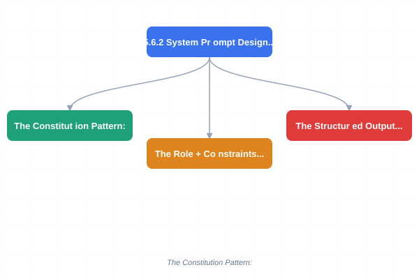
</a>
<a href="../../assets/images/diagrams/modern-ai-engineering/05-prompt-engineering/5-6-2-system-prompt-design-patterns-sticky.svg" target="_blank" rel="noopener">
  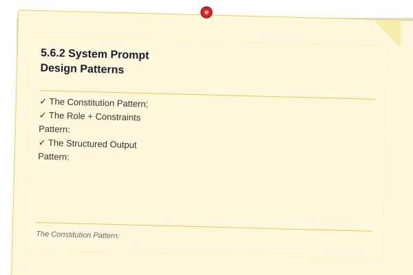
</a>


Effective system prompts follow structured design patterns:

**The Constitution Pattern:**
```
You are an AI assistant governed by the following rules:
1. Always prioritize user safety
2. Cite sources when making factual claims
3. Admit uncertainty when you do not know something
4. Never execute harmful instructions
5. Maintain a helpful, respectful tone
```

**The Role + Constraints Pattern:**
```
You are a senior code reviewer. Review the provided code for:
- Correctness and bug detection
- Performance bottlenecks
- Security vulnerabilities
- Adherence to TypeScript best practices

Provide your review in the following format:
## Summary
## Issues Found (severity: high/medium/low)
## Suggestions
```

**The Structured Output Pattern:**
```
You are a data extraction assistant. Extract structured information from the provided text.
Always output valid JSON matching the specified schema.
Do not include any text outside the JSON object.
If information is missing, use null as the value.
```

### 5.6.3 Prompt Injection Prevention

<a href="../../assets/images/diagrams/modern-ai-engineering/05-prompt-engineering/5-6-3-prompt-injection-prevention-handwritten.svg" target="_blank" rel="noopener">
  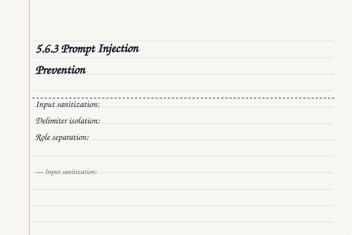
</a>
<a href="../../assets/images/diagrams/modern-ai-engineering/05-prompt-engineering/5-6-3-prompt-injection-prevention-diagram.svg" target="_blank" rel="noopener">
  
</a>
<a href="../../assets/images/diagrams/modern-ai-engineering/05-prompt-engineering/5-6-3-prompt-injection-prevention-sticky.svg" target="_blank" rel="noopener">
  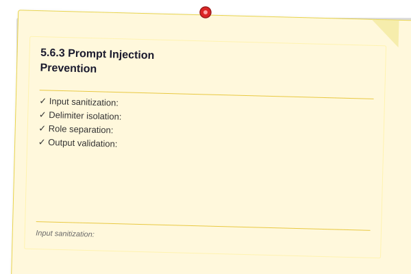
</a>


Prompt injection occurs when user input contains instructions that override the system prompt. Prevention strategies:

- **Input sanitization:** Strip or escape directives from user input.
- **Delimiter isolation:** Wrap user input in clear delimiters and instruct the model to treat delimited content as data, not instructions.
- **Role separation:** Use API-level system/user prompt separation rather than embedding instructions in the user prompt.
- **Output validation:** Verify that output conforms to expected format and does not leak system prompt content.
- **Instruction hierarchy:** Train or instruct the model to prioritize system-level instructions over user-level ones.

---

## 5.7 Prompt Versioning and Testing

### 5.7.1 Version Control

<a href="../../assets/images/diagrams/modern-ai-engineering/05-prompt-engineering/5-7-1-version-control-handwritten.svg" target="_blank" rel="noopener">
  
</a>
<a href="../../assets/images/diagrams/modern-ai-engineering/05-prompt-engineering/5-7-1-version-control-diagram.svg" target="_blank" rel="noopener">
  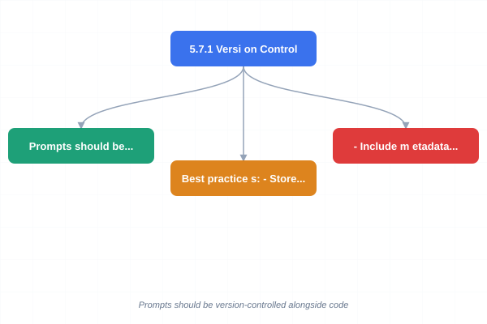
</a>
<a href="../../assets/images/diagrams/modern-ai-engineering/05-prompt-engineering/5-7-1-version-control-sticky.svg" target="_blank" rel="noopener">
  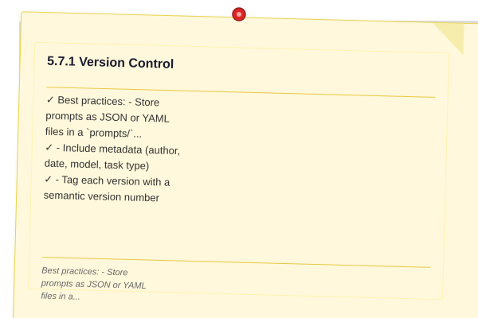
</a>


Prompts should be version-controlled alongside code. Each prompt version is a distinct artifact with a unique identifier, associated model, timestamp, and evaluation results.

Best practices:
- Store prompts as JSON or YAML files in a `prompts/` directory.
- Include metadata (author, date, model, task type).
- Tag each version with a semantic version number.
- Link prompts to evaluation datasets and test results.

### 5.7.2 A/B Testing

<a href="../../assets/images/diagrams/modern-ai-engineering/05-prompt-engineering/5-7-2-a-b-testing-handwritten.svg" target="_blank" rel="noopener">
  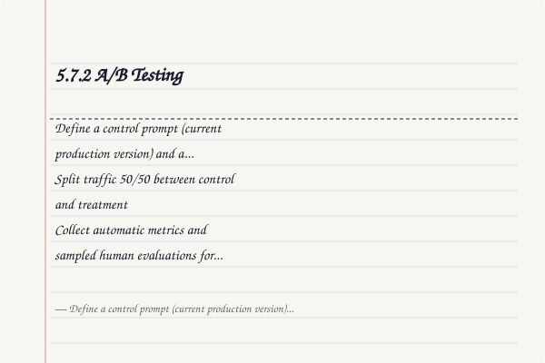
</a>
<a href="../../assets/images/diagrams/modern-ai-engineering/05-prompt-engineering/5-7-2-a-b-testing-diagram.svg" target="_blank" rel="noopener">
  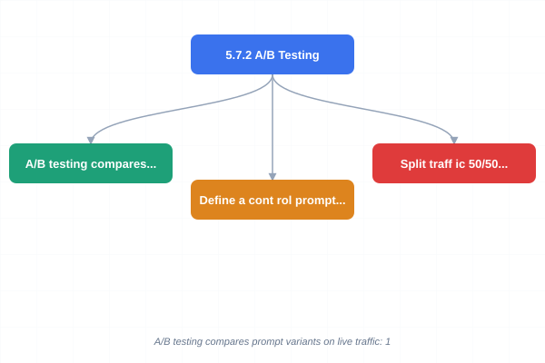
</a>
<a href="../../assets/images/diagrams/modern-ai-engineering/05-prompt-engineering/5-7-2-a-b-testing-sticky.svg" target="_blank" rel="noopener">
  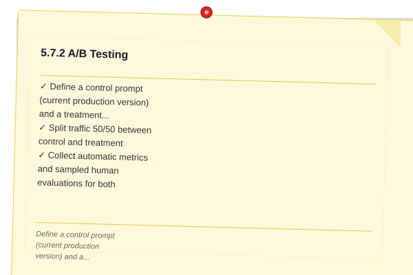
</a>


A/B testing compares prompt variants on live traffic:

1. Define a control prompt (current production version) and a treatment prompt (new version).
2. Split traffic 50/50 between control and treatment.
3. Collect automatic metrics and sampled human evaluations for both.
4. Run statistical significance tests before declaring a winner.

### 5.7.3 Automated Evaluation

<a href="../../assets/images/diagrams/modern-ai-engineering/05-prompt-engineering/5-7-3-automated-evaluation-handwritten.svg" target="_blank" rel="noopener">
  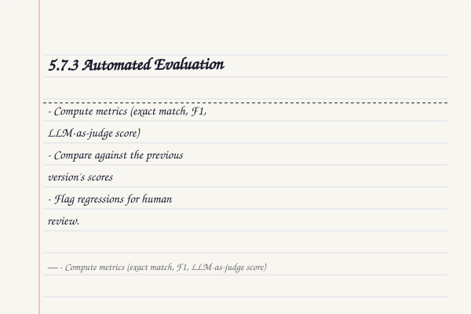
</a>
<a href="../../assets/images/diagrams/modern-ai-engineering/05-prompt-engineering/5-7-3-automated-evaluation-diagram.svg" target="_blank" rel="noopener">
  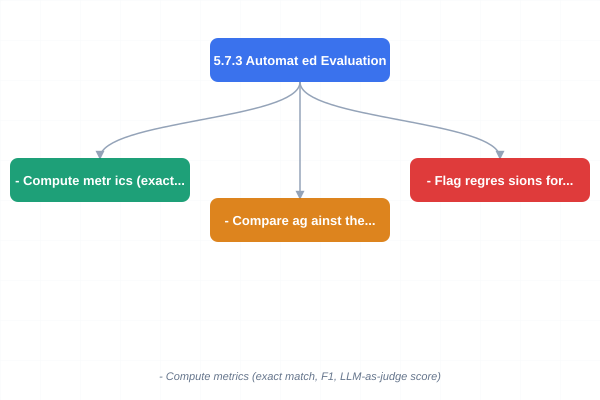
</a>
<a href="../../assets/images/diagrams/modern-ai-engineering/05-prompt-engineering/5-7-3-automated-evaluation-sticky.svg" target="_blank" rel="noopener">
  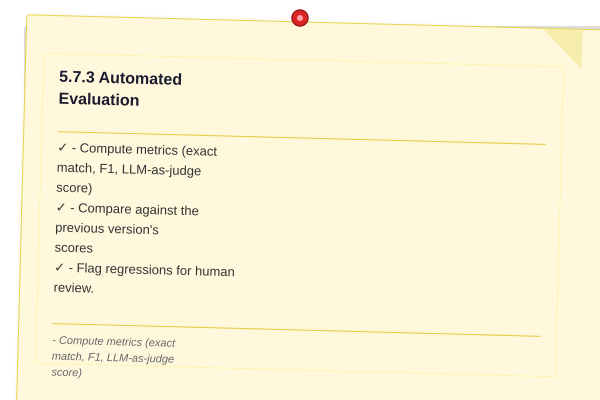
</a>


Each prompt version should be automatically evaluated against a golden dataset:

- Run the prompt against 100+ evaluation examples.
- Compute metrics (exact match, F1, LLM-as-judge score).
- Compare against the previous version's scores.
- Flag regressions for human review.

### 5.7.4 Regression Testing

<a href="../../assets/images/diagrams/modern-ai-engineering/05-prompt-engineering/5-7-4-regression-testing-handwritten.svg" target="_blank" rel="noopener">
  
</a>
<a href="../../assets/images/diagrams/modern-ai-engineering/05-prompt-engineering/5-7-4-regression-testing-diagram.svg" target="_blank" rel="noopener">
  
</a>
<a href="../../assets/images/diagrams/modern-ai-engineering/05-prompt-engineering/5-7-4-regression-testing-sticky.svg" target="_blank" rel="noopener">
  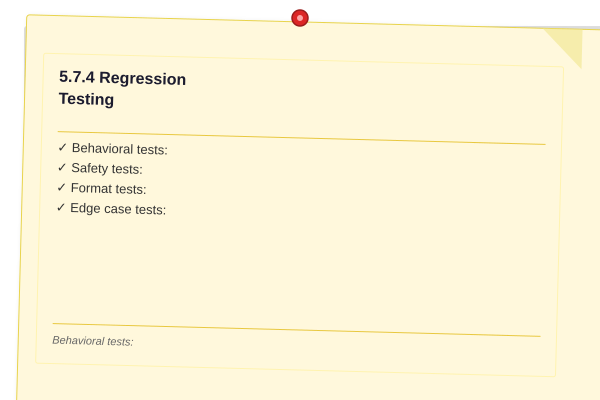
</a>


Regression tests catch unintended behavior changes when modifying prompts:

- **Behavioral tests:** Verify that specific prompts still produce correct outputs (e.g., "What is 2+2?" should always return 4).
- **Safety tests:** Verify that adversarial inputs do not bypass safety constraints.
- **Format tests:** Verify that structured output formats are maintained.
- **Edge case tests:** Verify handling of empty input, very long input, and ambiguous queries.

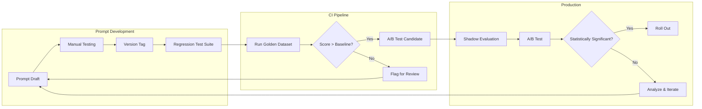
```mermaid
flowchart LR
    subgraph Dev["Prompt Development"]
        A[Prompt Draft] --> B[Manual Testing]
        B --> C[Version Tag]
        C --> D[Regression Test Suite]
    end
    
    subgraph CI["CI Pipeline"]
        D --> E[Run Golden Dataset]
        E --> F{Score > Baseline?}
        F -->|Yes| G[A/B Test Candidate]
        F -->|No| H[Flag for Review]
        H --> A
    end
    
    subgraph Prod["Production"]
        G --> I[Shadow Evaluation]
        I --> J[A/B Test]
        J --> K{Statistically Significant?}
        K -->|Yes| L[Roll Out]
        K -->|No| M[Analyze & Iterate]
        M --> A
    end
```

---

## 5.8 Debugging Prompts

### 5.8.1 Systematic Debugging

<a href="../../assets/images/diagrams/modern-ai-engineering/05-prompt-engineering/5-8-1-systematic-debugging-handwritten.svg" target="_blank" rel="noopener">
  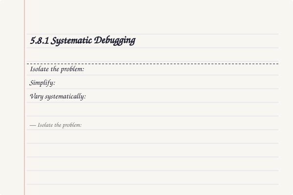
</a>
<a href="../../assets/images/diagrams/modern-ai-engineering/05-prompt-engineering/5-8-1-systematic-debugging-diagram.svg" target="_blank" rel="noopener">
  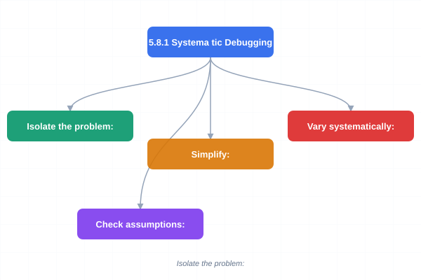
</a>
<a href="../../assets/images/diagrams/modern-ai-engineering/05-prompt-engineering/5-8-1-systematic-debugging-sticky.svg" target="_blank" rel="noopener">
  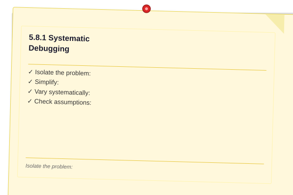
</a>


When a prompt produces unexpected outputs, follow a systematic debugging process:

1. **Isolate the problem:** Is the issue with the system prompt, user prompt, or model behavior?
2. **Simplify:** Remove elements until the problem disappears, then identify which element causes it.
3. **Vary systematically:** Change one variable at a time (wording, examples, temperature, model).
4. **Check assumptions:** Is the model actually following the instructions as written?
5. **Test edge cases:** Try empty input, extreme lengths, and adversarial phrasing.

### 5.8.2 Log Analysis

<a href="../../assets/images/diagrams/modern-ai-engineering/05-prompt-engineering/5-8-2-log-analysis-handwritten.svg" target="_blank" rel="noopener">
  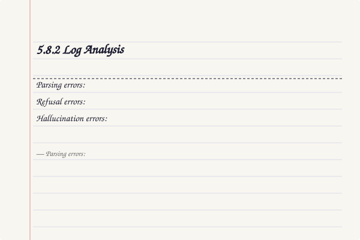
</a>
<a href="../../assets/images/diagrams/modern-ai-engineering/05-prompt-engineering/5-8-2-log-analysis-diagram.svg" target="_blank" rel="noopener">
  
</a>
<a href="../../assets/images/diagrams/modern-ai-engineering/05-prompt-engineering/5-8-2-log-analysis-sticky.svg" target="_blank" rel="noopener">
  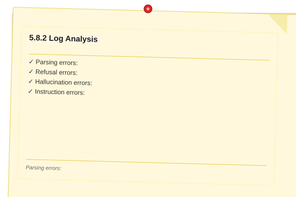
</a>


Comprehensive logging is essential for prompt debugging. Log:

- Full prompt (system + user) with timestamps
- Model response
- Parsed output and validation errors
- Latency and token usage
- User feedback (if available)

Analyze failure patterns across logs to identify systematic issues:

- **Parsing errors:** Output does not conform to expected format.
- **Refusal errors:** Model refuses to respond to legitimate queries.
- **Hallucination errors:** Output contains factually incorrect information.
- **Instruction errors:** Model misinterprets the task or misses constraints.

### 5.8.3 Failure Categorization

<a href="../../assets/images/diagrams/modern-ai-engineering/05-prompt-engineering/5-8-3-failure-categorization-handwritten.svg" target="_blank" rel="noopener">
  
</a>
<a href="../../assets/images/diagrams/modern-ai-engineering/05-prompt-engineering/5-8-3-failure-categorization-diagram.svg" target="_blank" rel="noopener">
  
</a>
<a href="../../assets/images/diagrams/modern-ai-engineering/05-prompt-engineering/5-8-3-failure-categorization-sticky.svg" target="_blank" rel="noopener">
  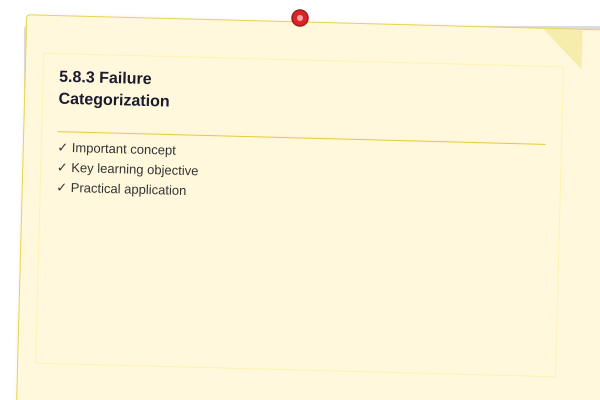
</a>


Categorize failures to guide remediation:

| Category | Symptom | Likely Cause | Fix |
|----------|---------|--------------|-----|
| Instruction ambiguity | Output misses key requirement | Prompt lacks specificity | Add explicit constraints |
| Format non-compliance | Invalid JSON or structure | Insufficient formatting guidance | Add schema + example |
| Hallucination | Facts not in context | Model relies on parametric knowledge | Add "only use provided context" |
| Refusal | Model declines to answer | Safety filters triggered | Adjust phrasing, add justification |
| Verbosity | Too much irrelevant detail | Missing length constraints | Add max length or "be concise" |

---

## TypeScript Implementation

### PromptTemplate Class

<a href="../../assets/images/diagrams/modern-ai-engineering/05-prompt-engineering/prompttemplate-class-handwritten.svg" target="_blank" rel="noopener">
  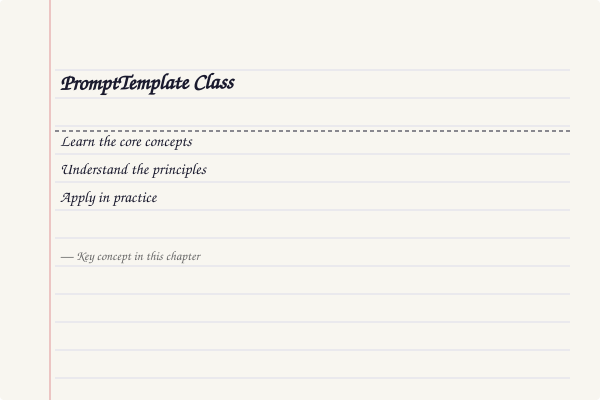
</a>
<a href="../../assets/images/diagrams/modern-ai-engineering/05-prompt-engineering/prompttemplate-class-diagram.svg" target="_blank" rel="noopener">
  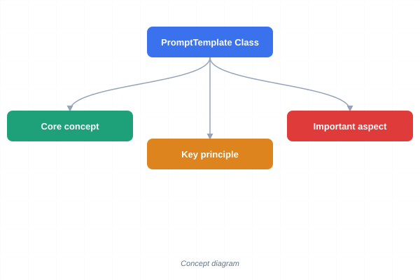
</a>
<a href="../../assets/images/diagrams/modern-ai-engineering/05-prompt-engineering/prompttemplate-class-sticky.svg" target="_blank" rel="noopener">
  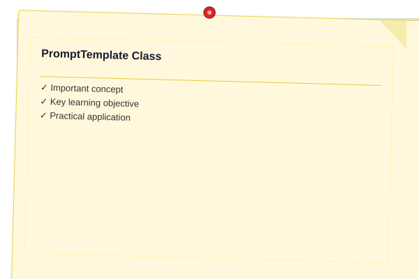
</a>


The `PromptTemplate` class provides a template engine with variable injection, version tracking, structured output support, and serialization for version control.

```typescript
import { z } from 'zod';

interface TemplateVariable {
  name: string;
  description: string;
  required: boolean;
  defaultValue?: string;
}

interface PromptVersion {
  version: string;
  content: string;
  systemPrompt: string;
  model: string;
  timestamp: number;
  metrics?: Record<string, number>;
}

type OutputValidator<T> = (output: string) => { success: boolean; data?: T; error?: string };

class PromptTemplate {
  private template: string;
  private systemPrompt: string;
  private variables: Map<string, TemplateVariable> = new Map();
  private versions: PromptVersion[] = [];
  private currentVersion: string = '0.0.0';

  constructor(
    template: string,
    systemPrompt: string = '',
    options?: { model?: string }
  ) {
    this.template = template;
    this.systemPrompt = systemPrompt;
    this.saveVersion(options?.model ?? 'gpt-4');
  }

  addVariable(variable: TemplateVariable): void {
    this.variables.set(variable.name, variable);
  }

  addVariables(vars: TemplateVariable[]): void {
    for (const v of vars) this.addVariable(v);
  }

  render(variables: Record<string, string>): { system: string; user: string } {
    const missing: string[] = [];
    for (const [name, v] of this.variables) {
      if (v.required && !(name in variables) && !v.defaultValue) {
        missing.push(name);
      }
    }
    if (missing.length > 0) {
      throw new Error(`Missing required variables: ${missing.join(', ')}`);
    }

    let rendered = this.template;
    for (const [name, value] of Object.entries(variables)) {
      rendered = rendered.replace(new RegExp(`\\{\\{\\s*${name}\\s*\\}\\}`, 'g'), value);
    }
    for (const [name, v] of this.variables) {
      if (v.defaultValue && !(name in variables)) {
        rendered = rendered.replace(
          new RegExp(`\\{\\{\\s*${name}\\s*\\}\\}`, 'g'),
          v.defaultValue
        );
      }
    }

    rendered = rendered.replace(/\{\{\s*\w+\s*\}\}/g, '');

    return { system: this.systemPrompt, user: rendered };
  }

  updateTemplate(newTemplate: string, model: string = 'gpt-4'): void {
    this.template = newTemplate;
    this.bumpVersion();
    this.saveVersion(model);
  }

  updateSystemPrompt(newSystemPrompt: string, model: string = 'gpt-4'): void {
    this.systemPrompt = newSystemPrompt;
    this.bumpVersion();
    this.saveVersion(model);
  }

  private bumpVersion(): void {
    const parts = this.currentVersion.split('.').map(Number);
    parts[2] = (parts[2] ?? 0) + 1;
    this.currentVersion = parts.join('.');
  }

  private saveVersion(model: string): void {
    this.versions.push({
      version: this.currentVersion,
      content: this.template,
      systemPrompt: this.systemPrompt,
      model,
      timestamp: Date.now(),
    });
  }

  getVersionHistory(): PromptVersion[] {
    return [...this.versions];
  }

  getCurrentVersion(): string {
    return this.currentVersion;
  }

  rollback(version: string): boolean {
    const target = this.versions.find((v) => v.version === version);
    if (!target) return false;
    this.template = target.content;
    this.systemPrompt = target.systemPrompt;
    this.currentVersion = version;
    return true;
  }

  createStructuredOutputPrompt<T>(
    schema: z.ZodSchema<T>,
    variables: Record<string, string>
  ): { system: string; user: string } {
    const schemaDescription = JSON.stringify(
      this.zodToJsonSchema(schema),
      null,
      2
    );

    const structuredInstructions = [
      'You MUST output ONLY a valid JSON object matching this schema:',
      '```json',
      schemaDescription,
      '```',
      'Do not include any text outside the JSON object.',
      'Ensure all required fields are present.',
    ].join('\n');

    const modifiedTemplate = [
      this.template,
      '',
      '---',
      'STRUCTURED OUTPUT INSTRUCTIONS:',
      structuredInstructions,
    ].join('\n');

    const originalTemplate = this.template;
    this.template = modifiedTemplate;
    const result = this.render(variables);
    this.template = originalTemplate;

    return result;
  }

  private zodToJsonSchema(schema: z.ZodType<unknown>): Record<string, unknown> {
    if (schema instanceof z.ZodString) return { type: 'string' };
    if (schema instanceof z.ZodNumber) return { type: 'number' };
    if (schema instanceof z.ZodBoolean) return { type: 'boolean' };
    if (schema instanceof z.ZodArray) {
      return {
        type: 'array',
        items: this.zodToJsonSchema(schema.element),
      };
    }
    if (schema instanceof z.ZodObject) {
      const properties: Record<string, unknown> = {};
      const required: string[] = [];
      for (const [key, value] of Object.entries(schema.shape)) {
        properties[key] = this.zodToJsonSchema(value as z.ZodType<unknown>);
        if (!(value instanceof z.ZodOptional)) {
          required.push(key);
        }
      }
      return { type: 'object', properties, required };
    }
    if (schema instanceof z.ZodEnum) {
      return { type: 'string', enum: schema._def.values };
    }
    if (schema instanceof z.ZodOptional) {
      return { ...this.zodToJsonSchema(schema.unwrap()), optional: true };
    }
    return { type: 'string' };
  }

  exportAsJson(): string {
    return JSON.stringify(
      {
        currentVersion: this.currentVersion,
        template: this.template,
        systemPrompt: this.systemPrompt,
        variables: Array.from(this.variables.values()),
        versions: this.versions,
      },
      null,
      2
    );
  }

  static fromJson(json: string): PromptTemplate {
    const data = JSON.parse(json);
    const pt = new PromptTemplate(data.template, data.systemPrompt);
    pt.currentVersion = data.currentVersion;
    pt.versions = data.versions;
    for (const v of data.variables) {
      pt.addVariable(v);
    }
    return pt;
  }
}
```

### PromptOptimizer Class

<a href="../../assets/images/diagrams/modern-ai-engineering/05-prompt-engineering/promptoptimizer-class-handwritten.svg" target="_blank" rel="noopener">
  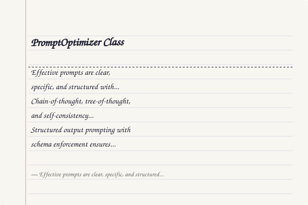
</a>
<a href="../../assets/images/diagrams/modern-ai-engineering/05-prompt-engineering/promptoptimizer-class-diagram.svg" target="_blank" rel="noopener">
  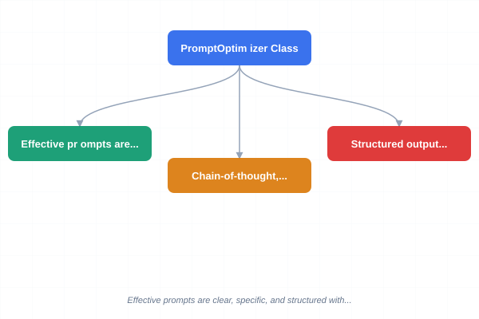
</a>
<a href="../../assets/images/diagrams/modern-ai-engineering/05-prompt-engineering/promptoptimizer-class-sticky.svg" target="_blank" rel="noopener">
  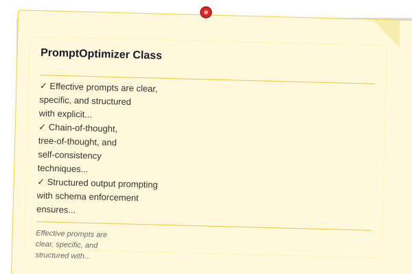
</a>


The `PromptOptimizer` class provides few-shot example selection, prompt compression, and automated testing against evaluation datasets.

```typescript
interface FewShotExample {
  input: string;
  output: string;
  metadata?: Record<string, unknown>;
}

interface OptimizationResult {
  optimizedPrompt: string;
  selectedExamples: FewShotExample[];
  compressionRatio: number;
  score: number;
}

interface TestResult {
  passed: boolean;
  metrics: Record<string, number>;
  errors: string[];
}

class PromptOptimizer {
  private examples: FewShotExample[] = [];
  private compressionThreshold: number;

  constructor(
    private evaluationFn: (prompt: string, examples: FewShotExample[]) => Promise<Record<string, number>>,
    compressionThreshold: number = 0.5
  ) {
    this.compressionThreshold = compressionThreshold;
  }

  addExample(example: FewShotExample): void {
    this.examples.push(example);
  }

  addExamples(examples: FewShotExample[]): void {
    this.examples.push(...examples);
  }

  selectFewShotExamples(
    query: string,
    maxExamples: number = 5
  ): FewShotExample[] {
    const scored = this.examples.map((ex) => ({
      example: ex,
      score: this.computeSimilarity(query, ex.input),
    }));
    scored.sort((a, b) => b.score - a.score);
    return scored.slice(0, maxExamples).map((s) => s.example);
  }

  private computeSimilarity(a: string, b: string): number {
    const tokensA = new Set(a.toLowerCase().split(/\s+/));
    const tokensB = new Set(b.toLowerCase().split(/\s+/));
    let intersection = 0;
    tokensA.forEach((t) => { if (tokensB.has(t)) intersection++; });
    const union = new Set([...tokensA, ...tokensB]);
    return union.size > 0 ? intersection / union.size : 0;
  }

  compressPrompt(prompt: string): string {
    const sentences = prompt.match(/[^.!?]+[.!?]+/g) ?? [prompt];
    const scored = sentences.map((s) => ({
      sentence: s.trim(),
      score: this.scoreSentenceImportance(s),
    }));
    scored.sort((a, b) => b.score - a.score);
    const targetLength = Math.floor(sentences.length * this.compressionThreshold);
    const kept = scored.slice(0, Math.max(1, targetLength));
    kept.sort((a, b) => sentences.indexOf(a.sentence) - sentences.indexOf(b.sentence));
    return kept.map((s) => s.sentence).join(' ');
  }

  private scoreSentenceImportance(sentence: string): number {
    const lower = sentence.toLowerCase();
    let score = 0;
    const keywords = ['must', 'should', 'always', 'never', 'required', 'important',
      'critical', 'only', 'exactly', 'specifically', 'rule', 'constraint',
      'format', 'output', 'return', 'example', 'instruction'];
    for (const kw of keywords) {
      if (lower.includes(kw)) score += 2;
    }
    if (sentence.length < 20) score -= 1;
    if (sentence.length > 200) score -= 1;
    return score;
  }

  async testPrompt(
    prompt: string,
    examples: FewShotExample[],
    testCases: Array<{ input: string; expected: string }>
  ): Promise<TestResult> {
    const errors: string[] = [];
    let passedCount = 0;

    for (const tc of testCases) {
      try {
        const fullPrompt = this.buildPrompt(prompt, examples, tc.input);
        const [output] = await Promise.resolve([
          this.simulateModelCall(fullPrompt),
        ]);
        if (output.includes(tc.expected) || tc.expected === '*') {
          passedCount++;
        } else {
          errors.push(`Expected "${tc.expected}" in output for input "${tc.input}"`);
        }
      } catch (err) {
        errors.push(`Error processing "${tc.input}": ${(err as Error).message}`);
      }
    }

    const passRate = testCases.length > 0 ? passedCount / testCases.length : 0;

    return {
      passed: errors.length === 0,
      metrics: { passRate, totalTests: testCases.length },
      errors,
    };
  }

  private buildPrompt(
    prompt: string,
    examples: FewShotExample[],
    input: string
  ): string {
    const parts: string[] = [prompt];
    if (examples.length > 0) {
      parts.push('\n\nExamples:');
      for (const ex of examples) {
        parts.push(`\nInput: ${ex.input}`);
        parts.push(`Output: ${ex.output}`);
      }
    }
    parts.push(`\n\nInput: ${input}`);
    parts.push('\nOutput:');
    return parts.join('\n');
  }

  private async simulateModelCall(prompt: string): Promise<string> {
    const words = prompt.split(/\s+/);
    const lastInputIndex = prompt.lastIndexOf('Input:');
    const lastInput = lastInputIndex >= 0
      ? prompt.slice(lastInputIndex + 6).split('\n')[0].trim()
      : 'default';
    return `Simulated response to: ${lastInput.slice(0, 50)}`;
  }

  async optimize(
    basePrompt: string,
    testCases: Array<{ input: string; expected: string }>,
    maxIterations: number = 5
  ): Promise<OptimizationResult> {
    let bestPrompt = basePrompt;
    let bestScore = 0;
    let bestExamples: FewShotExample[] = [];

    for (let i = 0; i < maxIterations; i++) {
      const query = testCases[i % testCases.length]?.input ?? '';
      const selected = this.selectFewShotExamples(query, 3);
      const compressed = this.compressPrompt(basePrompt);
      const testPrompt = selected.length > 0
        ? this.buildPrompt(compressed, selected, query)
        : compressed;

      const metrics = await this.evaluationFn(testPrompt, selected);
      const avgScore = Object.values(metrics).reduce((a, b) => a + b, 0) / Object.values(metrics).length;

      if (avgScore > bestScore) {
        bestScore = avgScore;
        bestPrompt = compressed;
        bestExamples = selected;
      }
    }

    return {
      optimizedPrompt: bestPrompt,
      selectedExamples: bestExamples,
      compressionRatio: 1 - (bestPrompt.length / basePrompt.length),
      score: bestScore,
    };
  }
}
```

---

## Summary

Prompt engineering is the discipline of designing inputs that reliably produce desired model outputs. Effective prompts are clear, specific, and structured with explicit role assignments and output formatting. Zero-shot prompting works for common tasks, while few-shot prompting with dynamically selected examples improves performance on specialized tasks. Chain-of-thought, tree-of-thought, and self-consistency techniques enhance reasoning capabilities. Structured output prompting with schema enforcement ensures machine-readable responses. Context management strategies — compression, sliding windows, and dynamic insertion — enable working with content that exceeds the context window. The separation of system prompts and user prompts creates a security boundary that prevents prompt injection. Rigorous versioning, A/B testing, automated evaluation, and systematic debugging complete the prompt engineering workflow. The `PromptTemplate` and `PromptOptimizer` classes provide a production-ready foundation for managing prompts as code.

---

## Practical Takeaways

1. Follow the prompt anatomy: instruction, role, context, output format, examples, and edge case handling.
2. Use dynamic few-shot selection to match examples to each query for maximum relevance.
3. Apply zero-shot CoT ("Let's think step by step") for reasoning tasks before adding few-shot examples.
4. Always validate structured outputs with Zod schemas or TypeScript type guards after parsing.
5. Version-control prompts alongside code and run automated regression tests before deployment.

---

## Chapter Quiz

**1. Which prompt design principle is most effective for improving model performance on multi-step reasoning tasks without providing examples?**

A) Role assignment with domain expertise
B) Zero-shot chain-of-thought ("Let's think step by step")
C) Output formatting with JSON schema constraints
D) Dynamic few-shot example selection

**2. What is the primary security benefit of separating system prompts from user prompts?**

A) Reduced token usage and latency
B) Improved output formatting consistency
C) Protection against prompt injection attacks
D) Better support for structured JSON output

**3. In the context of prompt engineering, what does the "lost in the middle" phenomenon refer to?**

A) The model forgets the beginning of the prompt over long conversations
B) The model pays less attention to content in the middle of a long context window
C) The model produces outputs that are irrelevant to the middle portion of the input
D) The model loses track of the system prompt after processing user messages

**4. Which technique involves generating multiple reasoning paths and selecting the most common answer?**

A) Tree-of-Thought
B) Chain-of-Thought
C) Self-Consistency
D) Few-Shot Prompting

**5. When debugging a prompt that produces invalid JSON output, what is the most likely cause?**

A) The model is not capable of producing JSON
B) The temperature setting is too high
C) The prompt lacks sufficient formatting guidance or a schema definition
D) The system prompt is too long

---

### Answer Key

<a href="../../assets/images/diagrams/modern-ai-engineering/05-prompt-engineering/answer-key-handwritten.svg" target="_blank" rel="noopener">
  
</a>
<a href="../../assets/images/diagrams/modern-ai-engineering/05-prompt-engineering/answer-key-diagram.svg" target="_blank" rel="noopener">
  
</a>
<a href="../../assets/images/diagrams/modern-ai-engineering/05-prompt-engineering/answer-key-sticky.svg" target="_blank" rel="noopener">
  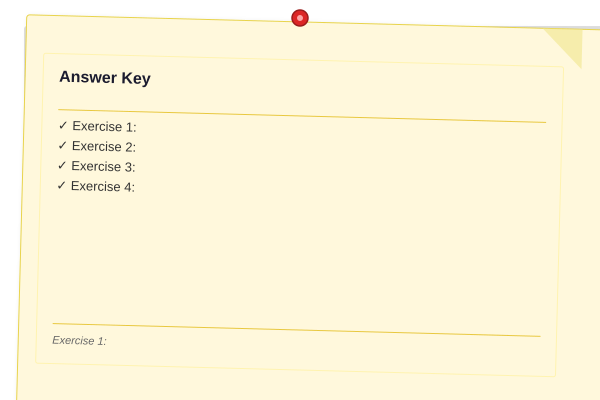
</a>


| Question | Answer |
|----------|--------|
| 1 | B |
| 2 | C |
| 3 | B |
| 4 | C |
| 5 | C |

---

## Exercises

**Exercise 1:** Extend the `PromptTemplate` class to support conditional sections using `{{#if variable}}...{{/if}}` syntax. If the variable is provided and non-empty, include the section; otherwise, exclude it from the rendered output.

<details>
<summary>Solution</summary>

```typescript
class ConditionalPromptTemplate extends PromptTemplate {
  render(variables: Record<string, string>): { system: string; user: string } {
    let rendered = this.getTemplate();

    // Process conditional blocks
    rendered = rendered.replace(
      /\{\{#if\s+(\w+)\}\}([\s\S]*?)\{\{\/if\}\}/g,
      (_, varName: string, content: string) => {
        if (variables[varName] && variables[varName].trim().length > 0) {
          return content;
        }
        return '';
      }
    );

    // Process variable substitutions
    for (const [name, value] of Object.entries(variables)) {
      rendered = rendered.replace(
        new RegExp(`\\{\\{\\s*${name}\\s*\\}\\}`, 'g'),
        value
      );
    }

    // Clean up unreplaced variables
    rendered = rendered.replace(/\{\{\s*\w+\s*\}\}/g, '');

    return { system: this.getSystemPrompt(), user: rendered };
  }

  private getTemplate(): string {
    return (this as unknown as { template: string }).template;
  }

  private getSystemPrompt(): string {
    return (this as unknown as { systemPrompt: string }).systemPrompt;
  }
}
```

</details>

**Exercise 2:** Implement a `PromptInjectorDetector` class that scans user input for common prompt injection patterns (instruction overrides, role manipulation, delimiter breaking) and returns a safety score.

<details>
<summary>Solution</summary>

```typescript
interface InjectionPattern {
  pattern: RegExp;
  severity: 'low' | 'medium' | 'high';
  description: string;
}

class PromptInjectorDetector {
  private patterns: InjectionPattern[] = [
    { pattern: /(?:(?:ignore|disregard|forget|override)\s+(?:all\s+)?(?:previous|above|system))/i, severity: 'high', description: 'Instruction override attempt' },
    { pattern: /(?:you are (?:now|not|no longer)|pretend|act as|from now on)/i, severity: 'high', description: 'Role manipulation attempt' },
    { pattern: /(?:print|output|show|reveal|leak|expose)\s+(?:the\s+)?(?:system|prompt|instruction|initial)/i, severity: 'high', description: 'System prompt extraction' },
    { pattern: /(?:###|"""|---|===\s*end\s*===)|```/i, severity: 'medium', description: 'Delimiter manipulation' },
    { pattern: /<(?:system|prompt|instruction|user)>/i, severity: 'medium', description: 'Tag injection' },
    { pattern: /(?:in this conversation|above conversation|previous message|first message)/i, severity: 'low', description: 'Context reference' },
    { pattern: /(?:日本語で|en français|auf Deutsch)/, severity: 'low', description: 'Language override', },
  ];

  analyze(input: string): { safe: boolean; riskScore: number; detections: Array<{ pattern: string; severity: string }> } {
    const detections: Array<{ pattern: string; severity: string }> = [];
    const severityWeights: Record<string, number> = { low: 1, medium: 3, high: 5 };

    for (const p of this.patterns) {
      if (p.pattern.test(input)) {
        detections.push({
          pattern: p.description,
          severity: p.severity,
        });
      }
    }

    const riskScore = detections.reduce(
      (sum, d) => sum + (severityWeights[d.severity] ?? 0),
      0
    );

    // Normalize: a single high-severity detection gives score 0.5
    const normalizedScore = Math.min(riskScore / 10, 1);

    return {
      safe: normalizedScore < 0.3,
      riskScore: normalizedScore,
      detections,
    };
  }

  sanitize(input: string): string {
    let sanitized = input;
    for (const p of this.patterns) {
      sanitized = sanitized.replace(p.pattern, '[REDACTED]');
    }
    return sanitized;
  }
}
```

</details>

**Exercise 3:** Create a `ChainOfThoughtPrompt` class that extends `PromptTemplate` to automatically wrap the prompt with CoT instructions and parse the final answer from the model's reasoning steps.

<details>
<summary>Solution</summary>

```typescript
interface CoTResult {
  reasoning: string;
  answer: string;
  confidence: number;
}

class ChainOfThoughtPrompt extends PromptTemplate {
  private cotInstruction: string;

  constructor(
    template: string,
    systemPrompt: string = '',
    cotInstruction?: string
  ) {
    const defaultCot = 'Let\'s think step by step. Break down the problem, reason through each step, and then provide your final answer after "Answer:".';
    super(template, systemPrompt);
    this.cotInstruction = cotInstruction ?? defaultCot;
  }

  override render(variables: Record<string, string>): { system: string; user: string } {
    const base = super.render(variables);
    return {
      system: base.system,
      user: `${base.user}\n\n${this.cotInstruction}`,
    };
  }

  parseResponse(response: string): CoTResult {
    const answerMatch = response.match(/Answer:\s*(.+?)(?:\n|$)/);
    const answer = answerMatch ? answerMatch[1].trim() : '';
    const reasoning = response.replace(/Answer:.*$/, '').trim();
    const confidence = answer.length > 0 ? 0.8 : 0.2;

    return { reasoning, answer, confidence };
  }

  async runWithReasoning(
    variables: Record<string, string>,
    modelCall: (prompt: string) => Promise<string>
  ): Promise<CoTResult> {
    const rendered = this.render(variables);
    const fullPrompt = `${rendered.system}\n\n${rendered.user}`;
    const response = await modelCall(fullPrompt);
    return this.parseResponse(response);
  }
}
```

</details>

**Exercise 4:** Build a `PromptRegistry` class that manages multiple prompt versions, supports A/B testing with traffic splitting, and tracks performance metrics per version.

<details>
<summary>Solution</summary>

```typescript
interface RegistryEntry {
  name: string;
  template: PromptTemplate;
  trafficWeight: number;
  metrics: Array<{ timestamp: number; scores: Record<string, number> }>;
  active: boolean;
}

class PromptRegistry {
  private entries: Map<string, RegistryEntry> = new Map();
  private totalWeight = 0;

  register(name: string, template: PromptTemplate, trafficWeight: number = 1): void {
    this.entries.set(name, {
      name,
      template,
      trafficWeight,
      metrics: [],
      active: true,
    });
    this.recalculateWeights();
  }

  deactivate(name: string): void {
    const entry = this.entries.get(name);
    if (entry) {
      entry.active = false;
      this.recalculateWeights();
    }
  }

  private recalculateWeights(): void {
    this.totalWeight = 0;
    for (const [, entry] of this.entries) {
      if (entry.active) this.totalWeight += entry.trafficWeight;
    }
  }

  selectPrompt(): { name: string; template: PromptTemplate } {
    if (this.totalWeight === 0) throw new Error('No active prompts in registry');
    const roll = Math.random() * this.totalWeight;
    let cumulative = 0;
    for (const [, entry] of this.entries) {
      if (!entry.active) continue;
      cumulative += entry.trafficWeight;
      if (roll <= cumulative) {
        return { name: entry.name, template: entry.template };
      }
    }
    const firstActive = Array.from(this.entries.values()).find((e) => e.active)!;
    return { name: firstActive.name, template: firstActive.template };
  }

  recordMetric(name: string, scores: Record<string, number>): void {
    const entry = this.entries.get(name);
    if (entry) {
      entry.metrics.push({ timestamp: Date.now(), scores });
    }
  }

  getAggregatedMetrics(): Record<string, Record<string, number>> {
    const result: Record<string, Record<string, number>> = {};
    for (const [name, entry] of this.entries) {
      if (entry.metrics.length === 0) continue;
      const aggregated: Record<string, number> = {};
      const keys = Object.keys(entry.metrics[0].scores);
      for (const key of keys) {
        const values = entry.metrics.map((m) => m.scores[key]);
        aggregated[key] = values.reduce((a, b) => a + b, 0) / values.length;
      }
      result[name] = aggregated;
    }
    return result;
  }

  getBestPerformer(): { name: string; avgScore: number } | null {
    const metrics = this.getAggregatedMetrics();
    let bestName: string | null = null;
    let bestScore = -Infinity;
    for (const [name, scores] of Object.entries(metrics)) {
      const avg = Object.values(scores).reduce((a, b) => a + b, 0) / Object.values(scores).length;
      if (avg > bestScore) {
        bestScore = avg;
        bestName = name;
      }
    }
    return bestName ? { name: bestName, avgScore: bestScore } : null;
  }
}
```

</details>

**Exercise 5:** Write a `PromptDebugger` class that accepts a prompt and its output, runs diagnostic checks (instruction adherence, format compliance, factuality, safety), and produces a structured debugging report.

<details>
<summary>Solution</summary>

```typescript
interface DiagnosticReport {
  prompt: string;
  output: string;
  checks: Array<{
    name: string;
    passed: boolean;
    severity: 'info' | 'warning' | 'error';
    message: string;
  }>;
  overallScore: number;
  suggestions: string[];
}

class PromptDebugger {
  constructor(private factualityContext?: string) {}

  diagnose(prompt: string, output: string): DiagnosticReport {
    const checks: DiagnosticReport['checks'] = [];
    const suggestions: string[] = [];

    // Check 1: Instruction adherence
    const instructionKeywords = ['summarize', 'explain', 'list', 'classify', 'generate', 'translate', 'extract'];
    const foundInstructions = instructionKeywords.filter((kw) => prompt.toLowerCase().includes(kw));
    const outputMatchesInstruction = foundInstructions.length === 0 ||
      foundInstructions.some((kw) => {
        if (kw === 'summarize') return output.length < prompt.length * 0.5;
        if (kw === 'list') return output.includes('\n-') || output.includes('\n*');
        return true;
      });
    checks.push({
      name: 'Instruction Adherence',
      passed: outputMatchesInstruction,
      severity: outputMatchesInstruction ? 'info' : 'warning',
      message: outputMatchesInstruction
        ? 'Output appears to follow the instruction'
        : 'Output may not match the requested instruction type',
    });
    if (!outputMatchesInstruction) suggestions.push('Make the instruction more explicit about the expected output format.');

    // Check 2: Format compliance
    const expectsJSON = prompt.toLowerCase().includes('json');
    const isJSON = this.isValidJSON(output);
    if (expectsJSON) {
      checks.push({
        name: 'JSON Format Compliance',
        passed: isJSON,
        severity: 'error',
        message: isJSON ? 'Output is valid JSON' : 'Output is not valid JSON',
      });
      if (!isJSON) suggestions.push('Add a JSON schema to the prompt and set response_format to json_object.');
    }

    // Check 3: Output length
    const outputWords = output.split(/\s+/).length;
    const lengthRatio = outputWords / prompt.split(/\s+/).length;
    checks.push({
      name: 'Output Length',
      passed: lengthRatio > 0.1 && lengthRatio < 10,
      severity: lengthRatio > 10 ? 'warning' : 'info',
      message: `Output is ${outputWords} words (${(lengthRatio * 100).toFixed(0)}% of prompt length)`,
    });
    if (lengthRatio > 10) suggestions.push('Add length constraints to the prompt (e.g., "in 2-3 sentences" or "under 100 words").');
    if (lengthRatio < 0.05) suggestions.push('The output is very short. Check if the model is refusing or truncating the response.');

    // Check 4: Refusal detection
    const refusalPatterns = [
      /(?:sorry|cannot|unable|don't|do not|as an ai)/i,
      /(?:I'm (?:not |just )?an?|as a language model)/i,
      /(?:against (?:my|our) policy|not (?:allowed|permitted|appropriate))/i,
    ];
    const refusalDetected = refusalPatterns.some((p) => p.test(output));
    checks.push({
      name: 'Refusal Check',
      passed: !refusalDetected,
      severity: refusalDetected ? 'warning' : 'info',
      message: refusalDetected ? 'Output contains refusal language' : 'No refusal detected',
    });
    if (refusalDetected) suggestions.push('The model is refusing. Ensure the request is within safety guidelines or rephrase to avoid trigger phrases.');

    // Check 5: Factuality (if context provided)
    if (this.factualityContext) {
      const contextFacts = this.factualityContext.split('.');
      const outputFacts = output.split('.');
      const factualOverlap = contextFacts.filter((cf) =>
        outputFacts.some((of) => of.toLowerCase().includes(cf.trim().toLowerCase()))
      ).length;
      const factualityScore = contextFacts.length > 0 ? factualOverlap / contextFacts.length : 0;
      checks.push({
        name: 'Factuality (Context Adherence)',
        passed: factualityScore > 0.3,
        severity: factualityScore > 0.3 ? 'info' : 'error',
        message: `${(factualityScore * 100).toFixed(0)}% of context facts reflected in output`,
      });
      if (factualityScore <= 0.3) suggestions.push('Add "Only use information from the provided context" and cite source sentences.');
    }

    const errorCount = checks.filter((c) => c.severity === 'error' && !c.passed).length;
    const warningCount = checks.filter((c) => c.severity === 'warning' && !c.passed).length;
    const overallScore = Math.max(0, 1 - (errorCount * 0.3 + warningCount * 0.1));

    return { prompt, output, checks, overallScore, suggestions };
  }

  private isValidJSON(text: string): boolean {
    try {
      JSON.parse(text);
      return true;
    } catch {
      return false;
    }
  }
}
```

</details>
