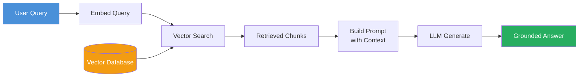
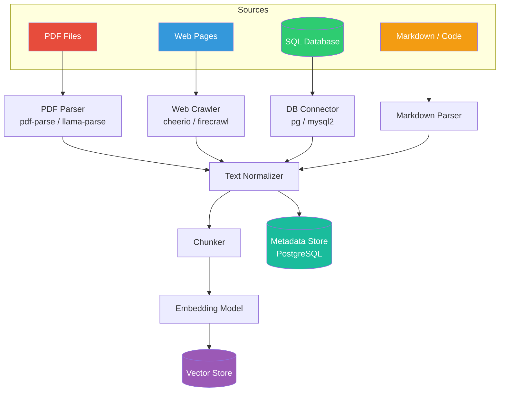
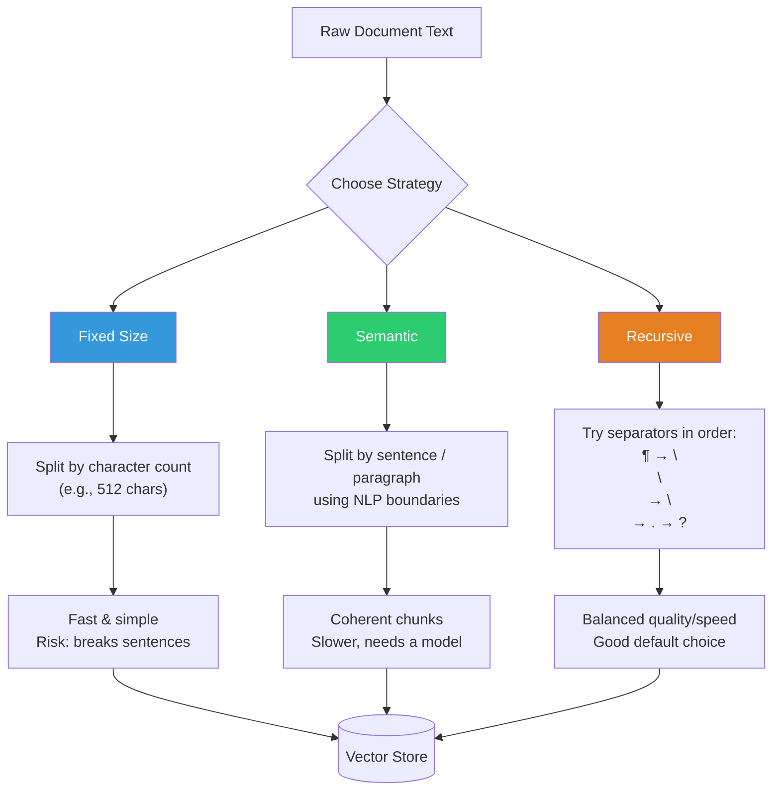
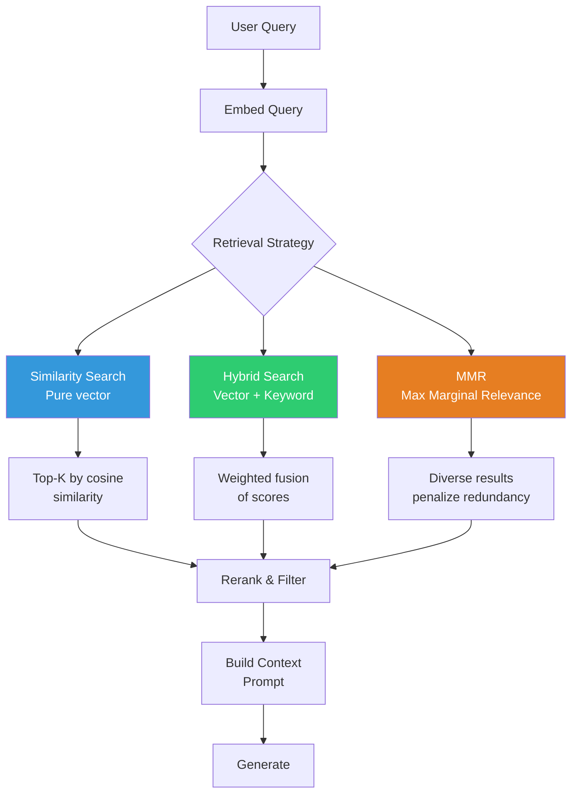

# Chapter 5: RAG with LlamaIndex & Genkit

> **Learning Objectives**
> - Understand the RAG (Retrieval-Augmented Generation) architecture and why it matters
> - Build a complete document ingestion pipeline for PDFs, websites, and databases
> - Compare chunking strategies: fixed-size, semantic, and recursive
> - Evaluate embedding models and vector database options
> - Implement hybrid search with similarity and keyword retrieval
> - Deploy RAG pipelines using Genkit flows integrated with LlamaIndex
> - Measure retrieval quality and optimize results with MMR

---

## 5.1 What Is RAG and Why It Matters

Retrieval-Augmented Generation (RAG) is an architectural pattern that enhances large language model outputs by grounding them in external, retrievable knowledge. Instead of relying solely on the model's parametric memory (which is frozen at training time and can be stale or hallucinated), RAG injects relevant context retrieved from a knowledge base at inference time.

### 5.1.1 The Core Problem RAG Solves

LLMs are stateless knowledge stores. They have three fundamental limitations:

| Limitation | Consequence | RAG Solution |
|---|---|---|
| **Stale knowledge** | Model cutoff date limits information | Retrieve fresh documents at query time |
| **Hallucination** | Models invent facts when uncertain | Ground generation in retrieved evidence |
| **Context window** | Cannot ingest entire corpora | Retrieve only the most relevant snippets |

RAG transforms a raw LLM into a **knowledge-grounded assistant** that can answer questions about your private documents, recent events, or domain-specific data that the model was never trained on.

### 5.1.2 The High-Level RAG Pipeline



The pipeline has two distinct phases:

**Indexing Phase (offline):**
1. Ingest documents from various sources (PDF, web, database)
2. Split documents into chunks
3. Generate embeddings for each chunk
4. Store embeddings + text in a vector database

**Query Phase (online):**
1. Embed the user's question
2. Search the vector database for similar chunks
3. Retrieve top-K chunks as context
4. Build a prompt that combines the query + retrieved context
5. Generate a grounded answer with the LLM

### 5.1.3 Why RAG Wins Over Fine-Tuning

| Aspect | Fine-Tuning | RAG |
|---|---|---|
| **Freshness** | Requires re-training for new data | Add documents instantly |
| **Cost** | Expensive training runs | Pay per query only |
| **Transparency** | Black-box weight updates | Retrieved chunks are inspectable |
| **Scope** | Narrows model to one domain | Broad + specific simultaneously |
| **Maintenance** | Version-track training data | Update document store incrementally |

RAG is the default choice for knowledge-intensive tasks. Fine-tune only when you need the model to adopt a specific *behavior*, not when you need it to know specific *facts*.

---

## 5.2 Document Ingestion Pipeline

Before you can retrieve, you must ingest. A robust ingestion pipeline handles diverse source types, normalizes them into a common format, and prepares them for chunking and embedding.

### 5.2.1 Ingestion Architecture



### 5.2.2 PDF Ingestion with TypeScript

```typescript
import { Document } from 'llamaindex';
import { readFile } from 'fs/promises';

// LlamaIndex TS supports PDF parsing via PDFReader
import { PDFReader } from 'llamaindex/readers';

/**
 * Ingest a PDF file and return LlamaIndex Document objects
 * with metadata preserved.
 */
async function ingestPDF(filePath: string): Promise<Document[]> {
  const reader = new PDFReader();
  
  // Returns an array of Document objects (one per page by default)
  const documents = await reader.loadData(filePath);
  
  // Enrich with metadata
  return documents.map((doc, idx) => {
    doc.metadata = {
      ...doc.metadata,
      source: filePath,
      pageNumber: idx + 1,
      fileType: 'pdf',
      ingestedAt: new Date().toISOString(),
    };
    return doc;
  });
}

// Usage
const docs = await ingestPDF('./data/manual.pdf');
console.log(`Ingested ${docs.length} pages from PDF`);
```

### 5.2.3 Website Ingestion

```typescript
import { Document } from 'llamaindex';
import { CheerioWebBaseReader } from 'llamaindex/readers';

/**
 * Crawl and ingest web pages as LlamaIndex Documents.
 * Extracts main content, title, and metadata.
 */
async function ingestWebsite(url: string): Promise<Document[]> {
  const reader = new CheerioWebBaseReader();
  
  // LoadData accepts a single URL or array of URLs
  const documents = await reader.loadData(url);
  
  return documents.map((doc) => {
    doc.metadata = {
      ...doc.metadata,
      url,
      sourceType: 'web',
      ingestedAt: new Date().toISOString(),
    };
    return doc;
  });
}

// Batch ingest multiple pages
const urls = [
  'https://docs.example.com/getting-started',
  'https://docs.example.com/api-reference',
  'https://docs.example.com/guides',
];

const allDocs: Document[] = [];
for (const url of urls) {
  const docs = await ingestWebsite(url);
  allDocs.push(...docs);
  console.log(`Ingested ${docs.length} docs from ${url}`);
}
```

### 5.2.4 Database Ingestion

```typescript
import { Document } from 'llamaindex';
import pg from 'pg';
const { Pool } = pg;

interface ProductRecord {
  id: number;
  name: string;
  description: string;
  category: string;
}

/**
 * Ingest records from PostgreSQL and convert each row
 * into a LlamaIndex Document.
 */
async function ingestFromDatabase(): Promise<Document[]> {
  const pool = new Pool({
    connectionString: process.env.DATABASE_URL,
  });

  const result = await pool.query<ProductRecord>(
    `SELECT id, name, description, category 
     FROM products 
     WHERE active = true`
  );

  const documents: Document[] = result.rows.map((row) => {
    // Combine relevant fields into the document text
    const text = `Product: ${row.name}\nCategory: ${row.category}\nDescription: ${row.description}`;
    
    return new Document({
      text,
      metadata: {
        source: 'postgresql',
        table: 'products',
        recordId: row.id,
        category: row.category,
        ingestedAt: new Date().toISOString(),
      },
    });
  });

  await pool.end();
  return documents;
}
```

---

## 5.3 Chunking Strategies

Chunking is the art of splitting documents into retrievable pieces. The chunk size directly impacts retrieval quality:

- **Too small**: Chunks lack context; the LLM cannot answer from a fragment.
- **Too large**: Chunks contain noise; similarity search returns irrelevant matches.
- **Poor boundaries**: Mid-sentence splits break meaning.

### 5.3.1 Chunking Strategy Comparison



### 5.3.2 Fixed-Size Chunking

The simplest approach: split text every N characters with optional overlap.

```typescript
/**
 * Fixed-size chunker with configurable overlap.
 * Simple but can split in the middle of sentences.
 */
function fixedSizeChunk(
  text: string,
  chunkSize: number = 512,
  overlap: number = 50
): string[] {
  const chunks: string[] = [];
  let start = 0;

  while (start < text.length) {
    const end = Math.min(start + chunkSize, text.length);
    chunks.push(text.slice(start, end));
    start += chunkSize - overlap;
  }

  return chunks;
}

// Usage
const text = `Long document text...`; // thousands of words
const chunks = fixedSizeChunk(text, 800, 100);
console.log(`Generated ${chunks.length} fixed-size chunks`);
```

**Pros**: Fast, predictable, easy to implement.  
**Cons**: No respect for natural boundaries; chunks may start or end mid-sentence.

### 5.3.3 Semantic Chunking

Semantic chunking uses sentence boundaries and optionally an embedding model to detect topic shifts.

```typescript
/**
 * Semantic chunker: splits on sentence boundaries and merges
 * until a semantic threshold (or max size) is reached.
 */
function semanticChunk(
  text: string,
  maxChunkSize: number = 1024,
  minChunkSize: number = 128
): string[] {
  // Split on sentence boundaries
  const sentences = text.match(/[^.!?]+[.!?]+/g) || [text];
  const chunks: string[] = [];
  let currentChunk = '';

  for (const sentence of sentences) {
    const trimmed = sentence.trim();
    
    // If adding this sentence exceeds max, start a new chunk
    if (currentChunk.length + trimmed.length > maxChunkSize && currentChunk.length >= minChunkSize) {
      chunks.push(currentChunk.trim());
      currentChunk = trimmed;
    } else {
      currentChunk += ' ' + trimmed;
    }
  }

  // Flush remaining text
  if (currentChunk.trim().length > 0) {
    chunks.push(currentChunk.trim());
  }

  return chunks;
}
```

**Pros**: Respects natural language boundaries; coherent chunks.  
**Cons**: Slower; topic-shift detection requires embeddings for best results.

### 5.3.4 Recursive Chunking (LlamaIndex Default)

LlamaIndex's `RecursiveCharacterTextSplitter` tries separators in order of priority, falling back to smaller separators when a chunk exceeds the limit.

```typescript
import { RecursiveCharacterTextSplitter } from 'llamaindex';

/**
 * Recursive chunking — the recommended default strategy.
 * Tries to split on paragraphs, then double newlines,
 * then single newlines, then sentences, then characters.
 */
async function recursiveChunk(documents: Document[]): Promise<Document[]> {
  const splitter = new RecursiveCharacterTextSplitter({
    chunkSize: 1024,       // Target chunk size in characters
    chunkOverlap: 200,      // Overlap between chunks for context continuity
    separators: ['\n\n', '\n', '.', '!', '?', ' ', ''],  // Priority order
  });

  const chunks = await splitter.splitDocuments(documents);
  return chunks;
}

// Usage
const rawDocs = await ingestPDF('./data/manual.pdf');
const chunkedDocs = await recursiveChunk(rawDocs);
console.log(`Split ${rawDocs.length} documents into ${chunkedDocs.length} chunks`);
```

**Pros**: Best balance of quality and speed; handles mixed content well.  
**Cons**: Slightly more complex than fixed-size.

---

## 5.4 Embedding Models Comparison

Embeddings are dense vector representations of text that capture semantic meaning. Choosing the right embedding model is one of the most impactful decisions in your RAG system.

### 5.4.1 Popular Embedding Models

| Model | Dimensions | Max Tokens | Cost | Best For |
|---|---|---|---|---|
| `text-embedding-3-small` | 1536 | 8191 | $0.02/1M tokens | General purpose, cost-sensitive |
| `text-embedding-3-large` | 3072 | 8191 | $0.13/1M tokens | Accuracy-critical apps |
| `text-embedding-ada-002` | 1536 | 8191 | $0.10/1M tokens | Legacy (deprecating) |
| `BAAI/bge-small-en-v1.5` | 384 | 512 | Free (local) | Edge / low-resource |
| `BAAI/bge-large-en-v1.5` | 1024 | 512 | Free (local) | On-premise, privacy |
| `intfloat/multilingual-e5-large` | 1024 | 512 | Free (local) | Multi-language |
| `cohere-embed-v3` | 1024 | 512 | $0.10/1K units | Enterprise with Cohere stack |

### 5.4.2 Using Embeddings with LlamaIndex

```typescript
import { OpenAIEmbedding } from 'llamaindex';
// For local models, you would use:
// import { HuggingFaceEmbedding } from 'llamaindex';

/**
 * Configure an embedding model in LlamaIndex.
 * The embedding model is used for both indexing and querying.
 */
async function configureEmbeddings() {
  // OpenAI embeddings (cloud)
  const openAIEmbed = new OpenAIEmbedding({
    model: 'text-embedding-3-small',
    dimensions: 1536,          // Can reduce dimensions for cost/speed
    apiKey: process.env.OPENAI_API_KEY,
  });

  // For local/small models (requires local inference setup):
  // const localEmbed = new HuggingFaceEmbedding({
  //   model: 'BAAI/bge-small-en-v1.5',
  // });

  // Generate a single embedding
  const embedding = await openAIEmbed.getTextEmbedding(
    'What is Retrieval-Augmented Generation?'
  );
  console.log(`Embedding dimension: ${embedding.length}`);
  console.log(`First 5 values: ${embedding.slice(0, 5)}`);

  return openAIEmbed;
}
```

### 5.4.3 Dimension Reduction Trade-Offs

OpenAI's `text-embedding-3-small` supports reducing dimensions via the `dimensions` parameter. This is a performance optimization:

```typescript
/**
 * Compare full vs reduced dimensions for cost and accuracy.
 * Reduced dimensions = cheaper storage + faster search.
 */
async function compareDimensions(): Promise<void> {
  const full = new OpenAIEmbedding({ model: 'text-embedding-3-small', dimensions: 1536 });
  const reduced = new OpenAIEmbedding({ model: 'text-embedding-3-small', dimensions: 256 });

  const text = 'RAG architecture with LlamaIndex';
  const embFull = await full.getTextEmbedding(text);
  const embReduced = await reduced.getTextEmbedding(text);

  console.log(`Full embedding size: ${embFull.length} floats`);
  console.log(`Reduced embedding size: ${embReduced.length} floats`);
  console.log(`Storage savings: ${((1 - 256 / 1536) * 100).toFixed(0)}%`);
}

// Rule of thumb:
// 256 dims: Good for classification, rough similarity
// 512 dims: Good balance for most RAG apps
// 1024-1536: Best accuracy, use with large documents
```

---

## 5.5 Vector Databases: pgvector vs Qdrant vs Pinecone

The vector database stores embeddings and provides fast approximate nearest neighbor (ANN) search.

### 5.5.1 Comparison Matrix

| Feature | pgvector | Qdrant | Pinecone |
|---|---|---|---|
| **Hosting** | Self-hosted (PostgreSQL) | Self-hosted or Cloud | Fully managed |
| **Pricing** | Free (uses existing PG) | Free tier: 1GB | Free tier: 100K vectors |
| **Index Type** | IVFFlat, HNSW | HNSW | Proprietary |
| **Filtering** | SQL WHERE clauses | Payload filters + indexes | Metadata filters |
| **Hybrid Search** | Combine with `tsvector` | Built-in sparse-dense | Via sparse-dense |
| **Multi-tenancy** | Row-level security | Collections per tenant | Namespaces |
| **Latency** | 10-50ms | 5-20ms | 5-15ms |

### 5.5.2 pgvector Setup and Usage

```typescript
import pg from 'pg';
const { Pool } = pg;

/**
 * pgvector: vector extension for PostgreSQL.
 * Hybrid search combines embeddings with keyword (tsvector) matching.
 */
async function setupPGVector(): Promise<void> {
  const pool = new Pool({ connectionString: process.env.DATABASE_URL });

  // Enable the extension
  await pool.query('CREATE EXTENSION IF NOT EXISTS vector');

  // Create a table with a vector column
  await pool.query(`
    CREATE TABLE IF NOT EXISTS document_chunks (
      id SERIAL PRIMARY KEY,
      text TEXT NOT NULL,
      metadata JSONB DEFAULT '{}',
      embedding VECTOR(1536),                -- matches embedding dimension
      text_search TSVECTOR                   -- for hybrid keyword search
    )
  `);

  // Create indexes
  await pool.query(`
    CREATE INDEX IF NOT EXISTS idx_chunks_embedding 
    ON document_chunks 
    USING ivfflat (embedding vector_cosine_ops)
    WITH (lists = 100)
  `);

  await pool.query(`
    CREATE INDEX IF NOT EXISTS idx_chunks_tsv 
    ON document_chunks 
    USING gin (text_search)
  `);

  console.log('pgvector schema and indexes created');
  await pool.end();
}
```

### 5.5.3 Hybrid Search with pgvector

```typescript
interface SearchResult {
  id: number;
  text: string;
  metadata: Record<string, unknown>;
  similarity: number;
}

/**
 * Hybrid search: combine vector similarity with keyword matching.
 * Uses a weighted sum of cosine distance and tsvector rank.
 */
async function hybridSearch(
  queryText: string,
  queryEmbedding: number[],
  options: {
    topK?: number;
    vectorWeight?: number;
    keywordWeight?: number;
  } = {}
): Promise<SearchResult[]> {
  const pool = new Pool({ connectionString: process.env.DATABASE_URL });
  const topK = options.topK ?? 10;
  const vectorWeight = options.vectorWeight ?? 0.7;
  const keywordWeight = options.keywordWeight ?? 0.3;

  const query = `
    SELECT 
      id,
      text,
      metadata,
      -- Combined score: normalized vector similarity + keyword rank
      (${vectorWeight} * (1 - (embedding <=> $1::vector)) +
       ${keywordWeight} * ts_rank(text_search, plainto_tsquery('english', $2))) 
      AS similarity
    FROM document_chunks
    WHERE 
      -- Vector similarity threshold (optional speed-up)
      1 - (embedding <=> $1::vector) > 0.5
      OR text_search @@ plainto_tsquery('english', $2)
    ORDER BY similarity DESC
    LIMIT $3
  `;

  const result = await pool.query(query, [
    JSON.stringify(queryEmbedding),
    queryText,
    topK,
  ]);

  await pool.end();
  return result.rows;
}

// Usage
async function exampleHybridSearch() {
  const embedModel = new OpenAIEmbedding({ model: 'text-embedding-3-small' });
  const query = 'How do I install the CLI tool?';
  const embedding = await embedModel.getTextEmbedding(query);

  const results = await hybridSearch(query, embedding, {
    topK: 5,
    vectorWeight: 0.6,
    keywordWeight: 0.4,
  });

  console.log(`Found ${results.length} results`);
  for (const r of results) {
    console.log(`Score: ${r.similarity.toFixed(3)} | ${r.text.slice(0, 80)}...`);
  }
}
```

### 5.5.4 Qdrant Client Setup

```typescript
import { QdrantClient } from '@qdrant/js-client-rest';

/**
 * Qdrant vector database setup with collection creation
 * and point insertion.
 */
async function setupQdrant() {
  const client = new QdrantClient({
    url: process.env.QDRANT_URL || 'http://localhost:6333',
    apiKey: process.env.QDRANT_API_KEY,
  });

  // Create a collection
  const collectionName = 'document_chunks';
  const collections = await client.getCollections();
  const exists = collections.collections.some(c => c.name === collectionName);

  if (!exists) {
    await client.createCollection(collectionName, {
      vectors: {
        size: 1536,          // Must match embedding dimension
        distance: 'Cosine',  // Distance metric
      },
      optimizers_config: {
        default_segment_number: 2,
      },
      replication_factor: 2,
    });
    console.log(`Collection '${collectionName}' created`);
  }

  // Insert points (chunks)
  await client.upsert(collectionName, {
    wait: true,
    points: [
      {
        id: 1,
        vector: Array(1536).fill(0).map(() => Math.random()), // real embedding
        payload: {
          text: 'This is a document chunk about RAG.',
          source: 'manual.pdf',
          page: 5,
        },
      },
    ],
  });

  // Search
  const searchResults = await client.search(collectionName, {
    vector: Array(1536).fill(0).map(() => Math.random()),
    limit: 10,
    with_payload: true,
  });

  return searchResults;
}
```

### 5.5.5 Pinecone Client Setup

```typescript
import { Pinecone } from '@pinecone-database/pinecone';

/**
 * Pinecone serverless vector database setup.
 */
async function setupPinecone() {
  const pc = new Pinecone({
    apiKey: process.env.PINECONE_API_KEY!,
  });

  // Create serverless index
  const indexName = 'rag-docs';
  const existingIndexes = await pc.listIndexes();

  if (!existingIndexes.indexes?.some(i => i.name === indexName)) {
    await pc.createIndex({
      name: indexName,
      dimension: 1536,
      metric: 'cosine',
      spec: {
        serverless: {
          cloud: 'aws',
          region: 'us-east-1',
        },
      },
    });
    console.log(`Index '${indexName}' created`);
  }

  const index = pc.index(indexName);

  // Upsert vectors
  await index.namespace('docs').upsert([
    {
      id: 'chunk-001',
      values: Array(1536).fill(0).map(() => Math.random()),
      metadata: { text: 'RAG combines retrieval and generation.', page: 3 },
    },
  ]);

  // Query
  const queryResponse = await index.namespace('docs').query({
    topK: 10,
    vector: Array(1536).fill(0).map(() => Math.random()),
    includeMetadata: true,
  });

  return queryResponse.matches;
}
```

---

## 5.6 Retrieval Strategies

How you retrieve chunks is as important as how you indexed them.

### 5.6.1 Retrieval Flow



### 5.6.2 Similarity Search (Pure Vector)

```typescript
import { VectorStoreIndex } from 'llamaindex';

/**
 * Pure vector similarity search using LlamaIndex.
 */
async function similaritySearch(index: VectorStoreIndex, query: string) {
  const retriever = index.asRetriever({
    similarityTopK: 5,    // Return top 5 chunks
  });

  const results = await retriever.retrieve(query);

  for (const result of results) {
    console.log(`Score: ${result.score?.toFixed(4)}`);
    console.log(`Text: ${result.node.text.slice(0, 100)}...`);
    console.log('---');
  }

  return results;
}
```

### 5.6.3 Maximum Marginal Relevance (MMR)

MMR trades raw similarity for diversity. It penalizes chunks that are too similar to each other, ensuring the retrieved set covers multiple aspects of the query.

```typescript
import { VectorStoreIndex } from 'llamaindex';

/**
 * MMR retrieval: balances relevance with diversity.
 * - lambda=1: pure similarity (no diversity)
 * - lambda=0.5: balanced (default)
 * - lambda=0: maximum diversity (may lose relevance)
 */
async function mmrSearch(index: VectorStoreIndex, query: string) {
  const retriever = index.asRetriever({
    similarityTopK: 10,    // Candidate pool
    mmr: {
      lambda: 0.5,         // 0 = max diversity, 1 = max similarity
      k: 5,                // Final number of results
    },
  });

  const results = await retriever.retrieve(query);

  console.log(`MMR returned ${results.length} diverse results`);
  for (const r of results) {
    console.log(`Score: ${r.score?.toFixed(4)} | ${r.node.text.slice(0, 60)}...`);
  }
}
```

### 5.6.4 Hybrid Search with LlamaIndex

LlamaIndex supports hybrid retrieval combining vector search with keyword (BM25) retrieval:

```typescript
import { VectorStoreIndex, KeywordExtractor } from 'llamaindex';

/**
 * Hybrid retriever: merge vector + keyword results.
 * Uses reciprocal rank fusion (RRF) to combine scores.
 */
async function hybridRetriever(index: VectorStoreIndex, query: string) {
  // Vector retriever
  const vectorRetriever = index.asRetriever({
    similarityTopK: 10,
  });

  // Keyword retriever (BM25-style)
  const keywordRetriever = index.asRetriever({
    // Most vector stores support both modes
    mode: 'keyword',
    topK: 10,
  });

  const vectorResults = await vectorRetriever.retrieve(query);
  const keywordResults = await keywordRetriever.retrieve(query);

  // Reciprocal Rank Fusion
  const fused = fuseResults(vectorResults, keywordResults, {
    k: 60,                 // RRF constant (typical: 60)
    topK: 10,
  });

  return fused;
}

interface RetrievalResult {
  node: { text: string; metadata: Record<string, unknown> };
  score?: number;
}

function fuseResults(
  vector: RetrievalResult[],
  keyword: RetrievalResult[],
  options: { k: number; topK: number }
): RetrievalResult[] {
  const scores = new Map<string, { result: RetrievalResult; score: number }>();

  // Score vector results: rank / (k + rank)
  vector.forEach((r, i) => {
    const key = r.node.text.slice(0, 100); // simple dedup key
    const existing = scores.get(key);
    const rrfScore = 1 / (options.k + i + 1);
    scores.set(key, {
      result: r,
      score: (existing?.score ?? 0) + rrfScore,
    });
  });

  // Score keyword results
  keyword.forEach((r, i) => {
    const key = r.node.text.slice(0, 100);
    const existing = scores.get(key);
    const rrfScore = 1 / (options.k + i + 1);
    scores.set(key, {
      result: r,
      score: (existing?.score ?? 0) + rrfScore,
    });
  });

  // Sort by fused score and take topK
  return Array.from(scores.values())
    .sort((a, b) => b.score - a.score)
    .slice(0, options.topK)
    .map(s => ({
      ...s.result,
      score: s.score,
    }));
}
```

---

## 5.7 Full RAG Pipeline with LlamaIndex + Genkit

Now we combine everything into a production-ready RAG pipeline using Genkit flows for orchestration and LlamaIndex for indexing/retrieval.

### 5.7.1 Pipeline Overview

```mermaid
flowchart LR
    subgraph Indexing
        A[Documents] --> B[LlamaIndex<br/>Recursive Chunker]
        B --> C[OpenAI<br/>Embedding]
        C --> D[(pgvector)]
    end
    
    subgraph Query
        E[User Query] --> F[Genkit Flow]
        F --> G[Embed Query]
        G --> H[LlamaIndex<br/>Retriever]
        H --> I[Context + Prompt]
        I --> J[Genkit<br/>generate()]
        J --> K[Answer]
    end
    
    D --> H
    
    style A fill:#e74c3c,color:#fff
    style K fill:#27ae60,color:#fff
    style F fill:#9b59b6,color:#fff
    style J fill:#3498db,color:#fff
```

### 5.7.2 Complete RAG Implementation

```typescript
import { genkit, z } from 'genkit';
import { openAI, gpt4o, textEmbedding3Small } from 'genkitx-openai';
import { Document, VectorStoreIndex, pgvectorStore } from 'llamaindex';

// ─── Genkit Configuration ───────────────────────────────────────

const ai = genkit({
  plugins: [openAI({ apiKey: process.env.OPENAI_API_KEY })],
  model: gpt4o,
});

// ─── Define the RAG Flow ────────────────────────────────────────

const ragQuerySchema = z.object({
  query: z.string().describe('The user question to answer'),
  topK: z.number().optional().default(5).describe('Number of chunks to retrieve'),
});

const ragResponseSchema = z.object({
  answer: z.string(),
  sources: z.array(z.object({
    text: z.string(),
    source: z.string(),
    score: z.number(),
  })),
  tokensUsed: z.number(),
});

const ragFlow = ai.defineFlow(
  {
    name: 'ragQuery',
    inputSchema: ragQuerySchema,
    outputSchema: ragResponseSchema,
  },
  async (input) => {
    const { query, topK } = input;

    // ── Step 1: Embed query ─────────────────────────────────
    const embedder = textEmbedding3Small;
    const queryEmbedding = await ai.embed({
      embedder,
      content: query,
    });

    // ── Step 2: Retrieve from vector store ──────────────────
    const store = await pgvectorStore({
      connectionString: process.env.DATABASE_URL!,
      tableName: 'document_chunks',
      dimension: 1536,
    });

    const index = await VectorStoreIndex.fromVectorStore(store);
    const retriever = index.asRetriever({ similarityTopK: topK });
    const retrievedNodes = await retriever.retrieve(query);

    // ── Step 3: Build context ───────────────────────────────
    const sources = retrievedNodes.map((n) => ({
      text: n.node.text,
      source: n.node.metadata?.source as string || 'unknown',
      score: n.score ?? 0,
    }));

    const context = sources.map((s) => s.text).join('\n\n---\n\n');

    // ── Step 4: Generate answer ─────────────────────────────
    const prompt = `
You are a helpful technical assistant. Answer the question based ONLY on the provided context.
If the context does not contain enough information, say so.

Context:
${context}

Question: ${query}

Answer:
`.trim();

    const response = await ai.generate({
      prompt,
      model: gpt4o,
      config: {
        temperature: 0.3,  // Low temperature for factual answers
        maxOutputTokens: 1024,
      },
    });

    // ── Step 5: Return structured result ────────────────────
    return {
      answer: response.text,
      sources,
      tokensUsed: response.usage?.totalTokens ?? 0,
    };
  }
);

// ── Execute the RAG flow ────────────────────────────────────────

async function main() {
  const result = await ragFlow({
    query: 'How do I configure the authentication middleware?',
    topK: 5,
  });

  console.log('\n=== ANSWER ===');
  console.log(result.answer);

  console.log('\n=== SOURCES ===');
  for (const s of result.sources) {
    console.log(`[${s.score.toFixed(3)}] ${s.source}: ${s.text.slice(0, 60)}...`);
  }

  console.log(`\nTokens used: ${result.tokensUsed}`);
}

main().catch(console.error);
```

### 5.7.3 Indexing Flow with Genkit

```typescript
/**
 * Document indexing flow.
 * Takes file paths / URLs and indexes them into the vector store.
 */
const indexingFlow = ai.defineFlow(
  {
    name: 'indexDocuments',
    inputSchema: z.object({
      sources: z.array(z.object({
        type: z.enum(['pdf', 'web', 'text']),
        path: z.string(),
      })),
    }),
  },
  async (input) => {
    const allDocs: Document[] = [];

    for (const source of input.sources) {
      switch (source.type) {
        case 'pdf': {
          const { PDFReader } = await import('llamaindex/readers');
          const reader = new PDFReader();
          const docs = await reader.loadData(source.path);
          docs.forEach(d => {
            d.metadata = { ...d.metadata, source: source.path, type: 'pdf' };
          });
          allDocs.push(...docs);
          break;
        }
        case 'web': {
          const { CheerioWebBaseReader } = await import('llamaindex/readers');
          const reader = new CheerioWebBaseReader();
          const docs = await reader.loadData(source.path);
          docs.forEach(d => {
            d.metadata = { ...d.metadata, source: source.path, type: 'web' };
          });
          allDocs.push(...docs);
          break;
        }
        case 'text': {
          const text = await import('fs/promises').then(fs => fs.readFile(source.path, 'utf-8'));
          const doc = new Document({ text, metadata: { source: source.path, type: 'text' } });
          allDocs.push(doc);
          break;
        }
      }
    }

    // Chunk documents
    const { RecursiveCharacterTextSplitter } = await import('llamaindex');
    const splitter = new RecursiveCharacterTextSplitter({
      chunkSize: 1024,
      chunkOverlap: 200,
    });
    const chunks = await splitter.splitDocuments(allDocs);

    // Index into vector store
    const store = await pgvectorStore({
      connectionString: process.env.DATABASE_URL!,
      tableName: 'document_chunks',
      dimension: 1536,
    });

    await VectorStoreIndex.fromDocuments(chunks, {
      vectorStore: store,
    });

    return {
      indexed: chunks.length,
      sources: input.sources.map(s => s.path),
    };
  }
);
```

### 5.7.4 Streaming RAG Responses

For a better user experience, stream the generated answer token by token:

```typescript
const streamingRagFlow = ai.defineFlow(
  {
    name: 'streamingRag',
    inputSchema: z.object({ query: z.string() }),
    outputSchema: z.object({
      answer: z.string(),
      sources: z.array(z.object({ text: z.string(), source: z.string() })),
    }),
  },
  async (input) => {
    const store = await pgvectorStore({
      connectionString: process.env.DATABASE_URL!,
      tableName: 'document_chunks',
      dimension: 1536,
    });

    const index = await VectorStoreIndex.fromVectorStore(store);
    const retriever = index.asRetriever({ similarityTopK: 5 });
    const nodes = await retriever.retrieve(input.query);

    const sources = nodes.map(n => ({
      text: n.node.text,
      source: n.node.metadata?.source as string || 'unknown',
    }));

    const context = sources.map(s => s.text).join('\n\n');

    const prompt = `Answer based on context:\n\n${context}\n\nQuestion: ${input.query}`;

    // Stream the response
    const stream = await ai.generateStream({
      prompt,
      model: gpt4o,
      config: { temperature: 0.3 },
    });

    let fullAnswer = '';
    for await (const chunk of stream.stream) {
      process.stdout.write(chunk.text); // or send to WebSocket/SSE
      fullAnswer += chunk.text;
    }

    return { answer: fullAnswer, sources };
  }
);
```

---

## 5.8 Evaluating RAG Quality

### 5.8.1 Key Metrics

| Metric | What It Measures | How to Improve |
|---|---|---|
| **Hit Rate** | % of queries where relevant chunk is in top-K | Increase K, improve chunking |
| **MRR** | Mean Reciprocal Rank of first relevant chunk | Rerank results |
| **NDCG** | Normalized Discounted Cumulative Gain | Tune embedding model |
| **Faithfulness** | % of claims supported by retrieved chunks | Lower LLM temperature |
| **Answer Relevance** | Does the answer address the query? | Improve prompt template |

### 5.8.2 Simple Evaluation Harness

```typescript
interface EvalExample {
  query: string;
  expectedAnswer: string;
  relevantChunkIds: string[];
}

async function evaluateRAG(flow: typeof ragFlow, examples: EvalExample[]) {
  let hits = 0;
  let totalReciprocalRank = 0;

  for (const example of examples) {
    const result = await flow({ query: example.query, topK: 5 });

    // Check if any relevant chunk was retrieved
    const retrievedIds = result.sources.map(s => s.source);
    const hit = example.relevantChunkIds.some(id => retrievedIds.includes(id));
    
    if (hit) {
      hits++;
      // Find first relevant rank
      const firstRank = retrievedIds.findIndex(id =>
        example.relevantChunkIds.includes(id)
      );
      totalReciprocalRank += 1 / (firstRank + 1);
    }
  }

  const hitRate = hits / examples.length;
  const mrr = totalReciprocalRank / examples.length;

  console.log(`Hit Rate: ${(hitRate * 100).toFixed(1)}%`);
  console.log(`MRR: ${mrr.toFixed(3)}`);

  return { hitRate, mrr };
}
```

---

## Chapter Summary

- **RAG** grounds LLM responses in external knowledge, reducing hallucination and enabling fresh/custom data.
- **Ingestion pipelines** normalize documents from PDF, web, and database sources into a common format.
- **Chunking strategies** range from fixed-size (fast) to semantic (coherent) to recursive (balanced default).
- **Embedding models** convert text to vectors; choose dimension size based on accuracy vs. cost trade-offs.
- **Vector databases** (pgvector, Qdrant, Pinecone) store and search embeddings with sub-50ms latency.
- **Retrieval strategies** include pure similarity, hybrid (vector + keyword), and MMR for diversity.
- **Genkit flows** orchestrate the RAG pipeline: embed, retrieve, build context, generate.
- **Evaluation** measures hit rate, MRR, and faithfulness to ensure quality.

### Practical Takeaways

1. Start with **recursive chunking** (1024 chars, 200 overlap) for most document types.
2. Use **pgvector** if you already have PostgreSQL; use **Qdrant/Pinecone** for managed vector search.
3. Prefer **hybrid search** (vector + keyword) for queries with named entities or exact terms.
4. Set LLM **temperature to 0.2–0.3** for factual RAG to reduce hallucination.
5. Always include **source citations** in RAG responses for user trust and debugging.

---

## Chapter Quiz (10 MCQs)

**1. What is the primary purpose of RAG?**
- A) To fine-tune an LLM on new data
- B) To ground LLM responses in retrievable external knowledge
- C) To reduce the model's context window size
- D) To replace vector databases

**2. Which chunking strategy is recommended as the default in LlamaIndex?**
- A) Fixed-size chunking
- B) Semantic chunking with NLP boundaries
- C) Recursive character text splitting
- D) Random chunking

**3. What does MMR (Maximum Marginal Relevance) add to retrieval?**
- A) Faster search by reducing dimensions
- B) Diversity by penalizing redundant chunks
- C) Higher similarity by re-ranking candidates
- D) Keyword matching alongside vectors

**4. Which pgvector index type is best for high-accuracy vector search?**
- A) B-tree
- B) IVFFlat
- C) HNSW
- D) GiST

**5. What is hybrid search?**
- A) Searching two vector databases simultaneously
- B) Combining vector similarity with keyword (BM25/tsvector) search
- C) Using two different embedding models
- D) Searching across PDF and web sources

**6. A chunk size that is too small leads to:**
- A) Faster retrieval but less accurate embeddings
- B) Chunks lacking context for the LLM to answer
- C) Excessive memory usage
- D) Higher embedding costs

**7. What is the main benefit of reducing embedding dimensions (e.g., 1536 → 256)?**
- A) Higher accuracy
- B) Lower storage cost and faster search
- C) Better support for multi-language queries
- D) Eliminates the need for chunking

**8. In Genkit flows for RAG, what is the recommended temperature for factual answers?**
- A) 0.8–1.0
- B) 0.5–0.7
- C) 0.2–0.3
- D) 2.0

**9. What does MRR (Mean Reciprocal Rank) measure in RAG evaluation?**
- A) Total number of tokens used
- B) The rank of the first relevant result
- C) Response time in milliseconds
- D) Diversity of retrieved chunks

**10. Which of these is NOT a valid document source for the ingestion pipeline described?**
- A) PDF files
- B) Web pages
- C) SQL databases
- D) Compiled binary executables

<details>
<summary>Answer Key</summary>

1. B, 2. C, 3. B, 4. C, 5. B, 6. B, 7. B, 8. C, 9. B, 10. D
</details>

---

## Exercises

### Exercise 1: Build a PDF Ingestion Pipeline
Create a Genkit flow that accepts a PDF file path, ingests it using LlamaIndex's `PDFReader`, chunks it recursively, and stores the embeddings in a pgvector table. Include metadata for source filename and page number.

### Exercise 2: Implement Hybrid Search with Configurable Weights
Extend the `hybridSearch` function to accept a `vectorWeight` parameter (0–1) that controls the balance between vector similarity and keyword ranking. Test with weights [0.2, 0.5, 0.8] on a sample query and report which performs best.

### Exercise 3: MMR Reranking Evaluator
Write a function that compares pure similarity search vs. MMR search on the same query. For each result set, compute:
- Average similarity score
- Text diversity (average pairwise cosine distance between result embeddings)
Generate a report showing the trade-off.

### Exercise 4: Multi-Source Ingestion with Deduplication
Build a pipeline that ingests the same content from two sources (e.g., a PDF and a web page). Implement a deduplication step using embedding similarity to skip chunks that already exist in the vector store. Report how many chunks were skipped.

### Exercise 5: Streaming RAG Chat Interface
Create a Genkit flow that supports multi-turn conversation with RAG. Each turn:
1. Retrieves relevant chunks (from the full conversation context)
2. Streams the answer
3. Stores the conversation history in memory (use Genkit's built-in `history` or a simple list)
The flow should accept `{ messages: [{role, content}], query: string }`.

---

> **Next Chapter**: Chapter 6 — Memory Systems for AI Applications, where we explore conversation, long-term, and semantic memory patterns.
