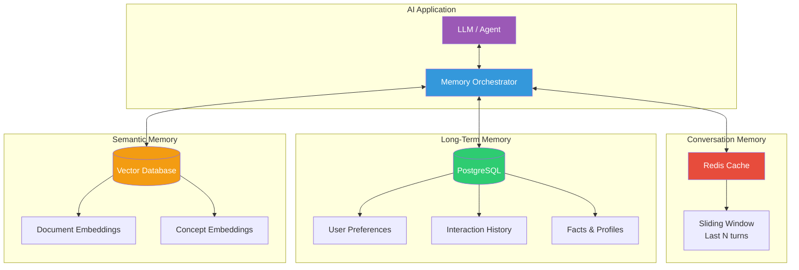
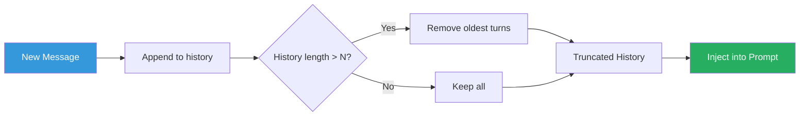
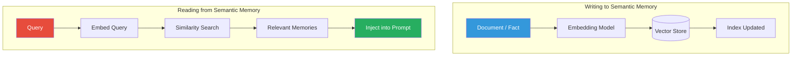
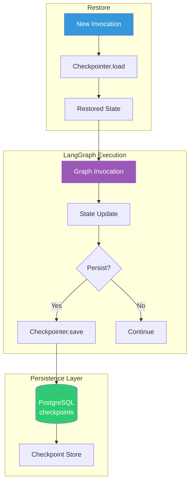
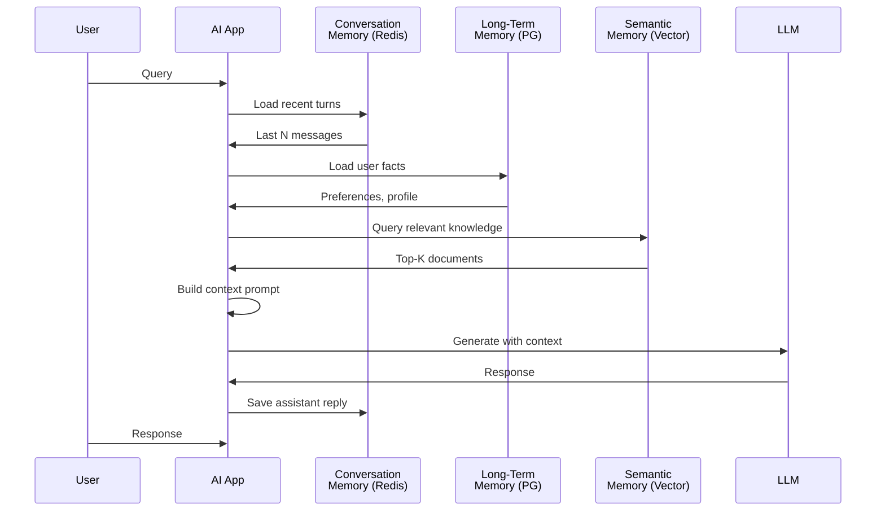

# Chapter 6: Memory Systems for AI Applications

> **Learning Objectives**
> - Understand the three memory types: conversation, long-term, and semantic
> - Implement conversation memory with Redis-based sliding windows
> - Build long-term user preference stores with PostgreSQL
> - Design semantic memory using vector databases for document recall
> - Apply Genkit memory patterns for stateful AI flows
> - Use LangGraph persistence with checkpointer for agent state
> - Combine memory types into a cohesive hybrid memory system

---

## 6.1 The Three Types of Memory

AI applications require memory to move beyond stateless single-turn interactions. A production AI system needs three distinct memory systems, mirroring human memory:

| Memory Type | Human Analogy | Storage | Duration | Purpose |
|---|---|---|---|---|
| **Conversation** | Short-term / working memory | Redis (fast, ephemeral) | Minutes–hours | Track current dialogue turns |
| **Long-term** | Episodic memory | PostgreSQL (durable) | Days–years | User preferences, facts, history |
| **Semantic** | Knowledge / semantic memory | Vector DB (qdrant/pgvector) | Permanent | Documents, concepts, knowledge base |

### 6.1.1 Memory Architecture Overview



### 6.1.2 When to Use Each Memory Type

| Scenario | Memory Needed |
|---|---|
| "What was my last question?" | Conversation (Redis) |
| "Remember my name is Alice." | Long-term (PostgreSQL) |
| "Summarize the quarterly report." | Semantic (Vector DB) |
| "Based on my past orders, recommend..." | Long-term + Semantic |
| "Continue from where we left off." | Conversation + Long-term |

---

## 6.2 Conversation Memory with Redis

Conversation memory holds the immediate dialogue context. It must be **fast**, **ephemeral**, and **size-limited** to avoid unbounded token usage.

### 6.2.1 Sliding Window Strategy



The sliding window keeps the last N conversation turns (messages). When the limit is exceeded, the oldest messages are evicted.

### 6.2.2 Redis-Based Conversation Memory

```typescript
import { createClient, RedisClientType } from 'redis';
import { z } from 'genkit';

interface Message {
  role: 'user' | 'assistant' | 'system' | 'tool';
  content: string;
  timestamp: number;
  metadata?: Record<string, unknown>;
}

/**
 * Redis-based conversation memory with sliding window.
 * Stores messages as a Redis list with TTL-based auto-expiry.
 */
class ConversationMemory {
  private redis: RedisClientType;
  private readonly maxTurns: number;
  private readonly ttlSeconds: number;

  constructor(options: {
    url?: string;
    maxTurns?: number;
    ttlSeconds?: number;
  } = {}) {
    this.redis = createClient({ url: options.url || 'redis://localhost:6379' });
    this.maxTurns = options.maxTurns ?? 20;
    this.ttlSeconds = options.ttlSeconds ?? 3600; // 1 hour default
  }

  async connect(): Promise<void> {
    await this.redis.connect();
  }

  async disconnect(): Promise<void> {
    await this.redis.quit();
  }

  /**
   * Build the Redis key for a session.
   */
  private sessionKey(sessionId: string): string {
    return `conversation:${sessionId}`;
  }

  /**
   * Add a message to the conversation history.
   * Uses sliding window: evicts oldest messages beyond maxTurns.
   */
  async addMessage(sessionId: string, message: Message): Promise<void> {
    const key = this.sessionKey(sessionId);

    // Add message to the end of the list
    await this.redis.rPush(key, JSON.stringify(message));

    // Set TTL for auto-expiry
    await this.redis.expire(key, this.ttlSeconds);

    // Trim to sliding window size (pairs of user/assistant messages)
    const currentLength = await this.redis.lLen(key);
    if (currentLength > this.maxTurns) {
      const excess = currentLength - this.maxTurns;
      await this.redis.lPopCount(key, excess);
    }
  }

  /**
   * Retrieve conversation history (oldest first).
   */
  async getHistory(sessionId: string): Promise<Message[]> {
    const key = this.sessionKey(sessionId);
    const rawMessages = await this.redis.lRange(key, 0, -1);
    return rawMessages.map((raw) => JSON.parse(raw) as Message);
  }

  /**
   * Clear all history for a session.
   */
  async clearSession(sessionId: string): Promise<void> {
    await this.redis.del(this.sessionKey(sessionId));
  }

  /**
   * Format history as an array of Genkit-compatible messages.
   */
  async formatForGenkit(sessionId: string): Promise<Array<{ role: string; content: string }>> {
    const history = await this.getHistory(sessionId);
    return history.map((m) => ({
      role: m.role,
      content: m.content,
    }));
  }
}

// Usage
const memory = new ConversationMemory({ maxTurns: 10, ttlSeconds: 1800 });
await memory.connect();

await memory.addMessage('session-123', {
  role: 'user',
  content: 'What is RAG?',
  timestamp: Date.now(),
});

await memory.addMessage('session-123', {
  role: 'assistant',
  content: 'RAG stands for Retrieval-Augmented Generation...',
  timestamp: Date.now(),
});

const history = await memory.getHistory('session-123');
console.log(`Current history length: ${history.length}`);
```

### 6.2.3 Token-Aware Sliding Window

Some applications need to constrain by token count rather than message count:

```typescript
/**
 * Token-aware sliding window.
 * Evicts oldest messages until total tokens are under the limit.
 */
async function trimToTokenBudget(
  redis: RedisClientType,
  sessionId: string,
  maxTokens: number
): Promise<void> {
  const key = `conversation:${sessionId}`;
  const rawMessages = await redis.lRange(key, 0, -1);
  const messages: Message[] = rawMessages.map(r => JSON.parse(r));

  // Rough token estimation (4 chars ≈ 1 token)
  let totalTokens = 0;
  const tokenCounts = messages.map(m => {
    const tokens = Math.ceil(m.content.length / 4);
    return tokens;
  });

  // Calculate cumulative tokens from newest to oldest
  const reversed = [...tokenCounts].reverse();
  let keepCount = 0;
  let running = 0;

  for (const count of reversed) {
    if (running + count > maxTokens) break;
    running += count;
    keepCount++;
  }

  // Keep only the newest `keepCount` messages
  const trimCount = messages.length - keepCount;
  if (trimCount > 0) {
    await redis.lPopCount(key, trimCount);
  }
}
```

---

## 6.3 Long-Term Memory with PostgreSQL

Long-term memory persists user-specific data across sessions: preferences, personal facts, interaction history, and learned patterns.

### 6.3.1 Schema Design

```typescript
/**
 * PostgreSQL schema for long-term user memory.
 */
const USER_MEMORY_SCHEMA = `
  CREATE TABLE IF NOT EXISTS user_memories (
    id SERIAL PRIMARY KEY,
    user_id VARCHAR(255) NOT NULL,
    key VARCHAR(255) NOT NULL,
    value JSONB NOT NULL DEFAULT '{}',
    category VARCHAR(100) NOT NULL DEFAULT 'general',
    confidence FLOAT NOT NULL DEFAULT 1.0,
    created_at TIMESTAMPTZ NOT NULL DEFAULT NOW(),
    updated_at TIMESTAMPTZ NOT NULL DEFAULT NOW(),
    expires_at TIMESTAMPTZ,
    
    -- Unique per user-key for upsert behavior
    UNIQUE (user_id, key)
  );

  -- Index for fast user lookup
  CREATE INDEX IF NOT EXISTS idx_user_memories_user_id 
    ON user_memories (user_id);
  
  -- Index for category-based queries
  CREATE INDEX IF NOT EXISTS idx_user_memories_category 
    ON user_memories (user_id, category);

  CREATE TABLE IF NOT EXISTS interaction_history (
    id SERIAL PRIMARY KEY,
    user_id VARCHAR(255) NOT NULL,
    session_id VARCHAR(255),
    interaction_type VARCHAR(50) NOT NULL,
    summary TEXT,
    metadata JSONB DEFAULT '{}',
    created_at TIMESTAMPTZ NOT NULL DEFAULT NOW()
  );

  CREATE INDEX IF NOT EXISTS idx_interactions_user 
    ON interaction_history (user_id, created_at DESC);
`;
```

### 6.3.2 Long-Term Memory Implementation

```typescript
import pg from 'pg';
const { Pool } = pg;

interface UserMemory {
  key: string;
  value: Record<string, unknown>;
  category: string;
  confidence: number;
  expiresAt?: Date;
}

/**
 * Long-term memory store backed by PostgreSQL.
 */
class LongTermMemory {
  private pool: Pool;

  constructor(connectionString: string) {
    this.pool = new Pool({ connectionString });
  }

  async initialize(): Promise<void> {
    // Run schema creation (idempotent)
    await this.pool.query(USER_MEMORY_SCHEMA);
    console.log('Long-term memory schema initialized');
  }

  /**
   * Store a memory for a user (upsert).
   */
  async remember(
    userId: string,
    key: string,
    value: Record<string, unknown>,
    options: {
      category?: string;
      confidence?: number;
      expiresIn?: number; // seconds from now
    } = {}
  ): Promise<void> {
    const expiresAt = options.expiresIn
      ? new Date(Date.now() + options.expiresIn * 1000)
      : null;

    await this.pool.query(
      `INSERT INTO user_memories (user_id, key, value, category, confidence, expires_at)
       VALUES ($1, $2, $3, $4, $5, $6)
       ON CONFLICT (user_id, key)
       DO UPDATE SET
         value = EXCLUDED.value,
         category = COALESCE(EXCLUDED.category, user_memories.category),
         confidence = EXCLUDED.confidence,
         expires_at = EXCLUDED.expires_at,
         updated_at = NOW()`,
      [
        userId,
        key,
        JSON.stringify(value),
        options.category ?? 'general',
        options.confidence ?? 1.0,
        expiresAt,
      ]
    );
  }

  /**
   * Recall a specific memory.
   */
  async recall(userId: string, key: string): Promise<UserMemory | null> {
    const result = await this.pool.query(
      `SELECT key, value, category, confidence, expires_at
       FROM user_memories
       WHERE user_id = $1 AND key = $2
         AND (expires_at IS NULL OR expires_at > NOW())`,
      [userId, key]
    );

    if (result.rows.length === 0) return null;

    const row = result.rows[0];
    return {
      key: row.key,
      value: row.value,
      category: row.category,
      confidence: row.confidence,
      expiresAt: row.expires_at,
    };
  }

  /**
   * Recall all memories for a user in a category.
   */
  async recallByCategory(userId: string, category: string): Promise<UserMemory[]> {
    const result = await this.pool.query(
      `SELECT key, value, category, confidence, expires_at
       FROM user_memories
       WHERE user_id = $1 AND category = $2
         AND (expires_at IS NULL OR expires_at > NOW())
       ORDER BY updated_at DESC`,
      [userId, category]
    );

    return result.rows.map((row) => ({
      key: row.key,
      value: row.value,
      category: row.category,
      confidence: row.confidence,
      expiresAt: row.expires_at,
    }));
  }

  /**
   * Log an interaction for future analysis.
   */
  async logInteraction(
    userId: string,
    sessionId: string | undefined,
    type: string,
    summary: string,
    metadata: Record<string, unknown> = {}
  ): Promise<void> {
    await this.pool.query(
      `INSERT INTO interaction_history (user_id, session_id, interaction_type, summary, metadata)
       VALUES ($1, $2, $3, $4, $5)`,
      [userId, sessionId, type, summary, JSON.stringify(metadata)]
    );
  }

  /**
   * Forget a specific memory.
   */
  async forget(userId: string, key: string): Promise<void> {
    await this.pool.query(
      `DELETE FROM user_memories WHERE user_id = $1 AND key = $2`,
      [userId, key]
    );
  }

  async close(): Promise<void> {
    await this.pool.end();
  }
}

// Usage
async function exampleLongTerm() {
  const memory = new LongTermMemory(process.env.DATABASE_URL!);
  await memory.initialize();

  // Remember user preferences
  await memory.remember('user-42', 'name', { value: 'Alice' }, {
    category: 'personal',
    confidence: 1.0,
  });
  await memory.remember('user-42', 'preferred_language', { value: 'TypeScript' }, {
    category: 'preferences',
  });
  await memory.remember('user-42', 'theme', { mode: 'dark', fontSize: 14 }, {
    category: 'preferences',
  });

  // Recall
  const name = await memory.recall('user-42', 'name');
  console.log(`User name: ${name?.value.value}`);

  const prefs = await memory.recallByCategory('user-42', 'preferences');
  console.log(`User preferences: ${prefs.map(p => p.key).join(', ')}`);

  await memory.close();
}
```

---

## 6.4 Semantic Memory with Vector Database

Semantic memory stores document embeddings for knowledge retrieval. Unlike conversation memory (short-term) and long-term memory (user-specific), semantic memory is **shared knowledge** that the AI can query.

### 6.4.1 Semantic Memory Architecture



### 6.4.2 Semantic Memory Implementation

```typescript
import { OpenAIEmbedding } from 'llamaindex';
import { QdrantClient } from '@qdrant/js-client-rest';

interface SemanticMemoryEntry {
  id: string;
  text: string;
  metadata: Record<string, unknown>;
  score?: number;
}

/**
 * Semantic memory using Qdrant vector database.
 * Stores knowledge that can be retrieved by semantic similarity.
 */
class SemanticMemory {
  private qdrant: QdrantClient;
  private embedder: OpenAIEmbedding;
  private collectionName: string;

  constructor(options: {
    qdrantUrl?: string;
    collectionName?: string;
  } = {}) {
    this.qdrant = new QdrantClient({
      url: options.qdrantUrl || process.env.QDRANT_URL || 'http://localhost:6333',
      apiKey: process.env.QDRANT_API_KEY,
    });
    this.embedder = new OpenAIEmbedding({
      model: 'text-embedding-3-small',
      dimensions: 1536,
      apiKey: process.env.OPENAI_API_KEY,
    });
    this.collectionName = options.collectionName || 'semantic_memory';
  }

  /**
   * Initialize the Qdrant collection.
   */
  async initialize(): Promise<void> {
    const collections = await this.qdrant.getCollections();
    const exists = collections.collections.some(
      (c) => c.name === this.collectionName
    );

    if (!exists) {
      await this.qdrant.createCollection(this.collectionName, {
        vectors: {
          size: 1536,
          distance: 'Cosine',
        },
      });
      console.log(`Semantic memory collection '${this.collectionName}' created`);
    }
  }

  /**
   * Store a fact/document in semantic memory.
   */
  async store(
    id: string,
    text: string,
    metadata: Record<string, unknown> = {}
  ): Promise<void> {
    const embedding = await this.embedder.getTextEmbedding(text);

    await this.qdrant.upsert(this.collectionName, {
      wait: true,
      points: [
        {
          id,
          vector: embedding,
          payload: {
            text,
            ...metadata,
            storedAt: new Date().toISOString(),
          },
        },
      ],
    });
  }

  /**
   * Query semantic memory by similarity.
   */
  async query(
    queryText: string,
    topK: number = 5
  ): Promise<SemanticMemoryEntry[]> {
    const queryEmbedding = await this.embedder.getTextEmbedding(queryText);

    const results = await this.qdrant.search(this.collectionName, {
      vector: queryEmbedding,
      limit: topK,
      with_payload: true,
    });

    return results.map((r) => ({
      id: String(r.id),
      text: (r.payload?.text as string) || '',
      metadata: r.payload || {},
      score: r.score,
    }));
  }

  /**
   * Delete a memory by ID.
   */
  async forget(id: string): Promise<void> {
    await this.qdrant.delete(this.collectionName, {
      points: [id],
    });
  }
}

// Usage
async function exampleSemanticMemory() {
  const semanticMemory = new SemanticMemory();
  await semanticMemory.initialize();

  // Store knowledge
  await semanticMemory.store('rag-def', 'RAG stands for Retrieval-Augmented Generation. It combines information retrieval with text generation to produce grounded answers.', {
    topic: 'RAG',
    source: 'glossary',
  });

  await semanticMemory.store('langgraph-intro', 'LangGraph is a framework for building stateful, multi-actor applications with LLMs. It uses StateGraph, nodes, and edges.', {
    topic: 'LangGraph',
    source: 'documentation',
  });

  // Query
  const results = await semanticMemory.query('How does RAG work?', 3);
  console.log(`Found ${results.length} semantic memories`);
  for (const r of results) {
    console.log(`[${r.score?.toFixed(3)}] ${r.text.slice(0, 80)}...`);
  }
}
```

---

## 6.5 Genkit Memory Patterns

Genkit provides built-in patterns for managing memory in AI flows.

### 6.5.1 Genkit Flow with Conversation Memory

```typescript
import { genkit, z } from 'genkit';
import { openAI, gpt4o } from 'genkitx-openai';

const ai = genkit({
  plugins: [openAI({ apiKey: process.env.OPENAI_API_KEY })],
  model: gpt4o,
});

// ─── Memory-Enhanced Genkit Flow ─────────────────────────────────

const chatSchema = z.object({
  sessionId: z.string(),
  message: z.string(),
});

const chatResponseSchema = z.object({
  reply: z.string(),
  historyLength: z.number(),
});

/**
 * A Genkit flow with conversation memory.
 * Uses Redis-backed sliding window to maintain context.
 */
const chatWithMemory = ai.defineFlow(
  {
    name: 'chatWithMemory',
    inputSchema: chatSchema,
    outputSchema: chatResponseSchema,
  },
  async (input) => {
    const { sessionId, message } = input;
    const conversationMemory = new ConversationMemory();
    await conversationMemory.connect();

    // 1. Store the user's message
    await conversationMemory.addMessage(sessionId, {
      role: 'user',
      content: message,
      timestamp: Date.now(),
    });

    // 2. Retrieve full history
    const history = await conversationMemory.formatForGenkit(sessionId);

    // 3. Generate response with context
    const systemPrompt = `You are a helpful assistant. Use the conversation history to provide coherent, context-aware responses.`;

    const response = await ai.generate({
      systemPrompt,
      messages: history,
      prompt: message, // The latest user message
    });

    // 4. Store assistant response
    await conversationMemory.addMessage(sessionId, {
      role: 'assistant',
      content: response.text,
      timestamp: Date.now(),
    });

    const historyLength = history.length;

    await conversationMemory.disconnect();

    return {
      reply: response.text,
      historyLength: historyLength + 1,
    };
  }
);
```

### 6.5.2 Genkit Memory Provider Pattern

For more structured memory management, create a Genkit plugin-style memory provider:

```typescript
/**
 * Abstract memory provider interface for Genkit.
 */
interface MemoryProvider {
  /** Load relevant memories for the current context */
  load(sessionId: string, userId: string, query: string): Promise<string>;
  
  /** Save new information to memory */
  save(sessionId: string, userId: string, role: string, content: string): Promise<void>;
  
  /** Clear session memory */
  clear(sessionId: string): Promise<void>;
}

/**
 * Composite memory provider: combines conversation + long-term + semantic.
 */
class CompositeMemoryProvider implements MemoryProvider {
  private conversation: ConversationMemory;
  private longTerm: LongTermMemory;
  private semantic: SemanticMemory;

  constructor() {
    this.conversation = new ConversationMemory();
    this.longTerm = new LongTermMemory(process.env.DATABASE_URL!);
    this.semantic = new SemanticMemory();
  }

  async initialize(): Promise<void> {
    await Promise.all([
      this.conversation.connect(),
      this.longTerm.initialize(),
      this.semantic.initialize(),
    ]);
  }

  async load(sessionId: string, userId: string, query: string): Promise<string> {
    const parts: string[] = [];

    // 1. Conversation history (recent context)
    const history = await this.conversation.getHistory(sessionId);
    if (history.length > 0) {
      const formatted = history
        .map((m) => `${m.role}: ${m.content}`)
        .join('\n');
      parts.push(`## Recent Conversation\n${formatted}`);
    }

    // 2. Long-term user facts
    const userFacts = await this.longTerm.recallByCategory(userId, 'personal');
    const userPrefs = await this.longTerm.recallByCategory(userId, 'preferences');
    if (userFacts.length > 0 || userPrefs.length > 0) {
      const facts = [...userFacts, ...userPrefs]
        .map((m) => `${m.key}: ${JSON.stringify(m.value)}`)
        .join('\n');
      parts.push(`## User Information\n${facts}`);
    }

    // 3. Semantic memory (relevant knowledge)
    const semanticResults = await this.semantic.query(query, 3);
    if (semanticResults.length > 0) {
      const knowledge = semanticResults
        .map((r) => r.text)
        .join('\n\n');
      parts.push(`## Relevant Knowledge\n${knowledge}`);
    }

    return parts.join('\n\n---\n\n');
  }

  async save(sessionId: string, userId: string, role: string, content: string): Promise<void> {
    // Always save to conversation memory
    await this.conversation.addMessage(sessionId, {
      role: role as Message['role'],
      content,
      timestamp: Date.now(),
    });
  }

  async clear(sessionId: string): Promise<void> {
    await this.conversation.clearSession(sessionId);
  }

  async close(): Promise<void> {
    await Promise.all([
      this.conversation.disconnect(),
      this.longTerm.close(),
    ]);
  }
}
```

---

## 6.6 LangGraph Persistence with Checkpointer

LangGraph provides built-in persistence through checkpointers, which save and restore graph state between runs.

### 6.6.1 Checkpointer Architecture



### 6.6.2 SQLite Checkpointer (Development)

```typescript
import { StateGraph, Annotation, START, END } from '@langchain/langgraph';
import { SqliteSaver } from '@langchain/langgraph-checkpoint-sqlite';

// ─── Define State ───────────────────────────────────────────────

const AgentState = Annotation.Root({
  messages: Annotation<Array<{ role: string; content: string }>>({
    reducer: (prev, next) => [...prev, ...next],
    default: () => [],
  }),
  nextAgent: Annotation<string>({
    reducer: (prev, next) => next,
    default: () => '',
  }),
  memory: Annotation<Record<string, unknown>>({
    reducer: (prev, next) => ({ ...prev, ...next }),
    default: () => ({}),
  }),
});

// ─── Define Nodes ───────────────────────────────────────────────

async function agentNode(state: typeof AgentState.State) {
  // Simulated LLM call
  const lastMessage = state.messages[state.messages.length - 1]?.content || '';
  
  return {
    messages: [{ role: 'assistant', content: `Processed: ${lastMessage}` }],
    nextAgent: 'done',
  };
}

// ─── Build Graph with Checkpointer ──────────────────────────────

async function buildPersistedGraph() {
  // Create SQLite checkpointer
  const checkpointer = new SqliteSaver({
    filename: './data/langgraph_checkpoints.db',
  });

  const graph = new StateGraph(AgentState)
    .addNode('agent', agentNode)
    .addEdge(START, 'agent')
    .addEdge('agent', END)
    .compile({ checkpointer });

  return graph;
}

// ─── Execute with Persistence ───────────────────────────────────

async function examplePersistedGraph() {
  const graph = await buildPersistedGraph();

  // First invocation — creates a new thread
  const result1 = await graph.invoke(
    { messages: [{ role: 'user', content: 'Hello, I am Alice.' }] },
    { configurable: { thread_id: 'thread-001' } }
  );
  console.log(result1.messages);

  // Second invocation — continues the same thread
  const result2 = await graph.invoke(
    { messages: [{ role: 'user', content: 'What is my name?' }] },
    { configurable: { thread_id: 'thread-001' } }
  );
  console.log(result2.messages);
  // The agent remembers "Alice" from the previous turn
}
```

### 6.6.3 PostgreSQL Checkpointer (Production)

```typescript
import { PostgresSaver } from '@langchain/langgraph-checkpoint-postgres';

/**
 * Production-grade checkpointer using PostgreSQL.
 * Supports concurrent access and durable persistence.
 */
async function createPostgresCheckpointer() {
  const checkpointer = new PostgresSaver({
    connectionString: process.env.DATABASE_URL,
    schemaName: 'langgraph',
    tableName: 'checkpoints',
  });

  // Initialize tables (run once)
  await checkpointer.setup();

  return checkpointer;
}

// ─── Full Example with PostgreSQL ───────────────────────────────

async function fullCheckpointExample() {
  const checkpointer = await createPostgresCheckpointer();

  const graph = new StateGraph(AgentState)
    .addNode('agent', agentNode)
    .addEdge(START, 'agent')
    .addEdge('agent', END)
    .compile({ checkpointer });

  // Multi-turn conversation
  const turns = [
    { thread_id: 'thread-002', messages: [{ role: 'user', content: 'My favorite color is blue.' }] },
    { thread_id: 'thread-002', messages: [{ role: 'user', content: 'What did I just tell you?' }] },
  ];

  for (const turn of turns) {
    const result = await graph.invoke(
      { messages: turn.messages },
      { configurable: { thread_id: turn.thread_id } }
    );
    const lastMsg = result.messages[result.messages.length - 1];
    console.log(`Agent: ${lastMsg.content}`);
  }

  // The second turn correctly recalls "blue" because state was persisted

  // List all checkpoints for a thread
  const config = { configurable: { thread_id: 'thread-002' } };
  for await (const checkpoint of graph.getStateHistory(config)) {
    console.log(`Checkpoint: ${checkpoint.checkpointId}`);
  }
}
```

---

## 6.7 Hybrid Memory System

The most powerful approach combines all three memory types into a unified system.

### 6.7.1 Memory Retrieval Flow



### 6.7.2 Unified Memory Implementation

```typescript
/**
 * Unified memory system combining all three memory types.
 * Provides a single interface for the AI application.
 */
class UnifiedMemorySystem {
  private conversation: ConversationMemory;
  private longTerm: LongTermMemory;
  private semantic: SemanticMemory;

  constructor() {
    this.conversation = new ConversationMemory({
      maxTurns: 20,
      ttlSeconds: 3600,
    });
    this.longTerm = new LongTermMemory(process.env.DATABASE_URL!);
    this.semantic = new SemanticMemory();
  }

  async initialize(): Promise<void> {
    await this.conversation.connect();
    await this.longTerm.initialize();
    await this.semantic.initialize();
  }

  /**
   * Load all relevant memories for a given context.
   * Returns a structured memory context string.
   */
  async loadContext(
    sessionId: string,
    userId: string,
    query: string
  ): Promise<{
    memoryContext: string;
    sources: {
      conversation: number;
      longTerm: number;
      semantic: number;
    };
  }> {
    const sources = { conversation: 0, longTerm: 0, semantic: 0 };

    // 1. Conversation memory
    const history = await this.conversation.getHistory(sessionId);
    sources.conversation = history.length;

    // 2. Long-term user memory
    const userFacts = await this.longTerm.recallByCategory(userId, 'personal');
    const userPrefs = await this.longTerm.recallByCategory(userId, 'preferences');
    sources.longTerm = userFacts.length + userPrefs.length;

    // 3. Semantic memory
    const knowledge = await this.semantic.query(query, 5);
    sources.semantic = knowledge.length;

    // Build the context string
    const parts: string[] = [];

    if (history.length > 0) {
      parts.push('## Conversation History');
      history.slice(-6).forEach((m) => {  // Last 6 turns
        parts.push(`**${m.role}**: ${m.content}`);
      });
    }

    if (userFacts.length > 0 || userPrefs.length > 0) {
      parts.push('\n## About the User');
      [...userFacts, ...userPrefs].forEach((m) => {
        parts.push(`- ${m.key}: ${JSON.stringify(m.value)}`);
      });
    }

    if (knowledge.length > 0) {
      parts.push('\n## Relevant Knowledge');
      knowledge.forEach((k) => {
        parts.push(k.text);
      });
    }

    return {
      memoryContext: parts.join('\n'),
      sources,
    };
  }

  /**
   * Save a message to the appropriate memory stores.
   */
  async saveInteraction(
    sessionId: string,
    userId: string,
    role: string,
    content: string,
    options: {
      learnPreference?: boolean;
      storeKnowledge?: boolean;
    } = {}
  ): Promise<void> {
    // Always save to conversation memory
    await this.conversation.addMessage(sessionId, {
      role: role as Message['role'],
      content,
      timestamp: Date.now(),
    });

    // Optionally extract and store long-term preferences
    if (options.learnPreference && role === 'assistant') {
      // Extract preferences from content (simplified)
      const prefMatch = content.match(/preference:(\w+):(.+)/i);
      if (prefMatch) {
        await this.longTerm.remember(userId, prefMatch[1], {
          value: prefMatch[2],
          learnedAt: new Date().toISOString(),
        }, { category: 'learned' });
      }
    }

    // Log interaction
    await this.longTerm.logInteraction(
      userId,
      sessionId,
      role,
      content.slice(0, 200),
      { contentLength: content.length }
    );
  }

  async close(): Promise<void> {
    await Promise.all([
      this.conversation.disconnect(),
      this.longTerm.close(),
    ]);
  }
}

// ── Complete Usage Example ──────────────────────────────────────

async function unifiedMemoryDemo() {
  const memory = new UnifiedMemorySystem();
  await memory.initialize();

  const sessionId = 'demo-session';
  const userId = 'demo-user';

  // Simulate a conversation
  await memory.saveInteraction(sessionId, userId, 'user', 'My name is Bob and I love TypeScript.');
  await memory.saveInteraction(sessionId, userId, 'assistant', 'Nice to meet you, Bob! TypeScript is great.');

  // Load context for a follow-up query
  const context = await memory.loadContext(
    sessionId,
    userId,
    'What do I like?'
  );

  console.log('=== Memory Context ===');
  console.log(context.memoryContext);
  console.log('\n=== Sources ===');
  console.log(`Conversation: ${context.sources.conversation} turns`);
  console.log(`Long-term: ${context.sources.longTerm} facts`);
  console.log(`Semantic: ${context.sources.semantic} documents`);

  await memory.close();
}
```

---

## Chapter Summary

- **Three memory types** serve different purposes: conversation (short-term), long-term (user-specific), and semantic (knowledge).
- **Conversation memory** uses Redis with a sliding window to maintain recent dialogue context.
- **Long-term memory** persists user preferences and facts in PostgreSQL with upsert semantics.
- **Semantic memory** stores document embeddings in vector databases for knowledge retrieval.
- **Genkit memory patterns** include composite providers that combine all memory types.
- **LangGraph checkpointers** (SQLite for dev, PostgreSQL for prod) persist agent state across invocations.
- **Unified memory systems** orchestrate all three types, providing rich context for LLM interactions.

### Practical Takeaways

1. Always set a **TTL and size limit** on conversation memory to avoid unbounded token usage.
2. Use **PostgreSQL for long-term memory** when you need ACID guarantees and complex queries.
3. Use **Qdrant or pgvector for semantic memory** when you need similarity search.
4. Combine all three memory types in a **composite provider** for production AI apps.
5. Use **LangGraph checkpointers** for agent state persistence across multi-turn workflows.
6. Log interactions to long-term memory for **analytics and personalization**.

---

## Chapter Quiz (10 MCQs)

**1. Which memory type is best suited for storing user preferences across sessions?**
- A) Conversation memory (Redis)
- B) Long-term memory (PostgreSQL)
- C) Semantic memory (Vector DB)
- D) Ephemeral cache

**2. What is the primary purpose of a sliding window in conversation memory?**
- A) To compress messages for storage efficiency
- B) To limit the number of conversation turns to a fixed size
- C) To encrypt messages in transit
- D) To synchronize memory across multiple servers

**3. Which storage is recommended for conversation memory?**
- A) PostgreSQL
- B) Redis
- C) Qdrant
- D) File system

**4. In LangGraph, what is the purpose of a checkpointer?**
- A) To validate graph node inputs
- B) To persist and restore graph state between invocations
- C) To check for syntax errors in graph definitions
- D) To monitor execution performance

**5. Which Genkit pattern is recommended for combining multiple memory types?**
- A) Singleton memory object
- B) Composite memory provider
- C) Inline memory in each flow
- D) Global variables

**6. What does semantic memory store?**
- A) Recent conversation turns
- B) User login credentials
- C) Document embeddings for knowledge retrieval
- D) API rate limit counters

**7. How does the PostgreSQL long-term memory schema handle duplicate keys?**
- A) It throws an error
- B) It uses ON CONFLICT DO UPDATE for upsert
- C) It silently ignores duplicates
- D) It appends a timestamp to make keys unique

**8. What is the recommended TTL for conversation memory in a typical AI application?**
- A) 5 minutes
- B) 1 hour
- C) 30 days
- D) Never expire

**9. Which LangGraph checkpointer is recommended for production use?**
- A) SqliteSaver
- B) PostgresSaver
- C) InMemorySaver
- D) FileSaver

**10. What is the main advantage of a unified memory system?**
- A) Simpler code structure
- B) Faster response times
- C) Richer context by combining all three memory types
- D) Reduced storage costs

<details>
<summary>Answer Key</summary>

1. B, 2. B, 3. B, 4. B, 5. B, 6. C, 7. B, 8. B, 9. B, 10. C
</details>

---

## Exercises

### Exercise 1: Token-Budget Conversation Memory
Extend the `ConversationMemory` class to support token-budget eviction instead of message-count eviction. Implement a `maxTokens` parameter that trims oldest messages until the total token count (estimated at 4 chars/token) is under the limit. Test with various message sizes.

### Exercise 2: Long-Term Preference Learning
Build a Genkit flow that:
1. Takes a user message
2. Uses an LLM to extract any stated preferences (e.g., "I like dark mode", "My name is X")
3. Stores extracted preferences in the PostgreSQL long-term memory store
4. Returns the extracted preferences alongside the LLM response

Use a structured output from the LLM for reliable extraction.

### Exercise 3: Semantic Memory with Automatic Tagging
Extend the `SemanticMemory` class to automatically tag stored documents. When `store()` is called:
1. Generate the embedding
2. Use an LLM to extract 3–5 keyword tags from the text
3. Store the tags in the Qdrant payload
4. Add a `searchByTag(tag: string)` method that uses payload filtering

### Exercise 4: LangGraph with Full Memory Checkpoint
Build a LangGraph agent with three nodes:
1. `retrieveMemory`: loads conversation + long-term + semantic memory
2. `generate`: calls an LLM with the memory context
3. `saveMemory`: saves the interaction to all three stores
Use a PostgreSQL checkpointer and demonstrate multi-turn conversation persistence.

### Exercise 5: Memory Analytics Dashboard
Build a function that analyzes memory usage:
- Total conversations per user
- Average conversation length
- Most common long-term memory categories
- Semantic memory query frequency
- Cache hit rate for conversation memory (how often does a session resume?)

Use the `interaction_history` table and `user_memories` table to compute these metrics.

---

> **Next Chapter**: Chapter 7 — Tool Calling & Model Context Protocol, where we explore how AI applications interact with external tools and services.
