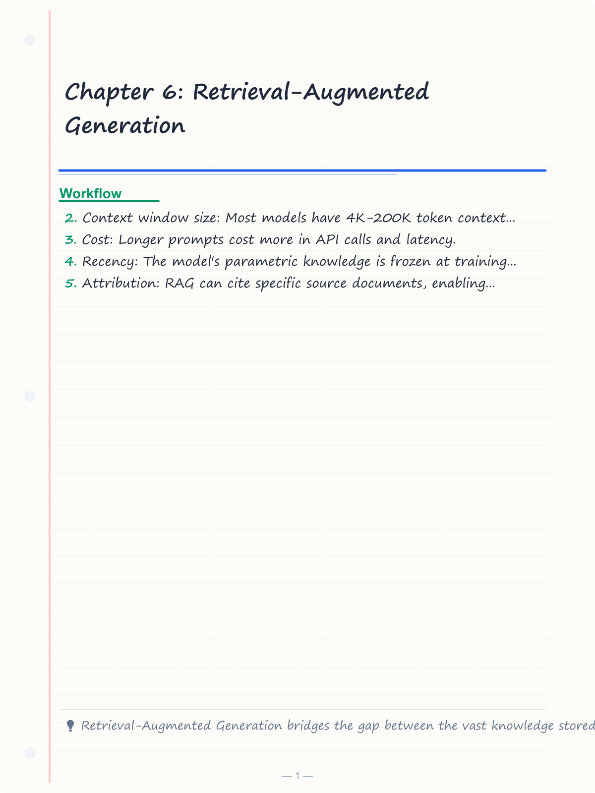
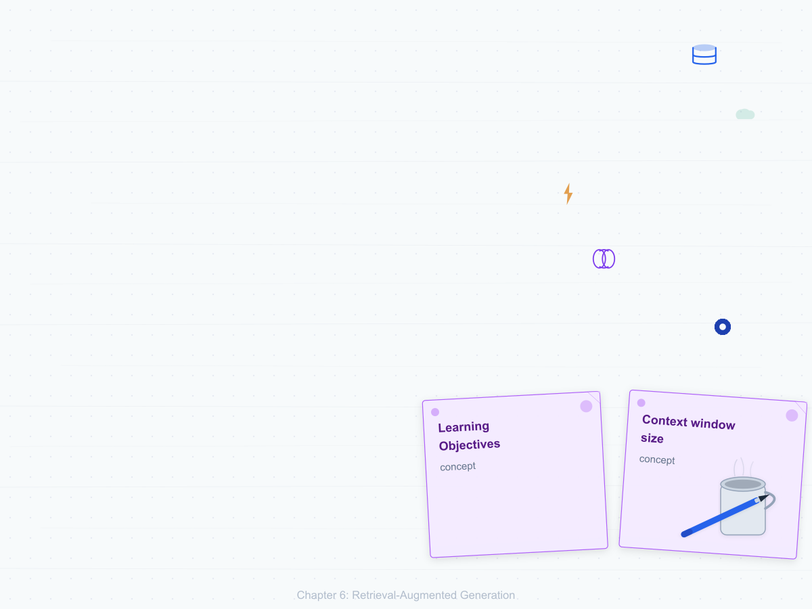
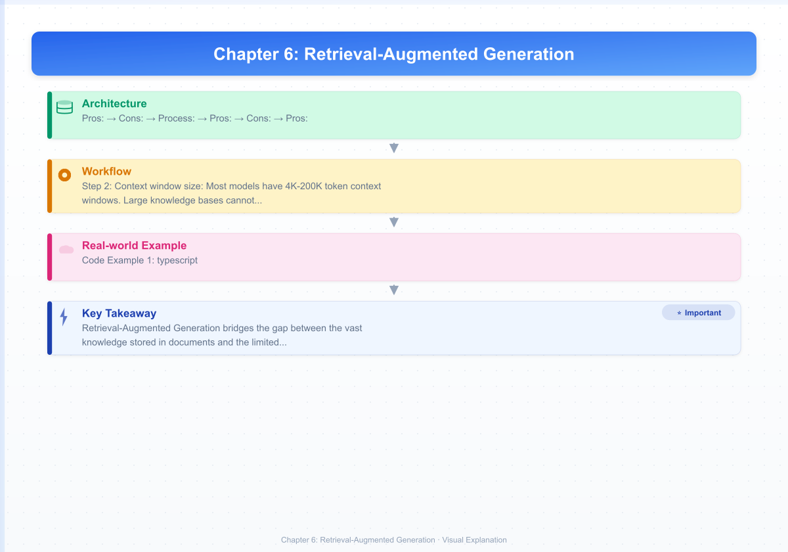


# Chapter 6: Retrieval-Augmented Generation

> **Learning Objectives**
>
> By the end of this chapter, you will be able to:
>
> - Design a complete RAG architecture with retriever, augmenter, and generator components
> - Select appropriate chunking strategies for different document types and retrieval tasks
> - Evaluate and choose embedding models based on the MTEB benchmark and task requirements
> - Implement dense, sparse, hybrid, and re-ranking retrieval pipelines
> - Build response synthesis strategies including concatenation, summarization, and conditional fusion
> - Measure RAG system quality with faithfulness, relevance, hit rate, MRR, and NDCG
> - Choose between advanced RAG patterns (Self-RAG, HyDE, agentic RAG, multi-hop, Graph RAG)
> - Construct a complete RAGPipeline and RAGEvaluator in TypeScript

---

<!-- Image Gallery -->
<section class="lesson-visuals" aria-label="Visual learning resources">
  <header><span>VISUAL LEARNING</span><h2>See it. Review it. Remember it.</h2></header>
  <a class="lesson-visual-card" href="../../assets/images/lessons/modern-ai-engineering/06-retrieval-augmented-generation/handwritten-notes.png" target="_blank" rel="noopener">
    
    <span><strong>Handwritten notes</strong>Condensed notes for deliberate review.</span>
  </a>
  <a class="lesson-visual-card" href="../../assets/images/lessons/modern-ai-engineering/06-retrieval-augmented-generation/sticky-notes.png" target="_blank" rel="noopener">
    
    <span><strong>Sticky-note revision</strong>Fast recall prompts for revision.</span>
  </a>
  <a class="lesson-visual-card" href="../../assets/images/lessons/modern-ai-engineering/06-retrieval-augmented-generation/visual-explanation.png" target="_blank" rel="noopener">
    
    <span><strong>Visual concept guide</strong>A connected explanation of the key ideas.</span>
  </a>
</section>
<!-- End Image Gallery -->

## 6.1 RAG Architecture

Retrieval-Augmented Generation (RAG) combines a retrieval system with a generative model to produce responses grounded in external knowledge. Instead of relying solely on the model's parametric memory, RAG first retrieves relevant documents from a knowledge base and conditions the generation on those documents.

### 6.1.1 When RAG Beats Pure Prompting

Pure prompting (providing all context in the prompt) has fundamental limitations:
- **Context window size:** Most models have 4K-200K token context windows. Large knowledge bases cannot fit.
- **Cost:** Longer prompts cost more in API calls and latency.
- **Recency:** The model's parametric knowledge is frozen at training time. RAG accesses up-to-date information.
- **Attribution:** RAG can cite specific source documents, enabling verification.
- **Hallucination reduction:** Grounding generation in retrieved documents dramatically reduces factual errors.

RAG is the preferred approach when:
- The knowledge base is larger than the context window.
- Information changes frequently (news, documentation, products).
- Factual accuracy and attribution are critical (legal, medical, financial).
- The system needs to cite specific sources.

### 6.1.2 The RAG Pipeline

The standard RAG pipeline has three stages:

1. **Retrieve:** Given a query, retrieve the top-k relevant documents from a vector database or search index.
2. **Augment:** Combine the query with the retrieved documents into a structured prompt.
3. **Generate:** Pass the augmented prompt to an LLM to produce the final response.

`mermaid
graph LR
    subgraph Input["Input"]
        A[User Query]
    end

    subgraph Index["Indexing Pipeline"]
        B[Documents] --> C[Chunking]
        C --> D[Embedding Model]
        D --> E[Vector Database]
        E --> F[BM25 Index]
    end

    subgraph Retrieve["Retrieval"]
        A --> G[Query Embedding]
        G --> H[Vector Search]
        A --> I[BM25 Search]
        H --> J[Hybrid Fusion]
        I --> J
        J --> K[Re-Ranking]
        K --> L[Top-K Chunks]
    end

    subgraph Generate["Generation"]
        L --> M[Augment Prompt]
        M --> N[LLM]
        N --> O[Final Response]
        O --> P[Source Citations]
    end

    E -.-> H
    F -.-> I
`

---

## 6.2 Chunking Strategies

Chunking divides documents into retrievable units. The chunking strategy directly impacts retrieval quality - too large chunks contain irrelevant information, while too small chunks lose context.

### 6.2.1 Fixed-Size with Overlap

The simplest strategy: split text into chunks of a fixed number of tokens (e.g., 512) with overlap (e.g., 128 tokens). Overlap ensures that sentences or concepts spanning chunk boundaries are not lost.

**Pros:** Simple, deterministic, fast to compute.
**Cons:** Splits mid-sentence, loses document structure, ignores semantic boundaries.

### 6.2.2 Semantic Chunking

Semantic chunking uses embedding similarity to detect topic boundaries. Text is split at points where the semantic shift between adjacent sentences exceeds a threshold.

**Process:**
1. Embed each sentence individually.
2. Compute cosine similarity between consecutive sentences.
3. When similarity drops below a threshold, start a new chunk.
4. Merge small chunks with neighboring chunks.

**Pros:** Preserves semantic coherence, improves retrieval precision.
**Cons:** Slower, requires embedding model, threshold tuning.

### 6.2.3 Recursive Splitting

Recursive splitting applies increasingly fine-grained separators in order: paragraphs, sentences, clauses. If a chunk exceeds the maximum size, it is split at the next separator level.

**Pros:** Respects document structure, produces natural break points.
**Cons:** May produce uneven chunk sizes.

### 6.2.4 Document-Aware Chunking

Document-aware chunking leverages document structure - headings, sections, tables, code blocks, and metadata. Chunks preserve structural context. Metadata is prepended to each chunk.

**Pros:** Best for structured documents, preserves hierarchy, enables precise citation.
**Cons:** Requires document parsing, format-specific.

### 6.2.5 Chunking Strategy Comparison

| Strategy | Coherence | Precision | Speed | Best For |
|----------|-----------|-----------|-------|----------|
| Fixed-size + overlap | Low | Low | Fast | Simple text, prototyping |
| Semantic | High | High | Slow | Unstructured prose |
| Recursive | Medium | Medium | Medium | General purpose |
| Document-aware | High | High | Slow | PDFs, HTML, wikis, code |

---

## 6.3 Embedding Models

Embedding models convert text into dense vector representations. The quality of these embeddings directly determines retrieval accuracy.

### 6.3.1 OpenAI Embeddings

**text-embedding-3-small:** 1536 dimensions, optimized for speed and cost. Suitable for high-throughput applications.

**text-embedding-3-large:** 3072 dimensions, highest accuracy. Can be truncated to 256 dimensions with minimal quality loss.

**ada-002:** The previous generation (1536 dimensions). Still widely used but superseded by v3.

### 6.3.2 Embedding Quality Dimensions

- **Semantic similarity:** Do similar texts have similar embeddings?
- **Cross-task generalization:** Does the model perform well across retrieval, clustering, classification?
- **Language coverage:** How many languages does the model support?
- **Context length:** What is the maximum input length for the embedding model?
- **Dimensionality:** Higher dimensions capture more information but increase storage and search costs.

### 6.3.3 MTEB Benchmark

The Massive Text Embedding Benchmark (MTEB) evaluates embedding models across 8 task types and 58 datasets:

| Task | Description | Example Metric |
|------|-------------|----------------|
| Retrieval | Search relevance | NDCG@10 |
| Clustering | Topic grouping | V-Measure |
| Pair Classification | Semantic equivalence | Accuracy |
| Reranking | Relevance ordering | MAP |
| STS | Semantic similarity | Spearman |
| Summarization | Summary-structure similarity | Spearman |
| Classification | Zero-shot classification | Accuracy |

Top models on MTEB (as of 2025): intfloat/e5-mistral-7b-instruct, BAAI/bge-large-en-v1.5, text-embedding-3-large.

---

## 6.4 Retrieval Techniques

### 6.4.1 Dense Retrieval

Dense retrieval uses embedding models to represent both queries and documents as vectors. Search is performed by cosine similarity or dot product in vector space.

**Strengths:** Captures semantic similarity, handles synonyms and paraphrasing.
**Weaknesses:** Computationally expensive at scale, requires ANN indexing (HNSW, IVF), may miss exact keyword matches.

### 6.4.2 Sparse Retrieval (BM25)

BM25 is a bag-of-words retrieval algorithm that scores documents based on term frequency and inverse document frequency. It uses exact keyword matching.

**Strengths:** Fast, interpretable, handles rare terms well, zero training cost.
**Weaknesses:** Fails on semantic matching (synonyms, paraphrases), vocabulary mismatch.

### 6.4.3 Hybrid Retrieval

Hybrid retrieval combines dense and sparse scores, typically with weighted reciprocal rank fusion (RRF). RRF normalizes scores from different systems before combining:

RRF_score(d) = 1 / (k + rank_dense(d)) + 1 / (k + rank_sparse(d))

Hybrid retrieval consistently outperforms either method alone, especially for queries requiring both semantic understanding and exact term matching.

### 6.4.4 Re-Ranking

After initial retrieval (top-100 to top-1000), a cross-encoder re-ranker scores each retrieved document against the query. Cross-encoders are slower but more accurate than bi-encoders because they process query and document together through attention.

**Two-stage retrieval:**
1. **First stage:** Fast bi-encoder retrieves top-100 candidates.
2. **Second stage:** Cross-encoder re-ranks top-100 to produce top-5 to top-10.

This balances speed and accuracy.

`mermaid
flowchart LR
    subgraph Query["Query Processing"]
        A[Raw Query]
        B[Query Expansion]
        C[HyDE Generated Document]
        D[Final Query Vector]
    end

    subgraph Dense["Dense Retrieval"]
        E[Embedding Model]
        F[Vector DB Search]
        G[Dense Scores]
    end

    subgraph Sparse["Sparse Retrieval"]
        H[BM25 Tokenizer]
        I[Inverted Index Search]
        J[Sparse Scores]
    end

    subgraph Fusion["Fusion and Re-rank"]
        K[RRF Score Fusion]
        L[Cross-Encoder Re-rank]
        M[Final Top-K]
    end

    A --> B
    B --> C
    C --> D
    D --> E
    E --> F
    F --> G
    A --> H
    H --> I
    I --> J
    G --> K
    J --> K
    K --> L
    L --> M
`

---

## 6.5 Response Synthesis

After retrieving relevant chunks, the system must combine them with the query into a prompt for generation.

### 6.5.1 Concatenation

The simplest approach: concatenate all retrieved chunks into the prompt, separated by delimiters, with the query appended or prepended.

**Pros:** Simple, preserves full information.
**Cons:** May exceed context window, irrelevant chunks distract the model.

### 6.5.2 Summarization

When the context is too large, summarize each chunk before concatenation. A smaller, faster model can summarize chunks in parallel, then the main LLM generates from the summaries.

**Pros:** Reduces token usage, extracts key information.
**Cons:** Summarization may lose detail, potential information loss.

### 6.5.3 Conditional Fusion

Conditional fusion selects a synthesis strategy based on query characteristics:

- **Single-chunk queries:** Pass only the best chunk.
- **Multi-fact queries:** Pass top-k chunks and instruct the model to integrate information.
- **Comparison queries:** Pass chunks from different sources with a comparison instruction.
- **Aggregation queries:** Pass all chunks and ask for a summary.

### 6.5.4 Multi-Source Synthesis

When chunks come from different sources (web pages, PDFs, databases, APIs), include source metadata in the prompt. This enables the model to differentiate and cite sources, improving traceability and trust.

---

## 6.6 Evaluating RAG Systems

RAG evaluation requires specialized metrics beyond standard text generation metrics because the system has two components (retrieval and generation) each contributing to quality.

### 6.6.1 Faithfulness

Faithfulness measures whether the generated response is factually supported by the retrieved context. This is distinct from factual accuracy in general - the response may be factually correct but unsupported by the provided context.

**Evaluation approach:** Decompose the response into atomic claims. For each claim, verify whether it is supported by the retrieved chunks.

### 6.6.2 Answer Relevance

Answer relevance measures whether the response addresses the user's query. An irrelevant response may be factually correct but off-topic.

**Evaluation approach:** Use an LLM to score relevance on a 1-5 scale, or compute semantic similarity between the query and the response embedding.

### 6.6.3 Context Relevance

Context relevance measures whether the retrieved chunks are relevant to the query. Irrelevant context not only wastes context window but may distract the model.

**Evaluation approach:** Compute the percentage of retrieved chunks that are actually relevant to answering the query.

### 6.6.4 Retrieval Metrics

**Hit Rate (Recall@k):** The proportion of queries for which at least one relevant document is in the top-k results.

**Mean Reciprocal Rank (MRR):** The average of reciprocal ranks of the first relevant document. MRR@10 = mean(1 / rank_of_first_relevant). If no relevant document is found, the reciprocal rank is 0.

**Normalized Discounted Cumulative Gain (NDCG):** A ranking metric that accounts for graded relevance (not just binary relevant/irrelevant). NDCG penalizes relevant documents appearing lower in the ranking.

`mermaid
flowchart LR
    subgraph Data["Data Preparation"]
        A[Query Set]
        B[Retrieved Chunks]
        C[Ground Truth Judgments]
    end

    subgraph RetrieverEval["Retrieval Metrics"]
        D[Compute Hit Rate@k]
        E[Compute MRR@k]
        F[Compute NDCG@k]
        G[Context Relevance]
    end

    subgraph GeneratorEval["Generation Metrics"]
        H[Decompose into Claims]
        I[Check Faithfulness]
        J[Score Answer Relevance]
        K[Score Helpfulness]
    end

    subgraph Aggregate["Aggregation"]
        L[Overall RAG Score]
        M[Retrieval Quality Summary]
        N[Generation Quality Summary]
        O[Failure Case Analysis]
    end

    A --> D
    B --> D
    A --> E
    B --> E
    A --> F
    C --> F
    B --> G
    C --> G

    A --> H
    B --> H
    H --> I
    C --> I
    A --> J
    D --> L
    E --> L
    F --> L
    G --> L
    I --> L
    J --> L
    K --> L

    L --> M
    L --> N
    L --> O
`

---

## 6.7 Advanced RAG Patterns

### 6.7.1 Self-RAG

Self-RAG introduces an internal reflection step where the model retrieves documents on demand, evaluates their relevance, and decides whether to use them. The model generates reflection tokens that signal retrieval need, relevance, and support level.

**When to use:** Open-domain Q&A where retrieval is not always needed. Self-RAG can skip retrieval for simple questions, saving cost and latency.

### 6.7.2 HyDE (Hypothetical Document Embeddings)

HyDE generates a hypothetical document that answers the query, then uses that document's embedding for retrieval. The intuition: embeddings of ideal answer documents are closer to relevant documents in vector space than the query itself.

**Process:**
1. Use an LLM to generate a hypothetical answer to the query.
2. Embed the hypothetical answer.
3. Use that embedding for vector search.

**When to use:** Short or ambiguous queries where query-document semantic gap is large.

### 6.7.3 Agentic RAG

Agentic RAG uses an LLM agent to plan and execute multi-step retrieval strategies. The agent can decide to reformulate the query, retrieve from different sources, perform iterative retrieval with feedback, or combine results from multiple search steps.

**When to use:** Complex research questions requiring multiple rounds of retrieval and synthesis.

### 6.7.4 Multi-Hop RAG

Multi-hop RAG answers questions that require information from multiple documents connected through intermediate entities.

**Example:** Which company founded by Elon Musk acquired the company that produced the first electric car with a lithium-ion battery?

This requires: (1) identify the first electric car with Li-ion battery, (2) company that produced it, (3) who acquired that company, (4) founded by Elon Musk.

Multi-hop RAG routes each sub-question to the appropriate retriever and chains the results.

### 6.7.5 Graph RAG

Graph RAG constructs a knowledge graph from documents, with entities as nodes and relationships as edges. Retrieval traverses the graph to find relevant information, capturing connections that vector similarity alone would miss.

### 6.7.6 Pattern Comparison Table

| Pattern | Strengths | Weaknesses | Use Case |
|---------|-----------|------------|----------|
| Self-RAG | Adaptive retrieval, cost savings | Complex implementation | Open-domain QA |
| HyDE | Handles query-document gap | Hallucinated docs may mislead | Short/ambiguous queries |
| Agentic RAG | Flexible, multi-step reasoning | High latency, cost | Complex research |
| Multi-hop RAG | Multi-document reasoning | Requires decomposition | Multi-step questions |
| Graph RAG | Relationship-aware retrieval | Graph construction cost | Entity-rich domains |

---

## TypeScript Implementation

### RAGPipeline Class

The RAGPipeline class implements the complete RAG pipeline: chunking, embedding, retrieval, and response synthesis with source citation.

`	ypescript
interface Chunk {
  id: string;
  text: string;
  metadata: Record<string, unknown>;
  embedding?: number[];
  source: string;
}

interface ChunkingConfig {
  strategy: 'fixed' | 'semantic' | 'recursive' | 'document-aware';
  chunkSize: number;
  chunkOverlap: number;
  separators?: string[];
}

interface RetrievalResult {
  chunks: Chunk[];
  scores: number[];
  method: 'dense' | 'sparse' | 'hybrid';
}

interface SynthesisConfig {
  strategy: 'concatenation' | 'summarization' | 'conditional';
  maxContextTokens: number;
}

interface RAGResponse {
  answer: string;
  sources: Array<{ text: string; source: string; score: number }>;
  tokensUsed: number;
}

type EmbeddingFn = (text: string) => Promise<number[]>;
type LLMFn = (prompt: string) => Promise<string>;
type SimilarityFn = (a: number[], b: number[]) => number;

class RAGPipeline {
  private chunks: Chunk[] = [];
  private embeddings: Map<string, number[]> = new Map();
  private chunkConfig: ChunkingConfig;
  private synthesisConfig: SynthesisConfig;

  constructor(
    private embeddingFn: EmbeddingFn,
    private llmFn: LLMFn,
    private similarityFn: SimilarityFn = RAGPipeline.cosineSimilarity,
    config?: { chunking?: Partial<ChunkingConfig>; synthesis?: Partial<SynthesisConfig> }
  ) {
    this.chunkConfig = {
      strategy: 'recursive',
      chunkSize: 512,
      chunkOverlap: 128,
      separators: ['\n\n', '\n', '.', ' '],
      ...config?.chunking,
    };
    this.synthesisConfig = {
      strategy: 'concatenation',
      maxContextTokens: 3000,
      ...config?.synthesis,
    };
  }

  static cosineSimilarity(a: number[], b: number[]): number {
    let dot = 0, na = 0, nb = 0;
    for (let i = 0; i < a.length; i++) {
      dot += a[i] * b[i];
      na += a[i] * a[i];
      nb += b[i] * b[i];
    }
    return dot / (Math.sqrt(na) * Math.sqrt(nb) + 1e-10);
  }

  indexDocument(text: string, source: string, metadata: Record<string, unknown> = {}): Chunk[] {
    const docChunks = this.chunkText(text, source, metadata);
    this.chunks.push(...docChunks);
    return docChunks;
  }

  async embedAll(): Promise<void> {
    for (const chunk of this.chunks) {
      if (!chunk.embedding) {
        chunk.embedding = await this.embeddingFn(chunk.text);
        this.embeddings.set(chunk.id, chunk.embedding);
      }
    }
  }

  private chunkText(text: string, source: string, metadata: Record<string, unknown>): Chunk[] {
    switch (this.chunkConfig.strategy) {
      case 'fixed': return this.fixedSizeChunk(text, source, metadata);
      case 'semantic': return this.semanticChunk(text, source, metadata);
      case 'recursive': return this.recursiveChunk(text, source, metadata);
      case 'document-aware': return this.documentAwareChunk(text, source, metadata);
      default: return this.recursiveChunk(text, source, metadata);
    }
  }

  private fixedSizeChunk(text: string, source: string, metadata: Record<string, unknown>): Chunk[] {
    const chunks: Chunk[] = [];
    const words = text.split(/\s+/);
    const size = this.chunkConfig.chunkSize;
    const overlap = this.chunkConfig.chunkOverlap;
    const step = size - overlap;

    for (let i = 0; i < words.length; i += step) {
      const chunkWords = words.slice(i, i + size);
      if (chunkWords.length === 0) break;
      chunks.push({
        id: source + ':' + i,
        text: chunkWords.join(' '),
        metadata: { ...metadata, startIndex: i, endIndex: i + chunkWords.length },
        source,
      });
    }

    return chunks;
  }

  private recursiveChunk(text: string, source: string, metadata: Record<string, unknown>): Chunk[] {
    const chunks: Chunk[] = [];
    const separators = this.chunkConfig.separators ?? ['\n\n', '\n', '.', ' '];
    const maxSize = this.chunkConfig.chunkSize;

    const splitRecursive = (t: string, depth: number): string[] => {
      if (depth >= separators.length) {
        const words = t.split(/\s+/);
        const result: string[] = [];
        for (let i = 0; i < words.length; i += maxSize) {
          result.push(words.slice(i, i + maxSize).join(' '));
        }
        return result;
      }

      const parts = t.split(separators[depth]);
      const result: string[] = [];
      let current = '';

      for (const part of parts) {
        const candidate = current ? current + separators[depth] + part : part;
        if (candidate.split(/\s+/).length <= maxSize) {
          current = candidate;
        } else {
          if (current) result.push(current);
          const subParts = splitRecursive(part, depth + 1);
          result.push(...subParts);
          current = '';
        }
      }

      if (current) result.push(current);
      return result;
    };

    const parts = splitRecursive(text, 0);
    for (let i = 0; i < parts.length; i++) {
      chunks.push({
        id: source + ':recursive:' + i,
        text: parts[i],
        metadata: { ...metadata, chunkIndex: i, totalChunks: parts.length },
        source,
      });
    }

    return chunks;
  }

  private semanticChunk(text: string, source: string, metadata: Record<string, unknown>): Chunk[] {
    const sentences = text.match(/[^.!?]+[.!?]+/g) ?? [text];
    if (sentences.length <= 1) {
      return [{
        id: source + ':semantic:0',
        text,
        metadata,
        source,
      }];
    }

    const sentenceScores: number[] = [];
    for (let i = 1; i < sentences.length; i++) {
      const a = sentences[i - 1].trim();
      const b = sentences[i].trim();
      const tokensA = new Set(a.toLowerCase().split(/\s+/));
      const tokensB = new Set(b.toLowerCase().split(/\s+/));
      let intersection = 0;
      tokensA.forEach((t) => { if (tokensB.has(t)) intersection++; });
      const union = new Set([...tokensA, ...tokensB]);
      sentenceScores.push(union.size > 0 ? intersection / union.size : 0);
    }

    const threshold = 0.3;
    const chunks: Chunk[] = [];
    let currentChunk: string[] = [sentences[0]];
    let chunkIdx = 0;

    for (let i = 1; i < sentences.length; i++) {
      if (sentenceScores[i - 1] < threshold) {
        chunks.push({
          id: source + ':semantic:' + chunkIdx,
          text: currentChunk.join(' '),
          metadata: { ...metadata, chunkIndex: chunkIdx },
          source,
        });
        currentChunk = [];
        chunkIdx++;
      }
      currentChunk.push(sentences[i]);
    }

    if (currentChunk.length > 0) {
      chunks.push({
        id: source + ':semantic:' + chunkIdx,
        text: currentChunk.join(' '),
        metadata: { ...metadata, chunkIndex: chunkIdx },
        source,
      });
    }

    return chunks;
  }

  private documentAwareChunk(text: string, source: string, metadata: Record<string, unknown>): Chunk[] {
    const headingRegex = /^(#{1,6}\s+|(?:\w+\s)*\n[-=]+\s*$)/gm;
    const sections = text.split(headingRegex);
    const chunks: Chunk[] = [];
    let currentHeading = '';

    for (const section of sections) {
      const trimmed = section.trim();
      if (!trimmed) continue;
      if (/^#{1,6}\s/.test(trimmed) || /^[-=]+\s*$/.test(trimmed)) {
        currentHeading = trimmed.replace(/^#{1,6}\s*/, '').replace(/[-=]+\s*$/, '').trim();
        continue;
      }
      const maxSize = this.chunkConfig.chunkSize;
      const words = trimmed.split(/\s+/);
      for (let i = 0; i < words.length; i += maxSize) {
        const chunkText = words.slice(i, i + maxSize).join(' ');
        chunks.push({
          id: source + ':' + currentHeading + ':' + i,
          text: chunkText,
          metadata: { ...metadata, heading: currentHeading, sectionStart: i },
          source,
        });
      }
    }

    return chunks.length > 0 ? chunks : this.recursiveChunk(text, source, metadata);
  }

  async retrieve(query: string, topK: number = 5, method: 'dense' | 'hybrid' = 'hybrid'): Promise<RetrievalResult> {
    const queryEmb = await this.embeddingFn(query);

    const denseScores = this.chunks.map((chunk, idx) => {
      const emb = this.embeddings.get(chunk.id) ?? chunk.embedding;
      if (!emb) return { chunk, score: 0, idx };
      return { chunk, score: this.similarityFn(queryEmb, emb), idx };
    });

    denseScores.sort((a, b) => b.score - a.score);

    if (method === 'dense') {
      const top = denseScores.slice(0, topK);
      return {
        chunks: top.map((t) => t.chunk),
        scores: top.map((t) => t.score),
        method: 'dense',
      };
    }

    const queryTerms = query.toLowerCase().split(/\s+/).filter((t) => t.length > 1);
    const sparseScores = this.chunks.map((chunk) => {
      const chunkLower = chunk.text.toLowerCase();
      const termFrequency = queryTerms.reduce((sum, term) => {
        const regex = new RegExp(term.replace(/[.*+?^${}()|[\]\\]/g, '\\$&'), 'g');
        const matches = chunkLower.match(regex);
        return sum + (matches ? matches.length : 0);
      }, 0);
      return { chunk, score: termFrequency / (1 + 0.5 * chunk.text.split(/\s+/).length) };
    });

    const k = 60;
    const combined = denseScores.map((d, idx) => {
      const sparse = sparseScores.find((s) => s.chunk.id === d.chunk.id);
      const rrfScore = (1 / (k + idx + 1)) + (1 / (k + (sparse ? sparseScores.indexOf(sparse) + 1 : 1000)));
      return { chunk: d.chunk, score: rrfScore };
    });

    combined.sort((a, b) => b.score - a.score);
    const top = combined.slice(0, topK);

    return {
      chunks: top.map((t) => t.chunk),
      scores: top.map((t) => t.score),
      method: 'hybrid',
    };
  }
  async generate(query: string, topK: number = 5): Promise<RAGResponse> {
    const retrieval = await this.retrieve(query, topK);
    const context = this.synthesizeContext(query, retrieval.chunks);

    const prompt = [
      'You are a helpful assistant. Answer the user\'s question based on the provided context.',
      'If the context does not contain enough information, say so.',
      'Cite sources by their source labels.',
      '',
      'Context:',
      context,
      '',
      'Question: ' + query,
      '',
      'Answer:',
    ].join('\n');

    const answer = await this.llmFn(prompt);

    return {
      answer,
      sources: retrieval.chunks.map((c, i) => ({
        text: c.text.slice(0, 200),
        source: c.source,
        score: retrieval.scores[i],
      })),
      tokensUsed: prompt.split(/\s+/).length + answer.split(/\s+/).length,
    };
  }

  private synthesizeContext(query: string, chunks: Chunk[]): string {
    switch (this.synthesisConfig.strategy) {
      case 'concatenation':
        return chunks.map((c, i) =>
          '[Source ' + (i + 1) + ': ' + c.source + ']\n' + c.text
        ).join('\n\n---\n\n');

      case 'summarization':
        return chunks.map((c, i) =>
          '[Source ' + (i + 1) + ': ' + c.source + ']\n(' + c.text.slice(0, 200) + '...)'
        ).join('\n\n---\n\n');

      case 'conditional': {
        if (chunks.length <= 2) {
          return chunks.map((c, i) =>
            '[Source ' + (i + 1) + ': ' + c.source + ']\n' + c.text
          ).join('\n\n');
        }
        return chunks.map((c, i) =>
          '[Source ' + (i + 1) + ': ' + c.source + ']\n' + c.text.slice(0, 300)
        ).join('\n\n---\n\n');
      }

      default:
        return chunks.map((c, i) =>
          '[Source ' + (i + 1) + ': ' + c.source + ']\n' + c.text
        ).join('\n\n---\n\n');
    }
  }

  getChunks(): Chunk[] {
    return [...this.chunks];
  }

  getStats(): { totalChunks: number; totalTokens: number; strategies: string[] } {
    const totalTokens = this.chunks.reduce((sum, c) => sum + c.text.split(/\s+/).length, 0);
    return {
      totalChunks: this.chunks.length,
      totalTokens,
      strategies: [this.chunkConfig.strategy, this.synthesisConfig.strategy],
    };
  }
}
### RAGEvaluator Class

The RAGEvaluator class computes faithfulness, relevance, hit rate, MRR, and NDCG for RAG systems.

```typescript
interface EvalQuery {
  query: string;
  relevantDocIds: string[];
  expectedAnswer?: string;
}

interface RAGEvalResult {
  faithfulness: number;
  answerRelevance: number;
  contextRelevance: number;
  hitRate: number;
  mrr: number;
  ndcg: number;
  details: Array<{
    query: string;
    faithfulness: number;
    hit: boolean;
    reciprocalRank: number;
    ndcg: number;
  }>;
}

class RAGEvaluator {
  constructor(
    private pipeline: RAGPipeline,
    private judgeFn: (prompt: string) => Promise<Record<string, number>>
  ) {}

  async evaluate(
    queries: EvalQuery[],
    topK: number = 10
  ): Promise<RAGEvalResult> {
    let totalFaithfulness = 0;
    let totalAnswerRelevance = 0;
    let totalContextRelevance = 0;
    let totalHitRate = 0;
    let totalMRR = 0;
    let totalNDCG = 0;
    const details: RAGEvalResult['details'] = [];

    for (const eq of queries) {
      const retrieval = await this.pipeline.retrieve(eq.query, topK);
      const retrievedChunks = retrieval.chunks;

      // Hit rate
      const hit = retrievedChunks.some((c) => eq.relevantDocIds.includes(c.id));
      if (hit) totalHitRate++;

      // MRR
      let reciprocalRank = 0;
      for (let i = 0; i < retrievedChunks.length; i++) {
        if (eq.relevantDocIds.includes(retrievedChunks[i].id)) {
          reciprocalRank = 1 / (i + 1);
          break;
        }
      }
      totalMRR += reciprocalRank;

      // NDCG
      const dcg = retrievedChunks.reduce((sum, chunk, i) => {
        const rel = eq.relevantDocIds.includes(chunk.id) ? 1 : 0;
        return sum + rel / Math.log2(i + 2);
      }, 0);
      const idealRanks = eq.relevantDocIds.slice(0, topK);
      const idcg = idealRanks.reduce((sum, _, i) => {
        return sum + 1 / Math.log2(i + 2);
      }, 0);
      const ndcg = idcg > 0 ? dcg / idcg : 0;
      totalNDCG += ndcg;

      // Context relevance
      const relevantCount = retrievedChunks.filter(
        (c) => eq.relevantDocIds.includes(c.id)
      ).length;
      const ctxRelevance = retrievedChunks.length > 0
        ? relevantCount / retrievedChunks.length
        : 0;
      totalContextRelevance += ctxRelevance;

      // Faithfulness and answer relevance (using LLM judge)
      let faith = 0;
      let ansRel = 0;
      if (eq.expectedAnswer && eq.relevantDocIds.length > 0) {
        const response = await this.pipeline.generate(eq.query, topK);
        const relevantContexts = retrievedChunks
          .filter((c) => eq.relevantDocIds.includes(c.id))
          .map((c) => c.text);
        const evalPrompt = [
          'Evaluate the following RAG response.',
          '',
          'Query: ' + eq.query,
          'Expected answer: ' + eq.expectedAnswer,
          'Generated answer: ' + response.answer,
          'Relevant contexts: ' + relevantContexts.join('\n---\n'),
          '',
          'Score faithfulness (0-1): claims supported by context.',
          'Score answer relevance (0-1): response addresses the query.',
          'Output JSON: { "faithfulness": number, "answerRelevance": number }',
        ].join('\n');
        const scores = await this.judgeFn(evalPrompt);
        faith = scores.faithfulness ?? 0;
        ansRel = scores.answerRelevance ?? 0;
      }

      totalFaithfulness += faith;
      totalAnswerRelevance += ansRel;

      details.push({
        query: eq.query,
        faithfulness: faith,
        hit,
        reciprocalRank,
        ndcg,
      });
    }

    const n = queries.length;
    return {
      faithfulness: totalFaithfulness / n,
      answerRelevance: totalAnswerRelevance / n,
      contextRelevance: totalContextRelevance / n,
      hitRate: totalHitRate / n,
      mrr: totalMRR / n,
      ndcg: totalNDCG / n,
      details,
    };
  }
}
```
---

## Summary

Retrieval-Augmented Generation bridges the gap between the vast knowledge stored in documents and the limited context window of LLMs. By combining dense and sparse retrieval with a generative model, RAG systems produce responses that are factual, attributable, and up-to-date. Effective chunking balances granularity with semantic coherence. Embedding model selection significantly impacts retrieval quality, with the MTEB benchmark providing a standardized comparison framework. Hybrid retrieval with re-ranking achieves the best balance of speed and accuracy. Response synthesis strategies range from simple concatenation to conditional fusion, depending on the query type. RAG evaluation requires specialized metrics: faithfulness measures factual grounding, hit rate and MRR assess retrieval accuracy, and NDCG captures ranking quality. Advanced patterns like Self-RAG, HyDE, agentic RAG, multi-hop RAG, and Graph RAG extend the basic RAG paradigm for specific use cases. The RAGPipeline and RAGEvaluator classes provide production-ready implementations of the core concepts.

---

## Practical Takeaways

1. Always index with a chunking strategy that preserves document structure - recursive splitting is a good default for general-purpose RAG.
2. Use hybrid retrieval (dense + BM25 with RRF fusion) for the best balance of semantic understanding and exact match.
3. Add a cross-encoder re-ranking step between initial retrieval and generation to improve relevance of the top-k context.
4. Always evaluate faithfulness separately from overall quality - a response can be fluent and relevant while containing factual hallucinations.
5. For production RAG, monitor hit rate and MRR over time to detect embedding drift or knowledge base staleness.

---

## Chapter Quiz

**1. What is the primary advantage of RAG over pure prompting for knowledge-intensive tasks?**

A) Lower latency and computational cost
B) Access to external, up-to-date knowledge with source attribution
C) Better creative writing capabilities
D) Simpler implementation and deployment

**2. Which chunking strategy preserves document structure and hierarchy best?**

A) Fixed-size with overlap
B) Semantic chunking
C) Recursive splitting
D) Document-aware chunking

**3. What does RRF (Reciprocal Rank Fusion) accomplish in hybrid retrieval?**

A) It re-ranks results using a cross-encoder model
B) It combines dense and sparse retrieval scores into a single ranking
C) It generates hypothetical documents to improve query embeddings
D) It decomposes queries into sub-questions for multi-hop search

**4. Which metric measures whether a generated response is factually supported by the retrieved context?**

A) Answer relevance
B) Hit rate
C) Faithfulness
D) NDCG

**5. HyDE (Hypothetical Document Embeddings) is most useful when:**

A) The query is long and detailed
B) The query is short or ambiguous with a large query-document semantic gap
C) The knowledge base contains mostly structured data
D) The generation model requires few-shot examples

---

### Answer Key

| Question | Answer |
|----------|--------|
| 1 | B |
| 2 | D |
| 3 | B |
| 4 | C |
| 5 | B |

---

## Exercises

**Exercise 1:** Extend the RAGPipeline class with a re-ranking step using a mock cross-encoder. After initial retrieval of top-50 chunks, re-rank them and return only the top-5.

<details>
<summary>Solution</summary>

`	ypescript
class RAGPipelineWithReRank extends RAGPipeline {
  private async mockCrossEncoder(query: string, chunk: Chunk): Promise<number> {
    const queryTerms = new Set(query.toLowerCase().split(/\s+/));
    const chunkTerms = new Set(chunk.text.toLowerCase().split(/\s+/));
    let intersection = 0;
    queryTerms.forEach((t) => { if (chunkTerms.has(t)) intersection++; });
    const jaccard = intersection / (queryTerms.size + chunkTerms.size - intersection);
    const lengthPenalty = Math.min(1, chunk.text.split(/\s+/).length / 200);
    return jaccard * 0.7 + lengthPenalty * 0.3;
  }

  async retrieveWithReRank(
    query: string,
    initialK: number = 50,
    finalK: number = 5
  ): Promise<RetrievalResult> {
    const initial = await this.retrieve(query, initialK, 'hybrid');
    const reRanked = await Promise.all(
      initial.chunks.map(async (chunk) => ({
        chunk,
        score: await this.mockCrossEncoder(query, chunk),
      }))
    );
    reRanked.sort((a, b) => b.score - a.score);
    const top = reRanked.slice(0, finalK);
    return {
      chunks: top.map((t) => t.chunk),
      scores: top.map((t) => t.score),
      method: 'hybrid',
    };
  }
}
`

</details>

**Exercise 2:** Implement a SelfRAGEngine class that decides whether retrieval is needed for a given query. If the query can be answered from parametric knowledge, skip retrieval entirely.

<details>
<summary>Solution</summary>

`	ypescript
class SelfRAGEngine {
  private retrievalThreshold: number;

  constructor(
    private pipeline: RAGPipeline,
    private confidenceFn: (query: string) => Promise<number>,
    retrievalThreshold: number = 0.4
  ) {
    this.retrievalThreshold = retrievalThreshold;
  }

  async answer(query: string): Promise<{ answer: string; usedRetrieval: boolean }> {
    const confidence = await this.confidenceFn(query);
    if (confidence >= this.retrievalThreshold) {
      const response = await this.pipeline.generate(query);
      return { answer: response.answer, usedRetrieval: true };
    }
    const prompt = 'Answer the following question from your knowledge:\n' + query;
    const directAnswer = await (this.pipeline as unknown as { llmFn: LLMFn }).llmFn(prompt);
    return { answer: directAnswer, usedRetrieval: false };
  }
}
`

</details>

**Exercise 3:** Create a MultiHopRAGEngine that decomposes a complex question into sub-questions, retrieves for each, and synthesizes a final answer.

<details>
<summary>Solution</summary>

`	ypescript
class MultiHopRAGEngine {
  constructor(private pipeline: RAGPipeline, private llmFn: LLMFn) {}

  async answerMultiHop(question: string): Promise<{ subQuestions: string[]; finalAnswer: string }> {
    const decompositionPrompt = [
      'Decompose this question into simpler sub-questions that can be answered independently.',
      'Question: ' + question,
      'Output each sub-question on a new line, numbered.',
    ].join('\n');

    const decomposition = await this.llmFn(decompositionPrompt);
    const subQuestions = decomposition
      .split('\n')
      .filter((line) => /^\d+[.\)]/.test(line))
      .map((line) => line.replace(/^\d+[.\)]\s*/, '').trim())
      .filter(Boolean);

    const subAnswers: string[] = [];
    for (const sq of subQuestions) {
      const response = await this.pipeline.generate(sq);
      subAnswers.push(response.answer);
    }

    const synthesisPrompt = [
      'Answer the original question based on the sub-question answers.',
      'Original: ' + question,
      '',
      subQuestions.map((q, i) => 'Q: ' + q + '\nA: ' + subAnswers[i]).join('\n\n'),
      '',
      'Final answer:',
    ].join('\n');

    const finalAnswer = await this.llmFn(synthesisPrompt);
    return { subQuestions, finalAnswer };
  }
}
`

</details>

**Exercise 4:** Build a RAGCache class that caches retrieval results for repeated queries using embedding similarity to detect near-duplicate queries.

<details>
<summary>Solution</summary>

`	ypescript
interface CacheEntry {
  query: string;
  queryEmbedding: number[];
  result: RetrievalResult;
  timestamp: number;
}

class RAGCache {
  private cache: CacheEntry[] = [];
  private similarityThreshold: number;
  private maxSize: number;

  constructor(
    private embeddingFn: EmbeddingFn,
    similarityThreshold: number = 0.92,
    maxSize: number = 1000
  ) {
    this.similarityThreshold = similarityThreshold;
    this.maxSize = maxSize;
  }

  async lookup(query: string): Promise<RetrievalResult | null> {
    const queryEmb = await this.embeddingFn(query);
    let bestMatch: CacheEntry | null = null;
    let bestScore = 0;

    for (const entry of this.cache) {
      const score = RAGPipeline.cosineSimilarity(queryEmb, entry.queryEmbedding);
      if (score > bestScore) {
        bestScore = score;
        bestMatch = entry;
      }
    }

    if (bestMatch && bestScore >= this.similarityThreshold) {
      return bestMatch.result;
    }

    return null;
  }

  store(query: string, queryEmbedding: number[], result: RetrievalResult): void {
    if (this.cache.length >= this.maxSize) {
      this.cache.sort((a, b) => a.timestamp - b.timestamp);
      this.cache = this.cache.slice(-Math.floor(this.maxSize / 2));
    }

    this.cache.push({ query, queryEmbedding, result, timestamp: Date.now() });
  }

  clear(): void {
    this.cache = [];
  }

  get size(): number {
    return this.cache.length;
  }
}
`

</details>

**Exercise 5:** Write a RAGFailureAnalyzer that categorizes RAG failures into retrieval failures (missed relevant docs), context failures (retrieved but irrelevant), and generation failures (hallucination despite good context).

<details>
<summary>Solution</summary>

`	ypescript
interface FailureReport {
  retrievalFailures: Array<{ query: string; missedDocs: string[] }>;
  contextFailures: Array<{ query: string; irrelevantChunks: string[] }>;
  generationFailures: Array<{ query: string; expectedAnswer: string; generatedAnswer: string }>;
  summary: string;
}

class RAGFailureAnalyzer {
  async analyze(
    queries: EvalQuery[],
    pipeline: RAGPipeline,
    judgeFn: (prompt: string) => Promise<Record<string, number>>,
    topK: number = 10
  ): Promise<FailureReport> {
    const retrievalFailures: FailureReport['retrievalFailures'] = [];
    const contextFailures: FailureReport['contextFailures'] = [];
    const generationFailures: FailureReport['generationFailures'] = [];

    for (const eq of queries) {
      const retrieval = await pipeline.retrieve(eq.query, topK);
      const retrievedIds = new Set(retrieval.chunks.map((c) => c.id));
      const missedDocs = eq.relevantDocIds.filter((id) => !retrievedIds.has(id));
      if (missedDocs.length > 0) {
        retrievalFailures.push({ query: eq.query, missedDocs });
      }

      const irrelevantChunks = retrieval.chunks
        .filter((c) => !eq.relevantDocIds.includes(c.id))
        .map((c) => c.id);
      if (irrelevantChunks.length > retrieval.chunks.length * 0.5) {
        contextFailures.push({ query: eq.query, irrelevantChunks });
      }

      if (eq.expectedAnswer) {
        const response = await pipeline.generate(eq.query);
        const evalPrompt = [
          'Does the generated answer match the expected answer?',
          'Query: ' + eq.query,
          'Expected: ' + eq.expectedAnswer,
          'Generated: ' + response.answer,
          'Output: "YES" if correct, "NO" if incorrect.',
        ].join('\n');
        const matchResult = await judgeFn(evalPrompt);
        if (matchResult.faithfulness && matchResult.faithfulness < 0.5) {
          generationFailures.push({
            query: eq.query,
            expectedAnswer: eq.expectedAnswer,
            generatedAnswer: response.answer,
          });
        }
      }
    }

    const summary = [
      'RAG Failure Analysis Report',
      'Total queries: ' + queries.length,
      'Retrieval failures: ' + retrievalFailures.length + ' (' + ((retrievalFailures.length / queries.length) * 100).toFixed(1) + '%)',
      'Context failures: ' + contextFailures.length + ' (' + ((contextFailures.length / queries.length) * 100).toFixed(1) + '%)',
      'Generation failures: ' + generationFailures.length + ' (' + ((generationFailures.length / queries.length) * 100).toFixed(1) + '%)',
    ].join('\n');

    return { retrievalFailures, contextFailures, generationFailures, summary };
  }
}
`

</details>
