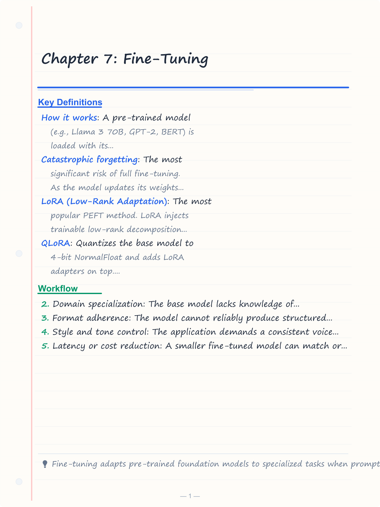
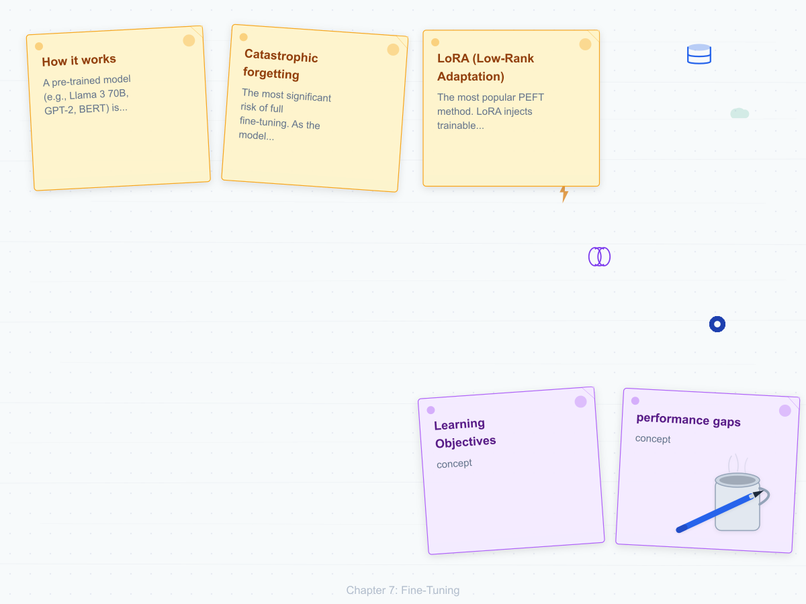
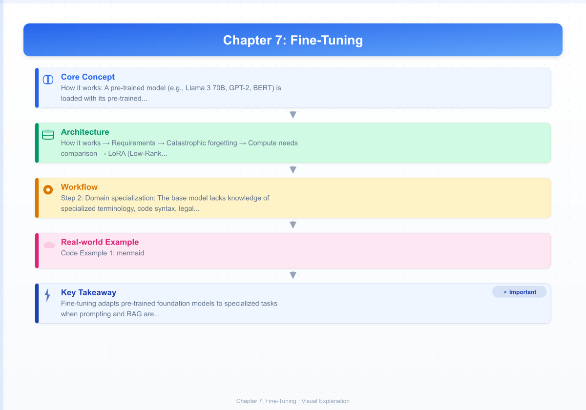
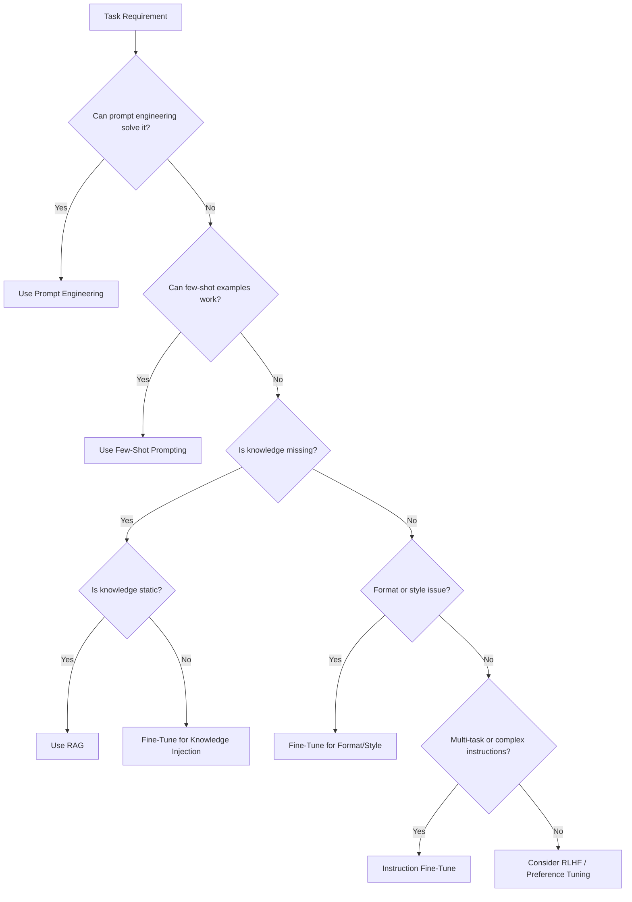
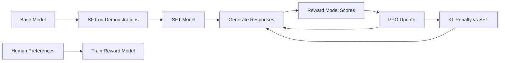

# Chapter 7: Fine-Tuning

> **Learning Objectives**
>
> By the end of this chapter, you will be able to:
> - Decide when fine-tuning is appropriate versus prompting or RAG
> - Differentiate full fine-tuning from parameter-efficient methods
> - Implement LoRA adapters and configure rank, alpha, and target modules
> - Prepare instruction-tuning datasets with proper chat templates
> - Understand the RLHF/DPO preference optimization pipeline
> - Evaluate fine-tuned models and avoid benchmark overfitting

---

<!-- Image Gallery -->
<section class="lesson-visuals" aria-label="Visual learning resources">
  <header><span>VISUAL LEARNING</span><h2>See it. Review it. Remember it.</h2></header>
  <a class="lesson-visual-card" href="../../assets/images/lessons/modern-ai-engineering/07-fine-tuning/handwritten-notes.png" target="_blank" rel="noopener">
    
    <span><strong>Handwritten notes</strong>Condensed notes for deliberate review.</span>
  </a>
  <a class="lesson-visual-card" href="../../assets/images/lessons/modern-ai-engineering/07-fine-tuning/sticky-notes.png" target="_blank" rel="noopener">
    
    <span><strong>Sticky-note revision</strong>Fast recall prompts for revision.</span>
  </a>
  <a class="lesson-visual-card" href="../../assets/images/lessons/modern-ai-engineering/07-fine-tuning/visual-explanation.png" target="_blank" rel="noopener">
    
    <span><strong>Visual concept guide</strong>A connected explanation of the key ideas.</span>
  </a>
</section>
<!-- End Image Gallery -->

## 7.1 When to Fine-Tune

Fine-tuning is one of the most powerful tools in an AI engineer's toolkit, but it is also the most expensive and complex. Before fine-tuning, teams should exhaust cheaper alternatives: prompt engineering, few-shot examples, retrieval-augmented generation (RAG), and controlled decoding. The decision to fine-tune should be driven by **performance gaps** that cannot be closed by other means.

The primary scenarios where fine-tuning is warranted include:

- **Domain specialization**: The base model lacks knowledge of specialized terminology, code syntax, legal language, medical knowledge, or proprietary APIs.
- **Format adherence**: The model cannot reliably produce structured output (JSON, XML, markdown tables) even with detailed prompting.
- **Style and tone control**: The application demands a consistent voice — customer support should always be polite and empathetic, technical docs should be concise.
- **Latency or cost reduction**: A smaller fine-tuned model can match or exceed a larger general model's performance, reducing inference cost and latency.
- **Multi-task instruction following**: The model struggles with complex multi-step instructions or tasks that require chaining reasoning and action.



A practical heuristic: if you can fix the problem with 5–10 well-crafted examples in the prompt, use few-shot. If you need 100–1000 examples, consider RAG. If you need 1000+ examples and the model still underperforms, it is time to fine-tune.

---

## 7.2 Full Fine-Tuning

Full fine-tuning updates **all parameters** of the pre-trained model on a task-specific dataset. While this gives the model maximum flexibility to adapt, it comes with significant costs and risks.

**How it works**: A pre-trained model (e.g., Llama 3 70B, GPT-2, BERT) is loaded with its pre-trained weights. The training loop runs on a supervised dataset where each example consists of an input and a target output. Backpropagation computes gradients for every parameter, and the optimizer (typically AdamW) updates all weights.

**Requirements**:
- **Computation**: For a 7B parameter model, full fine-tuning requires 4–8 A100 GPUs (80 GB each) with gradient checkpointing, mixed precision (bf16/fp16), and possibly distributed data parallelism (DDP) or fully sharded data parallelism (FSDP).
- **Memory**: Each parameter consumes at least 2 bytes (bf16) plus optimizer states (8 bytes per parameter with AdamW). A 7B model may need 70–140 GB of GPU memory just for parameters, gradients, and optimizer states.
- **Data**: At least 1000–10,000 high-quality examples. More data is generally better, but data quality matters more than quantity.

**Catastrophic forgetting**: The most significant risk of full fine-tuning. As the model updates its weights to perform well on the new task, it can lose capabilities learned during pre-training. For example, fine-tuning a code model on legal documents may degrade its code generation ability. Mitigations include:
- Mixing in general-domain data during fine-tuning (10–20% replay buffer)
- Using Elastic Weight Consolidation (EWC) to penalize changes to important parameters
- Lower learning rates (1e-5 to 5e-5)
- Early stopping based on validation loss

**Compute needs comparison**:

| Method | Params Updated | Memory (7B) | Speed | Forgetting Risk |
|--------|---------------|-------------|-------|-----------------|
| Full Fine-Tuning | 100% | ~140 GB | Slow | High |
| LoRA | 0.1–1% | ~16 GB | Fast | Low |
| QLoRA | 0.1–1% | ~10 GB | Fast | Low |
| Adapters | 1–3% | ~20 GB | Moderate | Low |

---

## 7.3 Parameter-Efficient Fine-Tuning (PEFT)

PEFT methods update only a small subset of model parameters while keeping the pre-trained weights frozen. This dramatically reduces memory requirements, training time, and the risk of catastrophic forgetting.

**LoRA (Low-Rank Adaptation)**: The most popular PEFT method. LoRA injects trainable low-rank decomposition matrices into attention layers. For a weight matrix W of shape d×k, LoRA learns A (d×r) and B (r×k) where r << min(d,k). The update is ΔW = AB, so the modified forward pass becomes h = Wx + ABx. At inference time, LoRA weights can be merged into the original weights with zero added latency.

**QLoRA**: Quantizes the base model to 4-bit NormalFloat and adds LoRA adapters on top. Enables fine-tuning of 65B models on a single 48GB GPU. Uses double quantization to reduce memory further and paged optimizers to handle memory spikes.

**Adapters**: Small bottleneck layers inserted between transformer layers. Each adapter is a down-projection (d → h) followed by a non-linearity and up-projection (h → d), where h << d. Adapters add serial computation, increasing latency slightly at inference.

**Prefix Tuning**: Prepends learnable continuous vectors (soft prompts) to the input of each transformer layer. Unlike discrete prompt tokens, these vectors are optimized via gradient descent. The prefix length (typically 10–200 tokens) controls expressiveness.

**Prompt Tuning**: A simpler variant where learnable tokens are only prepended to the input embedding layer (not every layer). More parameter-efficient but less expressive than prefix tuning.

| Method | Trainable Params | Inference Overhead | Expressiveness | Memory Saving |
|--------|-----------------|--------------------|---------------|---------------|
| LoRA | 0.1–1% | None (mergeable) | High | 10–20× |
| QLoRA | 0.1–1% | None (mergeable) | High | 15–25× |
| Adapters | 1–3% | Slight (serial) | Medium-High | 5–10× |
| Prefix Tuning | 0.01–0.1% | None | Medium | 20–50× |
| Prompt Tuning | 0.001–0.01% | None | Low-Medium | 50–100× |

In practice, LoRA is the most widely adopted due to its mergeable weights, no inference latency, and strong empirical performance across tasks. QLoRA is preferred when GPU memory is constrained.

---

## 7.4 LoRA Deep Dive

LoRA is based on the observation that learned over-parameterized models lie on a low intrinsic dimension. During adaptation, weight changes also have low intrinsic rank, allowing us to decompose ΔW into two low-rank matrices.

**Low-rank decomposition**: For a pre-trained weight matrix W₀ of dimensions d×k, the update is:

```
W = W₀ + ΔW = W₀ + BA
```

Where B ∈ ℝ^{d×r}, A ∈ ℝ^{r×k}, and r << min(d,k). A is initialized with random Gaussian (σ=0.02), B is initialized to zero, so ΔW starts at zero.

**Rank selection**: The rank r controls the expressiveness of the adapter. Common values range from 4 to 64. Higher ranks capture more task-specific patterns but increase trainable parameters and risk overfitting. For most tasks, r=8 or r=16 provides a good balance.

**Target modules**: LoRA is typically applied to attention projection matrices (Q, K, V, O) in transformer layers. Some implementations also target feed-forward network (FFN) layers. Applying LoRA to all attention matrices generally yields the best results, while targeting only Q and V is a common cost-saving simplification.

**Alpha scaling**: The LoRA update is scaled by α/r before adding to the base weights. The hyperparameter α controls the magnitude of the adaptation. Higher α values amplify the LoRA contribution. A common rule of thumb is to set α to 2× the rank (e.g., r=8, α=16).


**Merge at inference**: After training, the LoRA weights (scaled BA) can be added to the original weights: `W_merged = W₀ + (α/r) × BA`. This produces a single weight matrix with no additional computation during inference.

**Multiple LoRA adapters**: A single base model can host multiple LoRA adapters simultaneously. During inference, the appropriate adapter is selected per request, enabling task-specific behavior without model reloads. Platforms like vLLM and TGI support dynamic LoRA adapter swapping.

---

## 7.5 Instruction Tuning

Instruction tuning trains a language model to follow natural language instructions. Unlike traditional fine-tuning on input-output pairs, instruction tuning uses formatted prompts that explicitly describe the task.

**Methodology**: The model is trained on a diverse set of (instruction, input, output) triples. The instruction describes the task, the input provides context, and the output is the desired response. During training, the loss is computed only on the output tokens (not the instruction or input), which teaches the model to condition its generation on the instruction.

**Key datasets**:
- **Alpaca (52K)**: Generated by GPT-3.5 (text-davinci-003) using 175 seed tasks. Each example includes instruction, input, and output. Despite being synthetic, it proved that small, high-quality datasets can effectively instruction-tune models.
- **Dolly (15K)**: Human-generated by Databricks employees across 8 categories (brainstorming, classification, closed QA, generation, information extraction, open QA, summarization, rewriting).
- **OpenAssistant (OASST1, 66K)**: Human-generated conversation trees with multiple turns, collected from volunteers. Messages are ranked for quality, enabling preference learning.
- **ShareGPT**: Real user conversations with ChatGPT, scraped from the ShareGPT website. Contains diverse, real-world instructions.

**Chat templates**: Each model family uses a specific format for structuring conversations. Common formats include:

```
### Llama 3 Chat Template:

<|begin_of_text|><|start_header_id|>system<|end_header_id|>
You are a helpful assistant.
<|eot_id|><|start_header_id|>user<|end_header_id|>
What is the capital of France?
<|eot_id|><|start_header_id|>assistant<|end_header_id|>
The capital of France is Paris.<|eot_id|>

### ChatML (GPT-4):

<|im_start|>system
You are a helpful assistant.<|im_end|>
<|im_start|>user
What is the capital of France?<|im_end|>
<|im_start|>assistant
The capital of France is Paris.<|im_end|>
```

Using the correct chat template is critical. Mismatched templates cause the model to generate in unexpected formats or ignore instructions entirely. Libraries like Hugging Face Transformers bundle tokenizers with their expected chat templates.

**Multi-task training**: Instruction tuning blends multiple datasets, each with different formats and tasks. To prevent task imbalance, datasets are typically sampled with equal probability rather than by total examples. Task-specific loss weighting can also help balance performance across tasks.

---

## 7.6 RLHF and Preference Optimization

Reinforcement Learning from Human Feedback (RLHF) aligns language models with human preferences beyond simple instruction following.

**RLHF Pipeline**:
1. **Supervised Fine-Tuning (SFT)**: The base model is instruction-tuned on high-quality demonstrations.
2. **Reward Modeling**: A separate reward model is trained on pairwise comparisons — given two responses to the same prompt, humans indicate which is better. The reward model learns to predict human preference.
3. **PPO (Proximal Policy Optimization)**: The SFT model generates responses, the reward model scores them, and PPO updates the policy (the language model) to maximize expected reward. A KL divergence penalty prevents the policy from diverging too far from the SFT model.



**DPO (Direct Preference Optimization)**: DPO eliminates the need for a separate reward model and PPO training. It directly optimizes the policy using preference pairs, reparameterizing the reward function in terms of the policy. The DPO loss function is:

```
L = -E[log σ(β log(π_θ(y_w|x) / π_ref(y_w|x)) - β log(π_θ(y_l|x) / π_ref(y_l|x)))]
```

Where y_w is the preferred response, y_l is the dispreferred response, and β controls the deviation from the reference policy. DPO is simpler, more stable, and requires less compute than RLHF-PPO, making it the preferred choice for most teams.

**KTO (Kahneman-Tversky Optimization)**: Uses unpaired preference data — only requires knowing whether a response is good or bad, not pairwise comparisons. Based on prospect theory (Kahneman-Tversky), KTO models human utility as asymmetric: the disutility of a bad response outweighs the utility of a good one.

**ORPO (Odds Ratio Preference Optimization)**: Combines SFT and preference optimization into a single stage. During supervised training, ORPO adds an odds ratio loss that penalizes the model for generating dispreferred responses and rewards preferred ones. This eliminates the need for a separate SFT phase.

| Method | Reward Model | SFT Phase | Complexity | Data Required |
|--------|-------------|-----------|------------|---------------|
| RLHF (PPO) | Required | Required | High | Pairwise |
| DPO | Not needed | Required | Medium | Pairwise |
| KTO | Not needed | Required | Medium | Unpaired |
| ORPO | Not needed | Not needed | Low | Pairwise |

---

## 7.7 Data Preparation for Fine-Tuning

Data quality is the single most important factor in fine-tuning success. A well-prepared dataset of 1000 examples outperforms a noisy dataset of 100,000 examples.

**Quality filtering**: Remove examples with:
- Factual inaccuracies (use an automated fact-checker or manual review)
- Toxic, biased, or harmful content
- Low-quality formatting (garbled text, excessive typos, non-English content)
- Empty or near-empty responses
- Truncated or corrupted entries

**Format standardization**: Every example in the dataset should follow the same template structure. Inconsistent formats confuse the model and degrade performance. Apply your target chat template consistently.

**Task balancing**: If your dataset contains multiple tasks, ensure balanced representation. A dataset with 90% summarization and 10% code generation will produce a model that is strong at summarization but poor at code. Use stratified sampling or up/down-sampling to balance.

**Deduplication**: Remove near-duplicate examples. Even exact duplicates can bias training. MinHash LSH (locality-sensitive hashing) efficiently finds near-duplicates in large datasets. Deduplication against the pre-training corpus also prevents test set contamination.

**Train/test split**: Reserve 5–10% of your data for evaluation. Ensure the split is stratified by task (if multi-task) and that no prompt appears in both train and test (no leakage).

---

## 7.8 Evaluating Fine-Tuned Models

Evaluation before and after fine-tuning is essential to measure improvements and detect regressions.

**Before/after comparison**: Run the same evaluation benchmarks on the base model and the fine-tuned model. This quantifies improvements on target tasks and detects regression on general capabilities.

**Task-specific benchmarks**:
- **MMLU** (knowledge): Massive Multitask Language Understanding — 57 subjects
- **HumanEval** (code): Function completion tasks with unit tests
- **GSM8K** (math): Grade school math word problems
- **MT-Bench** (multi-turn): Multi-turn conversation quality scored by GPT-4
- **AlpacaEval**: Automatic evaluation against GPT-4 or other reference models

**Human evaluation**: For subjective tasks (creative writing, summarization quality, tone), human evaluation remains the gold standard. Use A/B testing where annotators compare two model outputs without knowing which model produced which.

**Avoiding benchmark overfitting**: If you evaluate exclusively on your training distribution, you will overestimate real-world performance. Use held-out test sets, cross-validation, and out-of-distribution evaluation. If your model performance on benchmarks increases but real-world user satisfaction decreases, your evaluation framework is flawed.

---

## 7.9 Practical Fine-Tuning Workflow

A systematic workflow ensures reproducibility, accountability, and continuous improvement.

```mermaid
flowchart LR
    A[Define Task & Metrics] --> B[Collect/Curate Data]
    B --> C[Data Quality Check]
    C --> D{Data Good?}
    D -->|No| B
    D -->|Yes| E[Format Data & Split]
    E --> F[Select PEFT Method]
    F --> G[Configure Hyperparameters]
    G --> H[Train Model]
    H --> I[Evaluate on Validation Set]
    I --> J[Run Benchmark Suite]
    J --> K{Metrics Improve?}
    K -->|No| G
    K -->|Yes| L[Human Evaluation]
    L --> M[Deploy for A/B Test]
    M --> N[Monitor Real-World Performance]
    N --> O{Satisfactory?}
    O -->|No| B
    O -->|Yes| P[Production Release]
```



**Tools**: Hugging Face TRL (Transformer Reinforcement Learning) provides Trainer classes for SFT, DPO, PPO, and KTO. Axolotl is a popular fine-tuning framework with YAML configuration. Unsloth optimizes LoRA training on consumer GPUs.

---

## TypeScript: FineTuneConfig

```typescript
interface DatasetEntry {
  instruction: string;
  input: string;
  output: string;
  task?: string;
  source?: string;
}

interface SplitResult {
  train: DatasetEntry[];
  test: DatasetEntry[];
  validation: DatasetEntry[];
}

class FineTuneConfig {
  modelName: string;
  method: 'full' | 'lora' | 'qlora' | 'adapter';
  precision: 'fp32' | 'bf16' | 'fp16';
  outputDir: string;

  loraConfig?: {
    rank: number;
    alpha: number;
    targetModules: string[];
    dropout: number;
    bias: 'none' | 'all' | 'lora_only';
  };

  trainingParams: {
    learningRate: number;
    numEpochs: number;
    batchSize: number;
    gradientAccumulationSteps: number;
    warmupRatio: number;
    weightDecay: number;
    maxGradNorm: number;
    loggingSteps: number;
    evalSteps: number;
    saveSteps: number;
    saveTotalLimit: number;
    earlyStoppingPatience: number;
    useGradientCheckpointing: boolean;
    mixedPrecision?: 'fp16' | 'bf16';
    optimizer: 'adamw' | 'adamw8bit' | 'adamwHf';
    lrScheduler: 'cosine' | 'linear' | 'constant';
    usePacking: boolean;
    maxSeqLength: number;
  };

  dataConfig: {
    datasetPath: string;
    validationSplit: number;
    testSplit: number;
    shuffleSeed: number;
    maxExamples?: number;
    taskBalancing: boolean;
    deduplicate: boolean;
    chatTemplate: 'chatml' | 'llama3' | 'mistral' | 'custom';
    customTemplate?: {
      systemToken: string;
      userToken: string;
      assistantToken: string;
      endToken: string;
      bosToken: string;
    };
  };

  evalConfig: {
    benchmarks: string[];
    metric: string[];
    humanEvalSampleSize: number;
    beforeAfterComparison: boolean;
  };

  constructor(config: Partial<FineTuneConfig>) {
    this.modelName = config.modelName ?? 'meta-llama/Llama-3.1-8B';
    this.method = config.method ?? 'lora';
    this.precision = config.precision ?? 'bf16';
    this.outputDir = config.outputDir ?? './output';

    this.loraConfig = config.loraConfig ?? {
      rank: 16,
      alpha: 32,
      targetModules: ['q_proj', 'v_proj', 'k_proj', 'o_proj'],
      dropout: 0.05,
      bias: 'none',
    };

    this.trainingParams = config.trainingParams ?? {
      learningRate: 2e-4,
      numEpochs: 3,
      batchSize: 4,
      gradientAccumulationSteps: 4,
      warmupRatio: 0.03,
      weightDecay: 0.01,
      maxGradNorm: 1.0,
      loggingSteps: 10,
      evalSteps: 100,
      saveSteps: 500,
      saveTotalLimit: 3,
      earlyStoppingPatience: 0,
      useGradientCheckpointing: true,
      optimizer: 'adamw8bit',
      lrScheduler: 'cosine',
      usePacking: true,
      maxSeqLength: 2048,
    };

    this.dataConfig = config.dataConfig ?? {
      datasetPath: './data/train.jsonl',
      validationSplit: 0.1,
      testSplit: 0.05,
      shuffleSeed: 42,
      taskBalancing: true,
      deduplicate: true,
      chatTemplate: 'chatml',
    };

    this.evalConfig = config.evalConfig ?? {
      benchmarks: ['mmlu', 'truthfulqa', 'gsm8k'],
      metric: ['accuracy'],
      humanEvalSampleSize: 50,
      beforeAfterComparison: true,
    };
  }

  getTotalTrainSteps(): number {
    return Math.ceil(this.trainingParams.numEpochs * this.getTrainExamples() /
      (this.trainingParams.batchSize * this.trainingParams.gradientAccumulationSteps));
  }

  private getTrainExamples(): number {
    return 1000;
  }

  getLoraParams(): string {
    if (this.method !== 'lora' && this.method !== 'qlora') {
      return 'N/A';
    }
    const r = this.loraConfig!.rank;
    const targetCount = this.loraConfig!.targetModules.length;
    const layers = 32;
    const d = 4096;
    const k = 4096;
    const total = layers * targetCount * (d * r + r * k);
    return `${(total / 1e6).toFixed(2)}M`;
  }

  validate(): string[] {
    const errors: string[] = [];
    if (this.trainingParams.learningRate > 1e-3) {
      errors.push('Learning rate too high for fine-tuning');
    }
    if (this.loraConfig && this.loraConfig.rank < 1) {
      errors.push('LoRA rank must be >= 1');
    }
    if (this.dataConfig.validationSplit + this.dataConfig.testSplit >= 0.5) {
      errors.push('Validation + test split should be < 50%');
    }
    return errors;
  }

  toTrainingArgs(): Record<string, unknown> {
    return {
      output_dir: this.outputDir,
      num_train_epochs: this.trainingParams.numEpochs,
      per_device_train_batch_size: this.trainingParams.batchSize,
      gradient_accumulation_steps: this.trainingParams.gradientAccumulationSteps,
      learning_rate: this.trainingParams.learningRate,
      warmup_ratio: this.trainingParams.warmupRatio,
      weight_decay: this.trainingParams.weightDecay,
      max_grad_norm: this.trainingParams.maxGradNorm,
      logging_steps: this.trainingParams.loggingSteps,
      eval_steps: this.trainingParams.evalSteps,
      save_steps: this.trainingParams.saveSteps,
      save_total_limit: this.trainingParams.saveTotalLimit,
      gradient_checkpointing: this.trainingParams.useGradientCheckpointing,
      optim: this.trainingParams.optimizer,
      lr_scheduler_type: this.trainingParams.lrScheduler,
      max_seq_length: this.trainingParams.maxSeqLength,
    };
  }
}
```

## TypeScript: DatasetFormatter

```typescript
class DatasetFormatter {
  private template: string;
  private systemToken: string;
  private userToken: string;
  private assistantToken: string;
  private endToken: string;
  private bosToken: string;

  constructor(template: 'chatml' | 'llama3' | 'mistral' | 'custom', customTokens?: Record<string, string>) {
    const TEMPLATES: Record<string, Record<string, string>> = {
      chatml: { bos: '', user: '<|im_start|>user\n', assistant: '<|im_start|>assistant\n', system: '<|im_start|>system\n', end: '<|im_end|>\n' },
      llama3: { bos: '<|begin_of_text|>', user: '<|start_header_id|>user<|end_header_id|>\n', assistant: '<|start_header_id|>assistant<|end_header_id|>\n', system: '<|start_header_id|>system<|end_header_id|>\n', end: '<|eot_id|>\n' },
      mistral: { bos: '<s>', user: '[INST] ', assistant: '[/INST] ', system: '<s>', end: '</s>\n' },
      custom: { bos: customTokens?.bos ?? '', user: customTokens?.user ?? '', assistant: customTokens?.assistant ?? '', system: customTokens?.system ?? '', end: customTokens?.end ?? '' },
    };
    const t = TEMPLATES[template];
    this.template = template;
    this.bosToken = t.bos;
    this.systemToken = t.system;
    this.userToken = t.user;
    this.assistantToken = t.assistant;
    this.endToken = t.end;
  }

  formatInstruction(entry: { instruction: string; input?: string; output: string }): string {
    let prompt = this.bosToken;
    prompt += this.systemToken + 'You are a helpful assistant.' + this.endToken;
    prompt += this.userToken + entry.instruction;
    if (entry.input) {
      prompt += '\n\n' + entry.input;
    }
    prompt += this.endToken;
    prompt += this.assistantToken + entry.output + this.endToken;
    return prompt;
  }

  formatChat(messages: Array<{ role: 'system' | 'user' | 'assistant'; content: string }>): string {
    let result = this.bosToken;
    for (const msg of messages) {
      switch (msg.role) {
        case 'system':
          result += this.systemToken + msg.content + this.endToken;
          break;
        case 'user':
          result += this.userToken + msg.content + this.endToken;
          break;
        case 'assistant':
          result += this.assistantToken + msg.content + this.endToken;
          break;
      }
    }
    return result;
  }

  splitData(data: DatasetEntry[], valRatio: number, testRatio: number, seed: number): SplitResult {
    const shuffled = [...data];
    const seededRand = (s: number) => {
      let x = Math.sin(s * 9301 + 49297) * 233280;
      return x - Math.floor(x);
    };
    for (let i = shuffled.length - 1; i > 0; i--) {
      const j = Math.floor(seededRand(seed + i) * (i + 1));
      [shuffled[i], shuffled[j]] = [shuffled[j], shuffled[i]];
    }
    const testIdx = Math.floor(data.length * (1 - testRatio - valRatio));
    const valIdx = Math.floor(data.length * (1 - testRatio));
    return {
      train: shuffled.slice(0, testIdx),
      test: shuffled.slice(testIdx, valIdx),
      validation: shuffled.slice(valIdx),
    };
  }

  validateFormat(entry: DatasetEntry): boolean {
    return (
      typeof entry.instruction === 'string' &&
      entry.instruction.length > 0 &&
      typeof entry.output === 'string' &&
      entry.output.length > 0 &&
      typeof entry.input === 'string'
    );
  }
}
```

---

## Summary

Fine-tuning adapts pre-trained foundation models to specialized tasks when prompting and RAG are insufficient. Full fine-tuning updates all parameters but risks catastrophic forgetting and requires significant compute. Parameter-efficient methods like LoRA, QLoRA, and adapters update only a fraction of parameters, reducing memory requirements and forgetting risk while maintaining strong performance. Instruction tuning teaches models to follow natural language instructions using curated datasets and proper chat templates. RLHF and preference optimization (DPO, KTO, ORPO) align model outputs with human preferences through reward modeling or direct optimization. Data quality, systematic evaluation, and iterative workflow are critical to successful fine-tuning.

---

## Practical Takeaways

1. **Exhaust cheaper options first**: Always try prompt engineering, few-shot, and RAG before fine-tuning.
2. **Start with LoRA**: It provides the best trade-off between compute cost, performance, and flexibility.
3. **Data quality > data quantity**: 1000 curated examples outperform 100,000 noisy ones.
4. **Use the correct chat template**: A mismatched template will ruin fine-tuning results.
5. **Always benchmark before and after**: Measure both target task improvement and general capability retention.
6. **Monitor for catastrophic forgetting**: Mix general-domain data and use early stopping.
7. **Prefer DPO over RLHF-PPO**: DPO is simpler, more stable, and requires less compute.

---

## Chapter Quiz

**Q1**: Which fine-tuning method introduces the lowest inference latency overhead?
1. Full fine-tuning
2. LoRA (merged)
3. Adapters
4. Prefix tuning

**Q2**: What is the primary purpose of the α (alpha) hyperparameter in LoRA?
1. Controls the learning rate
2. Scales the LoRA update contribution
3. Determines the rank of the decomposition
4. Sets the dropout probability

**Q3**: Which preference optimization method eliminates the need for a separate reward model?
1. PPO
2. RLHF
3. DPO
4. Reward modeling

**Q4**: What is the recommended validation split percentage for fine-tuning datasets?
1. 0–1%
2. 5–10%
3. 20–30%
4. 50%

**Q5**: In the ReAct pattern, what comes after the "Action" step?
1. Thought
2. Observation
3. Planning
4. Reflection

**Answer Key**: Q1: 2, Q2: 2, Q3: 3, Q4: 2, Q5: 2

---

## Exercises

**Exercise 1**: Design a decision flowchart for when to fine-tune a model for a customer support chatbot. Consider factors like domain specificity, required response format, latency budget, and available GPU resources.

<details>
<summary>Solution</summary>

A proper decision flow would: (1) check if prompt engineering with 3 examples achieves >90% quality → if yes, use prompting; (2) check if 10 examples + RAG on support docs works → if yes, use RAG; (3) check if the model needs to follow strict JSON schemas → if yes, fine-tune for format; (4) check if latency must be under 200ms → if yes, fine-tune a smaller model; (5) use LoRA with rank 8 on a 7B model as default.
</details>

**Exercise 2**: Given a pre-trained 7B model with 32 layers, each with attention dimensions d=4096, calculate the number of trainable parameters for LoRA with rank 16 applied to Q, K, V, O projections. Compare this to full fine-tuning (7B parameters).

<details>
<summary>Solution</summary>

For each layer and each projection (Q/K/V/O): LoRA adds A (4096×16) + B (16×4096) = 65,536 + 65,536 = 131,072 parameters per projection. Four projections × 32 layers = 128 × 131,072 = 16,777,216 trainable parameters (~16.8M). Full fine-tuning = 7B. LoRA trains only 0.24% of parameters.
</details>

**Exercise 3**: Convert the following conversation into Llama 3 chat template format: System: "You are a math tutor." User: "What is 2+2?" Assistant: "2+2 equals 4."

<details>
<summary>Solution</summary>

```
<|begin_of_text|><|start_header_id|>system<|end_header_id|>
You are a math tutor.
<|eot_id|><|start_header_id|>user<|end_header_id|>
What is 2+2?
<|eot_id|><|start_header_id|>assistant<|end_header_id|>
2+2 equals 4.<|eot_id|>
```
</details>

**Exercise 4**: Write a Python-equivalent TypeScript function that computes the DPO loss given log-probabilities of preferred and dispreferred responses and a reference policy.

<details>
<summary>Solution</summary>

```typescript
function dpoLoss(
  policyLogProbW: number,
  policyLogProbL: number,
  refLogProbW: number,
  refLogProbL: number,
  beta: number = 0.1
): number {
  const wRatio = policyLogProbW - refLogProbW;
  const lRatio = policyLogProbL - refLogProbL;
  const diff = beta * (wRatio - lRatio);
  return -Math.log(1 / (1 + Math.exp(-diff)));
}
```
</details>

**Exercise 5**: You fine-tuned a model on a legal document dataset and noticed its general code generation ability dropped by 30%. Propose three mitigations.

<details>
<summary>Solution</summary>

(1) Add 10–20% general-domain data (code, general QA) to the training mix as a replay buffer. (2) Use Elastic Weight Consolidation (EWC) to penalize weight changes important for code generation. (3) Lower the learning rate to 1e-5 and use early stopping based on a combined loss that includes a general benchmark score.
</details>
