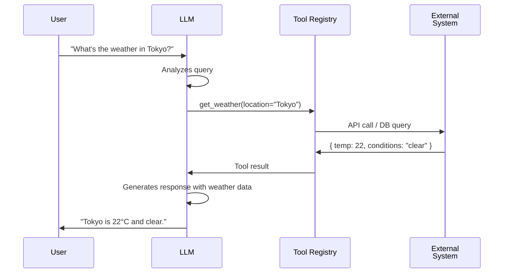
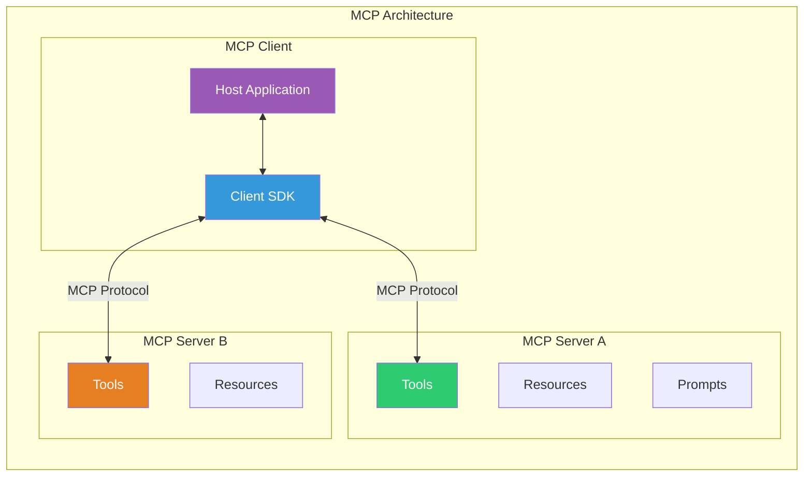
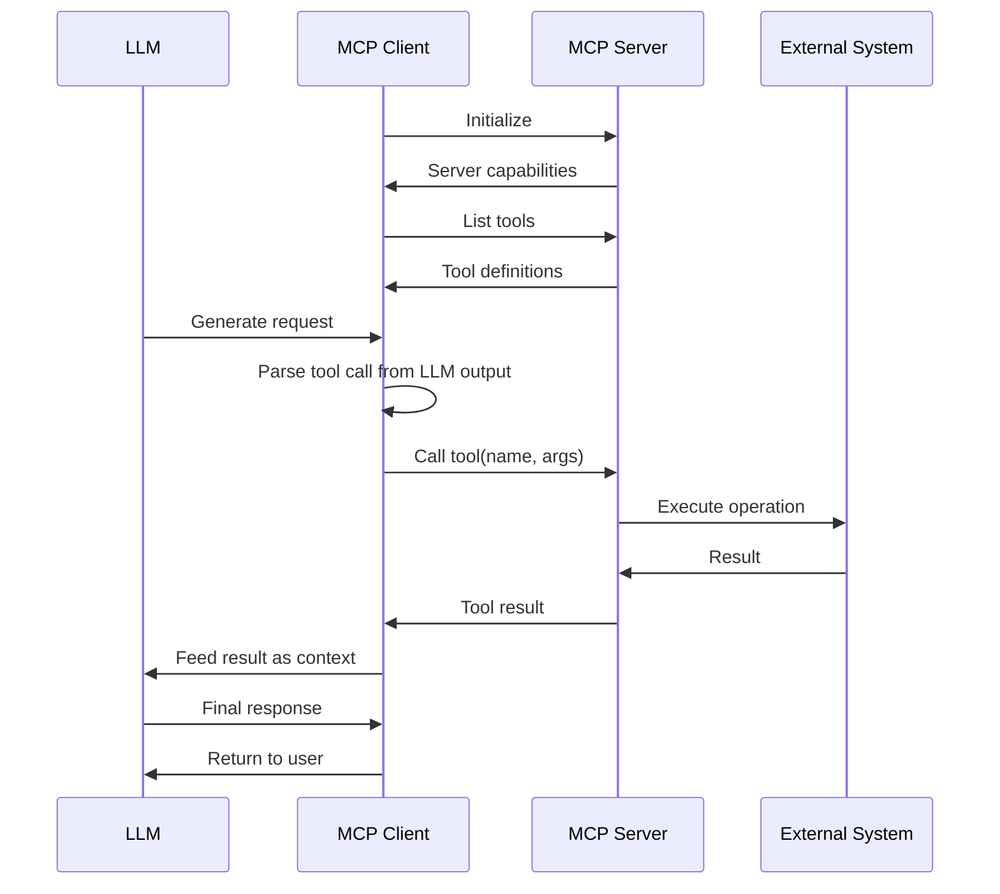
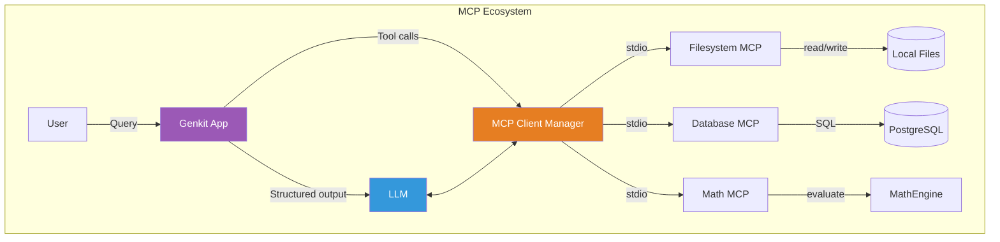

# Chapter 7: Tool Calling & Model Context Protocol

> **Learning Objectives**
> - Understand tool calling fundamentals and how LLMs invoke external functions
> - Define and register tools with Genkit's tool system
> - Master the Model Context Protocol (MCP) architecture
> - Build MCP servers exposing resources and tools
> - Connect LLMs to tools via MCP clients
> - Implement tool selection, routing, and error handling
> - Design production-grade tool ecosystems

---

## 7.1 Tool Calling Fundamentals

Tool calling (also called function calling) is the mechanism by which an LLM can request the execution of external functions. Instead of generating text alone, the model outputs a structured request to invoke a tool, passes arguments, and receives the result as additional context.

### 7.1.1 Why Tool Calling Matters

Without tools, an LLM is limited to its training data and parametric knowledge. Tools extend the model's capabilities:

| Capability | Without Tools | With Tools |
|---|---|---|
| **Real-time data** | "I don't have access to current data" | Fetch stock prices, weather, news |
| **Computation** | Prone to arithmetic errors | Execute precise calculations |
| **Databases** | Cannot query | Run SQL, retrieve records |
| **Actions** | Can only suggest | Send emails, create tickets |
| **External APIs** | Cannot integrate | Call any REST/gRPC API |

### 7.1.2 The Tool Calling Flow



### 7.1.3 How LLMs Call Tools

Tool calling works through structured output. The LLM receives tool definitions (name, description, parameter schema) alongside the user's prompt. If the model decides a tool is needed, it outputs a structured JSON object:

```
// LLM output (conceptual)
{
  "tool_call": {
    "name": "get_weather",
    "arguments": { "location": "Tokyo", "units": "celsius" }
  }
}
```

The application intercepts this, executes the tool, and feeds the result back to the LLM for the final response.

---

## 7.2 Genkit Tool Definition and Registration

Genkit provides a first-class tool system where tools are defined with Zod schemas and automatically registered with the LLM.

### 7.2.1 Defining a Calculator Tool

```typescript
import { genkit, z } from 'genkit';
import { openAI, gpt4o } from 'genkitx-openai';

const ai = genkit({
  plugins: [openAI({ apiKey: process.env.OPENAI_API_KEY })],
  model: gpt4o,
});

const calculatorTool = ai.defineTool(
  {
    name: 'calculator',
    description: 'Perform mathematical calculations. Supports +, -, *, /, ^, sqrt, sin, cos, log.',
    inputSchema: z.object({
      expression: z.string().describe('The mathematical expression to evaluate, e.g., "2 + 3 * 4"'),
    }),
    outputSchema: z.object({
      result: z.number(),
      error: z.string().nullable(),
    }),
  },
  async ({ expression }) => {
    try {
      const math = await import('mathjs');
      const result = math.evaluate(expression);
      return { result, error: null };
    } catch (err) {
      return { result: 0, error: `Failed to evaluate: ${(err as Error).message}` };
    }
  }
);

const mathFlow = ai.defineFlow(
  { name: 'mathAssistant', inputSchema: z.object({ question: z.string() }) },
  async (input) => {
    const response = await ai.generate({
      prompt: input.question,
      tools: [calculatorTool],
    });
    return response.text;
  }
);
```

### 7.2.2 Database Query Tool

```typescript
import pg from 'pg';
const { Pool } = pg;

const databaseTool = ai.defineTool(
  {
    name: 'query_database',
    description: 'Execute read-only SQL queries against the application database.',
    inputSchema: z.object({
      query: z.string().describe('The SQL SELECT query to execute'),
      params: z.array(z.any()).optional(),
    }),
    outputSchema: z.object({
      rows: z.array(z.any()),
      rowCount: z.number(),
      error: z.string().nullable(),
    }),
  },
  async ({ query, params = [] }) => {
    const normalized = query.trim().toUpperCase();
    if (!normalized.startsWith('SELECT') && !normalized.startsWith('WITH')) {
      return { rows: [], rowCount: 0, error: 'Only SELECT and WITH queries are allowed' };
    }
    const pool = new Pool({ connectionString: process.env.DATABASE_URL, max: 2 });
    try {
      const result = await pool.query(query, params);
      return { rows: result.rows, rowCount: result.rowCount ?? 0, error: null };
    } catch (err) {
      return { rows: [], rowCount: 0, error: (err as Error).message };
    } finally {
      await pool.end();
    }
  }
);
```

### 7.2.3 External API Tool

```typescript
const weatherTool = ai.defineTool(
  {
    name: 'get_weather',
    description: 'Get the current weather for a specified location.',
    inputSchema: z.object({
      location: z.string().describe('City name or "lat,lon" coordinates'),
      units: z.enum(['celsius', 'fahrenheit']).optional().default('celsius'),
    }),
  },
  async ({ location, units }) => {
    try {
      const apiKey = process.env.WEATHER_API_KEY;
      const response = await fetch(
        `https://api.weatherapi.com/v1/current.json?key=${apiKey}&q=${encodeURIComponent(location)}`
      );
      if (!response.ok) throw new Error(`API returned ${response.status}`);
      const data = await response.json();
      const current = data.current;
      return {
        location: data.location.name,
        temperature: units === 'celsius' ? current.temp_c : current.temp_f,
        conditions: current.condition.text,
        humidity: current.humidity,
        windSpeed: current.wind_kph,
      };
    } catch (err) {
      return { error: (err as Error).message };
    }
  }
);
```

### 7.2.4 Multi-Tool Flow

```typescript
const smartAssistant = ai.defineFlow(
  { name: 'smartAssistant', inputSchema: z.object({ query: z.string() }) },
  async (input) => {
    const response = await ai.generate({
      prompt: input.query,
      tools: [calculatorTool, databaseTool, weatherTool],
      config: { temperature: 0.3, maxOutputTokens: 2048 },
    });
    return response.text;
  }
);

// The LLM decides which tool to call based on the query:
// "What's 152 * 37?" → calculator
// "Show me recent orders" → query_database
// "Weather in London?" → get_weather
```

---

## 7.3 MCP (Model Context Protocol) Architecture

The Model Context Protocol (MCP) is an open standard that standardizes how LLMs connect to external tools, data sources, and services. Think of MCP as **USB-C for AI** — a universal protocol that any LLM client can use to discover and invoke any MCP-compatible server.

### 7.3.1 Why MCP?

Before MCP, every tool integration was custom: LangChain tools, custom function calls, OpenAI plugins. MCP unifies this into a single protocol.

### 7.3.2 MCP Core Concepts



| MCP Concept | Description | Analogy |
|---|---|---|
| **Host** | The application (Genkit flow, VS Code, CLI) | Operating system |
| **Client** | Connects to servers, handles tool calls | Device driver |
| **Server** | Exposes tools, resources, prompts | Peripheral device |
| **Tool** | Executable function the LLM can call | Device function |
| **Resource** | Exposed data (files, DB records, APIs) | Device data |
| **Prompt** | Reusable prompt templates | Device template |

### 7.3.3 MCP Communication Flow



---

## 7.4 Building MCP Servers

An MCP server exposes tools, resources, and prompts that clients can discover and use.

### 7.4.1 Basic MCP Server (Calculator)

```typescript
import { Server } from '@modelcontextprotocol/sdk/server/index.js';
import { StdioServerTransport } from '@modelcontextprotocol/sdk/server/stdio.js';
import {
  CallToolRequestSchema,
  ListToolsRequestSchema,
} from '@modelcontextprotocol/sdk/types.js';

const server = new Server(
  { name: 'math-mcp-server', version: '1.0.0' },
  { capabilities: { tools: {} } }
);

server.setRequestHandler(ListToolsRequestSchema, async () => ({
  tools: [
    {
      name: 'calculate',
      description: 'Evaluate a mathematical expression',
      inputSchema: {
        type: 'object',
        properties: {
          expression: { type: 'string', description: 'Expression to evaluate' },
        },
        required: ['expression'],
      },
    },
    {
      name: 'pi',
      description: 'Returns Pi to a given number of decimal places',
      inputSchema: {
        type: 'object',
        properties: {
          decimals: { type: 'number', description: 'Decimal places (1-10)', default: 4 },
        },
      },
    },
  ],
}));

server.setRequestHandler(CallToolRequestSchema, async (request) => {
  const { name, arguments: args } = request.params;
  switch (name) {
    case 'calculate': {
      try {
        const { evaluate } = await import('mathjs');
        return { content: [{ type: 'text', text: String(evaluate(args?.expression as string)) }] };
      } catch (err) {
        return { content: [{ type: 'text', text: `Error: ${(err as Error).message}` }], isError: true };
      }
    }
    case 'pi': {
      const decimals = Math.min((args?.decimals as number) ?? 4, 10);
      return { content: [{ type: 'text', text: Math.PI.toFixed(decimals) }] };
    }
    default:
      return { content: [{ type: 'text', text: `Unknown tool: ${name}` }], isError: true };
  }
});

async function start() {
  const transport = new StdioServerTransport();
  await server.connect(transport);
  console.error('Math MCP Server running on stdio');
}
start().catch(console.error);
```

### 7.4.2 Database MCP Server

```typescript
import { Server } from '@modelcontextprotocol/sdk/server/index.js';
import { StdioServerTransport } from '@modelcontextprotocol/sdk/server/stdio.js';
import pg from 'pg';
const { Pool } = pg;

/**
 * MCP Server exposing database tables as resources
 * and SQL query as a tool. Read-only enforcement
 * prevents destructive operations.
 */
class DatabaseMCPServer {
  private server: Server;
  private pool: Pool;

  constructor(connectionString: string) {
    this.pool = new Pool({ connectionString });
    this.server = new Server(
      { name: 'database-mcp-server', version: '1.0.0' },
      { capabilities: { tools: {}, resources: {} } }
    );
    this.setupHandlers();
  }

  private setupHandlers(): void {
    // List database tables as discoverable resources
    this.server.setRequestHandler(
      ListResourcesRequestSchema, // imported from SDK types
      async () => {
        const result = await this.pool.query(
          `SELECT table_name, table_type FROM information_schema.tables WHERE table_schema = 'public'`
        );
        return {
          resources: result.rows.map((row) => ({
            uri: `postgres://public/${row.table_name}`,
            name: `Table: ${row.table_name}`,
            description: `Database table: ${row.table_name} (${row.table_type})`,
            mimeType: 'application/json',
          })),
        };
      }
    );

    // Read resource: execute SELECT on a table
    this.server.setRequestHandler(
      ReadResourceRequestSchema,
      async (request) => {
        const tableName = request.params.uri.split('/').pop();
        const query = `SELECT * FROM "${tableName}" LIMIT 100`;
        const result = await this.pool.query(query);
        return {
          contents: [{ uri: request.params.uri, mimeType: 'application/json', text: JSON.stringify(result.rows, null, 2) }],
        };
      }
    );

    // SQL query tool — read-only enforced
    this.server.setRequestHandler(
      CallToolRequestSchema,
      async (request) => {
        if (request.params.name !== 'query') {
          return { content: [{ type: 'text', text: 'Unknown tool' }], isError: true };
        }
        const sql = (request.params.arguments as { query: string }).query;
        if (!/^\s*(SELECT|WITH)/i.test(sql)) {
          return { content: [{ type: 'text', text: 'Only SELECT queries allowed' }], isError: true };
        }
        try {
          const result = await this.pool.query(sql);
          return { content: [{ type: 'text', text: JSON.stringify(result.rows, null, 2) }] };
        } catch (err) {
          return { content: [{ type: 'text', text: `Error: ${(err as Error).message}` }], isError: true };
        }
      }
    );

    // List tools
    this.server.setRequestHandler(ListToolsRequestSchema, async () => ({
      tools: [{
        name: 'query',
        description: 'Execute a read-only SQL query',
        inputSchema: {
          type: 'object',
          properties: { query: { type: 'string', description: 'SELECT or WITH query' } },
          required: ['query'],
        },
      }],
    }));
  }

  async start(): Promise<void> {
    const transport = new StdioServerTransport();
    await this.server.connect(transport);
    console.error('Database MCP Server running');
  }
}
```

### 7.4.3 File System MCP Server

```typescript
import { Server } from '@modelcontextprotocol/sdk/server/index.js';
import { StdioServerTransport } from '@modelcontextprotocol/sdk/server/stdio.js';
import { readFile, writeFile, readdir, stat } from 'fs/promises';
import { join, resolve } from 'path';

class FileSystemMCPServer {
  private server: Server;
  private allowedBasePath: string;

  constructor(basePath: string) {
    this.allowedBasePath = resolve(basePath);
    this.server = new Server(
      { name: 'filesystem-mcp-server', version: '1.0.0' },
      { capabilities: { tools: {} } }
    );
    this.setupHandlers();
  }

  private validatePath(requestedPath: string): string {
    const resolved = resolve(this.allowedBasePath, requestedPath);
    if (!resolved.startsWith(this.allowedBasePath)) {
      throw new Error(`Access denied: path is outside allowed directory`);
    }
    return resolved;
  }

  private setupHandlers(): void {
    this.server.setRequestHandler(ListToolsRequestSchema, async () => ({
      tools: [
        {
          name: 'read_file',
          description: 'Read the contents of a file',
          inputSchema: { type: 'object', properties: { path: { type: 'string' } }, required: ['path'] },
        },
        {
          name: 'write_file',
          description: 'Write content to a file',
          inputSchema: { type: 'object', properties: { path: { type: 'string' }, content: { type: 'string' } }, required: ['path', 'content'] },
        },
        {
          name: 'list_directory',
          description: 'List files and directories',
          inputSchema: { type: 'object', properties: { path: { type: 'string' } }, required: ['path'] },
        },
      ],
    }));

    this.server.setRequestHandler(CallToolRequestSchema, async (request) => {
      const { name, arguments: args } = request.params;
      try {
        switch (name) {
          case 'read_file': {
            const content = await readFile(this.validatePath(args?.path as string), 'utf-8');
            return { content: [{ type: 'text', text: content }] };
          }
          case 'write_file': {
            const fullPath = this.validatePath(args?.path as string);
            await writeFile(fullPath, args?.content as string, 'utf-8');
            return { content: [{ type: 'text', text: `Written ${(args?.content as string).length} bytes` }] };
          }
          case 'list_directory': {
            const fullPath = this.validatePath(args?.path as string);
            const entries = await readdir(fullPath);
            const details = await Promise.all(entries.map(async (entry) => {
              const s = await stat(join(fullPath, entry));
              return { name: entry, type: s.isDirectory() ? 'directory' : 'file', size: s.size };
            }));
            return { content: [{ type: 'text', text: JSON.stringify(details, null, 2) }] };
          }
          default: return { content: [{ type: 'text', text: `Unknown tool: ${name}` }], isError: true };
        }
      } catch (err) {
        return { content: [{ type: 'text', text: `Error: ${(err as Error).message}` }], isError: true };
      }
    });
  }

  async start(): Promise<void> {
    const transport = new StdioServerTransport();
    await this.server.connect(transport);
    console.error(`FS MCP Server running (sandbox: ${this.allowedBasePath})`);
  }
}

// Usage
const fsServer = new FileSystemMCPServer('./workspace');
fsServer.start().catch(console.error);
```

---

## 7.5 MCP Clients Connecting LLMs to Tools

An MCP client connects to one or more MCP servers and exposes their tools to the LLM.

### 7.5.1 MCP Client with Genkit Integration

```typescript
import { Client } from '@modelcontextprotocol/sdk/client/index.js';
import { StdioClientTransport } from '@modelcontextprotocol/sdk/client/stdio.js';

/**
 * MCP Client that connects to a server and exposes
 * its tools to Genkit's tool system.
 */
class MCPClient {
  private client: Client;
  private transport: StdioClientTransport;
  private connected = false;
  private toolCache: Array<{ name: string; description: string; inputSchema: object }> = [];

  constructor(serverCommand: string, serverArgs: string[]) {
    this.client = new Client(
      { name: 'genkit-mcp-client', version: '1.0.0' },
      { capabilities: {} }
    );
    this.transport = new StdioClientTransport({ command: serverCommand, args: serverArgs });
  }

  async connect(): Promise<void> {
    await this.client.connect(this.transport);
    this.connected = true;
    const result = await this.client.listTools();
    this.toolCache = result.tools.map((t) => ({
      name: t.name,
      description: t.description || '',
      inputSchema: t.inputSchema as object,
    }));
    console.error(`Connected. Tools: ${this.toolCache.map(t => t.name).join(', ')}`);
  }

  async getGenkitTools(): Promise<ReturnType<typeof ai.defineTool>[]> {
    if (!this.connected) await this.connect();
    return this.toolCache.map((toolDef) => {
      const props = (toolDef.inputSchema as { properties?: Record<string, unknown> })?.properties || {};
      const required = (toolDef.inputSchema as { required?: string[] })?.required || [];
      const shape: Record<string, z.ZodTypeAny> = {};
      for (const [key, prop] of Object.entries(props)) {
        const p = prop as { type?: string; description?: string };
        let zodType: z.ZodTypeAny;
        switch (p.type) {
          case 'string': zodType = z.string(); break;
          case 'number': zodType = z.number(); break;
          case 'boolean': zodType = z.boolean(); break;
          case 'integer': zodType = z.number().int(); break;
          default: zodType = z.any();
        }
        if (p.description) zodType = zodType.describe(p.description);
        shape[key] = required.includes(key) ? zodType : zodType.optional();
      }
      return ai.defineTool(
        { name: toolDef.name, description: toolDef.description, inputSchema: z.object(shape) },
        async (args) => {
          const result = await this.client.callTool({ name: toolDef.name, arguments: args });
          return result.content.filter((c) => c.type === 'text').map((c: any) => c.text).join('\n');
        }
      );
    });
  }

  async disconnect(): Promise<void> {
    if (this.connected) { await this.client.close(); this.connected = false; }
  }
}

// Usage
async function mcpExample() {
  const mcpClient = new MCPClient('node', ['./dist/math-server.js']);
  const tools = await mcpClient.getGenkitTools();

  const flow = ai.defineFlow(
    { name: 'mcpAssistant', inputSchema: z.object({ query: z.string() }) },
    async (input) => (await ai.generate({ prompt: input.query, tools })).text
  );

  console.log(await flow({ query: 'What is 2^10 + 5?' }));
  await mcpClient.disconnect();
}
```

### 7.5.2 Multi-Server Connection Manager

```typescript
class MCPClientManager {
  private clients: MCPClient[] = [];

  async addServer(command: string, args: string[]): Promise<void> {
    const client = new MCPClient(command, args);
    await client.connect();
    this.clients.push(client);
  }

  async getAllTools(): Promise<ReturnType<typeof ai.defineTool>[]> {
    const allTools: ReturnType<typeof ai.defineTool>[] = [];
    for (const client of this.clients) {
      allTools.push(...(await client.getGenkitTools()));
    }
    return allTools;
  }

  async disconnectAll(): Promise<void> {
    await Promise.all(this.clients.map((c) => c.disconnect()));
  }
}

// Connect to multiple servers and aggregate tools
async function multiServerDemo() {
  const manager = new MCPClientManager();
  await manager.addServer('node', ['./dist/math-server.js']);
  await manager.addServer('node', ['./dist/fs-server.js']);
  const allTools = await manager.getAllTools();
  console.log(`Total tools: ${allTools.length}`);
  // Now use allTools in any Genkit flow
  await manager.disconnectAll();
}
```

---

## 7.6 Tool Selection and Routing

When an LLM has many tools available, it must select the right one.

### 7.6.1 Tool Routing with Context

```typescript
interface ToolRoute {
  pattern: RegExp;
  tools: ReturnType<typeof ai.defineTool>[];
  description: string;
}

/**
 * Context-aware tool router.
 */
class ToolRouter {
  private routes: ToolRoute[] = [];

  addRoute(pattern: RegExp, tools: ReturnType<typeof ai.defineTool>[], description: string): void {
    this.routes.push({ pattern, tools, description });
  }

  async selectTools(query: string): Promise<{
    tools: ReturnType<typeof ai.defineTool>[];
    route: string;
  }> {
    for (const route of this.routes) {
      if (route.pattern.test(query)) return { tools: route.tools, route: route.description };
    }
    // LLM fallback classification
    const routeList = this.routes.map((r, i) => `${i + 1}. ${r.description}`).join('\n');
    const classification = await ai.generate({
      prompt: `Which tool group best handles this query?\n${routeList}\nQuery: ${query}\nGroup number:`,
      config: { temperature: 0, maxOutputTokens: 5 },
    });
    const idx = parseInt(classification.text.trim()) - 1;
    if (idx >= 0 && idx < this.routes.length) {
      return { tools: this.routes[idx].tools, route: this.routes[idx].description };
    }
    return { tools: this.routes.flatMap((r) => r.tools), route: 'all tools' };
  }
}

const router = new ToolRouter();
router.addRoute(/calculate|math|multiply|divide|\d+\s*[+\-*/]/, [calculatorTool], 'Math');
router.addRoute(/weather|temperature|rain|forecast/, [weatherTool], 'Weather');
router.addRoute(/find|search|lookup|show me|query|database/, [databaseTool], 'Data lookup');

async function routedQuery(query: string) {
  const { tools, route } = await router.selectTools(query);
  console.log(`Route: ${route} (${tools.length} tools)`);
  return (await ai.generate({ prompt: query, tools })).text;
}
```

---

## 7.7 Error Handling in Tool Calls

Robust error handling is essential when LLMs interact with external systems.

### 7.7.1 Retry with Backoff

```typescript
function withRetry(
  tool: ReturnType<typeof ai.defineTool>,
  options: { maxRetries?: number; fallback?: string } = {}
): ReturnType<typeof ai.defineTool> {
  const maxRetries = options.maxRetries ?? 2;
  const fallback = options.fallback ?? 'Service temporarily unavailable.';

  return ai.defineTool(
    { name: tool.name, description: tool.description, inputSchema: tool.inputSchema },
    async (args) => {
      let lastError: Error | null = null;
      for (let attempt = 1; attempt <= maxRetries; attempt++) {
        try {
          return await (tool as any).__call(args);
        } catch (err) {
          lastError = err as Error;
          if (attempt < maxRetries) await new Promise((r) => setTimeout(r, attempt * 1000));
        }
      }
      return { error: true, message: fallback, details: lastError?.message };
    }
  );
}
```

### 7.7.2 Graceful Degradation in Flows

```typescript
const robustFlow = ai.defineFlow(
  { name: 'robustAssistant', inputSchema: z.object({ query: z.string() }) },
  async (input) => {
    const response = await ai.generate({
      systemPrompt: `You have tools that may fail. If a tool returns an error, inform the user and suggest alternatives. Never pretend to have executed a failed operation.`,
      prompt: input.query,
      tools: [
        withRetry(weatherTool, { maxRetries: 2 }),
        withRetry(databaseTool, { maxRetries: 1, fallback: 'Database unavailable. Try later.' }),
        calculatorTool,
      ],
      config: { temperature: 0.3 },
    });
    return response.text;
  }
);
```

### 7.7.3 Tool Call Monitoring

```typescript
interface ToolCallLog {
  toolName: string; arguments: unknown; result: unknown;
  duration: number; error: string | null;
}

class ToolMonitor {
  private calls: ToolCallLog[] = [];

  wrap(tool: ReturnType<typeof ai.defineTool>): ReturnType<typeof ai.defineTool> {
    const monitor = this;
    return ai.defineTool(
      { name: tool.name, description: tool.description, inputSchema: tool.inputSchema },
      async (args) => {
        const start = Date.now();
        const log: ToolCallLog = { toolName: tool.name, arguments: args, result: null, duration: 0, error: null };
        try {
          const result = await (tool as any).__call(args);
          log.result = result;
          return result;
        } catch (err) {
          log.error = (err as Error).message;
          throw err;
        } finally {
          log.duration = Date.now() - start;
          monitor.calls.push(log);
        }
      }
    );
  }

  getReport(): string {
    const total = this.calls.length;
    const errors = this.calls.filter((c) => c.error).length;
    const avgDuration = total > 0 ? this.calls.reduce((s, c) => s + c.duration, 0) / total : 0;
    return `Tool Calls: ${total} | Errors: ${errors} | Avg: ${avgDuration.toFixed(0)}ms\nTools: ${[...new Set(this.calls.map(c => c.toolName))].join(', ')}`;
  }
}
```

### 7.7.4 Production Tool Manifest

```typescript
async function createProductionTools() {
  const monitor = new ToolMonitor();
  
  const emailTool = ai.defineTool(
    {
      name: 'send_email',
      description: 'Send an email. Rate limited to 10/hour.',
      inputSchema: z.object({ to: z.string().email(), subject: z.string(), body: z.string() }),
    },
    async ({ to, subject, body }) => {
      console.log(`Sending email to ${to}: ${subject}`);
      return { success: true, messageId: `msg_${Date.now()}` };
    }
  );

  return {
    tools: [
      monitor.wrap(withRetry(databaseTool, { maxRetries: 2 })),
      monitor.wrap(calculatorTool),
      monitor.wrap(emailTool),
    ],
    monitor,
  };
}
```

### 7.7.5 Tool Composition and Chaining

Complex workflows often require composing multiple tools together. Genkit's flow system naturally supports tool chaining where the output of one tool feeds into another:

```typescript
/**
 * Composed flow: chains database lookup → calculation → email.
 * Each step calls the next only if the previous succeeded.
 */
const composedWorkflow = ai.defineFlow(
  {
    name: 'composedToolWorkflow',
    inputSchema: z.object({
      orderId: z.string(),
    }),
  },
  async (input) => {
    // Step 1: Look up order from database
    const orderData = await databaseTool({ 
      query: `SELECT * FROM orders WHERE id = '${input.orderId}'`,
    });
    
    if (orderData.error || orderData.rows.length === 0) {
      return { error: 'Order not found' };
    }

    const order = orderData.rows[0];

    // Step 2: Calculate total with tax
    const subtotal = order.amount;
    const taxResult = await calculatorTool({
      expression: `${subtotal} * 0.08`,
    });

    const totalResult = await calculatorTool({
      expression: `${subtotal} + ${taxResult.result}`,
    });

    // Step 3: Send email notification
    const emailResult = await (async () => {
      try {
        // Simulated email send
        console.log(`Sending invoice to ${order.email}`);
        return { success: true, messageId: `inv_${Date.now()}` };
      } catch (err) {
        return { error: (err as Error).message };
      }
    })();

    return {
      orderId: input.orderId,
      subtotal,
      tax: taxResult.result,
      total: totalResult.result,
      emailSent: emailResult.success,
    };
  }
);
```

This pattern is powerful because each tool call is independently testable, monitored, and retryable. The composed flow itself can be exposed as a higher-level tool to the LLM.

---

## 7.8 MCP Tool Ecosystem Architecture



---

## Chapter Summary

- **Tool calling** extends LLM capabilities beyond text generation to interact with real-world systems.
- **Genkit tools** are defined with Zod schemas and automatically registered with the LLM for structured calling.
- **MCP (Model Context Protocol)** provides a universal standard for connecting LLMs to external tools and data.
- **MCP Servers** expose tools, resources, and prompts via stdio or HTTP transports.
- **MCP Clients** connect to servers, discover capabilities, and bridge them to Genkit flows.
- **Tool routing** ensures the right tool handles the right query, using patterns or LLM classification.
- **Error handling** with retries, graceful degradation, and monitoring is essential for production systems.

### Practical Takeaways

1. Always provide **detailed descriptions** for tools — the LLM uses these to decide which tool to call.
2. Use **Zod schemas** to enforce type safety on tool inputs and outputs.
3. Prefer **MCP** over custom tool integrations for interoperability across LLM frameworks.
4. Implement **retry with backoff** for unreliable external APIs.
5. **Monitor tool calls** in production to catch failures and optimize performance.
6. **Sandbox** MCP server access to the minimum necessary scope.

---

## Chapter Quiz (10 MCQs)

**1. What is the primary purpose of tool calling in LLMs?**
- A) To reduce the model's inference time
- B) To execute external functions and return results as context
- C) To compress prompts for longer context windows
- D) To replace the need for vector databases

**2. In Genkit, how are tool schemas defined?**
- A) Using TypeScript interfaces
- B) Using Zod schemas
- C) Using JSON Schema files
- D) Using OpenAPI specs

**3. What does MCP stand for?**
- A) Model Computation Protocol
- B) Model Context Protocol
- C) Multi-Chain Processing
- D) Message Control Protocol

**4. Which transport does the stdio-based MCP server use?**
- A) HTTP
- B) WebSocket
- C) Standard input/output
- D) Unix sockets

**5. What is a key security measure when exposing a database tool?**
- A) Allow all SQL statements
- B) Restrict to read-only SELECT/WITH queries
- C) Use a separate database for each user
- D) Never log queries

**6. What is the role of an MCP Client?**
- A) It hosts the LLM model itself
- B) It connects to MCP servers and exposes their tools to applications
- C) It replaces the need for tool definitions
- D) It manages user authentication

**7. Which strategy helps the LLM select the correct tool?**
- A) Random selection
- B) Detailed tool descriptions in the prompt
- C) Removing tool descriptions
- D) Using only one tool at a time

**8. What is exponential backoff in tool error handling?**
- A) Increasing the retry delay exponentially
- B) Decreasing the retry delay exponentially
- C) Retrying the same call indefinitely
- D) Switching to a different tool after each failure

**9. Which MCP SDK method lists available tools on a server?**
- A) `server.listTools()`
- B) `client.listTools()`
- C) `server.getTools()`
- D) `tool.discover()`

**10. What is a benefit of connecting multiple MCP servers to one client?**
- A) Faster response times
- B) Aggregated tool ecosystem from diverse providers
- C) Lower cost
- D) Eliminates the need for a vector database

<details>
<summary>Answer Key</summary>

1. B, 2. B, 3. B, 4. C, 5. B, 6. B, 7. B, 8. A, 9. B, 10. B
</details>

---

## Exercises

### Exercise 1: Build a Code Execution MCP Server
Create an MCP server with a `run_javascript` tool that accepts JS code, runs it in a sandboxed VM (Node `vm` module) with a 5-second timeout, and returns the output. Block access to `require`, `process`, and `fs`.

### Exercise 2: LLM-Powered Tool Router
Build a `ToolRouter` that uses an LLM to classify queries into tool groups. Create three groups (data, computation, communication) with at least two tools each. Test with 10 diverse queries and report routing accuracy.

### Exercise 3: MCP Client with Fallback Chain
Create an MCP client manager that maintains a primary and fallback server. If a tool call on the primary fails, automatically retry on the fallback. Implement a health check pinging both servers every 30 seconds.

### Exercise 4: Tool Monitoring Dashboard
Build a monitoring system that: (1) wraps all tools with timing/error capture, (2) stores call logs in PostgreSQL, (3) provides a stats API, (4) reports most-called tool, error rate, and average latency.

### Exercise 5: Multi-Step Workflow with Tools
Create a Genkit flow that chains: (1) `read_file` to read a CSV, (2) `calculator` to compute statistics, (3) `query_database` to store results, (4) `send_email` to email the summary. The LLM should orchestrate all steps autonomously.

---

> **Next Chapter**: Chapter 8 — AI Agents with LangGraph & Genkit, where we build autonomous agents with state management and human-in-the-loop patterns.
