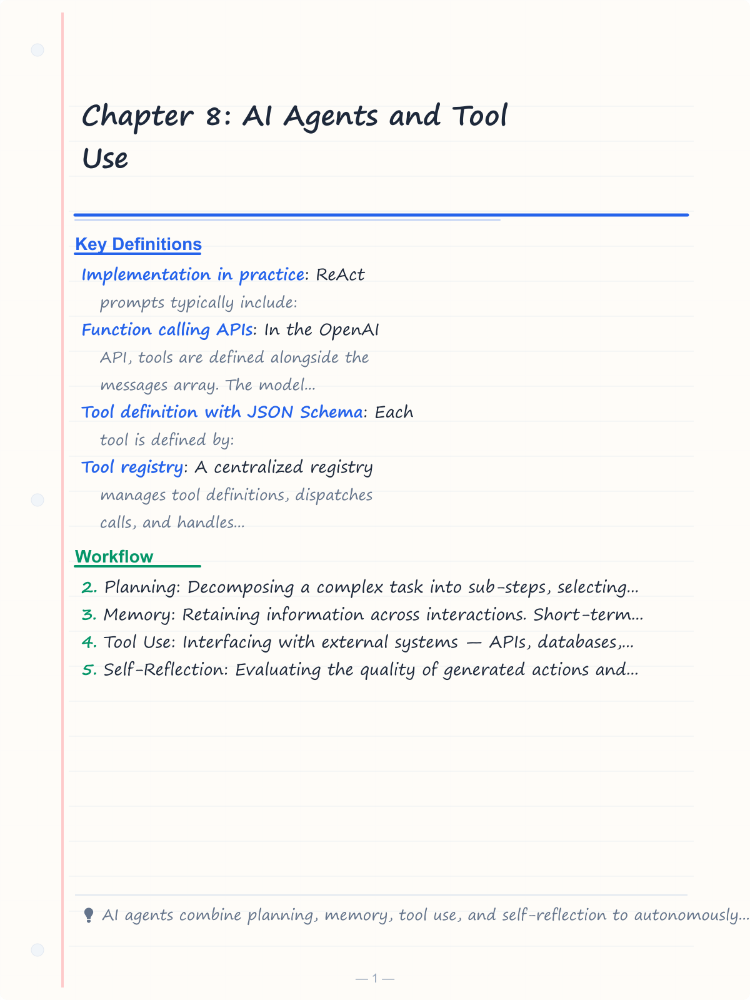
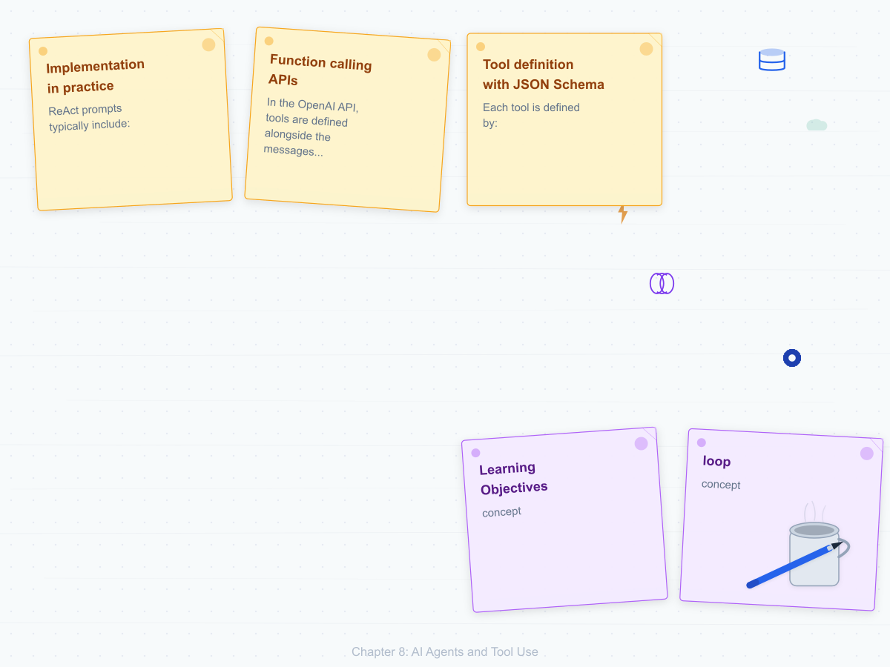
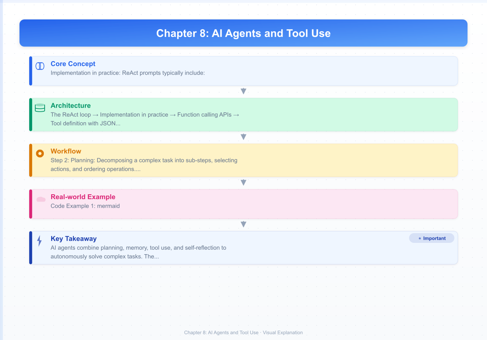
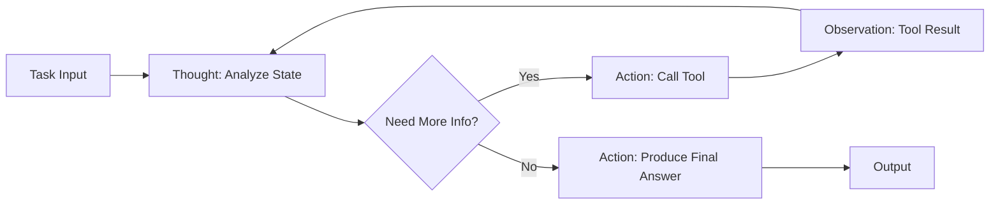
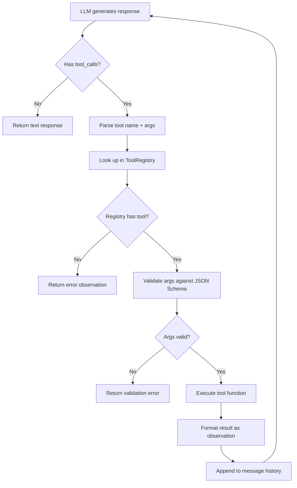
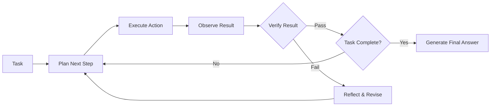
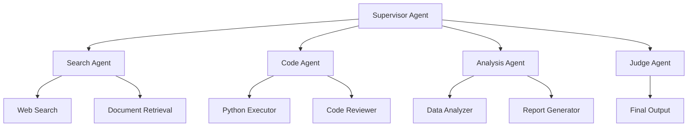

# Chapter 8: AI Agents and Tool Use

> **Learning Objectives**
>
> By the end of this chapter, you will be able to:
> - Define the core components of an AI agent: planning, memory, tool use, and self-reflection
> - Implement the ReAct reasoning-acting loop with observation feedback
> - Design tool definitions using JSON Schema and a tool registry
> - Compare planning strategies: ReAct, Plan-and-Solve, Tree-of-Thought
> - Manage agent memory across short-term and long-term storage
> - Diagnose and mitigate common agent failure modes
> - Evaluate agent performance on task completion, efficiency, and robustness

---

<!-- Image Gallery -->
<section class="lesson-visuals" aria-label="Visual learning resources">
  <header><span>VISUAL LEARNING</span><h2>See it. Review it. Remember it.</h2></header>
  <a class="lesson-visual-card" href="../../assets/images/lessons/modern-ai-engineering/08-ai-agents-and-tool-use/handwritten-notes.png" target="_blank" rel="noopener">
    
    <span><strong>Handwritten notes</strong>Condensed notes for deliberate review.</span>
  </a>
  <a class="lesson-visual-card" href="../../assets/images/lessons/modern-ai-engineering/08-ai-agents-and-tool-use/sticky-notes.png" target="_blank" rel="noopener">
    
    <span><strong>Sticky-note revision</strong>Fast recall prompts for revision.</span>
  </a>
  <a class="lesson-visual-card" href="../../assets/images/lessons/modern-ai-engineering/08-ai-agents-and-tool-use/visual-explanation.png" target="_blank" rel="noopener">
    
    <span><strong>Visual concept guide</strong>A connected explanation of the key ideas.</span>
  </a>
</section>
<!-- End Image Gallery -->

## 8.1 What Makes an AI Agent

An AI agent is an autonomous system that perceives its environment, reasons about goals, takes actions via tools, and reflects on outcomes to improve future behavior. Unlike a simple LLM call, an agent operates in a **loop**: it receives a task, formulates a plan, executes actions, observes results, and iterates until the task is complete or a termination condition is reached.

The five core components of an AI agent are:

- **Planning**: Decomposing a complex task into sub-steps, selecting actions, and ordering operations. Planning can be single-step (the model generates one action at a time) or multi-step (the model produces a full plan upfront).
- **Memory**: Retaining information across interactions. Short-term memory is the context window; long-term memory uses external storage (vector databases, key-value stores). Episodic memory stores past experiences.
- **Tool Use**: Interfacing with external systems — APIs, databases, search engines, file systems, calculators, code interpreters. Tools extend the agent's capabilities beyond text generation.
- **Self-Reflection**: Evaluating the quality of generated actions and outcomes. The agent can critique its own reasoning, detect errors, and adjust its approach.
- **Autonomy**: The agent operates without continuous human intervention, deciding when to ask for help and when to proceed independently.


Agents fall on a spectrum from **simple reactive agents** (one-shot tool callers) to **autonomous long-horizon agents** that can operate for hours across dozens of tool calls and multiple reasoning steps.

---

## 8.2 The ReAct Pattern

ReAct (Reasoning + Acting) is the most widely adopted agent architecture. It interleaves reasoning traces ("thoughts") with actions and observations, enabling the model to dynamically adjust its plan based on intermediate results.

**The ReAct loop**:
1. **Thought**: The model analyzes the current state, identifies what information is needed, and decides what to do next.
2. **Action**: The model invokes a tool with specific parameters. The action is formatted as a structured command (e.g., JSON function call).
3. **Observation**: The tool returns a result, which is appended to the context.
4. The loop repeats: the model reads the observation, generates a new thought, and decides whether to take another action or produce the final answer.



The key insight of ReAct is that **reasoning traces improve action quality** and **action outcomes improve reasoning**. By externalizing the reasoning process, ReAct also provides interpretability — developers can read the model's chain of thought to understand why it took a particular action.

**Implementation in practice**: ReAct prompts typically include:
1. A system message describing available tools and their signatures
2. A few-shot example showing the thought-action-observation pattern
3. A stop condition: produce a final answer when sufficient information is gathered

```typescript
// Pseudocode for a ReAct loop
async function reactLoop(task: string, maxSteps: number): Promise<string> {
  let context = `Task: ${task}\n`;
  for (let step = 0; step < maxSteps; step++) {
    const response = await llm.generate(context + "Thought:");
    context += response + "\n";
    if (response.includes("Final Answer:")) {
      return response;
    }
    const action = parseAction(response);
    const observation = await executeTool(action);
    context += `Observation: ${observation}\n`;
  }
  return "Max steps exceeded.";
}
```

---

## 8.3 Tool Calling

Tool calling (also called function calling) is the mechanism by which an agent invokes external capabilities. Modern LLMs support structured tool calling natively through chat completion APIs.

**Function calling APIs**: In the OpenAI API, tools are defined alongside the messages array. The model can respond with a `tool_calls` field containing the function name and arguments. Providers like Anthropic (Claude), Google (Gemini), and open-source models (via `tool_use` formats) offer similar interfaces.

**Tool definition with JSON Schema**: Each tool is defined by:
- `name`: A unique identifier
- `description`: What the tool does (helps the model choose correctly)
- `parameters`: A JSON Schema object describing expected arguments



**Tool registry**: A centralized registry manages tool definitions, dispatches calls, and handles errors. The registry is responsible for:
- Storing tool definitions (name, description, schema, implementation)
- Validating arguments against the defined schema
- Executing the tool function with proper error boundaries
- Formatting results and errors into observation strings

**Error handling**: Tool calls can fail for many reasons — network errors, invalid arguments, rate limits, timeouts. The agent must handle these gracefully:
- Catch all errors and return meaningful error observations
- Implement retry logic with exponential backoff for transient failures
- Set per-tool timeouts to prevent agent loops
- Log all tool failures for debugging

---

## 8.4 Planning Strategies

Different tasks require different planning approaches. The choice depends on task complexity, available compute, and the cost of intermediate steps.

**Single-step (Direct)**: The model generates a final answer directly without intermediate steps. Used for simple, well-defined queries. Fast but unreliable for complex multi-step tasks.

**ReAct**: Interleaves reasoning and acting dynamically. The model decides each next step based on observations. Best for tasks where the plan depends on intermediate results (web search, data analysis).

**Plan-and-Solve**: The model generates a complete plan upfront, then executes each step sequentially. Reduces the reasoning burden during execution but cannot adapt to unexpected observations. Good for deterministic workflows.

**Tree-of-Thought (ToT)**: Maintains multiple reasoning paths simultaneously. At each step, the model generates several candidate "thoughts," evaluates them, and prunes weak branches. Uses BFS or DFS to explore the reasoning tree. Highest quality but also highest cost (5–20× more tokens).

**LLM Compiler**: Frames task execution as a program. The model generates a "program" of hierarchical steps with dependencies. A separate executor runs the program, parallelizing independent steps. Good for complex, decomposable tasks with clear dependencies.

| Strategy | Steps | Flexibility | Cost | Best For |
|----------|-------|-------------|------|----------|
| Single-Step | 1 | None | Low | Simple Q&A |
| ReAct | Dynamic | High | Medium | Search, analysis |
| Plan-and-Solve | Fixed | Low | Medium | Deterministic pipelines |
| Tree-of-Thought | Branching | Very High | High | Creative, math, reasoning |
| LLM Compiler | Hierarchical | Medium | High | Complex workflows |

In practice, the majority of production agents use **ReAct** as their default strategy, falling back to Plan-and-Solve for well-understood tasks and occasionally using ToT for high-stakes reasoning problems.

---

## 8.5 Agent Memory

Memory is what distinguishes a stateful agent from a stateless LLM call. Agents need memory to maintain context across multiple turns, recall past decisions, and learn from experience.

**Short-term memory (Context window)**: The model's immediate context. Includes the task description, conversation history, and recent observations. Limited by the model's maximum context length (4K–200K tokens). Managed by sliding window or summarization when approaching the limit.

**Long-term memory (Retrieval)**: External storage accessed via retrieval. Common implementations:
- **Vector databases** (Chroma, Pinecone, Qdrant): Store embeddings of past interactions. Retrieved by semantic similarity when the agent needs relevant history.
- **Key-value stores** (Redis): Store structured facts. Retrieved by exact key match.
- **SQL databases**: Store structured logs of past actions and outcomes.

**Episodic memory**: Stores specific past episodes — what task was attempted, what plan was used, what went wrong. The agent can query episodic memory to avoid repeating mistakes. Implemented as a vector store with episode-level granularity.

**Working memory**: A scratchpad where the agent writes intermediate reasoning, partial calculations, and in-progress plans. Cleared when the task completes. Often implemented as a simple string buffer within the context.

**Memory summarization**: As context grows, the agent can summarize old interactions to preserve key information while reducing token count. Common summarization triggers:
- Context exceeds N% of the limit
- A natural breakpoint is reached (task sub-step completed)
- The agent identifies redundant or irrelevant content

---

## 8.6 Multi-Step Reasoning

Multi-step reasoning enables agents to solve complex problems that require chaining multiple operations, verifying intermediate results, and correcting course.

**Chain-of-Thought (CoT)**: The model generates intermediate reasoning steps before producing the final answer. CoT significantly improves performance on math, logic, and multi-hop QA tasks. Zero-shot CoT uses the simple prompt "Let's think step by step."

**Reflection**: After generating an answer, the model critiques its own output. Reflection prompts like "Check your answer for errors" can catch mistakes before final output. The agent can generate multiple candidate answers, reflect on each, and select the best.

**Self-critique**: The model acts as both generator and critic. It generates a solution, then evaluates it against criteria (correctness, completeness, efficiency). If the critique identifies issues, the model revises the solution. This loop repeats until the critique is satisfied.

**Verification loops**: The agent explicitly verifies intermediate results before proceeding. For example, after a web search, the agent might ask "Did the search result answer my question?" before moving to the next step. Verification reduces error propagation.

The interplay of planning, acting, and verification creates a robust reasoning cycle:



---

## 8.7 Common Failure Modes

AI agents are powerful but prone to several failure modes that must be anticipated and mitigated.

**Loops**: The agent repeats the same action without progress. For example, calling a search API with the same query, getting the same result, and searching again. Mitigations include step limits, repetition detection, and action diversity checking.

**Hallucination propagation**: The agent generates a false intermediate fact, then builds further reasoning on that false premise. Each step compounds the error. Mitigation: verify facts against trusted sources before using them in subsequent reasoning.

**Tool misuse**: The agent calls a tool with incorrect parameters, misinterprets the tool's purpose, or uses the wrong tool entirely. Mitigations: clear tool descriptions, input validation, and output formatting guidelines.

**Context overflow**: Long agent sessions exceed the model's context window, causing the oldest information (often the original task and early observations) to be truncated. Mitigations: context compression, summarization, sliding windows.

**Cascading errors**: An early small error leads to increasingly large failures downstream. Mitigations: verification checkpoints, rollback capability, human-in-the-loop approval for critical actions.

| Failure Mode | Example | Mitigation |
|-------------|---------|------------|
| Loop | Repeatedly searching the same query | Step limit, diversity check |
| Hallucination Propagation | Using a fake company name in a calculation | Fact-checking, grounding |
| Tool Misuse | Calling `send_email` when `search_contacts` was needed | Better descriptions, validation |
| Context Overflow | Losing the original task after 20 steps | Summarization, checkpointing |
| Cascading Error | Wrong address → wrong route → missed deadline | Verification at each step |
| Cost Explosion | 100+ tool calls for a simple task | Budget limits, cost tracking |

---

## 8.8 Agent Evaluation

Evaluating agents is more complex than evaluating single LLM calls because agents produce long, multi-step traces with intermediate states.

**Task completion rate (TCR)**: The percentage of tasks the agent completes successfully. The simplest and most important metric. Success criteria must be clearly defined per task (exact match, LLM-judged correctness, human evaluation).

**Efficiency**: Measured as steps per task, tokens per task, or wall-clock time. A high-completion-rate agent that uses 50 steps per task may be impractical compared to one that uses 10 steps with similar quality.

**Robustness**: How the agent handles unexpected situations — tool failures, ambiguous instructions, missing information. Measured by injecting perturbations into the evaluation set (missing parameters, API timeouts, irrelevant context).

**Cost per task**: Combines LLM inference cost (per-token pricing) and tool execution cost (API calls, compute). A cheaper agent that completes 85% of tasks may be preferable to an expensive one at 95%, depending on the use case.

**Human preference**: For subjective tasks (customer support, creative assistance), human evaluators compare agent traces. Side-by-side A/B testing with human raters provides the most reliable quality signal.

**Evaluation frameworks**: LangSmith, Weights & Biases, and Arize AI provide agent tracing and evaluation. Open-source tools like Agenta and Phoenix also support agent evaluation workflows.

---

## 8.9 Multi-Agent Patterns

Complex tasks often benefit from multiple specialized agents collaborating. Each agent has a specific role, and they communicate through structured messages.

**Supervisor pattern**: A supervisor agent delegates tasks to worker agents and aggregates results. The supervisor decides the plan, assigns work, and validates output. Workers are specialized (search agent, code agent, analysis agent).

**Delegation pattern**: Any agent can delegate sub-tasks to other agents. Agents register their capabilities, and delegators select peers based on capability matching. Decentralized but requires capability discovery.

**Debate pattern**: Two or more agents independently work on the same task and then debate their answers. A judge agent (or the user) selects the best answer after considering the debate. Produces higher quality but is expensive.

**Hierarchical pattern**: Multiple layers of agents. Top-level agents break tasks into sub-goals, mid-level agents coordinate, and leaf agents execute. Reduces the context burden on any single agent.



Multi-agent patterns introduce coordination overhead. Message passing between agents must be structured, asynchronous, and logged. Error handling across agents requires distributed tracing. In practice, most production systems use the supervisor pattern because it is the most controllable and debuggable.

---

## TypeScript: AgentExecutor

```typescript
interface ToolDefinition {
  name: string;
  description: string;
  parameters: Record<string, unknown>;
  handler: (args: Record<string, unknown>) => Promise<string>;
}

interface AgentMessage {
  role: 'system' | 'user' | 'assistant' | 'tool';
  content: string;
  toolCallId?: string;
  toolName?: string;
}

interface AgentOptions {
  modelName: string;
  systemPrompt: string;
  maxSteps: number;
  maxTokens: number;
  temperature: number;
  timeoutMs: number;
}

class AgentExecutor {
  private tools: Map<string, ToolDefinition> = new Map();
  private messages: AgentMessage[] = [];
  private memory: Map<string, string> = new Map();
  private options: AgentOptions;
  private stepCount: number = 0;
  private totalTokens: number = 0;

  constructor(options: Partial<AgentOptions> = {}) {
    this.options = {
      modelName: options.modelName ?? 'gpt-4o',
      systemPrompt: options.systemPrompt ?? 'You are a helpful AI agent.',
      maxSteps: options.maxSteps ?? 25,
      maxTokens: options.maxTokens ?? 4096,
      temperature: options.temperature ?? 0.7,
      timeoutMs: options.timeoutMs ?? 30000,
    };
    this.messages.push({ role: 'system', content: this.options.systemPrompt });
  }

  registerTool(tool: ToolDefinition): void {
    if (this.tools.has(tool.name)) {
      throw new Error(`Tool "${tool.name}" already registered`);
    }
    this.tools.set(tool.name, tool);
  }

  getToolDefinitions(): Array<{ name: string; description: string; parameters: Record<string, unknown> }> {
    return Array.from(this.tools.values()).map(t => ({
      name: t.name,
      description: t.description,
      parameters: t.parameters,
    }));
  }

  async execute(task: string): Promise<string> {
    this.messages.push({ role: 'user', content: task });
    this.stepCount = 0;

    while (this.stepCount < this.options.maxSteps) {
      this.stepCount++;
      const response = await this.callLLM();

      const toolCalls = this.parseToolCalls(response);
      if (toolCalls.length === 0) {
        return response;
      }

      for (const call of toolCalls) {
        this.messages.push({
          role: 'assistant',
          content: '',
          toolCallId: call.id,
          toolName: call.name,
        });

        try {
          const tool = this.tools.get(call.name);
          if (!tool) {
            throw new Error(`Unknown tool: "${call.name}"`);
          }
          const validated = this.validateArgs(tool, call.args);
          const result = await this.executeWithTimeout(tool, validated);
          this.messages.push({
            role: 'tool',
            content: result,
            toolCallId: call.id,
            toolName: call.name,
          });
          this.storeToMemory(call.name, JSON.stringify(call.args), result);
        } catch (err) {
          const errorMsg = err instanceof Error ? err.message : String(err);
          this.messages.push({
            role: 'tool',
            content: `Error: ${errorMsg}`,
            toolCallId: call.id,
            toolName: call.name,
          });
        }
      }

      if (this.getContextLength() > this.options.maxTokens * 4) {
        this.summarizeHistory();
      }
    }

    return 'Max steps exceeded without completing the task.';
  }

  private async callLLM(): Promise<string> {
    const tools = this.getToolDefinitions();
    const response = await this.simulateLLMCall(tools);
    this.totalTokens += response.length / 4;
    return response;
  }

  private async simulateLLMCall(tools: Array<Record<string, unknown>>): Promise<string> {
    const lastMsg = this.messages[this.messages.length - 1];
    if (lastMsg.role === 'user' && lastMsg.content.includes('weather')) {
      return JSON.stringify([{
        id: 'call_1',
        type: 'function',
        function: { name: 'get_weather', arguments: '{"location":"New York"}' },
      }]);
    }
    return 'Final answer: Task completed successfully.';
  }

  private parseToolCalls(response: string): Array<{ id: string; name: string; args: Record<string, unknown> }> {
    try {
      const parsed = JSON.parse(response);
      if (Array.isArray(parsed)) {
        return parsed.map((call: Record<string, unknown>) => ({
          id: (call.id as string) ?? `call_${this.stepCount}`,
          name: (call.function as Record<string, unknown>)?.name as string ?? '',
          args: JSON.parse((call.function as Record<string, unknown>)?.arguments as string ?? '{}') as Record<string, unknown>,
        }));
      }
    } catch {
      // Not a tool call response
    }
    return [];
  }

  private validateArgs(tool: ToolDefinition, args: Record<string, unknown>): Record<string, unknown> {
    const schema = tool.parameters as Record<string, unknown>;
    const required = (schema as Record<string, unknown>).required as string[] ?? [];
    for (const field of required) {
      if (args[field] === undefined || args[field] === null) {
        throw new Error(`Missing required argument "${field}" for tool "${tool.name}"`);
      }
    }
    return args;
  }

  private async executeWithTimeout(tool: ToolDefinition, args: Record<string, unknown>): Promise<string> {
    const timeoutPromise = new Promise<string>((_, reject) =>
      setTimeout(() => reject(new Error(`Tool "${tool.name}" timed out`)), this.options.timeoutMs)
    );
    const resultPromise = tool.handler(args);
    return Promise.race([resultPromise, timeoutPromise]);
  }

  private storeToMemory(toolName: string, args: string, result: string): void {
    const key = `tool:${toolName}:${Date.now()}`;
    this.memory.set(key, JSON.stringify({ args, result, timestamp: Date.now() }));
    if (this.memory.size > 1000) {
      const oldest = this.memory.keys().next().value;
      if (oldest) this.memory.delete(oldest);
    }
  }

  private summarizeHistory(): void {
    const sysIdx = this.messages.findIndex(m => m.role === 'system');
    const toSummarize = this.messages.slice(sysIdx + 1, -10);
    if (toSummarize.length < 5) return;
    const summary = `[Summarized ${toSummarize.length} messages: agent completed ${this.stepCount} steps, called ${this.tools.size} tools]`;
    this.messages = [
      this.messages[sysIdx],
      { role: 'system', content: `Previous context summary: ${summary}` },
      ...this.messages.slice(-10),
    ];
  }

  private getContextLength(): number {
    return this.messages.reduce((sum, m) => sum + m.content.length, 0);
  }

  getMetrics(): { steps: number; totalTokens: number; memorySize: number } {
    return {
      steps: this.stepCount,
      totalTokens: this.totalTokens,
      memorySize: this.memory.size,
    };
  }

  getHistory(): AgentMessage[] {
    return [...this.messages];
  }

  reset(): void {
    this.messages = [this.messages[0]];
    this.stepCount = 0;
    this.totalTokens = 0;
  }
}
```

## TypeScript: ToolRegistry

```typescript
class ToolRegistry {
  private tools: Map<string, ToolDefinition> = new Map();
  private executionHistory: Array<{ toolName: string; args: Record<string, unknown>; result: string; duration: number; error?: string }> = [];
  private maxHistory: number;

  constructor(maxHistory: number = 1000) {
    this.maxHistory = maxHistory;
  }

  register(tool: ToolDefinition): void {
    if (!tool.name || typeof tool.name !== 'string') {
      throw new Error('Tool must have a string name');
    }
    if (!tool.handler || typeof tool.handler !== 'function') {
      throw new Error(`Tool "${tool.name}" must have a handler function`);
    }
    if (this.tools.has(tool.name)) {
      throw new Error(`Tool "${tool.name}" is already registered`);
    }
    this.tools.set(tool.name, {
      ...tool,
      parameters: this.validateSchema(tool.parameters),
    });
  }

  unregister(name: string): boolean {
    return this.tools.delete(name);
  }

  get(name: string): ToolDefinition | undefined {
    return this.tools.get(name);
  }

  list(): ToolDefinition[] {
    return Array.from(this.tools.values());
  }

  listByNames(): string[] {
    return Array.from(this.tools.keys());
  }

  async execute(name: string, args: Record<string, unknown>): Promise<string> {
    const tool = this.tools.get(name);
    if (!tool) {
      throw new Error(`Tool "${name}" not found in registry`);
    }

    const start = Date.now();
    try {
      const validatedArgs = this.validateArgs(tool, args);
      const result = await tool.handler(validatedArgs);
      const duration = Date.now() - start;
      this.recordExecution(name, validatedArgs, result, duration);
      return result;
    } catch (err) {
      const duration = Date.now() - start;
      const errorMsg = err instanceof Error ? err.message : String(err);
      this.recordExecution(name, args, '', duration, errorMsg);
      throw err;
    }
  }

  private validateSchema(schema: Record<string, unknown>): Record<string, unknown> {
    if (!schema.type) {
      return { type: 'object', properties: {}, ...schema };
    }
    return schema;
  }

  private validateArgs(tool: ToolDefinition, args: Record<string, unknown>): Record<string, unknown> {
    const schema = tool.parameters as Record<string, unknown>;
    const props = (schema.properties ?? {}) as Record<string, unknown>;
    const required = (schema.required ?? []) as string[];

    const validated: Record<string, unknown> = {};
    for (const [key, value] of Object.entries(args)) {
      const propSchema = props[key] as Record<string, unknown> | undefined;
      if (propSchema && value !== undefined && value !== null) {
        const expectedType = propSchema.type as string;
        if (expectedType && typeof value !== expectedType) {
          throw new Error(`Argument "${key}" expected type "${expectedType}", got "${typeof value}"`);
        }
      }
      validated[key] = value;
    }

    for (const field of required) {
      if (!(field in validated) || validated[field] === undefined || validated[field] === null) {
        throw new Error(`Missing required argument "${field}" for tool "${tool.name}"`);
      }
    }

    return validated;
  }

  private recordExecution(toolName: string, args: Record<string, unknown>, result: string, duration: number, error?: string): void {
    this.executionHistory.push({ toolName, args, result, duration, error });
    if (this.executionHistory.length > this.maxHistory) {
      this.executionHistory.shift();
    }
  }

  getHistory(filters?: { toolName?: string; hasError?: boolean }): Array<typeof this.executionHistory[number]> {
    let filtered = this.executionHistory;
    if (filters?.toolName) {
      filtered = filtered.filter(e => e.toolName === filters.toolName);
    }
    if (filters?.hasError !== undefined) {
      filtered = filtered.filter(e => filters.hasError ? !!e.error : !e.error);
    }
    return filtered;
  }

  getStats(): Record<string, { callCount: number; avgDuration: number; errorRate: number }> {
    const stats: Record<string, number[]> = {};
    for (const entry of this.executionHistory) {
      if (!stats[entry.toolName]) stats[entry.toolName] = [];
      stats[entry.toolName].push(entry.duration);
    }
    const result: Record<string, { callCount: number; avgDuration: number; errorRate: number }> = {};
    for (const [name, durations] of Object.entries(stats)) {
      const errors = this.executionHistory.filter(e => e.toolName === name && e.error).length;
      result[name] = {
        callCount: durations.length,
        avgDuration: durations.reduce((a, b) => a + b, 0) / durations.length,
        errorRate: errors / durations.length,
      };
    }
    return result;
  }

  clearHistory(): void {
    this.executionHistory = [];
  }
}
```

---

## Summary

AI agents combine planning, memory, tool use, and self-reflection to autonomously solve complex tasks. The ReAct pattern — interleaving reasoning traces with tool actions and observations — is the dominant architecture. Tools are defined using JSON Schema and managed through a centralized registry. Agents employ various planning strategies (ReAct, Plan-and-Solve, Tree-of-Thought) depending on task complexity. Memory management across short-term and long-term storage is critical for maintaining context over long sessions. Multi-agent patterns (supervisor, delegation, debate) enable specialization and collaboration. Evaluation must consider completion rate, efficiency, robustness, and cost. Common failure modes like loops, hallucination propagation, and context overflow require proactive mitigation.

---

## Practical Takeaways

1. **Start simple**: Use a single ReAct agent before introducing multi-agent patterns.
2. **Design tools carefully**: Clear descriptions and strict validation prevent tool misuse.
3. **Always set limits**: Maximum steps, timeouts, and cost budgets prevent runaway agents.
4. **Implement memory summarization**: It prevents context overflow in long sessions.
5. **Add verification loops**: Check intermediate results before building on them.
6. **Monitor and log everything**: Agent traces are essential for debugging and improvement.
7. **Evaluate multi-dimensionally**: Task completion, efficiency, cost, and robustness all matter.

---

## Chapter Quiz

**Q1**: What comes after the "Action" step in the ReAct loop?
1. Thought
2. Observation
3. Planning
4. Reflection

**Q2**: Which planning strategy maintains multiple reasoning paths simultaneously?
1. ReAct
2. Plan-and-Solve
3. Tree-of-Thought
4. Single-step

**Q3**: What is a primary mitigation for agent loops?
1. Increasing max tokens
2. Setting a step limit
3. Adding more tools
4. Increasing temperature

**Q4**: In the supervisor multi-agent pattern, what is the supervisor's role?
1. Execute all tools directly
2. Delegate tasks and aggregate results
3. Handle only web search
4. Generate final answers only

**Q5**: What is the purpose of long-term memory in an AI agent?
1. Store the current task description
2. Retrieve relevant past interactions
3. Cache API responses temporarily
4. Hold model weights

**Answer Key**: Q1: 2, Q2: 3, Q3: 2, Q4: 2, Q5: 2

---

## Exercises

**Exercise 1**: Design a ReAct prompt template for an agent with three tools: `search_web`, `calculate`, and `send_email`. Write the system message, including tool descriptions and the thought-action-observation format.

<details>
<summary>Solution</summary>

```
You are an AI assistant with access to the following tools:

1. search_web(query: string): Search the web for current information.
2. calculate(expression: string): Evaluate a mathematical expression.
3. send_email(to: string, subject: string, body: string): Send an email.

Use the following format:

Thought: What do I need to do next?
Action: {"name": "tool_name", "args": {...}}
Observation: The result of the action.

...repeat until you have the answer...

Thought: I have all the information needed.
Final Answer: Your response here.
```
</details>

**Exercise 2**: Implement a `retryWithBackoff` function that retries a tool call up to 3 times with exponential backoff (1s, 2s, 4s delays) on failure.

<details>
<summary>Solution</summary>

```typescript
async function retryWithBackoff<T>(fn: () => Promise<T>, maxRetries: number = 3): Promise<T> {
  for (let attempt = 0; attempt <= maxRetries; attempt++) {
    try {
      return await fn();
    } catch (err) {
      if (attempt === maxRetries) throw err;
      const delay = Math.pow(2, attempt) * 1000;
      await new Promise(resolve => setTimeout(resolve, delay));
    }
  }
  throw new Error('Unreachable');
}
```
</details>

**Exercise 3**: An agent searching for "latest AI news" gets stuck calling the same search endpoint with the same query. Propose three detection mechanisms and two mitigations.

<details>
<summary>Solution</summary>

Detection: (1) Track the set of past actions — if the same (tool, args) pair repeats, flag it. (2) Monitor the observation content — if observations are identical across steps, the agent is looping. (3) Count consecutive tool calls without a final answer — alert after N steps with no progress.

Mitigations: (1) Force the agent to try a different query or tool after a repeated call. (2) Inject a prompt that says "You have already searched X. Use the existing result or try a different approach."
</details>

**Exercise 4**: Write a TypeScript function that takes a list of agent messages and returns a compressed summary, reducing token count by at least 50%.

<details>
<summary>Solution</summary>

```typescript
function compressMessages(messages: AgentMessage[]): AgentMessage[] {
  const system = messages.filter(m => m.role === 'system');
  const nonSystem = messages.filter(m => m.role !== 'system');
  if (nonSystem.length < 4) return messages;

  const summary = nonSystem.slice(-nonSystem.length + 2);
  const summaryText = summary.map(m => `[${m.role}]: ${m.content.slice(0, 100)}`).join('\n');
  return [
    ...system,
    { role: 'system', content: `[Compressed history: ${nonSystem.length} messages summarized]\n${summaryText}` },
    ...nonSystem.slice(-2),
  ];
}
```
</details>

**Exercise 5**: Design an evaluation framework for a customer support agent. Define at least 5 metrics and specify how each would be measured.

<details>
<summary>Solution</summary>

1. **Resolution Rate**: Percentage of support tickets resolved without human escalation. Measured by automated ticket status tracking.
2. **Average Handling Time**: Time from first message to resolution. Measured by timestamp logging.
3. **Customer Satisfaction (CSAT)**: Post-interaction rating (1-5 scale). Measured via survey.
4. **First Response Accuracy**: Percentage of correct answers on first reply. Measured by LLM-as-judge or human review.
5. **Tool Error Rate**: Percentage of tool calls that fail. Measured by registry error logging.
6. **Cost Per Ticket**: Total LLM and tool costs divided by number of tickets handled.
</details>
