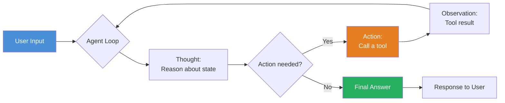
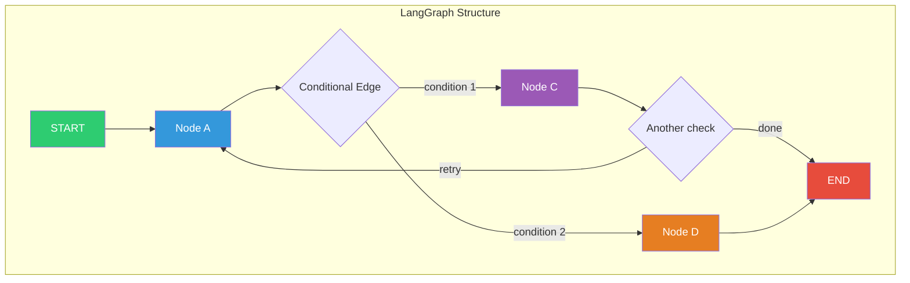
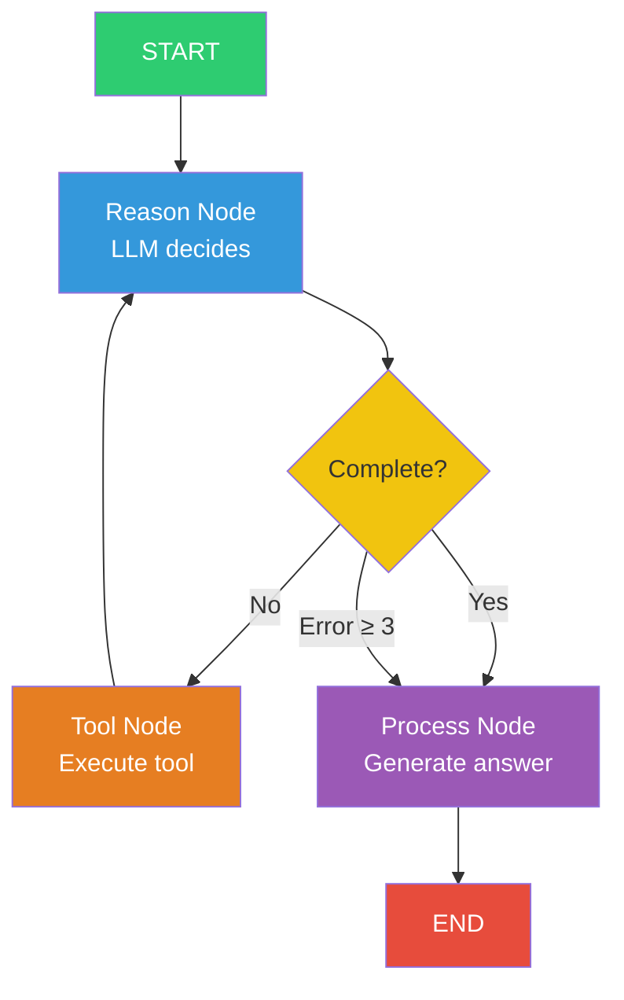
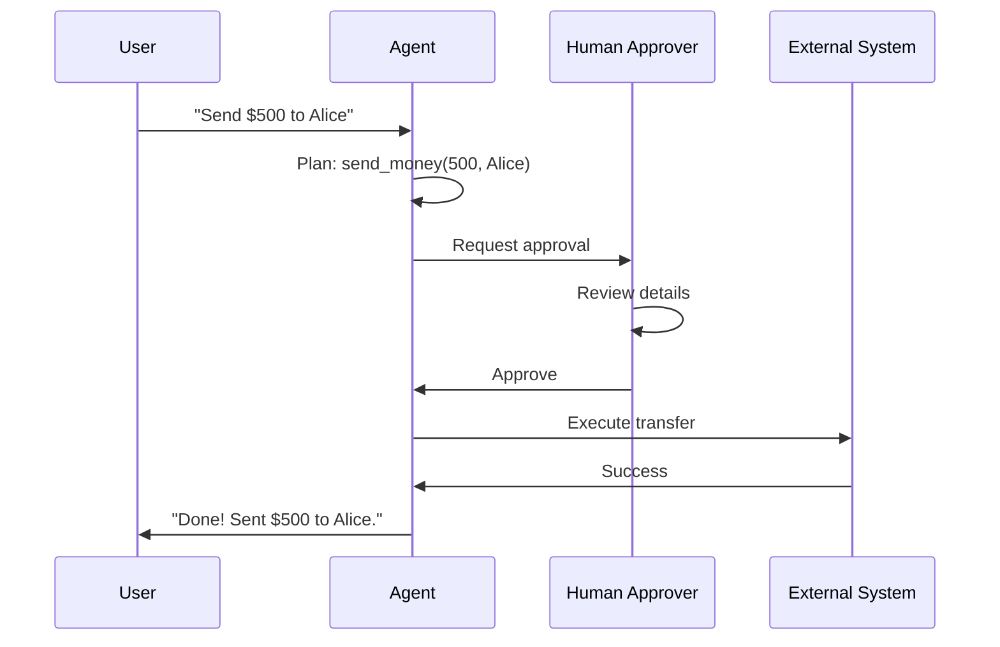
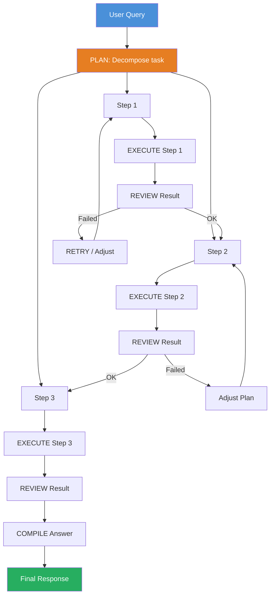

# Chapter 8: AI Agents with LangGraph & Genkit

> **Learning Objectives**
> - Understand what AI agents are and the ReAct pattern
> - Build stateful agents with LangGraph's StateGraph, nodes, and edges
> - Implement Genkit flows for simpler agent orchestration
> - Manage agent state across multi-turn interactions
> - Design human-in-the-loop patterns for approval workflows
> - Create multi-step reasoning agents with tool integration
> - Evaluate agent performance with structured metrics

---

## 8.1 What Are AI Agents?

An AI agent is an autonomous system that uses an LLM to reason, plan, and execute actions to accomplish a goal. Unlike a simple chatbot that responds to queries, an agent can:

- **Perceive** its environment (via tools and data sources)
- **Reason** about what to do next (via LLM chain-of-thought)
- **Act** by calling tools, APIs, or making decisions
- **Observe** the results of its actions
- **Iterate** until the goal is achieved

### 8.1.1 The ReAct Pattern

The most widely adopted agent architecture is **ReAct** (Reasoning + Acting). The agent alternates between reasoning about its current state and taking actions:

```
Thought: I need to find the user's order status.
Action: query_database(order_id: "ORD-123")
Observation: { status: "shipped", eta: "2026-07-09" }
Thought: The order has shipped. Let me inform the user.
Final Answer: Your order ORD-123 has shipped and is expected by July 9th.
```



### 8.1.2 Agent vs. Simple LLM Call

| Aspect | Simple LLM | Agent |
|---|---|---|
| **Output** | Single response | Multi-step reasoning + actions |
| **Tool Use** | Optional, one-shot | Iterative, dynamic selection |
| **State** | Stateless (per query) | Stateful across steps |
| **Control Flow** | Linear | Cyclic (loop) |
| **Autonomy** | None | Can act independently |
| **Error Recovery** | None | Can retry, fall back, adapt |

---

## 8.2 LangGraph: StateGraph, Nodes, Edges

LangGraph is a framework for building stateful, multi-actor applications with LLMs. It models agent workflows as a **directed graph** where state is a shared object flowing through nodes connected by edges.

### 8.2.1 LangGraph Core Concepts



| Concept | Description | Analogy |
|---|---|---|
| `StateGraph` | The graph container | A flowchart canvas |
| `State` | Typed data object with reducers | A shared whiteboard |
| `Node` | A function that processes state | A step in a workflow |
| `Edge` | A connection between nodes | An arrow in the flowchart |
| `ConditionalEdge` | A routing decision | A decision diamond |
| `Checkpointer` | Persists state between runs | Save/load game state |

### 8.2.2 Defining Agent State

```typescript
import { StateGraph, Annotation, START, END } from '@langchain/langgraph';

const AgentState = Annotation.Root({
  // Messages are accumulated (previous + new via reducer)
  messages: Annotation<Array<{ role: string; content: string }>>({
    reducer: (prev, next) => [...prev, ...next],
    default: () => [],
  }),
  step: Annotation<number>({
    reducer: (prev, next) => next,
    default: () => 0,
  }),
  isComplete: Annotation<boolean>({
    reducer: (_prev, next) => next,
    default: () => false,
  }),
  reasoning: Annotation<string>({
    reducer: (_prev, next) => next,
    default: () => '',
  }),
  toolCalls: Annotation<Array<{ tool: string; args: unknown; result: unknown }>>({
    reducer: (prev, next) => [...prev, ...next],
    default: () => [],
  }),
  errorCount: Annotation<number>({
    reducer: (prev, next) => next,
    default: () => 0,
  }),
});
```

### 8.2.3 Building Agent Nodes

```typescript
import { ChatOpenAI } from '@langchain/openai';

const llm = new ChatOpenAI({
  model: 'gpt-4o',
  temperature: 0.3,
  apiKey: process.env.OPENAI_API_KEY,
});

// ─── Tool Registry ──────────────────────────────────────────────

const tools: Record<string, (args: any) => Promise<any>> = {
  calculator: async ({ expression }: { expression: string }) => {
    const { evaluate } = await import('mathjs');
    return { result: evaluate(expression) };
  },
  get_weather: async ({ location }: { location: string }) => {
    return { temperature: 22, conditions: 'clear', location };
  },
  query_database: async ({ query }: { query: string }) => {
    return { rows: [{ id: 1, name: 'Sample' }], count: 1 };
  },
};

// ─── Node 1: Reason ─────────────────────────────────────────────

async function reasonNode(state: typeof AgentState.State) {
  const response = await llm.invoke([
    {
      role: 'system',
      content: `You are a reasoning agent. Given the conversation, decide:
1. Do you have enough information? (isComplete: true/false)
2. What is your reasoning?
3. If not complete, what tool to call? (toolName) with what arguments? (toolArgs as JSON)

Respond in JSON format only.`,
    },
    ...state.messages.map((m) => ({ role: m.role as 'user' | 'assistant', content: m.content })),
  ]);

  const parsed = JSON.parse(response.content.toString());
  return {
    reasoning: parsed.reasoning,
    isComplete: parsed.isComplete ?? false,
    ...(parsed.toolName ? {
      nextAction: 'call_tool',
      toolName: parsed.toolName,
      toolArgs: parsed.toolArgs,
    } : {}),
    step: state.step + 1,
  };
}

// ─── Node 2: Execute Tool ───────────────────────────────────────

async function toolNode(state: typeof AgentState.State) {
  const toolName = (state as any).toolName as string;
  const toolArgs = (state as any).toolArgs as Record<string, unknown>;

  if (!toolName || !tools[toolName]) {
    return {
      messages: [{ role: 'tool', content: `Error: Unknown tool "${toolName}"` }],
      errorCount: state.errorCount + 1,
    };
  }

  try {
    const result = await tools[toolName](toolArgs);
    return {
      messages: [{ role: 'tool', content: JSON.stringify(result) }],
      toolCalls: [{ tool: toolName, args: toolArgs, result }],
    };
  } catch (err) {
    return {
      messages: [{ role: 'tool', content: `Error: ${(err as Error).message}` }],
      errorCount: state.errorCount + 1,
    };
  }
}

// ─── Node 3: Process (generate final answer) ────────────────────

async function processNode(state: typeof AgentState.State) {
  const response = await llm.invoke([
    {
      role: 'system',
      content: 'Answer the user based on conversation history and tool results.',
    },
    ...state.messages.map((m) => ({
      role: m.role as 'user' | 'assistant' | 'tool',
      content: m.content,
    })),
  ]);
  return {
    messages: [{ role: 'assistant', content: response.content.toString() }],
  };
}
```

### 8.2.4 Conditional Routing and Graph Compilation

```typescript
function shouldContinue(state: typeof AgentState.State): string {
  if (state.isComplete) return 'process';
  if (state.errorCount >= 3) return 'process';
  return 'tool';
}

function buildAgentGraph() {
  return new StateGraph(AgentState)
    .addNode('reason', reasonNode)
    .addNode('tool', toolNode)
    .addNode('process', processNode)
    .addEdge(START, 'reason')
    .addConditionalEdges('reason', shouldContinue, {
      process: 'process',
      tool: 'tool',
    })
    .addEdge('tool', 'reason')
    .addEdge('process', END)
    .compile();
}

async function runAgent(userQuery: string) {
  const agent = buildAgentGraph();
  const result = await agent.invoke({
    messages: [{ role: 'user', content: userQuery }],
    step: 0, isComplete: false, reasoning: '', toolCalls: [], errorCount: 0,
  });
  const lastMsg = result.messages[result.messages.length - 1];
  console.log(`Agent: ${lastMsg.content.slice(0, 200)}`);
  return result;
}

// Test
runAgent('What is 234 * 567? And what is the weather in Tokyo?');
```

### 8.2.5 The Agent Loop Visualization



---

## 8.3 Genkit Flows for Simpler Agents

For many agent use cases, Genkit flows provide a simpler alternative to full LangGraph graphs.

### 8.3.1 Simple Genkit Agent with Tools

```typescript
import { genkit, z } from 'genkit';
import { openAI, gpt4o } from 'genkitx-openai';

const ai = genkit({
  plugins: [openAI({ apiKey: process.env.OPENAI_API_KEY })],
  model: gpt4o,
});

const searchTool = ai.defineTool(
  { name: 'web_search', description: 'Search the web', inputSchema: z.object({ query: z.string() }) },
  async ({ query }) => ({ results: [`Result for: ${query}`] })
);

const calculateTool = ai.defineTool(
  { name: 'calculate', description: 'Evaluate a math expression', inputSchema: z.object({ expression: z.string() }) },
  async ({ expression }) => {
    const { evaluate } = await import('mathjs');
    return { result: evaluate(expression) };
  }
);

const agentFlow = ai.defineFlow(
  { name: 'simpleAgent', inputSchema: z.object({ query: z.string() }), outputSchema: z.object({ answer: z.string(), steps: z.number() }) },
  async (input) => {
    const response = await ai.generate({
      systemPrompt: 'You are an AI agent. Think step by step. Use tools to gather information. Provide a complete answer.',
      prompt: input.query,
      tools: [searchTool, calculateTool],
      config: { temperature: 0.3 },
    });
    return { answer: response.text, steps: response.usage?.toolCalls ?? 1 };
  }
);

const result = await agentFlow({ query: 'What is the population of Japan divided by 1000?' });
console.log(result.answer);
```

### 8.3.2 Multi-Step Genkit Agent Loop

```typescript
const multiStepAgent = ai.defineFlow(
  { name: 'multiStepAgent', inputSchema: z.object({ query: z.string(), maxIterations: z.number().optional().default(5) }) },
  async (input) => {
    const steps: Array<{ thought: string; tool: string | null; observation: string | null }> = [];
    const messages: Array<{ role: string; content: string }> = [{ role: 'user', content: input.query }];

    for (let i = 0; i < input.maxIterations; i++) {
      const thoughtResponse = await ai.generate({
        systemPrompt: `Step ${i + 1}. Format: TOOL: name | JSON_args or FINAL: answer`,
        messages: messages.map(m => ({ role: m.role as 'user' | 'assistant' | 'tool', content: m.content })),
        config: { temperature: 0.3, maxOutputTokens: 500 },
      });
      const thought = thoughtResponse.text;

      if (thought.startsWith('FINAL:')) {
        return { answer: thought.replace('FINAL:', '').trim(), steps, iterationCount: i + 1 };
      }

      const toolMatch = thought.match(/^TOOL:\s*(\w+)\s*\|\s*(.+)$/s);
      if (!toolMatch) { messages.push({ role: 'assistant', content: thought }); continue; }

      const [, toolName, argsStr] = toolMatch;
      let args: Record<string, unknown>;
      try { args = JSON.parse(argsStr); } catch {
        messages.push({ role: 'assistant', content: 'Invalid JSON. Try again.' }); continue;
      }

      let observation: string;
      try {
        const toolMap: Record<string, (a: any) => Promise<any>> = {
          calculate: async (a) => { const { evaluate } = await import('mathjs'); return { result: evaluate(a.expression) }; },
          weather: async (a) => ({ temperature: 22, location: a.location, conditions: 'sunny' }),
        };
        const fn = toolMap[toolName];
        observation = fn ? JSON.stringify(await fn(args)) : `Error: Unknown tool "${toolName}"`;
      } catch (err) { observation = `Error: ${(err as Error).message}`; }

      steps.push({ thought, tool: toolName, observation });
      messages.push({ role: 'assistant', content: thought }, { role: 'tool', content: observation });
    }

    const final = await ai.generate({
      systemPrompt: 'Max steps reached. Provide your best answer based on gathered information.',
      messages: messages.map(m => ({ role: m.role as 'user' | 'assistant' | 'tool', content: m.content })),
    });
    return { answer: final.text + '\n(Reached step limit)', steps, iterationCount: input.maxIterations };
  }
);

const result = await multiStepAgent({ query: 'Calculate (15 * 8) + (22 * 3) and weather in Paris' });
console.log(`Answer: ${result.answer}`);
```

---

## 8.4 Agent State Management

State management is critical for agents. The agent must remember what it has done and learned.

### 8.4.1 State Persistence with LangGraph Checkpointer

```typescript
import { SqliteSaver } from '@langchain/langgraph-checkpoint-sqlite';

async function buildPersistentAgent() {
  const checkpointer = new SqliteSaver({ filename: './data/agent_checkpoints.db' });

  return new StateGraph(AgentState)
    .addNode('reason', reasonNode)
    .addNode('tool', toolNode)
    .addNode('process', processNode)
    .addEdge(START, 'reason')
    .addConditionalEdges('reason', shouldContinue, { process: 'process', tool: 'tool' })
    .addEdge('tool', 'reason')
    .addEdge('process', END)
    .compile({ checkpointer });
}

async function multiTurnConversation() {
  const agent = await buildPersistentAgent();
  const threadId = 'thread-user-42';

  // Turn 1
  const result1 = await agent.invoke(
    { messages: [{ role: 'user', content: 'What is 144 * 23?' }], step: 0, isComplete: false, reasoning: '', toolCalls: [], errorCount: 0 },
    { configurable: { thread_id: threadId } }
  );
  console.log('Turn 1:', result1.messages[result1.messages.length - 1]?.content.slice(0, 80));

  // Turn 2 — agent remembers context
  const state = await agent.getState({ configurable: { thread_id: threadId } });
  const result2 = await agent.invoke(
    { ...state.values, messages: [...state.values.messages, { role: 'user', content: 'Now divide that by 12.' }] },
    { configurable: { thread_id: threadId } }
  );
  console.log('Turn 2:', result2.messages[result2.messages.length - 1]?.content.slice(0, 80));
}
```

### 8.4.2 State Reduction and Summarization

Long-running agents accumulate large message lists. State reduction keeps the context within token limits:

```typescript
async function summarizeMessages(
  messages: Array<{ role: string; content: string }>,
  maxMessages: number = 20
): Promise<Array<{ role: string; content: string }>> {
  if (messages.length <= maxMessages) return messages;

  const keepNewest = Math.floor(maxMessages * 0.7);
  const oldestMessages = messages.slice(0, 1);
  const toSummarize = messages.slice(1, -keepNewest);
  const recentMessages = messages.slice(-keepNewest);

  if (toSummarize.length === 0) return messages;

  const response = await ai.generate({
    prompt: `Summarize these messages concisely, keeping key facts and decisions:\n${toSummarize.map(m => `[${m.role}]: ${m.content}`).join('\n')}\nSummary:`,
  });

  return [
    oldestMessages[0],
    { role: 'system', content: `[Previous context]: ${response.text}` },
    ...recentMessages,
  ];
}

async function reasonWithSummarization(state: typeof AgentState.State) {
  const trimmedMessages = state.messages.length > 25
    ? await summarizeMessages(state.messages, 20)
    : state.messages;

  const response = await llm.invoke([
    { role: 'system', content: `Reasoning agent. Step: ${state.step}` },
    ...trimmedMessages.slice(-10).map(m => ({ role: m.role as 'user' | 'assistant' | 'tool', content: m.content })),
  ]);

  const parsed = JSON.parse(response.content.toString());
  return {
    reasoning: parsed.reasoning,
    isComplete: parsed.isComplete ?? false,
    messages: state.messages.length > 25 ? trimmedMessages : state.messages,
  };
}
```

---

## 8.5 Human-in-the-Loop Patterns

Human-in-the-loop (HITL) is essential for agents that perform actions with real-world consequences. The agent pauses and waits for human approval before proceeding.

### 8.5.1 Genkit Flow with Human Approval

```typescript
const sendEmailTool = ai.defineTool(
  { name: 'send_email', description: 'Send an email. Requires human approval.', inputSchema: z.object({ to: z.string().email(), subject: z.string(), body: z.string() }) },
  async ({ to, subject, body }) => {
    console.log(`EMAIL: to=${to}, subject=${subject}`);
    return { success: true, messageId: `email_${Date.now()}` };
  }
);

const agentWithApproval = ai.defineFlow(
  { name: 'agentWithHumanApproval', inputSchema: z.object({ query: z.string(), autoApprove: z.boolean().optional().default(false) }) },
  async (input) => {
    const planResponse = await ai.generate({
      systemPrompt: `Analyze the user request. Respond as JSON:
{ "requiresApproval": true/false, "actions": [{"tool": "...", "args": {...}, "summary": "..."}], "reasoning": "..." }
Require approval for sending money, deleting data, modifying records, or sending communications.`,
      prompt: input.query,
      config: { temperature: 0.3 },
    });

    const plan = JSON.parse(planResponse.text);

    if (!plan.requiresApproval || input.autoApprove) {
      const response = await ai.generate({ prompt: input.query, tools: [sendEmailTool] });
      return { answer: response.text, requiredApproval: false, approved: true };
    }

    return { answer: 'Action requires approval.', requiredApproval: true, approved: false, pendingActions: plan.actions };
  }
);
```

### 8.5.2 Human-in-the-Loop Flow Diagram



### 8.5.3 LangGraph Human-in-the-Loop

```typescript
const HITLState = Annotation.Root({
  messages: Annotation<Array<{ role: string; content: string }>>({ reducer: (prev, next) => [...prev, ...next], default: () => [] }),
  pendingApproval: Annotation<{ tool: string; args: unknown; summary: string } | null>({ reducer: (_prev, next) => next, default: () => null }),
  approved: Annotation<boolean>({ reducer: (_prev, next) => next, default: () => false }),
});

async function sensitiveToolNode(state: typeof HITLState.State) {
  if (!state.approved) {
    return { pendingApproval: { tool: 'send_email', args: { to: 'user@example.com', subject: 'Hello', body: 'Test' }, summary: 'Send email' } };
  }
  return {
    messages: [{ role: 'tool', content: JSON.stringify({ success: true }) }],
    pendingApproval: null,
  };
}

function buildHITLGraph() {
  return new StateGraph(HITLState)
    .addNode('reason', async (state) => ({ messages: [{ role: 'assistant', content: 'Planning...' }] }))
    .addNode('sensitive_tool', sensitiveToolNode)
    .addNode('finalize', async (state) => ({ messages: [{ role: 'assistant', content: 'Done!' }] }))
    .addEdge(START, 'reason')
    .addEdge('reason', 'sensitive_tool')
    .addConditionalEdges('sensitive_tool', (state) => state.pendingApproval && !state.approved ? '__interrupt__' : 'finalize', { finalize: 'finalize', __interrupt__: END })
    .addEdge('finalize', END)
    .compile();
}

async function hitlExample() {
  const graph = buildHITLGraph();
  const firstResult = await graph.invoke({ messages: [{ role: 'user', content: 'Send an email' }], pendingApproval: null, approved: false });
  console.log('Pending:', firstResult.pendingApproval?.summary);

  const resumedResult = await graph.invoke({ ...firstResult, approved: true });
  console.log('Final:', resumedResult.messages[resumedResult.messages.length - 1]?.content);
}
```

---

## 8.6 Multi-Step Reasoning Agents

Sophisticated agents break complex tasks into multiple reasoning steps, using a **Plan → Execute → Review** pattern.

### 8.6.1 Plan-Execute-Review Pattern



### 8.6.2 Implementation

```typescript
interface TaskPlan { steps: Array<{ id: number; description: string; tool?: string; args?: Record<string, unknown> }>; dependencies: Array<{ step: number; dependsOn: number[] }>; }
interface StepResult { stepId: number; success: boolean; data: unknown; error?: string; }

const planExecuteAgent = ai.defineFlow(
  { name: 'planExecuteAgent', inputSchema: z.object({ query: z.string() }) },
  async (input) => {
    // Phase 1: Plan
    const planResponse = await ai.generate({
      systemPrompt: `Break down the request into steps. Respond as JSON:
{ "steps": [{"id": 1, "description": "...", "tool": "calculate", "args": {"expression": "..."}}],
  "dependencies": [{"step": 2, "dependsOn": [1]}] }`,
      prompt: input.query,
      config: { temperature: 0.3 },
    });

    const plan: TaskPlan = JSON.parse(planResponse.text);
    const results: StepResult[] = [];
    const executedSteps = new Set<number>();

    // Phase 2: Execute with dependency resolution
    while (executedSteps.size < plan.steps.length) {
      for (const step of plan.steps) {
        if (executedSteps.has(step.id)) continue;
        const deps = plan.dependencies.find((d) => d.step === step.id);
        const depsMet = deps ? deps.dependsOn.every((dId) => executedSteps.has(dId)) : true;
        if (!depsMet) continue;

        try {
          if (step.tool && step.args) {
            const toolResult = await executeTool(step.tool, step.args);
            results.push({ stepId: step.id, success: true, data: toolResult });
          } else {
            results.push({ stepId: step.id, success: true, data: step.description });
          }
        } catch (err) {
          results.push({ stepId: step.id, success: false, data: null, error: (err as Error).message });
        }
        executedSteps.add(step.id);
      }
    }

    // Phase 3: Review and compile
    const finalResponse = await ai.generate({
      prompt: `Results:\n${results.map(r => `Step ${r.stepId}: ${r.success ? 'OK' : 'FAIL'} - ${JSON.stringify(r.data)}`).join('\n')}\nProvide a comprehensive answer.`,
    });

    return { answer: finalResponse.text, plan, results };
  }
);

async function executeTool(toolName: string, args: any): Promise<unknown> {
  const toolMap: Record<string, (a: any) => Promise<unknown>> = {
    calculate: async ({ expression }) => {
      const { evaluate } = await import('mathjs');
      return { result: evaluate(expression) };
    },
    web_search: async ({ query }) => ({ results: [`Simulated: ${query}`] }),
  };
  const fn = toolMap[toolName];
  if (!fn) throw new Error(`Unknown tool: ${toolName}`);
  return fn(args);
}

const planResult = await planExecuteAgent({
  query: 'Total for 45 items at $12.50 each, plus 8% tax',
});
console.log('Answer:', planResult.answer);
```

---

## 8.7 Agent Evaluation

Evaluating agents is more complex than evaluating single LLM calls. You need to measure both the process and the outcome.

### 8.7.1 Agent Evaluation Metrics

| Metric | What It Measures | Collection Method |
|---|---|---|
| **Task Success** | Did the agent achieve the goal? | Human eval or unit tests |
| **Step Efficiency** | Number of tool calls vs. optimal | Log analysis |
| **Recovery Rate** | % of errors handled gracefully | Error log analysis |
| **Hallucination** | Did the agent make false claims? | Factual consistency check |
| **Latency** | Total time to complete | Timing instrumentation |
| **Cost** | Token usage per task | Usage API |

### 8.7.2 Agent Evaluation Harness

```typescript
interface AgentTestCase {
  name: string;
  query: string;
  expectedToolCalls?: string[];
  expectedKeywords?: string[];
  maxSteps?: number;
}

interface AgentEvalResult {
  testName: string; passed: boolean; actualSteps: number;
  actualToolsUsed: string[]; answer: string; errors: string[]; latency: number;
}

class AgentEvaluator {
  private results: AgentEvalResult[] = [];

  async evaluate(agent: typeof multiStepAgent, testCases: AgentTestCase[]): Promise<void> {
    for (const test of testCases) {
      const start = Date.now();
      const errors: string[] = [];

      try {
        const result = await agent({ query: test.query, maxIterations: test.maxSteps ?? 5 });
        const toolsUsed = result.steps.map((s: any) => s.tool).filter(Boolean);

        if (test.expectedToolCalls) {
          for (const et of test.expectedToolCalls) {
            if (!toolsUsed.includes(et)) errors.push(`Expected tool "${et}" not called`);
          }
        }
        if (test.expectedKeywords) {
          for (const kw of test.expectedKeywords) {
            if (!result.answer.toLowerCase().includes(kw.toLowerCase())) errors.push(`Keyword "${kw}" not found`);
          }
        }

        this.results.push({
          testName: test.name, passed: errors.length === 0,
          actualSteps: result.iterationCount, actualToolsUsed: toolsUsed,
          answer: result.answer, errors, latency: Date.now() - start,
        });
      } catch (err) {
        this.results.push({
          testName: test.name, passed: false, actualSteps: 0,
          actualToolsUsed: [], answer: '', errors: [(err as Error).message], latency: Date.now() - start,
        });
      }
    }
  }

  generateReport(): string {
    const total = this.results.length;
    const passed = this.results.filter((r) => r.passed).length;
    const avgLatency = this.results.reduce((s, r) => s + r.latency, 0) / total;
    return `## Agent Eval Report\n**${passed}/${total} passed (${((passed/total)*100).toFixed(1)}%)** | Avg Latency: ${avgLatency.toFixed(0)}ms\n\n${this.results.map(r => `### ${r.testName} (${r.passed ? 'PASS' : 'FAIL'})\nSteps: ${r.actualSteps} | Tools: ${r.actualToolsUsed.join(', ') || 'none'} | ${r.latency}ms\n${r.errors.length ? 'Errors: ' + r.errors.join(', ') : ''}`).join('\n\n')}`;
  }
}

async function runEvaluation() {
  const evaluator = new AgentEvaluator();
  const testCases: AgentTestCase[] = [
    { name: 'Simple math', query: 'What is 2 + 2?', expectedToolCalls: ['calculate'], expectedKeywords: ['4'] },
    { name: 'Multi-step', query: 'Calculate (15 * 8) + (22 * 3)', expectedToolCalls: ['calculate'], expectedKeywords: ['186'] },
    { name: 'Weather query', query: 'Weather in Paris?', expectedToolCalls: ['weather'], expectedKeywords: ['temperature', 'Paris'] },
  ];
  await evaluator.evaluate(multiStepAgent, testCases);
  console.log(evaluator.generateReport());
}
```

### 8.7.3 Agent Safety Guardrails

```typescript
class AgentGuardrails {
  async preActionCheck(tool: string, args: Record<string, unknown>): Promise<{ allowed: boolean; reason?: string }> {
    if (tool === 'query_database') {
      const query = (args.query as string)?.toLowerCase() || '';
      if (['drop', 'delete', 'truncate', 'update', 'insert', 'alter'].some(kw => query.includes(kw))) {
        return { allowed: false, reason: `Destructive operation blocked` };
      }
    }
    if (tool === 'send_email') {
      const allowedDomains = (process.env.ALLOWED_EMAIL_DOMAINS || '').split(',');
      const domain = (args.to as string || '').split('@')[1];
      if (domain && !allowedDomains.includes(domain)) {
        return { allowed: false, reason: `Domain ${domain} not allowed` };
      }
    }
    return { allowed: true };
  }

  async postActionCheck(tool: string, result: unknown): Promise<{ safe: boolean; sanitized?: unknown }> {
    if (tool === 'query_database') {
      const data = result as { rows?: Record<string, unknown>[] };
      if (data.rows) {
        const sanitized = data.rows.map(({ password, ssn, credit_card, ...safe }) => safe);
        return { safe: true, sanitized: { ...data, rows: sanitized } };
      }
    }
    return { safe: true };
  }
}
```

### 8.7.4 Agent Observability and Tracing

Understanding what an agent does internally is critical for debugging and improvement. Each agent execution should produce a trace that records:

```typescript
interface AgentTrace {
  traceId: string;
  sessionId: string;
  startTime: number;
  endTime: number;
  steps: Array<{
    stepNumber: number;
    nodeName: string;
    input: unknown;
    output: unknown;
    duration: number;
    tokenUsage?: { input: number; output: number };
  }>;
  totalTokens: number;
  totalCost: number;
  error: string | null;
}

/**
 * Observability wrapper for LangGraph agents.
 * Records traces for every node execution.
 */
class AgentTracer {
  private traces: Map<string, AgentTrace> = new Map();

  createTrace(sessionId: string): string {
    const traceId = `trace_${Date.now()}_${Math.random().toString(36).slice(2, 8)}`;
    this.traces.set(traceId, {
      traceId, sessionId, startTime: Date.now(), endTime: 0,
      steps: [], totalTokens: 0, totalCost: 0, error: null,
    });
    return traceId;
  }

  recordStep(traceId: string, step: AgentTrace['steps'][0]): void {
    const trace = this.traces.get(traceId);
    if (trace) {
      trace.steps.push(step);
      trace.totalTokens += (step.tokenUsage?.input ?? 0) + (step.tokenUsage?.output ?? 0);
    }
  }

  completeTrace(traceId: string, error: string | null = null): AgentTrace | undefined {
    const trace = this.traces.get(traceId);
    if (trace) {
      trace.endTime = Date.now();
      trace.error = error;
      // Estimate cost (simplified: $0.01 per 1K tokens)
      trace.totalCost = (trace.totalTokens / 1000) * 0.01;
    }
    return trace;
  }

  getTraceSummary(traceId: string): string {
    const trace = this.traces.get(traceId);
    if (!trace) return 'Trace not found';

    const duration = ((trace.endTime - trace.startTime) / 1000).toFixed(2);
    const nodeSequence = trace.steps.map(s => `${s.nodeName}(${(s.duration / 1000).toFixed(2)}s)`).join(' → ');

    return `
Trace: ${traceId}
Session: ${trace.sessionId}
Duration: ${duration}s
Nodes: ${nodeSequence}
Tokens: ${trace.totalTokens} | Cost: $${trace.totalCost.toFixed(4)}
Error: ${trace.error ?? 'None'}
    `.trim();
  }
}

// Usage in a graph:
// const tracer = new AgentTracer();
// const traceId = tracer.createTrace('session-123');
// Call tracer.recordStep(traceId, { stepNumber, nodeName, input, output, duration });
// When done: tracer.completeTrace(traceId);
```

Tracing enables post-hoc analysis of agent behavior. Common patterns discovered through tracing include:
- **Repeated tool calls**: The agent is calling the same tool with similar arguments — consider caching.
- **Long reasoning loops**: The agent is stuck reasoning without acting — tighten the step limit.
- **Error cascades**: One tool failure leads to a chain of failures — improve error handling.
- **Token waste**: The agent includes irrelevant context in prompts — improve state management.

---


## 8.8 Common Agent Anti-Patterns

Building production agents requires avoiding common pitfalls. Here are the most frequent anti-patterns and how to fix them:

### 8.8.1 Infinite Loop Agent

The agent re-enters the same reasoning-action cycle without making progress.

**Symptoms**: Same tool called repeatedly with similar arguments; increasing step count without state changes.

**Fixes**:
- Enforce a hard maximum iteration limit (5-10 steps max)
- Detect repeated tool calls within the same state
- Add a "stuck detection" node that forces finalization after N identical reasoning outputs

### 8.8.2 Tool Overload

Giving the agent too many tools reduces selection accuracy.

**Symptoms**: Agent chooses wrong tool, wastes steps discovering tool capabilities.

**Fixes**:
- Limit concurrent tools to 5-8 per agent
- Group related tools behind a router tool
- Use clear, distinct tool names and descriptions
- Test tool selection accuracy before adding more

### 8.8.3 Context Overflow

Agent accumulates too many messages, exceeding the LLM context window.

**Symptoms**: Agent starts ignoring early instructions; hallucinations increase; performance degrades over multi-turn conversations.

**Fixes**:
- Implement automatic state summarization (section 8.4.2)
- Use sliding windows on conversation history
- Monitor token usage per step and log warnings

### 8.8.4 Hallucinated Tool Results

Agent invents a tool result instead of waiting for the actual execution.

**Symptoms**: The agent confidently responds with fabricated data; tool call logs show the tool was never invoked.

**Fixes**:
- Always feed actual tool results back through the message system
- Never include tool descriptions in the prompt examples as expected output
- Use structured output validation to ensure the LLM cannot bypass tool calls
- Implement "observation verification" — check that every tool call has a corresponding observation

### 8.8.5 Silent Failures

A tool call fails but the agent continues as if it succeeded.

**Symptoms**: Agent responds with incomplete or wrong information; no sign of error in the reasoning trace.

**Fixes**:
- Always return explicit error messages in tool output
- Teach the agent in system prompts to report failures to the user
- Implement automatic retry before reporting failure
- Log all tool call errors with stack traces for debugging

### 8.8.6 Routing Misconfiguration

The agent's conditional edges route to the wrong node, causing incorrect behavior.

**Symptoms**: The agent skips the tool execution node; the process node is called before tools complete; the graph ends prematurely.

**Fixes**:
- Add logging to every conditional edge to trace which path is taken
- Write unit tests for each conditional routing function with known state inputs
- Use enum-based route names to prevent typos in string comparisons
- Visualize the graph before deployment using LangGraph's built-in rendering

### 8.8.7 State Mutation Conflicts

Multiple nodes modify the same state field in incompatible ways.

**Symptoms**: State values are silently overwritten; reducer functions produce unexpected merges; message arrays contain duplicate or out-of-order entries.

**Fixes**:
- Use `Annotation.Root` with explicit reducers for every state field
- Prefer additive reducers (`[...prev, ...next]`) over overwriting reducers for collection fields
- Log state diffs between node executions for debugging
- Validate state shape at the start of every node to catch anomalies early

---

## Chapter Summary

- **AI agents** use the ReAct pattern (Reasoning + Acting) to autonomously accomplish goals.
- **LangGraph** provides StateGraph, nodes, edges, and conditional routing for complex agent workflows.
- **Agent state** includes messages, steps, tool calls, and completion status managed through typed annotations.
- **Genkit flows** offer a simpler alternative for agents that don't need full graph complexity.
- **State persistence** via LangGraph checkpointers enables multi-turn conversations.
- **Human-in-the-loop** patterns pause agent execution for approval before sensitive actions.
- **Multi-step reasoning** with Plan → Execute → Review decomposes complex tasks into manageable steps.
- **Agent evaluation** measures task success, step efficiency, error recovery, and safety.
- **Observability and tracing** provide visibility into agent reasoning and tool execution for debugging.
- **Guardrails** prevent agents from performing destructive or unsafe operations.

### Practical Takeaways

1. Start with **Genkit flows** for simple agents; graduate to **LangGraph** for complex stateful workflows.
2. Always set a **maximum iteration limit** to prevent infinite agent loops.
3. Implement **human-in-the-loop** for any action with real-world consequences.
4. Use **conditional edges** in LangGraph for flexible agent routing.
5. Implement **state reduction** (summarization) for long-running conversations.
6. Evaluate agents on **both outcome and process** — a correct answer with 20 tool calls may be worse than one with 3.
7. Implement **guardrails** as a middleware layer that all tool calls pass through, not as afterthoughts.
8. Use **tracing and observability** from day one — debugging an agent without traces is nearly impossible.

---

## Chapter Quiz (10 MCQs)

**1. What does the ReAct pattern stand for?**
- A) Reactive Action
- B) Reasoning + Acting
- C) Real-time Activity Control
- D) Retrieval-Augmented Computation

**2. In LangGraph, what is a reducer?**
- A) A function that reduces token usage
- B) A function that controls how state updates are merged
- C) A tool that reduces API calls
- D) A graph optimization technique

**3. What is the purpose of a conditional edge in LangGraph?**
- A) To execute two nodes in parallel
- B) To route the graph to different nodes based on state conditions
- C) To reduce the graph's memory usage
- D) To enforce type safety on state transitions

**4. Which LangGraph component enables multi-turn conversation persistence?**
- A) StateGraph
- B) Checkpointer
- C) ConditionalEdge
- D) Annotation

**5. In the Plan-Execute-Review pattern, what happens during Review?**
- A) The LLM generates the final response
- B) The agent checks if each step succeeded and compiles results
- C) The user approves the plan
- D) The available tools are reviewed

**6. What is the maximum iteration limit primarily designed to prevent?**
- A) High token costs
- B) Infinite agent loops
- C) State overflow
- D) Tool failures

**7. In a human-in-the-loop pattern, what triggers the agent to pause?**
- A) An error in tool execution
- B) A pending action requiring human approval
- C) The maximum step limit being reached
- D) The user sending a new message

**8. Which Genkit feature is used for simpler agent implementations?**
- A) Flows with tools
- B) System prompts
- C) Embedding models
- D) Vector stores

**9. What is state reduction in agent state management?**
- A) Reducing the number of available tools
- B) Summarizing old messages to stay within token limits
- C) Decreasing the embedding dimension
- D) Removing unused state fields

**10. Which is NOT a typical agent evaluation metric?**
- A) Task success rate
- B) Step efficiency
- C) GPU temperature
- D) Error recovery rate

<details>
<summary>Answer Key</summary>

1. B, 2. B, 3. B, 4. B, 5. B, 6. B, 7. B, 8. A, 9. B, 10. C
</details>

---

## Exercises

### Exercise 1: Build a Research Agent
Create a LangGraph agent that accepts a research question, decomposes it into 3-5 sub-questions, uses a `web_search` tool to gather information for each, and synthesizes findings into a comprehensive answer with sources. Use the Plan-Execute-Review pattern with conditional routing.

### Exercise 2: Customer Support Agent with Human Escalation
Build a Genkit flow agent that: (1) tries to answer common questions using a knowledge base tool, (2) escalates to a human if confidence < 0.7, (3) logs interactions to a database, (4) returns whether the answer was AI or human-generated.

### Exercise 3: Agent with Memory and Summarization
Extend the LangGraph agent to include: (1) PostgreSQL checkpointer for persistence, (2) automatic summarization every 10 messages, (3) a `forget` command to reset memory for a thread, (4) a multi-turn test with 5 sequential questions verifying context retention.

### Exercise 4: Safety Guardrails Agent
Implement an agent wrapper with: (1) pre-action guardrails blocking destructive DB operations (DROP, DELETE, etc.), (2) post-action guardrails redacting PII from results, (3) logging of all blocked actions for auditing.

### Exercise 5: Agent Evaluation Suite
Build a comprehensive evaluation suite: (1) 10 test cases covering math, data lookup, multi-step reasoning, error recovery, and safety, (2) automated pass/fail based on expected outcomes, (3) performance metrics (latency, tool calls, token usage), (4) Markdown report generator, (5) regression test mode comparing against a baseline.

---

> **End of Chapter 8**. Continue to the next course module or refer to the appendices for additional patterns and reference implementations.
