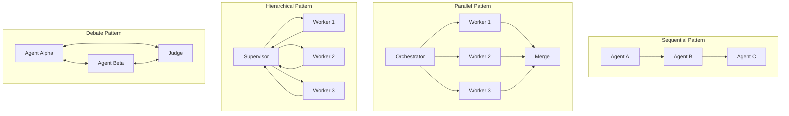
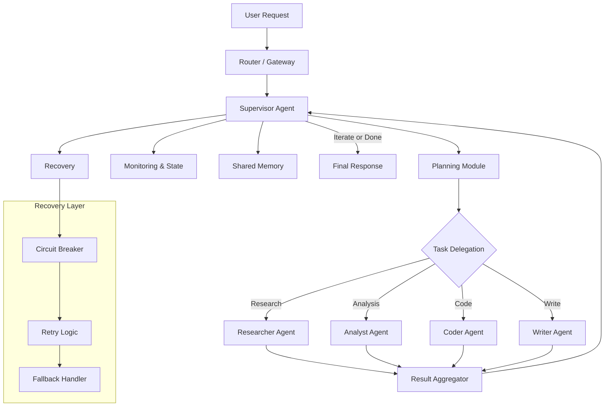
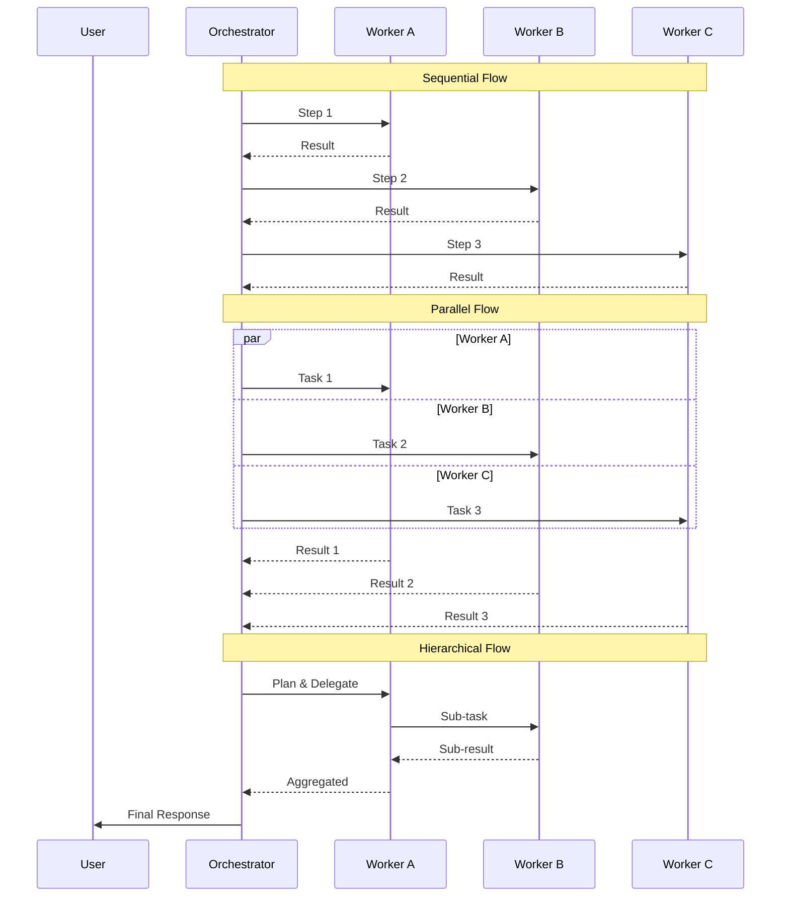
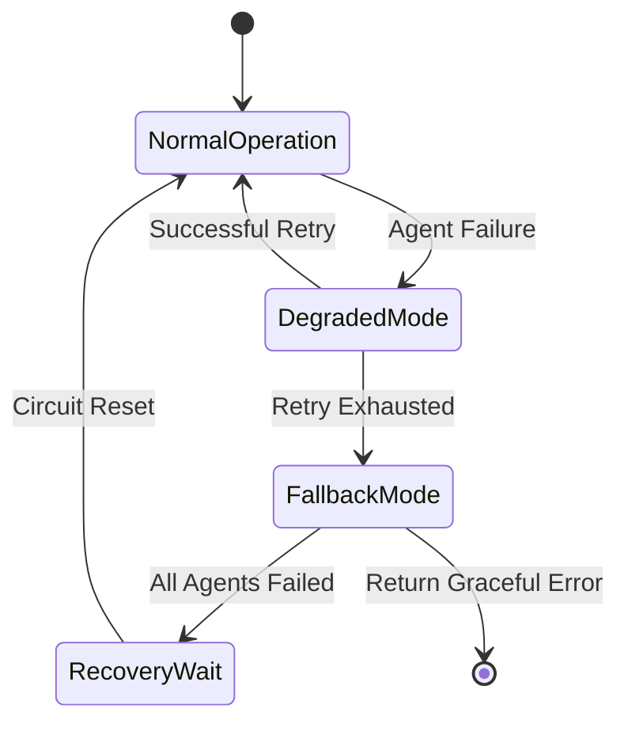

# Chapter 9: Multi-Agent Systems & Orchestration

> **Learn how to design, build, and orchestrate multi-agent AI systems using LangGraph and Genkit. Move beyond single-agent chatbots to coordinated agent teams that collaborate, debate, and recover from failure.**

## Learning Objectives

After completing this chapter, you will be able to:

- Determine when to use multiple agents versus a single agent for a given problem
- Design agent communication patterns: sequential, hierarchical, and debate-based
- Implement LangGraph multi-agent workflows with supervisor agents
- Orchestrate multi-flow systems using Genkit flow composition
- Coordinate agents through shared state and message passing
- Implement error recovery strategies for multi-agent systems
- Evaluate trade-offs between different multi-agent architectures

## Estimated Time: 6 hours

---

## 9.1 When to Use Multiple Agents vs a Single Agent

### The Single Agent Baseline

A single agent architecture connects one LLM to a set of tools and a system prompt. For many use cases — answering questions, generating content, simple automation — a single agent is sufficient and simpler to maintain.

**Strengths of single agents:**
- Simple to implement and debug
- Lower latency (one LLM call per turn)
- Easier to trace and monitor
- One context window to manage

**Limitations of single agents:**
- Context window saturation with many tools
- Conflicting responsibilities dilute performance
- No specialization — one model must excel at everything
- Hard to parallelize tasks
- Single point of failure

### When to Use Multiple Agents

Multi-agent systems shine when tasks require **specialization**, **parallelism**, or **distinct knowledge domains**.

| Scenario | Single Agent | Multi-Agent |
|----------|-------------|-------------|
| Chatbot answering FAQs | ✅ Good | ❌ Overkill |
| Code review + testing + documentation | ❌ Overloaded | ✅ Specialized teams |
| Multi-step research with verification | ❌ Hallucination-prone | ✅ Debate improves accuracy |
| Enterprise data analysis with SQL + visualization | ❌ Too many tools | ✅ Routing by capability |
| Customer support escalation (triage → billing → tech) | ❌ Noisy context | ✅ Clear handoffs |

**Rule of thumb**: Start with a single agent. Add agents only when you can name the distinct responsibility each new agent handles.

### The 3-Agent Test

Before adding a new agent, answer these three questions:

1. **Distinct responsibility**: Does this agent own a clear, non-overlapping task?
2. **Independent context**: Does this agent need a different system prompt or tool set?
3. **Value > overhead**: Does the benefit of specialization outweigh the coordination cost?

If you answer "yes" to all three, a new agent is justified.

---

## 9.2 Agent Communication Patterns

### Sequential Pattern

Agents execute in a fixed order. The output of agent N becomes the input for agent N+1. This is the simplest multi-agent pattern.

```
┌─────────┐     ┌─────────┐     ┌─────────┐
│ Agent A │────→│ Agent B │────→│ Agent C │
│         │     │         │     │         │
│ Analyze │     │  Draft  │     │  Review │
│ Request │     │ Response│     │  Output │
└─────────┘     └─────────┘     └─────────┘
```

**Use when**: Workflow has clear stages that must happen in order.

**Examples**: Content moderation → Generation → Formatting. Research → Outline → Write.

### Parallel Pattern

Multiple agents execute simultaneously, each working on a different aspect of the task. Results are merged later.

```
┌─────────┐
│ Agent A │──┐
│  SQL    │  │
└─────────┘  │  ┌─────────┐
┌─────────┐  ├──→│ Agent D │
│ Agent B │  │  │  Merge  │
│ Chart   │──┤  └─────────┘
└─────────┘  │
┌─────────┐  │
│ Agent C │──┘
│  Summar │
└─────────┘
```

**Use when**: Tasks are independent and can be parallelized for speed.

**Examples**: Analyzing multiple documents simultaneously. Running multiple search queries.

### Hierarchical (Supervisor) Pattern

A supervisor agent delegates tasks to worker agents and synthesizes their outputs. Workers have specialized roles and tools. The supervisor decides which workers to invoke and in what order.

```
┌─────────────────────┐
│   Supervisor Agent  │
│  (Orchestrator)     │
│  Planning, Routing, │
│  Result Synthesis   │
└────┬────────┬───────┘
     │        │
┌────┴──┐ ┌──┴────┐ ┌──┴────┐
│ Worker│ │Worker │ │Worker │
│ A     │ │ B     │ │ C     │
│ Tools │ │ Tools │ │ Tools │
└───────┘ └───────┘ └───────┘
```

**Use when**: Complex tasks require dynamic delegation across specialized agents.

**Examples**: Software engineering (PM → Coder → Reviewer → Tester). Customer support (Triage → Billing → Technical).

### Debate Pattern

Multiple agents receive the same task and produce independent answers. They then exchange arguments, critique each other's reasoning, and converge on a final answer.

```
┌──────────┐     ┌──────────┐
│ Agent A  │←───→│ Agent B  │
│ (Pro)    │     │ (Con)    │
└──────────┘     └──────────┘
      ↕                ↕
┌──────────┐     ┌──────────┐
│  Judge   │     │ Consensus│
│  Agent   │     │  Round   │
└──────────┘     └──────────┘
```

**Use when**: Accuracy is critical and multiple perspectives reduce hallucination.

**Examples**: Fact-checking, code review, medical diagnosis support, legal analysis.

---

## 9.3 LangGraph Multi-Agent Workflows

### LangGraph StateGraph Recap

LangGraph models agent workflows as a **state graph**. Nodes represent agent steps. Edges represent transitions. The graph maintains a shared state object that nodes read and write.

```typescript
import { StateGraph, Annotation, END } from '@langchain/langgraph';

// Define the shared state
const AgentState = Annotation.Root({
  messages: Annotation<string[]>({
    reducer: (x, y) => x.concat(y),
  }),
  currentStep: Annotation<string>({
    reducer: (x, y) => y ?? x,
  }),
  taskResult: Annotation<Record<string, any>>({
    reducer: (x, y) => ({ ...x, ...y }),
  }),
});
```

### Building a Supervisor Agent

The supervisor agent receives the user's request, decides which worker agent to invoke, monitors results, and determines next steps.

```typescript
import { ChatOpenAI } from '@langchain/openai';
import { RunnableConfig } from '@langchain/core/runnables';
import { AIMessage, HumanMessage, SystemMessage } from '@langchain/core/messages';

// Initialize the LLM
const llm = new ChatOpenAI({
  model: 'gpt-4o',
  temperature: 0,
});

// Define agent roles
interface AgentRole {
  name: string;
  description: string;
  tools: string[];
}

const agents: AgentRole[] = [
  {
    name: 'researcher',
    description: 'Searches for information and gathers data',
    tools: ['web_search', 'document_reader'],
  },
  {
    name: 'analyst',
    description: 'Analyzes data and produces insights',
    tools: ['code_interpreter', 'chart_generator'],
  },
  {
    name: 'writer',
    description: 'Creates well-formatted content and reports',
    tools: ['text_editor', 'formatter'],
  },
];

// Supervisor decision function
async function supervisorNode(
  state: typeof AgentState.State,
  config?: RunnableConfig
): Promise<Partial<typeof AgentState.State>> {
  const systemPrompt = `You are a supervisor agent. Your job is to:
1. Analyze the user's request
2. Decide which worker agent(s) to invoke
3. Monitor results and decide if the task is complete

Available agents:
${agents.map((a) => `- ${a.name}: ${a.description} (tools: ${a.tools.join(', ')})`).join('\n')}

Respond with a JSON decision:
- "next": the agent to call next, or "FINISH" when done
- "reasoning": brief explanation of your decision`;

  const response = await llm.invoke([
    new SystemMessage(systemPrompt),
    new HumanMessage(JSON.stringify(state)),
  ]);

  const decision = JSON.parse(response.content as string);

  return {
    currentStep: decision.next,
  };
}
```

### Worker Agent Implementation

Worker agents receive a task from the supervisor, execute using their specialized tools, and return results.

```typescript
import { tool } from '@langchain/core/tools';
import { z } from 'zod';

// Define tools for the researcher agent
const webSearchTool = tool(
  async ({ query }: { query: string }) => {
    // Simulate web search
    return `Search results for "${query}": Found 3 relevant documents about AI agent patterns.`;
  },
  {
    name: 'web_search',
    description: 'Search the web for information',
    schema: z.object({ query: z.string() }),
  }
);

const documentReaderTool = tool(
  async ({ path }: { path: string }) => {
    // Read document (simulated)
    return `Document content from ${path}: [Multi-agent systems enable specialized AI collaboration...]`;
  },
  {
    name: 'document_reader',
    description: 'Read a document from a given path',
    schema: z.object({ path: z.string() }),
  }
);

async function researcherNode(
  state: typeof AgentState.State,
  config?: RunnableConfig
): Promise<Partial<typeof AgentState.State>> {
  const researcherLlm = new ChatOpenAI({
    model: 'gpt-4o-mini',
    temperature: 0.3,
  }).bindTools([webSearchTool, documentReaderTool]);

  const researchResult = await researcherLlm.invoke([
    new SystemMessage('You are a research specialist. Use your tools to gather information.'),
    new HumanMessage(JSON.stringify(state)),
  ]);

  return {
    taskResult: {
      research: researchResult.content,
    },
    messages: [`[Researcher]: ${researchResult.content}`],
  };
}
```

### Complete Multi-Agent Graph

```typescript
import { END } from '@langchain/langgraph';

// Build the graph
const workflow = new StateGraph(AgentState)
  .addNode('supervisor', supervisorNode)
  .addNode('researcher', researcherNode)
  .addNode('analyst', analystNode)
  .addNode('writer', writerNode)
  .addEdge('__start__', 'supervisor')
  .addConditionalEdges(
    'supervisor',
    (state) => {
      if (state.currentStep === 'FINISH') return 'end';
      return state.currentStep;
    },
    {
      researcher: 'researcher',
      analyst: 'analyst',
      writer: 'writer',
      end: END,
    }
  )
  .addEdge('researcher', 'supervisor')
  .addEdge('analyst', 'supervisor')
  .addEdge('writer', 'supervisor');

// Compile the graph
const app = workflow.compile();

// Execute
async function runMultiAgentSystem(userRequest: string) {
  const result = await app.invoke({
    messages: [],
    currentStep: '',
    taskResult: {},
    userRequest,
  });

  console.log('Final result:', result.taskResult);
  return result;
}
```

---

## 9.4 Genkit Multi-Flow Orchestration

### Flow Composition in Genkit

Genkit flows can call other flows, enabling modular orchestration. Each flow is independently observable and testable.

```typescript
import { genkit, z } from 'genkit';
import { geminiPro } from '@genkit-ai/google-genai';

const ai = genkit({
  plugins: [geminiPro()],
  promptDir: './prompts',
});

// Individual specialized flows
const researchFlow = ai.defineFlow(
  {
    name: 'researchFlow',
    inputSchema: z.object({ topic: z.string(), depth: z.enum(['quick', 'deep']) }),
    outputSchema: z.object({ findings: z.string(), sources: z.array(z.string()) }),
  },
  async (input) => {
    const prompt = input.depth === 'deep'
      ? `Conduct thorough research on: ${input.topic}`
      : `Give a quick overview of: ${input.topic}`;

    const result = await ai.generate({
      model: geminiPro,
      prompt,
      output: {
        schema: z.object({ findings: z.string(), sources: z.array(z.string()) }),
      },
    });

    return result.output!;
  }
);

const analysisFlow = ai.defineFlow(
  {
    name: 'analysisFlow',
    inputSchema: z.object({ findings: z.string(), context: z.string().optional() }),
    outputSchema: z.object({ insights: z.string(), confidence: z.number() }),
  },
  async (input) => {
    const result = await ai.generate({
      model: geminiPro,
      prompt: `Analyze these findings and provide key insights:\n\n${input.findings}`,
      output: {
        schema: z.object({ insights: z.string(), confidence: z.number() }),
      },
    });

    return result.output!;
  }
);
```

### Orchestrator Flow

The orchestrator flow coordinates the specialized flows with error handling.

```typescript
const orchestratorFlow = ai.defineFlow(
  {
    name: 'orchestratorFlow',
    inputSchema: z.object({ query: z.string(), researchDepth: z.enum(['quick', 'deep']) }),
    outputSchema: z.object({
      answer: z.string(),
      confidence: z.number(),
      steps: z.array(z.string()),
    }),
  },
  async (input) => {
    const steps: string[] = [];
    const errors: string[] = [];

    // Step 1: Research
    steps.push('research');
    let researchResult;
    try {
      researchResult = await researchFlow({
        topic: input.query,
        depth: input.researchDepth,
      });
    } catch (error) {
      errors.push(`Research failed: ${error}`);
      researchResult = { findings: 'Research unavailable', sources: [] };
    }

    // Step 2: Analysis
    steps.push('analysis');
    let analysisResult;
    try {
      analysisResult = await analysisFlow({
        findings: researchResult.findings,
        context: input.query,
      });
    } catch (error) {
      errors.push(`Analysis failed: ${error}`);
      analysisResult = { insights: 'Analysis unavailable', confidence: 0 };
    }

    // Step 3: Synthesis
    steps.push('synthesis');
    const synthesisResult = await ai.generate({
      model: geminiPro,
      prompt: `Synthesize the following into a clear answer for: "${input.query}"

Findings: ${researchResult.findings}
Insights: ${analysisResult.insights}

${errors.length > 0 ? `Note: Some steps had errors: ${errors.join('; ')}` : ''}`,
    });

    return {
      answer: synthesisResult.text,
      confidence: analysisResult.confidence,
      steps,
    };
  }
);
```

### Genkit Flow with Error Recovery

```typescript
interface RetryConfig {
  maxRetries: number;
  baseDelayMs: number;
  fallbackResponse?: string;
}

async function executeWithRetry<T>(
  flowFn: () => Promise<T>,
  config: RetryConfig
): Promise<{ result?: T; error?: string; attempts: number }> {
  let lastError: Error | undefined;

  for (let attempt = 1; attempt <= config.maxRetries; attempt++) {
    try {
      const result = await flowFn();
      return { result, attempts: attempt };
    } catch (error) {
      lastError = error as Error;
      if (attempt < config.maxRetries) {
        const delay = config.baseDelayMs * Math.pow(2, attempt - 1);
        await new Promise((resolve) => setTimeout(resolve, delay));
      }
    }
  }

  return {
    error: lastError?.message ?? 'Unknown error',
    attempts: config.maxRetries,
  };
}

const resilientOrchestrator = ai.defineFlow(
  {
    name: 'resilientOrchestrator',
    inputSchema: z.object({ query: z.string() }),
    outputSchema: z.object({
      finalOutput: z.string(),
      researchAttempts: z.number(),
      hadErrors: z.boolean(),
    }),
  },
  async (input) => {
    const { result: research, attempts, error } = await executeWithRetry(
      () => researchFlow({ topic: input.query, depth: 'quick' }),
      { maxRetries: 3, baseDelayMs: 1000 }
    );

    if (error) {
      return {
        finalOutput: `Unable to complete request after ${attempts} attempts. Error: ${error}`,
        researchAttempts: attempts,
        hadErrors: true,
      };
    }

    const analysis = await analysisFlow({
      findings: research!.findings,
    });

    return {
      finalOutput: `Research (${attempts} attempt(s)): ${research!.findings}\n\nAnalysis: ${analysis.insights}`,
      researchAttempts: attempts,
      hadErrors: false,
    };
  }
);
```

---

## 9.5 Agent Coordination: Shared State and Message Passing

### Shared State Pattern

In shared state coordination, all agents read from and write to a common state object. This works well for hierarchical architectures where the supervisor owns the state.

```typescript
interface SharedAgentState {
  request: string;
  context: Record<string, any>;
  results: Record<string, any>;
  errors: string[];
  status: 'pending' | 'in_progress' | 'completed' | 'failed';
  conversation: Array<{
    agent: string;
    message: string;
    timestamp: number;
  }>;
}

class AgentOrchestrator {
  private state: SharedAgentState;

  constructor(request: string) {
    this.state = {
      request,
      context: {},
      results: {},
      errors: [],
      status: 'pending',
      conversation: [],
    };
  }

  getState(): Readonly<SharedAgentState> {
    return this.state;
  }

  updateState(updates: Partial<SharedAgentState>): void {
    this.state = { ...this.state, ...updates };
  }

  logMessage(agent: string, message: string): void {
    this.state.conversation.push({
      agent,
      message,
      timestamp: Date.now(),
    });
  }

  recordResult(agent: string, result: any): void {
    this.state.results[agent] = result;
  }

  recordError(agent: string, error: string): void {
    this.state.errors.push(`[${agent}] ${error}`);
  }

  hasError(): boolean {
    return this.state.errors.length > 0;
  }
}
```

### Message Passing Pattern

In message passing, agents communicate through a message bus. This decouples agents and supports asynchronous communication.

```typescript
interface AgentMessage {
  id: string;
  from: string;
  to: string;
  type: 'request' | 'response' | 'broadcast' | 'error';
  payload: any;
  correlationId: string;
  timestamp: number;
}

class MessageBus {
  private queues: Map<string, AgentMessage[]> = new Map();
  private subscribers: Map<string, Array<(msg: AgentMessage) => void>> = new Map();

  send(message: AgentMessage): void {
    const queue = this.queues.get(message.to) || [];
    queue.push(message);
    this.queues.set(message.to, queue);

    // Notify subscribers
    const subs = this.subscribers.get(message.to) || [];
    subs.forEach((callback) => callback(message));
  }

  subscribe(agentId: string, callback: (msg: AgentMessage) => void): () => void {
    const subs = this.subscribers.get(agentId) || [];
    subs.push(callback);
    this.subscribers.set(agentId, subs);

    return () => {
      const filtered = this.subscribers.get(agentId)?.filter((s) => s !== callback) ?? [];
      this.subscribers.set(agentId, filtered);
    };
  }

  async request(
    from: string,
    to: string,
    payload: any,
    timeoutMs: number = 30000
  ): Promise<AgentMessage> {
    return new Promise((resolve, reject) => {
      const correlationId = crypto.randomUUID();
      const unsubscribe = this.subscribe(from, (msg) => {
        if (msg.correlationId === correlationId && msg.type === 'response') {
          unsubscribe();
          resolve(msg);
        }
      });

      this.send({
        id: crypto.randomUUID(),
        from,
        to,
        type: 'request',
        payload,
        correlationId,
        timestamp: Date.now(),
      });

      setTimeout(() => {
        unsubscribe();
        reject(new Error(`Request timeout: ${from} → ${to}`));
      }, timeoutMs);
    });
  }
}

// Usage
const bus = new MessageBus();

// Register agent A
bus.subscribe('agent-a', async (msg) => {
  if (msg.type === 'request') {
    const result = await processTask(msg.payload);
    bus.send({
      id: crypto.randomUUID(),
      from: 'agent-a',
      to: msg.from,
      type: 'response',
      payload: result,
      correlationId: msg.correlationId,
      timestamp: Date.now(),
    });
  }
});
```

### Blackboard Pattern

The blackboard pattern uses a shared knowledge base that agents read and write independently. Agents watch for relevant information and contribute when they can.

```typescript
class Blackboard {
  private data: Map<string, any> = new Map();
  private watchers: Map<string, Array<(key: string, value: any) => void>> = new Map();

  write(key: string, value: any): void {
    this.data.set(key, value);
    const watchers = this.watchers.get(key) || [];
    watchers.forEach((cb) => cb(key, value));
  }

  read(key: string): any | undefined {
    return this.data.get(key);
  }

  watch(key: string, callback: (key: string, value: any) => void): () => void {
    const watchers = this.watchers.get(key) || [];
    watchers.push(callback);
    this.watchers.set(key, watchers);

    // Immediately notify with current value if exists
    if (this.data.has(key)) {
      callback(key, this.data.get(key));
    }

    return () => {
      const filtered = this.watchers.get(key)?.filter((w) => w !== callback) ?? [];
      this.watchers.set(key, filtered);
    };
  }

  snapshot(): Record<string, any> {
    return Object.fromEntries(this.data.entries());
  }
}
```

---

## 9.6 Error Recovery in Multi-Agent Systems

### Failure Modes in Multi-Agent Systems

| Failure Mode | Cause | Impact |
|-------------|-------|--------|
| Agent timeout | LLM takes too long to respond | System hangs |
| Tool execution error | External API fails | Wrong result |
| Hallucination cascade | One agent's error propagates | Incorrect final output |
| Deadlock | Agents waiting on each other | System stalls |
| Context overflow | Too many messages in history | Truncation, quality loss |
| Schema mismatch | Agent output doesn't match expected schema | Parse error |

### Recovery Strategies

#### 1. Circuit Breaker Pattern

```typescript
class CircuitBreaker {
  private failureCount: number = 0;
  private lastFailureTime: number = 0;
  private state: 'closed' | 'open' | 'half-open' = 'closed';

  constructor(
    private threshold: number = 3,
    private resetTimeoutMs: number = 30000
  ) {}

  async call<T>(fn: () => Promise<T>, fallback: () => T): Promise<T> {
    if (this.state === 'open') {
      if (Date.now() - this.lastFailureTime > this.resetTimeoutMs) {
        this.state = 'half-open';
      } else {
        return fallback();
      }
    }

    try {
      const result = await fn();
      if (this.state === 'half-open') {
        this.state = 'closed';
        this.failureCount = 0;
      }
      return result;
    } catch (error) {
      this.failureCount++;
      this.lastFailureTime = Date.now();
      if (this.failureCount >= this.threshold) {
        this.state = 'open';
      }
      return fallback();
    }
  }
}
```

#### 2. Graceful Degradation

```typescript
async function degradedResearch(
  topic: string,
  quality: 'full' | 'reduced' | 'minimal'
): Promise<string> {
  switch (quality) {
    case 'full':
      // Full multi-agent research
      return await fullResearchPipeline(topic);
    case 'reduced':
      // Single agent, no verification
      return await singleAgentResearch(topic);
    case 'minimal':
      // Cached or template response
      return `Basic information about ${topic} is currently unavailable.`;
  }
}

async function adaptivePipeline(request: string): Promise<string> {
  try {
    return await fullResearchPipeline(request);
  } catch (error) {
    console.warn('Full pipeline failed, degrading to reduced mode:', error);
    try {
      return await degradedResearch(request, 'reduced');
    } catch (fallbackError) {
      console.warn('Reduced mode also failed, using minimal:', fallbackError);
      return await degradedResearch(request, 'minimal');
    }
  }
}
```

#### 3. Agent Timeout with Fallback

```typescript
function withTimeout<T>(promise: Promise<T>, ms: number): Promise<T> {
  const timeout = new Promise<never>((_, reject) => {
    setTimeout(() => reject(new Error(`Timeout after ${ms}ms`)), ms);
  });
  return Promise.race([promise, timeout]);
}

async function supervisedWithTimeout(
  supervisor: () => Promise<any>,
  timeoutMs: number = 15000,
  fallbackMessage: string = 'I apologize, but the request is taking longer than expected. Could you simplify or rephrase?'
): Promise<any> {
  try {
    return await withTimeout(supervisor(), timeoutMs);
  } catch (error) {
    return {
      error: true,
      message: fallbackMessage,
      originalError: (error as Error).message,
    };
  }
}
```

---

## 9.7 Architecture Diagrams

### Multi-Agent Communication Patterns



### Supervisor Agent Architecture



### Sequential vs Parallel vs Hierarchical Flow



### Error Recovery Flow



---

## 9.8 Summary & Practical Takeaways

### Key Concepts

1. **Single vs Multi-Agent**: Start with a single agent; add agents for distinct responsibilities with clear value.
2. **Communication Patterns**: Sequential for pipelines, parallel for speed, hierarchical for complex orchestration, debate for accuracy.
3. **LangGraph Supervisor**: Build stateful multi-agent graphs with conditional routing and a supervisor node.
4. **Genkit Orchestration**: Compose flows that call other flows with built-in observability.
5. **Shared State**: Use a central state object for hierarchical coordination; message passing for decoupled systems.
6. **Error Recovery**: Implement circuit breakers, graceful degradation, and timeouts at every level.

### Practical Takeaways

- **Draw the architecture first**: Before writing code, sketch the agent communication pattern on a whiteboard.
- **Instrument everything**: Each agent call should have tracing, logging, and error capture.
- **Test failure modes**: Intentionally break agent responses in testing to verify recovery logic.
- **Start flat, then add hierarchy**: Begin with a single supervisor and 2-3 workers; add layers only when needed.
- **Set timeouts on every agent call**: An unresponsive agent should not block the entire system.
- **Log the conversation**: The agent conversation log is invaluable for debugging hallucinations.

---

## Chapter Quiz

### Question 1
When is a multi-agent system most appropriate compared to a single agent?

A) When the task is simple and well-defined
B) When the system requires specialized agents with distinct tools and knowledge domains
C) When minimizing latency is the top priority
D) When the development team is small

**Answer**: B

### Question 2
In which communication pattern does a central agent delegate tasks to specialized workers?

A) Sequential
B) Parallel
C) Hierarchical
D) Debate

**Answer**: C

### Question 3
What is the primary advantage of the debate pattern in multi-agent systems?

A) Lower latency compared to single agents
B) Improved accuracy through multiple perspectives and critique
C) Simpler implementation than sequential patterns
D) Reduced API costs

**Answer**: B

### Question 4
In LangGraph, what role does the `StateGraph` play in multi-agent systems?

A) It defines the LLM model to use
B) It maintains shared state and defines the flow topology (nodes and edges)
C) It handles authentication between agents
D) It manages Docker container orchestration

**Answer**: B

### Question 5
What is the purpose of a circuit breaker in multi-agent error recovery?

A) To prevent electrical damage to the server
B) To stop calling a failing agent repeatedly and use fallback instead
C) To break the agent conversation into smaller circuits
D) To reset the LLM temperature after errors

**Answer**: B

### Question 6
Which Genkit feature enables one flow to call another flow as part of its execution?

A) Flow streaming
B) Flow composition (calling flows within flows)
C) Flow middleware
D) Flow plugins

**Answer**: B

### Question 7
In the blackboard coordination pattern, how do agents interact?

A) Agents send direct messages to each other
B) Agents read and write to a shared knowledge base and watch for relevant updates
C) Agents execute in a strict sequential order
D) Agents communicate through a supervisor only

**Answer**: B

### Question 8
What is the "3-Agent Test" used for?

A) Testing if three agents can work together
B) Determining whether adding a new agent is justified
C) Measuring agent response time in milliseconds
D) Validating agent tool configurations

**Answer**: B

### Question 9
What happens in graceful degradation when a multi-agent system encounters an error?

A) The system crashes and restarts
B) The system falls back to a simpler processing mode rather than failing completely
C) The error is ignored and processing continues
D) All agents are replaced with new instances

**Answer**: B

### Question 10
Which of the following is NOT a recommended practice for multi-agent systems?

A) Setting timeouts on every agent call
B) Instrumenting each agent with tracing and logging
C) Using as many agents as possible for every task
D) Testing failure modes during development

**Answer**: C

---

## Exercises

### Exercise 1: Agent Pattern Identification (Easy)

Given the following scenarios, identify which agent communication pattern (sequential, parallel, hierarchical, debate) is most appropriate:

1. A system that generates, reviews, and refines code
2. A system that searches three databases simultaneously and merges results
3. A system where two agents argue about the correctness of a financial calculation
4. A customer support system with triage, billing, and technical tiers

**Deliverable**: A short document explaining your reasoning for each.

### Exercise 2: Build a Sequential Multi-Agent Pipeline (Medium)

Using LangGraph, build a three-agent sequential pipeline:

1. **Summarizer Agent**: Takes a long document and produces a summary
2. **Fact-Checker Agent**: Verifies claims in the summary
3. **Formatter Agent**: Formats the verified output as Markdown

**Requirements**:
- Use `StateGraph` with sequential edges
- Each agent should have a unique system prompt
- Pass the full document through the pipeline
- Handle errors at each stage with try/catch

**Deliverable**: TypeScript file with the complete LangGraph implementation, including test input.

### Exercise 3: Genkit Multi-Flow Orchestrator with Error Recovery (Medium)

Build a Genkit orchestrator flow that coordinates three sub-flows:

1. `weatherFlow(input: { city: string })` → returns current weather
2. `eventsFlow(input: { city: string })` → returns local events
3. `recommendationFlow(input: { weather: any, events: any[] })` → returns activities

The orchestrator should:
- Run weather and events flows in parallel
- Implement retry logic (2 retries with exponential backoff)
- If both sub-flows fail, return a graceful fallback message
- If only one fails, proceed with partial data

**Deliverable**: TypeScript file with all three flows and the orchestrator. Include a test call.

### Exercise 4: Supervisor Agent with Agent Timeout (Hard)

Build a LangGraph supervisor agent that manages three worker agents with a **15-second timeout** per agent:

- **Worker 1**: Research agent with simulated delay (use `setTimeout` to simulate 5-20 second response)
- **Worker 2**: Analysis agent with simulated delay
- **Worker 3**: Writer agent with simulated delay

The supervisor should:
- Run workers in sequence
- If a worker times out (>15 seconds), skip it and log the timeout
- Complete the task with results from available workers
- Return a summary of which workers succeeded and which timed out

**Deliverable**: TypeScript implementation with the supervisor graph, timeout logic, and test runs showing normal and timeout scenarios.

### Exercise 5: Message Bus Coordination System (Hard)

Build a multi-agent system using the Message Bus pattern from section 9.5:

- **Agent Alpha**: Receives user requests and broadcasts them
- **Agent Beta**: Has translation tools (simulate with string reversal)
- **Agent Gamma**: Has formatting tools (simulate with JSON prettification)
- **Agent Delta**: Acts as the final responder, collecting results

The system should:
- Use `MessageBus` for all agent communication
- Agents should subscribe to relevant message types
- Support at least one concurrent request scenario
- Include error messages and timeouts in the bus
- Log all message traffic for debugging

**Deliverable**: TypeScript implementation with the MessageBus class, all four agents, and demonstration of a complete request flow.

---

> **Next**: [Chapter 10: Production AI: Deployment, Monitoring & Scaling →](10-production-ai.md)
