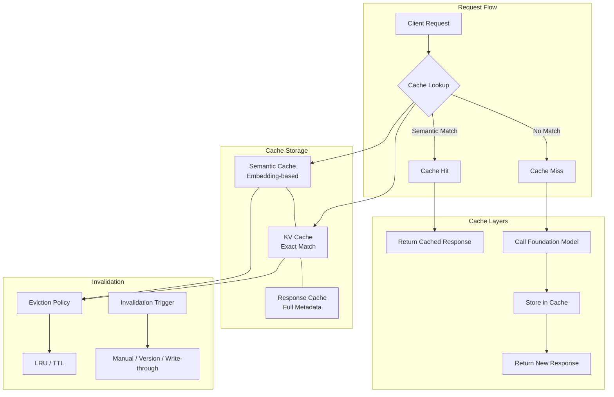
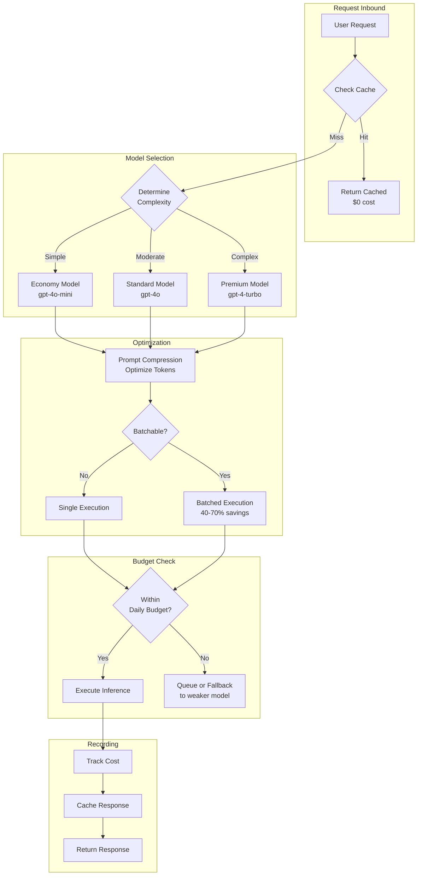
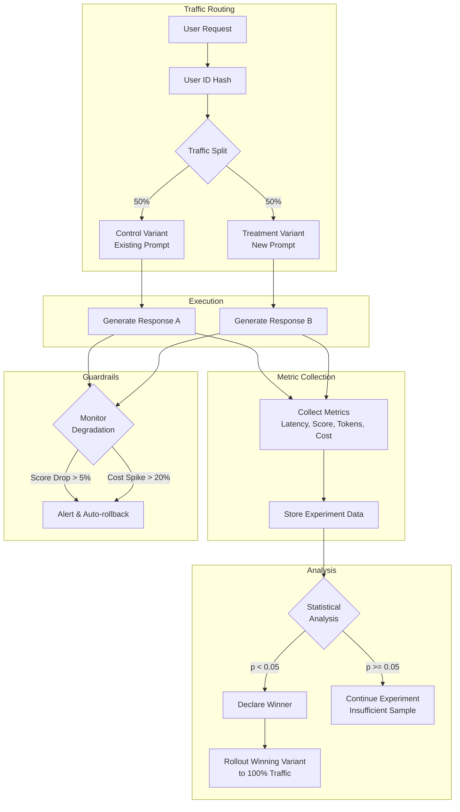
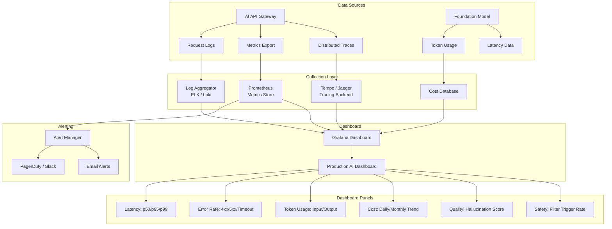

# Chapter 10: Production AI Systems

> **Bridge the gap between prototype and production. Master deployment strategies, caching, rate limiting, cost management, load balancing, A/B testing, monitoring, and incident response for AI applications — all with production-grade TypeScript implementations.**

## Learning Objectives

After completing this chapter, you will be able to:

<!-- Image Gallery -->
<div style="display:flex;flex-wrap:wrap;gap:4px;margin:16px 0;padding:12px;background:#f8fafc;border-radius:8px;border:1px solid #e2e8f0;">
<a href="../../../assets/images/lessons/modern-ai-engineering/10-production-ai-systems/hero.svg" target="_blank" rel="noopener">
  
</a>
<a href="../../../assets/images/lessons/modern-ai-engineering/10-production-ai-systems/handwritten-notes.svg" target="_blank" rel="noopener">
  
</a>
<a href="../../../assets/images/lessons/modern-ai-engineering/10-production-ai-systems/sticky-notes.svg" target="_blank" rel="noopener">
  
</a>
<a href="../../../assets/images/lessons/modern-ai-engineering/10-production-ai-systems/visual-explanation.svg" target="_blank" rel="noopener">
  
</a>
<a href="../../../assets/images/lessons/modern-ai-engineering/10-production-ai-systems/architecture.svg" target="_blank" rel="noopener">
  
</a>
<a href="../../../assets/images/lessons/modern-ai-engineering/10-production-ai-systems/workflow.svg" target="_blank" rel="noopener">
  
</a>
<a href="../../../assets/images/lessons/modern-ai-engineering/10-production-ai-systems/mindmap.svg" target="_blank" rel="noopener">
  
</a>
<a href="../../../assets/images/lessons/modern-ai-engineering/10-production-ai-systems/comparison.svg" target="_blank" rel="noopener">
  
</a>
<a href="../../../assets/images/lessons/modern-ai-engineering/10-production-ai-systems/cheatsheet.svg" target="_blank" rel="noopener">
  
</a>
<a href="../../../assets/images/lessons/modern-ai-engineering/10-production-ai-systems/interview-quiz.svg" target="_blank" rel="noopener">
  
</a>
<a href="../../../assets/images/lessons/modern-ai-engineering/10-production-ai-systems/social-card.svg" target="_blank" rel="noopener">
  
</a>
</div>
<!-- End Image Gallery -->

- Choose the right deployment strategy (real-time, batch, streaming, edge) for your AI use case
- Implement semantic caching, KV caching, and response caching to reduce latency and cost
- Design rate limiting strategies (per-user, per-token, per-IP, global) with token bucket and sliding window algorithms
- Manage AI costs through model selection, prompt optimization, batching, distillation, and quantization
- Configure load balancing, autoscaling, connection pooling, and circuit breakers for AI workloads
- Run A/B experiments on prompt variants, model versions, and retrieval strategies
- Build production monitoring dashboards for latency, errors, token usage, costs, and hallucination rate
- Execute incident response workflows from detection through post-mortem

---

## 10.1 Deployment Strategies

AI applications require different deployment strategies depending on latency requirements, throughput, cost constraints, and use case characteristics.

### Real-Time Inference

Real-time inference serves predictions synchronously with sub-second latency. The client sends a request and waits for the response.

**Best for:** Chatbots, code completion, real-time translation, interactive assistants

**Considerations:**
- Cold start latency (model loading, GPU initialization)
- Request queuing under high traffic
- Timeout handling for long-running generations
- Streaming support for progressive output

```typescript
interface RealTimeEndpoint {
  endpoint: string;
  model: string;
  maxTokens: number;
  temperature: number;
  timeoutMs: number;
}

async function callRealTimeInference(
  endpoint: RealTimeEndpoint,
  input: string
): Promise<string> {
  const controller = new AbortController();
  const timeout = setTimeout(() => controller.abort(), endpoint.timeoutMs);

  try {
    const response = await fetch(endpoint.endpoint, {
      method: "POST",
      headers: { "Content-Type": "application/json" },
      body: JSON.stringify({
        model: endpoint.model,
        max_tokens: endpoint.maxTokens,
        temperature: endpoint.temperature,
        messages: [{ role: "user", content: input }],
        stream: false,
      }),
      signal: controller.signal,
    });

    if (!response.ok) {
      throw new Error(`Inference failed: ${response.status}`);
    }

    const data = await response.json();
    return data.choices[0].message.content;
  } finally {
    clearTimeout(timeout);
  }
}
```

### Batch Processing

Batch processing aggregates multiple requests and processes them as a single job. This reduces per-request overhead and can leverage cheaper inference tiers.

**Best for:** Document analysis, bulk classification, content moderation, data enrichment

```typescript
interface BatchJob {
  jobId: string;
  requests: string[];
  status: "pending" | "running" | "completed" | "failed";
  results?: string[];
  createdAt: Date;
  completedAt?: Date;
}

class BatchProcessor {
  private queue: BatchJob[] = [];
  private processing = false;

  async submitBatch(requests: string[]): Promise<string> {
    const job: BatchJob = {
      jobId: crypto.randomUUID(),
      requests,
      status: "pending",
      createdAt: new Date(),
    };
    this.queue.push(job);
    this.processQueue();
    return job.jobId;
  }

  private async processQueue(): Promise<void> {
    if (this.processing) return;
    this.processing = true;

    while (this.queue.length > 0) {
      const job = this.queue.shift()!;
      job.status = "running";

      try {
        const results = await Promise.all(
          job.requests.map((req) => this.processSingle(req))
        );
        job.results = results;
        job.status = "completed";
        job.completedAt = new Date();
      } catch (error) {
        job.status = "failed";
        console.error(`Batch job ${job.jobId} failed:`, error);
      }
    }

    this.processing = false;
  }

  private async processSingle(input: string): Promise<string> {
    const response = await fetch("https://api.openai.com/v1/chat/completions", {
      method: "POST",
      headers: {
        "Content-Type": "application/json",
        Authorization: `Bearer ${process.env.OPENAI_API_KEY}`,
      },
      body: JSON.stringify({
        model: "gpt-4o-mini",
        messages: [{ role: "user", content: input }],
        max_tokens: 500,
      }),
    });
    const data = await response.json();
    return data.choices[0].message.content;
  }

  getJobStatus(jobId: string): BatchJob | undefined {
    return this.queue.find((j) => j.jobId === jobId);
  }
}
```

### Streaming

Streaming delivers model output token-by-token as it is generated, enabling real-time user experiences without waiting for the full response.

**Best for:** Chat interfaces, code completion, transcription, real-time translation

```typescript
async function* streamInference(
  input: string,
  model = "gpt-4o"
): AsyncGenerator<string> {
  const response = await fetch("https://api.openai.com/v1/chat/completions", {
    method: "POST",
    headers: {
      "Content-Type": "application/json",
      Authorization: `Bearer ${process.env.OPENAI_API_KEY}`,
    },
    body: JSON.stringify({
      model,
      messages: [{ role: "user", content: input }],
      stream: true,
    }),
  });

  if (!response.ok) throw new Error(`Stream failed: ${response.status}`);
  if (!response.body) throw new Error("No response body");

  const reader = response.body.getReader();
  const decoder = new TextDecoder();
  let buffer = "";

  try {
    while (true) {
      const { done, value } = await reader.read();
      if (done) break;

      buffer += decoder.decode(value, { stream: true });
      const lines = buffer.split("\n");
      buffer = lines.pop() || "";

      for (const line of lines) {
        if (line.startsWith("data: ")) {
          const data = line.slice(6);
          if (data === "[DONE]") return;
          try {
            const parsed = JSON.parse(data);
            const content = parsed.choices[0]?.delta?.content || "";
            if (content) yield content;
          } catch {
            // Skip malformed lines
          }
        }
      }
    }
  } finally {
    reader.releaseLock();
  }
}
```

### Edge Deployment

Edge deployment runs inference on devices or edge servers close to the user, reducing latency and enabling offline operation.

**Best for:** Mobile apps, IoT devices, privacy-sensitive applications, offline-capable systems

### Deployment Strategy Comparison

| Strategy | Latency | Throughput | Cost per Request | Use Case |
|----------|---------|------------|-----------------|----------|
| Real-time | < 1s | Moderate | High | Chatbots, assistants |
| Batch | Minutes-hours | Very high | Low | Bulk classification |
| Streaming | ~first token | Moderate | High | Chat, transcription |
| Edge | < 100ms | High | Very low | Mobile, offline |
| Hybrid (edge + cloud) | Variable | Adaptive | Medium | Tiered responses |

---

## 10.2 Caching

Caching is the most effective technique for reducing both latency and cost in AI systems. AI applications benefit from several caching strategies beyond traditional key-value caching.

### Semantic Caching

Semantic caching stores responses based on meaning rather than exact string matches. When a user asks a question similar to a previously cached query, the cached response is returned without calling the model.

```typescript
interface CachedEntry {
  query: string;
  embedding: number[];
  response: string;
  model: string;
  timestamp: Date;
  hitCount: number;
}

class SemanticCache {
  private entries: CachedEntry[] = [];
  private similarityThreshold: number;

  constructor(threshold = 0.92) {
    this.similarityThreshold = threshold;
  }

  async find(query: string, model: string): Promise<string | null> {
    const embedding = await this.getEmbedding(query);
    const now = Date.now();

    for (const entry of this.entries) {
      if (entry.model !== model) continue;
      const similarity = this.cosineSimilarity(embedding, entry.embedding);

      if (similarity >= this.similarityThreshold) {
        entry.hitCount++;
        return entry.response;
      }
    }
    return null;
  }

  async store(query: string, response: string, model: string): Promise<void> {
    const embedding = await this.getEmbedding(query);
    this.entries.push({
      query,
      embedding,
      response,
      model,
      timestamp: new Date(),
      hitCount: 0,
    });

    // Evict oldest entries if cache exceeds limit
    if (this.entries.length > 10000) {
      this.entries.sort((a, b) => a.timestamp.getTime() - b.timestamp.getTime());
      this.entries = this.entries.slice(-5000);
    }
  }

  private async getEmbedding(text: string): Promise<number[]> {
    const response = await fetch("https://api.openai.com/v1/embeddings", {
      method: "POST",
      headers: {
        "Content-Type": "application/json",
        Authorization: `Bearer ${process.env.OPENAI_API_KEY}`,
      },
      body: JSON.stringify({
        model: "text-embedding-3-small",
        input: text,
      }),
    });
    const data = await response.json();
    return data.data[0].embedding;
  }

  private cosineSimilarity(a: number[], b: number[]): number {
    const dotProduct = a.reduce((sum, val, i) => sum + val * b[i], 0);
    const magA = Math.sqrt(a.reduce((sum, val) => sum + val * val, 0));
    const magB = Math.sqrt(b.reduce((sum, val) => sum + val * val, 0));
    return dotProduct / (magA * magB);
  }

  getStats(): { size: number; totalHits: number } {
    const totalHits = this.entries.reduce((sum, e) => sum + e.hitCount, 0);
    return { size: this.entries.length, totalHits };
  }
}
```

### KV Caching

Key-value caching stores exact match results. This is useful for deterministic operations like token counting, embedding lookups, and repeated identical queries.

```typescript
class KVCache {
  private store = new Map<string, { value: string; expiresAt: number }>();

  get(key: string): string | null {
    const entry = this.store.get(key);
    if (!entry) return null;
    if (Date.now() > entry.expiresAt) {
      this.store.delete(key);
      return null;
    }
    return entry.value;
  }

  set(key: string, value: string, ttlMs: number = 3600000): void {
    this.store.set(key, { value, expiresAt: Date.now() + ttlMs });
  }

  invalidate(pattern: string): void {
    for (const key of this.store.keys()) {
      if (key.includes(pattern)) this.store.delete(key);
    }
  }

  clear(): void {
    this.store.clear();
  }
}
```

### Response Caching

Response caching stores the complete model response, including metadata about tokens used, model version, and generation parameters. This enables cost attribution and audit trails.

### Cache Invalidation Strategies

| Strategy | Trigger | Use Case |
|----------|---------|----------|
| TTL-based | Time expiration | General knowledge, stable answers |
| Version-based | Model or prompt update | After prompt engineering changes |
| Write-through | Data source update | When knowledge base changes |
| Manual | Admin action | Critical content corrections |

### Caching Architecture



---

## 10.3 Rate Limiting

Rate limiting protects your AI application from abuse, controls costs, and ensures fair resource allocation across users.

### Rate Limiting Dimensions

| Dimension | Scope | Purpose |
|-----------|-------|---------|
| Per-user | Individual user ID | Prevent abuse by single user |
| Per-token | Total token throughput | Control model API costs |
| Per-IP | IP address | Basic abuse protection |
| Global | Total system | Prevent infrastructure overload |
| Per-tier | Subscription tier | Differentiate free vs paid |

### Token Bucket Algorithm

The token bucket allows bursts up to a capacity while enforcing a steady average rate.

```typescript
class TokenBucket {
  private tokens: number;
  private lastRefill: number;

  constructor(
    private capacity: number,
    private refillRate: number, // tokens per second
    private refillInterval: number = 1000 // ms
  ) {
    this.tokens = capacity;
    this.lastRefill = Date.now();
  }

  tryConsume(count: number = 1): boolean {
    this.refill();

    if (this.tokens >= count) {
      this.tokens -= count;
      return true;
    }
    return false;
  }

  private refill(): void {
    const now = Date.now();
    const elapsed = now - this.lastRefill;

    if (elapsed >= this.refillInterval) {
      const refillTokens = Math.floor(elapsed / 1000) * this.refillRate;
      this.tokens = Math.min(this.capacity, this.tokens + refillTokens);
      this.lastRefill = now;
    }
  }

  getAvailableTokens(): number {
    this.refill();
    return this.tokens;
  }
}
```

### Sliding Window Algorithm

The sliding window tracks requests within a rolling time window, providing more accurate rate limiting than fixed windows.

```typescript
class SlidingWindowRateLimiter {
  private windows = new Map<string, number[]>();

  constructor(
    private maxRequests: number,
    private windowMs: number
  ) {}

  isAllowed(key: string): boolean {
    const now = Date.now();
    const windowStart = now - this.windowMs;

    let timestamps = this.windows.get(key) || [];
    timestamps = timestamps.filter((t) => t > windowStart);

    if (timestamps.length >= this.maxRequests) {
      this.windows.set(key, timestamps);
      return false;
    }

    timestamps.push(now);
    this.windows.set(key, timestamps);
    return true;
  }

  getRemainingRequests(key: string): number {
    const now = Date.now();
    const windowStart = now - this.windowMs;
    const timestamps = (this.windows.get(key) || []).filter(
      (t) => t > windowStart
    );
    return Math.max(0, this.maxRequests - timestamps.length);
  }
}
```

### Multi-Layer Rate Limiter

```typescript
interface RateLimitConfig {
  maxRequestsPerUser: number;
  maxTokensPerMinute: number;
  maxRequestsPerIP: number;
  maxGlobalRequests: number;
  windowMs: number;
}

class MultiLayerRateLimiter {
  private userLimiter: SlidingWindowRateLimiter;
  private ipLimiter: SlidingWindowRateLimiter;
  private globalLimiter: TokenBucket;

  constructor(private config: RateLimitConfig) {
    this.userLimiter = new SlidingWindowRateLimiter(
      config.maxRequestsPerUser,
      config.windowMs
    );
    this.ipLimiter = new SlidingWindowRateLimiter(
      config.maxRequestsPerIP,
      config.windowMs
    );
    this.globalLimiter = new TokenBucket(
      config.maxGlobalRequests,
      config.maxGlobalRequests / (config.windowMs / 1000)
    );
  }

  check({
    userId,
    ip,
    estimatedTokens,
  }: {
    userId: string;
    ip: string;
    estimatedTokens: number;
  }): { allowed: boolean; reason?: string; retryAfterMs?: number } {
    if (!this.userLimiter.isAllowed(`user:${userId}`)) {
      return { allowed: false, reason: "User rate limit exceeded" };
    }

    if (!this.ipLimiter.isAllowed(`ip:${ip}`)) {
      return { allowed: false, reason: "IP rate limit exceeded" };
    }

    if (!this.globalLimiter.tryConsume(estimatedTokens)) {
      return { allowed: false, reason: "Global rate limit exceeded" };
    }

    return { allowed: true };
  }
}
```

### Priority Queuing

When rate limits are exceeded, requests can be queued with priority levels rather than rejected outright.

```typescript
type Priority = "critical" | "high" | "normal" | "low";

interface QueuedRequest {
  id: string;
  priority: Priority;
  execute: () => Promise<any>;
  queuedAt: Date;
}

class PriorityQueue {
  private queues: Record<Priority, QueuedRequest[]> = {
    critical: [],
    high: [],
    normal: [],
    low: [],
  };
  private processing = false;
  private concurrency: number;

  constructor(concurrency = 5) {
    this.concurrency = concurrency;
  }

  enqueue(request: Omit<QueuedRequest, "queuedAt">): void {
    this.queues[request.priority].push({ ...request, queuedAt: new Date() });
    this.process();
  }

  private async process(): Promise<void> {
    if (this.processing) return;
    this.processing = true;

    const priorities: Priority[] = ["critical", "high", "normal", "low"];

    while (this.hasPending()) {
      const batch: QueuedRequest[] = [];

      for (const priority of priorities) {
        while (
          batch.length < this.concurrency &&
          this.queues[priority].length > 0
        ) {
          batch.push(this.queues[priority].shift()!);
        }
        if (batch.length >= this.concurrency) break;
      }

      await Promise.allSettled(batch.map((r) => r.execute()));
    }

    this.processing = false;
  }

  private hasPending(): boolean {
    return Object.values(this.queues).some((q) => q.length > 0);
  }
}
```

---

## 10.4 Cost Management

AI costs can grow rapidly in production. Systematic cost management strategies are essential for sustainable operations.

### Cost Optimization Strategies

| Strategy | Savings Potential | Implementation Effort | Risk |
|----------|------------------|---------------------|------|
| Model selection | 50-90% | Low | Quality degradation |
| Prompt optimization | 30-60% | Medium | Requires iteration |
| Batching | 40-70% | Medium | Increased latency |
| Semantic caching | 30-80% | Medium | Stale responses |
| Model distillation | 40-80% | High | Training cost |
| Quantization | 50-75% | Medium | Accuracy loss |
| Token budgeting | 20-40% | Low | Truncated responses |

### Model Selection Strategy

```typescript
type ModelTier = "economy" | "standard" | "premium";

interface ModelConfig {
  model: string;
  costPerInputToken: number;
  costPerOutputToken: number;
  maxTokens: number;
  suitableFor: string[];
}

const MODEL_CATALOG: Record<ModelTier, ModelConfig> = {
  economy: {
    model: "gpt-4o-mini",
    costPerInputToken: 0.00000015,
    costPerOutputToken: 0.0000006,
    maxTokens: 16000,
    suitableFor: ["classification", "summarization", "simple_qa"],
  },
  standard: {
    model: "gpt-4o",
    costPerInputToken: 0.0000025,
    costPerOutputToken: 0.00001,
    maxTokens: 128000,
    suitableFor: ["complex_reasoning", "analysis", "creative"],
  },
  premium: {
    model: "gpt-4-turbo",
    costPerInputToken: 0.00001,
    costPerOutputToken: 0.00003,
    maxTokens: 128000,
    suitableFor: ["research", "critical_decision", "expert_analysis"],
  },
};

class CostManager {
  private dailyBudget: number;
  private dailySpend: number = 0;
  private resetTime: Date;

  constructor(dailyBudget: number) {
    this.dailyBudget = dailyBudget;
    this.resetTime = this.getNextResetTime();
  }

  selectModel(taskType: string, complexity: "simple" | "moderate" | "complex"): ModelConfig {
    if (complexity === "simple") return MODEL_CATALOG.economy;
    if (complexity === "moderate") return MODEL_CATALOG.standard;
    return MODEL_CATALOG.premium;
  }

  estimateCost(
    model: ModelConfig,
    inputTokens: number,
    outputTokens: number
  ): number {
    return (
      inputTokens * model.costPerInputToken +
      outputTokens * model.costPerOutputToken
    );
  }

  trackSpend(cost: number): boolean {
    this.checkReset();

    if (this.dailySpend + cost > this.dailyBudget) {
      return false; // Budget exceeded
    }

    this.dailySpend += cost;
    return true;
  }

  private checkReset(): void {
    if (Date.now() >= this.resetTime.getTime()) {
      this.dailySpend = 0;
      this.resetTime = this.getNextResetTime();
    }
  }

  private getNextResetTime(): Date {
    const next = new Date();
    next.setHours(24, 0, 0, 0);
    return next;
  }

  getDailySpend(): number {
    this.checkReset();
    return this.dailySpend;
  }

  getRemainingBudget(): number {
    return this.dailyBudget - this.getDailySpend();
  }
}
```

### Cost Optimization Flow



### Prompt Optimization for Cost

```typescript
class PromptOptimizer {
  optimize(prompt: string, maxTokens: number): string {
    // Remove redundant whitespace
    let optimized = prompt.replace(/\s+/g, " ").trim();

    // Remove unnecessary instructions
    optimized = optimized.replace(/^You are an AI assistant\.?\s*/i, "");

    // Truncate examples if over token limit
    const estimatedTokens = optimized.length / 4;
    if (estimatedTokens > maxTokens) {
      const ratio = maxTokens / estimatedTokens;
      optimized = optimized.slice(0, Math.floor(optimized.length * ratio));
    }

    return optimized;
  }

  estimateTokenCount(text: string): number {
    // Rough estimation: ~4 characters per token
    return Math.ceil(text.length / 4);
  }
}
```

---

## 10.5 Load Balancing and Autoscaling

As AI applications scale, load balancing and autoscaling ensure consistent performance under variable traffic.

### Horizontal Scaling

Horizontal scaling adds more instances of your AI service to handle increased load.

```typescript
interface ScalingConfig {
  minReplicas: number;
  maxReplicas: number;
  targetCpuUtilization: number;
  targetMemoryUtilization: number;
  targetRequestsPerSecond: number;
  cooldownPeriodMs: number;
}

class AutoScaler {
  private currentReplicas: number;
  private lastScaleTime: number = 0;

  constructor(private config: ScalingConfig) {
    this.currentReplicas = config.minReplicas;
  }

  evaluate(
    currentCPU: number,
    currentMemory: number,
    currentRPS: number
  ): number {
    const now = Date.now();
    if (now - this.lastScaleTime < this.config.cooldownPeriodMs) {
      return this.currentReplicas;
    }

    let targetReplicas = this.currentReplicas;

    const cpuRatio = currentCPU / this.config.targetCpuUtilization;
    const memoryRatio = currentMemory / this.config.targetMemoryUtilization;
    const rpsRatio = currentRPS / this.config.targetRequestsPerSecond;

    const maxRatio = Math.max(cpuRatio, memoryRatio, rpsRatio);

    if (maxRatio > 1.2) {
      targetReplicas = Math.ceil(this.currentReplicas * maxRatio);
    } else if (maxRatio < 0.5 && this.currentReplicas > this.config.minReplicas) {
      targetReplicas = Math.max(
        this.config.minReplicas,
        Math.floor(this.currentReplicas * 0.7)
      );
    }

    targetReplicas = Math.max(
      this.config.minReplicas,
      Math.min(this.config.maxReplicas, targetReplicas)
    );

    if (targetReplicas !== this.currentReplicas) {
      this.currentReplicas = targetReplicas;
      this.lastScaleTime = now;
    }

    return this.currentReplicas;
  }
}
```

### Request Routing

```typescript
interface BackendInstance {
  id: string;
  host: string;
  port: number;
  healthy: boolean;
  activeRequests: number;
  lastHeartbeat: number;
}

class LoadBalancer {
  private instances: BackendInstance[] = [];
  private rrIndex: number = 0;

  register(instance: BackendInstance): void {
    this.instances.push(instance);
  }

  getNextInstance(strategy: "round-robin" | "least-connections"): BackendInstance | null {
    const healthy = this.instances.filter(
      (i) => i.healthy && Date.now() - i.lastHeartbeat < 30000
    );

    if (healthy.length === 0) return null;

    if (strategy === "round-robin") {
      const instance = healthy[this.rrIndex % healthy.length];
      this.rrIndex++;
      return instance;
    }

    // Least connections
    return healthy.reduce((a, b) =>
      a.activeRequests <= b.activeRequests ? a : b
    );
  }

  healthCheck(): void {
    for (const instance of this.instances) {
      if (Date.now() - instance.lastHeartbeat > 60000) {
        instance.healthy = false;
      }
    }
  }
}
```

### Circuit Breaker

Circuit breakers prevent cascading failures by stopping requests to degraded services.

```typescript
class CircuitBreaker {
  private failures: number = 0;
  private lastFailureTime: number = 0;
  private state: "closed" | "open" | "half-open" = "closed";

  constructor(
    private failureThreshold: number = 5,
    private resetTimeoutMs: number = 30000
  ) {}

  async call<T>(fn: () => Promise<T>): Promise<T> {
    if (this.state === "open") {
      if (Date.now() - this.lastFailureTime >= this.resetTimeoutMs) {
        this.state = "half-open";
      } else {
        throw new Error("Circuit breaker is open");
      }
    }

    try {
      const result = await fn();
      this.onSuccess();
      return result;
    } catch (error) {
      this.onFailure();
      throw error;
    }
  }

  private onSuccess(): void {
    this.failures = 0;
    this.state = "closed";
  }

  private onFailure(): void {
    this.failures++;
    this.lastFailureTime = Date.now();

    if (this.failures >= this.failureThreshold) {
      this.state = "open";
    }
  }

  getState(): "closed" | "open" | "half-open" {
    return this.state;
  }
}
```

### Connection Pooling

```typescript
class ConnectionPool {
  private active: number = 0;
  private queue: Array<() => void> = [];

  constructor(private maxConnections: number = 10) {}

  async acquire(): Promise<void> {
    if (this.active < this.maxConnections) {
      this.active++;
      return;
    }

    return new Promise<void>((resolve) => {
      this.queue.push(resolve);
    });
  }

  release(): void {
    if (this.queue.length > 0) {
      const next = this.queue.shift()!;
      next();
    } else {
      this.active--;
    }
  }
}
```

---

## 10.6 A/B Testing

A/B testing enables data-driven decisions about prompt variants, model versions, retrieval strategies, and other AI system components.

### A/B Testing Framework

```typescript
interface ExperimentConfig {
  experimentId: string;
  variants: Variant[];
  trafficSplit: number[]; // Must sum to 100
  metrics: string[];
  minSampleSize: number;
  startDate: Date;
  endDate: Date;
}

interface Variant {
  id: string;
  name: string;
  config: Record<string, any>;
}

interface ExperimentResult {
  variantId: string;
  totalRequests: number;
  successCount: number;
  avgLatency: number;
  avgTokensUsed: number;
  avgScore: number;
  errorRate: number;
  costPerRequest: number;
}

class ABTestingFramework {
  private experiments: Map<string, ExperimentConfig> = new Map();
  private results: Map<string, ExperimentResult[]> = new Map();

  registerExperiment(config: ExperimentConfig): void {
    const totalSplit = config.trafficSplit.reduce((a, b) => a + b, 0);
    if (totalSplit !== 100) {
      throw new Error("Traffic split must sum to 100");
    }
    this.experiments.set(config.experimentId, config);
  }

  assignVariant(experimentId: string, userId: string): Variant | null {
    const config = this.experiments.get(experimentId);
    if (!config) return null;

    if (Date.now() < config.startDate.getTime() || Date.now() > config.endDate.getTime()) {
      return null;
    }

    const hash = this.hashUserId(userId, experimentId);
    let cumulative = 0;

    for (let i = 0; i < config.variants.length; i++) {
      cumulative += config.trafficSplit[i];
      if (hash < cumulative) {
        return config.variants[i];
      }
    }

    return config.variants[0];
  }

  private hashUserId(userId: string, experimentId: string): number {
    const combined = `${experimentId}:${userId}`;
    let hash = 0;
    for (let i = 0; i < combined.length; i++) {
      const char = combined.charCodeAt(i);
      hash = (hash << 5) - hash + char;
      hash = hash & hash;
    }
    return Math.abs(hash % 100);
  }

  recordResult(
    experimentId: string,
    variantId: string,
    metrics: {
      success: boolean;
      latency: number;
      tokensUsed: number;
      score?: number;
      cost: number;
    }
  ): void {
    const key = `${experimentId}:${variantId}`;
    const existing: ExperimentResult = this.results.get(key) || {
      variantId,
      totalRequests: 0,
      successCount: 0,
      avgLatency: 0,
      avgTokensUsed: 0,
      avgScore: 0,
      errorRate: 0,
      costPerRequest: 0,
    };

    const n = existing.totalRequests;
    existing.totalRequests++;
    existing.successCount += metrics.success ? 1 : 0;
    existing.avgLatency = (existing.avgLatency * n + metrics.latency) / (n + 1);
    existing.avgTokensUsed =
      (existing.avgTokensUsed * n + metrics.tokensUsed) / (n + 1);
    if (metrics.score !== undefined) {
      existing.avgScore = (existing.avgScore * n + metrics.score) / (n + 1);
    }
    existing.errorRate = 1 - existing.successCount / existing.totalRequests;
    existing.costPerRequest =
      (existing.costPerRequest * n + metrics.cost) / (n + 1);

    this.results.set(key, existing);
  }

  getResults(experimentId: string): ExperimentResult[] {
    const results: ExperimentResult[] = [];
    const config = this.experiments.get(experimentId);
    if (!config) return results;

    for (const variant of config.variants) {
      const key = `${experimentId}:${variant.id}`;
      const result = this.results.get(key);
      if (result) results.push(result);
    }

    return results;
  }

  isSignificant(experimentId: string): boolean {
    const results = this.getResults(experimentId);
    if (results.length < 2) return false;

    const config = this.experiments.get(experimentId);
    if (!config) return false;

    for (const result of results) {
      if (result.totalRequests < config.minSampleSize) return false;
    }

    // Simple z-test for proportion comparison
    const [control, treatment] = results;
    const p1 = control.successCount / control.totalRequests;
    const p2 = treatment.successCount / treatment.totalRequests;
    const pPool =
      (control.successCount + treatment.successCount) /
      (control.totalRequests + treatment.totalRequests);
    const se = Math.sqrt(
      pPool * (1 - pPool) * (1 / control.totalRequests + 1 / treatment.totalRequests)
    );
    const z = Math.abs(p1 - p2) / se;

    return z > 1.96; // 95% confidence
  }
}
```

### A/B Testing Pipeline



### Experiment Scenarios

| Experiment | Control | Treatment | Metrics |
|-----------|---------|-----------|---------|
| Prompt variant | Few-shot with 3 examples | Few-shot with 5 examples | Accuracy, latency, tokens |
| Model version | gpt-4o-mini | gpt-4o | Quality score, cost, latency |
| Retrieval strategy | Dense retrieval | Hybrid retrieval | Recall, precision, latency |
| Temperature | 0.3 | 0.7 | Diversity, relevance, hallucination |
| Chunk size | 256 tokens | 512 tokens | Retrieval quality, latency |

---

## 10.7 Monitoring and Alerting

Production AI systems require comprehensive monitoring across multiple dimensions.

### Key Metrics

| Category | Metrics | Alert Thresholds |
|----------|---------|-----------------|
| Latency | p50, p95, p99 response time, time-to-first-token | p95 > 5s |
| Error rates | 4xx, 5xx, timeout rate, empty response rate | Error rate > 1% |
| Token usage | Input tokens/min, output tokens/min, total tokens/min | > 80% quota |
| Costs | Cost per request, daily spend, cost by model/endpoint | Daily spend > budget |
| Quality | Hallucination rate, user satisfaction score, relevance | Hallucination rate > 5% |
| Infrastructure | CPU, memory, GPU utilization, request queue depth | CPU > 80% for 5min |
| Safety | Content filter triggers, PII detection rate, abuse reports | Filter rate > 2% |

### Monitoring Dashboard Architecture



### Structured Logging

```typescript
interface AILogEntry {
  timestamp: string;
  requestId: string;
  userId: string;
  model: string;
  promptTokens: number;
  completionTokens: number;
  latencyMs: number;
  statusCode: number;
  cacheHit: boolean;
  cost: number;
  variant?: string;
  safetyFlags?: string[];
  error?: string;
}

class AILogger {
  private logs: AILogEntry[] = [];
  private metricsBuffer: Map<string, number[]> = new Map();

  log(entry: Omit<AILogEntry, "timestamp">): void {
    const fullEntry: AILogEntry = {
      ...entry,
      timestamp: new Date().toISOString(),
    };
    this.logs.push(fullEntry);
    this.updateMetrics(fullEntry);

    if (this.logs.length > 10000) {
      this.flush();
    }
  }

  private updateMetrics(entry: AILogEntry): void {
    this.addMetric("latency", entry.latencyMs);
    this.addMetric("tokens", entry.promptTokens + entry.completionTokens);
    this.addMetric("cost", entry.cost);

    if (entry.statusCode >= 400) {
      this.addMetric("errors", 1);
    }
  }

  private addMetric(name: string, value: number): void {
    if (!this.metricsBuffer.has(name)) {
      this.metricsBuffer.set(name, []);
    }
    this.metricsBuffer.get(name)!.push(value);
  }

  getLatencyPercentiles(): { p50: number; p95: number; p99: number } {
    const latencies = this.metricsBuffer.get("latency") || [];
    if (latencies.length === 0) return { p50: 0, p95: 0, p99: 0 };

    const sorted = [...latencies].sort((a, b) => a - b);
    return {
      p50: sorted[Math.floor(sorted.length * 0.5)],
      p95: sorted[Math.floor(sorted.length * 0.95)],
      p99: sorted[Math.floor(sorted.length * 0.99)],
    };
  }

  getErrorRate(): number {
    const errors = this.metricsBuffer.get("errors") || [];
    const total = this.logs.length;
    return total > 0 ? errors.length / total : 0;
  }

  private flush(): void {
    // In production, send to external logging system
    console.log(`Flushing ${this.logs.length} log entries`);
    this.logs = [];
  }
}
```

### Alert Configuration

```typescript
interface AlertRule {
  name: string;
  metric: string;
  condition: ">" | "<" | "==";
  threshold: number;
  durationMs: number;
  severity: "critical" | "warning" | "info";
  channels: string[];
}

class AlertManager {
  private rules: AlertRule[] = [];
  private alertHistory: Map<string, number[]> = new Map();

  addRule(rule: AlertRule): void {
    this.rules.push(rule);
  }

  evaluate(metrics: Record<string, number>): string[] {
    const triggered: string[] = [];

    for (const rule of this.rules) {
      const value = metrics[rule.metric];
      if (value === undefined) continue;

      let isTriggered = false;
      if (rule.condition === ">" && value > rule.threshold) isTriggered = true;
      if (rule.condition === "<" && value < rule.threshold) isTriggered = true;
      if (rule.condition === "==" && value === rule.threshold) isTriggered = true;

      if (isTriggered) {
        const history = this.alertHistory.get(rule.name) || [];
        history.push(Date.now());
        this.alertHistory.set(rule.name, history);

        const sustained = this.checkSustained(rule);
        if (sustained) {
          triggered.push(`${rule.severity}: ${rule.name} - ${rule.metric} ${rule.condition} ${rule.threshold} (current: ${value})`);
        }
      }
    }

    return triggered;
  }

  private checkSustained(rule: AlertRule): boolean {
    const history = this.alertHistory.get(rule.name) || [];
    const windowStart = Date.now() - rule.durationMs;
    const recentTriggers = history.filter((t) => t > windowStart);
    return recentTriggers.length >= 2;
  }
}
```

---

## 10.8 Incident Response

Incident response for AI systems requires specialized playbooks that address AI-specific failure modes.

### Incident Response Workflow

| Phase | Actions | Team | Duration |
|-------|---------|------|----------|
| Detection | Monitoring alert, user report, automated test failure | On-call engineer | < 5 min |
| Triage | Assess severity, determine affected users, identify failure mode | On-call + SRE | < 15 min |
| Mitigation | Rollback model, switch fallback, disable feature, rate limit | SRE + ML team | < 30 min |
| Root cause | Analyze logs, reproduce issue, identify trigger | ML + Engineering | < 4 hours |
| Fix | Deploy fix, update prompts, adjust thresholds | Engineering | < 8 hours |
| Post-mortem | Document timeline, determine action items, update runbooks | All teams | < 48 hours |

### AI-Specific Incident Types

```typescript
type AIIncidentType =
  | "quality_degradation"
  | "cost_spike"
  | "safety_breach"
  | "model_failure"
  | "latency_spike"
  | "data_leak"
  | "hallucination_wave";

interface Incident {
  id: string;
  type: AIIncidentType;
  severity: "sev1" | "sev2" | "sev3";
  detectedAt: Date;
  mitigatedAt?: Date;
  resolvedAt?: Date;
  summary: string;
  runbook: string;
}

const INCIDENT_RUNBOOKS: Record<AIIncidentType, string> = {
  quality_degradation: "1. Verify eval scores. 2. Check prompt changes. 3. Rollback prompt version. 4. Notify affected users.",
  cost_spike: "1. Check token usage per user. 2. Verify model tier. 3. Enable stricter caching. 4. Set spend limit alert.",
  safety_breach: "1. Block offending inputs. 2. Revoke API keys if abuse detected. 3. Review filter config. 4. Report to security team.",
  model_failure: "1. Verify API status. 2. Switch to fallback model. 3. Check for model deprecation. 4. Update model routing.",
  latency_spike: "1. Check traffic volume. 2. Verify autoscaling. 3. Review cache hit rate. 4. Scale up instances.",
  data_leak: "1. Rotate API keys. 2. Review logs for PII. 3. Block affected endpoints. 4. Notify compliance team.",
  hallucination_wave: "1. Add grounding context. 2. Reduce temperature. 3. Enable output validation. 4. Review RAG quality.",
};

class IncidentManager {
  private activeIncidents: Map<string, Incident> = new Map();
  private resolvedIncidents: Incident[] = [];

  createIncident(type: AIIncidentType, severity: Incident["severity"], summary: string): string {
    const id = `inc-${Date.now()}-${crypto.randomUUID().slice(0, 8)}`;
    const incident: Incident = {
      id,
      type,
      severity,
      detectedAt: new Date(),
      summary,
      runbook: INCIDENT_RUNBOOKS[type],
    };

    this.activeIncidents.set(id, incident);
    console.log(`[INCIDENT] ${severity.toUpperCase()}: ${type} - ${summary}`);
    console.log(`[RUNBOOK] ${incident.runbook}`);

    return id;
  }

  mitigate(id: string): void {
    const incident = this.activeIncidents.get(id);
    if (incident) {
      incident.mitigatedAt = new Date();
      console.log(`[INCIDENT] ${id} mitigated at ${incident.mitigatedAt}`);
    }
  }

  resolve(id: string): void {
    const incident = this.activeIncidents.get(id);
    if (incident) {
      incident.resolvedAt = new Date();
      this.activeIncidents.delete(id);
      this.resolvedIncidents.push(incident);
      console.log(`[INCIDENT] ${id} resolved`);
    }
  }

  getActiveIncidents(): Incident[] {
    return Array.from(this.activeIncidents.values());
  }

  generatePostMortem(): string {
    const recent = this.resolvedIncidents.slice(-10);
    return recent
      .map(
        (i) => `
## Post-Mortem: ${i.id}
- **Type**: ${i.type}
- **Severity**: ${i.severity}
- **Detected**: ${i.detectedAt.toISOString()}
- **Mitigated**: ${i.mitigatedAt?.toISOString() || "N/A"}
- **Resolved**: ${i.resolvedAt?.toISOString() || "N/A"}
- **Summary**: ${i.summary}
- **Runbook**: ${i.runbook}
`
      )
      .join("\n---\n");
  }
}
```

---

## TypeScript: AIDeploymentManager

The `AIDeploymentManager` class integrates semantic caching, rate limiting, cost tracking, and health checks into a single deployment management system.

```typescript
interface DeploymentConfig {
  model: string;
  maxTokens: number;
  temperature: number;
  dailyBudget: number;
  rateLimitConfig: {
    maxRequestsPerUser: number;
    maxRequestsPerIP: number;
    maxGlobalRequests: number;
    windowMs: number;
  };
  cacheConfig: {
    enabled: boolean;
    similarityThreshold: number;
    ttlMs: number;
  };
}

class AIDeploymentManager {
  private cache: SemanticCache;
  private kvCache: KVCache;
  private rateLimiter: MultiLayerRateLimiter;
  private costManager: CostManager;
  private logger: AILogger;
  private alertManager: AlertManager;
  private circuitBreaker: CircuitBreaker;
  private healthy: boolean = true;

  constructor(private config: DeploymentConfig) {
    this.cache = new SemanticCache(config.cacheConfig.similarityThreshold);
    this.kvCache = new KVCache();
    this.rateLimiter = new MultiLayerRateLimiter({
      maxRequestsPerUser: config.rateLimitConfig.maxRequestsPerUser,
      maxTokensPerMinute: 100000,
      maxRequestsPerIP: config.rateLimitConfig.maxRequestsPerIP,
      maxGlobalRequests: config.rateLimitConfig.maxGlobalRequests,
      windowMs: config.rateLimitConfig.windowMs,
    });
    this.costManager = new CostManager(config.dailyBudget);
    this.logger = new AILogger();
    this.alertManager = new AlertManager();
    this.circuitBreaker = new CircuitBreaker(5, 30000);

    this.setupDefaultAlerts();
  }

  private setupDefaultAlerts(): void {
    this.alertManager.addRule({
      name: "High Latency",
      metric: "p95_latency",
      condition: ">",
      threshold: 5000,
      durationMs: 60000,
      severity: "warning",
      channels: ["slack"],
    });
    this.alertManager.addRule({
      name: "Error Rate Spike",
      metric: "error_rate",
      condition: ">",
      threshold: 0.05,
      durationMs: 60000,
      severity: "critical",
      channels: ["pagerduty", "slack"],
    });
    this.alertManager.addRule({
      name: "Budget Exceeded",
      metric: "daily_spend",
      condition: ">",
      threshold: this.config.dailyBudget * 0.9,
      durationMs: 0,
      severity: "warning",
      channels: ["email"],
    });
  }

  async processRequest(params: {
    userId: string;
    ip: string;
    prompt: string;
  }): Promise<{
    response: string;
    cached: boolean;
    cost: number;
    latencyMs: number;
  }> {
    const startTime = Date.now();

    // 1. Check health
    if (!this.healthy) {
      throw new Error("Service unhealthy");
    }

    // 2. Rate limiting check
    const rateCheck = this.rateLimiter.check({
      userId: params.userId,
      ip: params.ip,
      estimatedTokens: params.prompt.length / 4,
    });

    if (!rateCheck.allowed) {
      throw new Error(`Rate limited: ${rateCheck.reason}`);
    }

    // 3. Cache check
    if (this.config.cacheConfig.enabled) {
      const cached = await this.cache.find(params.prompt, this.config.model);
      if (cached) {
        const latency = Date.now() - startTime;
        this.logger.log({
          requestId: crypto.randomUUID(),
          userId: params.userId,
          model: this.config.model,
          promptTokens: Math.ceil(params.prompt.length / 4),
          completionTokens: Math.ceil(cached.length / 4),
          latencyMs: latency,
          statusCode: 200,
          cacheHit: true,
          cost: 0,
        });
        return { response: cached, cached: true, cost: 0, latencyMs: latency };
      }
    }

    // 4. Execute with circuit breaker
    const result = await this.circuitBreaker.call(async () => {
      return this.callModel(params.prompt);
    });

    const latency = Date.now() - startTime;
    const estimatedCost = this.costManager.estimateCost(
      MODEL_CATALOG.standard,
      Math.ceil(params.prompt.length / 4),
      Math.ceil(result.length / 4)
    );

    // 5. Track cost
    if (!this.costManager.trackSpend(estimatedCost)) {
      console.warn("Daily budget exceeded");
    }

    // 6. Cache response
    if (this.config.cacheConfig.enabled) {
      await this.cache.store(params.prompt, result, this.config.model);
    }

    // 7. Log and alert
    this.logger.log({
      requestId: crypto.randomUUID(),
      userId: params.userId,
      model: this.config.model,
      promptTokens: Math.ceil(params.prompt.length / 4),
      completionTokens: Math.ceil(result.length / 4),
      latencyMs: latency,
      statusCode: 200,
      cacheHit: false,
      cost: estimatedCost,
    });

    const metrics = {
      p95_latency: this.logger.getLatencyPercentiles().p95,
      error_rate: this.logger.getErrorRate(),
      daily_spend: this.costManager.getDailySpend(),
    };

    const alerts = this.alertManager.evaluate(metrics);
    for (const alert of alerts) {
      console.warn(`[ALERT] ${alert}`);
    }

    return { response: result, cached: false, cost: estimatedCost, latencyMs: latency };
  }

  private async callModel(prompt: string): Promise<string> {
    const response = await fetch("https://api.openai.com/v1/chat/completions", {
      method: "POST",
      headers: {
        "Content-Type": "application/json",
        Authorization: `Bearer ${process.env.OPENAI_API_KEY}`,
      },
      body: JSON.stringify({
        model: this.config.model,
        max_tokens: this.config.maxTokens,
        temperature: this.config.temperature,
        messages: [{ role: "user", content: prompt }],
      }),
    });

    if (!response.ok) {
      throw new Error(`Model call failed: ${response.status}`);
    }

    const data = await response.json();
    return data.choices[0].message.content;
  }

  healthCheck(): {
    healthy: boolean;
    cacheSize: number;
    dailySpend: number;
    budgetRemaining: number;
    circuitBreakerState: string;
  } {
    return {
      healthy: this.healthy,
      cacheSize: this.cache.getStats().size,
      dailySpend: this.costManager.getDailySpend(),
      budgetRemaining: this.costManager.getRemainingBudget(),
      circuitBreakerState: this.circuitBreaker.getState(),
    };
  }

  setHealthy(healthy: boolean): void {
    this.healthy = healthy;
  }
}
```

---

## TypeScript: ABTestingFramework

The `ABTestingFramework` class manages experiment assignment, metric collection, and statistical analysis for AI system A/B tests.

```typescript
interface MetricCollector {
  recordMetric(experimentId: string, variantId: string, metric: string, value: number): void;
  getAggregates(experimentId: string): Map<string, Map<string, { mean: number; variance: number; count: number }>>;
}

class SimpleMetricCollector implements MetricCollector {
  private data = new Map<string, Map<string, number[]>>();

  recordMetric(experimentId: string, variantId: string, metric: string, value: number): void {
    const key = `${experimentId}:${variantId}:${metric}`;
    if (!this.data.has(key)) this.data.set(key, []);
    this.data.get(key)!.push(value);
  }

  getAggregates(experimentId: string): Map<string, Map<string, { mean: number; variance: number; count: number }>> {
    const result = new Map<string, Map<string, { mean: number; variance: number; count: number }>>();

    for (const [key, values] of this.data) {
      const [expId, variantId, metric] = key.split(":");
      if (expId !== experimentId) continue;

      if (!result.has(variantId)) result.set(variantId, new Map());
      const n = values.length;
      const mean = values.reduce((a, b) => a + b, 0) / n;
      const variance = values.reduce((sum, v) => sum + (v - mean) ** 2, 0) / n;

      result.get(variantId)!.set(metric, { mean, variance, count: n });
    }

    return result;
  }
}

class StatisticalAnalyzer {
  tTest(
    control: { mean: number; variance: number; count: number },
    treatment: { mean: number; variance: number; count: number }
  ): { tStatistic: number; pValue: number; significant: boolean } {
    const pooledVariance =
      ((control.count - 1) * control.variance + (treatment.count - 1) * treatment.variance) /
      (control.count + treatment.count - 2);

    const se = Math.sqrt(
      pooledVariance * (1 / control.count + 1 / treatment.count)
    );

    const tStatistic = (treatment.mean - control.mean) / se;

    // Approximate p-value using normal distribution (large sample)
    const pValue = 2 * (1 - this.normalCDF(Math.abs(tStatistic)));

    return {
      tStatistic,
      pValue,
      significant: pValue < 0.05,
    };
  }

  private normalCDF(x: number): number {
    const a1 = 0.254829592;
    const a2 = -0.284496736;
    const a3 = 1.421413741;
    const a4 = -1.453152027;
    const a5 = 1.061405429;
    const p = 0.3275911;

    const sign = x < 0 ? -1 : 1;
    x = Math.abs(x) / Math.sqrt(2);

    const t = 1 / (1 + p * x);
    const y =
      1 -
      ((((a5 * t + a4) * t + a3) * t + a2) * t + a1) * t * Math.exp(-x * x);

    return 0.5 * (1 + sign * y);
  }

  minimumSampleSize(
    baseline: number,
    minimumDetectableEffect: number,
    significance: number = 0.05,
    power: number = 0.8
  ): number {
    const zAlpha = 1.96; // for significance = 0.05
    const zBeta = 0.84; // for power = 0.8

    const p1 = baseline;
    const p2 = baseline * (1 + minimumDetectableEffect);

    const numerator =
      (zAlpha * Math.sqrt(2 * p1 * (1 - p1)) +
        zBeta * Math.sqrt(p1 * (1 - p1) + p2 * (1 - p2))) ** 2;
    const denominator = (p2 - p1) ** 2;

    return Math.ceil(numerator / denominator);
  }
}

export {
  ABTestingFramework,
  SimpleMetricCollector,
  StatisticalAnalyzer,
};
export type { Variant, ExperimentConfig, ExperimentResult, MetricCollector };
```

---

## Summary

AI systems in production require far more than just calling an API. Deployment strategies must align with latency, throughput, and cost requirements — real-time for interactive apps, batch for bulk processing, streaming for progressive output, and edge for offline-capable mobile experiences. Caching is the single most effective cost and latency optimization, with semantic caching offering especially high returns by matching queries based on meaning rather than exact text. Rate limiting must operate across multiple dimensions (user, IP, token, global) using token bucket or sliding window algorithms, with priority queuing as an alternative to hard rejection. Cost management requires a layered approach: select the cheapest adequate model, optimize prompts for fewer tokens, batch requests, cache aggressively, and consider distillation or quantization for high-volume use cases. A/B testing brings scientific rigor to AI system changes, enabling teams to validate prompt variants, model upgrades, and retrieval strategy modifications before full rollout. Comprehensive monitoring must track latency percentiles, error rates, token usage, costs, hallucination rates, and safety metrics, with alert rules tuned to detect degradation early. Incident response for AI systems demands specialized runbooks for quality degradation, cost spikes, safety breaches, and model failures — each with clear detection, triage, mitigation, and post-mortem workflows.

## Practical Takeaways

1. **Implement semantic caching first** — it reduces latency by 50-80% and costs by 30-60% with minimal effort. Use cosine similarity with a 0.92 threshold for balanced recall and precision
2. **Deploy multi-layer rate limiting** — enforce per-user, per-IP, and global limits with token bucket algorithms. Add priority queuing for critical users instead of hard rejection
3. **Choose the cheapest adequate model** — route simple queries to gpt-4o-mini and complex ones to gpt-4o. This single practice can reduce costs by 50-90%
4. **A/B test every change** — prompt variants, model versions, and retrieval strategies should all be validated statistically before full rollout. Use 95% confidence intervals and ensure adequate sample sizes
5. **Monitor what matters** — track p95 latency, error rate, token usage, daily cost, and hallucination rate. Set up alert rules with sustained condition windows to reduce noise

## Chapter Quiz

Test your understanding of production AI systems concepts.

### Question 1

Which caching strategy stores responses based on meaning similarity rather than exact string matching?

A) KV caching
B) Response caching
C) Semantic caching
D) Write-through caching

### Question 2

A user sends 100 requests in 10 seconds. The rate limiter allows 50 requests per 60 seconds using a sliding window. What happens to request #101?

A) It is allowed
B) It is queued
C) It is rejected with a rate limit error
D) It falls back to a different model

### Question 3

Which cost optimization strategy typically provides the highest savings potential?

A) Prompt optimization
B) Model selection (economy vs premium)
C) Model distillation
D) Quantization

### Question 4

In an A/B test, you observe a z-statistic of 2.1 comparing control and treatment variants. What should you conclude?

A) There is no significant difference
B) The result is statistically significant at 95% confidence
C) You need more samples
D) The control variant is worse

### Question 5

An AI system's hallucination rate suddenly increases from 2% to 15%. According to incident response best practices, what is the FIRST action?

A) Conduct a root cause analysis
B) Write a post-mortem
C) Mitigate by rolling back the recent change or switching to a fallback model
D) Notify all users of degraded quality

### Answer Key

| Question | Answer | Explanation |
|----------|--------|-------------|
| 1 | C | Semantic caching uses embeddings and cosine similarity to match queries by meaning |
| 2 | C | The 101st request exceeds the 50-request limit in the sliding window and is rejected |
| 3 | B | Model selection (e.g., using gpt-4o-mini instead of gpt-4o) can reduce costs by 50-90% |
| 4 | B | z > 1.96 indicates statistical significance at the 95% confidence level |
| 5 | C | Mitigation (rollback or fallback) comes before root cause analysis or post-mortem |

## Exercises

### Exercise 1: Implement a Semantic Cache (Easy)

Build a semantic cache that stores the last 1000 unique query-response pairs. Use a simple cosine similarity function (mock the embedding API with a random vector generator). Test with 5 queries where 3 are semantically similar and 2 are distinct.

**Deliverable**: TypeScript class `SimpleSemanticCache` with `find`, `store`, and `getStats` methods.

<details>
<summary>Solution</summary>

```typescript
class SimpleSemanticCache {
  private entries: Array<{ query: string; embedding: number[]; response: string }> = [];
  private hits = 0;
  private misses = 0;

  constructor(private threshold: number, private maxSize: number) {}

  find(query: string): string | null {
    const embedding = this.mockEmbedding(query);
    for (const entry of this.entries) {
      if (this.cosineSimilarity(embedding, entry.embedding) >= this.threshold) {
        this.hits++;
        return entry.response;
      }
    }
    this.misses++;
    return null;
  }

  store(query: string, response: string): void {
    const embedding = this.mockEmbedding(query);
    this.entries.push({ query, embedding, response });
    if (this.entries.length > this.maxSize) {
      this.entries.shift();
    }
  }

  private mockEmbedding(text: string): number[] {
    let hash = 0;
    for (let i = 0; i < text.length; i++) {
      hash = ((hash << 5) - hash) + text.charCodeAt(i);
      hash = hash & hash;
    }
    return Array.from({ length: 8 }, (_, i) => Math.sin(hash * (i + 1)));
  }

  private cosineSimilarity(a: number[], b: number[]): number {
    const dot = a.reduce((s, v, i) => s + v * b[i], 0);
    const magA = Math.sqrt(a.reduce((s, v) => s + v * v, 0));
    const magB = Math.sqrt(b.reduce((s, v) => s + v * v, 0));
    return dot / (magA * magB);
  }

  getStats() {
    return { size: this.entries.length, hits: this.hits, misses: this.misses, hitRate: this.hits / (this.hits + this.misses) };
  }
}
```

Test:
```typescript
const cache = new SimpleSemanticCache(0.85, 1000);
cache.store("What is AI?", "Artificial Intelligence...");
cache.store("How does caching work?", "Caching stores...");
console.log(cache.find("Tell me about AI")); // Hit (similar)
console.log(cache.find("What is the weather?")); // Miss
console.log(cache.getStats());
```
</details>

### Exercise 2: Token Bucket Rate Limiter (Easy)

Implement a token bucket rate limiter with configurable capacity and refill rate. Add methods for `tryConsume(count)`, `getAvailableTokens()`, and `getTimeUntilNextToken()`.

**Deliverable**: TypeScript class with a demonstration of burst behavior.

<details>
<summary>Solution</summary>

```typescript
class TokenBucket {
  private tokens: number;
  private lastRefill: number;

  constructor(private capacity: number, private refillPerSecond: number) {
    this.tokens = capacity;
    this.lastRefill = Date.now();
  }

  tryConsume(count: number = 1): boolean {
    this.refill();
    if (this.tokens >= count) {
      this.tokens -= count;
      return true;
    }
    return false;
  }

  getAvailableTokens(): number {
    this.refill();
    return this.tokens;
  }

  getTimeUntilNextToken(): number {
    if (this.tokens > 0) return 0;
    const elapsed = (Date.now() - this.lastRefill) / 1000;
    const deficit = this.capacity - this.tokens;
    return Math.ceil((deficit / this.refillPerSecond - elapsed) * 1000);
  }

  private refill(): void {
    const now = Date.now();
    const elapsed = (now - this.lastRefill) / 1000;
    const newTokens = Math.floor(elapsed * this.refillPerSecond);
    if (newTokens > 0) {
      this.tokens = Math.min(this.capacity, this.tokens + newTokens);
      this.lastRefill = now;
    }
  }
}

const bucket = new TokenBucket(10, 2);
console.log(bucket.tryConsume(10)); // true (burst)
console.log(bucket.tryConsume(1));  // false (empty)
setTimeout(() => console.log(bucket.tryConsume(1)), 1000); // true (refilled 2 tokens)
```
</details>

### Exercise 3: Multi-Layer Rate Limiter with Priority Queuing (Medium)

Build a rate limiter that checks user-level, IP-level, and global limits, and queues excess requests by priority (premium > standard > free). Premium users get 3x the rate limit of free users.

**Deliverable**: TypeScript class `TieredRateLimiter` with support for 3 user tiers and priority-based queuing.

<details>
<summary>Solution</summary>

```typescript
type Tier = "premium" | "standard" | "free";

interface TierConfig {
  requestsPerMinute: number;
  queuePriority: number;
}

const TIER_CONFIGS: Record<Tier, TierConfig> = {
  premium: { requestsPerMinute: 300, queuePriority: 3 },
  standard: { requestsPerMinute: 100, queuePriority: 2 },
  free: { requestsPerMinute: 30, queuePriority: 1 },
};

class TieredRateLimiter {
  private windows = new Map<string, number[]>();
  private queue: Array<{ userId: string; priority: number; execute: () => Promise<any> }> = [];
  private processing = false;

  constructor(private windowMs: number = 60000) {}

  isAllowed(userId: string, tier: Tier): boolean {
    const config = TIER_CONFIGS[tier];
    const now = Date.now();
    const key = `user:${userId}`;
    let timestamps = this.windows.get(key) || [];
    timestamps = timestamps.filter(t => now - t < this.windowMs);

    if (timestamps.length >= config.requestsPerMinute) {
      this.windows.set(key, timestamps);
      return false;
    }

    timestamps.push(now);
    this.windows.set(key, timestamps);
    return true;
  }

  enqueue(userId: string, tier: Tier, execute: () => Promise<any>): void {
    this.queue.push({ userId, priority: TIER_CONFIGS[tier].queuePriority, execute });
    this.queue.sort((a, b) => b.priority - a.priority);
    this.processQueue();
  }

  private async processQueue(): Promise<void> {
    if (this.processing) return;
    this.processing = true;
    while (this.queue.length > 0) {
      const task = this.queue.shift()!;
      try { await task.execute(); } catch (e) { console.error(e); }
    }
    this.processing = false;
  }
}
```
</details>

### Exercise 4: A/B Experiment Analyzer (Medium)

Build an A/B test analyzer that takes two arrays of scores (control and treatment) and computes: mean, variance, t-statistic, p-value, and whether the result is significant at 95% confidence. Include a `minimumSampleSize` function.

**Deliverable**: TypeScript class `ExperimentAnalyzer` with `analyze` and `requiredSampleSize` methods.

<details>
<summary>Solution</summary>

```typescript
class ExperimentAnalyzer {
  analyze(control: number[], treatment: number[]): {
    controlMean: number; treatmentMean: number;
    tStatistic: number; pValue: number; significant: boolean;
  } {
    const cMean = control.reduce((a, b) => a + b, 0) / control.length;
    const tMean = treatment.reduce((a, b) => a + b, 0) / treatment.length;
    const cVar = control.reduce((s, v) => s + (v - cMean) ** 2, 0) / control.length;
    const tVar = treatment.reduce((s, v) => s + (v - tMean) ** 2, 0) / treatment.length;
    const pooledVar = ((control.length - 1) * cVar + (treatment.length - 1) * tVar) / (control.length + treatment.length - 2);
    const se = Math.sqrt(pooledVar * (1 / control.length + 1 / treatment.length));
    const tStat = (tMean - cMean) / se;

    // Normal approximation for p-value
    const p = 2 * (1 - this.normalCDF(Math.abs(tStat)));
    return { controlMean: cMean, treatmentMean: tMean, tStatistic: tStat, pValue: p, significant: p < 0.05 };
  }

  requiredSampleSize(baseline: number, mde: number, alpha = 0.05, power = 0.8): number {
    const zA = { 0.05: 1.96, 0.01: 2.58 }[alpha] || 1.96;
    const zB = { 0.8: 0.84, 0.9: 1.28 }[power] || 0.84;
    return Math.ceil(((zA + zB) ** 2 * 2 * baseline * (1 - baseline)) / (baseline * mde) ** 2);
  }

  private normalCDF(x: number): number {
    return 0.5 * (1 + erf(x / Math.sqrt(2)));
  }
}

function erf(x: number): number {
  const a1 = 0.254829592, a2 = -0.284496736, a3 = 1.421413741, a4 = -1.453152027, a5 = 1.061405429, p = 0.3275911;
  const sign = x < 0 ? -1 : 1;
  x = Math.abs(x);
  const t = 1 / (1 + p * x);
  return sign * (1 - ((((a5 * t + a4) * t + a3) * t + a2) * t + a1) * t * Math.exp(-x * x));
}

const analyzer = new ExperimentAnalyzer();
const result = analyzer.analyze([3, 4, 3, 5, 4], [4, 5, 5, 4, 6]);
console.log(result.significant); // Check if significant
```
</details>

### Exercise 5: Production AI Dashboard Mock (Hard)

Build a mock production AI dashboard that aggregates logs, computes metrics (p50/p95/p99 latency, error rate, token usage, daily cost), evaluates alert rules, and generates a health report. Simulate 1000 requests with random latencies, errors, and token counts.

**Deliverable**: TypeScript class `ProductionDashboard` that processes log entries and outputs a formatted health report with metric summaries and active alerts.

<details>
<summary>Solution</summary>

```typescript
interface LogEntry {
  timestamp: number;
  userId: string;
  model: string;
  latency: number;
  tokens: number;
  cost: number;
  error: boolean;
}

class ProductionDashboard {
  private logs: LogEntry[] = [];
  private budget: number;
  private alertThresholds: Record<string, number>;

  constructor(dailyBudget: number) {
    this.budget = dailyBudget;
    this.alertThresholds = { p95Latency: 3000, errorRate: 0.03, dailyCost: dailyBudget * 0.9 };
  }

  ingest(entry: LogEntry): void {
    this.logs.push(entry);
  }

  generateReport(): string {
    const latencies = this.logs.map(l => l.latency).sort((a, b) => a - b);
    const errors = this.logs.filter(l => l.error);
    const totalCost = this.logs.reduce((s, l) => s + l.cost, 0);
    const totalTokens = this.logs.reduce((s, l) => s + l.tokens, 0);
    const p50 = latencies[Math.floor(latencies.length * 0.5)];
    const p95 = latencies[Math.floor(latencies.length * 0.95)];
    const p99 = latencies[Math.floor(latencies.length * 0.99)];
    const errorRate = errors.length / this.logs.length;

    const alerts: string[] = [];
    if (p95 > this.alertThresholds.p95Latency) alerts.push(`HIGH LATENCY: p95=${p95}ms > ${this.alertThresholds.p95Latency}ms`);
    if (errorRate > this.alertThresholds.errorRate) alerts.push(`HIGH ERROR RATE: ${(errorRate * 100).toFixed(1)}% > ${(this.alertThresholds.errorRate * 100).toFixed(1)}%`);
    if (totalCost > this.alertThresholds.dailyCost) alerts.push(`COST WARNING: $${totalCost.toFixed(2)} > $${this.alertThresholds.dailyCost.toFixed(2)}`);

    return `
=== Production Dashboard Report ===
Requests: ${this.logs.length}
Latency: p50=${p50}ms | p95=${p95}ms | p99=${p99}ms
Error Rate: ${(errorRate * 100).toFixed(2)}%
Total Tokens: ${totalTokens.toLocaleString()}
Total Cost: $${totalCost.toFixed(2)}
Budget: $${this.budget.toFixed(2)}
Alerts: ${alerts.length > 0 ? alerts.join("\n  - ") : "None"}
${alerts.length > 0 ? "\n[ACTION REQUIRED]" : "\n[HEALTHY]"}
`;
  }
}

const dashboard = new ProductionDashboard(100);
for (let i = 0; i < 1000; i++) {
  dashboard.ingest({
    timestamp: Date.now(),
    userId: `user${i % 100}`,
    model: "gpt-4o-mini",
    latency: Math.random() * 5000,
    tokens: Math.floor(Math.random() * 1000),
    cost: Math.random() * 0.1,
    error: Math.random() < 0.02,
  });
}
console.log(dashboard.generateReport());
```
</details>

---

> **Next**: [Chapter 11: MLOps for AI Engineering →](11-mlops-for-ai-engineering.md)
