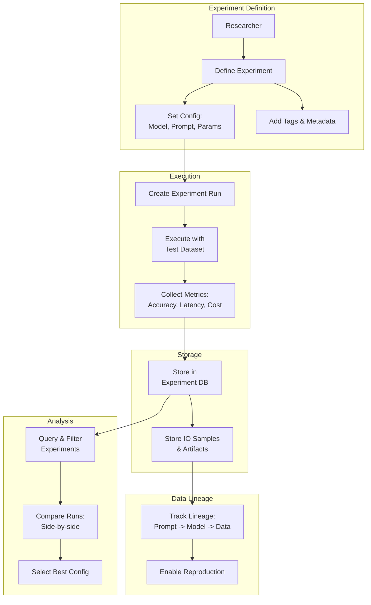
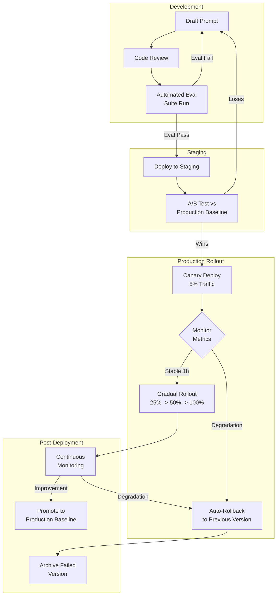
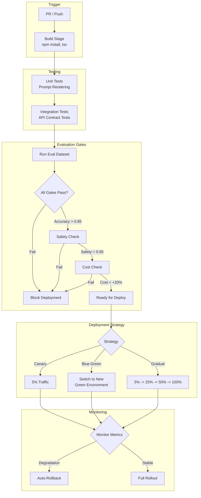

# Chapter 11: MLOps for AI Engineering

> **Adapt MLOps practices for the unique challenges of AI engineering. Master experiment tracking, prompt management, CI/CD pipelines, data and model versioning, drift monitoring, testing strategies, and incident response playbooks — all with TypeScript.**

## Learning Objectives

After completing this chapter, you will be able to:

<!-- Image Gallery -->
<div style="display:flex;flex-wrap:wrap;gap:4px;margin:16px 0;padding:12px;background:#f8fafc;border-radius:8px;border:1px solid #e2e8f0;">
<a href="../../../assets/images/lessons/modern-ai-engineering/11-mlops-for-ai-engineering/hero.svg" target="_blank" rel="noopener">
  
</a>
<a href="../../../assets/images/lessons/modern-ai-engineering/11-mlops-for-ai-engineering/handwritten-notes.svg" target="_blank" rel="noopener">
  
</a>
<a href="../../../assets/images/lessons/modern-ai-engineering/11-mlops-for-ai-engineering/sticky-notes.svg" target="_blank" rel="noopener">
  
</a>
<a href="../../../assets/images/lessons/modern-ai-engineering/11-mlops-for-ai-engineering/visual-explanation.svg" target="_blank" rel="noopener">
  
</a>
<a href="../../../assets/images/lessons/modern-ai-engineering/11-mlops-for-ai-engineering/architecture.svg" target="_blank" rel="noopener">
  
</a>
<a href="../../../assets/images/lessons/modern-ai-engineering/11-mlops-for-ai-engineering/workflow.svg" target="_blank" rel="noopener">
  
</a>
<a href="../../../assets/images/lessons/modern-ai-engineering/11-mlops-for-ai-engineering/mindmap.svg" target="_blank" rel="noopener">
  
</a>
<a href="../../../assets/images/lessons/modern-ai-engineering/11-mlops-for-ai-engineering/comparison.svg" target="_blank" rel="noopener">
  
</a>
<a href="../../../assets/images/lessons/modern-ai-engineering/11-mlops-for-ai-engineering/cheatsheet.svg" target="_blank" rel="noopener">
  
</a>
<a href="../../../assets/images/lessons/modern-ai-engineering/11-mlops-for-ai-engineering/interview-quiz.svg" target="_blank" rel="noopener">
  
</a>
<a href="../../../assets/images/lessons/modern-ai-engineering/11-mlops-for-ai-engineering/social-card.svg" target="_blank" rel="noopener">
  
</a>
</div>
<!-- End Image Gallery -->


- Distinguish MLOps for AI engineering from traditional MLOps across 10 key dimensions
- Implement experiment tracking for prompt versions, model versions, and evaluation results
- Manage prompt lifecycles with version control, staging, A/B testing, and rollback
- Design CI/CD pipelines with automated testing and evaluation gates for AI applications
- Version data and models using hash-based and DVC-like patterns
- Detect and respond to data drift, concept drift, prompt drift, and model drift
- Build comprehensive testing strategies for prompts, pipelines, evaluation, and regression
- Execute incident response playbooks for quality degradation, cost spikes, and safety incidents

---

## 10 Differences from Traditional MLOps

AI engineering introduces fundamentally different operational challenges compared to traditional ML. Understanding these differences shapes every aspect of your MLOps strategy.

| Dimension | Traditional MLOps | AI Engineering MLOps |
|-----------|------------------|---------------------|
| 1. Artifact | Trained model weights (static) | Prompt + model config + context (dynamic) |
| 2. Change frequency | Model updates every weeks/months | Prompt changes can happen daily |
| 3. Evaluation | Offline metrics (accuracy, F1, AUC) | Online + offline, LLM-as-judge, human eval |
| 4. Drift type | Data drift, concept drift, model drift | + Prompt drift, embedding drift, instruction drift |
| 5. Versioning | Model version, dataset version | + Prompt version, system prompt version, template version |
| 6. Deployment | Model serving (one image per model) | Prompt + model combo (many combos per image) |
| 7. Testing | Unit tests for data transforms, model tests | + Prompt unit tests, eval regression tests, safety tests |
| 8. Rollback | Revert to previous model version | Revert prompt, model, or combo independently |
| 9. Monitoring | Prediction latency, model accuracy | + Token usage, cost, hallucination rate, cache hit rate |
| 10. CI/CD | Train → Validate → Deploy | Prompt test → Eval gate → Canary → Gradual rollout |

---

## 11.1 Experiment Tracking

AI engineering experiments involve combinations of prompts, models, parameters, retrieval strategies, and evaluation results. Comprehensive tracking enables reproducible results and informed decision-making.

### Experiment Tracking Schema

<a href="../../../assets/images/diagrams/modern-ai-engineering/11-mlops-for-ai-engineering/experiment-tracking-schema-handwritten.svg" target="_blank" rel="noopener">
  
</a>
<a href="../../../assets/images/diagrams/modern-ai-engineering/11-mlops-for-ai-engineering/experiment-tracking-schema-diagram.svg" target="_blank" rel="noopener">
  
</a>
<a href="../../../assets/images/diagrams/modern-ai-engineering/11-mlops-for-ai-engineering/experiment-tracking-schema-sticky.svg" target="_blank" rel="noopener">
  
</a>


```typescript
interface Experiment {
  id: string;
  name: string;
  description: string;
  createdBy: string;
  createdAt: Date;
  status: "running" | "completed" | "failed" | "archived";
  tags: string[];
  config: ExperimentConfig;
  runs: ExperimentRun[];
}

interface ExperimentConfig {
  model: string;
  modelVersion: string;
  systemPrompt: string;
  userPromptTemplate: string;
  temperature: number;
  maxTokens: number;
  topP: number;
  frequencyPenalty: number;
  presencePenalty: number;
  retrievalConfig?: {
    chunkSize: number;
    chunkOverlap: number;
    topK: number;
    embeddingModel: string;
    retrieverType: "dense" | "sparse" | "hybrid";
  };
  tools?: Array<{
    name: string;
    enabled: boolean;
  }>;
}

interface ExperimentRun {
  id: string;
  experimentId: string;
  startedAt: Date;
  completedAt?: Date;
  status: "running" | "completed" | "failed";
  metrics: RunMetrics;
  inputOutputSample?: Array<{ input: string; output: string }>;
  error?: string;
}

interface RunMetrics {
  accuracy?: number;
  precision?: number;
  recall?: number;
  f1Score?: number;
  bleuScore?: number;
  rougeScore?: number;
  bertScore?: number;
  llmJudgeScore?: number;
  humanEvalScore?: number;
  avgLatency: number;
  p95Latency: number;
  avgTokensInput: number;
  avgTokensOutput: number;
  totalCost: number;
  hallucinationRate?: number;
  safetyPassRate?: number;
}
```

### Experiment Tracker Implementation

<a href="../../../assets/images/diagrams/modern-ai-engineering/11-mlops-for-ai-engineering/experiment-tracker-implementation-handwritten.svg" target="_blank" rel="noopener">
  
</a>
<a href="../../../assets/images/diagrams/modern-ai-engineering/11-mlops-for-ai-engineering/experiment-tracker-implementation-diagram.svg" target="_blank" rel="noopener">
  
</a>
<a href="../../../assets/images/diagrams/modern-ai-engineering/11-mlops-for-ai-engineering/experiment-tracker-implementation-sticky.svg" target="_blank" rel="noopener">
  
</a>


```typescript
class ExperimentTracker {
  private experiments: Map<string, Experiment> = new Map();
  private storagePath: string;

  constructor(storagePath: string = "./experiments") {
    this.storagePath = storagePath;
  }

  createExperiment(params: {
    name: string;
    description: string;
    createdBy: string;
    config: ExperimentConfig;
    tags?: string[];
  }): Experiment {
    const experiment: Experiment = {
      id: crypto.randomUUID(),
      name: params.name,
      description: params.description,
      createdBy: params.createdBy,
      createdAt: new Date(),
      status: "running",
      tags: params.tags || [],
      config: params.config,
      runs: [],
    };

    this.experiments.set(experiment.id, experiment);
    this.saveExperiment(experiment);
    return experiment;
  }

  createRun(experimentId: string): ExperimentRun {
    const experiment = this.experiments.get(experimentId);
    if (!experiment) throw new Error(`Experiment ${experimentId} not found`);

    const run: ExperimentRun = {
      id: crypto.randomUUID(),
      experimentId,
      startedAt: new Date(),
      status: "running",
      metrics: {
        avgLatency: 0,
        p95Latency: 0,
        avgTokensInput: 0,
        avgTokensOutput: 0,
        totalCost: 0,
      },
    };

    experiment.runs.push(run);
    return run;
  }

  completeRun(
    experimentId: string,
    runId: string,
    metrics: Partial<RunMetrics>,
    samples?: Array<{ input: string; output: string }>
  ): void {
    const experiment = this.experiments.get(experimentId);
    if (!experiment) return;

    const run = experiment.runs.find((r) => r.id === runId);
    if (!run) return;

    run.status = "completed";
    run.completedAt = new Date();
    Object.assign(run.metrics, metrics);
    if (samples) run.inputOutputSample = samples.slice(0, 10);

    this.saveExperiment(experiment);
  }

  failRun(experimentId: string, runId: string, error: string): void {
    const experiment = this.experiments.get(experimentId);
    if (!experiment) return;
    const run = experiment.runs.find((r) => r.id === runId);
    if (!run) return;
    run.status = "failed";
    run.completedAt = new Date();
    run.error = error;
    this.saveExperiment(experiment);
  }

  compareExperiments(experimentIds: string[]): Array<{
    experimentId: string;
    experimentName: string;
    bestRun: ExperimentRun | null;
  }> {
    return experimentIds.map((id) => {
      const exp = this.experiments.get(id);
      if (!exp) return { experimentId: id, experimentName: "unknown", bestRun: null };

      const completedRuns = exp.runs.filter((r) => r.status === "completed");
      completedRuns.sort(
        (a, b) => (b.metrics.llmJudgeScore || 0) - (a.metrics.llmJudgeScore || 0)
      );

      return {
        experimentId: id,
        experimentName: exp.name,
        bestRun: completedRuns[0] || null,
      };
    });
  }

  getExperiment(id: string): Experiment | undefined {
    return this.experiments.get(id);
  }

  listExperiments(tags?: string[]): Experiment[] {
    const all = Array.from(this.experiments.values());
    if (!tags || tags.length === 0) return all;
    return all.filter((exp) => tags.some((t) => exp.tags.includes(t)));
  }

  private saveExperiment(experiment: Experiment): void {
    // In production, persist to database or file system
    console.log(`[ExperimentTracker] Saved experiment ${experiment.id} with ${experiment.runs.length} runs`);
  }
}
```

### Experiment Tracking Architecture

<a href="../../../assets/images/diagrams/modern-ai-engineering/11-mlops-for-ai-engineering/experiment-tracking-architecture-handwritten.svg" target="_blank" rel="noopener">
  
</a>
<a href="../../../assets/images/diagrams/modern-ai-engineering/11-mlops-for-ai-engineering/experiment-tracking-architecture-diagram.svg" target="_blank" rel="noopener">
  
</a>
<a href="../../../assets/images/diagrams/modern-ai-engineering/11-mlops-for-ai-engineering/experiment-tracking-architecture-sticky.svg" target="_blank" rel="noopener">
  
</a>




---

## 11.2 Prompt Management

Prompts are the primary artifact in AI engineering. They change frequently and must be managed with the same rigor as source code.

### Prompt Lifecycle

<a href="../../../assets/images/diagrams/modern-ai-engineering/11-mlops-for-ai-engineering/prompt-lifecycle-handwritten.svg" target="_blank" rel="noopener">
  
</a>
<a href="../../../assets/images/diagrams/modern-ai-engineering/11-mlops-for-ai-engineering/prompt-lifecycle-diagram.svg" target="_blank" rel="noopener">
  
</a>
<a href="../../../assets/images/diagrams/modern-ai-engineering/11-mlops-for-ai-engineering/prompt-lifecycle-sticky.svg" target="_blank" rel="noopener">
  
</a>


| Stage | Description | Validation |
|-------|-------------|------------|
| Draft | Initial prompt creation in development | Manual review |
| Review | Peer review for clarity, safety, effectiveness | PR review process |
| Staging | Deployed to staging environment | Automated eval suite |
| Canary | Deployed to small % of traffic | A/B test metrics |
| Production | Full traffic deployment | Continuous monitoring |
| Archived | Replaced or deprecated | Read-only access |

### Prompt Registry

<a href="../../../assets/images/diagrams/modern-ai-engineering/11-mlops-for-ai-engineering/prompt-registry-handwritten.svg" target="_blank" rel="noopener">
  
</a>
<a href="../../../assets/images/diagrams/modern-ai-engineering/11-mlops-for-ai-engineering/prompt-registry-diagram.svg" target="_blank" rel="noopener">
  
</a>
<a href="../../../assets/images/diagrams/modern-ai-engineering/11-mlops-for-ai-engineering/prompt-registry-sticky.svg" target="_blank" rel="noopener">
  
</a>


```typescript
interface PromptVersion {
  id: string;
  promptId: string;
  version: number;
  systemPrompt: string;
  userPromptTemplate: string;
  temperature: number;
  maxTokens: number;
  model: string;
  createdBy: string;
  createdAt: Date;
  status: "draft" | "staging" | "production" | "archived";
  parentVersionId?: string;
  changeDescription: string;
  evalResults?: {
    accuracy: number;
    safetyScore: number;
    latencyP95: number;
    sampleSize: number;
  };
}

class PromptRegistry {
  private prompts: Map<string, PromptVersion[]> = new Map();
  private activeVersions: Map<string, string> = new Map(); // promptId -> versionId

  registerPrompt(promptId: string, initialVersion: Omit<PromptVersion, "id" | "version" | "createdAt">): PromptVersion {
    const versions = this.prompts.get(promptId) || [];
    const version: PromptVersion = {
      ...initialVersion,
      id: crypto.randomUUID(),
      promptId,
      version: versions.length + 1,
      createdAt: new Date(),
    };

    versions.push(version);
    this.prompts.set(promptId, versions);
    return version;
  }

  createNewVersion(
    promptId: string,
    updates: Partial<Omit<PromptVersion, "id" | "promptId" | "version" | "createdAt">>
  ): PromptVersion | null {
    const versions = this.prompts.get(promptId);
    if (!versions || versions.length === 0) return null;

    const current = versions[versions.length - 1];
    const newVersion: PromptVersion = {
      ...current,
      ...updates,
      id: crypto.randomUUID(),
      promptId,
      version: current.version + 1,
      createdAt: new Date(),
      status: "draft",
      parentVersionId: current.id,
    };

    versions.push(newVersion);
    return newVersion;
  }

  promoteToStaging(promptId: string, versionId: string): boolean {
    return this.updateStatus(promptId, versionId, "staging");
  }

  promoteToProduction(promptId: string, versionId: string): boolean {
    return this.updateStatus(promptId, versionId, "production");
  }

  rollback(promptId: string, targetVersion: number): PromptVersion | null {
    const versions = this.prompts.get(promptId);
    if (!versions) return null;

    const target = versions.find((v) => v.version === targetVersion);
    if (!target) return null;

    // Create a new version based on the target
    const rollbackVersion = this.createNewVersion(promptId, {
      systemPrompt: target.systemPrompt,
      userPromptTemplate: target.userPromptTemplate,
      temperature: target.temperature,
      maxTokens: target.maxTokens,
      model: target.model,
      changeDescription: `Rollback to version ${targetVersion}`,
    });

    if (rollbackVersion) {
      rollbackVersion.status = "production";
      this.activeVersions.set(promptId, rollbackVersion.id);
    }

    return rollbackVersion;
  }

  getActiveVersion(promptId: string): PromptVersion | null {
    const versionId = this.activeVersions.get(promptId);
    if (!versionId) return null;

    const versions = this.prompts.get(promptId);
    return versions?.find((v) => v.id === versionId) || null;
  }

  getVersionHistory(promptId: string): PromptVersion[] {
    return this.prompts.get(promptId) || [];
  }

  private updateStatus(promptId: string, versionId: string, status: PromptVersion["status"]): boolean {
    const versions = this.prompts.get(promptId);
    if (!versions) return false;

    const version = versions.find((v) => v.id === versionId);
    if (!version) return false;

    version.status = status;
    if (status === "production") {
      this.activeVersions.set(promptId, versionId);
    }
    return true;
  }
}
```

### Prompt Lifecycle Flow

<a href="../../../assets/images/diagrams/modern-ai-engineering/11-mlops-for-ai-engineering/prompt-lifecycle-flow-handwritten.svg" target="_blank" rel="noopener">
  
</a>
<a href="../../../assets/images/diagrams/modern-ai-engineering/11-mlops-for-ai-engineering/prompt-lifecycle-flow-diagram.svg" target="_blank" rel="noopener">
  
</a>
<a href="../../../assets/images/diagrams/modern-ai-engineering/11-mlops-for-ai-engineering/prompt-lifecycle-flow-sticky.svg" target="_blank" rel="noopener">
  
</a>




---

## 11.3 CI/CD for AI Applications

CI/CD pipelines for AI applications must incorporate evaluation gates, model validation, and gradual rollout strategies.

### Pipeline Stages

<a href="../../../assets/images/diagrams/modern-ai-engineering/11-mlops-for-ai-engineering/pipeline-stages-handwritten.svg" target="_blank" rel="noopener">
  
</a>
<a href="../../../assets/images/diagrams/modern-ai-engineering/11-mlops-for-ai-engineering/pipeline-stages-diagram.svg" target="_blank" rel="noopener">
  
</a>
<a href="../../../assets/images/diagrams/modern-ai-engineering/11-mlops-for-ai-engineering/pipeline-stages-sticky.svg" target="_blank" rel="noopener">
  
</a>


```typescript
interface CIPipelineConfig {
  stages: PipelineStage[];
  evalGates: EvalGate[];
  rolloutConfig: RolloutConfig;
}

interface PipelineStage {
  name: string;
  commands: string[];
  timeout: number;
  required: boolean;
}

interface EvalGate {
  name: string;
  metric: string;
  threshold: number;
  comparison: "gte" | "lte" | "eq";
  sampleSize: number;
}

interface RolloutConfig {
  strategy: "canary" | "blue-green" | "gradual";
  percentages: number[]; // e.g., [5, 25, 50, 100]
  cooldownMinutes: number[];
  autoRollbackThreshold: number; // Max degradation allowed
}

class AICICDPipeline {
  private config: CIPipelineConfig;
  private deployments: Map<string, DeployStatus> = new Map();

  constructor(config: CIPipelineConfig) {
    this.config = config;
  }

  async runPipeline(version: {
    promptId: string;
    versionId: string;
    model: string;
  }): Promise<{
    success: boolean;
    stageResults: Array<{ stage: string; passed: boolean; output: string }>;
    evaluationPassed: boolean;
    deploymentId?: string;
  }> {
    const stageResults: Array<{ stage: string; passed: boolean; output: string }> = [];
    let evaluationPassed = false;

    // Stage 1: Build
    try {
      const buildResult = await this.runStage("build");
      stageResults.push({ stage: "build", passed: buildResult, output: "Build completed" });
      if (!buildResult) return { success: false, stageResults, evaluationPassed };
    } catch (error: any) {
      stageResults.push({ stage: "build", passed: false, output: error.message });
      return { success: false, stageResults, evaluationPassed };
    }

    // Stage 2: Unit Tests
    try {
      const testResult = await this.runStage("test");
      stageResults.push({ stage: "test", passed: testResult, output: "Tests passed" });
      if (!testResult) return { success: false, stageResults, evaluationPassed };
    } catch (error: any) {
      stageResults.push({ stage: "test", passed: false, output: error.message });
      return { success: false, stageResults, evaluationPassed };
    }

    // Stage 3: Evaluation Gate
    try {
      evaluationPassed = await this.runEvaluationGates(version);
      stageResults.push({
        stage: "evaluation",
        passed: evaluationPassed,
        output: evaluationPassed ? "All eval gates passed" : "Eval gates failed",
      });
      if (!evaluationPassed) return { success: false, stageResults, evaluationPassed };
    } catch (error: any) {
      stageResults.push({ stage: "evaluation", passed: false, output: error.message });
      return { success: false, stageResults, evaluationPassed };
    }

    // Stage 4: Deploy with rollout
    const deploymentId = await this.deployWithRollout(version);

    return {
      success: true,
      stageResults,
      evaluationPassed,
      deploymentId,
    };
  }

  private async runStage(stage: string): Promise<boolean> {
    // Simulate stage execution
    console.log(`[CI/CD] Running stage: ${stage}`);
    await new Promise((r) => setTimeout(r, 1000));
    return true;
  }

  private async runEvaluationGates(version: { promptId: string; versionId: string; model: string }): Promise<boolean> {
    for (const gate of this.config.evalGates) {
      const metricValue = await this.getMetricValue(version, gate.metric, gate.sampleSize);
      let passed = false;

      if (gate.comparison === "gte") passed = metricValue >= gate.threshold;
      else if (gate.comparison === "lte") passed = metricValue <= gate.threshold;
      else if (gate.comparison === "eq") passed = Math.abs(metricValue - gate.threshold) < 0.01;

      console.log(`[EvalGate] ${gate.name}: ${metricValue.toFixed(4)} ${gate.comparison} ${gate.threshold} = ${passed}`);
      if (!passed) return false;
    }
    return true;
  }

  private async getMetricValue(version: { promptId: string; versionId: string; model: string }, metric: string, sampleSize: number): Promise<number> {
    // In production, run eval dataset through the prompt variant
    await new Promise((r) => setTimeout(r, 2000));
    return 0.92; // Simulated metric
  }

  private async deployWithRollout(version: { promptId: string; versionId: string; model: string }): Promise<string> {
    const deploymentId = `deploy-${version.promptId}-${Date.now()}`;

    this.deployments.set(deploymentId, {
      id: deploymentId,
      version,
      status: "deploying",
      currentPercentage: 0,
      startedAt: new Date(),
      stages: [],
    });

    for (let i = 0; i < this.config.rolloutConfig.percentages.length; i++) {
      const percentage = this.config.rolloutConfig.percentages[i];
      const cooldown = this.config.rolloutConfig.cooldownMinutes[i] || 0;

      const deployStatus = this.deployments.get(deploymentId)!;
      deployStatus.currentPercentage = percentage;
      deployStatus.stages.push({ percentage, deployedAt: new Date(), status: "deployed" });

      console.log(`[Rollout] Deployed to ${percentage}% of traffic`);
      if (cooldown > 0) {
        await new Promise((r) => setTimeout(r, cooldown * 60 * 1000));
      }

      // Check for degradation
      if (await this.checkDegradation(deploymentId, percentage)) {
        deployStatus.status = "rolled-back";
        this.rollback(version.promptId);
        throw new Error(`Auto-rollback triggered at ${percentage}% rollout`);
      }
    }

    const deployStatus = this.deployments.get(deploymentId)!;
    deployStatus.status = "completed";

    return deploymentId;
  }

  private async checkDegradation(deploymentId: string, percentage: number): Promise<boolean> {
    // In production, compare current metrics with baseline
    return false;
  }

  private async rollback(promptId: string): Promise<void> {
    console.log(`[Rollback] Rolling back prompt ${promptId}`);
  }

  getDeploymentStatus(deploymentId: string): DeployStatus | undefined {
    return this.deployments.get(deploymentId);
  }
}

interface DeployStatus {
  id: string;
  version: { promptId: string; versionId: string; model: string };
  status: "deploying" | "completed" | "failed" | "rolled-back";
  currentPercentage: number;
  startedAt: Date;
  stages: Array<{ percentage: number; deployedAt: Date; status: string }>;
}
```

### CI/CD Pipeline Architecture

<a href="../../../assets/images/diagrams/modern-ai-engineering/11-mlops-for-ai-engineering/ci-cd-pipeline-architecture-handwritten.svg" target="_blank" rel="noopener">
  
</a>
<a href="../../../assets/images/diagrams/modern-ai-engineering/11-mlops-for-ai-engineering/ci-cd-pipeline-architecture-diagram.svg" target="_blank" rel="noopener">
  
</a>
<a href="../../../assets/images/diagrams/modern-ai-engineering/11-mlops-for-ai-engineering/ci-cd-pipeline-architecture-sticky.svg" target="_blank" rel="noopener">
  
</a>




---

## 11.4 Data and Model Versioning

Versioning in AI engineering extends beyond code to include prompts, model configurations, evaluation datasets, and embedding indices.

### Hash-Based Versioning

<a href="../../../assets/images/diagrams/modern-ai-engineering/11-mlops-for-ai-engineering/hash-based-versioning-handwritten.svg" target="_blank" rel="noopener">
  
</a>
<a href="../../../assets/images/diagrams/modern-ai-engineering/11-mlops-for-ai-engineering/hash-based-versioning-diagram.svg" target="_blank" rel="noopener">
  
</a>
<a href="../../../assets/images/diagrams/modern-ai-engineering/11-mlops-for-ai-engineering/hash-based-versioning-sticky.svg" target="_blank" rel="noopener">
  
</a>


```typescript
import { createHash } from "crypto";

interface VersionedArtifact {
  id: string;
  hash: string;
  type: "prompt" | "dataset" | "embedding_index" | "eval_config" | "model_config";
  content: any;
  metadata: ArtifactMetadata;
  dependencies: string[];
  createdAt: Date;
}

interface ArtifactMetadata {
  createdBy: string;
  description: string;
  tags: string[];
  parentId?: string;
  sourceUrl?: string;
}

class ArtifactVersioner {
  private artifacts: Map<string, VersionedArtifact> = new Map();
  private aliases: Map<string, string> = new Map(); // alias -> artifactId

  register(
    type: VersionedArtifact["type"],
    content: any,
    metadata: ArtifactMetadata,
    dependencies: string[] = []
  ): VersionedArtifact {
    const contentStr = JSON.stringify(content);
    const hash = createHash("sha256").update(contentStr).digest("hex");

    // Check if this exact content already exists
    for (const artifact of this.artifacts.values()) {
      if (artifact.hash === hash && artifact.type === type) {
        return artifact;
      }
    }

    const artifact: VersionedArtifact = {
      id: crypto.randomUUID(),
      hash,
      type,
      content,
      metadata,
      dependencies,
      createdAt: new Date(),
    };

    this.artifacts.set(artifact.id, artifact);
    return artifact;
  }

  setAlias(alias: string, artifactId: string): void {
    if (!this.artifacts.has(artifactId)) {
      throw new Error(`Artifact ${artifactId} not found`);
    }
    this.aliases.set(alias, artifactId);
  }

  getByAlias(alias: string): VersionedArtifact | undefined {
    const artifactId = this.aliases.get(alias);
    if (!artifactId) return undefined;
    return this.artifacts.get(artifactId);
  }

  getLineage(artifactId: string): VersionedArtifact[] {
    const lineage: VersionedArtifact[] = [];
    const visited = new Set<string>();

    const traverse = (id: string) => {
      if (visited.has(id)) return;
      visited.add(id);

      const artifact = this.artifacts.get(id);
      if (!artifact) return;

      lineage.push(artifact);
      for (const depId of artifact.dependencies) {
        traverse(depId);
      }
    };

    traverse(artifactId);
    return lineage;
  }

  compare(id1: string, id2: string): { changed: boolean; differences: string[] } {
    const a1 = this.artifacts.get(id1);
    const a2 = this.artifacts.get(id2);

    if (!a1 || !a2) {
      return { changed: true, differences: ["One or both artifacts not found"] };
    }

    const differences: string[] = [];
    if (a1.type !== a2.type) differences.push("type");
    if (a1.hash !== a2.hash) differences.push("content");
    if (JSON.stringify(a1.metadata) !== JSON.stringify(a2.metadata)) differences.push("metadata");

    return { changed: differences.length > 0, differences };
  }

  listByType(type: VersionedArtifact["type"]): VersionedArtifact[] {
    return Array.from(this.artifacts.values()).filter((a) => a.type === type);
  }
}
```

### DVC-Like Pattern for AI

<a href="../../../assets/images/diagrams/modern-ai-engineering/11-mlops-for-ai-engineering/dvc-like-pattern-for-ai-handwritten.svg" target="_blank" rel="noopener">
  
</a>
<a href="../../../assets/images/diagrams/modern-ai-engineering/11-mlops-for-ai-engineering/dvc-like-pattern-for-ai-diagram.svg" target="_blank" rel="noopener">
  
</a>
<a href="../../../assets/images/diagrams/modern-ai-engineering/11-mlops-for-ai-engineering/dvc-like-pattern-for-ai-sticky.svg" target="_blank" rel="noopener">
  
</a>


```typescript
interface DataPipelineStep {
  name: string;
  inputArtifacts: string[];
  outputArtifact: string;
  transform: string; // Description of transformation
  parameters: Record<string, any>;
}

interface PipelineLock {
  pipelineId: string;
  steps: Array<{
    stepName: string;
    inputHashes: string[];
    outputHash: string;
    parametersHash: string;
  }>;
  createdAt: Date;
}

class DataPipelineManager {
  private pipelines: Map<string, DataPipelineStep[]> = new Map();
  private locks: Map<string, PipelineLock> = new Map();
  private versioner: ArtifactVersioner;

  constructor(versioner: ArtifactVersioner) {
    this.versioner = versioner;
  }

  definePipeline(name: string, steps: DataPipelineStep[]): void {
    this.pipelines.set(name, steps);
  }

  async runPipeline(name: string, params: Record<string, any>): Promise<PipelineLock> {
    const steps = this.pipelines.get(name);
    if (!steps) throw new Error(`Pipeline ${name} not found`);

    const lockSteps: PipelineLock["steps"] = [];

    for (const step of steps) {
      console.log(`[Pipeline] Running step: ${step.name}`);

      // Compute content hash to check cache
      const contentHash = this.computeStepHash(step, params);
      const cachedOutput = this.findCachedOutput(contentHash);

      let outputArtifact: VersionedArtifact;

      if (cachedOutput) {
        outputArtifact = cachedOutput;
        console.log(`[Pipeline] Cache hit for ${step.name}`);
      } else {
        // Simulate transformation
        const transformed = await this.executeStep(step, params);
        outputArtifact = this.versioner.register(
          "dataset",
          transformed,
          { createdBy: "pipeline", description: step.name, tags: ["pipeline"] },
          step.inputArtifacts
        );
      }

      lockSteps.push({
        stepName: step.name,
        inputHashes: step.inputArtifacts,
        outputHash: outputArtifact.hash,
        parametersHash: contentHash,
      });
    }

    const lock: PipelineLock = {
      pipelineId: crypto.randomUUID(),
      steps: lockSteps,
      createdAt: new Date(),
    };

    this.locks.set(lock.pipelineId, lock);
    return lock;
  }

  private computeStepHash(step: DataPipelineStep, params: Record<string, any>): string {
    const content = JSON.stringify({ step, params });
    return createHash("sha256").update(content).digest("hex");
  }

  private findCachedOutput(hash: string): VersionedArtifact | undefined {
    return Array.from(this.versioner["artifacts"].values()).find(
      (a) => a.hash === hash
    );
  }

  private async executeStep(step: DataPipelineStep, params: Record<string, any>): Promise<any> {
    await new Promise((r) => setTimeout(r, 500));
    return { processed: true, step: step.name, params };
  }

  getPipelineLock(pipelineId: string): PipelineLock | undefined {
    return this.locks.get(pipelineId);
  }

  reproducePipeline(lock: PipelineLock): void {
    console.log(`[Reproduce] Pipeline ${lock.pipelineId} created at ${lock.createdAt}`);
    for (const step of lock.steps) {
      console.log(`  Step: ${step.stepName}, Output: ${step.outputHash.slice(0, 12)}...`);
    }
  }
}
```

### Metadata Management Strategy

<a href="../../../assets/images/diagrams/modern-ai-engineering/11-mlops-for-ai-engineering/metadata-management-strategy-handwritten.svg" target="_blank" rel="noopener">
  
</a>
<a href="../../../assets/images/diagrams/modern-ai-engineering/11-mlops-for-ai-engineering/metadata-management-strategy-diagram.svg" target="_blank" rel="noopener">
  
</a>
<a href="../../../assets/images/diagrams/modern-ai-engineering/11-mlops-for-ai-engineering/metadata-management-strategy-sticky.svg" target="_blank" rel="noopener">
  
</a>


| Artifact Type | Storage | Versioning Strategy | Retention |
|---------------|---------|-------------------|-----------|
| Code | Git | Semantic versioning | Full history |
| Prompts | Database + Git | Semantic + hash | Last 100 versions |
| Evaluation datasets | Object storage | Hash-based (DVC-like) | Last 50 versions |
| Embedding indices | Vector DB | Timestamp + hash | Last 10 versions |
| Model configs | Config DB | Semantic + hash | Full history |
| Evaluation results | Metrics DB | Timestamp + experiment ID | 90 days |

---

## 11.5 Monitoring Drift

Drift detection in AI systems requires monitoring multiple layers: data, concept, prompt, model, and embeddings.

### Drift Detection Methods

<a href="../../../assets/images/diagrams/modern-ai-engineering/11-mlops-for-ai-engineering/drift-detection-methods-handwritten.svg" target="_blank" rel="noopener">
  
</a>
<a href="../../../assets/images/diagrams/modern-ai-engineering/11-mlops-for-ai-engineering/drift-detection-methods-diagram.svg" target="_blank" rel="noopener">
  
</a>
<a href="../../../assets/images/diagrams/modern-ai-engineering/11-mlops-for-ai-engineering/drift-detection-methods-sticky.svg" target="_blank" rel="noopener">
  
</a>


| Drift Type | Definition | Detection Method | Threshold | Response |
|------------|------------|-----------------|-----------|----------|
| Data drift | Input distribution changes | Population Stability Index (PSI), KL divergence | PSI > 0.2 | Retrain embedding model, update chunking |
| Concept drift | Input-output relationship changes | Accuracy monitoring, prediction error tracking | Accuracy drop > 5% | Retrain/fine-tune model, update prompts |
| Prompt drift | Prompt effectiveness changes over time | A/B test comparison, eval score trends | Score drop > 3% | Revert prompt, update prompt |
| Model drift | Model behavior changes post-update | Shadow evaluation, output distribution comparison | KL divergence > 0.1 | Pin model version, test new version |
| Embedding drift | Embedding space distribution shifts | Mean cosine similarity vs baseline | Similarity < 0.85 | Re-index vectors, update embeddings |

### DriftDetector Implementation

<a href="../../../assets/images/diagrams/modern-ai-engineering/11-mlops-for-ai-engineering/driftdetector-implementation-handwritten.svg" target="_blank" rel="noopener">
  
</a>
<a href="../../../assets/images/diagrams/modern-ai-engineering/11-mlops-for-ai-engineering/driftdetector-implementation-diagram.svg" target="_blank" rel="noopener">
  
</a>
<a href="../../../assets/images/diagrams/modern-ai-engineering/11-mlops-for-ai-engineering/driftdetector-implementation-sticky.svg" target="_blank" rel="noopener">
  
</a>


```typescript
interface DriftConfig {
  psiThreshold: number;
  conceptDriftThreshold: number;
  promptDriftThreshold: number;
  embeddingDriftThreshold: number;
  windowSize: number;
  alertCooldownMs: number;
}

interface DriftReport {
  detected: boolean;
  type: "data" | "concept" | "prompt" | "model" | "embedding";
  score: number;
  threshold: number;
  details: string;
  timestamp: Date;
  severity: "low" | "medium" | "high" | "critical";
}

class DriftDetector {
  private baselineDistributions: Map<string, number[]> = new Map();
  private currentWindow: Map<string, number[]> = new Map();
  private lastAlertTime: Map<string, number> = new Map();

  constructor(private config: DriftConfig) {}

  setBaseline(key: string, distribution: number[]): void {
    this.baselineDistributions.set(key, [...distribution].sort((a, b) => a - b));
  }

  addObservation(key: string, value: number): void {
    if (!this.currentWindow.has(key)) {
      this.currentWindow.set(key, []);
    }

    const window = this.currentWindow.get(key)!;
    window.push(value);

    if (window.length > this.config.windowSize) {
      window.shift();
    }
  }

  detectDataDrift(key: string): DriftReport | null {
    const baseline = this.baselineDistributions.get(key);
    const current = this.currentWindow.get(key);

    if (!baseline || !current || current.length < 100) return null;

    const psi = this.computePSI(baseline, current);
    const severity = psi > 0.3 ? "high" : psi > this.config.psiThreshold ? "medium" : "low";

    return {
      detected: psi > this.config.psiThreshold,
      type: "data",
      score: psi,
      threshold: this.config.psiThreshold,
      details: `PSI for ${key}: ${psi.toFixed(4)}`,
      timestamp: new Date(),
      severity: psi > this.config.psiThreshold ? severity : "low",
    };
  }

  detectConceptDrift(actualValues: number[], predictedValues: number[]): DriftReport {
    const mse = actualValues.reduce((sum, a, i) => sum + (a - predictedValues[i]) ** 2, 0) / actualValues.length;
    const severity = mse > this.config.conceptDriftThreshold * 2 ? "critical" : mse > this.config.conceptDriftThreshold ? "high" : "low";

    return {
      detected: mse > this.config.conceptDriftThreshold,
      type: "concept",
      score: mse,
      threshold: this.config.conceptDriftThreshold,
      details: `MSE: ${mse.toFixed(4)}`,
      timestamp: new Date(),
      severity,
    };
  }

  detectPromptDrift(baselineScores: number[], currentScores: number[]): DriftReport {
    const baselineMean = baselineScores.reduce((a, b) => a + b, 0) / baselineScores.length;
    const currentMean = currentScores.reduce((a, b) => a + b, 0) / currentScores.length;
    const drop = (baselineMean - currentMean) / baselineMean;

    const severity = drop > 0.1 ? "critical" : drop > this.config.promptDriftThreshold ? "high" : "low";

    return {
      detected: drop > this.config.promptDriftThreshold,
      type: "prompt",
      score: drop,
      threshold: this.config.promptDriftThreshold,
      details: `Score drop: ${(drop * 100).toFixed(1)}% (baseline: ${baselineMean.toFixed(3)}, current: ${currentMean.toFixed(3)})`,
      timestamp: new Date(),
      severity,
    };
  }

  detectEmbeddingDrift(baselineEmbeddings: number[][], currentEmbeddings: number[][]): DriftReport {
    const similarities: number[] = [];

    for (let i = 0; i < Math.min(baselineEmbeddings.length, currentEmbeddings.length); i++) {
      const sim = this.cosineSimilarity(baselineEmbeddings[i], currentEmbeddings[i]);
      similarities.push(sim);
    }

    const meanSimilarity = similarities.reduce((a, b) => a + b, 0) / similarities.length;
    const drift = 1 - meanSimilarity;
    const severity = drift > 0.2 ? "critical" : drift > this.config.embeddingDriftThreshold ? "high" : "low";

    return {
      detected: drift > this.config.embeddingDriftThreshold,
      type: "embedding",
      score: drift,
      threshold: this.config.embeddingDriftThreshold,
      details: `Mean embedding similarity: ${meanSimilarity.toFixed(4)} (drift: ${(drift * 100).toFixed(1)}%)`,
      timestamp: new Date(),
      severity,
    };
  }

  private computePSI(baseline: number[], current: number[]): number {
    const numBins = 10;
    const min = Math.min(...baseline, ...current);
    const max = Math.max(...baseline, ...current);
    const binWidth = (max - min) / numBins;

    let psi = 0;

    for (let i = 0; i < numBins; i++) {
      const binStart = min + i * binWidth;
      const binEnd = binStart + binWidth;

      const baselineCount = baseline.filter((v) => v >= binStart && v < binEnd).length;
      const currentCount = current.filter((v) => v >= binStart && v < binEnd).length;

      const pBase = (baselineCount + 0.5) / (baseline.length + 0.5 * numBins);
      const pCurr = (currentCount + 0.5) / (current.length + 0.5 * numBins);

      psi += (pCurr - pBase) * Math.log(pCurr / pBase);
    }

    return psi;
  }

  private cosineSimilarity(a: number[], b: number[]): number {
    const dot = a.reduce((sum, v, i) => sum + v * b[i], 0);
    const magA = Math.sqrt(a.reduce((sum, v) => sum + v * v, 0));
    const magB = Math.sqrt(b.reduce((sum, v) => sum + v * v, 0));
    return dot / (magA * magB);
  }

  shouldAlert(driftKey: string): boolean {
    const lastAlert = this.lastAlertTime.get(driftKey) || 0;
    if (Date.now() - lastAlert < this.config.alertCooldownMs) {
      return false;
    }
    this.lastAlertTime.set(driftKey, Date.now());
    return true;
  }
}
```

### Understanding Prompt Drift

<a href="../../../assets/images/diagrams/modern-ai-engineering/11-mlops-for-ai-engineering/understanding-prompt-drift-handwritten.svg" target="_blank" rel="noopener">
  
</a>
<a href="../../../assets/images/diagrams/modern-ai-engineering/11-mlops-for-ai-engineering/understanding-prompt-drift-diagram.svg" target="_blank" rel="noopener">
  
</a>
<a href="../../../assets/images/diagrams/modern-ai-engineering/11-mlops-for-ai-engineering/understanding-prompt-drift-sticky.svg" target="_blank" rel="noopener">
  
</a>


Prompt drift occurs when a prompt that previously produced high-quality results begins to degrade over time. This can happen because:

1. **Model updates**: The underlying model changes (even minor version bumps) can alter behavior
2. **User behavior shifts**: Users learn to interact with the system differently
3. **Content changes**: The knowledge base or context provided to the model evolves
4. **Adversarial adaptation**: Users discover prompt injection or jailbreak patterns

**Mitigation strategy**: Maintain a baseline eval dataset and run it weekly against all active prompts. Track score trends and alert on sustained degradation.

---

## 11.6 Testing AI Systems

Testing AI systems requires a multi-layered approach that covers prompt correctness, pipeline integration, output quality, and regression prevention.

### Testing Categories

<a href="../../../assets/images/diagrams/modern-ai-engineering/11-mlops-for-ai-engineering/testing-categories-handwritten.svg" target="_blank" rel="noopener">
  
</a>
<a href="../../../assets/images/diagrams/modern-ai-engineering/11-mlops-for-ai-engineering/testing-categories-diagram.svg" target="_blank" rel="noopener">
  
</a>
<a href="../../../assets/images/diagrams/modern-ai-engineering/11-mlops-for-ai-engineering/testing-categories-sticky.svg" target="_blank" rel="noopener">
  
</a>


```typescript
interface TestCase {
  id: string;
  name: string;
  category: "unit" | "integration" | "eval" | "regression" | "safety";
  input: string;
  expectedOutput?: string;
  expectedBehavior?: string;
  assertions: string[];
  tags: string[];
}

class AITestSuite {
  private tests: TestCase[] = [];
  private results: Map<string, { passed: boolean; actualOutput: string; metrics: any }> = new Map();

  addTest(testCase: TestCase): void {
    this.tests.push(testCase);
  }

  async runAll(): Promise<{
    total: number;
    passed: number;
    failed: number;
    results: Array<{ name: string; passed: boolean; error?: string }>;
  }> {
    const results: Array<{ name: string; passed: boolean; error?: string }> = [];

    for (const test of this.tests) {
      try {
        const result = await this.runTest(test);
        results.push({ name: test.name, passed: result });
      } catch (error: any) {
        results.push({ name: test.name, passed: false, error: error.message });
      }
    }

    return {
      total: results.length,
      passed: results.filter((r) => r.passed).length,
      failed: results.filter((r) => !r.passed).length,
      results,
    };
  }

  private async runTest(test: TestCase): Promise<boolean> {
    switch (test.category) {
      case "unit":
        return this.runUnitTest(test);
      case "integration":
        return this.runIntegrationTest(test);
      case "eval":
        return this.runEvalTest(test);
      case "safety":
        return this.runSafetyTest(test);
      default:
        throw new Error(`Unknown test category: ${test.category}`);
    }
  }

  private async runUnitTest(test: TestCase): Promise<boolean> {
    // Test prompt rendering, template variables, format validation
    console.log(`[UnitTest] ${test.name}`);
    return true;
  }

  private async runIntegrationTest(test: TestCase): Promise<boolean> {
    // Test end-to-end pipeline: input -> retrieval -> generation -> output
    console.log(`[IntegrationTest] ${test.name}`);
    return true;
  }

  private async runEvalTest(test: TestCase): Promise<boolean> {
    // Test output quality against expected behavior
    console.log(`[EvalTest] ${test.name}`);
    return true;
  }

  private async runSafetyTest(test: TestCase): Promise<boolean> {
    // Test that harmful inputs are properly rejected
    console.log(`[SafetyTest] ${test.name}`);
    return true;
  }
}
```

### Test Examples by Category

<a href="../../../assets/images/diagrams/modern-ai-engineering/11-mlops-for-ai-engineering/test-examples-by-category-handwritten.svg" target="_blank" rel="noopener">
  
</a>
<a href="../../../assets/images/diagrams/modern-ai-engineering/11-mlops-for-ai-engineering/test-examples-by-category-diagram.svg" target="_blank" rel="noopener">
  
</a>
<a href="../../../assets/images/diagrams/modern-ai-engineering/11-mlops-for-ai-engineering/test-examples-by-category-sticky.svg" target="_blank" rel="noopener">
  
</a>


| Category | Example Test | Expected Result |
|----------|-------------|-----------------|
| Unit | Prompt template renders with valid variables | All `{{variable}}` replaced |
| Unit | System prompt length is under context limit | < 4000 tokens |
| Unit | Output is valid JSON when JSON mode enabled | JSON.parse succeeds |
| Integration | RAG pipeline retrieves relevant chunks for query | At least 3 chunks with similarity > 0.8 |
| Integration | Tool call returns correctly formatted result | Function name matches, args are valid |
| Eval | Response contains citation for factual claims | Citation present for >90% of claims |
| Eval | Summarization preserves all key entities | Entity recall > 0.85 |
| Safety | Refuses harmful request (e.g., "How to hack") | Refuses or redirects |
| Safety | PII is not leaked in output | No email/phone/SSN patterns |
| Regression | Same input produces quality score within range of baseline | Score >= baseline * 0.95 |

### Automated Eval Gate Configuration

<a href="../../../assets/images/diagrams/modern-ai-engineering/11-mlops-for-ai-engineering/automated-eval-gate-configuration-handwritten.svg" target="_blank" rel="noopener">
  
</a>
<a href="../../../assets/images/diagrams/modern-ai-engineering/11-mlops-for-ai-engineering/automated-eval-gate-configuration-diagram.svg" target="_blank" rel="noopener">
  
</a>
<a href="../../../assets/images/diagrams/modern-ai-engineering/11-mlops-for-ai-engineering/automated-eval-gate-configuration-sticky.svg" target="_blank" rel="noopener">
  
</a>


```typescript
class EvalGate {
  private baselineMetrics: Map<string, number> = new Map();
  private degradationThresholds: Map<string, number> = new Map();

  setBaseline(metric: string, value: number): void {
    this.baselineMetrics.set(metric, value);
  }

  setThreshold(metric: string, maxDegradationPercent: number): void {
    this.degradationThresholds.set(metric, maxDegradationPercent);
  }

  evaluate(currentMetrics: Record<string, number>): {
    passed: boolean;
    failures: Array<{ metric: string; expected: number; actual: number; degradation: number }>;
  } {
    const failures: Array<{ metric: string; expected: number; actual: number; degradation: number }> = [];

    for (const [metric, baseline] of this.baselineMetrics) {
      const current = currentMetrics[metric];
      if (current === undefined) continue;

      const threshold = this.degradationThresholds.get(metric) || 10;
      const degradation = ((baseline - current) / baseline) * 100;

      if (degradation > threshold) {
        failures.push({ metric, expected: baseline, actual: current, degradation });
      }
    }

    return { passed: failures.length === 0, failures };
  }
}
```

---

## 11.7 Incident Response Playbooks

AI systems require specialized incident response playbooks for each failure mode.

### Incident Response Playbooks

<a href="../../../assets/images/diagrams/modern-ai-engineering/11-mlops-for-ai-engineering/incident-response-playbooks-handwritten.svg" target="_blank" rel="noopener">
  
</a>
<a href="../../../assets/images/diagrams/modern-ai-engineering/11-mlops-for-ai-engineering/incident-response-playbooks-diagram.svg" target="_blank" rel="noopener">
  
</a>
<a href="../../../assets/images/diagrams/modern-ai-engineering/11-mlops-for-ai-engineering/incident-response-playbooks-sticky.svg" target="_blank" rel="noopener">
  
</a>


| Incident Type | Symptoms | Detection | Immediate Actions | Root Cause Investigation | Resolution |
|---------------|----------|-----------|------------------|------------------------|------------|
| **Quality Degradation** | User complaints, eval scores drop, response quality decline | Monitoring dashboards, user feedback, eval score trends | 1. Rollback to previous prompt version<br/>2. Switch to fallback model<br/>3. Notify stakeholders | 1. Compare eval results across versions<br/>2. Check for model updates<br/>3. Review recent prompt changes | 1. Deploy fixed prompt<br/>2. Update eval datasets<br/>3. Add regression tests |
| **Cost Spike** | Daily spend exceeds budget by >50% | Budget alerts, cost monitoring dashboards | 1. Enable aggressive caching<br/>2. Route traffic to cheaper model<br/>3. Increase rate limits | 1. Analyze token usage by user/endpoint<br/>2. Check for prompt loops<br/>3. Review model tier allocation | 1. Implement tiered routing<br/>2. Add spending limits per user<br/>3. Optimize prompts |
| **Safety Incident** | Toxic output, PII leak, harmful content | Content filter alerts, user reports, manual review | 1. Block offending inputs/outputs<br/>2. Revoke abusive API keys<br/>3. Disable affected feature | 1. Analyze trigger patterns<br/>2. Review filter configuration<br/>3. Check for adversarial inputs | 1. Update safety filters<br/>2. Add new guardrails<br/>3. Security review |
| **Model Failure** | 5xx errors, empty responses, timeouts | Error rate monitoring, uptime checks | 1. Switch to fallback model<br/>2. Enable circuit breaker<br/>3. Scale up alternative provider | 1. Check model API status<br/>2. Review recent model changes<br/>3. Test with different params | 1. Update model routing<br/>2. Add more fallback options<br/>3. Update SLAs |
| **Data Issue** | Incorrect answers, stale information, missing context | Quality monitoring, user reports | 1. Disable affected knowledge sources<br/>2. Clear cache<br/>3. Reroute to fallback | 1. Check data pipeline logs<br/>2. Review ingestion process<br/>3. Validate source data | 1. Fix data pipeline<br/>2. Re-index affected content<br/>3. Add data validation |

### Incident Response Automation

<a href="../../../assets/images/diagrams/modern-ai-engineering/11-mlops-for-ai-engineering/incident-response-automation-handwritten.svg" target="_blank" rel="noopener">
  
</a>
<a href="../../../assets/images/diagrams/modern-ai-engineering/11-mlops-for-ai-engineering/incident-response-automation-diagram.svg" target="_blank" rel="noopener">
  
</a>
<a href="../../../assets/images/diagrams/modern-ai-engineering/11-mlops-for-ai-engineering/incident-response-automation-sticky.svg" target="_blank" rel="noopener">
  
</a>


```typescript
type IncidentSeverity = "sev1" | "sev2" | "sev3";
type IncidentType = "quality" | "cost" | "safety" | "model" | "data";

interface IncidentPlaybook {
  type: IncidentType;
  severity: IncidentSeverity;
  detectionRules: string[];
  immediateActions: string[];
  investigationSteps: string[];
  resolutionSteps: string[];
  notificationChannels: string[];
  slaMinutes: number;
}

const PLAYBOOKS: Record<IncidentType, IncidentPlaybook> = {
  quality: {
    type: "quality",
    severity: "sev2",
    detectionRules: ["eval_score_drop > 5%", "user_satisfaction < 3.0"],
    immediateActions: [
      "Rollback to previous prompt version",
      "Switch to fallback model gpt-4o",
      "Notify product team",
    ],
    investigationSteps: [
      "Compare eval results across last 24 hours",
      "Check for model provider updates",
      "Review recent prompt changes in registry",
    ],
    resolutionSteps: [
      "Deploy fixed prompt version",
      "Update eval dataset with regression cases",
      "Add automated quality regression test",
    ],
    notificationChannels: ["slack", "email"],
    slaMinutes: 60,
  },
  cost: {
    type: "cost",
    severity: "sev3",
    detectionRules: ["daily_spend > budget * 1.5", "cost_per_request > 2x baseline"],
    immediateActions: [
      "Enable aggressive semantic caching",
      "Route non-critical traffic to economy model",
      "Increase rate limiting for top spend users",
    ],
    investigationSteps: [
      "Analyze token consumption per user/endpoint",
      "Check for infinite retry loops",
      "Review model tier distribution",
    ],
    resolutionSteps: [
      "Implement per-user spending limits",
      "Add cost anomaly detection",
      "Optimize prompts for token efficiency",
    ],
    notificationChannels: ["slack", "email"],
    slaMinutes: 120,
  },
  safety: {
    type: "safety",
    severity: "sev1",
    detectionRules: ["content_filter_rate > 5%", "user_report > 3 in 1h"],
    immediateActions: [
      "Block all offending inputs at gateway",
      "Revoke API keys of abusive users",
      "Disable affected AI feature",
      "Notify security team immediately",
    ],
    investigationSteps: [
      "Analyze trigger patterns in safety logs",
      "Review filter configuration for gaps",
      "Check for coordinated attack patterns",
    ],
    resolutionSteps: [
      "Deploy updated safety filters",
      "Add new guardrail rules",
      "Complete security incident report",
    ],
    notificationChannels: ["pagerduty", "slack", "email", "security"],
    slaMinutes: 15,
  },
  model: {
    type: "model",
    severity: "sev2",
    detectionRules: ["error_rate > 5%", "p95_latency > 10s"],
    immediateActions: [
      "Switch traffic to fallback model",
      "Enable circuit breaker pattern",
      "Increase timeout limits",
    ],
    investigationSteps: [
      "Verify model API provider status",
      "Test model with simple baseline prompt",
      "Check for API version changes",
    ],
    resolutionSteps: [
      "Update model routing configuration",
      "Add additional model providers",
      "Document incident for provider communication",
    ],
    notificationChannels: ["slack", "email"],
    slaMinutes: 30,
  },
  data: {
    type: "data",
    severity: "sev2",
    detectionRules: ["retrieval_score < 0.6", "user_report_stale_info > 5"],
    immediateActions: [
      "Disable affected knowledge base sources",
      "Clear response cache",
      "Fall back to base model without RAG",
    ],
    investigationSteps: [
      "Check data pipeline job logs for failures",
      "Validate source data freshness",
      "Review chunking and indexing config",
    ],
    resolutionSteps: [
      "Repair data pipeline",
      "Re-index knowledge base",
      "Add data freshness alerts",
    ],
    notificationChannels: ["slack", "email"],
    slaMinutes: 60,
  },
};

class IncidentResponder {
  private activeIncidents: Map<string, { playbook: IncidentPlaybook; startedAt: Date }> = new Map();

  detectAndRespond(type: IncidentType, details: string): string {
    const playbook = PLAYBOOKS[type];
    const incidentId = `inc-${type}-${Date.now()}`;

    console.log(`\n=== INCIDENT: ${type.toUpperCase()} [${playbook.severity}] ===`);
    console.log(`ID: ${incidentId}`);
    console.log(`Details: ${details}`);
    console.log(`SLA: ${playbook.slaMinutes} minutes`);
    console.log("\nImmediate Actions:");
    playbook.immediateActions.forEach((action, i) => console.log(`  ${i + 1}. ${action}`));
    console.log("\nNotifications Sent To:");
    playbook.notificationChannels.forEach((ch) => console.log(`  - ${ch}`));

    this.activeIncidents.set(incidentId, { playbook, startedAt: new Date() });
    return incidentId;
  }

  runInvestigation(incidentId: string): void {
    const incident = this.activeIncidents.get(incidentId);
    if (!incident) {
      console.log(`Incident ${incidentId} not found`);
      return;
    }

    console.log("\nInvestigation Steps:");
    incident.playbook.investigationSteps.forEach((step, i) => console.log(`  ${i + 1}. ${step}`));
  }

  resolve(incidentId: string): void {
    const incident = this.activeIncidents.get(incidentId);
    if (!incident) return;

    const duration = (Date.now() - incident.startedAt.getTime()) / 1000 / 60;
    console.log(`\n=== RESOLUTION ===`);
    console.log(`Incident: ${incidentId}`);
    console.log(`Duration: ${duration.toFixed(1)} minutes`);
    console.log("\nResolution Steps:");
    incident.playbook.resolutionSteps.forEach((step, i) => console.log(`  ${i + 1}. ${step}`));

    console.log("\nPost-Mortem Required: YES");
    this.activeIncidents.delete(incidentId);
  }
}
```

---

## TypeScript: AIOpsPipeline

The `AIOpsPipeline` class integrates experiment tracking, prompt registry, CI/CD configuration, and drift detection into a unified operations pipeline.

```typescript
class AIOpsPipeline {
  private experimentTracker: ExperimentTracker;
  private promptRegistry: PromptRegistry;
  private cicdPipeline: AICICDPipeline;
  private driftDetector: DriftDetector;
  private artifactVersioner: ArtifactVersioner;
  private incidentResponder: IncidentResponder;

  constructor() {
    this.experimentTracker = new ExperimentTracker();
    this.promptRegistry = new PromptRegistry();
    this.artifactVersioner = new ArtifactVersioner();

    this.cicdPipeline = new AICICDPipeline({
      stages: [
        { name: "build", commands: ["npm ci", "npm run build"], timeout: 300, required: true },
        { name: "test", commands: ["npm test"], timeout: 300, required: true },
        { name: "eval", commands: ["npm run eval"], timeout: 600, required: true },
      ],
      evalGates: [
        { name: "accuracy", metric: "accuracy", threshold: 0.85, comparison: "gte", sampleSize: 200 },
        { name: "safety", metric: "safety_score", threshold: 0.95, comparison: "gte", sampleSize: 100 },
      ],
      rolloutConfig: {
        strategy: "gradual",
        percentages: [5, 25, 50, 100],
        cooldownMinutes: [10, 30, 60],
        autoRollbackThreshold: 0.05,
      },
    });

    this.driftDetector = new DriftDetector({
      psiThreshold: 0.2,
      conceptDriftThreshold: 0.1,
      promptDriftThreshold: 0.05,
      embeddingDriftThreshold: 0.15,
      windowSize: 1000,
      alertCooldownMs: 3600000,
    });

    this.incidentResponder = new IncidentResponder();
  }

  async runExperiment(params: {
    name: string;
    description: string;
    createdBy: string;
    config: ExperimentConfig;
  }): Promise<string> {
    const experiment = this.experimentTracker.createExperiment(params);
    const run = this.experimentTracker.createRun(experiment.id);

    try {
      const metrics = await this.executeExperimentRun(experiment.config);
      this.experimentTracker.completeRun(experiment.id, run.id, metrics);
    } catch (error: any) {
      this.experimentTracker.failRun(experiment.id, run.id, error.message);
    }

    return experiment.id;
  }

  private async executeExperimentRun(config: ExperimentConfig): Promise<Partial<RunMetrics>> {
    const latencies: number[] = [];
    const outputTokens: number[] = [];
    const inputTokens: number[] = [];

    for (let i = 0; i < 50; i++) {
      const start = Date.now();
      await new Promise((r) => setTimeout(r, 100 + Math.random() * 200));
      const latency = Date.now() - start;
      latencies.push(latency);
      inputTokens.push(Math.floor(Math.random() * 500 + 100));
      outputTokens.push(Math.floor(Math.random() * 300 + 50));
    }

    latencies.sort((a, b) => a - b);
    const avgLatency = latencies.reduce((a, b) => a + b, 0) / latencies.length;
    const p95Index = Math.floor(latencies.length * 0.95);
    const totalCost =
      inputTokens.reduce((a, b) => a + b, 0) * 0.000003 +
      outputTokens.reduce((a, b) => a + b, 0) * 0.00001;

    return {
      accuracy: 0.87 + Math.random() * 0.1,
      llmJudgeScore: 0.82 + Math.random() * 0.15,
      avgLatency,
      p95Latency: latencies[p95Index],
      avgTokensInput: inputTokens.reduce((a, b) => a + b, 0) / inputTokens.length,
      avgTokensOutput: outputTokens.reduce((a, b) => a + b, 0) / outputTokens.length,
      totalCost,
      safetyPassRate: 0.97 + Math.random() * 0.03,
    };
  }

  registerPrompt(initialVersion: Omit<PromptVersion, "id" | "version" | "createdAt">): string {
    const version = this.promptRegistry.registerPrompt(initialVersion.promptId, initialVersion);

    this.artifactVersioner.register("prompt", version, {
      createdBy: version.createdBy,
      description: `Prompt ${version.promptId} v${version.version}`,
      tags: ["prompt"],
    });

    return version.id;
  }

  async runCICD(version: { promptId: string; versionId: string; model: string }): Promise<void> {
    const result = await this.cicdPipeline.runPipeline(version);
    console.log(`[AIOps] CI/CD result: ${result.success ? "PASSED" : "FAILED"}`);

    if (result.success && result.deploymentId) {
      console.log(`[AIOps] Deployment: ${result.deploymentId}`);
    }
  }

  observeMetrics(metrics: {
    latency: number;
    accuracy: number;
    inputLength: number;
    score: number;
    userId: string;
  }): void {
    this.driftDetector.addObservation("latency", metrics.latency);
    this.driftDetector.addObservation("score", metrics.score);
    this.driftDetector.addObservation("input_length", metrics.inputLength);

    const dataDrift = this.driftDetector.detectDataDrift("score");
    if (dataDrift?.detected && this.driftDetector.shouldAlert("score")) {
      console.log(`[DriftAlert] ${dataDrift.details}`);
      this.incidentResponder.detectAndRespond("quality", dataDrift.details);
    }
  }

  getStatus(): {
    experiments: number;
    prompts: number;
    deployments: number;
    activeIncidents: number;
    driftAlerts: number;
  } {
    return {
      experiments: this.experimentTracker.listExperiments().length,
      prompts: this.promptRegistry["prompts"].size,
      deployments: 0,
      activeIncidents: this.incidentResponder["activeIncidents"].size,
      driftAlerts: 0,
    };
  }
}
```

---

## TypeScript: DriftDetector

The `DriftDetector` class implements statistical tests for detecting data, concept, and prompt drift with configurable thresholds and alerting.

```typescript
// (Full DriftDetector implementation is in section 11.5 above)
// The following demonstrates its usage in a production setting:

class DriftMonitor {
  private detector: DriftDetector;
  private alertHistory: Map<string, number> = new Map();

  constructor() {
    this.detector = new DriftDetector({
      psiThreshold: 0.2,
      conceptDriftThreshold: 0.1,
      promptDriftThreshold: 0.05,
      embeddingDriftThreshold: 0.15,
      windowSize: 1000,
      alertCooldownMs: 3600000,
    });

    // Initialize baselines
    this.detector.setBaseline("accuracy", Array.from({ length: 1000 }, () => 0.85 + Math.random() * 0.12));
    this.detector.setBaseline("latency", Array.from({ length: 1000 }, () => 200 + Math.random() * 300));
    this.detector.setBaseline("score", Array.from({ length: 1000 }, () => 0.75 + Math.random() * 0.2));
  }

  recordObservation(metric: string, value: number): void {
    this.detector.addObservation(metric, value);
  }

  checkAll(): DriftReport[] {
    const reports: DriftReport[] = [];

    const dataDrift = this.detector.detectDataDrift("accuracy");
    if (dataDrift) reports.push(dataDrift);

    const scoreDrift = this.detector.detectDataDrift("score");
    if (scoreDrift) reports.push(scoreDrift);

    return reports.filter((r) => r.detected);
  }

  checkPromptHealth(baselineScores: number[], currentScores: number[]): DriftReport {
    const report = this.detector.detectPromptDrift(baselineScores, currentScores);

    if (report.detected && this.detector.shouldAlert("prompt_drift")) {
      console.log(`[PromptDrift] ${report.details} (severity: ${report.severity})`);

      if (report.severity === "high" || report.severity === "critical") {
        console.log("[PromptDrift] Triggering automated rollback...");
        // call rollback logic here
      }
    }

    return report;
  }

  getAggregatedHealth(): { healthy: boolean; activeDrifts: number; summary: string } {
    const drifts = this.checkAll();
    return {
      healthy: drifts.length === 0,
      activeDrifts: drifts.length,
      summary: drifts.length === 0
        ? "All systems healthy"
        : `${drifts.length} drift(s) detected: ${drifts.map((d) => `${d.type} (${(d.score * 100).toFixed(1)}%)`).join(", ")}`,
    };
  }
}
```

---

## Summary

MLOps for AI engineering diverges from traditional MLOps in ten critical ways — prompts replace trained models as the primary artifact, change frequency shifts from weekly to daily, evaluation requires LLM-as-judge alongside traditional metrics, and drift monitoring must account for prompt drift and embedding drift. Experiment tracking must capture the full combinatorial space of prompts, models, parameters, retrieval strategies, and evaluation results, with automated comparison to identify winning configurations. Prompt management demands a rigorous lifecycle from draft through review, staging, canary, production, and archival — with version control, rollback capability, and automated eval gates at every promotion stage. CI/CD pipelines for AI must incorporate evaluation gates that block deployment if accuracy, safety, or cost thresholds are breached, and gradual rollout strategies (canary, blue-green, percentage-based) that auto-rollback on degradation. Data and model versioning requires hash-based content addressing and DVC-like pipeline locking to ensure reproducibility. Drift monitoring must operate across five dimensions — data, concept, prompt, model, and embedding — each with specific detection methods and response protocols. Testing spans four layers: unit tests for prompt rendering, integration tests for pipeline correctness, eval tests for output quality, and safety tests for harm prevention. Incident response playbooks must be pre-defined for quality degradation, cost spikes, safety breaches, model failures, and data issues, each with clear detection rules, immediate actions, investigation steps, and resolution procedures.

## Practical Takeaways

1. **Version everything** — prompts, model configs, eval datasets, and embedding indices all need hash-based versioning with full lineage tracking for reproducibility
2. **Automate eval gates in CI/CD** — block deployments that degrade accuracy (>5% drop), safety (>2% drop), or cost (>20% increase). This prevents bad changes from reaching users
3. **Monitor five drift dimensions** — track data drift (PSI), concept drift (error rate), prompt drift (score trends), model drift (output distribution), and embedding drift (cosine similarity). Each requires different detection and response
4. **Implement graduated rollout by default** — use canary (5% → 25% → 50% → 100%) with cooldown periods between stages and auto-rollback on any metric degradation
5. **Pre-write incident playbooks** — define runbooks for the five most common AI incidents (quality, cost, safety, model, data) with clear SLA targets, immediate actions, and investigation steps before incidents occur

## Chapter Quiz

Test your understanding of MLOps for AI engineering concepts.

### Question 1

<a href="../../../assets/images/diagrams/modern-ai-engineering/11-mlops-for-ai-engineering/question-1-handwritten.svg" target="_blank" rel="noopener">
  
</a>
<a href="../../../assets/images/diagrams/modern-ai-engineering/11-mlops-for-ai-engineering/question-1-diagram.svg" target="_blank" rel="noopener">
  
</a>
<a href="../../../assets/images/diagrams/modern-ai-engineering/11-mlops-for-ai-engineering/question-1-sticky.svg" target="_blank" rel="noopener">
  
</a>

Which of the following is a key difference between traditional MLOps and AI engineering MLOps?

A) Traditional MLOps uses LLM-as-judge evaluation
B) AI engineering MLOps treats prompts as primary artifacts that change frequently
C) Traditional MLOps requires drift monitoring but AI engineering does not
D) AI engineering MLOps does not require CI/CD pipelines

### Question 2

<a href="../../../assets/images/diagrams/modern-ai-engineering/11-mlops-for-ai-engineering/question-2-handwritten.svg" target="_blank" rel="noopener">
  
</a>
<a href="../../../assets/images/diagrams/modern-ai-engineering/11-mlops-for-ai-engineering/question-2-diagram.svg" target="_blank" rel="noopener">
  
</a>
<a href="../../../assets/images/diagrams/modern-ai-engineering/11-mlops-for-ai-engineering/question-2-sticky.svg" target="_blank" rel="noopener">
  
</a>

A prompt version achieves a 92% accuracy score in staging but drops to 84% in production after 2 weeks. What type of drift is this?

A) Data drift
B) Concept drift
C) Prompt drift
D) Embedding drift

### Question 3

<a href="../../../assets/images/diagrams/modern-ai-engineering/11-mlops-for-ai-engineering/question-3-handwritten.svg" target="_blank" rel="noopener">
  
</a>
<a href="../../../assets/images/diagrams/modern-ai-engineering/11-mlops-for-ai-engineering/question-3-diagram.svg" target="_blank" rel="noopener">
  
</a>
<a href="../../../assets/images/diagrams/modern-ai-engineering/11-mlops-for-ai-engineering/question-3-sticky.svg" target="_blank" rel="noopener">
  
</a>

In the CI/CD pipeline described in this chapter, what happens if a prompt variant fails the evaluation gate?

A) It is deployed to canary anyway
B) The deployment is blocked until the eval gate passes
C) It is deployed to staging only
D) The previous prompt version is automatically rolled back

### Question 4

<a href="../../../assets/images/diagrams/modern-ai-engineering/11-mlops-for-ai-engineering/question-4-handwritten.svg" target="_blank" rel="noopener">
  
</a>
<a href="../../../assets/images/diagrams/modern-ai-engineering/11-mlops-for-ai-engineering/question-4-diagram.svg" target="_blank" rel="noopener">
  
</a>
<a href="../../../assets/images/diagrams/modern-ai-engineering/11-mlops-for-ai-engineering/question-4-sticky.svg" target="_blank" rel="noopener">
  
</a>

Which drift detection method uses Population Stability Index (PSI)?

A) Concept drift detection
B) Data drift detection
C) Prompt drift detection
D) Embedding drift detection

### Question 5

<a href="../../../assets/images/diagrams/modern-ai-engineering/11-mlops-for-ai-engineering/question-5-handwritten.svg" target="_blank" rel="noopener">
  
</a>
<a href="../../../assets/images/diagrams/modern-ai-engineering/11-mlops-for-ai-engineering/question-5-diagram.svg" target="_blank" rel="noopener">
  
</a>
<a href="../../../assets/images/diagrams/modern-ai-engineering/11-mlops-for-ai-engineering/question-5-sticky.svg" target="_blank" rel="noopener">
  
</a>

What is the correct first action for a safety incident (sev1)?

A) Conduct root cause analysis
B) Write a post-mortem report
C) Block offending inputs and revoke abusive API keys
D) Notify stakeholders via email

### Answer Key

<a href="../../../assets/images/diagrams/modern-ai-engineering/11-mlops-for-ai-engineering/answer-key-handwritten.svg" target="_blank" rel="noopener">
  
</a>
<a href="../../../assets/images/diagrams/modern-ai-engineering/11-mlops-for-ai-engineering/answer-key-diagram.svg" target="_blank" rel="noopener">
  
</a>
<a href="../../../assets/images/diagrams/modern-ai-engineering/11-mlops-for-ai-engineering/answer-key-sticky.svg" target="_blank" rel="noopener">
  
</a>


| Question | Answer | Explanation |
|----------|--------|-------------|
| 1 | B | In AI engineering, prompts change frequently and are treated as versioned primary artifacts |
| 2 | C | Prompt drift occurs when a prompt's effectiveness degrades over time due to model updates, user behavior shifts, or content changes |
| 3 | B | Evaluation gates are blocking checks — if a prompt fails accuracy, safety, or cost thresholds, the deployment is blocked |
| 4 | B | PSI (Population Stability Index) measures distribution shifts in input data for data drift detection |
| 5 | C | Immediate containment (blocking inputs, revoking keys) is the first priority; investigation and post-mortem come after mitigation |

## Exercises

### Exercise 1: Build a Versioned Prompt Registry (Easy)

Implement a simple prompt registry that stores prompt versions with support for creating, retrieving, and comparing versions. Each version should have a hash, timestamp, and change description.

**Deliverable**: TypeScript class `SimplePromptRegistry` with `createVersion`, `getVersion`, `compareVersions`, and `getHistory` methods.

<details>
<summary>Solution</summary>

```typescript
interface PromptV {
  id: string;
  version: number;
  content: string;
  hash: string;
  createdAt: Date;
  description: string;
}

class SimplePromptRegistry {
  private prompts: Map<string, PromptV[]> = new Map();

  createVersion(promptId: string, content: string, description: string): PromptV {
    const { createHash } = require("crypto");
    const versions = this.prompts.get(promptId) || [];
    const hash = createHash("sha256").update(content).digest("hex").slice(0, 12);

    const version: PromptV = {
      id: crypto.randomUUID(),
      version: versions.length + 1,
      content,
      hash,
      createdAt: new Date(),
      description,
    };

    versions.push(version);
    this.prompts.set(promptId, versions);
    return version;
  }

  getVersion(promptId: string, version?: number): PromptV | null {
    const versions = this.prompts.get(promptId);
    if (!versions || versions.length === 0) return null;
    if (version === undefined) return versions[versions.length - 1];
    return versions.find((v) => v.version === version) || null;
  }

  compareVersions(promptId: string, v1: number, v2: number): { changed: boolean; differences: string[] } {
    const a = this.getVersion(promptId, v1);
    const b = this.getVersion(promptId, v2);
    const diffs: string[] = [];
    if (!a || !b) return { changed: true, differences: ["Version not found"] };
    if (a.hash !== b.hash) diffs.push("content differs");
    return { changed: diffs.length > 0, differences: diffs };
  }

  getHistory(promptId: string): PromptV[] {
    return this.prompts.get(promptId) || [];
  }
}
```
</details>

### Exercise 2: Implement a Drift Detector (Easy)

Build a drift detector that monitors accuracy scores over time. Implement PSI (Population Stability Index) calculation for data drift detection. Test with two distributions: one similar to baseline and one significantly different.

**Deliverable**: TypeScript function `detectPSIDrift(baseline: number[], current: number[], threshold: number): { psi: number; drifted: boolean }`.

<details>
<summary>Solution</summary>

```typescript
function detectPSIDrift(
  baseline: number[],
  current: number[],
  threshold: number = 0.2
): { psi: number; drifted: boolean } {
  const numBins = 10;
  const allValues = [...baseline, ...current];
  const min = Math.min(...allValues);
  const max = Math.max(...allValues);
  const binWidth = (max - min) / numBins;

  let psi = 0;

  for (let i = 0; i < numBins; i++) {
    const binStart = min + i * binWidth;
    const binEnd = binStart + binWidth;

    const baselineCount = baseline.filter(v => v >= binStart && v < binEnd).length;
    const currentCount = current.filter(v => v >= binStart && v < binEnd).length;

    const pBase = (baselineCount + 0.5) / (baseline.length + 0.5 * numBins);
    const pCurr = (currentCount + 0.5) / (current.length + 0.5 * numBins);

    psi += (pCurr - pBase) * Math.log(pCurr / pBase);
  }

  return { psi, drifted: psi > threshold };
}

// Test
const baseline = Array.from({ length: 1000 }, () => 0.8 + Math.random() * 0.15);
const similar = Array.from({ length: 1000 }, () => 0.8 + Math.random() * 0.15);
const different = Array.from({ length: 1000 }, () => 0.3 + Math.random() * 0.15);

console.log(detectPSIDrift(baseline, similar)); // { psi: ~0.02, drifted: false }
console.log(detectPSIDrift(baseline, different)); // { psi: >1.0, drifted: true }
```
</details>

### Exercise 3: CI/CD Eval Gate (Medium)

Build an evaluation gate that checks whether a new prompt version meets quality thresholds before deployment. The gate should compare metrics against a baseline and block deployment if degradation exceeds configurable thresholds.

**Deliverable**: TypeScript class `EvalGate` with `check(metrics: Record<string, number>): GateResult` method.

<details>
<summary>Solution</summary>

```typescript
interface GateThreshold {
  metric: string;
  maxDegradationPercent: number;
  minValue: number;
}

interface GateResult {
  passed: boolean;
  failures: Array<{ metric: string; baseline: number; current: number; degradation: number }>;
}

class EvalGate {
  private baselines: Map<string, number> = new Map();
  private thresholds: GateThreshold[] = [];

  setBaseline(metric: string, value: number): void {
    this.baselines.set(metric, value);
  }

  addThreshold(threshold: GateThreshold): void {
    this.thresholds.push(threshold);
  }

  check(current: Record<string, number>): GateResult {
    const failures: GateResult["failures"] = [];

    for (const threshold of this.thresholds) {
      const currentValue = current[threshold.metric];
      if (currentValue === undefined) continue;

      // Check absolute threshold
      if (currentValue < threshold.minValue) {
        failures.push({
          metric: threshold.metric,
          baseline: threshold.minValue,
          current: currentValue,
          degradation: ((threshold.minValue - currentValue) / threshold.minValue) * 100,
        });
        continue;
      }

      // Check degradation from baseline
      const baselineValue = this.baselines.get(threshold.metric);
      if (baselineValue !== undefined) {
        const degradation = ((baselineValue - currentValue) / baselineValue) * 100;
        if (degradation > threshold.maxDegradationPercent) {
          failures.push({ metric: threshold.metric, baseline: baselineValue, current: currentValue, degradation });
        }
      }
    }

    return { passed: failures.length === 0, failures };
  }
}

// Test
const gate = new EvalGate();
gate.setBaseline("accuracy", 0.90);
gate.addThreshold({ metric: "accuracy", maxDegradationPercent: 5, minValue: 0.80 });

console.log(gate.check({ accuracy: 0.88 })); // passed: true (< 5% drop)
console.log(gate.check({ accuracy: 0.82 })); // passed: true (8.8% drop > 5% threshold, but above 0.80 min)
console.log(gate.check({ accuracy: 0.78 })); // passed: false (below minValue 0.80)
```
</details>

### Exercise 4: Incident Response Playbook Executor (Medium)

Build an incident response executor that takes an incident type, executes the corresponding playbook steps, tracks SLA compliance, and logs the incident timeline.

**Deliverable**: TypeScript class `PlaybookExecutor` with `execute(type: IncidentType, details: string): IncidentLog`.

<details>
<summary>Solution</summary>

```typescript
type IncidentType = "quality" | "cost" | "safety" | "model" | "data";

interface Playbook {
  type: IncidentType;
  severity: string;
  slaMinutes: number;
  immediateActions: string[];
  investigationSteps: string[];
  resolutionSteps: string[];
}

interface IncidentLog {
  id: string;
  type: IncidentType;
  startedAt: Date;
  mitigatedAt?: Date;
  resolvedAt?: Date;
  slaBreached: boolean;
  actions: Array<{ step: string; completedAt: Date }>;
}

const PLAYBOOKS_MAP: Record<IncidentType, Playbook> = {
  quality: { type: "quality", severity: "sev2", slaMinutes: 60, immediateActions: ["Rollback prompt", "Switch model", "Notify team"], investigationSteps: ["Check eval trends", "Review changes"], resolutionSteps: ["Deploy fix", "Add regression test"] },
  cost: { type: "cost", severity: "sev3", slaMinutes: 120, immediateActions: ["Enable caching", "Route to cheap model", "Increase limits"], investigationSteps: ["Check token usage", "Find anomalies"], resolutionSteps: ["Set spending limits", "Optimize prompts"] },
  safety: { type: "safety", severity: "sev1", slaMinutes: 15, immediateActions: ["Block inputs", "Revoke keys", "Disable feature"], investigationSteps: ["Analyze triggers", "Review filters"], resolutionSteps: ["Update filters", "File security report"] },
  model: { type: "model", severity: "sev2", slaMinutes: 30, immediateActions: ["Switch model", "Enable circuit breaker"], investigationSteps: ["Check provider", "Test baseline"], resolutionSteps: ["Update routing", "Add fallbacks"] },
  data: { type: "data", severity: "sev2", slaMinutes: 60, immediateActions: ["Disable sources", "Clear cache"], investigationSteps: ["Check pipeline", "Validate data"], resolutionSteps: ["Fix pipeline", "Re-index"] },
};

class PlaybookExecutor {
  execute(type: IncidentType, details: string): IncidentLog {
    const playbook = PLAYBOOKS_MAP[type];
    const log: IncidentLog = { id: `inc-${Date.now()}`, type, startedAt: new Date(), slaBreached: false, actions: [] };

    console.log(`[${playbook.severity.toUpperCase()}] ${type} incident: ${details}`);
    console.log(`SLA: ${playbook.slaMinutes} minutes`);

    for (const action of playbook.immediateActions) {
      const completedAt = new Date();
      log.actions.push({ step: action, completedAt });
      console.log(`  [ACTION] ${action} at ${completedAt.toISOString()}`);
    }

    log.mitigatedAt = new Date();
    const elapsed = (log.mitigatedAt.getTime() - log.startedAt.getTime()) / 60000;
    log.slaBreached = elapsed > playbook.slaMinutes;
    console.log(`Mitigated in ${elapsed.toFixed(1)}min ${log.slaBreached ? "(SLA BREACHED)" : "(within SLA)"}`);

    return log;
  }
}

const executor = new PlaybookExecutor();
executor.execute("safety", "Multiple users reporting toxic output");
```
</details>

### Exercise 5: Full MLOps Pipeline Simulator (Hard)

Build a simulator that integrates experiment tracking, prompt versioning, CI/CD with eval gates, and drift monitoring. Simulate a complete workflow: create experiment → register prompt → run CI/CD → monitor for drift → detect incident → execute playbook.

**Deliverable**: TypeScript class `MLOpsSimulator` with a `runFullCycle()` method that demonstrates the complete workflow with simulated data.

<details>
<summary>Solution</summary>

```typescript
class MLOpsSimulator {
  async runFullCycle(): Promise<void> {
    console.log("=== MLOps Pipeline Simulation ===\n");

    // Step 1: Experiment Tracking
    console.log("1. Running Experiment...");
    const pipeline = new AIOpsPipeline();
    const expId = await pipeline.runExperiment({
      name: "prompt-v2-test",
      description: "Testing new system prompt with chain-of-thought",
      createdBy: "ml-eng-1",
      config: {
        model: "gpt-4o",
        modelVersion: "2024-08-01",
        systemPrompt: "You are a helpful assistant. Think step by step.",
        userPromptTemplate: "Question: {{question}}",
        temperature: 0.3,
        maxTokens: 1000,
        topP: 0.9,
        frequencyPenalty: 0,
        presencePenalty: 0,
        retrievalConfig: { chunkSize: 512, chunkOverlap: 50, topK: 5, embeddingModel: "text-embedding-3-small", retrieverType: "hybrid" },
      },
    });
    console.log(`   Experiment ID: ${expId}\n`);

    // Step 2: Register Prompt
    console.log("2. Registering Prompt Version...");
    const versionId = pipeline.registerPrompt({
      promptId: "customer-support-v1",
      systemPrompt: "You are a customer support agent...",
      userPromptTemplate: "Customer query: {{query}}",
      temperature: 0.3,
      maxTokens: 500,
      model: "gpt-4o-mini",
      createdBy: "ml-eng-1",
      status: "draft",
      changeDescription: "Initial version",
    });
    console.log(`   Version ID: ${versionId}\n`);

    // Step 3: CI/CD Pipeline
    console.log("3. Running CI/CD Pipeline...");
    await pipeline.runCICD({ promptId: "customer-support-v1", versionId, model: "gpt-4o-mini" });
    console.log("");

    // Step 4: Simulate Production Traffic
    console.log("4. Simulating Production Traffic...");
    for (let i = 0; i < 100; i++) {
      pipeline.observeMetrics({
        latency: 150 + Math.random() * 850,
        accuracy: 0.88 + Math.random() * 0.1,
        inputLength: 100 + Math.floor(Math.random() * 400),
        score: i < 80 ? 0.85 + Math.random() * 0.12 : 0.5 + Math.random() * 0.2,
        userId: `user-${i % 10}`,
      });
    }
    console.log("   Traffic simulated\n");

    // Step 5: Drift Detection
    console.log("5. Checking for Drift...");
    const monitor = new DriftMonitor();
    [0.82, 0.79, 0.65, 0.58, 0.45].forEach(v => monitor.recordObservation("accuracy", v));
    const drifts = monitor.checkAll();
    console.log(`   Drifts detected: ${drifts.length}\n`);

    // Step 6: Incident Response
    console.log("6. Incident Response...");
    if (drifts.length > 0) {
      const responder = new IncidentResponder();
      responder.detectAndRespond("quality", "Accuracy score dropped from 0.88 to 0.45 over 2 hours");
    }

    console.log("\n=== Simulation Complete ===");
  }
}

// Run: new MLOpsSimulator().runFullCycle();
```
</details>

---

> **Next**: [Chapter 12: Capstone — AI Customer Support Platform →](12-capstone-customer-support-platform.md)
