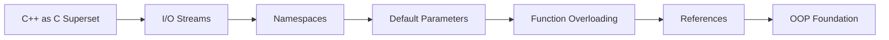

# Chapter 1: Introduction to C++

> **Previous:** None | **Next:** [Classes and Objects](./02-classes-objects.md)

## Learning Objectives

After studying this chapter, students will be able to:

- Contrast C and C++ approaches to I/O, type safety, and code organization
- Use `std::cin` and `std::cout` for console input and output
- Organise code with namespaces and understand the `using` declaration
- Apply default arguments and function overloading correctly
- Distinguish between references and pointers and use references idiomatically

## Chapter at a Glance

| Topic | Key Insight | Practical Takeaway |
|-------|-------------|-------------------|
| C++ as a C Superset | C++ retains C compatibility while adding OOP, generics, and a rich STL | Write C code inside C++ but prefer C++ abstractions for safety |
| I/O Streams | Type-safe `<<`/`>>` operators replace format-string-based I/O | Use `std::cin`/`std::cout` over `printf`/`scanf` in new code |
| Namespaces | Group identifiers to prevent name collisions across translation units | Never put `using namespace std;` in a header file |
| Default Parameters | Arguments default from right to left; set defaults in declarations | Declare defaults once in the header, not in the definition |
| Function Overloading | Multiple functions share a name if parameter lists differ | Let the compiler select the best match — keep overloads semantically related |
| References | Aliases that cannot be null or reseated | Pass large objects by `const&` to avoid copies |

## Chapter Roadmap



## 1.1 C++ as an Evolutionary Superset of C

> **One-Sentence Takeaway:** C++ modernises C with type-safe abstractions that encode common patterns into reusable, compiler-checked constructs.


C++ was designed by Bjarne Stroustrup beginning in 1979 as "C with Classes." The language retains full backward compatibility with C while adding support for object-oriented programming, generic programming, and a rich standard library. The fundamental difference is philosophical: C gives the programmer enough rope to hang themselves; C++ adds guardrails without removing the rope entirely.

In C, the programmer manually manages every aspect of program behaviour—memory allocation, string handling, I/O buffering. C++ introduces abstractions that encode these patterns into reusable, type-safe constructs. For example, where C uses `printf` with format specifiers that are checked only at runtime, C++ provides type-safe I/O streams resolved at compile time.

## 1.2 Input and Output Streams

> **One-Sentence Takeaway:** C++ streams shift format checking from runtime to compile time, eliminating an entire class of bugs inherent in C's `printf` family.

The C++ Standard Library provides the `<iostream>` header, which declares global stream objects:

- `std::cin` — standard input (connected to keyboard by default)
- `std::cout` — standard output
- `std::cerr` — unbuffered standard error
- `std::clog` — buffered standard error

The stream operators `<<` (insertion) and `>>` (extraction) perform formatted I/O. The type of the operand determines the formatting automatically, eliminating the format-string mismatches that plague C's `printf` family.

> **Pro Tip:** Chain `std::boolalpha` to print `true`/`false` instead of `1`/`0`, and `std::setprecision(n)` to control floating-point output — both are stream manipulators that stay active until changed.

```cpp
#include <iostream>
#include <string>

int main() {
    std::cout << "Enter your name and age: ";

    std::string name;
    int age = 0;
    std::cin >> name >> age;

    std::cout << "Hello, " << name << "! You are "
              << age << " years old." << std::endl;

    return 0;
}
```

**Output:**
```
Enter your name and age: Alice 22
Hello, Alice! You are 22 years old.
```

The `std::endl` manipulator inserts a newline character and flushes the output buffer. In performance-sensitive code, `\n` is preferred because it avoids the flush overhead.

## 1.3 Namespaces

> **One-Sentence Takeaway:** Namespaces let you reuse short, meaningful identifiers across libraries without collisions — a prerequisite for large-scale C++ projects.

Namespaces prevent name collisions by grouping identifiers under a named scope. The `std` namespace contains all Standard Library entities.

```cpp
namespace my_code {
    int compute() { return 42; }
}

namespace your_code {
    int compute() { return -1; }
}

int main() {
    int a = my_code::compute();    // 42
    int b = your_code::compute();  // -1
}
```

Three forms of `using` bring names into the current scope:

- `using std::cout;` — brings a single name into scope (preferred in practice)
- `using namespace std;` — brings the entire namespace into scope (common in textbooks, discouraged in production)
- `using std::literals;` — brings user-defined literal operators into scope

Header files should never contain `using namespace std;` because they would force the directive on every translation unit that includes them.

> **Warning:** A `using namespace std;` in a header is a ticking time bomb — when a future STL version adds a name that collides with yours, the error message can span hundreds of lines.

## 1.4 Default Parameters

> **One-Sentence Takeaway:** Default arguments reduce overload explosion by letting callers omit trailing parameters when the common-case value suffices.

C++ allows function parameters to have default values. Arguments are matched from left to right; once a parameter has a default value, all subsequent parameters must also have defaults.

```cpp
void display(const std::string& msg,
             int repeat = 1,
             char delim = '\n') {
    for (int i = 0; i < repeat; ++i) {
        std::cout << msg << delim;
    }
}

int main() {
    display("Hello");               // repeat=1, delim='\n'
    display("Hi", 3);               // repeat=3, delim='\n'
    display("Hey", 2, '!');         // repeat=2, delim='!'
}
```

Default arguments are resolved at compile time based on the caller's context. They are typically specified in the function declaration (in the header) rather than in the definition.

## 1.5 Function Overloading

> **One-Sentence Takeaway:** Overloading provides static polymorphism — the compiler selects the right function at compile time based on argument types.

Function overloading allows multiple functions to share the same name provided their parameter lists differ in number, type, or both. The compiler selects the best match through a process called overload resolution.

```cpp
int max(int a, int b) {
    return (a > b) ? a : b;
}

double max(double a, double b) {
    return (a > b) ? a : b;
}

char max(char a, char b) {
    return (a > b) ? a : b;
}

int main() {
    std::cout << max(3, 7) << '\n';         // calls int version
    std::cout << max(3.14, 2.72) << '\n';   // calls double version
    std::cout << max('A', 'Z') << '\n';     // calls char version
}
```

Overloading is resolved at compile time (static polymorphism). The return type alone is insufficient to distinguish overloads—the parameter types must differ. Ambiguous calls, where multiple overloads are equally good matches, cause a compilation error.

## 1.6 References

> **One-Sentence Takeaway:** References are the idiomatic C++ way to express aliasing — they cannot be null, cannot be reseated, and make pass-by-`const&` the default for read-only parameters.

A reference is an alias for an existing variable. Unlike a pointer, a reference cannot be null and cannot be reseated to refer to a different object after initialisation.

```cpp
int x = 42;
int& ref = x;   // ref is a reference to x
ref = 100;       // x is now 100

int* ptr = &x;  // ptr points to x
ptr = nullptr;   // ptr can be null; ref cannot
```

References are the idiomatic C++ mechanism for passing large objects into functions without copying. Passing by `const` reference communicates "I will read but not modify," while pass-by-value communicates "I need my own copy."

```cpp
void process(const std::vector<int>& data) {
    // read-only access, no copy
    for (int v : data) {
        std::cout << v << ' ';
    }
}
```

Reference parameters also enable output parameters when a function must produce multiple results:

> **Remember:** When you see `const&`, read "I promise not to modify this." When you see a plain `&` in a parameter, read "output value."

```cpp
bool divide(int a, int b, int& quotient, int& remainder) {
    if (b == 0) return false;
    quotient  = a / b;
    remainder = a % b;
    return true;
}
```

## Concept Comparison Table

| Feature | C Equivalent | C++ Advantage |
|---------|-------------|---------------|
| I/O | `printf`/`scanf` | Type-safe at compile time; no format-string mismatches |
| Code organisation | One flat namespace | Nested namespaces prevent collisions |
| Default arguments | Manual overloads | One declaration covers common and custom cases |
| Overloading | Unique names required | Same name for same operation on different types |
| Reference parameters | Pointers | Non-null guarantee, no reseating, cleaner syntax |
| Memory safety | Manual `malloc`/`free` | RAII through destructors and smart pointers |

## Quick Reference

| Construct | Syntax | Notes |
|-----------|--------|-------|
| Namespace definition | `namespace X { ... }` | Can be reopened across files |
| Using declaration | `using X::name;` | Prefer over `using namespace X;` |
| Default argument | `void f(int x = 5);` | In declaration only; all trailing params must default |
| Overloaded function | `int f(int); double f(double);` | Return type alone cannot distinguish overloads |
| Reference declaration | `int& r = x;` | Must be initialised; cannot be null |
| `const` reference | `const T& r = x;` | Extends lifetime of temporaries |

## Cross-Application Matrix

| Area | Application of Concepts |
|------|------------------------|
| Game Development | Namespaces organise engine subsystems; references pass large game-state objects |
| Embedded Systems | `const&` avoids stack copies on memory-constrained devices |
| GUI Frameworks (Qt) | Signal-slot mechanisms rely on function overloading and reference parameters |
| Financial Modelling | Default parameters simplify pricing-model constructors with many options |
| Compiler Design | Namespaces isolate analysis passes; streams provide diagnostic output |

## Chapter Quiz

1. Which of the following is **true** about C++ references?
   A) They can be reassigned to refer to a different object
   B) They cannot be null
   C) They require explicit dereferencing
   D) They are syntactic sugar for `const` pointers
   <details><summary>Answer</summary>**B)** References must be initialised and cannot be null. They also cannot be reseated (unlike pointers).</details>

2. What happens if you place `using namespace std;` inside a header file?
   A) The header will not compile
   B) The `using` directive is limited to that header only
   C) Every file that includes the header is affected
   D) The compiler issues a warning but it's safe
   <details><summary>Answer</summary>**C)** The directive is propagated to every translation unit that includes the header, making all `std` names visible and risking collisions.</details>

3. Why is `std::endl` generally slower than `'\n'`?
   A) `std::endl` allocates memory on the heap
   B) `std::endl` flushes the output buffer
   C) `std::endl` performs Unicode conversion
   D) `std::endl` locks a mutex for thread safety
   <details><summary>Answer</summary>**B)** `std::endl` inserts `'\n'` and then flushes the stream. In high-frequency output, flushing every line kills throughput.</details>

4. Which statement about function overloading is **false**?
   A) Overloads must differ in parameter count or types
   B) The return type alone can distinguish overloads
   C) The compiler performs overload resolution at compile time
   D) Ambiguous calls produce a compilation error
   <details><summary>Answer</summary>**B)** The return type alone is insufficient — parameter types must differ.</details>

5. When should you pass a parameter by `const&`?
   A) When the function needs to modify the argument
   B) When the type is small (like `int` or `char`)
   C) When the object is large and the function only reads it
   D) When the parameter may be null
   <details><summary>Answer</summary>**C)** Large objects that are read-only should be passed by `const&` to avoid copying. Small types like `int` are fine to pass by value.</details>

## 1.7 Summary

C++ extends C with type-safe I/O streams, namespace-based code organisation, default arguments, function overloading, and reference types. These features form the foundation upon which object-oriented programming is built. The shift from C to C++ is a shift from manual, error-prone patterns to compiler-checked abstractions that encode intent directly in code.

## Exercises

### Review Questions

1. What advantages do C++ I/O streams offer over C's `printf`/`scanf`?
2. Why is `using namespace std;` discouraged in header files?
3. Can default arguments appear in both the declaration and the definition of a function? Explain.
4. How does the compiler resolve which overloaded function to call?
5. Explain why a reference cannot be null but a pointer can.

### Application Problems

1. Write a program that reads a list of integers from the user (terminated by a non-integer) and prints their sum, average, minimum, and maximum using `std::cin` and `std::cout`.
2. Implement an overloaded set of `print` functions that accept: (a) an `int`, (b) a `double`, (c) a `std::string`, and (d) a vector of any printable type using a template (preview of Chapter 7). Each function should print its argument enclosed in brackets: `[42]`.

### Challenge Problem

3. Implement a simple command-line calculator that reads expressions of the form `number operator number` (e.g., `3 + 4`) using `std::cin`, supports the four basic arithmetic operations, and loops until the user enters `quit`. Use references to implement a function `bool parse_input(const std::string& input, double& a, char& op, double& b)`.
