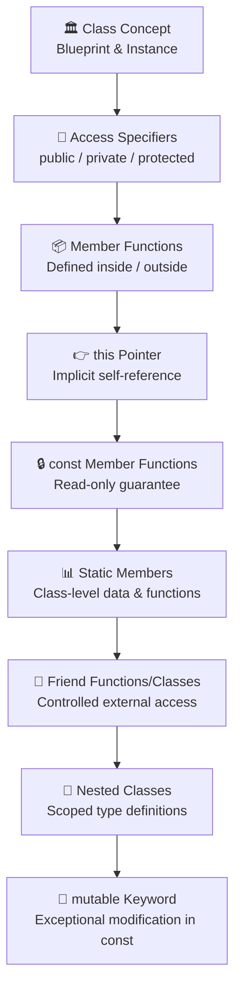

# Chapter 2: Classes and Objects

> **Previous:** [Introduction](./01-introduction.md) | **Next:** [Constructors](./03-constructors.md)

## Learning Objectives

After studying this chapter, students will be able to:

- Define a class with data members and member functions using correct syntax
- Apply access specifiers (`public`, `private`, `protected`) to enforce encapsulation
- Distinguish between `class` and `struct` in C++ and choose appropriately
- Use the `this` pointer explicitly for disambiguation and method chaining
- Declare `const` member functions and explain const-correctness
- Implement and access static members with proper out-of-class definitions
- Write friend functions and friend classes for controlled external access
- Design nested classes for information hiding
- Analyze complexity of member function calls and object operations

---

## Topic Flowchart



---

## 2.1 The Class Concept — Blueprint and Instance

### Real-World Analogy

Think of a **building blueprint**:

| Concept | Real-World | C++ |
|---------|-----------|-----|
| Blueprint | Architectural drawing | `class` definition |
| Building | Physical structure | `object` (instance) |
| Rooms | Data members | Member variables |
| Doors/Windows | Public interface | Public member functions |
| Electrical closet | Private implementation | Private members |
| Builder | Constructor | Constructor function |

A single blueprint can produce hundreds of identical buildings. Each building is independent — if you change the wallpaper in one building, the others are unaffected. Similarly, a class defines the *structure and behavior*, while each object has its *own copy* of the data members.

### Step-by-Step Process

1. **Identify the entity** — What real-world thing are you modeling? (Bank account, Employee, Student)
2. **List attributes** — What data describes this entity? (balance, name, age)
3. **List behaviors** — What operations can this entity perform? (deposit, withdraw, getName)
4. **Choose visibility** — Which data should be hidden (private) and which exposed (public)?
5. **Write the class definition** — Combine attributes and behaviors into a `class` block
6. **Instantiate objects** — Create concrete instances in `main()`
7. **Use the objects** — Call member functions to interact with the objects

### Pseudocode

```
CLASS BankAccount
    PRIVATE:
        string ownerName
        double balance
    
    PUBLIC:
        FUNCTION deposit(amount):
            IF amount > 0 THEN
                balance = balance + amount
            END IF
        END FUNCTION
        
        FUNCTION withdraw(amount):
            IF amount > 0 AND amount <= balance THEN
                balance = balance - amount
                RETURN true
            END IF
            RETURN false
        END FUNCTION
        
        FUNCTION getBalance():
            RETURN balance
        END FUNCTION
END CLASS

FUNCTION main():
    CREATE acc AS BankAccount
    CALL acc.deposit(1000)
    CALL acc.withdraw(250)
    PRINT acc.getBalance()    // Output: 750
END FUNCTION
```

### C++ Implementation

```cpp
#include <iostream>
#include <string>

class BankAccount {
private:
    std::string owner_name_;
    double      balance_;

public:
    // Constructor
    BankAccount(const std::string& name, double initial_balance = 0.0)
        : owner_name_(name), balance_(initial_balance) {}

    void deposit(double amount) {
        if (amount > 0) {
            balance_ += amount;
        }
    }

    bool withdraw(double amount) {
        if (amount > 0 && amount <= balance_) {
            balance_ -= amount;
            return true;
        }
        return false;
    }

    double get_balance() const {
        return balance_;
    }

    std::string get_owner() const {
        return owner_name_;
    }
};

int main() {
    BankAccount acc("Alice", 500.0);
    acc.deposit(1000.0);
    std::cout << "Owner: " << acc.get_owner() << "\n";
    std::cout << "Balance: $" << acc.get_balance() << "\n"; // $1500

    if (acc.withdraw(250.0)) {
        std::cout << "Withdrew $250\n";
    }
    std::cout << "Balance: $" << acc.get_balance() << "\n"; // $1250

    return 0;
}
```

**Output:**
```
Owner: Alice
Balance: $1500
Withdrew $250
Balance: $1250
```

### Memory Layout of an Object

When an object is created, memory is allocated for all its **non-static** data members. Member functions are stored once in the code segment and shared by all objects — they receive the `this` pointer to know which object they're operating on.

```
Stack (for object acc):
+----------------------------+
| owner_name_: "Alice"       |  ← 32 bytes (std::string)
| balance_: 1250.0           |  ← 8 bytes (double)
+----------------------------+
Total size: ~40 bytes (platform-dependent)

Code Segment (shared):
+----------------------------+
| BankAccount::deposit()     |
| BankAccount::withdraw()    |
| BankAccount::get_balance() |
| BankAccount::get_owner()   |
+----------------------------+
```

**Key Insight:** Member functions do NOT occupy space in each object. Only data members contribute to `sizeof(ClassName)`.

### Complexity Analysis

| Operation | Time Complexity | Why? |
|-----------|----------------|------|
| Object creation (stack) | O(1) | Stack pointer adjustment, constructor runs |
| Object creation (heap `new`) | O(1) amortized | Memory allocation + constructor |
| Access a data member via object | O(1) | Direct offset from object base address |
| Call a member function | O(1) | Function pointer resolved at compile time |
| `sizeof(ClassName)` | O(1) | Sum of member sizes + padding (compile-time constant) |

**Space Complexity:** O(n) where n = number of objects × size of each object. Each object is independent.

---

## 2.2 Access Specifiers

### Overview Table

| Specifier | Inside Class | Derived Class | Outside (Any Code) | Default for `class` | Default for `struct` |
|-----------|:-----------:|:-------------:|:------------------:|:-------------------:|:--------------------:|
| `private` | ✅ Yes | ❌ No | ❌ No | ✅ Default | ❌ |
| `protected` | ✅ Yes | ✅ Yes | ❌ No | ❌ | ❌ |
| `public` | ✅ Yes | ✅ Yes | ✅ Yes | ❌ | ✅ Default |

### Real-World Analogy

Think of a **house**:

- **Public** — The front door, mailbox, doorbell. Anyone on the street can access these.
- **Private** — The master bedroom, safe, electrical panel. Only family members (the class itself) can access.
- **Protected** — The guest bedroom, backyard. Family members (class) and extended family (derived classes) can access, but strangers cannot.

### Detailed Explanation

**`private`** members are the implementation details. They can only be accessed by member functions and friend functions/classes of the same class. This is the *strongest* form of encapsulation.

**`protected`** members are like `private` with one relaxation: derived classes can access them. This supports controlled inheritance but still prevents external access.

**`public`** members form the interface contract. Once published, changing them can break all client code. Therefore, public interfaces should be designed carefully.

### Code Demonstration

```cpp
#include <iostream>

class House {
private:
    double safe_deposit_;       // Only House can access

protected:
    double guest_room_value_;   // House and derived classes can access

public:
    std::string address_;       // Anyone can access

    House(const std::string& addr, double safe_val, double guest_val)
        : address_(addr), safe_deposit_(safe_val), guest_room_value_(guest_val) {}

    // Private access is allowed inside the class
    double get_total_wealth() const {
        return safe_deposit_ + guest_room_value_;
    }

    // Public getter for private member
    double get_safe_deposit() const {
        return safe_deposit_;
    }
};

class Mansion : public House {
public:
    Mansion(const std::string& addr, double safe_val, double guest_val)
        : House(addr, safe_val, guest_val) {}

    void show_guest_room() {
        // ✅ OK: derived class can access protected member
        std::cout << "Guest room worth: $" << guest_room_value_ << "\n";
    }

    void try_show_safe() {
        // ❌ ERROR: private member is not accessible
        // std::cout << safe_deposit_;   // Would NOT compile
    }
};

int main() {
    House h("123 Main St", 100000.0, 50000.0);

    // Public access OK
    std::cout << "Address: " << h.address_ << "\n";

    // Protected access ❌
    // std::cout << h.guest_room_value_;  // ERROR: not accessible

    // Private access ❌
    // std::cout << h.safe_deposit_;      // ERROR: not accessible

    // ✅ OK via public member function
    std::cout << "Total wealth: $" << h.get_total_wealth() << "\n";

    return 0;
}
```

**Output:**
```
Address: 123 Main St
Total wealth: $150000
```

### The Principle of Least Privilege

1. Data members should almost always be `private`
2. Helper/utility functions should be `private`
3. Only the absolute minimum interface should be `public`
4. Use `protected` only when you know derived classes will need direct access

> **Pro Tip:** Don't expose data members as `public` "temporarily" — it's very hard to make them private later without breaking all callers. Always start with `private` and relax only when necessary.

### class vs struct — Extended Comparison

```cpp
class ClassExample {
    int x_;     // private by default
};

struct StructExample {
    int x_;     // public by default
};
```

The only technical difference is the default access specifier:

| Aspect | `class` | `struct` |
|--------|---------|----------|
| Default member access | `private` | `public` |
| Default inheritance | `private` | `public` |
| Convention | Types with invariants and private state | Plain data aggregates (POD types) |
| Brace initialization | Not possible with private members | Works with all-public members |
| Examples | `std::string`, `std::vector`, `BankAccount` | `std::pair`, `Point`, `Rectangle` |

```cpp
// struct for plain data — brace initialization works
struct Point {
    double x;
    double y;
};

// class for types with invariants
class Circle {
private:
    Point center_;
    double radius_;
public:
    Circle(double cx, double cy, double r) : center_{cx, cy}, radius_(r) {
        if (r < 0) throw std::invalid_argument("Negative radius");
    }
    double area() const { return 3.14159 * radius_ * radius_; }
};

int main() {
    Point p = {3.0, 4.0};               // ✅ brace init for struct
    // Circle c = {0, 0, 5};            // ❌ cannot brace-init class with private members
    Circle c(0, 0, 5);                  // ✅ use constructor
    std::cout << "Area: " << c.area() << "\n";
    return 0;
}
```

**Output:**
```
Area: 78.5397
```

---

## 2.3 Member Functions

Member functions (also called *methods*) are functions that belong to a class. They have direct access to all members (public, protected, private) of the class.

### Syntax Variations

```cpp
class Demo {
private:
    int value_;

public:
    // 1. Defined inside the class (implicitly inline)
    void set_value(int v) {
        value_ = v;
    }

    // 2. Declared inside, defined outside
    int get_value() const;
};

// Definition outside the class
int Demo::get_value() const {
    return value_;
}
```

### Types of Member Functions

| Type | `this` Available? | Can Access Static Members? | Can Access Non-static Members? |
|------|:-----------------:|:--------------------------:|:------------------------------:|
| Non-static, non-const | ✅ Yes | ✅ Yes | ✅ Yes |
| Non-static, const | ✅ Yes (const*) | ✅ Yes | ✅ Yes (read-only) |
| Static | ❌ No | ✅ Yes | ❌ No |

### Inline Member Functions

Small functions (1-3 lines) defined inside the class body are implicitly `inline`. The compiler may expand them at the call site, eliminating function call overhead:

```cpp
class FastMath {
public:
    // Implicitly inline — compiler may expand this
    int square(int x) { return x * x; }

    // Not inline — defined outside
    int cube(int x);
};

int FastMath::cube(int x) {
    return x * x * x;   // Not implicitly inline
}
```

**When to inline:**
- ✅ Tiny getters/setters
- ✅ Simple computations
- ❌ Large functions (bloats code)
- ❌ Virtual functions (inlining is complex with vtable)

### Complexity Analysis

| Operation | Complexity | Why |
|-----------|------------|-----|
| Non-inline member function call | O(1) | Standard call + `this` parameter push |
| Inline member function expansion | O(1) | No call overhead — code substituted directly |
| Virtual member function call | O(1) | Extra indirection through vtable (one extra pointer dereference) |
| Static member function call | O(1) | Same as regular function call |

**Space overhead of member function:**
- Non-virtual: 0 bytes per object (code is shared)
- Virtual: 8 bytes per object (vtable pointer) on 64-bit systems

---

## 2.4 The `this` Pointer

### What Is `this`?

`this` is a keyword that evaluates to the **address of the current object** inside a non-static member function. It's an implicit parameter that the compiler passes to every non-static member function call.

```
obj.member_function(args)
    →  compiler translates to:  member_function(&obj, args)
    →  inside:                  this = &obj
```

### Implicit vs Explicit Usage

```cpp
class Example {
private:
    int value_;
public:
    // ❌ Ambiguous — compiler thinks value is the parameter
    void set_value_ambiguous(int value) {
        value = value;   // Self-assignment! No effect
    }

    // ✅ Explicit this to disambiguate
    void set_value(int value) {
        this->value_ = value;   // this->value_ is the member
    }

    // ✅ Implicit this — member accessed without qualification
    int get_value() const {
        return value_;   // compiler treats as this->value_
    }
};
```

### Method Chaining with `*this`

Returning `*this` from mutator functions enables fluent interfaces:

```cpp
#include <iostream>
#include <string>

class QueryBuilder {
private:
    std::string query_;
public:
    QueryBuilder& select(const std::string& cols) {
        query_ += "SELECT " + cols + " ";
        return *this;
    }

    QueryBuilder& from(const std::string& table) {
        query_ += "FROM " + table + " ";
        return *this;
    }

    QueryBuilder& where(const std::string& condition) {
        query_ += "WHERE " + condition + " ";
        return *this;
    }

    std::string build() const {
        return query_ + ";";
    }
};

int main() {
    QueryBuilder qb;
    std::string sql = qb.select("name, age")
                        .from("users")
                        .where("age > 18")
                        .build();
    std::cout << sql << "\n";
    return 0;
}
```

**Output:**
```
SELECT name, age FROM users WHERE age > 18 ;
```

**Alternative without chaining:**
```cpp
QueryBuilder qb;
qb.select("name, age");
qb.from("users");
qb.where("age > 18");
std::string sql = qb.build();
```

The chained version is more concise and readable, especially for builder patterns.

### Common `this` Use Cases

| Use Case | Code Pattern | Why |
|----------|-------------|-----|
| Disambiguate parameter from member | `this->member_ = member_` | Parameter shadows member |
| Method chaining | `return *this;` | Return reference to current object |
| Pass self to another function | `some_func(this);` | External function needs object's address |
| Compare objects | `if (this == &other)` | Identity check (same object?) |
| CRTP (Curiously Recurring Template Pattern) | `static_cast<Derived*>(this)->f()` | Static polymorphism |

### Compare Objects — Identity Check

```cpp
class Person {
private:
    std::string name_;
    int age_;
public:
    Person(const std::string& name, int age) : name_(name), age_(age) {}

    bool is_same_person(const Person& other) const {
        return this == &other;   // Address comparison
    }

    bool is_equal(const Person& other) const {
        return name_ == other.name_ && age_ == other.age_;   // Value comparison
    }
};

int main() {
    Person a("Alice", 30);
    Person b("Alice", 30);
    Person& c = a;

    std::cout << std::boolalpha;
    std::cout << "a is same as b: " << a.is_same_person(b) << "\n";  // false
    std::cout << "a equals b: " << a.is_equal(b) << "\n";            // true
    std::cout << "a is same as c: " << a.is_same_person(c) << "\n";  // true
    return 0;
}
```

**Output:**
```
a is same as b: false
a equals b: true
a is same as c: true
```

---

## 2.5 Static Members

### Real-World Analogy

Think of a **company's break room**:

- Each employee has their own desk (non-static member — per-object)
- The break room fridge is shared by all employees (static member — per-class)
- If someone puts food in the fridge, everyone can see it
- If someone quits, the fridge stays — it doesn't belong to any single employee

### Static Data Members

```cpp
class Employee {
private:
    std::string name_;
    int id_;
    static int next_id_;             // Declaration — shared by ALL employees
    static inline int company_code_ = 1001;  // C++17 inline init — no .cpp needed

public:
    Employee(const std::string& name) : name_(name) {
        id_ = next_id_++;            // Each new employee gets a unique ID
    }

    int get_id() const { return id_; }
    static int get_next_id() { return next_id_; }

    static void set_company_code(int code) {
        company_code_ = code;
    }
};

// Definition in exactly ONE translation unit (pre-C++17 style)
int Employee::next_id_ = 1000;
```

### Dry Run — Static Variable Increment

Let's trace what happens as we create Employee objects:

```
Initial State:
    next_id_ = 1000

Step 1: Employee e1("Alice")
    id_ = next_id_++ → id_ = 1000, next_id_ = 1001
    Object e1: { name_ = "Alice", id_ = 1000 }

Step 2: Employee e2("Bob")
    id_ = next_id_++ → id_ = 1001, next_id_ = 1002
    Object e2: { name_ = "Bob", id_ = 1001 }

Step 3: Employee e3("Charlie")
    id_ = next_id_++ → id_ = 1002, next_id_ = 1003
    Object e3: { name_ = "Charlie", id_ = 1002 }

Static Variable next_id_ now = 1003 (shared across all instances)
```

### Dry Run Trace Table

| Step | Action | e1.id\_ | e2.id\_ | e3.id\_ | next\_id\_ (static) |
|------|--------|:-------:|:-------:|:-------:|:-------------------:|
| 0 | Initial state | — | — | — | **1000** |
| 1 | `Employee e1("Alice")` | **1000** | — | — | **1001** |
| 2 | `Employee e2("Bob")` | 1000 | **1001** | — | **1002** |
| 3 | `Employee e3("Charlie")` | 1000 | 1001 | **1002** | **1003** |
| 4 | `Employee::get_next_id()` | — | — | — | Returns **1003** |
| 5 | `e1.get_next_id()` | — | — | — | Also returns **1003** |

### Static Member Functions

Static member functions:
- Have **no** `this` pointer
- Can only access **static** data members
- Can be called on the **class** (`ClassName::func()`) or on an **object** (`obj.func()`)
- Cannot be `const`, `virtual`, or `volatile`

```cpp
class MathUtils {
public:
    static int add(int a, int b) { return a + b; }
    static int multiply(int a, int b) { return a * b; }
};

int main() {
    // Called on the class
    std::cout << MathUtils::add(5, 3) << "\n";        // 8
    std::cout << MathUtils::multiply(4, 7) << "\n";   // 28

    MathUtils m;
    // Also called on an object (though class-name is preferred)
    std::cout << m.add(1, 2) << "\n";                 // 3
    return 0;
}
```

### static vs Non-static — Comparison Table

| Feature | static Member | Non-static Member |
|---------|:-------------:|:-----------------:|
| Belongs to | Class | Object (instance) |
| Number of copies | One for the entire class | One per object |
| `this` pointer | ❌ Not available | ✅ Available |
| Access to static members | ✅ Yes | ✅ Yes |
| Access to non-static members | ❌ No | ✅ Yes |
| Can be `const` | ❌ No | ✅ Yes |
| Can be `virtual` | ❌ No | ✅ Yes |
| Storage duration | Static (program lifetime) | Automatic (object lifetime) |
| Called on | `ClassName::member` or `obj.member` | `obj.member` |
| Initialization | Outside class (pre-C++17) or `inline` (C++17) | Inside constructor or initializer list |

### Complexity Analysis of Static Members

| Operation | Complexity | Why |
|-----------|------------|-----|
| Access static data member | O(1) | Direct memory access (fixed address, no object needed) |
| Call static member function | O(1) | Regular function call, no `this` push |
| Access non-static member | O(1) | Offset from object base address |
| Compare: `e1.get_id()` vs `Employee::get_next_id()` | Both O(1) | Static call is slightly faster (one fewer parameter) |

**Why static members exist:** They model class-level concepts — counters, factories, configuration constants, singletons — that logically belong to the type, not to any particular instance.


---

## 2.6 Friend Functions

### Real-World Analogy

Think of a **doctor** and a **pharmacy**:

- The doctor (class) has your private medical records (private data)
- The doctor can give a *prescription* (friend declaration) to a specific pharmacy (friend function)
- The pharmacy can now access your records ONLY because the doctor authorized it
- The pharmacy doesn't become part of the doctor's office — it's an external entity with special permission

### What Is a Friend Function?

A **friend function** is a non-member function that has access to all `private` and `protected` members of a class. Friendship is **granted** by the class, not taken.

```cpp
#include <iostream>

class BankAccount {
private:
    std::string owner_;
    double balance_;

public:
    BankAccount(const std::string& owner, double balance)
        : owner_(owner), balance_(balance) {}

    // Grant friendship to an external function
    friend void display_account(const BankAccount& acc);
};

// Friend function definition — can access private members
void display_account(const BankAccount& acc) {
    std::cout << "Owner: " << acc.owner_ << "\n";       // ✅ private
    std::cout << "Balance: $" << acc.balance_ << "\n";  // ✅ private
}

int main() {
    BankAccount acc("Alice", 5000.0);
    display_account(acc);    // ✅ friend function can access private data
    return 0;
}
```

**Output:**
```
Owner: Alice
Balance: $5000
```

### Friend Function with Two Classes

One of the most powerful uses of friend functions is operating on objects of **two different classes**:

```cpp
#include <iostream>

class Rectangle;  // Forward declaration

class Square {
private:
    double side_;
public:
    Square(double s) : side_(s) {}
    friend double max_area(const Square& sq, const Rectangle& rect);
};

class Rectangle {
private:
    double width_;
    double height_;
public:
    Rectangle(double w, double h) : width_(w), height_(h) {}
    friend double max_area(const Square& sq, const Rectangle& rect);
};

// Friend function accessing private data of BOTH classes
double max_area(const Square& sq, const Rectangle& rect) {
    double sq_area = sq.side_ * sq.side_;               // ✅ Square::side_ (private)
    double rect_area = rect.width_ * rect.height_;       // ✅ Rectangle::width_, height_ (private)
    return (sq_area > rect_area) ? sq_area : rect_area;
}

int main() {
    Square sq(5.0);
    Rectangle rect(3.0, 10.0);
    std::cout << "Max area: " << max_area(sq, rect) << "\n";  // 30.0 (rectangle)
    return 0;
}
```

**Output:**
```
Max area: 30
```

### Friend Class

A complete class can be declared as a friend, giving all its member functions access:

```cpp
#include <iostream>
#include <vector>

class Employee {
private:
    std::string name_;
    double salary_;

public:
    Employee(const std::string& name, double salary)
        : name_(name), salary_(salary) {}

    friend class PayrollSystem;  // Entire PayrollSystem class is a friend
};

class PayrollSystem {
private:
    double total_payroll_;
public:
    PayrollSystem() : total_payroll_(0.0) {}

    void process_salary(Employee& emp) {
        // ✅ Can access private salary_ because PayrollSystem is a friend
        total_payroll_ += emp.salary_;

        // Apply tax deduction
        emp.salary_ *= 0.8;  // 20% tax
    }

    void display_payslip(const Employee& emp) {
        // ✅ Can access private name_ and salary_
        std::cout << "Employee: " << emp.name_
                  << ", Net Salary: $" << emp.salary_ << "\n";
    }

    double get_total_payroll() const { return total_payroll_; }
};

int main() {
    Employee alice("Alice", 50000);
    Employee bob("Bob", 60000);

    PayrollSystem payroll;
    payroll.process_salary(alice);
    payroll.process_salary(bob);

    payroll.display_payslip(alice);
    payroll.display_payslip(bob);
    std::cout << "Total company payroll: $" << payroll.get_total_payroll() << "\n";

    return 0;
}
```

**Output:**
```
Employee: Alice, Net Salary: $40000
Employee: Bob, Net Salary: $48000
Total company payroll: $110000
```

### Dry Run — Friend Function Access

Trace `max_area(sq, rect)` where `sq.side_ = 5.0`, `rect.width_ = 3.0`, `rect.height_ = 10.0`:

| Step | Code Executed | Square::side\_ | Rectangle::width\_ | Rectangle::height\_ | Result |
|:----:|---------------|:--------------:|:------------------:|:-------------------:|:------:|
| 0 | Initial state | 5.0 | 3.0 | 10.0 | — |
| 1 | `sq_area = sq.side_ * sq.side_` | 5.0 (read) | — | — | sq\_area = 25.0 |
| 2 | `rect_area = rect.width_ * rect.height_` | — | 3.0 (read) | 10.0 (read) | rect\_area = 30.0 |
| 3 | `return sq_area > rect_area ? sq_area : rect_area` | — | — | — | 30.0 > 25.0 → return **30.0** |

**Key observation:** Without friendship, `max_area()` could only access public members. With friendship, it reads private members of both classes directly, avoiding the need for public getters.

### Important Rules of Friendship

| Rule | Explanation |
|------|-------------|
| Friendship is **granted**, not taken | The class decides who its friends are; friend functions don't declare themselves |
| Friendship is **not mutual** | If class A is a friend of class B, class B is NOT automatically a friend of class A |
| Friendship is **not inherited** | If class A is a friend of class B, a class derived from A is NOT a friend of B |
| Friendship is **not transitive** | If A is a friend of B, and B is a friend of C, A is NOT a friend of C |
| Friend declaration can be anywhere | Usually placed at the top of the class (in the private section) |
| Number of friends is unlimited | But too many friends weakens encapsulation |

### friend Function vs Member Function — Comparison

| Feature | friend Function | Member Function |
|---------|:--------------:|:---------------:|
| Access to private members | ✅ Yes (if declared friend) | ✅ Yes |
| Called with object | `func(obj)` | `obj.func()` |
| `this` pointer | ❌ No | ✅ Yes |
| Can be virtual | ❌ No | ✅ Yes (if non-static) |
| Can be static | ✅ Yes (it's a regular function) | ✅ Yes |
| Symmetric binary ops | ✅ Natural | ❌ Needs `const&` for left operand |
| Encapsulation impact | Moderate (controlled breach) | None (inside the class) |
| Override in derived class | ❌ Not applicable | ✅ Yes (if virtual) |
| Inheritance | Not inherited | Inherited normally |

**When to use friend over member:**

1. **Binary operators** where the left operand is not of your class (e.g., `operator<<(std::ostream&, const Class&)` must be a friend or non-member)
2. **Symmetric operations** between two different classes (like `max_area(Square, Rectangle)`)
3. **When the function doesn't logically belong to the class** but needs private access

```cpp
class Complex {
private:
    double real_;
    double imag_;
public:
    Complex(double r, double i) : real_(r), imag_(i) {}

    // Member function — left operand must be Complex
    Complex operator+(const Complex& other) const {
        return Complex(real_ + other.real_, imag_ + other.imag_);
    }

    // Friend — can handle non-Complex left operand
    friend Complex operator*(double scalar, const Complex& c) {
        return Complex(scalar * c.real_, scalar * c.imag_);
    }

    // Friend for output stream
    friend std::ostream& operator<<(std::ostream& os, const Complex& c) {
        os << c.real_ << " + " << c.imag_ << "i";
        return os;
    }
};

int main() {
    Complex a(3.0, 4.0);
    Complex b(1.0, 2.0);
    std::cout << "a + b = " << (a + b) << "\n";       // member
    std::cout << "5 * a = " << (5.0 * a) << "\n";     // friend (scalar first!)
    return 0;
}
```

**Output:**
```
a + b = 4 + 6i
5 * a = 15 + 20i
```

---

## 2.7 Nested Classes

A **nested class** is a class defined inside another class. It's scoped within the enclosing class and can access its private members (if the enclosing class grants access).

### Real-World Analogy

A **car** has an **engine**:

- The engine is part of the car (nested)
- The engine doesn't exist independently outside the context of the car
- The engine can access the car's internal systems
- But from outside the car, you talk about "Car::Engine"

### Syntax and Access Rules

```cpp
#include <iostream>
#include <string>

class Car {
private:
    std::string model_;
    int fuel_level_;  // 0-100

public:
    Car(const std::string& model, int fuel)
        : model_(model), fuel_level_(fuel) {}

    // Nested class
    class Engine {
    private:
        int horsepower_;
        bool is_running_;
    public:
        Engine(int hp) : horsepower_(hp), is_running_(false) {}

        void start() {
            is_running_ = true;
            std::cout << "Engine (" << horsepower_ << " HP) started\n";
        }
        void stop() {
            is_running_ = false;
            std::cout << "Engine stopped\n";
        }
        int get_horsepower() const { return horsepower_; }
        bool running() const { return is_running_; }
    };

    // Use the nested class
    Engine engine_;

    void drive() {
        engine_.start();
        std::cout << model_ << " is driving\n";
    }
};

int main() {
    Car my_car("Tesla Model 3", 80);
    // Access nested class type
    Car::Engine motor(450);  // ✅ Nested class used outside

    my_car.drive();
    motor.stop();
    return 0;
}
```

**Output:**
```
Engine (450 HP) started
Tesla Model 3 is driving
Engine stopped
```

### Nested Class Access Rules

| Aspect | Rule |
|--------|------|
| Enclosing class → nested class member | Must use nested class name or object |
| Nested class → enclosing class private | ❌ By default, cannot access enclosing class's `this` or private members |
| Nested class → enclosing class private (if granted friend) | ✅ Yes |
| External scope | Referred to as `OuterClass::NestedClass` |
| Nested class can be `private` | ✅ Yes — hidden from external code entirely |

```cpp
class Outer {
private:
    int secret_;

    // Private nested class — invisible outside Outer
    class InternalHelper {
    public:
        void do_work(Outer& o) {
            // ❌ Cannot access Outer::secret_ by default
            // Need friendship
        }
    };

public:
    class PublicNested {
    public:
        void show(const Outer& o) {
            // ❌ Also cannot access secret_
        }
    };
};

// main() can use PublicNested but NOT InternalHelper
int main() {
    Outer::PublicNested pn;   // ✅ OK
    // Outer::InternalHelper ih;  // ❌ ERROR: private
    return 0;
}
```

### Visibility Hierarchy

```cpp
class Outer {
public:
    class PublicNested {};       // Accessible everywhere
protected:
    class ProtectedNested {};    // Accessible in Outer and derived classes
private:
    class PrivateNested {};      // Accessible only inside Outer
};
```

---

## 2.8 `const` Member Functions — Deep Dive

### The Core Concept

A `const` member function promises **not to modify the object's logical state**. The `const` keyword is placed **after** the parameter list:

```cpp
class Widget {
public:
    int get_value() const;   // Const member function
    void set_value(int v);   // Non-const member function
};
```

### What `const` Actually Does

When you write `void func() const`, the compiler treats `*this` as `const Widget* const`:

```
// Without const:  this  is  Widget* const      (pointer is const, object is mutable)
// With const:     this  is  const Widget* const (pointer is const, object is const too)
```

This means inside a `const` member function:
- ✅ You can **read** all data members
- ❌ You cannot **write** to any data member
- ❌ You cannot call non-`const` member functions on `*this`
- ✅ You can call other `const` member functions
- ✅ You can **write** to `static` members (they don't belong to the object)
- ✅ You can **write** to `mutable` members (special exception)

### Why const-Correctness Matters

```cpp
class Student {
private:
    std::string name_;
    double gpa_;
public:
    Student(const std::string& name, double gpa) : name_(name), gpa_(gpa) {}

    // Read access — const
    std::string get_name() const { return name_; }
    double get_gpa() const { return gpa_; }

    // Write access — non-const
    void set_gpa(double gpa) { gpa_ = gpa; }
};

void print_student(const Student& s) {
    // s is a const reference — can ONLY call const functions
    std::cout << s.get_name() << ": " << s.get_gpa() << "\n";  // ✅ OK
    // s.set_gpa(4.0);  // ❌ ERROR: cannot call non-const on const reference
}

int main() {
    Student s("Alice", 3.8);
    print_student(s);       // ✅ OK — const ref binds to non-const object
    return 0;
}
```

### const and Non-const Overloads

You can provide **both** versions — the compiler selects the right one based on whether the object is `const`:

```cpp
#include <iostream>
#include <vector>

class Matrix2x2 {
private:
    int data_[4];  // [0,0], [0,1], [1,0], [1,1]
public:
    Matrix2x2(int a, int b, int c, int d) : data_{a, b, c, d} {}

    // Non-const: returns reference — allows modification
    int& operator()(int row, int col) {
        std::cout << "non-const operator() called\n";
        return data_[row * 2 + col];
    }

    // Const: returns const reference — read-only
    const int& operator()(int row, int col) const {
        std::cout << "const operator() called\n";
        return data_[row * 2 + col];
    }
};

void inspect(const Matrix2x2& m) {
    std::cout << m(0, 0) << "\n";  // calls const version
}

int main() {
    Matrix2x2 m(1, 2, 3, 4);

    // Non-const object can call both
    m(0, 0) = 10;               // calls non-const → modifies
    std::cout << m(0, 0) << "\n"; // calls non-const (non-const object, read)

    const Matrix2x2 cm(5, 6, 7, 8);
    // cm(0, 0) = 99;           // ❌ ERROR: const object, returns const ref
    std::cout << cm(0, 0) << "\n"; // calls const version

    inspect(m);                  // calls const version
    return 0;
}
```

**Output:**
```
non-const operator() called
non-const operator() called
10
const operator() called
5
const operator() called
1
```

### What `const` Does NOT Guarantee

| Common Misconception | Reality |
|---------------------|---------|
| "const function guarantees thread safety" | ❌ No — mutable members can be modified, causing data races |
| "const function makes all members const" | ❌ No — `mutable` members bypass const |
| "const function is enforced at runtime" | ❌ No — compile-time enforcement only |
| "const object can call any function" | ❌ No — can only call const member functions |

### The `mutable` Keyword

`mutable` allows a data member to be modified even inside a `const` member function. Use it for:

- **Caching** — Lazily computed values
- **Mutexes** — Thread synchronization
- **Reference counting** — Internal bookkeeping
- **Logging** — Debug counters

```cpp
#include <iostream>
#include <string>

class CachedData {
private:
    std::string raw_data_;
    mutable bool cache_valid_;   // Can be modified in const functions
    mutable std::string cache_;
    mutable int access_count_;   // Track read frequency

public:
    CachedData(const std::string& data)
        : raw_data_(data), cache_valid_(false), access_count_(0) {}

    // const member function — but modifies cache
    std::string get_processed() const {
        ++access_count_;  // ✅ OK — mutable
        if (!cache_valid_) {
            // Expensive computation
            cache_ = "[[PROCESSED]] " + raw_data_ + " [[END]]";
            cache_valid_ = true;   // ✅ OK — mutable
        }
        return cache_;
    }

    int get_access_count() const {
        return access_count_;  // ✅ OK — mutable
    }

    // Force cache refresh
    void refresh() {
        cache_valid_ = false;  // Non-const — naturally modifies
    }
};

int main() {
    const CachedData cd("Hello World");  // const object

    std::cout << cd.get_processed() << "\n";  // Computes and caches
    std::cout << cd.get_processed() << "\n";  // Uses cache
    std::cout << "Accessed " << cd.get_access_count() << " times\n";

    return 0;
}
```

**Output:**
```
[[PROCESSED]] Hello World [[END]]
[[PROCESSED]] Hello World [[END]]
Accessed 2 times
```

### Mutable — Dry Run

```cpp
class Counter {
private:
    mutable int debug_count_;
    int value_;
public:
    Counter() : debug_count_(0), value_(0) {}
    int get_value() const {
        ++debug_count_;    // ✅ mutable
        return value_;
    }
    void increment() { ++value_; }
};
```

| Step | Action | debug\_count\_ (mutable) | value\_ |
|:----:|--------|:------------------------:|:-------:|
| 0 | `Counter c;` | 0 | 0 |
| 1 | `c.increment()` | 0 | 1 |
| 2 | `c.get_value()` | **1** | 1 |
| 3 | `c.get_value()` | **2** | 1 |
| 4 | `const Counter& ref = c;` | 2 | 1 |
| 5 | `ref.get_value()` | **3** | 1 |
| 6 | `ref.get_value()` | **4** | 1 |

**Key observation:** Even through a `const` reference, `debug_count_` (mutable) increments. The `get_value()` function is `const`, but `mutable` provides the exception.

### const Correctness Rules Summary

```cpp
class Rules {
private:
    int normal_;
    mutable int mutable_;
    static int static_;
public:
    // const function: can read normal_, read/write mutable_, read/write static_
    int reader() const {
        // normal_ = 5;        // ❌ ERROR
        mutable_ = 5;          // ✅
        static_ = 5;           // ✅ (static doesn't belong to object)
        return normal_;
    }

    // non-const function: read/write everything
    void writer() {
        normal_ = 5;           // ✅
        mutable_ = 5;          // ✅
        static_ = 5;           // ✅
    }
};
```

### Complexity Analysis of const Member Functions

| Aspect | Complexity | Why |
|--------|------------|-----|
| Adding `const` to a function | O(1) — no runtime cost | Compile-time check only |
| Calling a `const` function | Same as non-const | No extra instructions generated |
| Mutable member access in `const` | Same as normal access | No overhead |
| Compiler checking `const` violations | O(n) compile time | Scans function body for writes to non-mutable members |

**Space:** Zero overhead — `const` is purely a compile-time concept.

---

## 2.9 Advanced Topics — Putting It All Together

### Logger with Static Counter and Friend Access

```cpp
#include <iostream>
#include <string>
#include <vector>

class Logger {
private:
    static inline int log_count_ = 0;
    static inline std::string app_name_ = "DefaultApp";
    mutable int local_index_;
    std::vector<std::string> local_logs_;

public:
    Logger() : local_index_(0) {}

    static void set_app_name(const std::string& name) {
        app_name_ = name;
    }

    void log(const std::string& msg) {
        ++log_count_;
        local_logs_.push_back("[" + app_name_ + "][" + std::to_string(log_count_) + "] " + msg);
    }

    void show_logs() const {
        ++local_index_;  // mutable
        std::cout << "=== Logs (view " << local_index_ << ") ===\n";
        for (const auto& entry : local_logs_) {
            std::cout << entry << "\n";
        }
    }

    static int get_log_count() { return log_count_; }

    friend void emergency_dump(const Logger& l);
};

void emergency_dump(const Logger& l) {
    std::cout << "EMERGENCY — " << l.local_logs_.size() << " entries\n";
    for (const auto& entry : l.local_logs_) {
        std::cout << "[EMERGENCY] " << entry << "\n";
    }
}

int main() {
    Logger::set_app_name("MyApp");

    Logger l1, l2;
    l1.log("User logged in");
    l1.log("File opened");
    l2.log("System initialized");

    l1.show_logs();
    std::cout << "Total logs: " << Logger::get_log_count() << "\n";

    emergency_dump(l1);

    return 0;
}
```

**Output:**
```
=== Logs (view 1) ===
[MyApp][1] User logged in
[MyApp][2] File opened
=== Logs (view 2) ===
[MyApp][1] User logged in
[MyApp][2] File opened
Total logs: 3
EMERGENCY — 2 entries
[EMERGENCY] [MyApp][1] User logged in
[EMERGENCY] [MyApp][2] File opened
```


---

## 2.10 Interview Corner

### Q1: Explain the `this` pointer. When must you use it explicitly?

**Answer:**

The `this` pointer is an **implicit parameter** available in all non-static member functions. It holds the **address of the object** on which the function was called. Its type is `ClassName*` in non-const functions and `const ClassName*` in const functions.

You **must** use `this->` explicitly in these scenarios:

1. **Parameter name shadows member name:**
   ```cpp
   void set_id(int id) { this->id = id; }  // this->id is the member; id is the parameter
   ```

2. **Return the current object for method chaining:**
   ```cpp
   Builder& add(int x) { /* ... */ return *this; }
   ```

3. **Pass the current object to an external function:**
   ```cpp
   void register_self(Container& c) { c.add(this); }
   ```

4. **Compare object identity (same object?):**
   ```cpp
   bool is_me(const MyClass& other) const { return this == &other; }
   ```

5. **Resolve name in derived class with shadowing:**
   If a derived class declares a function that hides a base class member, `this->` can help resolve (though `Base::` is cleaner).

**Common interview follow-up:** "What is the type of `this` inside a `const` member function of class `Foo`?" → Answer: `const Foo*` (pointer to const Foo). The object cannot be modified through this pointer.

---

### Q2: What is the difference between `class` and `struct` in C++? Are they identical?

**Answer:**

`class` and `struct` are **almost identical** — the C++ standard treats them the same way. There are only **two** differences:

| Difference | `class` | `struct` |
|------------|---------|----------|
| Default member access | `private` | `public` |
| Default inheritance | `private` | `public` |

```cpp
class C { int x; };    // x is PRIVATE
struct S { int x; };    // x is PUBLIC

class DerivedC : C { };     // inheritance is PRIVATE
struct DerivedS : S { };    // inheritance is PUBLIC
```

**Convention** (not enforced by the compiler):

- Use `struct` for **plain data aggregates** — no invariants, all members public, no private data, no virtual functions.
- Use `class` for **types with invariants** — private data, public interface, constructors enforce validity.

```cpp
// struct — plain data, no invariants
struct Point { double x; double y; };

// class — invariant: balance_ must never be negative
class BankAccount {
private:
    double balance_;
public:
    void deposit(double amt) { if (amt > 0) balance_ += amt; }
};
```

**Trick question:** "Can you have a class with all public members and a struct with private members?" → Yes, absolutely. The only difference is the default.

---

### Q3: Can a `const` member function modify an object? Explain with `mutable`.

**Answer:**

By default, a `const` member function **cannot** modify the object's data members. The compiler treats `*this` as `const`, making all direct writes to non-static members illegal.

**However**, there are **three exceptions** where modification is possible:

1. **`mutable` data members** — explicitly designed for modification in const contexts:
   ```cpp
   class Cache {
       mutable bool dirty_;
       mutable std::string cached_;
   public:
       std::string get_data() const {
           if (dirty_) { cached_ = compute(); dirty_ = false; }
           return cached_;
       }
   };
   ```

2. **Static data members** — they don't belong to the object:
   ```cpp
   class Logger {
       static inline int call_count_ = 0;
   public:
       void log() const {
           ++call_count_;  // OK — static, not part of *this
       }
   };
   ```

3. **Data members accessed through a pointer/reference** (shallow const):
   ```cpp
   class Wrapper {
       int* ptr_;
   public:
       void set_ptr_value(int v) const {
           *ptr_ = v;  // OK — the pointed-to memory is not const
           // ptr_ = nullptr;  // ❌ ERROR: ptr_ itself is const
       }
   };
   ```

**Interview insight:** The `const` qualifier provides **bitwise const** (the object's bits don't change) by default, but `mutable` enables **logical const** (the object's observable state appears unchanged, even if internal bits change). Caching and mutexes are the canonical use cases for logical const.

---

### Q4: How do static members work? Can static member functions access non-static members?

**Answer:**

**Static data members:**
- One copy exists for the **entire class**, shared by all objects
- Must be defined outside the class (pre-C++17) or declared `inline` (C++17+)
- Stored in the **data segment** (not on stack or heap), existing for program lifetime
- Can be accessed via `ClassName::member` or `object.member`

**Static member functions:**
- Belong to the class, not to any instance
- Have **no `this` pointer** — this is the critical point
- **Cannot access non-static members** directly (because there's no `this` to resolve which object's member)

```cpp
class Demo {
    int x_;              // non-static — belongs to objects
    static int count_;   // static — belongs to class
public:
    static void s_func() {
        // count_ = 5;      // ✅ OK — count_ is static
        // x_ = 5;          // ❌ ERROR — which x_? No this pointer!
    }
    void ns_func() {
        x_ = 5;             // ✅ OK — this->x_
        count_ = 5;         // ✅ OK — Demo::count_
    }
};
```

**Why the restriction makes sense:** If `s_func()` could access `x_`, which object's `x_` would it modify? Static functions can be called without any object existing:

```cpp
Demo::s_func();  // No Demo object exists — accessing x_ would be impossible
```

**Common interview question:** "Can a non-static member function access a static member?" → Yes. Non-static functions have `this`, but they also have access to the class scope, so `ClassName::static_member` works perfectly.

---

### Q5: Friend functions vs member functions — when to use each?

**Answer:**

| Criterion | Choose Member Function | Choose Friend Function |
|-----------|----------------------|----------------------|
| Left operand is `this` class | ✅ Natural | ❌ Awkward |
| Left operand is NOT this class | ❌ Can't work | ✅ Required |
| Symmetric binary operation | ❌ Loses symmetry | ✅ Natural |
| `operator<<`, `operator>>` | ❌ Left is `ostream` | ✅ Required |
| Needs virtual dispatch | ✅ Yes | ❌ No |
| Needs `this` pointer | ✅ Yes | ❌ No |
| Needs private access of ONE class | ✅ Yes | ✅ Also yes |
| Needs private access of MULTIPLE classes | ❌ Can't | ✅ Perfect |

**Rule of thumb:** If the function operates primarily on `this` object, make it a member. If it operates symmetrically on two or more objects (or the first argument isn't your class), make it a friend or free function.

```cpp
class Rational {
    int num_, den_;
public:
    Rational(int n, int d = 1) : num_(n), den_(d) {}

    // Member: left operand is Rational
    Rational operator+(const Rational& r) const {
        return Rational(num_ * r.den_ + r.num_ * den_, den_ * r.den_);
    }

    // Friend: left operand is int — cannot be a member
    friend Rational operator+(int lhs, const Rational& rhs) {
        return Rational(lhs * rhs.den_ + rhs.num_, rhs.den_);
    }

    // Friend: output stream — first argument is ostream
    friend std::ostream& operator<<(std::ostream& os, const Rational& r) {
        os << r.num_ << "/" << r.den_;
        return os;
    }
};

int main() {
    Rational r(3, 4);
    std::cout << r << "\n";          // 3/4
    std::cout << (r + Rational(1,2)) << "\n";  // 5/4 — member
    std::cout << (2 + r) << "\n";    // 11/4 — friend
    return 0;
}
```

**Output:**
```
3/4
5/4
11/4
```

---

### Q6: What is the size of an empty class in C++? Why?

**Answer:**

An empty class has a size of **1 byte** (not 0).

```cpp
class Empty {};
std::cout << sizeof(Empty);  // Output: 1 (on most compilers)
```

**Why 1 byte?** The C++ standard requires that different objects must have different addresses. If the size were 0, then:
```cpp
Empty a, b;
```
`a` and `b` would occupy the same address, violating the uniqueness requirement. So the compiler inserts a **dummy byte** to ensure each object has a unique address.

**Exception:** When an empty class is used as a **base class**, the empty base optimization (EBO) can eliminate this byte:
```cpp
class Base {};
class Derived : Base {
    int x;
};
// sizeof(Derived) == sizeof(int)  // Empty base doesn't add size
```

**Follow-up:** "Can you have a zero-size array?" → No, C++ forbids zero-size arrays. `int arr[0];` is a compiler error (though some compilers allow it as an extension for GCC's struct hack).

---

### Q7: Can you call a virtual function from a constructor or destructor? What about from a const member function?

**Answer:**

**From a constructor/destructor:**
- YES, you can call a virtual function, but it does NOT behave polymorphically
- During construction, the vtable points to the **currently-being-constructed** class, not the most derived class
- During destruction, the vtable reverts as each destructor completes

```cpp
class Base {
public:
    Base() { print(); }     // Calls Base::print(), NOT Derived::print()
    virtual void print() const { std::cout << "Base\n"; }
};
class Derived : public Base {
public:
    Derived() : Base() { print(); }  // Calls Derived::print()
    void print() const override { std::cout << "Derived\n"; }
};
int main() {
    Derived d;
    // Output:
    //   Base       (from Base constructor)
    //   Derived    (from Derived constructor)
    return 0;
}
```

**From a const member function:**
- YES, you can call a virtual function
- The `const` qualifier affects `this`, not the vtable
- However, the called virtual function must itself be callable through the const pointer — it must be `const` compatible

---

### Q8: What is the difference between `private` inheritance and composition?

**Answer:**

This is a classic "prefer composition over inheritance" question.

| Aspect | Private Inheritance | Composition |
|--------|-------------------|-------------|
| Relationship | "Is-implemented-in-terms-of" | "Has-a" |
| Access to protected members | ✅ Yes | ❌ No |
| Can override virtual functions | ✅ Yes | ❌ No |
| Tight coupling | ✅ Strong | ❌ Weak |
| Reusability of component | ❌ Restricted | ✅ Independent |
| Interface exposure | Base interface is hidden | Only exposed members |
| Preferred when | Need protected access or virtual override | Everything else |

```cpp
// Composition — "has a"
class Engine { public: void start(); };
class Car {
    Engine engine_;  // Car HAS-A Engine
public:
    void drive() { engine_.start(); }
};

// Private inheritance — "is implemented in terms of"
class Timer { public: virtual void on_tick(); };
class Stopwatch : private Timer {
    // Stopwatch is implemented in terms of Timer
    void on_tick() override { /* ... */ }
};
```

**Rule of thumb:** Prefer composition. Use private inheritance only when you need to access `protected` members or override `virtual` functions of the base class.

---

## 2.11 Applications in Real Systems

### 1. `std::string` — A Well-Designed Class

The C++ Standard Library `std::string` is a textbook example of class design:

```cpp
// Simplified model of std::string's class design
class string {
private:
    char* data_;        // Dynamic array of characters
    size_t size_;       // Current length
    size_t capacity_;   // Allocated capacity
    // ...
public:
    // Const member functions — safe for const objects
    size_t size() const noexcept;
    const char* c_str() const noexcept;
    const char& at(size_t pos) const;   // const overload
    char& at(size_t pos);                // non-const overload

    // Static member
    static const size_t npos = -1;       // Sentinel for "not found"

    // Friend: operator<< needs access to private data_
    friend std::ostream& operator<<(std::ostream& os, const string& s);
};
```

**Design lessons from `std::string`:**
- All read-only operations (`size()`, `c_str()`, `operator[] const`) are `const`
- Provides both `const` and non-`const` `operator[]` overloads
- Uses `static` constant `npos` for class-level sentinel
- Friend `operator<<` for output functionality
- Hides dynamic memory management behind a clean interface

### 2. GUI Widget Hierarchy (Qt-inspired)

```cpp
#include <iostream>
#include <string>
#include <vector>

// Base class for all GUI widgets
class Widget {
private:
    int x_, y_, width_, height_;
    bool visible_;
    static inline int widget_count_ = 0;

protected:
    std::string id_;

public:
    Widget(const std::string& id, int x, int y, int w, int h)
        : id_(id), x_(x), y_(y), width_(w), height_(h), visible_(true) {
        ++widget_count_;
    }

    virtual ~Widget() { --widget_count_; }

    // Const getters
    int get_x() const { return x_; }
    int get_y() const { return y_; }
    int get_width() const { return width_; }
    int get_height() const { return height_; }
    std::string get_id() const { return id_; }

    // Non-const setters with chaining
    Widget& move(int x, int y) { x_ = x; y_ = y; return *this; }
    Widget& resize(int w, int h) { width_ = w; height_ = h; return *this; }
    Widget& show() { visible_ = true; return *this; }
    Widget& hide() { visible_ = false; return *this; }
    bool is_visible() const { return visible_; }

    // Static member for global tracking
    static int get_widget_count() { return widget_count_; }

    // Pure virtual interface
    virtual void draw() const = 0;

    // Friend for debugging
    friend std::ostream& operator<<(std::ostream& os, const Widget& w) {
        os << "Widget[" << w.id_ << "] at (" << w.x_ << "," << w.y_
           << ") size " << w.width_ << "x" << w.height_;
        return os;
    }
};

int Widget::widget_count_ = 0;

// Concrete widget: Button
class Button : public Widget {
private:
    std::string label_;
    mutable bool hovered_;  // Tracks hover state for rendering

public:
    Button(const std::string& id, const std::string& label, int x, int y, int w, int h)
        : Widget(id, x, y, w, h), label_(label), hovered_(false) {}

    void set_label(const std::string& label) { label_ = label; }
    std::string get_label() const { return label_; }

    void draw() const override {
        // hovered_ can be modified even though draw() is const
        // (This would normally be updated by the event loop, but demonstrates mutable)
        std::cout << "[" << (hovered_ ? "HOVERED" : "NORMAL") << "] "
                  << label_ << "\n";
    }

    // Mutable modifier for event system
    void set_hovered(bool h) const { hovered_ = h; }
};

// Concrete widget: TextBox
class TextBox : public Widget {
private:
    std::string text_;
public:
    TextBox(const std::string& id, int x, int y, int w, int h)
        : Widget(id, x, y, w, h) {}

    void set_text(const std::string& t) { text_ = t; }
    std::string get_text() const { return text_; }

    void draw() const override {
        std::cout << "[TEXTBOX] " << text_ << "\n";
    }
};

int main() {
    auto* btn = new Button("btn1", "Click Me", 10, 10, 100, 30);
    auto* txt = new TextBox("txt1", 10, 50, 200, 30);

    txt->set_text("Hello, World!");

    std::vector<Widget*> widgets = {btn, txt};
    for (const auto& w : widgets) {
        w->draw();
    }

    std::cout << "Active widgets: " << Widget::get_widget_count() << "\n";

    // Method chaining
    btn->move(20, 20).resize(120, 40).show();

    std::cout << *btn << "\n";  // Friend operator<<

    delete btn;
    delete txt;
    std::cout << "Widgets remaining: " << Widget::get_widget_count() << "\n";
    return 0;
}
```

**Output:**
```
[NORMAL] Click Me
[TEXTBOX] Hello, World!
Active widgets: 2
Widget[btn1] at (20,20) size 120x40
Widgets remaining: 0
```

**Design patterns demonstrated:**
- **Encapsulation** — Private position/size data with controlled access
- **Static member** — Global widget count tracking
- **Mutable** — Hover state in const draw function
- **Const correctness** — All getters marked const
- **Method chaining** — Fluent interface for property setting
- **Friend function** — operator<< for debugging output
- **Polymorphism** — Virtual draw() for different widget types

### 3. Smart Pointer (std::unique_ptr Internals)

The standard library `std::unique_ptr` uses a static member approach for the deleter and `this` pointer for ownership transfer:

```cpp
template <typename T>
class UniquePtr {
private:
    T* ptr_;
public:
    explicit UniquePtr(T* p = nullptr) : ptr_(p) {}
    ~UniquePtr() { delete ptr_; }

    // Move semantics — transfer ownership
    UniquePtr(UniquePtr&& other) noexcept : ptr_(other.ptr_) {
        other.ptr_ = nullptr;      // Transfer via this->ptr_ = other.ptr_ then other.ptr_ = null
    }

    T& operator*() const { return *ptr_; }
    T* operator->() const { return ptr_; }
    T* get() const { return ptr_; }

    // Release ownership
    T* release() {
        T* temp = ptr_;
        ptr_ = nullptr;
        return temp;
    }

    // Reset to new pointer
    void reset(T* p = nullptr) {
        delete ptr_;
        ptr_ = p;
    }
};
```

### 4. Embedded Systems Register Map

In embedded systems, `struct` is used to map hardware registers:

```cpp
// Hardware register map for a UART peripheral
struct UARTRegisters {
    volatile uint32_t DR;        // Data Register      (offset 0x00)
    volatile uint32_t SR;        // Status Register     (offset 0x04)
    volatile uint32_t CR;        // Control Register    (offset 0x08)
    static constexpr uint32_t SR_TXE = 1 << 7;   // Transmit empty flag
    static constexpr uint32_t SR_RXNE = 1 << 5;  // Receive not empty
};

// Memory-mapped UART at fixed address
volatile UARTRegisters* const uart1 =
    reinterpret_cast<UARTRegisters*>(0x40011000);

void send_char(char c) {
    while (!(uart1->SR & UARTRegisters::SR_TXE)) { /* wait */ }
    uart1->DR = c;
}
```

This uses `struct` for the register map (public by default) and `static constexpr` for bit-field flags — perfectly matching the embedded domain.

---

## 2.12 Summary — Key Takeaways

| Topic | Core Idea | Syntax Pattern |
|-------|-----------|---------------|
| **Class** | Blueprint for objects; encapsulates data + behavior | `class Name { /* members */ };` |
| **Access Specifiers** | Control visibility: `private` (class only), `protected` (+derived), `public` (everyone) | Three sections in class body |
| **Member Functions** | Functions operating on object's data | `void func() const;` |
| **`this` Pointer** | Implicit address of current object; enables disambiguation and chaining | `return *this;` |
| **`const` Member Function** | Promise not to modify object's logical state; enables const-correctness | `void get() const { }` |
| **`mutable`** | Exception to const — allows modification in const functions | `mutable int counter_;` |
| **Static Members** | Belong to class, not instance; one copy shared | `static int count_;` |
| **Friend Function** | External function granted private access | `friend void f(Class&);` |
| **Friend Class** | Entire class granted private access | `friend class Other;` |
| **Nested Class** | Class defined inside another class | `class Outer { class Inner {}; };` |

---

## 2.13 Chapter Exercises

### Review Questions

1. What is the default access specifier for members of a `class`? For a `struct`?
2. Why should data members generally be `private`?
3. In what scenarios must you explicitly use `this->`?
4. What is the difference between a `const` member function and a non-const one? Can a const function ever modify data?
5. How does a static member function differ from a non-static one in terms of `this` and member access?
6. What does `mutable` do? Give two legitimate use cases.
7. Can a friend function be inherited? Can friendship be transitive?
8. What is the size of an empty class? Why isn't it zero?
9. How do nested classes scope differently from standalone classes?
10. Why is `struct` preferred over `class` for plain data aggregates?

### Coding Problems

**Problem 1:** Design a `class Book` with private members `title_`, `author_`, `isbn_` (string), and `available_` (bool). Provide:
- Constructor that initializes all members
- `const` getters for all members
- `borrow()` and `return_book()` that change availability
- A static counter tracking total books created

**Problem 2:** Implement a `class Vector2D` with private `x_` and `y_` (double). Provide:
- `const` member functions: `magnitude()`, `dot_product(const Vector2D&)`
- Friend function: `operator*(double, const Vector2D&)` for scalar multiplication
- Both `const` and non-const `operator[]` for element access
- Method chaining for setters
- A static utility function `distance(const Vector2D&, const Vector2D&)`

**Problem 3:** Create a `class Stack` using a private `std::vector<int>`. Provide:
- `push(int)`, `pop()`, `top() const`, `empty() const`, `size() const`
- A nested `class Iterator` for range-based iteration
- `const` and non-const versions of `top()`
- A static member tracking total stacks in existence

**Problem 4:** Design a `class Temperature` that internally stores Celsius but can be constructed from Fahrenheit or Kelvin via static factory methods:
```cpp
class Temperature {
    double celsius_;
    Temperature(double c) : celsius_(c) {}
public:
    static Temperature from_fahrenheit(double f);
    static Temperature from_kelvin(double k);
    double to_celsius() const;
    double to_fahrenheit() const;
    double to_kelvin() const;
};
```

**Problem 5:** Implement a `class Matrix` with private 2D array storage. Provide:
- `const` and non-const `operator()` for element access
- `const` member for determinant
- `mutable` member for cache validation
- `static` member for a zero matrix constant
- Friend `operator<<` for pretty printing

### Challenge Problem

**Problem 6:** Design a mini ORM (Object-Relational Mapping) system using classes:

```cpp
class Field {
    std::string name_;
    std::string type_;
    bool is_primary_key_;
    mutable bool accessed_;  // Track query patterns
public:
    Field(const std::string& name, const std::string& type, bool pk = false);
    std::string get_name() const;
    std::string get_type() const;
    bool is_primary_key() const;
    void mark_accessed() const;  // mutable modifies
};

class Table {
    std::string name_;
    std::vector<Field> fields_;
    static inline int table_count_ = 0;
public:
    Table(const std::string& name);
    Table& add_field(const std::string& name, const std::string& type, bool pk = false);
    const Field& get_field(const std::string& name) const;
    std::string generate_create_sql() const;
    static int get_table_count();
    friend std::ostream& operator<<(std::ostream& os, const Table& t);
};
```

Implement all member functions and demonstrate creating a `users` table with fields `id` (int, PK), `name` (varchar), `email` (varchar). Generate and print the `CREATE TABLE` SQL statement.
