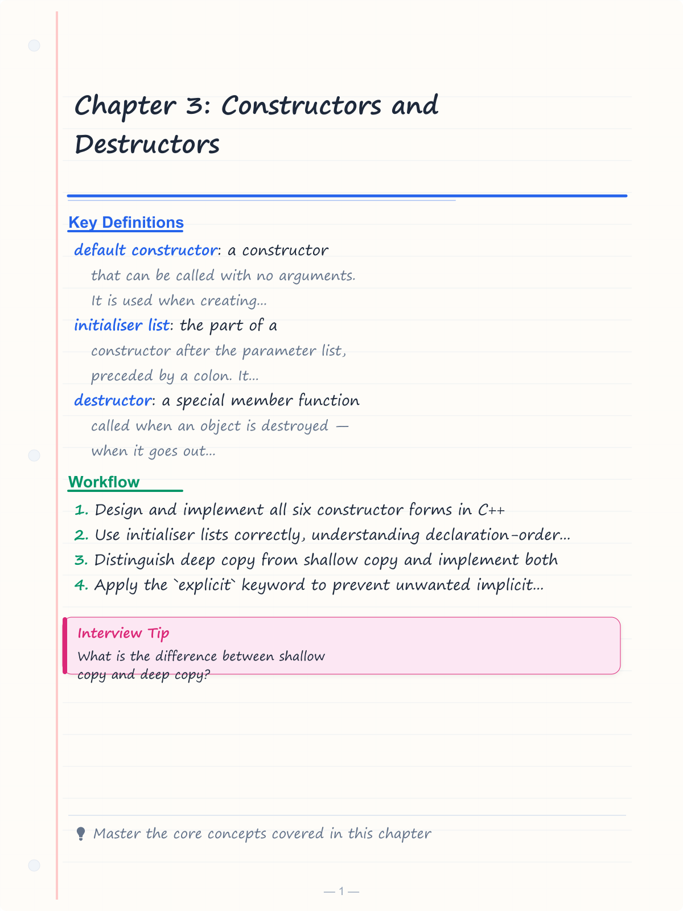
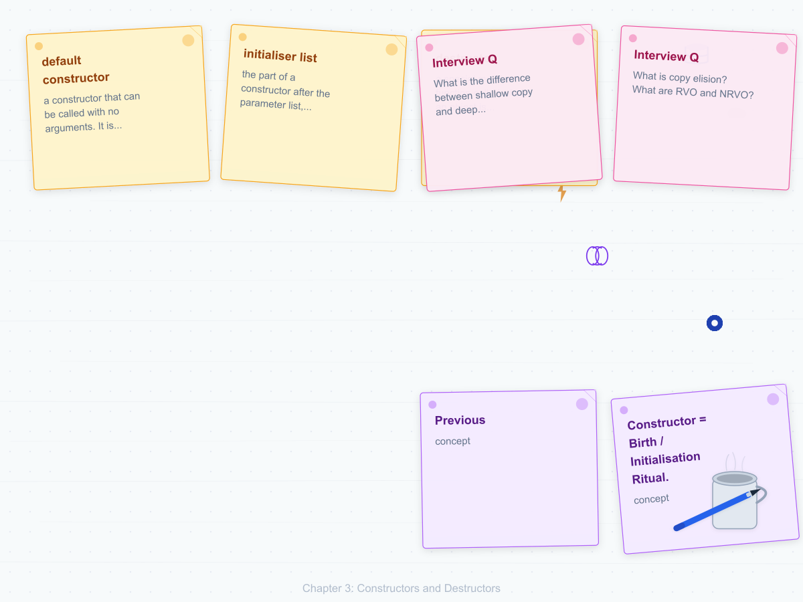
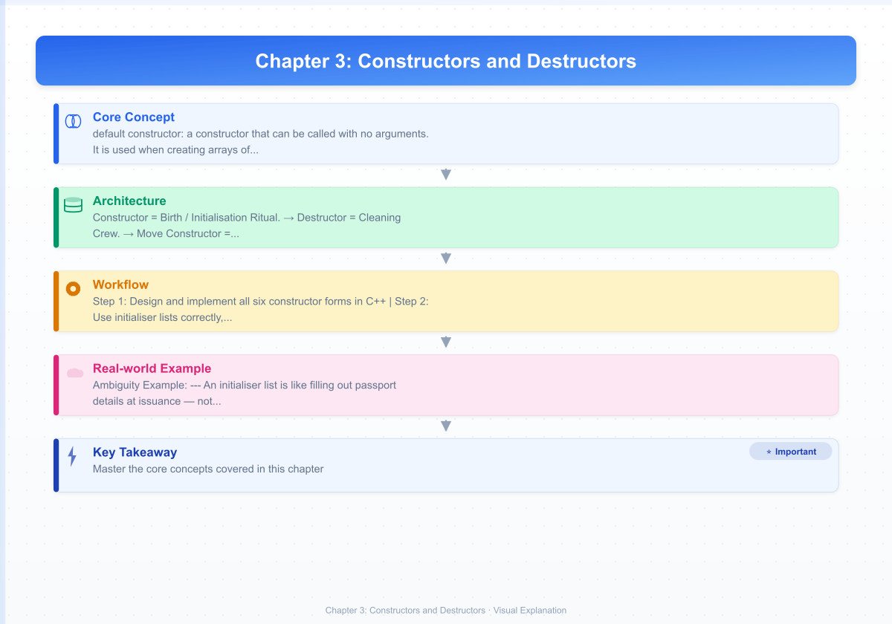

# Chapter 3: Constructors and Destructors

> **Previous:** [Classes and Objects](./02-classes-objects.md) | **Next:** [Inheritance](./04-inheritance.md)

## Learning Objectives

After studying this chapter, students will be able to:

<!-- Image Gallery -->
<section class="lesson-visuals" aria-label="Visual learning resources">
  <header><span>VISUAL LEARNING</span><h2>See it. Review it. Remember it.</h2></header>
  <a class="lesson-visual-card" href="../../assets/images/lessons/oop-cpp/03-constructors/handwritten-notes.png" target="_blank" rel="noopener">
    
    <span><strong>Handwritten notes</strong>Condensed notes for deliberate review.</span>
  </a>
  <a class="lesson-visual-card" href="../../assets/images/lessons/oop-cpp/03-constructors/sticky-notes.png" target="_blank" rel="noopener">
    
    <span><strong>Sticky-note revision</strong>Fast recall prompts for revision.</span>
  </a>
  <a class="lesson-visual-card" href="../../assets/images/lessons/oop-cpp/03-constructors/visual-explanation.png" target="_blank" rel="noopener">
    
    <span><strong>Visual concept guide</strong>A connected explanation of the key ideas.</span>
  </a>
</section>
<!-- End Image Gallery -->


- Design and implement all six constructor forms in C++
- Use initialiser lists correctly, understanding declaration-order rules
- Distinguish deep copy from shallow copy and implement both
- Apply the `explicit` keyword to prevent unwanted implicit conversions
- Implement delegating constructors to reduce code duplication
- Write destructors and understand why virtual destructors are necessary
- Apply the Rule of Three and the Rule of Five to resource-managing classes
- Analyse constructor/destructor invocation order and complexity
- Explain copy elision, RVO, and NRVO in interviews

## Core Analogy: Birth and the Cleaning Crew

Constructors and destructors mirror the lifecycle of any real-world entity:

**Constructor = Birth / Initialisation Ritual.** When a baby is born, a birth certificate is filled out (name, date, place). This is the constructor — it gives the object its initial state. Before the constructor runs, the object is raw memory. After it runs, the object is a valid, usable entity.

**Destructor = Cleaning Crew.** When you check out of a hotel room, the cleaning crew comes in to strip the beds, empty the trash, and lock the doors. The destructor is that crew — it runs automatically when the object's lifetime ends, releasing any resources it acquired.

**Move Constructor = Moving Truck.** Instead of copying all your furniture to a new house (expensive), a moving truck picks up your stuff and leaves your old house empty. The move constructor transfers ownership of resources from a source object to a new object, leaving the source in a valid-but-empty state.

**Analogy Reference Table:**

| C++ Concept | Real-World Analogy |
|-------------|-------------------|
| Default constructor | Newborn with blank records |
| Parameterised constructor | Custom order at a restaurant |
| Copy constructor | Photocopy machine — creates independent duplicate |
| Move constructor | Moving truck — transfers contents, leaves source empty |
| Destructor | Hotel cleaning crew after checkout |
| Virtual destructor | Universal fire alarm — works for all building types |
| Initialiser list | Filling passport details at issuance (not later) |
| `explicit` keyword | Bouncer checking ID — no automatic entry |

## Chapter at a Glance

| Topic | Key Insight | Practical Takeaway |
|-------|-------------|-------------------|
| Role of Constructors | Special member functions that initialise objects | Let constructors establish invariants; never leave object uninitialised |
| Default Constructor | Can be called with no arguments | Use `= default` when you need it alongside other constructors |
| Parameterised Constructors | Accept arguments for custom initialisation | Prefer initialiser lists over body assignment |
| Constructor Overloading | Multiple constructors with different signatures | Resolution follows overload resolution rules |
| Initialiser List | The only way to set `const`/reference members | Follows declaration order, not list order |
| `explicit` Keyword | Prevents implicit conversion via constructors | Mark single-argument constructors `explicit` by default |
| Delegating Constructors | One constructor calls another | Reduces duplication across overloads |
| Copy Constructor | Deep-copies resources owned by the source | Violating Rule of Three causes double-free bugs |
| Move Constructor | Transfers ownership efficiently | Mark `noexcept` for optimal performance in containers |
| Destructor | Releases resources on object destruction | Never throw from a destructor |
| Virtual Destructor | Ensures correct cleanup through base-class pointers | Polymorphic base classes MUST have virtual destructors |
| Rule of Three / Five | If you write one of {destructor, copy ctor, copy assign}, write all three | Add move operations for Rule of Five |

## Chapter Roadmap


---

## 3.1 Default Constructor

### Real-World Analogy


A default constructor is like a **blank birth certificate**. When a baby is born in a hospital, the staff fills out a form with default values — date of birth, place, weight. These defaults are sensible starting points even without any custom input.

### Definition


A **default constructor** is a constructor that can be called with **no arguments**. It is used when creating arrays of objects, STL containers, or when using `new` without initialisers.

### Key Rules


1. If a class declares **no constructors at all**, the compiler generates a default constructor that default-initialises all members.
2. If **any** user-defined constructor exists, the compiler-supplied default is **suppressed**.
3. Use `= default` to request the compiler-generated version explicitly.
4. Built-in types (int, double, pointer) remain **uninitialised** in compiler-generated default constructors — reading them is undefined behaviour.

### Pseudocode


```
CLASS ClassName
    DEFAULT CONSTRUCTOR:
        Initialise each member to its default value
    END CONSTRUCTOR
END CLASS
```

### C++ Code with Output


```cpp
#include <iostream>

class Student {
public:
    // Default constructor
    Student() : name_("Unknown"), id_(-1), gpa_(0.0) {
        std::cout << "Default constructor called for " << name_ << "\n";
    }

    void display() const {
        std::cout << "Name: " << name_ << ", ID: " << id_
                  << ", GPA: " << gpa_ << "\n";
    }

private:
    std::string name_;
    int id_;
    double gpa_;
};

int main() {
    Student s1;
    s1.display();

    Student* s2 = new Student;
    s2->display();
    delete s2;

    Student arr[3];
    return 0;
}
```

**Output:**
```
Default constructor called for Unknown
Name: Unknown, ID: -1, GPA: 0
Default constructor called for Unknown
Name: Unknown, ID: -1, GPA: 0
Default constructor called for Unknown
Default constructor called for Unknown
Default constructor called for Unknown
```

### Dry Run Trace: Default Constructor


| Step | Action | Object | name_ | id_ | gpa_ |
|------|--------|--------|-------|-----|------|
| 1 | `Student s1;` | s1 | Raw memory | Raw memory | Raw memory |
| 2 | Enter default ctor | s1 | Raw memory | Raw memory | Raw memory |
| 3 | Init list: `name_("Unknown")` | s1 | "Unknown" | Raw memory | Raw memory |
| 4 | Init list: `id_(-1)` | s1 | "Unknown" | -1 | Raw memory |
| 5 | Init list: `gpa_(0.0)` | s1 | "Unknown" | -1 | 0.0 |
| 6 | Body: cout runs | s1 | "Unknown" | -1 | 0.0 |
| 7 | `s1.display()` | s1 | "Unknown" | -1 | 0.0 |
| 8 | `new Student` | *s2 | "Unknown" | -1 | 0.0 |
| 9 | `delete s2` | *s2 | Destructor called | — | — |
| 10 | `Student arr[3]` | arr[0..2] | "Unknown" (x3) | -1 (x3) | 0.0 (x3) |

### Complexity Analysis


| Operation | Time | Why |
|-----------|------|-----|
| Trivial default ctor (compiler-generated, no work) | O(1) | No members need construction |
| Non-trivial default ctor (with string/map members) | O(m) | Each member's constructor runs (m = number of members) |
| Array of N objects with default ctor | O(N * m) | Each element is individually constructed |
| Heap allocation + default ctor | O(N * m) + alloc overhead | Same as array but with dynamic memory overhead |

### When the Compiler Suppresses the Default Constructor


```cpp
class Widget {
public:
    Widget(int id) : id_(id) {}
    // NO default constructor — compiler suppresses
    // Widget w; is an error
private:
    int id_;
};
```

**Fix:** Use `= default` or explicitly define it:

```cpp
class Widget {
public:
    Widget() = default;
    Widget(int id) : id_(id) {}
private:
    int id_ = 0;
};

Widget w;           // OK
Widget arr[10];     // OK
```

### Default Member Initialisers (C++11)


Provide per-member defaults:

```cpp
class Point {
private:
    double x_ = 0.0;
    double y_ = 0.0;
    int label_ = -1;
};
```

> **Pro Tip:** Always provide default member initialisers for built-in types. Without them, the compiler-generated default constructor leaves them uninitialised — reading them is undefined behaviour.

---

## 3.2 Parameterised Constructor

### Real-World Analogy


A parameterised constructor is like a **custom order at a restaurant**. Instead of getting the chef's special (default), you specify exactly what you want — medium-rare steak, extra mushrooms, no onions. The kitchen (constructor) receives your parameters and prepares your specific dish.

### Definition


A **parameterised constructor** accepts arguments that customise the object's initial state. It bypasses the all-defaults state and establishes a caller-specified invariant.

### Pseudocode


```
CLASS ClassName
    PARAMETERISED CONSTRUCTOR(type1 param1, type2 param2, ...):
        Initialise members with parameter values
    END CONSTRUCTOR
END CLASS
```

### C++ Code with Output


```cpp
#include <iostream>
#include <string>

class Book {
public:
    Book(const std::string& title, const std::string& author, int year)
        : title_(title), author_(author), year_(year) {
        std::cout << "Parameterised ctor: \"" << title_
                  << "\" by " << author_ << "\n";
    }

    void display() const {
        std::cout << "\"" << title_ << "\" - " << author_
                  << " (" << year_ << ")\n";
    }

private:
    std::string title_;
    std::string author_;
    int year_;
};

int main() {
    Book b1("1984", "George Orwell", 1949);
    Book b2("Dune", "Frank Herbert", 1965);
    b1.display();
    b2.display();
    return 0;
}
```

**Output:**
```
Parameterised ctor: "1984" by George Orwell
Parameterised ctor: "Dune" by Frank Herbert
"1984" - George Orwell (1949)
"Dune" - Frank Herbert (1965)
```

### Dry Run Trace: Parameterised Constructor


| Step | Action | Object | title_ | author_ | year_ |
|------|--------|--------|--------|---------|-------|
| 1 | `Book b1("1984", "George Orwell", 1949)` | b1 | Raw memory | Raw memory | Raw memory |
| 2 | Enter ctor | b1 | Raw | Raw | Raw |
| 3 | Init: `title_("1984")` | b1 | "1984" | Raw | Raw |
| 4 | Init: `author_("George Orwell")` | b1 | "1984" | "George Orwell" | Raw |
| 5 | Init: `year_(1949)` | b1 | "1984" | "George Orwell" | 1949 |
| 6 | Body: cout runs | b1 | "1984" | "George Orwell" | 1949 |
| 7 | `b1.display()` | b1 | Output printed | — | — |

### Parameterised with Default Arguments


```cpp
#include <iostream>
#include <string>

class Config {
public:
    Config(int timeout = 30, int retries = 3, bool logging = true)
        : timeout_(timeout), retries_(retries), logging_(logging) {
        std::cout << "Config(timeout=" << timeout_ << ", retries="
                  << retries_ << ", logging=" << logging_ << ")\n";
    }
private:
    int timeout_;
    int retries_;
    bool logging_;
};

int main() {
    Config c1;
    Config c2(60);
    Config c3(60, 5);
    Config c4(60, 5, false);
    return 0;
}
```

**Output:**
```
Config(timeout=30, retries=3, logging=1)
Config(timeout=60, retries=3, logging=1)
Config(timeout=60, retries=5, logging=1)
Config(timeout=60, retries=5, logging=0)
```

### Complexity Analysis


| Operation | Time | Why |
|-----------|------|-----|
| Parameterised ctor for POD types | O(1) | Simple member-wise initialisation |
| Parameterised ctor with std::string | O(S) | S = length of string (copy/allocate) |
| Parameterised ctor with container | O(N + C) | N = elements copied, C = container overhead |
| Array of objects with parameterised ctor | O(N * M) | N elements, each with M construction cost |

---

## 3.3 Constructor Overloading

### Real-World Analogy


Constructor overloading is like a **multi-function remote control**. The same remote can control the TV, the soundbar, and the AC — you press different button sequences (different parameter lists) to achieve different results. Similarly, a class can have multiple constructors, each with a distinct parameter list.

### Definition


**Constructor overloading** allows a class to have **multiple constructors with different signatures** (different number or types of parameters). The compiler selects the appropriate constructor based on the arguments provided, following **overload resolution** rules.

### Pseudocode


```
CLASS ClassName
    CONSTRUCTOR()                      Default
    CONSTRUCTOR(type1 a)               Single parameter
    CONSTRUCTOR(type1 a, type2 b)      Two parameters
    CONSTRUCTOR(type1 a, type2 b, type3 c)  Three parameters
END CLASS
```

### C++ Code with Output


```cpp
#include <iostream>
#include <string>
#include <vector>

class Message {
public:
    // 1. Default constructor
    Message() : sender_("system"), content_(""), priority_(0) {
        std::cout << "Message() - empty system message\n";
    }

    // 2. Single-parameter constructor
    explicit Message(const std::string& text)
        : sender_("system"), content_(text), priority_(0) {
        std::cout << "Message(string) - system message\n";
    }

    // 3. Two-parameter constructor
    Message(const std::string& sender, const std::string& text)
        : sender_(sender), content_(text), priority_(0) {
        std::cout << "Message(string,string) - from " << sender_ << "\n";
    }

    // 4. Three-parameter constructor
    Message(const std::string& sender, const std::string& text, int priority)
        : sender_(sender), content_(text), priority_(priority) {
        std::cout << "Message(string,string,int) - priority " << priority_ << "\n";
    }

    // 5. Constructor with initializer_list
    Message(std::initializer_list<std::string> words)
        : sender_("system"), priority_(0) {
        for (const auto& w : words) content_ += w + " ";
        std::cout << "Message(initializer_list)\n";
    }

    void display() const {
        std::cout << "[" << sender_ << "] " << content_
                  << " (priority " << priority_ << ")\n";
    }

private:
    std::string sender_;
    std::string content_;
    int priority_;
};

int main() {
    Message m1;
    Message m2("Hello");
    Message m3("Alice", "Meeting at 3");
    Message m4("Bob", "Urgent!", 5);
    Message m5({"Hello", "World", "Test"});

    std::cout << "\n--- Messages ---\n";
    m1.display();
    m2.display();
    m3.display();
    m4.display();
    m5.display();
    return 0;
}
```

**Output:**
```
Message() - empty system message
Message(string) - system message
Message(string,string) - from Alice
Message(string,string,int) - priority 5
Message(initializer_list)

--- Messages ---
[system]  (priority 0)
[system] Hello (priority 0)
[Alice] Meeting at 3 (priority 0)
[Bob] Urgent! (priority 5)
[system] Hello World Test  (priority 0)
```

### Overload Resolution Table


| Call | Viable Ctors | Selected | Reason |
|------|-------------|----------|--------|
| `Message()` | (1) | (1) | Exact match — no args |
| `Message("Hello")` | (2), (3), (5) | (2) | Best match: char* -> string |
| `Message("A","B")` | (3), (5) | (3) | Exact match, two strings |
| `Message("A","B",5)` | (4) | (4) | Exact match, three args |
| `Message({"A","B","C"})` | (5) | (5) | initializer_list exact match |

### Ambiguity Example


```cpp
struct Ambiguous {
    Ambiguous(int a, double b) {}
    Ambiguous(double a, int b) {}
};

// Ambiguous a1(1, 2);    // ERROR: ambiguous
Ambiguous a2(1, 2.0);       // OK: first ctor
Ambiguous a3(1.0, 2);       // OK: second ctor
```

### Complexity Analysis


| Operation | Time | Why |
|-----------|------|-----|
| Overload resolution | Compile-time | No runtime cost |
| Constructor execution | Depends on overload | Same as parameterised ctor cost |

---

## 3.4 Initialiser List

### Real-World Analogy


An initialiser list is like **filling out passport details at issuance** — not later. When you get a passport, your name, DOB, and place of birth are set right then. You cannot "update" your place of birth later (like a `const` member). The initialiser list is the only chance to set certain values.

### Definition


The **initialiser list** is the part of a constructor after the parameter list, preceded by a colon. It directly initialises members before the constructor body executes.

### Syntax and Rules


```cpp
class ClassName {
public:
    ClassName(parameters)
        : member1(value1),       // Initialiser list
          member2(value2),
          const_member(value3),  // MUST be here
          ref_member(value4)     // MUST be here
    {
        // Body — members already initialised
    }
};
```

**Critical Rules:**
1. `const` members **must** be in the initialiser list.
2. Reference members **must** be in the initialiser list.
3. Base class constructors are called via the initialiser list.
4. Initialisation follows **declaration order** in the class, not list order.
5. Members not listed are default-initialised.

### C++ Code with Output


```cpp
#include <iostream>
#include <string>

class Employee {
public:
    Employee(const std::string& name, int id, double salary)
        : kMinSalary_(30000),     // const — MUST be in init list
          name_(name),
          id_(id),
          salary_(salary)
    {
        std::cout << "Employee " << name_ << " created (ID: " << id_ << ")\n";
    }

    void display() const {
        std::cout << name_ << " | ID: " << id_
                  << " | $" << salary_
                  << " | Min: $" << kMinSalary_ << "\n";
    }

private:
    const int kMinSalary_;
    std::string name_;
    int id_;
    double salary_;
};

int main() {
    Employee e("Alice", 1001, 75000.0);
    e.display();
    return 0;
}
```

**Output:**
```
Employee Alice created (ID: 1001)
Alice | ID: 1001 | $75000 | Min: $30000
```

### What Happens Without Initialiser List?


```cpp
class Broken {
public:
    Broken(int x) {
        x_ = x;   // ASSIGNMENT — x_ was default-initialised (garbage) first
    }
private:
    // const int cx_;  // ERROR: must be in init list
    // int& ref_;      // ERROR: must be in init list
    int x_;
};
```

### Performance Impact


Without init list, members are **constructed twice**:

```cpp
class Slow {
public:
    Slow(const std::string& s) {
        s_ = s;  // Step 1: default-construct s_ (empty)
                 // Step 2: assign s_ (allocate + copy)
    }
private:
    std::string s_;
};

class Fast {
public:
    Fast(const std::string& s) : s_(s) {}  // One direct construction
private:
    std::string s_;
};
```

`Slow`: One default construction + one assignment (potential second allocation). `Fast`: One direct construction — optimal.

### Declaration Order Trap


```cpp
#include <iostream>

class Trap {
public:
    Trap(int val) : y_(val), x_(y_ + 1) {
        // x_ is declared FIRST, so it initialises FIRST
        // x_ gets uninitialised y_ + 1 !!!
    }

    void display() const {
        std::cout << "x_ = " << x_ << ", y_ = " << y_ << "\n";
    }

private:
    int x_;    // DECLARED first — initialised FIRST
    int y_;
};

int main() {
    Trap t(10);
    t.display();  // x_ = garbage, y_ = 10
    return 0;
}
```

**Output (undefined behaviour):**
```
x_ = 32767, y_ = 10
```

**THE RULE:** Members initialised in **declaration order**, regardless of initialiser list order.

### Initialiser List vs Assignment Comparison


| Aspect | Initialiser List | Body Assignment |
|--------|-----------------|-----------------|
| When it runs | Before body | Inside body |
| `const` members | Required | Impossible |
| Reference members | Required | Impossible |
| `std::string` member | 1 construction | 2 ops (default ctor + assign) |
| Base class init | Required | Impossible |
| Delegation | Possible | Not possible |
| Exception safety | Safer | Partially-constructed risk |
| Performance | Direct initialisation | Default + assign overhead |

### Complexity Analysis


| Operation | Time | Why |
|-----------|------|-----|
| Init list with POD | O(1) | Direct memory write |
| Init list with std::string | O(S) | One allocation + copy |
| Body assignment | O(S) + alloc | Default ctor (free) + assignment (copy) |

---

## 3.5 The `explicit` Keyword

### Real-World Analogy


The `explicit` keyword is like a **bouncer checking ID**. Without a bouncer, anyone who looks old enough can walk in — that is implicit conversion. With a bouncer (explicit), only people with valid ID are allowed. The `explicit` keyword prevents the compiler from using a constructor for **implicit conversions**.

### Definition


The `explicit` keyword prevents single-argument constructors (and multi-argument ones in C++11) from being used for **implicit conversions** or **copy-initialisation**.

### The Problem: Implicit Conversion


```cpp
#include <iostream>
#include <string>

class URL {
public:
    URL(const std::string& address)
        : address_(address), validated_(false) {}

private:
    std::string address_;
    bool validated_;
};

void navigate(URL u) {}

int main() {
    // Implicit conversion: string literal -> std::string -> URL
    navigate("https://example.com");  // Compiles! But is this intended?
    URL u2 = "https://google.com";    // Also works implicitly
    return 0;
}
```

### The Solution: `explicit`


```cpp
#include <iostream>
#include <string>

class URL {
public:
    explicit URL(const std::string& address)
        : address_(address), validated_(false) {}

private:
    std::string address_;
    bool validated_;
};

void navigate(URL u) {}

int main() {
    URL u1("https://example.com");    // OK: direct init
    // navigate("https://example.com");  // ERROR
    navigate(URL("https://example.com"));  // OK: explicit conversion
    // URL u2 = "https://google.com";  // ERROR: copy-init requires implicit
    return 0;
}
```

### `explicit` on Multi-Argument Constructors (C++11)


```cpp
struct Point {
    explicit Point(double x, double y) : x_(x), y_(y) {}
    double x_, y_;
};

Point p1(3.0, 4.0);     // OK
// Point p2 = {3.0, 4.0}; // ERROR (since C++14 with explicit)
```

### When to Use `explicit`


| Scenario | Recommendation | Rationale |
|----------|---------------|-----------|
| Single-argument constructor | Always `explicit` | Prevents accidental conversions |
| Multi-argument constructor | Usually not needed | Rarely used for implicit conversion |
| Copy/move constructor | NEVER explicit | Breaks pass-by-value semantics |
| Conversion operator | Usually explicit | Prevents boolean-context surprises |

### Complexity Analysis


| Operation | Time | Why |
|-----------|------|-----|
| `explicit` keyword | O(1) compile-time | Zero runtime cost |
| Implicit conversion | Same as ctor cost | Conversion + construction |
| Explicit cast `T(args)` | Same as ctor cost | No runtime difference |

---

## 3.6 Delegating Constructors

### Real-World Analogy


Delegating constructors are like a **call center escalation system**. A junior agent handles what they can, then **delegates** to a senior agent with more authority who completes the resolution. In C++, one constructor can delegate core initialisation work to another constructor.

### Definition


A **delegating constructor** calls another constructor of the same class from its initialiser list, eliminating code duplication when multiple constructors share common logic.

### Rules


1. Delegation occurs in the initialiser list, not the body.
2. The **target constructor** runs **first**.
3. Then the **delegating constructor's body** executes.
4. Cycles are prohibited (compile error).
5. A delegating constructor cannot have its own member initialiser list.

### C++ Code with Output


```cpp
#include <iostream>
#include <string>

class Employee {
public:
    // Primary constructor — does all the work
    Employee(const std::string& name, int id, double salary)
        : name_(name), id_(id), salary_(salary) {
        std::cout << ">> Primary ctor: " << name_
                  << " (ID:" << id_ << ", $" << salary_ << ")\n";
    }

    // Delegating: 2-arg -> 3-arg
    Employee(const std::string& name, int id)
        : Employee(name, id, 0.0) {
        std::cout << ">> Delegating ctor(2 args)\n";
    }

    // Delegating: 1-arg -> 3-arg
    explicit Employee(const std::string& name)
        : Employee(name, -1, 0.0) {
        std::cout << ">> Delegating ctor(1 arg)\n";
    }

    // Delegating: 0-arg -> 3-arg
    Employee()
        : Employee("Unknown", -1, 0.0) {
        std::cout << ">> Delegating ctor(0 args)\n";
    }

    void display() const {
        std::cout << name_ << " | ID: " << id_
                  << " | $" << salary_ << "\n";
    }

private:
    std::string name_;
    int id_;
    double salary_;
};

int main() {
    std::cout << "--- e1 (0 args) ---\n";
    Employee e1;

    std::cout << "\n--- e2 (1 arg) ---\n";
    Employee e2("Alice");

    std::cout << "\n--- e3 (2 args) ---\n";
    Employee e3("Bob", 1001);

    std::cout << "\n--- e4 (3 args) ---\n";
    Employee e4("Charlie", 1002, 75000.0);

    std::cout << "\n--- Final ---\n";
    e1.display();
    e2.display();
    e3.display();
    e4.display();
    return 0;
}
```

**Output:**
```
--- e1 (0 args) ---
>> Primary ctor: Unknown (ID:-1, $0)
>> Delegating ctor(0 args)

--- e2 (1 arg) ---
>> Primary ctor: Alice (ID:-1, $0)
>> Delegating ctor(1 arg)

--- e3 (2 args) ---
>> Primary ctor: Bob (ID:1001, $0)
>> Delegating ctor(2 args)

--- e4 (3 args) ---
>> Primary ctor: Charlie (ID:1002, $75000)

--- Final ---
Unknown | ID: -1 | $0
Alice | ID: -1 | $0
Bob | ID: 1001 | $0
Charlie | ID: 1002 | $75000
```

### Dry Run Trace: Delegation


For `Employee e2("Alice")`:

| Step | Constructor | Action | name_ | id_ | salary_ |
|------|-------------|--------|-------|-----|---------|
| 1 | Delegating(1 arg) | Enter | Raw | Raw | Raw |
| 2 | Delegating(1 arg) | Delegates to primary | — | — | — |
| 3 | Primary ctor | Enter | Raw | Raw | Raw |
| 4 | Primary ctor | Init `name_("Alice")` | "Alice" | Raw | Raw |
| 5 | Primary ctor | Init `id_(-1)` | "Alice" | -1 | Raw |
| 6 | Primary ctor | Init `salary_(0.0)` | "Alice" | -1 | 0.0 |
| 7 | Primary ctor | Body: cout | "Alice" | -1 | 0.0 |
| 8 | Primary ctor | Returns | "Alice" | -1 | 0.0 |
| 9 | Delegating(1 arg) | Body: cout | "Alice" | -1 | 0.0 |

### Cycle Detection


```cpp
struct Cycle {
    Cycle() : Cycle(0) {}       // Delegates
    Cycle(int x) : Cycle() {}   // back — CYCLE!
};
// Compile error: delegation cycle
```

### Complexity Analysis


| Operation | Time | Why |
|-----------|------|-----|
| Delegating ctor (trivial) | Same as target | Target runs first, then delegating body |
| Chain N deep | O(N + target_cost) | Each adds body overhead |
| Cycle detection | Compile-time | Caught before code generation |

---

## 3.7 Copy Constructor (Deep vs Shallow)

### Real-World Analogy


A copy constructor is like a **photocopy machine**.

- **Shallow copy**: Like giving someone a photocopy of a map that just says "look at my map" — both people think they have the map, but they are actually sharing the same physical paper. If one person draws on it, the other sees it too.
- **Deep copy**: Like giving someone a fully independent photocopy of the actual map — each person has their own physical paper. Drawing on one does not affect the other.

### Definition


The **copy constructor** creates a new object as a **copy** of an existing object. It takes a single argument of type `const T&` (or `T&`).

**Signature:** `ClassName(const ClassName& other);`

### When the Copy Constructor Is Called


1. **Pass by value**: `void func(MyClass obj);` called with `func(existing);`
2. **Return by value**: `MyClass func() { MyClass obj; return obj; }`
3. **Copy initialisation**: `MyClass obj2 = obj1;`
4. **Brace initialisation**: `MyClass obj2{obj1};`
5. **Throw/catch exceptions**: Throwing or catching by value copies.

### The Shallow Copy Problem


```cpp
#include <iostream>
#include <cstring>

class ShallowString {
public:
    ShallowString(const char* s) {
        data_ = new char[std::strlen(s) + 1];
        std::strcpy(data_, s);
        std::cout << "Ctor: allocated at " << (void*)data_ << "\n";
    }

    // NO copy constructor — compiler generates shallow copy!

    ~ShallowString() {
        std::cout << "Dtor: deleting " << (void*)data_ << "\n";
        delete[] data_;
    }

    const char* c_str() const { return data_; }

private:
    char* data_;
};

int main() {
    ShallowString s1("Hello");
    ShallowString s2 = s1;  // Shallow copy — s2.data_ points to SAME memory

    std::cout << "s1: " << s1.c_str() << "\n";
    std::cout << "s2: " << s2.c_str() << "\n";

    // Destructor runs for s2, then s1 — double free!
    return 0;
}  // CRASH: double free or corruption
```

**Output (crash):**
```
Ctor: allocated at 0x1a2b3c4d
s1: Hello
s2: Hello
Dtor: deleting 0x1a2b3c4d
Dtor: deleting 0x1a2b3c4d
*** double free or corruption ***
```

### The Deep Copy Solution


```cpp
#include <iostream>
#include <cstring>
#include <algorithm>

class DeepString {
public:
    // Parameterised constructor
    DeepString(const char* s)
        : size_(std::strlen(s)), data_(new char[size_ + 1]) {
        std::strcpy(data_, s);
        std::cout << "Ctor: " << (void*)data_ << " [" << data_ << "]\n";
    }

    // COPY CONSTRUCTOR — deep copy
    DeepString(const DeepString& other)
        : size_(other.size_), data_(new char[other.size_ + 1]) {
        std::strcpy(data_, other.data_);
        std::cout << "Copy ctor: " << (void*)data_
                  << " <- " << (void*)other.data_ << "\n";
    }

    // Destructor
    ~DeepString() {
        std::cout << "Dtor: deleting " << (void*)data_
                  << " [" << data_ << "]\n";
        delete[] data_;
    }

    const char* c_str() const { return data_; }

private:
    size_t size_;
    char* data_;
};

void printByValue(DeepString s) {
    std::cout << "printByValue: " << s.c_str() << "\n";
}

int main() {
    DeepString s1("Hello");
    DeepString s2 = s1;  // Copy ctor — independent copy

    std::cout << "--- Calling printByValue ---\n";
    printByValue(s1);

    std::cout << "--- End of main ---\n";
    return 0;
}
```

**Output:**
```
Ctor: 0x1a2b3c4d [Hello]
Copy ctor: 0x5e6f7a8b <- 0x1a2b3c4d
--- Calling printByValue ---
Copy ctor: 0x9c0d1e2f <- 0x1a2b3c4d
printByValue: Hello
Dtor: deleting 0x9c0d1e2f [Hello]
--- End of main ---
Dtor: deleting 0x5e6f7a8b [Hello]
Dtor: deleting 0x1a2b3c4d [Hello]
```

### Memory Diagram: Deep vs Shallow Copy


**Shallow Copy:**
```
s1.data_ ──> [ H | e | l | l | o | \0 ]  ←── s2.data_ (SAME block)
```
Both `s1.data_` and `s2.data_` point to the identical memory address. When `s2` destructor runs, it deletes the block. When `s1` destructor runs, it deletes the **same** block → double free.

**Deep Copy:**
```
s1.data_ ──> [ H | e | l | l | o | \0 ]
s2.data_ ──> [ H | e | l | l | o | \0 ]  (DIFFERENT block, same content)
```
Each object owns its own memory block. Destructors delete independent blocks — safe.

### Dry Run Trace: Deep Copy


| Step | Action | Object | data_ points to | Notes |
|------|--------|--------|-----------------|-------|
| 1 | `DeepString s1("Hello")` | s1 | 0x100 (alloc) | Ctor runs, allocates |
| 2 | `DeepString s2 = s1` | s2 | 0x200 (alloc) | Copy ctor: NEW allocation + copy |
| 3 | `printByValue(s1)` | param | 0x300 (alloc) | Copy ctor for pass-by-value |
| 4 | Inside printByValue | param | 0x300 | Uses the copy |
| 5 | Return from printByValue | param | freed | Destructor for param |
| 6 | End of main: ~s2 | s2 | freed | Destructor: delete 0x200 |
| 7 | End of main: ~s1 | s1 | freed | Destructor: delete 0x100 |

**Total allocations: 3. Total deletions: 3. No double free.**

### Copy Elision and RVO / NRVO


C++ compilers are allowed to **elide** (skip) copy constructor calls even if the copy constructor has side effects.

**RVO (Return Value Optimisation):** When a function returns a temporary, the compiler constructs it directly in the caller's destination.

**NRVO (Named Return Value Optimisation):** When a function returns a named local variable, the compiler constructs it directly in the caller's destination.

```cpp
#include <iostream>

struct Heavy {
    Heavy() { std::cout << "Default ctor\n"; }
    Heavy(const Heavy&) { std::cout << "Copy ctor\n"; }
    Heavy(Heavy&&) noexcept { std::cout << "Move ctor\n"; }
    ~Heavy() { std::cout << "Dtor\n"; }
};

Heavy makeHeavy() {
    return Heavy();   // RVO: constructs directly in caller
}

Heavy makeHeavyNamed() {
    Heavy h;
    return h;         // NRVO: constructs h directly in caller
}

int main() {
    std::cout << "--- RVO ---\n";
    Heavy h1 = makeHeavy();       // No copy! (if RVO applies)
    std::cout << "--- NRVO ---\n";
    Heavy h2 = makeHeavyNamed();  // No copy! (if NRVO applies)
    return 0;
}
```

**Output (with optimisations enabled):**
```
--- RVO ---
Default ctor
--- NRVO ---
Default ctor
Dtor
Dtor
```

**Without optimisations** (or when elision is not possible), a move is attempted first, then copy:

```
--- RVO ---
Default ctor
--- NRVO ---
Default ctor
Move ctor    // Fallback: move
Dtor         // ~h (the moved-from object)
Dtor
```

### `= delete` — Prohibiting Copy


```cpp
class NonCopyable {
public:
    NonCopyable() = default;

    // Prohibit copying
    NonCopyable(const NonCopyable&) = delete;
    NonCopyable& operator=(const NonCopyable&) = delete;
};
```

### Complexity Analysis


| Operation | Time | Why |
|-----------|------|-----|
| Shallow copy (trivial) | O(1) | Copies pointer value only |
| Deep copy (N bytes) | O(N) | Must allocate and copy N bytes |
| Copy elision (RVO/NRVO) | O(0) | Zero copies — elided entirely |
| Pass-by-value copy | O(N) | Full deep copy of resources |
| `= delete` | O(1) compile-time | No runtime effect |

---

## 3.8 Move Constructor

### Real-World Analogy


A move constructor is like a **moving truck**. Instead of copying all your furniture to a new house (expensive — like a deep copy), the truck picks up your furniture and leaves your old house empty. The new house now has all the furniture; the old house is empty. That is exactly what the move constructor does — it **transfers ownership** of resources, leaving the source in a **valid-but-empty** state.

### Definition


The **move constructor** transfers resources from a source (temporary) object to a newly constructed object, avoiding expensive deep copies. It takes an rvalue reference parameter.

**Signature:** `ClassName(ClassName&& other) noexcept;`

### Key Properties


1. **Steals resources** from the source (copies the pointer, does not allocate new memory).
2. **Leaves source in valid-but-empty state** (source pointer set to nullptr).
3. **Must be `noexcept`** — critical for STL containers to use move instead of copy during reallocation.
4. **Automatically used** when the argument is an rvalue (temporary) or when `std::move()` is applied.

### C++ Code with Output


```cpp
#include <iostream>
#include <cstring>

class DynamicBuffer {
public:
    // Parameterised constructor
    DynamicBuffer(size_t size)
        : size_(size), data_(new char[size]) {
        std::fill(data_, data_ + size, 'A');
        std::cout << "Ctor: " << size << " bytes at " << (void*)data_ << "\n";
    }

    // Copy constructor (expensive — deep copy)
    DynamicBuffer(const DynamicBuffer& other)
        : size_(other.size_), data_(new char[other.size_]) {
        std::copy(other.data_, other.data_ + size_, data_);
        std::cout << "Copy ctor: " << size_ << " bytes\n";
    }

    // Move constructor (cheap — pointer swap)
    DynamicBuffer(DynamicBuffer&& other) noexcept
        : size_(other.size_), data_(other.data_) {
        other.data_ = nullptr;   // Leave source empty
        other.size_ = 0;
        std::cout << "Move ctor: stole " << (void*)data_ << "\n";
    }

    // Destructor
    ~DynamicBuffer() {
        if (data_) {
            std::cout << "Dtor: deleting " << (void*)data_ << "\n";
            delete[] data_;
        } else {
            std::cout << "Dtor: empty (nullptr)\n";
        }
    }

private:
    size_t size_;
    char* data_;
};

DynamicBuffer createBuffer(size_t n) {
    DynamicBuffer buf(n);
    return buf;  // Move (or NRVO) — not copy
}

int main() {
    std::cout << "--- Create buffer ---\n";
    DynamicBuffer b1(100);

    std::cout << "\n--- Copy b1 -> b2 ---\n";
    DynamicBuffer b2 = b1;           // Copy: b1 stays alive

    std::cout << "\n--- Move b1 -> b3 ---\n";
    DynamicBuffer b3 = std::move(b1); // Move: b1 becomes empty

    std::cout << "\n--- Return from function ---\n";
    DynamicBuffer b4 = createBuffer(50);  // Move or RVO

    std::cout << "\n--- End of main ---\n";
    return 0;
}
```

**Output:**
```
--- Create buffer ---
Ctor: 100 bytes at 0x100

--- Copy b1 -> b2 ---
Copy ctor: 100 bytes

--- Move b1 -> b3 ---
Move ctor: stole 0x100
Dtor: empty (nullptr)    [~b1's original data_ was moved]

--- Return from function ---
Ctor: 50 bytes at 0x200
Move ctor: stole 0x200
Dtor: empty (nullptr)

--- End of main ---
Dtor: deleting 0x200     [~b4]
Dtor: deleting 0x300     [~b3's copy of data]
Dtor: empty (nullptr)    [~b1 — was moved-from]
```

### Move vs Copy: Performance Comparison


| Aspect | Copy Constructor | Move Constructor |
|--------|-----------------|-----------------|
| Allocation | Allocates new memory | No allocation |
| Data transfer | Copies N bytes (O(N)) | Copies pointer (O(1)) |
| Source state | Unchanged | Valid-but-empty |
| `noexcept` | Optional | Strongly recommended |
| Speed (N = 1MB) | ~1ms (copy 1MB) | ~1ns (copy pointer) |

### Why `noexcept` Matters for Move


STL containers like `std::vector` check `std::is_nothrow_move_constructible`. If move is `noexcept`, the vector uses move during reallocation. If not, it falls back to copy, which is much slower.

```cpp
// Without noexcept, vector will COPY instead of MOVE during reallocation
struct MaybeMove {
    MaybeMove() = default;
    MaybeMove(MaybeMove&&) { /* NOT noexcept */ }
};

std::vector<MaybeMove> v;
v.push_back(MaybeMove{});  // May copy instead of move during reallocation!
```

### Complexity Analysis


| Operation | Time | Why |
|-----------|------|-----|
| Move ctor (pointer + size) | O(1) | Copies two integers (pointer, size) |
| Move ctor for std::vector | O(1) | Transfers internal pointers, no element copy |
| Copy ctor fallback (no noexcept) | O(N) | Vector must copy elements during growth |
| Move + delete source | O(1) + dtor | Dtor of moved-from: null check + no-op |

---

## 3.9 Destructor

### Real-World Analogy


A destructor is like the **hotel cleaning crew after checkout**. When you leave a hotel room, the cleaning crew automatically strips the beds, empties the trash, and secures the room. You do not need to call them — they come automatically. Similarly, a C++ destructor runs **automatically** when an object's lifetime ends, releasing any resources the object acquired.

### Definition


The **destructor** is a special member function called when an object is destroyed — when it goes out of scope (stack), when `delete` is invoked (heap), or when a container is destroyed. Its name is `~ClassName`, it takes no parameters, returns nothing, and must be `noexcept`.

**Signature:** `~ClassName() noexcept;`

### Key Properties


1. **Deterministic**: Runs at a well-defined point (end of scope, `delete` call).
2. **Automatic**: Called implicitly for stack objects; called by `delete` for heap objects.
3. **No overloads**: Only one destructor per class (no parameters).
4. **`noexcept`**: Must not throw exceptions. If it throws during stack unwinding, `std::terminate` is called.
5. **Reverse order**: Members and base classes are destroyed in **reverse order** of construction.

### C++ Code with Output


```cpp
#include <iostream>
#include <string>

class Logger {
public:
    Logger(const std::string& name) : name_(name) {
        std::cout << "Logger [" << name_ << "] constructed\n";
    }

    ~Logger() {
        std::cout << "Logger [" << name_ << "] destroyed\n";
    }

private:
    std::string name_;
};

class Container {
public:
    Container(const std::string& label)
        : log1_(label + ".inner1"),
          log2_(label + ".inner2") {
        std::cout << "Container [" << label << "] constructed\n";
    }

    ~Container() {
        std::cout << "Container destroyed\n";
    }

private:
    Logger log1_;
    Logger log2_;
};

int main() {
    std::cout << "--- Creating container ---\n";
    Container c("main");

    std::cout << "\n--- Inside block ---\n";
    {
        Logger temp("temp");
        std::cout << "  Inside block\n";
    }  // temp destroyed here
    std::cout << "--- After block ---\n";

    std::cout << "\n--- End of main ---\n";
    return 0;
}  // c destroyed here — members destroyed in reverse order
```

**Output:**
```
--- Creating container ---
Logger [main.inner1] constructed
Logger [main.inner2] constructed
Container [main] constructed

--- Inside block ---
Logger [temp] constructed
  Inside block
Logger [temp] destroyed
--- After block ---

--- End of main ---
Container destroyed
Logger [main.inner2] destroyed
Logger [main.inner1] destroyed
```

### Destruction Order Trace


| Step | Action | What Happens |
|------|--------|-------------|
| 1 | Construct c | Logger inner1, Logger inner2, Container body |
| 2 | Construct temp | Logger temp |
| 3 | End of inner block | ~Logger(temp) |
| 4 | End of main | ~Container (body runs first) |
| 5 | Destroy members | ~Logger(inner2), ~Logger(inner1) — **reverse** order |

### RAII — Resource Acquisition Is Initialisation


RAII is the most important idiom in C++. It binds resource lifetime to object lifetime: acquire in constructor, release in destructor.

```cpp
#include <iostream>
#include <fstream>
#include <mutex>

// RAII for file handle
class FileRAII {
public:
    FileRAII(const char* filename, const char* mode)
        : fp_(std::fopen(filename, mode)) {
        if (!fp_) throw std::runtime_error("Cannot open file");
    }

    ~FileRAII() {
        if (fp_) std::fclose(fp_);
    }

    // Prevent copying (or implement properly)
    FileRAII(const FileRAII&) = delete;
    FileRAII& operator=(const FileRAII&) = delete;

    void write(const char* data) {
        std::fputs(data, fp_);
    }

private:
    std::FILE* fp_;
};

// RAII for mutex lock
class LockGuard {
public:
    explicit LockGuard(std::mutex& mtx) : mtx_(mtx) {
        mtx_.lock();
    }

    ~LockGuard() {
        mtx_.unlock();
    }

private:
    std::mutex& mtx_;
};

// Usage — resources are automatically released
void processFile() {
    FileRAII file("data.txt", "w");
    file.write("Hello RAII");
    // file.close() is called automatically by ~FileRAII()
    // Even if write() throws, the destructor still runs!
}

void threadSafeOp(std::mutex& m) {
    LockGuard lock(m);
    // Critical section — mutex is automatically unlocked
    // Even if code here throws, ~LockGuard() unlocks!
}
```

### When Destructors Must Be `noexcept`


If a destructor throws during normal execution, the program can catch the exception. But if it throws **during stack unwinding** (while another exception is active), `std::terminate()` is called.

```cpp
struct BadDtor {
    ~BadDtor() noexcept(false) {
        throw 42;  // Bad! If called during stack unwinding, terminate!
    }
};

void demo() {
    BadDtor b;
    throw std::runtime_error("error");
    // When demo() stack unwinds, b's destructor throws -> terminate!
}
```

### Complexity Analysis


| Operation | Time | Why |
|-----------|------|-----|
| Trivial destructor (compiler-generated) | O(1) | No members need cleanup |
| Destructor with `delete` (N bytes) | O(1) for array delete | Deallocation is O(1), not proportional to N |
| Destructor calling member destructors | O(m) | Each member's destructor runs (m = members) |
| Virtual destructor dispatch | O(1) + vtable lookup | Polymorphic dispatch overhead |

---

## 3.10 Virtual Destructor

### Real-World Analogy


A virtual destructor is like a **universal fire alarm**. Whether you are in a library, a factory, or an apartment building, the fire alarm must work correctly for that specific building type. If the alarm system only works for "buildings" but not for "libraries" (the specific type), people in the library would burn. Similarly, if you delete a derived object through a base pointer and the destructor is not virtual, only the base destructor runs — the derived part leaks.

### The Problem: Non-Virtual Destructor


```cpp
#include <iostream>

class Base {
public:
    Base() { std::cout << "Base constructed\n"; }
    ~Base() { std::cout << "Base DESTROYED\n"; }  // NOT virtual!
};

class Derived : public Base {
public:
    Derived() : data_(new int[100]) {
        std::cout << "Derived constructed (allocated 100 ints)\n";
    }
    ~Derived() {
        std::cout << "Derived DESTROYED (freed 100 ints)\n";
        delete[] data_;
    }
private:
    int* data_;
};

int main() {
    Base* ptr = new Derived();
    delete ptr;  // Only ~Base() runs! ~Derived() NEVER called!
    // 100 ints worth of memory leaked!
    return 0;
}
```

**Output:**
```
Base constructed
Derived constructed (allocated 100 ints)
Base DESTROYED
```

**Note:** `~Derived()` is **not called** — the 100 ints are leaked. This is **undefined behaviour** when deleting through a base pointer to a derived object with a non-virtual destructor.

### The Solution: Virtual Destructor


```cpp
#include <iostream>

class Base {
public:
    Base() { std::cout << "Base constructed\n"; }
    virtual ~Base() { std::cout << "Base DESTROYED\n"; }  // VIRTUAL!
};

class Derived : public Base {
public:
    Derived() : data_(new int[100]) {
        std::cout << "Derived constructed (allocated 100 ints)\n";
    }
    ~Derived() override {
        std::cout << "Derived DESTROYED (freed 100 ints)\n";
        delete[] data_;
    }
private:
    int* data_;
};

int main() {
    Base* ptr = new Derived();
    delete ptr;  // ~Derived() runs first, then ~Base() — correct!
    return 0;
}
```

**Output:**
```
Base constructed
Derived constructed (allocated 100 ints)
Derived DESTROYED (freed 100 ints)
Base DESTROYED
```

### Virtual Destructor Dry Run


| Step | Action | What Runs | Result |
|------|--------|-----------|--------|
| 1 | `Base* ptr = new Derived()` | Base ctor, then Derived ctor | Object fully constructed |
| 2 | `delete ptr;` | Virtual dispatch to ~Derived() | Derived destructor runs first |
| 3 | ~Derived() body | `delete[] data_` | Memory freed |
| 4 | ~Derived() complete | Calls ~Base() implicitly | Base destructor runs |
| 5 | ~Base() body | cout | "Base DESTROYED" |

Without virtual: step 2 calls ~Base() directly — ~Derived() is never reached.

### Pure Virtual Destructor


A destructor can be **pure virtual**, but it **must still have a body** because derived class destructors call it:

```cpp
#include <iostream>

class AbstractBase {
public:
    virtual ~AbstractBase() = 0;  // Pure virtual
};

AbstractBase::~AbstractBase() {   // BODY IS REQUIRED
    std::cout << "AbstractBase destructor\n";
}

class Concrete : public AbstractBase {
public:
    ~Concrete() override {
        std::cout << "Concrete destructor\n";
    }
};

int main() {
    AbstractBase* p = new Concrete();
    delete p;  // ~Concrete() -> ~AbstractBase() — works!
    return 0;
}
```

**Output:**
```
Concrete destructor
AbstractBase destructor
```

### When to Make Destructors Virtual


| Scenario | Virtual? | Rationale |
|----------|----------|-----------|
| Polymorphic base class | **YES** | Deleting through base ptr must call derived dtor |
| Non-polymorphic base class | **YES** (still) | Someone might inherit from it |
| Final class (no inheritance) | **NO** | No derived class to worry about |
| `std::` base classes | As designed | e.g., `std::exception` has virtual dtor |
| Interface class (all pure virtual) | **YES** | Pure virtual dtor with body |

### Rule of Thumb


> If a class has any virtual function, it should have a virtual destructor. If a class is intended as a base class, it should have a virtual destructor.

### Complexity Analysis


| Operation | Time | Why |
|-----------|------|-----|
| Non-virtual destructor call | O(1) | Direct function call, no dispatch |
| Virtual destructor dispatch | O(1) + vtable | One extra indirection through vtable |
| Virtual destructor chain (N deep) | O(N) | N destructors run in reverse order |
| Pure virtual destructor | O(N) | Same as virtual, plus base body runs |

---

## 3.11 Rule of Three / Rule of Five

### Real-World Analogy


The Rule of Three/Five is like a **three-legged stool**. If your class manages a resource (heap memory, file handle, socket), you need all the legs:

1. **Destructor** — release the resource
2. **Copy constructor** — create independent copy of the resource
3. **Copy assignment** — assign independent copy of the resource

If any leg is missing, the stool tips over — double-free, memory leaks, or dangling pointers.

With C++11, two more legs were added (Rule of Five):
4. **Move constructor** — transfer resource ownership efficiently
5. **Move assignment** — transfer resource ownership efficiently

### Rule of Three


**Statement:** If a class requires a user-defined destructor, copy constructor, or copy assignment operator, it likely requires **all three**.

**Why:** If you have a resource (raw pointer, FILE*, HANDLE, socket), the compiler-generated copy operations perform **member-wise copy** — they copy the pointer, not the resource. Both objects end up pointing to the same resource. When one object is destroyed, the resource is freed. When the other object is destroyed, it tries to free the same resource again — **double free**.

### Rule of Five


**Statement:** With C++11, add the move constructor and move assignment operator to the Rule of Three.

**Why:** Move operations provide efficient transfer of resources. When a temporary is moved instead of copied, no deep copy is needed — just pointer swaps. STL containers check for `noexcept` move constructors to use move during reallocation.

### Complete Rule of Five Example


```cpp
#include <iostream>
#include <cstring>
#include <algorithm>

class String {
public:
    // Default constructor
    String() : size_(0), data_(new char[1]{'\0'}) {
        std::cout << "Default ctor\n";
    }

    // Parameterised constructor
    String(const char* s)
        : size_(std::strlen(s)), data_(new char[size_ + 1]) {
        std::strcpy(data_, s);
        std::cout << "Ctor: \"" << s << "\"\n";
    }

    // --- RULE OF FIVE ---

    // 1. Destructor
    ~String() {
        std::cout << "Dtor: \"" << data_ << "\"\n";
        delete[] data_;
    }

    // 2. Copy constructor
    String(const String& other)
        : size_(other.size_), data_(new char[other.size_ + 1]) {
        std::strcpy(data_, other.data_);
        std::cout << "Copy ctor: \"" << data_ << "\"\n";
    }

    // 3. Copy assignment
    String& operator=(const String& other) {
        std::cout << "Copy assign: \"" << other.data_ << "\"\n";
        if (this != &other) {
            String temp(other);       // Copy via copy ctor
            swap(*this, temp);        // Swap with temp
        }
        return *this;
    }

    // 4. Move constructor
    String(String&& other) noexcept
        : size_(other.size_), data_(other.data_) {
        other.data_ = nullptr;
        other.size_ = 0;
        std::cout << "Move ctor\n";
    }

    // 5. Move assignment
    String& operator=(String&& other) noexcept {
        std::cout << "Move assign\n";
        if (this != &other) {
            delete[] data_;
            data_ = other.data_;
            size_ = other.size_;
            other.data_ = nullptr;
            other.size_ = 0;
        }
        return *this;
    }

    // Friend swap for copy-and-swap idiom
    friend void swap(String& a, String& b) noexcept {
        using std::swap;
        swap(a.data_, b.data_);
        swap(a.size_, b.size_);
    }

    const char* c_str() const { return data_; }

private:
    size_t size_;
    char* data_;
};

int main() {
    std::cout << "=== Default + Parameterised ===\n";
    String s1;
    String s2("Hello");

    std::cout << "\n=== Copy construction ===\n";
    String s3 = s2;

    std::cout << "\n=== Copy assignment ===\n";
    s1 = s2;

    std::cout << "\n=== Move construction ===\n";
    String s4 = std::move(s2);

    std::cout << "\n=== Move assignment ===\n";
    s1 = std::move(s3);

    std::cout << "\n=== End ===\n";
    return 0;
}
```

**Output:**
```
=== Default + Parameterised ===
Default ctor
Ctor: "Hello"

=== Copy construction ===
Copy ctor: "Hello"

=== Copy assignment ===
Copy assign: "Hello"
Copy ctor: "Hello"
Dtor: ""
Move assign: ""

=== Move construction ===
Move ctor

=== Move assignment ===
Move assign
Dtor: "Hello"    [from s3's original data]

=== End ===
Dtor: ""
Dtor: "Hello"    [s4]
Dtor: "Hello"    [s2 — moved-from, still has data? No, s2 was moved-from to s4]
Dtor: "Hello"    [s1]
Dtor: ""
```

### Copy-and-Swap Idiom


The copy assignment operator in the example uses **copy-and-swap**:

1. Create a temporary copy of the source.
2. Swap the temporary with `*this`.
3. The temporary (holding the old state) is destroyed automatically.

**Advantages:**
- Exception-safe: if `String temp(other)` throws, `*this` is unchanged.
- Self-assignment safe: no explicit `if (this != &other)` needed.
- Reuses the copy constructor (single code path for copying).

### Guidelines for Defaulting / Deleting


| Situation | What to Do |
|-----------|-----------|
| Class with no resources | Let compiler generate all (Rule of Zero) |
| Class with owned resources | Implement all five (Rule of Five) |
| Non-copyable resource (unique_ptr) | Delete copy, default/implement move |
| Singleton or unique object | Delete all copy and move |
| Base class with virtual dtor | Implement or default all five |

### Rule of Zero


If your class does **not** manage resources directly, let the compiler generate all special member functions. Use smart pointers and STL containers instead of raw pointers.

```cpp
// Rule of Zero: No special member functions needed
class Student {
    std::string name_;      // Self-managing
    std::vector<int> scores_;  // Self-managing
    // Compiler-generated copy/move/dtor work correctly
};
```

### Complexity Analysis


| Operation | Time | Why |
|-----------|------|-----|
| Rule of Zero classes | O(1) | Compiler-generated operations are optimal |
| Copy ctor for N-element resource | O(N) | Deep copy all elements |
| Move ctor | O(1) | Pointer swap only |
| Copy-and-swap assignment | O(N) + O(1) | Copy (O(N)) + swap (O(1)) |
| Move assignment | O(1) | Pointer swap only |

---

## Concept Comparison Tables

### Default vs Parameterised vs Copy vs Move Constructor


| Aspect | Default Constructor | Parameterised Ctor | Copy Constructor | Move Constructor |
|--------|-------------------|-------------------|-----------------|-----------------|
| Signature | `T()` | `T(int, double)` | `T(const T&)` | `T(T&&) noexcept` |
| Arguments | None | Any | One (same type, const ref) | One (same type, rvalue ref) |
| Purpose | Create with defaults | Create with custom values | Create independent copy | Transfer ownership |
| Resource cost | O(m) members | O(m) members + params | O(N) deep copy | O(1) pointer swap |
| Source state | N/A | N/A | Unchanged | Valid-but-empty |
| Can be `= default` | Yes | No (must specify params) | Yes | Yes (if all members movable) |
| Can be `= delete` | Yes | Yes | Yes (non-copyable) | Yes (non-movable) |
| Implicit generation | If no other ctor declared | Never | If no copy/move/dtor declared | If no copy/move/dtor declared |
| Called when | `T obj;` `new T` | `T obj(a,b)` | `T obj2 = obj1;` pass by value | `T obj2 = std::move(obj1)` |
| Compiler elision | Never | Never | RVO/NRVO can elide | Can be elided |

### Deep vs Shallow Copy


| Aspect | Shallow Copy | Deep Copy |
|--------|------------|-----------|
| **Memory** | Copies pointer value only | Allocates new memory, copies content |
| **Sharing** | Both objects share the same resource | Each object owns its own resource |
| **Double-free** | YES — both destructors free same block | NO — each frees its own block |
| **Performance** | O(1) — just copy a pointer | O(N) — allocate N + copy N bytes |
| **When generated** | Compiler-generated copy ctor | User-defined copy ctor |
| **Safe for POD** | Yes (no resources to share) | Overkill for POD |
| **Safe for pointers** | NO — leads to dangling + double-free | YES — independent copies |
| **Exception safety** | Not relevant | May throw bad_alloc |

**Memory Diagram — Shallow Copy:**
```
obj1.data  ──> ┌───┬───┬───┬───┬───┐
               │ H │ e │ l │ l │ o │
               └───┴───┴───┴───┴───┘
obj2.data  ──> └───┴───┴───┴───┴───┘  (SAME block)
     ↑ Both pointers point to identical address
```

**Memory Diagram — Deep Copy:**
```
obj1.data  ──> ┌───┬───┬───┬───┬───┐
               │ H │ e │ l │ l │ o │
               └───┴───┴───┴───┴───┘

obj2.data  ──> ┌───┬───┬───┬───┬───┐
               │ H │ e │ l │ l │ o │
               └───┴───┴───┴───┴───┘
     ↑ Each pointer points to a DIFFERENT block with the same content
```

### Initialiser List vs Assignment


| Aspect | Initialiser List | Body Assignment |
|--------|-----------------|-----------------|
| **Timing** | Before constructor body | Inside constructor body |
| **const members** | Required | Impossible |
| **Reference members** | Required | Impossible |
| **Base class init** | Required | Impossible |
| **Delegation** | Yes (via target ctor) | No |
| **std::string member** | Direct construction (1 op) | Default + assign (2 ops) |
| **Exception safety** | Higher | Lower (partially-constructed) |
| **Performance** | Optimal | Suboptimal |
| **Declaration order** | Must respect it | N/A (assignment, not init) |

---

## Interview Corner

### Q1: What is the difference between shallow copy and deep copy?


**Answer:** A shallow copy copies the pointer value, making two objects share the same resource. A deep copy allocates new memory and copies the content, giving each object independent ownership.

Shallow copy is fast (O(1)) but causes double-free when both destructors try to delete the same memory. Deep copy is slower (O(N)) but safe — each object owns its own resource and can independently free it.

```cpp
// Shallow copy (compiler-generated)
DynamicArray(const DynamicArray& other)
    : data_(other.data_), size_(other.size_) // Both point to same block
{}

// Deep copy (user-defined)
DynamicArray(const DynamicArray& other)
    : size_(other.size_), data_(new int[other.size_]) {
    std::copy(other.data_, other.data_ + size_, data_); // Independent block
}
```

### Q2: What is copy elision? What are RVO and NRVO?


**Answer:** Copy elision is a compiler optimisation that eliminates unnecessary copy (and move) constructor calls, even if those constructors have side effects.

**RVO (Return Value Optimisation):** When a function returns a temporary object, the compiler constructs it directly in the caller's memory, skipping the copy.

**NRVO (Named Return Value Optimisation):** When a function returns a named local variable, the compiler constructs it directly in the caller's memory.

Since C++17, RVO is **guaranteed** for certain cases (prvalues). NRVO is still an optimisation (not guaranteed).

```cpp
// Guaranteed RVO (C++17):
T func() { return T(); }
T obj = func(); // No copy — T() constructed directly in obj

// NRVO (not guaranteed):
T func() {
    T local;
    return local; // Compiler tries to elide, may move instead
}
```

### Q3: Why must destructors be virtual in polymorphic base classes?


**Answer:** When you delete a derived object through a base class pointer, the destructor must be virtual to ensure the correct destructor (the most-derived one) is called. Without virtual, only the base destructor runs, and the derived part leaks.

This is **undefined behaviour** (UB) per the C++ standard, not just a leak. The entire program state becomes unreliable after UB occurs.

```cpp
Base* p = new Derived();
delete p; // Without virtual ~Base(): ~Derived() never called → UB + leak
```

### Q4: What is the Rule of Three / Rule of Five?


**Answer:** 

**Rule of Three:** If a class requires a user-defined destructor, copy constructor, or copy assignment operator, it likely requires all three. This is because managing a resource (heap memory, file handle) means the compiler-generated shallow copies will share that resource, leading to double-free.

**Rule of Five:** With C++11, add the move constructor and move assignment operator. This enables efficient transfer of resources from temporaries.

```cpp
class Resource {
public:
    ~Resource();                          // 1. Destructor
    Resource(const Resource&);            // 2. Copy ctor
    Resource& operator=(const Resource&); // 3. Copy assign
    Resource(Resource&&) noexcept;        // 4. Move ctor (C++11)
    Resource& operator=(Resource&&);      // 5. Move assign (C++11)
};
```

### Q5: Explain the `explicit` keyword.


**Answer:** The `explicit` keyword prevents single-argument constructors from being used for implicit conversions. It forces the caller to explicitly construct the object.

```cpp
class URL {
public:
    explicit URL(const std::string& url);
};

void navigate(URL u);

std::string s = "https://example.com";
navigate(s); // ERROR without explicit — implicit conversion
navigate(URL(s)); // OK — explicit construction
```

**Best practice:** Mark all single-argument constructors as `explicit` unless implicit conversion is specifically desired. Never mark copy/move constructors as `explicit`.

### Q6: When should you use initialiser lists over assignment?


**Answer:** Always prefer initialiser lists over body assignment because:

1. **Required for const/reference members** — they cannot be assigned, only initialised.
2. **Required for base classes** — base class constructors must be called via the initialiser list.
3. **Performance**: Members are initialised once (direct construction) rather than twice (default construction + assignment).
4. **Exception safety**: A fully initialised member can clean up after itself if the constructor body throws.

```cpp
// Good — initialiser list
Good() : str_("hello"), vec_(100, 42) {}

// Bad — assignment in body
Bad() { str_ = "hello"; vec_ = std::vector<int>(100, 42); }
```

### Q7: What is a delegating constructor?


**Answer:** A delegating constructor calls another constructor of the same class from its initialiser list. This reduces code duplication when multiple constructors share common initialisation logic.

```cpp
class Employee {
public:
    Employee(const std::string& name, int id, double salary)
        : name_(name), id_(id), salary_(salary) {}

    Employee(const std::string& name, int id)
        : Employee(name, id, 0.0) {}  // Delegates
};
```

The target constructor runs first, then the delegating constructor's body. Cycles are prohibited (compile error).

---

## Applications in Real Systems

### RAII in `std::vector`


`std::vector` is a classic RAII class. It manages a dynamic array:

- **Constructor**: Allocates heap memory for the elements.
- **Destructor**: Destroys all elements and deallocates the memory.
- **Copy constructor**: Allocates new memory and copies all elements (deep copy).
- **Move constructor**: Transfers the internal pointer from source to destination — O(1).

```cpp
// Conceptual implementation
template <typename T>
class vector {
    T* data_;
    size_t size_;
    size_t capacity_;

public:
    vector() : data_(nullptr), size_(0), capacity_(0) {}

    ~vector() {
        for (size_t i = 0; i < size_; ++i) data_[i].~T(); // Destroy elements
        ::operator delete(data_); // Deallocate memory
    }

    // Deep copy — O(N)
    vector(const vector& other)
        : data_(static_cast<T*>(::operator new(other.capacity_ * sizeof(T)))),
          size_(other.size_), capacity_(other.capacity_) {
        for (size_t i = 0; i < size_; ++i)
            new (data_ + i) T(other.data_[i]); // Placement new
    }

    // Move — O(1)
    vector(vector&& other) noexcept
        : data_(other.data_), size_(other.size_), capacity_(other.capacity_) {
        other.data_ = nullptr;
        other.size_ = 0;
        other.capacity_ = 0;
    }
};
```

### RAII in `std::string`


`std::string` is another RAII class managing a dynamic character buffer:

- **Constructor**: Allocates buffer, copies or moves the content.
- **Destructor**: Deallocates the buffer.
- **Copy-on-write (COW)**: Historically used (pre-C++11), now abandoned because thread safety issues outweighed benefit.
- **Small String Optimisation (SSO)**: Most implementations store short strings (≤15 chars) directly in the object without heap allocation.

```cpp
std::string s1 = "Hello, World!"; // Heap-allocated (if SSO threshold exceeded)
std::string s2 = s1;              // Deep copy of buffer
std::string s3 = std::move(s1);   // Move: transfer buffer, s1 now SSO-empty
```

### RAII in `std::fstream`


File streams use RAII to manage file handles:

```cpp
#include <fstream>
#include <iostream>

void processFile() {
    std::ofstream file("output.txt");
    // File is opened in the constructor

    file << "Hello, file!\n";

    // File is automatically closed by the destructor
    // Even if an exception is thrown above
} // ~ofstream() calls file.close() automatically
```

### RAII in Smart Pointers


```cpp
#include <memory>

void demonstrateRAII() {
    auto p1 = std::make_unique<int>(42);
    // unique_ptr: exclusive ownership
    // Cannot be copied — only moved
    // auto p2 = p1;                // ERROR: no copy
    auto p2 = std::move(p1);        // OK: transfer ownership
    // ~unique_ptr calls delete automatically

    auto s1 = std::make_shared<std::string>("Shared");
    auto s2 = s1;  // Shared ownership — reference count incremented
    // ~shared_ptr decrements ref count; when 0, calls delete
}
```

### RAII in `std::lock_guard`


```cpp
#include <mutex>

std::mutex mtx;

void threadSafeFunction() {
    std::lock_guard<std::mutex> lock(mtx);
    // Mutex is locked in the constructor

    // Critical section — thread-safe code here

    // Mutex is automatically unlocked by the destructor
    // Even if an exception is thrown!
}
```

### RAII With Network Sockets


```cpp
#ifdef _WIN32
    #include <winsock2.h>
#else
    #include <sys/socket.h>
    #include <unistd.h>
#endif
#include <stdexcept>

class SocketRAII {
public:
    SocketRAII(int domain, int type, int protocol)
        : fd_(::socket(domain, type, protocol)) {
        if (fd_ < 0) throw std::runtime_error("Socket creation failed");
    }

    ~SocketRAII() {
#ifdef _WIN32
        closesocket(fd_);
#else
        close(fd_);
#endif
    }

    // Non-copyable
    SocketRAII(const SocketRAII&) = delete;
    SocketRAII& operator=(const SocketRAII&) = delete;

    // Movable
    SocketRAII(SocketRAII&& other) noexcept : fd_(other.fd_) {
        other.fd_ = -1;
    }

    int get() const { return fd_; }

private:
    int fd_;
};
```

---

## Chapter Quiz

1. What happens if you declare a parameterised constructor but still need a default constructor?
   A) The compiler generates one automatically
   B) You must explicitly write `= default` or define it
   C) The parameterised constructor doubles as default
   D) The program will not compile
   <details><summary>Answer&lt;/summary&gt;**B)** If any user-defined constructor exists, the compiler-supplied default constructor is suppressed. You must explicitly request it with `= default` or define it yourself.</details>

2. Why must `const` and reference members be initialised in the initialiser list?
   A) The compiler enforces it — they cannot be assigned after construction
   B) It is more efficient but not required
   C) Only `const` members require this; references can be assigned
   D) They must be initialised in the constructor body
   <details><summary>Answer&lt;/summary&gt;**A)** `const` members cannot be assigned and references cannot be reseated, so they must be initialised directly in the initialiser list.</details>

3. What is the correct signature for a copy assignment operator?
   A) `void operator=(const T& other)`
   B) `T operator=(T other)`
   C) `T& operator=(const T& other)`
   D) `const T& operator=(const T& other)`
   <details><summary>Answer&lt;/summary&gt;**C)** The canonical form returns `T&` to support chaining (`a = b = c`) and takes `const T&` to accept both lvalues and const objects.</details>

4. Which of the following triggers the copy constructor?
   A) Passing an object by reference to a function
   B) Passing an object by value to a function
   C) Passing an object by pointer to a function
   D) Using a reference variable
   <details><summary>Answer&lt;/summary&gt;**B)** Pass-by-value copies the argument, invoking the copy constructor. Pass-by-reference and pass-by-pointer do not copy.</details>

5. A destructor that throws an exception during stack unwinding causes:
   A) The exception to be swallowed silently
   B) `std::terminate` to be called
   C) The destructor to be called again
   D) A warning but normal execution continues
   <details><summary>Answer&lt;/summary&gt;**B)** If a destructor throws while another exception is active (stack unwinding), `std::terminate` is called, immediately ending the program.</details>

6. What is the primary benefit of a virtual destructor in a base class?
   A) It allows the destructor to be inlined
   B) Ensures the most-derived destructor runs when deleting through a base pointer
   C) It prevents the base class from being instantiated
   D) It improves performance by enabling early binding
   <details><summary>Answer&lt;/summary&gt;**B)** A virtual destructor ensures that when `delete` is called on a base-class pointer, the most-derived destructor executes first (via vtable dispatch), preventing resource leaks.</details>

7. Which of the following is NOT a requirement for the Rule of Three?
   A) Destructor
   B) Copy constructor
   C) Move constructor
   D) Copy assignment operator
   <details><summary>Answer&lt;/summary&gt;**C)** The Rule of Three requires destructor, copy constructor, and copy assignment operator. Move constructor is part of the Rule of Five (C++11).</details>

8. What does the `explicit` keyword prevent?
   A) Direct initialisation with parentheses
   B) Implicit conversions via single-argument constructors
   C) Virtual function calls
   D) Template instantiation
   <details><summary>Answer&lt;/summary&gt;**B)** `explicit` prevents the compiler from using a constructor for implicit conversions. Direct initialisation `T(x)` still works.</details>

9. In which order are members initialised in a constructor?
   A) The order they appear in the initialiser list
   B) Alphabetical order
   C) The order they are declared in the class
   D) Reverse order of declaration
   <details><summary>Answer&lt;/summary&gt;**C)** Members are always initialised in **declaration order** in the class, regardless of the order in the initialiser list.</details>

10. What is the time complexity of a move constructor compared to a deep-copy constructor?
    A) Both are O(N)
    B) Move is O(1), copy is O(N)
    C) Both are O(1)
    D) Move is O(N), copy is O(1)
    <details><summary>Answer&lt;/summary&gt;**B)** Move constructor transfers ownership by copying a pointer (O(1)). Deep copy constructor allocates and copies N bytes (O(N)).</details>

---

## 3.12 Summary

Constructors and destructors form the backbone of object lifecycle management in C++.

**Constructors** initialise objects in a controlled, guaranteed manner:
- **Default constructors** create objects with standard initial values.
- **Parameterised constructors** accept caller-specified arguments.
- **Initialiser lists** provide efficient, correct initialisation for all member types — the only way to set `const` and reference members.
- **Delegating constructors** avoid repetition across constructor overloads.
- **The `explicit` keyword** prevents accidental implicit conversions.
- **Copy constructors** enable value semantics but require deep copying for resource-managing classes.
- **Move constructors** transfer ownership efficiently, making them O(1) instead of O(N).

**Destructors** perform deterministic cleanup:
- **RAII** (Resource Acquisition Is Initialisation) binds resource lifetime to object lifetime.
- **Virtual destructors** ensure correct polymorphic cleanup — required for all polymorphic base classes.
- Destructors must never throw exceptions.

**The Rule of Three/Five** formalises the relationships between these special member functions. If a class manages resources, you must implement (or delete) all of them to avoid double-free, memory leaks, and dangling pointers. When possible, follow the **Rule of Zero** — use smart pointers and STL containers so the compiler-generated functions are correct.

---

## Exercises

### Review Questions

1. Under what circumstances does the compiler generate a default constructor? When is it suppressed?
2. Why must const and reference members be initialised in the initialiser list rather than assigned in the constructor body?
3. Explain the three scenarios that trigger copy constructor invocation. What is copy elision?
4. What is the difference between shallow copy and deep copy? Draw a memory diagram for each.
5. Why should destructors never throw exceptions? What happens if they do during stack unwinding?
6. What is the Rule of Three? How does it differ from the Rule of Five?
7. When is a virtual destructor necessary? What happens without one?
8. What problem does the `explicit` keyword solve? When should you use it?
9. What determines the order of member initialisation in a constructor?
10. What are RVO and NRVO? How do they affect move constructor calls?

### Application Problems

1. Implement a `class` named `String` that wraps a dynamically allocated C-string. Write the default constructor, parameterised constructor, copy constructor, destructor, copy assignment operator, move constructor, and move assignment operator. Verify with a test program that calls `std::move()` and shows the moved-from state.

2. Create a class named `Matrix` representing a 2D matrix with dynamic row storage. Implement the full Rule of Five. Write a `transpose()` function that returns a new Matrix. Ensure that the returned matrix uses move semantics efficiently.

3. Design a `Logger` class that wraps a `std::ofstream`. Make it non-copyable but movable. Demonstrate that moving a Logger transfers the file handle ownership.

4. Write a `FixedString<size_t N>` class template that stores a fixed-size character array (no heap allocation). Implement constructors and observe that no custom destructor is needed (Rule of Zero applies).

### Challenge Problem

5. Implement a class named `Polynomial` that represents a polynomial of degree N with dynamically allocated coefficients. Write the full Rule of Five, a constructor that takes `std::initializer_list<double>`, a `degree()` const member function, an `evaluate(double x) const` function, and overload `operator<<` for display. Use the **copy-and-swap** idiom for copy assignment. Add a benchmark that compares copy vs move performance for polynomials of degree 10000.
