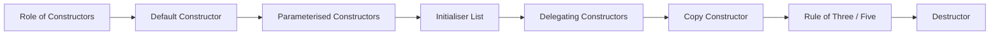

# Chapter 3: Constructors and Destructors

> **Previous:** [Classes and Objects](./02-classes-objects.md) | **Next:** [Inheritance](./04-inheritance.md)

## Learning Objectives

After studying this chapter, students will be able to:

- Design and implement multiple constructor forms
- Use initialiser lists to initialise members correctly
- Apply delegating constructors to reduce code duplication
- Implement copy constructors and understand when they are invoked
- Write destructors for resource cleanup
- Apply the Rule of Three and the Rule of Five

## Chapter at a Glance

| Topic | Key Insight | Practical Takeaway |
|-------|-------------|-------------------|
| Role of Constructors | Special member functions that initialise objects | Let constructors establish invariants; never leave object uninitialised |
| Default Constructor | Can be called with no arguments | Use `= default` when you need it alongside other constructors |
| Parameterised Constructors | Accept arguments for custom initialisation | Prefer initialiser lists over body assignment |
| Initialiser List | The only way to set `const`/reference members | Follows declaration order, not list order |
| Delegating Constructors | One constructor calls another | Reduces code duplication across overloads |
| Copy Constructor | Deep-copies resources owned by the source | Violating Rule of Three causes double-free bugs |
| Destructor | Releases resources on object destruction | Never throw from a destructor |

## Chapter Roadmap



## 3.1 The Role of Constructors

> **One-Sentence Takeaway:** A constructor initialises an object at creation time, establishing the invariants that the member functions rely on.


A constructor is a special member function that initialises an object when it is created. It has the same name as the class, no return type, and is invoked automatically. If a class declares no constructors, the compiler generates a default constructor that default-initialises all members.

```cpp
class Vector3D {
public:
    // Default constructor: initialises to (0, 0, 0)
    Vector3D() : x_(0), y_(0), z_(0) {}

    // Parameterised constructor
    Vector3D(double x, double y, double z)
        : x_(x), y_(y), z_(z) {}

private:
    double x_, y_, z_;
};
```

## 3.2 Default Constructor

> **One-Sentence Takeaway:** The default constructor runs with no arguments; if you define any constructor, the compiler-supplied one disappears — use `= default` to bring it back.

A default constructor is one that can be called with no arguments. It is used when creating arrays of objects, STL containers, or when using `new` without initialisers.

The compiler generates a default constructor only if the user declares no constructors at all. If any user-defined constructor exists, the compiler-supplied default is suppressed. Use `= default` to request the compiler-generated version explicitly:

```cpp
class Widget {
public:
    Widget() = default;                  // request compiler version
    Widget(int id) : id_(id) {}
private:
    int id_ = 0;                         // default member initialiser
};
```

Default member initialisers (C++11) provide per-member defaults that the compiler-generated default constructor uses:

> **Pro Tip:** Always provide default member initialisers for built-in types (`int`, `double`, pointers). Without them, members are left uninitialised — reading them is undefined behaviour.

```cpp
class Point {
    double x_ = 0.0;
    double y_ = 0.0;
};
```

## 3.3 Parameterised Constructors

> **One-Sentence Takeaway:** Parameterised constructors accept arguments to initialise an object with caller-provided values, bypassing the all-defaults state.

Constructors accepting arguments enable objects to be initialised with specific values:

```cpp
class Rectangle {
public:
    Rectangle(double w, double h)
        : width_(w), height_(h) {}

private:
    double width_;
    double height_;
};

Rectangle r(3.0, 4.0);
```

Member initialisation follows declaration order, not initialiser-list order. Compilers typically warn when the list order differs from declaration order.

## 3.4 Constructor Initialiser List

> **One-Sentence Takeaway:** The initialiser list is the only way to set `const` and reference members, and it initialises directly instead of default-constructing then assigning.

The initialiser list is the part of a constructor that appears after the parameter list, preceded by a colon. It is the *only* way to initialise const members, reference members, and base classes.

```cpp
class Config {
public:
    Config(const std::string& path)
        : kDefaultTimeout_(30),   // const member
          path_ref_(path),        // reference member
          data_loaded_(false)     // regular member
    {}

private:
    const int kDefaultTimeout_;
    const std::string& path_ref_;
    bool data_loaded_;
};
```

Members initialised in the body through assignment are first default-initialised then assigned, which is less efficient and sometimes impossible (for const/reference members). The initialiser list avoids this two-step process.

> **Warning:** Initialiser list order follows the declaration order of members in the class, not the order you write them in the list. Relying on list ordering instead of declaration order can cause subtle bugs with inter-dependent members.

## 3.5 Delegating Constructors

> **One-Sentence Takeaway:** Delegating constructors let one constructor call another, eliminating duplication across overloads while keeping initialisation in one place.

A constructor can delegate initialisation to another constructor of the same class, reducing code duplication:

```cpp
class Employee {
public:
    Employee(const std::string& name, int id, double salary)
        : name_(name), id_(id), salary_(salary) {}

    Employee(const std::string& name, int id)
        : Employee(name, id, 0.0) {}      // delegates

    Employee()
        : Employee("Unknown", -1, 0.0) {}  // delegates

private:
    std::string name_;
    int id_;
    double salary_;
};
```

Delegation chains must not form cycles (which would be ill-formed). The delegated-to constructor runs first, then the delegating constructor's body executes.

## 3.6 Copy Constructor

> **One-Sentence Takeaway:** The copy constructor creates a deep, independent copy — if your class manages heap resources, the default shallow copy leads to double-free disasters.

The copy constructor creates a new object as a copy of an existing object:

```cpp
class DynamicArray {
public:
    DynamicArray(size_t size)
        : size_(size), data_(new int[size]) {}

    // Copy constructor
    DynamicArray(const DynamicArray& other)
        : size_(other.size_), data_(new int[other.size_]) {
        std::copy(other.data_, other.data_ + size_, data_);
    }

    ~DynamicArray() { delete[] data_; }
    // ...

private:
    size_t size_;
    int* data_;
};
```

The copy constructor is invoked in three scenarios:

1. Passing an object by value to a function
2. Returning an object by value from a function
3. Brace-initialisation: `DynamicArray b = a;`

If no copy constructor is declared, the compiler generates one that performs a member-wise copy. For classes managing resources (heap memory, file handles, sockets), this shallow copy leads to double-free errors—the Rule of Three addresses this.

> **Remember:** If a class owns a raw pointer and you write a destructor to `delete` it, you almost certainly need both a copy constructor and copy assignment operator — otherwise the compiler-generated copies share the same pointer and double-free.

## 3.7 The Rule of Three and Rule of Five

> **One-Sentence Takeaway:** If you need to write a custom destructor, copy constructor, or copy assignment — write all three (Rule of Three); with C++11, add the move pair (Rule of Five).

**Rule of Three:** If a class requires a user-defined destructor, copy constructor, or copy assignment operator, it likely requires all three.

**Rule of Five:** With C++11, the move constructor and move assignment operator join the set (covered in Chapter 13).

```cpp
class Buffer {
public:
    Buffer(size_t size) : size_(size), data_(new char[size]) {}

    // Destructor
    ~Buffer() { delete[] data_; }

    // Copy constructor
    Buffer(const Buffer& other)
        : size_(other.size_), data_(new char[other.size_]) {
        std::copy(other.data_, other.data_ + size_, data_);
    }

    // Copy assignment
    Buffer& operator=(const Buffer& other) {
        if (this != &other) {
            delete[] data_;
            size_ = other.size_;
            data_ = new char[size_];
            std::copy(other.data_, other.data_ + size_, data_);
        }
        return *this;
    }

    // Move constructor (Chapter 13)
    Buffer(Buffer&& other) noexcept
        : size_(other.size_), data_(other.data_) {
        other.data_ = nullptr;
        other.size_ = 0;
    }

    // Move assignment (Chapter 13)
    Buffer& operator=(Buffer&& other) noexcept {
        if (this != &other) {
            delete[] data_;
            data_ = other.data_;
            size_ = other.size_;
            other.data_ = nullptr;
            other.size_ = 0;
        }
        return *this;
    }

private:
    size_t size_;
    char* data_;
};
```

## 3.8 Destructor

> **One-Sentence Takeaway:** The destructor runs deterministically when an object's lifetime ends — it is the foundation of RAII and the reason C++ has no need for garbage collection.

The destructor is called when an object is destroyed—when it goes out of scope (stack) or when `delete` is invoked (heap). Its primary purpose is to release resources acquired during the object's lifetime.

```cpp
class FileHandle {
public:
    FileHandle(const char* filename, const char* mode)
        : fp_(std::fopen(filename, mode)) {
        if (!fp_) throw std::runtime_error("Cannot open file");
    }

    ~FileHandle() {
        if (fp_) std::fclose(fp_);
    }

private:
    std::FILE* fp_;
};
```

Destructors must never throw exceptions. If a destructor throws during stack unwinding (when another exception is already active), `std::terminate` is called, ending the program.

## Concept Comparison Table

| Constructor Type | Syntax Key | Use Case | Notes |
|-----------------|-----------|----------|-------|
| Default | `T() = default;` | Creating arrays, containers | Suppressed if any other constructor exists |
| Parameterised | `T(int x, int y)` | Custom initialisation | Combined with default args for flexibility |
| Delegating | `T() : T(0, 0) {}` | Reducing duplication | Cannot form cycles; target runs first |
| Copy | `T(const T& other)` | Pass-by-value, clone | Must deep-copy resources |
| Move (C++11) | `T(T&& other) noexcept` | Transfer ownership | Leaves source in valid-but-empty state |
| Destructor | `~T()` | Resource cleanup | Must never throw |

## Quick Reference

| Construct | Syntax | Important Detail |
|-----------|--------|-----------------|
| Default constructor | `T() = default;` | Generated only if no user constructors exist |
| Initialiser list | `: x_(val), y_(val)` | Follows declaration order, not list order |
| Delegation | `: T(args)` | Target runs before delegating body |
| Copy constructor | `T(const T&)` | Shallow by default; deep-copy resources |
| Copy assignment | `T& operator=(const T&)` | Always check for self-assignment |
| Destructor | `~T()` noexcept | Must not throw |
| `= delete` | `T(const T&) = delete;` | Prohibits copying entirely |

## Cross-Application Matrix

| Area | Application of Concepts |
|------|------------------------|
| Game Engines | `GameObject` constructors set up components; deep copy for save states |
| Database Drivers | Connection handles use RAII via destructors to close sockets |
| GUI Frameworks | Widget destructors unregister from parent containers |
| Embedded Systems | Resource-constrained objects rely on init lists to avoid double-initialisation |
| Financial Systems | Trade objects use Rule of Five for correct snapshots and audit trails |

## Chapter Quiz

1. What happens if you declare a parameterised constructor but still need a default constructor?
   A) The compiler generates one automatically
   B) You must explicitly write `= default` or define it
   C) The parameterised constructor doubles as default
   D) The program will not compile
   <details><summary>Answer</summary>**B)** If any user-defined constructor exists, the compiler-supplied default constructor is suppressed. You must explicitly request it with `= default` or define it yourself.</details>

2. Why must `const` and reference members be initialised in the initialiser list?
   A) The compiler enforces it — they cannot be assigned after construction
   B) It is more efficient but not required
   C) Only `const` members require this; references can be assigned
   D) They must be initialised in the constructor body
   <details><summary>Answer</summary>**A)** `const` members cannot be assigned and references cannot be reseated, so they must be initialised directly in the initialiser list.</details>

3. What is the correct signature for a copy assignment operator?
   A) `void operator=(const T& other)`
   B) `T operator=(T other)`
   C) `T& operator=(const T& other)`
   D) `const T& operator=(const T& other)`
   <details><summary>Answer</summary>**C)** The canonical form returns `T&` to support chaining (`a = b = c`) and takes `const T&` to accept both lvalues and const objects.</details>

4. Which of the following triggers the copy constructor?
   A) Passing an object by reference to a function
   B) Passing an object by value to a function
   C) Passing an object by pointer to a function
   D) Using a reference variable
   <details><summary>Answer</summary>**B)** Pass-by-value copies the argument, invoking the copy constructor. Pass-by-reference and pass-by-pointer do not copy.</details>

5. A destructor that throws an exception during stack unwinding causes:
   A) The exception to be swallowed silently
   B) `std::terminate` to be called
   C) The destructor to be called again
   D) A warning but normal execution continues
   <details><summary>Answer</summary>**B)** If a destructor throws while another exception is active, `std::terminate` is called, immediately ending the program.</details>

## 3.9 Summary

Constructors initialise objects in a controlled, guaranteed manner. Initialiser lists provide efficient, correct initialisation for all member types. Delegating constructors avoid repetition across constructor overloads. Copy constructors enable value semantics but require careful resource management, formalised by the Rule of Three and Rule of Five. Destructors perform deterministic cleanup, the cornerstone of the RAII idiom central to C++ resource management.

## Exercises

### Review Questions

1. Under what circumstances does the compiler generate a default constructor?
2. Why must const and reference members be initialised in the initialiser list rather than assigned in the constructor body?
3. Explain the three scenarios that trigger copy constructor invocation.
4. What is the difference between shallow copy and deep copy?
5. Why should destructors never throw exceptions?

### Application Problems

1. Implement a `class` named `String` that wraps a dynamically allocated C-string. Write the default constructor, parameterised constructor from `const char*`, copy constructor, destructor, and copy assignment operator. Verify correctness with a test program.
2. Create a `class` named `Book` with `const` members for ISBN and title (use initialiser list), a mutable member for the number of times the book has been borrowed, and delegating constructors such that the single-argument constructor (ISBN only) defaults the title to "Untitled".

### Challenge Problem

3. Implement a `class` named `Polynomial` that represents a polynomial of degree N with dynamically allocated coefficients. Write the full Rule of Five, a constructor that takes a `std::initializer_list<double>`, a `degree()` const member function, an `evaluate(double x) const` function, and overload `operator<<` for display. Use a private `swap` function to implement copy assignment via the copy-and-swap idiom.
