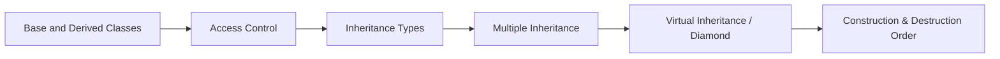

# Chapter 4: Inheritance

> **Previous:** [Constructors](./03-constructors.md) | **Next:** [Polymorphism](./05-polymorphism.md)

## Learning Objectives

After studying this chapter, students will be able to:

- Model is-a relationships using inheritance
- Control member visibility through access specifiers in derived classes
- Implement single, multilevel, multiple, and hierarchical inheritance
- Recognise and resolve the diamond problem using virtual inheritance
- Understand construction and destruction order in class hierarchies

## Chapter at a Glance

| Topic | Key Insight | Practical Takeaway |
|-------|-------------|-------------------|
| Base and Derived Classes | A derived class inherits members from a base class | Model is-a relationships with public inheritance |
| Access Control | `public`/`protected`/`private` inheritance control visibility | Use `public` inheritance for is-a; `private` for implementation reuse |
| Single / Multilevel / Hierarchical | One base fans out or chains down | Keep hierarchies shallow — prefer composition for depth > 3 |
| Multiple Inheritance | A class inherits from multiple bases | Powerful but complex; use sparingly |
| Virtual Inheritance | Merges shared base into a single subobject | Solves the diamond problem |
| Construction / Destruction Order | Base first, then members, then derived body | Destruction is the exact reverse of construction |

## Chapter Roadmap



## 4.1 Base and Derived Classes

> **One-Sentence Takeaway:** Inheritance lets a derived class reuse and extend a base class's interface and implementation, forming an is-a relationship.


Inheritance enables a class to acquire the members of another class, establishing an is-a relationship. The class being inherited from is the *base class* (or parent, superclass); the inheriting class is the *derived class* (or child, subclass).

```cpp
class Shape {
public:
    void set_position(double x, double y) {
        x_ = x; y_ = y;
    }

private:
    double x_ = 0, y_ = 0;
};

class Circle : public Shape {
public:
    void set_radius(double r) { radius_ = r; }

private:
    double radius_ = 1.0;
};
```

A `Circle` is-a `Shape`: every `Circle` object contains a `Shape` subobject. The derived class can access public and protected members of the base but not private members.

> **Pro Tip:** Design base classes for extension, not modification — the Open/Closed principle. If you keep adding virtual functions to a base, consider composition instead.

```cpp
int main() {
    Circle c;
    c.set_position(10.0, 20.0);   // inherited from Shape
    c.set_radius(5.0);
}
```

## 4.2 Access Control in Inheritance

> **One-Sentence Takeaway:** The inheritance access specifier determines the minimum access level of inherited members as seen through the derived class.

Three inheritance access specifiers control how base class members are seen by code outside the derived class:

| Inheritance | Base `public` in derived | Base `protected` in derived | Base `private` in derived |
|------------|-------------------------|----------------------------|--------------------------|
| `public`   | `public`                | `protected`                | inaccessible             |
| `protected`| `protected`             | `protected`                | inaccessible             |
| `private`  | `private`               | `private`                  | inaccessible             |

Public inheritance is by far the most common and is the only form that models is-a. Private inheritance models implemented-in-terms-of and is primarily a reuse mechanism. Protected inheritance is rare.

```cpp
class Base {
public:
    int a;
protected:
    int b;
private:
    int c;
};

class Pub : public Base {
    // a is public, b is protected, c inaccessible
};

class Priv : private Base {
    // a and b are private, c inaccessible
};
```

## 4.3 Inheritance Types

> **One-Sentence Takeaway:** Single, multilevel, multiple, and hierarchical inheritance serve different design needs — choose the simplest one that models your relationship.

### Single Inheritance
One derived class inherits from one base class. Simple and predictable.

```cpp
class Vehicle { /* ... */ };
class Car : public Vehicle { /* ... */ };
```

### Multilevel Inheritance
A chain of inheritance: A → B → C. Each level adds or specialises behaviour.

```cpp
class Animal { /* ... */ };
class Mammal : public Animal { /* ... */ };
class Dog : public Mammal { /* ... */ };
```

### Multiple Inheritance
A derived class inherits from two or more base classes.

> **Warning:** Multiple inheritance is powerful but overused. Prefer composition over inheritance when the relationship is "has-a" rather than "is-a".

```cpp
class Camera { /* ... */ };
class Phone { /* ... */ };
class Smartphone : public Camera, public Phone { /* ... */ };
```

### Hierarchical Inheritance
One base class serves as parent to multiple derived classes.

```cpp
class Shape { /* ... */ };
class Circle : public Shape { /* ... */ };
class Square : public Shape { /* ... */ };
class Triangle : public Shape { /* ... */ };
```

### Hybrid Inheritance (Diamond Problem)
A combination of multiple and hierarchical inheritance creates a diamond shape, where a derived class inherits from two classes that share a common ancestor:

```
    A
   / \
  B   C
   \ /
    D
```

## 4.4 The Diamond Problem and Virtual Inheritance

> **One-Sentence Takeaway:** Virtual inheritance merges a shared base class into a single subobject, resolving the ambiguity of multiple inheritance paths to the same ancestor.

Without special handling, class D inherits two copies of A's members—one through B and one through C—causing ambiguity:

```cpp
class A {
public:
    int value_;
};

class B : public A { };
class C : public A { };
class D : public B, public C { };

int main() {
    D d;
    // d.value_ = 5;          // ERROR: ambiguous
    d.B::value_ = 5;          // OK, but two copies exist
    d.C::value_ = 7;
}
```

Virtual inheritance merges the shared base into a single subobject:

```cpp
class B : virtual public A { };
class C : virtual public A { };
class D : public B, public C { };
// D now has only one A subobject
```

Virtual inheritance introduces additional complexity: the virtual base is initialised directly by the most-derived class, not by the intermediate bases. Construction order ensures the virtual base is constructed first.

```cpp
class A {
public:
    A(int v) : value_(v) {}
    int value_;
};

class B : virtual public A {
public:
    B() : A(0) {}    // ignored when B is part of D
};

class C : virtual public A {
public:
    C() : A(0) {}    // ignored when C is part of D
};

class D : public B, public C {
public:
    D() : A(42), B(), C() {}   // D initialises A directly
};
```

## 4.5 Construction and Destruction Order

> **One-Sentence Takeaway:** Bases are constructed first and destroyed last; the most-derived class initialises virtual bases directly.

Construction proceeds from base to derived: base class constructors run first (in declaration order for multiple inheritance), then member initialisations, then the derived constructor body.

Destruction reverses this order: derived destructor runs first, then members are destroyed in reverse order of initialisation, then base destructors run in reverse order.

```cpp
class A {
public:
    A() { std::cout << "A "; }
    ~A() { std::cout << "~A "; }
};

class B : public A {
public:
    B() { std::cout << "B "; }
    ~B() { std::cout << "~B "; }
};

int main() {
    B b;   // Output: "A B ~B ~A"
}
```

## Concept Comparison Table

| Feature | Inheritance Specifier | Effect on Base `public` Members | Typical Use |
|---------|---------------------|-------------------------------|-------------|
| Public Inheritance | `: public Base` | Stay `public` | Model is-a relationships |
| Protected Inheritance | `: protected Base` | Become `protected` | Rare; implementation sharing within hierarchy |
| Private Inheritance | `: private Base` | Become `private` | Implemented-in-terms-of (prefer composition) |
| Virtual Inheritance | `: virtual public Base` | Single shared instance | Resolve diamond problem |
| No Inheritance | Composition | N/A | Has-a relationships (preferred over private inheritance) |

## Quick Reference

| Construct | Syntax | Important Detail |
|-----------|--------|-----------------|
| Public derivation | `class D : public B {};` | Most common form |
| Override specifier | `void f() override;` | Compiler checks base has virtual `f` |
| Final specifier | `void f() final;` | Prevents further overriding |
| Virtual inheritance | `class D : virtual public B` | Shared base instance |
| Base init list | `D() : B(args) {}` | Must be in initialiser list |
| Upcast | `B* p = &d;` | Always implicit |
| Downcast | `dynamic_cast<D*>(b)` | Returns `nullptr` on failure |

## Cross-Application Matrix

| Domain | How Concepts Apply |
|--------|-------------------|
| Game Development | `Entity` base with `update()`; `Player : Entity`, `Enemy : Entity` |
| GUI Frameworks | `QWidget` base for all widgets; deep hierarchies with virtual inheritance for mixins |
| Device Drivers | Abstract `Driver` with virtual `read()`/`write()`; concrete `USBDriver : Driver` |
| Financial Models | `Instrument` base; `Equity : Instrument`, `Derivative : Instrument` |
| Compiler Design | AST: `Expr` base with `BinaryExpr : Expr`, `IfStmt : Stmt`; `Visitable` mixin via virtual inheritance |

## Chapter Quiz

1. Which inheritance specifier models an is-a relationship?
   A) `private` inheritance
   B) `protected` inheritance
   C) `public` inheritance
   D) `virtual` inheritance
   <details><summary>Answer</summary>**C)** Public inheritance models is-a — everything accessible on the base is accessible on the derived.</details>

2. The diamond problem occurs when:
   A) Single inheritance depth exceeds 3 levels
   B) Multiple inheritance creates a shared ancestor
   C) A derived class hides a base-class function
   D) A virtual function is called from a constructor
   <details><summary>Answer</summary>**B)** When two base classes share a common ancestor and a class inherits from both, two copies of the ancestor exist — causing ambiguity.</details>

3. What solves the diamond problem?
   A) Using `private` inheritance
   B) Using virtual inheritance
   C) Using namespaces
   D) Using `override` specifier
   <details><summary>Answer</summary>**B)** Virtual inheritance ensures the shared base appears only once in the most-derived object layout.</details>

4. What does the `override` specifier guarantee?
   A) The function is virtual for the first time
   B) A base-class virtual function with the same signature exists
   C) The function cannot be further overridden
   D) The function is inlined
   <details><summary>Answer</summary>**B)** `override` causes a compile error if no base-class virtual function with the exact signature exists.</details>

5. In what order are destructors called for a derived object?
   A) Base first, then derived
   B) Derived first, then base
   C) In declaration order of bases
   D) In reverse declaration order of members
   <details><summary>Answer</summary>**B)** Destruction is the reverse of construction: derived destructor runs first, then members, then base destructors in reverse order.</details>

## 4.6 Summary

Inheritance models hierarchical is-a relationships in C++. Access specifiers control visibility propagation, different inheritance forms address various design needs, and virtual inheritance resolves the diamond problem at the cost of some complexity. Understanding construction and destruction order is essential for correct resource management in derived classes.

## Exercises

### Review Questions

1. When would you use `protected` inheritance instead of `public` inheritance?
2. What is the difference between `private` inheritance and composition?
3. How does virtual inheritance resolve the diamond problem?
4. Who is responsible for initialising a virtual base class?
5. In what order are destructors called for a derived class object?

### Application Problems

1. Implement a class hierarchy: `Person` (name, age), `Student` (person + major, GPA), and `Professor` (person + department, salary). Use public inheritance. Provide appropriate constructors using initialiser lists.
2. Create a class `MediaFile` with virtual functions `play()` and `stop()`. Derive `AudioFile` and `VideoFile` from it. Then create `AVFile` that inherits from both `AudioFile` and `VideoFile`. Resolve the diamond using virtual inheritance.

### Challenge Problem

3. Implement a class hierarchy for a GUI toolkit: `Widget` (base, with position and size), `Clickable` (mixin with `on_click`), `Scrollable` (mixin with `on_scroll`), `Button` (inherits Widget and Clickable), `ScrollPanel` (inherits Widget and Scrollable), and `ListBox` (inherits Widget, Clickable, Scrollable). Use virtual inheritance for Widget. Implement a minimal event dispatch mechanism.
