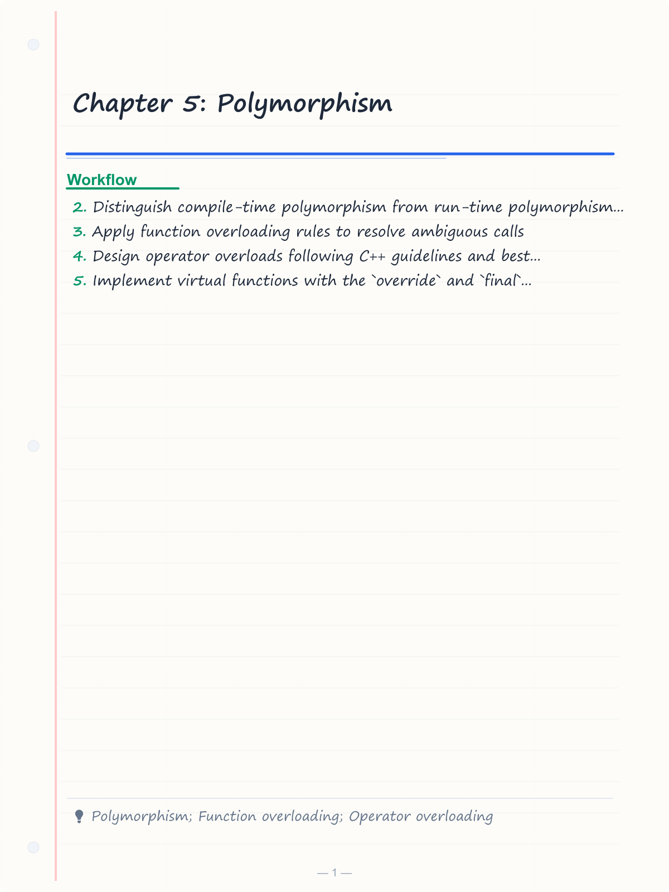
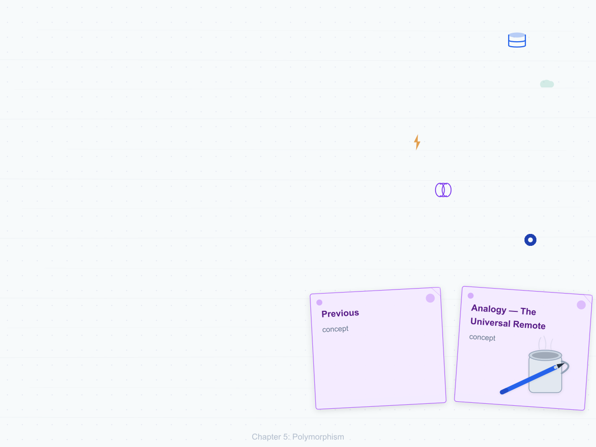
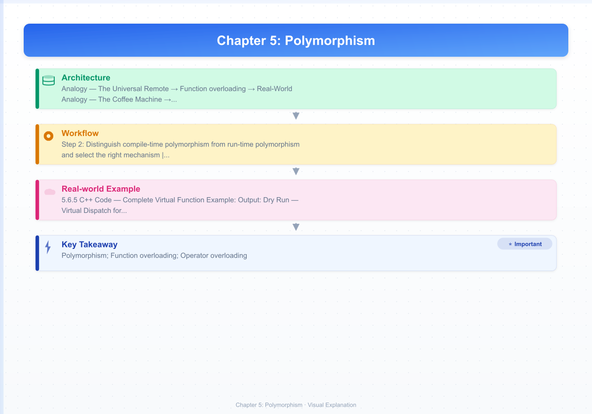

# Chapter 5: Polymorphism

> **Previous:** [Inheritance](./04-inheritance.md) | **Next:** [Operator Overloading](./06-operator-overloading.md)

---

## Learning Objectives

After studying this chapter, students will be able to:

<!-- Image Gallery -->
<section class="lesson-visuals" aria-label="Visual learning resources">
  <header><span>VISUAL LEARNING</span><h2>See it. Review it. Remember it.</h2></header>
  <a class="lesson-visual-card" href="../../assets/images/lessons/oop-cpp/05-polymorphism/handwritten-notes.png" target="_blank" rel="noopener">
    
    <span><strong>Handwritten notes</strong>Condensed notes for deliberate review.</span>
  </a>
  <a class="lesson-visual-card" href="../../assets/images/lessons/oop-cpp/05-polymorphism/sticky-notes.png" target="_blank" rel="noopener">
    
    <span><strong>Sticky-note revision</strong>Fast recall prompts for revision.</span>
  </a>
  <a class="lesson-visual-card" href="../../assets/images/lessons/oop-cpp/05-polymorphism/visual-explanation.png" target="_blank" rel="noopener">
    
    <span><strong>Visual concept guide</strong>A connected explanation of the key ideas.</span>
  </a>
</section>
<!-- End Image Gallery -->


- Distinguish compile-time polymorphism from run-time polymorphism and select the right mechanism
- Apply function overloading rules to resolve ambiguous calls
- Design operator overloads following C++ guidelines and best practices
- Implement virtual functions with the `override` and `final` specifiers correctly
- Draw the vtable/vptr memory layout and explain dispatch cost
- Design abstract base classes with pure virtual functions as interfaces
- Explain why virtual destructors are mandatory in polymorphic hierarchies
- Use `dynamic_cast` and `typeid` judiciously, understanding their costs
- Answer interview questions on vtable dispatch, object slicing, and RTTI

---

## 5.0 The Polymorphism Problem — A Real-World Analogy

**Analogy — The Universal Remote**

You have a universal remote with a single "Play" button. Point it at a **DVD Player**, and it starts spinning the disc. Point it at a **Streaming Stick**, and it buffers Netflix. Point it at a **Game Console**, and it launches the game. The same button press *behaves differently* depending on the device.

This is polymorphism: **one interface, many implementations**. The remote doesn't need to know *what* it's talking to — it just sends "Play". Each device provides its own behaviour. If you invent a new device tomorrow, the remote works without any modification.

In C++, polymorphism is the ability of objects of different types to respond to the same function call in type-specific ways. It is the third pillar of OOP.

---

## 5.1 Two Flavours of Polymorphism

| Flavour | Also Called | When It Happens | Mechanism | Speed | Flexibility |
|---------|-------------|----------------|-----------|-------|-------------|
| **Compile-time** | Static binding, early binding | Before the program runs | Function/operator overloading, templates | Fastest — zero runtime overhead | Lower — types must be known at compile time |
| **Run-time** | Dynamic binding, late binding | While the program executes | Virtual functions via vtable/vptr | Slightly slower — one indirection | Higher — types can be determined at runtime |

We study both in this chapter, starting with compile-time.

---

# PART I — COMPILE-TIME POLYMORPHISM

---

## 5.2 Function Overloading

### 5.2.1 What Is Function Overloading?


**Function overloading** means defining multiple functions with the **same name** but **different parameter lists** (different number, types, or order of parameters). The compiler selects the correct function at compile time based on the arguments passed.

**Real-World Analogy — The Coffee Machine**

A coffee machine has one button labelled "Brew". But:
- If you place a **cup** under the spout → it brews 200 ml.
- If you place a **travel mug** → it brews 400 ml.
- If you place a **thermos** → it brews 800 ml.

Same command ("Brew"), different behaviour based on *what you give it*.

### 5.2.2 Function Overloading — Numbered Steps


1. Compiler sees the function call and collects the argument types.
2. Compiler builds a candidate set of all functions with the matching name.
3. Compiler filters to **viable functions** — those callable with the given arguments (allowing implicit conversions).
4. Compiler ranks viable functions by **conversion sequence quality** (exact match > promotion > standard conversion > user-defined conversion).
5. If exactly one best match exists → **selected**. If none or more than one → **compile error**.

**Pseudocode:**
```
FUNCTION print(Int n)        → print integer
FUNCTION print(Double d)     → print double
FUNCTION print(String s)     → print string
FUNCTION print(Int n, Int base) → print integer in given base

CALL print(42)           → Step 5: match #1 selected
CALL print(3.14)         → Step 5: match #2 selected
CALL print("hello")      → Step 5: match #3 selected
CALL print(255, 16)      → Step 5: match #4 selected (two ints)
```

### 5.2.3 C++ Code — Function Overloading


```cpp
#include <iostream>
#include <string>

void print(int i) {
    std::cout << "Integer: " << i << '\n';
}

void print(double d) {
    std::cout << "Double: " << d << '\n';
}

void print(const std::string& s) {
    std::cout << "String: " << s << '\n';
}

void print(int i, int base) {
    std::cout << "Integer " << i << " in base " << base << " → ";
    if (base == 16) std::cout << std::hex << i;
    else if (base == 8) std::cout << std::oct << i;
    else std::cout << std::dec << i;
    std::cout << '\n';
}

int main() {
    print(42);                    // Integer: 42
    print(3.14159);               // Double: 3.14159
    print("hello"s);              // String: hello
    print(255, 16);               // Integer 255 in base 16 → ff
    print('A');                   // Integer: 65 (char promotes to int)
    return 0;
}
```

**Output:**
```
Integer: 42
Double: 3.14159
String: hello
Integer 255 in base 16 → ff
Integer: 65
```

**Dry Run — Overload Resolution:**

| Call | Candidates | Viable | Best Match | Reason |
|------|------------|--------|------------|--------|
| `print(42)` | `print(int)`, `print(double)`, `print(string)`, `print(int,int)` | #1, #2, #3 | `print(int)` | Exact match for `int` |
| `print(3.14)` | same set | #1, #2, #3 | `print(double)` | Exact match for `double` |
| `print("hello"s)` | same set | #1, #2, #3 | `print(string)` | Exact match for `string` |
| `print(255, 16)` | same set | #4 | `print(int,int)` | Only match with 2 params |
| `print('A')` | same set | #1, #2, #3 | `print(int)` | `char` → `int` is a promotion, beats `char` → `double` (standard conversion) |

### 5.2.4 Complexity Analysis


| Operation | Time | Space | Why? |
|-----------|------|-------|------|
| Overload resolution | O(N) candidates | O(1) | Compiler examines N overloads once per call; no runtime cost |
| Call to selected function | O(1) | O(1) | Direct function call — resolved at link time |
| Ambiguity detection | O(N²) in worst case | O(N) | Compiler must check every pair for best-match uniqueness |

---

## 5.3 Function Overloading Rules

### 5.3.1 Allowed Overloads


A function can be overloaded if its signature differs in any of:

| Change | Example | Allowed? |
|--------|---------|----------|
| Number of parameters | `f(int)` vs `f(int, int)` | ✅ |
| Type of parameters | `f(int)` vs `f(double)` | ✅ |
| Order of parameters | `f(int, double)` vs `f(double, int)` | ✅ |
| Const/volatile on pointer | `f(int*)` vs `f(const int*)` | ✅ |
| Reference qualifier | `f() &` vs `f() &&` (C++11) | ✅ |

### 5.3.2 NOT Allowed — These Do NOT Overload


| Attempt | Why It Fails |
|---------|-------------|
| Same name, same params, different return type | Return type is NOT part of the signature |
| Same name, same params, different in name only | Parameter names are irrelevant |
| `f(int)` vs `f(const int)` | Top-level const is stripped — they are the same |
| `f(int)` vs `f(int&)` | Call `f(x)` — both viable; ambiguity unless exact distinction |

### 5.3.3 Overload Resolution Ranking


The compiler ranks viable functions by conversion quality:

1. **Exact match** — no conversion needed (or trivial: array-to-pointer, function-to-pointer)
2. **Promotion** — `char` → `int`, `float` → `double`, etc.
3. **Standard conversion** — `int` → `double`, `double` → `int`, derived* → base*
4. **User-defined conversion** — via conversion operator or single-argument constructor
5. **Ellipsis** (`...`) — last resort, match via `...`

**Code — Resolution Ranking:**

```cpp
#include <iostream>

void g(int)    { std::cout << "int\n"; }
void g(short)  { std::cout << "short\n"; }
void g(long)   { std::cout << "long\n"; }

int main() {
    int i = 5;
    short s = 5;
    long l = 5;
    char c = 'A';

    g(i);    // exact match → g(int)
    g(s);    // exact match → g(short)
    g(l);    // exact match → g(long)
    g(c);    // promotion → g(int) — char promotes to int, not short/long
    return 0;
}
```

**Output:**
```
int
short
long
int
```

**Dry Run:**

| Call | Viable Functions | Conversions | Best Match |
|------|------------------|-------------|------------|
| `g(i)` where `i` is `int` | `g(int)`, `g(short)`, `g(long)` | #1: exact, #2: standard (int→short), #3: standard (int→long) | `g(int)` — exact |
| `g(s)` where `s` is `short` | same | #1: promotion (short→int), #2: exact, #3: standard (short→long) | `g(short)` — exact |
| `g(c)` where `c` is `char` | same | #1: promotion (char→int), #2: promotion (char→short), #3: promotion (char→long) | `g(int)` — promotion to `int` preferred over `short` because `int` can represent all `char` values |

---

## 5.4 Operator Overloading — Guidelines

### 5.4.1 What Is Operator Overloading?


Operator overloading allows user-defined types to use C++ operators (`+`, `-`, `*`, `<<`, `[]`, etc.) with natural syntax. It is a form of **compile-time polymorphism** — the compiler selects the correct `operator@` function based on operand types.

**Real-World Analogy — The Matrix Calculator**

A basic calculator adds numbers: `2 + 3 = 5`. But a **matrix calculator** overloads `+` so that `matrixA + matrixB` performs element-wise addition. The `+` symbol *means different things* depending on what it operates on — just like function overloading.

### 5.4.2 Which Operators Can Be Overloaded?


| Category | Operators | Overloadable? |
|----------|-----------|---------------|
| Arithmetic | `+ - * / %` | ✅ Most |
| Bitwise | `& ^ | ~ << >>` | ✅ Most |
| Assignment | `= += -= *=` | ✅ Most |
| Comparison | `== != < > <= >=` | ✅ All |
| Subscript | `[]` | ✅ |
| Function call | `()` | ✅ |
| Dereference | `* ->` | ✅ |
| Stream | `<< >>` | ✅ As friends |
| NEW/DELETE | `new new[] delete delete[]` | ✅ |

### 5.4.3 Operators That CANNOT Be Overloaded


| Operator | Name | Why Not? |
|----------|------|----------|
| `::` | Scope resolution | Cannot change fundamental scoping rules |
| `.` | Member access | Would break class member access semantics |
| `.*` | Pointer-to-member | Same reason |
| `?:` | Ternary conditional | Would complicate short-circuit rules |
| `sizeof` | Size-of | Operates on types, not values |
| `typeid` | Type identification | RTTI must remain reliable |
| `#` / `##` | Preprocessor | Preprocessor runs before the compiler |

### 5.4.4 Operator Overloading Guidelines (The Golden Rules)


1. **Preserve natural semantics.** `operator+` should add, `operator==` should compare equality. Never make `+` do subtraction.
2. **Preserve expected arity and precedence.** You cannot change precedence, associativity, or arity.
3. **Provide compound assignment from the arithmetic version.** Implement `+=` then implement `+` in terms of `+=`.
4. **Return by value for arithmetic, by reference for assignment.**
   - `T operator+(const T&, const T&)` — returns new object by value
   - `T& operator+=(const T&)` — modifies and returns *this by reference
5. **Make binary operators non-member friends** when the left operand should support conversions.
6. **`<<` and `>>` for I/O MUST be non-member functions** — the left operand is `std::ostream&`, not your class.

### 5.4.5 Code — Complex Number with Operator Overloading


```cpp
#include <iostream>

class Complex {
public:
    Complex(double r = 0, double i = 0) : re_(r), im_(i) {}

    Complex& operator+=(const Complex& rhs) {
        re_ += rhs.re_;
        im_ += rhs.im_;
        return *this;
    }

    Complex& operator*=(const Complex& rhs) {
        double r = re_ * rhs.re_ - im_ * rhs.im_;
        double i = re_ * rhs.im_ + im_ * rhs.re_;
        re_ = r;
        im_ = i;
        return *this;
    }

    double real() const { return re_; }
    double imag() const { return im_; }

private:
    double re_, im_;
};

Complex operator+(Complex lhs, const Complex& rhs) {
    return lhs += rhs;
}

Complex operator*(Complex lhs, const Complex& rhs) {
    return lhs *= rhs;
}

std::ostream& operator<<(std::ostream& os, const Complex& c) {
    os << '(' << c.real() << " + " << c.imag() << "i)";
    return os;
}

int main() {
    Complex a(3, 4);
    Complex b(1, 2);

    std::cout << "a = " << a << '\n';
    std::cout << "b = " << b << '\n';
    std::cout << "a + b = " << (a + b) << '\n';
    std::cout << "a * b = " << (a * b) << '\n';

    Complex c = 5 + a;
    std::cout << "5 + a = " << c << '\n';
    return 0;
}
```

**Output:**
```
a = (3 + 4i)
b = (1 + 2i)
a + b = (4 + 6i)
a * b = (-5 + 10i)
5 + a = (8 + 4i)
```

### 5.4.6 Operator Overloading — Complexity


| Operation | Space | Time | Why? |
|-----------|-------|------|------|
| `operator+=` | O(1) per op | O(1) | Direct field arithmetic |
| `operator+` (copy + add) | O(1) extra copy | O(1) | One copy, one compound op |
| `operator<<` | O(1) per field | O(1) | Direct stream insertion |

---

## 5.5 Overloading vs Overriding — Critical Distinction

| Aspect | Function Overloading | Function Overriding |
|--------|---------------------|---------------------|
| Scope | Same class (or global) | Base class → derived class |
| Binding | Compile-time | Run-time (virtual) |
| Signature | Must differ | Must match exactly |
| `virtual` keyword | Not needed | Required in base |
| `override` keyword | Not applicable | Recommended in derived |
| Return type | Can differ | Must be covariant |
| Example | `f(int)`, `f(double)` | `Base::f()`, `Derived::f()` |

---

# PART II — RUN-TIME POLYMORPHISM

---

## 5.6 Virtual Functions

### 5.6.1 The Problem Virtual Functions Solve


Without virtual functions, calling a function through a base pointer always invokes the **base class version**:

```cpp
class Base {
public:
    void speak() { std::cout << "Base\n"; }
};

class Derived : public Base {
public:
    void speak() { std::cout << "Derived\n"; }
};

int main() {
    Base* p = new Derived();
    p->speak();   // "Base" — NOT what we want!
    delete p;
}
```

**Output:**
```
Base
```

This is **not polymorphic**. The compiler sees a `Base*` and calls `Base::speak()`. The object is actually a `Derived`, but the function call ignores this.

Adding the `virtual` keyword changes everything:

```cpp
class Base {
public:
    virtual void speak() { std::cout << "Base\n"; }
};

class Derived : public Base {
public:
    void speak() override { std::cout << "Derived\n"; }
};

int main() {
    Base* p = new Derived();
    p->speak();   // "Derived" — runtime dispatch!
    delete p;
}
```

**Output:**
```
Derived
```

### 5.6.2 Real-World Analogy — The Shape Drawer


A graphic editor has a list of shapes. When you click "Render All", the editor calls `draw()` on each shape. A **Circle** draws an arc. A **Square** draws four lines. A **Triangle** draws three lines. The editor does not care what each shape is — it just says "draw yourself". Each shape *knows* how to draw itself.

```
Editor: "Shape #1, draw()"   → Circle draws ○
Editor: "Shape #2, draw()"   → Square draws □
Editor: "Shape #3, draw()"   → Triangle draws △
```

### 5.6.3 Virtual Functions — Numbered Steps


1. Base class declares `virtual void f();`.
2. Derived class overrides with `void f() override;`.
3. Caller holds a base pointer/reference to a derived object.
4. Caller invokes `ptr->f();`.
5. Compiler generates code that reads the object's **vptr** (at offset 0 in most implementations).
6. Compiler follows vptr to the **vtable** (a static table of function pointers).
7. Compiler indexes into the vtable at a fixed offset (known for `f`).
8. Compiler calls the function pointer found at that slot — this is the **most-derived override**.
9. If `Derived` did not override `f`, the vtable slot points to `Base::f`.

### 5.6.4 Pseudocode — Virtual Dispatch


```
CLASS Shape
  VIRTUAL draw()     → prints "Shape"
  VIRTUAL area()     → returns 0

CLASS Circle EXTENDS Shape
  OVERRIDE draw()    → prints "Circle"
  OVERRIDE area()    → returns π·r²

CLASS Square EXTENDS Shape
  OVERRIDE draw()    → prints "Square"
  OVERRIDE area()    → returns side²

FUNCTION render(Shape& s)
  s.draw()           ← runtime dispatch
  PRINT s.area()    ← runtime dispatch

FUNCTION main()
  Circle c
  Square sq
  render(c)   → circle, 3.14
  render(sq)  → square, 4.0
```

### 5.6.5 C++ Code — Complete Virtual Function Example


```cpp
#include <iostream>
#include <vector>
#include <memory>

class Shape {
public:
    virtual double area() const { return 0; }
    virtual void draw() const { std::cout << "Unknown shape\n"; }
    virtual ~Shape() = default;
};

class Circle : public Shape {
public:
    Circle(double r) : r_(r) {}
    double area() const override { return 3.14159 * r_ * r_; }
    void draw() const override { std::cout << "Circle(r=" << r_ << ")\n"; }
private:
    double r_;
};

class Square : public Shape {
public:
    Square(double s) : side_(s) {}
    double area() const override { return side_ * side_; }
    void draw() const override { std::cout << "Square(side=" << side_ << ")\n"; }
private:
    double side_;
};

class Triangle : public Shape {
public:
    Triangle(double b, double h) : base_(b), height_(h) {}
    double area() const override { return 0.5 * base_ * height_; }
    void draw() const override { std::cout << "Triangle(base=" << base_
                                          << ", height=" << height_ << ")\n"; }
private:
    double base_, height_;
};

void render(const Shape& s) {
    s.draw();
    std::cout << "  Area: " << s.area() << '\n';
}

int main() {
    std::vector<std::unique_ptr<Shape>> shapes;
    shapes.push_back(std::make_unique<Circle>(1.0));
    shapes.push_back(std::make_unique<Square>(2.0));
    shapes.push_back(std::make_unique<Triangle>(3.0, 4.0));

    for (const auto& s : shapes)
        render(*s);

    return 0;
}
```

**Output:**
```
Circle(r=1)
  Area: 3.14159
Square(side=2)
  Area: 4
Triangle(base=3, height=4)
  Area: 6
```

**Dry Run — Virtual Dispatch for `shapes[0]->draw()`:**

| Step | What Happens | Where |
|------|-------------|-------|
| 1 | `shapes[0]` is a `unique_ptr<Shape>` pointing to a `Circle` | Heap |
| 2 | `render(*s)` passes `Circle` as `const Shape&` | Stack frame |
| 3 | `s.draw()` is called — compiler generates vptr lookup | Object at offset 0 |
| 4 | vptr → Circle's vtable | Static memory |
| 5 | Index `draw` slot → `Circle::draw` | Vtable slot 1 |
| 6 | `Circle::draw()` executes | Code section |
| 7 | Output: `Circle(r=1)` | Console |

---

## 5.7 The `override` Specifier

### 5.7.1 Why `override`?


Before C++11, if you attempted to override a virtual function but mistyped the signature, you silently created a **new function**:

```cpp
class Base {
public:
    virtual void draw() const;
};

class Derived : public Base {
public:
    void draw() /* missing const! */ { }  // NEW function, not override
};
```

The `override` specifier (C++11) causes the compiler to verify that a base class virtual with the matching signature actually exists:

```cpp
class Derived : public Base {
public:
    void draw() override { }  // ERROR: does not override anything
};
```

**Compiler error:**
```
error: 'Derived::draw' marked 'override' but does not override any member functions
```

### 5.7.2 `override` — Rules


| Rule | Explanation |
|------|-------------|
| Placement | After the parameter list (and after `const`/`&`/`&&`) |
| Virtual inheritance | Override implies virtual — base function must be virtual |
| Return type | Must match exactly, OR be covariant |
| Access level | Can be different from base (public → private override is legal) |
| Optional but recommended | Omission is not an error, but is a missed safety check |

---

## 5.8 The `final` Specifier

### 5.8.1 What `final` Does


`final` prevents further overriding of a virtual function, or prevents a class from being used as a base:

```cpp
class Base {
public:
    virtual void f();
    virtual void g();
};

class Derived : public Base {
public:
    void f() final;  // OK — override, prevents further overrides
};

class GrandChild : public Derived {
public:
    void f() override;  // ERROR: Derived::f is final
    void g() override;  // OK — g is not final
};
```

Class-level `final`:

```cpp
class Sealed final { };  // Cannot be inherited
class Fail : public Sealed { };  // ERROR
```

### 5.8.2 `final` — Benefits


| Benefit | Explanation |
|---------|-------------|
| Design intent | Communicates "this behaviour is definitive" |
| Devirtualisation | Compiler can devirtualise calls to final functions — inline them |
| Security | Prevents unintended subclass interference |

---

## 5.9 The vtable and vptr Mechanism — Deep Dive

### 5.9.1 What Is the vtable?


The **vtable** (virtual table) is a compiler-generated array of function pointers. Each class that has (or inherits) virtual functions has exactly one vtable, stored in static memory (read-only data segment).

### 5.9.2 What Is the vptr?


The **vptr** (virtual pointer) is a hidden pointer member inside each object of a polymorphic class. It points to the class's vtable. The vptr is typically at offset 0 in the object layout.

### 5.9.3 vtable/vptr — Numbered Steps


1. Compiler encounters a class with any virtual function.
2. Compiler generates a static vtable for that class containing pointers to all virtual functions.
3. Compiler adds a hidden vptr member to the class (usually at offset 0).
4. Compiler generates constructor code that initialises the vptr to the class's vtable.
5. In a hierarchy, the base class constructor sets vptr → base vtable.
6. When the derived class constructor runs, it **updates** vptr → derived vtable.
7. A virtual function call `ptr->f()` compiles to: read vptr → follow to vtable → index to slot → indirect call.

### 5.9.4 Memory Layout — ASCII Visualization


```
CLASS HIERARCHY:
    Shape (virtual: draw, area)
      ↑
    Circle (overrides: draw, area)
      ↑
    ThinCircle (overrides: draw only)

MEMORY LAYOUT (64-bit):

    Shape's vtable (static):
    ┌─────────────────────────┐
    │  [0]: typeinfo*         │  ← for typeid
    │  [1]: Shape::draw()     │
    │  [2]: Shape::area()     │
    │  [3]: Shape::~Shape()   │
    └─────────────────────────┘

    Circle's vtable (static):
    ┌─────────────────────────┐
    │  [0]: typeinfo*         │
    │  [1]: Circle::draw()    │  ← overrides Shape::draw
    │  [2]: Circle::area()    │  ← overrides Shape::area
    │  [3]: Circle::~Circle() │
    └─────────────────────────┘

    ThinCircle's vtable (static):
    ┌─────────────────────────┐
    │  [0]: typeinfo*         │
    │  [1]: ThinCircle::draw()│  ← overrides Circle::draw
    │  [2]: Circle::area()    │  ← inherited, not overridden
    │  [3]: ThinCircle::~TC() │
    └─────────────────────────┘

    Object layout (Circle on heap):
    ┌───────────────────┐
    │  vptr  ──────────────→ Circle's vtable
    ├───────────────────┤
    │  double r_        │  ← data member
    └───────────────────┘
                          Size: 16 bytes (8 vptr + 8 double)
```

### 5.9.5 Vtable Dispatch — Detailed Trace


```cpp
Shape* s = new Circle(5.0);
s->draw();   // How does the compiler execute this?
```

**Assembly-level trace (conceptual):**

| Instruction | Meaning |
|-------------|---------|
| `mov rax, [s]` | Load the address of the Circle object |
| `mov rbx, [rax]` | Read the vptr (first 8 bytes) → address of Circle's vtable |
| `mov rcx, [rbx + 8]` | Read vtable slot 1 (offset 8 bytes on 64-bit) → Circle::draw |
| `call rcx` | Indirect call to Circle::draw |

**Cost breakdown per virtual call:**

| Cost Item | Cycles (approx) |
|-----------|-----------------|
| Load object address | 1 cycle |
| Load vptr from object | ~3-4 cycles (L1 cache hit) |
| Index vtable + load fn ptr | ~3-4 cycles |
| Indirect branch prediction | ~10-15 cycles if mispredicted |
| **Total (cold cache)** | **~15-25 cycles** |
| **Total (hot cache)** | **~5-10 cycles** |
| Direct function call | **~1-2 cycles** |

**Key insight:** Virtual calls are not expensive per se (~5 ns on modern hardware). The real cost is that the compiler **cannot inline** across the indirection, losing optimisation opportunities that may be 10-100x more significant.

### 5.9.6 Vtable During Construction — The Trap


```cpp
#include <iostream>

class Base {
public:
    Base() { std::cout << "Base ctor: "; speak(); }
    virtual void speak() { std::cout << "Base\n"; }
    virtual ~Base() = default;
};

class Derived : public Base {
public:
    Derived() { std::cout << "Derived ctor: "; speak(); }
    void speak() override { std::cout << "Derived\n"; }
};

int main() {
    Derived d;
    std::cout << "After ctor: ";
    d.speak();
    return 0;
}
```

**Output:**
```
Base ctor: Base
Derived ctor: Derived
After ctor: Derived
```

**Explanation:**
- During `Base`'s constructor, the vptr points to **Base's vtable** (Derived not yet constructed).
- `speak()` dispatches to `Base::speak()` — not Derived's version.
- After `Derived`'s constructor begins, vptr is updated to **Derived's vtable**.
- After construction completes, all calls go to `Derived::speak()`.

**Rule:** Never call virtual functions in constructors or destructors expecting dispatch to the most-derived class.

### 5.9.7 vtable Complexity Analysis


| Aspect | Cost | Why? |
|--------|------|------|
| Per-class vtable memory | O(V) where V = number of virtual functions | One function pointer per virtual function |
| Per-object vptr memory | 8 bytes (64-bit) | One hidden pointer |
| Virtual call overhead | 2 loads + 1 indirect call | vptr→vtable→function |
| Virtual call (devirtualised) | 0 overhead | Compiler resolves to direct call when type is known |
| Constructor vptr setup | O(1) per constructor | Single pointer write per constructor level |

---

## 5.10 Pure Virtual Functions and Abstract Classes

### 5.10.1 What Is a Pure Virtual Function?


A pure virtual function is a virtual function that has **no implementation** in the declaring class. It is declared with `= 0`:

```cpp
virtual void draw() const = 0;  // Pure virtual
```

Any class containing at least one pure virtual function is **abstract** — you cannot instantiate it.

### 5.10.2 Real-World Analogy — The USB Standard


The USB specification defines what every USB device must do:
- Transfer data
- Receive power
- Respond to enumeration

But the USB specification itself **is not a device**. Intel cannot sell you a "USB". They sell you a USB **keyboard**, a USB **mouse**, a USB **flash drive**. Each concrete device implements the USB standard in its own way.

In C++: `USBDevice` is the abstract class. `Keyboard`, `Mouse`, `FlashDrive` are concrete derived classes. You cannot create a `USBDevice` object, but you can use `USBDevice*` pointers to refer to any concrete device.

### 5.10.3 Pure Virtual Functions — Numbered Steps


1. Designer identifies a behaviour that every derived type must provide.
2. Base class declares `virtual void doit() = 0;`
3. Base cannot be instantiated — compile-time enforcement.
4. Every concrete derived class **must** override `doit()`.
5. If a derived class does NOT override all pure virtuals, it too is abstract.

### 5.10.4 Pseudocode


```
ABSTRACT CLASS Vehicle
  PURE VIRTUAL void startEngine()
  PURE VIRTUAL void drive()
  CONCRETE void refuel() { /* common logic */ }

CLASS Car EXTENDS Vehicle
  OVERRIDE void startEngine() → "turn key"
  OVERRIDE void drive()       → "steer wheels"

CLASS Bike EXTENDS Vehicle
  OVERRIDE void startEngine() → "kick pedal"
  OVERRIDE void drive()       → "balance on two"

Vehicle* v = new Car()  // OK
Vehicle* w = new Vehicle()  // ERROR: abstract
```

### 5.10.5 C++ Code — Abstract Shape


```cpp
#include <iostream>
#include <cmath>

class Shape {
public:
    virtual double area() const = 0;
    virtual void describe() const = 0;
    virtual ~Shape() = default;

    void printArea() const {
        std::cout << "Area: " << area() << '\n';
    }
};

class Circle : public Shape {
public:
    Circle(double r) : radius_(r) {}
    double area() const override {
        return M_PI * radius_ * radius_;
    }
    void describe() const override {
        std::cout << "Circle(radius=" << radius_ << ")";
    }
private:
    double radius_;
};

class Rectangle : public Shape {
public:
    Rectangle(double w, double h) : width_(w), height_(h) {}
    double area() const override {
        return width_ * height_;
    }
    void describe() const override {
        std::cout << "Rectangle(" << width_ << "×" << height_ << ")";
    }
private:
    double width_, height_;
};

int main() {
    // Shape s;  // ERROR: cannot instantiate abstract class

    Circle c(5);
    Rectangle r(3, 4);

    Shape* shapes[] = { &c, &r };

    for (auto s : shapes) {
        s->describe();
        std::cout << " → ";
        s->printArea();
    }
    return 0;
}
```

**Output:**
```
Circle(radius=5) → Area: 78.5398
Rectangle(3×4) → Area: 12
```

### 5.10.6 Pure Virtual Functions with Bodies


C++ allows a pure virtual function to have a body:

```cpp
class Shape {
public:
    virtual void draw() const = 0;
};

void Shape::draw() const {
    std::cout << "Generic shape (unimplemented)\n";
}

class Circle : public Shape {
public:
    void draw() const override {
        Shape::draw();
        std::cout << "Then draw circle\n";
    }
};
```

This is useful when you want to provide a **default implementation** that derived classes can optionally call.

---

## 5.11 Virtual Destructors

### 5.11.1 The Problem


When you delete a derived object through a base pointer, the destructor resolution follows virtual dispatch. If the base destructor is NOT virtual, the derived destructor never runs:

```cpp
class Base {
public:
    ~Base() { std::cout << "~Base\n"; }
};

class Derived : public Base {
public:
    int* big_data = new int[1000];
    ~Derived() {
        std::cout << "~Derived (freeing 1000 ints)\n";
        delete[] big_data;
    }
};

int main() {
    Base* p = new Derived();
    delete p;   // UNDEFINED BEHAVIOUR — only ~Base runs
}
```

**Output (if you're "lucky"):**
```
~Base
```

**Reality:** This is **undefined behaviour**. The `Derived` destructor never runs — `big_data` leaks.

### 5.11.2 The Fix


Make the base destructor virtual:

```cpp
class Base {
public:
    virtual ~Base() = default;
};
```

Now:

```cpp
int main() {
    Base* p = new Derived();
    delete p;   // OK: ~Derived() runs, then ~Base()
}
```

**Output:**
```
~Derived (freeing 1000 ints)
~Base
```

### 5.11.3 Virtual Destructors — Numbered Steps


1. `delete p;` triggers the destructor call.
2. Compiler reads vptr from `*p` (virtual dispatch).
3. vptr points to `Derived`'s vtable → `Derived::~Derived()` is called.
4. `Derived` destructor body executes (frees resources, etc.).
5. After body, `Derived` destructor implicitly calls `Base::~Base()`.
6. `Base` destructor body executes.
7. Memory deallocation happens (via `operator delete`).

### 5.11.4 Rules of Thumb


| Situation | Recommendation |
|-----------|---------------|
| Class has any virtual function | Make destructor `virtual` |
| Class is designed as a base | Make destructor either `virtual` or `protected` non-virtual |
| Class is not designed as a base | Leave destructor non-virtual |
| C++11+ | Prefer `virtual ~T() = default;` over `virtual ~T() {}` |

---

## 5.12 Runtime Type Identification (RTTI)

### 5.12.1 `dynamic_cast`


`dynamic_cast` performs a **safe downcast** at runtime. It returns `nullptr` for pointers (or throws `std::bad_cast` for references) if the cast fails:

```cpp
void process(Shape& s) {
    Circle* c = dynamic_cast<Circle*>(&s);
    if (c) {
        std::cout << "Casting to Circle: radius = " << c->radius() << '\n';
    } else {
        std::cout << "Not a Circle\n";
    }
}
```

**Real-World Analogy — The Airport Security Line**

Everyone in the security line is a "Passenger". Most are "Economy". Some are "FirstClass". You can ask: "Are you a FirstClass passenger?" If yes, you can give them the lounge key. If no, they stay in the general queue.

`dynamic_cast` is that question — "Are you really this type?"

### 5.12.2 `typeid`


`typeid` returns a `const std::type_info&` that identifies the dynamic type:

```cpp
#include <typeinfo>

void identify(const Shape& s) {
    std::cout << "Type: " << typeid(s).name() << '\n';
    if (typeid(s) == typeid(Circle)) {
        std::cout << "It's exactly a Circle\n";
    }
}
```

### 5.12.3 Code — RTTI in Action


```cpp
#include <iostream>
#include <typeinfo>

class Animal {
public:
    virtual void sound() const = 0;
    virtual ~Animal() = default;
};

class Dog : public Animal {
public:
    void sound() const override { std::cout << "Woof!\n"; }
    void fetch() const { std::cout << "Fetching stick...\n"; }
};

class Cat : public Animal {
public:
    void sound() const override { std::cout << "Meow!\n"; }
    void purr() const { std::cout << "Purring...\n"; }
};

void interact(Animal& a) {
    a.sound();

    Dog* dog = dynamic_cast<Dog*>(&a);
    if (dog) dog->fetch();

    Cat* cat = dynamic_cast<Cat*>(&a);
    if (cat) cat->purr();

    std::cout << "  (typeid: " << typeid(a).name() << ")\n\n";
}

int main() {
    Dog d;
    Cat c;
    interact(d);
    interact(c);
    return 0;
}
```

**Output (name may vary by compiler):**
```
Woof!
Fetching stick...
  (typeid: class Dog)

Meow!
Purring...
  (typeid: class Cat)
```

### 5.12.4 `dynamic_cast` — Performance Cost


| Operation | Relative Cost | Why? |
|-----------|--------------|------|
| `dynamic_cast<T*>(p)` | O(depth) | Must walk the class hierarchy to verify cast validity |
| `dynamic_cast<T&>(r)` | O(depth) | Same walk, but throws on failure |
| `typeid(*p)` | O(1) | Reads typeinfo from vtable slot 0 |
| Virtual function call | O(1) | Just index and call |

---

## 5.13 `dynamic_cast` vs `static_cast` Comparison

| Aspect | `dynamic_cast` | `static_cast` |
|--------|---------------|---------------|
| Safety | Runtime checked | No runtime check |
| Cost | Higher (walk hierarchy) | Zero (compile-time) |
| Downcast | Returns `nullptr`/throws if wrong | UB if wrong type |
| Cross-cast | Yes (across siblings) | No |
| Requires virtual | Yes (at least one virtual in base) | No |
| RTTI required | Yes | No |
| Use when | You MUST check type at runtime | You KNOW the type statically |

---

## 5.14 Abstract Class vs Interface Comparison

### 5.14.1 The "Interface" Concept in C++


Unlike Java/C#, C++ has no `interface` keyword. The equivalent is a class with **all pure virtual functions** and no data members.

### 5.14.2 Comparison Table


| Aspect | Abstract Class (Mixed) | Pure Interface (All-Pure) |
|--------|----------------------|--------------------------|
| Data members | Can have | Should not |
| Concrete functions | Can have | Should not |
| Constructors | Yes (called by derived) | Usually not needed |
| Access specifiers | Any | Usually public only |
| Multiple inheritance | Allowed | Allowed and common |
| C++ keyword | None (just `= 0`) | None (just `= 0` on all) |
| Use case | Share common state + behaviour | Define pure contract |

### 5.14.3 Example — Pure Interface


```cpp
class ILogger {
public:
    virtual void logInfo(const std::string& msg) = 0;
    virtual void logWarning(const std::string& msg) = 0;
    virtual void logError(const std::string& msg) = 0;
    virtual ~ILogger() = default;
};

class ConsoleLogger : public ILogger {
public:
    void logInfo(const std::string& msg) override {
        std::cout << "[INFO] " << msg << '\n';
    }
    void logWarning(const std::string& msg) override {
        std::cout << "[WARN] " << msg << '\n';
    }
    void logError(const std::string& msg) override {
        std::cout << "[ERROR] " << msg << '\n';
    }
};
```

---

## 5.15 Object Slicing

### 5.15.1 What Is Object Slicing?


When you assign a derived object to a base object **by value**, the derived part is "sliced off":

```cpp
#include <iostream>

class Base {
public:
    virtual void identify() const { std::cout << "Base\n"; }
};

class Derived : public Base {
public:
    void identify() const override { std::cout << "Derived\n"; }
};

int main() {
    Derived d;
    Base b = d;       // SLICING! d's derived part is gone
    b.identify();     // "Base" — NOT polymorphic
    Base& br = d;     // No slice — reference
    br.identify();    // "Derived" — polymorphic
}
```

**Output:**
```
Base
Derived
```

### 5.15.2 Why Slicing Happens


When you copy a `Derived` into a `Base`, the compiler:
1. Allocates `sizeof(Base)` bytes (not `sizeof(Derived)`).
2. Copies only the `Base` sub-object.
3. The vptr is set to Base's vtable.

**Prevention:** Make base classes non-copyable, or only work with pointers/references.

---

# PART III — COMPARISON TABLES

---

## 5.16 Compile-time vs Run-time Polymorphism

| Dimension | Compile-time Polymorphism | Run-time Polymorphism |
|-----------|--------------------------|----------------------|
| **When resolved** | At compile time | At run time |
| **Mechanism** | Function/operator overloading, templates | Virtual functions via vtable/vptr |
| **Speed** | Fastest — direct call, inlineable | ~5-25 ns extra per call, not inlineable |
| **Memory overhead** | Zero | Vptr per object + vtable per class |
| **Type safety** | Strict — types checked at compile time | Runtime checked via RTTI if needed |
| **Flexibility** | Types must be known at compile time | Types can be loaded from DLLs at runtime |
| **Coupling** | Duck-typed (templates) | Inheritance-based |
| **Error detection** | Compiler catches mismatches | Runtime crashes if vtable corrupted |
| **Use case** | Generic algorithms, math libraries | Plugin systems, GUI frameworks, game engines |
| **Example** | `std::sort(it, it)` works on any container | `Shape::draw()` dispatched for any shape |
| **C++ features** | Overloading, templates, `auto`, `constexpr` | `virtual`, `override`, `final`, `dynamic_cast` |

---

## 5.17 `virtual` vs `override` vs `final`

| Specifier | Where Used | What It Does | Example |
|-----------|-----------|-------------|---------|
| `virtual` | Base class only | Marks a function for dynamic dispatch | `virtual void draw() const;` |
| `override` | Derived class only | Verifies a virtual function is actually overridden | `void draw() const override;` |
| `final` | Derived class or class name | Prevents further overrides (function) or inheritance (class) | `void draw() final;` / `class Sealed final {};` |

### Combination Rules


| Combination | Validity | Meaning |
|-------------|----------|---------|
| `virtual` alone | ✅ | Base function eligible for override |
| `virtual` + `final` | ✅ | Base function that cannot be overridden further |
| `override` alone | ✅ | Derived override (implies virtual) |
| `override` + `final` | ✅ | Derived override that cannot be overridden further |
| `virtual` + `override` | ❌ (redundant) | Compiler may warn; override already implies virtual |
| `final` alone (function) | ❌ | Must be used with override or virtual |

---

## 5.18 Abstract Class vs Interface — Detailed Table

| Criterion | Abstract Class | Interface (All-Pure) |
|-----------|---------------|---------------------|
| **Data members** | Can have member variables | Should not have data |
| **Concrete functions** | Can have implemented functions | Only pure virtuals |
| **Constructors** | Has constructors (called by derived) | Typically none |
| **Destructor** | Must be virtual (if polymorphic) | Must be virtual |
| **Access specifiers** | Can mix public/protected/private | Public only (by convention) |
| **Multiple inheritance** | Possible but can cause diamond issues | Safe and common |
| **C++ declaration** | Mix of `virtual` and concrete | All functions `= 0` |
| **When to use** | Related classes sharing state | Unrelated classes sharing a contract |
| **Example** | `Shape` with common `color()` | `Serializable` interface |

---

# PART IV — INTERVIEW CORNER

---

## Q1: What happens if you call a virtual function from a constructor? Why?

**Answer:** The virtual function resolves to the version of the **currently-constructing class**, not the most-derived class. This happens because the vptr is updated as each constructor in the hierarchy runs.

**Code:**
```cpp
#include <iostream>

class Base {
public:
    Base() { std::cout << "Base ctor → "; speak(); }
    virtual void speak() { std::cout << "Base\n"; }
};

class Derived : public Base {
public:
    Derived() { std::cout << "Derived ctor → "; speak(); }
    void speak() override { std::cout << "Derived\n"; }
};

int main() {
    Derived d;
    d.speak();
}
```

**Output:**
```
Base ctor → Base
Derived ctor → Derived
Derived
```

**Why:** During `Base()` construction, the vptr points to `Base`'s vtable — `Derived` hasn't been constructed yet. Calling `speak()` dispatches to `Base::speak()`. After `Derived`'s constructor body runs, vptr is updated.

---

## Q2: How does the compiler implement virtual function dispatch? Draw the vtable layout.

**Answer:** The compiler uses a **vtable** (per class) and a **vptr** (per object).

**ASCII diagram:**
```
For: class Base { virtual void f(); virtual void g(); };
     class Derived : Base { void f() override; };

Base vtable:                     Derived vtable:
┌──────────────────┐            ┌──────────────────┐
│ typeinfo*         │            │ typeinfo*         │
│ Base::f()         │            │ Derived::f()      │
│ Base::g()         │            │ Base::g()         │
└──────────────────┘            └──────────────────┘
       â–²                                â–²
       │                                │
Object of type Base:            Object of type Derived:
┌──────────────────┐            ┌──────────────────┐
│ vptr ──────────────┘            │ vptr ──────────────┘
│ data members      │            │ data members      │
└──────────────────┘            └──────────────────┘
```

**Dispatch of `ptr->f()`:**
1. Load vptr from `*ptr` (offset 0)
2. Load function pointer from vtable slot 1 (offset 8)
3. Indirect call

---

## Q3: What is object slicing and how do you prevent it?

**Answer:** Object slicing occurs when a derived object is assigned to a base object **by value**, losing the derived part.

**Code:**
```cpp
class Base {
public:
    virtual void who() { std::cout << "Base\n"; }
};

class Derived : public Base {
public:
    void who() override { std::cout << "Derived\n"; }
};

int main() {
    Derived d;
    Base b = d;   // Sliced!
    b.who();      // "Base"
}
```

**Prevention strategies:**

| Strategy | Technique |
|----------|-----------|
| Delete base copy operations | `Base(const Base&) = delete;` |
| Use pointers/references | `Base& ref = d;` — no slice |
| Make base abstract | Can't instantiate, can't slice |
| Use smart pointers | `unique_ptr<Base>` — always by pointer |

---

## Q4: What is the cost of having virtual functions? When would you NOT use them?

**Answer:** The costs are:

| Cost | Detail |
|------|--------|
| **Space** | 8 bytes vptr per object + vtable (one per class) |
| **Time** | 2 indirect loads + 1 indirect call per virtual dispatch |
| **Optimisation** | Compiler cannot inline virtual calls (generally) |
| **Code complexity** | Vtable setup code in every constructor |

**When NOT to use virtual functions:**
- **Small, frequently-created objects** (e.g., a `Point3D` struct used millions of times) — the vptr doubles memory.
- **Tight loops** — virtual dispatch prevents inlining and SIMD vectorisation.
- **Embedded systems** — RTTI and vtable overhead may exceed memory budget.
- **When compile-time polymorphism suffices** — templates are faster and type-safe.

---

## Q5: Can a pure virtual function have a body? Why would you give it one?

**Answer:** Yes, a pure virtual function CAN have a body in C++. You provide it outside the class definition.

**Code:**
```cpp
class Drawable {
public:
    virtual void draw() const = 0;
};

void Drawable::draw() const {
    std::cout << "Base draw (fallback)\n";
}

class Circle : public Drawable {
public:
    void draw() const override {
        Drawable::draw();
        std::cout << "Drawing circle\n";
    }
};
```

**Why you'd do this:**
1. Provide a **default behaviour** that derived classes can optionally call.
2. Enforce that derived classes MUST override, but give them a base implementation to reuse.
3. Common in the **Template Method** design pattern.

---

## Q6: What is the difference between early binding and late binding?

**Answer:**

| Aspect | Early Binding (static) | Late Binding (dynamic) |
|--------|----------------------|----------------------|
| **When** | Compile time | Runtime |
| **Mechanism** | Direct function call | Vtable dispatch |
| **Function** | Non-virtual | Virtual |
| **Speed** | Fastest | Slightly slower |
| **Inlining** | Possible | Generally not |
| **Determined by** | Static type of pointer | Dynamic type of object |

```cpp
Base* p = new Derived();
p->nonVirtual();  // Early binding → Base::nonVirtual
p->virtualFunc(); // Late binding  → Derived::virtualFunc
```

---

## Q7: Explain the `final` specifier. How does it help the compiler optimise?

**Answer:** `final` on a virtual function prevents further overrides. `final` on a class prevents inheritance.

```cpp
class Base {
public:
    virtual void f();
};

class Derived final : public Base {
public:
    void f() override;
};

// class GrandChild : public Derived { }; // ERROR: Derived is final
```

**Optimisation benefit:** When the compiler sees a call to `Derived::f()` and knows `Derived` is final, it knows no further override exists. It can **devirtualise** the call — turning the virtual dispatch into a direct call, which can then be **inlined**.

```cpp
void call(Derived& d) {
    d.f();  // Devirtualised → direct call → inlineable
}
```

---

## Q8: How does `dynamic_cast` work internally?

**Answer:** `dynamic_cast` uses the **runtime type information** stored in the vtable. Each vtable's first entry (slot 0) points to a `typeinfo` structure.

**Internal steps:**
1. Read object's vptr → vtable.
2. Read vtable[0] → `typeinfo*` for the object's dynamic type.
3. Check if the dynamic type is the target type or a descendant of it.
4. If yes: return the appropriate pointer (adjust offset for multiple/virtual inheritance).
5. If no: return `nullptr` (pointer) or throw `std::bad_cast` (reference).

**Time complexity:** O(depth of hierarchy) — each level requires a `typeinfo` comparison.

---

# PART V — APPLICATIONS IN REAL SYSTEMS

---

## 5.19 Plugin Architectures

In a plugin system, the main application defines an **abstract interface** that all plugins must implement.

```cpp
// plugin_interface.h
class IPlugin {
public:
    virtual std::string name() const = 0;
    virtual void execute() = 0;
    virtual ~IPlugin() = default;
};

using create_plugin_t = IPlugin* (*)();

// main.cpp — loads plugins dynamically
#include <iostream>
#include <vector>
#include <memory>
#ifdef _WIN32
#include <windows.h>
#else
#include <dlfcn.h>
#endif

std::vector<std::unique_ptr<IPlugin>> loadPlugins() {
    std::vector<std::unique_ptr<IPlugin>> plugins;
    #ifdef _WIN32
    HMODULE handle = LoadLibrary("my_plugin.dll");
    auto factory = reinterpret_cast<create_plugin_t>(
        GetProcAddress(handle, "createPlugin"));
    #else
    void* handle = dlopen("my_plugin.so", RTLD_LAZY);
    auto factory = reinterpret_cast<create_plugin_t>(
        dlsym(handle, "createPlugin"));
    #endif
    if (factory)
        plugins.push_back(std::unique_ptr<IPlugin>(factory()));
    return plugins;
}
```

**Key polymorphic concepts:** `IPlugin` as abstract base, factory returns `IPlugin*`, virtual dispatch ensures `execute()` calls the correct implementation.

---

## 5.20 Device Drivers (Operating Systems)

```
Abstract class:   Driver
  │
  ├── USBDriver
  │     ├── KeyboardDriver
  │     ├── MouseDriver
  │     └── FlashDriveDriver
  │
  ├── PCIeDriver
  │     ├── NetworkCardDriver
  │     └── GraphicsCardDriver
  │
  └── VirtIODriver
```

```cpp
class Driver {
public:
    virtual bool init() = 0;
    virtual bool read(void* buffer, size_t size) = 0;
    virtual bool write(const void* data, size_t size) = 0;
    virtual void interruptHandler(int irq) = 0;
    virtual ~Driver() = default;
};

class USBKeyboardDriver : public Driver {
public:
    bool init() override {
        std::cout << "Initialising USB keyboard...\n";
        return true;
    }
    bool read(void* buffer, size_t size) override {
        std::cout << "USB keyboard: read " << size << " bytes\n";
        return true;
    }
    bool write(const void* data, size_t size) override {
        std::cout << "USB keyboard: set LEDs\n";
        return true;
    }
    void interruptHandler(int irq) override {
        std::cout << "USB keyboard interrupt\n";
    }
};

void handleInterrupts(std::vector<Driver*>& drivers, int irq) {
    for (auto* d : drivers)
        d->interruptHandler(irq);  // Virtual dispatch
}
```

---

## 5.21 Game Engines

```cpp
class GameObject {
public:
    virtual void update(float deltaTime) = 0;
    virtual void render() const = 0;
    virtual void onCollision(GameObject* other) = 0;
    virtual ~GameObject() = default;

    Vector2 position{}, velocity{};
    bool active = true;
};

class Player : public GameObject {
public:
    void update(float dt) override { /* Handle keyboard input */ }
    void render() const override { /* Draw player sprite */ }
    void onCollision(GameObject* other) override { /* Die, lose health */ }
};

class Enemy : public GameObject {
public:
    void update(float dt) override { /* AI pathfinding */ }
    void render() const override { /* Draw enemy sprite */ }
    void onCollision(GameObject* other) override { /* Damage player */ }
};

std::vector<std::unique_ptr<GameObject>> entities;

void gameLoop(float dt) {
    for (auto& e : entities) {
        if (e->active) e->update(dt);  // Polymorphic dispatch
    }
}
```

---

## 5.22 GUI Frameworks

```cpp
class Widget {
public:
    virtual void paintEvent() { /* default: fill background */ }
    virtual void mousePressEvent(int x, int y) { /* default: ignore */ }
    virtual void keyPressEvent(int key) { /* default: ignore */ }
    virtual ~Widget() = default;
};

class Button : public Widget {
public:
    void paintEvent() override {
        // Draw rounded rectangle with label
    }
    void mousePressEvent(int x, int y) override {
        // Check if click is inside bounds → emit clicked()
    }
};

class TextBox : public Widget {
public:
    void paintEvent() override {
        // Draw cursor, text, selection highlight
    }
    void keyPressEvent(int key) override {
        // Insert character, handle backspace, move cursor
    }
};
```

---

## 5.23 Testing and Mocking

```cpp
class IDatabase {
public:
    virtual std::vector<User> getUsers() = 0;
    virtual bool saveUser(const User&) = 0;
    virtual ~IDatabase() = default;
};

class PostgresDatabase : public IDatabase {
public:
    std::vector<User> getUsers() override { /* SQL query */ }
    bool saveUser(const User&) override { /* INSERT */ }
};

class MockDatabase : public IDatabase {
public:
    std::vector<User> getUsers() override {
        calledGetUsers_ = true;
        return testUsers_;
    }
    bool saveUser(const User& u) override {
        savedUsers_.push_back(u);
        return true;
    }
    bool calledGetUsers_ = false;
    std::vector<User> savedUsers_;
    std::vector<User> testUsers_{User{"Alice"}, User{"Bob"}};
};

UserService svc(&mock);  // Dependency injection via interface
```

---

## 5.24 The Template Method Pattern

```cpp
class DataProcessor {
public:
    void process() {
        readData();
        if (validate()) {
            transform();
            save();
        } else {
            onValidationFailed();
        }
    }
    virtual ~DataProcessor() = default;

protected:
    virtual void readData() = 0;
    virtual bool validate() { return true; }
    virtual void transform() = 0;
    virtual void save() = 0;
    virtual void onValidationFailed() {
        std::cerr << "Validation failed\n";
    }
};

class CSVProcessor : public DataProcessor {
protected:
    void readData() override { std::cout << "Reading CSV file\n"; }
    bool validate() override { std::cout << "Validating CSV columns\n"; return true; }
    void transform() override { std::cout << "Transforming CSV rows\n"; }
    void save() override { std::cout << "Saving to CSV output\n"; }
};

int main() {
    CSVProcessor csv;
    csv.process();
}
```

**Output:**
```
Reading CSV file
Validating CSV columns
Transforming CSV rows
Saving to CSV output
```

---

## Quick Reference Card

| Concept | Syntax | Key Point |
|---------|--------|-----------|
| Virtual function | `virtual void f();` | Enables runtime dispatch |
| Override | `void f() override;` | Compiler checks base virtual exists |
| Pure virtual | `virtual void f() = 0;` | Makes class abstract |
| Final (function) | `void f() final;` | Stops further overriding |
| Final (class) | `class C final {};` | Stops inheritance |
| Virtual destructor | `virtual ~C() = default;` | Required for polymorphic delete |
| Downcast | `dynamic_cast<T*>(p)` | Safe, returns nullptr on fail |
| Type query | `typeid(*p)` | Returns dynamic type info |
| Non-virtual | `void f();` | Static binding only |

---

## Chapter Summary

1. **Polymorphism** lets one interface serve many implementations — compile-time (overloading, templates) and run-time (virtual functions).

2. **Function overloading** resolves at compile time based on parameter types. The compiler ranks viable functions by conversion quality.

3. **Operator overloading** brings natural syntax to user-defined types. Follow the Golden Rules: preserve semantics, return by value for arithmetic, by reference for assignment.

4. **Virtual functions** enable runtime dispatch via the vtable/vptr mechanism. Each polymorphic object carries an 8-byte vptr; each virtual call goes through 2 loads + 1 indirect call.

5. **`override`** catches signature mismatches at compile time. **`final`** prevents further overrides and enables devirtualisation.

6. **Pure virtual functions** (`= 0`) create abstract classes — interfaces that derived classes must implement.

7. **Virtual destructors** are mandatory in polymorphic base classes. Without them, deleting through a base pointer causes undefined behaviour.

8. **RTTI** (`dynamic_cast`, `typeid`) provides runtime type introspection but should be used sparingly.

9. **Object slicing** happens when derived objects are copied by value to base objects — always use pointers/references for polymorphic types.

10. **Real-world applications** include plugin systems, device drivers, game engines, GUI frameworks, and test mocking.

---

## Exercises

### Review Questions

1. Draw the memory layout of a `Circle` object that inherits from `Shape` (with virtual `draw()` and `area()`). Label the vptr, vtable slots, and data members.

2. Explain in detail why calling a virtual function inside a constructor does NOT dispatch to the most-derived class.

3. What is the difference between function overloading and function overriding? Give an example of each.

4. Why does C++ not allow overloading based only on return type? What ambiguity would arise?

5. When would you choose `std::variant` + `std::visit` over virtual functions? When would you choose virtual functions?

### Application Problems

1. Design a polymorphic `MediaPlayer` hierarchy. Create an abstract `Media` class with pure virtual `play()`, `pause()`, `stop()`. Implement `AudioMedia` (plays MP3 files) and `VideoMedia` (plays MP4 files with subtitles). Demonstrate polymorphic behaviour through a `MediaPlayer` class that holds a `Media*` and delegates to it.

2. Implement a **Logger** framework with an abstract `ILogger` interface and concrete `ConsoleLogger`, `FileLogger`, and `NullLogger` (discards all messages). Add a `LoggerFactory` that creates the appropriate logger from a config string. Demonstrate that client code never knows which concrete logger it's using.

3. Write a program that demonstrates object slicing. Create a `Base` and `Derived` class where `Derived` adds a data member and a virtual function override. Show: (a) slicing with assignment, (b) slicing with pass-by-value, (c) that references/pointers avoid slicing. Explain each output.

### Challenge Problem

4. **Implement a Minimal Plugin System** (100-150 lines):
   - Define an abstract `class Filter` with pure virtual `std::string apply(const std::string&)`.
   - Implement `UpperCaseFilter`, `LowerCaseFilter`, `ReverseFilter`, `Rot13Filter`.
   - Create a `FilterPipeline` that holds a `std::vector<std::unique_ptr<Filter>>`.
   - Pipeline reads a config string like `"uppercase|reverse|rot13"` and creates the corresponding filter chain.
   - Pipeline applies all filters sequentially to input text.
   - Add a new `RemoveSpacesFilter` without modifying any existing code — proving OCP (Open-Closed Principle).

---

## Cross-Chapter References

| Related Topic | Chapter |
|--------------|---------|
| Inheritance — how derived classes relate to base classes | [04-inheritance.md](./04-inheritance.md) |
| Operator overloading — deep dive | [06-operator-overloading.md](./06-operator-overloading.md) |
| Templates — compile-time polymorphism (CRTP, SFINAE) | [07-templates.md](./07-templates.md) |
| Smart pointers — managing polymorphic objects | [12-smart-pointers.md](./12-smart-pointers.md) |
| Design patterns — Factory, Strategy, Template Method | [16-design-patterns.md](./16-design-patterns.md) |

