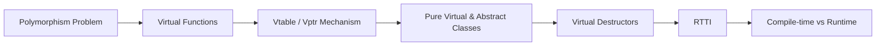

# Chapter 5: Polymorphism

> **Previous:** [Inheritance](./04-inheritance.md) | **Next:** [Operator Overloading](./06-operator-overloading.md)

## Learning Objectives

After studying this chapter, students will be able to:

- Explain the difference between compile-time and runtime polymorphism
- Declare and override virtual functions correctly
- Describe the virtual table mechanism and its costs
- Design abstract base classes with pure virtual functions
- Implement virtual destructors to ensure proper cleanup
- Apply RTTI features (`dynamic_cast`, `typeid`) judiciously

## Chapter at a Glance

| Topic | Key Insight | Practical Takeaway |
|-------|-------------|-------------------|
| Polymorphism Problem | Type tags + conditionals are fragile; polymorphism eliminates them | Let each class define its own behaviour behind a common interface |
| Virtual Functions | `virtual` enables runtime dispatch based on dynamic type | Always use `override` on derived overrides |
| Vtable/Vptr Mechanism | Compiler-generated table of function pointers per class | Adds one pointer per object and one indirection per call |
| Pure Virtual / Abstract | `= 0` makes a class abstract; defines an interface | Cannot instantiate; derived classes must implement all pure virtuals |
| Virtual Destructors | Ensure derived destructor runs through base pointer | If any virtual function exists, make destructor virtual |
| RTTI | `dynamic_cast` and `typeid` for runtime type queries | Use sparingly — frequent `dynamic_cast` suggests design flaw |
| Compile-time vs Runtime | Templates vs virtual functions — trade flexibility for speed | Choose based on whether types are known at compile time |

## Chapter Roadmap



## 5.1 The Polymorphism Problem

> **One-Sentence Takeaway:** Polymorphism removes type-tag conditionals by letting each derived class define its own behaviour behind a common interface.


Consider a shape hierarchy where each derived type draws itself differently. Without polymorphism, we must resort to type tags and conditional logic:

```cpp
void draw_shape(const Shape* s) {
    if (s->type() == CIRCLE)
        draw_circle(static_cast<const Circle*>(s));
    else if (s->type() == SQUARE)
        draw_square(static_cast<const Square*>(s));
    // ...
}
```

This approach is fragile: adding a new shape requires modifying every function that dispatches on type. Polymorphism solves this by letting each class define its own behaviour behind a common interface.

## 5.2 Virtual Functions

> **One-Sentence Takeaway:** A virtual function call is resolved at runtime based on the object's dynamic type, not its static type — the `override` specifier catches signature mismatches at compile time.

A `virtual` function is a member function whose behaviour can be overridden in a derived class. The call is resolved at runtime based on the object's dynamic type, not its static type.

```cpp
class Shape {
public:
    virtual void draw() const {
        std::cout << "Drawing a generic shape\n";
    }
};

class Circle : public Shape {
public:
    void draw() const override {
        std::cout << "Drawing a circle\n";
    }
};

class Square : public Shape {
public:
    void draw() const override {
        std::cout << "Drawing a square\n";
    }
};

void render(const Shape& s) {
    s.draw();   // runtime dispatch
}

int main() {
    Circle c;
    Square sq;
    render(c);   // "Drawing a circle"
    render(sq);  // "Drawing a square"
}
```

The `override` specifier (C++11) is not required but strongly recommended: it causes the compiler to verify that a base class virtual function with the same signature actually exists, catching signature mismatches at compile time.

> **Pro Tip:** Make it a habit to always write `override` after every virtual function override. Without it, a typo in the parameter list silently creates a new overload instead of overriding — a bug that is invisible at compile time.

## 5.3 The vtable and vptr Mechanism

> **One-Sentence Takeaway:** Each polymorphic class has a static vtable of function pointers, and each object carries a vptr to it — adding 8 bytes per object and one indirection per virtual call.

Virtual function dispatch is implemented through a virtual table (vtable) and a virtual pointer (vptr):

1. Every class with virtual functions has a static vtable: an array of function pointers.
2. Each object contains a hidden vptr pointing to its class's vtable.
3. A virtual function call `s.draw()` compiles to `(*(s.vptr[index]))(&s)`.

```
Object s (Circle):
  [vptr]  -------> Circle's vtable:
  [data_]           Shape::draw_area() -> Shape::draw_area
                    Circle::draw()     -> Circle::draw
```

Costs:
- Each object carries one extra pointer (vptr), increasing size by 8 bytes on 64-bit systems.
- Each virtual call requires an extra indirection through the vtable.
- Virtual functions cannot be inlined across translation units (though devirtualisation optimisations exist).

The vptr is initialised during construction: when the base class constructor runs, the vptr points to the base's vtable; once the derived constructor begins, it is updated to the derived's vtable.

## 5.4 Pure Virtual Functions and Abstract Classes

> **One-Sentence Takeaway:** A pure virtual function (`= 0`) makes the class abstract — it defines an interface contract that derived classes must fulfill.

A pure virtual function has no implementation in the declaring class and makes the class *abstract*—objects of that class cannot be instantiated.

```cpp
class Shape {
public:
    virtual double area() const = 0;     // pure virtual
    virtual void draw() const = 0;
};

// Circle must override both area and draw
class Circle : public Shape {
public:
    double area() const override { return 3.14159 * r_ * r_; }
    void draw() const override { /* ... */ }
private:
    double r_ = 1.0;
};
```

Abstract classes define interfaces. They can have data members, concrete member functions, and constructors (called by derived constructors). Attempting to instantiate an abstract class produces a compile-time error.

## 5.5 Virtual Destructors

> **One-Sentence Takeaway:** Deleting through a base pointer without a virtual destructor causes undefined behaviour — the derived destructor never runs.

When a base class pointer is used to delete a derived object, the destructor must be virtual to ensure the derived destructor runs:

```cpp
class Base {
public:
    ~Base() { std::cout << "~Base\n"; }
};

class Derived : public Base {
public:
    ~Derived() { std::cout << "~Derived\n"; }
};

int main() {
    Base* p = new Derived();
    delete p;   // Output: "~Base" only — DERIVED MEMORY LEAK
}
```

Fixing this requires a virtual destructor in the base:

```cpp
class Base {
public:
    virtual ~Base() = default;
};
```

Now `delete p` outputs `~Derived\n~Base\n`. As a rule of thumb: if a class has any virtual function, it should have a virtual destructor. If a class is designed to be a base class but has no virtual functions (rare), consider a protected non-virtual destructor to prevent deletion through a base pointer.

## 5.6 Runtime Type Identification

> **One-Sentence Takeaway:** RTTI (`dynamic_cast`, `typeid`) provides runtime type introspection but should be used sparingly — frequent use signals a missing virtual function in the interface.

C++ provides two operators for runtime type identification (RTTI):

- `dynamic_cast` — safely casts a base pointer/reference to a derived type, returning `nullptr` (for pointers) or throwing `std::bad_cast` (for references) on failure.
- `typeid` — returns a `std::type_info` object representing the dynamic type.

```cpp
void process(Shape& s) {
    Circle* c = dynamic_cast<Circle*>(&s);
    if (c) {
        std::cout << "Processing a circle of radius "
                  << c->radius() << '\n';
    }

    if (typeid(s) == typeid(Circle)) {
        std::cout << "Exact type is Circle\n";
    }
}
```

RTTI should be used sparingly. Frequent `dynamic_cast` suggests a design flaw

> **Warning:** `dynamic_cast` on references throws `std::bad_cast` on failure. If you use reference casts, ensure you have a catch handler — otherwise the exception propagates unexpectedly.

typically that the interface is insufficient and a virtual function should be added. The performance cost of dynamic_cast varies across implementations and class hierarchy depths.

## 5.7 Compile-Time vs Runtime Polymorphism

| Aspect | Compile-time (Templates/Overloading) | Runtime (Virtual Functions) |
|--------|--------------------------------------|----------------------------|
| Resolution | At compile time | At runtime |
| Mechanism | Template instantiation, overload resolution | vtable dispatch |
| Flexibility | Types must be known at compile time | Types can be loaded dynamically |
| Performance | Zero runtime overhead (inlining possible) | Indirect call (cannot inline across TU) |
| Coupling | Types must satisfy a duck-typed interface | Types must inherit from a common base |

Choosing between them depends on the problem: templates suit generic algorithms where type erasure is unnecessary; virtual functions suit heterogeneous collections and plugin architectures.

## Concept Comparison Table

| Approach | Dispatch Time | Mechanism | Overhead | Flexibility |
|----------|--------------|-----------|----------|-------------|
| Compile-time (Templates) | Compile time | Template instantiation | None (inlining possible) | Types known at compile time |
| Runtime (Virtual) | Runtime | Vtable + vptr | 8 bytes/object + indirection | Types unknown until runtime |
| CRTP | Compile time | Template base class | None | Requires complete type at compile time |
| `std::variant` + `visit` | Compile time (branch) | Index-based dispatch | Branch per alternative | Fixed set of types |
| Function pointers | Runtime | Direct call through pointer | Indirection per call | No type safety |

## Quick Reference

| Construct | Syntax | Critical Detail |
|-----------|--------|----------------|
| Virtual function | `virtual void f();` | Must be a non-static member function |
| Override | `void f() override;` | Compiler checks base has virtual `f` |
| Pure virtual | `virtual void f() = 0;` | Makes class abstract |
| Final | `void f() final;` | Prevents further overrides |
| Virtual destructor | `virtual ~T();` | Required if any virtual function exists |
| `dynamic_cast` (ptr) | `T* p = dynamic_cast<T*>(b);` | Returns `nullptr` on failure |
| `dynamic_cast` (ref) | `T& r = dynamic_cast<T&>(b);` | Throws `std::bad_cast` on failure |
| `typeid` | `typeid(*p)` | Returns `const std::type_info&` |

## Cross-Application Matrix

| Domain | How Concepts Apply |
|--------|-------------------|
| Game Engines | `GameObject::update()` is virtual; `Player::update()`, `Enemy::update()` override it |
| Plugin Architectures | Abstract `IPlugin` with pure virtual `execute()` — loaded from shared libraries |
| GUI Frameworks | `QWidget::paintEvent()` virtual — each widget type implements its own rendering |
| Device Drivers | Abstract `Driver` — `USBDriver`, `PCIeDriver` provide concrete virtual implementations |
| Test Mocking | Interfaces allow mock objects via virtual dispatch for unit testing |

## Chapter Quiz

1. How is the correct virtual function selected at runtime?
   A) By comparing type names as strings
   B) By following the object's vptr to its class vtable and indexing
   C) By checking each derived class in sequence
   D) By using a switch statement generated by the compiler
   <details><summary>Answer</summary>**B)** The vptr points to the most-derived class's vtable; the compiler indexes into it at a fixed offset known at compile time.</details>

2. What makes a class abstract?
   A) The `abstract` keyword
   B) A protected constructor
   C) At least one pure virtual function
   D) A virtual destructor
   <details><summary>Answer</summary>**C)** A class with one or more pure virtual functions (`= 0`) is abstract and cannot be instantiated.</details>

3. What happens if you delete through a base pointer without a virtual destructor?
   A) The derived destructor runs correctly
   B) Only the base destructor runs — undefined behaviour
   C) The compiler emits a warning but the code works
   D) An exception is thrown
   <details><summary>Answer</summary>**B)** Without a virtual destructor, only the base destructor is called — the derived destructor never runs, causing resource leaks and undefined behaviour.</details>

4. When should you avoid `dynamic_cast`?
   A) When you need to check if an object is a specific derived type
   B) When the cast can be replaced by a virtual function call
   C) When using references instead of pointers
   D) When the class hierarchy has virtual functions
   <details><summary>Answer</summary>**B)** Frequent `dynamic_cast` suggests the interface is incomplete — prefer adding a virtual function to the base class.</details>

5. The vptr is initialised to point to the correct vtable:
   A) Before any constructor runs
   B) During construction, changing as each constructor executes
   C) After the full object is constructed
   D) At link time
   <details><summary>Answer</summary>**B)** During construction, the vptr is set to the base class's vtable while the base constructor runs, then updated to the derived class's vtable when the derived constructor starts.</details>

## 5.8 Summary

Virtual functions enable runtime polymorphism through the vtable mechanism. Pure virtual functions define interfaces that derived classes must implement. Virtual destructors ensure correct cleanup in polymorphic hierarchies. RTTI provides limited runtime type introspection but should be used sparingly. The choice between compile-time and runtime polymorphism is a fundamental design decision in C++.

## Exercises

### Review Questions

1. Explain the content and initialisation order of the vptr during object construction.
2. What is the effect of forgetting `override` on a function that is meant to override a virtual?
3. Why must a destructor be virtual in a polymorphic base class?
4. What are the performance implications of virtual function calls?
5. When is `dynamic_cast` preferable to a virtual function?

### Application Problems

1. Implement a polymorphic shape hierarchy with classes `Shape` (abstract), `Circle`, `Rectangle`, and `Triangle`. Each must override `area()` and `draw()`. Store a collection of `Shape*` in a vector and iterate to display areas.
2. Create an abstract `Logger` interface with pure virtual `log_info`, `log_warning`, `log_error`. Implement `ConsoleLogger` and `FileLogger`. Write a factory function `Logger* create_logger(const std::string& type)`.

### Challenge Problem

3. Implement a simple plugin system. Create an abstract `class Filter` with a pure virtual `std::string apply(const std::string& input)`. Write `UpperCaseFilter`, `LowerCaseFilter`, `ReverseFilter`, and `RemoveSpacesFilter` as derived classes. Using a configuration file (or hardcoded for this exercise), read a list of filter names, instantiate the corresponding classes via a factory, and apply them in sequence to a test string.
