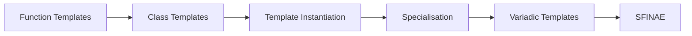

# Chapter 7: Templates

> **Previous:** [06-operator-overloading](./06-operator-overloading.md) | **Next:** [08-exceptions](./08-exceptions.md)

## Learning Objectives

After studying this chapter, students will be able to:

- Write type-agnostic function and class templates
- Understand template instantiation and code generation
- Apply template specialisation for type-specific behaviour
- Use variadic templates for type-safe heterogeneous parameter packs
- Recognise SFINAE and its role in overload resolution

## Chapter at a Glance

| Topic | Key Insight | Practical Takeaway |
|-------|-------------|-------------------|
| **Function Templates** | Type-agnostic functions using template parameters | Write once, use with any type that supports the operations |
| **Class Templates** | Type-parameterised classes | `std::vector<T>` is the canonical example |
| **Template Instantiation** | Compiler generates concrete code for each type used | Each instantiation is a separate type |
| **Template Specialisation** | Provide type-specific implementations | Use for optimisations or when generic version fails |
| **Variadic Templates** | Accept any number of type parameters | Enable perfect forwarding and tuple-like types |
| **SFINAE** | Substitution Failure Is Not An Error | Compile-time type introspection mechanism |

## Chapter Roadmap



## 7.1 Motivation


Strong typing is a cornerstone of C++, but it creates duplication when the same logic applies across multiple types. Consider a function that swaps two values: without templates, we write overloads for every type.

Templates eliminate this duplication by parameterising types:

```cpp
template <typename T>
void my_swap(T& a, T& b) {
    T tmp = a;
    a = b;
    b = tmp;
}

int main() {
    int x = 1, y = 2;
    my_swap(x, y);        // T deduced as int

    std::string s1 = "a", s2 = "b";
    my_swap(s1, s2);      // T deduced as std::string
}
```

## 7.2 Function Templates

> **One-Sentence Takeaway:** Function templates let you write type-agnostic code — the compiler generates a concrete function for each type you use.

A function template is not a function but a blueprint from which the compiler generates functions through *instantiation*. The template parameter can be deduced from the arguments or specified explicitly:

```cpp
template <typename T>
T max_of(T a, T b) {
    return (a > b) ? a : b;
}

int main() {
    auto a = max_of(3, 7);             // T = int
    auto b = max_of(3.14, 2.72);       // T = double
    auto c = max_of<double>(3, 2.72);  // explicit: T = double
}
```

Template parameters need not be types. Non-type template parameters accept compile-time constant values:

> **Pro Tip:** Use non-type template parameters (like `size_t N`) for compile-time dimensions — this shifts bounds checking from runtime to compile time with zero overhead.

```cpp
template <typename T, size_t N>
class FixedArray {
private:
    T data_[N];
public:
    constexpr size_t size() const { return N; }
    T& operator[](size_t i) { return data_[i]; }
};
```

## 7.3 Class Templates

> **One-Sentence Takeaway:** Class templates parameterise both data members and member functions — `std::vector<T>` and `std::array<T, N>` are canonical examples.

Class templates enable generic container types:

```cpp
template <typename T>
class Stack {
public:
    void push(const T& value) {
        data_.push_back(value);
    }

    void pop() {
        if (!data_.empty()) data_.pop_back();
    }

    const T& top() const {
        return data_.back();
    }

    bool empty() const { return data_.empty(); }

private:
    std::vector<T> data_;
};

// Usage:
Stack<int> int_stack;
int_stack.push(42);
Stack<std::string> str_stack;
str_stack.push("hello");
```

Member functions defined outside the class body require the template parameter again:

```cpp
template <typename T>
void Stack<T>::push(const T& value) {
    data_.push_back(value);
}
```

## 7.4 Template Specialisation

> **One-Sentence Takeaway:** Specialisation lets you provide a custom implementation for a specific type while keeping the generic version for all others.

Specialisation allows providing a different implementation for a specific type:

> **Warning:** Partial specialisation works for class templates but NOT for function templates — use overloading instead.

```cpp
// Primary template
template <typename T>
struct IsPointer {
    static constexpr bool value = false;
};

// Full specialisation for T*
template <typename T>
struct IsPointer<T*> {
    static constexpr bool value = true;
};
```

Function template specialisation:

```cpp
template <typename T>
std::string to_string(const T& value) {
    return std::to_string(value);
}

// Specialisation for std::string
template <>
std::string to_string(const std::string& value) {
    return value;
}
```

## 7.5 Variadic Templates

> **One-Sentence Takeaway:** Variadic templates accept any number of type parameters — they are the foundation of perfect forwarding and tuple-like types.

Variadic templates (C++11) accept an arbitrary number of template arguments:

```cpp
// Base case
void print_all() {}

// Recursive variadic
template <typename First, typename... Rest>
void print_all(const First& first, const Rest&... rest) {
    std::cout << first << ' ';
    print_all(rest...);
}

int main() {
    print_all(1, 3.14, "hello", 'c');
    // Output: 1 3.14 hello c
}
```

Fold expressions (C++17) simplify variadic operations:

```cpp
template <typename... Args>
auto sum(Args... args) {
    return (... + args);         // unary right fold
}

template <typename... Args>
void print_all(const Args&... args) {
    ((std::cout << args << ' '), ...);   // comma fold
}
```

Four fold forms exist:
- `(... + args)` — unary left fold
- `(args + ...)` — unary right fold
- `(0 + ... + args)` — binary left fold
- `(args + ... + 0)` — binary right fold

## 7.6 SFINAE

> **One-Sentence Takeaway:** Substitution Failure Is Not An Error — when template substitution produces invalid code, the compiler silently removes that candidate instead of failing.

Substitution Failure Is Not An Error (SFINAE) is a principle: when substituting template arguments for a function template produces an invalid type or expression, the compiler removes that candidate from overload resolution rather than emitting an error.

This enables compile-time introspection:

```cpp
// Detect whether a type has a .size() member
template <typename T, typename = void>
struct has_size : std::false_type {};

template <typename T>
struct has_size<T, std::void_t<decltype(std::declval<T>().size())>>
    : std::true_type {};

static_assert(has_size<std::vector<int>>::value);
static_assert(!has_size<int>::value);
```

`std::enable_if` is a classic SFINAE tool for conditionally enabling templates:

```cpp
template <typename T>
typename std::enable_if<std::is_integral<T>::value, T>::type
half(T value) {
    return value / 2;
}

template <typename T>
typename std::enable_if<std::is_floating_point<T>::value, T>::type
half(T value) {
    return value / 2.0;
}
```

C++17's `if constexpr` provides a cleaner alternative in many cases:

```cpp
template <typename T>
auto half(T value) {
    if constexpr (std::is_integral_v<T>) {
        return value / 2;
    } else {
        return value / 2.0;
    }
}
```

## Concept Comparison Table

| Feature | Syntax | Use Case | Limitation |
|---------|--------|----------|------------|
| Function Template | `template <typename T> T max(T a, T b)` | Type-agnostic algorithms | Must compile for all types used |
| Class Template | `template <typename T> class C {}` | Generic containers | Each instantiation separate code |
| Full Specialisation | `template <> class C<int> {}` | Type-specific optimisation | Must provide complete reimplementation |
| Partial Specialisation | `template <typename T> class C<T*> {}` | Match a family of types | Only for class templates |
| Variadic Template | `template <typename... Ts>` | Arbitrary number of args | Recursive instantiation complexity |
| SFINAE | `enable_if<condition>` | Compile-time introspection | Hard to debug |

## Quick Reference

| Construct | Syntax | Notes |
|-----------|--------|-------|
| Template declaration | `template <typename T>` | `typename` and `class` interchangeable |
| Function template | `T max(T a, T b)` | T deduced from arguments |
| Class template | `vector<T>` | Must specify T at instantiation |
| Variadic | `template <typename... Ts>` | Expand with `Ts...` |
| Fold expr (C++17) | `(op ...)` | Reduces recursive instantiation |
| SFINAE | `std::enable_if_t<condition, T>` | Replaced by Concepts in C++20 |

## Cross-Application Matrix

| Domain | How Concepts Apply |
|--------|-------------------|
| **Containers** | `vector<T>`, `list<T>`, `map<K,V>` — all class templates |
| **Algorithms** | `sort(begin, end)`, `find_if` — function templates |
| **Math Libraries** | `complex<T>`, `valarray<T>` — type-parameterised numeric types |
| **Serialisation** | Template `serialize<T>` for trivially-copyable types |
| **Smart Pointers** | `unique_ptr<T>`, `shared_ptr<T>` with custom deleters |

## Chapter Quiz

1. What does the compiler do when you call `max(3, 7)` with a function template?
   A) Creates one version for all ints
   B) Instantiates `int max(int, int)` concretely
   C) Creates a vtable entry
   D) Links to a precompiled version
   <details><summary>Answer</summary>**B)** The compiler generates a concrete instantiation with T = int.</details>

2. What problem do concepts (C++20) solve?
   A) Runtime performance of templates
   B) Inscrutable template error messages
   C) Binary size bloat
   D) Code duplication across TUs
   <details><summary>Answer</summary>**B)** Concepts replace SFINAE with readable requirements and clear errors.</details>

3. Partial specialisation is allowed for:
   A) Function templates only
   B) Class templates only
   C) Both
   D) Neither
   <details><summary>Answer</summary>**B)** Only class templates can be partially specialised.</details>

4. When is a template instantiated?
   A) When defined
   B) When used with a specific type
   C) When program starts
   D) When linker sees it
   <details><summary>Answer</summary>**B)** Templates are blueprints — no code until instantiation.</details>

5. SFINAE stands for:
   A) Standard Function Inlining and Name Evaluation
   B) Substitution Failure Is Not An Error
   C) Static Function Instantiation and Name Encoding
   D) Standard Function Instantiation with Non-type Arguments
   <details><summary>Answer</summary>**B)** Invalid template substitutions are silently removed from overload resolution.</details>

## 7.7 Summary

Templates enable type-parametric programming in C++. Function and class templates reduce code duplication, specialisation tailors behaviour for specific types, variadic templates handle heterogeneous parameter packs, and SFINAE enables compile-time type introspection. Templates are the foundation of the Standard Template Library and much of modern C++.

## Exercises

### Review Questions

1. How does template instantiation differ from function overloading?
2. What is the purpose of template specialisation?
3. Explain the difference between `typename` and `class` in template parameter declarations.
4. What problem do fold expressions solve?
5. What does SFINAE stand for and why is it important?

### Application Problems

1. Write a function template `find_max` that accepts a `std::vector<T>` and returns the maximum element. Test with `int`, `double`, and `std::string` vectors.
2. Implement a class template `RingBuffer<T, N>`—a fixed-size circular buffer using a `std::array<T, N>`. Provide `push`, `pop`, `front`, `back`, `size`, `empty`, and `full` operations. Ensure it works with non-default-constructible types.

### Challenge Problem

3. Implement a compile-time type erasure system: create a class template `Any` that can hold any type and a function template `any_cast<T>` to retrieve it. You may use `std::any` as a reference but must implement the core mechanism yourself using a base class with virtual functions, a derived wrapper template, and `typeid` for casting. Demonstrate holding `int`, `std::string`, and a user-defined `Point` struct.
