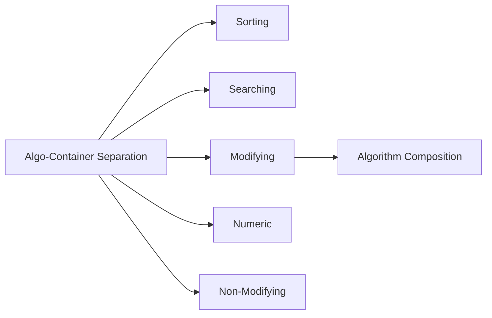

# Chapter 10: STL Algorithms

> **Previous:** [09-stl-containers](./09-stl-containers.md) | **Next:** [11-file-io](./11-file-io.md)

## Learning Objectives

After studying this chapter, students will be able to:

- Apply standard STL algorithms to common problems
- Use lambda expressions with algorithms (preview of Chapter 14)
- Distinguish among searching, sorting, modifying, and numeric algorithms
- Compose algorithms for complex operations
- Understand algorithm complexity guarantees

## Chapter at a Glance

| Topic | Key Insight | Practical Takeaway |
|-------|-------------|-------------------|
| **Algo-Container Separation** | Iterator design decouples algo from container | STL algorithms work with any container |
| **Sorting** | introsort default, stable_sort when order matters | Use sort() by default; partial_sort for top-N |
| **Searching** | find for unsorted, binary_search for sorted | Check sorted precondition before binary search |
| **Modifying** | copy, transform, replace mutate elements | Use back_inserter for output algorithms |
| **Numeric** | accumulate, inner_product in numeric header | Pair with lambdas for custom reductions |
| **Non-Modifying** | count_if, all_of query without mutation | Prefer STL algorithms over raw loops |

## Chapter Roadmap



## 10.1 The Algorithm-Container Separation


STL algorithms operate on iterator ranges rather than containers directly. This decoupling means a single algorithm works across `vector`, `list`, `deque`, `array`, and built-in arrays:

```cpp
#include <algorithm>
#include <vector>
#include <list>

int main() {
    std::vector<int> vec = {3, 1, 4, 1, 5};
    std::sort(vec.begin(), vec.end());   // sort vector

    std::list<int> lst = {9, 2, 6, 5, 3};
    // std::sort(lst.begin(), lst.end());   // ERROR: list iterators
    // are bidirectional, not random-access

    lst.sort();                          // list has its own sort
}
```

## 10.2 Sorting Algorithms

> **One-Sentence Takeaway:** std::sort is introsort (O(n log n)); std::stable_sort preserves relative order of equivalent elements.
```cpp
#include <algorithm>

std::vector<int> data = {4, 2, 5, 1, 3};

// QuickSort (median-of-three partitioning)
std::sort(data.begin(), data.end());                // ascending: 1 2 3 4 5

// Stable sort (preserves equal-element order)
std::stable_sort(data.begin(), data.end());

// Partial sort (top N elements in position)
std::partial_sort(data.begin(), data.begin() + 3, data.end());

// nth_element (single element in sorted position)
std::nth_element(data.begin(), data.begin() + 2, data.end());
// Elements before position 2 are all less than data[2]; elements after
// are all greater. Equivalent to "give me the 3rd smallest value."
```

Custom comparison functions:

```cpp
std::sort(data.begin(), data.end(), std::greater<int>());
// Descending: 5 4 3 2 1

std::sort(data.begin(), data.end(),
    [](int a, int b) { return a > b; });  // equivalent lambda
```

## 10.3 Searching Algorithms

> **One-Sentence Takeaway:** std::find is linear; std::binary_search and std::lower_bound require a sorted range.
```cpp
#include <algorithm>
#include <vector>

std::vector<int> data = {1, 2, 3, 4, 5, 6, 7, 8, 9, 10};

// Linear search (O(n))
auto it = std::find(data.begin(), data.end(), 5);
if (it != data.end()) {
    std::cout << "Found at position "
              << std::distance(data.begin(), it) << '\n';
}

// Binary search (O(log n) — data must be sorted)
bool exists = std::binary_search(data.begin(), data.end(), 5);

// Lower/upper bound (s sorted range)
auto lower = std::lower_bound(data.begin(), data.end(), 5);
// First element >= 5

auto upper = std::upper_bound(data.begin(), data.end(), 5);
// First element > 5

// equal_range: pair of lower_bound, upper_bound
auto [lo, hi] = std::equal_range(data.begin(), data.end(), 5);
```

## 10.4 Modifying Algorithms

> **One-Sentence Takeaway:** std::copy, std::transform, std::replace, and std::remove operate in-place or into an output iterator.
```cpp
#include <algorithm>
#include <vector>

std::vector<int> src = {1, 2, 3, 4, 5};
std::vector<int> dst(src.size());

// Copy
std::copy(src.begin(), src.end(), dst.begin());

// Fill
std::fill(dst.begin(), dst.end(), 0);

// Transform (apply function to each element)
std::transform(src.begin(), src.end(), dst.begin(),
    [](int x) { return x * x; });
// dst: 1 4 9 16 25

// Replace
std::replace(src.begin(), src.end(), 3, 99);  // replace 3 with 99

// Remove (does not erase — returns new logical end)
auto new_end = std::remove(src.begin(), src.end(), 5);
src.erase(new_end, src.end());   // erase-remove idiom

// Unique (remove consecutive duplicates)
auto uniq_end = std::unique(src.begin(), src.end());
src.erase(uniq_end, src.end());

// Reverse
std::reverse(src.begin(), src.end());

// Rotate
std::rotate(src.begin(), src.begin() + 2, src.end());
```

## 10.5 Numeric Algorithms

> **One-Sentence Takeaway:** std::accumulate, std::inner_product, and std::partial_sum in numeric handle reductions.
```cpp
#include <numeric>

std::vector<int> data = {1, 2, 3, 4, 5};

// Accumulate (fold left)
int sum = std::accumulate(data.begin(), data.end(), 0);
// 15

int product = std::accumulate(data.begin(), data.end(), 1,
    [](int a, int b) { return a * b; });
// 120

// Inner product
std::vector<int> a = {1, 2, 3};
std::vector<int> b = {4, 5, 6};
int dot = std::inner_product(a.begin(), a.end(), b.begin(), 0);
// 1*4 + 2*5 + 3*6 = 32

// Partial sums
std::vector<int> partials(data.size());
std::partial_sum(data.begin(), data.end(), partials.begin());
// 1 3 6 10 15

// Adjacent difference
std::vector<int> diffs(data.size());
std::adjacent_difference(data.begin(), data.end(), diffs.begin());
// 1 1 1 1 1
```

## 10.6 Non-Modifying Algorithms

> **One-Sentence Takeaway:** std::count_if, std::all_of, std::any_of, and std::none_of query ranges without mutation.
```cpp
std::vector<int> data = {1, 2, 3, 4, 5};

// for_each (apply function to each element)
std::for_each(data.begin(), data.end(),
    [](int& x) { x *= 2; });

// Count occurrences
int count = std::count(data.begin(), data.end(), 3);
int evens = std::count_if(data.begin(), data.end(),
    [](int x) { return x % 2 == 0; });

// All, any, none
bool all_pos = std::all_of(data.begin(), data.end(),
    [](int x) { return x > 0; });
bool any_even = std::any_of(data.begin(), data.end(),
    [](int x) { return x % 2 == 0; });
bool none_neg = std::none_of(data.begin(), data.end(),
    [](int x) { return x < 0; });

// Min/max element
auto min_it = std::min_element(data.begin(), data.end());
auto max_it = std::max_element(data.begin(), data.end());

// Minmax (C++11)
auto [lo, hi] = std::minmax_element(data.begin(), data.end());

// Mismatch
auto [it1, it2] = std::mismatch(vec1.begin(), vec1.end(), vec2.begin());

// Lexicographical compare
bool less = std::lexicographical_compare(
    vec1.begin(), vec1.end(), vec2.begin(), vec2.end());
```

## 10.7 Algorithm Composition

> **One-Sentence Takeaway:** Algorithms compose naturally through iterator adaptors like back_inserter and lambdas.
Complex operations are built by composing simpler algorithms:

```cpp
// Remove all odd numbers greater than 10
std::vector<int> data = {3, 12, 7, 15, 4, 11, 6};

auto pred = [](int x) { return x > 10 && x % 2 != 0; };
auto end = std::remove_if(data.begin(), data.end(), pred);
data.erase(end, data.end());

// Find first element that satisfies a condition
auto it = std::find_if(data.begin(), data.end(),
    [](int x) { return x > 5; });

// Sort by custom key
struct Person { std::string name; int age; };
std::vector<Person> people = {{"Alice", 30}, {"Bob", 25}, {"Charlie", 35}};

std::sort(people.begin(), people.end(),
    [](const Person& a, const Person& b) {
        return a.age < b.age;
    });
```

## Concept Comparison Table

| Algorithm Category | Example | Complexity | Requires Sorted? |
|-------------------|---------|------------|-----------------|
| Sorting | sort, stable_sort, partial_sort | O(n log n) avg | No (outputs sorted) |
| Binary Search | binary_search, lower_bound | O(log n) | Yes |
| Linear Search | find, find_if | O(n) | No |
| Modifying | copy, transform, replace, remove | O(n) | No |
| Numeric | accumulate, inner_product | O(n) | No |
| Query | count_if, all_of, any_of | O(n) | No |

## Quick Reference

| Algorithm | What It Does | Iterator Required |
|-----------|-------------|-------------------|
| sort | Sort range | RandomAccess |
| find | Linear search | Input |
| binary_search | Sorted range check | Forward |
| copy | Copy range | Output |
| transform | Apply function | Output |
| accumulate | Reduce | Input |
| count_if | Count matches | Input |

## Cross-Application Matrix

| Domain | How Concepts Apply |
|--------|-------------------|
| **Data Science** | sort + unique for dedup, accumulate for statistics |
| **Game Dev** | remove_if for culling entities, sort by draw order |
| **Finance** | stable_sort for transactions, accumulate for totals |
| **Text Processing** | find_first_of for search, transform for case conversion |
| **Networking** | copy for buffers, count_if for packet analysis |

## Chapter Quiz

1. What is the complexity of std::sort?
   A) O(n)
   B) O(n log n)
   C) O(n^2)
   D) O(log n)
   <details><summary>Answer</summary>**B)** std::sort is introsort with O(n log n) average complexity.</details>

2. Which algorithm requires a sorted range?
   A) find
   B) binary_search
   C) count_if
   D) copy
   <details><summary>Answer</summary>**B)** binary_search requires the range to be sorted.</details>

3. The less-than-numeric greater-than header contains:
   A) sort
   B) accumulate
   C) find
   D) copy
   <details><summary>Answer</summary>**B)** accumulate is in the numeric header.</details>

4. Which algorithm modifies a range in place?
   A) count_if
   B) find
   C) replace
   D) all_of
   <details><summary>Answer</summary>**C)** replace modifies elements matching a value.</details>

5. What does transform need besides a source range?
   A) A comparison function
   B) An output iterator and a unary operation
   C) A predicate
   D) A random access iterator
   <details><summary>Answer</summary>**B)** transform applies an operation and writes to an output iterator.</details>

## 10.8 Summary

STL algorithms separate operations from containers through iterator interfaces. Sorting, searching, modifying, and numeric algorithms cover most data processing needs. The erase-remove idiom is the standard pattern for element deletion. Algorithm composition through iterators and lambdas enables expressive, efficient data manipulation.

## Exercises

### Review Questions

1. Why does `std::sort` not work with `std::list` iterators?
2. What is the erase-remove idiom and why is `remove` insufficient alone?
3. How does `std::nth_element` differ from `std::partial_sort`?
4. When should `std::find` be preferred over `std::binary_search`?
5. What is the purpose of `std::accumulate`'s initial value parameter?

### Application Problems

1. Given a `std::vector<int>`, write code to: (a) remove duplicates, (b) sort descending, (c) keep only even numbers, (d) compute the sum of squares of the remaining elements. Compose standard algorithms.
2. Write a function `std::vector<int> merge_sorted(const std::vector<int>& a, const std::vector<int>& b)` that merges two sorted vectors using `std::merge`.

### Challenge Problem

3. Implement a simple grep-like utility: read lines from standard input into a `std::vector<std::string>`, then apply a sequence of filter operations based on command-line flags. Support `-i` (case-insensitive), `-r` (regex, using `std::regex`), `-c` (count only), and `-v` (invert match). Use `std::copy_if`, `std::count_if`, and lambda composition.
