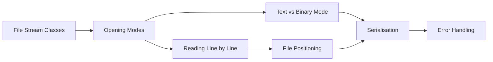

# Chapter 11: File I/O

> **Previous:** [10-stl-algorithms](./10-stl-algorithms.md) | **Next:** [12-smart-pointers](./12-smart-pointers.md)

## Learning Objectives

After studying this chapter, students will be able to:

- Open, read, and write text files using ifstream and ofstream
- Read and write binary files with proper data handling
- Position the file pointer for random access
- Serialise and deserialise C++ objects
- Handle file I/O errors correctly

## Chapter at a Glance

| Topic | Key Insight | Practical Takeaway |
|-------|-------------|-------------------|
| **File Stream Classes** | ifstream, ofstream, fstream with RAII cleanup | File closes automatically when stream goes out of scope |
| **Opening Modes** | Append, binary, truncate modes compose with bitwise OR | Always check stream state after opening |
| **Reading Line by Line** | getline reads until delimiter, manages buffers | Prefer getline over the extraction operator for text |
| **Text vs Binary Mode** | Binary preserves raw bytes; text transforms newlines | Use binary mode for non-text data to avoid corruption |
| **File Positioning** | seekg/seekp reposition; tellg/tellp query position | Verify position before and after seeks |
| **Serialisation** | Object-to-stream conversion for persistence | Write size-prefixed data for portable formats |

## Chapter Roadmap



## 11.1 File Stream Classes


The `<fstream>` header provides three file stream classes derived from `iostream`:

| Class | Base | Direction |
|-------|------|-----------|
| `ifstream` | `istream` | Input (read from file) |
| `ofstream` | `ostream` | Output (write to file) |
| `fstream` | `iostream` | Both (read and write) |

```cpp
#include <fstream>
#include <iostream>
#include <string>

int main() {
    std::ofstream out("example.txt");
    if (!out) {
        std::cerr << "Failed to open file for writing\n";
        return 1;
    }

    out << "Hello, file!\n";
    out << 42 << ' ' << 3.14159 << '\n';
    out.close();  // optional; destructor closes automatically

    std::ifstream in("example.txt");
    if (!in) {
        std::cerr << "Failed to open file for reading\n";
        return 1;
    }

    std::string greeting;
    int number;
    double pi;
    in >> greeting >> number >> pi;

    std::cout << greeting << '\n';   // Hello,
    std::cout << number << '\n';     // 42
    std::cout << pi << '\n';         // 3.14159
}
```

## 11.2 Opening Modes

> **One-Sentence Takeaway:** Opening modes (app, binary, in, out, trunc, ate) control how the file is opened and can be combined with bitwise OR.
File open modes are defined in `std::ios_base`:

| Flag | Effect |
|------|--------|
| `std::ios::in` | Open for reading |
| `std::ios::out` | Open for writing (truncates by default) |
| `std::ios::app` | Append (always write at end) |
| `std::ios::ate` | Seek to end on open (but can write anywhere) |
| `std::ios::trunc` | Truncate file if it exists |
| `std::ios::binary` | Open in binary mode |

```cpp
// Append to existing file
std::ofstream log("log.txt", std::ios::app);
log << "New log entry at " << std::time(nullptr) << '\n';

// Read and write without truncation
std::fstream file("data.bin",
                  std::ios::in | std::ios::out | std::ios::binary);
```

## 11.3 Reading Line by Line

> **One-Sentence Takeaway:** Use getline for line-oriented text input; it reads until the delimiter and handles buffer management.
```cpp
#include <fstream>
#include <string>

std::ifstream file("input.txt");
std::string line;

while (std::getline(file, line)) {
    std::cout << "Read: " << line << '\n';
}
```

`std::getline` reads until a newline character (or the specified delimiter) and discards it. The `while` condition evaluates to false when the stream reaches EOF or an error occurs.

Reading entire file at once:

```cpp
std::ifstream file("input.txt");
std::string content(
    std::istreambuf_iterator<char>(file),
    std::istreambuf_iterator<char>()
);
```

## 11.4 Text vs Binary Mode

> **One-Sentence Takeaway:** Binary mode reads and writes raw bytes.

> **Warning:** Text mode on Windows translates CRLF to LF on read and LF to CRLF on write — this corrupts binary data. Always use ios::binary for non-text files.
without text transformations, essential for non-text data.
In text mode, the runtime performs platform-specific transformations: on Windows, `\n` is written as `\r\n` and `\r\n` is read back as `\n`. Binary mode suppresses these transformations.

```cpp
// Binary mode—no transformations
std::ofstream out("data.bin", std::ios::binary);

struct Record {
    int id;
    double value;
    char name[32];
};

Record r = {1, 3.14, "Example"};
out.write(reinterpret_cast<const char*>(&r), sizeof(r));
out.close();

// Read binary
std::ifstream in("data.bin", std::ios::binary);
Record loaded;
in.read(reinterpret_cast<char*>(&loaded), sizeof(loaded));
```

Binary I/O is faster and avoids precision loss for floating-point values, but files are not human-readable and are not portable across architectures with different endianness or padding.

## 11.5 File Positioning

> **One-Sentence Takeaway:** tellg/tellp and seekg/seekp let you query and reposition the read/write cursor within a file.
File streams maintain two positions: the *get* position (for reading) and the *put* position (for writing). Positioning functions:

```cpp
#include <fstream>

std::fstream file("data.bin",
                  std::ios::in | std::ios::out | std::ios::binary);

// Get current positions
auto get_pos = file.tellg();    // tell get position
auto put_pos = file.tellp();    // tell put position

// Seek on get position
file.seekg(0, std::ios::beg);    // seek to beginning
file.seekg(100, std::ios::cur);  // seek 100 bytes forward
file.seekg(-50, std::ios::end);  // seek 50 bytes before end

// Seek on put position
file.seekp(0, std::ios::end);    // seek put to end
file.seekp(200, std::ios::beg);  // seek put to byte 200
```

## 11.6 Serialisation

> **One-Sentence Takeaway:** Serialisation converts objects to byte streams for storage or transmission.
Serialisation converts objects to a format suitable for storage or transmission. Simple struct serialisation:

```cpp
struct Student {
    char name[64];
    int id;
    double gpa;

    void save(std::ofstream& out) const {
        out.write(reinterpret_cast<const char*>(this), sizeof(*this));
    }

    void load(std::ifstream& in) {
        in.read(reinterpret_cast<char*>(this), sizeof(*this));
    }
};
```

For classes with dynamic allocation, a custom serialisation format is needed:

```cpp
class DynamicString {
public:
    void save(std::ofstream& out) const {
        size_t len = str_.size();
        out.write(reinterpret_cast<const char*>(&len), sizeof(len));
        out.write(str_.data(), len);
    }

    void load(std::ifstream& in) {
        size_t len = 0;
        in.read(reinterpret_cast<char*>(&len), sizeof(len));
        str_.resize(len);
        in.read(&str_[0], len);
    }

private:
    std::string str_;
};
```

## 11.7 Error Handling

> **One-Sentence Takeaway:** Stream state flags (good, fail, eof, bad) and explicit checking prevent silent data corruption.
File stream operations set error state flags:

```cpp
std::ifstream file("nonexistent.txt");
if (!file) {                         // or file.fail()
    std::cerr << "File not found\n";
    return 1;
}

// State flags
// file.good() — no error flags set
// file.bad()  — irrecoverable error (e.g., hardware)
// file.fail() — operation failed (recoverable)
// file.eof()  — end of file reached
```

Checking every read operation is important:

```cpp
int value;
while (file >> value) {   // returns false on failure or EOF
    process(value);
}

if (!file.eof()) {
    std::cerr << "Error reading file (non-EOF failure)\n";
}
```

## Concept Comparison Table

| Operation | ifstream | ofstream | fstream |
|-----------|----------|----------|---------|
| Open | `open(filename)` | `open(filename)` | `open(filename, mode)` |
| Read | `>>`, `getline`, `read` | — | `>>`, `getline`, `read` |
| Write | — | `<<`, `write` | `<<`, `write` |
| Close | `close()` | `close()` | `close()` |
| Default Mode | `in` | `out | trunc` | `in | out` |

## Quick Reference

| Concept | Syntax | Notes |
|---------|--------|-------|
| Open file | `ifstream file("name.txt")` | Constructor opens; destructor closes |
| Read line | `getline(file, line)` | Reads until delimiter (default newline) |
| Read binary | `file.read(buffer, size)` | Raw bytes, no transformation |
| Write binary | `file.write(data, size)` | Use with `ios::binary` mode |
| Seek | `file.seekg(pos)` / `file.seekp(pos)` | Absolute or relative via `beg`, `cur`, `end` |
| Tell | `file.tellg()` / `file.tellp()` | Returns `streampos` |
| Check state | `file.good()`, `file.fail()`, `file.eof()` | Always check after read operations |

## Cross-Application Matrix

| Domain | How Concepts Apply |
|--------|-------------------|
| **Config Files** | ifstream reads INI/JSON/YAML text configs |
| **Game Saves** | Binary serialisation of game state structs |
| **Databases** | fstream for low-level page storage, random access with seek |
| **Logging Systems** | ofstream in append mode for rotating log files |
| **Data Processing** | Sequential read, transform, write pipeline |

## Chapter Quiz

1. Which file stream class can both read and write?
   A) ifstream
   B) ofstream
   C) fstream
   D) iostream
   <details><summary>Answer</summary>**C)** fstream supports both input and output operations.</details>

2. What does `ios::binary` mode prevent?
   A) Opening the file
   B) Newline translation between platform formats
   C) Writing to the file
   D) Reading from the file
   <details><summary>Answer</summary>**B)** Binary mode disables newline translation, essential for non-text data.</details>

3. Which function reads a line from a file into a std::string?
   A) `file >> line`
   B) `file.read(line)`
   C) `getline(file, line)`
   D) `file.getline(line)`
   <details><summary>Answer</summary>**C)** `std::getline(file, line)` reads until the delimiter.</details>

4. seekg and seekp differ in that:
   A) seekg works on input streams, seekp on output streams
   B) seekg is absolute, seekp is relative
   C) They are identical
   D) seekg works only on binary files
   <details><summary>Answer</summary>**A)** seekg positions the get pointer (input), seekp positions the put pointer (output).</details>

5. The file destructor:
   A) Throws an exception if the file is open
   B) Closes the file automatically (RAII)
   C) Leaves the file open
   D) Truncates the file
   <details><summary>Answer</summary>**B)** The destructor closes the file automatically via RAII.</details>

## 11.8 Summary

File I/O in C++ uses stream classes that extend the `cin`/`cout` model. Text mode is human-readable but platform-dependent; binary mode is efficient and precise but not portable without care. File positioning enables random access, and serialisation translates between memory and storage formats. Always check stream state after I/O operations.

## Exercises

### Review Questions

1. What is the difference between text mode and binary mode on Windows?
2. When would you use `fstream` instead of separate `ifstream`/`ofstream` objects?
3. Why should `reinterpret_cast` be used carefully in binary I/O?
4. What are the four stream state flags and what does each indicate?
5. How does `tellg` differ from `tellp`?

### Application Problems

1. Write a program that reads a text file, counts the frequency of each word, and writes the results to another file sorted by frequency (descending).
2. Create a binary file format for storing `struct Employee { int id; char name[64]; double salary; };`. Write `save_database` and `load_database` functions that operate on `std::vector<Employee>`.

### Challenge Problem

3. Implement a simple indexed file database. Design a format with a fixed-size header containing a table of offsets. Support `insert(key, data)` and `find(key)` operations where data is a variable-length string. Use `seekg`/`seekp` for random access. The index should use a `std::map<std::string, long>` cached in memory and synchronised to the file header on close.
