# Chapter 11: File I/O

> **Previous:** [10-stl-algorithms](./10-stl-algorithms.md) | **Next:** [12-smart-pointers](./12-smart-pointers.md)

---

## Learning Objectives

After studying this chapter, students will be able to:

- Understand the C++ file stream hierarchy (ifstream, ofstream, fstream)
- Open files in various modes (in, out, app, binary, trunc, ate)
- Read and write text files using extraction/insertion operators and getline
- Read and write binary files using read()/write() member functions
- Distinguish between text and binary mode and choose appropriately
- Position the file pointer for random access using seekg/seekp and tellg/tellp
- Handle file I/O errors using stream state flags and exceptions
- Use string streams (istringstream, ostringstream, stringstream) for in-memory I/O
- Serialize and deserialize C++ objects for persistent storage
- Answer interview questions on file I/O confidently

---

## Prerequisites

| Concept | Required Knowledge |
|---------|-------------------|
| C++ Streams | Basic understanding of cin/cout from `<iostream>` |
| Classes & Objects | Chapter 2 → member functions, access specifiers |
| Pointers & References | Address-of operator, reinterpret_cast |
| Strings | std::string class basics |
| Arrays & Structs | POD types, fixed-size buffers |

---

## Chapter at a Glance

| Topic | Key Insight | Practical Takeaway |
|-------|-------------|-------------------|
| **File Stream Classes** | ifstream, ofstream, fstream with RAII cleanup | File closes automatically when stream goes out of scope |
| **Opening Modes** | Append, binary, truncate modes compose with bitwise OR | Always check stream state after opening |
| **Reading Text** | getline reads until delimiter; >> tokenizes on whitespace | Prefer getline over >> for line-oriented input |
| **Text vs Binary** | Binary preserves raw bytes; text transforms newlines | Use binary mode for non-text data to avoid corruption |
| **File Positioning** | seekg/seekp reposition; tellg/tellp query position | Verify position before and after seeks |
| **Error Handling** | good/fail/bad/eof flags detect I/O problems | Check stream state after every read operation |
| **String Streams** | In-memory I/O using same interface as file streams | Parse strings, format output, convert types without files |
| **Serialization** | Object-to-stream conversion for persistence | Write size-prefixed data for portable formats |

---

## Chapter Roadmap


```mermaid
flowchart LR
    A[File Stream Classes] --> B[Open Modes]
    B --> C[Read Text]
    B --> D[Write Text]
    C --> E[Text vs Binary]
    D --> E
    E --> F[File Positioning]
    F --> G[Error Handling]
    G --> H[String Streams]
    H --> I[Serialization]
    I --> J[Interview Corner]
```

---

## 11.1 Introduction to File I/O

### Real-World Analogy

<a href="../../assets/images/diagrams/oop-cpp/11-file-io/real-world-analogy-handwritten.svg" target="_blank" rel="noopener">
  
</a>
<a href="../../assets/images/diagrams/oop-cpp/11-file-io/real-world-analogy-diagram.svg" target="_blank" rel="noopener">
  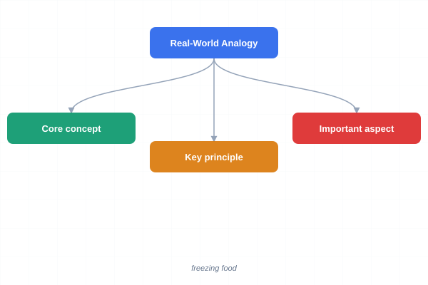
</a>
<a href="../../assets/images/diagrams/oop-cpp/11-file-io/real-world-analogy-sticky.svg" target="_blank" rel="noopener">
  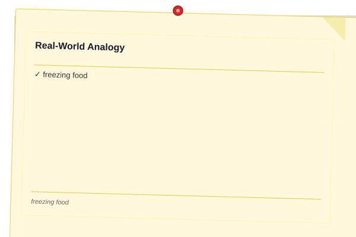
</a>


Think of file I/O like a **filing cabinet** in an office:

| Concept | Filing Cabinet Analogy |
|---------|----------------------|
| **Opening a file** | Pulling open a drawer |
| **Reading** | Looking at documents inside |
| **Writing** | Placing new documents in the drawer |
| **File position** | Your finger marking where you stopped reading |
| **Binary mode** | Reading the raw ink patterns on paper |
| **Text mode** | Reading the interpreted words on the page |
| **String stream** | Reading a sticky note without putting it in the cabinet |
| **Serialization** | Taking a whole folder and photocopying it exactly |

### What is File I/O?

<a href="../../assets/images/diagrams/oop-cpp/11-file-io/what-is-file-i-o-handwritten.svg" target="_blank" rel="noopener">
  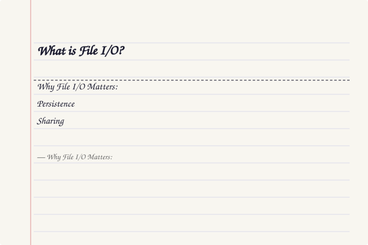
</a>
<a href="../../assets/images/diagrams/oop-cpp/11-file-io/what-is-file-i-o-diagram.svg" target="_blank" rel="noopener">
  
</a>
<a href="../../assets/images/diagrams/oop-cpp/11-file-io/what-is-file-i-o-sticky.svg" target="_blank" rel="noopener">
  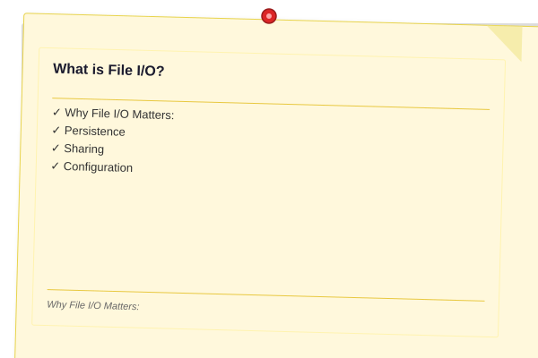
</a>


File I/O (Input/Output) is the mechanism by which a program reads data from or writes data to files on persistent storage (hard drive, SSD, etc.). Unlike console I/O (cin/cout), file I/O persists across program executions.

**Why File I/O Matters:**
- **Persistence** → Data survives program termination
- **Sharing** → Multiple programs can exchange data via files
- **Configuration** → Programs read settings from config files
- **Data Processing** → Batch process large datasets stored in files
- **Logging** → Record program activity for debugging and auditing

### Types of Files

<a href="../../assets/images/diagrams/oop-cpp/11-file-io/types-of-files-handwritten.svg" target="_blank" rel="noopener">
  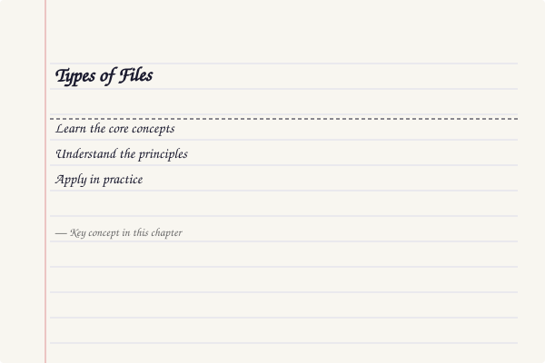
</a>
<a href="../../assets/images/diagrams/oop-cpp/11-file-io/types-of-files-diagram.svg" target="_blank" rel="noopener">
  
</a>
<a href="../../assets/images/diagrams/oop-cpp/11-file-io/types-of-files-sticky.svg" target="_blank" rel="noopener">
  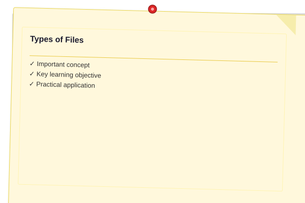
</a>


| File Type | Content | Readability | Use Case |
|-----------|---------|-------------|----------|
| **Text File** | Human-readable characters (ASCII/UTF-8) | Readable in any text editor | Configs, logs, CSV, JSON, XML |
| **Binary File** | Raw bytes matching memory representation | Not human-readable | Images, executables, serialized objects, databases |

---

## 11.2 File Stream Classes → ifstream, ofstream, fstream

### Real-World Analogy

<a href="../../assets/images/diagrams/oop-cpp/11-file-io/real-world-analogy-handwritten.svg" target="_blank" rel="noopener">
  
</a>
<a href="../../assets/images/diagrams/oop-cpp/11-file-io/real-world-analogy-diagram.svg" target="_blank" rel="noopener">
  
</a>
<a href="../../assets/images/diagrams/oop-cpp/11-file-io/real-world-analogy-sticky.svg" target="_blank" rel="noopener">
  
</a>


File streams are like **different types of doors** to a room:

| Stream Class | Door Type | What You Can Do |
|-------------|-----------|-----------------|
| `ifstream` | One-way window (look only) | Read the file, cannot modify |
| `ofstream` | One-way mail slot (send only) | Write to the file, cannot read |
| `fstream` | Revolving door (both ways) | Read and write the same file |

### Class Hierarchy

<a href="../../assets/images/diagrams/oop-cpp/11-file-io/class-hierarchy-handwritten.svg" target="_blank" rel="noopener">
  
</a>
<a href="../../assets/images/diagrams/oop-cpp/11-file-io/class-hierarchy-diagram.svg" target="_blank" rel="noopener">
  
</a>
<a href="../../assets/images/diagrams/oop-cpp/11-file-io/class-hierarchy-sticky.svg" target="_blank" rel="noopener">
  
</a>


```
<iostream>
  |
  +-- istream (input stream)    -----> ifstream (input file stream)
  |
  +-- ostream (output stream)   -----> ofstream (output file stream)
  |
  +-- iostream (bidirectional)  -----> fstream (file stream)
```

### Detailed Class Reference

<a href="../../assets/images/diagrams/oop-cpp/11-file-io/detailed-class-reference-handwritten.svg" target="_blank" rel="noopener">
  
</a>
<a href="../../assets/images/diagrams/oop-cpp/11-file-io/detailed-class-reference-diagram.svg" target="_blank" rel="noopener">
  
</a>
<a href="../../assets/images/diagrams/oop-cpp/11-file-io/detailed-class-reference-sticky.svg" target="_blank" rel="noopener">
  
</a>


| Class | Header | Base Class | Direction | Default Mode | When to Use |
|-------|--------|------------|-----------|-------------|-------------|
| `ifstream` | `<fstream>` | `istream` | Read only | `ios::in` | When you only need to read |
| `ofstream` | `<fstream>` | `ostream` | Write only | `ios::out \| ios::trunc` | When you only need to write |
| `fstream` | `<fstream>` | `iostream` | Read and write | `ios::in \| ios::out` | When you need both read and write |

### Steps for File I/O

<a href="../../assets/images/diagrams/oop-cpp/11-file-io/steps-for-file-i-o-handwritten.svg" target="_blank" rel="noopener">
  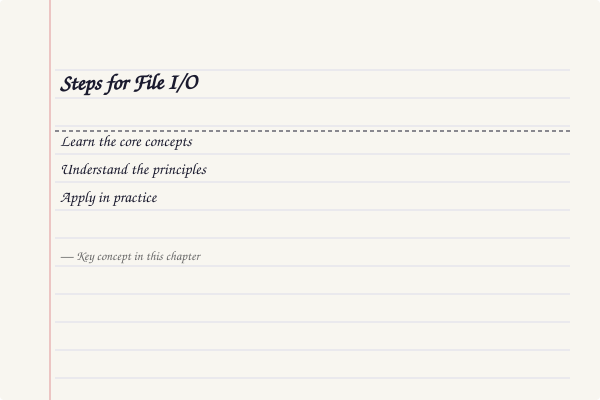
</a>
<a href="../../assets/images/diagrams/oop-cpp/11-file-io/steps-for-file-i-o-diagram.svg" target="_blank" rel="noopener">
  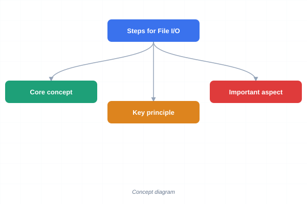
</a>
<a href="../../assets/images/diagrams/oop-cpp/11-file-io/steps-for-file-i-o-sticky.svg" target="_blank" rel="noopener">
  
</a>


```
STEP 1: Include the header (#include <fstream>)
STEP 2: Create a stream object (ifstream, ofstream, or fstream)
STEP 3: Open the file (constructor or open() member function)
STEP 4: Check if the file opened successfully
STEP 5: Perform read/write operations
STEP 6: Close the file (close() or let destructor handle it)
```

### Opening a File → Constructor vs open()

<a href="../../assets/images/diagrams/oop-cpp/11-file-io/opening-a-file-constructor-vs-open-handwritten.svg" target="_blank" rel="noopener">
  
</a>
<a href="../../assets/images/diagrams/oop-cpp/11-file-io/opening-a-file-constructor-vs-open-diagram.svg" target="_blank" rel="noopener">
  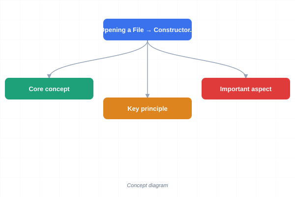
</a>
<a href="../../assets/images/diagrams/oop-cpp/11-file-io/opening-a-file-constructor-vs-open-sticky.svg" target="_blank" rel="noopener">
  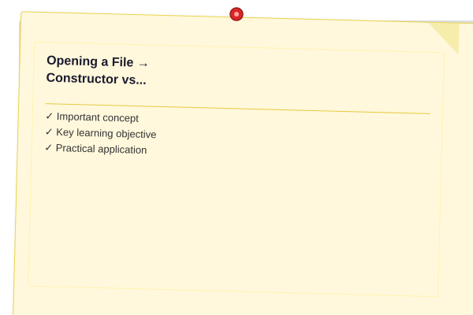
</a>


```cpp
// Method 1: Constructor (preferred → RAII)
std::ifstream file1("data.txt");

// Method 2: Default constructor + open()
std::ifstream file2;
file2.open("data.txt");

// Method 3: Constructor with mode flags
std::ofstream file3("log.txt", std::ios::app);
```

### Complete Example with Output

<a href="../../assets/images/diagrams/oop-cpp/11-file-io/complete-example-with-output-handwritten.svg" target="_blank" rel="noopener">
  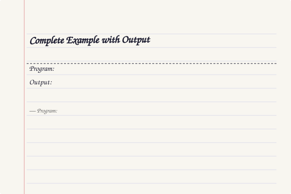
</a>
<a href="../../assets/images/diagrams/oop-cpp/11-file-io/complete-example-with-output-diagram.svg" target="_blank" rel="noopener">
  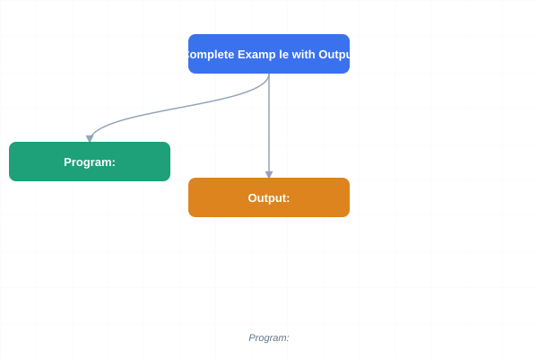
</a>
<a href="../../assets/images/diagrams/oop-cpp/11-file-io/complete-example-with-output-sticky.svg" target="_blank" rel="noopener">
  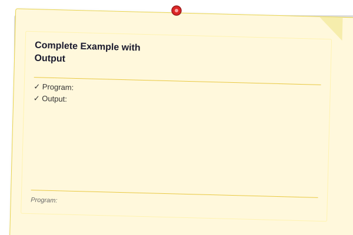
</a>


**Program:**
```cpp
#include <fstream>
#include <iostream>
#include <string>

int main() {
    // --- WRITING ---
    std::ofstream out("example.txt");
    if (!out) {
        std::cerr << "ERROR: Could not open file for writing.\n";
        return 1;
    }

    out << "Hello, File I/O!\n";
    out << "Line 2: The answer is " << 42 << "\n";
    out << "Line 3: Pi ≈ " << 3.14159 << "\n";
    out.close();   // explicit close (optional)

    // --- READING ---
    std::ifstream in("example.txt");
    if (!in) {
        std::cerr << "ERROR: Could not open file for reading.\n";
        return 1;
    }

    std::string line;
    while (std::getline(in, line)) {
        std::cout << "Read: " << line << "\n";
    }
    // in closes automatically when it goes out of scope (RAII)

    return 0;
}
```

**Output:**
```
Read: Hello, File I/O!
Read: Line 2: The answer is 42
Read: Line 3: Pi ≈ 3.14159
```

### Dry Run Trace Table → Writing Phase

<a href="../../assets/images/diagrams/oop-cpp/11-file-io/dry-run-trace-table-writing-phase-handwritten.svg" target="_blank" rel="noopener">
  
</a>
<a href="../../assets/images/diagrams/oop-cpp/11-file-io/dry-run-trace-table-writing-phase-diagram.svg" target="_blank" rel="noopener">
  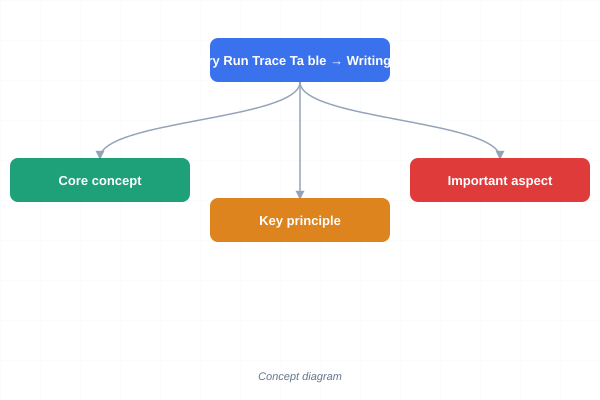
</a>
<a href="../../assets/images/diagrams/oop-cpp/11-file-io/dry-run-trace-table-writing-phase-sticky.svg" target="_blank" rel="noopener">
  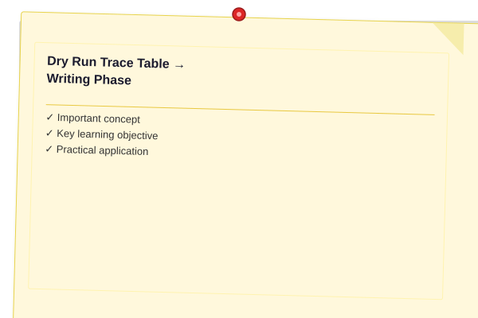
</a>


| Step | Line | out Stream State | File on Disk | Action |
|------|------|-----------------|--------------|--------|
| 1 | `ofstream out("example.txt")` | good=true, is_open=true | (empty, truncated) | File created/truncated |
| 2 | `out << "Hello, File I/O!\n"` | good=true | `Hello, File I/O!\n` | String written |
| 3 | `out << "Line 2: ..." << 42` | good=true | `Hello...\nLine 2: The answer is 42\n` | Formatted output |
| 4 | `out << "Line 3: ..." << 3.14159` | good=true | All three lines written | Number formatted |
| 5 | `out.close()` | good=true, is_open=false | File finalized | Resources released |

### Dry Run Trace Table → Reading Phase

<a href="../../assets/images/diagrams/oop-cpp/11-file-io/dry-run-trace-table-reading-phase-handwritten.svg" target="_blank" rel="noopener">
  
</a>
<a href="../../assets/images/diagrams/oop-cpp/11-file-io/dry-run-trace-table-reading-phase-diagram.svg" target="_blank" rel="noopener">
  
</a>
<a href="../../assets/images/diagrams/oop-cpp/11-file-io/dry-run-trace-table-reading-phase-sticky.svg" target="_blank" rel="noopener">
  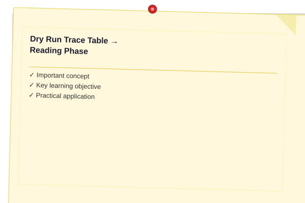
</a>


| Step | Line | in Stream State | `line` Value | `std::cout` Output |
|------|------|----------------|-------------|-------------------|
| 1 | `ifstream in("example.txt")` | good=true, eof=false | → | → |
| 2 | `getline(in, line)` → call 1 | good=true | `"Hello, File I/O!"` | `Read: Hello, File I/O!` |
| 3 | `getline(in, line)` → call 2 | good=true | `"Line 2: The answer is 42"` | `Read: Line 2: The answer is 42` |
| 4 | `getline(in, line)` → call 3 | good=true | `"Line 3: Pi ≈ 3.14159"` | `Read: Line 3: Pi ≈ 3.14159` |
| 5 | `getline(in, line)` → call 4 | eof=true, fail=true | `""` | Loop exits (no output) |

### Complexity Analysis

<a href="../../assets/images/diagrams/oop-cpp/11-file-io/complexity-analysis-handwritten.svg" target="_blank" rel="noopener">
  
</a>
<a href="../../assets/images/diagrams/oop-cpp/11-file-io/complexity-analysis-diagram.svg" target="_blank" rel="noopener">
  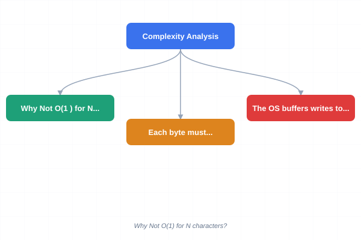
</a>
<a href="../../assets/images/diagrams/oop-cpp/11-file-io/complexity-analysis-sticky.svg" target="_blank" rel="noopener">
  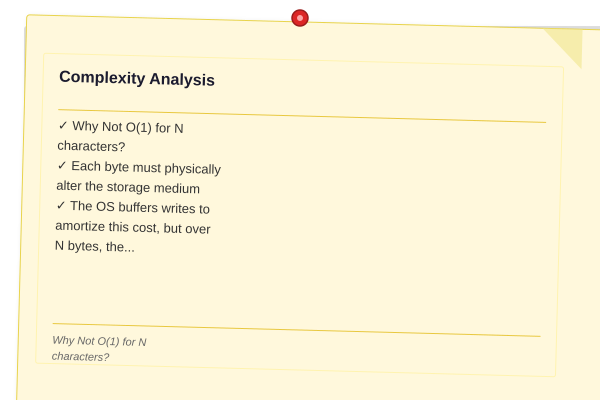
</a>


| Operation | Time Complexity | Space Complexity | Why? |
|-----------|----------------|-----------------|------|
| Opening a file | O(1) | O(1) | System call to open file descriptor; constant overhead |
| Reading one character | O(1) amortized | O(1) | Buffered I/O reads a block; subsequent chars from buffer |
| Reading N characters | O(N) | O(N) (if storing) | Each character must be copied from kernel to user space |
| Writing one character | O(1) amortized | O(1) | Buffered; actual disk write deferred |
| Writing N characters | O(N) | O(N) (if buffered) | Buffered writes grouped into fewer disk operations |
| Closing a file | O(1) | O(1) | Flushes buffers and releases file descriptor |

**Why Not O(1) for N characters?** The disk is a mechanical device (HDD) or has limited write cycles (SSD). Each byte must physically alter the storage medium. The OS buffers writes to amortize this cost, but over N bytes, the total work is proportional to N.

### Edge Cases → Opening Files

<a href="../../assets/images/diagrams/oop-cpp/11-file-io/edge-cases-opening-files-handwritten.svg" target="_blank" rel="noopener">
  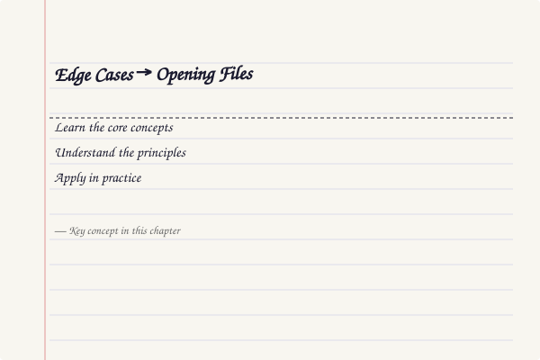
</a>
<a href="../../assets/images/diagrams/oop-cpp/11-file-io/edge-cases-opening-files-diagram.svg" target="_blank" rel="noopener">
  
</a>
<a href="../../assets/images/diagrams/oop-cpp/11-file-io/edge-cases-opening-files-sticky.svg" target="_blank" rel="noopener">
  
</a>


| Scenario | What Happens | How to Handle |
|----------|-------------|---------------|
| File does not exist (reading) | ifstream constructor fails; stream state = fail | Check `if (!file)` before reading |
| File does not exist (writing) | ofstream creates a new file | Check `if (!file)` anyway |
| File is read-only (writing) | ofstream fails; stream state = fail | Check stream state or use `std::filesystem::permissions` |
| File path contains spaces | Works if path is properly quoted in string | Use raw string literals or escape spaces |
| File path too long | Constructor throws (implementation-dependent) | Use relative paths under 260 chars (Windows) |
| Open file that is already open | Stream state = fail | Close first or use different stream object |

---

## 11.3 File Open Modes

### Real-World Analogy

<a href="../../assets/images/diagrams/oop-cpp/11-file-io/real-world-analogy-handwritten.svg" target="_blank" rel="noopener">
  
</a>
<a href="../../assets/images/diagrams/oop-cpp/11-file-io/real-world-analogy-diagram.svg" target="_blank" rel="noopener">
  
</a>
<a href="../../assets/images/diagrams/oop-cpp/11-file-io/real-world-analogy-sticky.svg" target="_blank" rel="noopener">
  
</a>


Open modes are like **instructions you give a librarian** about how you want to use a book:

| Mode Flag | Librarian Instruction |
|-----------|----------------------|
| `in` | "I want to read this book" |
| `out` | "I want to write in this book (erase what's there first)" |
| `app` | "I want to add notes at the end only" |
| `ate` | "Take me to the last page, but I can still flip anywhere" |
| `trunc` | "Clear the entire book before I start" |
| `binary` | "Don't translate anything → give me the raw pages" |

### Complete Open Modes Table

<a href="../../assets/images/diagrams/oop-cpp/11-file-io/complete-open-modes-table-handwritten.svg" target="_blank" rel="noopener">
  
</a>
<a href="../../assets/images/diagrams/oop-cpp/11-file-io/complete-open-modes-table-diagram.svg" target="_blank" rel="noopener">
  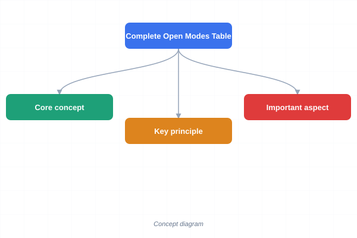
</a>
<a href="../../assets/images/diagrams/oop-cpp/11-file-io/complete-open-modes-table-sticky.svg" target="_blank" rel="noopener">
  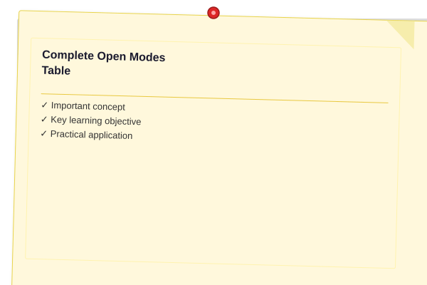
</a>


| Flag | Full Name | Effect | Default for ifstream | Default for ofstream | Default for fstream |
|------|-----------|--------|---------------------|---------------------|---------------------|
| `ios::in` | Input | Open for reading | ✅ Yes | ❌ No | ✅ Yes |
| `ios::out` | Output | Open for writing (implies trunc unless combined with in, app, or ate) | ❌ No | ✅ Yes | ✅ Yes |
| `ios::app` | Append | Always write at the end; file created if it doesn't exist | ❌ No | → | → |
| `ios::ate` | At End | Seek to end immediately after opening | ❌ No | → | → |
| `ios::trunc` | Truncate | If file exists, discard its contents | ❌ No | ✅ Yes (with out) | ❌ No |
| `ios::binary` | Binary | No newline translation; raw byte I/O | ❌ No | ❌ No | ❌ No |

### Combining Modes (Bitwise OR)

<a href="../../assets/images/diagrams/oop-cpp/11-file-io/combining-modes-bitwise-or-handwritten.svg" target="_blank" rel="noopener">
  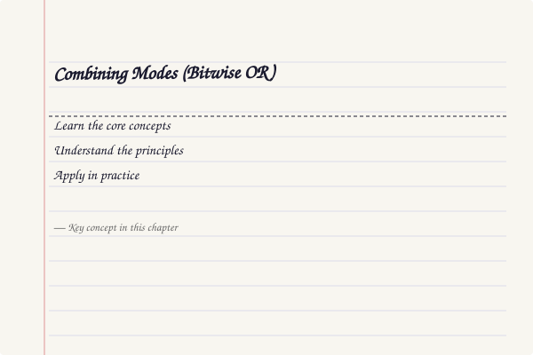
</a>
<a href="../../assets/images/diagrams/oop-cpp/11-file-io/combining-modes-bitwise-or-diagram.svg" target="_blank" rel="noopener">
  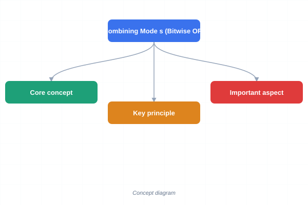
</a>
<a href="../../assets/images/diagrams/oop-cpp/11-file-io/combining-modes-bitwise-or-sticky.svg" target="_blank" rel="noopener">
  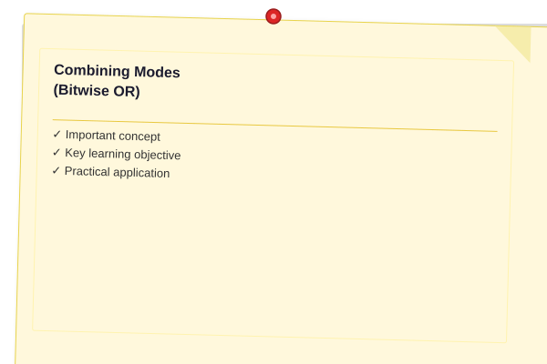
</a>


```cpp
// Read and write, no truncation (random access)
std::fstream rw("data.bin", std::ios::in | std::ios::out | std::ios::binary);

// Append mode for logs
std::ofstream log("server.log", std::ios::app);

// Write only, no truncation (rare)
std::ofstream edit("config.ini", std::ios::out | std::ios::in);

// Read from end (ate) in binary
std::ifstream tail("large.bin", std::ios::ate | std::ios::binary);
```

### Default Modes by Stream Type

<a href="../../assets/images/diagrams/oop-cpp/11-file-io/default-modes-by-stream-type-handwritten.svg" target="_blank" rel="noopener">
  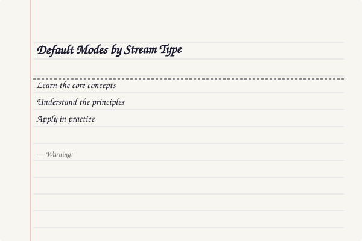
</a>
<a href="../../assets/images/diagrams/oop-cpp/11-file-io/default-modes-by-stream-type-diagram.svg" target="_blank" rel="noopener">
  
</a>
<a href="../../assets/images/diagrams/oop-cpp/11-file-io/default-modes-by-stream-type-sticky.svg" target="_blank" rel="noopener">
  
</a>


| Stream Type | Constructor | Equivalent Mode Flags |
|-------------|-------------|----------------------|
| `ifstream fin("f.txt")` | `in` | `ios::in` |
| `ofstream fout("f.txt")` | `out \| trunc` | `ios::out \| ios::trunc` |
| `fstream f("f.txt")` | `in \| out` | `ios::in \| ios::out` |

**Warning:** `ofstream` truncates by default! If you want to append, specify `app` explicitly:

```cpp
std::ofstream log("log.txt");          // TRUNCATES the file!
std::ofstream log("log.txt", ios::app); // Appends safely
```

### Code Example → Different Open Modes

<a href="../../assets/images/diagrams/oop-cpp/11-file-io/code-example-different-open-modes-handwritten.svg" target="_blank" rel="noopener">
  
</a>
<a href="../../assets/images/diagrams/oop-cpp/11-file-io/code-example-different-open-modes-diagram.svg" target="_blank" rel="noopener">
  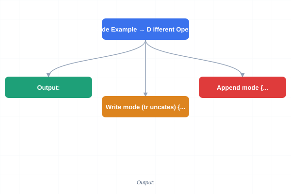
</a>
<a href="../../assets/images/diagrams/oop-cpp/11-file-io/code-example-different-open-modes-sticky.svg" target="_blank" rel="noopener">
  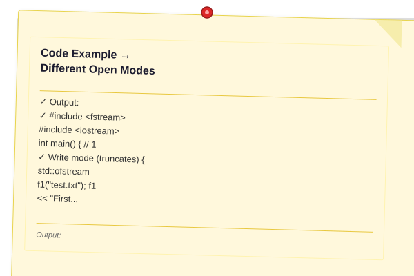
</a>


```cpp
#include <fstream>
#include <iostream>

int main() {
    // 1. Write mode (truncates)
    {
        std::ofstream f1("test.txt");
        f1 << "First write\n";
    }

    // 2. Append mode
    {
        std::ofstream f2("test.txt", std::ios::app);
        f2 << "Appended line\n";
    }

    // 3. Read the result
    {
        std::ifstream f3("test.txt");
        std::string line;
        while (std::getline(f3, line))
            std::cout << line << "\n";
    }

    return 0;
}
```

**Output:**
```
First write
Appended line
```

### Dry Run → Append Mode

<a href="../../assets/images/diagrams/oop-cpp/11-file-io/dry-run-append-mode-handwritten.svg" target="_blank" rel="noopener">
  
</a>
<a href="../../assets/images/diagrams/oop-cpp/11-file-io/dry-run-append-mode-diagram.svg" target="_blank" rel="noopener">
  
</a>
<a href="../../assets/images/diagrams/oop-cpp/11-file-io/dry-run-append-mode-sticky.svg" target="_blank" rel="noopener">
  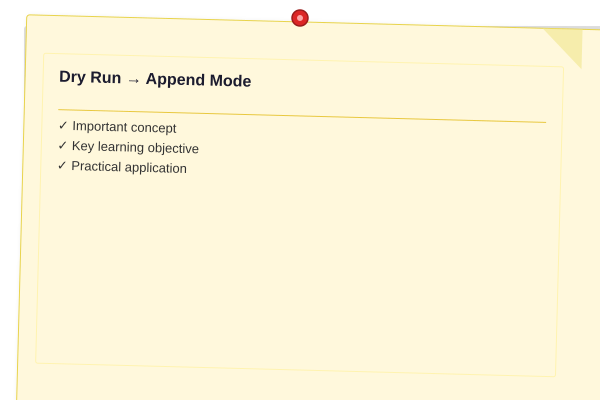
</a>


| Step | Operation | File Content After | Comment |
|------|-----------|-------------------|---------|
| 1 | `ofstream f1("test.txt")` | (empty) | File truncated/created |
| 2 | `f1 << "First write\n"` | `First write\n` | Content written |
| 3 | Destructor closes f1 | `First write\n` | File flushed |
| 4 | `ofstream f2(..., app)` | `First write\n` | File NOT truncated (append mode) |
| 5 | `f2 << "Appended line\n"` | `First write\nAppended line\n` | New content at end |
| 6 | Read via ifstream | → | Both lines visible |

### Edge Cases → Open Modes

<a href="../../assets/images/diagrams/oop-cpp/11-file-io/edge-cases-open-modes-handwritten.svg" target="_blank" rel="noopener">
  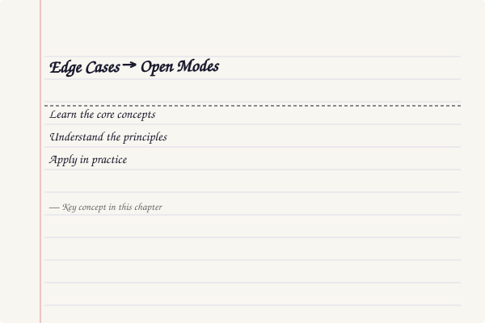
</a>
<a href="../../assets/images/diagrams/oop-cpp/11-file-io/edge-cases-open-modes-diagram.svg" target="_blank" rel="noopener">
  
</a>
<a href="../../assets/images/diagrams/oop-cpp/11-file-io/edge-cases-open-modes-sticky.svg" target="_blank" rel="noopener">
  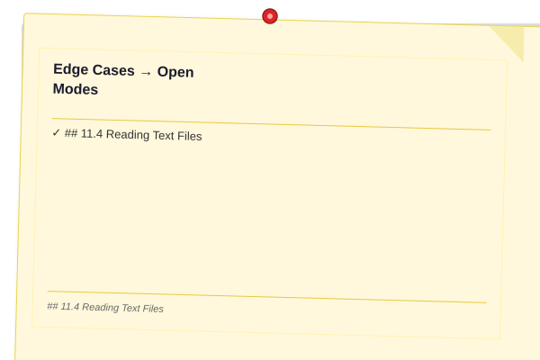
</a>


| Mode Combination | Behavior |
|-----------------|----------|
| `out \| trunc` | Same as `out` alone for ofstream → truncates |
| `out \| app` | Write at end only; seekp() has no effect |
| `in \| out` | fstream default; does NOT truncate |
| `in \| out \| trunc` | Opens for read/write but truncates first |
| `app` without `out` | Compiler error (app requires out on non-fstream) |

---

## 11.4 Reading Text Files

### Real-World Analogy

<a href="../../assets/images/diagrams/oop-cpp/11-file-io/real-world-analogy-handwritten.svg" target="_blank" rel="noopener">
  
</a>
<a href="../../assets/images/diagrams/oop-cpp/11-file-io/real-world-analogy-diagram.svg" target="_blank" rel="noopener">
  
</a>
<a href="../../assets/images/diagrams/oop-cpp/11-file-io/real-world-analogy-sticky.svg" target="_blank" rel="noopener">
  
</a>


Reading a text file is like **eating a sandwich**:

| Method | How You Eat |
|--------|------------|
| `>>` (extraction) | Taking one bite at a time, chewing each piece separately |
| `getline()` | Eating the whole sandwich in one continuous bite per line |
| `read()` | Blending the sandwich and drinking it as a smoothie |

### Method 1: Extraction Operator `>>`

<a href="../../assets/images/diagrams/oop-cpp/11-file-io/method-1-extraction-operator-handwritten.svg" target="_blank" rel="noopener">
  >`" width="30%">
</a>
<a href="../../assets/images/diagrams/oop-cpp/11-file-io/method-1-extraction-operator-diagram.svg" target="_blank" rel="noopener">
  >`" width="30%">
</a>
<a href="../../assets/images/diagrams/oop-cpp/11-file-io/method-1-extraction-operator-sticky.svg" target="_blank" rel="noopener">
  >`" width="30%">
</a>


Reads **token by token** (whitespace-delimited).

```cpp
#include <fstream>
#include <iostream>
#include <string>

int main() {
    std::ifstream file("scores.txt");
    // Assume scores.txt contains: "Alice 95 Bob 87 Charlie 92"

    std::string name;
    int score;

    while (file >> name >> score) {
        std::cout << name << " scored " << score << "\n";
    }

    return 0;
}
```

**Output:**
```
Alice scored 95
Bob scored 87
Charlie scored 92
```

**Dry Run:**

| Iteration | `name` | `score` | Stream State | What Happens |
|-----------|--------|---------|-------------|--------------|
| 1 | `"Alice"` | `95` | good=true | Read name then score |
| 2 | `"Bob"` | `87` | good=true | Read name then score |
| 3 | `"Charlie"` | `92` | good=true | Read name then score |
| 4 | → | → | eof=true | Extraction fails; loop exits |

### Method 2: getline() → Line by Line

<a href="../../assets/images/diagrams/oop-cpp/11-file-io/method-2-getline-line-by-line-handwritten.svg" target="_blank" rel="noopener">
  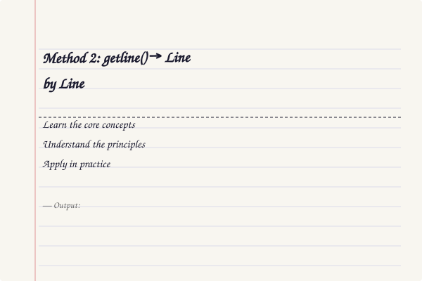
</a>
<a href="../../assets/images/diagrams/oop-cpp/11-file-io/method-2-getline-line-by-line-diagram.svg" target="_blank" rel="noopener">
  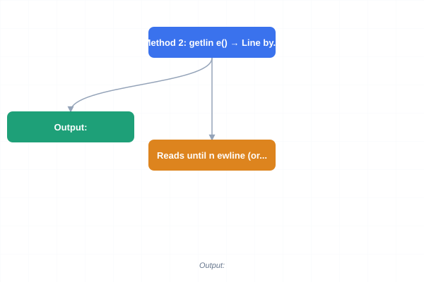
</a>
<a href="../../assets/images/diagrams/oop-cpp/11-file-io/method-2-getline-line-by-line-sticky.svg" target="_blank" rel="noopener">
  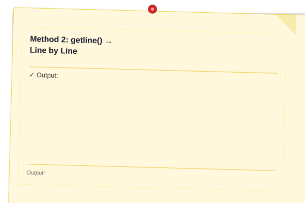
</a>


Reads until newline (or custom delimiter).

```cpp
#include <fstream>
#include <iostream>
#include <string>

int main() {
    std::ifstream file("poem.txt");
    // poem.txt:
    //   Roses are red,
    //   Violets are blue,
    //   C++ is powerful,
    //   And so are you.

    std::string line;
    int line_num = 1;

    while (std::getline(file, line)) {
        std::cout << line_num++ << ": " << line << "\n";
    }

    return 0;
}
```

**Output:**
```
1: Roses are red,
2: Violets are blue,
3: C++ is powerful,
4: And so are you.
```

### Dry Run → getline()

<a href="../../assets/images/diagrams/oop-cpp/11-file-io/dry-run-getline-handwritten.svg" target="_blank" rel="noopener">
  
</a>
<a href="../../assets/images/diagrams/oop-cpp/11-file-io/dry-run-getline-diagram.svg" target="_blank" rel="noopener">
  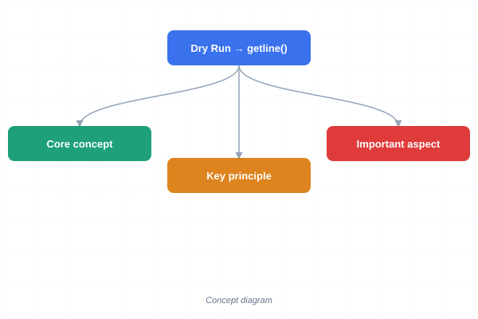
</a>
<a href="../../assets/images/diagrams/oop-cpp/11-file-io/dry-run-getline-sticky.svg" target="_blank" rel="noopener">
  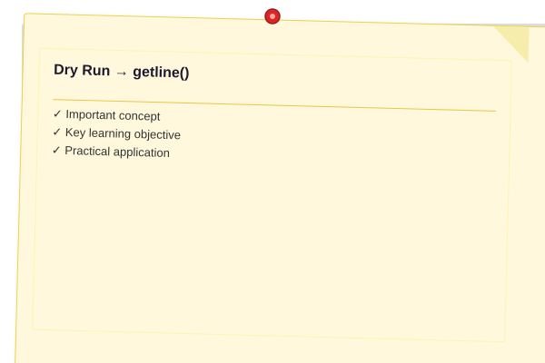
</a>


| Iteration | Buffer Before | `line` After | Stream State | Output |
|-----------|--------------|-------------|-------------|--------|
| 1 | `Roses are red,\nViolets...` | `"Roses are red,"` | good=true | `1: Roses are red,` |
| 2 | `Violets are blue,\nC++...` | `"Violets are blue,"` | good=true | `2: Violets are blue,` |
| 3 | `C++ is powerful,\nAnd...` | `"C++ is powerful,"` | good=true | `3: C++ is powerful,` |
| 4 | `And so are you.\n` | `"And so are you."` | good=true | `4: And so are you.` |
| 5 | (empty) | `""` | eof=true | Loop exits |

### Method 3: Reading Entire File at Once

<a href="../../assets/images/diagrams/oop-cpp/11-file-io/method-3-reading-entire-file-at-once-handwritten.svg" target="_blank" rel="noopener">
  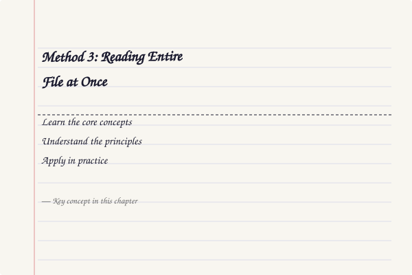
</a>
<a href="../../assets/images/diagrams/oop-cpp/11-file-io/method-3-reading-entire-file-at-once-diagram.svg" target="_blank" rel="noopener">
  
</a>
<a href="../../assets/images/diagrams/oop-cpp/11-file-io/method-3-reading-entire-file-at-once-sticky.svg" target="_blank" rel="noopener">
  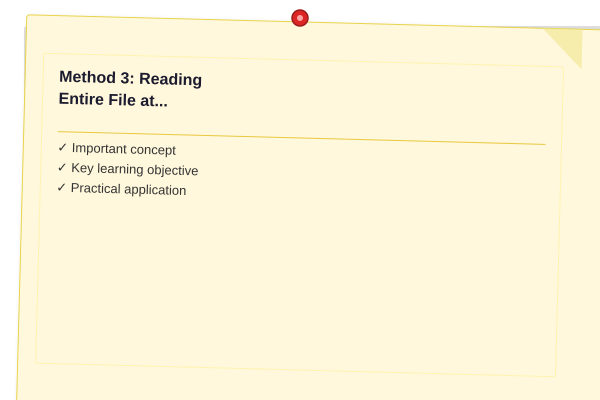
</a>


```cpp
#include <fstream>
#include <iostream>
#include <string>
#include <sstream>

int main() {
    // Method 3a: Using istreambuf_iterator
    {
        std::ifstream file("data.txt");
        std::string content(
            std::istreambuf_iterator<char>(file),
            std::istreambuf_iterator<char>()
        );
        std::cout << "File size: " << content.size() << " chars\n";
    }

    // Method 3b: Using stringstream
    {
        std::ifstream file("data.txt");
        std::stringstream buffer;
        buffer << file.rdbuf();
        std::string content = buffer.str();
        std::cout << "File size: " << content.size() << " chars\n";
    }

    return 0;
}
```

### Custom Delimiter with getline()

<a href="../../assets/images/diagrams/oop-cpp/11-file-io/custom-delimiter-with-getline-handwritten.svg" target="_blank" rel="noopener">
  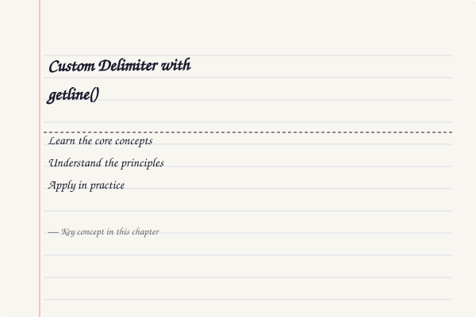
</a>
<a href="../../assets/images/diagrams/oop-cpp/11-file-io/custom-delimiter-with-getline-diagram.svg" target="_blank" rel="noopener">
  
</a>
<a href="../../assets/images/diagrams/oop-cpp/11-file-io/custom-delimiter-with-getline-sticky.svg" target="_blank" rel="noopener">
  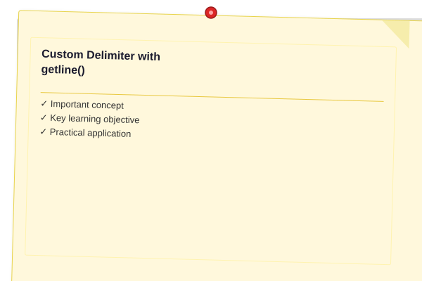
</a>


```cpp
std::string token;
while (std::getline(file, token, ',')) {   // comma-separated values
    std::cout << "Token: " << token << "\n";
}
```

### Complexity Analysis → Reading Text

<a href="../../assets/images/diagrams/oop-cpp/11-file-io/complexity-analysis-reading-text-handwritten.svg" target="_blank" rel="noopener">
  
</a>
<a href="../../assets/images/diagrams/oop-cpp/11-file-io/complexity-analysis-reading-text-diagram.svg" target="_blank" rel="noopener">
  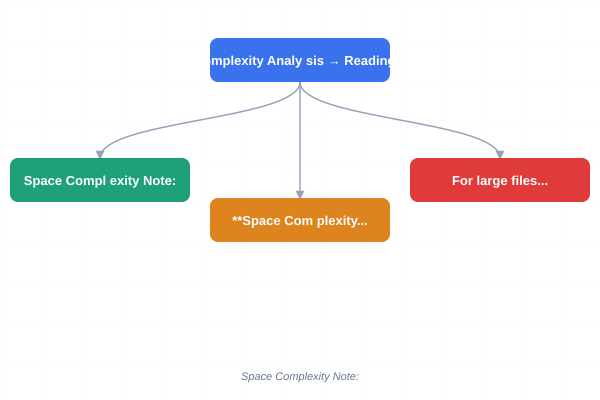
</a>
<a href="../../assets/images/diagrams/oop-cpp/11-file-io/complexity-analysis-reading-text-sticky.svg" target="_blank" rel="noopener">
  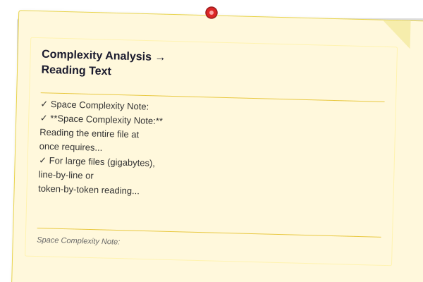
</a>


| Method | Time | Space | Why |
|--------|------|-------|-----|
| `>>` token by token | O(N) | O(max token) | Each token read, converted, and stored |
| `getline` line by line | O(N) | O(longest line) | Reads to newline, stores in string |
| `rdbuf()` to stringstream | O(N) | O(N) | Reads entire file into memory |
| `istreambuf_iterator` | O(N) | O(N) | Reads entire file in one shot |

**Space Complexity Note:** Reading the entire file at once requires O(N) memory. For large files (gigabytes), line-by-line or token-by-token reading is preferred to avoid exhausting RAM.

### Edge Cases → Reading Text

<a href="../../assets/images/diagrams/oop-cpp/11-file-io/edge-cases-reading-text-handwritten.svg" target="_blank" rel="noopener">
  
</a>
<a href="../../assets/images/diagrams/oop-cpp/11-file-io/edge-cases-reading-text-diagram.svg" target="_blank" rel="noopener">
  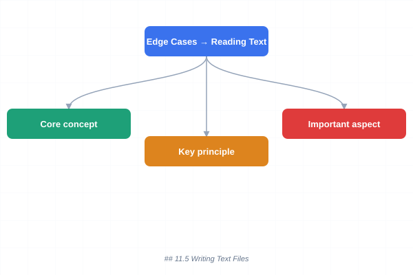
</a>
<a href="../../assets/images/diagrams/oop-cpp/11-file-io/edge-cases-reading-text-sticky.svg" target="_blank" rel="noopener">
  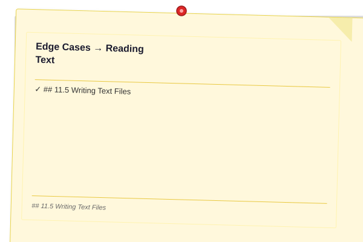
</a>


| Scenario | Behavior | Mitigation |
|----------|----------|------------|
| Empty file | `getline` returns false immediately; loop body never executes | Always check return value |
| File with no trailing newline | Last line still read correctly by `getline` | Works correctly |
| Very long line (10 MB) | `getline` allocates a huge string | Set a max length or read in chunks |
| Binary data in text mode | `\r\n` translated to `\n` on Windows; binary data corrupted | Use binary mode for non-text |
| Whitespace-only lines | `getline` returns an empty string (not false) | Check `line.length() > 0` |
| `>>` on empty file | Extraction fails immediately; stream state = eof | Check state before using values |

---

## 11.5 Writing Text Files

### Real-World Analogy

<a href="../../assets/images/diagrams/oop-cpp/11-file-io/real-world-analogy-handwritten.svg" target="_blank" rel="noopener">
  
</a>
<a href="../../assets/images/diagrams/oop-cpp/11-file-io/real-world-analogy-diagram.svg" target="_blank" rel="noopener">
  
</a>
<a href="../../assets/images/diagrams/oop-cpp/11-file-io/real-world-analogy-sticky.svg" target="_blank" rel="noopener">
  
</a>


Writing to a text file is like **recording a voice memo** → everything you say (write) gets captured in order.

### Method 1: Insertion Operator `<<`

<a href="../../assets/images/diagrams/oop-cpp/11-file-io/method-1-insertion-operator-handwritten.svg" target="_blank" rel="noopener">
  
</a>
<a href="../../assets/images/diagrams/oop-cpp/11-file-io/method-1-insertion-operator-diagram.svg" target="_blank" rel="noopener">
  
</a>
<a href="../../assets/images/diagrams/oop-cpp/11-file-io/method-1-insertion-operator-sticky.svg" target="_blank" rel="noopener">
  
</a>


```cpp
#include <fstream>
#include <iostream>

int main() {
    std::ofstream out("report.txt");

    if (!out) {
        std::cerr << "Failed to open report.txt\n";
        return 1;
    }

    out << "=== Monthly Report ===\n";
    out << "Date: 2024-01-15\n";
    out << "Revenue: $" << 45230.50 << "\n";
    out << "Expenses: $" << 31200.00 << "\n";
    out << "Net Profit: $" << 14030.50 << "\n";

    out.close();
    std::cout << "Report written successfully.\n";
    return 0;
}
```

**Output (console):**
```
Report written successfully.
```

**Output (report.txt):**
```
=== Monthly Report ===
Date: 2024-01-15
Revenue: $45230.5
Expenses: $31200
Net Profit: $14030.5
```

### Method 2: put() → Write Single Character

<a href="../../assets/images/diagrams/oop-cpp/11-file-io/method-2-put-write-single-character-handwritten.svg" target="_blank" rel="noopener">
  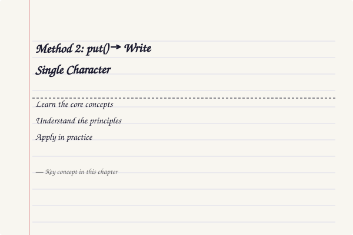
</a>
<a href="../../assets/images/diagrams/oop-cpp/11-file-io/method-2-put-write-single-character-diagram.svg" target="_blank" rel="noopener">
  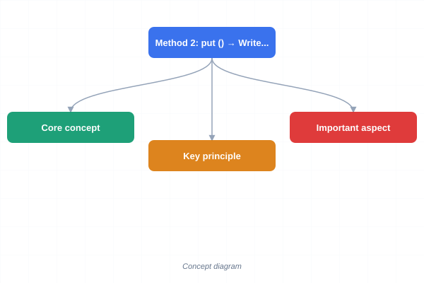
</a>
<a href="../../assets/images/diagrams/oop-cpp/11-file-io/method-2-put-write-single-character-sticky.svg" target="_blank" rel="noopener">
  
</a>


```cpp
std::ofstream out("letters.txt");
out.put('H');
out.put('e');
out.put('l');
out.put('l');
out.put('o');
out.put('\n');
// File content: "Hello\n"
```

### Method 3: write() → Write Raw Bytes

<a href="../../assets/images/diagrams/oop-cpp/11-file-io/method-3-write-write-raw-bytes-handwritten.svg" target="_blank" rel="noopener">
  
</a>
<a href="../../assets/images/diagrams/oop-cpp/11-file-io/method-3-write-write-raw-bytes-diagram.svg" target="_blank" rel="noopener">
  
</a>
<a href="../../assets/images/diagrams/oop-cpp/11-file-io/method-3-write-write-raw-bytes-sticky.svg" target="_blank" rel="noopener">
  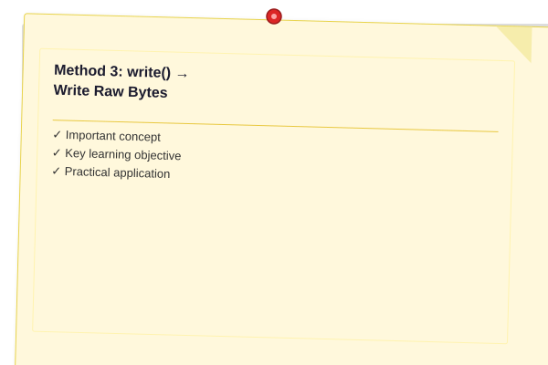
</a>


```cpp
std::ofstream out("data.bin", std::ios::binary);
int numbers[] = {1, 2, 3, 4, 5};
out.write(reinterpret_cast<const char*>(numbers), sizeof(numbers));
// Writes 20 bytes (5 ints × 4 bytes each)
```

### Formatting Output

<a href="../../assets/images/diagrams/oop-cpp/11-file-io/formatting-output-handwritten.svg" target="_blank" rel="noopener">
  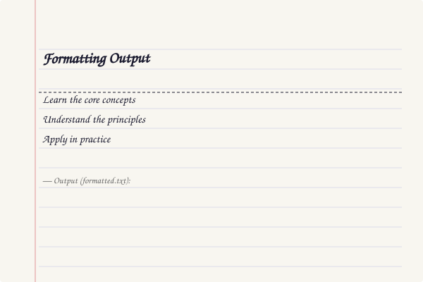
</a>
<a href="../../assets/images/diagrams/oop-cpp/11-file-io/formatting-output-diagram.svg" target="_blank" rel="noopener">
  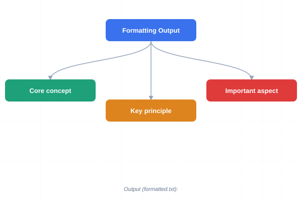
</a>
<a href="../../assets/images/diagrams/oop-cpp/11-file-io/formatting-output-sticky.svg" target="_blank" rel="noopener">
  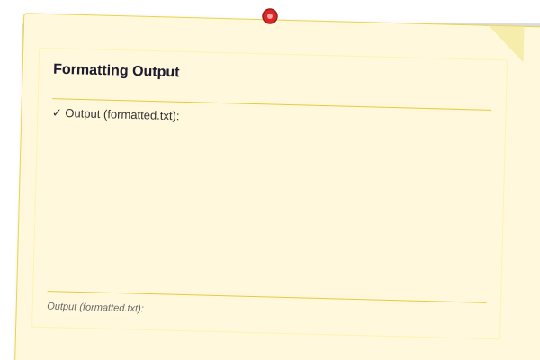
</a>


```cpp
#include <fstream>
#include <iomanip>   // for setw, setprecision, fixed

int main() {
    std::ofstream out("formatted.txt");

    double pi = 3.14159265358979;

    out << "Default:       " << pi << "\n";
    out << std::fixed << std::setprecision(2);
    out << "Fixed 2 dec:   " << pi << "\n";
    out << std::setprecision(6);
    out << "Fixed 6 dec:   " << pi << "\n";
    out << std::scientific;
    out << "Scientific:    " << pi << "\n";

    // Table formatting
    out << "\n" << std::left;
    out << std::setw(10) << "Name" << std::setw(10) << "Score" << "\n";
    out << std::setw(10) << "Alice" << std::setw(10) << 95 << "\n";
    out << std::setw(10) << "Bob"   << std::setw(10) << 87 << "\n";

    return 0;
}
```

**Output (formatted.txt):**
```
Default:       3.14159
Fixed 2 dec:   3.14
Fixed 6 dec:   3.141593
Scientific:    3.141593e+00

Name      Score
Alice     95
Bob       87
```

---

## 11.6 Text vs Binary Mode

### Real-World Analogy

<a href="../../assets/images/diagrams/oop-cpp/11-file-io/real-world-analogy-handwritten.svg" target="_blank" rel="noopener">
  
</a>
<a href="../../assets/images/diagrams/oop-cpp/11-file-io/real-world-analogy-diagram.svg" target="_blank" rel="noopener">
  
</a>
<a href="../../assets/images/diagrams/oop-cpp/11-file-io/real-world-analogy-sticky.svg" target="_blank" rel="noopener">
  
</a>


| Aspect | Text Mode | Binary Mode |
|--------|-----------|-------------|
| **Like** | Writing a letter | Taking a photocopy |
| **Reading** | Interpreting the handwriting | Scanning the exact ink pattern |
| **Translation** | "Best regards" → "Sincerely" (interpretation) | Exact pixel-for-pixel copy |
| **Result** | Human-readable, may lose some formatting | Not readable, but 100% accurate |

### Comparison Table

<a href="../../assets/images/diagrams/oop-cpp/11-file-io/comparison-table-handwritten.svg" target="_blank" rel="noopener">
  
</a>
<a href="../../assets/images/diagrams/oop-cpp/11-file-io/comparison-table-diagram.svg" target="_blank" rel="noopener">
  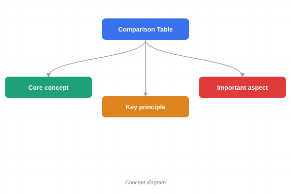
</a>
<a href="../../assets/images/diagrams/oop-cpp/11-file-io/comparison-table-sticky.svg" target="_blank" rel="noopener">
  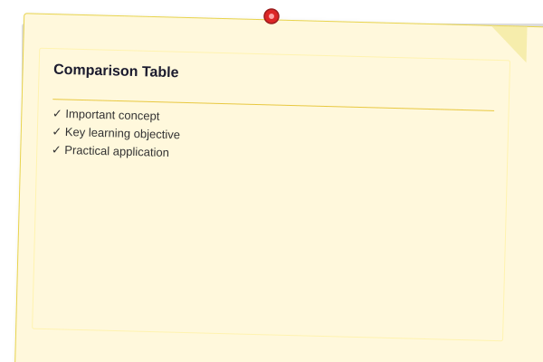
</a>


| Criterion | Text Mode | Binary Mode |
|-----------|-----------|-------------|
| **Flag** | Default (no flag needed) | `std::ios::binary` |
| **Newline Handling** | Translates `\n` ↔ `\r\n` on Windows | No translation |
| **EOF Marker** | `Ctrl+Z` (0x1A) treated as EOF on some systems | Every byte is data |
| **Data Representation** | Characters (ASCII/UTF-8) | Raw memory bytes |
| **Human Readable** | Yes | No |
| **Portability** | High (text is universal) | Low (endianness, padding, sizeof) |
| **Precision** | May lose precision on floating-point formatting | Full precision preserved |
| **Speed** | Slower (formatting/conversion overhead) | Faster (raw memory copy) |
| **File Size** | Larger (number-to-text conversion expands data) | Smaller (binary representation) |
| **Ideal For** | Config files, logs, CSV, source code | Images, executables, serialized data, databases |
| **read()/write()** | Possible but not recommended | The standard approach |
| **`<<` / `>>`** | The standard approach | Not meaningful |

### The Newline Translation Problem

<a href="../../assets/images/diagrams/oop-cpp/11-file-io/the-newline-translation-problem-handwritten.svg" target="_blank" rel="noopener">
  
</a>
<a href="../../assets/images/diagrams/oop-cpp/11-file-io/the-newline-translation-problem-diagram.svg" target="_blank" rel="noopener">
  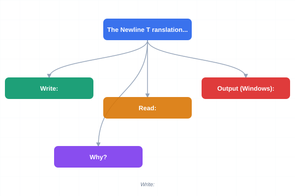
</a>
<a href="../../assets/images/diagrams/oop-cpp/11-file-io/the-newline-translation-problem-sticky.svg" target="_blank" rel="noopener">
  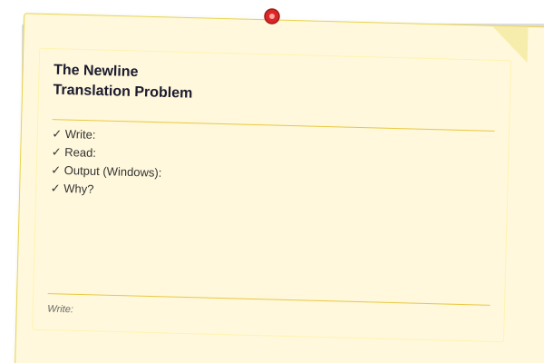
</a>


On Windows, text mode transforms:
- **Write:** `\n` (LF, 0x0A) → `\r\n` (CRLF, 0x0D 0x0A)
- **Read:** `\r\n` → `\n`

This means: writing 100 bytes with 10 newlines in text mode produces 110 bytes on disk.

```cpp
// Demonstration of the difference
#include <fstream>
#include <iostream>

int main() {
    // Text mode write
    {
        std::ofstream out("text_mode.txt");   // text mode
        out << "Line 1\nLine 2\n";             // \n → \r\n on Windows
    }

    // Binary mode write (same data)
    {
        std::ofstream out("binary_mode.txt", std::ios::binary);
        out << "Line 1\nLine 2\n";             // \n stays \n
    }

    // Compare sizes
    std::ifstream t("text_mode.txt", std::ios::ate | std::ios::binary);
    std::ifstream b("binary_mode.txt", std::ios::ate | std::ios::binary);
    std::cout << "Text mode size:   " << t.tellg() << " bytes\n";
    std::cout << "Binary mode size: " << b.tellg() << " bytes\n";

    return 0;
}
```

**Output (Windows):**
```
Text mode size:   16 bytes
Binary mode size: 14 bytes
```

**Why?** `Line 1\nLine 2\n` = 14 chars. Text mode writes `Line 1\r\nLine 2\r\n` = 16 chars.

### Binary I/O → read() and write()

<a href="../../assets/images/diagrams/oop-cpp/11-file-io/binary-i-o-read-and-write-handwritten.svg" target="_blank" rel="noopener">
  
</a>
<a href="../../assets/images/diagrams/oop-cpp/11-file-io/binary-i-o-read-and-write-diagram.svg" target="_blank" rel="noopener">
  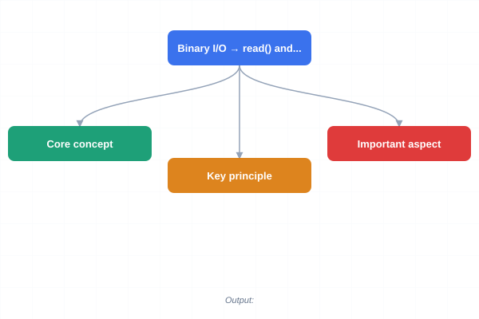
</a>
<a href="../../assets/images/diagrams/oop-cpp/11-file-io/binary-i-o-read-and-write-sticky.svg" target="_blank" rel="noopener">
  
</a>


```cpp
#include <fstream>
#include <iostream>
#include <cstring>

int main() {
    // --- Binary Write ---
    std::ofstream out("data.bin", std::ios::binary);

    int num = 12345;
    double pi = 3.14159265358979;
    char text[32] = "Hello Binary!";

    out.write(reinterpret_cast<const char*>(&num), sizeof(num));
    out.write(reinterpret_cast<const char*>(&pi), sizeof(pi));
    out.write(reinterpret_cast<const char*>(text), sizeof(text));
    out.close();

    std::cout << "Written " << sizeof(num) + sizeof(pi) + sizeof(text)
              << " bytes\n";

    // --- Binary Read ---
    std::ifstream in("data.bin", std::ios::binary);

    int num_in;
    double pi_in;
    char text_in[32];

    in.read(reinterpret_cast<char*>(&num_in), sizeof(num_in));
    in.read(reinterpret_cast<char*>(&pi_in), sizeof(pi_in));
    in.read(reinterpret_cast<char*>(text_in), sizeof(text_in));

    std::cout << "Read back: num=" << num_in
              << ", pi=" << pi_in
              << ", text=" << text_in << "\n";

    return 0;
}
```

**Output:**
```
Written 44 bytes
Read back: num=12345, pi=3.14159, text=Hello Binary!
```

### Why reinterpret_cast?

<a href="../../assets/images/diagrams/oop-cpp/11-file-io/why-reinterpret-cast-handwritten.svg" target="_blank" rel="noopener">
  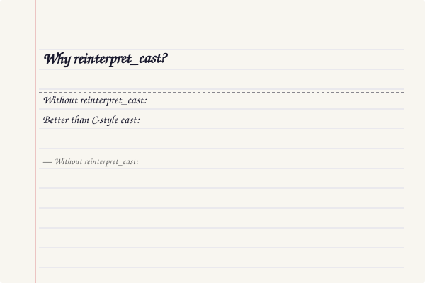
</a>
<a href="../../assets/images/diagrams/oop-cpp/11-file-io/why-reinterpret-cast-diagram.svg" target="_blank" rel="noopener">
  
</a>
<a href="../../assets/images/diagrams/oop-cpp/11-file-io/why-reinterpret-cast-sticky.svg" target="_blank" rel="noopener">
  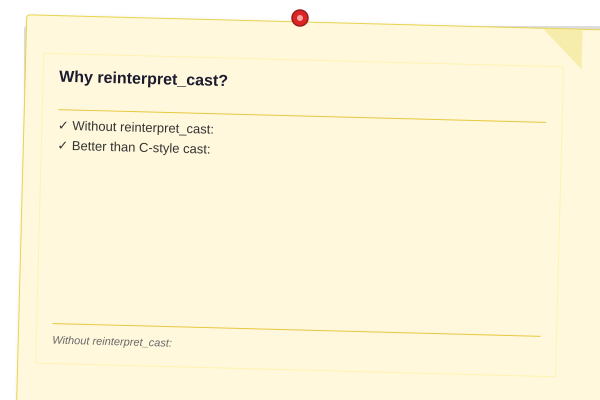
</a>


`read()` and `write()` expect `char*` pointers (raw byte views). `reinterpret_cast` tells the compiler:
> "Treat this `int*` / `double*` as a `char*` for byte-level access."

**Without reinterpret_cast:** Compiler error (type mismatch).
**Better than C-style cast:** More explicit intention; harder to misuse accidentally.

### Binary File Size Analysis

<a href="../../assets/images/diagrams/oop-cpp/11-file-io/binary-file-size-analysis-handwritten.svg" target="_blank" rel="noopener">
  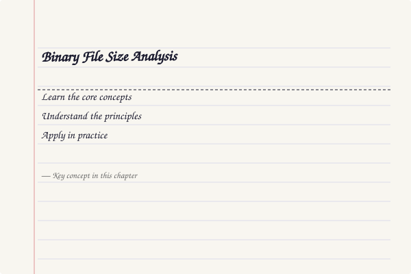
</a>
<a href="../../assets/images/diagrams/oop-cpp/11-file-io/binary-file-size-analysis-diagram.svg" target="_blank" rel="noopener">
  
</a>
<a href="../../assets/images/diagrams/oop-cpp/11-file-io/binary-file-size-analysis-sticky.svg" target="_blank" rel="noopener">
  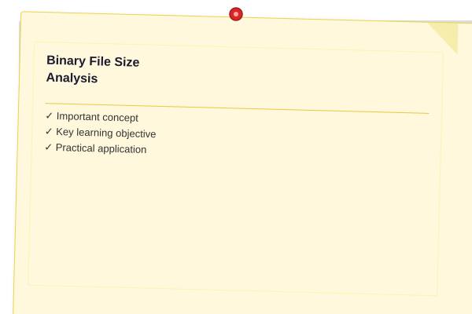
</a>


| Data Type | Text Representation | Binary Representation | Savings |
|-----------|-------------------|----------------------|---------|
| `int` (42) | 2 bytes (`"42"`) | 4 bytes (0x2A000000) | Text wins |
| `int` (1234567) | 7 bytes (`"1234567"`) | 4 bytes | Binary wins |
| `double` (3.14159) | 8 bytes (`"3.14159"`) | 8 bytes | Equal |
| `double` (0.0000001) | 10+ bytes (`"1e-07"`) | 8 bytes | Binary wins |
| `char[100]` ("Hello") | 5 bytes (`"Hello"`) | 100 bytes | Text wins |

### Portability Concerns → Binary Mode

<a href="../../assets/images/diagrams/oop-cpp/11-file-io/portability-concerns-binary-mode-handwritten.svg" target="_blank" rel="noopener">
  
</a>
<a href="../../assets/images/diagrams/oop-cpp/11-file-io/portability-concerns-binary-mode-diagram.svg" target="_blank" rel="noopener">
  
</a>
<a href="../../assets/images/diagrams/oop-cpp/11-file-io/portability-concerns-binary-mode-sticky.svg" target="_blank" rel="noopener">
  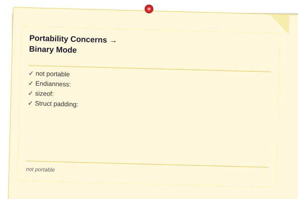
</a>


Binary files are **not portable** across platforms because:

1. **Endianness:** Intel = little-endian; PowerPC/SPARC = big-endian
2. **sizeof:** `int` is 4 bytes on most but 2 or 8 on some systems
3. **Struct padding:** Compilers may add different padding between members
4. **char signedness:** `char` may be signed or unsigned by default

```cpp
// Endianness example
int x = 0x01020304;
// Little-endian memory: 04 03 02 01
// Big-endian memory:    01 02 03 04
```

**Solution:** Use a serialization library (Protocol Buffers, Boost.Serialization, etc.) or define a portable format with fixed-width types.

---

## 11.7 File Positioning → tellg/tellp, seekg/seekp

### Real-World Analogy

<a href="../../assets/images/diagrams/oop-cpp/11-file-io/real-world-analogy-handwritten.svg" target="_blank" rel="noopener">
  
</a>
<a href="../../assets/images/diagrams/oop-cpp/11-file-io/real-world-analogy-diagram.svg" target="_blank" rel="noopener">
  
</a>
<a href="../../assets/images/diagrams/oop-cpp/11-file-io/real-world-analogy-sticky.svg" target="_blank" rel="noopener">
  
</a>


File positioning is like using a **bookmark**:

| Function | Bookmark Action |
|----------|----------------|
| `tellg()` | "What page number am I on?" (reading) |
| `tellp()` | "What page number am I on?" (writing) |
| `seekg(pos)` | "Jump to page X" (reading) |
| `seekp(pos)` | "Jump to page X" (writing) |
| `seekg(offset, dir)` | "Move N pages forward/backward from where I am" |

### Get Pointer vs Put Pointer

<a href="../../assets/images/diagrams/oop-cpp/11-file-io/get-pointer-vs-put-pointer-handwritten.svg" target="_blank" rel="noopener">
  
</a>
<a href="../../assets/images/diagrams/oop-cpp/11-file-io/get-pointer-vs-put-pointer-diagram.svg" target="_blank" rel="noopener">
  
</a>
<a href="../../assets/images/diagrams/oop-cpp/11-file-io/get-pointer-vs-put-pointer-sticky.svg" target="_blank" rel="noopener">
  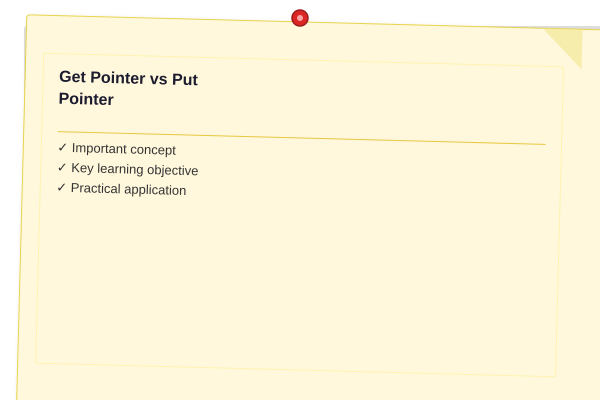
</a>


| Pointer | Associated With | Access via | Purpose |
|---------|----------------|------------|---------|
| **get pointer** | Input operations | `tellg()` / `seekg()` | Tracks next byte to read |
| **put pointer** | Output operations | `tellp()` / `seekp()` | Tracks where next write goes |
| Both (fstream) | Bidirectional | Both | Independent (usually) |

### Seeking Origins

<a href="../../assets/images/diagrams/oop-cpp/11-file-io/seeking-origins-handwritten.svg" target="_blank" rel="noopener">
  
</a>
<a href="../../assets/images/diagrams/oop-cpp/11-file-io/seeking-origins-diagram.svg" target="_blank" rel="noopener">
  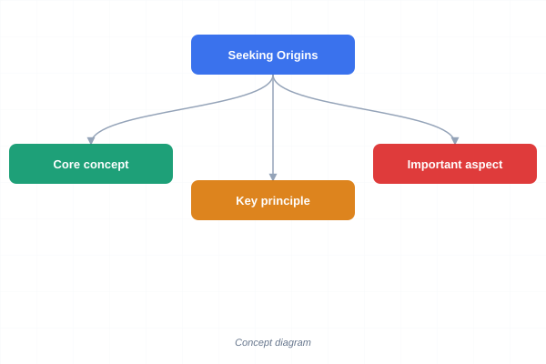
</a>
<a href="../../assets/images/diagrams/oop-cpp/11-file-io/seeking-origins-sticky.svg" target="_blank" rel="noopener">
  
</a>


| Origin | Meaning | Typical Use |
|--------|---------|-------------|
| `ios::beg` | Beginning of file | Jump to absolute position from start |
| `ios::cur` | Current position | Relative forward/backward movement |
| `ios::end` | End of file | Jump to position relative to end |

### Complete seekg/seekp Reference

<a href="../../assets/images/diagrams/oop-cpp/11-file-io/complete-seekg-seekp-reference-handwritten.svg" target="_blank" rel="noopener">
  
</a>
<a href="../../assets/images/diagrams/oop-cpp/11-file-io/complete-seekg-seekp-reference-diagram.svg" target="_blank" rel="noopener">
  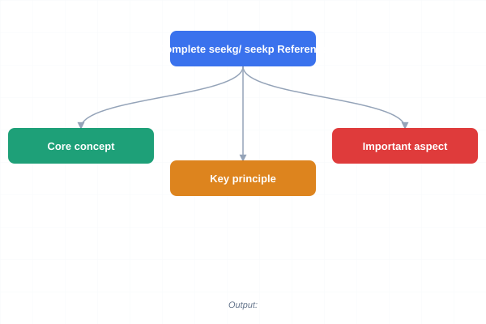
</a>
<a href="../../assets/images/diagrams/oop-cpp/11-file-io/complete-seekg-seekp-reference-sticky.svg" target="_blank" rel="noopener">
  
</a>


```cpp
#include <fstream>
#include <iostream>

int main() {
    std::fstream file("numbers.bin",
                      std::ios::in | std::ios::out | std::ios::binary);

    // Prepare data: write 10 integers
    for (int i = 0; i < 10; ++i) {
        file.write(reinterpret_cast<const char*>(&i), sizeof(i));
    }

    // --- Absolute seeking (from beginning) ---
    file.seekg(0, std::ios::beg);        // Go to byte 0
    int first;
    file.read(reinterpret_cast<char*>(&first), sizeof(first));
    std::cout << "First: " << first << "\n";  // 0

    // --- Absolute seeking (from end) ---
    file.seekg(-sizeof(int), std::ios::end);  // Go to last int
    int last;
    file.read(reinterpret_cast<char*>(&last), sizeof(last));
    std::cout << "Last: " << last << "\n";    // 9

    // --- Relative seeking (from current) ---
    file.seekg(-3 * sizeof(int), std::ios::cur); // Back 3 ints
    int middle;
    file.read(reinterpret_cast<char*>(&middle), sizeof(middle));
    std::cout << "Three back from end: " << middle << "\n"; // 7

    // --- Using tellg to get position ---
    file.seekg(5 * sizeof(int), std::ios::beg);  // Go to int at index 5
    std::streampos pos = file.tellg();
    std::cout << "Current get position: " << pos << " bytes\n"; // 20

    int value_at_5;
    file.read(reinterpret_cast<char*>(&value_at_5), sizeof(value_at_5));
    std::cout << "Value at position " << pos << ": " << value_at_5 << "\n"; // 5

    return 0;
}
```

**Output:**
```
First: 0
Last: 9
Three back from end: 7
Current get position: 20 bytes
Value at position 20: 5
```

### Dry Run → File Positioning

<a href="../../assets/images/diagrams/oop-cpp/11-file-io/dry-run-file-positioning-handwritten.svg" target="_blank" rel="noopener">
  
</a>
<a href="../../assets/images/diagrams/oop-cpp/11-file-io/dry-run-file-positioning-diagram.svg" target="_blank" rel="noopener">
  
</a>
<a href="../../assets/images/diagrams/oop-cpp/11-file-io/dry-run-file-positioning-sticky.svg" target="_blank" rel="noopener">
  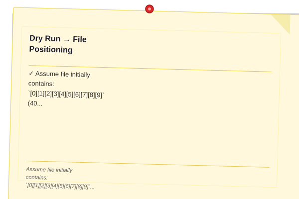
</a>


Assume file initially contains: `[0][1][2][3][4][5][6][7][8][9]` (40 bytes, 4 bytes per int)

| Step | Operation | get Pointer | put Pointer | Action |
|------|-----------|-------------|-------------|--------|
| Initial (after write) | → | 40 (EOF) | 40 (EOF) | File written |
| 1 | `seekg(0, beg)` | 0 | 40 | Jump to start for reading |
| 2 | `read(&first, 4)` | 4 | 40 | Read int 0 → `first=0` |
| 3 | `seekg(-4, end)` | 36 | 40 | Jump to last int |
| 4 | `read(&last, 4)` | 40 | 40 | Read int 9 → `last=9` |
| 5 | `seekg(-12, cur)` | 28 | 40 | Back 3 ints from 40 |
| 6 | `read(&middle, 4)` | 32 | 40 | Read int 7 → `middle=7` |
| 7 | `seekg(20, beg)` | 20 | 40 | Jump to byte 20 |
| 8 | `tellg()` | 20 → returned | 40 | Returns `20` |
| 9 | `read(&v, 4)` | 24 | 40 | Read int 5 → `v=5` |

### Random Access Example → CSV Indexing

<a href="../../assets/images/diagrams/oop-cpp/11-file-io/random-access-example-csv-indexing-handwritten.svg" target="_blank" rel="noopener">
  
</a>
<a href="../../assets/images/diagrams/oop-cpp/11-file-io/random-access-example-csv-indexing-diagram.svg" target="_blank" rel="noopener">
  
</a>
<a href="../../assets/images/diagrams/oop-cpp/11-file-io/random-access-example-csv-indexing-sticky.svg" target="_blank" rel="noopener">
  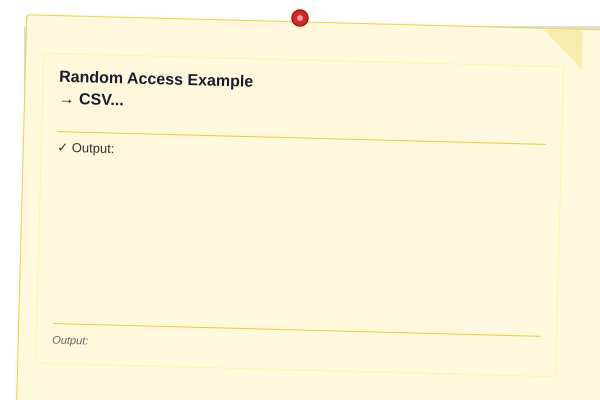
</a>


```cpp
#include <fstream>
#include <iostream>
#include <vector>

struct Employee {
    int id;
    char name[48];
    double salary;
};

int main() {
    // Write employees
    std::ofstream out("employees.bin", std::ios::binary);
    std::vector<Employee> employees = {
        {101, "Alice",   75000.0},
        {102, "Bob",     68000.0},
        {103, "Charlie", 82000.0},
        {104, "Diana",   95000.0}
    };
    for (const auto& emp : employees)
        out.write(reinterpret_cast<const char*>(&emp), sizeof(emp));
    out.close();

    // Read employee at index 2 (Charlie) without reading all
    std::ifstream in("employees.bin", std::ios::binary);
    int index = 2;
    in.seekg(index * sizeof(Employee), std::ios::beg);

    Employee target;
    in.read(reinterpret_cast<char*>(&target), sizeof(target));

    std::cout << "Employee at index " << index << ": "
              << target.name << " (ID: " << target.id
              << ", Salary: $" << target.salary << ")\n";

    return 0;
}
```

**Output:**
```
Employee at index 2: Charlie (ID: 103, Salary: $82000)
```

### Complexity Analysis → File Positioning

<a href="../../assets/images/diagrams/oop-cpp/11-file-io/complexity-analysis-file-positioning-handwritten.svg" target="_blank" rel="noopener">
  
</a>
<a href="../../assets/images/diagrams/oop-cpp/11-file-io/complexity-analysis-file-positioning-diagram.svg" target="_blank" rel="noopener">
  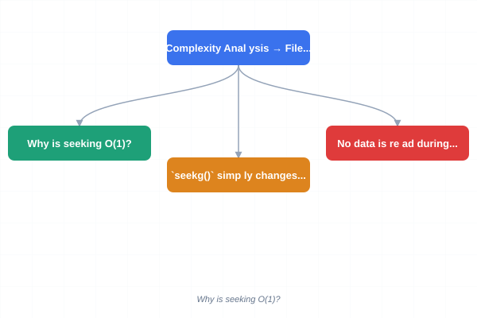
</a>
<a href="../../assets/images/diagrams/oop-cpp/11-file-io/complexity-analysis-file-positioning-sticky.svg" target="_blank" rel="noopener">
  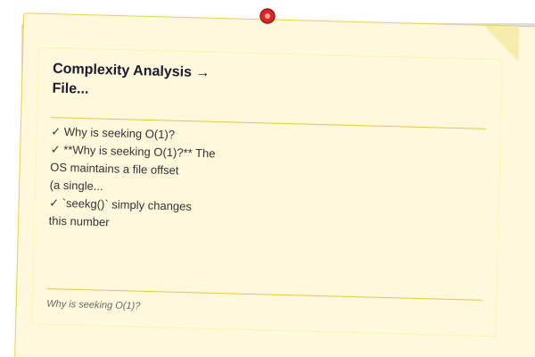
</a>


| Operation | Time | Space | Why |
|-----------|------|-------|-----|
| `seekg(n)` | O(1) | O(1) | Just moves a file offset number in the OS file table |
| `tellg()` | O(1) | O(1) | Returns stored file offset value |
| Random access read | O(1) | O(1) | Disk can seek to any position (HDD ≈ 10ms, SSD ≈ 0.1ms) |
| Sequential read | O(N) | O(1) | Must transfer N bytes |
| `seekg` past EOF | Implementation-defined | → | On read: sets failbit. On write: creates a "sparse" file (or extends) |

**Why is seeking O(1)?** The OS maintains a file offset (a single 64-bit integer) for each open file descriptor. `seekg()` simply changes this number. No data is read during the seek → the actual I/O happens on the next `read()` or `write()`.

### Edge Cases → File Positioning

<a href="../../assets/images/diagrams/oop-cpp/11-file-io/edge-cases-file-positioning-handwritten.svg" target="_blank" rel="noopener">
  
</a>
<a href="../../assets/images/diagrams/oop-cpp/11-file-io/edge-cases-file-positioning-diagram.svg" target="_blank" rel="noopener">
  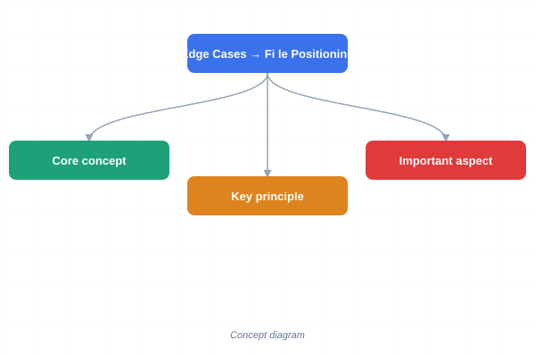
</a>
<a href="../../assets/images/diagrams/oop-cpp/11-file-io/edge-cases-file-positioning-sticky.svg" target="_blank" rel="noopener">
  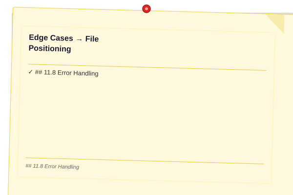
</a>


| Scenario | Behavior | Prevention |
|----------|----------|------------|
| Seek past EOF (read) | Stream state = fail; subsequent read fails | Check file size with `seekg(0, end)` + `tellg()` |
| Seek past EOF (write) | File grows; gap bytes are undefined | Not necessarily an error |
| Negative seek from beginning | Operation fails; stream may set failbit | Validate position >= 0 |
| Seek beyond file on read | Partial read; stream state = fail | Read in bounded chunks |
| Mixed get/put on fstream | On some C++98 implementations, need flush/seek between | In C++11+, simultaneous get/put works safely |
| `tellg()` after failed read | Returns -1 (indicator of error) | Check stream state before using result |

---

## 11.8 Error Handling

### Real-World Analogy

<a href="../../assets/images/diagrams/oop-cpp/11-file-io/real-world-analogy-handwritten.svg" target="_blank" rel="noopener">
  
</a>
<a href="../../assets/images/diagrams/oop-cpp/11-file-io/real-world-analogy-diagram.svg" target="_blank" rel="noopener">
  
</a>
<a href="../../assets/images/diagrams/oop-cpp/11-file-io/real-world-analogy-sticky.svg" target="_blank" rel="noopener">
  
</a>


Stream state flags are like **dashboard warning lights** in a car:

| Flag | Dashboard Light | Meaning |
|------|----------------|---------|
| `good()` | All green | Everything is fine |
| `fail()` | Check Engine light | Something went wrong (recoverable) |
| `bad()` | Red Temperature light | Serious problem (irrecoverable) |
| `eof()` | Fuel gauge empty | Reached the end of available data |
| `clear()` | Reset button | Turn off all warning lights |

### Stream State Flags

<a href="../../assets/images/diagrams/oop-cpp/11-file-io/stream-state-flags-handwritten.svg" target="_blank" rel="noopener">
  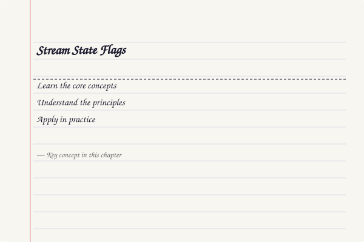
</a>
<a href="../../assets/images/diagrams/oop-cpp/11-file-io/stream-state-flags-diagram.svg" target="_blank" rel="noopener">
  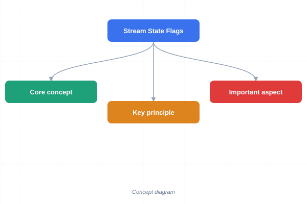
</a>
<a href="../../assets/images/diagrams/oop-cpp/11-file-io/stream-state-flags-sticky.svg" target="_blank" rel="noopener">
  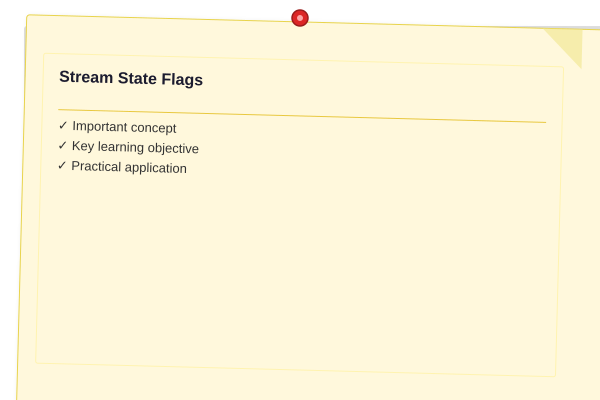
</a>


| Flag | Type | Description | Set When | Recoverable? |
|------|------|-------------|----------|-------------|
| `goodbit` | 0 | No error flags set | Operation succeeds | → |
| `eofbit` | 1 | End of file reached | Read past EOF | Yes |
| `failbit` | 2 | Logical error | Format error, non-existent file | Yes |
| `badbit` | 4 | Read/write error | Hardware failure, disk full | No (usually) |
| `good()` | → | Returns true if NO flags set | → | → |
| `fail()` | → | Returns true if failbit OR badbit set | → | → |
| `bad()` | → | Returns true if badbit set | → | → |
| `eof()` | → | Returns true if eofbit set | → | → |

### Checking File Open

<a href="../../assets/images/diagrams/oop-cpp/11-file-io/checking-file-open-handwritten.svg" target="_blank" rel="noopener">
  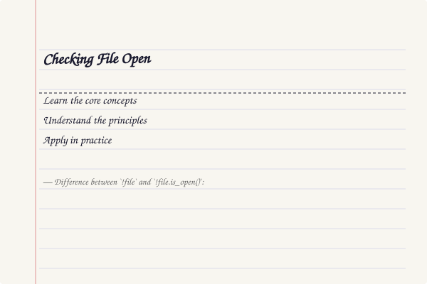
</a>
<a href="../../assets/images/diagrams/oop-cpp/11-file-io/checking-file-open-diagram.svg" target="_blank" rel="noopener">
  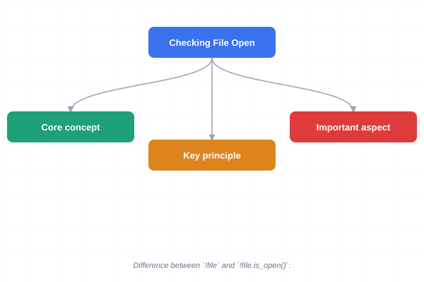
</a>
<a href="../../assets/images/diagrams/oop-cpp/11-file-io/checking-file-open-sticky.svg" target="_blank" rel="noopener">
  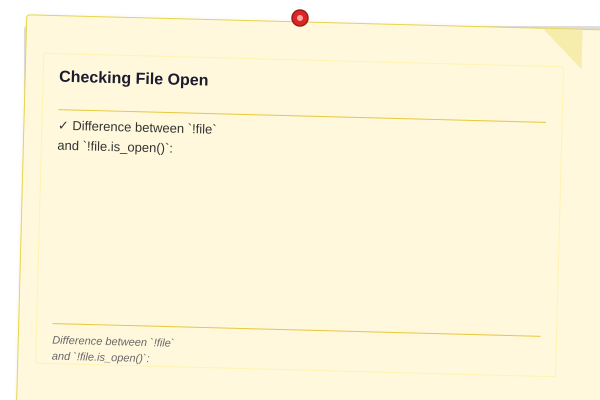
</a>


```cpp
std::ifstream file("data.txt");

// Method 1: Operator ! (most common)
if (!file) {
    std::cerr << "Failed to open file\n";
    return 1;
}

// Method 2: fail() member function
if (file.fail()) {
    std::cerr << "Failed to open file\n";
    return 1;
}

// Method 3: is_open() (different from state)
if (!file.is_open()) {
    std::cerr << "File is not open\n";
    return 1;
}
```

**Difference between `!file` and `!file.is_open()`:**

| Scenario | `!file` | `!file.is_open()` |
|----------|---------|-------------------|
| File opened successfully | false | false |
| File does not exist | true | true |
| File opened, then read hits EOF | true (`eofbit` + `failbit`) | false (still open) |

### Checking Read Operations

<a href="../../assets/images/diagrams/oop-cpp/11-file-io/checking-read-operations-handwritten.svg" target="_blank" rel="noopener">
  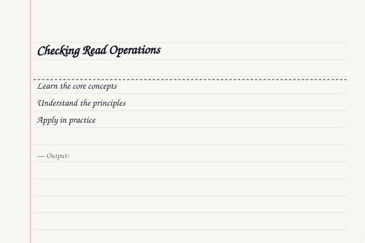
</a>
<a href="../../assets/images/diagrams/oop-cpp/11-file-io/checking-read-operations-diagram.svg" target="_blank" rel="noopener">
  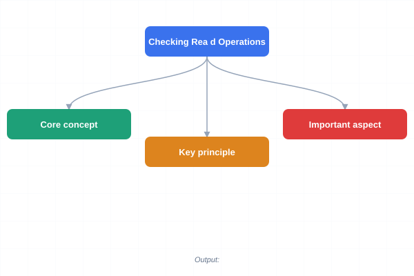
</a>
<a href="../../assets/images/diagrams/oop-cpp/11-file-io/checking-read-operations-sticky.svg" target="_blank" rel="noopener">
  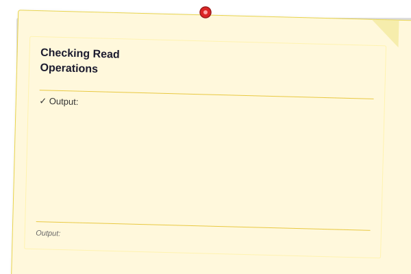
</a>


```cpp
#include <fstream>
#include <iostream>

int main() {
    std::ifstream file("numbers.txt");
    // numbers.txt: "10 20 abc 40"

    int value;
    int count = 0;

    while (file >> value) {
        std::cout << "Read: " << value << "\n";
        count++;
    }

    if (file.eof()) {
        std::cout << "End of file reached after " << count << " values.\n";
    } else if (file.fail()) {
        std::cout << "Format error at value #" << (count + 1) << "\n";
        // Clear error for potential recovery
        file.clear();
        std::string junk;
        file >> junk;
        std::cout << "Skipped bad token: '" << junk << "'\n";
        // Could continue reading here if needed
    }

    return 0;
}
```

**Output:**
```
Read: 10
Read: 20
Format error at value #3
Skipped bad token: 'abc'
```

### The clear() Function

<a href="../../assets/images/diagrams/oop-cpp/11-file-io/the-clear-function-handwritten.svg" target="_blank" rel="noopener">
  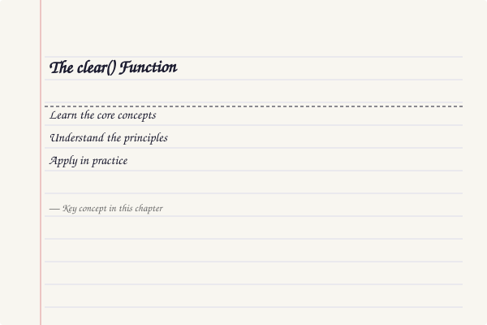
</a>
<a href="../../assets/images/diagrams/oop-cpp/11-file-io/the-clear-function-diagram.svg" target="_blank" rel="noopener">
  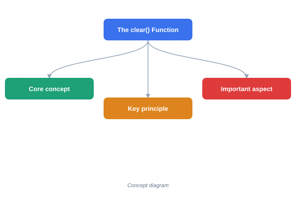
</a>
<a href="../../assets/images/diagrams/oop-cpp/11-file-io/the-clear-function-sticky.svg" target="_blank" rel="noopener">
  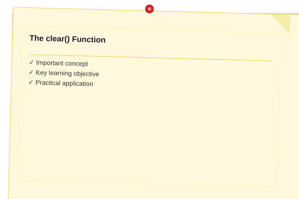
</a>


```cpp
// After a failure, clear() resets the error flags
file.clear();            // Clear all error flags
file.clear(std::ios::failbit);  // Set specific flag, clear others
file.setstate(std::ios::failbit);  // Set flag, keep others
```

### Exception Handling with exceptions()

<a href="../../assets/images/diagrams/oop-cpp/11-file-io/exception-handling-with-exceptions-handwritten.svg" target="_blank" rel="noopener">
  
</a>
<a href="../../assets/images/diagrams/oop-cpp/11-file-io/exception-handling-with-exceptions-diagram.svg" target="_blank" rel="noopener">
  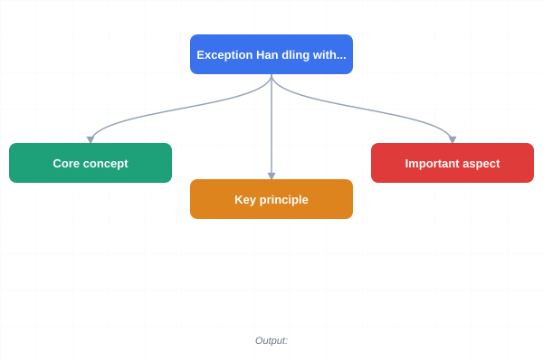
</a>
<a href="../../assets/images/diagrams/oop-cpp/11-file-io/exception-handling-with-exceptions-sticky.svg" target="_blank" rel="noopener">
  
</a>


```cpp
#include <fstream>
#include <iostream>

int main() {
    std::ifstream file;

    // Enable exceptions on failbit and badbit
    file.exceptions(std::ios::failbit | std::ios::badbit);

    try {
        file.open("nonexistent.txt");  // Will throw on failure
    } catch (const std::ios::failure& e) {
        std::cerr << "Exception caught: " << e.what() << "\n";
        std::cerr << "Error code: " << e.code() << "\n";
        return 1;
    }

    return 0;
}
```

**Output:**
```
Exception caught: ios_base::failbit set: iostream stream error
Error code: generic:2
```

### Complete Error Handling Checklist

<a href="../../assets/images/diagrams/oop-cpp/11-file-io/complete-error-handling-checklist-handwritten.svg" target="_blank" rel="noopener">
  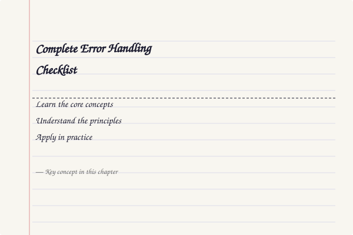
</a>
<a href="../../assets/images/diagrams/oop-cpp/11-file-io/complete-error-handling-checklist-diagram.svg" target="_blank" rel="noopener">
  
</a>
<a href="../../assets/images/diagrams/oop-cpp/11-file-io/complete-error-handling-checklist-sticky.svg" target="_blank" rel="noopener">
  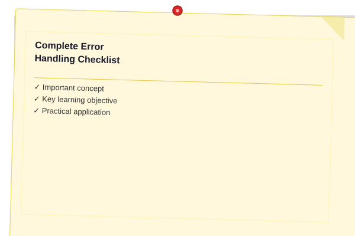
</a>


```
✓ Check if file opened (!file or file.fail())
✓ Check is_open() for open-status (separate from state)
✓ Check reads in loop condition (while (file >> x))
✓ Distinguish EOF from format error (eof() vs fail())
✓ Use clear() to recover from non-fatal errors
✓ Use exceptions() for exception-based error handling (optional)
✓ Check after every read/write in critical code
```

### Complexity Analysis → Error Handling

<a href="../../assets/images/diagrams/oop-cpp/11-file-io/complexity-analysis-error-handling-handwritten.svg" target="_blank" rel="noopener">
  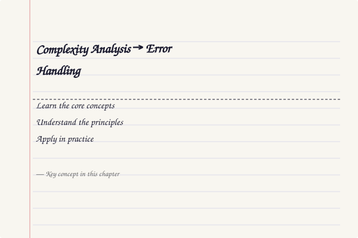
</a>
<a href="../../assets/images/diagrams/oop-cpp/11-file-io/complexity-analysis-error-handling-diagram.svg" target="_blank" rel="noopener">
  
</a>
<a href="../../assets/images/diagrams/oop-cpp/11-file-io/complexity-analysis-error-handling-sticky.svg" target="_blank" rel="noopener">
  
</a>


| Operation | Time | Why |
|-----------|------|-----|
| Checking stream state | O(1) | Reading a bitmask |
| `clear()` | O(1) | Setting a bitmask |
| Throwing exception | O(1) + unwind | Throwing an exception object, stack unwinding (potentially O(stack depth)) |

### Common Mistakes

<a href="../../assets/images/diagrams/oop-cpp/11-file-io/common-mistakes-handwritten.svg" target="_blank" rel="noopener">
  
</a>
<a href="../../assets/images/diagrams/oop-cpp/11-file-io/common-mistakes-diagram.svg" target="_blank" rel="noopener">
  
</a>
<a href="../../assets/images/diagrams/oop-cpp/11-file-io/common-mistakes-sticky.svg" target="_blank" rel="noopener">
  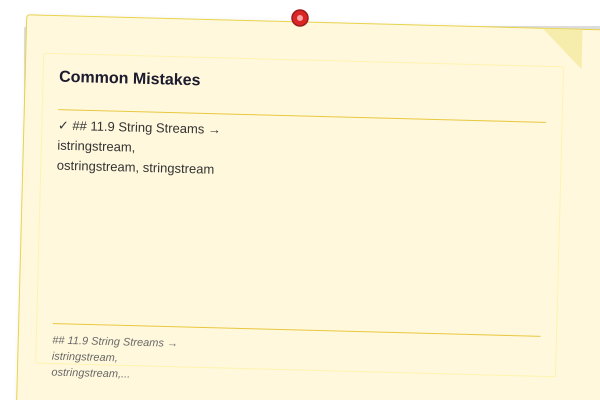
</a>


| Mistake | Wrong Code | Correct Code |
|---------|-----------|-------------|
| Not checking open | `file >> x;` | `if (!file) return; file >> x;` |
| Using `eof()` as loop condition | `while (!file.eof())` | `while (file >> x)` |
| Forgetting `clear()` after EOF | Reuse stream without `clear()` | `file.clear(); file.seekg(0);` |
| Not distinguishing EOF vs failure | All errors treated as EOF | Check `eof()` after loop |

---

## 11.9 String Streams → istringstream, ostringstream, stringstream

### Real-World Analogy

<a href="../../assets/images/diagrams/oop-cpp/11-file-io/real-world-analogy-handwritten.svg" target="_blank" rel="noopener">
  
</a>
<a href="../../assets/images/diagrams/oop-cpp/11-file-io/real-world-analogy-diagram.svg" target="_blank" rel="noopener">
  
</a>
<a href="../../assets/images/diagrams/oop-cpp/11-file-io/real-world-analogy-sticky.svg" target="_blank" rel="noopener">
  
</a>


String streams are like **using a whiteboard** instead of writing in a notebook:

| Concept | Notebook (File) | Whiteboard (String Stream) |
|---------|----------------|---------------------------|
| **Storage** | Persists on disk | Exists only in memory |
| **Sharing** | Other programs can read it | Only this program can access |
| **Speed** | Slow (disk I/O) | Fast (RAM) |
| **Purpose** | Long-term storage | Temporary data processing |

### Class Hierarchy

<a href="../../assets/images/diagrams/oop-cpp/11-file-io/class-hierarchy-handwritten.svg" target="_blank" rel="noopener">
  
</a>
<a href="../../assets/images/diagrams/oop-cpp/11-file-io/class-hierarchy-diagram.svg" target="_blank" rel="noopener">
  
</a>
<a href="../../assets/images/diagrams/oop-cpp/11-file-io/class-hierarchy-sticky.svg" target="_blank" rel="noopener">
  
</a>


```
<iostream>
  |
  +-- istream    -----> istringstream (input string stream)
  +-- ostream    -----> ostringstream (output string stream)
  +-- iostream   -----> stringstream (bidirectional string stream)
```

### Header: `<sstream>`

<a href="../../assets/images/diagrams/oop-cpp/11-file-io/header-sstream-handwritten.svg" target="_blank" rel="noopener">
  `" width="30%">
</a>
<a href="../../assets/images/diagrams/oop-cpp/11-file-io/header-sstream-diagram.svg" target="_blank" rel="noopener">
  `" width="30%">
</a>
<a href="../../assets/images/diagrams/oop-cpp/11-file-io/header-sstream-sticky.svg" target="_blank" rel="noopener">
  `" width="30%">
</a>


### When to Use String Streams

<a href="../../assets/images/diagrams/oop-cpp/11-file-io/when-to-use-string-streams-handwritten.svg" target="_blank" rel="noopener">
  
</a>
<a href="../../assets/images/diagrams/oop-cpp/11-file-io/when-to-use-string-streams-diagram.svg" target="_blank" rel="noopener">
  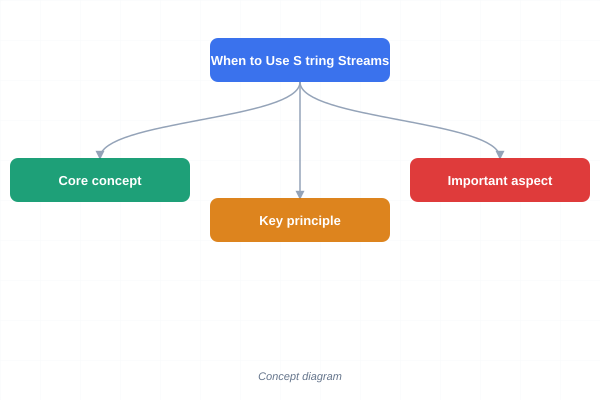
</a>
<a href="../../assets/images/diagrams/oop-cpp/11-file-io/when-to-use-string-streams-sticky.svg" target="_blank" rel="noopener">
  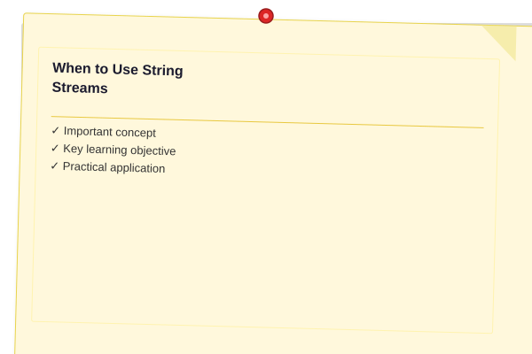
</a>


| Use Case | Why String Stream? |
|----------|-------------------|
| **Parsing strings** | Same `>>` interface as files, but data comes from a string |
| **Formatting output** | Build a complex string using `<<`, then extract `.str()` |
| **Type conversion** | Convert between strings and numbers (C++-style) |
| **Tokenization** | Split a string using `>>` or `getline` with delimiter |
| **Building SQL queries** | Construct dynamic queries with proper formatting |
| **Log message formatting** | Build log entries with timestamps, levels, and variables |

### istringstream → Reading from a String

<a href="../../assets/images/diagrams/oop-cpp/11-file-io/istringstream-reading-from-a-string-handwritten.svg" target="_blank" rel="noopener">
  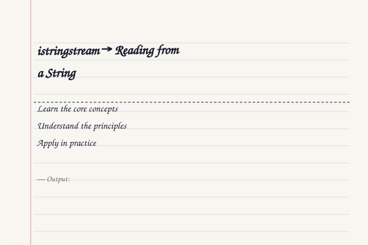
</a>
<a href="../../assets/images/diagrams/oop-cpp/11-file-io/istringstream-reading-from-a-string-diagram.svg" target="_blank" rel="noopener">
  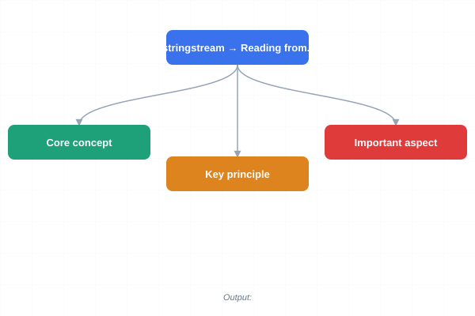
</a>
<a href="../../assets/images/diagrams/oop-cpp/11-file-io/istringstream-reading-from-a-string-sticky.svg" target="_blank" rel="noopener">
  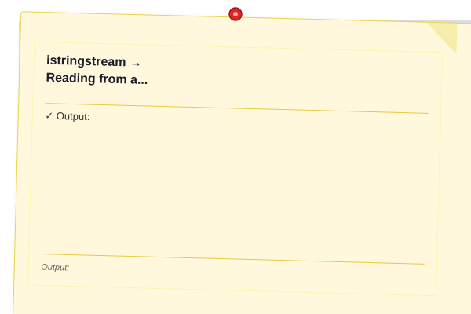
</a>


```cpp
#include <sstream>
#include <iostream>
#include <string>

int main() {
    std::string data = "Alice 95 Bob 87 Charlie 92";
    std::istringstream iss(data);

    std::string name;
    int score;

    while (iss >> name >> score) {
        std::cout << name << " → " << score << "\n";
    }

    return 0;
}
```

**Output:**
```
Alice → 95
Bob → 87
Charlie → 92
```

### ostringstream → Writing to a String

<a href="../../assets/images/diagrams/oop-cpp/11-file-io/ostringstream-writing-to-a-string-handwritten.svg" target="_blank" rel="noopener">
  
</a>
<a href="../../assets/images/diagrams/oop-cpp/11-file-io/ostringstream-writing-to-a-string-diagram.svg" target="_blank" rel="noopener">
  
</a>
<a href="../../assets/images/diagrams/oop-cpp/11-file-io/ostringstream-writing-to-a-string-sticky.svg" target="_blank" rel="noopener">
  
</a>


```cpp
#include <sstream>
#include <iostream>
#include <string>
#include <iomanip>

int main() {
    std::ostringstream oss;

    std::string name = "Alice";
    int age = 30;
    double salary = 75000.50;

    oss << "Employee: " << name << "\n";
    oss << "Age: " << age << "\n";
    oss << std::fixed << std::setprecision(2);
    oss << "Salary: $" << salary << "\n";

    std::string report = oss.str();  // Extract the string
    std::cout << report;

    return 0;
}
```

**Output:**
```
Employee: Alice
Age: 30
Salary: $75000.50
```

### stringstream → Bidirectional

<a href="../../assets/images/diagrams/oop-cpp/11-file-io/stringstream-bidirectional-handwritten.svg" target="_blank" rel="noopener">
  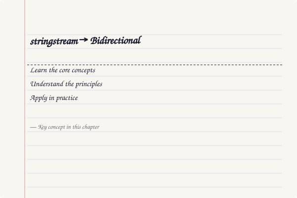
</a>
<a href="../../assets/images/diagrams/oop-cpp/11-file-io/stringstream-bidirectional-diagram.svg" target="_blank" rel="noopener">
  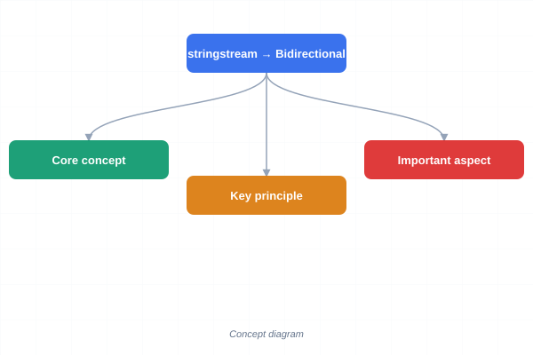
</a>
<a href="../../assets/images/diagrams/oop-cpp/11-file-io/stringstream-bidirectional-sticky.svg" target="_blank" rel="noopener">
  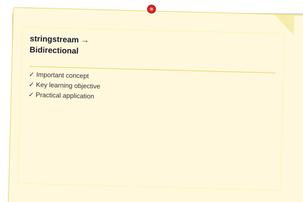
</a>


```cpp
#include <sstream>
#include <iostream>
#include <string>

int main() {
    std::stringstream ss;

    // Write to stringstream
    ss << "42 3.14 Hello";

    // Read from stringstream
    int num;
    double pi;
    std::string word;

    ss >> num >> pi >> word;

    std::cout << "int:    " << num << "\n";     // 42
    std::cout << "double: " << pi << "\n";      // 3.14
    std::cout << "string: " << word << "\n";    // Hello

    return 0;
}
```

### Application 1: Type Conversion (C++ Style)

<a href="../../assets/images/diagrams/oop-cpp/11-file-io/application-1-type-conversion-c-style-handwritten.svg" target="_blank" rel="noopener">
  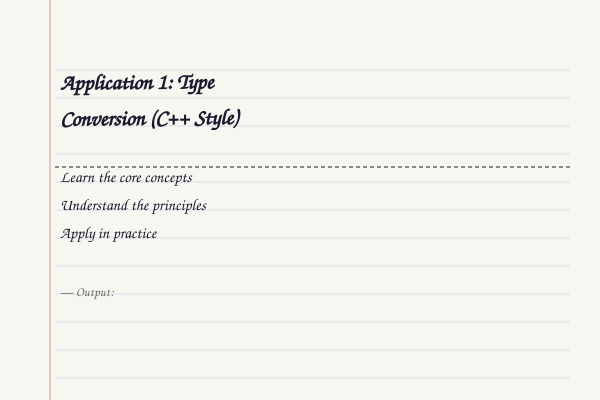
</a>
<a href="../../assets/images/diagrams/oop-cpp/11-file-io/application-1-type-conversion-c-style-diagram.svg" target="_blank" rel="noopener">
  
</a>
<a href="../../assets/images/diagrams/oop-cpp/11-file-io/application-1-type-conversion-c-style-sticky.svg" target="_blank" rel="noopener">
  
</a>


```cpp
#include <sstream>
#include <iostream>
#include <string>

template <typename T>
std::string to_string(const T& value) {
    std::ostringstream oss;
    oss << value;
    return oss.str();
}

template <typename T>
T from_string(const std::string& str) {
    T value;
    std::istringstream iss(str);
    iss >> value;
    return value;
}

int main() {
    // int to string
    std::string s1 = to_string(12345);
    std::cout << "String: " << s1 << " (length: " << s1.size() << ")\n";

    // double to string
    std::string s2 = to_string(3.14159);
    std::cout << "String: " << s2 << "\n";

    // string to int
    int n = from_string<int>("500");
    std::cout << "Int: " << n << "\n";

    // string to double
    double d = from_string<double>("2.71828");
    std::cout << "Double: " << d << "\n";

    return 0;
}
```

**Output:**
```
String: 12345 (length: 5)
String: 3.14159
Int: 500
Double: 2.71828
```

### Application 2: Parsing CSV Line

<a href="../../assets/images/diagrams/oop-cpp/11-file-io/application-2-parsing-csv-line-handwritten.svg" target="_blank" rel="noopener">
  
</a>
<a href="../../assets/images/diagrams/oop-cpp/11-file-io/application-2-parsing-csv-line-diagram.svg" target="_blank" rel="noopener">
  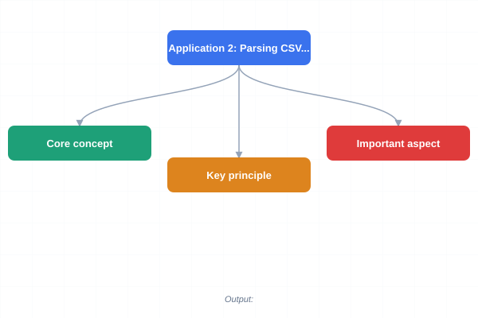
</a>
<a href="../../assets/images/diagrams/oop-cpp/11-file-io/application-2-parsing-csv-line-sticky.svg" target="_blank" rel="noopener">
  
</a>


```cpp
#include <sstream>
#include <iostream>
#include <string>
#include <vector>

struct Person {
    std::string name;
    int age;
    double height;
};

int main() {
    std::string csv_line = "Alice,30,5.7";
    std::istringstream iss(csv_line);

    Person p;
    std::string temp;

    std::getline(iss, p.name, ',');
    std::getline(iss, temp, ',');
    p.age = std::stoi(temp);
    std::getline(iss, temp, ',');
    p.height = std::stod(temp);

    std::cout << p.name << " | Age: " << p.age
              << " | Height: " << p.height << "\n";

    return 0;
}
```

**Output:**
```
Alice | Age: 30 | Height: 5.7
```

### Application 3: Building SQL Queries

<a href="../../assets/images/diagrams/oop-cpp/11-file-io/application-3-building-sql-queries-handwritten.svg" target="_blank" rel="noopener">
  
</a>
<a href="../../assets/images/diagrams/oop-cpp/11-file-io/application-3-building-sql-queries-diagram.svg" target="_blank" rel="noopener">
  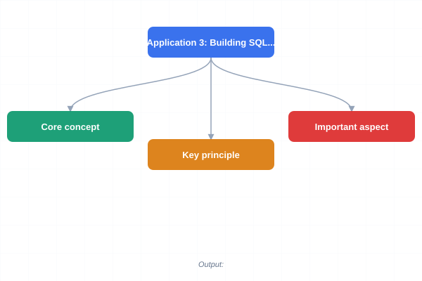
</a>
<a href="../../assets/images/diagrams/oop-cpp/11-file-io/application-3-building-sql-queries-sticky.svg" target="_blank" rel="noopener">
  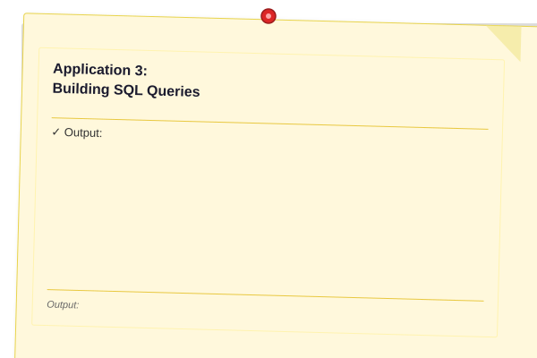
</a>


```cpp
#include <sstream>
#include <iostream>
#include <string>

class QueryBuilder {
    std::ostringstream oss;
public:
    QueryBuilder& select(const std::string& cols) {
        oss << "SELECT " << cols;
        return *this;
    }
    QueryBuilder& from(const std::string& table) {
        oss << " FROM " << table;
        return *this;
    }
    QueryBuilder& where(const std::string& condition) {
        oss << " WHERE " << condition;
        return *this;
    }
    QueryBuilder& orderBy(const std::string& col, bool asc = true) {
        oss << " ORDER BY " << col << (asc ? " ASC" : " DESC");
        return *this;
    }
    std::string build() const {
        return oss.str() + ";";
    }
};

int main() {
    std::string query = QueryBuilder()
        .select("name, salary")
        .from("employees")
        .where("salary > 50000")
        .orderBy("salary", false)
        .build();

    std::cout << query << "\n";
    return 0;
}
```

**Output:**
```
SELECT name, salary FROM employees WHERE salary > 50000 ORDER BY salary DESC;
```

### Application 4: Log Message Builder

<a href="../../assets/images/diagrams/oop-cpp/11-file-io/application-4-log-message-builder-handwritten.svg" target="_blank" rel="noopener">
  
</a>
<a href="../../assets/images/diagrams/oop-cpp/11-file-io/application-4-log-message-builder-diagram.svg" target="_blank" rel="noopener">
  
</a>
<a href="../../assets/images/diagrams/oop-cpp/11-file-io/application-4-log-message-builder-sticky.svg" target="_blank" rel="noopener">
  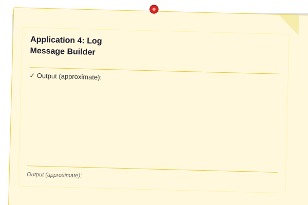
</a>


```cpp
#include <sstream>
#include <iostream>
#include <string>
#include <chrono>
#include <ctime>

class Logger {
public:
    static std::string log(const std::string& level, const std::string& msg) {
        std::ostringstream oss;
        auto now = std::chrono::system_clock::now();
        auto time = std::chrono::system_clock::to_time_t(now);
        oss << "[" << std::ctime(&time);
        oss.seekp(-1, std::ios::cur);  // remove trailing newline from ctime
        oss << "] [" << level << "] " << msg;
        return oss.str();
    }
};

int main() {
    std::cout << Logger::log("INFO", "Server started on port 8080") << "\n";
    std::cout << Logger::log("ERROR", "Connection timeout") << "\n";
    return 0;
}
```

**Output (approximate):**
```
[Tue Jan 15 10:30:45 2024] [INFO] Server started on port 8080
[Tue Jan 15 10:30:45 2024] [ERROR] Connection timeout
```

### Complexity Analysis → String Streams

<a href="../../assets/images/diagrams/oop-cpp/11-file-io/complexity-analysis-string-streams-handwritten.svg" target="_blank" rel="noopener">
  
</a>
<a href="../../assets/images/diagrams/oop-cpp/11-file-io/complexity-analysis-string-streams-diagram.svg" target="_blank" rel="noopener">
  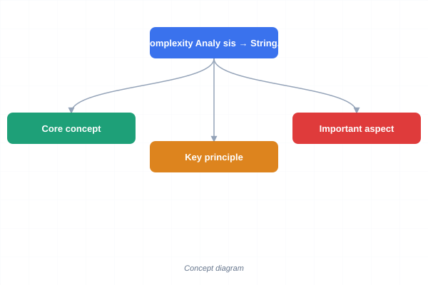
</a>
<a href="../../assets/images/diagrams/oop-cpp/11-file-io/complexity-analysis-string-streams-sticky.svg" target="_blank" rel="noopener">
  
</a>


| Operation | Time | Space | Why |
|-----------|------|-------|-----|
| Create stringstream | O(1) | O(1) | Just initializes a buffer (no allocation yet) |
| Write to stringstream | O(N) | O(N) | Appends to internal string; may reallocate |
| Read from stringstream | O(N) | O(1) | Iterates over internal buffer |
| `.str()` extraction | O(1) (C++11 move) or O(N) (copy) | O(N) | Move returns without copying; copy duplicates buffer |
| Parse CSV line | O(N) | O(N) for tokens | Each character examined once |

### Edge Cases → String Streams

<a href="../../assets/images/diagrams/oop-cpp/11-file-io/edge-cases-string-streams-handwritten.svg" target="_blank" rel="noopener">
  
</a>
<a href="../../assets/images/diagrams/oop-cpp/11-file-io/edge-cases-string-streams-diagram.svg" target="_blank" rel="noopener">
  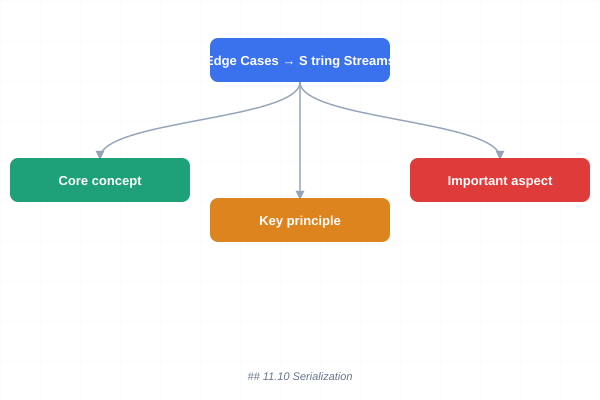
</a>
<a href="../../assets/images/diagrams/oop-cpp/11-file-io/edge-cases-string-streams-sticky.svg" target="_blank" rel="noopener">
  
</a>


| Scenario | Behavior | Solution |
|----------|----------|----------|
| Empty stringstream | Extraction returns false immediately | Check stream state |
| `.str()` after write | Returns the current buffered string | Use `.str()` to get result |
| Reusing stringstream | Stream may be at EOF; state flags set | `.clear()` + `.str("")` to reset |
| Large string in stringstream | Memory usage increases | Use line-by-line parsing for huge strings |
| Formatting persisted between writes | Precision/width flags remain | Reset with `std::setprecision(default)` |

---

## 11.10 Serialization

### Real-World Analogy

<a href="../../assets/images/diagrams/oop-cpp/11-file-io/real-world-analogy-handwritten.svg" target="_blank" rel="noopener">
  
</a>
<a href="../../assets/images/diagrams/oop-cpp/11-file-io/real-world-analogy-diagram.svg" target="_blank" rel="noopener">
  
</a>
<a href="../../assets/images/diagrams/oop-cpp/11-file-io/real-world-analogy-sticky.svg" target="_blank" rel="noopener">
  
</a>


Serialization is like **freezing food**:

| Concept | Freezing Food | Serialization |
|---------|--------------|---------------|
| **Original** | Fresh ingredients | Live objects in memory |
| **Serialize** | Freeze and vacuum-pack | Convert object to byte stream |
| **Storage** | Put in freezer | Write to file |
| **Deserialize** | Thaw and cook | Read bytes and reconstruct object |
| **Corruption** | Freezer burn | Data format mismatch |
| **Cooking** | Microwaving a TV dinner | Frameworks that automate it |

### What is Serialization?

<a href="../../assets/images/diagrams/oop-cpp/11-file-io/what-is-serialization-handwritten.svg" target="_blank" rel="noopener">
  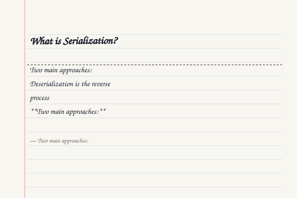
</a>
<a href="../../assets/images/diagrams/oop-cpp/11-file-io/what-is-serialization-diagram.svg" target="_blank" rel="noopener">
  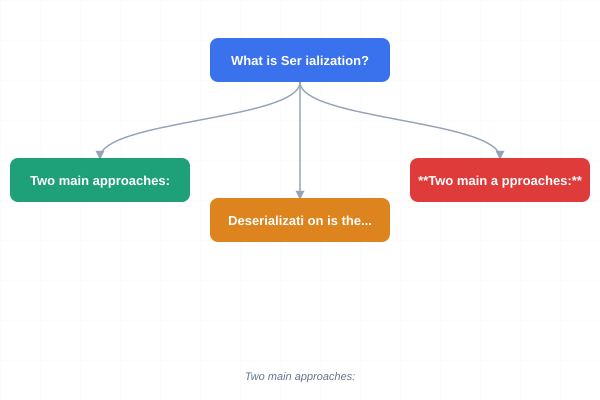
</a>
<a href="../../assets/images/diagrams/oop-cpp/11-file-io/what-is-serialization-sticky.svg" target="_blank" rel="noopener">
  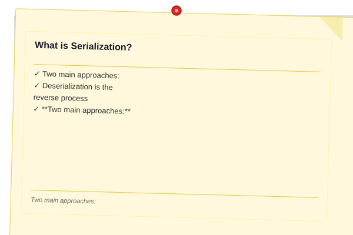
</a>


Serialization is the process of converting an object's state into a format that can be stored or transmitted and later reconstructed. Deserialization is the reverse process.

**Two main approaches:**

| Approach | Pros | Cons | When to Use |
|----------|------|------|-------------|
| **Binary Serialization** | Fast, compact, exact | Not portable, not human-readable | Performance-critical, internal storage |
| **Text Serialization** | Portable, human-readable, debuggable | Slower, larger file size | Config files, data exchange, human inspection |

### Binary Serialization → POD Types

<a href="../../assets/images/diagrams/oop-cpp/11-file-io/binary-serialization-pod-types-handwritten.svg" target="_blank" rel="noopener">
  
</a>
<a href="../../assets/images/diagrams/oop-cpp/11-file-io/binary-serialization-pod-types-diagram.svg" target="_blank" rel="noopener">
  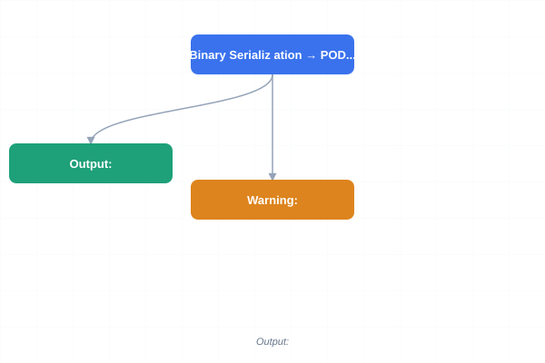
</a>
<a href="../../assets/images/diagrams/oop-cpp/11-file-io/binary-serialization-pod-types-sticky.svg" target="_blank" rel="noopener">
  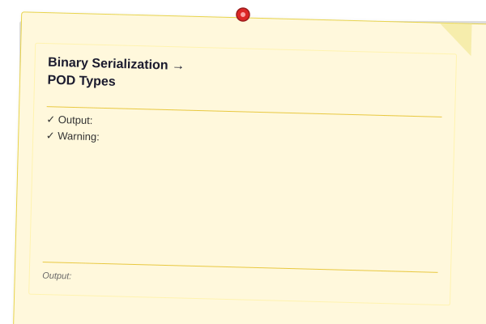
</a>


POD (Plain Old Data) types can be serialized directly:

```cpp
#include <fstream>
#include <iostream>

struct Point {
    int x;
    int y;
    int z;
};

int main() {
    // Serialize
    Point p1 = {10, 20, 30};

    std::ofstream out("point.bin", std::ios::binary);
    out.write(reinterpret_cast<const char*>(&p1), sizeof(p1));
    out.close();

    // Deserialize
    Point p2 = {};

    std::ifstream in("point.bin", std::ios::binary);
    in.read(reinterpret_cast<char*>(&p2), sizeof(p2));

    std::cout << "Deserialized point: ("
              << p2.x << ", " << p2.y << ", " << p2.z << ")\n";

    return 0;
}
```

**Output:**
```
Deserialized point: (10, 20, 30)
```

**Warning:** `sizeof(Point)` may be 12 or 16 depending on alignment/padding.

### Binary Serialization → Handling std::string

<a href="../../assets/images/diagrams/oop-cpp/11-file-io/binary-serialization-handling-std-string-handwritten.svg" target="_blank" rel="noopener">
  
</a>
<a href="../../assets/images/diagrams/oop-cpp/11-file-io/binary-serialization-handling-std-string-diagram.svg" target="_blank" rel="noopener">
  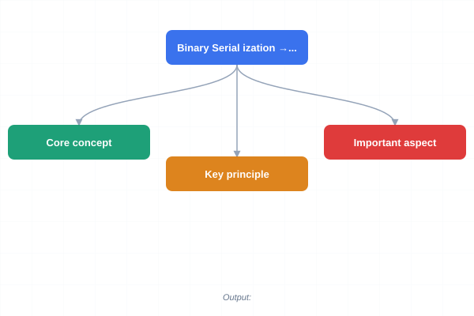
</a>
<a href="../../assets/images/diagrams/oop-cpp/11-file-io/binary-serialization-handling-std-string-sticky.svg" target="_blank" rel="noopener">
  
</a>


```cpp
#include <fstream>
#include <iostream>
#include <string>
#include <cstring>

class Student {
    std::string name_;
    int id_;
    double gpa_;

public:
    Student() = default;
    Student(const std::string& name, int id, double gpa)
        : name_(name), id_(id), gpa_(gpa) {}

    void save(std::ofstream& out) const {
        // Write length-prefixed string
        size_t len = name_.size();
        out.write(reinterpret_cast<const char*>(&len), sizeof(len));
        out.write(name_.data(), len);

        // Write POD members
        out.write(reinterpret_cast<const char*>(&id_), sizeof(id_));
        out.write(reinterpret_cast<const char*>(&gpa_), sizeof(gpa_));
    }

    void load(std::ifstream& in) {
        // Read string length and data
        size_t len = 0;
        in.read(reinterpret_cast<char*>(&len), sizeof(len));
        name_.resize(len);
        in.read(&name_[0], len);

        // Read POD members
        in.read(reinterpret_cast<char*>(&id_), sizeof(id_));
        in.read(reinterpret_cast<char*>(&gpa_), sizeof(gpa_));
    }

    void print() const {
        std::cout << "Student: " << name_
                  << " (ID: " << id_
                  << ", GPA: " << gpa_ << ")\n";
    }
};

int main() {
    // Write
    {
        std::ofstream out("students.bin", std::ios::binary);
        Student s1("Alice", 101, 3.9);
        Student s2("Bob", 102, 3.5);
        s1.save(out);
        s2.save(out);
    }

    // Read
    {
        std::ifstream in("students.bin", std::ios::binary);
        Student s1, s2;
        s1.load(in);
        s2.load(in);
        s1.print();
        s2.print();
    }

    return 0;
}
```

**Output:**
```
Student: Alice (ID: 101, GPA: 3.9)
Student: Bob (ID: 102, GPA: 3.5)
```

### Dry Run → Serializing Student

<a href="../../assets/images/diagrams/oop-cpp/11-file-io/dry-run-serializing-student-handwritten.svg" target="_blank" rel="noopener">
  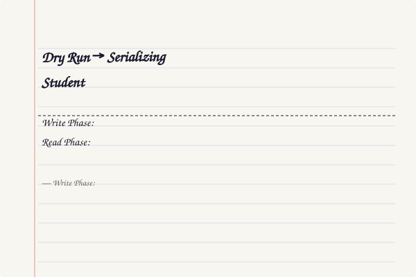
</a>
<a href="../../assets/images/diagrams/oop-cpp/11-file-io/dry-run-serializing-student-diagram.svg" target="_blank" rel="noopener">
  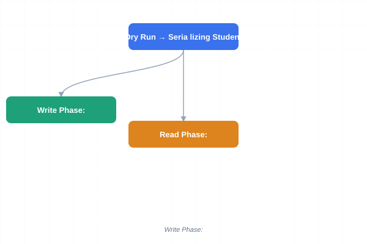
</a>
<a href="../../assets/images/diagrams/oop-cpp/11-file-io/dry-run-serializing-student-sticky.svg" target="_blank" rel="noopener">
  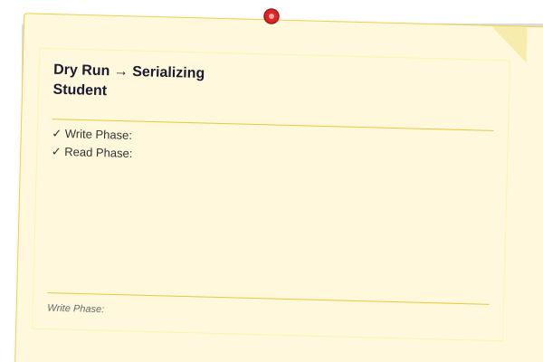
</a>


**Write Phase:**

| Step | Operation | File Position | Bytes Written | File Content |
|------|-----------|---------------|---------------|-------------|
| 1 | Save name "Alice" | 0→4 | 4 (length=5) | `05 00 00 00` |
| 2 | Save name data | 4→9 | 5 ("Alice") | `05 00 00 00 41 6C 69 63 65` |
| 3 | Save id (101) | 9→13 | 4 | `... 65 00 00 00` |
| 4 | Save gpa (3.9) | 13→21 | 8 | `... 66 66 66 66 66 66 0F 40` |

**Read Phase:**

| Step | Operation | Bytes Read | Result | File Position |
|------|-----------|------------|--------|---------------|
| 1 | Read length | 4 | len=5 | 0→4 |
| 2 | Read name data | 5 | name_="Alice" | 4→9 |
| 3 | Read id | 4 | id_=101 | 9→13 |
| 4 | Read gpa | 8 | gpa_=3.9 | 13→21 |

### Text Serialization (CSV)

<a href="../../assets/images/diagrams/oop-cpp/11-file-io/text-serialization-csv-handwritten.svg" target="_blank" rel="noopener">
  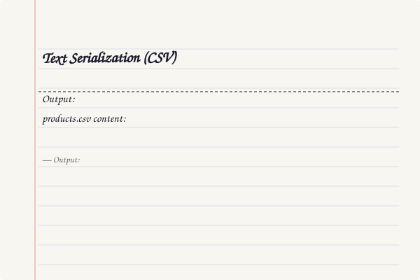
</a>
<a href="../../assets/images/diagrams/oop-cpp/11-file-io/text-serialization-csv-diagram.svg" target="_blank" rel="noopener">
  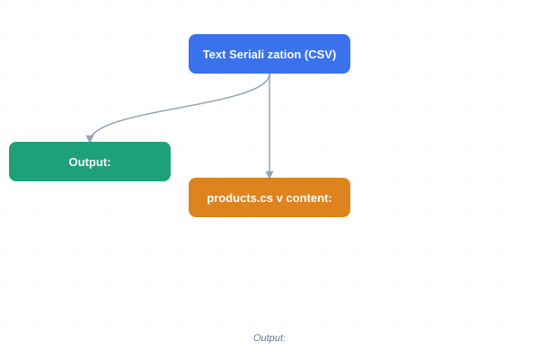
</a>
<a href="../../assets/images/diagrams/oop-cpp/11-file-io/text-serialization-csv-sticky.svg" target="_blank" rel="noopener">
  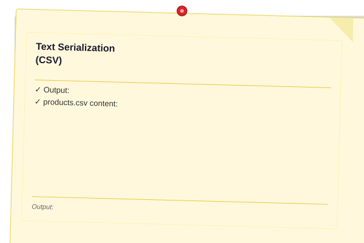
</a>


```cpp
#include <fstream>
#include <sstream>
#include <iostream>
#include <string>
#include <vector>

class Product {
    std::string name_;
    double price_;
    int quantity_;

public:
    Product() = default;
    Product(const std::string& name, double price, int quantity)
        : name_(name), price_(price), quantity_(quantity) {}

    // CSV serialize → one line per product
    std::string toCSV() const {
        std::ostringstream oss;
        oss << name_ << "," << price_ << "," << quantity_;
        return oss.str();
    }

    static Product fromCSV(const std::string& line) {
        std::istringstream iss(line);
        std::string name, priceStr, qtyStr;

        std::getline(iss, name, ',');
        std::getline(iss, priceStr, ',');
        std::getline(iss, qtyStr, ',');

        return Product(name,
                       std::stod(priceStr),
                       std::stoi(qtyStr));
    }

    void print() const {
        std::cout << name_ << " | $" << price_
                  << " | Qty: " << quantity_ << "\n";
    }
};

int main() {
    std::vector<Product> products = {
        {"Widget",   19.99, 100},
        {"Gadget",   39.99, 50},
        {"Doohickey", 9.99, 200}
    };

    // Write CSV
    {
        std::ofstream out("products.csv");
        for (const auto& p : products)
            out << p.toCSV() << "\n";
    }

    // Read CSV
    {
        std::ifstream in("products.csv");
        std::string line;
        while (std::getline(in, line)) {
            Product p = Product::fromCSV(line);
            p.print();
        }
    }

    return 0;
}
```

**Output:**
```
Widget | $19.99 | Qty: 100
Gadget | $39.99 | Qty: 50
Doohickey | $9.99 | Qty: 200
```

**products.csv content:**
```
Widget,19.99,100
Gadget,39.99,50
Doohickey,9.99,200
```

### Serialization → Handling Containers

<a href="../../assets/images/diagrams/oop-cpp/11-file-io/serialization-handling-containers-handwritten.svg" target="_blank" rel="noopener">
  
</a>
<a href="../../assets/images/diagrams/oop-cpp/11-file-io/serialization-handling-containers-diagram.svg" target="_blank" rel="noopener">
  
</a>
<a href="../../assets/images/diagrams/oop-cpp/11-file-io/serialization-handling-containers-sticky.svg" target="_blank" rel="noopener">
  
</a>


```cpp
#include <fstream>
#include <iostream>
#include <vector>
#include <string>

class Department {
    std::string name_;
    std::vector<int> employeeIds_;

public:
    void save(std::ofstream& out) const {
        // Save name (length-prefixed)
        size_t nameLen = name_.size();
        out.write(reinterpret_cast<const char*>(&nameLen), sizeof(nameLen));
        out.write(name_.data(), nameLen);

        // Save vector (count + elements)
        size_t count = employeeIds_.size();
        out.write(reinterpret_cast<const char*>(&count), sizeof(count));
        out.write(reinterpret_cast<const char*>(employeeIds_.data()),
                  count * sizeof(int));
    }

    void load(std::ifstream& in) {
        // Load name
        size_t nameLen = 0;
        in.read(reinterpret_cast<char*>(&nameLen), sizeof(nameLen));
        name_.resize(nameLen);
        in.read(&name_[0], nameLen);

        // Load vector
        size_t count = 0;
        in.read(reinterpret_cast<char*>(&count), sizeof(count));
        employeeIds_.resize(count);
        in.read(reinterpret_cast<char*>(employeeIds_.data()),
                count * sizeof(int));
    }

    void setData(const std::string& name, const std::vector<int>& ids) {
        name_ = name;
        employeeIds_ = ids;
    }

    void print() const {
        std::cout << "Department: " << name_ << "\n";
        std::cout << "Employees: ";
        for (int id : employeeIds_)
            std::cout << id << " ";
        std::cout << "\n";
    }
};

int main() {
    Department dept;
    dept.setData("Engineering", {101, 102, 103, 104, 105});

    // Save
    {
        std::ofstream out("dept.bin", std::ios::binary);
        dept.save(out);
    }

    // Load
    {
        Department loaded;
        std::ifstream in("dept.bin", std::ios::binary);
        loaded.load(in);
        loaded.print();
    }

    return 0;
}
```

**Output:**
```
Department: Engineering
Employees: 101 102 103 104 105
```

### Serialization Versioning

<a href="../../assets/images/diagrams/oop-cpp/11-file-io/serialization-versioning-handwritten.svg" target="_blank" rel="noopener">
  
</a>
<a href="../../assets/images/diagrams/oop-cpp/11-file-io/serialization-versioning-diagram.svg" target="_blank" rel="noopener">
  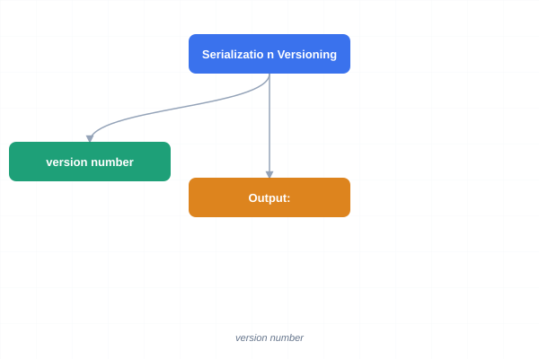
</a>
<a href="../../assets/images/diagrams/oop-cpp/11-file-io/serialization-versioning-sticky.svg" target="_blank" rel="noopener">
  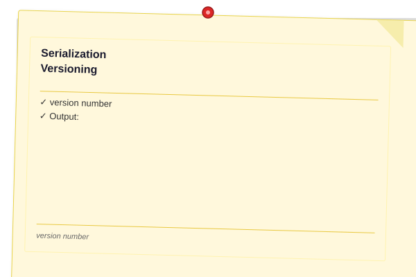
</a>


Always include a **version number** at the start of serialized data:

```cpp
#include <fstream>
#include <iostream>
#include <string>

class VersionedData {
    std::string payload_;
public:
    static const uint32_t FORMAT_VERSION = 2;

    void save(std::ofstream& out) const {
        // Version header → allows future format changes
        out.write(reinterpret_cast<const char*>(&FORMAT_VERSION),
                  sizeof(FORMAT_VERSION));

        // Actual data
        size_t len = payload_.size();
        out.write(reinterpret_cast<const char*>(&len), sizeof(len));
        out.write(payload_.data(), len);
    }

    bool load(std::ifstream& in) {
        uint32_t version;
        in.read(reinterpret_cast<char*>(&version), sizeof(version));

        if (version > FORMAT_VERSION) {
            std::cerr << "Unsupported format version: " << version << "\n";
            return false;
        }

        size_t len;
        in.read(reinterpret_cast<char*>(&len), sizeof(len));
        payload_.resize(len);
        in.read(&payload_[0], len);
        return true;
    }

    void setPayload(const std::string& p) { payload_ = p; }
    void print() const { std::cout << "Payload: " << payload_ << "\n"; }
};

int main() {
    VersionedData v1;
    v1.setPayload("Hello, Future!");

    {
        std::ofstream out("versioned.bin", std::ios::binary);
        v1.save(out);
    }

    {
        VersionedData v2;
        std::ifstream in("versioned.bin", std::ios::binary);
        if (v2.load(in))
            v2.print();
    }

    return 0;
}
```

**Output:**
```
Payload: Hello, Future!
```

### Serialization Methods Comparison

<a href="../../assets/images/diagrams/oop-cpp/11-file-io/serialization-methods-comparison-handwritten.svg" target="_blank" rel="noopener">
  
</a>
<a href="../../assets/images/diagrams/oop-cpp/11-file-io/serialization-methods-comparison-diagram.svg" target="_blank" rel="noopener">
  
</a>
<a href="../../assets/images/diagrams/oop-cpp/11-file-io/serialization-methods-comparison-sticky.svg" target="_blank" rel="noopener">
  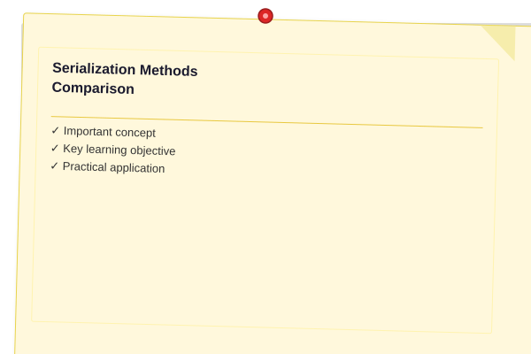
</a>


| Method | Speed | Size (N bytes) | Portability | Complexity |
|--------|-------|----------------|-------------|------------|
| Raw struct dump | Fastest | `sizeof(T)` | None (same compiler/hardware) | Trivial |
| Length-prefixed fields | Fast | Variable | Good (readable with spec) | Medium |
| CSV/JSON text | Slow | ~2x-3x | Excellent | Low (CSV) / Medium (JSON) |
| Protocol Buffers | Medium | Compact | Excellent | High (library) |
| Boost.Serialization | Medium | Variable | Good | High (template-heavy) |
| std::variant approach | Fast | Optimized | Good | Medium |

### Complexity Analysis → Serialization

<a href="../../assets/images/diagrams/oop-cpp/11-file-io/complexity-analysis-serialization-handwritten.svg" target="_blank" rel="noopener">
  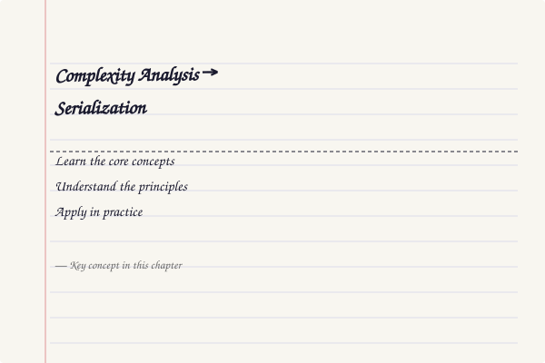
</a>
<a href="../../assets/images/diagrams/oop-cpp/11-file-io/complexity-analysis-serialization-diagram.svg" target="_blank" rel="noopener">
  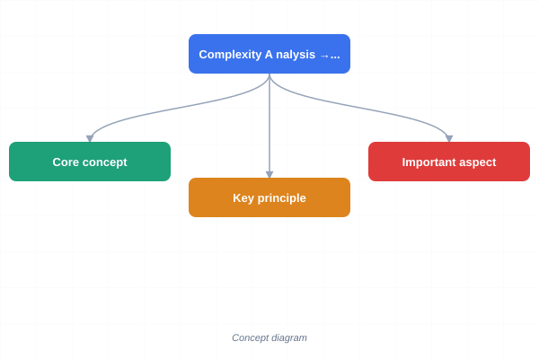
</a>
<a href="../../assets/images/diagrams/oop-cpp/11-file-io/complexity-analysis-serialization-sticky.svg" target="_blank" rel="noopener">
  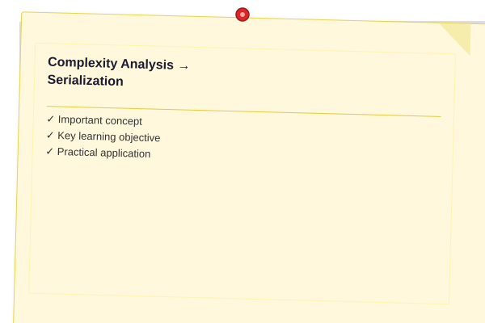
</a>


| Operation | Time | Space | Why |
|-----------|------|-------|-----|
| Serialize POD (N bytes) | O(N) | O(N) | Raw memory copy |
| Deserialize POD (N bytes) | O(N) | O(N) | Raw memory copy |
| Serialize string (L chars) | O(L) | O(L) | Must write length + characters |
| Serialize vector of M ints | O(M) | O(M) | Write count + M elements |
| CSV serialization | O(N) | O(N) | Character conversion + text output |
| Text deserialization | O(N) | O(N) | Character parsing + conversion |

### Edge Cases → Serialization

<a href="../../assets/images/diagrams/oop-cpp/11-file-io/edge-cases-serialization-handwritten.svg" target="_blank" rel="noopener">
  
</a>
<a href="../../assets/images/diagrams/oop-cpp/11-file-io/edge-cases-serialization-diagram.svg" target="_blank" rel="noopener">
  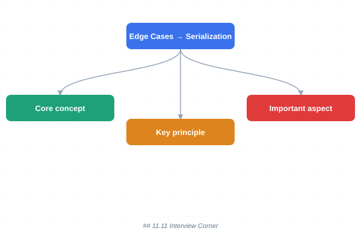
</a>
<a href="../../assets/images/diagrams/oop-cpp/11-file-io/edge-cases-serialization-sticky.svg" target="_blank" rel="noopener">
  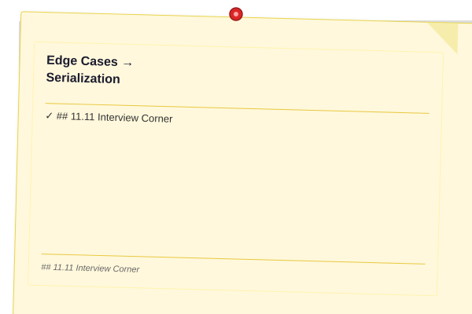
</a>


| Scenario | Problem | Solution |
|----------|---------|----------|
| Different compilers | Different padding/alignment | Use `#pragma pack` or fixed-width serialization |
| Different architectures | Endianness differences | Use network byte order (`htonl`/`ntohl`) |
| Dynamic memory | Pointer values are meaningless | Don't serialize pointers; serialize pointed-to data instead |
| Version mismatch | Older code can't read newer format | Include format version number |
| Empty strings | Length = 0, no character data needed | Handle len=0 case gracefully |
| Very large containers | Memory/time blowup | Stream, don't buffer; chunk the data |
| Corrupted data | Invalid sizes, wrong version | Validate sizes; use checksums (CRC) |

---

## 11.11 Interview Corner

### Q1: What is the difference between ifstream, ofstream, and fstream?

<a href="../../assets/images/diagrams/oop-cpp/11-file-io/what-is-the-difference-between-ifstream-ofstream-and-fstream-handwritten.svg" target="_blank" rel="noopener">
  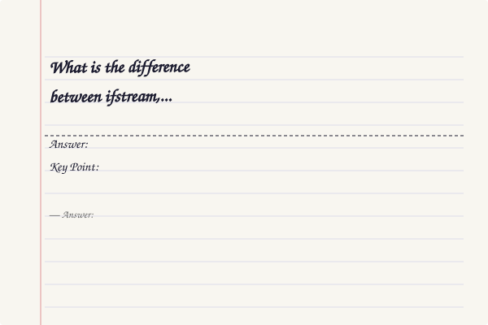
</a>
<a href="../../assets/images/diagrams/oop-cpp/11-file-io/what-is-the-difference-between-ifstream-ofstream-and-fstream-diagram.svg" target="_blank" rel="noopener">
  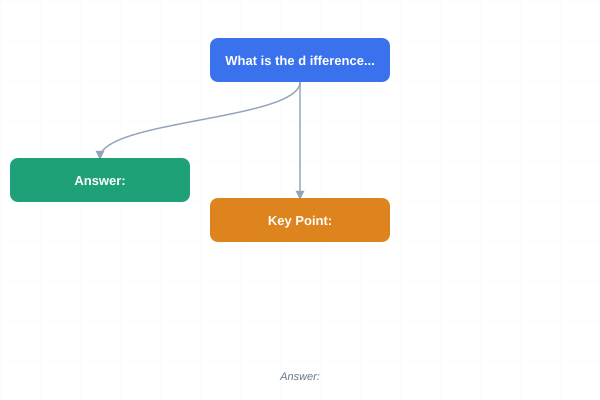
</a>
<a href="../../assets/images/diagrams/oop-cpp/11-file-io/what-is-the-difference-between-ifstream-ofstream-and-fstream-sticky.svg" target="_blank" rel="noopener">
  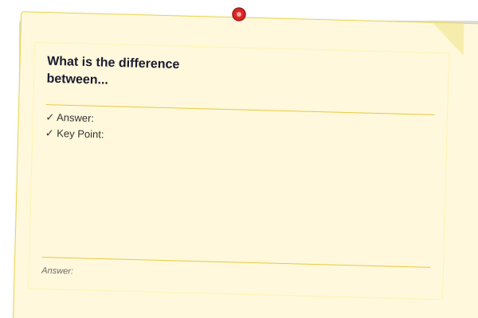
</a>


**Answer:**
| Class | Direction | Use Case |
|-------|-----------|----------|
| `ifstream` | Read-only | Config readers, log analyzers |
| `ofstream` | Write-only | Log writers, report generators |
| `fstream` | Read and write | Database files, editor buffers |

**Key Point:** `ofstream` truncates by default; `fstream` does not.

### Q2: How do you check if a file opened successfully?

<a href="../../assets/images/diagrams/oop-cpp/11-file-io/how-do-you-check-if-a-file-opened-successfully-handwritten.svg" target="_blank" rel="noopener">
  
</a>
<a href="../../assets/images/diagrams/oop-cpp/11-file-io/how-do-you-check-if-a-file-opened-successfully-diagram.svg" target="_blank" rel="noopener">
  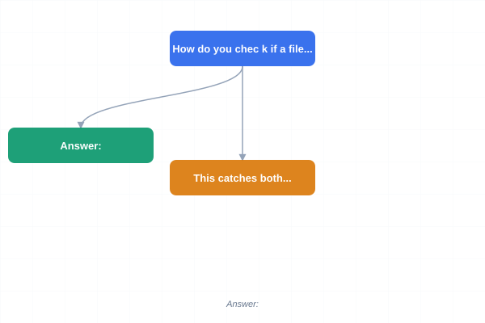
</a>
<a href="../../assets/images/diagrams/oop-cpp/11-file-io/how-do-you-check-if-a-file-opened-successfully-sticky.svg" target="_blank" rel="noopener">
  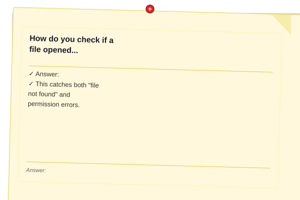
</a>


**Answer:**
```cpp
std::ifstream file("data.txt");
if (!file) {  // or file.fail()
    std::cerr << "Failed to open\n";
}
```

The `!` operator returns true if `failbit` or `badbit` is set. This catches both "file not found" and permission errors.

### Q3: What happens if you try to open a non-existent file with ofstream?

<a href="../../assets/images/diagrams/oop-cpp/11-file-io/what-happens-if-you-try-to-open-a-non-existent-file-with-ofstream-handwritten.svg" target="_blank" rel="noopener">
  
</a>
<a href="../../assets/images/diagrams/oop-cpp/11-file-io/what-happens-if-you-try-to-open-a-non-existent-file-with-ofstream-diagram.svg" target="_blank" rel="noopener">
  
</a>
<a href="../../assets/images/diagrams/oop-cpp/11-file-io/what-happens-if-you-try-to-open-a-non-existent-file-with-ofstream-sticky.svg" target="_blank" rel="noopener">
  
</a>


**Answer:** `ofstream` **creates** the file if it doesn't exist. If it does exist, it truncates (clears) it by default. To append instead:
```cpp
std::ofstream file("log.txt", std::ios::app);
```

### Q4: What is the difference between text mode and binary mode on Windows?

<a href="../../assets/images/diagrams/oop-cpp/11-file-io/what-is-the-difference-between-text-mode-and-binary-mode-on-windows-handwritten.svg" target="_blank" rel="noopener">
  
</a>
<a href="../../assets/images/diagrams/oop-cpp/11-file-io/what-is-the-difference-between-text-mode-and-binary-mode-on-windows-diagram.svg" target="_blank" rel="noopener">
  
</a>
<a href="../../assets/images/diagrams/oop-cpp/11-file-io/what-is-the-difference-between-text-mode-and-binary-mode-on-windows-sticky.svg" target="_blank" rel="noopener">
  
</a>


**Answer:** In text mode:
- Writing `\n` (0x0A) produces `\r\n` (0x0D 0x0A) on disk
- Reading `\r\n` converts back to `\n`

Binary mode suppresses all translation. This is why binary files (images, executables) must be opened in binary mode → any byte with value 0x0A or 0x0D would be corrupted in text mode.

### Q5: Why is `while (!file.eof())` wrong?

<a href="../../assets/images/diagrams/oop-cpp/11-file-io/why-is-while-file-eof-wrong-handwritten.svg" target="_blank" rel="noopener">
  
</a>
<a href="../../assets/images/diagrams/oop-cpp/11-file-io/why-is-while-file-eof-wrong-diagram.svg" target="_blank" rel="noopener">
  
</a>
<a href="../../assets/images/diagrams/oop-cpp/11-file-io/why-is-while-file-eof-wrong-sticky.svg" target="_blank" rel="noopener">
  
</a>


**Answer:** `eof()` returns true only AFTER a read attempt fails due to EOF. This means:
1. The last successful read appears to fail (one extra iteration)
2. If the file has format errors, you get an infinite loop

**Correct:**
```cpp
while (file >> value) {    // fails at EOF OR format error
    process(value);
}
```

### Q6: How do you read an entire file into a string?

<a href="../../assets/images/diagrams/oop-cpp/11-file-io/how-do-you-read-an-entire-file-into-a-string-handwritten.svg" target="_blank" rel="noopener">
  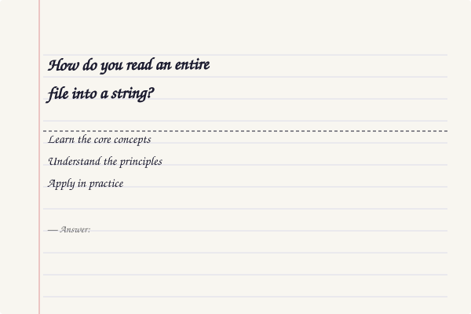
</a>
<a href="../../assets/images/diagrams/oop-cpp/11-file-io/how-do-you-read-an-entire-file-into-a-string-diagram.svg" target="_blank" rel="noopener">
  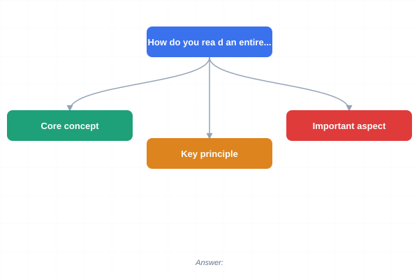
</a>
<a href="../../assets/images/diagrams/oop-cpp/11-file-io/how-do-you-read-an-entire-file-into-a-string-sticky.svg" target="_blank" rel="noopener">
  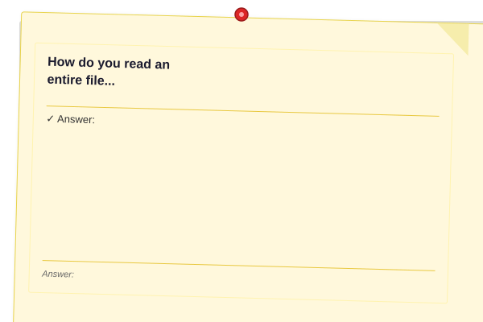
</a>


**Answer:**
```cpp
// Method 1: istreambuf_iterator
std::ifstream file("data.txt");
std::string content(
    std::istreambuf_iterator<char>(file),
    std::istreambuf_iterator<char>()
);

// Method 2: stringstream + rdbuf
std::ifstream file2("data.txt");
std::stringstream buffer;
buffer << file2.rdbuf();
std::string content2 = buffer.str();
```

Method 1 is more idiomatic; Method 2 is more readable.

### Q7: How do you read a file backwards (last line first)?

<a href="../../assets/images/diagrams/oop-cpp/11-file-io/how-do-you-read-a-file-backwards-last-line-first-handwritten.svg" target="_blank" rel="noopener">
  
</a>
<a href="../../assets/images/diagrams/oop-cpp/11-file-io/how-do-you-read-a-file-backwards-last-line-first-diagram.svg" target="_blank" rel="noopener">
  
</a>
<a href="../../assets/images/diagrams/oop-cpp/11-file-io/how-do-you-read-a-file-backwards-last-line-first-sticky.svg" target="_blank" rel="noopener">
  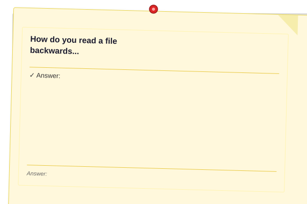
</a>


**Answer:**
```cpp
std::ifstream file("log.txt", std::ios::ate | std::ios::binary);
if (!file) return;

// Get file size
std::streampos size = file.tellg();

// Read backwards in chunks
std::streampos pos = size;
while (pos > 0) {
    file.seekg(--pos);
    char c;
    file.get(c);
    if (c == '\n') {
        // Process line (not shown)
    }
}
```

Or read all lines into a vector and reverse.

### Q8: What is the purpose of tellg() and tellp()?

<a href="../../assets/images/diagrams/oop-cpp/11-file-io/what-is-the-purpose-of-tellg-and-tellp-handwritten.svg" target="_blank" rel="noopener">
  
</a>
<a href="../../assets/images/diagrams/oop-cpp/11-file-io/what-is-the-purpose-of-tellg-and-tellp-diagram.svg" target="_blank" rel="noopener">
  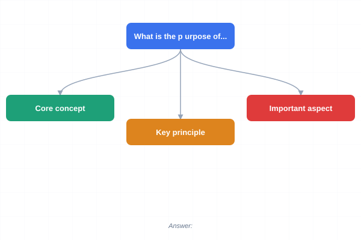
</a>
<a href="../../assets/images/diagrams/oop-cpp/11-file-io/what-is-the-purpose-of-tellg-and-tellp-sticky.svg" target="_blank" rel="noopener">
  
</a>


**Answer:** They return the current position of the get pointer (for reading) and put pointer (for writing) as a `std::streampos` value. Used to:
- Remember a position for later seeking
- Determine file size: `seekg(0, end); auto size = tellg();`
- Verify positioning after seeks

### Q9: How do string streams differ from file streams?

<a href="../../assets/images/diagrams/oop-cpp/11-file-io/how-do-string-streams-differ-from-file-streams-handwritten.svg" target="_blank" rel="noopener">
  
</a>
<a href="../../assets/images/diagrams/oop-cpp/11-file-io/how-do-string-streams-differ-from-file-streams-diagram.svg" target="_blank" rel="noopener">
  
</a>
<a href="../../assets/images/diagrams/oop-cpp/11-file-io/how-do-string-streams-differ-from-file-streams-sticky.svg" target="_blank" rel="noopener">
  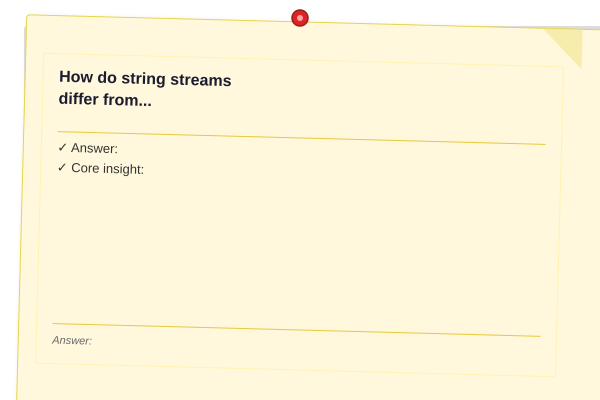
</a>


**Answer:**

| Aspect | File Stream | String Stream |
|--------|-------------|---------------|
| **Storage** | Disk | Memory (RAM) |
| **Speed** | Slow (I/O) | Fast |
| **Persistence** | Yes | No (lost when object destroyed) |
| **Header** | `<fstream>` | `<sstream>` |
| **Class names** | ifstream/ofstream/fstream | istringstream/ostringstream/stringstream |

**Core insight:** String streams use the same interface as file streams, making them interchangeable for testing or when data sources change.

### Q10: How do you serialize a class with virtual functions?

<a href="../../assets/images/diagrams/oop-cpp/11-file-io/how-do-you-serialize-a-class-with-virtual-functions-handwritten.svg" target="_blank" rel="noopener">
  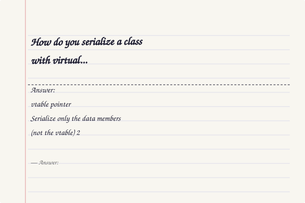
</a>
<a href="../../assets/images/diagrams/oop-cpp/11-file-io/how-do-you-serialize-a-class-with-virtual-functions-diagram.svg" target="_blank" rel="noopener">
  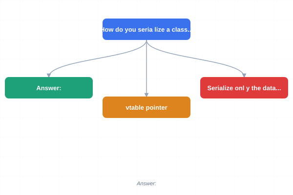
</a>
<a href="../../assets/images/diagrams/oop-cpp/11-file-io/how-do-you-serialize-a-class-with-virtual-functions-sticky.svg" target="_blank" rel="noopener">
  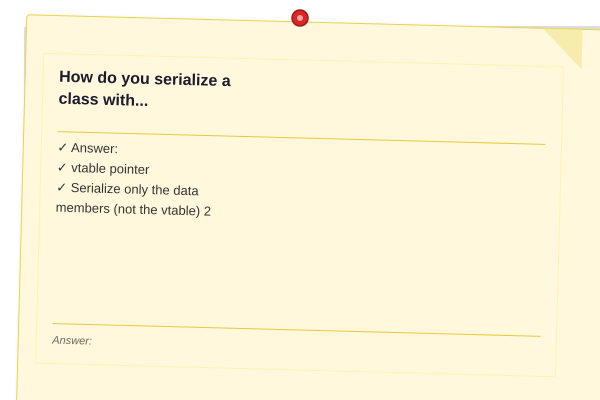
</a>


**Answer:** Classes with virtual functions have a **vtable pointer** as an implicit member. Serializing the raw memory includes this pointer, which is meaningless in a new process. Instead:
1. Serialize only the data members (not the vtable)
2. Write a type identifier (e.g., an enum) before the data
3. During deserialization, read the type ID and construct the appropriate derived type

```cpp
enum class Type { BASE = 1, DERIVED = 2 };

void serialize(std::ofstream& out, const Base& b) {
    Type t = Type::BASE;
    out.write(reinterpret_cast<const char*>(&t), sizeof(t));
    b.save(out);  // virtual save() that writes only data
}
```

### Q11: What is the difference between `read()`/`write()` and `<<`/`>>`?

<a href="../../assets/images/diagrams/oop-cpp/11-file-io/what-is-the-difference-between-read-write-and-handwritten.svg" target="_blank" rel="noopener">
  >`?" width="30%">
</a>
<a href="../../assets/images/diagrams/oop-cpp/11-file-io/what-is-the-difference-between-read-write-and-diagram.svg" target="_blank" rel="noopener">
  >`?" width="30%">
</a>
<a href="../../assets/images/diagrams/oop-cpp/11-file-io/what-is-the-difference-between-read-write-and-sticky.svg" target="_blank" rel="noopener">
  >`?" width="30%">
</a>


**Answer:**
| Feature | `<<` / `>>` | `read()` / `write()` |
|---------|-------------|---------------------|
| **Format** | Formatted (text) | Unformatted (raw bytes) |
| **Whitespace** | Skips whitespace by default | Includes everything |
| **Delimiter** | Stops at whitespace | Reads exactly N bytes |
| **Type Safety** | Type-aware (converts) | Not type-aware (raw bytes) |
| **Use Case** | Human-readable data | Binary data, fixed-size records |

### Q12: What happens if you don't close a file?

<a href="../../assets/images/diagrams/oop-cpp/11-file-io/what-happens-if-you-don-t-close-a-file-handwritten.svg" target="_blank" rel="noopener">
  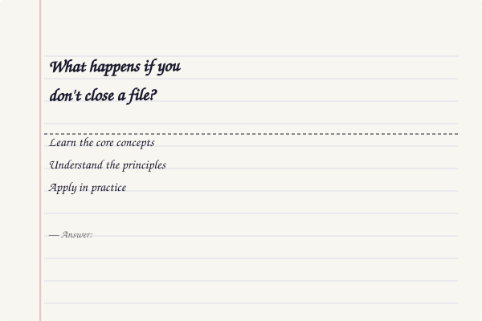
</a>
<a href="../../assets/images/diagrams/oop-cpp/11-file-io/what-happens-if-you-don-t-close-a-file-diagram.svg" target="_blank" rel="noopener">
  
</a>
<a href="../../assets/images/diagrams/oop-cpp/11-file-io/what-happens-if-you-don-t-close-a-file-sticky.svg" target="_blank" rel="noopener">
  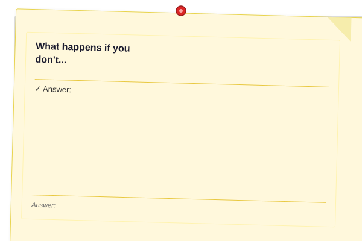
</a>


**Answer:** The destructor calls `close()` automatically (RAII). However:
- If the program crashes before destruction, buffered data may be lost
- On some systems, there's a limit on open file descriptors (ulimit)
- Explicit `close()` allows detecting write errors via the return value:
  ```cpp
  file.close();
  if (file.fail()) { /* flush or disk-full error */ }
  ```

---

## 11.12 Real Systems Applications

### 1. Configuration File Parser (INI format)

<a href="../../assets/images/diagrams/oop-cpp/11-file-io/1-configuration-file-parser-ini-format-handwritten.svg" target="_blank" rel="noopener">
  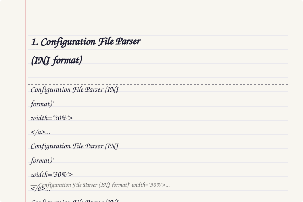
</a>
<a href="../../assets/images/diagrams/oop-cpp/11-file-io/1-configuration-file-parser-ini-format-diagram.svg" target="_blank" rel="noopener">
  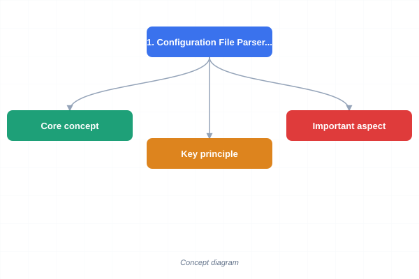
</a>
<a href="../../assets/images/diagrams/oop-cpp/11-file-io/1-configuration-file-parser-ini-format-sticky.svg" target="_blank" rel="noopener">
  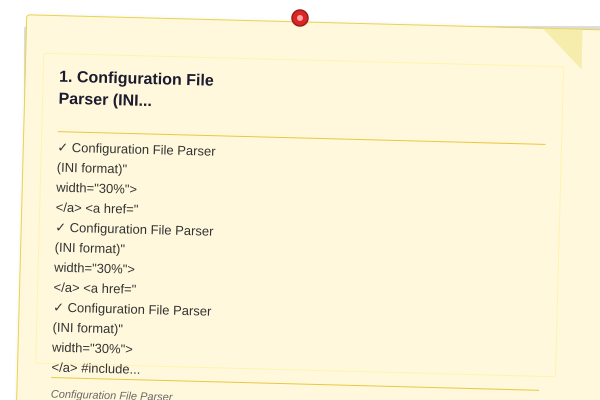
</a>


```cpp
#include <fstream>
#include <sstream>
#include <iostream>
#include <string>
#include <map>

class ConfigParser {
    std::map<std::string, std::map<std::string, std::string>> data_;
public:
    bool load(const std::string& path) {
        std::ifstream file(path);
        if (!file) return false;

        std::string line, currentSection;
        while (std::getline(file, line)) {
            // Skip comments and empty lines
            if (line.empty() || line[0] == ';' || line[0] == '#') continue;

            // Section header [SectionName]
            if (line[0] == '[') {
                currentSection = line.substr(1, line.find(']') - 1);
                continue;
            }

            // Key=Value
            auto eq = line.find('=');
            if (eq != std::string::npos) {
                std::string key = line.substr(0, eq);
                std::string val = line.substr(eq + 1);
                data_[currentSection][key] = val;
            }
        }
        return true;
    }

    std::string get(const std::string& section,
                    const std::string& key,
                    const std::string& def = "") const {
        auto sit = data_.find(section);
        if (sit == data_.end()) return def;
        auto kit = sit->second.find(key);
        return kit == sit->second.end() ? def : kit->second;
    }
};

// Usage → reads config files like database servers do
```

### 2. Game Save System

<a href="../../assets/images/diagrams/oop-cpp/11-file-io/2-game-save-system-handwritten.svg" target="_blank" rel="noopener">
  
</a>
<a href="../../assets/images/diagrams/oop-cpp/11-file-io/2-game-save-system-diagram.svg" target="_blank" rel="noopener">
  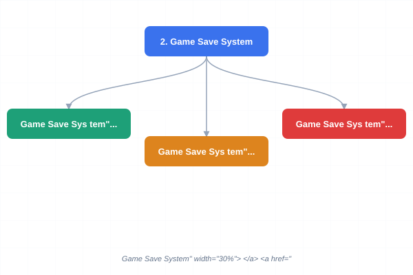
</a>
<a href="../../assets/images/diagrams/oop-cpp/11-file-io/2-game-save-system-sticky.svg" target="_blank" rel="noopener">
  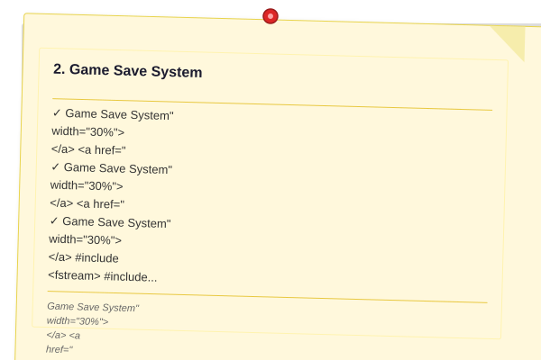
</a>


```cpp
#include <fstream>
#include <iostream>
#include <string>
#include <vector>
#include <cstring>

class Player {
    char name_[32];
    int level_;
    int hp_;
    int maxHp_;
    float x_, y_, z_;
    std::vector<int> inventory_;

public:
    Player() = default;
    Player(const std::string& name, int lvl, int hp, int mx,
           float x, float y, float z)
        : level_(lvl), hp_(hp), maxHp_(mx), x_(x), y_(y), z_(z) {
        std::strncpy(name_, name.c_str(), 31);
        name_[31] = '\0';
    }

    void addItem(int itemId) { inventory_.push_back(itemId); }

    void save(const std::string& path) {
        std::ofstream out(path, std::ios::binary);
        if (!out) { std::cerr << "Save failed!\n"; return; }

        // Player struct data
        out.write(reinterpret_cast<const char*>(this),
                  sizeof(name_) + sizeof(level_) + sizeof(hp_) +
                  sizeof(maxHp_) + sizeof(x_) + sizeof(y_) + sizeof(z_));

        // Inventory (size + elements)
        size_t invSize = inventory_.size();
        out.write(reinterpret_cast<const char*>(&invSize), sizeof(invSize));
        out.write(reinterpret_cast<const char*>(inventory_.data()),
                  invSize * sizeof(int));

        std::cout << "Game saved to " << path << "\n";
    }

    void load(const std::string& path) {
        std::ifstream in(path, std::ios::binary);
        if (!in) { std::cerr << "Load failed!\n"; return; }

        in.read(reinterpret_cast<char*>(this),
                sizeof(name_) + sizeof(level_) + sizeof(hp_) +
                sizeof(maxHp_) + sizeof(x_) + sizeof(y_) + sizeof(z_));

        size_t invSize;
        in.read(reinterpret_cast<char*>(&invSize), sizeof(invSize));
        inventory_.resize(invSize);
        in.read(reinterpret_cast<char*>(inventory_.data()),
                invSize * sizeof(int));

        std::cout << "Game loaded from " << path << "\n";
        std::cout << "Player: " << name_ << ", Level "
                  << level_ << ", HP: " << hp_ << "/" << maxHp_ << "\n";
    }
};

// Usage:
// Player hero("Archer", 5, 75, 100, 10.5f, 20.3f, 0.0f);
// hero.addItem(101); // Sword of Awesomeness
// hero.addItem(205); // Health Potion
// hero.save("savegame.sav");
// Player restored;
// restored.load("savegame.sav");
```

### 3. Database Page Storage

<a href="../../assets/images/diagrams/oop-cpp/11-file-io/3-database-page-storage-handwritten.svg" target="_blank" rel="noopener">
  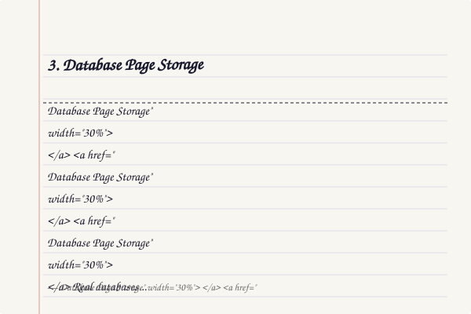
</a>
<a href="../../assets/images/diagrams/oop-cpp/11-file-io/3-database-page-storage-diagram.svg" target="_blank" rel="noopener">
  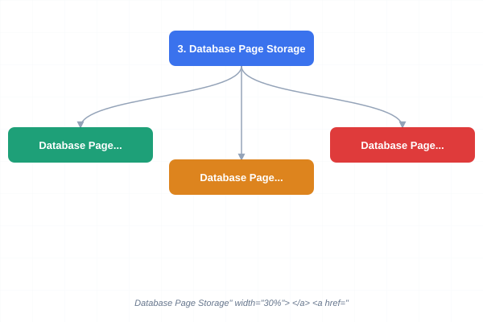
</a>
<a href="../../assets/images/diagrams/oop-cpp/11-file-io/3-database-page-storage-sticky.svg" target="_blank" rel="noopener">
  
</a>


Real databases (SQLite, MySQL) use file I/O for persistent page storage:

```cpp
#include <fstream>
#include <iostream>
#include <vector>
#include <cstring>

constexpr int PAGE_SIZE = 4096;
constexpr int MAGIC = 0xDB1234;

struct Page {
    int pageId;
    char data[PAGE_SIZE - sizeof(int)];
};

class SimpleDB {
    std::fstream file_;
    int numPages_;

public:
    bool open(const std::string& path) {
        file_.open(path,
                   std::ios::in | std::ios::out | std::ios::binary);
        if (!file_) {
            // Create new database file
            file_.clear();
            file_.open(path,
                       std::ios::in | std::ios::out
                       | std::ios::trunc | std::ios::binary);
            if (!file_) return false;
            // Write header
            int magic = MAGIC;
            file_.write(reinterpret_cast<const char*>(&magic), sizeof(magic));
            numPages_ = 0;
        } else {
            int magic;
            file_.read(reinterpret_cast<char*>(&magic), sizeof(magic));
            if (magic != MAGIC) return false;
            // Calculate number of pages from file size
            file_.seekg(0, std::ios::end);
            int fileSize = file_.tellg();
            numPages_ = (fileSize - sizeof(magic)) / sizeof(Page);
        }
        return true;
    }

    bool readPage(int pageId, Page& page) {
        if (pageId >= numPages_) return false;
        int offset = sizeof(int) + pageId * sizeof(Page);
        file_.seekg(offset, std::ios::beg);
        file_.read(reinterpret_cast<char*>(&page), sizeof(Page));
        return !file_.fail();
    }

    bool writePage(int pageId, const Page& page) {
        int offset = sizeof(int) + pageId * sizeof(Page);
        file_.seekp(offset, std::ios::beg);
        file_.write(reinterpret_cast<const char*>(&page), sizeof(Page));
        file_.flush();
        if (pageId >= numPages_) numPages_ = pageId + 1;
        return !file_.fail();
    }

    void close() { file_.close(); }
};

// Usage pattern matches how SQLite manages its B-tree pages on disk
```

### 4. Log Rotation System

<a href="../../assets/images/diagrams/oop-cpp/11-file-io/4-log-rotation-system-handwritten.svg" target="_blank" rel="noopener">
  
</a>
<a href="../../assets/images/diagrams/oop-cpp/11-file-io/4-log-rotation-system-diagram.svg" target="_blank" rel="noopener">
  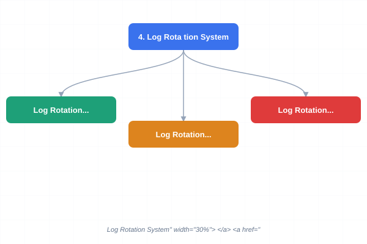
</a>
<a href="../../assets/images/diagrams/oop-cpp/11-file-io/4-log-rotation-system-sticky.svg" target="_blank" rel="noopener">
  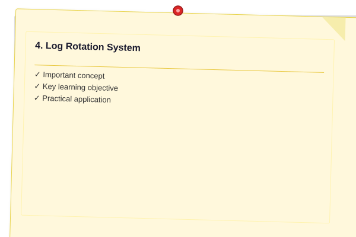
</a>


```cpp
#include <fstream>
#include <sstream>
#include <iostream>
#include <string>
#include <ctime>

class RotatingLogger {
    std::string baseName_;
    int maxSize_;      // max bytes per file
    int maxFiles_;     // max rotated files to keep
    std::ofstream current_;
    int currentSize_;

public:
    RotatingLogger(const std::string& baseName,
                   int maxSize = 1024 * 1024,  // 1 MB
                   int maxFiles = 5)
        : baseName_(baseName), maxSize_(maxSize), maxFiles_(maxFiles) {
        openNewFile();
    }

    void log(const std::string& level, const std::string& message) {
        std::ostringstream entry;
        std::time_t now = std::time(nullptr);
        entry << "[" << std::ctime(&now);
        entry.seekp(-1, std::ios::cur); // remove trailing \n
        entry << "] [" << level << "] " << message << "\n";

        std::string formatted = entry.str();
        current_ << formatted;
        current_.flush();
        currentSize_ += formatted.size();

        if (currentSize_ >= maxSize_) {
            current_.close();
            rotate();
            openNewFile();
        }
    }

private:
    void rotate() {
        // Delete oldest if maxFiles reached
        std::string oldest = baseName_ + "." + std::to_string(maxFiles_);
        std::ifstream check(oldest);
        if (check) {
            check.close();
            std::remove(oldest.c_str());
        }

        // Shift files: .2 -> .3, .1 -> .2
        for (int i = maxFiles_ - 1; i >= 1; --i) {
            std::string from = baseName_ + "." + std::to_string(i);
            std::string to = baseName_ + "." + std::to_string(i + 1);
            std::ifstream exists(from);
            if (exists) {
                exists.close();
                std::rename(from.c_str(), to.c_str());
            }
        }

        // Rename current log -> .1
        std::rename(baseName_.c_str(),
                    (baseName_ + ".1").c_str());
    }

    void openNewFile() {
        current_.open(baseName_, std::ios::app);
        currentSize_ = 0;
    }
};

// Usage:
// RotatingLogger logger("server", 1048576, 5);
// logger.log("INFO", "Server started");
// logger.log("ERROR", "Connection refused: 192.168.1.1");
```

---

## 11.13 Comparison Tables

### File I/O Operations Summary

<a href="../../assets/images/diagrams/oop-cpp/11-file-io/file-i-o-operations-summary-handwritten.svg" target="_blank" rel="noopener">
  
</a>
<a href="../../assets/images/diagrams/oop-cpp/11-file-io/file-i-o-operations-summary-diagram.svg" target="_blank" rel="noopener">
  
</a>
<a href="../../assets/images/diagrams/oop-cpp/11-file-io/file-i-o-operations-summary-sticky.svg" target="_blank" rel="noopener">
  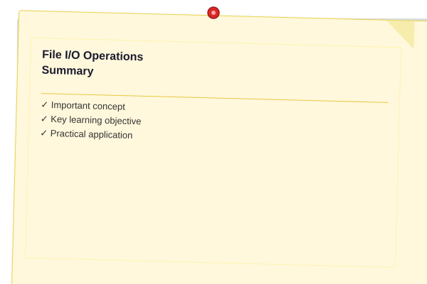
</a>


| Operation | Text File | Binary File | Method |
|-----------|-----------|-------------|--------|
| Open for reading | `ifstream f("f.txt")` | `ifstream f("f.bin", ios::binary)` | Constructor |
| Open for writing | `ofstream f("f.txt")` | `ofstream f("f.bin", ios::binary)` | Constructor |
| Open for append | `ofstream f("f.txt", ios::app)` | `ofstream f("f.bin", ios::app | ios::binary)` | Mode flags |
| Read one word | `file >> word` | → | `>>` |
| Read one line | `getline(file, line)` | → | `getline` |
| Read N bytes | → | `file.read(buf, N)` | `read()` |
| Write formatted | `file << "Text" << num` | → | `<<` |
| Write N bytes | → | `file.write(data, N)` | `write()` |
| Check position | `file.tellg()` | `file.tellg()` | `tellg()` |
| Seek to position | `file.seekg(pos)` | `file.seekg(pos)` | `seekg()` |
| File size | `seekg(0, end); size = tellg()` | Same | tellg trick |
| Close file | `file.close()` | `file.close()` | `close()` |

### Stream State After Common Operations

<a href="../../assets/images/diagrams/oop-cpp/11-file-io/stream-state-after-common-operations-handwritten.svg" target="_blank" rel="noopener">
  
</a>
<a href="../../assets/images/diagrams/oop-cpp/11-file-io/stream-state-after-common-operations-diagram.svg" target="_blank" rel="noopener">
  
</a>
<a href="../../assets/images/diagrams/oop-cpp/11-file-io/stream-state-after-common-operations-sticky.svg" target="_blank" rel="noopener">
  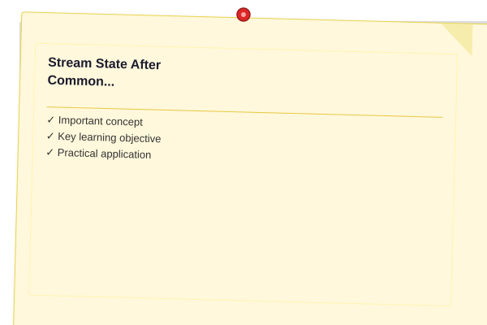
</a>


| Operation | good() | eof() | fail() | bad() |
|-----------|--------|-------|--------|-------|
| File opened successfully | true | false | false | false |
| File failed to open | false | false | true | false |
| Read hit EOF | false | true | true | false |
| Format error (e.g., "abc" for int) | false | false | true | false |
| Hardware error | false | false | false | true |
| After clear() | true | false | false | false |

### Error Handling Methods Comparison

<a href="../../assets/images/diagrams/oop-cpp/11-file-io/error-handling-methods-comparison-handwritten.svg" target="_blank" rel="noopener">
  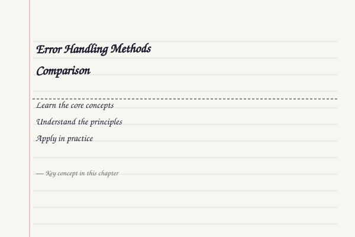
</a>
<a href="../../assets/images/diagrams/oop-cpp/11-file-io/error-handling-methods-comparison-diagram.svg" target="_blank" rel="noopener">
  
</a>
<a href="../../assets/images/diagrams/oop-cpp/11-file-io/error-handling-methods-comparison-sticky.svg" target="_blank" rel="noopener">
  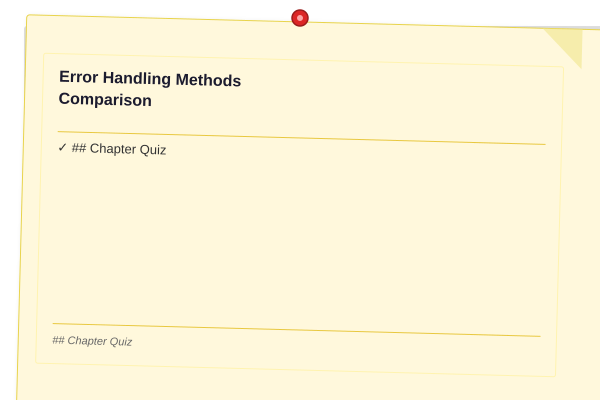
</a>


| Method | Best For | Example |
|--------|----------|---------|
| Boolean conversion (`if (!file)`) | Quick open/read check | `if (!file) return;` |
| State member functions | Detailed diagnostics | `if (file.eof()) ...` |
| Exception mode (exceptions()) | Clean error propagation | `file.exceptions(ios::failbit)` |
| Return value of read/write | Checking exact byte count | `file.read(buf, N); gcount()` |

---

## Chapter Quiz

### Multiple Choice

<a href="../../assets/images/diagrams/oop-cpp/11-file-io/multiple-choice-handwritten.svg" target="_blank" rel="noopener">
  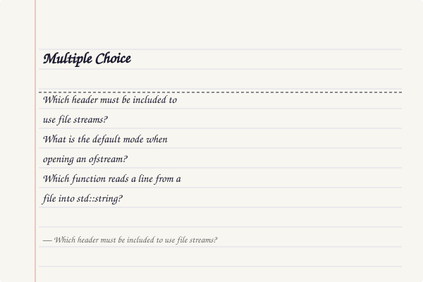
</a>
<a href="../../assets/images/diagrams/oop-cpp/11-file-io/multiple-choice-diagram.svg" target="_blank" rel="noopener">
  
</a>
<a href="../../assets/images/diagrams/oop-cpp/11-file-io/multiple-choice-sticky.svg" target="_blank" rel="noopener">
  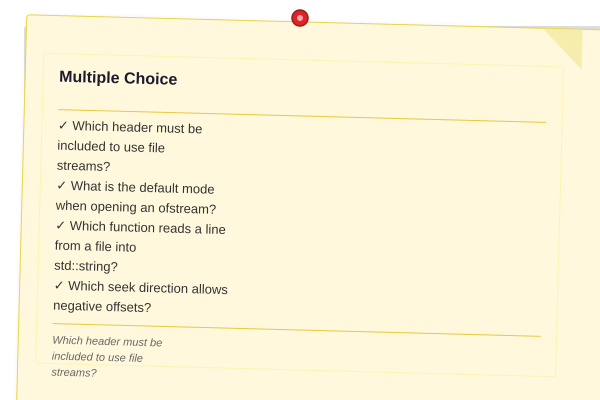
</a>


1. **Which header must be included to use file streams?**
   A) `<iostream>`
   B) `<fstream>`
   C) `<sstream>`
   D) `<filesystem>`
   <details><summary>Answer&lt;/summary&gt;**B)** `<fstream>` provides ifstream, ofstream, and fstream.</details>

2. **What is the default mode when opening an ofstream?**
   A) `ios::in`
   B) `ios::out | ios::trunc`
   C) `ios::out | ios::app`
   D) `ios::binary`
   <details><summary>Answer&lt;/summary&gt;**B)** ofstream opens in `out | trunc` mode, which truncates (clears) the file.</details>

3. **Which function reads a line from a file into std::string?**
   A) `file >> line`
   B) `file.read(line)`
   C) `getline(file, line)`
   D) `file.getline(line)`
   <details><summary>Answer&lt;/summary&gt;**C)** `std::getline(file, line)` reads until the delimiter (newline by default).</details>

4. **Which seek direction allows negative offsets?**
   A) `ios::beg`
   B) `ios::cur`
   C) `ios::end`
   D) Both B and C
   <details><summary>Answer&lt;/summary&gt;**D)** `ios::cur` and `ios::end` both support negative offsets (move backward). `ios::beg` does not.</details>

5. **What does `ios::binary` mode prevent on Windows?**
   A) Opening the file
   B) Newline translation (CRLF ↔ LF)
   C) Writing to the file
   D) Reading from the file
   <details><summary>Answer&lt;/summary&gt;**B)** Binary mode disables newline translation between `\n` and `\r\n`, which is essential for non-text data.</details>

6. **How do you get the current read position in a file?**
   A) `file.tellp()`
   B) `file.tellg()`
   C) `file.position()`
   D) `file.curpos()`
   <details><summary>Answer&lt;/summary&gt;**B)** `tellg()` returns the get (read) position; `tellp()` returns the put (write) position.</details>

7. **Which stream state flag indicates a hardware error?**
   A) `eofbit`
   B) `failbit`
   C) `badbit`
   D) `goodbit`
   <details><summary>Answer&lt;/summary&gt;**C)** `badbit` indicates an irrecoverable I/O error, typically hardware-related.</details>

8. **What does `str()` return for a stringstream?**
   A) The character at position 0
   B) The size of the buffer
   C) The underlying string
   D) The error state
   <details><summary>Answer&lt;/summary&gt;**C)** `.str()` returns a copy (C++11: move) of the underlying string object.</details>

9. **Which class should you use for in-memory output formatting?**
   A) `istringstream`
   B) `ostringstream`
   C) `ifstream`
   D) `ofstream`
   <details><summary>Answer&lt;/summary&gt;**B)** `ostringstream` writes to a string buffer that can be extracted via `.str()`.</details>

10. **Why should you include a version number in serialized data?**
    A) It makes the file smaller
    B) It allows future format changes while maintaining backward compatibility
    C) It's required by the C++ standard
    D) It prevents file corruption
    <details><summary>Answer&lt;/summary&gt;**B)** A version number lets your code detect and handle different formats as the serialization evolves.</details>

### True or False

<a href="../../assets/images/diagrams/oop-cpp/11-file-io/true-or-false-handwritten.svg" target="_blank" rel="noopener">
  
</a>
<a href="../../assets/images/diagrams/oop-cpp/11-file-io/true-or-false-diagram.svg" target="_blank" rel="noopener">
  
</a>
<a href="../../assets/images/diagrams/oop-cpp/11-file-io/true-or-false-sticky.svg" target="_blank" rel="noopener">
  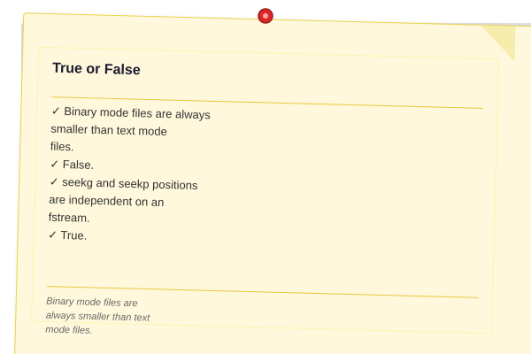
</a>


11. **Binary mode files are always smaller than text mode files.**
    <details><summary>Answer&lt;/summary&gt;**False.** Small integers (0-9) take 1 byte in text but 4 bytes in binary. Text representation of small values may be smaller.</details>

12. **seekg and seekp positions are independent on an fstream.**
    <details><summary>Answer&lt;/summary&gt;**True.** The get pointer and put pointer are separate and can be positioned independently (in C++11+).</details>

13. **getline reads the delimiter character and includes it in the string.**
    <details><summary>Answer&lt;/summary&gt;**False.** `getline` reads up to and discards the delimiter. The delimiter is NOT included in the result string.</details>

14. **String streams can be used as function arguments where file streams are expected.**
    <details><summary>Answer&lt;/summary&gt;**True (with exceptions).** Since both derive from `istream`/`ostream`, functions taking `istream&` can accept either file or string streams.</details>

15. **Calling close() on an already-closed file stream causes undefined behavior.**
    <details><summary>Answer&lt;/summary&gt;**False.** Calling `close()` on a closed stream is safe and does nothing.</details>

---

## Summary

File I/O in C++ extends the stream model of `cin`/`cout` to persistent storage. The `<fstream>` library provides three primary classes: `ifstream` (input file stream), `ofstream` (output file stream), and `fstream` (bidirectional file stream). Each RAII-based class automatically manages file resources via the destructor.

**Key takeaways:**

1. **File Stream Classes:** `ifstream` reads, `ofstream` writes, `fstream` does both. All follow RAII → resources are released when the object goes out of scope.

2. **Open Modes:** Six mode flags (`in`, `out`, `app`, `ate`, `trunc`, `binary`) combine via bitwise OR to control file access. `ofstream` truncates by default; use `app` to preserve existing content.

3. **Text I/O:** Use `getline()` for line-oriented reading, `>>` for tokenized reading, and `<<` for formatted writing.

4. **Binary I/O:** Use `read()` and `write()` with `reinterpret_cast<char*>()`. Fast and precise but not portable without care → endianness, padding, and type sizes differ across platforms.

5. **File Positioning:** `seekg`/`seekp` reposition the read/write cursor; `tellg`/`tellp` query the current position. Supports absolute (beg, end) and relative (cur) movement.

6. **Error Handling:** Four state flags (`good`, `eof`, `fail`, `bad`) track stream health. Always check stream state after I/O operations → never ignore failure.

7. **String Streams:** `<sstream>` provides the same interface for in-memory I/O. Use for string parsing, type conversion, and output formatting without touching the disk.

8. **Serialization:** Convert objects to byte streams for storage. Use length-prefixed strings, include version numbers, and avoid serializing pointer values. Consider libraries (Protocol Buffers, JSON) for complex or cross-platform needs.

---

## Exercises

### Review Questions

1. What is the difference between text mode and binary mode on Windows? Give a concrete example of data corruption that would occur.

2. What is the default behavior when opening an `ofstream` to an existing file? How would you change it?

3. Why should you check `if (!file.eof())` after a read loop that terminates on failure?

4. What are the four stream state flags and what does each indicate?

5. How does `tellg` differ from `tellp`? Can they return different values for the same file?

6. When would you use a stringstream instead of concatenating strings with `+`?

7. What are the portability issues with binary file serialization?

### Application Problems

1. **Word Frequency Counter:** Write a program that reads a text file, counts the frequency of each word (case-insensitive), and writes the results to another file sorted by frequency (descending). Use stringstream to tokenize each line.

2. **Binary Record Manager:** Design a binary file format for storing `struct Employee { int id; char name[64]; double salary; };`. Write functions to:
   - `addEmployee(filename, employee)` → append at end
   - `getEmployee(filename, id)` → search and read by ID
   - `listEmployees(filename)` → display all records
   - `updateSalary(filename, id, newSalary)` → random-access update

3. **Log Analyzer:** Write a program that parses a log file format: `[2024-01-15 10:30:45] [ERROR] Message here`. Count errors per hour and output a summary table.

### Challenge Problems

4. **Simple Indexed Database:** Implement a file-based key-value store. Design a format with:
   - A fixed-size header containing a table of offsets
   - Support `insert(key, data)` and `find(key)` operations
   - Variable-length string values
   - Uses `seekg`/`seekp` for random access
   - An in-memory index (`std::map<std::string, long>`) synced to the file header on close

5. **Custom Serialization Framework:** Design a minimal serialization system that can handle `int`, `double`, `std::string`, and `std::vector<T>`. Use a tag byte to identify each type:
   - `0x01` = int (followed by 4 bytes)
   - `0x02` = double (followed by 8 bytes)
   - `0x03` = string (followed by 4-byte length + data)
   - `0x04` = vector (followed by 4-byte count + elements)

   Write an `Archive` class with `save()` and `load()` overloads for each type.

---

## Cross-Application Matrix

| Domain | File I/O Application |
|--------|---------------------|
| **Config Files** | ifstream reads INI/JSON/YAML text configs; stringstream for line parsing |
| **Game Development** | Binary serialization of player state, world data, inventory; seekg for level-of-detail loading |
| **Database Engines** | fstream for low-level page storage with random access via seekg/seekp |
| **Logging Systems** | ofstream in append mode; rotating file strategy for multi-file logs |
| **Data Processing** | Sequential read, transform, write pipeline; stringstream for line-level parsing |
| **Serialization Frameworks** | Binary serialization with versioning; length-prefixed dynamic data |
| **Compilers** | ifstream reads source code; ofstream writes object/assembly output; file positioning for error reporting |
| **Network Servers** | ofstream for access/error logs; configuration file readers; PID file management |

---

> **Proceed to:** [12-smart-pointers](./12-smart-pointers.md) | **Return to:** [Course Index](./index.md)

