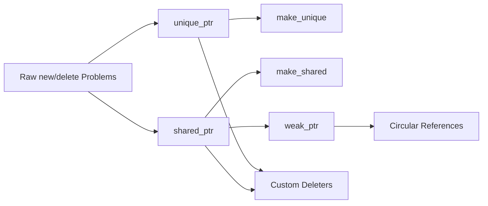

# Chapter 12: Smart Pointers

> **Previous:** [11-file-io](./11-file-io.md) | **Next:** [13-move-semantics](./13-move-semantics.md)

## Learning Objectives

After studying this chapter, students will be able to:

- Manage dynamic memory using `unique_ptr` for exclusive ownership
- Use `shared_ptr` for shared ownership with reference counting
- Break circular references with `weak_ptr`
- Create smart pointers with `make_unique` and `make_shared`
- Implement custom deleters for non-memory resources

## Chapter at a Glance

| Topic | Key Insight | Practical Takeaway |
|-------|-------------|-------------------|
| **Raw new/delete Problems** | Manual ownership management is error-prone and leaky | Use smart pointers as the default |
| **unique_ptr** | Exclusive ownership, move-only, zero overhead | Default choice for dynamic allocation |
| **shared_ptr** | Reference-counted shared ownership | Only when ownership is truly shared |
| **make_unique/make_shared** | Preferred factories, exception-safe and efficient | Prefer over raw new() |
| **weak_ptr** | Non-owning observer that locks to shared ownership | Breaks reference cycles |
| **Custom Deleters** | Extend smart pointers beyond memory resources | Use for files, sockets, other resources |

## Chapter Roadmap



## 12.1 The Problem with Raw `new`/`delete`


Manual memory management is error-prone:

```cpp
void process() {
    int* ptr = new int(42);
    // ... code that may throw or return early ...
    delete ptr;   // easy to forget or skip
}
```

Common problems: memory leaks (forgotten `delete`), double deletion, use-after-free, and exception safety. Smart pointers automate ownership semantics using RAII.

## 12.2 std::unique_ptr

> **One-Sentence Takeaway:** unique_ptr is an exclusive-ownership pointer with zero overhead over a raw pointer; it cannot be copied, only moved.
`unique_ptr` represents exclusive ownership. It is movable but not copyable. When the `unique_ptr` is destroyed, the owned object is deleted.

```cpp
#include <memory>

class Resource {
public:
    Resource() { std::cout << "Acquire\n"; }
    ~Resource() { std::cout << "Release\n"; }
    void work() { std::cout << "Working\n"; }
};

int main() {
    std::unique_ptr<Resource> ptr(new Resource());
    // or: auto ptr = std::make_unique<Resource>();

    ptr->work();

    // Transfer ownership
    std::unique_ptr<Resource> other = std::move(ptr);
    // ptr is now null

    // other is destroyed here, releasing the Resource
}
```

`unique_ptr` works with arrays (specialisation in C++17):

```cpp
auto arr = std::make_unique<int[]>(100);
arr[0] = 42;
```

Key operations:
- `release()` — relinquish ownership, return raw pointer
- `reset(p)` — delete current object, take ownership of `p`
- `get()` — return raw pointer (non-owning)
- `swap(other)` — swap managed objects

## 12.3 std::shared_ptr

> **One-Sentence Takeaway:** shared_ptr uses reference counting for shared ownership — copying increments the count, destruction decrements it.
`shared_ptr` implements shared ownership through reference counting. The managed object is destroyed when the last `shared_ptr` owning it is destroyed.

```cpp
#include <memory>

int main() {
    auto p1 = std::make_shared<int>(42);
    {
        auto p2 = p1;                      // reference count: 2
        std::cout << *p2 << '\n';          // 42
        std::cout << p2.use_count() << '\n'; // 2
    }                                      // p2 destroyed, count: 1
    std::cout << p1.use_count() << '\n';   // 1
}                                          // p1 destroyed, count: 0, int freed
```

Reference counting has overhead:
- Memory for the reference count (control block) is allocated separately
- Increment and decrement operations are atomic (thread-safe but non-trivial)
- Cyclic references cause memory leaks (addressed by `weak_ptr`)

## 12.4 make_unique and make_shared

> **One-Sentence Takeaway:** make_unique and make_shared are the preferred factories — they are exception-safe and more efficient.
Factory functions are preferred over explicit `new`:

```cpp
// Preferred
auto ptr = std::make_unique<MyClass>(arg1, arg2);
auto sptr = std::make_shared<MyClass>(arg1, arg2);

// Less preferred (possible exception-safety issues)
std::unique_ptr<MyClass> ptr(new MyClass(arg1, arg2));
```

`make_shared` allocates the object and control block in a single allocation, improving cache locality and reducing overhead. `make_unique` was added in C++14 (it is `std::make_unique`).

The exception-safety concern: `f(unique_ptr<T>(new T), other_func())` — if `other_func` throws after `new T` but before `unique_ptr` construction, a leak occurs. `make_unique` eliminates this window.

## 12.5 std::weak_ptr

> **One-Sentence Takeaway:** weak_ptr holds a non-owning reference that can be lock()-ed into a shared_ptr, breaking reference cycles.
`weak_ptr` provides a non-owning "weak reference" to a `shared_ptr`-managed object. It does not affect the reference count. To access the object, lock it—which returns a `shared_ptr` (or null if the object was deleted).

```cpp
#include <memory>

int main() {
    auto sp = std::make_shared<int>(42);
    std::weak_ptr<int> wp = sp;            // count still 1

    if (auto locked = wp.lock()) {
        std::cout << *locked << '\n';      // 42
    }

    sp.reset();                            // object destroyed

    if (auto locked = wp.lock()) {
        std::cout << *locked << '\n';      // never reached
    } else {
        std::cout << "Object expired\n";
    }
}
```

`weak_ptr` is essential for breaking circular references (Section 12.7).

## 12.6 Custom Deleters

> **One-Sentence Takeaway:** Custom deleters let smart pointers manage non-memory resources like file handles or sockets.
Smart pointers can manage non-memory resources through custom deleters:

```cpp
// Unique pointer with custom deleter
auto file_deleter = [](std::FILE* fp) {
    if (fp) std::fclose(fp);
};

std::unique_ptr<std::FILE, decltype(file_deleter)>
    file_ptr(std::fopen("test.txt", "w"), file_deleter);

// Shared pointer with custom deleter
auto socket_deleter = [](int* sock) {
    std::cout << "Closing socket\n";
    // close(*sock);
    delete sock;
};

std::shared_ptr<int> sock_ptr(new int(42), socket_deleter);
```

The deleter type is part of `unique_ptr`'s template signature but not `shared_ptr`'s (shared_ptr uses type erasure for the deleter).

## 12.7 Circular References

> **One-Sentence Takeaway:** Circular references between shared_ptrs create memory leaks — weak_ptr breaks the cycle.
A common pitfall with `shared_ptr` is circular references, where two objects hold `shared_ptr` to each other, preventing both from being freed:

```cpp
struct Node {
    std::shared_ptr<Node> next;
    ~Node() { std::cout << "Destroyed\n"; }
};

int main() {
    auto a = std::make_shared<Node>();
    auto b = std::make_shared<Node>();
    a->next = b;
    b->next = a;      // Cycle: neither destructor runs
    std::cout << a.use_count() << '\n';  // 2
}   // Memory leak — "Destroyed" never printed
```

The fix: use `weak_ptr` for back-references:

```cpp
struct Node {
    std::shared_ptr<Node> next;
    std::weak_ptr<Node> prev;    // back reference is weak
    ~Node() { std::cout << "Destroyed\n"; }
};

int main() {
    auto a = std::make_shared<Node>();
    auto b = std::make_shared<Node>();
    a->next = b;
    b->prev = a;      // weak_ptr does not increase count
}
```

## Concept Comparison Table

| Feature | unique_ptr | shared_ptr | weak_ptr |
|---------|------------|------------|----------|
| Ownership | Exclusive | Shared | None (observer) |
| Overhead | None (same as raw) | Reference count (atomic) | Reference to control block |
| Copyable | No (move-only) | Yes (increments count) | Yes |
| Use Case | Default ownership | Shared lifetime | Break cycles, cache |
| Deletion | Custom deleter optional | Custom deleter optional | N/A |

## Quick Reference

| Construct | Syntax | Behaviour |
|-----------|--------|-----------|
| Create unique | `auto p = make_unique<T>(args)` | Exclusive ownership |
| Create shared | `auto p = make_shared<T>(args)` | Reference-counted |
| Create weak | `weak_ptr<T> wp = sp;` | Non-owning reference |
| Lock weak | `if (auto sp = wp.lock())` | Returns shared_ptr or null |
| Reset | `p.reset()` | Deletes owned object |
| Release | `p.release()` | unique_ptr only; transfers ownership |
| Custom deleter | `unique_ptr<T, Deleter>` | Called instead of delete |

## Cross-Application Matrix

| Domain | How Concepts Apply |
|--------|-------------------|
| **Game Dev** | unique_ptr for entities, shared_ptr for shared resources like textures |
| **GUI Frameworks** | shared_ptr for widget trees with weak_ptr to parents (break cycles) |
| **Database** | unique_ptr for connections, shared_ptr for connection pools |
| **Plugin Systems** | shared_ptr for loaded modules, weak_ptr for reverse references |
| **Caching** | shared_ptr for cache entries, weak_ptr for eviction-safe lookups |

## Chapter Quiz

1. Which smart pointer has zero overhead over a raw pointer?
   A) shared_ptr
   B) weak_ptr
   C) unique_ptr
   D) All of them
   <details><summary>Answer</summary>**C)** unique_ptr has zero overhead — same size as a raw pointer.</details>

2. make_shared is preferred over shared_ptr(new T()) because:
   A) It is faster
   B) It is exception-safe and allocates object + control block together
   C) It supports custom deleters
   D) It allows weak_ptr
   <details><summary>Answer</summary>**B)** make_shared is exception-safe and performs a single allocation for both the object and control block.</details>

3. weak_ptr::lock() returns:
   A) A reference to the managed object
   B) A shared_ptr that shares ownership, or null if expired
   C) A unique_ptr to the managed object
   D) A raw pointer, or nullptr if expired
   <details><summary>Answer</summary>**B)** lock() creates a shared_ptr if the object is still alive, otherwise returns null.</details>

4. Circular references between shared_ptrs cause:
   A) Double deletion
   B) Memory leaks (objects never reach zero reference count)
   C) Segmentation faults
   D) Compile-time errors
   <details><summary>Answer</summary>**B)** Circular references prevent the reference count from reaching zero, causing memory leaks.</details>

5. unique_ptr can be:
   A) Copied
   B) Moved only
   C) Both copied and moved
   D) Neither copied nor moved
   <details><summary>Answer</summary>**B)** unique_ptr is move-only — transfer of ownership is explicit via std::move.</details>

## 12.8 Summary

Smart pointers automate memory management through RAII. `unique_ptr` provides exclusive ownership with zero overhead, `shared_ptr` enables shared ownership via reference counting, and `weak_ptr` breaks cycles and provides optional observation. Factory functions `make_unique` and `make_shared` are preferred for safety and performance. Custom deleters extend smart pointers to any resource.

## Exercises

### Review Questions

1. Why is `unique_ptr` not copyable but movable?
2. What is the reference counting overhead of `shared_ptr`?
3. How does `weak_ptr::lock()` prevent a dangling pointer?
4. Why is `make_shared` more efficient than constructing `shared_ptr` with `new`?
5. When must a custom deleter be provided?

### Application Problems

1. Implement a singly-linked list where each node's `next` pointer is a `unique_ptr<Node>`. Provide `push_front`, `pop_front`, and `print` operations. Explain why `unique_ptr` works here.
2. Create a `class Graph` with nodes that hold `shared_ptr<Node>` to their neighbours. Use `weak_ptr` in the adjacency list to avoid cycles. Provide `add_node`, `add_edge`, and `find_node` methods.

### Challenge Problem

3. Implement a simple garbage-collected environment using `shared_ptr` and `weak_ptr`. Create a `class Heap` that holds `shared_ptr<void>` to all allocated objects. Implement `collect_garbage()` that scans all roots (a separate list of strong references) and frees unreachable objects by resetting shared_ptrs in the heap. Demonstrate with a tree-like object graph.
