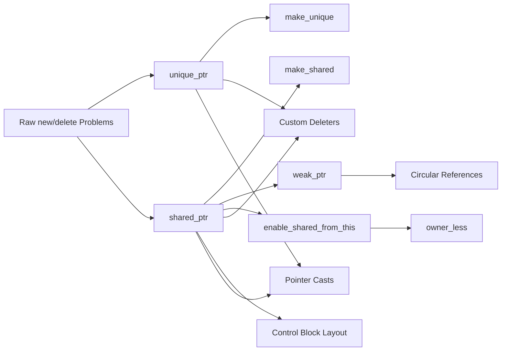

# Chapter 12: Smart Pointers

> **Previous:** [11-file-io](./11-file-io.md) | **Next:** [13-move-semantics](./13-move-semantics.md)

## Learning Objectives

After studying this chapter, students will be able to:

- Manage dynamic memory using `unique_ptr` for exclusive ownership
- Use `shared_ptr` for shared ownership with reference counting
- Break circular references with `weak_ptr`
- Create smart pointers with `make_unique` and `make_shared`
- Implement custom deleters for non-memory resources
- Use `enable_shared_from_this` safely
- Apply pointer casts with `static_pointer_cast`, `dynamic_pointer_cast`
- Diagnose and fix circular reference memory leaks
- Choose the correct smart pointer type based on ownership semantics

## Chapter at a Glance

| Topic | Key Insight | Practical Takeaway |
|-------|-------------|-------------------|
| **Raw new/delete Problems** | Manual ownership management is error-prone and leaky | Use smart pointers as the default |
| **unique_ptr** | Exclusive ownership, move-only, zero overhead | Default choice for dynamic allocation |
| **shared_ptr** | Reference-counted shared ownership | Only when ownership is truly shared |
| **make_unique/make_shared** | Preferred factories, exception-safe and efficient | Prefer over raw `new()` |
| **weak_ptr** | Non-owning observer that locks to shared ownership | Breaks reference cycles |
| **Custom Deleters** | Extend smart pointers beyond memory resources | Use for files, sockets, other resources |
| **enable_shared_from_this** | Safe extraction of shared_ptr from this | Required for async callbacks in shared ownership |
| **Pointer Casts** | static_pointer_cast, dynamic_pointer_cast, const_pointer_cast | Type-safe navigation of inheritance hierarchies |
| **Control Block** | Shared metadata for shared_ptr/weak_ptr | Single allocation for object + control block |

## Chapter Roadmap



## 12.1 The Problem with Raw `new`/`delete`

Manual memory management in C++ introduces four categories of defects:

| Defect | Example | Consequence |
|--------|---------|-------------|
| **Memory Leak** | `new` without matching `delete` | Process consumes memory until OOM |
| **Double Delete** | `delete` called twice on same pointer | Undefined behavior (heap corruption) |
| **Use-After-Free** | Dereferencing pointer after `delete` | Undefined behavior (crash or data corruption) |
| **Exception Unsafe** | Exception between `new` and `delete` | Leak even with correct code |

**Analogy — Library Book Tracking:**
- Raw pointer is a paper slip with the book's shelf location. If you lose the slip (forget to delete), the book stays checked out forever (memory leak). If you return the book twice (double delete), the librarian gets confused (heap corruption). If you try to read the book after returning it (use-after-free), you might find someone else's book at that shelf.
- Smart pointers are like a self-returning library system — books get returned automatically when you're done, no matter how you leave.

```cpp
// PROBLEM: Exception-unsafe raw pointer
void processRaw() {
    int* ptr = new int(42);
    riskyOperation();        // may throw — ptr leaks!
    delete ptr;
}

// SOLUTION: Smart pointer is RAII-safe
void processSmart() {
    auto ptr = std::make_unique<int>(42);
    riskyOperation();        // may throw — unique_ptr destructor still runs
}                            // memory freed automatically
```

**Order of Volatility & Defect Severity:**

| Severity | Defect | Detection Timing |
|----------|--------|-----------------|
| Critical | Double delete | Runtime (usually crash immediately) |
| Critical | Use-after-free | Runtime (crash or silent corruption) |
| High | Memory leak | Runtime (gradual degradation, OOM) |
| Medium | Exception unsafe | Runtime (depends on control flow) |

Smart pointers eliminate all four categories by encoding ownership semantics into the type system.

---

## 12.2 std::unique_ptr — Exclusive Ownership

### 12.2.1 What Is unique_ptr?

<a href="../../../assets/images/diagrams/oop-cpp/12-smart-pointers/12-2-1-what-is-unique-ptr-handwritten.svg" target="_blank" rel="noopener">
  
</a>
<a href="../../../assets/images/diagrams/oop-cpp/12-smart-pointers/12-2-1-what-is-unique-ptr-diagram.svg" target="_blank" rel="noopener">
  
</a>
<a href="../../../assets/images/diagrams/oop-cpp/12-smart-pointers/12-2-1-what-is-unique-ptr-sticky.svg" target="_blank" rel="noopener">
  
</a>


`unique_ptr<T>` is a move-only smart pointer that owns a dynamically allocated `T` exclusively. When the `unique_ptr` goes out of scope, the owned object is destroyed. It has zero overhead over a raw pointer — the same size, the same performance.

**Analogy — Library Card:**
A library card is a unique credential. Only one person can hold a specific card at a time. If you want to give your card to someone else, you must surrender it (move). You cannot photocopy it (copy). When you leave the library, the card is returned to the desk (automatic cleanup).

**Analogy — House Key:**
You have the only key to a house. You can hand the key to someone else (move), but now you no longer have it. You cannot duplicate the key (copy). When the last person with the key leaves town, the house is automatically sold (destructor runs).

### 12.2.2 Template Signature

<a href="../../../assets/images/diagrams/oop-cpp/12-smart-pointers/12-2-2-template-signature-handwritten.svg" target="_blank" rel="noopener">
  
</a>
<a href="../../../assets/images/diagrams/oop-cpp/12-smart-pointers/12-2-2-template-signature-diagram.svg" target="_blank" rel="noopener">
  
</a>
<a href="../../../assets/images/diagrams/oop-cpp/12-smart-pointers/12-2-2-template-signature-sticky.svg" target="_blank" rel="noopener">
  
</a>


```cpp
template<typename T, typename Deleter = std::default_delete<T>>
class unique_ptr {
    // ...
};
```

- `T` — the managed type (may be incomplete at point of declaration)
- `Deleter` — callable that destroys the object (default: `delete`)

### 12.2.3 Construction and Basic Usage

<a href="../../../assets/images/diagrams/oop-cpp/12-smart-pointers/12-2-3-construction-and-basic-usage-handwritten.svg" target="_blank" rel="noopener">
  
</a>
<a href="../../../assets/images/diagrams/oop-cpp/12-smart-pointers/12-2-3-construction-and-basic-usage-diagram.svg" target="_blank" rel="noopener">
  
</a>
<a href="../../../assets/images/diagrams/oop-cpp/12-smart-pointers/12-2-3-construction-and-basic-usage-sticky.svg" target="_blank" rel="noopener">
  
</a>


```cpp
#include <memory>
#include <iostream>

class Resource {
public:
    Resource(int id) : id_(id) {
        std::cout << "Resource(" << id_ << ") acquired\n";
    }
    ~Resource() {
        std::cout << "Resource(" << id_ << ") released\n";
    }
    void work() const {
        std::cout << "Resource(" << id_ << ") working\n";
    }
private:
    int id_;
};

int main() {
    // Construction via new (works in C++11)
    std::unique_ptr<Resource> ptr1(new Resource(1));

    // Construction via make_unique (preferred, C++14+)
    auto ptr2 = std::make_unique<Resource>(2);

    // Arrow and dereference operators
    ptr1->work();     // operator->
    (*ptr1).work();   // operator*

    // Boolean conversion — check if non-null
    if (ptr1) {
        std::cout << "ptr1 owns a Resource\n";
    }

    // get() — access raw pointer (non-owning)
    Resource* raw = ptr1.get();

    // release() — relinquish ownership, return raw pointer
    Resource* taken = ptr2.release();  // ptr2 is now null
    delete taken;                       // must delete manually now

    // reset() — delete current object, optionally take new one
    ptr1.reset(new Resource(3));        // old Resource(1) destroyed
    ptr1.reset();                       // Resource(3) destroyed, ptr1 null

    // swap()
    auto a = std::make_unique<Resource>(10);
    auto b = std::make_unique<Resource>(20);
    a.swap(b);                          // a owns 20, b owns 10
}
```

**Output:**
```
Resource(1) acquired
Resource(2) acquired
Resource(1) working
Resource(1) working
ptr1 owns a Resource
Resource(2) released
Resource(1) released
Resource(3) acquired
Resource(3) released
Resource(10) acquired
Resource(20) acquired
Resource(20) released
Resource(10) released
```

### 12.2.4 Move-Only Semantics

<a href="../../../assets/images/diagrams/oop-cpp/12-smart-pointers/12-2-4-move-only-semantics-handwritten.svg" target="_blank" rel="noopener">
  
</a>
<a href="../../../assets/images/diagrams/oop-cpp/12-smart-pointers/12-2-4-move-only-semantics-diagram.svg" target="_blank" rel="noopener">
  
</a>
<a href="../../../assets/images/diagrams/oop-cpp/12-smart-pointers/12-2-4-move-only-semantics-sticky.svg" target="_blank" rel="noopener">
  
</a>


```cpp
auto src = std::make_unique<int>(42);

// auto dst = src;          // ERROR: copy disabled
auto dst = std::move(src);  // OK: transfer ownership

// src is now null
if (!src) {
    std::cout << "src is empty after move\n";
}

std::cout << *dst << '\n';  // 42
```

**Dry Run — Move Operation:**

| Step | Operation | src state | dst state | Owner |
|------|-----------|-----------|-----------|-------|
| 1 | `auto src = make_unique<int>(42)` | owns int(42) | — | src |
| 2 | `auto dst = std::move(src)` | nullptr | owns int(42) | dst |
| 3 | `*dst` | nullptr | int(42) readable | dst |
| 4 | end of scope | — | — | dst destroyed, int freed |

### 12.2.5 unique_ptr with Arrays

<a href="../../../assets/images/diagrams/oop-cpp/12-smart-pointers/12-2-5-unique-ptr-with-arrays-handwritten.svg" target="_blank" rel="noopener">
  
</a>
<a href="../../../assets/images/diagrams/oop-cpp/12-smart-pointers/12-2-5-unique-ptr-with-arrays-diagram.svg" target="_blank" rel="noopener">
  
</a>
<a href="../../../assets/images/diagrams/oop-cpp/12-smart-pointers/12-2-5-unique-ptr-with-arrays-sticky.svg" target="_blank" rel="noopener">
  
</a>


C++11 provides a partial specialization for arrays:

```cpp
// Array form — calls delete[] automatically
std::unique_ptr<int[]> arr(new int[5]{1, 2, 3, 4, 5});

// C++17: make_unique for arrays
auto arr2 = std::make_unique<int[]>(100);
arr2[0] = 42;

// No pointer arithmetic on unique_ptr itself
// int* raw = arr2 + 1;   // ERROR: no operator+
int* raw = arr2.get() + 1;  // OK: use get()
```

**Note:** `shared_ptr` does NOT have a built-in array specialization — you must provide a custom deleter if managing arrays with `shared_ptr`.

### 12.2.6 Returning unique_ptr from Functions

<a href="../../../assets/images/diagrams/oop-cpp/12-smart-pointers/12-2-6-returning-unique-ptr-from-functions-handwritten.svg" target="_blank" rel="noopener">
  
</a>
<a href="../../../assets/images/diagrams/oop-cpp/12-smart-pointers/12-2-6-returning-unique-ptr-from-functions-diagram.svg" target="_blank" rel="noopener">
  
</a>
<a href="../../../assets/images/diagrams/oop-cpp/12-smart-pointers/12-2-6-returning-unique-ptr-from-functions-sticky.svg" target="_blank" rel="noopener">
  
</a>


```cpp
std::unique_ptr<Resource> createResource(int id) {
    return std::make_unique<Resource>(id);
    // Implicit move — no std::move needed (named RVO applies)
}

int main() {
    auto res = createResource(42);   // ownership transferred to caller
    res->work();
}   // Resource destroyed here
```

This pattern is essential for factory functions — ownership flows naturally from callee to caller.

### 12.2.7 unique_ptr in Containers

<a href="../../../assets/images/diagrams/oop-cpp/12-smart-pointers/12-2-7-unique-ptr-in-containers-handwritten.svg" target="_blank" rel="noopener">
  
</a>
<a href="../../../assets/images/diagrams/oop-cpp/12-smart-pointers/12-2-7-unique-ptr-in-containers-diagram.svg" target="_blank" rel="noopener">
  
</a>
<a href="../../../assets/images/diagrams/oop-cpp/12-smart-pointers/12-2-7-unique-ptr-in-containers-sticky.svg" target="_blank" rel="noopener">
  
</a>


```cpp
#include <vector>
#include <memory>

int main() {
    std::vector<std::unique_ptr<int>> vec;
    vec.push_back(std::make_unique<int>(1));
    vec.push_back(std::make_unique<int>(2));

    // vec.push_back(copy) would fail — must move
    auto ptr = std::make_unique<int>(3);
    vec.push_back(std::move(ptr));

    for (const auto& p : vec) {
        std::cout << *p << ' ';
    }
    std::cout << '\n';
}
```

### 12.2.8 Performance Characteristics of unique_ptr

<a href="../../../assets/images/diagrams/oop-cpp/12-smart-pointers/12-2-8-performance-characteristics-of-unique-ptr-handwritten.svg" target="_blank" rel="noopener">
  
</a>
<a href="../../../assets/images/diagrams/oop-cpp/12-smart-pointers/12-2-8-performance-characteristics-of-unique-ptr-diagram.svg" target="_blank" rel="noopener">
  
</a>
<a href="../../../assets/images/diagrams/oop-cpp/12-smart-pointers/12-2-8-performance-characteristics-of-unique-ptr-sticky.svg" target="_blank" rel="noopener">
  
</a>


| Operation | unique_ptr | Raw Pointer | Ratio |
|-----------|------------|-------------|-------|
| Size | `sizeof(void*)` | `sizeof(void*)` | 1:1 |
| Construction (default) | None | None | — |
| Construction (make) | One allocation | One allocation | 1:1 |
| Dereference | One indirection | One indirection | 1:1 |
| Move | Pointer copy + null | Pointer copy | 1:1 |
| Destruction | One delete (if non-null) | Manual delete | Equivalent |
| Custom Deleter | Type-dependent size | N/A | — |

`unique_ptr` with default deleter is literally as fast as a raw pointer — the optimizer inlines everything.

### 12.2.9 Edge Cases with unique_ptr

<a href="../../../assets/images/diagrams/oop-cpp/12-smart-pointers/12-2-9-edge-cases-with-unique-ptr-handwritten.svg" target="_blank" rel="noopener">
  
</a>
<a href="../../../assets/images/diagrams/oop-cpp/12-smart-pointers/12-2-9-edge-cases-with-unique-ptr-diagram.svg" target="_blank" rel="noopener">
  
</a>
<a href="../../../assets/images/diagrams/oop-cpp/12-smart-pointers/12-2-9-edge-cases-with-unique-ptr-sticky.svg" target="_blank" rel="noopener">
  
</a>


| Edge Case | Behaviour |
|-----------|-----------|
| `unique_ptr<T>(nullptr)` | Valid, empty state |
| Move from null unique_ptr | Target becomes null, source stays null |
| `reset(nullptr)` | Safe, no-op if already null |
| `release()` on null | Returns `nullptr` |
| Custom deleter with null object | Deleter still called (must handle null) |
| `T` is incomplete type | Declaration OK, but destructor must see complete type |

---

## 12.3 std::shared_ptr — Shared Ownership

### 12.3.1 What Is shared_ptr?

<a href="../../../assets/images/diagrams/oop-cpp/12-smart-pointers/12-3-1-what-is-shared-ptr-handwritten.svg" target="_blank" rel="noopener">
  
</a>
<a href="../../../assets/images/diagrams/oop-cpp/12-smart-pointers/12-3-1-what-is-shared-ptr-diagram.svg" target="_blank" rel="noopener">
  
</a>
<a href="../../../assets/images/diagrams/oop-cpp/12-smart-pointers/12-3-1-what-is-shared-ptr-sticky.svg" target="_blank" rel="noopener">
  
</a>


`shared_ptr<T>` implements shared ownership via reference counting. Multiple `shared_ptr` instances can own the same object. The object is destroyed when the last owning `shared_ptr` is destroyed. Copying increments the reference count; destruction decrements it.

**Analogy — Netflix Account:**
A Netflix account (the managed object) is shared by a family. Each family member who logs in increments the "active user" count. When a member logs out, the count decrements. The account is cancelled (destroyed) only when the last member logs out. A `weak_ptr` is like a guest pass — they can watch only if someone else is currently paying for the account (the object still exists).

**Analogy — Condo Timeshare:**
Multiple people own shares in a condo. Each person has a key (shared_ptr). The condo exists as long as at least one owner holds a key. When the last owner sells their share, the condo is sold off (destroyed). A `weak_ptr` is like a visitor who can stay only while at least one owner is present.

### 12.3.2 Control Block Architecture

<a href="../../../assets/images/diagrams/oop-cpp/12-smart-pointers/12-3-2-control-block-architecture-handwritten.svg" target="_blank" rel="noopener">
  
</a>
<a href="../../../assets/images/diagrams/oop-cpp/12-smart-pointers/12-3-2-control-block-architecture-diagram.svg" target="_blank" rel="noopener">
  
</a>
<a href="../../../assets/images/diagrams/oop-cpp/12-smart-pointers/12-3-2-control-block-architecture-sticky.svg" target="_blank" rel="noopener">
  
</a>


When you create a `shared_ptr`, the implementation allocates a **control block** — a separate metadata structure:

```
┌──────────────────────────┐
│     shared_ptr<T> p1     │
│  ┌────────────────────┐  │
│  │ T* ptr  ────────────────►┌──────────┐
│  │ ControlBlock* cb ───────►│   T obj  │
│  └────────────────────┘  │  └──────────┘
└──────────────────────────┘
                            │  Control Block       │
┌──────────────────────────┐  ┌──────────────────┐ │
│     shared_ptr<T> p2     │  │ ref_count: 2     │ │
│  ┌────────────────────┐  │  │ weak_count: 0    │ │
│  │ T* ptr  ────────────────►│ deleter (opt)    │ │
│  │ ControlBlock* cb ───────►│ allocator (opt)  │ │
│  └────────────────────┘  │  └──────────────────┘ │
└──────────────────────────┘                        │
```

When using `make_shared`, the object and control block are allocated in a **single memory block**:

```
┌──────────────────────────────────────────┐
│  Single Allocation (make_shared)         │
│  ┌──────────────────┬──────────────────┐ │
│  │ Control Block    │   T object       │ │
│  │ ref_count: 2     │                  │ │
│  │ weak_count: 0    │                  │ │
│  └──────────────────┴──────────────────┘ │
└──────────────────────────────────────────┘
```

**Control Block Fields:**

| Field | Purpose | Atomic? |
|-------|---------|---------|
| `ref_count` (use_count) | Number of `shared_ptr` owners | Yes |
| `weak_count` | Number of `weak_ptr` observers + 1 if ref_count > 0 | Yes |
| `deleter` | Custom deleter function pointer/object | No (type-erased) |
| `allocator` | Custom allocator | No (type-erased) |

### 12.3.3 Construction and Basic Usage

<a href="../../../assets/images/diagrams/oop-cpp/12-smart-pointers/12-3-3-construction-and-basic-usage-handwritten.svg" target="_blank" rel="noopener">
  
</a>
<a href="../../../assets/images/diagrams/oop-cpp/12-smart-pointers/12-3-3-construction-and-basic-usage-diagram.svg" target="_blank" rel="noopener">
  
</a>
<a href="../../../assets/images/diagrams/oop-cpp/12-smart-pointers/12-3-3-construction-and-basic-usage-sticky.svg" target="_blank" rel="noopener">
  
</a>


```cpp
#include <memory>
#include <iostream>

class SharedResource {
public:
    SharedResource(const std::string& name) : name_(name) {
        std::cout << "SharedResource(" << name_ << ") created\n";
    }
    ~SharedResource() {
        std::cout << "SharedResource(" << name_ << ") destroyed\n";
    }
    void use() const {
        std::cout << "Using " << name_ << "\n";
    }
private:
    std::string name_;
};

int main() {
    // Preferred: single allocation for object + control block
    auto p1 = std::make_shared<SharedResource>("DataCache");
    std::cout << "use_count: " << p1.use_count() << "\n";  // 1

    {
        auto p2 = p1;   // copy: ref_count becomes 2
        auto p3 = p1;   // copy: ref_count becomes 3
        std::cout << "use_count: " << p1.use_count() << "\n";  // 3

        p2->use();
    }   // p2, p3 destroyed: ref_count back to 1

    std::cout << "use_count: " << p1.use_count() << "\n";  // 1
    p1.reset();     // ref_count becomes 0: object destroyed
    std::cout << "Object should be gone now\n";
}
```

**Output:**
```
SharedResource(DataCache) created
use_count: 1
use_count: 3
Using DataCache
use_count: 1
SharedResource(DataCache) destroyed
Object should be gone now
```

### 12.3.4 Reference Counting Dry Run

<a href="../../../assets/images/diagrams/oop-cpp/12-smart-pointers/12-3-4-reference-counting-dry-run-handwritten.svg" target="_blank" rel="noopener">
  
</a>
<a href="../../../assets/images/diagrams/oop-cpp/12-smart-pointers/12-3-4-reference-counting-dry-run-diagram.svg" target="_blank" rel="noopener">
  
</a>
<a href="../../../assets/images/diagrams/oop-cpp/12-smart-pointers/12-3-4-reference-counting-dry-run-sticky.svg" target="_blank" rel="noopener">
  
</a>


Consider this code:

```cpp
auto a = std::make_shared<int>(100);  // Step 1
auto b = a;                            // Step 2
auto c = a;                            // Step 3
b.reset();                             // Step 4
auto d = c;                            // Step 5
c.reset();                             // Step 6
d.reset();                             // Step 7
a.reset();                             // Step 8
```

**Dry Run Trace Table:**

| Step | Operation | `a` | `b` | `c` | `d` | ref_count | Object Alive? |
|------|-----------|-----|-----|-----|-----|-----------|---------------|
| 0 | Initial | null | null | null | null | 0 | — |
| 1 | `a = make_shared<int>(100)` | owns | null | null | null | 1 | Yes |
| 2 | `b = a` | owns | owns | null | null | 2 | Yes |
| 3 | `c = a` | owns | owns | owns | null | 3 | Yes |
| 4 | `b.reset()` | owns | null | owns | null | 2 | Yes |
| 5 | `d = c` | owns | null | owns | owns | 3 | Yes |
| 6 | `c.reset()` | owns | null | null | owns | 2 | Yes |
| 7 | `d.reset()` | owns | null | null | null | 1 | Yes |
| 8 | `a.reset()` | null | null | null | null | 0 | **No — freed** |

### 12.3.5 Key Member Functions

<a href="../../../assets/images/diagrams/oop-cpp/12-smart-pointers/12-3-5-key-member-functions-handwritten.svg" target="_blank" rel="noopener">
  
</a>
<a href="../../../assets/images/diagrams/oop-cpp/12-smart-pointers/12-3-5-key-member-functions-diagram.svg" target="_blank" rel="noopener">
  
</a>
<a href="../../../assets/images/diagrams/oop-cpp/12-smart-pointers/12-3-5-key-member-functions-sticky.svg" target="_blank" rel="noopener">
  
</a>


| Function | Effect | Notes |
|----------|--------|-------|
| `use_count()` | Returns current reference count | For debugging only; racy in production |
| `unique()` | `use_count() == 1` | Deprecated in C++17, removed in C++20 |
| `get()` | Returns raw pointer | Non-owning access |
| `reset()` | Decrements count, releases if last | Replaces `p = nullptr` |
| `reset(p)` | Decrements count, takes ownership of `p` | Old object may be destroyed |
| `swap(other)` | Exchanges managed objects and control blocks | Constant time |

### 12.3.6 Thread Safety

<a href="../../../assets/images/diagrams/oop-cpp/12-smart-pointers/12-3-6-thread-safety-handwritten.svg" target="_blank" rel="noopener">
  
</a>
<a href="../../../assets/images/diagrams/oop-cpp/12-smart-pointers/12-3-6-thread-safety-diagram.svg" target="_blank" rel="noopener">
  
</a>
<a href="../../../assets/images/diagrams/oop-cpp/12-smart-pointers/12-3-6-thread-safety-sticky.svg" target="_blank" rel="noopener">
  
</a>


- **Control block** (ref count, weak count): Thread-safe (atomic operations)
- **Managed object**: NOT thread-safe — accessing the same `shared_ptr` from multiple threads without synchronization is a data race
- **The shared_ptr itself**: NOT thread-safe — concurrent `reset()` and dereference on the same `shared_ptr` object is UB

```cpp
auto sp = std::make_shared<int>(42);

// Thread A:
std::shared_ptr<int> copy = sp;   // OK: copying shared_ptr is thread-safe
                                   // (atomic increment of control block)

// Thread B:
sp.reset();                        // Race if A is also using sp!
                                   // Use a mutex or atomic<shared_ptr>
```

**Rule:** Multiple threads can read/write *different* `shared_ptr` objects pointing to the same managed object safely. Multiple threads reading/writing the *same* `shared_ptr` object must synchronize.

### 12.3.7 shared_ptr with Custom Deleter

<a href="../../../assets/images/diagrams/oop-cpp/12-smart-pointers/12-3-7-shared-ptr-with-custom-deleter-handwritten.svg" target="_blank" rel="noopener">
  
</a>
<a href="../../../assets/images/diagrams/oop-cpp/12-smart-pointers/12-3-7-shared-ptr-with-custom-deleter-diagram.svg" target="_blank" rel="noopener">
  
</a>
<a href="../../../assets/images/diagrams/oop-cpp/12-smart-pointers/12-3-7-shared-ptr-with-custom-deleter-sticky.svg" target="_blank" rel="noopener">
  
</a>


Unlike `unique_ptr`, the deleter is **not** part of the template signature — it is type-erased (stored in the control block):

```cpp
// Custom deleter type does NOT appear in the type
auto logDeleter = [](int* p) {
    std::cout << "Deleting int with value " << *p << "\n";
    delete p;
};

std::shared_ptr<int> p(new int(42), logDeleter);
// Type is still shared_ptr<int>, not shared_ptr<int, decltype(deleter)>
```

This means you can put `shared_ptr<T>` with different deleters into the same container:

```cpp
std::vector<std::shared_ptr<FILE>> files;
files.push_back({fopen("a.txt", "r"), &fclose});
files.push_back({fopen("b.txt", "r"), &fclose});
// All same type — vector works
```

---

## 12.4 std::weak_ptr — Non-Owning Observer

### 12.4.1 What Is weak_ptr?

<a href="../../../assets/images/diagrams/oop-cpp/12-smart-pointers/12-4-1-what-is-weak-ptr-handwritten.svg" target="_blank" rel="noopener">
  
</a>
<a href="../../../assets/images/diagrams/oop-cpp/12-smart-pointers/12-4-1-what-is-weak-ptr-diagram.svg" target="_blank" rel="noopener">
  
</a>
<a href="../../../assets/images/diagrams/oop-cpp/12-smart-pointers/12-4-1-what-is-weak-ptr-sticky.svg" target="_blank" rel="noopener">
  
</a>


`weak_ptr<T>` holds a non-owning "weak reference" to an object managed by `shared_ptr`. It does **not** increment the reference count. To access the object, you must `lock()` it, which returns a `shared_ptr` (or `nullptr` if the object has been destroyed).

**Analogy — GPS Coordinates of a House:**
A GPS coordinate (weak_ptr) tells you where a house is, but it doesn't give you ownership. You can visit the house only if someone still owns it (lock succeeds). If the house has been demolished (object destroyed), the GPS leads to an empty lot (lock returns null).

**Analogy — Movie Ticket Stub:**
A movie ticket stub (weak_ptr) lets you re-enter the theater only if the movie is still playing (object alive). Once the movie ends (object destroyed), the stub is worthless. The stub never counts toward the audience size (doesn't increment ref count).

### 12.4.2 Construction and Locking

<a href="../../../assets/images/diagrams/oop-cpp/12-smart-pointers/12-4-2-construction-and-locking-handwritten.svg" target="_blank" rel="noopener">
  
</a>
<a href="../../../assets/images/diagrams/oop-cpp/12-smart-pointers/12-4-2-construction-and-locking-diagram.svg" target="_blank" rel="noopener">
  
</a>
<a href="../../../assets/images/diagrams/oop-cpp/12-smart-pointers/12-4-2-construction-and-locking-sticky.svg" target="_blank" rel="noopener">
  
</a>


```cpp
#include <memory>
#include <iostream>

int main() {
    auto sp = std::make_shared<std::string>("Hello, World!");
    std::weak_ptr<std::string> wp = sp;   // ref_count unchanged

    std::cout << "use_count after weak_ptr creation: "
              << sp.use_count() << "\n";   // still 1

    // lock() returns a shared_ptr (or null if expired)
    if (auto locked = wp.lock()) {
        std::cout << "Accessible: " << *locked << "\n";
    }

    sp.reset();   // destroy the string

    // expired() checks if object is gone
    std::cout << "Expired: " << wp.expired() << "\n";  // 1 (true)

    if (auto locked = wp.lock()) {
        std::cout << "This never prints\n";
    } else {
        std::cout << "Object has been destroyed\n";
    }
}
```

**Output:**
```
use_count after weak_ptr creation: 1
Accessible: Hello, World!
Expired: 1
Object has been destroyed
```

### 12.4.3 weak_ptr Lock Dry Run

<a href="../../../assets/images/diagrams/oop-cpp/12-smart-pointers/12-4-3-weak-ptr-lock-dry-run-handwritten.svg" target="_blank" rel="noopener">
  
</a>
<a href="../../../assets/images/diagrams/oop-cpp/12-smart-pointers/12-4-3-weak-ptr-lock-dry-run-diagram.svg" target="_blank" rel="noopener">
  
</a>
<a href="../../../assets/images/diagrams/oop-cpp/12-smart-pointers/12-4-3-weak-ptr-lock-dry-run-sticky.svg" target="_blank" rel="noopener">
  
</a>


```cpp
auto sp = std::make_shared<int>(42);   // Step 1
std::weak_ptr<int> wp = sp;            // Step 2
auto locked1 = wp.lock();               // Step 3
sp.reset();                              // Step 4
auto locked2 = wp.lock();               // Step 5
```

| Step | Operation | ref_count | weak_count | Object | locked1 | locked2 |
|------|-----------|-----------|------------|--------|---------|---------|
| 1 | `make_shared<int>(42)` | 1 | 0 | Alive | null | null |
| 2 | `wp = sp` | 1 | 1 | Alive | null | null |
| 3 | `locked1 = wp.lock()` | **2** | 1 | Alive | owns | null |
| 4 | `sp.reset()` | 1 → **0** | 1 | **Destroyed** | owns | null |
| 5 | `locked2 = wp.lock()` | 1 → **0** | 1 → **0** | Gone | owns | **null** |

**Key insight:** The control block survives as long as `weak_count > 0`, even after `ref_count` hits 0. This allows `weak_ptr::lock()` to return null safely rather than dangling.

### 12.4.4 weak_ptr Properties

<a href="../../../assets/images/diagrams/oop-cpp/12-smart-pointers/12-4-4-weak-ptr-properties-handwritten.svg" target="_blank" rel="noopener">
  
</a>
<a href="../../../assets/images/diagrams/oop-cpp/12-smart-pointers/12-4-4-weak-ptr-properties-diagram.svg" target="_blank" rel="noopener">
  
</a>
<a href="../../../assets/images/diagrams/oop-cpp/12-smart-pointers/12-4-4-weak-ptr-properties-sticky.svg" target="_blank" rel="noopener">
  
</a>


| Property | Value |
|----------|-------|
| Increments ref_count? | No |
| Prevents object destruction? | No |
| Can access object directly? | No (must lock) |
| Thread-safe lock? | Yes (atomic) |
| Size overhead | Size of two raw pointers on typical implementations |
| Use cases | Break cycles, caches, observers, timers |

---

## 12.5 Circular References — The shared_ptr Trap

### 12.5.1 The Problem

<a href="../../../assets/images/diagrams/oop-cpp/12-smart-pointers/12-5-1-the-problem-handwritten.svg" target="_blank" rel="noopener">
  
</a>
<a href="../../../assets/images/diagrams/oop-cpp/12-smart-pointers/12-5-1-the-problem-diagram.svg" target="_blank" rel="noopener">
  
</a>
<a href="../../../assets/images/diagrams/oop-cpp/12-smart-pointers/12-5-1-the-problem-sticky.svg" target="_blank" rel="noopener">
  
</a>


When two objects hold `shared_ptr` to each other, neither's reference count can reach zero — they form a cycle that leaks memory.

**Analogy — Two People Holding Each Other's Keys:**
Alice and Bob each hold a key to the other's apartment. Neither can leave town because each believes someone else needs their apartment. They're stuck forever — the apartments can never be vacated.

**Analogy — Clinging Toddlers:**
Two toddlers each grab the other's shirt and won't let go. Neither can go home (be destroyed) because each is holding the other. A parent (weak_ptr) would let one go without getting trapped.

### 12.5.2 The Leak Demonstration

<a href="../../../assets/images/diagrams/oop-cpp/12-smart-pointers/12-5-2-the-leak-demonstration-handwritten.svg" target="_blank" rel="noopener">
  
</a>
<a href="../../../assets/images/diagrams/oop-cpp/12-smart-pointers/12-5-2-the-leak-demonstration-diagram.svg" target="_blank" rel="noopener">
  
</a>
<a href="../../../assets/images/diagrams/oop-cpp/12-smart-pointers/12-5-2-the-leak-demonstration-sticky.svg" target="_blank" rel="noopener">
  
</a>


```cpp
#include <memory>
#include <iostream>

struct Node {
    std::shared_ptr<Node> next;
    int value;

    explicit Node(int v) : value(v) {
        std::cout << "Node(" << value << ") created\n";
    }
    ~Node() {
        std::cout << "Node(" << value << ") destroyed\n";
    }
};

int main() {
    std::cout << "=== Creating cycle ===\n";
    {
        auto a = std::make_shared<Node>(1);
        auto b = std::make_shared<Node>(2);

        std::cout << "a use_count: " << a.use_count() << "\n";  // 1
        std::cout << "b use_count: " << b.use_count() << "\n";  // 1

        a->next = b;    // a holds shared_ptr to b
        b->next = a;    // b holds shared_ptr to a — CYCLE!

        std::cout << "a use_count: " << a.use_count() << "\n";  // 2
        std::cout << "b use_count: " << b.use_count() << "\n";  // 2
    }   // a and b go out of scope, but ref counts never reach 0
    std::cout << "=== After scope (neither Node destroyed) ===\n";
}
```

**Output:**
```
=== Creating cycle ===
Node(1) created
Node(2) created
a use_count: 1
b use_count: 1
a use_count: 2
b use_count: 2
=== After scope (neither Node destroyed) ===
```

**"Node(1) destroyed" and "Node(2) destroyed" never print.** The program leaks memory silently.

### 12.5.3 Reference Count Dry Run for the Cycle

<a href="../../../assets/images/diagrams/oop-cpp/12-smart-pointers/12-5-3-reference-count-dry-run-for-the-cycle-handwritten.svg" target="_blank" rel="noopener">
  
</a>
<a href="../../../assets/images/diagrams/oop-cpp/12-smart-pointers/12-5-3-reference-count-dry-run-for-the-cycle-diagram.svg" target="_blank" rel="noopener">
  
</a>
<a href="../../../assets/images/diagrams/oop-cpp/12-smart-pointers/12-5-3-reference-count-dry-run-for-the-cycle-sticky.svg" target="_blank" rel="noopener">
  
</a>


| Step | Operation | a.ref | b.ref | a->next | b->next |
|------|-----------|-------|-------|---------|---------|
| 1 | `a = make_shared<Node>(1)` | 1 | — | null | — |
| 2 | `b = make_shared<Node>(2)` | 1 | 1 | null | null |
| 3 | `a->next = b` | 1 | **2** | owns b | null |
| 4 | `b->next = a` | **2** | 2 | owns b | owns a |
| 5 | `a` out of scope | 2→**1** | 2 | a's copy released | owns a |
| 6 | `b` out of scope | 1 | 2→**1** | owns b | b's copy released |
| 7 | Final count | **1** | **1** | a alive via b->next | b alive via a->next |

Both counts stuck at 1 — neither object can be freed.

### 12.5.4 The Fix: weak_ptr

<a href="../../../assets/images/diagrams/oop-cpp/12-smart-pointers/12-5-4-the-fix-weak-ptr-handwritten.svg" target="_blank" rel="noopener">
  
</a>
<a href="../../../assets/images/diagrams/oop-cpp/12-smart-pointers/12-5-4-the-fix-weak-ptr-diagram.svg" target="_blank" rel="noopener">
  
</a>
<a href="../../../assets/images/diagrams/oop-cpp/12-smart-pointers/12-5-4-the-fix-weak-ptr-sticky.svg" target="_blank" rel="noopener">
  
</a>


Use `weak_ptr` for the back-reference to break the cycle:

```cpp
struct NodeFixed {
    std::shared_ptr<NodeFixed> next;
    std::weak_ptr<NodeFixed> prev;   // BACK-REFERENCE IS WEAK
    int value;

    explicit NodeFixed(int v) : value(v) {
        std::cout << "NodeFixed(" << value << ") created\n";
    }
    ~NodeFixed() {
        std::cout << "NodeFixed(" << value << ") destroyed\n";
    }
};

int main() {
    {
        auto a = std::make_shared<NodeFixed>(1);
        auto b = std::make_shared<NodeFixed>(2);

        a->next = b;
        b->prev = a;         // weak_ptr — ref_count NOT incremented

        std::cout << "a use_count: " << a.use_count() << "\n";  // 1
        std::cout << "b use_count: " << b.use_count() << "\n";  // 2

        // Access via prev safely
        if (auto prev = b->prev.lock()) {
            std::cout << "b's prev has value: " << prev->value << "\n";
        }
    }   // b destroyed first (ref 2→1→0), then a (ref 1→0)
    std::cout << "=== Both Nodes freed ===\n";
}
```

**Output:**
```
NodeFixed(1) created
NodeFixed(2) created
a use_count: 1
b use_count: 2
b's prev has value: 1
NodeFixed(2) destroyed
NodeFixed(1) destroyed
=== Both Nodes freed ===
```

### 12.5.5 General Rule for Cycle Avoidance

<a href="../../../assets/images/diagrams/oop-cpp/12-smart-pointers/12-5-5-general-rule-for-cycle-avoidance-handwritten.svg" target="_blank" rel="noopener">
  
</a>
<a href="../../../assets/images/diagrams/oop-cpp/12-smart-pointers/12-5-5-general-rule-for-cycle-avoidance-diagram.svg" target="_blank" rel="noopener">
  
</a>
<a href="../../../assets/images/diagrams/oop-cpp/12-smart-pointers/12-5-5-general-rule-for-cycle-avoidance-sticky.svg" target="_blank" rel="noopener">
  
</a>


In any ownership hierarchy:
- **Parent → Child:** `shared_ptr` or `unique_ptr` (owning direction)
- **Child → Parent:** `weak_ptr` or raw pointer (non-owning back-reference)

| Relationship | Owning Direction | Pointer Type |
|-------------|-----------------|--------------|
| Tree: parent → children | Parent owns children | `unique_ptr<Child>` |
| Tree: child → parent | Child observes parent | `weak_ptr<Parent>` or raw pointer |
| Graph: bidirectional edges | External container owns nodes | `shared_ptr<Node>` inside container |
| DAG: node → dependencies | Node owns dependencies | `shared_ptr<Dep>` |
| DAG: reverse lookup | Optional back-reference | `weak_ptr<Node>` |
| Cache: key → value | Cache owns values | `shared_ptr<Value>` |
| Cache: eviction callback | Timed access | `weak_ptr<Value>` |

---

## 12.6 enable_shared_from_this

### 12.6.1 The Problem

<a href="../../../assets/images/diagrams/oop-cpp/12-smart-pointers/12-6-1-the-problem-handwritten.svg" target="_blank" rel="noopener">
  
</a>
<a href="../../../assets/images/diagrams/oop-cpp/12-smart-pointers/12-6-1-the-problem-diagram.svg" target="_blank" rel="noopener">
  
</a>
<a href="../../../assets/images/diagrams/oop-cpp/12-smart-pointers/12-6-1-the-problem-sticky.svg" target="_blank" rel="noopener">
  
</a>


Sometimes an object needs to obtain a `shared_ptr` to itself (`this`). But simply doing `shared_ptr<T>(this)` creates a second, independent control block — leading to double deletion.

```cpp
// DANGEROUS: Never do this
struct Bad : std::enable_shared_from_this<Bad> {
    std::shared_ptr<Bad> getShared() {
        return std::shared_ptr<Bad>(this);  // NEW control block!
    }
};

int main() {
    auto p1 = std::make_shared<Bad>();
    auto p2 = p1->getShared();   // Two independent control blocks!
    // Both think ref_count is 1 — double delete on destruction
}
```

### 12.6.2 The Solution

<a href="../../../assets/images/diagrams/oop-cpp/12-smart-pointers/12-6-2-the-solution-handwritten.svg" target="_blank" rel="noopener">
  
</a>
<a href="../../../assets/images/diagrams/oop-cpp/12-smart-pointers/12-6-2-the-solution-diagram.svg" target="_blank" rel="noopener">
  
</a>
<a href="../../../assets/images/diagrams/oop-cpp/12-smart-pointers/12-6-2-the-solution-sticky.svg" target="_blank" rel="noopener">
  
</a>


Inherit from `std::enable_shared_from_this<T>`, then call `shared_from_this()`:

```cpp
#include <memory>
#include <iostream>

struct Good : std::enable_shared_from_this<Good> {
    int value = 42;

    std::shared_ptr<Good> getShared() {
        return shared_from_this();  // Uses EXISTING control block
    }

    ~Good() {
        std::cout << "Good destroyed\n";
    }
};

int main() {
    auto p1 = std::make_shared<Good>();
    std::cout << "use_count: " << p1.use_count() << "\n";  // 1

    auto p2 = p1->getShared();
    std::cout << "use_count: " << p1.use_count() << "\n";  // 2

    // p1 and p2 share the SAME control block — single delete
}
```

**Output:**
```
use_count: 1
use_count: 2
Good destroyed
```

### 12.6.3 Important Rules

<a href="../../../assets/images/diagrams/oop-cpp/12-smart-pointers/12-6-3-important-rules-handwritten.svg" target="_blank" rel="noopener">
  
</a>
<a href="../../../assets/images/diagrams/oop-cpp/12-smart-pointers/12-6-3-important-rules-diagram.svg" target="_blank" rel="noopener">
  
</a>
<a href="../../../assets/images/diagrams/oop-cpp/12-smart-pointers/12-6-3-important-rules-sticky.svg" target="_blank" rel="noopener">
  
</a>


1. **Must be managed by shared_ptr first** — calling `shared_from_this()` on an object not yet owned by `shared_ptr` throws `std::bad_weak_ptr`
2. **Publicly inherit** from `enable_shared_from_this<T>`
3. **The CRTP pattern:** You pass the derived class as the template parameter

```cpp
struct Manager : std::enable_shared_from_this<Manager> {
    void spawnTask() {
        // Capture shared_from_this in a lambda for async work
        auto self = shared_from_this();
        std::thread([self] {
            self->doWork();  // Keeps Manager alive during thread execution
        }).detach();
    }
    void doWork() { /* ... */ }
};
```

### 12.6.4 Real-World Use: Asynchronous Callbacks

<a href="../../../assets/images/diagrams/oop-cpp/12-smart-pointers/12-6-4-real-world-use-asynchronous-callbacks-handwritten.svg" target="_blank" rel="noopener">
  
</a>
<a href="../../../assets/images/diagrams/oop-cpp/12-smart-pointers/12-6-4-real-world-use-asynchronous-callbacks-diagram.svg" target="_blank" rel="noopener">
  
</a>
<a href="../../../assets/images/diagrams/oop-cpp/12-smart-pointers/12-6-4-real-world-use-asynchronous-callbacks-sticky.svg" target="_blank" rel="noopener">
  
</a>


```cpp
class DownloadManager : public std::enable_shared_from_this<DownloadManager> {
public:
    void startDownload(const std::string& url) {
        auto self = shared_from_this();  // prevent deletion during async
        http_client_.get(url, [self](Response res) {
            self->onDownloadComplete(res);
        });
    }

    void onDownloadComplete(const Response& res) {
        std::cout << "Downloaded " << res.size << " bytes\n";
    }
};

int main() {
    auto mgr = std::make_shared<DownloadManager>();
    mgr->startDownload("https://example.com/file");
    // mgr could be reset elsewhere, but the lambda keeps it alive
}
```

---

## 12.7 std::auto_ptr — The Deprecated Forefather

### 12.7.1 History

<a href="../../../assets/images/diagrams/oop-cpp/12-smart-pointers/12-7-1-history-handwritten.svg" target="_blank" rel="noopener">
  
</a>
<a href="../../../assets/images/diagrams/oop-cpp/12-smart-pointers/12-7-1-history-diagram.svg" target="_blank" rel="noopener">
  
</a>
<a href="../../../assets/images/diagrams/oop-cpp/12-smart-pointers/12-7-1-history-sticky.svg" target="_blank" rel="noopener">
  
</a>


`auto_ptr` was C++98's first attempt at a smart pointer. It attempted "copy semantics" by transferring ownership on copy — a design that broke fundamental expectations. Deprecated in C++11, removed in C++17.

### 12.7.2 Why auto_ptr Failed

<a href="../../../assets/images/diagrams/oop-cpp/12-smart-pointers/12-7-2-why-auto-ptr-failed-handwritten.svg" target="_blank" rel="noopener">
  
</a>
<a href="../../../assets/images/diagrams/oop-cpp/12-smart-pointers/12-7-2-why-auto-ptr-failed-diagram.svg" target="_blank" rel="noopener">
  
</a>
<a href="../../../assets/images/diagrams/oop-cpp/12-smart-pointers/12-7-2-why-auto-ptr-failed-sticky.svg" target="_blank" rel="noopener">
  
</a>


```cpp
// C++98 — auto_ptr (DO NOT USE)
std::auto_ptr<int> p1(new int(42));
std::auto_ptr<int> p2 = p1;   // p1 is silently NULLIFIED!

// This violates the principle of least surprise
// p1 and p2 are not equivalent after "copy"

// Breaking containers:
std::vector<std::auto_ptr<int>> vec;
vec.push_back(std::auto_ptr<int>(new int(1)));
vec.push_back(std::auto_ptr<int>(new int(2)));
// std::sort(vec.begin(), vec.end());  // UB! sort copies elements
```

### 12.7.3 auto_ptr vs unique_ptr

<a href="../../../assets/images/diagrams/oop-cpp/12-smart-pointers/12-7-3-auto-ptr-vs-unique-ptr-handwritten.svg" target="_blank" rel="noopener">
  
</a>
<a href="../../../assets/images/diagrams/oop-cpp/12-smart-pointers/12-7-3-auto-ptr-vs-unique-ptr-diagram.svg" target="_blank" rel="noopener">
  
</a>
<a href="../../../assets/images/diagrams/oop-cpp/12-smart-pointers/12-7-3-auto-ptr-vs-unique-ptr-sticky.svg" target="_blank" rel="noopener">
  
</a>


| Feature | auto_ptr (C++98) | unique_ptr (C++11+) |
|---------|------------------|---------------------|
| Copy behaviour | Silently nullifies source | Copy deleted (compile error) |
| Move semantics | Via copy (confusing) | Via `std::move` (explicit) |
| Array support | No | Yes (partial specialization) |
| Custom deleter | No | Yes |
| Container compatible | No (broken by sort, etc.) | Yes (move-aware) |
| Status | Removed in C++17 | Current standard |

**Moral:** Always use `unique_ptr` — never `auto_ptr`. If you see `auto_ptr` in legacy code, it's a bug waiting to happen.

---

## 12.8 Custom Deleters — Beyond Memory

### 12.8.1 Motivation

<a href="../../../assets/images/diagrams/oop-cpp/12-smart-pointers/12-8-1-motivation-handwritten.svg" target="_blank" rel="noopener">
  
</a>
<a href="../../../assets/images/diagrams/oop-cpp/12-smart-pointers/12-8-1-motivation-diagram.svg" target="_blank" rel="noopener">
  
</a>
<a href="../../../assets/images/diagrams/oop-cpp/12-smart-pointers/12-8-1-motivation-sticky.svg" target="_blank" rel="noopener">
  
</a>


Smart pointers manage more than heap memory: file handles, sockets, database connections, mutex locks, and any resource with acquire/release semantics.

### 12.8.2 unique_ptr with Custom Deleter

<a href="../../../assets/images/diagrams/oop-cpp/12-smart-pointers/12-8-2-unique-ptr-with-custom-deleter-handwritten.svg" target="_blank" rel="noopener">
  
</a>
<a href="../../../assets/images/diagrams/oop-cpp/12-smart-pointers/12-8-2-unique-ptr-with-custom-deleter-diagram.svg" target="_blank" rel="noopener">
  
</a>
<a href="../../../assets/images/diagrams/oop-cpp/12-smart-pointers/12-8-2-unique-ptr-with-custom-deleter-sticky.svg" target="_blank" rel="noopener">
  
</a>


The deleter is part of the type signature, increasing the size of `unique_ptr`:

```cpp
#include <memory>
#include <cstdio>
#include <iostream>

// Custom deleter as a function
void fileCloser(std::FILE* fp) {
    if (fp) {
        std::fclose(fp);
        std::cout << "File closed\n";
    }
}

int main() {
    // Function pointer deleter — sizeof(unique_ptr) = 2 pointers
    std::unique_ptr<std::FILE, decltype(&fileCloser)>
        fp1(std::fopen("test.txt", "w"), &fileCloser);

    // Lambda deleter — sizeof(unique_ptr) = 1 pointer (stateless lambda)
    auto lambdaDeleter = [](std::FILE* fp) {
        if (fp) {
            std::fclose(fp);
            std::cout << "Lambda file closer\n";
        }
    };
    std::unique_ptr<std::FILE, decltype(lambdaDeleter)>
        fp2(std::fopen("test2.txt", "w"), lambdaDeleter);

    // Mutable lambda with state — sizeof includes the state
    int closeCount = 0;
    auto countingDeleter = [&closeCount](std::FILE* fp) mutable {
        if (fp) {
            std::fclose(fp);
            ++closeCount;
            std::cout << "Closed file #" << closeCount << "\n";
        }
    };
    // Stateful deleter increases unique_ptr size
}
```

### 12.8.3 shared_ptr with Custom Deleter

<a href="../../../assets/images/diagrams/oop-cpp/12-smart-pointers/12-8-3-shared-ptr-with-custom-deleter-handwritten.svg" target="_blank" rel="noopener">
  
</a>
<a href="../../../assets/images/diagrams/oop-cpp/12-smart-pointers/12-8-3-shared-ptr-with-custom-deleter-diagram.svg" target="_blank" rel="noopener">
  
</a>
<a href="../../../assets/images/diagrams/oop-cpp/12-smart-pointers/12-8-3-shared-ptr-with-custom-deleter-sticky.svg" target="_blank" rel="noopener">
  
</a>


The deleter is type-erased in the control block — not part of the type:

```cpp
// All of these are shared_ptr<FILE> — same type!
std::shared_ptr<FILE> sp1(fopen("a.txt", "r"), &fclose);
std::shared_ptr<FILE> sp2(fopen("b.txt", "r"), [](FILE* f) {
    std::cout << "Custom close\n";
    fclose(f);
});

// Put in same vector:
std::vector<std::shared_ptr<FILE>> files;
files.push_back(sp1);
files.push_back(sp2);
```

### 12.8.4 Custom Deleter Use Cases

<a href="../../../assets/images/diagrams/oop-cpp/12-smart-pointers/12-8-4-custom-deleter-use-cases-handwritten.svg" target="_blank" rel="noopener">
  
</a>
<a href="../../../assets/images/diagrams/oop-cpp/12-smart-pointers/12-8-4-custom-deleter-use-cases-diagram.svg" target="_blank" rel="noopener">
  
</a>
<a href="../../../assets/images/diagrams/oop-cpp/12-smart-pointers/12-8-4-custom-deleter-use-cases-sticky.svg" target="_blank" rel="noopener">
  
</a>


| Resource | Acquire | Release | Deleter |
|----------|---------|---------|---------|
| File handle | `fopen()` | `fclose()` | `&fclose` |
| POSIX file descriptor | `open()` | `close()` | `&close` |
| Socket | `socket()` | `close()` | `&close` |
| POSIX mutex | `pthread_mutex_lock()` | `pthread_mutex_unlock()` | Unlock lambda |
| Windows HANDLE | `CreateFile()` | `CloseHandle()` | `&CloseHandle` |
| malloc'd memory | `malloc()` | `free()` | `&free` |
| Custom allocator | `MyMalloc()` | `MyFree()` | `&MyFree` |
| SQLite connection | `sqlite3_open()` | `sqlite3_close()` | `&sqlite3_close` |

### 12.8.5 The "Wrapper" Pattern for C APIs

<a href="../../../assets/images/diagrams/oop-cpp/12-smart-pointers/12-8-5-the-wrapper-pattern-for-c-apis-handwritten.svg" target="_blank" rel="noopener">
  
</a>
<a href="../../../assets/images/diagrams/oop-cpp/12-smart-pointers/12-8-5-the-wrapper-pattern-for-c-apis-diagram.svg" target="_blank" rel="noopener">
  
</a>
<a href="../../../assets/images/diagrams/oop-cpp/12-smart-pointers/12-8-5-the-wrapper-pattern-for-c-apis-sticky.svg" target="_blank" rel="noopener">
  
</a>


```cpp
// POSIX file descriptor wrapper
struct FdDeleter {
    void operator()(int* fd) {
        if (fd && *fd >= 0) {
            ::close(*fd);
            std::cout << "FD " << *fd << " closed\n";
        }
        delete fd;
    }
};

using unique_fd = std::unique_ptr<int, FdDeleter>;

unique_fd createSocket() {
    int sock = ::socket(AF_INET, SOCK_STREAM, 0);
    if (sock < 0) return nullptr;
    return unique_fd(new int(sock));
}

// Usage:
auto sock = createSocket();
// Automatically closes when sock goes out of scope
```

---

## 12.9 make_shared vs Direct new — Performance Deep Dive

### 12.9.1 Single vs Double Allocation

<a href="../../../assets/images/diagrams/oop-cpp/12-smart-pointers/12-9-1-single-vs-double-allocation-handwritten.svg" target="_blank" rel="noopener">
  
</a>
<a href="../../../assets/images/diagrams/oop-cpp/12-smart-pointers/12-9-1-single-vs-double-allocation-diagram.svg" target="_blank" rel="noopener">
  
</a>
<a href="../../../assets/images/diagrams/oop-cpp/12-smart-pointers/12-9-1-single-vs-double-allocation-sticky.svg" target="_blank" rel="noopener">
  
</a>


```cpp
// Version 1: make_shared — SINGLE allocation
auto p1 = std::make_shared<MyClass>(args);
// Memory layout:
// [ control block | MyClass object ]
// One call to operator new

// Version 2: shared_ptr(new T) — TWO allocations
std::shared_ptr<MyClass> p2(new MyClass(args));
// Allocation 1: new MyClass(args)
// Allocation 2: internal allocation for control block
// Two calls to operator new
```

### 12.9.2 Performance Comparison Table

<a href="../../../assets/images/diagrams/oop-cpp/12-smart-pointers/12-9-2-performance-comparison-table-handwritten.svg" target="_blank" rel="noopener">
  
</a>
<a href="../../../assets/images/diagrams/oop-cpp/12-smart-pointers/12-9-2-performance-comparison-table-diagram.svg" target="_blank" rel="noopener">
  
</a>
<a href="../../../assets/images/diagrams/oop-cpp/12-smart-pointers/12-9-2-performance-comparison-table-sticky.svg" target="_blank" rel="noopener">
  
</a>


| Aspect | `make_shared` | `shared_ptr(new T)` |
|--------|---------------|---------------------|
| Allocations | 1 | 2 |
| Cache locality | Excellent (object + control block adjacent) | Poor (separate memory locations) |
| Exception safety | Safe | Risk of leak (rare, but possible) |
| Custom deleter | Not supported | Supported |
| Custom allocator | Not supported | Supported |
| Control block persists | Until last weak_ptr destroyed | Until last weak_ptr destroyed |
| Memory footprint | ~`sizeof(T) + sizeof(ControlBlock)` | same total, but fragmented |
| Object lifetime | Object stays in same block as control | Object can be freed independently |

### 12.9.3 The Memory Trade-Off

<a href="../../../assets/images/diagrams/oop-cpp/12-smart-pointers/12-9-3-the-memory-trade-off-handwritten.svg" target="_blank" rel="noopener">
  
</a>
<a href="../../../assets/images/diagrams/oop-cpp/12-smart-pointers/12-9-3-the-memory-trade-off-diagram.svg" target="_blank" rel="noopener">
  
</a>
<a href="../../../assets/images/diagrams/oop-cpp/12-smart-pointers/12-9-3-the-memory-trade-off-sticky.svg" target="_blank" rel="noopener">
  
</a>


`make_shared` has one downside: the object's memory cannot be freed until the last `weak_ptr` dies, because the object and control block occupy the same allocation:

```cpp
auto sp = std::make_shared<LargeObject>(1000);
std::weak_ptr<LargeObject> wp = sp;
sp.reset();  // Object destructor runs, but memory stays allocated
// LargeObject's memory NOT reclaimed until wp dies
```

With `shared_ptr(new T)`, after `sp.reset()`:
```cpp
auto sp = std::shared_ptr<LargeObject>(new LargeObject(1000));
std::weak_ptr<LargeObject> wp = sp;
sp.reset();  // Object destructor runs, memory freed
// Only the small control block stays allocated
```

**Guideline:** Use `make_shared` by default. If profiling shows that large objects stay alive via `weak_ptr` after all owners release, switch to `shared_ptr(new T)`.

---

## 12.10 make_unique — The Modern Factory

### 12.10.1 Why make_unique Was Late to C++

<a href="../../../assets/images/diagrams/oop-cpp/12-smart-pointers/12-10-1-why-make-unique-was-late-to-c-handwritten.svg" target="_blank" rel="noopener">
  
</a>
<a href="../../../assets/images/diagrams/oop-cpp/12-smart-pointers/12-10-1-why-make-unique-was-late-to-c-diagram.svg" target="_blank" rel="noopener">
  
</a>
<a href="../../../assets/images/diagrams/oop-cpp/12-smart-pointers/12-10-1-why-make-unique-was-late-to-c-sticky.svg" target="_blank" rel="noopener">
  
</a>


`std::make_unique` was accidentally omitted from C++11. It was added as a DR (defect report) in C++14. Herb Sutter's famous GotW #89 article pushed for its inclusion.

### 12.10.2 Exception Safety

<a href="../../../assets/images/diagrams/oop-cpp/12-smart-pointers/12-10-2-exception-safety-handwritten.svg" target="_blank" rel="noopener">
  
</a>
<a href="../../../assets/images/diagrams/oop-cpp/12-smart-pointers/12-10-2-exception-safety-diagram.svg" target="_blank" rel="noopener">
  
</a>
<a href="../../../assets/images/diagrams/oop-cpp/12-smart-pointers/12-10-2-exception-safety-sticky.svg" target="_blank" rel="noopener">
  
</a>


```cpp
// RISKY: Potential leak
void f(std::unique_ptr<A> a, std::unique_ptr<B> b);

f(std::unique_ptr<A>(new A), std::unique_ptr<B>(new B));
// Evaluation order is unspecified!
// Scenario: new A succeeds, new B throws → A leaks

// SAFE: No leak possible
f(std::make_unique<A>(), std::make_unique<B>());
// Each temporary is a full-expression — no leak window
```

### 12.10.3 Implementation (for reference)

<a href="../../../assets/images/diagrams/oop-cpp/12-smart-pointers/12-10-3-implementation-for-reference-handwritten.svg" target="_blank" rel="noopener">
  
</a>
<a href="../../../assets/images/diagrams/oop-cpp/12-smart-pointers/12-10-3-implementation-for-reference-diagram.svg" target="_blank" rel="noopener">
  
</a>
<a href="../../../assets/images/diagrams/oop-cpp/12-smart-pointers/12-10-3-implementation-for-reference-sticky.svg" target="_blank" rel="noopener">
  
</a>


```cpp
template<typename T, typename... Args>
std::unique_ptr<T> make_unique(Args&&... args) {
    return std::unique_ptr<T>(new T(std::forward<Args>(args)...));
}
```

---

## 12.11 Pointer Casts with Smart Pointers

Raw pointer casts (`static_cast`, `dynamic_cast`, `const_cast`, `reinterpret_cast`) do not work directly with smart pointers. The standard library provides cast counterparts that operate on smart pointers:

| Raw Cast | Smart Pointer Cast | Purpose |
|----------|-------------------|---------|
| `static_cast<T*>(p)` | `static_pointer_cast<T>(sp)` | Downcast/upcast (no runtime check) |
| `dynamic_cast<T*>(p)` | `dynamic_pointer_cast<T>(sp)` | Polymorphic downcast (runtime check) |
| `const_cast<T*>(p)` | `const_pointer_cast<T>(sp)` | Remove/add const |
| `reinterpret_cast<T*>(p)` | — | Not provided for smart pointers |

### 12.11.1 static_pointer_cast

<a href="../../../assets/images/diagrams/oop-cpp/12-smart-pointers/12-11-1-static-pointer-cast-handwritten.svg" target="_blank" rel="noopener">
  
</a>
<a href="../../../assets/images/diagrams/oop-cpp/12-smart-pointers/12-11-1-static-pointer-cast-diagram.svg" target="_blank" rel="noopener">
  
</a>
<a href="../../../assets/images/diagrams/oop-cpp/12-smart-pointers/12-11-1-static-pointer-cast-sticky.svg" target="_blank" rel="noopener">
  
</a>


```cpp
struct Base {
    virtual ~Base() = default;
    virtual const char* name() const { return "Base"; }
};

struct Derived : Base {
    const char* name() const override { return "Derived"; }
    void derivedOnly() { std::cout << "Derived-specific\n"; }
};

int main() {
    auto derived = std::make_shared<Derived>();

    // Upcast (implicit conversion already works, but explicit is fine)
    std::shared_ptr<Base> base = derived;  // implicit upcast

    // Downcast via static_pointer_cast
    auto downcasted = std::static_pointer_cast<Derived>(base);
    downcasted->derivedOnly();

    std::cout << "use_count: " << derived.use_count() << "\n";  // 3
}
```

### 12.11.2 dynamic_pointer_cast

<a href="../../../assets/images/diagrams/oop-cpp/12-smart-pointers/12-11-2-dynamic-pointer-cast-handwritten.svg" target="_blank" rel="noopener">
  
</a>
<a href="../../../assets/images/diagrams/oop-cpp/12-smart-pointers/12-11-2-dynamic-pointer-cast-diagram.svg" target="_blank" rel="noopener">
  
</a>
<a href="../../../assets/images/diagrams/oop-cpp/12-smart-pointers/12-11-2-dynamic-pointer-cast-sticky.svg" target="_blank" rel="noopener">
  
</a>


```cpp
struct Animal {
    virtual ~Animal() = default;
    virtual const char* sound() const = 0;
};

struct Dog : Animal {
    const char* sound() const override { return "Woof"; }
    void fetch() { std::cout << "Fetching stick\n"; }
};

struct Cat : Animal {
    const char* sound() const override { return "Meow"; }
};

void playWith(std::shared_ptr<Animal> animal) {
    if (auto dog = std::dynamic_pointer_cast<Dog>(animal)) {
        dog->fetch();   // Safe: dog is non-null if original was Dog
    } else {
        std::cout << "Not a dog, can't fetch\n";
    }
}

int main() {
    playWith(std::make_shared<Dog>());  // "Fetching stick"
    playWith(std::make_shared<Cat>());  // "Not a dog, can't fetch"
}
```

**Output:**
```
Fetching stick
Not a dog, can't fetch
```

### 12.11.3 const_pointer_cast

<a href="../../../assets/images/diagrams/oop-cpp/12-smart-pointers/12-11-3-const-pointer-cast-handwritten.svg" target="_blank" rel="noopener">
  
</a>
<a href="../../../assets/images/diagrams/oop-cpp/12-smart-pointers/12-11-3-const-pointer-cast-diagram.svg" target="_blank" rel="noopener">
  
</a>
<a href="../../../assets/images/diagrams/oop-cpp/12-smart-pointers/12-11-3-const-pointer-cast-sticky.svg" target="_blank" rel="noopener">
  
</a>


```cpp
void legacyApi(char* str);   // Takes non-const but doesn't modify

int main() {
    auto constStr = std::make_shared<const std::string>("Hello");

    // Remove const for legacy API
    auto mutableStr = std::const_pointer_cast<std::string>(constStr);
    legacyApi(&(*mutableStr));

    // Original ref_count now 2 — both shared_ptrs point to same object
    std::cout << constStr.use_count() << "\n";  // 2
}
```

**Warning:** Only use `const_pointer_cast` when you are certain the callee does not modify the object.

### 12.11.4 Cast Behaviour Table

<a href="../../../assets/images/diagrams/oop-cpp/12-smart-pointers/12-11-4-cast-behaviour-table-handwritten.svg" target="_blank" rel="noopener">
  
</a>
<a href="../../../assets/images/diagrams/oop-cpp/12-smart-pointers/12-11-4-cast-behaviour-table-diagram.svg" target="_blank" rel="noopener">
  
</a>
<a href="../../../assets/images/diagrams/oop-cpp/12-smart-pointers/12-11-4-cast-behaviour-table-sticky.svg" target="_blank" rel="noopener">
  
</a>


| Cast | Null Input | Type Mismatch | Cost |
|------|------------|---------------|------|
| `static_pointer_cast` | Returns null | Undefined behaviour | Compile-time |
| `dynamic_pointer_cast` | Returns null | Returns null | Runtime (vtable lookup) |
| `const_pointer_cast` | Returns null | N/A | Compile-time |

---

## 12.12 std::owner_less

`owner_less` allows comparing `shared_ptr` and `weak_ptr` by ownership (control block address) rather than by the managed object's value. This enables using smart pointers as keys in ordered associative containers (`std::set`, `std::map`).

### 12.12.1 Motivation

<a href="../../../assets/images/diagrams/oop-cpp/12-smart-pointers/12-12-1-motivation-handwritten.svg" target="_blank" rel="noopener">
  
</a>
<a href="../../../assets/images/diagrams/oop-cpp/12-smart-pointers/12-12-1-motivation-diagram.svg" target="_blank" rel="noopener">
  
</a>
<a href="../../../assets/images/diagrams/oop-cpp/12-smart-pointers/12-12-1-motivation-sticky.svg" target="_blank" rel="noopener">
  
</a>


```cpp
std::shared_ptr<int> a(new int(42));
std::shared_ptr<int> b(a);            // same ownership group

// std::less compares by get() — the raw pointer value
// std::owner_less compares by control block address

std::set<std::shared_ptr<int>> valSet;
valSet.insert(a);   // uses std::less<shared_ptr<int>> — compares *a
valSet.insert(b);   // if *a == *b, might not insert

std::set<std::shared_ptr<int>, std::owner_less<std::shared_ptr<int>>> ownerSet;
ownerSet.insert(a);   // uses owner_less — compares control blocks
ownerSet.insert(b);   // a and b share a control block — won't insert duplicate
```

### 12.12.2 Aliasing Constructor and owner_less

<a href="../../../assets/images/diagrams/oop-cpp/12-smart-pointers/12-12-2-aliasing-constructor-and-owner-less-handwritten.svg" target="_blank" rel="noopener">
  
</a>
<a href="../../../assets/images/diagrams/oop-cpp/12-smart-pointers/12-12-2-aliasing-constructor-and-owner-less-diagram.svg" target="_blank" rel="noopener">
  
</a>
<a href="../../../assets/images/diagrams/oop-cpp/12-smart-pointers/12-12-2-aliasing-constructor-and-owner-less-sticky.svg" target="_blank" rel="noopener">
  
</a>


The aliasing constructor creates two `shared_ptr` pointing to different objects but sharing a control block — `owner_less` correctly identifies them as the same ownership group:

```cpp
struct Data { int id; };
struct Metadata { std::string info; };

auto data = std::make_shared<Data>(42);
// Aliasing constructor: points to a member but shares ownership
std::shared_ptr<Metadata> meta(data, reinterpret_cast<Metadata*>(data.get()));
// meta shares control block with data

// owner_less reports them as equivalent (same control block)
std::owner_less<std::shared_ptr<void>> less;
std::cout << less(data, meta) << "\n";  // 0 (not less)
std::cout << less(meta, data) << "\n";  // 0 (not less)
// They are !less(a,b) && !less(b,a) — equivalent
```

---

## 12.13 Comparison Table: Raw vs Unique vs Shared vs Weak

| Aspect | Raw Pointer | `unique_ptr` | `shared_ptr` | `weak_ptr` |
|--------|-------------|--------------|--------------|------------|
| **Ownership** | None declared | Exclusive | Shared | None |
| **Destroys object?** | No (manual) | Yes (on destroy) | Yes (last owner) | No |
| **Copyable?** | Yes | No (move only) | Yes (inc ref) | Yes |
| **Movable?** | Yes | Yes | Yes | Yes |
| **Can be null?** | Yes | Yes | Yes | Yes |
| **Dereference safety** | None | Null check via `if (p)` | `if (p)` + expired check | Must `lock()` |
| **Thread-safe** | No | No | Control block only | `lock()` atomic |
| **Size (typical)** | 4 or 8 bytes | 4 or 8 bytes | 8 or 16 bytes | 8 or 16 bytes |
| **Overhead** | None | None (default deleter) | Control block allocation | Control block ref |
| **Custom deleter** | N/A | Part of type | Type-erased | N/A |
| **Array support** | Pointer arithmetic | Yes (partial spec) | No (custom deleter needed) | No |
| **When to use** | Non-owning observe, legacy | Default owning pointer | Genuinely shared ownership | Break cycles, cache |

### Selection Decision Tree

<a href="../../../assets/images/diagrams/oop-cpp/12-smart-pointers/selection-decision-tree-handwritten.svg" target="_blank" rel="noopener">
  
</a>
<a href="../../../assets/images/diagrams/oop-cpp/12-smart-pointers/selection-decision-tree-diagram.svg" target="_blank" rel="noopener">
  
</a>
<a href="../../../assets/images/diagrams/oop-cpp/12-smart-pointers/selection-decision-tree-sticky.svg" target="_blank" rel="noopener">
  
</a>


```
Q: Do I need dynamic allocation?
├── No → Use stack/value types (preferred)
└── Yes → Q: Is ownership exclusive?
    ├── Yes → use unique_ptr (default)
    └── No → Q: Is the ownership truly shared?
        ├── Yes → Q: Are there back-references that could cycle?
        │   ├── Yes → use shared_ptr + weak_ptr for back-refs
        │   └── No → use shared_ptr
        └── No → Q: Do I just need to observe without owning?
            ├── Yes → Q: Can the object disappear?
            │   ├── Yes → weak_ptr (lock- check)
            │   └── No → raw pointer (if lifetime guaranteed)
            └── [rethink ownership design]
```

---

## 12.14 Axis & Dimension Tables

### Ownership Spectrum

<a href="../../../assets/images/diagrams/oop-cpp/12-smart-pointers/ownership-spectrum-handwritten.svg" target="_blank" rel="noopener">
  
</a>
<a href="../../../assets/images/diagrams/oop-cpp/12-smart-pointers/ownership-spectrum-diagram.svg" target="_blank" rel="noopener">
  
</a>
<a href="../../../assets/images/diagrams/oop-cpp/12-smart-pointers/ownership-spectrum-sticky.svg" target="_blank" rel="noopener">
  
</a>


| Dimension | unique_ptr | shared_ptr | weak_ptr | Raw ptr |
|-----------|------------|------------|----------|---------|
| **Ownership strength** | Strong (single) | Strong (shared) | None | None |
| **Lifetime control** | Full | Partial (collaborative) | None (observer) | None |
| **Responsibility clarity** | Maximum | Moderate | N/A | None |
| **Runtime cost** | None | Moderate | Minimal | None |
| **Safe for containers** | Yes (move) | Yes (copy) | Yes | No (no RAII) |
| **Dangling protection** | N/A (owns) | N/A (owns) | Yes (lock check) | No |

### Complexity Analysis

<a href="../../../assets/images/diagrams/oop-cpp/12-smart-pointers/complexity-analysis-handwritten.svg" target="_blank" rel="noopener">
  
</a>
<a href="../../../assets/images/diagrams/oop-cpp/12-smart-pointers/complexity-analysis-diagram.svg" target="_blank" rel="noopener">
  
</a>
<a href="../../../assets/images/diagrams/oop-cpp/12-smart-pointers/complexity-analysis-sticky.svg" target="_blank" rel="noopener">
  
</a>


| Operation | unique_ptr | shared_ptr | weak_ptr |
|-----------|------------|------------|----------|
| Default construct | O(1) | O(1) | O(1) |
| Construct from raw ptr | O(1) | O(1) + alloc | O(1) |
| `make_` factory | O(1) + alloc | O(1) + alloc | O(1) |
| Copy construct | Deleted | O(1) (atomic inc) | O(1) (atomic inc) |
| Move construct | O(1) | O(1) | O(1) |
| Destructor | O(1) (delete) | O(1) (atomic dec + maybe delete) | O(1) (dec weak) |
| `lock()` | N/A | N/A | O(1) (atomic inc) |
| `reset()` | O(1) | O(1) | O(1) |
| `use_count()` | O(1) | O(1) | O(1) |

### Memory Layout Comparison

<a href="../../../assets/images/diagrams/oop-cpp/12-smart-pointers/memory-layout-comparison-handwritten.svg" target="_blank" rel="noopener">
  
</a>
<a href="../../../assets/images/diagrams/oop-cpp/12-smart-pointers/memory-layout-comparison-diagram.svg" target="_blank" rel="noopener">
  
</a>
<a href="../../../assets/images/diagrams/oop-cpp/12-smart-pointers/memory-layout-comparison-sticky.svg" target="_blank" rel="noopener">
  
</a>


| Pointer Type | Typical Size | Contains |
|-------------|-------------|----------|
| `int*` | 8 bytes | Address of int |
| `unique_ptr<int>` | 8 bytes | Address of int |
| `unique_ptr<int, deleter>` | 8 or 16 bytes | Address + possibly deleter |
| `shared_ptr<int>` | 16 bytes | Address of int + address of control block |
| `weak_ptr<int>` | 16 bytes | Address of int + address of control block |

### shared_ptr Control Block Structure (Typical libstdc++ Layout)

<a href="../../../assets/images/diagrams/oop-cpp/12-smart-pointers/shared-ptr-control-block-structure-typical-libstdc-layout-handwritten.svg" target="_blank" rel="noopener">
  
</a>
<a href="../../../assets/images/diagrams/oop-cpp/12-smart-pointers/shared-ptr-control-block-structure-typical-libstdc-layout-diagram.svg" target="_blank" rel="noopener">
  
</a>
<a href="../../../assets/images/diagrams/oop-cpp/12-smart-pointers/shared-ptr-control-block-structure-typical-libstdc-layout-sticky.svg" target="_blank" rel="noopener">
  
</a>


```
Offset  │ Field                   │ Size  │ Description
────────┼─────────────────────────┼───────┼─────────────────────────
0       │ ref_count               │ 4-8   │ Strong reference count
4/8     │ weak_count              │ 4-8   │ Weak reference count
8/16    │ deleter (type-erased)   │ var   │ Custom deleter (if any)
var     │ allocator (type-erased) │ var   │ Custom allocator (if any)
```

With `make_shared`, the managed object is appended immediately after the control block (or before it, depending on implementation), inside the same allocation.

---

## 12.15 C++17 and C++20 Enhancements

### C++17

<a href="../../../assets/images/diagrams/oop-cpp/12-smart-pointers/c-17-handwritten.svg" target="_blank" rel="noopener">
  
</a>
<a href="../../../assets/images/diagrams/oop-cpp/12-smart-pointers/c-17-diagram.svg" target="_blank" rel="noopener">
  
</a>
<a href="../../../assets/images/diagrams/oop-cpp/12-smart-pointers/c-17-sticky.svg" target="_blank" rel="noopener">
  
</a>

- `shared_ptr<T[]>` partial specialization for arrays (NOTE: not the same as `unique_ptr<T[]>`)
- `dynamic_pointer_cast`, `static_pointer_cast`, `const_pointer_cast` for `weak_ptr` (returns `shared_ptr`)

### C++20

<a href="../../../assets/images/diagrams/oop-cpp/12-smart-pointers/c-20-handwritten.svg" target="_blank" rel="noopener">
  
</a>
<a href="../../../assets/images/diagrams/oop-cpp/12-smart-pointers/c-20-diagram.svg" target="_blank" rel="noopener">
  
</a>
<a href="../../../assets/images/diagrams/oop-cpp/12-smart-pointers/c-20-sticky.svg" target="_blank" rel="noopener">
  
</a>

- `std::make_shared` for arrays: `auto p = std::make_shared<int[]>(10);`
- `std::atomic<std::shared_ptr<T>>` — atomic operations on shared_ptr itself
- `std::to_address` — generic way to get raw address from fancy pointers

---

## 12.16 Edge Cases and Pitfalls

### 12.16.1 Using .get() After Move

<a href="../../../assets/images/diagrams/oop-cpp/12-smart-pointers/12-16-1-using-get-after-move-handwritten.svg" target="_blank" rel="noopener">
  
</a>
<a href="../../../assets/images/diagrams/oop-cpp/12-smart-pointers/12-16-1-using-get-after-move-diagram.svg" target="_blank" rel="noopener">
  
</a>
<a href="../../../assets/images/diagrams/oop-cpp/12-smart-pointers/12-16-1-using-get-after-move-sticky.svg" target="_blank" rel="noopener">
  
</a>


```cpp
auto p = std::make_unique<int>(42);
int* raw = p.get();
auto moved = std::move(p);
// raw is dangling! p.get() is nullptr, but raw still points to old memory
// Don't use raw after ownership transfer
```

### 12.16.2 Creating shared_ptr from Raw Pointer Twice

<a href="../../../assets/images/diagrams/oop-cpp/12-smart-pointers/12-16-2-creating-shared-ptr-from-raw-pointer-twice-handwritten.svg" target="_blank" rel="noopener">
  
</a>
<a href="../../../assets/images/diagrams/oop-cpp/12-smart-pointers/12-16-2-creating-shared-ptr-from-raw-pointer-twice-diagram.svg" target="_blank" rel="noopener">
  
</a>
<a href="../../../assets/images/diagrams/oop-cpp/12-smart-pointers/12-16-2-creating-shared-ptr-from-raw-pointer-twice-sticky.svg" target="_blank" rel="noopener">
  
</a>


```cpp
int* raw = new int(42);
std::shared_ptr<int> sp1(raw);
std::shared_ptr<int> sp2(raw);  // UNDEFINED BEHAVIOUR!
// Two independent control blocks — double delete
```

### 12.16.3 shared_ptr to this Without enable_shared_from_this

<a href="../../../assets/images/diagrams/oop-cpp/12-smart-pointers/12-16-3-shared-ptr-to-this-without-enable-shared-from-this-handwritten.svg" target="_blank" rel="noopener">
  
</a>
<a href="../../../assets/images/diagrams/oop-cpp/12-smart-pointers/12-16-3-shared-ptr-to-this-without-enable-shared-from-this-diagram.svg" target="_blank" rel="noopener">
  
</a>
<a href="../../../assets/images/diagrams/oop-cpp/12-smart-pointers/12-16-3-shared-ptr-to-this-without-enable-shared-from-this-sticky.svg" target="_blank" rel="noopener">
  
</a>


```cpp
struct BadExample {
    std::shared_ptr<BadExample> getShared() {
        return std::shared_ptr<BadExample>(this);  // BUG: new control block
    }
};
```

### 12.16.4 weak_ptr::lock() on Expired Object

<a href="../../../assets/images/diagrams/oop-cpp/12-smart-pointers/12-16-4-weak-ptr-lock-on-expired-object-handwritten.svg" target="_blank" rel="noopener">
  
</a>
<a href="../../../assets/images/diagrams/oop-cpp/12-smart-pointers/12-16-4-weak-ptr-lock-on-expired-object-diagram.svg" target="_blank" rel="noopener">
  
</a>
<a href="../../../assets/images/diagrams/oop-cpp/12-smart-pointers/12-16-4-weak-ptr-lock-on-expired-object-sticky.svg" target="_blank" rel="noopener">
  
</a>


```cpp
auto sp = std::make_shared<int>(42);
std::weak_ptr<int> wp = sp;
sp.reset();
auto locked = wp.lock();   // locked is nullptr — safe, not UB
```

### 12.16.5 Mixing make_shared and Placement new

<a href="../../../assets/images/diagrams/oop-cpp/12-smart-pointers/12-16-5-mixing-make-shared-and-placement-new-handwritten.svg" target="_blank" rel="noopener">
  
</a>
<a href="../../../assets/images/diagrams/oop-cpp/12-smart-pointers/12-16-5-mixing-make-shared-and-placement-new-diagram.svg" target="_blank" rel="noopener">
  
</a>
<a href="../../../assets/images/diagrams/oop-cpp/12-smart-pointers/12-16-5-mixing-make-shared-and-placement-new-sticky.svg" target="_blank" rel="noopener">
  
</a>


```cpp
// ERROR: make_shared controls allocation — can't use placement new
// auto p = std::make_shared<MyClass>(new (buffer) MyClass(args));
```

### 12.16.6 Using shared_ptr with Objects on Stack

<a href="../../../assets/images/diagrams/oop-cpp/12-smart-pointers/12-16-6-using-shared-ptr-with-objects-on-stack-handwritten.svg" target="_blank" rel="noopener">
  
</a>
<a href="../../../assets/images/diagrams/oop-cpp/12-smart-pointers/12-16-6-using-shared-ptr-with-objects-on-stack-diagram.svg" target="_blank" rel="noopener">
  
</a>
<a href="../../../assets/images/diagrams/oop-cpp/12-smart-pointers/12-16-6-using-shared-ptr-with-objects-on-stack-sticky.svg" target="_blank" rel="noopener">
  
</a>


```cpp
int x = 42;
// std::shared_ptr<int> sp(&x);  // UB: delete called on stack object!
```

### 12.16.7 shared_ptr with Incomplete Types

<a href="../../../assets/images/diagrams/oop-cpp/12-smart-pointers/12-16-7-shared-ptr-with-incomplete-types-handwritten.svg" target="_blank" rel="noopener">
  
</a>
<a href="../../../assets/images/diagrams/oop-cpp/12-smart-pointers/12-16-7-shared-ptr-with-incomplete-types-diagram.svg" target="_blank" rel="noopener">
  
</a>
<a href="../../../assets/images/diagrams/oop-cpp/12-smart-pointers/12-16-7-shared-ptr-with-incomplete-types-sticky.svg" target="_blank" rel="noopener">
  
</a>


```cpp
struct ForwardDeclared;            // incomplete

struct Holder {
    std::shared_ptr<ForwardDeclared> ptr;  // OK: declaration only
    // ~Holder() requires complete type for destruction
};

// Header must include definition before Holder's destructor is instantiated
```

---

## 12.17 Interview Corner

### Q1: When would you choose unique_ptr over shared_ptr?

<a href="../../../assets/images/diagrams/oop-cpp/12-smart-pointers/when-would-you-choose-unique-ptr-over-shared-ptr-handwritten.svg" target="_blank" rel="noopener">
  
</a>
<a href="../../../assets/images/diagrams/oop-cpp/12-smart-pointers/when-would-you-choose-unique-ptr-over-shared-ptr-diagram.svg" target="_blank" rel="noopener">
  
</a>
<a href="../../../assets/images/diagrams/oop-cpp/12-smart-pointers/when-would-you-choose-unique-ptr-over-shared-ptr-sticky.svg" target="_blank" rel="noopener">
  
</a>


**Answer:** `unique_ptr` is the default choice for dynamic allocation. Choose it when:
1. Ownership is clearly exclusive — one owner at all times
2. Zero overhead is required (same size/speed as raw pointer)
3. The resource lifetime maps to a single scope or object lifetime
4. You want to express ownership semantics in APIs

`shared_ptr` is for genuinely shared ownership where the last owner is unknown at compile time. Overuse of `shared_ptr` signals unclear ownership design.

**Interview Tip:** "I use `unique_ptr` by default and only reach for `shared_ptr` when I have a proven need for shared ownership. This follows the 'prefer unique_ptr' guideline from the C++ Core Guidelines."

### Q2: How does shared_ptr know when to delete the object?

<a href="../../../assets/images/diagrams/oop-cpp/12-smart-pointers/how-does-shared-ptr-know-when-to-delete-the-object-handwritten.svg" target="_blank" rel="noopener">
  
</a>
<a href="../../../assets/images/diagrams/oop-cpp/12-smart-pointers/how-does-shared-ptr-know-when-to-delete-the-object-diagram.svg" target="_blank" rel="noopener">
  
</a>
<a href="../../../assets/images/diagrams/oop-cpp/12-smart-pointers/how-does-shared-ptr-know-when-to-delete-the-object-sticky.svg" target="_blank" rel="noopener">
  
</a>


**Answer:** `shared_ptr` maintains a **reference count** in the control block. Every copy increments this count atomically. Every destruction decrements it. When the count reaches zero, the `shared_ptr` calls the deleter (by default `delete`) on the managed object, then may free the control block (if no `weak_ptr` references remain).

```cpp
// Simplified conceptual model
template<typename T>
class shared_ptr {
    T* ptr_;
    ControlBlock* cb_;

    ~shared_ptr() {
        if (--cb_->ref_count == 0) {
            delete ptr_;                 // destroy managed object
            if (cb_->weak_count == 0) {
                delete cb_;              // free control block
            }
        }
    }
};
```

### Q3: What is the difference between reset() and release() on unique_ptr?

<a href="../../../assets/images/diagrams/oop-cpp/12-smart-pointers/what-is-the-difference-between-reset-and-release-on-unique-ptr-handwritten.svg" target="_blank" rel="noopener">
  
</a>
<a href="../../../assets/images/diagrams/oop-cpp/12-smart-pointers/what-is-the-difference-between-reset-and-release-on-unique-ptr-diagram.svg" target="_blank" rel="noopener">
  
</a>
<a href="../../../assets/images/diagrams/oop-cpp/12-smart-pointers/what-is-the-difference-between-reset-and-release-on-unique-ptr-sticky.svg" target="_blank" rel="noopener">
  
</a>


**Answer:**
- `reset()`: Destroys the currently owned object (calls deleter), then optionally takes ownership of a new pointer. After `reset()`, the `unique_ptr` may be null or own a new object.
- `release()`: Relinquishes ownership **without** destroying the object. Returns the raw pointer. After `release()`, the `unique_ptr` is null and the caller is responsible for deleting the returned pointer.

```cpp
auto p = std::make_unique<int>(42);
p.reset(new int(10));     // old 42 destroyed, now owns 10
int* raw = p.release();   // no destruction, p is null
delete raw;               // caller must delete
```

### Q4: How does weak_ptr::lock() prevent dangling access?

<a href="../../../assets/images/diagrams/oop-cpp/12-smart-pointers/how-does-weak-ptr-lock-prevent-dangling-access-handwritten.svg" target="_blank" rel="noopener">
  
</a>
<a href="../../../assets/images/diagrams/oop-cpp/12-smart-pointers/how-does-weak-ptr-lock-prevent-dangling-access-diagram.svg" target="_blank" rel="noopener">
  
</a>
<a href="../../../assets/images/diagrams/oop-cpp/12-smart-pointers/how-does-weak-ptr-lock-prevent-dangling-access-sticky.svg" target="_blank" rel="noopener">
  
</a>


**Answer:** `lock()` atomically checks the reference count in the control block. If `ref_count > 0` (object still alive), it atomically increments the count and returns a `shared_ptr` to the object. If `ref_count == 0`, it returns `nullptr`. The control block itself cannot be freed while any `weak_ptr` exists (the `weak_count` prevents it), so accessing the control block is always safe.

```cpp
// Conceptual model
shared_ptr<T> lock() {
    // Atomically check and increment — prevents races
    if (cb_->ref_count.load() > 0) {
        cb_->ref_count.fetch_add(1);
        return shared_ptr<T>(ptr_, cb_);  // share control block
    }
    return nullptr;  // object gone, safe null
}
```

### Q5: Explain the N+1 allocation problem with shared_ptr(new T) vs make_shared.

<a href="../../../assets/images/diagrams/oop-cpp/12-smart-pointers/explain-the-n-1-allocation-problem-with-shared-ptr-new-t-vs-make-shared-handwritten.svg" target="_blank" rel="noopener">
  
</a>
<a href="../../../assets/images/diagrams/oop-cpp/12-smart-pointers/explain-the-n-1-allocation-problem-with-shared-ptr-new-t-vs-make-shared-diagram.svg" target="_blank" rel="noopener">
  
</a>
<a href="../../../assets/images/diagrams/oop-cpp/12-smart-pointers/explain-the-n-1-allocation-problem-with-shared-ptr-new-t-vs-make-shared-sticky.svg" target="_blank" rel="noopener">
  
</a>


**Answer:** `shared_ptr<T>(new T)` performs **two** allocations:
1. `new T` for the managed object
2. Internal allocation for the control block

`std::make_shared<T>(args)` performs **one** allocation for both object and control block together.

**Impact:**
- `make_shared` is faster (one `malloc` instead of two)
- `make_shared` has better cache locality (object and control block adjacent)
- `make_shared` is exception-safe (no leak window between allocation and shared_ptr construction)
- **Downside:** With `make_shared`, the object's memory isn't freed until the last `weak_ptr` dies, because object and control block share the same allocation

```cpp
// Two allocations
std::shared_ptr<LargeObj> p(new LargeObj(args));

// One allocation — but LargeObj memory tied to control block lifetime
auto p = std::make_shared<LargeObj>(args);
```

### Q6: What is the aliasing constructor of shared_ptr?

<a href="../../../assets/images/diagrams/oop-cpp/12-smart-pointers/what-is-the-aliasing-constructor-of-shared-ptr-handwritten.svg" target="_blank" rel="noopener">
  
</a>
<a href="../../../assets/images/diagrams/oop-cpp/12-smart-pointers/what-is-the-aliasing-constructor-of-shared-ptr-diagram.svg" target="_blank" rel="noopener">
  
</a>
<a href="../../../assets/images/diagrams/oop-cpp/12-smart-pointers/what-is-the-aliasing-constructor-of-shared-ptr-sticky.svg" target="_blank" rel="noopener">
  
</a>


**Answer:** The aliasing constructor creates a `shared_ptr` that points to one object but shares ownership of another:

```cpp
struct BigObj { int x; int y; };
auto owner = std::make_shared<BigObj>(10, 20);
std::shared_ptr<int> alias(owner, &owner->x);  // points to x, owns BigObj
// alias.use_count() == owner.use_count() — same control block
```

This is used to point to sub-objects while keeping the parent alive. `owner_less` treats aliased shared_ptrs as equivalent because they share a control block.

### Q7: How does enable_shared_from_this work internally?

<a href="../../../assets/images/diagrams/oop-cpp/12-smart-pointers/how-does-enable-shared-from-this-work-internally-handwritten.svg" target="_blank" rel="noopener">
  
</a>
<a href="../../../assets/images/diagrams/oop-cpp/12-smart-pointers/how-does-enable-shared-from-this-work-internally-diagram.svg" target="_blank" rel="noopener">
  
</a>
<a href="../../../assets/images/diagrams/oop-cpp/12-smart-pointers/how-does-enable-shared-from-this-work-internally-sticky.svg" target="_blank" rel="noopener">
  
</a>


**Answer:** `enable_shared_from_this<T>` holds a `weak_ptr<T>` member. When a `shared_ptr<T>` is constructed for an object that inherits from `enable_shared_from_this<T>`, the constructor detects this via SFINAE or a detection idiom, and initializes the internal `weak_ptr` with the newly created control block. Later, `shared_from_this()` calls `weak_ptr::lock()` on this internal `weak_ptr`, returning a `shared_ptr` that shares the original control block.

```cpp
template<typename T>
class enable_shared_from_this {
    mutable std::weak_ptr<T> weak_this_;

protected:
    shared_ptr<T> shared_from_this() {
        return weak_this_.lock();  // shares the original control block
    }
};

// In shared_ptr constructor:
template<typename T>
template<typename U>
shared_ptr<U>::shared_ptr(U* ptr) {
    // ... allocate control block ...
    if constexpr (inherits_from_enable_shared_from_this<U>) {
        ptr->weak_this_ = *this;  // Initialize the internal weak_ptr
    }
}
```

### Q8: Can you use unique_ptr with STL containers? What about shared_ptr?

<a href="../../../assets/images/diagrams/oop-cpp/12-smart-pointers/can-you-use-unique-ptr-with-stl-containers-what-about-shared-ptr-handwritten.svg" target="_blank" rel="noopener">
  
</a>
<a href="../../../assets/images/diagrams/oop-cpp/12-smart-pointers/can-you-use-unique-ptr-with-stl-containers-what-about-shared-ptr-diagram.svg" target="_blank" rel="noopener">
  
</a>
<a href="../../../assets/images/diagrams/oop-cpp/12-smart-pointers/can-you-use-unique-ptr-with-stl-containers-what-about-shared-ptr-sticky.svg" target="_blank" rel="noopener">
  
</a>


**Answer:** Yes for both, but with different semantics:

- `unique_ptr` in containers: The container must support move semantics (e.g., `std::vector`, `std::deque`, `std::list`). Operations that require copying (like `std::sort` on pre-C++17) won't compile. C++20 makes most container operations work with move-only types.

```cpp
std::vector<std::unique_ptr<int>> vec;
vec.push_back(std::make_unique<int>(1));
vec.push_back(std::make_unique<int>(2));
// C++20: std::ranges::sort(vec);  // OK — uses move
```

- `shared_ptr` in containers: Works normally since `shared_ptr` is copyable. This is the most common way to manage shared objects.

```cpp
std::vector<std::shared_ptr<Texture>> textureCache;
textureCache.push_back(std::make_shared<Texture>("hero.png"));
auto copy = textureCache[0];  // ref_count becomes 2
```

---

## 12.18 Real Systems

### 12.18.1 Chromium / Blink Engine

<a href="../../../assets/images/diagrams/oop-cpp/12-smart-pointers/12-18-1-chromium-blink-engine-handwritten.svg" target="_blank" rel="noopener">
  
</a>
<a href="../../../assets/images/diagrams/oop-cpp/12-smart-pointers/12-18-1-chromium-blink-engine-diagram.svg" target="_blank" rel="noopener">
  
</a>
<a href="../../../assets/images/diagrams/oop-cpp/12-smart-pointers/12-18-1-chromium-blink-engine-sticky.svg" target="_blank" rel="noopener">
  
</a>


Chromium uses a custom smart pointer hierarchy (`scoped_refptr` for reference-counted objects, similar to `shared_ptr`) extensively in the Blink rendering engine. DOM nodes use reference counting because a node can be referenced from JavaScript, the DOM tree, and event handlers simultaneously. `WeakPtr` (Chromium's equivalent) breaks cycles between JavaScript and DOM.

### 12.18.2 LLVM / Clang

<a href="../../../assets/images/diagrams/oop-cpp/12-smart-pointers/12-18-2-llvm-clang-handwritten.svg" target="_blank" rel="noopener">
  
</a>
<a href="../../../assets/images/diagrams/oop-cpp/12-smart-pointers/12-18-2-llvm-clang-diagram.svg" target="_blank" rel="noopener">
  
</a>
<a href="../../../assets/images/diagrams/oop-cpp/12-smart-pointers/12-18-2-llvm-clang-sticky.svg" target="_blank" rel="noopener">
  
</a>


LLVM uses `std::unique_ptr` extensively for ownership of AST nodes, passes, and analysis results. Each translation unit creates a unique AST that is exclusively owned — perfect for `unique_ptr`. `shared_ptr` is rare; LLVM prefers explicit ownership models.

### 12.18.3 Boost.Asio (Networking)

<a href="../../../assets/images/diagrams/oop-cpp/12-smart-pointers/12-18-3-boost-asio-networking-handwritten.svg" target="_blank" rel="noopener">
  
</a>
<a href="../../../assets/images/diagrams/oop-cpp/12-smart-pointers/12-18-3-boost-asio-networking-diagram.svg" target="_blank" rel="noopener">
  
</a>
<a href="../../../assets/images/diagrams/oop-cpp/12-smart-pointers/12-18-3-boost-asio-networking-sticky.svg" target="_blank" rel="noopener">
  
</a>


Boost.Asio uses `shared_ptr` for session objects and `enable_shared_from_this` for async completion handlers. A typical TCP session:

```cpp
class Session : public std::enable_shared_from_this<Session> {
    tcp::socket socket_;
    std::array<char, 1024> data_;
public:
    void start() {
        do_read();
    }
    void do_read() {
        auto self = shared_from_this();
        socket_.async_read_some(boost::asio::buffer(data_),
            [self](error_code ec, size_t len) {
                self->handle_read(ec, len);
            });
    }
};
```

The `shared_from_this()` call ensures the session stays alive during asynchronous operations.

### 12.18.4 Game Engines (Unreal Engine, Unity)

<a href="../../../assets/images/diagrams/oop-cpp/12-smart-pointers/12-18-4-game-engines-unreal-engine-unity-handwritten.svg" target="_blank" rel="noopener">
  
</a>
<a href="../../../assets/images/diagrams/oop-cpp/12-smart-pointers/12-18-4-game-engines-unreal-engine-unity-diagram.svg" target="_blank" rel="noopener">
  
</a>
<a href="../../../assets/images/diagrams/oop-cpp/12-smart-pointers/12-18-4-game-engines-unreal-engine-unity-sticky.svg" target="_blank" rel="noopener">
  
</a>


- `TSharedPtr` (Unreal's version of `shared_ptr`) for assets shared across multiple game objects
- `TWeakPtr` for transient references (e.g., AI targets that may die)
- `TUniquePtr` for exclusive ownership of subsystems

### 12.18.5 C++ Standard Library Implementation (libstdc++)

<a href="../../../assets/images/diagrams/oop-cpp/12-smart-pointers/12-18-5-c-standard-library-implementation-libstdc-handwritten.svg" target="_blank" rel="noopener">
  
</a>
<a href="../../../assets/images/diagrams/oop-cpp/12-smart-pointers/12-18-5-c-standard-library-implementation-libstdc-diagram.svg" target="_blank" rel="noopener">
  
</a>
<a href="../../../assets/images/diagrams/oop-cpp/12-smart-pointers/12-18-5-c-standard-library-implementation-libstdc-sticky.svg" target="_blank" rel="noopener">
  
</a>


The GNU libstdc++ implementation uses a `_Sp_counted_base` class with `__gnu_cxx::__atomic_add` for reference counting. The control block is a `_Sp_counted_ptr` or `_Sp_counted_deleter` derived from `_Sp_counted_base`.

---

## 12.19 Best Practices Checklist

| # | Rule | Reasoning |
|---|------|-----------|
| 1 | Prefer `unique_ptr` over `shared_ptr` | Clearer ownership, better performance |
| 2 | Use `make_unique` / `make_shared` | Exception safety, single allocation |
| 3 | Never use `auto_ptr` | Broken copy semantics, removed in C++17 |
| 4 | Use `weak_ptr` for back-references | Breaks circular reference cycles |
| 5 | Always `lock()` before using `weak_ptr` | Check object is still alive |
| 6 | Use `enable_shared_from_this` for `this` | Avoids double control block |
| 7 | Pass smart pointers by value to transfer, by reference to observe | Clear ownership semantics |
| 8 | Never create two `shared_ptr` from the same raw pointer | Double delete |
| 9 | Never use `get()` to create another smart pointer | Circumvents ownership tracking |
| 10 | Use custom deleters for non-memory resources | Extends RAII to all resources |

---

## 12.20 Summary

Smart pointers are the cornerstone of modern C++ resource management:

| Pointer | Best For | Key Trait |
|---------|----------|-----------|
| `unique_ptr` | Exclusive ownership (default) | Move-only, zero overhead |
| `shared_ptr` | Shared ownership | Reference counting, control block |
| `weak_ptr` | Non-owning observation | Lock-based safe access |
| `auto_ptr` (deprecated) | (nothing — removed) | Broken copy semantics |

Always prefer `make_unique` and `make_shared`. Use `weak_ptr` to break cycles. Use `enable_shared_from_this` for async callbacks. Smart pointers eliminate entire categories of memory bugs while imposing minimal cognitive overhead once ownership semantics are clear.

> "A pointer is either `unique_ptr` or `shared_ptr`. If it's not, prove why." — C++ Core Guidelines

---

## Exercises

### Review Questions

1. Why can't `std::shared_ptr` be created from `this` directly? What does `enable_shared_from_this` do differently?
2. Draw the memory layout after `auto p = std::make_shared<int>(42); auto q = p;`. Where are the int, the control block, and the stack variables?
3. What happens to the reference count when a `weak_ptr` is copied? When it's destroyed?
4. Why does `auto_ptr` fail with STL containers but `unique_ptr` works?
5. Describe a real-world scenario where `make_shared`'s single-allocation advantage becomes a memory problem.

### Application Problems

1. **Unique Ownership Chain:** Implement a singly-linked list where each `Node` owns its `next` via `unique_ptr`. Provide `push_front`, `pop_front`, and `reverse()` that operates in O(n) time. Explain why iterating with a raw pointer (`Node*`) through the list doesn't violate ownership.

2. **Observer Pattern with weak_ptr:** Implement a `class Subject` that maintains `std::vector<std::weak_ptr<Observer>> observers`. Each `Observer` registers by providing a `shared_ptr<Observer>`. Implement `notify()`, which locks each weak_ptr and calls `update()` on alive observers, automatically removing expired ones.

3. **Binary Tree with Parent Pointers:** Implement a `class TreeNode` with `unique_ptr<TreeNode> left`, `unique_ptr<TreeNode> right`, and `weak_ptr<TreeNode> parent`. Provide `insert(int value)` and `find(int value)` that returns a `shared_ptr<TreeNode>`.

### Challenge Problem

4. **Particle System with Shared Ownership:** Implement a particle system where:
   - A `ParticleEngine` owns all particles via `shared_ptr<Particle>`
   - Each particle has a `weak_ptr<Particle>` to its "emitter" (another particle that spawned it)
   - `ParticleEmitter` objects hold `shared_ptr` to their active particles
   - Implement `update()` that: updates all particle positions, removes dead particles (engine resets shared_ptrs), and spawns child particles from emitters
   - Demonstrate that circular references between particles don't leak

### Further Reading

<a href="../../../assets/images/diagrams/oop-cpp/12-smart-pointers/further-reading-handwritten.svg" target="_blank" rel="noopener">
  
</a>
<a href="../../../assets/images/diagrams/oop-cpp/12-smart-pointers/further-reading-diagram.svg" target="_blank" rel="noopener">
  
</a>
<a href="../../../assets/images/diagrams/oop-cpp/12-smart-pointers/further-reading-sticky.svg" target="_blank" rel="noopener">
  
</a>

- [C++ Core Guidelines: Smart pointer rules (R.20-R.37)](https://isocpp.github.io/CppCoreGuidelines/CppCoreGuidelines#r-resource-management)
- [Herb Sutter: GotW #89 — Smart Pointer Parameters](https://herbsutter.com/2013/06/05/gotw-91-solution-smart-pointer-parameters/)
- [cppreference: std::shared_ptr](https://en.cppreference.com/w/cpp/memory/shared_ptr)
- [cppreference: std::unique_ptr](https://en.cppreference.com/w/cpp/memory/unique_ptr)
- [cppreference: std::weak_ptr](https://en.cppreference.com/w/cpp/memory/weak_ptr)
- [cppreference: std::enable_shared_from_this](https://en.cppreference.com/w/cpp/memory/enable_shared_from_this)
