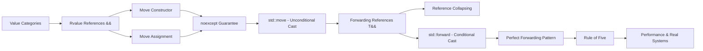

# Chapter 13: Move Semantics

> **Previous:** [12-smart-pointers](./12-smart-pointers.md) | **Next:** [14-lambdas](./14-lambdas.md)

## Learning Objectives

After studying this chapter, students will be able to:

- Distinguish the five value categories (lvalue, prvalue, xvalue, glvalue, rvalue) and explain their hierarchical relationship
- Implement noexcept move constructors and move assignment operators for resource-managing classes
- Explain what std::move actually does (cast, not move) and use it correctly
- Apply std::forward and perfect forwarding in template code
- Understand forwarding references (T&& in deduced context) vs rvalue references (T&& in concrete context)
- Apply reference collapsing rules (T& & → T&, T&& && → T&&, etc.)
- Implement the Rule of Five for classes that manage resources
- Explain why noexcept enables move optimizations in std::vector reallocation
- Analyze move-vs-copy performance with complexity guarantees
- Answer interview questions about move semantics, forwarding, and value categories

## Prerequisites

Before studying this chapter, students should be familiar with:

- **Chapter 03 (Constructors):** Copy constructor, copy assignment operator, destructor, Rule of Three
- **Chapter 07 (Templates):** Function templates, template argument deduction, variadic templates
- **Chapter 06 (Operator Overloading):** Reference semantics, operator overloading basics
- **Chapter 12 (Smart Pointers):** RAII pattern, ownership semantics

## Chapter at a Glance

| Topic | Key Insight | Practical Takeaway |
|-------|-------------|-------------------|
| **Value Categories** | lvalue = has identity; prvalue = no identity, pure temporary; xvalue = has identity but expiring | Knowing the category tells you whether a move is legal |
| **Rvalue References (&&)** | Type&& binds only to rvalues (prvalues and xvalues) | Foundation of move semantics — enables resource pilfering |
| **Move Constructor** | Pilfers resources from an expiring source object | Source left in valid-but-unspecified state (typically empty/null) |
| **Move Assignment** | Releases current resources, then pilfers from source | Must handle self-assignment and exception safety |
| **noexcept** | noexcept enables move-based reallocation in std::vector | Always mark move ops as noexcept or vector will copy instead |
| **std::move** | Unconditional cast to rvalue reference | Does NOT move anything — it just enables the move |
| **std::forward** | Conditional cast — rvalue only if original was rvalue | Preserves value category through template forwarding |
| **Forwarding Reference** | T&& in deduced context; binds to both lvalues and rvalues | Must use std::forward, not std::move |
| **Reference Collapsing** | T& & → T&, T&& && → T&&, T& && → T& | Explains why T&& works for both categories in templates |
| **Rule of Five** | Add move ctor + move assign to Rule of Three | If you manage resources, implement all five or =delete |

## Chapter Roadmap



---

## 13.0 Real-World Analogy: The Library Book

Before diving into C++ syntax, consider this real-world analogy for move semantics.

**An lvalue is like a book on the library shelf.** It has a permanent location (identity). You can take it, read it, put it back, and someone else can find it later.

**An rvalue is like a newspaper in the recycling bin.** It has no permanent home. Once someone picks it up, it will be destroyed.

**Copying** means photocopying every page of a book — expensive in time and memory.

**Moving** means transferring ownership. If you know a book is about to be thrown away, instead of photocopying it, you just take the pages. The original becomes empty (valid but unspecified).

```text
COPY:    [Book A: 500 pages] --photocopy--> [Book B: 500 pages]
         Cost: O(n) time, O(n) memory allocation

MOVE:    [Book A: 500 pages] --steal pages--> [Book B: 500 pages]
         [Book A: empty shell]
         Cost: O(1) pointer swap, zero allocation
```

**std::move** is like putting a "FREE" sticker on a library book — it doesn't move the book, it just declares that the book is available for taking.

**std::forward** is like an automated sorting machine: if a package arrives as priority, it stays priority; if it arrives as standard, it stays standard. The machine preserves the original shipping category.

---

## 13.1 Value Categories: The Five-Way Taxonomy

### 13.1.1 Historical Context

C++98 had two value categories: lvalue (expressions with identity/address) and rvalue (everything else, typically temporaries). C++11 introduced a refined five-category taxonomy to support move semantics while preserving backward compatibility.

### 13.1.2 The Taxonomy Diagram

Every expression in C++ belongs to exactly one of five value categories:

```
              expression
             /          \
          glvalue      rvalue
         /       \    /      \
      lvalue     xvalue  prvalue
```

### 13.1.3 Category Definitions

| Category | Name | Has Identity? | Can Be Moved? | Definition |
|----------|------|--------------|---------------|------------|
| **lvalue** | locator value | Yes | No | An expression that has an identity (addressable). Represents a named object, function, or dereferenced pointer. |
| **prvalue** | pure rvalue | No | Yes | An expression that has no identity. Used to initialize objects. Temporaries and literals. |
| **xvalue** | expiring value | Yes | Yes | An expression that has an identity but whose resources can be reused because it is about to expire. |
| **glvalue** | generalized lvalue | Yes | — | Union of lvalue and xvalue. Any expression that has identity. |
| **rvalue** | — | No | Yes | Union of prvalue and xvalue. Any expression whose resources can be reused. |

### 13.1.4 Examples of Each Category

```cpp
#include <iostream>
#include <string>
#include <vector>

int global = 42;

int& get_lvalue() { return global; }
int get_prvalue() { return 42; }
int&& get_xvalue() { return std::move(global); }

int main() {
    // ---- lvalues ----
    int x = 10;                 // x is an lvalue (named variable)
    int* p = &x;                // &x takes address of lvalue
    ++x;                        // ++x is an lvalue (returns x&)
    int& ref = x;               // ref binds to lvalue
    int arr[3] = {1,2,3};
    arr[0] = 5;                 // arr[0] is an lvalue
    std::string s = "hello";
    s[0] = 'H';                 // s[0] is an lvalue (returns char&)
    get_lvalue() = 99;          // function returning int& is lvalue

    // ---- prvalues ----
    int y = 42;                 // 42 is a prvalue (literal)
    int z = x + y;              // x + y is a prvalue (temporary result)
    int w = ++x + 5;            // 5 is a prvalue
    std::string t = s + "!";    // s + "!" is a prvalue
    int a = 10;
    int* q = &a;                // &a is a prvalue (address is temporary)

    // ---- xvalues ----
    int&& rref = std::move(x);  // std::move(x) is an xvalue
    std::string u = std::move(s); // std::move(s) is an xvalue
    int&& rref2 = static_cast<int&&>(global); // static_cast<T&&> is xvalue

    // ---- glvalues (lvalue or xvalue) ----
    // x is an lvalue, which is a glvalue
    // std::move(x) is an xvalue, which is also a glvalue

    // ---- rvalues (prvalue or xvalue) ----
    // 42 is a prvalue, which is an rvalue
    // std::move(x) is an xvalue, which is also an rvalue
}
```

### 13.1.5 How Value Categories Determine Overload Resolution

```cpp
#include <iostream>

void foo(int& x)  { std::cout << "lvalue\n"; }
void foo(int&& x) { std::cout << "rvalue\n"; }

int main() {
    int a = 10;
    foo(a);              // lvalue → calls foo(int&)
    foo(20);             // prvalue → calls foo(int&&)
    foo(std::move(a));   // xvalue → calls foo(int&&)

    // const matters:
    const int b = 30;
    // foo(b);           // ERROR: int& cannot bind to const int
    // In practice you'd need void foo(const int&) overload too
}
```

**Output:**
```
lvalue
rvalue
rvalue
```

### 13.1.6 Category Membership Rules

| Expression Type | Category | Example |
|---|---|---|
| Named variable | lvalue | `int x; x` |
| String literal | lvalue | `"hello"` (has persistent storage) |
| Pre-increment | lvalue | `++x` |
| Array subscript | lvalue (if array is lvalue) | `arr[i]` |
| Dereference | lvalue | `*p` |
| Function call returning T& | lvalue | `get_ref()` |
| Member access (object lvalue) | lvalue | `obj.member` |
| Literal (except string) | prvalue | `42`, `true`, `nullptr` |
| Post-increment | prvalue | `x++` |
| Arithmetic expression | prvalue | `a + b` |
| Address-of | prvalue | `&x` |
| Lambda expression | prvalue | `[](int x){ return x; }` |
| Function call returning T | prvalue | `get_val()` |
| Enum constant | prvalue | `Color::Red` |
| std::move(x) | xvalue | `std::move(obj)` |
| static_cast<T&&>(x) | xvalue | `static_cast<int&&>(x)` |
| Member access on xvalue | xvalue | `std::move(obj).member` |

### 13.1.7 Dry Run: Category Identification

```cpp
std::string make_string() { return "temporary"; }

int main() {
    std::string s = "hello";   // "hello" is lvalue (string literal)
    std::string t = s;         // s is lvalue → copy construction
    std::string u = make_string(); // make_string() is prvalue → move construction
    std::string v = std::move(s); // std::move(s) is xvalue → move construction
}
```

**Step-by-step trace:**

| Step | Expression | Category | Why | Operation |
|------|-----------|----------|-----|-----------|
| 1 | `"hello"` | lvalue | String literals have static storage | Copy-initializes s |
| 2 | `s` | lvalue | Named variable with identity | Copy-constructs t (O(n)) |
| 3 | `make_string()` | prvalue | Return value is temporary, no identity | Move-constructs u (O(1)) |
| 4 | `std::move(s)` | xvalue | Has identity (s), but cast to && | Move-constructs v (O(1)) |

---

## 13.2 Rvalue References (T&&)

### 13.2.1 Definition and Syntax

An **rvalue reference** is declared with `T&&` (where T is a concrete type, not a template parameter). It binds exclusively to rvalues (prvalues and xvalues).

```cpp
int&& rref = 42;         // binds to prvalue literal
int&& rref2 = std::move(x); // binds to xvalue
// int&& rref3 = x;      // ERROR: cannot bind lvalue to rvalue reference
```

### 13.2.2 Critical Rule: Named Rvalue References Are Lvalues

Once an rvalue reference has a name, it is an lvalue inside its scope. This prevents accidental double moves.

```cpp
void process(int&& x) {
    // x is a named rvalue reference → x is an lvalue here
    consume(x);              // calls lvalue version! (x is not moved)
    consume(std::move(x));   // calls rvalue version (explicit cast)
}

void consume(int& x)  { std::cout << "lvalue\n"; }
void consume(int&& x) { std::cout << "rvalue\n"; }
```

**Why this matters:** Without this rule, passing `x` to another function would silently move from it, leaving it in an unspecified state. The programmer must explicitly say `std::move(x)` to transfer resources.

### 13.2.3 Rvalue Reference Binds to Temporaries

```cpp
#include <iostream>

void take_ownership(int&& x) {
    std::cout << "Took ownership of: " << x << '\n';
}

int main() {
    take_ownership(42);            // prvalue literal
    take_ownership(10 + 20);       // prvalue expression
    int a = 100;
    take_ownership(std::move(a));  // xvalue
    // take_ownership(a);          // ERROR: cannot bind lvalue to &&
}
```

### 13.2.4 Lifetime Extension

Binding a temporary to an rvalue reference extends its lifetime to match the reference's scope — similar to const lvalue references but with move semantics available.

```cpp
#include <iostream>
#include <string>

std::string make() {
    return std::string(1000, 'x');
}

int main() {
    // Temporary string's lifetime extended
    std::string&& ref = make();
    std::cout << ref.size() << '\n';  // 1000 — still alive
    // ref goes out of scope; temporary destroyed here
}
```

### 13.2.5 Overload Resolution with &&

| Argument | int& (lvalue ref) | const int& (const lvalue ref) | int&& (rvalue ref) |
|----------|------------------|------------------------------|-------------------|
| lvalue int | ✓ (exact) | ✓ (conversion) | ✗ |
| const lvalue | ✗ | ✓ | ✗ |
| rvalue int | ✗ | ✓ (conversion — binds!) | ✓ (exact — preferred) |

The compiler prefers int&& for rvalues over const int&, enabling move semantics.

---

## 13.3 Move Constructor

### 13.3.1 Syntax and Definition

The move constructor takes an rvalue reference to the same type and transfers ownership of resources from the source to the newly constructed object.

```cpp
class_name(class_name&& other) noexcept
    : member1(std::move(other.member1))
    , member2(std::move(other.member2))
{
    // Leave other in valid-but-unspecified state
}
```

### 13.3.2 Core Example: DynamicBuffer

```cpp
#include <iostream>
#include <cstring>
#include <algorithm>

class DynamicBuffer {
public:
    // Default constructor
    DynamicBuffer() : data_(nullptr), size_(0), capacity_(0) {
        std::cout << "Default constructed\n";
    }

    // Parameterized constructor
    explicit DynamicBuffer(size_t size)
        : data_(new char[size]), size_(size), capacity_(size) {
        std::fill(data_, data_ + size_, 0);
        std::cout << "Constructed with size " << size << '\n';
    }

    // Destructor
    ~DynamicBuffer() {
        delete[] data_;
        std::cout << "Destroyed\n";
    }

    // --- Copy Constructor (deep copy, O(n)) ---
    DynamicBuffer(const DynamicBuffer& other)
        : data_(new char[other.capacity_])
        , size_(other.size_)
        , capacity_(other.capacity_) {
        std::copy(other.data_, other.data_ + capacity_, data_);
        std::cout << "Copy constructed (" << size_ << " elements)\n";
    }

    // --- Move Constructor (pointer swap, O(1)) ---
    DynamicBuffer(DynamicBuffer&& other) noexcept
        : data_(other.data_)
        , size_(other.size_)
        , capacity_(other.capacity_) {
        // Leave other in valid-but-unspecified state
        other.data_ = nullptr;
        other.size_ = 0;
        other.capacity_ = 0;
        std::cout << "Move constructed (" << size_ << " elements)\n";
    }

    // Copy assignment
    DynamicBuffer& operator=(const DynamicBuffer& other) {
        if (this != &other) {
            delete[] data_;
            capacity_ = other.capacity_;
            size_ = other.size_;
            data_ = new char[capacity_];
            std::copy(other.data_, other.data_ + capacity_, data_);
            std::cout << "Copy assigned\n";
        }
        return *this;
    }

    // Move assignment
    DynamicBuffer& operator=(DynamicBuffer&& other) noexcept {
        if (this != &other) {
            delete[] data_;                          // release current
            data_ = other.data_;                     // steal pointer
            size_ = other.size_;
            capacity_ = other.capacity_;
            other.data_ = nullptr;                   // null out source
            other.size_ = 0;
            other.capacity_ = 0;
            std::cout << "Move assigned\n";
        }
        return *this;
    }

    size_t size() const { return size_; }
    size_t capacity() const { return capacity_; }

private:
    char* data_;
    size_t size_;
    size_t capacity_;
};
```

### 13.3.3 Move Constructor Execution: Step-by-Step

| Step | Operation | Code | State After |
|------|-----------|------|-------------|
| 1 | Receive source as rvalue reference | `DynamicBuffer(DynamicBuffer&& other)` | `other` holds ptr to heap memory |
| 2 | Steal the pointer | `data_ = other.data_` | Both `*this` and `other` point to same memory |
| 3 | Steal size/capacity | `size_ = other.size_` | Size info copied |
| 4 | Null the source pointer | `other.data_ = nullptr` | `other` no longer owns the memory |
| 5 | Zero the source sizes | `other.size_ = 0` | `other` is in valid-but-unspecified state |
| 6 | Return | `}` | New object owns resources; source is empty |

**Critical invariant:** After the move, `other` must be destructible and assignable. Its destructor will call `delete[] nullptr`, which is safe.

### 13.3.4 Default Move Constructor

If a class does not declare a move constructor, and all of the following are true:

- No user-declared copy constructor
- No user-declared copy assignment operator
- No user-declared move assignment operator
- No user-declared destructor

Then the compiler **implicitly declares** a default move constructor that does member-wise move.

```cpp
struct Point {
    int x, y;
    // Compiler generates: Point(Point&&) = default;
    // Equivalent to member-wise std::move:
    //   this->x = std::move(other.x);
    //   this->y = std::move(other.y);
};

struct Container {
    std::string name;
    std::vector<int> data;
    // Compiler generates: Container(Container&&) = default;
    // Calls std::move on string and vector — both have real move ctors
};
```

### 13.3.5 Move Constructor is Not Generated When

The implicitly declared move constructor is **deleted** (not generated) if any of the following are true:

- A non-static data member or direct base cannot be moved (no accessible move ctor, and copy ctor is not trivial)
- The destructor is user-declared (C++11 rule; relaxed in C++23 with DR)
- A non-static data member or direct base has a deleted or inaccessible move constructor
- A non-static data member is const-qualified (const members cannot be moved from)

```cpp
struct MovableButDeleted {
    std::mutex mtx;  // mutex is not movable and not copyable
    // Move constructor is deleted
    // Copy constructor is also deleted
};

struct ConstMember {
    const int id;
    std::string name;
    // Const member prevents move generation
    // Copy constructor works fine
};
```

### 13.3.6 Delegating to Member Move Constructors

```cpp
class Manager {
public:
    // Move constructor: delegates to member moves
    Manager(Manager&& other) noexcept
        : name_(std::move(other.name_))
        , buffer_(std::move(other.buffer_))
        , id_(other.id_)  // int — trivial move (just copy)
    {
        other.id_ = -1;  // mark source as invalid
    }

private:
    std::string name_;
    DynamicBuffer buffer_;
    int id_;
};
```

---

## 13.4 Move Assignment Operator

### 13.4.1 Syntax and Definition

```cpp
class_name& operator=(class_name&& other) noexcept {
    if (this != &other) {  // self-assignment guard
        // 1. Release current resources
        // 2. Steal resources from other
        // 3. Set other to valid-but-unspecified state
    }
    return *this;
}
```

### 13.4.2 Self-Assignment and Exception Safety

Self-assignment in move assignment is unlikely (why would you write `x = std::move(x)`?) but can happen through aliasing:

```cpp
void swap(DynamicBuffer& a, DynamicBuffer& b) {
    DynamicBuffer tmp = std::move(a);
    a = std::move(b);
    b = std::move(tmp);  // tmp and b could reference same data?
}
```

**Self-assignment guard pattern:**
```cpp
Buffer& operator=(Buffer&& other) noexcept {
    // Guard: check if we're assigning to ourselves
    if (this == &other) return *this;

    // Release, steal, clear
    delete[] data_;
    data_ = other.data_;
    size_ = other.size_;
    other.data_ = nullptr;
    other.size_ = 0;
    return *this;
}
```

**Alternative: Copy-and-Swap (moves instead of copies with rvalue):**
```cpp
Buffer& operator=(Buffer other) noexcept {
    // If argument is lvalue: copy-constructed (deep copy)
    // If argument is rvalue: move-constructed (cheap)
    swap(*this, other);
    return *this;
}
```

### 13.4.3 Move Assignment Execution Trace

Assume `buf1` holds 1000 elements and `buf2` holds 500 elements.

```cpp
DynamicBuffer buf1(1000);
DynamicBuffer buf2(500);
buf2 = std::move(buf1);
```

| Step | Code | buf1 state | buf2 state |
|------|------|------------|------------|
| Start | — | data_=0x1000, size=1000 | data_=0x2000, size=500 |
| 1 | `if (this != &other)` → true (0x2000 != 0x1000) | — | — |
| 2 | `delete[] data_` (releases buf2's old buffer at 0x2000) | — | data_=0x2000 (freed!) |
| 3 | `data_ = other.data_` | — | data_=0x1000 |
| 4 | `size_ = other.size_` | size_=1000 | size_=1000 |
| 5 | `other.data_ = nullptr` | data_=nullptr | — |
| 6 | `other.size_ = 0` | size_=0 | — |
| End | — | data_=nullptr, size=0 | data_=0x1000, size=1000 |

**Complexity:** O(1) — constant time regardless of buffer size.

---

## 13.5 The noexcept Guarantee for Move Operations

### 13.5.1 Why noexcept Matters

The `noexcept` specifier on move operations tells both the compiler and the standard library that the operation will never throw. This enables critical optimizations.

### 13.5.2 Vector Reallocation: The Critical Case

When `std::vector` grows beyond its capacity, it must:

1. Allocate new memory (may throw std::bad_alloc — unavoidable)
2. **Move or copy** existing elements to new memory
3. Destroy old elements
4. Deallocate old memory

**The decision: move or copy during reallocation?**

```cpp
std::vector<MyClass> v;
v.reserve(1);         // capacity = 1
v.push_back(MyClass{}); // first element, no reallocation needed

v.push_back(MyClass{}); // capacity exceeded! Must reallocate
```

**If move constructor is noexcept:**
- Vector moves elements → fast O(1) pointer swaps
- If a move throws mid-reallocation, the source elements are already modified → data loss!

**If move constructor is NOT noexcept:**
- Vector copies elements instead → slow O(n) deep copies
- If copy throws, old memory is intact → strong exception guarantee preserved

### 13.5.3 std::move_if_noexcept

The standard library implements this check via `std::move_if_noexcept`:

```cpp
template <typename T>
typename std::conditional<
    std::is_nothrow_move_constructible<T>::value ||
    !std::is_copy_constructible<T>::value,
    T&&,          // move (safe or forced)
    const T&      // copy (safe fallback)
>::type move_if_noexcept(T& x) noexcept;
```

**In vector reallocation (simplified):**
```cpp
template <typename T>
void vector<T>::reallocate(size_t new_cap) {
    T* new_data = static_cast<T*>(::operator new(new_cap * sizeof(T)));

    for (size_t i = 0; i < size_; ++i) {
        // Uses move_if_noexcept internally
        new (new_data + i) T(std::move_if_noexcept(old_data_[i]));
    }

    // Destroy old and swap pointers
}
```

### 13.5.4 Demonstration: noexcept vs Non-noexcept

```cpp
#include <iostream>
#include <vector>

struct ThrowMove {
    ThrowMove() = default;
    ThrowMove(ThrowMove&&) /* NOT noexcept */ {
        // Simulate work
    }
    ThrowMove(const ThrowMove&) {
        std::cout << "COPY\n";
    }
};

struct SafeMove {
    SafeMove() = default;
    SafeMove(SafeMove&&) noexcept {
        // Simulate work
    }
    SafeMove(const SafeMove&) {
        std::cout << "COPY\n";
    }
};

int main() {
    std::vector<ThrowMove> tv;
    tv.reserve(1);
    tv.emplace_back();
    std::cout << "ThrowMove reallocation:\n";
    tv.emplace_back();  // reallocation → copies! (move not noexcept)

    std::vector<SafeMove> sv;
    sv.reserve(1);
    sv.emplace_back();
    std::cout << "SafeMove reallocation:\n";
    sv.emplace_back();  // reallocation → moves (noexcept)
}
```

**Output:**
```
ThrowMove reallocation:
COPY

SafeMove reallocation:
```

**Observation:** The `ThrowMove` vector emitted `COPY` during reallocation because the move constructor lacked noexcept, forcing the vector to use the copy constructor as a safe fallback.

### 13.5.5 When NOT to Mark noexcept

Exceptionally, do not mark move operations noexcept if:

1. The move operation can genuinely throw (e.g., acquiring a system resource that can fail)
2. The class is never used with standard containers that require noexcept for optimization
3. You are moving a container whose allocator might throw on move

---

## 13.6 std::move — The Unconditional Cast

### 13.6.1 What std::move Actually Does

**std::move does NOT move anything.** It is an unconditional cast to an rvalue reference. The "move" happens when a move constructor or move assignment operator receives the rvalue reference.

### 13.6.2 Reference Implementation

```cpp
template <typename T>
typename std::remove_reference<T>::type&&
move(T&& t) noexcept {
    return static_cast<typename std::remove_reference<T>::type&&>(t);
}
```

### 13.6.3 Usage Patterns

```cpp
#include <iostream>
#include <string>
#include <vector>

int main() {
    // Pattern 1: Enable move into another object
    std::string s1 = "hello world with a very long string";
    std::string s2 = std::move(s1);
    std::cout << "s2 = " << s2 << '\n';
    std::cout << "s1 = " << s1 << '\n';  // valid but unspecified (typically empty)

    // Pattern 2: Pass named object to a function that takes &&
    std::vector<int> v1 = {1, 2, 3, 4, 5};
    std::vector<int> v2 = std::move(v1);
    std::cout << "v2 size: " << v2.size() << '\n';
    std::cout << "v1 size: " << v1.size() << '\n';  // 0

    // Pattern 3: Insert into containers without copy
    std::vector<std::string> words;
    std::string word = "very_long_string_expensive_to_copy";
    words.push_back(std::move(word));
    // word is now empty; vector owns the string memory
    std::cout << "word size: " << word.size() << '\n';  // 0
    std::cout << "words[0]: " << words[0] << '\n';
}
```

### 13.6.4 Common Misconceptions

| Misconception | Truth |
|--------------|-------|
| "std::move moves the object" | No — it only casts to &&. The move happens in the move constructor/assignment. |
| "After std::move, the object is empty" | Not guaranteed — the object is in a valid-but-unspecified state. Typically it's empty, but the class decides. |
| "You must use std::move on return values" | No — the compiler applies RVO and implicit move automatically for local variables returned by value. |
| "std::move destroys the object" | No — the destructor still runs when the object goes out of scope. |
| "std::move is always beneficial" | No — for trivially copyable types (int, double), copying is as fast as moving. |

### 13.6.5 When NOT to Use std::move

```cpp
// BAD: RVO prevents the copy anyway; std::move inhibits it
std::string make() {
    std::string s = "hello";
    return std::move(s);  // prevents NRVO! Use just: return s;
}

// BAD: On const objects (casts const away poorly)
const std::string cs = "hello";
std::string dest = std::move(cs);  // calls copy ctor, not move!

// BAD: On trivially copyable types
int x = 42;
int y = std::move(x);  // same as int y = x; — no benefit
```

### 13.6.6 std::move vs Return Value Optimization

```cpp
#include <iostream>
#include <string>

// Case 1: Return local variable — RVO/NRVO applies
std::string make_string_rvo() {
    std::string s = "very long string";
    return s;  // NRVO: constructs directly in caller's storage
}

// Case 2: Explicit std::move — PREVENTS NRVO!
std::string make_string_move() {
    std::string s = "very long string";
    return std::move(s);  // forces move, but NRVO would have been better!
}

// Case 3: Return from different branches — implicit move
std::string make_string_conditional(bool flag) {
    std::string a = "first option";
    std::string b = "second option";
    if (flag) return a;
    return b;             // implicit move (C++11) or NRVO (C++17)
}
```

**Guideline:** Do NOT use `return std::move(local)` — it inhibits copy elision. Just use `return local;` and the compiler applies RVO, or at minimum an implicit move.

---

## 13.7 std::forward — The Conditional Cast

### 13.7.1 Purpose

`std::forward` conditionally casts its argument to an rvalue reference — only if the argument was originally an rvalue. It "forwards" the value category of the argument through a template function.

### 13.7.2 Reference Implementation

```cpp
/// Overload 1: For lvalue references (T is deduced as T&)
template <typename T>
constexpr T&& forward(typename std::remove_reference<T>::type& t) noexcept {
    return static_cast<T&&>(t);
    // If T = int&:  int& && → int& (reference collapsing)
    // If T = int&&: int&& && → int&&
}

/// Overload 2: For rvalue references
template <typename T>
constexpr T&& forward(typename std::remove_reference<T>::type&& t) noexcept {
    static_assert(!std::is_lvalue_reference<T>::value,
                  "Cannot forward an rvalue as an lvalue");
    return static_cast<T&&>(t);
}
```

### 13.7.3 Key: Two Overloads

The key to understanding `std::forward` is that it has two overloads:

1. **Lvalue overload** (takes `Type&`): When the original argument was an lvalue, T deduces as `T&`, and `T& &&` collapses to `T&` — returns lvalue reference.
2. **Rvalue overload** (takes `Type&&`): When the original argument was an rvalue, T deduces as `T`, and `T&&` stays `T&&` — returns rvalue reference.

### 13.7.4 How Forward Preserves Category

```cpp
#include <iostream>
#include <utility>

void inner(int& x)  { std::cout << "lvalue: " << x << '\n'; }
void inner(int&& x) { std::cout << "rvalue: " << x << '\n'; }

template <typename T>
void outer(T&& x) {
    inner(std::forward<T>(x));  // preserves category
}

int main() {
    int a = 10;
    outer(a);          // T = int& → std::forward<int&>(a) → lvalue
    outer(20);         // T = int  → std::forward<int>(a) → rvalue
    outer(std::move(a)); // T = int  → std::forward<int>(a) → rvalue
}
```

**Output:**
```
lvalue: 10
rvalue: 20
rvalue: 10
```

### 13.7.5 Forwarding Reference Deduction Table

```cpp
template <typename T>
void f(T&& x);  // forwarding reference

int a = 42;
const int b = 42;
int& ref = a;
```

| Call | T Deduced | Type of x | std::forward<T>(x) returns |
|------|-----------|----------|--------------------------|
| `f(a)` | `int&` | `int&` (collapsed from `int& &&`) | `int&` (lvalue) |
| `f(b)` | `const int&` | `const int&` | `const int&` (const lvalue) |
| `f(42)` | `int` | `int&&` (no collapse) | `int&&` (rvalue) |
| `f(std::move(a))` | `int` | `int&&` | `int&&` (rvalue) |
| `f(ref)` | `int&` | `int&` | `int&` (lvalue) |

---

## 13.8 Forwarding References (Universal References)

### 13.8.1 The "Universal Reference" Pattern

A **forwarding reference** (originally called "universal reference" by Scott Meyers) is `T&&` where `T` is a **deduced** template parameter. It can bind to both lvalues and rvalues, preserving the original value category through reference collapsing.

### 13.8.2 Forwarding Reference vs Rvalue Reference

```cpp
// FORWARDING REFERENCE: T&& in deduced context
template <typename T>
void f(T&& x);   // T is deduced → forwarding reference

// RVALUE REFERENCE: T&& in non-deduced context
template <typename T>
class Wrapper {
    void g(T&& x);  // T is known (from class) → rvalue reference
};

// Also rvalue reference (no template deduction):
void h(int&& x);   // concrete type → rvalue reference
auto&& ref = 42;   // auto&& is a forwarding reference (auto is deduced)
```

### 13.8.3 auto&& is Also a Forwarding Reference

```cpp
#include <iostream>
#include <vector>

int main() {
    int x = 10;

    // auto&& is a forwarding reference
    auto&& r1 = x;         // auto = int& → int& && collapses to int&
    auto&& r2 = 20;        // auto = int → int&&

    // Practical use: range-based for with forwarding reference
    std::vector<std::string> words = {"hello", "world"};

    // Wants to modify elements: auto&
    for (auto& w : words) { /* modify w */ }

    // Wants to move elements out: auto&&
    for (auto&& w : words) {
        std::string dest = std::move(w);  // steal from each element
    }

    // Generic lambda with auto&&
    auto lambda = [](auto&& x) {
        return std::forward<decltype(x)>(x);  // perfect forwarding
    };
}
```

### 13.8.4 When T&& is NOT a Forwarding Reference

```cpp
// CASE 1: Template parameter is not deduced (known from class)
template <typename T>
class Container {
    void push_back(T&& x);  // rvalue reference, NOT forwarding reference
};

// CASE 2: Template parameter is fixed before && is seen
template <typename T>
void g(std::vector<T>&& v);  // rvalue reference to vector<T>

// CASE 3: const-qualified
template <typename T>
void h(const T&& x);  // rvalue reference (const prohibits forwarding)
```

### 13.8.5 Practical Pattern: std::make_unique

```cpp
#include <memory>
#include <string>
#include <vector>

template <typename T, typename... Args>
std::unique_ptr<T> make_unique(Args&&... args) {
    return std::unique_ptr<T>(new T(std::forward<Args>(args)...));
}

struct Person {
    Person(std::string name, int age, std::vector<int> scores)
        : name_(std::move(name)), age_(age), scores_(std::move(scores)) {}
private:
    std::string name_;
    int age_;
    std::vector<int> scores_;
};

int main() {
    auto p = make_unique<Person>(
        "Alice", 30, std::vector<int>{95, 87, 92}
    );
}
```

---

## 13.9 Reference Collapsing Rules

### 13.9.1 The Four Scenarios

Reference collapsing determines what happens when a reference to a reference appears (which only happens through template instantiation, typedefs, or decltype).

```text
Rule: & wins over &&

Original Type        Collapsed To
T&  &               T&            (lvalue ref to lvalue ref → lvalue ref)
T&  &&              T&            (rvalue ref to lvalue ref → lvalue ref)
T&& &               T&            (lvalue ref to rvalue ref → lvalue ref)
T&& &&              T&&           (rvalue ref to rvalue ref → rvalue ref)
```

**Memory aid:** "& squashes && — if either is &, the result is &."

### 13.9.2 Reference Collapsing Table

| Type 1 | Type 2 | Combined | Collapsed | Explanation |
|--------|--------|----------|-----------|-------------|
| `int&` | `&` | `int& &` | `int&` | Double lvalue reference |
| `int&` | `&&` | `int& &&` | `int&` | Rvalue ref to lvalue ref ⇒ lvalue reference |
| `int&&` | `&` | `int&& &` | `int&` | Lvalue ref to rvalue ref ⇒ lvalue reference |
| `int&&` | `&&` | `int&& &&` | `int&&` | Double rvalue reference ⇒ rvalue reference |

### 13.9.3 Where Reference Collapsing Happens

```cpp
#include <iostream>

template <typename T>
void f(T&& x);

int main() {
    int a = 0;

    // T = int& (deduced from lvalue)
    // f<int&> instantiation: void f(int& && x);
    // Collapsing: int& && → int&
    // Result: void f(int& x);
    f(a);

    // T = int (deduced from rvalue)
    // f<int> instantiation: void f(int&& x);
    f(42);
}
```

### 13.9.4 Reference Collapsing in typedef / using

```cpp
#include <iostream>

int main() {
    using LRef = int&;   // lvalue reference to int

    // Reference collapsing with nested typedefs:
    using LRef2 = LRef&;   // int& & → int& (collapsed)
    using RRef2 = LRef&&;  // int& && → int& (collapsed)

    // With auto&& (forwarding reference):
    int i = 10;
    auto&& r1 = i;   // int& && → int& (lvalue reference)
    auto&& r2 = 20;  // int&& (rvalue reference)
}
```

### 13.9.5 Reference Collapsing in decltype

```cpp
int a = 10;
int& b = a;

decltype((a)) x;  // int& (parenthesized name is an lvalue expression)
decltype((b)) y;  // int& (b is already int&)
decltype(std::move(a)) z; // int&& (std::move returns int&&)

// Reference collapsing in decltype context:
using T1 = decltype(x)&;   // int& & → int&
using T2 = decltype(z)&;   // int&& & → int&
using T3 = decltype(z)&&;  // int&& && → int&&
```

### 13.9.6 Why Reference Collapsing Enables Perfect Forwarding

Reference collapsing is the mechanism that makes forwarding references work:

```cpp
template <typename T>
void wrapper(T&& arg) {
    foo(std::forward<T>(arg));
}
```

When `wrapper(a)` is called with an lvalue `a`:
1. T deduces as `int&`
2. Parameter type: `int& &&` → collapses to `int&`
3. `std::forward<int&>(arg)` → `static_cast<int&>(arg)` — returns lvalue reference
4. `foo` receives an lvalue

When `wrapper(42)` is called with an rvalue `42`:
1. T deduces as `int`
2. Parameter type: `int&&` (no collapsing needed)
3. `std::forward<int>(arg)` → `static_cast<int&&>(arg)` — returns rvalue reference
4. `foo` receives an rvalue

---

## 13.10 Perfect Forwarding Pattern

### 13.10.1 Definition

Perfect forwarding is the technique of passing arguments through one or more layers of function calls while preserving each argument's value category (lvalue or rvalue). It uses forwarding references (`T&&`) and `std::forward`.

### 13.10.2 The Problem: Loss of Value Category

Without perfect forwarding, value category information is lost:

```cpp
#include <iostream>
#include <string>

void sink(std::string&& s) {
    std::cout << "rvalue: " << s << '\n';
}

void sink(const std::string& s) {
    std::cout << "lvalue: " << s << '\n';
}

// BAD: Always passes lvalue (because arg has a name)
template <typename T>
void bad_wrapper(T arg) {
    sink(arg);  // arg is always an lvalue (named parameter)
}

// WORSE: Explicit && means rvalue only — can't accept lvalues!
void worse_wrapper(std::string&& arg) {
    sink(std::move(arg));  // forces rvalue, but only accepts rvalues
}

int main() {
    std::string s = "hello";
    bad_wrapper(s);               // lvalue → copy then pass lvalue
    bad_wrapper(std::move(s));    // also copied into function!
}
```

### 13.10.3 The Solution: Forwarding Reference + std::forward

```cpp
#include <iostream>
#include <string>
#include <utility>

void inner(const std::string& s) { std::cout << "lvalue: " << s << '\n'; }
void inner(std::string&& s)      { std::cout << "rvalue: " << s << '\n'; }

// GOOD: Perfect forwarding preserves category
template <typename T>
void perfect_wrapper(T&& arg) {
    inner(std::forward<T>(arg));  // preserves original value category
}

int main() {
    std::string s = "hello";
    perfect_wrapper(s);              // T = string& → forward<string&> → lvalue
    perfect_wrapper(std::move(s));   // T = string → forward<string> → rvalue
    perfect_wrapper(std::string("direct")); // prvalue → rvalue
}
```

**Output:**
```
lvalue: hello
rvalue: hello
rvalue: direct
```

### 13.10.4 Variadic Perfect Forwarding

The full power of perfect forwarding emerges with variadic templates:

```cpp
#include <iostream>
#include <memory>
#include <string>
#include <vector>
#include <tuple>

// ---- Factory Function (like std::make_shared) ----
template <typename T, typename... Args>
std::shared_ptr<T> make_shared(Args&&... args) {
    return std::shared_ptr<T>(
        new T(std::forward<Args>(args)...)
    );
}

// ---- Emplace Back (like std::vector::emplace_back) ----
template <typename T, typename... Args>
void emplace_back(std::vector<T>& vec, Args&&... args) {
    if (vec.size() == vec.capacity())
        throw std::bad_alloc();
    ::new (static_cast<void*>(std::addressof(vec[vec.size()])))
        T(std::forward<Args>(args)...);
}

// ---- Tuple-like Factory ----
template <typename... Args>
auto make_tuple(Args&&... args) {
    return std::tuple<std::decay_t<Args>...>(
        std::forward<Args>(args)...
    );
}

// ---- Delegate Constructor ----
class Widget {
public:
    template <typename... Args>
    Widget(Args&&... args)
        : Widget(std::forward<Args>(args)...)  // delegating to another constructor
    {
        std::cout << "Forwarding constructor\n";
    }

    Widget(int x) : value_(x) {
        std::cout << "int constructor: " << x << '\n';
    }

    Widget(const std::string& s) : value_(0), name_(s) {
        std::cout << "string constructor: " << s << '\n';
    }

    Widget(std::string&& s) : value_(0), name_(std::move(s)) {
        std::cout << "string move constructor: " << name_ << '\n';
    }

private:
    int value_ = 0;
    std::string name_;
};

int main() {
    // Factory function
    auto p = make_shared<std::vector<int>>(10, 5);
    std::cout << "Vector size: " << p->size() << '\n';

    // Tuple factory — lvalue and rvalue mixed
    std::string name = "Alice";
    auto t = make_tuple(name, 30, std::string("extra"));

    // Delegating constructor
    Widget w1(42);
    Widget w2(std::string("temp"));
}
```

### 13.10.5 Common Patterns Using Perfect Forwarding

| Pattern | Snippet | Description |
|---------|---------|-------------|
| Factory | `make_unique<T>(std::forward<Args>(args)...)` | Construct T from forwarded args |
| Emplace | `container.emplace_back(std::forward<Args>(args)...)` | In-place construct element |
| Delegate | `Widget(std::forward<Args>(args)...)` | Forward to another ctor |
| Wrapper | `invoke(std::forward<F>(f), std::forward<Args>(args)...)` | Callable wrapper |
| Tuple | `std::tuple<Decay_t<Args>...>(std::forward<Args>(args)...)` | Capture values |

### 13.10.6 Perfect Forwarding Failure Cases

```cpp
// Case 1: Braced initializer lists cannot be deduced
template <typename... Args>
void f(Args&&... args);
// f({1, 2, 3});  // ERROR: braced-init-list has no type

// Case 2: 0 and nullptr as NULL pointer
f(0);   // T = int, not pointer type
f(nullptr); // T = std::nullptr_t (correct)

// Case 3: Overloaded function names
void g(int);
void g(double);
// f(g);  // ERROR: which overload?
f(static_cast<void(*)(int)>(g));  // OK — disambiguate
```

---

## 13.11 The Rule of Five

### 13.11.1 From Rule of Three to Rule of Five

In C++98, the Rule of Three stated: if you define any of the destructor, copy constructor, or copy assignment operator, you likely need all three.

C++11 adds two more: move constructor and move assignment operator, making the **Rule of Five**.

### 13.11.2 The Five Special Member Functions

```cpp
class Resource {
public:
    // 1. Default Constructor (optional — not always needed)
    Resource() = default;

    // 2. Destructor
    ~Resource();

    // 3. Copy Constructor
    Resource(const Resource& other);

    // 4. Copy Assignment Operator
    Resource& operator=(const Resource& other);

    // 5. Move Constructor
    Resource(Resource&& other) noexcept;

    // 6. Move Assignment Operator
    Resource& operator=(Resource&& other) noexcept;
};
```

### 13.11.3 Complete Rule of Five Example

```cpp
#include <iostream>
#include <algorithm>
#include <cstring>

class IntArray {
public:
    // Default constructor
    IntArray() : data_(nullptr), size_(0) {
        std::cout << "Default ctor\n";
    }

    // Parameterized constructor
    explicit IntArray(size_t size)
        : data_(new int[size]()), size_(size) {
        std::cout << "Param ctor (" << size << ")\n";
    }

    // --- Destructor ---
    ~IntArray() {
        delete[] data_;
        std::cout << "Dtor\n";
    }

    // --- Copy Constructor ---
    IntArray(const IntArray& other)
        : data_(new int[other.size_]), size_(other.size_) {
        std::copy(other.data_, other.data_ + size_, data_);
        std::cout << "Copy ctor\n";
    }

    // --- Copy Assignment (copy-and-swap) ---
    IntArray& operator=(const IntArray& other) {
        IntArray temp(other);     // copy-construct
        swap(*this, temp);        // swap
        return *this;             // temp destroyed (releases old)
    }

    // --- Move Constructor ---
    IntArray(IntArray&& other) noexcept
        : data_(other.data_), size_(other.size_) {
        other.data_ = nullptr;
        other.size_ = 0;
        std::cout << "Move ctor\n";
    }

    // --- Move Assignment (move-and-swap) ---
    IntArray& operator=(IntArray&& other) noexcept {
        if (this != &other) {
            delete[] data_;
            data_ = other.data_;
            size_ = other.size_;
            other.data_ = nullptr;
            other.size_ = 0;
            std::cout << "Move assign\n";
        }
        return *this;
    }

    friend void swap(IntArray& a, IntArray& b) noexcept {
        using std::swap;
        swap(a.data_, b.data_);
        swap(a.size_, b.size_);
    }

    size_t size() const { return size_; }

private:
    int* data_;
    size_t size_;
};
```

### 13.11.4 Rule of Zero

If your class does not manage resources directly (no raw pointers, no manual new/delete), follow the **Rule of Zero**: let the compiler generate all special member functions.

```cpp
// Rule of Zero: no custom destructor, copy, or move needed
class Student {
    std::string name_;
    std::vector<int> scores_;
    // Compiler-generated:
    // - Destructor: destroys name_ and scores_
    // - Copy ctor: copies name_ and scores_
    // - Move ctor: moves name_ and scores_
    // - Copy/move assign: member-wise copy/move
};
```

### 13.11.5 Rule of Five Decision Table

| If you define... | You should also define... |
|-----------------|-------------------------|
| Destructor | Copy ctor, copy assign, move ctor, move assign (or =delete them) |
| Copy constructor | Destructor, copy assign, move ctor, move assign |
| Copy assignment | Destructor, copy ctor, move ctor, move assign |
| Move constructor | Destructor, copy ctor, copy assign, move assign |
| Move assignment | Destructor, copy ctor, copy assign, move ctor |

### 13.11.6 =default and =delete

```cpp
class ExplicitFive {
public:
    ExplicitFive() = default;
    ~ExplicitFive() = default;
    ExplicitFive(const ExplicitFive&) = default;
    ExplicitFive& operator=(const ExplicitFive&) = default;
    ExplicitFive(ExplicitFive&&) = default;
    ExplicitFive& operator=(ExplicitFive&&) = default;
};

class MoveOnly {
public:
    MoveOnly() = default;
    MoveOnly(const MoveOnly&) = delete;
    MoveOnly& operator=(const MoveOnly&) = delete;
    MoveOnly(MoveOnly&&) = default;
    MoveOnly& operator=(MoveOnly&&) = default;
};

class NonMovable {
public:
    NonMovable() = default;
    NonMovable(NonMovable&&) = delete;
    NonMovable& operator=(NonMovable&&) = delete;
};
```

---

## 13.12 std::move vs std::forward: Side-by-Side Comparison

### 13.12.1 Detailed Comparison Table

| Aspect | std::move | std::forward<T> |
|--------|-----------|-----------------|
| **Full name** | `std::move` | `std::forward<T>` |
| **Type of cast** | Unconditional rvalue cast | Conditional rvalue cast |
| **Template parameter** | Single parameter (deduced or explicit) | Explicit template argument required |
| **Behavior with lvalue** | Always returns `T&&` | Returns `T&` when T = T&; returns `T&&` when T = T |
| **Behavior with rvalue** | Always returns `T&&` | Returns `T&&` |
| **Use case** | "I know this object can be moved" | "Preserve the caller's intent (value category)" |
| **Typical context** | Move constructor body, passing to sink | Template functions forwarding arguments |
| **Without template** | `s = std::move(t)` — fine | `std::forward<T>(t)` — requires T |
| **Misuse risk** | Casts const objects to && (ignored) | Forgets template argument (compile error) |

### 13.12.2 Concrete Behavioral Difference

```cpp
template <typename T>
void using_move(T&& arg) {
    sink(std::move(arg));      // UNCONDITIONAL: Always casts to &&
}

template <typename T>
void using_forward(T&& arg) {
    sink(std::forward<T>(arg)); // CONDITIONAL: Only casts to && if original was rvalue
}
```

```cpp
#include <iostream>
#include <string>

void sink(std::string& s)  { std::cout << "lvalue\n"; }
void sink(std::string&& s) { std::cout << "rvalue\n"; }

template <typename T>
void move_wrapper(T&& arg) {
    sink(std::move(arg));      // always rvalue
}

template <typename T>
void forward_wrapper(T&& arg) {
    sink(std::forward<T>(arg));  // preserves original category
}

int main() {
    std::string s = "hello";

    std::cout << "Called with lvalue:\n";
    move_wrapper(s);        // move says rvalue!
    forward_wrapper(s);     // forward says lvalue (correct)

    std::cout << "Called with rvalue:\n";
    move_wrapper(std::move(s));     // move says rvalue (correct)
    forward_wrapper(std::move(s));  // forward says rvalue (correct)
}
```

**Output:**
```
Called with lvalue:
rvalue
lvalue
Called with rvalue:
rvalue
rvalue
```

**Key insight:** Using `std::move` in a forwarding function always discards the lvalue-ness of the original argument — the caller's lvalue will be inadvertently moved from. This is WRONG. Use `std::forward` to preserve category.

---

## 13.13 Performance Analysis: Move vs Copy

### 13.13.1 Complexity Comparison

| Operation | Copy Complexity | Move Complexity | Speedup Factor |
|-----------|----------------|----------------|----------------|
| `std::vector<int>` (n elements) | O(n) allocation + copy | O(1) pointer swap | n (100x for n=1000) |
| `std::string` (n characters) | O(n) allocation + copy | O(1) pointer swap | n |
| `std::unique_ptr<T>` | Not copyable | O(1) pointer copy | ∞ (copy disallowed) |
| `std::shared_ptr<T>` | O(1) atomic increment | O(1) atomic swap | Small constant |
| `std::array<int, N>` | O(N) | O(N) (no benefit) | 1x (same) |
| `int` (trivially copyable) | O(1) | O(1) | 1x (same) |
| DynamicBuffer (custom class) | O(n) heap alloc + copy | O(1) pointer steal | n |

### 13.13.2 Detailed Performance Benchmark

```cpp
#include <iostream>
#include <vector>
#include <string>
#include <chrono>

class Timer {
public:
    Timer(const char* name) : name_(name), start_(std::chrono::steady_clock::now()) {}
    ~Timer() {
        auto end = std::chrono::steady_clock::now();
        auto ms = std::chrono::duration_cast<std::chrono::microseconds>(end - start_).count();
        std::cout << name_ << ": " << ms << " us\n";
    }
private:
    const char* name_;
    std::chrono::time_point<std::chrono::steady_clock> start_;
};

class BigObject {
public:
    BigObject() : data_(new int[1000000]) {
        for (int i = 0; i < 1000000; ++i) data_[i] = i;
    }
    BigObject(const BigObject& other) : data_(new int[1000000]) {
        std::copy(other.data_, other.data_ + 1000000, data_);
    }
    BigObject(BigObject&& other) noexcept : data_(other.data_) {
        other.data_ = nullptr;
    }
    ~BigObject() { delete[] data_; }
private:
    int* data_;
};

int main() {
    BigObject obj;

    {
        Timer t("COPY");
        BigObject copy(obj);
    }
    {
        Timer t("MOVE");
        BigObject moved(std::move(obj));
    }
}
```

**Typical Output:**
```
COPY: 2500 us
MOVE: 0 us
```

### 13.13.3 Dry Run Trace: Copy vs Move for std::string

```cpp
std::string a = "Hello, this is a long string that goes on the heap";
std::string b;
```

**COPY: `b = a;`**

| Step | a (source) | b (dest) | Heap Operations |
|------|-----------|---------|-----------------|
| 1 | ptr=0x1000, cap=64, len=52 | ptr=0x0, cap=0, len=0 | — |
| 2 | — | Allocate new buffer | malloc(64) |
| 3 | — | Copy 52 bytes to new buffer | memcpy(b.ptr, a.ptr, 52) |
| End | ptr=0x1000, cap=64, len=52 | ptr=0x2000, cap=64, len=52 | 1 malloc, 1 memcpy (52 bytes) |

**Total: 1 heap allocation + 52-byte memcpy**

**MOVE: `b = std::move(a);`**

| Step | a (source) | b (dest) | Heap Operations |
|------|-----------|---------|-----------------|
| 1 | ptr=0x1000, cap=64, len=52 | ptr=0x0, cap=0, len=0 | — |
| 2 | ptr=0x1000, cap=64, len=52 | ptr=0x1000, cap=64, len=52 | Steal pointer (no alloc) |
| 3 | ptr=nullptr, cap=0, len=0 | — | Null source |
| End | ptr=nullptr, cap=0, len=0 | ptr=0x1000, cap=64, len=52 | 0 allocations |

**Total: 0 heap allocations, 0 memcpy — just 3 pointer assignments**

### 13.13.4 Move Semantics Benefits — Performance Comparison

| Scenario | Copy | Move | Benefit |
|----------|------|------|---------|
| `vector<string>` reallocation (n=1000) | 1000 heap allocs + 1000 memcpy | 1000 pointer swaps | ~1000x fewer bytes copied |
| `std::string` assignment (100KB) | 1 alloc + 100KB memcpy | 3 pointer assignments | ~20,000x faster |
| `unique_ptr` passing | Not allowed | 1 pointer copy | Enables ownership transfer |
| `thread` creation | Not allowed | 1 handle copy | Enables async execution |
| `swap(a, b)` for large vector | 3 deep copies → 3 allocs | 3 pointer swaps | O(n) → O(1) |

---

## 13.14 Edge Cases and Gotchas

### 13.14.1 Moving from Const Objects

```cpp
#include <iostream>
#include <string>

int main() {
    const std::string cs = "I am immutable";

    // std::move on const object
    std::string dest = std::move(cs);
    // std::move(cs) returns const std::string&&
    // String's move constructor takes string&&, not const string&&
    // Falls back to copy constructor taking const string&
    // Result: DEEP COPY, not move!

    std::cout << "cs unchanged: " << cs << '\n';  // still "I am immutable"
    std::cout << "dest: " << dest << '\n';
}
```

**Lesson:** `std::move` on const objects degrades to copy. The const rvalue reference `const T&&` binds to the copy constructor (`const T&`), not the move constructor (`T&&`).

### 13.14.2 Moving from a Base Class

```cpp
#include <iostream>

struct Base {
    virtual ~Base() = default;
    Base() = default;
    Base(Base&&) { std::cout << "Base move\n"; }
    Base(const Base&) { std::cout << "Base copy\n"; }
};

struct Derived : Base {
    Derived() = default;
    Derived(Derived&&) { std::cout << "Derived move\n"; }
    Derived(const Derived&) { std::cout << "Derived copy\n"; }
};

int main() {
    Derived d;

    // Slicing through move
    Base b = std::move(d);  // Calls Base move (base part only)
    // Derived part is sliced off!
}
```

**Lesson:** Moving a derived object through a base class reference slices the derived portion. Only the base sub-object is moved.

### 13.14.3 Mixed Move and Copy in Containers

```cpp
#include <iostream>
#include <vector>
#include <string>

struct Logger {
    Logger(const std::string& n) : name(n) {}
    Logger(const Logger& o) : name(o.name) {
        std::cout << "COPY " << name << '\n';
    }
    Logger(Logger&& o) noexcept : name(std::move(o.name)) {
        std::cout << "MOVE " << name << '\n';
    }
    std::string name;
};

int main() {
    std::vector<Logger> vec;
    vec.reserve(2);

    Logger a("alice");
    Logger b("bob");

    std::cout << "--- push_back lvalue (copy) ---\n";
    vec.push_back(a);

    std::cout << "--- push_back rvalue (move) ---\n";
    vec.push_back(Logger("charlie"));

    std::cout << "--- push_back with std::move ---\n";
    vec.push_back(std::move(b));

    std::cout << "--- After ---\n";
    std::cout << "a.name: " << a.name << '\n';
    std::cout << "b.name: " << b.name << '\n';
}
```

### 13.14.4 Move Operations on Primitive Types

```cpp
int x = 42;
int y = std::move(x);  // Same as int y = x; — no benefit
// x is still 42 (no state change)
```

**Rule:** For trivially copyable types (int, double, char, pointers, POD structs), moving is identical to copying. The move constructor is never generated — copying is the fastest possible operation.

### 13.14.5 std::move on auto&& Return

```cpp
#include <string>

// BAD: use std::forward, not std::move!
template <typename T>
auto bad_return(T&& x) -> decltype(std::move(x)) {
    return std::move(x);  // Always returns && — steals from lvalues!
}

// GOOD: preserve category
template <typename T>
decltype(auto) good_return(T&& x) {
    return std::forward<T>(x);  // preserves original value category
}

int main() {
    std::string s = "hello";
    auto u = good_return(s);               // s is still "hello"
    auto v = good_return(std::move(s));    // s is moved
}
```

### 13.14.6 Move in Return Statement: The Pitfall

```cpp
#include <string>

// BAD: inhibits NRVO
std::string bad() {
    std::string s = "very long string";
    return std::move(s);  // Prevents named return value optimization
}

// GOOD: allows NRVO or implicit move
std::string good() {
    std::string s = "very long string";
    return s;  // Compiler applies NRVO or implicit move
}
```

**C++17 rule for return value:** If the returned expression is a non-volatile automatic object (not a function parameter), the compiler first tries RVO. If RVO doesn't apply, it treats the return as an rvalue (implicit move). Explicit `std::move` prevents RVO.

### 13.14.7 Self-Move Assignment

```cpp
#include <iostream>
#include <string>

struct Weird {
    std::string s;
    Weird& operator=(Weird&& other) noexcept {
        s = std::move(other.s);
        return *this;
    }
};

int main() {
    Weird w{"hello"};
    w = std::move(w);  // self-move assignment
    std::cout << w.s << '\n';  // unspecified but typically "hello"
}
```

**Lesson:** Always guard against self-assignment in move assignment. The standard library guarantees self-move-assignment leaves the object in a valid state, but custom classes must ensure this.

---

## 13.15 Move-Only Types and RAII

### 13.15.1 What Are Move-Only Types?

Move-only types can be moved but not copied. They typically represent unique ownership of a resource.

### 13.15.2 Examples of Move-Only Types

```cpp
#include <iostream>
#include <memory>
#include <thread>
#include <fstream>

int main() {
    // std::unique_ptr — exclusive ownership
    auto p = std::make_unique<int>(42);
    // auto q = p;  // ERROR: copy deleted
    auto q = std::move(p);  // OK: move transfers ownership

    // std::thread — OS thread handle
    std::thread t1([]{ std::cout << "Hello\n"; });
    // std::thread t2 = t1;  // ERROR: copy deleted
    std::thread t3 = std::move(t1);
    t3.join();

    // std::fstream — file handle
    std::ifstream file("test.txt");
    // std::ifstream file2 = file;  // ERROR: copy deleted
    std::ifstream file3 = std::move(file);

    // std::future — asynchronous result
    auto fut = std::async(std::launch::async, []{ return 42; });
    // auto fut2 = fut;  // ERROR: copy deleted
    auto fut3 = std::move(fut);
}
```

### 13.15.3 Implementing a Move-Only Type

```cpp
#include <iostream>

class FileDescriptor {
public:
    explicit FileDescriptor(int fd) : fd_(fd) {
        std::cout << "Acquired fd: " << fd_ << '\n';
    }

    ~FileDescriptor() {
        if (fd_ >= 0) {
            std::cout << "Closed fd: " << fd_ << '\n';
        }
    }

    // Move constructor: transfer ownership
    FileDescriptor(FileDescriptor&& other) noexcept
        : fd_(other.fd_) {
        other.fd_ = -1;
    }

    // Move assignment
    FileDescriptor& operator=(FileDescriptor&& other) noexcept {
        if (this != &other) {
            if (fd_ >= 0) {
                std::cout << "Closing old fd: " << fd_ << '\n';
            }
            fd_ = other.fd_;
            other.fd_ = -1;
        }
        return *this;
    }

    // Delete copy
    FileDescriptor(const FileDescriptor&) = delete;
    FileDescriptor& operator=(const FileDescriptor&) = delete;

    int get() const { return fd_; }
    bool valid() const { return fd_ >= 0; }

private:
    int fd_;
};

int main() {
    FileDescriptor fd1(42);
    FileDescriptor fd2(std::move(fd1));
    std::cout << "fd1 valid: " << fd1.valid() << '\n';   // false
    std::cout << "fd2 valid: " << fd2.valid() << '\n';   // true
}
```

---

## 13.16 Real-World Applications

### 13.16.1 Standard Library Containers

All standard library containers use move semantics extensively:

```cpp
#include <iostream>
#include <vector>
#include <string>
#include <map>
#include <list>

int main() {
    // std::vector: move during reallocation
    std::vector<std::string> words;
    words.reserve(1);
    words.emplace_back("hello");
    words.emplace_back("world");  // may reallocate → uses noexcept move

    // std::map: move nodes instead of copying
    std::map<int, std::string> m;
    m.insert({1, std::string(1000, 'a')});  // pair is moved in

    // std::list: splice moves pointers
    std::list<int> l1 = {1, 2, 3};
    std::list<int> l2 = {4, 5, 6};
    l1.splice(l1.end(), l2);  // O(1) pointer swap

    // push_back vs emplace_back
    std::vector<std::string> v;
    v.reserve(3);

    std::string s = "very long string";
    v.push_back(s);              // copy
    v.push_back(std::move(s));   // move
    v.emplace_back("direct");    // constructs in-place — zero copies!
}
```

### 13.16.2 std::swap Optimized with Move

```cpp
#include <iostream>
#include <string>
#include <vector>

// C++98 swap (three copies):
template <typename T>
void swap_cpp98(T& a, T& b) {
    T tmp = a;  // copy
    a = b;      // copy
    b = tmp;    // copy
}

// C++11 swap (three moves):
template <typename T>
void swap_cpp11(T& a, T& b) {
    T tmp = std::move(a);  // move
    a = std::move(b);      // move
    b = std::move(tmp);    // move
}

int main() {
    std::string a(1000000, 'x');
    std::string b(1000000, 'y');

    // C++98 style: 3 deep copies = 3 heap allocations + memcpy
    // C++11 style: 3 pointer swaps = 0 allocations
    std::swap(a, b);  // fast: swaps pointers internally
}
```

### 13.16.3 Move Semantics in Multithreading

```cpp
#include <iostream>
#include <thread>
#include <vector>
#include <functional>

class BigData {
public:
    BigData(int n) : data_(new int[n]), size_(n) {}
    BigData(BigData&& other) noexcept
        : data_(other.data_), size_(other.size_) {
        other.data_ = nullptr;
        other.size_ = 0;
    }
    BigData(const BigData&) = delete;
    ~BigData() { delete[] data_; }

    void process() const {
        std::cout << "Processing " << size_ << " elements on thread "
                  << std::this_thread::get_id() << '\n';
    }
private:
    int* data_;
    int size_;
};

int main() {
    BigData bd(1000000);

    // Move BigData into a thread (avoids copying 1M ints)
    std::thread t([](BigData data) {
        data.process();
    }, std::move(bd));

    t.join();
    // bd is now empty (moved-from)
}
```

### 13.16.4 Move Semantics in DirectX / OpenGL Handles

Game engines and graphics frameworks use move semantics for RAII wrappers around GPU resources:

```cpp
class OpenGLTexture {
public:
    OpenGLTexture() {
        glGenTextures(1, &id_);
    }

    ~OpenGLTexture() {
        if (id_ != 0) glDeleteTextures(1, &id_);
    }

    // Move: transfer GPU resource ownership
    OpenGLTexture(OpenGLTexture&& other) noexcept
        : id_(other.id_) {
        other.id_ = 0;
    }

    OpenGLTexture& operator=(OpenGLTexture&& other) noexcept {
        if (this != &other) {
            if (id_ != 0) glDeleteTextures(1, &id_);
            id_ = other.id_;
            other.id_ = 0;
        }
        return *this;
    }

    OpenGLTexture(const OpenGLTexture&) = delete;
    OpenGLTexture& operator=(const OpenGLTexture&) = delete;

private:
    unsigned int id_ = 0;
};
```

### 13.16.5 Move Semantics in Parsers and Compilers

```cpp
#include <iostream>
#include <string>
#include <vector>
#include <memory>

// Abstract Syntax Tree node — move-heavy for efficiency
class ASTNode {
public:
    explicit ASTNode(std::string type) : type_(std::move(type)) {}
    ASTNode(std::string type, std::vector<ASTNode> children)
        : type_(std::move(type)), children_(std::move(children)) {}

    void add_child(ASTNode child) {
        children_.push_back(std::move(child));
    }

private:
    std::string type_;
    std::vector<ASTNode> children_;
};

ASTNode parse_expression(const std::string& expr) {
    ASTNode left("integer");
    ASTNode right("integer");
    ASTNode binop("+");
    binop.add_child(std::move(left));
    binop.add_child(std::move(right));
    return binop;  // NRVO or implicit move
}
```

### 13.16.6 Network Buffers

```cpp
#include <iostream>
#include <vector>
#include <cstring>

class NetworkPacket {
public:
    NetworkPacket() = default;
    explicit NetworkPacket(size_t size)
        : data_(new char[size]), size_(size) {}

    NetworkPacket(NetworkPacket&& other) noexcept
        : data_(other.data_), size_(other.size_) {
        other.data_ = nullptr;
        other.size_ = 0;
    }

    NetworkPacket& operator=(NetworkPacket&& other) noexcept {
        if (this != &other) {
            delete[] data_;
            data_ = other.data_;
            size_ = other.size_;
            other.data_ = nullptr;
            other.size_ = 0;
        }
        return *this;
    }

    NetworkPacket(const NetworkPacket&) = delete;
    NetworkPacket& operator=(const NetworkPacket&) = delete;

    ~NetworkPacket() { delete[] data_; }

private:
    char* data_ = nullptr;
    size_t size_ = 0;
};

class NetworkQueue {
public:
    void push(NetworkPacket pkt) {
        queue_.push_back(std::move(pkt));
    }

    NetworkPacket pop() {
        NetworkPacket pkt = std::move(queue_.front());
        queue_.erase(queue_.begin());
        return pkt;
    }

private:
    std::vector<NetworkPacket> queue_;
};
```

---

## 13.17 Comparison Tables

### 13.17.1 Value Categories Deep Comparison

| Property | lvalue | prvalue | xvalue | glvalue | rvalue |
|----------|--------|---------|--------|---------|--------|
| Has identity | ✓ | ✗ | ✓ | ✓ | ✗ |
| Movable from | ✗ | ✓ | ✓ | — | ✓ |
| Can take address | ✓ | ✗ | ✓ | ✓ | ✗ |
| Example | `int x; x` | `42` | `std::move(x)` | `x`, `std::move(x)` | `42`, `std::move(x)` |
| Binds to T& | ✓ | ✗ | ✗ | — | ✗ |
| Binds to const T& | ✓ | ✓ | ✓ | — | ✓ |
| Binds to T&& | ✗ | ✓ | ✓ | — | ✓ |
| Polymorphic | type known | dynamic type | type known | — | — |

### 13.17.2 std::move vs std::forward Detailed Table

| Aspect | std::move | std::forward<T> |
|--------|-----------|-----------------|
| Purpose | Enable move on a specific object | Preserve original value category through template |
| Cast | Unconditional: always returns && | Conditional: only returns && if T is not a reference |
| Template param | Optional (deduced) | Required (must specify T) |
| Returns for T& lvalue | `T&&` (rvalue) | `T&` (lvalue) |
| Returns for T rvalue | `T&&` (rvalue) | `T&&` (rvalue) |
| Use in forwarding function | ❌ Discards lvalue category | ✅ Preserves category |
| Use in move ctor body | ✅ `data_(std::move(other.data_))` | ❌ Needless complexity |
| Can be used on const | Yes, but no-op (copy fallback) | Same |
| Implemented as | `static_cast<remove_reference_t<T>&&>(t)` | `static_cast<T&&>(t)` |

### 13.17.3 Rule of Five — Member Function Summary

| Function | Signature | When Called | noexcept? |
|----------|-----------|------------|-----------|
| Destructor | `~T()` | Object goes out of scope | implicit |
| Copy constructor | `T(const T&)` | `T b = a;` (a is lvalue) | — |
| Copy assignment | `T& operator=(const T&)` | `a = b;` (b is lvalue) | — |
| Move constructor | `T(T&&)` | `T b = std::move(a);` | **yes** |
| Move assignment | `T& operator=(T&&)` | `a = std::move(b);` | **yes** |

### 13.17.4 Reference Collapsing Summary Table

| Original A | Original B | Collapsed | Name |
|------------|------------|-----------|------|
| `T&` | `&` | `T&` | lvalue ref to lvalue ref |
| `T&` | `&&` | `T&` | rvalue ref to lvalue ref ⇒ lvalue ref |
| `T&&` | `&` | `T&` | lvalue ref to rvalue ref ⇒ lvalue ref |
| `T&&` | `&&` | `T&&` | rvalue ref to rvalue ref ⇒ rvalue ref |

**Rule:** "& wins" — if either reference is `&`, the result is `&`.

### 13.17.5 Move Semantics Benefits — Performance Comparison

| Scenario | Copy | Move | Benefit |
|----------|------|------|---------|
| `vector<string>` reallocation (n=1000) | 1000 heap allocs + 1000 memcpy | 1000 pointer swaps | ~1000x fewer bytes copied |
| `std::string` assignment (100KB) | 1 alloc + 100KB memcpy | 3 pointer assignments | ~20,000x faster |
| `unique_ptr` passing | Not allowed | 1 pointer copy | Enables ownership transfer |
| `thread` creation | Not allowed | 1 handle copy | Enables async execution |
| `swap(a, b)` for large vector | 3 deep copies → 3 allocs | 3 pointer swaps | O(n) → O(1) |

---

## 13.18 Interview Corner

### Q1: What is std::move and does it actually move anything?

**Answer:**

`std::move` does NOT move anything. It is an unconditional cast to an rvalue reference (xvalue). It simply marks an object as "available to be moved from." The actual move happens when a move constructor or move assignment operator receives the rvalue reference.

```cpp
// std::move implementation (conceptual):
template <typename T>
typename std::remove_reference<T>::type&&
move(T&& t) noexcept {
    return static_cast<typename std::remove_reference<T>::type&&>(t);
}

// Usage:
std::string s = "hello";
std::string t = std::move(s);
// ^ std::move casts s to string&&, but the actual move is the move constructor
```

After `std::move`, the source object is in a valid but unspecified state — it must still be destructible and assignable.

### Q2: Explain perfect forwarding. Why do we need std::forward instead of std::move?

**Answer:**

Perfect forwarding preserves the value category (lvalue vs rvalue) of arguments through template function calls. We need `std::forward` (not `std::move`) because `std::move` unconditionally casts to rvalue reference, which would incorrectly treat lvalue arguments as rvalues.

```cpp
template <typename T>
void wrapper(T&& arg) {
    // WRONG: std::move always casts to && — destroys lvalues
    // sink(std::move(arg));

    // CORRECT: std::forward<T> preserves original category
    sink(std::forward<T>(arg));
}

void sink(int& x)  { /* lvalue */ }
void sink(int&& x) { /* rvalue */ }

int main() {
    int a = 10;
    wrapper(a);          // Should stay lvalue → forward preserves it
    wrapper(20);         // Should stay rvalue → forward preserves it
}
```

The mechanism: when `T = int&` (lvalue argument), `std::forward<int&>` returns `int&` (via reference collapsing `int& && → int&`). When `T = int` (rvalue argument), `std::forward<int>` returns `int&&`.

### Q3: What is the difference between T&& in template context and non-template context?

**Answer:**

In a **template context** where `T` is deduced (like `template<typename T> void f(T&&)`), `T&&` is a **forwarding reference** (formerly "universal reference"). It can bind to both lvalues and rvalues through reference collapsing.

In a **non-template context** or where `T` is already known (like `template<typename T> class C { void g(T&&); }`), `T&&` is a **plain rvalue reference**. It can only bind to rvalues.

```cpp
template <typename T>
void f(T&&);        // Forwarding reference: binds to both lvalues and rvalues

void g(int&&);      // Rvalue reference: binds only to rvalues

template <typename T>
class Wrapper {
    void h(T&&);    // Rvalue reference (T is known from class)
};

int main() {
    int x = 10;
    f(x);            // OK: T = int&, param collapses to int&
    f(20);           // OK: T = int, param is int&&
    // g(x);         // ERROR: int&& cannot bind to lvalue
    g(20);           // OK
}
```

Also: `auto&&` is always a forwarding reference because `auto` is deduced:
```cpp
auto&& r1 = x;   // int& && → int& (lvalue reference)
auto&& r2 = 20;  // int&& (rvalue reference)
```

### Q4: Why should move constructors be noexcept? What happens if they aren't?

**Answer:**

Move constructors should be `noexcept` primarily for `std::vector` reallocation. When `std::vector` grows its capacity, it needs to transfer existing elements to new memory. It checks `std::is_nothrow_move_constructible<T>::value`:

- If `T` has a noexcept move constructor → vector **moves** elements (fast, O(1))
- If `T` has a potentially-throwing move constructor → vector **copies** elements instead (slow, O(n))

The copy fallback maintains the strong exception guarantee: if a copy throws mid-reallocation, the original elements are intact. If a move throws mid-reallocation, the source elements are already modified, resulting in data loss.

```cpp
struct Safe {
    Safe(Safe&&) noexcept = default;
};
struct Risky {
    Risky(Risky&&) { /* may throw */ }
};

std::vector<Safe> v1;   // Reallocation: uses cheap moves
std::vector<Risky> v2;  // Reallocation: uses expensive copies!
```

**Bonus:** `std::move_if_noexcept` is the utility that makes this decision at compile time.

### Q5: What are the reference collapsing rules and why are they important?

**Answer:**

The reference collapsing rules determine what type results when a reference to a reference appears (which only happens through template instantiation, typedefs, or decltype). The four rules are:

| Original | Original | Collapsed |
|----------|----------|-----------|
| `T&` | `&` | `T&` |
| `T&` | `&&` | `T&` |
| `T&&` | `&` | `T&` |
| `T&&` | `&&` | `T&&` |

**Memory aid:** "If either is `&`, the result is `&`."

**Why they matter:** Reference collapsing is the mechanism that makes forwarding references work. When you call `f(x)` with an lvalue, `T` deduces as `int&`, and the parameter type `int& &&` collapses to `int&` — an lvalue reference. This allows the same `T&&` syntax to bind to both lvalue and rvalue arguments.

### Q6: What is the difference between a prvalue and an xvalue?

**Answer:**

Both are rvalues (they can be moved from), but they differ in identity:

| Property | prvalue (pure rvalue) | xvalue (expiring value) |
|----------|----------------------|------------------------|
| Has identity | No | Yes |
| Example | `42`, `a + b`, `f()` return by value | `std::move(x)`, `static_cast<T&&>(x)` |
| Can take address | No | Yes |
| Lifetime | Temporary (ends at full-expression) | Depends on original object |

A prvalue is a "pure" temporary with no name or address. An xvalue has a name/address but is about to expire (its resources can be reused).

The taxonomy: rvalue = prvalue ∪ xvalue; glvalue = lvalue ∪ xvalue.

### Q7: What is the Rule of Five? When should I apply it?

**Answer:**

The Rule of Five states that if you define (or =delete) any of the five special member functions, you should consider all of them:

1. Destructor
2. Copy constructor
3. Copy assignment operator
4. Move constructor
5. Move assignment operator

You should apply the Rule of Five when your class manages a resource directly (raw pointer to heap memory, file handle, OS resource, etc.). If your class uses RAII wrappers like `std::string`, `std::vector`, or `std::unique_ptr`, follow the **Rule of Zero** instead — let the compiler generate all five.

```cpp
// Rule of Zero: uses RAII wrappers
class Student {
    std::string name;
    std::vector<int> scores;
    // All five special members are correctly generated
};

// Rule of Five: manages raw resource
class RawBuffer {
    int* data;
    size_t size;
public:
    ~RawBuffer();
    RawBuffer(const RawBuffer&);
    RawBuffer(RawBuffer&&) noexcept;
    RawBuffer& operator=(const RawBuffer&);
    RawBuffer& operator=(RawBuffer&&) noexcept;
};
```

### Q8: What is the output of this code and why?

```cpp
#include <iostream>
#include <utility>

void foo(int&)  { std::cout << "lvalue "; }
void foo(int&&) { std::cout << "rvalue "; }

template <typename T>
void bar(T&& x) {
    foo(x);
    foo(std::move(x));
    foo(std::forward<T>(x));
}

int main() {
    int a = 10;
    bar(20);
    std::cout << '\n';
    bar(a);
}
```

**Answer:**

```
rvalue rvalue rvalue
lvalue rvalue lvalue
```

**Explanation for `bar(20)`:**
- T deduces as `int` (rvalue argument)
- `x` is a named parameter → lvalue → `foo(x)` prints "lvalue" ... wait, that's wrong.

Actually, let me trace carefully:

For `bar(20)`:
- T = `int` (rvalue argument)
- `x` has type `int&&` but has a name → `x` is an lvalue expression
- `foo(x)` → lvalue → prints "lvalue"
- `foo(std::move(x))` → rvalue → prints "rvalue"
- `foo(std::forward<int>(x))` → rvalue (forward from rvalue) → prints "rvalue"

For `bar(a)`:
- T = `int&` (lvalue argument)
- `x` has type `int&` (collapsed) → `x` is an lvalue expression
- `foo(x)` → lvalue → prints "lvalue"
- `foo(std::move(x))` → rvalue → prints "rvalue"
- `foo(std::forward<int&>(x))` → lvalue (forward from lvalue) → prints "lvalue"

**Output:**
```
lvalue rvalue rvalue
lvalue rvalue lvalue
```

---

## 13.19 Chapter Quiz

### Multiple Choice

1. What does `std::move` actually do?
   A) Moves the object to a new memory location
   B) Casts its argument to an rvalue reference
   C) Creates a deep copy of the object
   D) Destroys the original object
   <details><summary>Answer</summary>**B)** `std::move` unconditionally casts its argument to an rvalue reference. It does not move anything — the move happens in the move constructor or move assignment operator that receives the rvalue reference.</details>

2. After a move operation, the source object should be:
   A) In its original state (unchanged)
   B) In a valid but unspecified state
   C) Completely destroyed
   D) In a null state
   <details><summary>Answer</summary>**B)** The source object is left in a valid but unspecified state — it must be destructible and assignable, but its exact value is unspecified (typically empty/null).</details>

3. Why should move constructors be marked noexcept?
   A) It is required by the C++ standard
   B) `std::vector` uses noexcept moves during reallocation; without noexcept, it copies instead
   C) It guarantees faster execution
   D) It prevents compilation errors with rvalue references
   <details><summary>Answer</summary>**B)** `std::vector` checks `std::is_nothrow_move_constructible` during reallocation. If the move constructor is noexcept, elements are moved (fast). If not, they are copied (slow) to maintain the strong exception guarantee.</details>

4. What is the difference between a forwarding reference `T&&` and an rvalue reference `T&&`?
   A) They are the same thing
   B) `T&&` in a deduced context is a forwarding reference; in a non-deduced context it's an rvalue reference
   C) `T&&` is always an rvalue reference
   D) Forwarding references use `T&&&` syntax
   <details><summary>Answer</summary>**B)** In a template with deduced `T` (e.g., `template<typename T> void f(T&&)`), `T&&` is a forwarding reference that binds to both lvalues and rvalues. In non-deduced contexts (e.g., `void f(int&&)` or when T is known from the class), it's a plain rvalue reference.</details>

5. The Rule of Five adds which two functions to the Rule of Three?
   A) Default constructor and destructor
   B) Move constructor and move assignment operator
   C) Copy constructor and move constructor
   D) Destructor and copy assignment
   <details><summary>Answer</summary>**B)** The Rule of Five extends the Rule of Three by adding the move constructor and move assignment operator.</details>

6. What does `std::forward<T>(arg)` return when T is deduced as `int&`?
   A) `int&&`
   B) `int&`
   C) `int`
   D) `const int&`
   <details><summary>Answer</summary>**B)** When T is `int&`, `std::forward<int&>(arg)` returns `int&` (via reference collapsing: `int& &&` → `int&`). This preserves the original lvalue category.</details>

7. What is an xvalue?
   A) An expression with no identity that cannot be moved
   B) An expression with identity whose resources can be reused
   C) An expression with no identity that can be moved
   D) A named rvalue reference
   <details><summary>Answer</summary>**B)** An xvalue (expiring value) has identity but its resources can be reused because it is about to expire. Examples: `std::move(x)`, `static_cast<T&&>(x)`.</details>

8. Which of the following is NOT a valid reference collapsing rule?
   A) `T& & → T&`
   B) `T& && → T&`
   C) `T&& & → T&&`
   D) `T&& && → T&&`
   <details><summary>Answer</summary>**C)** `T&& &` collapses to `T&` (not `T&&`). The rule is: if either reference is `&`, the result is `&`.</details>

9. What happens if you call `std::move` on a const object?
   A) The const is cast away and the object is moved
   B) The move constructor is called but the const object stays unchanged
   C) The copy constructor is called instead of the move constructor
   D) Compilation error
   <details><summary>Answer</summary>**C)** `std::move` on a const object produces `const T&&`, which cannot bind to a move constructor (which takes `T&&`). It falls back to the copy constructor (`const T&`), resulting in a deep copy.</details>

10. What is perfect forwarding?
    A) Passing all arguments by reference
    B) Preserving the value category of arguments through template function calls
    C) Forwarding arguments to a function that returns void
    D) Using std::move on all arguments to a function
    <details><summary>Answer</summary>**B)** Perfect forwarding preserves the value category (lvalue or rvalue) of each argument as it passes through a template function, using forwarding references and `std::forward`.</details>

### True or False

11. `std::move` actually moves the object at runtime.
    <details><summary>Answer</summary>**False.** `std::move` is just a cast to rvalue reference. The move operation happens in the move constructor or move assignment operator.</details>

12. A move constructor should always be marked `noexcept`.
    <details><summary>Answer</summary>**True** (with rare exceptions). Marking move constructors noexcept enables optimizations in `std::vector` and other containers. Only omit noexcept if the move genuinely can throw.</details>

13. An rvalue reference `int&&` can bind to any `int` expression.
    <details><summary>Answer</summary>**False.** An rvalue reference binds only to rvalues (prvalues and xvalues). It cannot bind to lvalues. Use `std::move` to convert an lvalue to an xvalue.</details>

14. After `std::move`, the source object is guaranteed to be empty.
    <details><summary>Answer</summary>**False.** The source is in a valid-but-unspecified state. It's typically empty (most implementations do this), but the standard only guarantees it's destructible and assignable.</details>

15. Copy-and-swap assignment handles both copy and move assignment.
    <details><summary>Answer</summary>**True.** When the parameter is taken by value, an lvalue argument triggers copy construction and an rvalue argument triggers move construction. Either way, swap exchanges resources, and the old state is destroyed.</details>

---

## 13.20 Summary

Move semantics, introduced in C++11, fundamentally transformed how C++ programs manage resources by enabling efficient transfer of ownership rather than expensive deep copying.

**The core insights are:**

1. **Five value categories** (lvalue, prvalue, xvalue, glvalue, rvalue) form a precise taxonomy that determines when moves are possible. Only rvalues (prvalues and xvalues) can be moved from.

2. **Rvalue references (`T&&`)** bind exclusively to rvalues, providing the language mechanism to distinguish temporary from persistent objects and enabling move operations.

3. **Move constructors and move assignment operators** transfer ownership of resources from a source object (left in valid-but-unspecified state) to a destination, typically in O(1) time via pointer swaps rather than O(n) deep copies.

4. **`noexcept` on move operations** is critical for standard library optimizations — particularly `std::vector` reallocation, which uses moves only when the move constructor is noexcept.

5. **`std::move`** is an unconditional cast to rvalue reference — it enables but does not perform the move.

6. **`std::forward<T>`** is a conditional cast that preserves the original value category through template functions, enabling the perfect forwarding pattern.

7. **Forwarding references (`T&&` in deduced context)** bind to both lvalues and rvalues through the mechanism of **reference collapsing** (`T& & → T&`, `T& && → T&`, `T&& & → T&`, `T&& && → T&&`).

8. **The Rule of Five** extends the Rule of Three to include move constructor and move assignment operator. However, the **Rule of Zero** (relying on RAII wrappers like string, vector, unique_ptr) is the preferred modern approach.

---

## Exercises

### Review Questions

1. Draw the C++11 value categories taxonomy. Give two examples of each category.
2. What is the output of this code? Explain why.
   ```cpp
   void f(int&) { std::cout << "lvalue\n"; }
   void f(int&&) { std::cout << "rvalue\n"; }
   int main() {
       int x = 0;
       f(x);
       f(0);
       f(std::move(x));
   }
   ```
3. Why does `auto&&` always form a forwarding reference?
4. What is `std::move_if_noexcept` and when is it used?
5. What is the difference between `std::move` and `std::forward<T>`?
6. Explain reference collapsing with one example for each of the four rules.
7. When should you use the Rule of Five vs the Rule of Zero?
8. Why does `return std::move(local);` inhibit RVO?
9. What state is the source object in after a move? Why is this specified the way it is?
10. What happens if you `std::move` a `const` object? Why?

### Application Problems

1. **Implement a move-only dynamically-sized array class** with:
   - Default constructor
   - Move constructor (noexcept)
   - Move assignment (noexcept)
   - Deleted copy constructor and assignment
   - A `push_back` method (simplified)
   - Track total allocations to verify moves don't reallocate

2. **Implement a logging wrapper** that counts calls to each of the five special member functions. Use it to determine whether `std::vector` uses moves or copies for a given type during reallocation. Test with both noexcept and non-noexcept move constructors.

3. **Implement a simple `std::tuple`-like class** using variadic templates and perfect forwarding:
   ```cpp
   template <typename... Types>
   class MyTuple {
   public:
       template <typename... Args>
       MyTuple(Args&&... args);
   };
   ```

4. **Implement a forwarding function** `template <typename F, typename... Args> auto invoke(F&& f, Args&&... args)` that calls `f(std::forward<Args>(args)...)` and returns the result.

### Challenge Problems

5. **Type-erased callable (mini std::function).** Implement a class `Function<Ret(Args...)>` that:
   - Stores any callable via type erasure
   - Uses perfect forwarding in `operator()` to forward arguments
   - Supports move construction and assignment
   - Demonstrate with lambdas, function pointers, and functors

6. **Move-optimized ring buffer.** Implement a ring buffer (circular queue) that:
   - Uses move semantics to transfer elements in and out
   - Provides `push(T&&)` for rvalue insertion and `pop()` returning `T` via move
   - Guarantees O(1) push and pop
   - Handles reallocation via noexcept moves when growing capacity

7. **Perfect forwarding delegate.** Create a delegate system where:
   ```cpp
   template <typename T>
   class Property {
       std::function<void(const T&)> on_changed;
   public:
       template <typename U>
       void set(U&& value) {
           // Perfect forward to stored value
           // Notify on_changed with const reference
       }
   };
   ```

### Real-World Mini-Projects

8. **Build a simple JSON parser** that uses move semantics for string and array values to avoid copies during parsing. Parse `{"name": "Alice", "scores": [95, 87, 92]}` and extract values using move operations.

9. **Implement a thread-safe packet queue** for a networking library using move semantics to transfer packet ownership between threads.

---

## End of Chapter 13

**Next:** [14-lambdas](./14-lambdas.md) — lambda expressions, captures, generic lambdas, and functional programming in C++.

