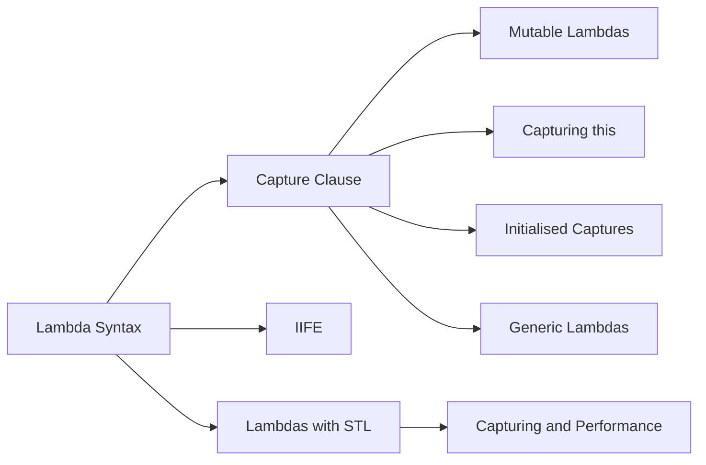

# Chapter 14: Lambdas

> **Previous:** [13-move-semantics](./13-move-semantics.md) | **Next:** [15-concurrency](./15-concurrency.md)

## Learning Objectives

After studying this chapter, students will be able to:

- Write lambda expressions with appropriate capture clauses
- Distinguish capture by value, reference, and initialised capture
- Create generic lambdas (C++14) and understand their template nature
- Use lambdas with STL algorithms effectively
- Apply the Immediately Invoked Function Expression (IIFE) pattern

## Chapter at a Glance

| Topic | Key Insight | Practical Takeaway |
|-------|-------------|-------------------|
| **Lambda Syntax** | `[capture](params) -> ret { body }` syntactic sugar | Write concise inline function objects |
| **Capture Clause** | By-value or by-reference capture of surrounding scope | Prefer explicit captures for clarity |
| **Mutable Lambdas** | mutable allows modification of by-value captures | Changes affect the copy, not the original |
| **Capturing this** | this capture gives access to enclosing members | Beware of dangling if lambda outlives object |
| **Initialised Captures** | C++14 enables move-only captures | Move unique_ptr into lambdas |
| **Generic Lambdas** | C++14 auto parameters make templated lambdas | Useful with STL algorithms |

## Chapter Roadmap



## 14.1 Lambda Syntax


A lambda expression defines an anonymous function object (a *closure*). The syntax:

```
[capture](parameters) -> return_type { body }
```

```cpp
auto square = [](int x) -> int { return x * x; };
std::cout << square(5);   // 25
```

The return type can be omitted if the compiler can deduce it:

```cpp
auto add = [](int a, int b) { return a + b; };
```

Lambdas are syntactic sugar for function objects:

```cpp
// Lambda
auto cmp = [](int a, int b) { return a > b; };

// Equivalent function object
struct Comparator {
    bool operator()(int a, int b) const { return a > b; }
};
```

## 14.2 Capture Clause

> **One-Sentence Takeaway:** The capture clause specifies which surrounding variables the lambda accesses — by value or by reference.
The capture clause determines what external variables the lambda can access:

| Capture | Meaning |
|---------|---------|
| `[]` | Nothing captured |
| `[x]` | Capture `x` by value |
| `[&x]` | Capture `x` by reference |
| `[=]` | Capture all used variables by value |
| `[&]` | Capture all used variables by reference |
| `[&, x]` | Capture all by reference except `x` by value |
| `[=, &x]` | Capture all by value except `x` by reference |

```cpp
int multiplier = 10;
int offset = 5;

auto scaled = [=](int x) { return x * multiplier + offset; };
// multiplier and offset captured by value (copied into closure)

auto updater = [&](int& x) { x = x * multiplier + offset; };
// multiplier and offset captured by reference
```

## 14.3 Mutable Lambdas

> **One-Sentence Takeaway:** mutable allows a by-value-captured lambda to modify its copies without affecting the original.
By default, `operator()` on the closure is `const`. To modify captured-by-value variables, use `mutable`:

```cpp
int count = 0;
auto counter = [count]() mutable {
    return ++count;     // modifies the closure's copy of count
};

std::cout << counter() << '\n';  // 1
std::cout << counter() << '\n';  // 2
std::cout << count << '\n';      // 0 (original unchanged)
```

Captured-by-reference variables can be mutated without `mutable` because the closure holds a reference and the `const` applies to the reference itself, not the referred object.

## 14.4 Capturing `this`

Within a member function, capture `*this` to access the object's members:

```cpp
class Processor {
public:
    void process_all(const std::vector<int>& data) {
        auto func = [this](int x) {
            return x * factor_;   // accesses member via this
        };
        std::transform(data.begin(), data.end(), output_.begin(), func);
    }

private:
    int factor_ = 2;
    std::vector<int> output_;
};
```

C++17 allows `[*this]` to capture a copy of the object (useful for asynchronous operations where the original object may be destroyed).

## 14.5 Initialised Captures (C++14)

> **One-Sentence Takeaway:** Initialised captures (C++14) let you capture move-only types and create local aliases within the capture.
Capture an expression result into a named variable within the closure:

```cpp
// Capture a move-only type
auto up = std::make_unique<int>(42);
auto func = [ptr = std::move(up)] {
    return *ptr;
};

// Capture computed value
auto func2 = [result = compute_value()] {
    return result * 2;
};
```

## 14.6 Generic Lambdas (C++14)

> **One-Sentence Takeaway:** Generic lambdas (C++14) use auto parameters, making them template function objects.
Generic lambdas use `auto` parameter types, which effectively makes `operator()` a template:

```cpp
auto add = [](auto a, auto b) { return a + b; };

add(3, 4);        // int + int
add(3.14, 2.72);  // double + double
add(std::string("a"), std::string("b"));  // string concatenation
```

The compiler generates:

```cpp
struct {
    template <typename T, typename U>
    auto operator()(T a, U b) const { return a + b; }
} add;
```

## 14.7 IIFE (Immediately Invoked Function Expression)

A lambda can be defined and invoked in the same expression, useful for initialising `const` variables with complex logic:

```cpp
const int verdict = [&data]() -> int {
    if (data.empty()) return 0;
    int sum = std::accumulate(data.begin(), data.end(), 0);
    return sum / static_cast<int>(data.size());
}();   // invoke immediately
```

```cpp
const auto settings = [] {
    Config cfg;
    cfg.load("config.json");
    if (cfg.debug()) cfg.enable_logging();
    return cfg;
}();
```

## 14.8 Lambdas with STL Algorithms

> **One-Sentence Takeaway:** STL algorithms pair naturally with lambdas for concise, local predicate and transformation logic.
Lambdas are the idiomatic way to customise STL algorithm behaviour:

```cpp
std::vector<Person> people = {
    {"Alice", 30}, {"Bob", 25}, {"Charlie", 35}, {"Diana", 28}
};

// Sort by age, then by name
std::sort(people.begin(), people.end(),
    [](const Person& a, const Person& b) {
        if (a.age != b.age) return a.age < b.age;
        return a.name < b.name;
    });

// Filter
auto it = std::remove_if(people.begin(), people.end(),
    [](const Person& p) { return p.age < 30; });
people.erase(it, people.end());

// Transform
std::vector<std::string> names(people.size());
std::transform(people.begin(), people.end(), names.begin(),
    [](const Person& p) { return p.name; });

// Find with condition
auto found = std::find_if(people.begin(), people.end(),
    [](const Person& p) { return p.name == "Charlie"; });

// for_each with side effects
std::for_each(people.begin(), people.end(),
    [](const Person& p) {
        std::cout << p.name << " is " << p.age << '\n';
    });
```

## 14.9 Capturing and Performance

> **One-Sentence Takeaway:** Default capture by reference can create dangling references — prefer explicit capture or capture by value.
Lambdas with empty capture lists can be converted to function pointers:

```cpp
void apply(int* data, size_t n, void (*func)(int&)) {
    for (size_t i = 0; i < n; ++i) func(data[i]);
}

int main() {
    int arr[] = {1, 2, 3};
    auto negate = [](int& x) { x = -x; };
    apply(arr, 3, negate);  // OK: empty capture list
}
```

Lambdas with captures cannot convert to function pointers

> **Pro Tip:** Prefer explicit captures over [=] or [&] — they make the lambda's dependencies clear and prevent dangling reference bugs.
 but can be stored in `std::function` (at some overhead).

## Concept Comparison Table

| Feature | Syntax | Availability | Use Case |
|---------|--------|-------------|----------|
| Basic lambda | `[](int x) { return x+1; }` | C++11 | Inline transformation |
| Capture by value | `[x]() { return x; }` | C++11 | Read current value |
| Capture by ref | `[&x]() { x++; }` | C++11 | Modify or large objects |
| Mutable | `[x]() mutable { x++; }` | C++11 | Modify copy without affecting original |
| Capture this | `[this]() { member++; }` | C++11 | Access class members |
| Init capture | `[x = std::move(y)]{}` | C++14 | Move-only types |
| Generic lambda | `[](auto x) { return x; }` | C++14 | Type-agnostic lambdas |

## Quick Reference

| Component | Example | Meaning |
|-----------|---------|---------|
| Empty capture | `[]` | Captures nothing |
| Value capture | `[x]` | Copies x into lambda |
| Ref capture | `[&x]` | References x |
| Default value | `[=]` | Captures all by value |
| Default ref | `[&]` | Captures all by reference |
| Mixed | `[=, &x]` | Default value, x by reference |
| this | `[this]` | Captures enclosing object by ref |
| init | `[u = std::move(ptr)]` | Initialised capture |

## Cross-Application Matrix

| Domain | How Concepts Apply |
|--------|-------------------|
| **STL Algorithms** | Lambdas are the customisation point for sort, transform, find_if |
| **GUI Callbacks** | Lambdas as event handlers with captured UI state |
| **Async/Tasks** | Lambdas for thread tasks, captured context for arguments |
| **Pipelines** | Chain lambdas through composition for data transformation |
| **Lazy Evaluation** | IIFE lambdas initialise const values with complex logic |

## Chapter Quiz

1. What does [=] capture?
   A) Nothing
   B) All variables by reference
   C) All variables by value
   D) Only variables explicitly listed
   <details><summary>Answer</summary>**C)** [=] captures all automatic variables used in the body by value.</details>

2. A mutable lambda allows:
   A) Modifying the original captured variables
   B) Modifying the copies of by-value captures
   C) Capturing by reference
   D) Recursive calls
   <details><summary>Answer</summary>**B)** mutable permits modification of the lambda's internal copies of by-value captures.</details>

3. Generic lambdas (C++14) use which parameter type?
   A) int
   B) auto
   C) template
   D) typename
   <details><summary>Answer</summary>**B)** Generic lambdas use auto parameters, making them template function objects.</details>

4. What is an IIFE?
   A) An inline function
   B) A lambda defined and immediately invoked
   C) A recursive lambda
   D) A generic lambda
   <details><summary>Answer</summary>**B)** Immediately Invoked Function Expression — a lambda defined and called in one step.</details>

5. A lambda that captures nothing can:
   A) Only be stored in std::function
   B) Convert to a function pointer
   C) Not be passed to algorithms
   D) Only capture by reference
   <details><summary>Answer</summary>**B)** A captureless lambda has an implicit conversion to a matching function pointer.</details>

## 14.10 Summary

Lambdas provide concise, inline function objects. Capture clauses control variable access, `mutable` enables modification of by-value captures, generic lambdas provide template-like polymorphism, and initialised captures extend the pattern to arbitrary expressions. Lambdas are the standard mechanism for customising STL algorithms.

## Exercises

### Review Questions

1. What is the difference between `[=]` and `[&]` capture defaults?
2. When must a lambda be declared `mutable`?
3. How does a generic lambda differ from a non-generic one at the template instantiation level?
4. What is an IIFE and when is it useful?
5. Why can a lambda with an empty capture list be converted to a function pointer?

### Application Problems

1. Write a lambda that sorts a `std::vector<std::string>` by string length, with ties broken alphabetically. Test with a list of words.
2. Use `std::transform` with a lambda to convert a vector of temperatures in Celsius to Fahrenheit. Use a second lambda with `std::count_if` to count how many are above a given threshold.

### Challenge Problem

3. Implement a simple expression parser and evaluator: given a string like `"x * 3 + 2"`, parse it, and return a `std::function<double(double)>` that evaluates the expression for a given `x`. Use lambdas as the building blocks for each AST node (constant, variable, addition, multiplication).
