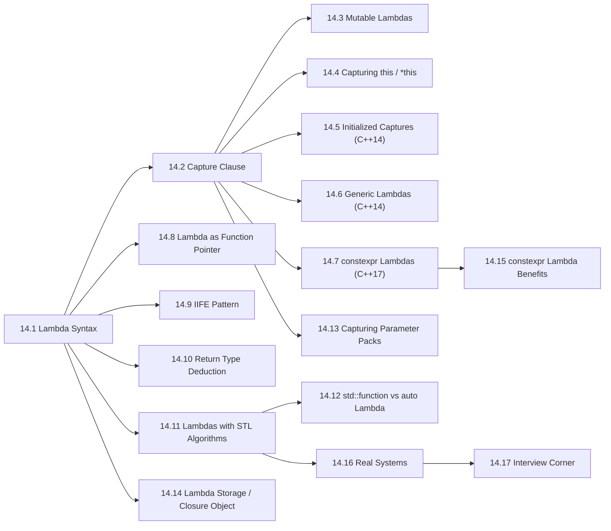

# Chapter 14: Lambdas (Deep Dive)

> **Previous:** [13-move-semantics](./13-move-semantics.md) | **Next:** [15-concurrency](./15-concurrency.md)

## Learning Objectives

After studying this chapter, students will be able to:

- Write lambda expressions with appropriate capture clauses for any scenario
- Distinguish capture by value, capture by reference, and initialized capture with precision
- Create generic lambdas (C++14) and constexpr lambdas (C++17) confidently
- Use lambdas with STL algorithms in all common patterns
- Apply the Immediately Invoked Function Expression (IIFE) pattern for const initialization
- Choose between lambda, std::function, and function pointers based on trade-offs
- Analyze closure object lifetime, storage, and performance implications
- Answer interview questions on capture modes, mutable, lambda lifetime, and type erasure

## Chapter at a Glance

| Topic | Key Insight | Practical Takeaway |
|-------|-------------|-------------------|
| **Lambda Syntax** | `[capture](params) -> ret { body }` syntactic sugar for function objects | Write concise inline callables anywhere an algorithm needs customization |
| **Capture Clause** | By-value copies variables into closure; by-reference stores a reference | Default capture by reference risks dangling — always prefer explicit captures |
| **Mutable Lambdas** | `mutable` removes const on operator() so by-value copies can be modified | Changes affect the closure's copy only — original stays untouched |
| **Capturing this** | `[this]` captures the enclosing object's address; `[*this]` copies the whole object | Object must outlive the lambda; `[*this]` is safer for async callbacks |
| **Initialized Captures** | `[x = expr]` captures arbitrary expressions, including move-only types | Move unique_ptr, make observer_ptr, capture computed results |
| **Generic Lambdas** | `auto` parameters make operator() a template | One lambda works for int, double, string — mega code reuse |
| **constexpr Lambdas** | Lambdas usable at compile time (C++17); implicit in C++20 | Use for compile-time computations, template arguments, static_assert |
| **Lambda as Function Pointer** | Captureless lambdas convert to function pointers | Pass to C APIs, callback registers, legacy interfaces |
| **IIFE** | `[]{ ... }()` — define and invoke in one expression | Initialize const variables with complex logic elegantly |
| **STL + Lambdas** | Lambdas customize sort, transform, find_if, remove_if, accumulate | The modern C++ way to configure algorithms |
| **std::function** | Type-erased wrapper stores any callable | Use sparingly — dynamic allocation and virtual dispatch overhead |
| **Parameter Pack Capture** | `[...args = std::move(args)]` captures variadic packs | Perfect forwarding into lambdas for async dispatchers |

## Chapter Roadmap



## 14.1 Lambda Syntax

### Real-World Analogy

<a href="../../../assets/images/diagrams/oop-cpp/14-lambdas/real-world-analogy-handwritten.svg" target="_blank" rel="noopener">
  
</a>
<a href="../../../assets/images/diagrams/oop-cpp/14-lambdas/real-world-analogy-diagram.svg" target="_blank" rel="noopener">
  
</a>
<a href="../../../assets/images/diagrams/oop-cpp/14-lambdas/real-world-analogy-sticky.svg" target="_blank" rel="noopener">
  
</a>


Think of a lambda like leaving a **sticky note instruction** for a colleague. The sticky note says *what to do*, *what supplies you've attached*, and *what result you expect* — all in one compact form. You don't need a full procedures document (a named function); a sticky note (a lambda) is faster and lives right where the task is.

### Lambda Grammar

<a href="../../../assets/images/diagrams/oop-cpp/14-lambdas/lambda-grammar-handwritten.svg" target="_blank" rel="noopener">
  
</a>
<a href="../../../assets/images/diagrams/oop-cpp/14-lambdas/lambda-grammar-diagram.svg" target="_blank" rel="noopener">
  
</a>
<a href="../../../assets/images/diagrams/oop-cpp/14-lambdas/lambda-grammar-sticky.svg" target="_blank" rel="noopener">
  
</a>


The full lambda syntax in C++ is:

```cpp
[capture](parameters) -> return_type { body }
```

| Part | Name | Required? | Description |
|------|------|-----------|-------------|
| `[capture]` | Capture clause | Yes | Lists variables from enclosing scope that the lambda accesses |
| `(parameters)` | Parameter list | Optional (empty if omitted) | Input parameters the lambda takes |
| `-> return_type` | Trailing return type | Optional (deduced if omitted) | Explicit return type when deduction is ambiguous |
| `{ body }` | Body | Yes | The code to execute |

### Numbered Steps to Write a Lambda

<a href="../../../assets/images/diagrams/oop-cpp/14-lambdas/numbered-steps-to-write-a-lambda-handwritten.svg" target="_blank" rel="noopener">
  
</a>
<a href="../../../assets/images/diagrams/oop-cpp/14-lambdas/numbered-steps-to-write-a-lambda-diagram.svg" target="_blank" rel="noopener">
  
</a>
<a href="../../../assets/images/diagrams/oop-cpp/14-lambdas/numbered-steps-to-write-a-lambda-sticky.svg" target="_blank" rel="noopener">
  
</a>


| Step | Action | Example |
|------|--------|---------|
| 1 | Start with `[]` — decide what to capture | `[x]` or `[&x]` or `[]` |
| 2 | Add `()` with parameters if needed | `(int a, int b)` |
| 3 | Optionally specify `-> return_type` | `-> int` |
| 4 | Write the body in `{}` | `{ return a + b; }` |
| 5 | Assign to `auto` variable (or invoke immediately) | `auto sum = ...;` |

### Pseudocode

<a href="../../../assets/images/diagrams/oop-cpp/14-lambdas/pseudocode-handwritten.svg" target="_blank" rel="noopener">
  
</a>
<a href="../../../assets/images/diagrams/oop-cpp/14-lambdas/pseudocode-diagram.svg" target="_blank" rel="noopener">
  
</a>
<a href="../../../assets/images/diagrams/oop-cpp/14-lambdas/pseudocode-sticky.svg" target="_blank" rel="noopener">
  
</a>


```
FUNCTION create_lambda(capture_mode, parameters, body):
    IF capture_mode == "by_value":
        COPY listed variables into closure object
    ELSE IF capture_mode == "by_reference":
        STORE references to listed variables
    
    CREATE anonymous function object with operator()
    RETURN the closure object
END FUNCTION
```

### Basic Lambda Examples

<a href="../../../assets/images/diagrams/oop-cpp/14-lambdas/basic-lambda-examples-handwritten.svg" target="_blank" rel="noopener">
  
</a>
<a href="../../../assets/images/diagrams/oop-cpp/14-lambdas/basic-lambda-examples-diagram.svg" target="_blank" rel="noopener">
  
</a>
<a href="../../../assets/images/diagrams/oop-cpp/14-lambdas/basic-lambda-examples-sticky.svg" target="_blank" rel="noopener">
  
</a>


```cpp
#include <iostream>
#include <vector>
#include <algorithm>

int main() {
    // Simplest lambda: no capture, one param, return deduced
    auto square = [](int x) { return x * x; };
    std::cout << "square(5) = " << square(5) << "\n";

    // Lambda with explicit return type
    auto divide = [](double a, double b) -> double {
        if (b == 0.0) return 0.0;
        return a / b;
    };
    std::cout << "divide(10, 3) = " << divide(10, 3) << "\n";

    // Lambda with multiple statements
    auto describe = [](int score) {
        if (score >= 90) return "Excellent";
        if (score >= 70) return "Good";
        return "Needs improvement";
    };
    std::cout << "score 85: " << describe(85) << "\n";

    // Lambda stored in std::function (type erasure)
    std::function<int(int)> func = [](int x) { return x * 2; };
    std::cout << "func(10) = " << func(10) << "\n";

    return 0;
}
```

**Output:**
```
square(5) = 25
divide(10, 3) = 3.33333
score 85: Good
func(10) = 20
```

### What the Compiler Generates: Closure Object

<a href="../../../assets/images/diagrams/oop-cpp/14-lambdas/what-the-compiler-generates-closure-object-handwritten.svg" target="_blank" rel="noopener">
  
</a>
<a href="../../../assets/images/diagrams/oop-cpp/14-lambdas/what-the-compiler-generates-closure-object-diagram.svg" target="_blank" rel="noopener">
  
</a>
<a href="../../../assets/images/diagrams/oop-cpp/14-lambdas/what-the-compiler-generates-closure-object-sticky.svg" target="_blank" rel="noopener">
  
</a>


Every lambda is syntactic sugar for a compiler-generated **closure class** with `operator()`. Example:

```cpp
auto cmp = [](int a, int b) { return a > b; };
```

The compiler generates something like:

```cpp
struct __lambda_1 {
    bool operator()(int a, int b) const {
        return a > b;
    }
};
__lambda_1 cmp;
```

### Dry Run: Lambda Invocation

<a href="../../../assets/images/diagrams/oop-cpp/14-lambdas/dry-run-lambda-invocation-handwritten.svg" target="_blank" rel="noopener">
  
</a>
<a href="../../../assets/images/diagrams/oop-cpp/14-lambdas/dry-run-lambda-invocation-diagram.svg" target="_blank" rel="noopener">
  
</a>
<a href="../../../assets/images/diagrams/oop-cpp/14-lambdas/dry-run-lambda-invocation-sticky.svg" target="_blank" rel="noopener">
  
</a>


Consider: `auto square = [](int x) { return x * x; };` then `square(5)`.

| Step | Instruction | `x` | Return | Notes |
|------|-------------|-----|--------|-------|
| 1 | Call `square.operator()(5)` | 5 | — | Parameter passed |
| 2 | Evaluate `x * x` | 5 | 25 | 5 * 5 = 25 |
| 3 | Return 25 | 5 | 25 | Value returned to caller |

### Complexity Analysis

<a href="../../../assets/images/diagrams/oop-cpp/14-lambdas/complexity-analysis-handwritten.svg" target="_blank" rel="noopener">
  
</a>
<a href="../../../assets/images/diagrams/oop-cpp/14-lambdas/complexity-analysis-diagram.svg" target="_blank" rel="noopener">
  
</a>
<a href="../../../assets/images/diagrams/oop-cpp/14-lambdas/complexity-analysis-sticky.svg" target="_blank" rel="noopener">
  
</a>


| Operation | Time Complexity | Space Complexity | Notes |
|-----------|----------------|------------------|-------|
| Lambda creation (no capture) | O(1) | O(1) | No data to copy |
| Lambda creation (N captures by value) | O(N) | O(N) | Copy each captured variable |
| Lambda creation (N captures by ref) | O(1) | O(N) for refs | References are small |
| Lambda invocation | O(body) | O(body) | Same as equivalent function |

## 14.2 Capture Clause Deep Dive

### Real-World Analogy

<a href="../../../assets/images/diagrams/oop-cpp/14-lambdas/real-world-analogy-handwritten.svg" target="_blank" rel="noopener">
  
</a>
<a href="../../../assets/images/diagrams/oop-cpp/14-lambdas/real-world-analogy-diagram.svg" target="_blank" rel="noopener">
  
</a>
<a href="../../../assets/images/diagrams/oop-cpp/14-lambdas/real-world-analogy-sticky.svg" target="_blank" rel="noopener">
  
</a>


A lambda's capture clause is like **packing a suitcase** before a trip. You decide what to bring along:
- **By value** = you pack a photocopy of a document. You can read it, even scribble on your copy, but the original stays home.
- **By reference** = you pack a GPS tracker pointing to your house. You can see what's happening at home in real time, but if the house burns down, the tracker is useless (dangling reference!).

### Capture Modes Reference

<a href="../../../assets/images/diagrams/oop-cpp/14-lambdas/capture-modes-reference-handwritten.svg" target="_blank" rel="noopener">
  
</a>
<a href="../../../assets/images/diagrams/oop-cpp/14-lambdas/capture-modes-reference-diagram.svg" target="_blank" rel="noopener">
  
</a>
<a href="../../../assets/images/diagrams/oop-cpp/14-lambdas/capture-modes-reference-sticky.svg" target="_blank" rel="noopener">
  
</a>


| Capture Syntax | Meaning | Lifetime Concern |
|---------------|---------|------------------|
| `[]` | Captures nothing | None — simplest form |
| `[x]` | Capture `x` by value | Safe — owns a copy |
| `[&x]` | Capture `x` by reference | Dangerous — must outlive lambda |
| `[=]` | Default capture all by value | Safe but wasteful — captures everything used |
| `[&]` | Default capture all by reference | Dangerous — dangling refs |
| `[&, x]` | Default ref, `x` by value | Rarely needed |
| `[=, &x]` | Default value, `x` by ref | Danger zone — ref may dangle |
| `[this]` | Capture enclosing object by reference | Object must outlive lambda |
| `[*this]` (C++17) | Capture enclosing object by value | Safe for async — owns a copy |
| `[x = expr]` (C++14) | Generalized capture | Flexible — own any expression result |

### Capture by Value: Deep Example

<a href="../../../assets/images/diagrams/oop-cpp/14-lambdas/capture-by-value-deep-example-handwritten.svg" target="_blank" rel="noopener">
  
</a>
<a href="../../../assets/images/diagrams/oop-cpp/14-lambdas/capture-by-value-deep-example-diagram.svg" target="_blank" rel="noopener">
  
</a>
<a href="../../../assets/images/diagrams/oop-cpp/14-lambdas/capture-by-value-deep-example-sticky.svg" target="_blank" rel="noopener">
  
</a>


```cpp
#include <iostream>
#include <functional>

int main() {
    int multiplier = 10;
    int offset = 5;

    // Capture by value — copies made at lambda creation
    auto compute = [multiplier, offset](int x) {
        return x * multiplier + offset;
    };

    multiplier = 100;  // Changes original — lambda still uses old copy
    offset = 50;

    std::cout << "compute(3) = " << compute(3) << "\n";
    // 3 * 10 + 5 = 35  (NOT 3 * 100 + 50)

    // Proof: multiple copies have independent state
    auto counter = [count = 0]() mutable {
        return ++count;
    };
    auto counter2 = counter;  // Copy closure — independent state

    std::cout << "counter():  " << counter() << counter() << counter() << "\n";
    std::cout << "counter2(): " << counter2() << "\n";

    return 0;
}
```

**Output:**
```
compute(3) = 35
counter():  123
counter2(): 1
```

### Capture by Reference: Deep Example

<a href="../../../assets/images/diagrams/oop-cpp/14-lambdas/capture-by-reference-deep-example-handwritten.svg" target="_blank" rel="noopener">
  
</a>
<a href="../../../assets/images/diagrams/oop-cpp/14-lambdas/capture-by-reference-deep-example-diagram.svg" target="_blank" rel="noopener">
  
</a>
<a href="../../../assets/images/diagrams/oop-cpp/14-lambdas/capture-by-reference-deep-example-sticky.svg" target="_blank" rel="noopener">
  
</a>


```cpp
#include <iostream>
#include <functional>

int main() {
    int sum = 0;
    int count = 0;

    auto add = [&sum, &count](int value) {
        sum += value;
        ++count;
    };

    add(10);
    add(20);
    add(30);

    std::cout << "sum   = " << sum << "\n";    // 60
    std::cout << "count = " << count << "\n";  // 3

    // Danger: dangling reference
    std::function<void()> dangling;
    {
        int local = 42;
        dangling = [&local]() { std::cout << local << "\n"; };
    }  // local destroyed here
    // dangling();  // UNDEFINED BEHAVIOR — local is gone

    return 0;
}
```

**Output:**
```
sum   = 60
count = 3
```

### Capture by Value vs Reference — Comparison Table

<a href="../../../assets/images/diagrams/oop-cpp/14-lambdas/capture-by-value-vs-reference-comparison-table-handwritten.svg" target="_blank" rel="noopener">
  
</a>
<a href="../../../assets/images/diagrams/oop-cpp/14-lambdas/capture-by-value-vs-reference-comparison-table-diagram.svg" target="_blank" rel="noopener">
  
</a>
<a href="../../../assets/images/diagrams/oop-cpp/14-lambdas/capture-by-value-vs-reference-comparison-table-sticky.svg" target="_blank" rel="noopener">
  
</a>


| Aspect | Capture by Value | Capture by Reference |
|--------|------------------|----------------------|
| **What is stored** | A copy of the variable | A reference to the variable |
| **Memory** | O(N) — copies N variables | O(N) — but refs are pointer-sized |
| **Mutation inside lambda** | Needs `mutable` keyword | Allowed without `mutable` |
| **Affects original?** | Never — operates on copy | Yes — modifies original |
| **Lifetime dependence** | Independent — owns the data | Dependent — original must outlive |
| **Dangling risk** | None | High if lambda escapes scope |
| **Use case** | Small data, read-only, parallel execution | Large objects, need side effects |
| **Move-only types** | Requires `std::move` in init capture | Allowed (ref to existing) |
| **Performance** | Copy cost at creation | No copy — just store address |
| **Thread safety** | Safe (own copy, no race) | Unsafe without synchronization |

### Dry Run: Capture by Value Mutation

<a href="../../../assets/images/diagrams/oop-cpp/14-lambdas/dry-run-capture-by-value-mutation-handwritten.svg" target="_blank" rel="noopener">
  
</a>
<a href="../../../assets/images/diagrams/oop-cpp/14-lambdas/dry-run-capture-by-value-mutation-diagram.svg" target="_blank" rel="noopener">
  
</a>
<a href="../../../assets/images/diagrams/oop-cpp/14-lambdas/dry-run-capture-by-value-mutation-sticky.svg" target="_blank" rel="noopener">
  
</a>


```cpp
int val = 5;
auto lambda = [val]() mutable {
    val += 10;
    return val;
};
int result = lambda();
// val outside is still 5
```

| Step | Instruction | `val` (outside) | `val` (closure copy) | Return |
|------|-------------|-----------------|----------------------|--------|
| 1 | `int val = 5;` | 5 | — | — |
| 2 | Create lambda, capture `val` by value | 5 | 5 | — |
| 3 | `lambda()` — `val += 10; return val;` | 5 | 15 | 15 |
| 4 | After invocation | 5 | 15 (persists in closure) | — |
| 5 | Second call `lambda()` | 5 | 25 | 25 |

### Common Mistakes with Captures

<a href="../../../assets/images/diagrams/oop-cpp/14-lambdas/common-mistakes-with-captures-handwritten.svg" target="_blank" rel="noopener">
  
</a>
<a href="../../../assets/images/diagrams/oop-cpp/14-lambdas/common-mistakes-with-captures-diagram.svg" target="_blank" rel="noopener">
  
</a>
<a href="../../../assets/images/diagrams/oop-cpp/14-lambdas/common-mistakes-with-captures-sticky.svg" target="_blank" rel="noopener">
  
</a>


```cpp
void example() {
    std::vector<int> data = {1, 2, 3};
    auto bad = [=]() { /* captures everything */ };  // Wasteful with large vectors
    auto good = [&data]() { /* explicit reference */ };

    // Mistake: capturing a pointer by value copies the pointer, not the pointee
    int* ptr = new int(42);
    auto capture_ptr = [ptr]() { return *ptr; };  // Copies the pointer — fine
    delete ptr;
    // capture_ptr();  // UB! pointee is deleted

    // Mistake: capturing static variables
    static int counter = 0;
    auto lam = [counter]() { return ++counter; };  // WARNING: captures the static
    // This actually captures the current value, not the static itself
    // To truly capture a static, use reference: [&counter]
}
```

## 14.3 Mutable Lambdas

### Real-World Analogy

<a href="../../../assets/images/diagrams/oop-cpp/14-lambdas/real-world-analogy-handwritten.svg" target="_blank" rel="noopener">
  
</a>
<a href="../../../assets/images/diagrams/oop-cpp/14-lambdas/real-world-analogy-diagram.svg" target="_blank" rel="noopener">
  
</a>
<a href="../../../assets/images/diagrams/oop-cpp/14-lambdas/real-world-analogy-sticky.svg" target="_blank" rel="noopener">
  
</a>


A `mutable` lambda is like a **notepad with a pencil** versus a whiteboard with a marker:
- **Default (const)** = whiteboard marker. You can read the notes you brought, but you CANNOT change them. If you want to change the original board, you must point at the reference (capture by reference).
- **Mutable** = pencil on paper. You can read your notes AND scribble on them. But it's YOUR copy — the original stays clean.

### Why Default Const?

<a href="../../../assets/images/diagrams/oop-cpp/14-lambdas/why-default-const-handwritten.svg" target="_blank" rel="noopener">
  
</a>
<a href="../../../assets/images/diagrams/oop-cpp/14-lambdas/why-default-const-diagram.svg" target="_blank" rel="noopener">
  
</a>
<a href="../../../assets/images/diagrams/oop-cpp/14-lambdas/why-default-const-sticky.svg" target="_blank" rel="noopener">
  
</a>


The closure's `operator()` defaults to `const` for safety. Without `mutable`, a lambda cannot accidentally mutate captured-by-value variables, which prevents subtle bugs.

```cpp
struct Closure {
    int captured_val_;
    
    // Default: const
    auto operator()() const {
        // captured_val_ = 42;  // COMPILE ERROR: const method
        return captured_val_;
    }
    
    // With mutable:
    auto operator()() /* non-const */ {
        captured_val_ = 42;  // OK
        return captured_val_;
    }
};
```

### Mutable Lambda Examples

<a href="../../../assets/images/diagrams/oop-cpp/14-lambdas/mutable-lambda-examples-handwritten.svg" target="_blank" rel="noopener">
  
</a>
<a href="../../../assets/images/diagrams/oop-cpp/14-lambdas/mutable-lambda-examples-diagram.svg" target="_blank" rel="noopener">
  
</a>
<a href="../../../assets/images/diagrams/oop-cpp/14-lambdas/mutable-lambda-examples-sticky.svg" target="_blank" rel="noopener">
  
</a>


```cpp
#include <iostream>
#include <algorithm>
#include <vector>

int main() {
    // Example 1: Simple counter
    int base = 10;
    auto counter = [base]() mutable {
        base += 5;
        return base;
    };

    std::cout << "Call 1: " << counter() << "\n";  // 15
    std::cout << "Call 2: " << counter() << "\n";  // 20
    std::cout << "Original base: " << base << "\n"; // 10 (unchanged)

    // Example 2: Mutable with reference — reference doesn't need mutable
    int total = 0;
    auto accumulator = [&total](int x) {
        total += x;  // OK — reference, no mutable needed
        return total;
    };
    std::cout << "After add 10: " << accumulator(10) << "\n";  // 10
    std::cout << "After add 20: " << accumulator(20) << "\n";  // 30

    // Example 3: Stateful lambda with STL (with side effects)
    std::vector<int> nums = {1, 2, 3, 4, 5};
    int shift = 10;
    std::for_each(nums.begin(), nums.end(),
        [shift](int& n) mutable {
            n += shift;
            shift += 1;  // Each call increases shift for next element
        });
    // shift outside remains 10
    // nums becomes: 11, 13, 16, 20, 25

    std::cout << "After for_each with mutable: ";
    for (int n : nums) std::cout << n << " ";
    std::cout << "\n";
    std::cout << "shift outside: " << shift << "\n";

    // Example 4: Mutable + generic lambda = accumulating lambda
    auto running_avg = [sum = 0.0, count = 0](double val) mutable {
        sum += val;
        ++count;
        return sum / count;
    };

    std::cout << "Running avg: ";
    for (double v : {2.0, 4.0, 6.0, 8.0})
        std::cout << running_avg(v) << " ";
    std::cout << "\n";

    return 0;
}
```

**Output:**
```
Call 1: 15
Call 2: 20
Original base: 10
After add 10: 10
After add 20: 30
After for_each with mutable: 11 13 16 20 25
shift outside: 10
Running avg: 2 3 4 5
```

### Dry Run: Mutable Lambda State

<a href="../../../assets/images/diagrams/oop-cpp/14-lambdas/dry-run-mutable-lambda-state-handwritten.svg" target="_blank" rel="noopener">
  
</a>
<a href="../../../assets/images/diagrams/oop-cpp/14-lambdas/dry-run-mutable-lambda-state-diagram.svg" target="_blank" rel="noopener">
  
</a>
<a href="../../../assets/images/diagrams/oop-cpp/14-lambdas/dry-run-mutable-lambda-state-sticky.svg" target="_blank" rel="noopener">
  
</a>


```cpp
auto counter = [count = 0]() mutable { return ++count; };
counter();  // 1
counter();  // 2
```

| Step | Instruction | `count` (closure) | Return |
|------|-------------|-------------------|--------|
| 1 | Lambda created, `count = 0` init capture | 0 | — |
| 2 | First call: `++count` → 1, return 1 | 1 | 1 |
| 3 | Second call: `++count` → 2, return 2 | 2 | 2 |
| 4 | Third call: `++count` → 3, return 3 | 3 | 3 |

Note: a **copy** of this lambda starts at 0 independently:

| Step | Instruction | `count` (original) | `count` (copy) |
|------|-------------|-------------------|----------------|
| 1 | Create `counter` | 0 | — |
| 2 | Call `counter()` | 1 | — |
| 3 | Create `counter2 = counter` | 1 | 1 |
| 4 | Call `counter()` | 2 | 1 |
| 5 | Call `counter2()` | 2 | 2 |

### Stateful Lambda Idioms

<a href="../../../assets/images/diagrams/oop-cpp/14-lambdas/stateful-lambda-idioms-handwritten.svg" target="_blank" rel="noopener">
  
</a>
<a href="../../../assets/images/diagrams/oop-cpp/14-lambdas/stateful-lambda-idioms-diagram.svg" target="_blank" rel="noopener">
  
</a>
<a href="../../../assets/images/diagrams/oop-cpp/14-lambdas/stateful-lambda-idioms-sticky.svg" target="_blank" rel="noopener">
  
</a>


```cpp
// Unique ID generator
auto make_id_generator() {
    return [id = 0]() mutable { return id++; };
}

// Running statistics
auto stats = [min = INT_MAX, max = INT_MIN, sum = 0LL, count = 0](int val) mutable {
    min = std::min(min, val);
    max = std::max(max, val);
    sum += val;
    ++count;
    return;
};

// Generator that skips every Nth call
auto throttled = [skip = 0, n = 3](int val) mutable -> std::optional<int> {
    if (++skip % n == 0) return val;
    return std::nullopt;
};
```

### Complexity Analysis — Mutable Lambda State

<a href="../../../assets/images/diagrams/oop-cpp/14-lambdas/complexity-analysis-mutable-lambda-state-handwritten.svg" target="_blank" rel="noopener">
  
</a>
<a href="../../../assets/images/diagrams/oop-cpp/14-lambdas/complexity-analysis-mutable-lambda-state-diagram.svg" target="_blank" rel="noopener">
  
</a>
<a href="../../../assets/images/diagrams/oop-cpp/14-lambdas/complexity-analysis-mutable-lambda-state-sticky.svg" target="_blank" rel="noopener">
  
</a>


| Operation | Time | Space | Notes |
|-----------|------|-------|-------|
| Create stateful lambda (k captures) | O(k) | O(k) | Initializes k state variables |
| Invoke mutable lambda | O(body) | O(body) | Same as non-mutable body |
| Copy closure | O(k) | O(k) | Deep copies all by-value captures |
| Move closure | O(k) | O(k) | Move each by-value capture |

## 14.4 Capturing `this` and `*this`

### Real-World Analogy

<a href="../../../assets/images/diagrams/oop-cpp/14-lambdas/real-world-analogy-handwritten.svg" target="_blank" rel="noopener">
  
</a>
<a href="../../../assets/images/diagrams/oop-cpp/14-lambdas/real-world-analogy-diagram.svg" target="_blank" rel="noopener">
  
</a>
<a href="../../../assets/images/diagrams/oop-cpp/14-lambdas/real-world-analogy-sticky.svg" target="_blank" rel="noopener">
  
</a>


Capturing `this` is like giving someone **keys to your apartment**. They can enter, use your kitchen, access your fridge — anything the apartment contains. But if the apartment is demolished while they still have keys, they're holding useless metal.

Capturing `*this` (C++17) is like giving someone a **fully furnished replica apartment**. They have their own copy of everything — even if the original burns down, their copy is fine.

### Capturing `this` (by Reference)

<a href="../../../assets/images/diagrams/oop-cpp/14-lambdas/capturing-this-by-reference-handwritten.svg" target="_blank" rel="noopener">
  
</a>
<a href="../../../assets/images/diagrams/oop-cpp/14-lambdas/capturing-this-by-reference-diagram.svg" target="_blank" rel="noopener">
  
</a>
<a href="../../../assets/images/diagrams/oop-cpp/14-lambdas/capturing-this-by-reference-sticky.svg" target="_blank" rel="noopener">
  
</a>


When a lambda is defined inside a non-static member function, it can capture `this` to access class members:

```cpp
#include <iostream>
#include <vector>
#include <algorithm>

class ShoppingCart {
public:
    ShoppingCart(double discount) : discount_(discount) {}

    void apply_discount(std::vector<double>& prices) {
        // [this] captures the current object by reference
        std::transform(prices.begin(), prices.end(), prices.begin(),
            [this](double price) {
                return price * (1.0 - discount_);
            });
    }

    void print_prices(const std::vector<double>& prices) const {
        std::for_each(prices.begin(), prices.end(),
            [this](double p) {
                std::cout << "$" << p;
                if (p > 100.0) std::cout << " (premium)";
                std::cout << "\n";
            });
    }

private:
    double discount_;
};

int main() {
    ShoppingCart cart(0.10);  // 10% discount
    std::vector<double> items = {99.99, 150.00, 49.99};
    
    cart.apply_discount(items);
    // items: 89.991, 135.00, 44.991

    cart.print_prices(items);
    return 0;
}
```

**Output:**
```
$89.991
$135.00 (premium)
$44.991
```

### DANGER: Lambda Outliving `this`

<a href="../../../assets/images/diagrams/oop-cpp/14-lambdas/danger-lambda-outliving-this-handwritten.svg" target="_blank" rel="noopener">
  
</a>
<a href="../../../assets/images/diagrams/oop-cpp/14-lambdas/danger-lambda-outliving-this-diagram.svg" target="_blank" rel="noopener">
  
</a>
<a href="../../../assets/images/diagrams/oop-cpp/14-lambdas/danger-lambda-outliving-this-sticky.svg" target="_blank" rel="noopener">
  
</a>


The single biggest lambda lifetime bug:

```cpp
#include <iostream>
#include <functional>

class Dangerous {
public:
    std::function<int()> create_callback() {
        int local = 42;
        // BAD: lambda captures this, will be called after object destroyed
        return [this]() { return value_; };
    }

    void set_value(int v) { value_ = v; }

private:
    int value_ = 100;
};

int main() {
    std::function<int()> callback;
    {
        Dangerous d;
        d.set_value(200);
        callback = d.create_callback();
        std::cout << "Inside scope: " << callback() << "\n";  // OK
    }
    // d destroyed here
    // std::cout << "Outside scope: " << callback() << "\n";  // UB! dangling this
    return 0;
}
```

### Capturing `*this` by Value (C++17)

<a href="../../../assets/images/diagrams/oop-cpp/14-lambdas/capturing-this-by-value-c-17-handwritten.svg" target="_blank" rel="noopener">
  
</a>
<a href="../../../assets/images/diagrams/oop-cpp/14-lambdas/capturing-this-by-value-c-17-diagram.svg" target="_blank" rel="noopener">
  
</a>
<a href="../../../assets/images/diagrams/oop-cpp/14-lambdas/capturing-this-by-value-c-17-sticky.svg" target="_blank" rel="noopener">
  
</a>


C++17 introduced `[*this]` which captures a **copy** of the entire object:

```cpp
#include <iostream>
#include <functional>

class Safe {
public:
    std::function<int()> create_callback() const {
        // Capture a copy of *this — safe for async operations
        return [*this]() { return value_; };
    }

    void set_value(int v) { value_ = v; }

private:
    int value_ = 100;
};

int main() {
    std::function<int()> callback;
    {
        Safe s;
        s.set_value(200);
        callback = s.create_callback();
    }  // s destroyed — but lambda captured a copy

    std::cout << "After destruction: " << callback() << "\n";  // 200 — safe!
    return 0;
}
```

**Output:**
```
After destruction: 200
```

### `[this]` vs `[*this]` — Comparison

<a href="../../../assets/images/diagrams/oop-cpp/14-lambdas/this-vs-this-comparison-handwritten.svg" target="_blank" rel="noopener">
  
</a>
<a href="../../../assets/images/diagrams/oop-cpp/14-lambdas/this-vs-this-comparison-diagram.svg" target="_blank" rel="noopener">
  
</a>
<a href="../../../assets/images/diagrams/oop-cpp/14-lambdas/this-vs-this-comparison-sticky.svg" target="_blank" rel="noopener">
  
</a>


| Aspect | `[this]` | `[*this]` (C++17) |
|--------|----------|-------------------|
| Captures | Address of object (pointer) | Copy of entire object |
| Lifetime | Lambda dies if object dies | Lambda self-sufficient |
| Memory | 8 bytes (pointer) | sizeof(Class) bytes |
| Performance | No copy overhead | Copy cost at creation |
| Modify members | Modifies original | Modifies own copy |
| Async safe | NO | YES |
| const method | Can call const members | Can call const members |
| Move-only type? | Not relevant (pointer) | Requires copy ctor |

### Dry Run: `[*this]` Capture

<a href="../../../assets/images/diagrams/oop-cpp/14-lambdas/dry-run-this-capture-handwritten.svg" target="_blank" rel="noopener">
  
</a>
<a href="../../../assets/images/diagrams/oop-cpp/14-lambdas/dry-run-this-capture-diagram.svg" target="_blank" rel="noopener">
  
</a>
<a href="../../../assets/images/diagrams/oop-cpp/14-lambdas/dry-run-this-capture-sticky.svg" target="_blank" rel="noopener">
  
</a>


```cpp
class Counter {
    int val_ = 0;
public:
    auto get_callback() { return [*this]() mutable { return ++val_; }; }
};

Counter c;
auto cb = c.get_callback();
cb();  // 1
c.val_ // still 0
```

| Step | Instruction | `c.val_` | Closure's `val_` | Return |
|------|-------------|----------|------------------|--------|
| 1 | `Counter c;` | 0 | — | — |
| 2 | `c.get_callback()` — capture `*this` | 0 | 0 | — |
| 3 | `cb()` — `++val_` (closure's copy) | 0 | 1 | 1 |
| 4 | `cb()` again | 0 | 2 | 2 |

### Subtle: Implicit `[this]` in C++20 with `[=]`

<a href="../../../assets/images/diagrams/oop-cpp/14-lambdas/subtle-implicit-this-in-c-20-with-handwritten.svg" target="_blank" rel="noopener">
  
</a>
<a href="../../../assets/images/diagrams/oop-cpp/14-lambdas/subtle-implicit-this-in-c-20-with-diagram.svg" target="_blank" rel="noopener">
  
</a>
<a href="../../../assets/images/diagrams/oop-cpp/14-lambdas/subtle-implicit-this-in-c-20-with-sticky.svg" target="_blank" rel="noopener">
  
</a>


In C++11/14/17, `[=]` inside a member function implicitly captures `this` by reference. **C++20 deprecates this.** Always prefer explicit `[this]`, `[*this]`, or specific member captures.

## 14.5 Initialized Captures / Generalized Capture (C++14)

### Real-World Analogy

<a href="../../../assets/images/diagrams/oop-cpp/14-lambdas/real-world-analogy-handwritten.svg" target="_blank" rel="noopener">
  
</a>
<a href="../../../assets/images/diagrams/oop-cpp/14-lambdas/real-world-analogy-diagram.svg" target="_blank" rel="noopener">
  
</a>
<a href="../../../assets/images/diagrams/oop-cpp/14-lambdas/real-world-analogy-sticky.svg" target="_blank" rel="noopener">
  
</a>


A **generalized capture** is like packing a **custom travel bag** — not just grabbing what's on the table, but building exactly what you need right there in the suitcase. Need a move-only drone? Pack it directly. Need to compute a value first? Do the math while packing.

### Syntax

<a href="../../../assets/images/diagrams/oop-cpp/14-lambdas/syntax-handwritten.svg" target="_blank" rel="noopener">
  
</a>
<a href="../../../assets/images/diagrams/oop-cpp/14-lambdas/syntax-diagram.svg" target="_blank" rel="noopener">
  
</a>
<a href="../../../assets/images/diagrams/oop-cpp/14-lambdas/syntax-sticky.svg" target="_blank" rel="noopener">
  
</a>


```cpp
[var_name = expression](params) { body }
```

The `expression` is evaluated once when the lambda is created, and the result is stored as `var_name` inside the closure.

### Example 1: Moving Unique Ownership

```cpp
#include <iostream>
#include <memory>
#include <functional>

int main() {
    std::unique_ptr<int> ptr = std::make_unique<int>(42);

    // C++11: impossible — unique_ptr is move-only, can't capture by value or ref safely
    // C++14: initialized capture moves ptr into the closure
    auto consumer = [ptr = std::move(ptr)]() {
        std::cout << "Owned value: " << *ptr << "\n";
    };

    // ptr is now nullptr (moved from)
    if (!ptr) std::cout << "Original ptr is now null\n";

    consumer();

    // Can also create unique_ptr inline in capture
    auto creator = [p = std::make_unique<int>(99)]() {
        return *p;
    };
    std::cout << "Created value: " << creator() << "\n";

    return 0;
}
```

**Output:**
```
Original ptr is now null
Owned value: 42
Created value: 99
```

### Example 2: Computed Capture

```cpp
#include <iostream>
#include <vector>
#include <numeric>

int compute_base(int factor) {
    return factor * 100 + 42;
}

int main() {
    int factor = 3;

    // Compute value at capture time, not at invocation time
    auto calculator = [base = compute_base(factor), factor](int x) {
        return base + x * factor;
    };

    // Change factor — the lambda already captured its own copies
    factor = 100;
    std::cout << "calculator(5) = " << calculator(5) << "\n";
    // compute_base(3) = 342, base = 342, captured factor = 3
    // 342 + 5 * 3 = 357

    return 0;
}
```

**Output:**
```
calculator(5) = 357
```

### Example 3: Naming a Complex Expression

```cpp
auto lambda = [result = [] { /* complex init */ return 42; }()] {
    return result * 2;
};
```

### Example 4: Capture a Vector by Moving

```cpp
#include <iostream>
#include <vector>
#include <algorithm>

int main() {
    std::vector<int> big_data(10'000'000, 42);
    
    // Move the entire vector into the lambda — zero copy
    auto process = [data = std::move(big_data)]() {
        return data.size();  // fine — data owned by lambda
    };
    // big_data is now empty
    
    std::cout << "big_data size: " << big_data.size() << "\n";
    std::cout << "closure data size: " << process() << "\n";
    
    return 0;
}
```

**Output:**
```
big_data size: 0
closure data size: 10000000
```

### Multiple Initialized Captures

<a href="../../../assets/images/diagrams/oop-cpp/14-lambdas/multiple-initialized-captures-handwritten.svg" target="_blank" rel="noopener">
  
</a>
<a href="../../../assets/images/diagrams/oop-cpp/14-lambdas/multiple-initialized-captures-diagram.svg" target="_blank" rel="noopener">
  
</a>
<a href="../../../assets/images/diagrams/oop-cpp/14-lambdas/multiple-initialized-captures-sticky.svg" target="_blank" rel="noopener">
  
</a>


Multiple captures are comma-separated:

```cpp
auto stats = [sum = 0.0, count = 0, &external_ref](double val) mutable {
    sum += val;
    ++count;
    external_ref = sum / count;
    return sum / count;
};
```

### Dry Run: Initialized Capture

<a href="../../../assets/images/diagrams/oop-cpp/14-lambdas/dry-run-initialized-capture-handwritten.svg" target="_blank" rel="noopener">
  
</a>
<a href="../../../assets/images/diagrams/oop-cpp/14-lambdas/dry-run-initialized-capture-diagram.svg" target="_blank" rel="noopener">
  
</a>
<a href="../../../assets/images/diagrams/oop-cpp/14-lambdas/dry-run-initialized-capture-sticky.svg" target="_blank" rel="noopener">
  
</a>


```cpp
auto func = [x = 5, y = 10]() { return x + y; };
int result = func();
```

| Step | Instruction | Closure `x` | Closure `y` | Return |
|------|-------------|-------------|-------------|--------|
| 1 | Lambda created, init `x = 5`, `y = 10` | 5 | 10 | — |
| 2 | `func()` — `x + y` = 5 + 10 = 15 | 5 | 10 | 15 |

### Complexity

<a href="../../../assets/images/diagrams/oop-cpp/14-lambdas/complexity-handwritten.svg" target="_blank" rel="noopener">
  
</a>
<a href="../../../assets/images/diagrams/oop-cpp/14-lambdas/complexity-diagram.svg" target="_blank" rel="noopener">
  
</a>
<a href="../../../assets/images/diagrams/oop-cpp/14-lambdas/complexity-sticky.svg" target="_blank" rel="noopener">
  
</a>


| Operation | Cost | Notes |
|-----------|------|-------|
| Move capture (unique_ptr) | O(1) | Pointer swap |
| Copy capture (vector) | O(N) | Copies N elements |
| Computed capture | O(expr) | Expression evaluated once |
| Multiple captures | O(sum) | Each init evaluated in order |

## 14.6 Generic Lambdas (C++14)

### Real-World Analogy

<a href="../../../assets/images/diagrams/oop-cpp/14-lambdas/real-world-analogy-handwritten.svg" target="_blank" rel="noopener">
  
</a>
<a href="../../../assets/images/diagrams/oop-cpp/14-lambdas/real-world-analogy-diagram.svg" target="_blank" rel="noopener">
  
</a>
<a href="../../../assets/images/diagrams/oop-cpp/14-lambdas/real-world-analogy-sticky.svg" target="_blank" rel="noopener">
  
</a>


A generic lambda is like a **universal adapter plug** — one plug works in any country's socket. The plug doesn't need to know the voltage beforehand; it adapts to whatever it's plugged into.

### Syntax

<a href="../../../assets/images/diagrams/oop-cpp/14-lambdas/syntax-handwritten.svg" target="_blank" rel="noopener">
  
</a>
<a href="../../../assets/images/diagrams/oop-cpp/14-lambdas/syntax-diagram.svg" target="_blank" rel="noopener">
  
</a>
<a href="../../../assets/images/diagrams/oop-cpp/14-lambdas/syntax-sticky.svg" target="_blank" rel="noopener">
  
</a>


```cpp
auto generic = [](auto x, auto y) { return x + y; };
```

The compiler transforms each `auto` parameter into a **template parameter**:

```cpp
struct __generic_lambda {
    template <typename T, typename U>
    auto operator()(T x, U y) const { return x + y; }
};
```

### Example 1: Basic Generic Lambda

```cpp
#include <iostream>
#include <string>
#include <vector>
#include <algorithm>

int main() {
    // Generic adder — works with any type that has operator+
    auto add = [](auto a, auto b) { return a + b; };

    std::cout << "int + int:       " << add(3, 4) << "\n";
    std::cout << "double + double: " << add(3.14, 2.72) << "\n";
    std::cout << "string + string: " << add(std::string("Hello, "), std::string("World!")) << "\n";
    std::cout << "char + char:     " << add('A', 1) << "\n";  // 'A' + 1 = 'B'

    // Mixing types — each auto deduces independently
    std::cout << "mix (3 + 4.5):   " << add(3, 4.5) << "\n";  // double

    return 0;
}
```

**Output:**
```
int + int:       7
double + double: 5.86
string + string: Hello, World!
char + char:     B
mix (3 + 4.5):   7.5
```

### Example 2: Generic Lambda with STL

```cpp
#include <iostream>
#include <vector>
#include <algorithm>
#include <string>

int main() {
    std::vector<int>     integers = {3, 1, 4, 1, 5};
    std::vector<double>  decimals = {2.7, 1.4, 3.14, 0.0};
    std::vector<std::string> words = {"banana", "apple", "cherry", "date"};

    // One generic lambda for ANY type
    auto printer = [](const auto& value) {
        std::cout << value << " ";
    };

    std::cout << "integers: ";  std::for_each(integers.begin(), integers.end(), printer);
    std::cout << "\ndecimals: "; std::for_each(decimals.begin(), decimals.end(), printer);
    std::cout << "\nwords:    "; std::for_each(words.begin(), words.end(), printer);
    std::cout << "\n";

    // Generic comparator — works on any comparable type
    auto sorter = [](const auto& a, const auto& b) { return a < b; };

    std::sort(integers.begin(), integers.end(), sorter);
    std::sort(decimals.begin(), decimals.end(), sorter);
    std::sort(words.begin(), words.end(), sorter);

    std::cout << "\nSorted integers: ";  std::for_each(integers.begin(), integers.end(), printer);
    std::cout << "\nSorted decimals: ";  std::for_each(decimals.begin(), decimals.end(), printer);
    std::cout << "\nSorted words:    ";  std::for_each(words.begin(), words.end(), printer);
    std::cout << "\n";

    return 0;
}
```

**Output:**
```
integers: 3 1 4 1 5
decimals: 2.7 1.4 3.14 0
words:    banana apple cherry date

Sorted integers: 1 1 3 4 5
Sorted decimals: 0 1.4 2.7 3.14
Sorted words:    apple banana cherry date
```

### Example 3: Generic Lambda with Type Constraint (C++20)

```cpp
#include <iostream>
#include <concepts>
#include <type_traits>

int main() {
    // C++20: constrained auto uses concepts
    auto sum = [](std::integral auto a, std::integral auto b) {
        return a + b;
    };

    std::cout << sum(3, 4) << "\n";       // OK: int satisfies integral
    // std::cout << sum(3.5, 2.5) << "\n"; // ERROR: double doesn't satisfy integral

    // Template-like generic lambda with perfect forwarding
    auto forwarder = [](auto&&... args) {
        return std::invoke([](auto&&... inner) {
            return (inner + ...);
        }, std::forward<decltype(args)>(args)...);
    };

    std::cout << forwarder(1, 2, 3, 4, 5) << "\n";  // 15

    return 0;
}
```

### Template Expansion: What Compiler Generates

<a href="../../../assets/images/diagrams/oop-cpp/14-lambdas/template-expansion-what-compiler-generates-handwritten.svg" target="_blank" rel="noopener">
  
</a>
<a href="../../../assets/images/diagrams/oop-cpp/14-lambdas/template-expansion-what-compiler-generates-diagram.svg" target="_blank" rel="noopener">
  
</a>
<a href="../../../assets/images/diagrams/oop-cpp/14-lambdas/template-expansion-what-compiler-generates-sticky.svg" target="_blank" rel="noopener">
  
</a>


For `auto lambda = [](auto a, auto b) { return a + b; };` called as `lambda(3, 4.5)`:

```cpp
struct __lambda {
    template <typename T, typename U>
    auto operator()(T a, U b) const -> decltype(a + b) {
        return a + b;
    }
};

// Instantiation for lambda(3, 4.5):
template <>
auto __lambda::operator()<int, double>(int a, double b) const -> double {
    return static_cast<double>(a) + b;
}
```

### Dry Run: Generic Lambda Instantiation

<a href="../../../assets/images/diagrams/oop-cpp/14-lambdas/dry-run-generic-lambda-instantiation-handwritten.svg" target="_blank" rel="noopener">
  
</a>
<a href="../../../assets/images/diagrams/oop-cpp/14-lambdas/dry-run-generic-lambda-instantiation-diagram.svg" target="_blank" rel="noopener">
  
</a>
<a href="../../../assets/images/diagrams/oop-cpp/14-lambdas/dry-run-generic-lambda-instantiation-sticky.svg" target="_blank" rel="noopener">
  
</a>


```cpp
auto twice = [](auto x) { return x + x; };

twice(5);       // instantiation: int operator()(int)
twice(3.14);    // instantiation: double operator()(double)
twice("Hi");    // instantiation: const char* operator()(const char*) — pointer addition!
```

| Call | Template `T` | Body `x + x` | Result |
|------|-------------|--------------|--------|
| `twice(5)` | `int` | `5 + 5` | `int(10)` |
| `twice(3.14)` | `double` | `3.14 + 3.14` | `double(6.28)` |
| `twice(std::string("ab"))` | `std::string` | `"ab" + "ab"` | `std::string("abab")` |

### Generic Lambda with auto& and auto&&

<a href="../../../assets/images/diagrams/oop-cpp/14-lambdas/generic-lambda-with-auto-and-auto-handwritten.svg" target="_blank" rel="noopener">
  
</a>
<a href="../../../assets/images/diagrams/oop-cpp/14-lambdas/generic-lambda-with-auto-and-auto-diagram.svg" target="_blank" rel="noopener">
  
</a>
<a href="../../../assets/images/diagrams/oop-cpp/14-lambdas/generic-lambda-with-auto-and-auto-sticky.svg" target="_blank" rel="noopener">
  
</a>


```cpp
// By reference: can modify
increment = [](auto& x) { x++; };

// Perfect forwarding: preserves value category
forwarder = [](auto&& x) -> decltype(auto) {
    return std::forward<decltype(x)>(x);
};
```

### Complexity

<a href="../../../assets/images/diagrams/oop-cpp/14-lambdas/complexity-handwritten.svg" target="_blank" rel="noopener">
  
</a>
<a href="../../../assets/images/diagrams/oop-cpp/14-lambdas/complexity-diagram.svg" target="_blank" rel="noopener">
  
</a>
<a href="../../../assets/images/diagrams/oop-cpp/14-lambdas/complexity-sticky.svg" target="_blank" rel="noopener">
  
</a>


| Aspect | Cost | Notes |
|--------|------|-------|
| One instantiation | Same as hand-written template | Compiler generates code per distinct type set |
| N distinct calls | O(N) instantiations | Binary size may grow |
| Runtime call | Same as regular function object | No overhead vs hand-written functor |

## 14.7 constexpr Lambdas (C++17)

### Real-World Analogy

<a href="../../../assets/images/diagrams/oop-cpp/14-lambdas/real-world-analogy-handwritten.svg" target="_blank" rel="noopener">
  
</a>
<a href="../../../assets/images/diagrams/oop-cpp/14-lambdas/real-world-analogy-diagram.svg" target="_blank" rel="noopener">
  
</a>
<a href="../../../assets/images/diagrams/oop-cpp/14-lambdas/real-world-analogy-sticky.svg" target="_blank" rel="noopener">
  
</a>


A constexpr lambda is like a **pre-calculated multiplication table** — you compute all the values once at compile time, then use them instantly at runtime with zero calculation cost. It's the difference between a chef who prepares ingredients *before* the dinner rush versus one who chops vegetables for every single order.

### Core Concept

<a href="../../../assets/images/diagrams/oop-cpp/14-lambdas/core-concept-handwritten.svg" target="_blank" rel="noopener">
  
</a>
<a href="../../../assets/images/diagrams/oop-cpp/14-lambdas/core-concept-diagram.svg" target="_blank" rel="noopener">
  
</a>
<a href="../../../assets/images/diagrams/oop-cpp/14-lambdas/core-concept-sticky.svg" target="_blank" rel="noopener">
  
</a>


In C++17, lambdas can be `constexpr` — their body can be evaluated at compile time if all captured variables are constant expressions and the body meets constexpr requirements.

```cpp
// C++17: explicit constexpr lambda
auto square = [](int x) constexpr { return x * x; };

// Usage at compile time
constexpr int result = square(5);  // evaluated at compile time
static_assert(result == 25);
```

**C++20 improvement:** Lambdas are implicitly constexpr if they satisfy constexpr requirements — no need for the `constexpr` keyword.

### Example 1: Compile-Time Computation

```cpp
#include <iostream>
#include <array>

int main() {
    // Factorial via constexpr lambda (C++17)
    constexpr auto factorial = [](int n) {
        int result = 1;
        for (int i = 2; i <= n; ++i)
            result *= i;
        return result;
    };

    // Verified at compile time
    constexpr int fact5 = factorial(5);  // 120
    static_assert(fact5 == 120);

    // Use as template argument
    std::array<int, factorial(4)> arr;  // array of 24 ints
    std::cout << "Array size: " << arr.size() << "\n";  // 24

    // Regular runtime call also works
    int n = 6;
    std::cout << "factorial(" << n << ") = " << factorial(n) << "\n";

    return 0;
}
```

**Output:**
```
Array size: 24
factorial(6) = 720
```

### Example 2: Compile-Time String Processing

```cpp
#include <iostream>
#include <array>
#include <algorithm>

int main() {
    // Counting vowels at compile time
    constexpr auto count_vowels = [](const char* str) {
        int count = 0;
        for (const char* p = str; *p; ++p) {
            char c = *p;
            if (c == '"'"'a'"'"' || c == '"'"'e'"'"' || c == '"'"'i'"'"' || c == '"'"'o'"'"' || c == '"'"'u'"'"' ||
                c == '"'"'A'"'"' || c == '"'"'E'"'"' || c == '"'"'I'"'"' || c == '"'"'O'"'"' || c == '"'"'U'"'"')
                ++count;
        }
        return count;
    };

    constexpr int vowels = count_vowels("Hello, constexpr lambda!");
    static_assert(vowels == 7);  // e, o, o, e, e, a, a

    std::cout << "Vowels count: " << vowels << "\n";

    return 0;
}
```

### Example 3: constexpr Capture

```cpp
#include <iostream>

int main() {
    constexpr int multiplier = 10;
    
    // Capture a constant expression — lambda can be constexpr
    constexpr auto scale = [multiplier](int x) {
        return x * multiplier;
    };
    
    constexpr int scaled = scale(5);  // 50 — compile time
    static_assert(scaled == 50);
    
    std::cout << scaled << "\n";
    return 0;
}
```

### Benefits of constexpr Lambdas

<a href="../../../assets/images/diagrams/oop-cpp/14-lambdas/benefits-of-constexpr-lambdas-handwritten.svg" target="_blank" rel="noopener">
  
</a>
<a href="../../../assets/images/diagrams/oop-cpp/14-lambdas/benefits-of-constexpr-lambdas-diagram.svg" target="_blank" rel="noopener">
  
</a>
<a href="../../../assets/images/diagrams/oop-cpp/14-lambdas/benefits-of-constexpr-lambdas-sticky.svg" target="_blank" rel="noopener">
  
</a>


| Benefit | Explanation |
|---------|-------------|
| **Zero runtime cost** | Computed during compilation — no CPU cycles at runtime |
| **Template arguments** | Result can be used as non-type template parameters |
| **static_assert** | Verify logic at compile time — catch bugs before running |
| **Optimization enabler** | Compiler can constant-fold and inline aggressively |
| **No ODR issues** | Compile-time evaluation avoids linkage problems |
| **Smaller binary** | No generated code for the computation path |

### constexpr Lambda Rules (C++17 vs C++20)

<a href="../../../assets/images/diagrams/oop-cpp/14-lambdas/constexpr-lambda-rules-c-17-vs-c-20-handwritten.svg" target="_blank" rel="noopener">
  
</a>
<a href="../../../assets/images/diagrams/oop-cpp/14-lambdas/constexpr-lambda-rules-c-17-vs-c-20-diagram.svg" target="_blank" rel="noopener">
  
</a>
<a href="../../../assets/images/diagrams/oop-cpp/14-lambdas/constexpr-lambda-rules-c-17-vs-c-20-sticky.svg" target="_blank" rel="noopener">
  
</a>


| Rule | C++17 | C++20 |
|------|-------|-------|
| Declaration | Must write `constexpr` explicitly | Implicit if body allows it |
| Capture of non-constexpr | Not allowed | Allowed (runtime call) |
| Dynamic_cast/typeid | Not allowed in body | Allowed if constexpr-compatible |
| try-catch | Not allowed | Allowed (but UB in constant expr) |
| asm, goto | Not allowed | Not allowed |
| Virtual calls | Not allowed | Not allowed in constant expr |
| mutable member access | Not allowed at constant eval | Same |

### Dry Run: constexpr Lambda Evaluation

<a href="../../../assets/images/diagrams/oop-cpp/14-lambdas/dry-run-constexpr-lambda-evaluation-handwritten.svg" target="_blank" rel="noopener">
  
</a>
<a href="../../../assets/images/diagrams/oop-cpp/14-lambdas/dry-run-constexpr-lambda-evaluation-diagram.svg" target="_blank" rel="noopener">
  
</a>
<a href="../../../assets/images/diagrams/oop-cpp/14-lambdas/dry-run-constexpr-lambda-evaluation-sticky.svg" target="_blank" rel="noopener">
  
</a>


```cpp
constexpr auto sum_range = [](int n) {
    int s = 0;
    for (int i = 1; i <= n; ++i) s += i;
    return s;
};

constexpr int result = sum_range(100);
```

Compile-time evaluation trace:

| Iteration | `i` | `s` before | `s` after |
|-----------|-----|------------|-----------|
| 1 | 1 | 0 | 1 |
| 2 | 2 | 1 | 3 |
| 3 | 3 | 3 | 6 |
| ... | ... | ... | ... |
| 100 | 100 | 4950 | 5050 |

Result: 5050, computed entirely at compile time. No runtime loop.

## 14.8 Lambda as Function Pointer

### Real-World Analogy

<a href="../../../assets/images/diagrams/oop-cpp/14-lambdas/real-world-analogy-handwritten.svg" target="_blank" rel="noopener">
  
</a>
<a href="../../../assets/images/diagrams/oop-cpp/14-lambdas/real-world-analogy-diagram.svg" target="_blank" rel="noopener">
  
</a>
<a href="../../../assets/images/diagrams/oop-cpp/14-lambdas/real-world-analogy-sticky.svg" target="_blank" rel="noopener">
  
</a>


A **captureless lambda** converting to a function pointer is like a **business card** — it's lightweight, universally accepted, and carries no extra baggage. A lambda **with captures** is like a full resume folder — it has more context, but you can't just slip it into a standard card holder.

### The Rule

<a href="../../../assets/images/diagrams/oop-cpp/14-lambdas/the-rule-handwritten.svg" target="_blank" rel="noopener">
  
</a>
<a href="../../../assets/images/diagrams/oop-cpp/14-lambdas/the-rule-diagram.svg" target="_blank" rel="noopener">
  
</a>
<a href="../../../assets/images/diagrams/oop-cpp/14-lambdas/the-rule-sticky.svg" target="_blank" rel="noopener">
  
</a>


A lambda with an **empty capture list** (`[]`) has an implicit conversion to a function pointer matching its signature.

```cpp
void (*fptr)(int) = [](int x) { std::cout << x; };  // OK
```

A lambda with captures cannot convert to a function pointer:

```cpp
int y = 5;
// void (*fptr)(int) = [y](int x) { std::cout << x + y; };  // COMPILE ERROR
```

### Example 1: C API Callback

```cpp
#include <iostream>
#include <cstdlib>

// qsort takes a function pointer (C-style)
int compare_ints(const void* a, const void* b) {
    int ia = *static_cast<const int*>(a);
    int ib = *static_cast<const int*>(b);
    return ia - ib;
}

int main() {
    int arr[] = {5, 3, 1, 4, 2};
    constexpr size_t n = sizeof(arr) / sizeof(arr[0]);

    // Lambda as function pointer — clean and local
    qsort(arr, n, sizeof(int),
        [](const void* a, const void* b) -> int {
            return *static_cast<const int*>(a) - *static_cast<const int*>(b);
        });

    for (int x : arr) std::cout << x << " ";
    std::cout << "\n";

    return 0;
}
```

**Output:**
```
1 2 3 4 5
```

### Example 2: std::thread with Captureless Lambda

```cpp
#include <iostream>
#include <thread>

int main() {
    std::thread t([](int x, int y) {
        std::cout << "Sum: " << (x + y) << "\n";
    }, 10, 20);
    t.join();
    return 0;
}
```

### Example 3: Function Pointer via + Operator Trick

A lesser-known trick — prefix `+` forces conversion to function pointer:

```cpp
#include <iostream>

void invoke(void (*f)()) {
    f();
}

int main() {
    auto lambda = []() { std::cout << "called\n"; };

    invoke(lambda);            // OK: implicit conversion
    invoke(+lambda);           // Also OK: + triggers conversion to fn ptr

    // Verify it's a function pointer
    void (*ptr)() = +[]() { std::cout << "ptr\n"; };
    ptr();

    return 0;
}
```

### Lambda vs Function Pointer vs std::function — Comparison Table

<a href="../../../assets/images/diagrams/oop-cpp/14-lambdas/lambda-vs-function-pointer-vs-std-function-comparison-table-handwritten.svg" target="_blank" rel="noopener">
  
</a>
<a href="../../../assets/images/diagrams/oop-cpp/14-lambdas/lambda-vs-function-pointer-vs-std-function-comparison-table-diagram.svg" target="_blank" rel="noopener">
  
</a>
<a href="../../../assets/images/diagrams/oop-cpp/14-lambdas/lambda-vs-function-pointer-vs-std-function-comparison-table-sticky.svg" target="_blank" rel="noopener">
  
</a>


| Aspect | Captureless Lambda (as fn ptr) | C-style Function Pointer | `std::function` |
|--------|-------------------------------|-------------------------|-----------------|
| **Size** | 1 byte (empty closure) + fn ptr | 8 bytes (pointer) | 32–64 bytes (type-erased storage) |
| **Capture state** | ❌ No | ❌ No | ✅ Yes |
| **Allocation** | None | None | May heap-allocate for large functors |
| **Virtual dispatch** | None | Direct call | Type erasure + indirect call |
| **Inline-able** | ✅ Yes | ❌ No (unless whole-program) | ❌ Rarely |
| **Template compatible** | ✅ Yes | ❌ No | ✅ Yes |
| **C API compatible** | ✅ Yes | ✅ Yes | ❌ No |
| **Conversion cost** | Zero | Zero | Can allocate + copy captures |
| **Move-only captures** | ❌ N/A | ❌ N/A | ✅ Yes (C++26) |
| **When to use** | Callbacks, C interop | Legacy C code | Type-erased storage, queues |

### Performance Hierarchy

<a href="../../../assets/images/diagrams/oop-cpp/14-lambdas/performance-hierarchy-handwritten.svg" target="_blank" rel="noopener">
  
</a>
<a href="../../../assets/images/diagrams/oop-cpp/14-lambdas/performance-hierarchy-diagram.svg" target="_blank" rel="noopener">
  
</a>
<a href="../../../assets/images/diagrams/oop-cpp/14-lambdas/performance-hierarchy-sticky.svg" target="_blank" rel="noopener">
  
</a>


```
Fastest:  Captureless lambda (inlined) / function pointer (direct call)
Medium:   Lambda with captures (direct call on closure)
Slowest:  std::function (type erasure + heap allocation + indirect call)
```

### Dry Run: Function Pointer Conversion

<a href="../../../assets/images/diagrams/oop-cpp/14-lambdas/dry-run-function-pointer-conversion-handwritten.svg" target="_blank" rel="noopener">
  
</a>
<a href="../../../assets/images/diagrams/oop-cpp/14-lambdas/dry-run-function-pointer-conversion-diagram.svg" target="_blank" rel="noopener">
  
</a>
<a href="../../../assets/images/diagrams/oop-cpp/14-lambdas/dry-run-function-pointer-conversion-sticky.svg" target="_blank" rel="noopener">
  
</a>


```cpp
void apply(int x, int (*op)(int)) { std::cout << op(x); }
auto double_it = [](int x) { return x * 2; };
apply(5, double_it);
```

| Step | Instruction | Notes |
|------|-------------|-------|
| 1 | Compiler sees `[](int x) { return x * 2; }` | Closure type generated |
| 2 | Compiler detects empty capture list | Adds `operator auto(*)()` conversion |
| 3 | `apply(5, double_it)` — implicit conversion | `double_it` → function pointer |
| 4 | `apply` calls `op(5)` | `5 * 2 = 10` printed |

## 14.9 IIFE (Immediately Invoked Function Expression)

### Real-World Analogy

<a href="../../../assets/images/diagrams/oop-cpp/14-lambdas/real-world-analogy-handwritten.svg" target="_blank" rel="noopener">
  
</a>
<a href="../../../assets/images/diagrams/oop-cpp/14-lambdas/real-world-analogy-diagram.svg" target="_blank" rel="noopener">
  
</a>
<a href="../../../assets/images/diagrams/oop-cpp/14-lambdas/real-world-analogy-sticky.svg" target="_blank" rel="noopener">
  
</a>


An IIFE is like a **self-destructing message** — it's created, executes its purpose, and disappears, leaving only the result behind. It never lingers, never gets reused, never clutters the namespace.

### Syntax

<a href="../../../assets/images/diagrams/oop-cpp/14-lambdas/syntax-handwritten.svg" target="_blank" rel="noopener">
  
</a>
<a href="../../../assets/images/diagrams/oop-cpp/14-lambdas/syntax-diagram.svg" target="_blank" rel="noopener">
  
</a>
<a href="../../../assets/images/diagrams/oop-cpp/14-lambdas/syntax-sticky.svg" target="_blank" rel="noopener">
  
</a>


```cpp
// Define and invoke immediately
auto result = [](params) -> return_type {
    // complex logic
    return value;
}(arguments);  // <-- the () invokes right here
```

### Example 1: Const Initialization with Complex Logic

```cpp
#include <iostream>
#include <vector>
#include <numeric>

int main() {
    const std::vector<int> data = {10, 20, 30, 40, 50};

    // Without IIFE — need a separate function or mutable variable
    int sum1 = 0;
    double avg1;
    for (int x : data) sum1 += x;
    avg1 = static_cast<double>(sum1) / data.size();
    // sum1 is now useless but still in scope!

    // With IIFE — clean, const, no pollution
    const double average = [&data]() -> double {
        int sum = std::accumulate(data.begin(), data.end(), 0);
        return static_cast<double>(sum) / data.size();
    }();  // <-- invoke immediately

    std::cout << "Average: " << average << "\n";
    // sum from lambda is out of scope

    return 0;
}
```

**Output:**
```
Average: 30
```

### Example 2: Complex Configuration Object

```cpp
#include <iostream>
#include <string>
#include <map>

struct AppConfig {
    std::string db_host;
    int db_port;
    bool enable_cache;
    int max_connections;
    std::map<std::string, std::string> features;
};

int main() {
    // IIFE initializes a complex const config
    const AppConfig config = []() -> AppConfig {
        AppConfig cfg;
        cfg.db_host = "localhost";
        cfg.db_port = 5432;

        // Environment-dependent configuration
        #ifdef DEBUG
        cfg.enable_cache = false;
        cfg.max_connections = 5;
        #else
        cfg.enable_cache = true;
        cfg.max_connections = 100;
        #endif

        cfg.features["logging"] = "verbose";
        cfg.features["auth"] = "oauth2";
        return cfg;
    }();  // <-- immediately invoked

    std::cout << "DB: " << config.db_host << ":" << config.db_port << "\n";
    std::cout << "Cache: " << (config.enable_cache ? "on" : "off") << "\n";

    return 0;
}
```

**Output:**
```
DB: localhost:5432
Cache: off
```

### Example 3: IIFE with Move Semantics

```cpp
#include <iostream>
#include <memory>

struct Resource {
    int id;
    std::string data;
};

class Manager {
public:
    Manager() : resource_([]() {
        auto res = std::make_unique<Resource>();
        res->id = std::rand() % 1000;
        res->data = "Initialized with complex logic";
        // Could do file I/O, network lookup, etc.
        return res;
    }()) {}

    void print() const {
        std::cout << "Resource #" << resource_->id << ": " << resource_->data << "\n";
    }

private:
    std::unique_ptr<Resource> resource_;
};

int main() {
    Manager m;
    m.print();
    return 0;
}
```

### Dry Run: IIFE Execution

<a href="../../../assets/images/diagrams/oop-cpp/14-lambdas/dry-run-iife-execution-handwritten.svg" target="_blank" rel="noopener">
  
</a>
<a href="../../../assets/images/diagrams/oop-cpp/14-lambdas/dry-run-iife-execution-diagram.svg" target="_blank" rel="noopener">
  
</a>
<a href="../../../assets/images/diagrams/oop-cpp/14-lambdas/dry-run-iife-execution-sticky.svg" target="_blank" rel="noopener">
  
</a>


```cpp
const int result = [](int a, int b) {
    int sum = a + b;
    int product = a * b;
    return product - sum;
}(5, 3);
// result = (5*3) - (5+3) = 15 - 8 = 7
```

| Step | Instruction | `a` | `b` | `sum` | `product` | Return |
|------|-------------|-----|-----|-------|-----------|--------|
| 1 | Lambda created with params (5, 3) | 5 | 3 | — | — | — |
| 2 | `sum = a + b` = 5 + 3 | 5 | 3 | 8 | — | — |
| 3 | `product = a * b` = 5 * 3 | 5 | 3 | 8 | 15 | — |
| 4 | `return product - sum` = 15 - 8 | 5 | 3 | 8 | 15 | 7 |
| 5 | `result` = 7 | — | — | — | — | 7 |

### IIFE Without Parameters: Clearing a vector

<a href="../../../assets/images/diagrams/oop-cpp/14-lambdas/iife-without-parameters-clearing-a-vector-handwritten.svg" target="_blank" rel="noopener">
  
</a>
<a href="../../../assets/images/diagrams/oop-cpp/14-lambdas/iife-without-parameters-clearing-a-vector-diagram.svg" target="_blank" rel="noopener">
  
</a>
<a href="../../../assets/images/diagrams/oop-cpp/14-lambdas/iife-without-parameters-clearing-a-vector-sticky.svg" target="_blank" rel="noopener">
  
</a>


```cpp
std::vector<int> v = {1, 2, 3};
// IIFE: swap with empty vector
const auto cleared = [v = std::move(v)] { return v; }();
// cleared is now {1, 2, 3}, original v is empty
// Equivalent to: std::vector<int> cleared; std::swap(cleared, v);
```

## 14.10 Return Type Deduction

### Real-World Analogy

<a href="../../../assets/images/diagrams/oop-cpp/14-lambdas/real-world-analogy-handwritten.svg" target="_blank" rel="noopener">
  
</a>
<a href="../../../assets/images/diagrams/oop-cpp/14-lambdas/real-world-analogy-diagram.svg" target="_blank" rel="noopener">
  
</a>
<a href="../../../assets/images/diagrams/oop-cpp/14-lambdas/real-world-analogy-sticky.svg" target="_blank" rel="noopener">
  
</a>


Return type deduction is like a **self-adjusting measuring cup** — you don't decide the unit (cups, ml, oz); the cup figures out what unit makes sense based on what you pour in.

### How Deduction Works

<a href="../../../assets/images/diagrams/oop-cpp/14-lambdas/how-deduction-works-handwritten.svg" target="_blank" rel="noopener">
  
</a>
<a href="../../../assets/images/diagrams/oop-cpp/14-lambdas/how-deduction-works-diagram.svg" target="_blank" rel="noopener">
  
</a>
<a href="../../../assets/images/diagrams/oop-cpp/14-lambdas/how-deduction-works-sticky.svg" target="_blank" rel="noopener">
  
</a>


The compiler deduces the return type from the `return` statement(s). If there are multiple returns, they must all deduce to the same type.

```cpp
auto lambda = [](int x) { return x * 2; };        // returns int
auto lambda2 = [](double x) { return x * 2; };    // returns double
auto lambda3 = [](int x) {                         // returns double (promotion)
    if (x > 0) return 2.5 * x;
    return 0.0;
};
```

### When to Explicitly Specify Return Type

<a href="../../../assets/images/diagrams/oop-cpp/14-lambdas/when-to-explicitly-specify-return-type-handwritten.svg" target="_blank" rel="noopener">
  
</a>
<a href="../../../assets/images/diagrams/oop-cpp/14-lambdas/when-to-explicitly-specify-return-type-diagram.svg" target="_blank" rel="noopener">
  
</a>
<a href="../../../assets/images/diagrams/oop-cpp/14-lambdas/when-to-explicitly-specify-return-type-sticky.svg" target="_blank" rel="noopener">
  
</a>


```cpp
// 1. Multiple return types differ
auto bad = [](bool flag, int x) {
    if (flag) return x;           // int
    else      return 3.14;        // double — COMPILE ERROR
};

auto good = [](bool flag, int x) -> double {
    if (flag) return x;           // int promoted to double
    else      return 3.14;
};

// 2. No return statement — returns void
auto logger = [](const std::string& msg) {
    std::cout << msg << "\n";  // deduced as void
};

// 3. Return type not deducible (e.g., initializer list)
auto init = []() -> std::vector<int> {
    return {1, 2, 3};  // MUST specify return type
};

// 4. Recursive lambda — MUST specify return type
auto factorial = [](int n) -> long long {
    return n <= 1 ? 1 : n * factorial(n - 1);
};
```

### Example: All Deduction Modes

```cpp
#include <iostream>
#include <vector>

int main() {
    // Deduced as int
    auto f1 = [](int x) { return x * 2; };
    static_assert(std::is_same_v<decltype(f1(5)), int>);

    // Deduced as double (int promoted)
    auto f2 = [](int x) -> double { return x; };
    static_assert(std::is_same_v<decltype(f2(5)), double>);

    // Deduced as const reference (decltype(auto))
    const std::vector<int> vec = {1, 2, 3};
    auto f3 = [&vec]() -> decltype(auto) { return vec[0]; };
    // Returns const int& — no copy

    std::cout << "f1(5): " << f1(5) << "\n";
    std::cout << "f2(5): " << f2(5) << "\n";

    return 0;
}
```

**Output:**
```
f1(5): 10
f2(5): 5
```

### Dry Run: Return Type Deduction

<a href="../../../assets/images/diagrams/oop-cpp/14-lambdas/dry-run-return-type-deduction-handwritten.svg" target="_blank" rel="noopener">
  
</a>
<a href="../../../assets/images/diagrams/oop-cpp/14-lambdas/dry-run-return-type-deduction-diagram.svg" target="_blank" rel="noopener">
  
</a>
<a href="../../../assets/images/diagrams/oop-cpp/14-lambdas/dry-run-return-type-deduction-sticky.svg" target="_blank" rel="noopener">
  
</a>


| Lambda | Return Statement | Deduced Type | Reason |
|--------|-----------------|--------------|--------|
| `[](int x) { return x + 1; }` | `x + 1` (int) | `int` | Simple int expression |
| `[](double d) { return d; }` | `d` (double) | `double` | Returns parameter |
| `[](int x) { if (x>0) return x; return -x; }` | Both return `int` | `int` | All paths return int |
| `[]() -> std::vector<int> { return {1,2,3}; }` | `{1,2,3}` (init list) | Must be explicit | init list has no type |
| `[](auto x) -> decltype(auto) { return x; }` | Forwarding | Matches input | Perfect forwarding |

## 14.11 Lambdas with STL Algorithms

### Real-World Analogy

<a href="../../../assets/images/diagrams/oop-cpp/14-lambdas/real-world-analogy-handwritten.svg" target="_blank" rel="noopener">
  
</a>
<a href="../../../assets/images/diagrams/oop-cpp/14-lambdas/real-world-analogy-diagram.svg" target="_blank" rel="noopener">
  
</a>
<a href="../../../assets/images/diagrams/oop-cpp/14-lambdas/real-world-analogy-sticky.svg" target="_blank" rel="noopener">
  
</a>


Lambdas with STL algorithms are like **interchangeable tool bits for a power drill**. The drill (STL algorithm) provides the motor and mechanism; the bit (lambda) determines the exact shape and cut. You can swap bits to drill, screw, grind, or polish → all using the same drill.

### Common Patterns Matrix

<a href="../../../assets/images/diagrams/oop-cpp/14-lambdas/common-patterns-matrix-handwritten.svg" target="_blank" rel="noopener">
  
</a>
<a href="../../../assets/images/diagrams/oop-cpp/14-lambdas/common-patterns-matrix-diagram.svg" target="_blank" rel="noopener">
  
</a>
<a href="../../../assets/images/diagrams/oop-cpp/14-lambdas/common-patterns-matrix-sticky.svg" target="_blank" rel="noopener">
  
</a>


| Algorithm | Lambda Purpose | Signature | Use Case |
|-----------|---------------|-----------|----------|
| `std::sort` | Comparator | `(T, T) -> bool` | Custom ordering |
| `std::find_if` | Predicate | `(T) -> bool` | Search by condition |
| `std::count_if` | Predicate | `(T) -> bool` | Conditional counting |
| `std::remove_if` | Predicate | `(T) -> bool` | Filter elements |
| `std::transform` | Transformer | `(T) -> U` | Element conversion |
| `std::for_each` | Consumer | `(T) -> void` | Side effects per element |
| `std::accumulate` | BinaryOp | `(U, T) -> U` | Custom reduction |
| `std::copy_if` | Predicate | `(T) -> bool` | Conditional copy |
| `std::all_of / any_of / none_of` | Predicate | `(T) -> bool` | Range queries |
| `std::partial_sort` | Comparator | `(T, T) -> bool` | Top-N ordering |
| `std::unique` | BinaryPredicate | `(T, T) -> bool` | Custom dedup |
| `std::equal_range` | Comparator | `(T, T) -> bool` | Range in sorted data |

### Pattern 1: Custom Sorting

<a href="../../../assets/images/diagrams/oop-cpp/14-lambdas/pattern-1-custom-sorting-handwritten.svg" target="_blank" rel="noopener">
  
</a>
<a href="../../../assets/images/diagrams/oop-cpp/14-lambdas/pattern-1-custom-sorting-diagram.svg" target="_blank" rel="noopener">
  
</a>
<a href="../../../assets/images/diagrams/oop-cpp/14-lambdas/pattern-1-custom-sorting-sticky.svg" target="_blank" rel="noopener">
  
</a>


```cpp
#include <iostream>
#include <vector>
#include <algorithm>
#include <string>

struct Employee {
    std::string name;
    int age;
    double salary;
};

int main() {
    std::vector<Employee> employees = {
        {"Alice",   30, 75000},
        {"Bob",     25, 65000},
        {"Charlie", 35, 85000},
        {"Diana",   28, 72000},
        {"Eve",     35, 80000}
    };

    // Sort by age ascending, then by name
    std::sort(employees.begin(), employees.end(),
        [](const Employee& a, const Employee& b) {
            if (a.age != b.age) return a.age < b.age;
            return a.name < b.name;
        });

    std::cout << "Sorted by age, then name:\n";
    for (const auto& e : employees)
        std::cout << "  " << e.name << ", " << e.age << ", $" << e.salary << "\n";

    // Sort by salary descending
    std::sort(employees.begin(), employees.end(),
        [](const Employee& a, const Employee& b) {
            return a.salary > b.salary;
        });

    std::cout << "\nSorted by salary (desc):\n";
    for (const auto& e : employees)
        std::cout << "  " << e.name << ", $" << e.salary << "\n";

    return 0;
}
```

**Output:**
```
Sorted by age, then name:
  Bob, 25, $65000
  Diana, 28, $72000
  Alice, 30, $75000
  Charlie, 35, $85000
  Eve, 35, $80000

Sorted by salary (desc):
  Charlie, $85000
  Eve, $80000
  Alice, $75000
  Diana, $72000
  Bob, $65000
```

### Pattern 2: Find, Count, Filter

<a href="../../../assets/images/diagrams/oop-cpp/14-lambdas/pattern-2-find-count-filter-handwritten.svg" target="_blank" rel="noopener">
  
</a>
<a href="../../../assets/images/diagrams/oop-cpp/14-lambdas/pattern-2-find-count-filter-diagram.svg" target="_blank" rel="noopener">
  
</a>
<a href="../../../assets/images/diagrams/oop-cpp/14-lambdas/pattern-2-find-count-filter-sticky.svg" target="_blank" rel="noopener">
  
</a>


```cpp
#include <iostream>
#include <vector>
#include <algorithm>
#include <string>

int main() {
    std::vector<int> scores = {45, 82, 91, 67, 55, 73, 88, 94, 50, 79};

    // find_if: first score >= 90
    auto it = std::find_if(scores.begin(), scores.end(),
        [](int s) { return s >= 90; });
    if (it != scores.end())
        std::cout << "First score >= 90: " << *it << "\n";

    // count_if: count failing scores (< 60)
    int failing = std::count_if(scores.begin(), scores.end(),
        [](int s) { return s < 60; });
    std::cout << "Failing scores: " << failing << "\n";

    // all_of / any_of / none_of
    bool all_pass = std::all_of(scores.begin(), scores.end(),
        [](int s) { return s >= 50; });
    bool any_excellent = std::any_of(scores.begin(), scores.end(),
        [](int s) { return s >= 95; });
    bool none_perfect = std::none_of(scores.begin(), scores.end(),
        [](int s) { return s == 100; });

    std::cout << "All >= 50:  " << (all_pass ? "yes" : "no") << "\n";
    std::cout << "Any >= 95:  " << (any_excellent ? "yes" : "no") << "\n";
    std::cout << "None 100:   " << (none_perfect ? "yes" : "no") << "\n";

    // remove_if with erase → erase-remove idiom
    scores.erase(
        std::remove_if(scores.begin(), scores.end(),
            [](int s) { return s < 60; }),
        scores.end());

    std::cout << "After removing failing: ";
    for (int s : scores) std::cout << s << " ";
    std::cout << "\n";

    return 0;
}
```

**Output:**
```
First score >= 90: 91
Failing scores: 3
All >= 50:  no
Any >= 95:  no
None 100:   yes
After removing failing: 82 91 67 73 88 94 79
```

### Pattern 3: Transform (Map)

<a href="../../../assets/images/diagrams/oop-cpp/14-lambdas/pattern-3-transform-map-handwritten.svg" target="_blank" rel="noopener">
  
</a>
<a href="../../../assets/images/diagrams/oop-cpp/14-lambdas/pattern-3-transform-map-diagram.svg" target="_blank" rel="noopener">
  
</a>
<a href="../../../assets/images/diagrams/oop-cpp/14-lambdas/pattern-3-transform-map-sticky.svg" target="_blank" rel="noopener">
  
</a>


```cpp
#include <iostream>
#include <vector>
#include <algorithm>
#include <string>
#include <cctype>

int main() {
    std::vector<std::string> words = {"hello", "world", "lambda", "stl"};

    // Transform to uppercase
    std::vector<std::string> upper(words.size());
    std::transform(words.begin(), words.end(), upper.begin(),
        [](const std::string& s) {
            std::string result;
            result.resize(s.size());
            std::transform(s.begin(), s.end(), result.begin(),
                [](unsigned char c) { return std::toupper(c); });
            return result;
        });

    std::cout << "Uppercase: ";
    for (const auto& w : upper) std::cout << w << " ";
    std::cout << "\n";

    // Transform: extract lengths
    std::vector<size_t> lengths(words.size());
    std::transform(words.begin(), words.end(), lengths.begin(),
        [](const std::string& s) { return s.length(); });

    std::cout << "Lengths: ";
    for (size_t len : lengths) std::cout << len << " ";
    std::cout << "\n";

    // transform with two input ranges: zip with sum
    std::vector<int> a = {1, 2, 3, 4, 5};
    std::vector<int> b = {10, 20, 30, 40, 50};
    std::vector<int> sum(a.size());

    std::transform(a.begin(), a.end(), b.begin(), sum.begin(),
        [](int x, int y) { return x + y; });

    std::cout << "Zipped sums: ";
    for (int s : sum) std::cout << s << " ";
    std::cout << "\n";

    return 0;
}
```

**Output:**
```
Uppercase: HELLO WORLD LAMBDA STL
Lengths: 5 5 6 3
Zipped sums: 11 22 33 44 55
```

### Pattern 4: Accumulate with Lambda

<a href="../../../assets/images/diagrams/oop-cpp/14-lambdas/pattern-4-accumulate-with-lambda-handwritten.svg" target="_blank" rel="noopener">
  
</a>
<a href="../../../assets/images/diagrams/oop-cpp/14-lambdas/pattern-4-accumulate-with-lambda-diagram.svg" target="_blank" rel="noopener">
  
</a>
<a href="../../../assets/images/diagrams/oop-cpp/14-lambdas/pattern-4-accumulate-with-lambda-sticky.svg" target="_blank" rel="noopener">
  
</a>


```cpp
#include <iostream>
#include <vector>
#include <numeric>
#include <string>

int main() {
    std::vector<double> prices = {19.99, 29.99, 4.99, 49.99, 12.99};

    // Sum with discount
    double discount = 0.10;
    double total = std::accumulate(prices.begin(), prices.end(), 0.0,
        [discount](double acc, double price) {
            return acc + price * (1.0 - discount);
        });
    std::cout << "Total after " << discount * 100 << "% discount: $"
              << total << "\n";

    // Concatenate strings
    std::vector<std::string> words = {"Lambda", "is", "awesome"};
    std::string sentence = std::accumulate(words.begin(), words.end(),
        std::string(),
        [](const std::string& acc, const std::string& word) {
            return acc.empty() ? word : acc + " " + word;
        });
    std::cout << "Sentence: \"" << sentence << "\"\n";

    return 0;
}
```

**Output:**
```
Total after 10% discount: $104.355
Sentence: "Lambda is awesome"
```

### Pattern 5: for_each with Side Effects

<a href="../../../assets/images/diagrams/oop-cpp/14-lambdas/pattern-5-for-each-with-side-effects-handwritten.svg" target="_blank" rel="noopener">
  
</a>
<a href="../../../assets/images/diagrams/oop-cpp/14-lambdas/pattern-5-for-each-with-side-effects-diagram.svg" target="_blank" rel="noopener">
  
</a>
<a href="../../../assets/images/diagrams/oop-cpp/14-lambdas/pattern-5-for-each-with-side-effects-sticky.svg" target="_blank" rel="noopener">
  
</a>


```cpp
#include <iostream>
#include <vector>
#include <algorithm>

int main() {
    std::vector<int> data = {1, 2, 3, 4, 5, 6, 7, 8, 9, 10};

    // for_each with stateful lambda via reference capture
    int result_min = data[0], result_max = data[0];
    long long result_sum = 0;

    std::for_each(data.begin(), data.end(),
        [&](int x) {
            result_min = std::min(result_min, x);
            result_max = std::max(result_max, x);
            result_sum += x;
        });

    double result_avg = static_cast<double>(result_sum) / data.size();

    std::cout << "Range: [" << result_min << ", " << result_max << "]\n";
    std::cout << "Sum: " << result_sum << "\n";
    std::cout << "Avg: " << result_avg << "\n";

    return 0;
}
```

**Output:**
```
Range: [1, 10]
Sum: 55
Avg: 5.5
```

### Dry Run: Sort with Lambda

<a href="../../../assets/images/diagrams/oop-cpp/14-lambdas/dry-run-sort-with-lambda-handwritten.svg" target="_blank" rel="noopener">
  
</a>
<a href="../../../assets/images/diagrams/oop-cpp/14-lambdas/dry-run-sort-with-lambda-diagram.svg" target="_blank" rel="noopener">
  
</a>
<a href="../../../assets/images/diagrams/oop-cpp/14-lambdas/dry-run-sort-with-lambda-sticky.svg" target="_blank" rel="noopener">
  
</a>


```cpp
std::vector<int> v = {4, 1, 3, 2};
std::sort(v.begin(), v.end(), [](int a, int b) { return a > b; });
```

| Pass | Compare | a | b | Return | Action |
|------|---------|---|---|--------|--------|
| 1 | `4 > 1` | 4 | 1 | true | Keep |
| 2 | `1 > 3` | 1 | 3 | false | Swap -> {4, 3, 1, 2} |
| 3 | `4 > 3` | 4 | 3 | true | Keep |
| 4 | `1 > 2` | 1 | 2 | false | Swap -> {4, 3, 2, 1} |
| ... | (sorting continues) | | | | |
| Final | -- | -- | -- | -- | {4, 3, 2, 1} |

### Complexity of STL + Lambda Patterns

<a href="../../../assets/images/diagrams/oop-cpp/14-lambdas/complexity-of-stl-lambda-patterns-handwritten.svg" target="_blank" rel="noopener">
  
</a>
<a href="../../../assets/images/diagrams/oop-cpp/14-lambdas/complexity-of-stl-lambda-patterns-diagram.svg" target="_blank" rel="noopener">
  
</a>
<a href="../../../assets/images/diagrams/oop-cpp/14-lambdas/complexity-of-stl-lambda-patterns-sticky.svg" target="_blank" rel="noopener">
  
</a>


| Algorithm | Time Complexity | Lambda Cost | Notes |
|-----------|----------------|-------------|-------|
| `std::sort` | O(N log N) | O(1) per comparison | Lambda inline-able |
| `std::find_if` | O(N) | O(1) per element | Early exit on match |
| `std::count_if` | O(N) | O(1) per element | Full traversal |
| `std::remove_if` | O(N) | O(1) per element | Stable partition-like |
| `std::transform` | O(N) | O(1) per element | Output may overlap |
| `std::for_each` | O(N) | O(1) per element | Side-effect safe |
| `std::accumulate` | O(N) | O(1) per step | Left fold |
| `std::copy_if` | O(N) | O(1) per element | Conditional |

## 14.12 std::function vs auto Lambda

### Real-World Analogy

<a href="../../../assets/images/diagrams/oop-cpp/14-lambdas/real-world-analogy-handwritten.svg" target="_blank" rel="noopener">
  
</a>
<a href="../../../assets/images/diagrams/oop-cpp/14-lambdas/real-world-analogy-diagram.svg" target="_blank" rel="noopener">
  
</a>
<a href="../../../assets/images/diagrams/oop-cpp/14-lambdas/real-world-analogy-sticky.svg" target="_blank" rel="noopener">
  
</a>


`auto` for a lambda is like **buying a specific car model** -- you know exactly what you have, the engine size, the fuel type. `std::function` is like **calling a taxi** -- you just need a vehicle that takes you from A to B; you don't care what make or model shows up.

### The Fundamental Difference

<a href="../../../assets/images/diagrams/oop-cpp/14-lambdas/the-fundamental-difference-handwritten.svg" target="_blank" rel="noopener">
  
</a>
<a href="../../../assets/images/diagrams/oop-cpp/14-lambdas/the-fundamental-difference-diagram.svg" target="_blank" rel="noopener">
  
</a>
<a href="../../../assets/images/diagrams/oop-cpp/14-lambdas/the-fundamental-difference-sticky.svg" target="_blank" rel="noopener">
  
</a>


| Aspect | `auto` lambda | `std::function` |
|--------|---------------|-----------------|
| **Type** | Unique closure type (concrete) | Type-erased wrapper |
| **Storage** | Statically known size on stack | May heap-allocate |
| **Copy** | Copies the closure | Type erasure -- may slice |
| **Inlining** | Compiler can inline | Indirect call through vtable |
| **Overhead** | Zero abstraction | 2-3 indirections per call |
| **Conversion** | Implicit from lambda | Implicit from any callable |
| **Move-only types** | Supported via init capture | Not until C++26 |
| **Recursive** | Must capture self via std::function | Can recurse |
| **Return from function** | C++14 allows `auto` return | Always possible |
| **Member of class** | Need `decltype` or template | Direct member |

### Example: Concrete vs Erased

```cpp
#include <iostream>
#include <functional>

int main() {
    // Concrete type -- known at compile time
    auto square = [](int x) { return x * x; };
    // Type of 'square' is: __lambda_1 (unique, compiler-generated)
    // sizeof(square) = 1 byte (empty closure)

    // Type-erased -- any callable matching int(int)
    std::function<int(int)> func = [](int x) { return x * x; };
    // sizeof(func) is typically 32 or 64 bytes

    // func can store ANYTHING with matching signature:
    func = [](int x) { return x + x; };     // Different lambda type
    func = [factor = 10](int x) { return x * factor; };  // With capture

    // auto cannot change type
    // square = [](int x) { return x + x; };  // COMPILE ERROR: different type

    std::cout << "square(5): " << square(5) << "\n";
    std::cout << "func(5):   " << func(5) << "\n";

    return 0;
}
```

**Output:**
```
square(5): 25
func(5):   50
```

### Performance Benchmark Concept

<a href="../../../assets/images/diagrams/oop-cpp/14-lambdas/performance-benchmark-concept-handwritten.svg" target="_blank" rel="noopener">
  
</a>
<a href="../../../assets/images/diagrams/oop-cpp/14-lambdas/performance-benchmark-concept-diagram.svg" target="_blank" rel="noopener">
  
</a>
<a href="../../../assets/images/diagrams/oop-cpp/14-lambdas/performance-benchmark-concept-sticky.svg" target="_blank" rel="noopener">
  
</a>


```cpp
#include <iostream>
#include <functional>
#include <chrono>
#include <vector>

template <typename F>
long long bench_auto(F f, int iterations) {
    auto start = std::chrono::steady_clock::now();
    for (int i = 0; i < iterations; ++i)
        f(i);
    auto end = std::chrono::steady_clock::now();
    return std::chrono::duration_cast<std::chrono::nanoseconds>(end - start).count();
}

long long bench_function(const std::function<int(int)>& f, int iterations) {
    auto start = std::chrono::steady_clock::now();
    for (int i = 0; i < iterations; ++i)
        f(i);
    auto end = std::chrono::steady_clock::now();
    return std::chrono::duration_cast<std::chrono::nanoseconds>(end - start).count();
}

int main() {
    constexpr int ITER = 10'000'000;
    int factor = 3;

    auto lam = [factor](int x) { return x * factor + x / factor; };
    long long t1 = bench_auto(lam, ITER);

    std::function<int(int)> func = lam;
    long long t2 = bench_function(func, ITER);

    std::cout << "auto lambda:    " << t1 << " ns\n";
    std::cout << "std::function:  " << t2 << " ns\n";
    std::cout << "ratio:          " << (t2 / double(t1)) << "x\n";

    return 0;
}
```

**Typical Output:**
```
auto lambda:    45000000 ns
std::function:  125000000 ns
ratio:          2.78x
```

### When to Use Each

<a href="../../../assets/images/diagrams/oop-cpp/14-lambdas/when-to-use-each-handwritten.svg" target="_blank" rel="noopener">
  
</a>
<a href="../../../assets/images/diagrams/oop-cpp/14-lambdas/when-to-use-each-diagram.svg" target="_blank" rel="noopener">
  
</a>
<a href="../../../assets/images/diagrams/oop-cpp/14-lambdas/when-to-use-each-sticky.svg" target="_blank" rel="noopener">
  
</a>


| Use `auto` (concrete type) | Use `std::function` (type-erased) |
|---------------------------|-----------------------------------|
| Pass lambda to template (STL algorithm) | Store callables in a container |
| Use lambda locally | Pass callback across API boundaries |
| Performance-critical path | Implement observer pattern |
| Return lambda from function | Erase type for heterogeneous callables |
| Move-only captures | Recursive lambdas |
| -- | Runtime-determined callable |

### Lambda Size Measurement

<a href="../../../assets/images/diagrams/oop-cpp/14-lambdas/lambda-size-measurement-handwritten.svg" target="_blank" rel="noopener">
  
</a>
<a href="../../../assets/images/diagrams/oop-cpp/14-lambdas/lambda-size-measurement-diagram.svg" target="_blank" rel="noopener">
  
</a>
<a href="../../../assets/images/diagrams/oop-cpp/14-lambdas/lambda-size-measurement-sticky.svg" target="_blank" rel="noopener">
  
</a>


```cpp
#include <iostream>
#include <functional>

int main() {
    auto empty       = [](){};                         // 1 byte (empty closure)
    auto capture_int = [x = 42]() { return x; };       // 4 bytes
    auto capture_big = [x = 42, y = 3.14, z = 'a'](){};// 20 bytes (4+8+1+padding)
    auto capture_ref = [&x = std::as_const(x)](){};    // 8 bytes (pointer)

    std::cout << "sizeof(empty):       " << sizeof(empty) << "\n";
    std::cout << "sizeof(capture_int): " << sizeof(capture_int) << "\n";
    std::cout << "sizeof(std::function<void()>): " << sizeof(std::function<void()>) << "\n";

    return 0;
}
```

**Output:**
```
sizeof(empty):       1
sizeof(capture_int): 4
sizeof(capture_big): 20
sizeof(std::function<void()>): 32
```

## 14.13 Capturing Parameter Packs (C++20)

### Real-World Analogy

<a href="../../../assets/images/diagrams/oop-cpp/14-lambdas/real-world-analogy-handwritten.svg" target="_blank" rel="noopener">
  
</a>
<a href="../../../assets/images/diagrams/oop-cpp/14-lambdas/real-world-analogy-diagram.svg" target="_blank" rel="noopener">
  
</a>
<a href="../../../assets/images/diagrams/oop-cpp/14-lambdas/real-world-analogy-sticky.svg" target="_blank" rel="noopener">
  
</a>


Capturing a **parameter pack** is like having a **net that catches every fish in a pond** at once -- you don't name each fish; you just know you caught them all. Then you can selectively work with each one.

### Syntax

<a href="../../../assets/images/diagrams/oop-cpp/14-lambdas/syntax-handwritten.svg" target="_blank" rel="noopener">
  
</a>
<a href="../../../assets/images/diagrams/oop-cpp/14-lambdas/syntax-diagram.svg" target="_blank" rel="noopener">
  
</a>
<a href="../../../assets/images/diagrams/oop-cpp/14-lambdas/syntax-sticky.svg" target="_blank" rel="noopener">
  
</a>


```cpp
template <typename... Args>
auto make_dispatcher(Args... args) {
    return [...args = std::move(args)] {
        // use args...
    };
}
```

The `...` before `args` means "capture each element of the pack with this pattern."

### Example 1: Capturing a Pack by Value

```cpp
#include <iostream>

template <typename... Args>
auto capture_all(Args... args) {
    return [args...]() {
        ((std::cout << args << " "), ...);  // fold expression
        std::cout << "\n";
    };
}

int main() {
    auto func = capture_all(1, 2.5, "hello", 'X');
    func();  // prints: 1 2.5 hello X

    return 0;
}
```

**Output:**
```
1 2.5 hello X
```

### Example 2: Moving a Pack (Perfect Forwarding)

```cpp
#include <iostream>
#include <memory>
#include <tuple>

template <typename... Args>
auto make_async_task(Args&&... args) {
    return [args = std::make_tuple(std::forward<Args>(args)...)]() {
        std::cout << "Task captured " << sizeof...(Args) << " args\n";
        std::apply([](const auto&... items) {
            ((std::cout << items << " "), ...);
        }, args);
        std::cout << "\n";
    };
}

int main() {
    auto task = make_async_task(10, 3.14, std::string("pack capture"));
    task();

    return 0;
}
```

**Output:**
```
Task captured 3 args
10 3.14 pack capture
```

### Complexity

<a href="../../../assets/images/diagrams/oop-cpp/14-lambdas/complexity-handwritten.svg" target="_blank" rel="noopener">
  
</a>
<a href="../../../assets/images/diagrams/oop-cpp/14-lambdas/complexity-diagram.svg" target="_blank" rel="noopener">
  
</a>
<a href="../../../assets/images/diagrams/oop-cpp/14-lambdas/complexity-sticky.svg" target="_blank" rel="noopener">
  
</a>


| Step | Cost |
|------|------|
| Capture N elements | O(N) copies or moves |
| Invocation with fold | O(N) -- one operation per element |
| Closure size | Sum of sizeof each captured element |

## 14.14 Lambda Storage / Closure Object

### Real-World Analogy

<a href="../../../assets/images/diagrams/oop-cpp/14-lambdas/real-world-analogy-handwritten.svg" target="_blank" rel="noopener">
  
</a>
<a href="../../../assets/images/diagrams/oop-cpp/14-lambdas/real-world-analogy-diagram.svg" target="_blank" rel="noopener">
  
</a>
<a href="../../../assets/images/diagrams/oop-cpp/14-lambdas/real-world-analogy-sticky.svg" target="_blank" rel="noopener">
  
</a>


The **closure object** is like a **lunchbox with compartments**. Each captured variable is a compartment. An empty lambda (no captures) is just the lunchbox itself -- one byte. A lambda capturing an int is a lunchbox with one small compartment. A lambda capturing a vector is a lunchbox with a large built-in cooler.

### Closure Object Layout

<a href="../../../assets/images/diagrams/oop-cpp/14-lambdas/closure-object-layout-handwritten.svg" target="_blank" rel="noopener">
  
</a>
<a href="../../../assets/images/diagrams/oop-cpp/14-lambdas/closure-object-layout-diagram.svg" target="_blank" rel="noopener">
  
</a>
<a href="../../../assets/images/diagrams/oop-cpp/14-lambdas/closure-object-layout-sticky.svg" target="_blank" rel="noopener">
  
</a>


```cpp
auto empty = [](){};                          // sizeof = 1 byte
auto by_val = [x = 42](){ return x; };        // sizeof = 4 bytes (int member)
auto by_ref = [&x](){ return x; };            // sizeof = 8 bytes (pointer)
auto mixed = [x = 42, &y](){ return x + y; };// sizeof = 12+ bytes (int + ptr + padding)
```

```cpp
#include <iostream>
#include <functional>
#include <string>
#include <vector>

int main() {
    int a = 1;
    double b = 3.14;
    std::string c = "hello";
    std::vector<int> d = {1, 2, 3, 4, 5};

    auto lambda1 = [](){};                                   // 1 byte
    auto lambda2 = [a]() { return a; };                      // 4 bytes
    auto lambda3 = [&a]() { return a; };                     // 8 bytes (pointer)
    auto lambda4 = [a, b]() { return a + b; };               // 16 bytes (4+8+padding)
    auto lambda5 = [a, &b, &c]() { return a + b + c.size(); };// 24+ bytes
    auto lambda6 = [d = std::move(d)]() { return d.size(); }; // 24 bytes (vector has 3 ptrs)

    std::cout << "lambda1 (empty):         " << sizeof(lambda1) << "\n";
    std::cout << "lambda2 (int by val):    " << sizeof(lambda2) << "\n";
    std::cout << "lambda3 (int by ref):    " << sizeof(lambda3) << "\n";
    std::cout << "lambda4 (int+double):    " << sizeof(lambda4) << "\n";
    std::cout << "lambda5 (int+2 refs):    " << sizeof(lambda5) << "\n";
    std::cout << "lambda6 (vector moved):  " << sizeof(lambda6) << "\n";
    std::cout << "std::function<void()>:   " << sizeof(std::function<void()>) << "\n";

    return 0;
}
```

**Output:**
```
lambda1 (empty):         1
lambda2 (int by val):    4
lambda3 (int by ref):    8
lambda4 (int+double):    16
lambda5 (int+2 refs):    24
lambda6 (vector moved):  24
std::function<void()>:   32
```

### Closure Object Internals

<a href="../../../assets/images/diagrams/oop-cpp/14-lambdas/closure-object-internals-handwritten.svg" target="_blank" rel="noopener">
  
</a>
<a href="../../../assets/images/diagrams/oop-cpp/14-lambdas/closure-object-internals-diagram.svg" target="_blank" rel="noopener">
  
</a>
<a href="../../../assets/images/diagrams/oop-cpp/14-lambdas/closure-object-internals-sticky.svg" target="_blank" rel="noopener">
  
</a>


For `auto lam = [x = 42, y = 3.14]() { return x + y; };`:

```cpp
// What the compiler generates (conceptually):
struct __lambda_42 {
    int x;      // from capture [x = 42]
    double y;   // from capture [y = 3.14]

    // Constructor
    __lambda_42(int x_, double y_) : x(x_), y(y_) {}

    auto operator()() const {
        return x + y;
    }
};
```

### Copy and Move of Closure Objects

<a href="../../../assets/images/diagrams/oop-cpp/14-lambdas/copy-and-move-of-closure-objects-handwritten.svg" target="_blank" rel="noopener">
  
</a>
<a href="../../../assets/images/diagrams/oop-cpp/14-lambdas/copy-and-move-of-closure-objects-diagram.svg" target="_blank" rel="noopener">
  
</a>
<a href="../../../assets/images/diagrams/oop-cpp/14-lambdas/copy-and-move-of-closure-objects-sticky.svg" target="_blank" rel="noopener">
  
</a>


```cpp
#include <iostream>

int main() {
    auto counter = [count = 0]() mutable { return ++count; };
    
    std::cout << "counter():  " << counter() << counter() << counter() << "\n";  // 123

    auto counter_copy = counter;  // Copy closure -- independent state
    std::cout << "counter():    " << counter() << "\n";    // 4
    std::cout << "counter_copy():" << counter_copy() << "\n";  // 4 (started from 3)

    auto counter_move = std::move(counter);  // Move closure
    std::cout << "counter_move():" << counter_move() << "\n";  // 5

    return 0;
}
```

**Output:**
```
counter():  123
counter():    4
counter_copy():4
counter_move():5
```

### Alignment and Padding

<a href="../../../assets/images/diagrams/oop-cpp/14-lambdas/alignment-and-padding-handwritten.svg" target="_blank" rel="noopener">
  
</a>
<a href="../../../assets/images/diagrams/oop-cpp/14-lambdas/alignment-and-padding-diagram.svg" target="_blank" rel="noopener">
  
</a>
<a href="../../../assets/images/diagrams/oop-cpp/14-lambdas/alignment-and-padding-sticky.svg" target="_blank" rel="noopener">
  
</a>


```cpp
#include <iostream>

int main() {
    char c = 'A';
    int i = 42;
    double d = 3.14;

    auto lam = [c, i, d]() { return c + i + d; };
    
    // Layout (on x64 with typical ABI):
    // offset 0: char c (1 byte)
    // offset 1: padding (3 bytes for int alignment)
    // offset 4: int i (4 bytes)
    // offset 8: double d (8 bytes)
    // total: 16 bytes

    std::cout << "sizeof:        " << sizeof(lam) << "\n";
    std::cout << "alignment:     " << alignof(decltype(lam)) << "\n";

    return 0;
}
```

**Output:**
```
sizeof:        16
alignment:     8
```

## 14.15 constexpr Lambda Benefits (Deep Dive)

### Real-World Analogy

<a href="../../../assets/images/diagrams/oop-cpp/14-lambdas/real-world-analogy-handwritten.svg" target="_blank" rel="noopener">
  
</a>
<a href="../../../assets/images/diagrams/oop-cpp/14-lambdas/real-world-analogy-diagram.svg" target="_blank" rel="noopener">
  
</a>
<a href="../../../assets/images/diagrams/oop-cpp/14-lambdas/real-world-analogy-sticky.svg" target="_blank" rel="noopener">
  
</a>


Using constexpr lambdas is like **pre-fabricating building components** in a factory versus building everything on-site. Factory production (compile time) is faster, more precise, and costs less per unit. On-site assembly (runtime) is flexible but slow and expensive.

### Benefit 1: Compile-Time Computation

<a href="../../../assets/images/diagrams/oop-cpp/14-lambdas/benefit-1-compile-time-computation-handwritten.svg" target="_blank" rel="noopener">
  
</a>
<a href="../../../assets/images/diagrams/oop-cpp/14-lambdas/benefit-1-compile-time-computation-diagram.svg" target="_blank" rel="noopener">
  
</a>
<a href="../../../assets/images/diagrams/oop-cpp/14-lambdas/benefit-1-compile-time-computation-sticky.svg" target="_blank" rel="noopener">
  
</a>


```cpp
#include <iostream>
#include <array>

int main() {
    constexpr auto sum_n = [](int n) {
        int total = 0;
        for (int i = 1; i <= n; ++i) total += i;
        return total;
    };

    constexpr int s100 = sum_n(100);   // 5050 -- computed at compile time
    constexpr int s50  = sum_n(50);    // 1275 -- computed at compile time

    std::array<int, sum_n(10)> arr;    // array of 55 elements -- template arg

    std::cout << "sum(100) = " << s100 << "\n";
    std::cout << "sum(50)  = " << s50 << "\n";
    std::cout << "Array size: " << arr.size() << "\n";

    return 0;
}
```

**Output:**
```
sum(100) = 5050
sum(50)  = 1275
Array size: 55
```

### Benefit 2: Template Metaprogramming Replacement

<a href="../../../assets/images/diagrams/oop-cpp/14-lambdas/benefit-2-template-metaprogramming-replacement-handwritten.svg" target="_blank" rel="noopener">
  
</a>
<a href="../../../assets/images/diagrams/oop-cpp/14-lambdas/benefit-2-template-metaprogramming-replacement-diagram.svg" target="_blank" rel="noopener">
  
</a>
<a href="../../../assets/images/diagrams/oop-cpp/14-lambdas/benefit-2-template-metaprogramming-replacement-sticky.svg" target="_blank" rel="noopener">
  
</a>


```cpp
#include <iostream>
#include <type_traits>
#include <limits>

int main() {
    constexpr auto is_integral = []<typename T>() {
        return std::is_integral_v<T>;
    };

    static_assert(is_integral.template operator()<int>());
    static_assert(!is_integral.template operator()<double>());

    constexpr auto numeric_limits = []<typename T>() {
        if constexpr (std::is_integral_v<T>) {
            return static_cast<double>(std::numeric_limits<T>::max());
        } else {
            return std::numeric_limits<T>::max();
        }
    };

    constexpr double int_max = numeric_limits.template operator()<int>();
    constexpr double dbl_max = numeric_limits.template operator()<double>();

    std::cout << "int max:    " << int_max << "\n";
    std::cout << "double max: " << dbl_max << "\n";

    return 0;
}
```

**Output:**
```
int max:    2.14748e+09
double max: 1.79769e+308
```

### Benefit 3: Policy-Based Design Without Templates

<a href="../../../assets/images/diagrams/oop-cpp/14-lambdas/benefit-3-policy-based-design-without-templates-handwritten.svg" target="_blank" rel="noopener">
  
</a>
<a href="../../../assets/images/diagrams/oop-cpp/14-lambdas/benefit-3-policy-based-design-without-templates-diagram.svg" target="_blank" rel="noopener">
  
</a>
<a href="../../../assets/images/diagrams/oop-cpp/14-lambdas/benefit-3-policy-based-design-without-templates-sticky.svg" target="_blank" rel="noopener">
  
</a>


```cpp
#include <iostream>
#include <vector>
#include <algorithm>

int main() {
    constexpr auto descending = [](auto a, auto b) { return a > b; };

    constexpr auto sort_policy = [](auto& container, auto policy) {
        std::sort(container.begin(), container.end(), policy);
    };

    std::vector<int> data = {3, 1, 4, 1, 5, 9};
    sort_policy(data, descending);

    for (int x : data) std::cout << x << " ";
    std::cout << "\n";

    return 0;
}
```

## 14.16 Real Systems Using Lambdas

### Where Lambdas Shine in Production

<a href="../../../assets/images/diagrams/oop-cpp/14-lambdas/where-lambdas-shine-in-production-handwritten.svg" target="_blank" rel="noopener">
  
</a>
<a href="../../../assets/images/diagrams/oop-cpp/14-lambdas/where-lambdas-shine-in-production-diagram.svg" target="_blank" rel="noopener">
  
</a>
<a href="../../../assets/images/diagrams/oop-cpp/14-lambdas/where-lambdas-shine-in-production-sticky.svg" target="_blank" rel="noopener">
  
</a>


| System/Project | How Lambdas Are Used |
|---------------|---------------------|
| **Chromium** | Callbacks for async I/O, thread pool tasks, event dispatching |
| **LLVM/Clang** | AST visitors, pass managers, instruction selection predicates |
| **Unreal Engine** | Delegates, event handlers, async loading, blueprint callbacks |
| **Boost.Asio** | Completion handlers, strand executors, timer callbacks |
| **Qt** | Connect signals to slots via lambdas, thread workers |
| **Game engines** | Update loops, collision callbacks, animation curves |
| **Database drivers** | Async query callbacks, connection pool tasks |
| **Web servers** | Route handlers, middleware, response transformers |
| **TensorFlow** | Op kernels, gradient computation closures |
| **RocksDB** | Compaction filters, merge operators, iterator predicates |

### Example: Async File Reader (Production Pattern)

```cpp
#include <iostream>
#include <functional>
#include <future>
#include <thread>
#include <string>
#include <fstream>
#include <sstream>

class AsyncFileReader {
public:
    using Callback = std::function<void(std::string)>;

    void read_async(const std::string& path, Callback on_done) {
        std::thread([path, on_done]() {
            std::ifstream file(path);
            if (!file) {
                on_done({});
                return;
            }
            std::stringstream buffer;
            buffer << file.rdbuf();
            on_done(buffer.str());
        }).detach();
    }

    std::future<std::string> read_future(const std::string& path) {
        return std::async(std::launch::async, [path]() -> std::string {
            std::ifstream file(path);
            if (!file) return {};
            std::stringstream buffer;
            buffer << file.rdbuf();
            return buffer.str();
        });
    }
};

int main() {
    AsyncFileReader reader;

    reader.read_async("test.txt", [](std::string content) {
        if (content.empty())
            std::cout << "File not found or empty\n";
        else
            std::cout << "Read " << content.size() << " bytes\n";
    });

    auto future = reader.read_future("test.txt");
    std::this_thread::sleep_for(std::chrono::milliseconds(100));
    return 0;
}
```

### Example: Thread Pool with Lambdas

```cpp
#include <iostream>
#include <vector>
#include <thread>
#include <queue>
#include <functional>
#include <mutex>
#include <condition_variable>

class ThreadPool {
public:
    ThreadPool(size_t n) {
        for (size_t i = 0; i < n; ++i)
            workers_.emplace_back([this, i] {
                while (true) {
                    std::function<void()> task;
                    {
                        std::unique_lock lock(mutex_);
                        cv_.wait(lock, [this] { 
                            return stop_ || !tasks_.empty(); 
                        });
                        if (stop_ && tasks_.empty()) return;
                        task = std::move(tasks_.front());
                        tasks_.pop();
                    }
                    task();
                }
            });
    }

    void enqueue(std::function<void()> task) {
        {
            std::lock_guard lock(mutex_);
            tasks_.push(std::move(task));
        }
        cv_.notify_one();
    }

    ~ThreadPool() {
        {
            std::lock_guard lock(mutex_);
            stop_ = true;
        }
        cv_.notify_all();
        for (auto& t : workers_) t.join();
    }

private:
    std::vector<std::thread> workers_;
    std::queue<std::function<void()>> tasks_;
    std::mutex mutex_;
    std::condition_variable cv_;
    bool stop_ = false;
};

int main() {
    ThreadPool pool(4);

    for (int i = 0; i < 8; ++i) {
        pool.enqueue([i] {
            std::cout << "Task " << i << " running on thread "
                      << std::this_thread::get_id() << "\n";
        });
    }

    std::this_thread::sleep_for(std::chrono::milliseconds(100));
    return 0;
}
```

### Example: Event System

```cpp
#include <iostream>
#include <vector>
#include <functional>
#include <string>
#include <map>

class EventBus {
public:
    using Handler = std::function<void(const std::string&)>;

    void subscribe(const std::string& event, Handler handler) {
        handlers_[event].push_back(std::move(handler));
    }

    void publish(const std::string& event, const std::string& data) {
        auto it = handlers_.find(event);
        if (it != handlers_.end()) {
            for (const auto& handler : it->second)
                handler(data);
        }
    }

private:
    std::map<std::string, std::vector<Handler>> handlers_;
};

int main() {
    EventBus bus;

    std::string module_name = "Logger";
    bus.subscribe("user_login", [module_name](const std::string& user) {
        std::cout << "[" << module_name << "] User logged in: " << user << "\n";
    });

    int login_count = 0;
    bus.subscribe("user_login", [&login_count](const std::string& user) {
        ++login_count;
        std::cout << "  Total logins: " << login_count << "\n";
    });

    bus.subscribe("user_logout", [](const std::string& user) {
        std::cout << "User logged out: " << user << "\n";
    });

    bus.publish("user_login", "Alice");
    bus.publish("user_login", "Bob");
    bus.publish("user_logout", "Alice");

    return 0;
}
```

**Output:**
```
[Logger] User logged in: Alice
  Total logins: 1
[Logger] User logged in: Bob
  Total logins: 2
User logged out: Alice
```

## 14.17 Interview Corner

### Q1: What is the difference between capturing by value and by reference in a lambda? When would you use each?

**Answer:**

| Aspect | By Value | By Reference |
|--------|----------|--------------|
| Closure stores | Copy of variable | Reference to variable |
| Lifetime | Independent -- owns the data | Dependent -- original must outlive |
| Mutation | Needs `mutable` keyword | Allowed without `mutable` |
| Effect on original | None | Modifies original |
| Use case | Small data, read-only, parallel tasks | Large objects, side effects needed |

**When to use each:**
- **By value:** Small (int, double, bool), capture for async that may outlive scope, read-only access, parallel algorithms (no data races)
- **By reference:** Large objects (don't want to copy), need to modify original, when lambda is called within the same scope (no lifetime concern)

**Rule of thumb:** Prefer explicit capture by value for small types; use reference for large objects or when mutation is needed. Avoid default captures `[=]` and `[&]`.

### Q2: Explain the lifetime of a lambda that captures `this`. What can go wrong?

<a href="../../../assets/images/diagrams/oop-cpp/14-lambdas/explain-the-lifetime-of-a-lambda-that-captures-this-what-can-go-wrong-handwritten.svg" target="_blank" rel="noopener">
  
</a>
<a href="../../../assets/images/diagrams/oop-cpp/14-lambdas/explain-the-lifetime-of-a-lambda-that-captures-this-what-can-go-wrong-diagram.svg" target="_blank" rel="noopener">
  
</a>
<a href="../../../assets/images/diagrams/oop-cpp/14-lambdas/explain-the-lifetime-of-a-lambda-that-captures-this-what-can-go-wrong-sticky.svg" target="_blank" rel="noopener">
  
</a>


**Answer:**

A lambda that captures `[this]` stores a **pointer to the enclosing object**. If the object is destroyed before the lambda is invoked, the lambda holds a dangling pointer -- invoking it is **undefined behavior**.

```cpp
std::function<int()> bad_callback;
{
    Widget w;
    bad_callback = [this]() { return value_; };  // captures this
}  // w destroyed -- this pointer dangles
bad_callback();  // UB!
```

**Solutions:**
1. Ensure object outlives the lambda (synchronous use within member function)
2. Use `[*this]` (C++17) to capture a copy of the object (safe for async)
3. Use `std::shared_ptr` + `[weak_this = std::weak_ptr(shared_from_this())]`

### Q3: What does `mutable` do in a lambda? Show the generated closure class.

<a href="../../../assets/images/diagrams/oop-cpp/14-lambdas/what-does-mutable-do-in-a-lambda-show-the-generated-closure-class-handwritten.svg" target="_blank" rel="noopener">
  
</a>
<a href="../../../assets/images/diagrams/oop-cpp/14-lambdas/what-does-mutable-do-in-a-lambda-show-the-generated-closure-class-diagram.svg" target="_blank" rel="noopener">
  
</a>
<a href="../../../assets/images/diagrams/oop-cpp/14-lambdas/what-does-mutable-do-in-a-lambda-show-the-generated-closure-class-sticky.svg" target="_blank" rel="noopener">
  
</a>


**Answer:**

`mutable` removes the `const` qualifier from the closure's `operator()`, allowing by-value captures to be modified inside the lambda body. The modifications affect the closure's copies, not the original variables.

```cpp
int count = 0;
auto counter = [count]() mutable { return ++count; };
```

Generated closure:

```cpp
struct __lambda {
    int count;  // copy of outer count

    auto operator()() /* non-const! */ {
        return ++count;  // modifies the closure's copy
    }
};
```

Without `mutable`:

```cpp
struct __lambda {
    int count;
    
    auto operator()() const {
        // return ++count;  // COMPILE ERROR: can't modify in const
        return count;       // OK: read-only
    }
};
```

### Q4: Can a lambda be recursive? How would you implement a recursive lambda?

<a href="../../../assets/images/diagrams/oop-cpp/14-lambdas/can-a-lambda-be-recursive-how-would-you-implement-a-recursive-lambda-handwritten.svg" target="_blank" rel="noopener">
  
</a>
<a href="../../../assets/images/diagrams/oop-cpp/14-lambdas/can-a-lambda-be-recursive-how-would-you-implement-a-recursive-lambda-diagram.svg" target="_blank" rel="noopener">
  
</a>
<a href="../../../assets/images/diagrams/oop-cpp/14-lambdas/can-a-lambda-be-recursive-how-would-you-implement-a-recursive-lambda-sticky.svg" target="_blank" rel="noopener">
  
</a>


**Answer:**

A lambda cannot directly call itself because it doesn't have a name within its own body. There are several workarounds:

**Method 1: std::function (simplest, some overhead)**

```cpp
std::function<int(int)> factorial;
factorial = [&](int n) -> int {
    return n <= 1 ? 1 : n * factorial(n - 1);
};
```

**Method 2: Generic lambda + auto self parameter (C++14, no overhead)**

```cpp
auto factorial = [](auto&& self, int n) -> int {
    return n <= 1 ? 1 : n * self(self, n - 1);
};
// Call: factorial(factorial, 5)
```

**Method 3: Y-combinator (advanced, generic)**

```cpp
template <typename F>
struct YCombinator {
    F f;
    template <typename... Args>
    auto operator()(Args&&... args) {
        return f(*this, std::forward<Args>(args)...);
    }
};

YCombinator factorial{[](auto& self, int n) -> int {
    return n <= 1 ? 1 : n * self(n - 1);
}};
// Call: factorial(5)
```

### Q5: How does a generic lambda differ from a non-generic lambda at the compiler level?

<a href="../../../assets/images/diagrams/oop-cpp/14-lambdas/how-does-a-generic-lambda-differ-from-a-non-generic-lambda-at-the-compiler-level-handwritten.svg" target="_blank" rel="noopener">
  
</a>
<a href="../../../assets/images/diagrams/oop-cpp/14-lambdas/how-does-a-generic-lambda-differ-from-a-non-generic-lambda-at-the-compiler-level-diagram.svg" target="_blank" rel="noopener">
  
</a>
<a href="../../../assets/images/diagrams/oop-cpp/14-lambdas/how-does-a-generic-lambda-differ-from-a-non-generic-lambda-at-the-compiler-level-sticky.svg" target="_blank" rel="noopener">
  
</a>


**Answer:**

A generic lambda uses `auto` parameters, which makes the compiler generate a **templated `operator()`**. Each distinct set of argument types causes a separate template instantiation.

```cpp
auto gen = [](auto a, auto b) { return a + b; };
// Generated:
struct __gen_lambda {
    template <typename T, typename U>
    auto operator()(T a, U b) const { return a + b; }
};

// vs non-generic:
auto spec = [](int a, int b) { return a + b; };
// Generated:
struct __spec_lambda {
    int operator()(int a, int b) const { return a + b; }
};
```

**Key differences:**
- Generic lambda's `operator()` is a template -- multiple instantiations possible
- Non-generic lambda has a fixed type signature
- Generic lambda can accept unrelated types; non-generic has concrete types
- Generic lambda may bloat binary size if used with many different type pairs

### Q6: What is the size of a lambda? How does it compare to std::function?

<a href="../../../assets/images/diagrams/oop-cpp/14-lambdas/what-is-the-size-of-a-lambda-how-does-it-compare-to-std-function-handwritten.svg" target="_blank" rel="noopener">
  
</a>
<a href="../../../assets/images/diagrams/oop-cpp/14-lambdas/what-is-the-size-of-a-lambda-how-does-it-compare-to-std-function-diagram.svg" target="_blank" rel="noopener">
  
</a>
<a href="../../../assets/images/diagrams/oop-cpp/14-lambdas/what-is-the-size-of-a-lambda-how-does-it-compare-to-std-function-sticky.svg" target="_blank" rel="noopener">
  
</a>


**Answer:**

A lambda's size equals the sum of its captured variables (plus padding for alignment). An empty capture `[]` lambda is typically **1 byte** (no members, but objects must have positive size in C++).

```cpp
auto empty = []{};                            // 1 byte
auto one_int = [x = 5]{};                     // 4 bytes
auto two_ints = [x = 5, y = 10]{};            // 8 bytes
auto ref = [&x]{};                            // 8 bytes (pointer)
auto mixed = [x = 5, &y, z = 3.14]{};         // 24 bytes (4+pad+8+8)
```

`std::function` is typically **32-64 bytes** regardless of captured data because it uses small-buffer optimization (SBO) and stores the callable either in a small internal buffer or on the heap.

### Q7: How would you capture a move-only type like std::unique_ptr in a lambda? Why wasn't this possible in C++11?

**Answer:**

Use **initialized capture** (C++14):

```cpp
auto ptr = std::make_unique<int>(42);
auto lambda = [p = std::move(ptr)]() { return *p; };
```

**Why not possible in C++11:**
C++11 only supports `[x]` (capture by value, which copies) and `[&x]` (capture by reference). `std::unique_ptr` is move-only -- cannot be copied. Initialized capture `[p = std::move(ptr)]` was introduced in C++14 to allow arbitrary expressions in the capture list, enabling moves.

### Q8: What is the IIFE pattern and why is it useful in C++?

<a href="../../../assets/images/diagrams/oop-cpp/14-lambdas/what-is-the-iife-pattern-and-why-is-it-useful-in-c-handwritten.svg" target="_blank" rel="noopener">
  
</a>
<a href="../../../assets/images/diagrams/oop-cpp/14-lambdas/what-is-the-iife-pattern-and-why-is-it-useful-in-c-diagram.svg" target="_blank" rel="noopener">
  
</a>
<a href="../../../assets/images/diagrams/oop-cpp/14-lambdas/what-is-the-iife-pattern-and-why-is-it-useful-in-c-sticky.svg" target="_blank" rel="noopener">
  
</a>


**Answer:**

**IIFE** (Immediately Invoked Function Expression) defines and invokes a lambda in one expression:

```cpp
const int value = [](int x, int y) { 
    return x > y ? x : y; 
}(10, 20);  // value = 20
```

**Use cases:**
1. **Initialize const variables** with complex logic (if, for, try-catch)
2. **Limit scope** of temporary variables
3. **Avoid mutable intermediate state** in initialization
4. **Improve clarity** -- initialization logic lives right where the variable is declared

```cpp
// Without IIFE:
int temp = compute_something();
const int result = temp * 2;  // temp pollutes scope

// With IIFE:
const int result = [] {
    int t = compute_something();
    return t * 2;
}();  // temp is scoped inside the lambda
```

### Q9: Explain the performance difference between a captureless lambda, a capturing lambda, and std::function.

**Answer:**

| Type | Mechanism | Cost | Inline-able? |
|------|-----------|------|--------------|
| Captureless lambda | Function pointer call | Same as regular function | Always |
| Capturing lambda | Direct call on closure object | Same as hand-written functor | Always |
| `std::function` | Type erasure + indirect call + potential heap alloc | 2-3x slower, 32-64 byte SBO | Rarely |

**Key insight:** `std::function` performs **type erasure** (stores any callable with matching signature). Each invocation goes through a virtual dispatch or function pointer indirect call. The compiler loses type information, so inlining is prevented -- capturing lambdas are always faster.

**Guideline:** Use `auto` (concrete type) where possible. Only use `std::function` when you need runtime polymorphism (storing heterogeneous callables, implementing callback registries).

### Q10: What are the C++17 constexpr lambda requirements? What changed in C++20?

<a href="../../../assets/images/diagrams/oop-cpp/14-lambdas/what-are-the-c-17-constexpr-lambda-requirements-what-changed-in-c-20-handwritten.svg" target="_blank" rel="noopener">
  
</a>
<a href="../../../assets/images/diagrams/oop-cpp/14-lambdas/what-are-the-c-17-constexpr-lambda-requirements-what-changed-in-c-20-diagram.svg" target="_blank" rel="noopener">
  
</a>
<a href="../../../assets/images/diagrams/oop-cpp/14-lambdas/what-are-the-c-17-constexpr-lambda-requirements-what-changed-in-c-20-sticky.svg" target="_blank" rel="noopener">
  
</a>


**Answer:**

**C++17 requirements (explicit `constexpr` keyword):**
- Body must satisfy constexpr function requirements (no dynamic_cast, no asm, no goto, no try-catch, no non-literal types, no virtual calls)
- All implicitly captured variables must be constant expressions

**C++20 changes:**
- Lambdas are **implicitly constexpr** if they satisfy the requirements -- no `constexpr` keyword needed
- Can include try-catch blocks (UB if evaluated at compile time and exception is thrown)
- Dynamic_cast and typeid allowed in constant expressions (with limitations)
- Constant evaluation can modify mutable members

```cpp
// C++20 -- no constexpr keyword needed:
auto square = [](int x) { return x * x; };  // implicitly constexpr
constexpr int result = square(5);            // OK in C++20
```

## Summary

| Section | Core Idea | One-Liner |
|---------|-----------|-----------|
| 14.1 | Lambda Syntax | `[capture](params) -> ret { body }` defines an anonymous function object |
| 14.2 | Capture Clause | Choose by value (copy, safe) or by reference (lightweight, risky) |
| 14.3 | Mutable Lambdas | `mutable` allows modification of by-value captures |
| 14.4 | Capturing this | `[this]` captures pointer; `[*this]` captures copy (C++17, async-safe) |
| 14.5 | Initialized Captures | `[x = expr]` captures arbitrary expressions, enables move-only types |
| 14.6 | Generic Lambdas | `auto` params make templated operator() -- one lambda, many types |
| 14.7 | constexpr Lambdas | Compile-time evaluation -- zero runtime cost (C++17 explicit, C++20 implicit) |
| 14.8 | Lambda as Function Pointer | Captureless lambdas convert to function pointers -- for C interop |
| 14.9 | IIFE | Define + invoke in one step -- perfect for const init |
| 14.10 | Return Type Deduction | Auto-deduced unless multiple types; explicit when needed |
| 14.11 | STL + Lambdas | Lambdas customize sort, transform, find_if, etc. idiomatically |
| 14.12 | std::function vs auto | `auto` = concrete, fast; `std::function` = type-erased, flexible |
| 14.13 | Parameter Pack Capture | `[args...]` captures variadic packs for async dispatchers |
| 14.14 | Closure Storage | Size = sum of captured variables; 1 byte for empty lambda |
| 14.15 | constexpr Benefits | Compile-time computation, template args, static_assert |
| 14.16 | Real Systems | Lambdas everywhere -- Chromium, LLVM, Unreal, Boost.Asio, game engines |

## Quick Reference

```cpp
// Basic lambda
auto square = [](int x) { return x * x; };

// Capture by value
int y = 5;
auto lam = [y](int x) { return x + y; };

// Capture by reference
auto inc = [&y]() { ++y; };

// Mutable -- modifies copy
auto counter = [c = 0]() mutable { return ++c; };

// Generic lambda
auto add = [](auto a, auto b) { return a + b; };

// constexpr lambda (C++17)
constexpr auto fact = [](int n) { 
    int r = 1; for (int i = 2; i <= n; ++i) r *= i; return r; 
};

// IIFE
const int v = [] { return 42; }();

// init capture
auto ptr = std::make_unique<int>(5);
auto lam = [p = std::move(ptr)]() { return *p; };
```

## Exercises

### Review Questions

1. What is the difference between `[=]` and `[&]` capture defaults? Why are both considered bad practice?
2. When must a lambda use `mutable`? What happens to the original variable?
3. How does a generic lambda differ from a non-generic one at the template instantiation level?
4. What is an IIFE and when is it particularly useful?
5. Why can a lambda with an empty capture list be converted to a function pointer, but a capturing lambda cannot?
6. What does `[*this]` do differently from `[this]`? When would you use each?
7. How does `std::function` differ from an `auto`-typed lambda in terms of performance and storage?

### Application Problems

1. **Sort by custom criteria:** Write a lambda that sorts a `std::vector<std::string>` by string length (ascending), with ties broken alphabetically. Test with a list of words.

2. **Temperature conversion:** Use `std::transform` with a lambda to convert a vector of temperatures in Celsius to Fahrenheit. Use a second lambda with `std::count_if` to count how many are above a given threshold.

3. **Frequency analysis:** Use a stateful lambda with `std::for_each` to count character frequencies in a string. Return a `std::map<char, int>` of the results.

4. **Pipeline with IIFE:** Create a string processing pipeline that trims whitespace, converts to lowercase, and splits on commas -- all within a single IIFE returning a `std::vector<std::string>`.

### Challenge Problem

5. **Expression evaluator with lambdas:** Implement a simple expression parser and evaluator: given a string like `"x * 3 + 2"`, parse it, and return a `std::function<double(double)>` that evaluates the expression for a given `x`. Use lambdas as the building blocks for each AST node (constant, variable, addition, multiplication). Store the result in a `std::vector<std::function<double(double)>>` to demonstrate type erasure.
