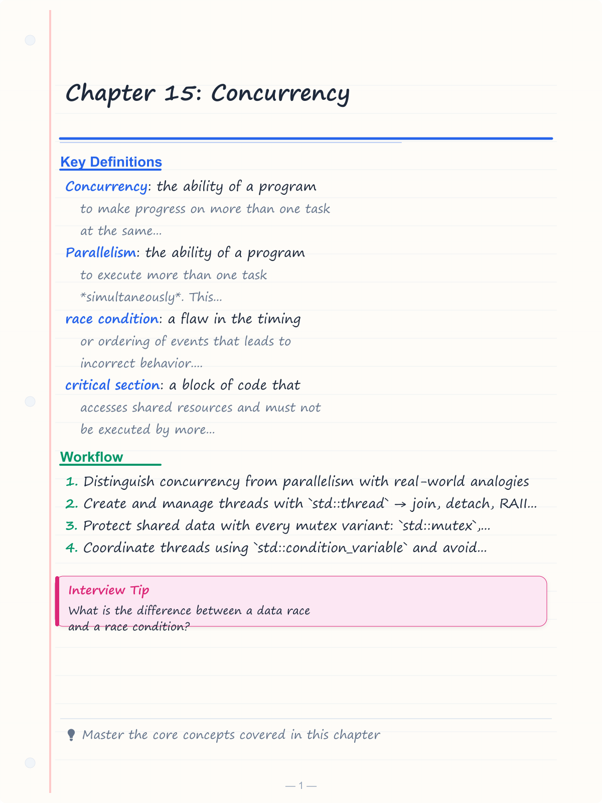
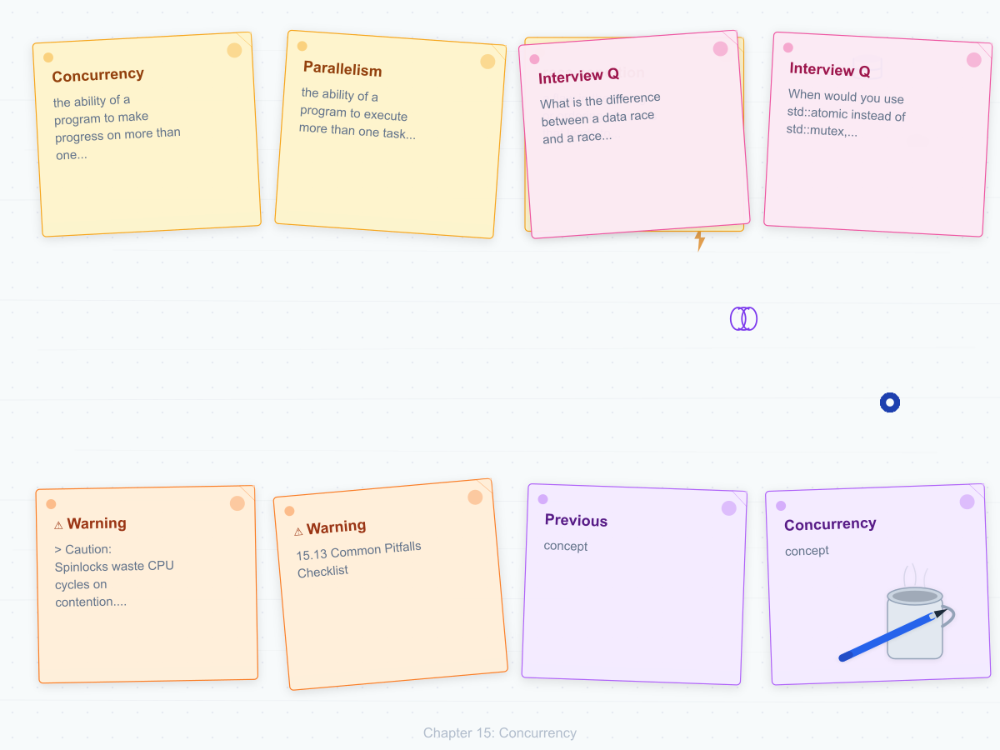
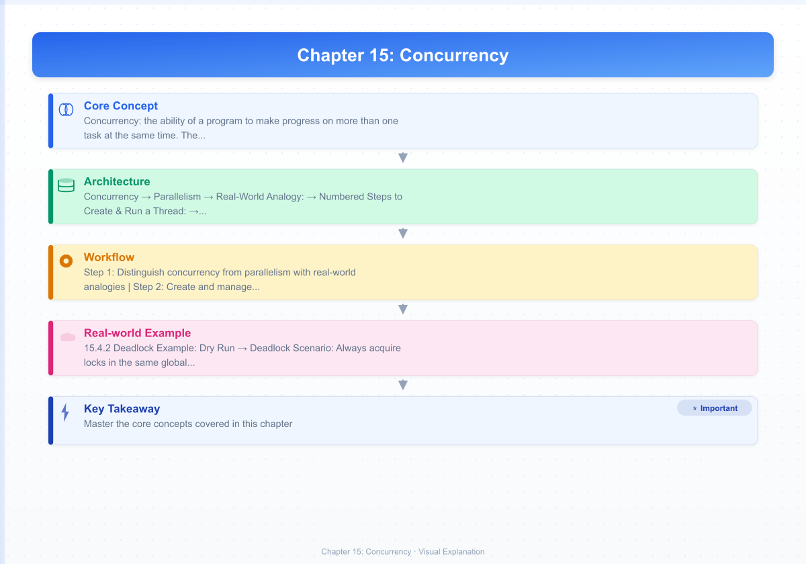
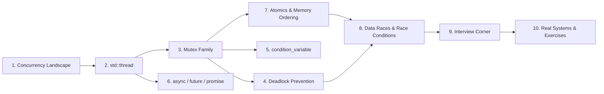

# Chapter 15: Concurrency

> **Previous:** [14-lambdas](./14-lambdas.md) | **Next:** [16-design-patterns](./16-design-patterns.md)

## Learning Objectives

After studying this chapter, students will be able to:

<!-- Image Gallery -->
<section class="lesson-visuals" aria-label="Visual learning resources">
  <header><span>VISUAL LEARNING</span><h2>See it. Review it. Remember it.</h2></header>
  <a class="lesson-visual-card" href="../../assets/images/lessons/oop-cpp/15-concurrency/handwritten-notes.png" target="_blank" rel="noopener">
    
    <span><strong>Handwritten notes</strong>Condensed notes for deliberate review.</span>
  </a>
  <a class="lesson-visual-card" href="../../assets/images/lessons/oop-cpp/15-concurrency/sticky-notes.png" target="_blank" rel="noopener">
    
    <span><strong>Sticky-note revision</strong>Fast recall prompts for revision.</span>
  </a>
  <a class="lesson-visual-card" href="../../assets/images/lessons/oop-cpp/15-concurrency/visual-explanation.png" target="_blank" rel="noopener">
    
    <span><strong>Visual concept guide</strong>A connected explanation of the key ideas.</span>
  </a>
</section>
<!-- End Image Gallery -->


- Distinguish concurrency from parallelism with real-world analogies
- Create and manage threads with `std::thread` → join, detach, RAII wrapping
- Protect shared data with every mutex variant: `std::mutex`, `lock_guard`, `unique_lock`, `scoped_lock`, `timed_mutex`, `recursive_mutex`
- Coordinate threads using `std::condition_variable` and avoid spurious wakeups
- Launch asynchronous tasks with `std::async`, `std::future`, `std::promise`, `std::packaged_task`
- Use `std::atomic` for lock-free operations and understand C++ memory ordering
- Diagnose and prevent data races, race conditions, and deadlocks
- Answer interview questions on concurrency, atomics, and lock-free programming

## Chapter at a Glance

| Topic | Key Insight | Practical Takeaway |
|-------|-------------|-------------------|
| **Concurrency vs Parallelism** | Concurrency is about structure; parallelism is about execution | Concurrency enables parallelism on multi-core |
| **std::thread** | Join or detach every thread before destruction | Store thread objects in RAII wrappers |
| **Mutex Family** | 5 mutex types serve different locking needs | Prefer scoped_lock (C++17) for multiple locks |
| **condition_variable** | Wait for condition; spurious wakeups are real | Always pass a predicate to wait() |
| **async/future/promise** | Highest-level primitive: launch policy + future result | Prefer async over manual threads for tasks |
| **Atomics & Memory Ordering** | Lock-free ops on fundamental types; 6 memory orders | Use seq_cst unless profiling says otherwise |
| **Deadlock Prevention** | Lock ordering, std::lock, scoped_lock | Never hold one lock while waiting for another |

## Chapter Roadmap



---

## 15.1 Introduction to Concurrency

### What is Concurrency?


**Concurrency** is the ability of a program to make progress on more than one task at the same time. The tasks may not execute simultaneously → they just need to appear to. Concurrency is a *design property* of the program.

> **Real-World Analogy:** A single chef in a kitchen chopping vegetables, stirring a pot, and answering the phone. The chef switches between tasks (interleaving), making progress on all of them. Only one task runs at any instant, but all move forward.

### What is Parallelism?


**Parallelism** is the ability of a program to execute more than one task *simultaneously*. This requires multiple cores or processors.

> **Real-World Analogy:** Three chefs in the same kitchen → one chops, one stirs, one answers the phone. All three tasks run at the same time on different hardware resources.

### Concurrency vs Parallelism → Detailed Comparison


| Aspect | Concurrency | Parallelism |
|--------|-------------|-------------|
| **Definition** | Multiple tasks making progress via interleaving | Multiple tasks executing at the exact same instant |
| **Focus** | Program structure and design | Execution efficiency and throughput |
| **Hardware needed** | Single core suffices | Multiple cores required |
| **Execution** | Logical simultaneity | Physical simultaneity |
| **Goal** | Responsiveness, non-blocking UI | Throughput, speedup |
| **Example** | A web server handling 10,000 connections on 4 threads | A matrix multiply split across 8 GPU cores |
| **C++ primitive** | std::thread (time-sliced) | std::async(launch::async) on multi-core |
| **OS scheduling** | Time-sliced context switching | Simultaneous execution on separate cores |
| **Key challenge** | Correct synchronization | Load balancing, scaling |
| **Can exist without the other?** | Yes → single-core preemptive multitasking | Yes → SIMD vector instructions on one thread |

> **Core Insight:** Concurrency *enables* parallelism. A program structured concurrently (split into independent tasks) can be parallelized when more cores become available. A program not designed for concurrency cannot exploit parallelism.

### Why C++ Concurrency Matters


Before C++11, threading was platform-specific (pthreads on POSIX, Windows Threads on Win32). C++11 introduced a standardized memory model and threading library that guarantees portable, well-defined behavior across all architectures.

| Era | Threading Mechanism | Portability |
|-----|-------------------|-------------|
| Pre-C++11 | pthreads, Win32 API, Boost.Thread | None → vendor lock-in |
| C++11 | std::thread, std::mutex, std::atomic | Full → same API everywhere |
| C++14 | Shared locking, reader-writer mutex | Backward compatible |
| C++17 | std::scoped_lock, std::shared_mutex | Multiple lock RAII |
| C++20 | std::jthread, std::stop_source, std::atomic_ref | Automatic joining, cooperative cancellation |

### The Two Fundamental Problems


1. **Data Race:** Two or more threads access the same memory location concurrently, at least one is a write, and there is no synchronization.
2. **Deadlock:** Two or more threads are each waiting for a resource the other holds, so none can proceed.

Every concurrency technique in this chapter exists to solve these two problems.

---

## 15.2 std::thread → Deep Dive

### 15.2.1 Creating Threads


`std::thread` represents a single thread of execution. You construct it with a callable and its arguments.

**Real-World Analogy:** A restaurant manager (main thread) hires a new chef (std::thread). The chef works independently. The manager can either wait for the chef to finish (join) or let the chef work unsupervised (detach).

**Numbered Steps to Create & Run a Thread:**

1. Include `<thread>` header
2. Define a callable (function, functor, lambda, or member function)
3. Construct `std::thread` passing the callable + arguments
4. The thread starts executing *immediately* upon construction
5. Call `join()` to block until completion, or `detach()` to release ownership
6. A thread that is neither joined nor detached causes `std::terminate()` at destruction

**Pseudocode:**

```
FUNCTION worker(id, message):
    PRINT "Thread " + id + " says: " + message
END FUNCTION

MAIN:
    t1 = THREAD(worker, 1, "Hello")
    t2 = THREAD([id = 2] { PRINT "Lambda from thread " + id })
    
    t1.join()    // wait for t1
    t2.join()    // wait for t2
    PRINT "All threads done"
END MAIN
```

**C++ Code → Four Ways to Create a Thread:**

```cpp
#include <thread>
#include <iostream>
#include <vector>

// 1. Function pointer
void worker(int id, const std::string& msg) {
    std::cout << "Thread " << id << ": " << msg
              << " [ID=" << std::this_thread::get_id() << "]\n";
}

// 2. Functor (function object)
class WorkerFunctor {
    int id_;
public:
    explicit WorkerFunctor(int id) : id_(id) {}
    void operator()(int repeat) const {
        for (int i = 0; i < repeat; ++i)
            std::cout << "Functor " << id_ << " iteration " << i << '\n';
    }
};

int main() {
    // Method 1: Function pointer
    std::thread t1(worker, 1, "Function pointer");

    // Method 2: Functor
    WorkerFunctor wf(2);
    std::thread t2(wf, 3);

    // Method 3: Lambda
    std::thread t3([](int x) {
        std::cout << "Lambda: " << x << " squared = " << (x * x) << '\n';
    }, 7);

    // Method 4: Member function
    class Greeter {
    public:
        void greet(const std::string& name) const {
            std::cout << "Hello, " << name << "! from thread\n";
        }
    };
    Greeter g;
    std::thread t4(&Greeter::greet, &g, "Alice");

    t1.join(); t2.join(); t3.join(); t4.join();
    std::cout << "Main: all threads joined\n";
    return 0;
}
```

**Output:**
```
Thread 1: Function pointer [ID=140703526035520]
Functor 2 iteration 0
Functor 2 iteration 1
Functor 2 iteration 2
Lambda: 7 squared = 49
Hello, Alice! from thread
Main: all threads joined
```

> **Note:** Output interleaving may differ across runs due to OS scheduling.

### 15.2.2 join() vs detach() → Thread Lifecycle


| Operation | Behavior | When to Use |
|-----------|----------|-------------|
| `join()` | Blocks caller until thread finishes | You need the result before proceeding |
| `detach()` | Releases thread handle; thread runs independently | Fire-and-forget background work |
| `joinable()` | Returns true if join/detach is valid | Check before calling join/detach |

**Thread Lifecycle State Machine:**

```
  Created (joinable=true)
     / \
    /   \
  join() detach()
    |       |
  Blocked  Not-joinable
    |       (runs independently)
  Resumed
    |
  Not-joinable (thread done)
```

**C++ Code → join() vs detach():**

```cpp
#include <thread>
#include <iostream>
#include <chrono>

void background_work() {
    std::this_thread::sleep_for(std::chrono::seconds(2));
    std::cout << "Background work done\n";
}

int main() {
    // Example 1: join() - wait for completion
    std::thread t1(background_work);
    std::cout << "Waiting for t1...\n";
    t1.join();
    std::cout << "t1 joined\n";

    // Example 2: detach() - let it run independently
    std::thread t2(background_work);
    t2.detach();
    std::cout << "t2 detached, main continues\n";

    // t2 may still be running here; main may finish before t2
    std::this_thread::sleep_for(std::chrono::seconds(1));
    std::cout << "Main ending (t2 may still run)\n";
    return 0;
}
```

**Output:**
```
Waiting for t1...
Background work done
t1 joined
t2 detached, main continues
Main ending (t2 may still run)
```

### 15.2.3 RAII Wrapper for std::thread


Manually ensuring every thread is joined or detached is error-prone (especially with exceptions). An RAII wrapper automates this:

```cpp
#include <thread>
#include <iostream>
#include <stdexcept>

class ThreadGuard {
    std::thread t_;
public:
    explicit ThreadGuard(std::thread t) : t_(std::move(t)) {
        if (!t_.joinable())
            throw std::logic_error("Non-joinable thread");
    }
    ~ThreadGuard() {
        if (t_.joinable())
            t_.join();   // automatically join on destruction
    }
    // Non-copyable, non-movable
    ThreadGuard(const ThreadGuard&) = delete;
    ThreadGuard& operator=(const ThreadGuard&) = delete;
};

void risky_work() {
    std::cout << "Working...\n";
    // Might throw
}

int main() {
    try {
        ThreadGuard tg(std::thread(risky_work));
        // If risky_work throws, ThreadGuard destructor still joins
        throw std::runtime_error("Something went wrong");
    } catch (const std::exception& e) {
        std::cout << "Caught: " << e.what() << " (thread was joined)\n";
    }
    return 0;
}
```

**Output:**
```
Working...
Caught: Something went wrong (thread was joined)
```

> **C++20:** `std::jthread` (joining thread) does this automatically → its destructor calls `join()`. It also supports cooperative cancellation via `std::stop_token`.

### 15.2.4 std::this_thread Utilities


| Function | Purpose |
|----------|---------|
| `get_id()` | Returns `std::thread::id` of the calling thread |
| `sleep_for(duration)` | Blocks for at least the specified duration |
| `sleep_until(timepoint)` | Blocks until the specified absolute time |
| `yield()` | Hints the scheduler to reschedule (useful in spin-loops) |

**C++ Code → Getting Thread ID and Hardware Concurrency:**

```cpp
#include <thread>
#include <iostream>

void print_id() {
    std::cout << "Thread ID: " << std::this_thread::get_id() << '\n';
}

int main() {
    std::thread t1(print_id);
    std::thread t2(print_id);

    std::cout << "Main thread ID: " << std::this_thread::get_id() << '\n';
    std::cout << "Hardware concurrency: " << std::thread::hardware_concurrency()
              << " cores\n";

    t1.join();
    t2.join();
    return 0;
}
```

### 15.2.5 Edge Cases with std::thread


| Edge Case | What Happens | Solution |
|-----------|-------------|----------|
| Double join | Undefined behavior (crash) | Check `joinable()` before join |
| Destructor on joinable thread | `std::terminate()` called | Always join or detach before destruction |
| Detached thread accessing destroyed locals | Data race, undefined behavior | Pass arguments by value, use shared_ptr |
| Too many threads | `std::system_error` thrown | Cap thread count by `hardware_concurrency()` |
| Exception in thread | Exception cannot propagate | Catch inside thread, return via future/promise |

**C++ Code → Avoiding Double Join:**

```cpp
#include <thread>
#include <iostream>

int main() {
    std::thread t([]{ std::cout << "Working\n"; });

    if (t.joinable()) t.join();   // safe
    if (t.joinable()) t.join();   // safe → second call does nothing
    // Without the check: t.join() on non-joinable thread = crash
    return 0;
}
```

### 15.2.6 Dry Run → Interleaved Thread Execution


Consider two threads incrementing a shared counter without mutex protection:

| Time | Thread A | Thread B | counter value |
|------|----------|----------|---------------|
| T0 | read counter (0) | | 0 |
| T1 | | read counter (0) | 0 |
| T2 | increment to 1 | | 0 |
| T3 | | increment to 1 | 1 (should be 2!) |
| T4 | write back 1 | | 1 |
| T5 | | write back 1 | 1 |

The lost update at T3 is a **data race**. Both threads read 0 before either writes, so one increment is lost.

### 15.2.7 Complexity Analysis


| Operation | Time Complexity | Space Complexity |
|-----------|----------------|-----------------|
| Creating a thread | O(1) thread creation + OS scheduling overhead | ~1 MB per thread (default stack size) |
| join() | O(1) blocking → thread must complete | 0 (existing thread stack) |
| detach() | O(1) handle release | Thread continues until completion |
| Context switch (per switch) | ~1–10 microseconds | ~cache flush, TLB invalidate |

> **Rule of Thumb:** Creating threads is expensive. For fine-grained tasks, use a thread pool or `std::async`.

---

## 15.3 Mutex Family → Complete Reference

### 15.3.1 std::mutex → The Foundation


`std::mutex` provides **mutual exclusion**: only one thread can hold the lock at a time.

**Real-World Analogy:** A public restroom with one stall. A person locks the door, uses the facility, then unlocks. Others wait outside until it's free.

**Pseudocode:**

```
mutex mtx
shared data = 0

FUNCTION increment():
    FOR i = 1 TO 100000:
        mtx.lock()
        data = data + 1
        mtx.unlock()
    END FOR
END FUNCTION

MAIN:
    t1 = THREAD(increment)
    t2 = THREAD(increment)
    t1.join()
    t2.join()
    PRINT data    // always 200000
END MAIN
```

**C++ Code → Manual Lock/Unlock (NOT recommended):**

```cpp
#include <mutex>
#include <thread>
#include <iostream>

std::mutex mtx;
int counter = 0;

void increment() {
    for (int i = 0; i < 100000; ++i) {
        mtx.lock();
        ++counter;          // protected access
        mtx.unlock();
    }
}

int main() {
    std::thread t1(increment);
    std::thread t2(increment);
    t1.join();
    t2.join();
    std::cout << "Counter: " << counter << '\n';  // 200000
    return 0;
}
```

> **WARNING:** Manual lock/unlock is exception-unsafe. If `++counter` throws, `unlock()` never runs → deadlock. Always use RAII wrappers.

### 15.3.2 std::lock_guard → Basic RAII Lock


`std::lock_guard` locks the mutex on construction and unlocks on destruction. Simplest and most efficient RAII wrapper.

**C++ Code → lock_guard:**

```cpp
#include <mutex>
#include <thread>
#include <iostream>

std::mutex mtx;
int safe_counter = 0;

void safe_increment() {
    for (int i = 0; i < 100000; ++i) {
        std::lock_guard<std::mutex> lock(mtx);
        // mtx.lock() called here
        ++safe_counter;
    }   // mtx.unlock() called here (even if ++ throws)
}

int main() {
    std::thread t1(safe_increment);
    std::thread t2(safe_increment);
    t1.join();
    t2.join();
    std::cout << "Safe counter: " << safe_counter << '\n';
    return 0;
}
```

**Output:** `Safe counter: 200000`

**Properties:**
- Non-copyable, non-movable
- Constructor: locks mutex (blocks if already locked)
- Destructor: unlocks mutex
- No additional operations (no lock/unlock methods)
- Best for: simple scoped locking where you never need manual unlock

### 15.3.3 std::unique_lock → Flexible RAII Lock


`std::unique_lock` provides everything `lock_guard` does, plus:
- Deferred locking (construct without locking)
- Manual `lock()` / `unlock()` on the same object
- Can be moved (ownership transfer)
- Required by `std::condition_variable::wait()`

**C++ Code → unique_lock Features:**

```cpp
#include <mutex>
#include <thread>
#include <iostream>
#include <chrono>

std::mutex mtx;
int data = 0;

void deferred_lock_example() {
    // Construct without locking
    std::unique_lock<std::mutex> lock(mtx, std::defer_lock);
    // Do some work that doesn't need the lock
    std::cout << "Preparing...\n";
    // Now lock
    lock.lock();
    ++data;
    // Explicitly unlock early (releases before scope ends)
    lock.unlock();
    std::cout << "Unlocked early, doing other work...\n";
    // Re-lock if needed
    lock.lock();
    ++data;
    // Auto-unlocks on destruction
}

void try_lock_example() {
    std::unique_lock<std::mutex> lock(mtx, std::try_to_lock);
    if (lock.owns_lock()) {
        ++data;
        std::cout << "Got the lock\n";
    } else {
        std::cout << "Could not get the lock\n";
    }
}

int main() {
    std::thread t1(deferred_lock_example);
    std::thread t2(try_lock_example);
    t1.join(); t2.join();
    return 0;
}
```

**unique_lock Deferral Defer Types:**

| Defer Type | Behavior |
|------------|----------|
| `std::defer_lock` | Do not lock; call `lock()` manually later |
| `std::try_to_lock` | Call `try_lock()`; check `owns_lock()` |
| `std::adopt_lock` | Assume caller already holds the lock |

**Comparison of Lock Wrappers:**

| Feature | lock_guard | unique_lock | scoped_lock (C++17) |
|---------|------------|-------------|---------------------|
| RAII lock/unlock | Yes | Yes | Yes |
| Manual lock/unlock | No | Yes | No |
| Movable | No | Yes | No |
| Condition variable support | No | Yes | No |
| Multiple mutex lock | No | No | Yes (variadic) |
| Deferred locking | No | Yes | No |
| try_lock support | No | Yes | No |
| Overhead | Minimal (same as mutex) | Slightly larger (state flag) | Minimal |

### 15.3.4 std::scoped_lock (C++17) → Deadlock-Free Multi-Lock


`std::scoped_lock` locks multiple mutexes at once using a deadlock-avoidance algorithm (like `std::lock`).

**C++ Code → scoped_lock:**

```cpp
#include <mutex>
#include <thread>
#include <iostream>

std::mutex mtx1, mtx2;
int a = 0, b = 0;

void write_both() {
    // Locks mtx1 and mtx2 atomically → no deadlock even if
    // another thread locks in opposite order
    std::scoped_lock lock(mtx1, mtx2);
    ++a;
    ++b;
}

int main() {
    std::thread t1(write_both);
    std::thread t2(write_both);
    t1.join(); t2.join();
    std::cout << "a=" << a << " b=" << b << '\n';
    return 0;
}
```

### 15.3.5 std::timed_mutex → Lock with Timeout


`std::timed_mutex` extends mutex with `try_lock_for()` and `try_lock_until()`.

**Real-World Analogy:** A meeting room reservation → you wait for the room, but only for 10 seconds. If it's still occupied, you go to plan B.

**C++ Code → timed_mutex:**

```cpp
#include <mutex>
#include <thread>
#include <iostream>
#include <chrono>

std::timed_mutex tmtx;

void try_for_100ms() {
    // Try to acquire lock within 100ms
    if (tmtx.try_lock_for(std::chrono::milliseconds(100))) {
        std::cout << "Thread " << std::this_thread::get_id()
                  << " acquired lock, working...\n";
        std::this_thread::sleep_for(std::chrono::milliseconds(200));
        tmtx.unlock();
    } else {
        std::cout << "Thread " << std::this_thread::get_id()
                  << " could not acquire lock within 100ms\n";
    }
}

int main() {
    std::thread t1(try_for_100ms);
    std::thread t2(try_for_100ms);
    t1.join(); t2.join();
    return 0;
}
```

**Possible Output:**
```
Thread 140703526035520 acquired lock, working...
Thread 140703517642816 could not acquire lock within 100ms
```

### 15.3.6 std::recursive_mutex → Reentrant Locking


Allows the same thread to lock the mutex multiple times without deadlocking. A count is maintained; unlock must be called the same number of times.

**Real-World Analogy:** A reentrant bathroom lock → if you're already inside, you can lock the inner latch again without waiting for yourself.

**C++ Code → recursive_mutex:**

```cpp
#include <mutex>
#include <thread>
#include <iostream>

std::recursive_mutex rmtx;

void recursive_function(int depth) {
    if (depth <= 0) return;
    std::lock_guard<std::recursive_mutex> lock(rmtx);
    std::cout << "Depth " << depth << " locked\n";
    recursive_function(depth - 1);
    std::cout << "Depth " << depth << " unlocked\n";
}

int main() {
    std::thread t(recursive_function, 3);
    t.join();
    return 0;
}
```

**Output:**
```
Depth 3 locked
Depth 2 locked
Depth 1 locked
Depth 1 unlocked
Depth 2 unlocked
Depth 3 unlocked
```

> **When to use:** When a function that acquires a lock may call another function that also needs the same lock (e.g., recursive tree traversal with thread-safe node access). **When NOT to use:** As a default → prefer non-recursive mutexes to enforce simpler lock discipline.

### 15.3.7 Mutex Types → Complete Comparison


| Feature | mutex | timed_mutex | recursive_mutex | shared_mutex (C++17) | shared_timed_mutex (C++14) |
|---------|-------|-------------|-----------------|----------------------|---------------------------|
| Exclusive locking | Yes | Yes | Yes | Yes | Yes |
| Shared (read) locking | No | No | No | Yes | Yes |
| try_lock | Yes | Yes | Yes | Yes | Yes |
| try_lock_for / try_lock_until | No | Yes | No | No | Yes |
| Reentrant (same thread) | No | No | Yes | No | No |
| Overhead | Minimal | Slightly higher | Higher (count tracking) | Higher (reader tracking) | Highest |
| Use case | Simple mutual exclusion | Operations with timeouts | Recursive functions | Reader-writer scenarios | Reader-writer + timeout |

## 15.4 Deadlock Prevention → Systematic Approach

### 15.4.1 What is Deadlock?


A **deadlock** occurs when two or more threads are each waiting for a resource the other holds, so neither can proceed.

**Real-World Analogy:** Two cars meet at a four-way intersection. Car A needs to go right, car B needs to go left. Each waits for the other to go first. Neither can move.

**The Four Coffman Conditions** (all four must hold for deadlock):

1. **Mutual Exclusion:** Resources cannot be shared
2. **Hold and Wait:** A thread holds at least one resource while waiting for another
3. **No Preemption:** Resources cannot be forcibly taken away
4. **Circular Wait:** A cycle of threads exists where each holds a resource the next needs

Breaking any one condition prevents deadlock. In practice, we break **circular wait**.

### 15.4.2 Deadlock Example


```cpp
#include <mutex>
#include <thread>
#include <iostream>
#include <chrono>

std::mutex fork_left, fork_right;

void philosopher_left_handed(int id) {
    // Locks left then right → can deadlock with right-handed
    std::lock_guard<std::mutex> left(fork_left);
    std::this_thread::sleep_for(std::chrono::milliseconds(100));
    std::lock_guard<std::mutex> right(fork_right);
    std::cout << "Philosopher " << id << " eating\n";
}

void philosopher_right_handed(int id) {
    // Locks right then left → opposite order!
    std::lock_guard<std::mutex> right(fork_right);
    std::this_thread::sleep_for(std::chrono::milliseconds(100));
    std::lock_guard<std::mutex> left(fork_left);
    std::cout << "Philosopher " << id << " eating\n";
}

// This WILL deadlock → threads acquire in opposite order
```

**Dry Run → Deadlock Scenario:**

| Time | Thread A (left-handed) | Thread B (right-handed) |
|------|----------------------|----------------------|
| T0 | Locks fork_left | Locks fork_right |
| T1 | Sleeps (100ms) | Sleeps (100ms) |
| T2 | Tries to lock fork_right → BLOCKED | Tries to lock fork_left → BLOCKED |
| T3 | **DEADLOCK** | **DEADLOCK** |

### 15.4.3 Strategy 1: Consistent Lock Ordering


Always acquire locks in the same global order across all threads.

**C++ Code → Fixed Ordering:**

```cpp
std::mutex mtx_a, mtx_b;  // always lock A then B

void safe_thread_a() {
    std::lock_guard<std::mutex> lock1(mtx_a);
    std::lock_guard<std::mutex> lock2(mtx_b);
    // work
}

void safe_thread_b() {
    std::lock_guard<std::mutex> lock1(mtx_a);  // same order!
    std::lock_guard<std::mutex> lock2(mtx_b);
    // work
}
```

> **Problem:** Requires global discipline. Easy to screw up in large codebases.

### 15.4.4 Strategy 2: std::lock → Atomic Multi-Lock


`std::lock(m1, m2, ...)` locks all mutexes atomically using a deadlock-avoidance algorithm (try_lock in various orders, backing off on contention).

**C++ Code → std::lock with adopt_lock:**

```cpp
#include <mutex>
#include <thread>
#include <iostream>

std::mutex m1, m2;

void safe_op() {
    // Lock both mutexes atomically (deadlock-free)
    std::lock(m1, m2);

    // Adopt the already-locked mutexes into RAII wrappers
    std::lock_guard<std::mutex> lk1(m1, std::adopt_lock);
    std::lock_guard<std::mutex> lk2(m2, std::adopt_lock);

    // Perform work holding both locks
    std::cout << "Both locks held safely\n";
}

int main() {
    std::thread t1(safe_op);
    std::thread t2(safe_op);
    t1.join(); t2.join();
    return 0;
}
```

### 15.4.5 Strategy 3: std::scoped_lock (C++17) → The Cleanest Way


`std::scoped_lock` wraps `std::lock` internally. No need for adopt_lock:

```cpp
#include <mutex>
#include <thread>
#include <iostream>

std::mutex m1, m2, m3;

void super_safe() {
    // Locks all three atomically; unlocks on scope exit
    std::scoped_lock lock(m1, m2, m3);
    std::cout << "All three locks held\n";
}
```

> **Prefer scoped_lock for multiple locks.** It's the simplest, most correct solution.

### 15.4.6 Strategy 4: Lock Hierarchies


Assign levels to mutexes and enforce that a thread can only lock mutexes with strictly decreasing levels.

| Level | Mutex | Protected Data |
|-------|-------|---------------|
| 10 | mtx_global_config | System configuration |
| 20 | mtx_session_list | Active user sessions |
| 30 | mtx_user_profile | User profile data |

A thread holding level-20 can only lock level-30 or higher numbers (never level-10).

### 15.4.7 Deadlock Prevention → Quick Reference


| Strategy | Technique | C++ Tool | Complexity |
|----------|-----------|----------|------------|
| Consistent ordering | Always lock A before B | Manual discipline | Easy to break |
| Atomic multi-lock | Lock all at once | `std::lock(m1, m2, ...)` | Moderate |
| Scoped multi-lock | RAII variadic lock | `std::scoped_lock(m1, m2, ...)` | Easiest (C++17) |
| Lock hierarchy | Level-numbered mutexes | Custom assertion wrapper | Hardest but most scalable |
| Avoid nested locks | Restructure code | No tool needed | Requires design effort |

---

## 15.5 std::condition_variable → Thread Coordination

### 15.5.1 The Problem


One thread produces data; another consumes it. The consumer must wait when the queue is empty, and the producer must notify when new data arrives.

**Real-World Analogy:** A coffee shop with one barista and one customer. The barista (producer) makes coffee and yells "Order up!" (notification). The customer (consumer) waits at the counter until called. If the customer checks every 2 seconds without being called, that's **busy-waiting** (wasteful). The condition variable lets the customer sleep until notified.

### 15.5.2 Core Concepts


| Concept | Description |
|---------|-------------|
| `wait(lock, predicate)` | Atomically unlock, sleep until notified, re-lock, check predicate |
| `notify_one()` | Wake one waiting thread (if any) |
| `notify_all()` | Wake all waiting threads |
| Spurious wakeup | Thread may wake without notification → always use predicate |
| `unique_lock` requirement | `wait()` must lock/unlock repeatedly; `lock_guard` cannot |

**Pseudocode:**

```
mutex mtx
condition_variable cv
queue q

PRODUCER:
    FOR i = 1 TO 10:
        LOCK mtx
        q.push(i)
        UNLOCK mtx
        cv.notify_one()
        sleep(50ms)
    END FOR

CONSUMER:
    WHILE true:
        UNIQUE_LOCK lock(mtx)
        cv.wait(lock, [&]{ return !q.empty(); })
        // Auto-unlocked while sleeping, re-locked on wake
        val = q.front()
        q.pop()
        lock.unlock()
        process(val)
        IF val == 9: BREAK
```

**C++ Code → Producer-Consumer with condition_variable:**

```cpp
#include <condition_variable>
#include <mutex>
#include <queue>
#include <thread>
#include <iostream>
#include <chrono>

std::queue<int> queue;
std::mutex mtx;
std::condition_variable cv;
bool done = false;

void producer() {
    for (int i = 0; i < 10; ++i) {
        {
            std::lock_guard<std::mutex> lock(mtx);
            queue.push(i);
            std::cout << "Produced: " << i << '\n';
        }   // mutex unlocked here
        cv.notify_one();                          // wake consumer
        std::this_thread::sleep_for(std::chrono::milliseconds(50));
    }
    {
        std::lock_guard<std::mutex> lock(mtx);
        done = true;
    }
    cv.notify_one();
}

void consumer() {
    while (true) {
        std::unique_lock<std::mutex> lock(mtx);
        // wait() atomically: unlock mutex, sleep, re-acquire mutex
        cv.wait(lock, [] { return !queue.empty() || done; });

        while (!queue.empty()) {
            int val = queue.front();
            queue.pop();
            lock.unlock();   // allow producer to push while we process
            std::cout << "Consumed: " << val << '\n';
            lock.lock();
        }

        if (done && queue.empty()) break;
    }
}

int main() {
    std::thread prod(producer);
    std::thread cons(consumer);
    prod.join();
    cons.join();
    return 0;
}
```

**Output:**
```
Produced: 0
Consumed: 0
Produced: 1
Consumed: 1
...
Produced: 9
Consumed: 9
```

### 15.5.3 Dry Run → condition_variable Wait Sequence


| Time | Producer | Consumer | Queue | Mutex State |
|------|----------|----------|-------|-------------|
| T0 | Push 0, notify_one | | [0] | Locked by producer |
| T1 | Unlock mutex | | [0] | Unlocked |
| T2 | Sleep 50ms | Wait: check predicate (!empty=true) | [0] | Locked by consumer |
| T3 | | Pop 0, unlock | [] | Unlocked |
| T4 | | Process 0 | | |
| T5 | Push 1, notify_one | | [1] | Locked by producer |
| T6 | Unlock, sleep | Wait: check (!empty=true) | [1] | Locked by consumer |

### 15.5.4 notify_one vs notify_all


| Aspect | notify_one | notify_all |
|--------|------------|------------|
| Wake count | Exactly one waiting thread (if any) | All waiting threads |
| Default choice | Yes (efficient, less contention) | When all waiters need to check |
| Use case | Single consumer, work queue | Multiple consumers, broadcast event |
| Risk | Thread can starve if that waiter misses | Thundering herd → overhead |

**C++ Code → notify_all for Broadcast:**

```cpp
#include <condition_variable>
#include <mutex>
#include <thread>
#include <iostream>

std::mutex mtx;
std::condition_variable cv;
bool ready = false;

void worker(int id) {
    std::unique_lock<std::mutex> lock(mtx);
    cv.wait(lock, [] { return ready; });
    std::cout << "Worker " << id << " starting\n";
}

int main() {
    std::thread workers[3];
    for (int i = 0; i < 3; ++i)
        workers[i] = std::thread(worker, i);

    std::this_thread::sleep_for(std::chrono::seconds(1));
    {
        std::lock_guard<std::mutex> lock(mtx);
        ready = true;
    }
    cv.notify_all();   // wake all workers

    for (auto& w : workers) w.join();
    return 0;
}
```

**Output:**
```
Worker 0 starting
Worker 1 starting
Worker 2 starting
```

### 15.5.5 Spurious Wakeups


The C++ standard allows `wait()` to return without a notification (spurious wakeup). Always use the predicate overload:

```cpp
// CORRECT: predicate handles spurious wakeups
cv.wait(lock, [] { return !queue.empty(); });

// WRONG: vulnerable to spurious wakeup
cv.wait(lock);   // may return even if queue is empty
```

### 15.5.6 Edge Cases


| Edge Case | Symptom | Fix |
|-----------|---------|-----|
| No predicate | Spurious wakeup reads empty queue | Always use predicate overload |
| notify before wait (lost wakeup) | Consumer sleeps forever | Ensure wait happens before first notify, or use predicate |
| Multiple consumers with notify_one | One consumer may starve | Use notify_all or fair scheduling |
| Exception in producer | Consumer waits forever | Use RAII or try/finally to always send notification |
| Predicate uses wrong lock | Data race on predicate check | Must be protected by the mutex passed to wait |

---

## 15.6 std::async, std::future, std::promise, std::packaged_task

### 15.6.1 std::async → The Easiest Async Task


`std::async` runs a function asynchronously and returns a `std::future` that will hold the result.

**Real-World Analogy:** You order a pizza for delivery. The pizzeria starts making it (async background work). You continue your day. When the doorbell rings, you pick up your pizza (future.get()).

**Pseudocode:**

```
FUNCTION slow_square(x):
    sleep(1 second)
    RETURN x * x

MAIN:
    future_result = ASYNC(slow_square, 42)
    PRINT "Computing..."       // runs immediately
    result = future_result.get()  // blocks until done
    PRINT result                // 1764
END MAIN
```

**C++ Code → async with Launch Policies:**

```cpp
#include <future>
#include <iostream>
#include <chrono>

int slow_add(int a, int b) {
    std::this_thread::sleep_for(std::chrono::seconds(1));
    return a + b;
}

int main() {
    // Launch policy: guaranteed async (new thread)
    auto f1 = std::async(std::launch::async, slow_add, 10, 20);

    // Launch policy: deferred (lazy → runs on get())
    auto f2 = std::async(std::launch::deferred, slow_add, 30, 40);

    // Launch policy: default (implementation chooses)
    auto f3 = std::async(slow_add, 50, 60);

    std::cout << "Waiting for results...\n";

    std::cout << "f1: " << f1.get() << '\n';   // blocks ~1s
    std::cout << "f2: " << f2.get() << '\n';   // runs here (no new thread)
    std::cout << "f3: " << f3.get() << '\n';

    return 0;
}
```

**Output:**
```
Waiting for results...
f1: 30
f2: 70
f3: 110
```

### 15.6.2 std::future → Getting the Result


- `get()` → blocks until result is ready (can only call once)
- `wait()` → blocks until ready, does not retrieve result
- `wait_for(duration)` → blocks with timeout, returns `future_status`
- `wait_until(timepoint)` → blocks with absolute timeout

**C++ Code → wait_for with Timeout:**

```cpp
#include <future>
#include <iostream>
#include <chrono>

int main() {
    auto fut = std::async(std::launch::async, [] {
        std::this_thread::sleep_for(std::chrono::seconds(3));
        return 42;
    });

    // Check every 100ms with timeout
    while (true) {
        auto status = fut.wait_for(std::chrono::milliseconds(100));
        if (status == std::future_status::ready) {
            std::cout << "Result: " << fut.get() << '\n';
            break;
        } else if (status == std::future_status::timeout) {
            std::cout << "Still waiting...\n";
        }
    }
    return 0;
}
```

### 15.6.3 std::shared_future → Multiple Waiters


Unlike `std::future` (move-only, get() once), `std::shared_future` is copyable and allows multiple threads to `get()` the same result.

```cpp
#include <future>
#include <thread>
#include <iostream>

int main() {
    std::promise<int> prom;
    std::shared_future<int> sf = prom.get_future().share();

    // Multiple threads can wait on the same shared_future
    auto worker = [sf](int id) {
        std::cout << "Worker " << id << " waiting...\n";
        int val = sf.get();
        std::cout << "Worker " << id << " got: " << val << '\n';
    };

    std::thread t1(worker, 1);
    std::thread t2(worker, 2);

    std::this_thread::sleep_for(std::chrono::seconds(1));
    prom.set_value(99);

    t1.join(); t2.join();
    return 0;
}
```

### 15.6.4 std::promise → Manual Value Channel


`std::promise<T>` provides a write end of a channel whose read end is `std::future<T>`.

**C++ Code → promise/future Channel:**

```cpp
#include <future>
#include <thread>
#include <iostream>
#include <chrono>
#include <exception>
#include <stdexcept>

void compute_sum(std::promise<int>&& prom, int a, int b) {
    try {
        if (a < 0 || b < 0)
            throw std::invalid_argument("Negative inputs not allowed");
        std::this_thread::sleep_for(std::chrono::milliseconds(500));
        prom.set_value(a + b);      // fulfill the promise
    } catch (...) {
        prom.set_exception(std::current_exception());  // propagate exception
    }
}

int main() {
    std::promise<int> prom;
    std::future<int> fut = prom.get_future();

    std::thread worker(compute_sum, std::move(prom), 10, 20);
    // prom MUST be moved → it is not copyable

    std::cout << "Waiting for result...\n";
    try {
        int result = fut.get();
        std::cout << "Result: " << result << '\n';
    } catch (const std::exception& e) {
        std::cout << "Caught: " << e.what() << '\n';
    }

    worker.join();
    return 0;
}
```

**Output:**
```
Waiting for result...
Result: 30
```

**Edge case with negative input:**
```
Waiting for result...
Caught: Negative inputs not allowed
```

### 15.6.5 std::packaged_task → Wrap Callable as Future


`std::packaged_task<Signature>` wraps any callable so its return value becomes a `std::future`.

```cpp
#include <future>
#include <thread>
#include <iostream>

int multiply(int a, int b) {
    return a * b;
}

int main() {
    // Wrap a function as a packaged_task
    std::packaged_task<int(int, int)> task(multiply);
    std::future<int> fut = task.get_future();

    // Execute on a thread
    std::thread t(std::move(task), 6, 7);
    // task is move-only

    std::cout << "6 * 7 = " << fut.get() << '\n';
    t.join();

    // Practical use: thread pool task queue
    std::packaged_task<int()> lambda_task([] { return 42; });
    auto fut2 = lambda_task.get_future();
    lambda_task();   // inline execution
    std::cout << "Lambda result: " << fut2.get() << '\n';

    return 0;
}
```

**Output:**
```
6 * 7 = 42
Lambda result: 42
```

### 15.6.6 async vs thread → Detailed Comparison


| Criterion | std::async | std::thread |
|-----------|------------|-------------|
| Return value | Returns `std::future<T>` → result accessible via get() | No return → must use promise, shared state, or output parameter |
| Exception handling | Exception captured in future, rethrown on get() | Exception terminates program unless caught inside thread |
| Resource management | Shared state auto-managed | Must join or detach manually |
| Number of threads | May use thread pool (implementation-dependent) | Always creates a new OS thread |
| Launch policy | `async`, `deferred`, or default | Always immediate execution |
| Overhead | Lower (may recycle threads) | Higher (always creates thread) |
| Best for | Task parallelism → compute a value in background | Fire-and-forget, I/O threads, long-running workers |
| Control | Limited → no way to cancel or pause thread | Full control (but you must manage lifetime) |

> **Rule of Thumb:** For any task that returns a value, prefer `std::async`. For long-running background threads (server accept loops, GUI event loops), use `std::thread`.

### 15.6.7 Complexity Analysis


| Operation | Time Complexity | Notes |
|-----------|----------------|-------|
| std::async | O(1) to launch + execution | May or may not create thread |
| future::get() | Blocks until result ready | O(execution time of the task) |
| promise::set_value() | O(1) + wake waiters | If thread waiting, it's scheduled |
| packaged_task | O(1) wrapping | Movable → cheap transfer |

## 15.7 std::atomic → Lock-Free Operations

### 15.7.1 What is an Atomic Operation?


An **atomic operation** is indivisible → no other thread can observe the operation in a partially-completed state.

**Real-World Analogy:** A bank ATM withdrawal: checking balance, deducting amount, dispensing cash. If you're interrupted between "check balance" and "deduct amount", two withdrawals could happen on the same balance. An atomic transaction prevents this.

### 15.7.2 Basic Usage


`std::atomic<T>` provides atomic operations on trivially-copyable types (integers, pointers, and custom trivially-copyable structs). On most platforms, operations on `std::atomic<int>` are lock-free (use CPU atomic instructions).

**C++ Code → Atomic Counter:**

```cpp
#include <atomic>
#include <thread>
#include <iostream>

std::atomic<int> counter{0};

void increment() {
    for (int i = 0; i < 100000; ++i) {
        counter.fetch_add(1, std::memory_order_relaxed);
    }
}

int main() {
    std::thread t1(increment);
    std::thread t2(increment);
    t1.join();
    t2.join();
    std::cout << "Counter: " << counter.load() << '\n';  // 200000
    return 0;
}
```

**Key Operations:**

| Operation | Syntax | Description |
|-----------|--------|-------------|
| Load | `x.load(order)` | Return the current value |
| Store | `x.store(val, order)` | Set the value |
| Exchange | `x.exchange(val, order)` | Set and return old value |
| Fetch Add | `x.fetch_add(n, order)` | x += n, return old value |
| Fetch Sub | `x.fetch_sub(n, order)` | x -= n, return old value |
| CAS (weak) | `x.compare_exchange_weak(expected, desired, order)` | If x==expected, set to desired (true); else expected = x (false). Weak may fail spuriously. |
| CAS (strong) | `x.compare_exchange_strong(expected, desired, order)` | Like weak but no spurious failure |

### 15.7.3 Atomic vs Mutex → Performance Comparison


| Aspect | std::atomic | std::mutex |
|--------|-------------|------------|
| Mechanism | CPU instruction (CAS, LL/SC) | OS kernel object |
| Overhead | 1–10 CPU cycles | ~50–1000 cycles (syscall on contention) |
| Blocking | Never blocks → spin retry on CAS | Blocks thread (context switch) |
| Suitable for | Simple counters, flags, single variables | Complex critical sections, multiple variables |
| Memory ordering | Explicit control (6 orders) | acquire/release semantics on lock/unlock |
| Compare-and-swap | Yes (compare_exchange) | No (would need separate variable under lock) |
| Lock-free | Usually (check is_lock_free()) | No → inherently blocking |
| Composition | Hard → lock-free data structures are difficult | Easy → just use mutex |

**C++ Code → Performance Comparison (Conceptual):**

```cpp
#include <atomic>
#include <mutex>
#include <thread>
#include <iostream>
#include <chrono>

constexpr int ITERATIONS = 10'000'000;

std::atomic<long long> atomic_counter{0};
std::mutex mtx;
long long mutex_counter = 0;

void atomic_worker() {
    for (int i = 0; i < ITERATIONS; ++i)
        atomic_counter.fetch_add(1, std::memory_order_relaxed);
}

void mutex_worker() {
    for (int i = 0; i < ITERATIONS; ++i) {
        std::lock_guard<std::mutex> lock(mtx);
        ++mutex_counter;
    }
}
```

Approximate results on modern hardware:
- **Atomic (relaxed):** ~50ms (2 threads × 10M increments each)
- **Mutex:** ~500ms (mutex ~10× slower for simple increments)

> **Key Insight:** Atomics are faster because they use CPU instructions with no OS involvement. But they only protect ONE variable. Mutexes can protect complex data structures spanning many variables.

### 15.7.4 Atomic Flag → Minimal Synchronization


`std::atomic_flag` is the simplest atomic type → guaranteed lock-free, supports only `test_and_set()` and `clear()`. Used to build spinlocks.

**C++ Code → Spinlock with atomic_flag:**

```cpp
#include <atomic>
#include <thread>
#include <iostream>

class Spinlock {
    std::atomic_flag flag = ATOMIC_FLAG_INIT;
public:
    void lock() {
        while (flag.test_and_set(std::memory_order_acquire))
            ;   // spin until we acquire
    }
    void unlock() {
        flag.clear(std::memory_order_release);
    }
};

Spinlock splock;
int shared_data = 0;

void spin_worker() {
    for (int i = 0; i < 100000; ++i) {
        splock.lock();
        ++shared_data;
        splock.unlock();
    }
}

int main() {
    std::thread t1(spin_worker);
    std::thread t2(spin_worker);
    t1.join(); t2.join();
    std::cout << "Spinlock result: " << shared_data << '\n';
    return 0;
}
```

> **Caution:** Spinlocks waste CPU cycles on contention. Use `std::mutex` unless you have extremely short critical sections and low contention.

---

## 15.8 Memory Ordering → The Heart of the C++ Memory Model

### 15.8.1 What is Memory Ordering?


Memory ordering controls how operations on different threads become visible to each other. Without ordering constraints, compilers and CPUs may reorder operations, leading to surprising results.

**Real-World Analogy:** A postcard (relaxed) vs a registered letter (sequentially consistent). With a postcard, you know you sent it, but the recipient might get it before or after other mail. With registered mail, delivery is tracked and ordered relative to other mail.

### 15.8.2 The Six Memory Orders


| Memory Order | Direction | Description | Cost |
|-------------|-----------|-------------|------|
| `memory_order_relaxed` | None | No ordering constraints; only atomicity guaranteed | Cheapest |
| `memory_order_consume` | Load → dependent | Deprecated; don't use | → |
| `memory_order_acquire` | Load → subsequent | Prevents reordering of later reads/writes before this load | Moderate |
| `memory_order_release` | Prior → store | Prevents reordering of earlier reads/writes after this store | Moderate |
| `memory_order_acq_rel` | Both | Acquire + release (for read-modify-write ops) | Moderate |
| `memory_order_seq_cst` | Global | Single total order across all threads | Most expensive |

### 15.8.3 Acquire-Release Semantics (The Key Concept)


| Operation | Prevents Reordering |
|-----------|-------------------|
| **acquire** (load) | Nothing BEFORE the load can be reordered AFTER the load |
| **release** (store) | Nothing AFTER the store can be reordered BEFORE the store |

**C++ Code → The Message Passing Pattern with acquire/release:**

```cpp
#include <atomic>
#include <thread>
#include <iostream>
#include <cassert>

std::atomic<bool> ready{false};
int data = 0;   // not atomic, but protected by ordering

void producer() {
    data = 42;                              // (1) plain store
    ready.store(true, std::memory_order_release);  // (2) release store
    // Barrier: (1) is visible to any thread that sees (2)
}

void consumer() {
    while (!ready.load(std::memory_order_acquire))  // (3) acquire load
        ;                                           // spin
    // Barrier: (3) sees (2), so (1) is guaranteed visible
    std::cout << "Data: " << data << '\n';          // (4) safe → prints 42
    // assert(data == 42);  // ALWAYS true
}

int main() {
    std::thread t1(producer);
    std::thread t2(consumer);
    t1.join(); t2.join();
    return 0;
}
```

**Dry Run → Acquire-Release Synchronization:**

| Time | Producer | Consumer |
|------|----------|----------|
| T0 | data = 42 | |
| T1 | ready.store(release) | |
| T2 | | ready.load(acquire) → true |
| T3 | | Read data → 42 (guaranteed) |

**Without acquire/release (using relaxed):**

| Time | Producer | Consumer |
|------|----------|----------|
| T0 | ready.store(relaxed, true) | |
| T1 | data = 42 | |
| T2 | | ready.load(relaxed) → true |
| T3 | | Read data → **??? 0 or 42** (undefined!) |

With `memory_order_relaxed`, the compiler/CPU could reorder T0 and T1. The consumer sees `ready==true` but reads `data==0`.

### 15.8.4 Sequentially Consistent Ordering


`memory_order_seq_cst` imposes a **single total order** across all threads. All threads observe all atomic operations in the same order. This is the default and the safest, but also the most expensive.

```cpp
#include <atomic>
#include <thread>
#include <iostream>

std::atomic<int> x{0}, y{0};

void thread_a() {
    x.store(1, std::memory_order_seq_cst);   // (1)
    y.store(1, std::memory_order_seq_cst);   // (2)
}

void thread_b() {
    int y_val = y.load(std::memory_order_seq_cst);  // (3)
    int x_val = x.load(std::memory_order_seq_cst);  // (4)
    // It is IMPOSSIBLE for (y_val == 1 && x_val == 0) with seq_cst
}

int main() {
    // Run multiple times → seq_cst guarantees single total order
    for (int i = 0; i < 1000; ++i) {
        x.store(0); y.store(0);
        std::thread t1(thread_a);
        std::thread t2(thread_b);
        t1.join(); t2.join();
    }
    return 0;
}
```

### 15.8.5 Relaxed Ordering → When It's Safe


`memory_order_relaxed` guarantees only atomicity (no torn reads/writes). No ordering across variables.

**Safe use cases:**
- Simple counters that don't synchronize other data
- Statistical counters (approximate values acceptable)
- Rate limiting / throttling counters

```cpp
#include <atomic>
#include <thread>
#include <iostream>

std::atomic<long long> total_requests{0};

void handle_request() {
    // No other data depends on this counter
    total_requests.fetch_add(1, std::memory_order_relaxed);
}

// Reader thread → may be slightly stale, but that's OK
void print_stats() {
    std::cout << "Total requests: "
              << total_requests.load(std::memory_order_relaxed) << '\n';
}
```

### 15.8.6 Memory Ordering → Summary Table


| Order | Load Behavior | Store Behavior | Use When |
|-------|---------------|----------------|----------|
| relaxed | No constraints | No constraints | Simple counters, stats |
| acquire | Prevents later ops from moving before | → | Reading a flag that synchronizes data |
| release | → | Prevents earlier ops from moving after | Writing a flag that synchronizes data |
| acq_rel | Same as acquire | Same as release | RMW ops (fetch_add, CAS) |
| seq_cst | Single total order | Single total order | Default; correctness first, optimize later |

> **Practical Advice:** Start with `memory_order_seq_cst`. Only downgrade to weaker orders when profiling shows a real performance bottleneck AND you deeply understand the memory model. Most code doesn't need anything weaker.

---

## 15.9 Data Races and Race Conditions

### 15.9.1 Data Race → The Definition


A **data race** occurs when:
1. Two or more threads access the **same memory location** concurrently
2. At least one access is a **write**
3. There is **no synchronization** (no mutex, no atomic ordering)

Data races are **undefined behavior** in C++. The program may crash, produce wrong results, or appear to work until the worst possible moment.

**C++ Code → Data Race (UB):**

```cpp
#include <thread>

// BAD: data race
int counter = 0;   // not atomic, not mutex-protected

void bad_increment() {
    for (int i = 0; i < 100000; ++i)
        ++counter;   // RACE: read-modify-write without sync
}

int main() {
    std::thread t1(bad_increment);
    std::thread t2(bad_increment);
    t1.join(); t2.join();
    // counter could be anything → UB
    return 0;
}
```

### 15.9.2 Race Condition → The Broader Concept


A **race condition** is a flaw in the timing or ordering of events that leads to incorrect behavior. All data races are race conditions, but not all race conditions are data races.

```cpp
#include <mutex>
#include <thread>
#include <iostream>
#include <chrono>

std::mutex mtx;
int balance = 100;

// Race condition: read-check-act sequence is not atomic
void withdraw_racy(int amount) {
    std::lock_guard<std::mutex> lock(mtx);
    // Even with mutex, the check-and-act is vulnerable
    if (balance >= amount) {       // check
        std::this_thread::sleep_for(std::chrono::milliseconds(1)); // window!
        balance -= amount;         // act
    }
}

// CORRECT → the check and act are protected as one atomic unit
void withdraw_correct(int amount) {
    std::lock_guard<std::mutex> lock(mtx);
    if (balance >= amount) {
        balance -= amount;         // still under same lock
    }
}

// But this is STILL a race condition if called from two threads:
// Thread A: withdraw 70
// Thread B: withdraw 60
// Both see balance=100, both pass the check, both subtract
// Result: -30 instead of correct 30 remaining
```

### 15.9.3 Race Condition Types


| Type | Description | Example |
|------|-------------|---------|
| **Check-then-act** | Read a value, then modify based on it | Balance withdrawal |
| **Read-modify-write** | Read, compute, write (non-atomic) | `++counter` |
| **Load-load** | Read two values that must be consistent | x and y coordinates |
| **Lost update** | Two updates overwrite each other | Two bank transfers |

### 15.9.4 Detecting Data Races


| Tool | Platform | Command |
|------|----------|---------|
| ThreadSanitizer (TSan) | Clang/GCC | `-fsanitize=thread` |
| Valgrind Helgrind | Linux | `valgrind --tool=helgrind ./a.out` |
| AddressSanitizer | Clang/GCC | `-fsanitize=address` (limited race detection) |
| Visual Studio | Windows | /RTCsu (runtime checks) |

**C++ Code → Compile with TSan:**

```bash
# Compile with ThreadSanitizer
g++ -fsanitize=thread -g -O1 -o program program.cpp
./program
```

### 15.9.5 Critical Section Concept


A **critical section** is a block of code that accesses shared resources and must not be executed by more than one thread at a time.

```
    Thread A                    Thread B
       |                          |
       |   [ENTRY: lock mutex]    |
       |                          |  [ENTRY: lock mutex]
       |   CRITICAL SECTION       |  BLOCKED (waiting)
       |   (protected code)       |     |
       |   [EXIT: unlock mutex]   |     |
       |                          |  [ENTRY: acquires lock]
       |                          |  CRITICAL SECTION
       |                          |  [EXIT: unlock mutex]
```

**Design Rules for Critical Sections:**
1. Keep critical sections as small as possible
2. Never call unknown code inside a critical section
3. Never block while holding a lock
4. Always use RAII lock wrappers

## 15.10 Interview Corner → Concurrency

### Q1: What is the difference between a data race and a race condition?


**Answer:**

A **data race** is specifically about unsynchronized concurrent access to the same memory (at least one write). It is **undefined behavior** in C++.

A **race condition** is a broader term for any flaw where the outcome depends on the timing or ordering of events. Not all race conditions involve data races.

**Data race example (UB):**
```cpp
int x = 0;       // not atomic
// Thread A: x = 1;
// Thread B: int y = x;
// Concurrent read + write of x with no mutex = DATA RACE
```

**Race condition without data race (logical flaw only):**
```cpp
std::mutex mtx;
int balance = 100;

// Thread A: if (balance >= 50) balance -= 50;
// Thread B: if (balance >= 80) balance -= 80;
// Both check pass (balance=100), both subtract.
// Mutex ensures no data race, but balance goes to -30 = RACE CONDITION
```

| | Data Race | Race Condition |
|---|-----------|----------------|
| Requires unsync'd memory access | Yes | No |
| Undefined behavior | Yes | No (logical error) |
| Detected by TSan | Yes | No |
| Example | Two threads increment unsync'd counter | Double withdrawal from bank account |

### Q2: When would you use std::atomic instead of std::mutex, and vice versa?


**Answer:**

Use **std::atomic** when:
- You need to protect a single variable (counter, flag, status)
- Performance is critical (mutex overhead is too high)
- You are implementing lock-free data structures
- You need memory ordering guarantees without full critical sections

Use **std::mutex** when:
- You need to protect multiple variables that must change atomically together
- The critical section is long or complex
- You need condition variables for coordination
- You need to block a thread (atomics spin → waste CPU)

**Decision flowchart:**

```
Single variable + simple operation? ───→ std::atomic
         ↓ No
Multiple variables must be consistent? ─→ std::mutex
         ↓ No
Performance-critical hot path? ────────→ std::atomic
         ↓ No
Default choice ────────────────────────→ std::mutex
```

### Q3: Explain the difference between std::lock_guard, std::unique_lock, and std::scoped_lock.


**Answer:**

| Feature | lock_guard (C++11) | unique_lock (C++11) | scoped_lock (C++17) |
|---------|-------------------|--------------------|--------------------|
| RAII lock/unlock | Yes | Yes | Yes |
| Manual lock/unlock | No | Yes | No |
| Move ownership | No | Yes | No |
| Condition variable | No | Yes (required by wait()) | No |
| Multiple mutexes | No | No | Yes (variadic) |
| Deferred locking | No | Yes (defer_lock) | No |
| try_lock | No | Yes (try_to_lock) | No |
| Overhead | Minimal | State flag (~1 byte) | Minimal |

**Rule of thumb:**
- **lock_guard** → simple single-mutex protection, no special needs
- **unique_lock** → need condition_variable, manual unlock, or move ownership
- **scoped_lock** → need multiple mutexes simultaneously (C++17+)

### Q4: What happens when a std::thread is destroyed while still joinable?


**Answer:** `std::terminate()` is called, which aborts the program.

```cpp
#include <thread>
#include <iostream>

int main() {
    std::thread t([]{ std::cout << "Working\n"; });
    // No join() or detach() → t is destroyed at end of scope
    return 0;   // std::terminate() called!
}
```

**Output:** `terminate called without an active exception`

**Prevention:**
```cpp
// Option 1: join before destruction
std::thread t([]{ /* ... */ });
t.join();                     // explicit wait

// Option 2: RAII wrapper (C++20: std::jthread)
class JoinGuard {
    std::thread t;
public:
    explicit JoinGuard(std::thread t_) : t(std::move(t_)) {}
    ~JoinGuard() { if (t.joinable()) t.join(); }
};

// Option 3: C++20 jthread
std::jthread jt([]{ /* ... */ });  // auto-joins on destruction
```

### Q5: Explain the ABA problem in the context of compare-and-swap.


**Answer:**

The **ABA problem** occurs with CAS operations when a memory location changes from A to B and back to A between two reads. The CAS sees "still A" and succeeds, but the data's structure has changed.

**Example (lock-free stack pop):**

```
Initial: Top → Node A → Node B → ...

Thread A reads Top = Node A, next = Node B
Thread A is preempted

Thread B pops Node A: Top = Node B
Thread B pops Node B: Top = Node A  (Node A was freed and reallocated!)
Thread B pushes new Node A (same address!)

Thread A resumes, CAS(top, Node A, Node B) → succeeds!
But Node B was already popped → corruption!
```

**Solutions:**
1. **Tagged pointers** → store a counter alongside the pointer (increment on each CAS)
2. **Hazard pointers** → mark nodes as "in-use" to prevent reclamation
3. **RCU (Read-Copy-Update)** → defer reclamation until all readers finish
4. **Use mutexes** → lock-free is hard; only do it when you absolutely must

### Q6: How does std::condition_variable::wait() work internally?


**Answer:**

`wait(lock, predicate)` does the following atomically:

1. **Increment an internal wait count** for the condition variable
2. **Unlock the mutex** (so other threads can modify shared state)
3. **Block** the thread (OS suspends it → no CPU consumed)
4. On wake (notification or spurious):
   - **Re-acquire the mutex** (may block if another thread holds it)
   - **Check the predicate** → if true, return; if false, go back to step 2

The key atomic operation is releasing the mutex and entering the wait state as one indivisible step. This **eliminates the lost wakeup problem** → if the producer notifies between the consumer's condition check and wait, the notification is missed.

```cpp
// Internally, wait(lock, pred) is equivalent to:
while (!pred()) {
    // Atomically: unlock(lock) + wait
    // On wake: lock(lock)
    // If spurious wakeup and !pred(): go back to sleep
}
```

### Q7: What is a spinlock and when would you use it?


**Answer:**

A **spinlock** is a lock where the waiting thread busy-loops ("spins") until the lock becomes available. It never blocks → the thread consumes CPU cycles while waiting.

```cpp
class Spinlock {
    std::atomic<bool> locked{false};
public:
    void lock() {
        while (locked.exchange(true, std::memory_order_acquire))
            ;   // spin
    }
    void unlock() {
        locked.store(false, std::memory_order_release);
    }
};
```

**When to use spinlocks:**
- Critical section is **very short** (< ~100 CPU cycles)
- **Low contention** (rarely contested)
- You cannot block (interrupt context, real-time constraints)

**When NOT to use spinlocks:**
- Longer critical sections (wastes CPU)
- High contention (many threads spinning = CPU meltdown)
- Single-core systems (spinner prevents holder from running!)

### Q8: How do you prevent deadlocks in C++?


**Answer:**

Five strategies, in order of preference:

1. **std::scoped_lock (C++17)** → lock multiple mutexes atomically:
   ```cpp
   std::scoped_lock lock(m1, m2, m3);   // deadlock-free
   ```

2. **std::lock** + adopt_lock (C++11 pre-scoped_lock):
   ```cpp
   std::lock(m1, m2);
   std::lock_guard lk1(m1, std::adopt_lock);
   std::lock_guard lk2(m2, std::adopt_lock);
   ```

3. **Consistent lock ordering** → always lock A before B:
   ```cpp
   // ALL threads must follow the same order
   std::lock_guard lk1(mtx_a);   // first
   std::lock_guard lk2(mtx_b);   // second
   ```

4. **Lock hierarchy** → assign numeric levels:
   ```cpp
   if (level >= current_level) deadlock();
   current_level = level;
   ```

5. **Avoid nested locks** → restructure to need only one lock at a time:
   ```cpp
   // Instead of locking two resources at once:
   copy_resource_a_to_temp();
   { std::lock_guard lk(mtx_a); swap_a(temp_a); }
   // Now safely lock mtx_b without holding mtx_a
   { std::lock_guard lk(mtx_b); copy_to_b(temp_a); }
   ```

---

## 15.11 Real Systems → Where Concurrency Applies

| Domain | Concurrency Pattern | C++ Technologies |
|--------|-------------------|-----------------|
| **Web Servers** | Thread pool processes HTTP requests; async I/O for database | Boost.Asio, beast, libcurl |
| **Game Engines** | Dedicated threads: render, physics, audio, network, input | Unreal Engine task system, EnTT |
| **Databases** | Reader-writer locks for query; condition variables for connection pool | SQLite (shared_cache mode), RocksDB |
| **GUI Frameworks** | Main thread for UI; worker threads for computation | Qt (QThread, signal/slot), wxWidgets |
| **Financial Trading** | Lock-free order book; atomic reference counting | Aeron, Disruptor pattern |
| **Real-time Systems** | Priority inheritance mutexes; lock-free ring buffers | AUTOSAR, ROS 2 |
| **Embedded/IoT** | Interrupt handlers + worker threads; careful memory ordering | FreeRTOS + C++ wrappers |
| **Machine Learning** | async data loading; thread-safe model parameter updates | TensorFlow C++, PyTorch C++ API |
| **Telecom/5G** | Lock-free message queues; signal processing on dedicated cores | DPDK, LTTng |

### Real-World Case Study: Lock-Free Order Book


In high-frequency trading (HFT), an order book must handle millions of orders/second with microsecond latency:

```cpp
#include <atomic>
#include <array>
#include <cstdint>

// Simplified lock-free order book price level
struct PriceLevel {
    std::atomic<int64_t> total_quantity{0};
    std::atomic<int> order_count{0};

    void add_order(int64_t qty) {
        total_quantity.fetch_add(qty, std::memory_order_relaxed);
        order_count.fetch_add(1, std::memory_order_relaxed);
    }

    int64_t get_quantity() const {
        return total_quantity.load(std::memory_order_acquire);
    }
};

// No mutex → each price level updated atomically.
// Acceptable if slight staleness in aggregate stats.
```

### Design Pattern: Thread Pool


A reusable thread pool is one of the most common production concurrency patterns:

```cpp
#include <vector>
#include <thread>
#include <queue>
#include <functional>
#include <future>
#include <mutex>
#include <condition_variable>
#include <type_traits>

class ThreadPool {
    std::vector<std::thread> workers;
    std::queue<std::function<void()>> tasks;
    std::mutex queue_mutex;
    std::condition_variable cv;
    bool stop = false;

public:
    explicit ThreadPool(size_t count)
        : workers(count) {
        for (auto& w : workers) {
            w = std::thread([this] {
                while (true) {
                    std::function<void()> task;
                    {
                        std::unique_lock<std::mutex> lock(queue_mutex);
                        cv.wait(lock, [this] {
                            return stop || !tasks.empty();
                        });
                        if (stop && tasks.empty()) return;
                        task = std::move(tasks.front());
                        tasks.pop();
                    }
                    task();
                }
            });
        }
    }

    template<typename F, typename... Args>
    auto enqueue(F&& f, Args&&... args)
        -> std::future<std::invoke_result_t<F, Args...>> {

        using return_type = std::invoke_result_t<F, Args...>;

        auto task = std::make_shared<std::packaged_task<return_type()>>(
            std::bind(std::forward<F>(f), std::forward<Args>(args)...)
        );

        std::future<return_type> result = task->get_future();
        {
            std::lock_guard<std::mutex> lock(queue_mutex);
            if (stop) throw std::runtime_error("enqueue on stopped pool");
            tasks.emplace([task]() { (*task)(); });
        }
        cv.notify_one();
        return result;
    }

    ~ThreadPool() {
        {
            std::lock_guard<std::mutex> lock(queue_mutex);
            stop = true;
        }
        cv.notify_all();
        for (auto& w : workers) w.join();
    }
};

// Usage:
// ThreadPool pool(4);
// auto fut = pool.enqueue([](int x) { return x * x; }, 42);
// int result = fut.get();  // 1764
```

---

## 15.12 Quick Reference → When to Use What

| Situation | Correct Pattern | Rationale |
|-----------|----------------|-----------|
| Protect shared data (single variable) | `std::atomic<T>` | Lock-free, minimal overhead |
| Protect shared data (multiple related variables) | `std::mutex` + `std::lock_guard` | Enforces consistent multi-variable updates |
| Wait for a condition | `std::condition_variable` + `std::unique_lock` | Efficient blocking (no busy-wait) |
| Compute a value in background | `std::async(std::launch::async, ...)` | Returns future, exception-safe |
| Fire-and-forget background work | `std::thread(...).detach()` | Minimal overhead (but careful!) |
| Lock two+ mutexes safely | `std::scoped_lock(m1, m2, ...)` | Deadlock-free atomic multi-lock |
| Need timeout on lock | `std::timed_mutex` + `try_lock_for()` | Avoids indefinite blocking |
| Recursive function needs same lock | `std::recursive_mutex` | Prevents self-deadlock |
| Many readers, few writers | `std::shared_mutex` (C++17) | Parallel reads, exclusive writes |
| Multiple threads wait for same result | `std::shared_future` | Copyable, multi-get safe |
| Need `condition_variable::wait()` | `std::unique_lock` | Required by wait API |
| Avoid `std::terminate` on thread exit | RAII wrapper or `std::jthread` (C++20) | Auto-join ensures proper cleanup |

## 15.13 Common Pitfalls Checklist

| Pitfall | Symptom | Prevention |
|---------|---------|------------|
| Data race (unsync'd access) | Nondeterministic output, crash | Always synchronize with mutex or atomic |
| Deadlock | Program hangs indefinitely | Use std::scoped_lock; avoid nested locks |
| Double join/detach | Undefined behavior | Check `joinable()` before join/detach |
| Lost wakeup (condition var) | Thread waits forever | Always use predicate in wait() |
| Spurious wakeup | Condition check fails | Always use predicate in wait() |
| Reference capture in thread lambda | Thread reads destroyed variable | Capture by value; join before scope exit |
| Forgetting to join | std::terminate on destruction | RAII wrapper or jthread |
| Too many threads (thread explosion) | std::system_error, slowdown | Cap threads; use thread pool or async |
| False sharing | Unexplained performance drop | Align hot data to cache line (alignas(64)) |
| Signal lost (notify before wait) | Consumer never wakes | Use predicate; ensure wait is active, or design to handle late notify |

> **False Sharing:** When two threads access data on the same cache line, the cache coherence protocol forces expensive inter-core traffic even though they access different variables. Solution: add padding to separate hot variables onto different cache lines.

## 15.14 Summary

C++ concurrency provides a portable, type-safe threading library. Key primitives:

- **std::thread** → raw execution contexts; every thread must be joined or detached
- **std::mutex** family → 5 mutex types for different locking needs; always use RAII wrappers
- **std::lock_guard, unique_lock, scoped_lock** → RAII lock management with different flexibility levels
- **std::condition_variable** → efficient wait/notify coordination; always use predicate
- **std::async/future/promise/packaged_task** → task-based concurrency with result propagation
- **std::atomic** → lock-free operations; 6 memory orders from relaxed to sequentially consistent

The two fundamental enemies are **data races** (use synchronization) and **deadlocks** (use lock ordering, `std::lock`, or `scoped_lock`).

## 15.15 Exercises

### Review Questions

1. What is the difference between `std::launch::async` and `std::launch::deferred`?
2. Why does `std::condition_variable::wait()` require `std::unique_lock` instead of `std::lock_guard`?
3. Describe a scenario where `std::scoped_lock` would prevent a deadlock that manual lock ordering would not.
4. What does `memory_order_seq_cst` guarantee that `memory_order_acquire`/`memory_order_release` do not?
5. Why is `compare_exchange_weak()` allowed to fail spuriously? When would you use it over `compare_exchange_strong()`?

### Coding Problems


**1. Parallel Sum (std::async):**
Write a program that sums a `std::vector<int>` of 10 million elements by dividing it into N chunks (one per available core), summing each with `std::async`, and combining results. Compare wall time against single-threaded.

**2. Thread-Safe Queue:**
Implement a `ThreadSafeQueue<T>` class using `std::mutex` and `std::condition_variable` with `push()`, `wait_and_pop()`, `try_pop()`, and `empty()`. Ensure the destructor wakes all waiting threads.

**3. Reader-Writer Lock (C++17):**
Use `std::shared_mutex` to implement a thread-safe cache. Multiple threads can read concurrently; writes are exclusive. Show that reads don't block reads.

**4. Thread Pool:**
Implement the `ThreadPool` class from §15.11 and benchmark `enqueue(work)` vs creating `std::thread` directly for 10,000 small tasks.

**5. Lock-Free Stack:**
Implement a simple lock-free stack using `std::atomic<Node*>` and CAS. Add hazard pointer or epoch-based reclamation to solve the ABA problem.

### Challenge Problem

**6. Dining Philosophers (Deadlock-Free):**
Implement the Dining Philosophers problem with 5 philosophers using `std::thread`, `std::mutex`, and `std::condition_variable`. Ensure deadlock cannot occur using either:
- Lock ordering (pick up lower-numbered fork first)
- `std::lock()` (atomic multi-lock)
- A waiter thread that controls when philosophers eat

Measure how many times each philosopher eats in 10 seconds.

---

> **Previous:** [14-lambdas](./14-lambdas.md) | **Next:** [16-design-patterns](./16-design-patterns.md)
