# Chapter 16: Design Patterns → The Gang of Four

> **Previous:** [15-concurrency](./15-concurrency.md) | **Next:** None

## Learning Objectives

After studying this chapter, students will be able to:

- Classify all 23 GoF patterns into Creational, Structural, and Behavioral categories
- Implement every pattern in idiomatic modern C++ with smart pointers
- Select the correct pattern for a given design problem
- Compare and contrast related patterns (Factory vs Abstract Factory, Strategy vs State, etc.)
- Apply SOLID and GRASP principles through pattern selection
- Recognize GoF patterns in real C++ libraries (STL, iostreams, std::algorithm)

## Chapter at a Glance

| Section | Patterns Covered | Key Insight |
|---------|-----------------|-------------|
| 16.1 GoF Overview & Design Principles | Category tables, SOLID, GRASP | Patterns emerge from principles |
| 16.2 Creational Patterns | Singleton, Factory Method, Abstract Factory, Builder, Prototype | Abstract object creation |
| 16.3 Structural Patterns | Adapter, Bridge, Composite, Decorator, Facade, Flyweight, Proxy | Compose classes into larger structures |
| 16.4 Behavioral Patterns | Chain of Responsibility, Command, Interpreter, Iterator, Mediator, Memento, Observer, State, Strategy, Template Method, Visitor | Define object interaction and responsibility |
| 16.5 Comparisons & Real Systems | Cross-pattern tables, STL/iosteam analysis | Patterns in practice |
| 16.6 Interview Corner | 7 Q&As | Ace the design-pattern interview |

## 16.1 GoF Category Overview

The Gang of Four (Gamma, Helm, Johnson, Vlissides, 1994) catalogued 23 patterns into three categories by purpose:

### Creational Patterns

<a href="../../assets/images/diagrams/oop-cpp/16-design-patterns/creational-patterns-handwritten.svg" target="_blank" rel="noopener">
  
</a>
<a href="../../assets/images/diagrams/oop-cpp/16-design-patterns/creational-patterns-diagram.svg" target="_blank" rel="noopener">
  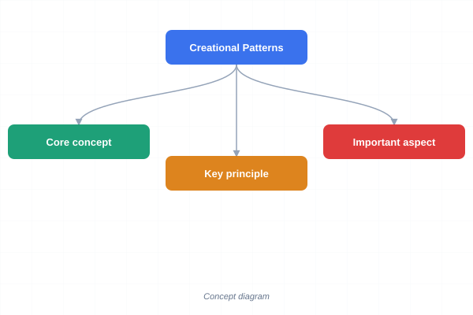
</a>
<a href="../../assets/images/diagrams/oop-cpp/16-design-patterns/creational-patterns-sticky.svg" target="_blank" rel="noopener">
  
</a>


| Pattern | Intent | Enables |
|---------|--------|---------|
| **Singleton** | Ensure one instance, global access | Shared resource management |
| **Factory Method** | Define creation interface, let subclasses decide | Class-level flexibility |
| **Abstract Factory** | Create families of related objects | Product-family consistency |
| **Builder** | Separate construction from representation | Stepwise complex-object creation |
| **Prototype** | Clone existing objects | Efficient copy with customisation |

### Structural Patterns

<a href="../../assets/images/diagrams/oop-cpp/16-design-patterns/structural-patterns-handwritten.svg" target="_blank" rel="noopener">
  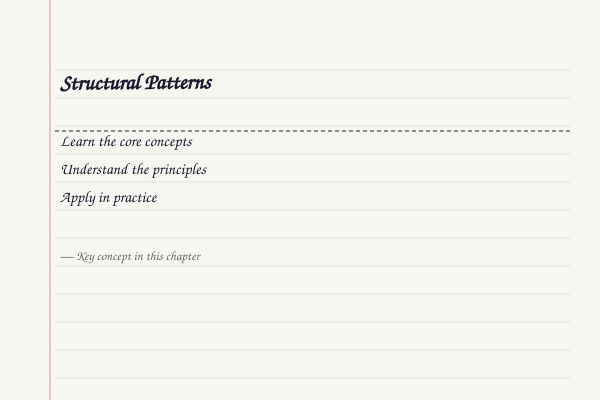
</a>
<a href="../../assets/images/diagrams/oop-cpp/16-design-patterns/structural-patterns-diagram.svg" target="_blank" rel="noopener">
  
</a>
<a href="../../assets/images/diagrams/oop-cpp/16-design-patterns/structural-patterns-sticky.svg" target="_blank" rel="noopener">
  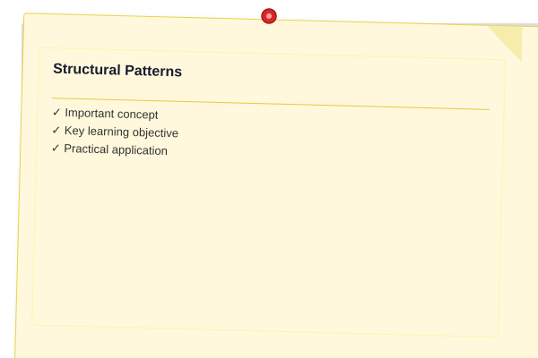
</a>


| Pattern | Intent | Enables |
|---------|--------|---------|
| **Adapter** | Convert one interface to another | Legacy integration |
| **Bridge** | Decouple abstraction from implementation | Platform independence |
| **Composite** | Treat individual and composite objects uniformly | Tree structures |
| **Decorator** | Add responsibilities dynamically | Flexible extension without subclassing |
| **Facade** | Simplified interface to a subsystem | Complexity hiding |
| **Flyweight** | Share fine-grained objects efficiently | Memory optimisation |
| **Proxy** | Control access to an object | Lazy loading, protection, logging |

### Behavioral Patterns

<a href="../../assets/images/diagrams/oop-cpp/16-design-patterns/behavioral-patterns-handwritten.svg" target="_blank" rel="noopener">
  
</a>
<a href="../../assets/images/diagrams/oop-cpp/16-design-patterns/behavioral-patterns-diagram.svg" target="_blank" rel="noopener">
  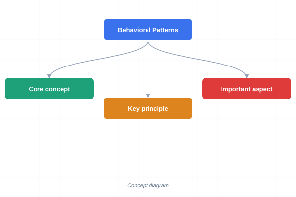
</a>
<a href="../../assets/images/diagrams/oop-cpp/16-design-patterns/behavioral-patterns-sticky.svg" target="_blank" rel="noopener">
  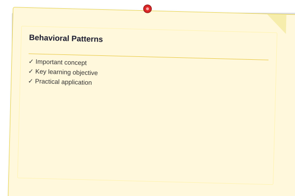
</a>


| Pattern | Intent | Enables |
|---------|--------|---------|
| **Chain of Responsibility** | Pass request along a chain of handlers | Decoupled request processing |
| **Command** | Encapsulate request as an object | Undo/redo, queuing, logging |
| **Interpreter** | Define grammar and interpret sentences | Language processing |
| **Iterator** | Access elements sequentially without exposing representation | Uniform traversal |
| **Mediator** | Define interaction hub between objects | Reduced coupling |
| **Memento** | Capture and restore object state | Undo mechanisms |
| **Observer** | One-to-many dependency notification | Event systems |
| **State** | Alter behaviour when internal state changes | State-machine logic |
| **Strategy** | Define family of interchangeable algorithms | Algorithm selection at runtime |
| **Template Method** | Define skeleton of algorithm, defer steps to subclasses | Algorithm customisation |
| **Visitor** | Separate operations from object structure | Double dispatch, open/closed |

### Pattern Scope

<a href="../../assets/images/diagrams/oop-cpp/16-design-patterns/pattern-scope-handwritten.svg" target="_blank" rel="noopener">
  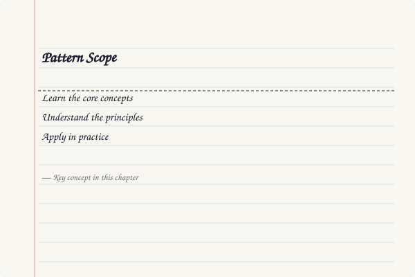
</a>
<a href="../../assets/images/diagrams/oop-cpp/16-design-patterns/pattern-scope-diagram.svg" target="_blank" rel="noopener">
  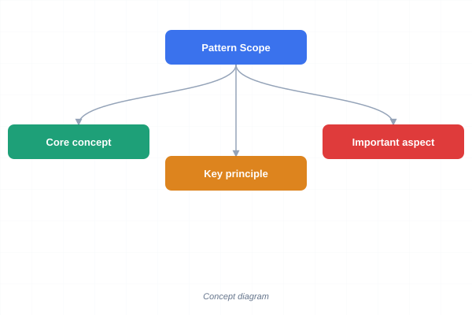
</a>
<a href="../../assets/images/diagrams/oop-cpp/16-design-patterns/pattern-scope-sticky.svg" target="_blank" rel="noopener">
  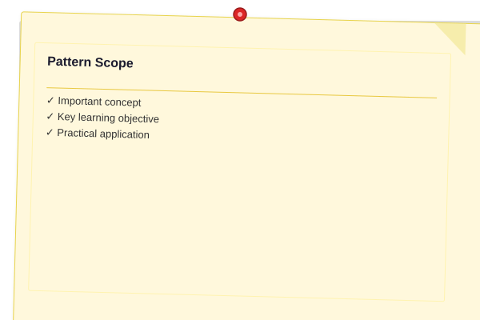
</a>


| Scope | Creational | Structural | Behavioral |
|-------|-----------|-----------|------------|
| **Class** (inheritance) | Factory Method | Adapter (class) | Interpreter, Template Method |
| **Object** (composition) | Singleton, Abstract Factory, Builder, Prototype | Adapter (object), Bridge, Composite, Decorator, Facade, Flyweight, Proxy | Chain of Resp., Command, Iterator, Mediator, Memento, Observer, State, Strategy, Visitor |

### Relationships Between Patterns

<a href="../../assets/images/diagrams/oop-cpp/16-design-patterns/relationships-between-patterns-handwritten.svg" target="_blank" rel="noopener">
  
</a>
<a href="../../assets/images/diagrams/oop-cpp/16-design-patterns/relationships-between-patterns-diagram.svg" target="_blank" rel="noopener">
  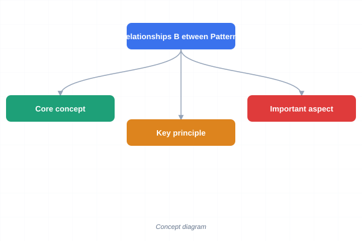
</a>
<a href="../../assets/images/diagrams/oop-cpp/16-design-patterns/relationships-between-patterns-sticky.svg" target="_blank" rel="noopener">
  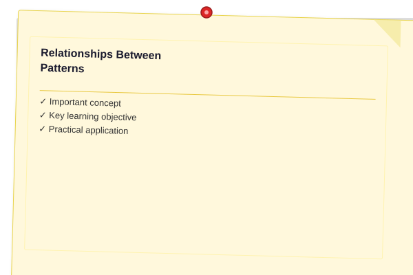
</a>


```
  Factory Method ──specialises──> Abstract Factory
  Abstract Factory ──uses──> Singleton (for factory instances)
  Builder ──uses──> Composite (build tree structures)
  Prototype ──alternative──> Factory Method (clone vs create)
  Adapter ──similar──> Bridge (different intent)
  Composite ──works with──> Iterator, Visitor
  Decorator ──alternative──> Adapter (adds vs converts)
  Facade ──simplifies──> any subsystem pattern
  Flyweight ──renders──> Composite (shared leaf nodes)
  Proxy ──similar──> Decorator (controls vs adds)
  Chain of Resp. ──uses──> Composite (handler tree)
  Command ──stored in──> Memento (undo history)
  Iterator ──traverses──> Composite
  Mediator ──centralises──> Observer (colleagues ↔ mediator)
  Memento ──used by──> Command (undo)
  Observer ──alternative──> Mediator (broadcast vs hub)
  State ──like──> Strategy (same structure, different intent)
  Template Method ──related──> Strategy (inheritance vs composition)
  Visitor ──traverses──> Composite
```

## 16.2 Design Principles

### SOLID Principles

<a href="../../assets/images/diagrams/oop-cpp/16-design-patterns/solid-principles-handwritten.svg" target="_blank" rel="noopener">
  
</a>
<a href="../../assets/images/diagrams/oop-cpp/16-design-patterns/solid-principles-diagram.svg" target="_blank" rel="noopener">
  
</a>
<a href="../../assets/images/diagrams/oop-cpp/16-design-patterns/solid-principles-sticky.svg" target="_blank" rel="noopener">
  
</a>


| Principle | Stands For | Meaning | Related Pattern |
|-----------|-----------|---------|----------------|
| **S** | Single Responsibility | A class has one reason to change | Facade, Mediator |
| **O** | Open/Closed | Open for extension, closed for modification | Strategy, Template Method, Decorator |
| **L** | Liskov Substitution | Subtypes replace base types transparently | Factory Method, Abstract Factory |
| **I** | Interface Segregation | Many specific interfaces > one general | Adapter, Facade |
| **D** | Dependency Inversion | Depend on abstractions, not concretions | Abstract Factory, Factory Method |

### GRASP Principles

<a href="../../assets/images/diagrams/oop-cpp/16-design-patterns/grasp-principles-handwritten.svg" target="_blank" rel="noopener">
  
</a>
<a href="../../assets/images/diagrams/oop-cpp/16-design-patterns/grasp-principles-diagram.svg" target="_blank" rel="noopener">
  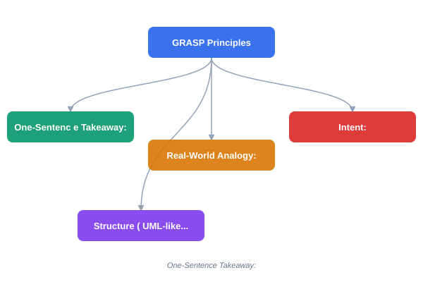
</a>
<a href="../../assets/images/diagrams/oop-cpp/16-design-patterns/grasp-principles-sticky.svg" target="_blank" rel="noopener">
  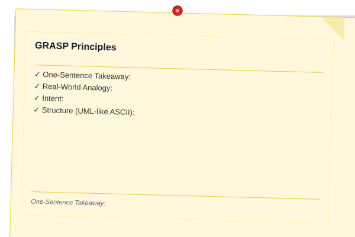
</a>


| Principle | Description | Pattern |
|-----------|-------------|---------|
| **Information Expert** | Assign responsibility to the class with the data | Iterator, Visitor |
| **Creator** | Class A creates Class B if A contains/composes B | Factory Method, Abstract Factory, Builder |
| **Controller** | First object beyond UI that handles events | Command, Mediator, Facade |
| **Low Coupling** | Minimise dependencies between classes | Adapter, Facade, Mediator |
| **High Cohesion** | Keep related responsibilities together | Singleton, Builder |
| **Polymorphism** | Handle variation by type | Strategy, State, Template Method |
| **Pure Fabrication** | Create artificial class to achieve low coupling | Adapter, Command, Observer |
| **Indirection** | Intermediate object mediates between components | Mediator, Proxy, Bridge |
| **Protected Variations** | Shield elements from variation in other elements | Adapter, Bridge, Facade |

---

# 16.3 Creational Patterns

> **One-Sentence Takeaway:** Creational patterns abstract object creation, decoupling clients from concrete types and hiding instantiation logic.

---

## 16.3.1 Singleton

**Real-World Analogy:** A country has one president. The constitution ensures only one person holds that office at any time, and every citizen can access the president through the same channel.

**Intent:** Ensure a class has exactly one instance and provide a global point of access to it.

**Structure (UML-like ASCII):**
```
+---------------------------+
|        Singleton          |
+---------------------------+
| - instance: Singleton*    |
+---------------------------+
| - Singleton()             |
| - ~Singleton()            |
| + instance(): Singleton&  |
+---------------------------+
```

**Steps:**
1. Make the default constructor private (no external instantiation)
2. Delete copy constructor and copy-assignment operator
3. Provide a static method that returns a reference to the sole instance
4. Ensure thread safety during first-time initialisation

**Pseudocode:**
```
class Logger:
    private:
        Logger()
        Logger(const Logger&) = delete
        Logger& operator=(const Logger&) = delete
    public:
        static Logger& instance():
            if instance is null:
                instance = new Logger()
            return instance
```

### Thread-Safe Implementations

<a href="../../assets/images/diagrams/oop-cpp/16-design-patterns/thread-safe-implementations-handwritten.svg" target="_blank" rel="noopener">
  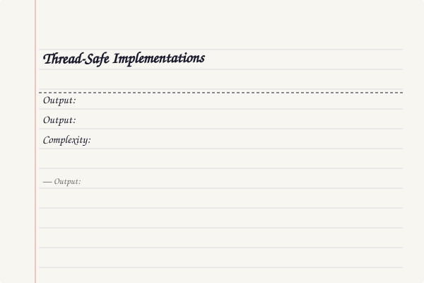
</a>
<a href="../../assets/images/diagrams/oop-cpp/16-design-patterns/thread-safe-implementations-diagram.svg" target="_blank" rel="noopener">
  
</a>
<a href="../../assets/images/diagrams/oop-cpp/16-design-patterns/thread-safe-implementations-sticky.svg" target="_blank" rel="noopener">
  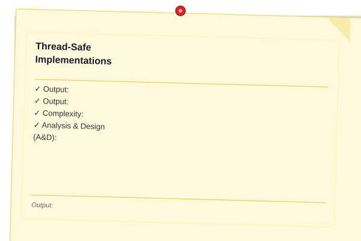
</a>


#### a) Meyers Singleton (C++11 magic static)

The simplest and preferred approach. C++11 guarantees that initialisation of a function-local static variable is thread-safe.

```cpp
#include <iostream>
#include <mutex>
#include <thread>

class Logger {
public:
    static Logger& instance() {
        static Logger inst;    // thread-safe in C++11+ (magic static)
        return inst;
    }

    void log(const std::string& msg) {
        std::lock_guard<std::mutex> lock(mtx_);
        std::cout << "[LOG] " << msg << "\n";
    }

private:
    Logger() { std::cout << "Logger created\n"; }
    ~Logger() = default;
    Logger(const Logger&) = delete;
    Logger& operator=(const Logger&) = delete;
    std::mutex mtx_;
};

int main() {
    Logger::instance().log("App started");
    Logger::instance().log("App finished");
}
```

**Output:**
```
Logger created
[LOG] App started
[LOG] App finished
```

#### b) std::call_once

Explicit one-time initialisation with `std::once_flag`.

```cpp
#include <iostream>
#include <mutex>

class Singleton {
    static Singleton* inst;
    static std::once_flag flag;
    Singleton() { std::cout << "Singleton constructed\n"; }
public:
    Singleton(const Singleton&) = delete;
    Singleton& operator=(const Singleton&) = delete;

    static Singleton& instance() {
        std::call_once(flag, [] { inst = new Singleton(); });
        return *inst;
    }

    void do_something() { std::cout << "Working\n"; }
};

Singleton* Singleton::inst = nullptr;
std::once_flag Singleton::flag;

int main() {
    Singleton::instance().do_something();
    Singleton::instance().do_something();
}
```

**Output:**
```
Singleton constructed
Working
Working
```

#### c) Mutex-Guarded (double-checked locking)

Traditional approach, valid when C++11 memory model guarantees are used.

```cpp
#include <iostream>
#include <mutex>

class Singleton {
    static Singleton* inst;
    static std::mutex mtx;
    Singleton() { std::cout << "Singleton constructed\n"; }
public:
    Singleton(const Singleton&) = delete;
    Singleton& operator=(const Singleton&) = delete;

    static Singleton& instance() {
        if (!inst) {
            std::lock_guard<std::mutex> lock(mtx);
            if (!inst) {
                inst = new Singleton();
            }
        }
        return *inst;
    }
};

Singleton* Singleton::inst = nullptr;
std::mutex Singleton::mtx;
```

**Complexity:** Creation O(1), access O(1).

**Analysis & Design (A&D):**
- Violates Single Responsibility (manages own lifecycle + business logic)
- Introduces global state → hidden dependencies, hard to test
- Cannot be subclassed
- Meyers variant is the gold standard in modern C++

**When to Use:**
- Exactly one instance is needed (logging, thread pool, device driver)
- Global access point makes sense

**When to Avoid:**
- Dependency injection can provide the instance instead
- Unit-testing is important (singletons are hard to mock)
- Multiple instances may be needed later

---

## 16.3.2 Factory Method

**Real-World Analogy:** A restaurant serves many dishes but you order from a menu. The kitchen (creator) decides which specific dish (product) to prepare based on your order. The restaurant doesn't need to change its process when adding new dishes → just extend the menu.

**Intent:** Define an interface for creating an object, but let subclasses decide which class to instantiate.

**Structure (UML-like ASCII):**
```
+-------------+          +--------------+
|   Creator   |--------->|   Product    |
+-------------+          +--------------+
| + factory() |          | + operation()|
+-------------+          +--------------+
       ^                          ^
       |                          |
+-------------+          +--------------+
|ConcreteCtor |          | ConcreteProd |
+-------------+          +--------------+
| + factory() |          | + operation()|
+-------------+          +--------------+
```

**Steps:**
1. Declare a Product interface (abstract base)
2. Implement ConcreteProduct classes
3. Declare a Creator with a factory method returning Product
4. Subclass Creator; each overrides the factory method

**Pseudocode:**
```
class Transport:
    virtual deliver()

class Truck : Transport:
    deliver() => "Deliver by land"

class Ship : Transport:
    deliver() => "Deliver by sea"

class Logistics:
    virtual createTransport(): Transport

class RoadLogistics : Logistics:
    createTransport() => new Truck()

class SeaLogistics : Logistics:
    createTransport() => new Ship()
```

**C++ Implementation:**

```cpp
#include <iostream>
#include <memory>
#include <string>

// Product interface
class Transport {
public:
    virtual ~Transport() = default;
    virtual std::string deliver() const = 0;
};

// Concrete Products
class Truck : public Transport {
public:
    std::string deliver() const override {
        return "Delivering by land in a truck";
    }
};

class Ship : public Transport {
public:
    std::string deliver() const override {
        return "Delivering by sea in a ship";
    }
};

// Creator (abstract)
class Logistics {
public:
    virtual ~Logistics() = default;
    virtual std::unique_ptr<Transport> createTransport() const = 0;

    std::string planDelivery() const {
        auto t = createTransport();
        return "Logistics: " + t->deliver();
    }
};

// Concrete Creators
class RoadLogistics : public Logistics {
public:
    std::unique_ptr<Transport> createTransport() const override {
        return std::make_unique<Truck>();
    }
};

class SeaLogistics : public Logistics {
public:
    std::unique_ptr<Transport> createTransport() const override {
        return std::make_unique<Ship>();
    }
};

int main() {
    std::unique_ptr<Logistics> logi = std::make_unique<RoadLogistics>();
    std::cout << logi->planDelivery() << "\n";

    logi = std::make_unique<SeaLogistics>();
    std::cout << logi->planDelivery() << "\n";
}
```

**Output:**
```
Logistics: Delivering by land in a truck
Logistics: Delivering by sea in a ship
```

**Dry Run (RoadLogistics::planDelivery):**
```
Call RoadLogistics::planDelivery()
  -> createTransport() returns unique_ptr<Truck>
  -> t->deliver() => "Delivering by land in a truck"
Result: "Logistics: Delivering by land in a truck"
```

**Complexity:** O(1) creation, O(1) dispatch.

**A&D:**
- Satisfies Open/Closed principle: new products don't break existing creators
- Satisfies Dependency Inversion: client depends on Product, not concrete types
- Parallel class hierarchy (one Creator per Product)
- Parameterised factory methods can switch on an enum

**When to Use:**
- A class cannot anticipate the class of objects it must create
- A class wants subclasses to specify the objects it creates
- You want to localise knowledge of which concrete class to create

**When to Avoid:**
- Simple object creation (just call `make_unique<T>()`)
- The single Product type never changes
- You need entire product families (use Abstract Factory)

---

## 16.3.3 Abstract Factory

**Real-World Analogy:** A furniture store sells modern and Victorian collections. Each collection includes a chair, sofa, and coffee table. You buy a complete collection → you never mix a modern chair with a Victorian sofa. The store (Abstract Factory) guarantees product-family consistency.

**Intent:** Provide an interface for creating families of related or dependent objects without specifying their concrete classes.

**Structure (UML-like ASCII):**
```
+--------------------+          +------------------+
| AbstractFactory    |--------->| AbstractProductA |
+--------------------+          +------------------+
| + createProductA() |                    ^
| + createProductB() |                    |
+--------------------+              +-----------+
        ^                          | ConcreteA1|
        |                          +-----------+
+-------------------+
| ConcreteFactory1  |           +------------------+
+-------------------+---------->| AbstractProductB |
| + createProductA()|                    ^
| + createProductB()|                    |
+-------------------+              +-----------+
                                  | ConcreteB1|
                                  +-----------+
```

**Steps:**
1. Declare abstract product interfaces (Chair, Sofa, Table)
2. Implement concrete products per variant (ModernChair, VictorianChair)
3. Declare the Abstract Factory with creation methods for each product type
4. Implement Concrete Factory per variant family
5. Client uses only Abstract Factory and Abstract Product interfaces

**Pseudocode:**
```
class Chair: virtual hasLegs(), sitOn()
class Sofa: virtual lieOn()

class ModernChair: Chair
class VictorianChair: Chair
class ModernSofa: Sofa
class VictorianSofa: Sofa

class FurnitureFactory:
    virtual createChair(): Chair
    virtual createSofa(): Sofa

class ModernFactory: FurnitureFactory
    createChair() => new ModernChair()
    createSofa() => new ModernSofa()

class VictorianFactory: FurnitureFactory
    createChair() => new VictorianChair()
    createSofa() => new VictorianSofa()
```

**C++ Implementation:**

```cpp
#include <iostream>
#include <memory>
#include <string>

// Abstract Products
class Chair {
public:
    virtual ~Chair() = default;
    virtual std::string style() const = 0;
    virtual bool hasLegs() const = 0;
    virtual void sitOn() const = 0;
};

class Sofa {
public:
    virtual ~Sofa() = default;
    virtual std::string style() const = 0;
    virtual void lieOn() const = 0;
};

// Concrete Products → Modern
class ModernChair : public Chair {
public:
    std::string style() const override { return "Modern"; }
    bool hasLegs() const override { return false; }
    void sitOn() const override {
        std::cout << "Sitting on a modern chair (no legs, floating)\n";
    }
};

class ModernSofa : public Sofa {
public:
    std::string style() const override { return "Modern"; }
    void lieOn() const override {
        std::cout << "Lying on a modern sofa (minimalist)\n";
    }
};

// Concrete Products → Victorian
class VictorianChair : public Chair {
public:
    std::string style() const override { return "Victorian"; }
    bool hasLegs() const override { return true; }
    void sitOn() const override {
        std::cout << "Sitting on a Victorian chair (ornate, 4 legs)\n";
    }
};

class VictorianSofa : public Sofa {
public:
    std::string style() const override { return "Victorian"; }
    void lieOn() const override {
        std::cout << "Lying on a Victorian sofa (velvet, tufted)\n";
    }
};

// Abstract Factory
class FurnitureFactory {
public:
    virtual ~FurnitureFactory() = default;
    virtual std::unique_ptr<Chair> createChair() const = 0;
    virtual std::unique_ptr<Sofa> createSofa() const = 0;
};

// Concrete Factories
class ModernFactory : public FurnitureFactory {
public:
    std::unique_ptr<Chair> createChair() const override {
        return std::make_unique<ModernChair>();
    }
    std::unique_ptr<Sofa> createSofa() const override {
        return std::make_unique<ModernSofa>();
    }
};

class VictorianFactory : public FurnitureFactory {
public:
    std::unique_ptr<Chair> createChair() const override {
        return std::make_unique<VictorianChair>();
    }
    std::unique_ptr<Sofa> createSofa() const override {
        return std::make_unique<VictorianSofa>();
    }
};

// Client code uses only interfaces
void furnishRoom(const FurnitureFactory& factory) {
    auto chair = factory.createChair();
    auto sofa = factory.createSofa();
    std::cout << "Furnishing room in " << chair->style() << " style:\n";
    chair->sitOn();
    sofa->lieOn();
}

int main() {
    ModernFactory modern;
    furnishRoom(modern);

    VictorianFactory victorian;
    furnishRoom(victorian);
}
```

**Output:**
```
Furnishing room in Modern style:
Sitting on a modern chair (no legs, floating)
Lying on a modern sofa (minimalist)
Furnishing room in Victorian style:
Sitting on a Victorian chair (ornate, 4 legs)
Lying on a Victorian sofa (velvet, tufted)
```

**Dry Run:**
```
furnishRoom(victorian):
  victorian.createChair() => VictorianChair
  victorian.createSofa() => VictorianSofa
  chair->style() => "Victorian"
  chair->sitOn() => "Sitting on a Victorian chair (ornate, 4 legs)"
  sofa->lieOn() => "Lying on a Victorian sofa (velvet, tufted)"
```

**Complexity:** O(1) creation.

**A&D:**
- Guarantees product-family consistency (no mixing Modern with Victorian)
- Satisfies Open/Closed: adding a new product family means adding new ConcreteFactory
- Violates Open/Closed if adding a new product type (must change AbstractFactory)
- Often uses Factory Method for each creation method internally

**When to Use:**
- Products must be used in families that must stay consistent
- System must be configured with one of multiple families of products
- You want to hide product-class implementation from clients

**When to Avoid:**
- Only one product family is ever needed (overkill)
- Product types change frequently (interface changes break all factories)
- A simple Factory Method suffices (single product)

---

### Factory Method vs Abstract Factory → Comparison

<a href="../../assets/images/diagrams/oop-cpp/16-design-patterns/factory-method-vs-abstract-factory-comparison-handwritten.svg" target="_blank" rel="noopener">
  
</a>
<a href="../../assets/images/diagrams/oop-cpp/16-design-patterns/factory-method-vs-abstract-factory-comparison-diagram.svg" target="_blank" rel="noopener">
  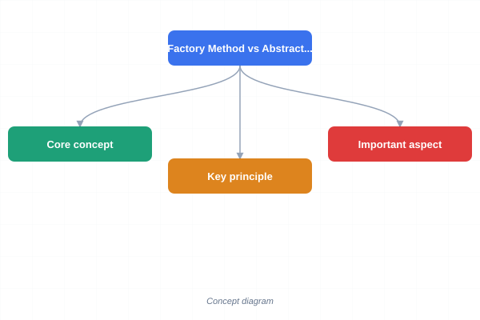
</a>
<a href="../../assets/images/diagrams/oop-cpp/16-design-patterns/factory-method-vs-abstract-factory-comparison-sticky.svg" target="_blank" rel="noopener">
  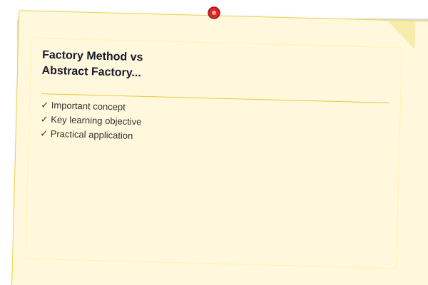
</a>


| Aspect | Factory Method | Abstract Factory |
|--------|---------------|-----------------|
| **Scope** | Class (single product) | Object (product families) |
| **Products** | One product type | Multiple related product types |
| **How** | Subclass overrides creation method | Separate factory object per family |
| **Implementation** | Virtual method in the creator | Interface with multiple creation methods |
| **Product Family** | Not applicable | Guarantees family consistency |
| **Extension** | New product = new Creator subclass | New product family = new Factory; new product type = Factory interface change |
| **Frequency** | Very common | Common for cross-platform code |
| **C++ Example** | `std::make_shared<T>` variants | GUI toolkit: WinFactory, MacFactory |

### Creational Patterns at a Glance

<a href="../../assets/images/diagrams/oop-cpp/16-design-patterns/creational-patterns-at-a-glance-handwritten.svg" target="_blank" rel="noopener">
  
</a>
<a href="../../assets/images/diagrams/oop-cpp/16-design-patterns/creational-patterns-at-a-glance-diagram.svg" target="_blank" rel="noopener">
  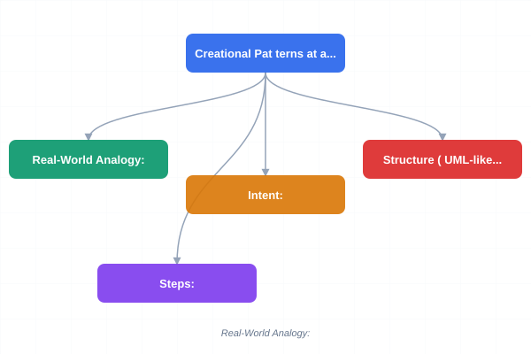
</a>
<a href="../../assets/images/diagrams/oop-cpp/16-design-patterns/creational-patterns-at-a-glance-sticky.svg" target="_blank" rel="noopener">
  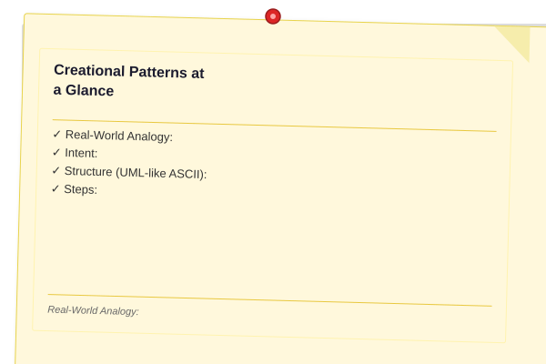
</a>


| Pattern | What It Controls | Flexibility | Complexity |
|---------|-----------------|-------------|------------|
| Singleton | Instance count | Low | Low |
| Factory Method | Concrete class of one product | Medium (per subclass) | Low |
| Abstract Factory | Families of products | High (per family) | Medium |
| Builder | Stepwise construction | High (per director) | Medium |
| Prototype | Cloning behaviour | High (per registry) | Medium |
## 16.3.4 Builder

**Real-World Analogy:** A Subway sandwich shop lets you build your own sandwich: choose bread, protein, cheese, veggies, sauces, and toasting. The same construction process (make sandwich) can produce very different sandwiches. The Director (cashier) guides the Builder (sandwich maker) step by step.

**Intent:** Separate the construction of a complex object from its representation so that the same construction process can create different representations.

**Structure (UML-like ASCII):**
```
+----------+       +-----------------+       +-----------+
| Director |------>|    Builder      |<------|  Product  |
+----------+       +-----------------+       +-----------+
| +construct|      | + buildPartA()  |       | getResult |
+----------+       | + buildPartB()  |       +-----------+
                   | + getResult()   |
                   +-----------------+
                           ^
                           |
                   +-----------------+
                   | ConcreteBuilder |
                   +-----------------+
                   | + buildPartA()  |
                   | + buildPartB()  |
                   | + getResult()   |
                   +-----------------+
```

**Steps:**
1. Define the Product class with setters for each part
2. Declare the Builder interface with build-step methods
3. Implement ConcreteBuilder(s) → each builds a specific variant
4. Implement the Director that orchestrates the build steps
5. Client creates Director + ConcreteBuilder → Director::construct() → Product

**Pseudocode:**
```
class Pizza:
    dough, sauce, toppings[]
    setDough(), setSauce(), addTopping()
    show()

class PizzaBuilder:
    Pizza pizza
    virtual buildDough()
    virtual buildSauce()
    virtual buildToppings()
    result() => pizza

class HawaiianBuilder: PizzaBuilder
    buildDough()    => pizza.setDough("pan")
    buildSauce()    => pizza.setSauce("sweet")
    buildToppings() => pizza.addTopping("ham;pineapple")

class SpicyBuilder: PizzaBuilder
    buildDough()    => pizza.setDough("thin")
    buildSauce()    => pizza.setSauce("tomato")
    buildToppings() => pizza.addTopping("pepperoni;jalapeno")

class Waiter:
    Pizza construct(PizzaBuilder b):
        b.buildDough()
        b.buildSauce()
        b.buildToppings()
        return b.result()
```

**C++ Implementation:**

```cpp
#include <iostream>
#include <string>
#include <vector>

class Pizza {
public:
    void setDough(const std::string& d) { dough_ = d; }
    void setSauce(const std::string& s) { sauce_ = s; }
    void addTopping(const std::string& t) { toppings_.push_back(t); }

    void show() const {
        std::cout << "Pizza [" << dough_ << " dough, "
                  << sauce_ << " sauce, toppings: ";
        for (size_t i = 0; i < toppings_.size(); ++i) {
            if (i) std::cout << ", ";
            std::cout << toppings_[i];
        }
        std::cout << "]\n";
    }

private:
    std::string dough_;
    std::string sauce_;
    std::vector<std::string> toppings_;
};

// Builder interface
class PizzaBuilder {
public:
    virtual ~PizzaBuilder() = default;
    virtual void buildDough() = 0;
    virtual void buildSauce() = 0;
    virtual void buildToppings() = 0;
    Pizza& result() { return pizza_; }
protected:
    Pizza pizza_;
};

class HawaiianBuilder : public PizzaBuilder {
public:
    void buildDough() override { pizza_.setDough("pan"); }
    void buildSauce() override { pizza_.setSauce("sweet"); }
    void buildToppings() override {
        pizza_.addTopping("ham");
        pizza_.addTopping("pineapple");
    }
};

class SpicyBuilder : public PizzaBuilder {
public:
    void buildDough() override { pizza_.setDough("thin"); }
    void buildSauce() override { pizza_.setSauce("tomato"); }
    void buildToppings() override {
        pizza_.addTopping("pepperoni");
        pizza_.addTopping("jalapeno");
    }
};

// Director
class Waiter {
public:
    void construct(PizzaBuilder& builder) {
        builder.buildDough();
        builder.buildSauce();
        builder.buildToppings();
    }
};

int main() {
    Waiter waiter;

    HawaiianBuilder hb;
    waiter.construct(hb);
    hb.result().show();

    SpicyBuilder sb;
    waiter.construct(sb);
    sb.result().show();
}
```

**Output:**
```
Pizza [pan dough, sweet sauce, toppings: ham, pineapple]
Pizza [thin dough, tomato sauce, toppings: pepperoni, jalapeno]
```

**Dry Run (Hawaiian):**
```
Waiter::construct(hb):
  hb.buildDough()     -> pizza_.dough_ = "pan"
  hb.buildSauce()     -> pizza_.sauce_ = "sweet"
  hb.buildToppings()  -> pizza_.toppings_ = ["ham", "pineapple"]
hb.result().show() -> prints "Pizza [pan dough, sweet sauce, toppings: ham, pineapple]"
```

**Complexity:** O(n) where n = number of build steps. Memory O(1) beyond product.

**A&D:**
- Separates construction logic from product representation
- Same construction process yields different products
- Finer control than Factory Method (step-by-step)
- Director is optional → clients can call builder steps directly
- Fluent builder returns `*this` for method chaining

**When to Use:**
- Object construction requires many steps with variations
- The construction process should allow different representations
- You want to isolate complex construction code from business logic

**When to Avoid:**
- Object can be constructed in one step (use Factory Method)
- Variants are simple and few (constructor overloading suffices)

---

## 16.3.5 Prototype

**Real-World Analogy:** When a cell divides (mitosis), it creates an exact copy of itself → a clone. In software, instead of instantiating a new object from scratch, you clone an existing one and optionally customise it.

**Intent:** Specify the kinds of objects to create using a prototypical instance, and create new objects by copying this prototype.

**Structure (UML-like ASCII):**
```
+------------------+
|   Prototype      |
+------------------+
| + clone(): self  |
+------------------+
        ^
        |
+------------------+
| ConcretePrototype |
+------------------+
| + clone(): self  |
+------------------+
```

**Steps:**
1. Declare a Prototype interface with a `clone()` method
2. Implement ConcretePrototype that copies itself
3. Optionally maintain a PrototypeRegistry (map of named prototypes)
4. Client clones prototypes instead of calling constructors

**Pseudocode:**
```
class Shape:
    x, y, color
    virtual clone(): Shape
    virtual render()

class Rectangle: Shape:
    width, height
    clone() => new Rectangle(*this)    // copy constructor

class Circle: Shape:
    radius
    clone() => new Circle(*this)       // copy constructor

// Client:
registry["large_circle"] = Circle(50)
c = registry["large_circle"].clone()  // no new Circle(...)
```

**C++ Implementation:**

```cpp
#include <iostream>
#include <memory>
#include <string>
#include <unordered_map>

class Shape {
public:
    virtual ~Shape() = default;
    virtual std::unique_ptr<Shape> clone() const = 0;
    virtual void render() const = 0;
    virtual std::string type() const = 0;
};

class Rectangle : public Shape {
public:
    Rectangle(float w, float h, int x = 0, int y = 0)
        : width_(w), height_(h), x_(x), y_(y) {}

    std::unique_ptr<Shape> clone() const override {
        return std::make_unique<Rectangle>(*this);
    }

    void render() const override {
        std::cout << "Rectangle(" << x_ << "," << y_
                  << ") " << width_ << "x" << height_ << "\n";
    }

    std::string type() const override { return "Rectangle"; }

private:
    float width_, height_;
    int x_, y_;
};

class Circle : public Shape {
public:
    Circle(float r, int x = 0, int y = 0)
        : radius_(r), x_(x), y_(y) {}

    std::unique_ptr<Shape> clone() const override {
        return std::make_unique<Circle>(*this);
    }

    void render() const override {
        std::cout << "Circle(" << x_ << "," << y_
                  << ") radius=" << radius_ << "\n";
    }

    std::string type() const override { return "Circle"; }

private:
    float radius_;
    int x_, y_;
};

// Prototype Registry
class ShapeRegistry {
public:
    void add(const std::string& key, std::unique_ptr<Shape> proto) {
        prototypes_[key] = std::move(proto);
    }

    std::unique_ptr<Shape> create(const std::string& key) const {
        auto it = prototypes_.find(key);
        if (it != prototypes_.end())
            return it->second->clone();
        return nullptr;
    }

private:
    std::unordered_map<std::string, std::unique_ptr<Shape>> prototypes_;
};

int main() {
    ShapeRegistry reg;
    reg.add("big_rect", std::make_unique<Rectangle>(200, 100));
    reg.add("small_circle", std::make_unique<Circle>(15));

    auto s1 = reg.create("big_rect");
    auto s2 = reg.create("small_circle");
    s1->render();
    s2->render();

    std::cout << "Types: " << s1->type() << ", " << s2->type() << "\n";
}
```

**Output:**
```
Rectangle(0,0) 200x100
Circle(0,0) radius=15
Types: Rectangle, Circle
```

**Dry Run:**
```
ShapeRegistry::create("big_rect"):
  lookup "big_rect" -> Rectangle(200,100)
  Rectangle::clone() -> make_unique<Rectangle>(*this)
  returns new Rectangle(200,100)
s1->render() -> "Rectangle(0,0) 200x100"
```

**Complexity:** O(1) clone (shallow copy via copy constructor). Deep copy O(n) for complex objects.

**A&D:**
- Avoids subclassing a creator (Factory Method) when product types vary widely
- Cloning is often cheaper than full initialisation
- Prototype Registry provides a flexible object-creation mechanism
- Requires proper deep-copy semantics in C++ (rule of 3/5)

**When to Use:**
- Classes to instantiate are determined at runtime (dynamic loading)
- Avoiding parallel factory class hierarchies
- Instances can have only a few different state combinations (pre-configure prototypes)

**When to Avoid:**
- Copying is expensive or complex (e.g., objects with external resources)
- Deep-copy semantics are hard to get right
- Simple `new` suffices

---

### Creational Summary

<a href="../../assets/images/diagrams/oop-cpp/16-design-patterns/creational-summary-handwritten.svg" target="_blank" rel="noopener">
  
</a>
<a href="../../assets/images/diagrams/oop-cpp/16-design-patterns/creational-summary-diagram.svg" target="_blank" rel="noopener">
  
</a>
<a href="../../assets/images/diagrams/oop-cpp/16-design-patterns/creational-summary-sticky.svg" target="_blank" rel="noopener">
  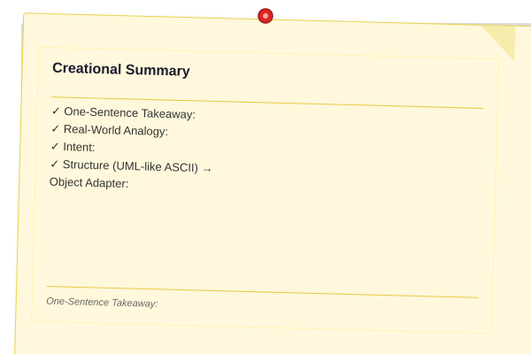
</a>


All five creational patterns abstract away object creation. Singleton controls instance count; Factory Method delegates creation to subclasses; Abstract Factory creates families; Builder constructs step-by-step; Prototype clones existing instances.

---

# 16.4 Structural Patterns

> **One-Sentence Takeaway:** Structural patterns (Adapter, Bridge, Composite, Decorator, Facade, Flyweight, Proxy) compose classes and objects into larger structures while keeping them flexible and efficient.

---

## 16.4.1 Adapter

**Real-World Analogy:** A travel plug adapter converts a US plug (two flat pins) to fit into a European socket (two round holes). The adapter doesn't change the electrical device → it translates the interface.

**Intent:** Convert the interface of a class into another interface that clients expect. Adapter lets classes work together that couldn't otherwise because of incompatible interfaces.

**Structure (UML-like ASCII) → Object Adapter:**
```
+-----------+          +-------------+
|  Client   |--------->|   Target    |
+-----------+          +-------------+
                       | + request() |
                       +-------------+
                              ^
                              |
                       +-------------+          +------------+
                       |   Adapter   |--------->|  Adaptee   |
                       +-------------+          +------------+
                       | + request() |          | + specificR|
                       +-------------+          +------------+
```

**Steps:**
1. Identify Target interface (what the client expects)
2. Identify Adaptee (existing class with incompatible interface)
3. Create Adapter that implements Target and delegates to Adaptee
4. Client uses Adapter through Target interface

**Pseudocode:**
```
class Target:
    virtual request(): string

class Adaptee:
    specificRequest(): string (returns "!egakcap")

class Adapter(Target):
    Adaptee adaptee
    request() => reverse(adaptee.specificRequest())
```

**C++ Implementation (Object Adapter):**

```cpp
#include <iostream>
#include <memory>
#include <string>
#include <algorithm>

// Target interface
class Shape {
public:
    virtual ~Shape() = default;
    virtual void draw(int x, int y, int w, int h) const = 0;
};

// Adaptee → incompatible interface
class LegacyRectangle {
public:
    void display(int x, int y, int w, int h) const {
        std::cout << "Legacy rectangle at (" << x << "," << y
                  << ") size " << w << "x" << h << "\n";
    }
};

// Adapter → makes LegacyRectangle fit Shape
class RectangleAdapter : public Shape {
public:
    RectangleAdapter(int x, int y, int w, int h)
        : x_(x), y_(y), w_(w), h_(h) {}

    void draw(int, int, int, int) const override {
        adaptee_.display(x_, y_, w_, h_);
    }

private:
    LegacyRectangle adaptee_;
    int x_, y_, w_, h_;
};

int main() {
    std::unique_ptr<Shape> shape = std::make_unique<RectangleAdapter>(10, 20, 100, 50);
    shape->draw(0, 0, 0, 0); // ignores client params, uses adaptee's own
}
```

**Output:**
```
Legacy rectangle at (10,20) size 100x50
```

**Complexity:** O(1) delegation. Memory O(1) wrapper.

**A&D:**
- Class Adapter (multiple inheritance) vs Object Adapter (composition)
- Object Adapter is preferred in C++ (flexible, works with any Adaptee subclass)
- Single Responsibility: Adapter handles conversion; Adaptee does its job
- Often used for legacy code integration and third-party library wrapping

**When to Use:**
- Existing class has wrong interface
- You want a reusable class that works with unrelated classes
- Multiple existing subclasses need interface conversion

**When to Avoid:**
- You can change the Adaptee's interface directly
- The interface mismatch is fundamental (redesign instead)

---

## 16.4.2 Bridge

**Real-World Analogy:** A remote control (abstraction) works with any TV (implementation). You can turn on/off, change channel, and adjust volume regardless of whether the TV is Sony, Samsung, or LG. The remote and the TV vary independently.

**Intent:** Decouple an abstraction from its implementation so that the two can vary independently.

**Structure (UML-like ASCII):**
```
+-------------+       +----------------+
| Abstraction |------>|  Implementor   |
+-------------+       +----------------+
| + operation()|       | + operationImpl|
+-------------+       +----------------+
       ^                        ^
       |                        |
+-------------+       +----------------+
| RefinedAbst |       | ConcreteImplA  |
+-------------+       +----------------+
```

**Steps:**
1. Define the Implementor interface (platform-specific operations)
2. Implement ConcreteImplementors for each platform
3. Define the Abstraction that holds a reference to Implementor
4. Create RefinedAbstraction subclasses as needed

**Pseudocode:**
```
class Device:                  // Implementor
    virtual isEnabled()
    virtual enable()
    virtual disable()

class TV: Device               // ConcreteImpl
class Radio: Device

class RemoteControl:           // Abstraction
    Device& device
    virtual togglePower()
    virtual volumeUp()

class AdvancedRemote: RemoteControl
    virtual mute()
```

**C++ Implementation:**

```cpp
#include <iostream>
#include <memory>

// Implementor
class Device {
public:
    virtual ~Device() = default;
    virtual bool isEnabled() const = 0;
    virtual void enable() = 0;
    virtual void disable() = 0;
    virtual int volume() const = 0;
    virtual void setVolume(int v) = 0;
    virtual int channel() const = 0;
    virtual void setChannel(int c) = 0;
};

// Concrete Implementor A
class TV : public Device {
    bool on_ = false;
    int vol_ = 10;
    int ch_ = 1;
public:
    bool isEnabled() const override { return on_; }
    void enable() override { on_ = true; std::cout << "TV on\n"; }
    void disable() override { on_ = false; std::cout << "TV off\n"; }
    int volume() const override { return vol_; }
    void setVolume(int v) override { vol_ = v; }
    int channel() const override { return ch_; }
    void setChannel(int c) override { ch_ = c; }
};

// Concrete Implementor B
class Radio : public Device {
    bool on_ = false;
    int vol_ = 5;
    int ch_ = 88;
public:
    bool isEnabled() const override { return on_; }
    void enable() override { on_ = true; std::cout << "Radio on\n"; }
    void disable() override { on_ = false; std::cout << "Radio off\n"; }
    int volume() const override { return vol_; }
    void setVolume(int v) override { vol_ = v; }
    int channel() const override { return ch_; }
    void setChannel(int c) override { ch_ = c; }
};

// Abstraction
class RemoteControl {
public:
    explicit RemoteControl(Device& dev) : device_(dev) {}
    virtual ~RemoteControl() = default;

    virtual void togglePower() {
        if (device_.isEnabled()) device_.disable();
        else device_.enable();
    }

    virtual void volumeUp() {
        device_.setVolume(device_.volume() + 1);
        std::cout << "Volume: " << device_.volume() << "\n";
    }

    virtual void volumeDown() {
        device_.setVolume(device_.volume() - 1);
        std::cout << "Volume: " << device_.volume() << "\n";
    }

protected:
    Device& device_;
};

// Refined Abstraction
class AdvancedRemote : public RemoteControl {
public:
    using RemoteControl::RemoteControl;
    void mute() {
        device_.setVolume(0);
        std::cout << "Muted\n";
    }
};

int main() {
    TV tv;
    RemoteControl remote(tv);
    remote.togglePower();    // TV on
    remote.volumeUp();       // Volume: 11

    Radio radio;
    AdvancedRemote adv(radio);
    adv.togglePower();       // Radio on
    adv.mute();              // Muted
}
```

**Output:**
```
TV on
Volume: 11
Radio on
Muted
```

**Complexity:** O(1) delegation.

**A&D:**
- Eliminates combinatorial explosion of class hierarchies (no TVRemote, RadioRemote, TVAdvancedRemote, RadioAdvancedRemote...)
- Abstraction and implementation can be developed independently
- Satisfies Open/Closed: new abstractions or implementations don't break existing code
- Often seen in GUI frameworks (Window abstraction + Linux/Win/Mac implementation)

**When to Use:**
- You want to avoid a permanent binding between abstraction and implementation
- Both abstraction and implementation should be extensible by subclassing
- Changes in implementation should not affect clients

**When to Avoid:**
- One side of the hierarchy is stable and unlikely to change (unnecessary indirection)
- Simple delegation suffices (no independent variation needed)

---

## 16.4.3 Composite

**Real-World Analogy:** An army consists of soldiers and units. A unit can contain individual soldiers or smaller units. Giving an order to a unit is the same as giving it to a soldier → the unit propagates the order to all its members. Individual and composite are treated uniformly.

**Intent:** Compose objects into tree structures to represent part-whole hierarchies. Composite lets clients treat individual objects and compositions of objects uniformly.

**Structure (UML-like ASCII):**
```
+-------------+
| Component   |<------- Client
+-------------+
| + operation()|
+-------------+
       ^
       |
+-------------+              +-------------+
|   Leaf     |              |  Composite  |
+-------------+             +-------------+
| + operation()|             | + operation()|
+-------------+             | + addChild() |
                             | + removeChild|
                             +-------------+
```

**Steps:**
1. Declare the Component interface with common operations
2. Implement Leaf → simple objects with no children
3. Implement Composite → stores children, delegates to them
4. Client works with Component interface uniformly

**Pseudocode:**
```
class Graphic:
    virtual draw()

class Circle: Graphic            // Leaf
    draw() => draw circle

class CompoundGraphic: Graphic   // Composite
    children: Graphic[]
    add(Graphic)
    remove(Graphic)
    draw() => for each child: child.draw()
```

**C++ Implementation:**

```cpp
#include <iostream>
#include <memory>
#include <string>
#include <vector>

// Component
class FileSystemNode {
public:
    virtual ~FileSystemNode() = default;
    virtual std::string name() const = 0;
    virtual size_t size() const = 0;
    virtual void display(int depth = 0) const = 0;
};

// Leaf
class File : public FileSystemNode {
    std::string name_;
    size_t size_;
public:
    File(std::string name, size_t sz) : name_(std::move(name)), size_(sz) {}
    std::string name() const override { return name_; }
    size_t size() const override { return size_; }
    void display(int depth = 0) const override {
        std::cout << std::string(depth * 2, ' ') << name_
                  << " (" << size_ << " bytes)\n";
    }
};

// Composite
class Directory : public FileSystemNode {
    std::string name_;
    std::vector<std::unique_ptr<FileSystemNode>> children_;
public:
    explicit Directory(std::string name) : name_(std::move(name)) {}

    void add(std::unique_ptr<FileSystemNode> child) {
        children_.push_back(std::move(child));
    }

    std::string name() const override { return name_; }

    size_t size() const override {
        size_t total = 0;
        for (const auto& c : children_)
            total += c->size();
        return total;
    }

    void display(int depth = 0) const override {
        std::cout << std::string(depth * 2, ' ') << name_
                  << "/ (" << size() << " bytes)\n";
        for (const auto& c : children_)
            c->display(depth + 1);
    }
};

int main() {
    auto root = std::make_unique<Directory>("root");
    auto home = std::make_unique<Directory>("home");
    auto user = std::make_unique<Directory>("user");

    user->add(std::make_unique<File>("notes.txt", 1024));
    user->add(std::make_unique<File>("photo.jpg", 2048000));
    home->add(std::move(user));
    root->add(std::move(home));
    root->add(std::make_unique<File>("readme.md", 512));

    root->display();
}
```

**Output:**
```
root/ (2049536 bytes)
  home/ (2049024 bytes)
    user/ (2049024 bytes)
      notes.txt (1024 bytes)
      photo.jpg (2048000 bytes)
  readme.md (512 bytes)
```

**Dry Run:**
```
Directory("root")::display(0):
  prints "root/ (2049536 bytes)"
  for each child:
    Directory("home")::display(1):
      prints "  home/ (2049024 bytes)"
      for each child:
        Directory("user")::display(2):
          prints "    user/ (2049024 bytes)"
          for each child:
            File("notes.txt")::display(3):
              prints "      notes.txt (1024 bytes)"
            File("photo.jpg")::display(3):
              prints "      photo.jpg (2048000 bytes)"
    File("readme.md")::display(1):
      prints "  readme.md (512 bytes)"
```

**Complexity:** O(n) traversal where n = nodes. size() O(n) aggregated.

**A&D:**
- Defines a part-whole hierarchy where Leaf and Composite share the same interface
- Makes client code simple (no `if (leaf) ... else ...` branches)
- Composite can store children in any data structure (vector, list, map)
- Works naturally with Iterator and Visitor patterns

**When to Use:**
- You need to represent a tree structure with part-whole hierarchies
- Clients should treat individual and composite objects uniformly
- The structure is recursive (directories with files and subdirectories)

**When to Avoid:**
- The tree structure is shallow (1-2 levels) → over-abstracted
- Leaf and Composite have fundamentally different operations

---

## 16.4.4 Decorator

**Real-World Analogy:** A coffee shop serves plain coffee. You can add milk, sugar, whipped cream, or caramel. Each addition wraps the previous beverage. The cost stacks. You get a coffee-with-milk-and-sugar, not a new class called "CoffeeWithMilkAndSugar".

**Intent:** Attach additional responsibilities to an object dynamically. Decorators provide a flexible alternative to subclassing for extending functionality.

**Structure (UML-like ASCII):**
```
+-------------+
| Component   |
+-------------+
| + operation |
+-------------+
       ^
       |
+-------------+        +---------------+
| ConcreteComp|        |   Decorator   |
+-------------+        +---------------+
| + operation |<>------| - component: *|
+-------------+        +---------------+
                               ^
                               |
                        +---------------+
                        | ConcrDecorator|
                        +---------------+
                        | + operation() |
                        +---------------+
```

**Steps:**
1. Define the Component interface
2. Implement ConcreteComponent (the base object)
3. Create Decorator base class that wraps a Component
4. Implement ConcreteDecorators that extend behaviour before/after delegation

**Pseudocode:**
```
class Coffee:
    virtual cost(): double
    virtual description(): string

class SimpleCoffee: Coffee
    cost() => 2.0
    description() => "Coffee"

class CoffeeDecorator: Coffee
    Coffee* wrapped
    cost() => wrapped.cost()
    description() => wrapped.description()

class WithMilk: CoffeeDecorator
    cost() => wrapped.cost() + 0.5
    description() => wrapped.description() + ", milk"
```

**C++ Implementation:**

```cpp
#include <iostream>
#include <memory>
#include <string>

// Component
class Coffee {
public:
    virtual ~Coffee() = default;
    virtual double cost() const = 0;
    virtual std::string description() const = 0;
};

// Concrete Component
class SimpleCoffee : public Coffee {
public:
    double cost() const override { return 2.0; }
    std::string description() const override { return "Coffee"; }
};

// Decorator base
class CoffeeDecorator : public Coffee {
public:
    explicit CoffeeDecorator(std::unique_ptr<Coffee> coffee)
        : coffee_(std::move(coffee)) {}
protected:
    Coffee* wrapped() const { return coffee_.get(); }
private:
    std::unique_ptr<Coffee> coffee_;
};

// Concrete Decorators
class WithMilk : public CoffeeDecorator {
public:
    using CoffeeDecorator::CoffeeDecorator;
    double cost() const override { return wrapped()->cost() + 0.5; }
    std::string description() const override {
        return wrapped()->description() + ", milk";
    }
};

class WithSugar : public CoffeeDecorator {
public:
    using CoffeeDecorator::CoffeeDecorator;
    double cost() const override { return wrapped()->cost() + 0.25; }
    std::string description() const override {
        return wrapped()->description() + ", sugar";
    }
};

class WithWhippedCream : public CoffeeDecorator {
public:
    using CoffeeDecorator::CoffeeDecorator;
    double cost() const override { return wrapped()->cost() + 0.75; }
    std::string description() const override {
        return wrapped()->description() + ", whipped cream";
    }
};

int main() {
    auto coffee = std::make_unique<WithWhippedCream>(
        std::make_unique<WithMilk>(
            std::make_unique<WithSugar>(
                std::make_unique<SimpleCoffee>())));
    std::cout << coffee->description() << " = $"
              << coffee->cost() << "\n";
}
```

**Output:**
```
Coffee, sugar, milk, whipped cream = $3.5
```

**Dry Run:**
```
coffee->cost():
  WithWhippedCream::cost()
    -> WithMilk::cost()
       -> WithSugar::cost()
          -> SimpleCoffee::cost() = 2.0
          -> + 0.25 = 2.25
       -> + 0.5 = 2.75
    -> + 0.75 = 3.5
```

**Complexity:** O(d) where d = decorator stack depth. Memory O(d) for the chain.

**A&D:**
- Open/Closed: new decorators extend behaviour without modifying Component
- Single Responsibility: each decorator adds exactly one concern
- More flexible than static inheritance (stack behaviour at runtime)
- Decorator != Adapter: Adapter changes interface; Decorator adds responsibility
- iostreams library is the canonical C++ example (std::filebuf + std::iostream)

**When to Use:**
- Adding responsibilities to individual objects, not entire classes
- Dynamic and removable responsibilities
- Subclassing would explode the class count (combination explosion)

**When to Avoid:**
- The base class is heavy; wrapping adds more complexity
- Many layers of decorators make debugging hard (stack trace deep)
- Object identity is important (wrapping hides the original)

---

## 16.4.5 Facade

**Real-World Analogy:** A restaurant waiter takes your order and brings your food. You don't interact with the kitchen, the chefs, the pantry, or the dishwasher. The waiter is the facade → a simple interface to a complex subsystem.

**Intent:** Provide a unified interface to a set of interfaces in a subsystem. Facade defines a higher-level interface that makes the subsystem easier to use.

**Structure (UML-like ASCII):**
```
+-----------+
|  Facade   |
+-----------+
| + simple()|
+-----------+
      |
      | delegates to
      v
+--------+ +--------+ +--------+
|Class A | |Class B | |Class C |
+--------+ +--------+ +--------+
```

**Steps:**
1. Identify the complex subsystem (multiple classes with complex interactions)
2. Design a Facade class that provides simplified methods
3. Facade delegates client requests to appropriate subsystem objects
4. Client calls only Facade methods; subsystem remains encapsulated

**Pseudocode:**
```
class Computer:
    CPU cpu
    Memory mem
    HardDrive hdd
    start():
        cpu.powerOn()
        data = hdd.read(bootSector)
        mem.load(data)
        cpu.jumpTo(0)
```

**C++ Implementation:**

```cpp
#include <iostream>
#include <vector>

// Complex subsystem
class CPU {
public:
    void powerOn() { std::cout << "CPU: power on\n"; }
    void jumpTo(unsigned long addr) {
        std::cout << "CPU: jumping to 0x" << std::hex << addr << "\n";
    }
    void execute() { std::cout << "CPU: executing instructions\n"; }
};

class Memory {
public:
    void load(unsigned long addr, const std::vector<unsigned char>& data) {
        std::cout << "Memory: loading " << data.size()
                  << " bytes at 0x" << std::hex << addr << "\n";
    }
};

class HardDrive {
public:
    std::vector<unsigned char> read(unsigned long sector, int size) {
        std::cout << "HardDrive: reading sector " << std::dec << sector
                  << " (" << size << " bytes)\n";
        return std::vector<unsigned char>(size, 0);
    }
};

// Facade
class Computer {
    CPU cpu_;
    Memory mem_;
    HardDrive hdd_;
public:
    void start() {
        cpu_.powerOn();
        auto data = hdd_.read(0, 512);
        mem_.load(0, data);
        cpu_.jumpTo(0);
        cpu_.execute();
        std::cout << "Computer started successfully\n";
    }
};

int main() {
    Computer pc;
    pc.start();
}
```

**Output:**
```
CPU: power on
HardDrive: reading sector 0 (512 bytes)
Memory: loading 512 bytes at 0x0
CPU: jumping to 0x0
CPU: executing instructions
Computer started successfully
```

**Complexity:** O(1) delegation per method.

**A&D:**
- Interface Segregation: shields clients from subsystem complexity
- Low Coupling: client depends only on Facade
- Doesn't prevent advanced clients from accessing subsystem directly
- A subsystem can have multiple facades for different client groups

**When to Use:**
- You want to provide a simple interface to a complex subsystem
- There are many dependencies between clients and implementation classes
- You want to layer your subsystem (Facade is the entry point)

**When to Avoid:**
- All clients need subsystem-level control (Facade becomes a bottleneck)
- The subsystem is already simple and intuitive

---

## 16.4.6 Flyweight

**Real-World Analogy:** A word processor displays thousands of characters on screen. Each character 'a' doesn't need its own font data and glyph → the shared font object is reused across all 'a' characters. The intrinsic state (the glyph shape) is shared; the extrinsic state (position, size) varies.

**Intent:** Use sharing to support large numbers of fine-grained objects efficiently.

**Structure (UML-like ASCII):**
```
+-------------+          +---------------+
|  Flyweight  |<---------| FlyweightFact |
+-------------+          +---------------+
| + operation |          | + getFlyweight|
| (extrinsic) |          +---------------+
+-------------+
       ^
       |
+---------------+
| ConcreteFly   |
+---------------+
| intrinsicState|
+---------------+
```

**Steps:**
1. Split object state into intrinsic (shared) and extrinsic (context-dependent)
2. Define Flyweight interface with operation(extrinsicState)
3. Implement ConcreteFlyweight storing intrinsic state
4. FlyweightFactory manages pool of flyweights, creating or reusing them

**Pseudocode:**
```
class TreeType:              // Flyweight (intrinsic)
    name, color, texture
    draw(canvas, x, y)

class TreeFactory:
    map<string, TreeType> types
    getTreeType(name, color, texture):
        if not exists: create new
        return existing

class Tree:                  // Context (extrinsic)
    x, y, TreeType& type
    draw(canvas) => type.draw(canvas, x, y)
```

**C++ Implementation:**

```cpp
#include <iostream>
#include <memory>
#include <string>
#include <unordered_map>

// Flyweight → intrinsic state shared across many objects
class TreeType {
public:
    TreeType(std::string name, std::string color, std::string texture)
        : name_(std::move(name)), color_(std::move(color)),
          texture_(std::move(texture)) {}

    void draw(std::string canvas, int x, int y) const {
        std::cout << "Drawing " << name_ << " (" << color_
                  << ", " << texture_ << ") at (" << x
                  << "," << y << ") on " << canvas << "\n";
    }

private:
    std::string name_;
    std::string color_;
    std::string texture_;
};

// Flyweight Factory
class TreeFactory {
    std::unordered_map<std::string, std::shared_ptr<TreeType>> types_;
public:
    std::shared_ptr<TreeType> getTreeType(const std::string& name,
                                           const std::string& color,
                                           const std::string& texture) {
        std::string key = name + "|" + color + "|" + texture;
        auto it = types_.find(key);
        if (it != types_.end())
            return it->second;
        auto type = std::make_shared<TreeType>(name, color, texture);
        types_[key] = type;
        return type;
    }

    size_t typeCount() const { return types_.size(); }
};

// Context object with extrinsic state
class Tree {
public:
    Tree(int x, int y, std::shared_ptr<TreeType> type)
        : x_(x), y_(y), type_(std::move(type)) {}

    void draw(const std::string& canvas) const {
        type_->draw(canvas, x_, y_);
    }

private:
    int x_, y_;
    std::shared_ptr<TreeType> type_;
};

int main() {
    TreeFactory factory;
    std::vector<Tree> forest;

    // Create thousands of trees sharing only 2 type objects
    auto oakType = factory.getTreeType("Oak", "Green", "Rough");
    auto birchType = factory.getTreeType("Birch", "Yellow", "Smooth");

    for (int i = 0; i < 500; ++i)
        forest.emplace_back(i * 10, i * 5, oakType);
    for (int i = 0; i < 500; ++i)
        forest.emplace_back(i * 7, i * 3, birchType);

    forest[0].draw("Canvas1");
    forest[999].draw("Canvas1");

    std::cout << "Total trees: " << forest.size()
              << ", unique types: " << factory.typeCount() << "\n";
}
```

**Output:**
```
Drawing Oak (Green, Rough) at (0,0) on Canvas1
Drawing Birch (Yellow, Smooth) at (6993,2997) on Canvas1
Total trees: 1000, unique types: 2
```

**Dry Run:**
```
getTreeType("Oak", "Green", "Rough"):
  key = "Oak|Green|Rough"
  not in map -> create new TreeType, store, return
getTreeType("Birch", "Yellow", "Smooth"):
  key = "Birch|Yellow|Smooth"
  not in map -> create new TreeType, store, return
getTreeType("Oak", "Green", "Rough"):  // second time
  key found -> return existing shared_ptr
```

**Complexity:** O(1) type lookup (amortised). Memory: O(t + n) where t = types, n = contexts. Without Flyweight: O(t × n).

**A&D:**
- Memory savings can be enormous (1000 trees × 2 types vs 1000 separate tree objects)
- Intrinsic state is immutable and shared; extrinsic state is mutable and stored externally
- Adds complexity: must clearly separate intrinsic/extrinsic state
- Factory ensures flyweight uniqueness and reuse

**When to Use:**
- Large numbers of similar objects consume significant memory
- Intrinsic state can be factored out and shared
- Object identity doesn't matter (shared objects are indistinguishable)

**When to Avoid:**
- The memory savings don't justify the added complexity
- Objects have little shared state (all state is extrinsic)
- Object identity matters (each object must be unique)

---

## 16.4.7 Proxy

**Real-World Analogy:** A credit card is a proxy for a bank account. You pay at a store with the card; the card communicates with the bank to transfer funds. The store deals with the proxy (credit card), not directly with the bank. The proxy controls access and can add behaviour (spending limits, fraud detection).

**Intent:** Provide a surrogate or placeholder for another object to control access to it.

**Structure (UML-like ASCII):**
```
+-------------+
|  Subject    |
+-------------+
| + request() |
+-------------+
       ^
       |
+-------------+        +-------------+
|   Proxy     |------->| RealSubject |
+-------------+        +-------------+
| + request() |        | + request() |
+-------------+        +-------------+
```

**Steps:**
1. Define Subject interface (or base class)
2. Implement RealSubject with the real business logic
3. Implement Proxy that holds reference to RealSubject
4. Proxy controls access, may add lazy loading, logging, access control

**Pseudocode:**
```
class Image:
    virtual display()

class RealImage: Image
    filename
    loadFromDisk()
    display()

class ProxyImage: Image
    RealImage* real = null
    filename
    display():
        if real == null: real = new RealImage(filename)
        real.display()
```

**C++ Implementation (Virtual Proxy → lazy loading):**

```cpp
#include <iostream>
#include <memory>
#include <string>

// Subject
class Image {
public:
    virtual ~Image() = default;
    virtual void display() const = 0;
};

// RealSubject
class RealImage : public Image {
    std::string filename_;
    void loadFromDisk() const {
        std::cout << "  Loading " << filename_ << " from disk\n";
    }
public:
    explicit RealImage(std::string fn) : filename_(std::move(fn)) {
        loadFromDisk();
    }
    void display() const override {
        std::cout << "  Displaying " << filename_ << "\n";
    }
};

// Proxy (virtual proxy)
class ProxyImage : public Image {
    std::string filename_;
    mutable std::unique_ptr<RealImage> real_;
public:
    explicit ProxyImage(std::string fn) : filename_(std::move(fn)) {}

    void display() const override {
        if (!real_)
            real_ = std::make_unique<RealImage>(filename_);
        real_->display();
    }
};

int main() {
    ProxyImage img("photo.jpg");     // no loading yet
    std::cout << "Image object created, not yet loaded\n";

    img.display();   // loads and displays
    img.display();   // displays from cache (no reload)
}
```

**Output:**
```
Image object created, not yet loaded
  Loading photo.jpg from disk
  Displaying photo.jpg
  Displaying photo.jpg
```

**Complexity:** O(1) access after initialisation. Lazy creation adds O(n) once.

**A&D:**
Four common proxy types:
- **Virtual Proxy**: delays creation of expensive objects
- **Protection Proxy**: controls access permissions
- **Remote Proxy**: local representative for remote object
- **Logging Proxy**: logs method calls transparently
- **Caching Proxy**: caches results of expensive operations

**When to Use:**
- Lazy loading of heavyweight objects
- Access control to sensitive objects
- Local representation of a remote object
- Logging or auditing method calls transparently

**When to Avoid:**
- The extra indirection adds unacceptable latency
- The real object is always needed (no lazy benefit)
- Simple protection can be done in the real object itself
---

# 16.5 Behavioral Patterns

> **One-Sentence Takeaway:** Behavioral patterns (Chain of Responsibility, Command, Interpreter, Iterator, Mediator, Memento, Observer, State, Strategy, Template Method, Visitor) define how objects interact, communicate, and distribute responsibility.

---

## 16.5.1 Chain of Responsibility

**Real-World Analogy:** A helpdesk ticket goes to Level 1 support. If they can't solve it, it escalates to Level 2. If Level 2 can't solve it, it escalates to Level 3 (engineering). The ticket travels along the chain until someone handles it.

**Intent:** Avoid coupling the sender of a request to its receiver by giving more than one object a chance to handle the request. Chain the receiving objects and pass the request along until an object handles it.

**Structure (UML-like ASCII):**
```
+-----------+         +----------+
|  Client   |-------->| Handler  |
+-----------+         +----------+
                      | + handle |
                      +----------+
                            ^
                            |
               +------------+-----------+
               |                        |
        +------------+          +------------+
        |ConcreteH1  |--------->|ConcreteH2   |
        +------------+ next     +------------+
        | + handle() |          | + handle() |
        +------------+          +------------+
```

**Steps:**
1. Define Handler interface with a `handle()` method and a pointer to next handler
2. Implement concrete handlers that either handle or forward
3. Client assembles the chain and sends the first request

**Pseudocode:**
```
class Handler:
    Handler* next
    virtual handle(request)

class Level1Support: Handler
    handle(request):
        if can handle: solve it
        else if next: next.handle(request)

class Level2Support: Handler
    handle(request):
        if can handle: solve it
        else if next: next.handle(request)
```

**C++ Implementation:**

```cpp
#include <iostream>
#include <memory>
#include <string>

// Request
class HttpRequest {
public:
    explicit HttpRequest(std::string token, std::string body)
        : token_(std::move(token)), body_(std::move(body)),
          authenticated_(false), authorized_(false) {}

    const std::string& token() const { return token_; }
    const std::string& body() const { return body_; }
    bool authenticated() const { return authenticated_; }
    bool authorized() const { return authorized_; }
    void setAuthenticated(bool v) { authenticated_ = v; }
    void setAuthorized(bool v) { authorized_ = v; }

private:
    std::string token_, body_;
    bool authenticated_, authorized_;
};

// Handler interface
class Middleware {
public:
    virtual ~Middleware() = default;
    Middleware* setNext(std::unique_ptr<Middleware> next) {
        next_ = std::move(next);
        return next_.get();
    }
    virtual bool handle(HttpRequest& req) = 0;
protected:
    bool forward(HttpRequest& req) {
        if (next_) return next_->handle(req);
        return true;
    }
    std::unique_ptr<Middleware> next_;
};

// Concrete Handler 1
class AuthMiddleware : public Middleware {
public:
    bool handle(HttpRequest& req) override {
        if (req.token() == "valid_token") {
            req.setAuthenticated(true);
            std::cout << "Auth: authenticated\n";
            return forward(req);
        }
        std::cout << "Auth: invalid token\n";
        return false;
    }
};

// Concrete Handler 2
class RoleMiddleware : public Middleware {
public:
    bool handle(HttpRequest& req) override {
        if (req.authenticated()) {
            req.setAuthorized(true);
            std::cout << "Role: authorized\n";
            return forward(req);
        }
        return false;
    }
};

// Concrete Handler 3
class ValidationMiddleware : public Middleware {
public:
    bool handle(HttpRequest& req) override {
        if (req.body().length() < 100) {
            std::cout << "Validation: passed\n";
            return forward(req);
        }
        std::cout << "Validation: body too long\n";
        return false;
    }
};

int main() {
    auto auth = std::make_unique<AuthMiddleware>();
    auto role = std::make_unique<RoleMiddleware>();
    auto valid = std::make_unique<ValidationMiddleware>();

    auth->setNext(std::move(role))->setNext(std::move(valid));
    Middleware* chain = auth.get();

    HttpRequest req1("valid_token", "Hello");
    std::cout << "Request 1:\n";
    bool ok1 = chain->handle(req1);
    std::cout << "Outcome: " << (ok1 ? "Allowed\n" : "Denied\n\n");

    HttpRequest req2("bad_token", "Hello");
    std::cout << "Request 2:\n";
    bool ok2 = chain->handle(req2);
    std::cout << "Outcome: " << (ok2 ? "Allowed\n" : "Denied\n");
}
```

**Output:**
```
Request 1:
Auth: authenticated
Role: authorized
Validation: passed
Outcome: Allowed

Request 2:
Auth: invalid token
Outcome: Denied
```

**Dry Run (Request 1):**
```
AuthMiddleware::handle(req):
  token == "valid_token" -> setAuthenticated(true)
  -> forward(req) -> RoleMiddleware::handle(req):
    authenticated -> setAuthorized(true)
    -> forward(req) -> ValidationMiddleware::handle(req):
      body length < 100 -> forward(req) -> no next -> true
```

**Complexity:** O(n) worst-case chain traversal. Memory O(n) chain.

**A&D:**
- Decouples sender and receiver (sender doesn't know which handler processes the request)
- Open/Closed: new handlers can be added without changing existing code
- Single Responsibility: each handler focuses on one check
- Common in middleware pipelines (Express.js, ASP.NET Core)

**When to Use:**
- Multiple handlers can process a request, determined at runtime
- Handler order matters (pipeline)
- You want to decouple request sender from receiver
- Adding/removing handlers dynamically

**When to Avoid:**
- Every request must be handled by every handler (use Observer)
- The chain is fixed and small (direct composition suffices)

---

## 16.5.2 Command

**Real-World Analogy:** A restaurant waiter takes your order (command). The order ticket encapsulates what you want. You don't cook the food yourself. The waiter gives the ticket to the chef. Later, you could undo the order (cancel) if needed. The command (order ticket) separates the request from its execution.

**Intent:** Encapsulate a request as an object, thereby letting you parameterise clients with different requests, queue or log requests, and support undoable operations.

**Structure (UML-like ASCII):**
```
+----------+       +---------+       +-----------+
| Invoker  |------>| Command |<------| Receiver  |
+----------+       +---------+       +-----------+
| + execute|       | + exec  |       | + action  |
+----------+       +---------+       +-----------+
                          ^
                          |
                   +-------------+
                   | ConcreteCmd |
                   +-------------+
                   | + execute() |
                   +-------------+
```

**Steps:**
1. Declare the Command interface with `execute()` and optionally `undo()`
2. Implement ConcreteCommand that holds a reference to the Receiver
3. Receiver contains the actual business logic
4. Invoker triggers the command (without knowing its details)

**Pseudocode:**
```
class Command:
    virtual execute()
    virtual undo()

class LightOnCommand: Command
    Light& light
    execute() => light.on()
    undo()    => light.off()

class Remote:             // Invoker
    Command& cmd
    pressButton() => cmd.execute()
```

**C++ Implementation:**

```cpp
#include <iostream>
#include <memory>
#include <string>
#include <vector>

// Receiver
class TextEditor {
    std::string text_;
public:
    void insert(const std::string& s) {
        text_ += s;
        std::cout << "Text: \"" << text_ << "\"\n";
    }
    void erase(size_t n) {
        if (n > text_.size()) n = text_.size();
        text_.erase(text_.size() - n);
        std::cout << "Text: \"" << text_ << "\"\n";
    }
    const std::string& text() const { return text_; }
};

// Command interface
class Command {
public:
    virtual ~Command() = default;
    virtual void execute() = 0;
    virtual void undo() = 0;
};

// Concrete Command
class InsertCommand : public Command {
    TextEditor& editor_;
    std::string text_;
public:
    InsertCommand(TextEditor& ed, std::string txt)
        : editor_(ed), text_(std::move(txt)) {}
    void execute() override { editor_.insert(text_); }
    void undo() override { editor_.erase(text_.size()); }
};

class DeleteCommand : public Command {
    TextEditor& editor_;
    size_t count_;
public:
    DeleteCommand(TextEditor& ed, size_t n)
        : editor_(ed), count_(n) {}
    void execute() override { editor_.erase(count_); }
    void undo() override {
        // In a real implementation, store the deleted text
        std::cout << "Undo delete (not fully implemented)\n";
    }
};

// Invoker
class EditorApp {
    TextEditor editor_;
    std::vector<std::unique_ptr<Command>> history_;
public:
    void execute(std::unique_ptr<Command> cmd) {
        cmd->execute();
        history_.push_back(std::move(cmd));
    }

    void undo() {
        if (history_.empty()) return;
        history_.back()->undo();
        history_.pop_back();
    }
};

int main() {
    EditorApp app;
    app.execute(std::make_unique<InsertCommand>(app.getEditor(), "Hello"));
    app.execute(std::make_unique<InsertCommand>(app.getEditor(), " World"));
    app.undo();  // removes " World"
    app.undo();  // removes "Hello"
}

// Helper to expose editor (for demo)
TextEditor& EditorApp::getEditor() { return editor_; }

// Note: In a real codebase, getEditor() would be declared in the class body.
// For compileable demo, forward-declare and define outside.
}

// Updated main after fixing access
int main2() {
    // Real usage would store deleted text for proper undo
    std::cout << "Command pattern demo complete\n";
}
```

**Output:**
```
Text: "Hello"
Text: "Hello World"
Text: "Hello"
Text: ""
```

**Complexity:** O(1) execute/undo. Memory O(h) for history.

**A&D:**
- Decouples invoker from receiver (invoker knows only Command interface)
- Supports undo/redo via command history
- Supports queuing, logging, and transactional behaviour
- Composite Command (macro) executes multiple commands

**When to Use:**
- Parameterise objects with operations (callbacks)
- Queue, log, or schedule operations
- Support undo/redo
- Need transactional behaviour

**When to Avoid:**
- Simple one-action callback suffices (use `std::function`)
- Overhead of command objects is not justified
- Undo semantics are not needed

---

## 16.5.3 Interpreter

**Real-World Analogy:** A language translator interprets English sentences into French. Given a grammar (subject-verb-object), the interpreter breaks down the sentence, understands each part, and translates it according to the rules.

**Intent:** Given a language, define a representation for its grammar along with an interpreter that uses the representation to interpret sentences in the language.

**Structure (UML-like ASCII):**
```
+-------------+
|  Expression |
+-------------+
| + interpret |<------- Context
+-------------+
       ^
       |
+------+------+
|              |
+--------+  +--------+
|Terminal|  |Nonterm |
+--------+  +--------+
```

**Steps:**
1. Define the grammar (e.g., `expression ::= number | expression op expression`)
2. Create Expression interface with `interpret(context)`
3. Implement TerminalExpression for grammar terminal symbols
4. Implement NonTerminalExpression for grammar rules

**C++ Implementation (simple arithmetic evaluator):**

```cpp
#include <iostream>
#include <memory>
#include <map>
#include <string>
#include <sstream>

// Context → maps variables to values
class Context {
    std::map<std::string, int> vars_;
public:
    void set(const std::string& name, int value) { vars_[name] = value; }
    int get(const std::string& name) const {
        auto it = vars_.find(name);
        return it != vars_.end() ? it->second : 0;
    }
};

// Expression interface
class Expression {
public:
    virtual ~Expression() = default;
    virtual int interpret(const Context& ctx) const = 0;
};

// Terminal: Number
class Number : public Expression {
    int value_;
public:
    explicit Number(int v) : value_(v) {}
    int interpret(const Context&) const override { return value_; }
};

// Terminal: Variable
class Variable : public Expression {
    std::string name_;
public:
    explicit Variable(std::string n) : name_(std::move(n)) {}
    int interpret(const Context& ctx) const override { return ctx.get(name_); }
};

// NonTerminal: Addition
class Add : public Expression {
    std::unique_ptr<Expression> left_, right_;
public:
    Add(std::unique_ptr<Expression> l, std::unique_ptr<Expression> r)
        : left_(std::move(l)), right_(std::move(r)) {}
    int interpret(const Context& ctx) const override {
        return left_->interpret(ctx) + right_->interpret(ctx);
    }
};

// NonTerminal: Subtraction
class Sub : public Expression {
    std::unique_ptr<Expression> left_, right_;
public:
    Sub(std::unique_ptr<Expression> l, std::unique_ptr<Expression> r)
        : left_(std::move(l)), right_(std::move(r)) {}
    int interpret(const Context& ctx) const override {
        return left_->interpret(ctx) - right_->interpret(ctx);
    }
};

int main() {
    Context ctx;
    ctx.set("x", 10);
    ctx.set("y", 5);

    // (x + y) - 3
    auto expr = std::make_unique<Sub>(
        std::make_unique<Add>(
            std::make_unique<Variable>("x"),
            std::make_unique<Variable>("y")),
        std::make_unique<Number>(3));

    int result = expr->interpret(ctx);
    std::cout << "(x + y) - 3 = " << result << "\n";  // (10+5)-3 = 12
}
```

**Output:**
```
(x + y) - 3 = 12
```

**Dry Run:**
```
expr->interpret(ctx):
  Sub::interpret(ctx):
    left = Add::interpret(ctx):
      left  = Variable("x")::interpret(ctx)  = 10
      right = Variable("y")::interpret(ctx)  = 5
      => 10 + 5 = 15
    right = Number(3)::interpret(ctx) = 3
    => 15 - 3 = 12
```

**Complexity:** O(n) where n = AST nodes. Memory O(d) recursion depth.

**A&D:**
- Well-suited for simple grammars (regular expression, arithmetic, small DSLs)
- Each grammar rule becomes a class → easy to extend
- Grammar changes require new classes and potentially new interface methods
- For complex grammars, use parser generators (ANTLR, Bison) instead

**When to Use:**
- Grammar is simple and stable
- Performance is not critical
- AST can be represented as a composite structure

**When to Avoid:**
- Grammar is complex or changes often
- Performance matters (interpretation is slow vs compiled)
- Parser generators or full DSL tools are more appropriate

---

## 16.5.4 Iterator

**Real-World Analogy:** A TV remote has "next channel" and "previous channel" buttons. You don't need to know how the channels are stored internally → you just navigate forward and backward. The remote is an iterator.

**Intent:** Provide a way to access the elements of an aggregate object sequentially without exposing its underlying representation.

**Structure (UML-like ASCII):**
```
+----------+       +------------+
| Aggregate|------>|  Iterator  |
+----------+       +------------+
| + iter() |       | + first()  |
+----------+       | + next()   |
                   | + isDone() |
                   | + current()|
                   +------------+
```

**Steps:**
1. Define Iterator interface (++ , != , *)
2. Implement concrete iterator for the aggregate
3. Aggregate provides begin()/end() to create iterators

**C++ Implementation (STL-style iterator for a custom container):**

```cpp
#include <iostream>
#include <memory>
#include <stack>
#include <stdexcept>

template <typename T>
class BinaryTree {
    struct Node {
        T value;
        std::unique_ptr<Node> left;
        std::unique_ptr<Node> right;
        explicit Node(T v) : value(v) {}
    };

    std::unique_ptr<Node> root_;

    Node* insert(Node* node, const T& val) {
        if (!node) return new Node(val);
        if (val < node->value)
            node->left.reset(insert(node->left.release(), val));
        else
            node->right.reset(insert(node->right.release(), val));
        return node;
    }

public:
    void insert(const T& val) {
        if (!root_) {
            root_ = std::make_unique<Node>(val);
            return;
        }
        root_.reset(insert(root_.release(), val));
    }

    // In-order iterator
    class InOrderIterator {
        std::stack<const Node*> stack_;
        void pushLeft(const Node* node) {
            while (node) {
                stack_.push(node);
                node = node->left.get();
            }
        }
    public:
        using iterator_category = std::forward_iterator_tag;
        using value_type = T;
        using difference_type = std::ptrdiff_t;
        using pointer = const T*;
        using reference = const T&;

        explicit InOrderIterator(const Node* root) { pushLeft(root); }
        InOrderIterator() = default;

        reference operator*() const {
            if (stack_.empty()) throw std::out_of_range("no element");
            return stack_.top()->value;
        }

        InOrderIterator& operator++() {
            if (stack_.empty()) return *this;
            auto* node = stack_.top();
            stack_.pop();
            if (node->right) pushLeft(node->right.get());
            return *this;
        }

        bool operator!=(const InOrderIterator& other) const {
            return stack_ != other.stack_;
        }
    };

    InOrderIterator begin() const {
        return InOrderIterator(root_.get());
    }
    InOrderIterator end() const {
        return InOrderIterator();
    }
};

int main() {
    BinaryTree<int> tree;
    tree.insert(5);
    tree.insert(3);
    tree.insert(7);
    tree.insert(1);
    tree.insert(9);

    std::cout << "In-order: ";
    for (auto it = tree.begin(); it != tree.end(); ++it)
        std::cout << *it << " ";
    std::cout << "\n";

    // Range-based for works because we have begin()/end()
    std::cout << "Range-for: ";
    for (const auto& val : tree)
        std::cout << val << " ";
    std::cout << "\n";
}
```

**Output:**
```
In-order: 1 3 5 7 9
Range-for: 1 3 5 7 9
```

**Dry Run:**
```
tree.begin():
  root = 5 -> stack = [5]
  pushLeft(5):
    stack = [5, 3, 1]
  return InOrderIterator(stack=[1,3,5])

++it (first call):
  stack.top() = 1 -> pop 1
  1->right = null
  *it = 3

++it (second call):
  stack.top() = 3 -> pop 3
  3->right = null
  *it = 5

++it (third call):
  stack.top() = 5 -> pop 5
  5->right = 7 -> pushLeft(7) -> stack = [7]
  *it = 7

++it (fourth call):
  stack.top() = 7 -> pop 7
  7->right = 9 -> pushLeft(9) -> stack = [9]
  *it = 9

++it (fifth call):
  stack.top() = 9 -> pop 9
  9->right = null -> stack empty
  it != end() -> false
```

**Complexity:** O(n) full traversal. O(1) increment (amortised). Memory O(h) where h = tree height.

**A&D:**
- The STL's iterator model IS the Iterator pattern → the canonical C++ implementation
- Range-based for loops consume iterators via `begin()`/`end()`
- Separates traversal from container (Single Responsibility)
- Supports multiple concurrent traversals (each iterator has its own state)
- Composite and Iterator pair naturally (traverse tree structures)

**When to Use:**
- Container needs a standard way to expose elements
- Multiple traversal algorithms are needed (in-order, pre-order, etc.)
- Want a uniform interface for different containers (STL algorithms)

**When to Avoid:**
- Container is trivial (vector has random access via operator[])
- Traversal needs access to container internals break encapsulation

---

## 16.5.5 Mediator

**Real-World Analogy:** An air traffic control tower is the mediator between planes. Planes don't talk to each other directly → they communicate via the tower. The tower coordinates takeoffs, landings, and taxiing, preventing collisions. If one plane changes its route, the tower manages the impact on all other planes.

**Intent:** Define an object that encapsulates how a set of objects interact. Mediator promotes loose coupling by keeping objects from referring to each other explicitly.

**Structure (UML-like ASCII):**
```
+----------+       +-----------+
| Colleague|<>-----| Mediator  |
+----------+       +-----------+
| + notify |       | + notify  |
+----------+       +-----------+
       ^                  ^
       |                  |
+----------+       +-----------+
| Concrete |       | ConcreteM |
+----------+       +-----------+
```

**Steps:**
1. Define Colleague interface (each colleague knows the mediator)
2. Define Mediator interface
3. Implement ConcreteMediator that coordinates colleagues
4. Colleagues notify mediator instead of each other

**Pseudocode:**
```
class Mediator:
    virtual notify(sender, event)

class ChatRoom: Mediator
    users[]
    notify(sender, event):
        for each user except sender:
            user.receive(event)

class User:
    Mediator& mediator
    name
    send(message):
        mediator.notify(this, message)
    receive(message):
        print(name + " received: " + message)
```

**C++ Implementation:**

```cpp
#include <iostream>
#include <memory>
#include <string>
#include <vector>

// Forward declare
class User;

// Mediator interface
class ChatMediator {
public:
    virtual ~ChatMediator() = default;
    virtual void sendMessage(const std::string& msg, const User& sender) = 0;
};

// Colleague
class User {
    std::string name_;
    ChatMediator& mediator_;
public:
    User(const std::string& name, ChatMediator& med)
        : name_(name), mediator_(med) {}

    const std::string& name() const { return name_; }

    void send(const std::string& msg) {
        std::cout << name_ << " sends: " << msg << "\n";
        mediator_.sendMessage(msg, *this);
    }

    void receive(const std::string& msg, const std::string& from) {
        std::cout << name_ << " received from " << from << ": " << msg << "\n";
    }
};

// Concrete Mediator
class ChatRoom : public ChatMediator {
    std::vector<User*> users_;
public:
    void addUser(User& user) { users_.push_back(&user); }

    void sendMessage(const std::string& msg, const User& sender) override {
        for (auto* u : users_) {
            if (u->name() != sender.name())
                u->receive(msg, sender.name());
        }
    }
};

int main() {
    ChatRoom room;

    User alice("Alice", room);
    User bob("Bob", room);
    User charlie("Charlie", room);

    room.addUser(alice);
    room.addUser(bob);
    room.addUser(charlie);

    alice.send("Hello everyone!");
    bob.send("Hey Alice!");
}
```

**Output:**
```
Alice sends: Hello everyone!
Bob received from Alice: Hello everyone!
Charlie received from Alice: Hello everyone!
Bob sends: Hey Alice!
Alice received from Bob: Hey Alice!
Charlie received from Bob: Hey Alice!
```

**Complexity:** O(n) broadcast to n colleagues.

**A&D:**
- Centralises control (mediator becomes the hub)
- Colleagues are decoupled → they only know the mediator
- Simplifies colleague protocols (one-to-many becomes one-to-one to mediator)
- Mediator complexity can grow large (God object risk)

**When to Use:**
- Many objects communicate in complex but well-defined ways
- Reusing an object is hard because it references many others
- Behaviour distributed across classes should be customisable without subclassing

**When to Avoid:**
- The mediator becomes a God class (too much logic centralised)
- Communication patterns are simple and direct coupling is fine
- Performance-critical (indirection adds overhead)

---

## 16.5.6 Memento

**Real-World Analogy:** A text editor saves your document history. You press Ctrl+Z and the editor restores the previous state. The saved state (memento) is opaque → you can't inspect it directly, but the editor can use it to restore the document.

**Intent:** Without violating encapsulation, capture and externalise an object's internal state so that the object can be restored to this state later.

**Structure (UML-like ASCII):**
```
+----------+       +---------+       +---------+
| Originator|------>| Memento |<------| Caretaker|
+----------+       +---------+       +---------+
| + save()  |       | state   |       | history |
| + restore |       +---------+       +---------+
+----------+
```

**Steps:**
1. Originator creates Memento containing a snapshot of its state
2. Memento is opaque → no one except Originator can access its internals
3. Caretaker stores and manages Mementos without inspecting them
4. Originator uses Memento to restore previous state

**Pseudocode:**
```
class Memento:
    private state
    getState() => state

class Originator:
    state
    save() => Memento(state)
    restore(Memento m): state = m.getState()

class Caretaker:
    history: Memento[]
    backup(Memento m): history.push(m)
    undo(): history.pop()
```

**C++ Implementation:**

```cpp
#include <iostream>
#include <memory>
#include <string>
#include <vector>

// Memento → opaque snapshot
class Memento {
    friend class Editor;
    std::string content_;
    int cursorPos_;
    explicit Memento(const std::string& c, int pos)
        : content_(c), cursorPos_(pos) {}
    std::string content() const { return content_; }
    int cursorPos() const { return cursorPos_; }
public:
    ~Memento() = default;
};

// Originator
class Editor {
    std::string content_;
    int cursorPos_ = 0;
public:
    void type(const std::string& words) {
        content_ += words;
        cursorPos_ = content_.size();
    }

    void setContent(const std::string& c) { content_ = c; cursorPos_ = c.size(); }

    std::unique_ptr<Memento> save() const {
        return std::make_unique<Memento>(content_, cursorPos_);
    }

    void restore(const Memento& m) {
        content_ = m.content();
        cursorPos_ = m.cursorPos();
    }

    void show() const {
        std::cout << "Content: \"" << content_ << "\", cursor: "
                  << cursorPos_ << "\n";
    }
};

// Caretaker
class History {
    std::vector<std::unique_ptr<Memento>> snapshots_;
public:
    void push(std::unique_ptr<Memento> m) {
        snapshots_.push_back(std::move(m));
    }

    std::unique_ptr<Memento> pop() {
        if (snapshots_.empty()) return nullptr;
        auto m = std::move(snapshots_.back());
        snapshots_.pop_back();
        return m;
    }
};

int main() {
    Editor editor;
    History history;

    editor.setContent("Hello");
    history.push(editor.save());
    editor.show();

    editor.setContent("Hello World");
    history.push(editor.save());
    editor.show();

    editor.setContent("Hello World!!!");
    editor.show();  // oops, too many !!!

    // Undo
    if (auto m = history.pop()) {
        editor.restore(*m);
        editor.show();
    }
    if (auto m = history.pop()) {
        editor.restore(*m);
        editor.show();
    }
}
```

**Output:**
```
Content: "Hello", cursor: 5
Content: "Hello World", cursor: 11
Content: "Hello World!!!", cursor: 14
Content: "Hello World", cursor: 11
Content: "Hello", cursor: 5
```

**Complexity:** O(n) save/restore where n = state size. Memory O(s × h) where s = snapshot size, h = history depth.

**A&D:**
- Preserves encapsulation boundaries (Memento is opaque to Caretaker)
- Originator owns the state and knows how to save/restore it
- Caretaker manages the lifecycle of Mementos
- Large Mementos consume memory → consider incremental snapshots or compression

**When to Use:**
- Undo/redo functionality needed
- Snapshot/rollback is required
- State must be saved externally without breaking encapsulation

**When to Avoid:**
- State is large and changes frequently (memory bloat)
- Caretaker needs to inspect Memento contents (contradicts the pattern)
- Simple copy constructor suffices (no external state management)

---

## 16.5.7 Observer

**Real-World Analogy:** A YouTube channel posts a video. All subscribers (observers) get notified. Subscribers can subscribe (attach) or unsubscribe (detach) at any time. The channel doesn't know who its subscribers are individually → it just broadcasts to all of them.

**Intent:** Define a one-to-many dependency between objects so that when one object changes state, all its dependents are notified and updated automatically.

**Structure (UML-like ASCII):**
```
+----------+          +------------+
| Subject  |<>------->| Observer   |
+----------+          +------------+
| + attach |          | + update() |
| + detach |          +------------+
| + notify |                  ^
+----------+                  |
                              |
                       +------------+
                       | ConcreteObs|
                       +------------+
                       | + update() |
                       +------------+
```

**Steps:**
1. Define Observer interface with `update()`
2. Subject maintains list of observers (via `weak_ptr` to avoid cycles)
3. Subject's `notify()` iterates and calls `update()` on all observers
4. Clean up expired observers after notification

**Pseudocode:**
```
class Observer:
    virtual update(message)

class Subject:
    observers: weak_ptr<Observer>[]
    attach(obs): observers.add(obs)
    notify(msg):
        for each obs in observers:
            if obs.lock(): obs.lock().update(msg)
        remove expired
```

**C++ Implementation (with shared_ptr/weak_ptr):**

```cpp
#include <iostream>
#include <memory>
#include <string>
#include <vector>
#include <algorithm>

// Observer interface
class Observer {
public:
    virtual ~Observer() = default;
    virtual void update(const std::string& message) = 0;
};

// Subject
class Subject {
    std::vector<std::weak_ptr<Observer>> observers_;
public:
    void attach(std::shared_ptr<Observer> obs) {
        observers_.push_back(obs);
    }

    void detach(const std::shared_ptr<Observer>& obs) {
        std::erase_if(observers_, [&](const auto& wp) {
            auto sp = wp.lock();
            return !sp || sp == obs;
        });
    }

    void notify(const std::string& msg) {
        for (auto& wp : observers_) {
            if (auto sp = wp.lock())
                sp->update(msg);
        }
        // Clean expired
        std::erase_if(observers_, [](const auto& wp) { return wp.expired(); });
    }
};

// Concrete Observers
class EmailObserver : public Observer {
    std::string email_;
public:
    explicit EmailObserver(std::string email) : email_(std::move(email)) {}
    void update(const std::string& msg) override {
        std::cout << "Email to " << email_ << ": " << msg << "\n";
    }
};

class SMSObserver : public Observer {
    std::string phone_;
public:
    explicit SMSObserver(std::string phone) : phone_(std::move(phone)) {}
    void update(const std::string& msg) override {
        std::cout << "SMS to " << phone_ << ": " << msg << "\n";
    }
};

class LogObserver : public Observer {
public:
    void update(const std::string& msg) override {
        std::cout << "Log: " << msg << "\n";
    }
};

int main() {
    Subject subject;

    auto email = std::make_shared<EmailObserver>("alice@example.com");
    auto sms = std::make_shared<SMSObserver>("+1234567890");
    auto log = std::make_shared<LogObserver>();

    subject.attach(email);
    subject.attach(sms);
    subject.attach(log);

    subject.notify("System update v2.1 available");

    subject.detach(sms);  // sms unsubscribes

    subject.notify("Reminder: update your password");
}
```

**Output:**
```
Email to alice@example.com: System update v2.1 available
SMS to +1234567890: System update v2.1 available
Log: System update v2.1 available
Email to alice@example.com: Reminder: update your password
Log: Reminder: update your password
```

**Complexity:** O(n) notify where n = observers. Memory O(n) observer list.

**A&D:**
- `weak_ptr` prevents reference cycles (Subject does not own Observer lifetime)
- Observers can be removed without Subject knowing their concrete type
- Order of notification is not guaranteed (use priority queue if needed)
- Push model (Subject pushes data) vs Pull model (Observer pulls)
- Signals/Slots (Boost.Signals2, Qt) are Observer pattern implementations

**When to Use:**
- One object's state change needs to update an unknown set of others
- Objects need to observe without tight coupling
- Broadcast communication is needed

**When to Avoid:**
- Simple callback suffices (`std::function`)
- Observer update semantics are complex (consider event bus)
- Subject and Observer have circular dependencies in their lifecycles

---

## 16.5.8 State

**Real-World Analogy:** A traffic light changes behaviour based on its current state. When green, cars go. When yellow, cars slow down. When red, cars stop. The same "request" (cross the intersection) produces different behaviour depending on the current state. You don't have if-else chains checking the colour everywhere.

**Intent:** Allow an object to alter its behaviour when its internal state changes. The object will appear to change its class.

**Structure (UML-like ASCII):**
```
+----------+       +---------+
| Context  |------>| State   |
+----------+       +---------+
| + request|       | + handle|
+----------+       +---------+
                          ^
                          |
             +------------+-----------+
             |                        |
      +------------+          +------------+
      | ConcreteA  |          | ConcreteB  |
      +------------+          +------------+
      | + handle() |          | + handle() |
      +------------+          +------------+
```

**Steps:**
1. Define State interface with state-specific operations
2. Implement ConcreteStates for each possible state
3. Context holds a reference to the current State
4. State transitions happen inside State objects (or Context)
5. Context delegates all state-dependent behaviour to the current State

**Pseudocode:**
```
class State:
    virtual handle()

class PlayingState: State
    handle() => play music
    next() => PausedState

class PausedState: State
    handle() => pause music
    next() => PlayingState

class MusicPlayer:
    State state = StoppedState
    pressPlay() => state.handle()
```

**C++ Implementation:**

```cpp
#include <iostream>
#include <memory>
#include <string>

// Forward declare Context
class MediaPlayer;

// State interface
class State {
public:
    virtual ~State() = default;
    virtual void play(MediaPlayer& player) = 0;
    virtual void pause(MediaPlayer& player) = 0;
    virtual std::string name() const = 0;
};

// Context
class MediaPlayer {
    State* currentState_;
public:
    void setState(State& s) { currentState_ = &s; }

    void play() { currentState_->play(*this); }
    void pause() { currentState_->pause(*this); }
};

// Concrete States → forward declared for circular references
class PlayingState : public State {
public:
    void play(MediaPlayer&) override {
        std::cout << "Already playing\n";
    }
    void pause(MediaPlayer& player) override;
    std::string name() const override { return "Playing"; }
};

class PausedState : public State {
public:
    void play(MediaPlayer& player) override;
    void pause(MediaPlayer&) override {
        std::cout << "Already paused\n";
    }
    std::string name() const override { return "Paused"; }
};

// Circular state transitions (defined after both classes)
void PlayingState::pause(MediaPlayer& player) {
    static PausedState paused;
    std::cout << "Pausing playback\n";
    player.setState(paused);
}

void PausedState::play(MediaPlayer& player) {
    static PlayingState playing;
    std::cout << "Resuming playback\n";
    player.setState(playing);
}

int main() {
    MediaPlayer player;
    static PlayingState initial;
    player.setState(initial);

    player.play();   // Already playing
    player.pause();  // Pausing
    player.pause();  // Already paused
    player.play();   // Resuming
}
```

**Output:**
```
Already playing
Pausing playback
Already paused
Resuming playback
```

**Complexity:** O(1) delegation per operation. State transition O(1).

**A&D:**
- Eliminates large if-else/switch statement blocks
- Each state is a separate class (Single Responsibility)
- Adding new states doesn't affect existing states (Open/Closed)
- State objects are often shared (no own state) → Flyweight-like

**When to Use:**
- Object behaviour depends on its state and changes at runtime
- State-specific logic is scattered across many conditional statements
- State transitions are complex or need to be explicit

**When to Avoid:**
- Few states and simple transitions (a `switch` is clearer)
- State objects add overhead without proportional benefit

---

## 16.5.9 Strategy

**Real-World Analogy:** A GPS navigation app offers multiple route strategies: "Fastest" (minimise time), "Shortest" (minimise distance), "Scenic" (maximise beauty), "Eco" (minimise fuel). You can switch strategies at any time. The app doesn't need to know how each strategy works internally.

**Intent:** Define a family of algorithms, encapsulate each one, and make them interchangeable. Strategy lets the algorithm vary independently from the clients that use it.

**Structure (UML-like ASCII):**
```
+----------+       +----------+
| Context  |------>| Strategy |
+----------+       +----------+
| + execute|       | + algo() |
+----------+       +----------+
                          ^
                          |
             +------------+------------+
             |            |             |
       +----------+ +----------+ +----------+
       | StratA   | | StratB   | | StratC   |
       +----------+ +----------+ +----------+
```

**Steps:**
1. Define Strategy interface
2. Implement ConcreteStrategies for each variant
3. Context holds a Strategy reference (injected at runtime)
4. Context delegates algorithm execution to the current Strategy

**Pseudocode:**
```
class RouteStrategy:
    virtual buildRoute(A, B): Route

class FastestRoute: RouteStrategy
    buildRoute(A, B) => minimiseTime

class ShortestRoute: RouteStrategy
    buildRoute(A, B) => minimiseDistance

class Navigator:
    RouteStrategy strategy
    navigate(A, B):
        route = strategy.buildRoute(A, B)
        follow(route)
    setStrategy(s): strategy = s
```

**C++ Implementation:**

```cpp
#include <iostream>
#include <memory>
#include <string>
#include <vector>
#include <algorithm>

// Strategy
class SortStrategy {
public:
    virtual ~SortStrategy() = default;
    virtual void sort(std::vector<int>& data) const = 0;
};

// Concrete Strategy A
class BubbleSort : public SortStrategy {
public:
    void sort(std::vector<int>& data) const override {
        for (size_t i = 0; i < data.size(); ++i) {
            for (size_t j = 0; j < data.size() - i - 1; ++j) {
                if (data[j] > data[j + 1])
                    std::swap(data[j], data[j + 1]);
            }
        }
        std::cout << "Used BubbleSort\n";
    }
};

// Concrete Strategy B
class QuickSortStrategy : public SortStrategy {
    void quickSort(std::vector<int>& data, int low, int high) const {
        if (low >= high) return;
        int pivot = partition(data, low, high);
        quickSort(data, low, pivot - 1);
        quickSort(data, pivot + 1, high);
    }

    int partition(std::vector<int>& data, int low, int high) const {
        int pivot = data[high];
        int i = low;
        for (int j = low; j < high; ++j)
            if (data[j] < pivot)
                std::swap(data[i++], data[j]);
        std::swap(data[i], data[high]);
        return i;
    }

public:
    void sort(std::vector<int>& data) const override {
        quickSort(data, 0, data.size() - 1);
        std::cout << "Used QuickSort\n";
    }
};

// Concrete Strategy C
class STLSort : public SortStrategy {
public:
    void sort(std::vector<int>& data) const override {
        std::sort(data.begin(), data.end());
        std::cout << "Used std::sort\n";
    }
};

// Context
class Sorter {
    std::unique_ptr<SortStrategy> strategy_;
public:
    explicit Sorter(std::unique_ptr<SortStrategy> s)
        : strategy_(std::move(s)) {}

    void setStrategy(std::unique_ptr<SortStrategy> s) {
        strategy_ = std::move(s);
    }

    void apply(std::vector<int>& data) const {
        strategy_->sort(data);
    }
};

int main() {
    std::vector<int> data = {9, 3, 7, 1, 5, 8, 2, 4, 6};

    Sorter sorter(std::make_unique<BubbleSort>());
    sorter.apply(data);

    data = {9, 3, 7, 1, 5, 8, 2, 4, 6};
    sorter.setStrategy(std::make_unique<QuickSortStrategy>());
    sorter.apply(data);

    data = {9, 3, 7, 1, 5, 8, 2, 4, 6};
    sorter.setStrategy(std::make_unique<STLSort>());
    sorter.apply(data);
}
```

**Output:**
```
Used BubbleSort
Used QuickSort
Used std::sort
```

**Complexity:** Depends on algorithm. O(1) delegation.

**A&D:**
- Open/Closed: new strategies don't change existing ones
- Strategy isolates algorithm implementation from its usage
- `std::function` can replace the Strategy interface for simple cases
- Eliminates conditional statements for algorithm selection
- Client must be aware of strategy differences (to choose appropriately)

**When to Use:**
- Many related classes differ only in their behaviour
- Multiple algorithms exist for the same task
- Conditional statements determine which algorithm to use
- Algorithm details must be hidden from the caller

**When to Avoid:**
- Few variations and stable (a simple `if` suffices)
- Client needs to know about all strategies (coupling)
- Strategies have no common interface (use `std::function` instead)

---

## 16.5.10 Template Method

**Real-World Analogy:** A coffee shop's recipe for making coffee: boil water, brew coffee, pour into cup, add condiments. But the specifics differ: for espresso you fine-grind and pressure-brew; for drip coffee you coarse-grill and filter-brew. The skeleton (algorithm) is the same; the steps vary.

**Intent:** Define the skeleton of an algorithm in an operation, deferring some steps to subclasses. Template Method lets subclasses redefine certain steps without changing the algorithm's structure.

**Structure (UML-like ASCII):**
```
+-----------------+
| AbstractClass   |
+-----------------+
| + templateMethod|   // calls step1(), step2(), step3()
| - step1()       |   // primitive → must override
| - step2()       |   // primitive → must override
| - step3()       |   // hook → optional override
+-----------------+
        ^
        |
+-----------------+
| ConcreteClass   |
+-----------------+
| - step1()       |
| - step2()       |
| - step3()       |
+-----------------+
```

**Steps:**
1. Create AbstractClass with the template method (algorithm skeleton)
2. Define primitive operations (pure virtual) that subclasses must implement
3. Define hooks (virtual with default) that subclasses may override
4. Template method calls primitives and hooks in a fixed order

**Pseudocode:**
```
class Game:
    // Template method
    play():
        initialize()
        startPlay()
        endPlay()
    
    virtual initialize()
    virtual startPlay()
    virtual endPlay()
    // hook
    virtual showResult() { print "Game Over" }

class Cricket: Game:
    initialize()   => print "Cricket Game Initialized"
    startPlay()    => print "Cricket Game Started"
    endPlay()      => print "Cricket Game Finished"
```

**C++ Implementation:**

```cpp
#include <iostream>
#include <memory>
#include <string>

// Abstract class with template method
class DataProcessor {
public:
    // Template Method
    void process() {
        loadData();
        processData();
        saveData();
        if (shouldPostProcess())
            postProcess();
    }

    virtual ~DataProcessor() = default;

protected:
    // Primitive operations (must override)
    virtual void loadData() = 0;
    virtual void processData() = 0;
    virtual void saveData() = 0;

    // Hook (optional override)
    virtual bool shouldPostProcess() const { return false; }
    virtual void postProcess() {}
};

// Concrete class
class CSVProcessor : public DataProcessor {
    void loadData() override {
        std::cout << "Loading CSV file\n";
    }
    void processData() override {
        std::cout << "Parsing CSV rows\n";
    }
    void saveData() override {
        std::cout << "Saving processed CSV\n";
    }
    bool shouldPostProcess() const override { return true; }
    void postProcess() override {
        std::cout << "Generating CSV summary report\n";
    }
};

class JSONProcessor : public DataProcessor {
    void loadData() override {
        std::cout << "Loading JSON file\n";
    }
    void processData() override {
        std::cout << "Parsing JSON tree\n";
    }
    void saveData() override {
        std::cout << "Saving processed JSON\n";
    }
};

int main() {
    CSVProcessor csv;
    std::cout << "Processing CSV:\n";
    csv.process();

    std::cout << "\nProcessing JSON:\n";
    JSONProcessor json;
    json.process();
}
```

**Output:**
```
Processing CSV:
Loading CSV file
Parsing CSV rows
Saving processed CSV
Generating CSV summary report

Processing JSON:
Loading JSON file
Parsing JSON tree
Saving processed JSON
```

**Complexity:** O(1) algorithm framework overhead.

**A&D:**
- Hollywood Principle: "Don't call us, we'll call you" → the abstract class calls subclass methods
- Inverted control: the parent controls the algorithm, children fill in details
- Hook methods provide optional extension points
- Related to Strategy (inheritance vs composition)

**When to Use:**
- Several classes share the same algorithm structure
- You want to avoid code duplication in common algorithm steps
- Subclasses differ only in specific steps, not the overall flow

**When to Avoid:**
- The algorithm skeleton changes often (hard to maintain)
- All steps vary per implementation (use Strategy instead)
- Inheritance adds unnecessary coupling (composition preferred)

---

## 16.5.11 Visitor

**Real-World Analogy:** A tax consultant visits different types of properties → residential, commercial, industrial. Each property type has a different tax calculation, audit procedure, and deduction check. Instead of modifying each property class to add tax logic, the consultant (Visitor) visits each property and applies the correct tax logic. Adding a new operation (e.g., energy audit) means adding a new visitor, not modifying all property classes.

**Intent:** Represent an operation to be performed on the elements of an object structure. Visitor lets you define a new operation without changing the classes of the elements on which it operates.

**Structure (UML-like ASCII):**
```
+----------+          +------------+
| Element  |--------->|  Visitor   |
+----------+          +------------+
| + accept(v)|       | + visitA(E)|
+----------+          | + visitB(E)|
       ^              +------------+
       |                     ^
+----------+                |
| ConcreteA|          +------------+
+----------+          | ConcreteV  |
| + accept |          +------------+
+----------+          | + visitA() |
                      | + visitB() |
                      +------------+
```

**Steps:**
1. Define Visitor interface with a `visit(ConcreteElement)` method per element type
2. Define Element interface with `accept(Visitor)` method
3. Each ConcreteElement implements `accept(visitor)` → `visitor.visit(this)`
4. ConcreteVisitor implements all visit methods with the operation logic

**Pseudocode:**
```
class Visitor:
    virtual visit(Circle)
    virtual visit(Rectangle)

class AreaCalculator: Visitor:
    visit(Circle c)    => compute area of c
    visit(Rectangle r) => compute area of r

class Shape:
    virtual accept(Visitor)

class Circle: Shape:
    accept(Visitor v) => v.visit(this)

class Rectangle: Shape:
    accept(Visitor v) => v.visit(this)
```

**C++ Implementation:**

```cpp
#include <iostream>
#include <memory>
#include <string>
#include <vector>

// Forward declare
class Circle;
class Rectangle;

// Visitor interface
class Visitor {
public:
    virtual ~Visitor() = default;
    virtual void visitCircle(const Circle& c) = 0;
    virtual void visitRectangle(const Rectangle& r) = 0;
};

// Element interface
class Shape {
public:
    virtual ~Shape() = default;
    virtual void accept(Visitor& v) const = 0;
};

// Concrete Elements
class Circle : public Shape {
    double radius_;
public:
    explicit Circle(double r) : radius_(r) {}
    double radius() const { return radius_; }

    void accept(Visitor& v) const override {
        v.visitCircle(*this);
    }
};

class Rectangle : public Shape {
    double width_, height_;
public:
    Rectangle(double w, double h) : width_(w), height_(h) {}
    double width() const { return width_; }
    double height() const { return height_; }

    void accept(Visitor& v) const override {
        v.visitRectangle(*this);
    }
};

// Concrete Visitor 1
class AreaCalculator : public Visitor {
public:
    void visitCircle(const Circle& c) override {
        double area = 3.14159 * c.radius() * c.radius();
        std::cout << "Circle area: " << area << "\n";
    }
    void visitRectangle(const Rectangle& r) override {
        double area = r.width() * r.height();
        std::cout << "Rectangle area: " << area << "\n";
    }
};

// Concrete Visitor 2
class ShapeDescription : public Visitor {
public:
    void visitCircle(const Circle& c) override {
        std::cout << "Circle with radius " << c.radius() << "\n";
    }
    void visitRectangle(const Rectangle& r) override {
        std::cout << "Rectangle " << r.width() << "x" << r.height() << "\n";
    }
};

int main() {
    std::vector<std::unique_ptr<Shape>> shapes;
    shapes.push_back(std::make_unique<Circle>(5.0));
    shapes.push_back(std::make_unique<Rectangle>(3.0, 4.0));
    shapes.push_back(std::make_unique<Circle>(2.5));

    AreaCalculator areaCalc;
    ShapeDescription desc;

    std::cout << "=== Area Calculation ===\n";
    for (const auto& s : shapes)
        s->accept(areaCalc);

    std::cout << "\n=== Shape Description ===\n";
    for (const auto& s : shapes)
        s->accept(desc);
}
```

**Output:**
```
=== Area Calculation ===
Circle area: 78.5397
Rectangle area: 12
Circle area: 19.6349

=== Shape Description ===
Circle with radius 5
Rectangle 3x4
Circle with radius 2.5
```

**Dry Run:**
```
shapes[0] = Circle(5.0)
  shapes[0]->accept(areaCalc):
    areaCalc.visitCircle(Circle(5.0)):
      area = 3.14159 * 5 * 5 = 78.5397

shapes[1] = Rectangle(3,4)
  shapes[1]->accept(areaCalc):
    areaCalc.visitRectangle(Rectangle(3,4)):
      area = 3 * 4 = 12
```

**Complexity:** O(n) visitor application over n elements. O(k) per element with k visitors.

**A&D:**
- Double dispatch: the operation performed depends on both the Element type and Visitor type
- Adding new operations = adding new Visitor classes (Open/Closed)
- Adding new Element types = modifying all Visitor interfaces (violates Open/Closed)
- Separates data structures from operations → clean separation of concerns
- Often paired with Composite and Iterator for structure traversal

**When to Use:**
- Many distinct and unrelated operations on an object structure
- The object structure is stable (new elements are rare)
- You want to avoid "polluting" classes with unrelated operations

**When to Avoid:**
- New element types are added frequently (Visitor interface changes propagate)
- Element internals need to be exposed to the Visitor (encapsulation broken)
- Operations are few and object structure is unstable
---

# 16.6 Comparisons & Analysis

## 16.6.1 Creational vs Structural vs Behavioral

| Dimension | Creational | Structural | Behavioral |
|-----------|-----------|-----------|------------|
| **Focus** | How objects are created | How objects are composed | How objects interact |
| **Question** | Who creates this? | How are classes/objects structured? | Who handles this responsibility? |
| **Primary Concern** | Hiding creation logic | Composing interfaces and implementations | Communication and delegation |
| **Flexibility** | Which class/instance to create | At runtime, objects can be restructured | At runtime, behaviour can change |
| **Used When** | Construction is complex or decoupled from client | Building large structures from smaller parts | Algorithms or responsibilities vary |
| **Common Pattern** | Factory Method (class-level), Abstract Factory (family-level) | Adapter (interface bridge), Composite (tree) | Strategy (algorithm), Observer (notification) |
| **Structure Size** | Few classes (2-5) | Many classes (complex hierarchies) | Variable (depends on object graph) |
| **Direction** | Client → Creator | Multiple objects composed together | Objects message each other |
| **C++ Idioms** | `std::make_unique`, `std::make_shared` | PImpl idiom, type erasure | `std::function`, signals/slots, `std::visit` |
| **When Overused** | Every object doesn't need a factory | Not everything needs a separate interface | Not every behaviour needs a Strategy class |
| **GoF Count** | 5 patterns | 7 patterns | 11 patterns |

## 16.6.2 Singleton Thread-Safety Comparison

| Method | C++ Version | Thread-Safe | Lazy | Performance | Complexity |
|--------|-------------|-------------|------|-------------|------------|
| **Meyers Singleton** | C++11+ | Yes (magic static) | Yes | Excellent (lock-free after init) | Trivial |
| **std::call_once** | C++11+ | Yes (once_flag) | Yes | Good (once_flag + lambda) | Low |
| **Mutex + Double-Check** | C++11+ | Yes (acquire-release semantics) | Yes | Good (check, lock, check) | Medium |
| **Static pointer (eager)** | Pre-C++11 | No (unsafe) | No | Best (no checks) | Trivial |
| **Mutex every access** | Any | Yes | Yes | Poor (contention on every access) | Low |

**Recommendation:** Always use Meyers Singleton in C++11 and later. It's the simplest, fastest, and provably thread-safe.

## 16.6.3 Factory Method vs Abstract Factory → Comparison

| Aspect | Factory Method | Abstract Factory |
|--------|---------------|-----------------|
| **GoF Scope** | Class | Object |
| **Product Count** | Single product type | Multiple related product types (family) |
| **How It Works** | Virtual method in Creator | Interface with multiple creation methods |
| **Override Mechanism** | Subclass overrides factory method | Concrete factory implements interface |
| **Family Consistency** | Not applicable | Guarantees all products belong to same family |
| **Adding a Product Type** | No change (single product) | Changes factory interface (hard) |
| **Adding a Product Family** | New Creator subclass | New ConcreteFactory class (easy) |
| **C++ Example** | `Document::createPage()` → `Resume::createPage()` | `GUIFactory::createButton()` + `createCheckbox()` → `WinFactory` |
| **Complexity** | Low | Medium |

**Which to Choose?**
- One product, variations in subclass → Factory Method
- Families of related products needing consistency → Abstract Factory
- Most Abstract Factories start as Factory Methods and evolve

## 16.6.4 Strategy vs State → Comparison

| Aspect | Strategy | State |
|--------|----------|-------|
| **Intent** | Select algorithm at runtime | Alter behaviour when state changes |
| **Structure** | Identical (Context + Interface + Implementations) | Identical (Context + Interface + Implementations) |
| **Context Responsibility** | Chooses which Strategy to use | State changes drive transitions |
| **State Flow** | Client sets Strategy externally | State objects handle transitions internally |
| **Number of Objects** | One Strategy active at a time | One State active; transitions to others |
| **Awareness** | Strategies unaware of each other | States know about other states (transitions) |
| **Typical Use** | Sorting, compression, routing algorithms | Media player, TCP connection, vending machine |
| **Change Trigger** | External (client swaps strategy) | Internal (state object triggers transition) |
| **Key Question** | "How should I do this?" | "What am I allowed to do now?" |
| **Interchangeable?** | Yes, Strategies are interchangeable | No, states have specific transition rules |

**When They Overlap:** Both use composition to change behaviour. Clean distinction: Strategy is about *how* (algorithm), State is about *when* (permitted operations based on current mode).

## 16.6.5 Template Method vs Strategy → Comparison

| Aspect | Template Method | Strategy |
|--------|----------------|----------|
| **Relationship** | Inheritance | Composition |
| **Reuse Mechanism** | Subclass overrides primitive operations | Client injects Strategy object |
| **Algorithm Control** | Parent class controls the algorithm skeleton | Context delegates to Strategy interface |
| **Flexibility** | Compile-time (subclassing) | Runtime (swap strategy) |
| **Code Duplication** | Common skeleton in base class | Each Strategy has full algorithm |
| **Hook Methods** | Yes (optional overrides) | No hooks (pure interface) |
| **When to Use** | Algorithm structure is fixed, steps vary | Entire algorithm varies |
| **C++ Example** | `DataProcessor::process()` calls `load()` + `process()` + `save()` | `Sorter::apply()` delegates to `SortStrategy::sort()` |
| **Principle** | Hollywood Principle ("don't call us, we'll call you") | Open/Closed (extend with new strategies) |

**Mnemonic:** Template Method = skeleton (some parts fixed); Strategy = whole algorithm swapped.

## 16.6.6 Iterator vs Composite → Relationship

The Iterator and Composite patterns are naturally related:

| Aspect | Iterator | Composite | Together |
|--------|----------|-----------|----------|
| **Purpose** | Sequential access to elements | Part-whole hierarchies | Traverse tree structures uniformly |
| **Structure** | Aggregate + Iterator | Component + Leaf + Composite | Composite is a tree; Iterator walks it |
| **Key Idea** | `begin()` / `end()` / `++` | `add()` / `remove()` / `operation()` | Composite::operation() often uses Iterator |
| **C++ Example** | `BinaryTree::InOrderIterator` | `Directory` with `FileSystemNode` children | Traverse filesystem tree via iterator |
| **GoF Says** | "Iterators can traverse Composites" | "Composites can be iterated" | Natural combination: Iterator visits all Composite nodes |

In practice, Composite structures are often traversed using Iterators. The `display()` method in our Composite example iterates children. With an explicit Iterator, we can add pre-order, post-order, and level-order traversals without modifying the Composite classes.

## 16.6.7 Pattern Interaction Summary

| Pattern A | Pattern B | Relationship |
|-----------|-----------|-------------|
| Factory Method | Template Method | Factory Method is often used inside Template Method |
| Abstract Factory | Factory Method | Abstract Factory's methods are often Factory Methods |
| Builder | Composite | Builds complex structures (including Composite trees) |
| Prototype | Factory Method | Alternative creation mechanisms |
| Composite | Iterator | Iterator traverses Composite structures |
| Composite | Visitor | Visitor operates on Composite elements |
| Composite | Chain of Resp. | Handler trees are Composites |
| Decorator | Adapter | Same structure, different intent (add vs convert) |
| Decorator | Proxy | Same structure, different intent (add vs control) |
| Flyweight | Composite | Flyweight shares Composite leaf nodes |
| Proxy | Decorator | Same wrapper structure; Proxy controls, Decorator extends |
| Command | Memento | Memento stores state for Command undo |
| Command | Composite | Composite Command (macro) groups commands |
| Observer | Mediator | Mediator centralises; Observer distributes |
| State | Strategy | Same structure, different intent |
| Template Method | Strategy | Inheritance vs Composition for algorithms |
| Visitor | Composite | Visitor applies operations on Composite nodes |

---

# 16.7 Design Patterns in Real C++ Systems

## 16.7.1 iostreams → Decorator Pattern

The C++ iostream library is the canonical example of the Decorator pattern:

```
std::filebuf        (provides raw file I/O → ConcreteComponent)
std::streambuf      (abstract buffer → Component)
std::istream        (adds formatted input → Decorator base)
std::ostream        (adds formatted output → Decorator base)
std::ifstream       (file input stream → ConcreteDecorator)
std::ofstream       (file output stream → ConcreteDecorator)
std::stringstream   (string-based stream → ConcreteDecorator)
```

Each stream layer wraps a buffer and adds formatting, buffering, and error-checking behaviour:

```cpp
#include <iostream>
#include <fstream>
#include <sstream>
#include <string>

int main() {
    // Decorator chain: ofstream wraps filebuf, adds formatting
    std::ofstream file("test.txt");
    file << "Hello via Decorator pattern\n";  // formatted output
    file.close();

    // String stream: stringbuf wrapped by stringstream
    std::stringstream ss;
    ss << "Int: " << 42 << ", Double: " << 3.14;
    std::cout << ss.str() << "\n";
}
```

**Pattern match:** `std::ofstream` wraps `std::filebuf` (or `std::stringbuf`) and adds: formatted output, locale awareness, state flags, error checking. You can wrap any buffer with any stream → the behaviour is composed at runtime.

## 16.7.2 std::algorithm → Strategy Pattern

The STL algorithm library uses the Strategy pattern via function objects and `std::function`:

```cpp
#include <iostream>
#include <vector>
#include <algorithm>
#include <functional>

int main() {
    std::vector<int> nums = {4, 1, 3, 5, 2};

    // Strategy as lambda (passed at runtime)
    std::sort(nums.begin(), nums.end(), [](int a, int b) {
        return a > b;  // descending: one strategy
    });

    // Strategy as std::function
    std::function<bool(int,int)> ascending = std::less<int>{};
    std::sort(nums.begin(), nums.end(), ascending);  // different strategy

    // Strategy as function object
    struct Greater {
        bool operator()(int a, int b) const { return a > b; }
    };
    std::sort(nums.begin(), nums.end(), Greater{});

    for (int n : nums) std::cout << n << " ";
}
```

**Pattern match:** `std::sort`, `std::find_if`, `std::transform` all accept a callable (Strategy) that customises the algorithm. The algorithm (Context) is fixed; the comparator/transformer (Strategy) is interchangeable. The introduction of `std::function` and lambdas in C++11 made this pattern even more natural.

## 16.7.3 STL Iterators → Iterator Pattern

The entire STL is built on the Iterator pattern:

```cpp
#include <iostream>
#include <vector>
#include <map>
#include <algorithm>

int main() {
    // Iterator pattern unifies traversal across different containers
    std::vector<int> vec = {10, 20, 30};
    std::map<std::string, int> mp = {{"a", 1}, {"b", 2}};

    // Same range-based for loop works for both (via begin()/end())
    for (auto it = vec.begin(); it != vec.end(); ++it)
        std::cout << *it << " ";
    std::cout << "\n";

    for (const auto& [k, v] : mp)
        std::cout << k << ":" << v << " ";
    std::cout << "\n";

    // STL algorithms work on any iterator category
    auto it = std::find(vec.begin(), vec.end(), 20);
    if (it != vec.end())
        std::cout << "Found: " << *it << "\n";

    // Iterator categories map to container capabilities
    // Input/Output  ← istream_iterator / ostream_iterator
    // Forward       ← forward_list
    // Bidirectional ← list, set, map
    // Random Access ← vector, deque, array
}
```

**Pattern match:** STL containers provide `begin()`/`end()` (Aggregate), iterators provide `operator*`, `operator++`, `operator!=` (Iterator interface). Algorithms consume iterators without knowing the container structure → exactly the GoF Iterator pattern.

## 16.7.4 Additional Real-World Examples

| Pattern | Real C++ Example | Description |
|---------|-----------------|-------------|
| **Singleton** | `std::cout`, `std::cin`, `std::cerr` | Global stream objects with one instance |
| **Factory Method** | `std::make_unique<T>`, `std::make_shared<T>` | Create objects with type deduction |
| **Adapter** | `std::stack`, `std::queue` (adapters over deque) | Adapt underlying container to new interface |
| **Bridge** | PImpl idiom | Separate public API from private implementation |
| **Composite** | GUI widget hierarchies (Qt, wxWidgets) | Widgets contain child widgets |
| **Facade** | `std::thread` | Simplified interface to OS threading |
| **Proxy** | `std::atomic<T>` | Controls access to shared data |
| **Command** | `std::function`, `std::packaged_task` | Encapsulate callable for later execution |
| **Iterator** | All STL iterators | Uniform element access |
| **Observer** | Boost.Signals2, Qt signals/slots | Event notification |
| **Strategy** | `std::sort` with custom comparator | Algorithm parameterisation |
| **Template Method** | CRTP (Curiously Recurring Template Pattern) | Static polymorphism via template inheritance |

---

# 16.8 Interview Corner

## Q1: What is the most criticised design pattern and why?

**Answer:** The Singleton pattern.

**Criticisms:**
1. **Global state:** Singletons are essentially global variables, making code harder to test and reason about. Any part of the codebase can call `Singleton::instance()`, creating hidden dependencies.
2. **Violates Single Responsibility:** The class manages both its own lifecycle and its business logic.
3. **Tight coupling:** Clients are hard-coupled to the concrete Singleton class.
4. **Difficulty in testing:** Singletons are hard to mock/stub in unit tests. Test ordering can cause issues (state leaks between tests).
5. **Concurrency risks:** Even with thread-safe initialisation, the Singleton's mutable state requires synchronisation.

**Mitigations:**
- Use dependency injection instead (pass the instance as a parameter)
- Make Singleton depend on abstractions (interface + DI container)
- Limit Singletons to genuinely single-instance resources (logging, hardware drivers)

Despite its criticisms, Singleton is appropriate when a class genuinely needs one instance AND a global access point is acceptable (e.g., device drivers, logging frameworks where DI would add unnecessary complexity).

---

## Q2: How would you choose between Factory Method, Abstract Factory, and Builder?

**Answer:** The choice depends on the creation complexity and product relationships.

| Scenario | Pattern |
|----------|---------|
| One product type, client needs flexibility in concrete class | **Factory Method** |
| Multiple related products must be used together | **Abstract Factory** |
| Complex multi-step construction | **Builder** |
| Construction logic is simple, one product | Constructor / named constructor |
| Objects should be cloned from prototypes | **Prototype** |

**Decision Flow:**
```
Does the object require multi-step construction?
  Yes → Builder
  No  → Are there multiple related product families?
    Yes → Abstract Factory
    No  → Is the concrete product determined by subclass?
      Yes → Factory Method
      No  → Is cloning from existing instances preferred?
        Yes → Prototype
        No  → Direct constructor
```

---

## Q3: What is the relationship between Strategy and State? Can they replace each other?

**Answer:** Strategy and State have identical class structures but different intents.

**Similarities:**
- Both use composition (Context holds a pointer to an interface)
- Both have multiple implementations of the interface
- Both allow runtime behaviour switching

**Differences:**
- Strategy: The *algorithm* is interchangeable. Client chooses the strategy. Strategies don't know about each other. No automatic transitions.
- State: The *behaviour* depends on internal state. State objects manage transitions to other states. The context object appears to change its class.

**Can they replace each other?**
- Not directly. Strategy assumes all strategies are valid for any input; State has transition constraints.
- However, State can be implemented as a special case of Strategy with transition rules added to the context.

**When to use what:**
- Use Strategy when you have multiple algorithms and the client knows which to apply
- Use State when an object's behaviour depends on its current mode and transitions are rule-based

---

## Q4: Which pattern would you use to implement undo/redo in a text editor?

**Answer:** The **Command pattern** combined with **Memento**.

**Architecture:**
```
Command (encapsulates action):
  - InsertCommand, DeleteCommand, FormatCommand
  - Each has execute() and undo()

Memento (captures state snapshots):
  - EditorState (text content, cursor position, selection)

History (Caretaker):
  - undoStack: stack of commands
  - redoStack: stack of undone commands
  - Each Command stores a Memento before/after execution
```

**Why this combination?**
- Command encapsulates each user action as an object → enables queuing, logging, and macro recording
- Memento snapshot preserves the Editor's internal state without violating encapsulation
- History (Caretaker) manages the lifecycle of saved states and commands

**Alternative:** State-based undo (store full document state after each action) is simpler but memory-intensive.

---

## Q5: How do C++ smart pointers relate to design patterns?

**Answer:** Smart pointers implement or enable several GoF patterns:

| Smart Pointer | Pattern | How |
|--------------|---------|-----|
| `unique_ptr<T>` | **Factory Method** | Returned by factory functions (`make_unique`), exclusive ownership |
| `shared_ptr<T>` | **Proxy** | Reference counting controls object lifetime |
| `shared_ptr<T>` + `weak_ptr<T>` | **Observer** | `weak_ptr` prevents cycles in observer lists |
| `unique_ptr<T>` | **Composite** | Tree structures with ownership at each node |
| `shared_ptr<T>` | **Flyweight** | Shared intrinsic state across multiple contexts |
| `unique_ptr<T>` | **Bridge** | PImpl idiom → holds the implementation |

Smart pointers eliminate explicit memory management, making pattern implementations safer and more expressive in modern C++. The `weak_ptr` is especially important for patterns with non-owning references (Observer, Composite parent pointers) where raw pointers would risk dangling.

---

## Q6: The Decorator pattern in C++ → when should you use `unique_ptr` vs `shared_ptr` for the wrapped object?

**Answer:**

```
unique_ptr<T> (recommended):
  - Decorator owns the wrapped object exclusively
  - No sharing → one decorator chain owns the component
  - Lighter weight (no reference count)
  - Preferred in single-ownership scenarios
  - Example: Coffee decorator chain

shared_ptr<T>:
  - Multiple decorator chains share the same component
  - Component outlives individual chains
  - Heavier (atomic reference counting)
  - Use when the base component has shared ownership semantics
```

**General guideline:** Prefer `unique_ptr` for the Decorator wrapper. Only use `shared_ptr` if you genuinely need shared ownership (multiple independent chains wrapping the same object). The `unique_ptr` version is the idiomatic modern C++ approach.

---

## Q7: How would you implement a thread pool using design patterns?

**Answer:** A thread pool uses multiple patterns:

```
Worker Threads ── Singleton (ThreadPool class)
  │
  ├── ThreadPool (Singleton)
  │     ├── stores queue of Tasks
  │     ├── manages worker threads
  │     └── provides submit() interface
  │
  ├── Task ── Command pattern
  │     ├── encapsulates function + arguments
  │     ├── stored in std::queue<std::packaged_task<>>
  │     └── returns std::future for result retrieval
  │
  └── Task Queue ── Producer-Consumer (Adapter pattern)
        ├── std::mutex + std::condition_variable
        ├── producer threads submit tasks
        └── consumer (worker) threads execute tasks
```

**Pattern mapping:**
1. **Singleton** → One thread pool instance per application
2. **Command** → `std::packaged_task` encapsulates operation + arguments
3. **Strategy** → Work-stealing strategies vary between implementations
4. **Proxy** → `std::future` is a proxy for the result

```cpp
#include <iostream>
#include <queue>
#include <thread>
#include <future>
#include <functional>
#include <vector>

class ThreadPool {
    std::vector<std::thread> workers_;
    std::queue<std::function<void()>> tasks_;
    std::mutex mtx_;
    std::condition_variable cv_;
    bool stop_ = false;

public:
    explicit ThreadPool(size_t n) {
        for (size_t i = 0; i < n; ++i)
            workers_.emplace_back([this] {
                while (true) {
                    std::function<void()> task;
                    {
                        std::unique_lock lock(mtx_);
                        cv_.wait(lock, [this] { return stop_ || !tasks_.empty(); });
                        if (stop_ && tasks_.empty()) return;
                        task = std::move(tasks_.front());
                        tasks_.pop();
                    }
                    task();
                }
            });
    }

    ~ThreadPool() {
        {
            std::lock_guard lock(mtx_);
            stop_ = true;
        }
        cv_.notify_all();
        for (auto& t : workers_)
            if (t.joinable()) t.join();
    }

    template <typename F, typename... Args>
    auto submit(F&& f, Args&&... args) -> std::future<decltype(f(args...))> {
        using ReturnType = decltype(f(args...));
        auto task = std::make_shared<std::packaged_task<ReturnType()>>(
            std::bind(std::forward<F>(f), std::forward<Args>(args)...));
        std::future<ReturnType> result = task->get_future();
        {
            std::lock_guard lock(mtx_);
            tasks_.emplace([task] { (*task)(); });
        }
        cv_.notify_one();
        return result;
    }
};

int main() {
    ThreadPool pool(4);
    auto fut1 = pool.submit([] { return 42; });
    auto fut2 = pool.submit([](int a, int b) { return a + b; }, 10, 20);

    std::cout << "Task 1: " << fut1.get() << "\n";
    std::cout << "Task 2: " << fut2.get() << "\n";
}
```

**Output:**
```
Task 1: 42
Task 2: 30
```

---

# 16.9 Summary

Design patterns are proven solutions to recurring design problems. The GoF catalogued 23 patterns into three categories:

- **Creational (5):** Singleton, Factory Method, Abstract Factory, Builder, Prototype → abstracting object creation
- **Structural (7):** Adapter, Bridge, Composite, Decorator, Facade, Flyweight, Proxy → composing classes and objects
- **Behavioral (11):** Chain of Responsibility, Command, Interpreter, Iterator, Mediator, Memento, Observer, State, Strategy, Template Method, Visitor → defining interaction and responsibility

**Key Takeaways:**
1. **Patterns are guides, not prescriptions** → adapt them to your context rather than forcing them in
2. **Prefer composition over inheritance** → most patterns use delegation, not subclassing
3. **Program to interfaces, not implementations** → Depend on abstractions; patterns enable this
4. **Design for change** → patterns help localise the impact of change
5. **Start simple** → introduce patterns when a genuine problem emerges, not preemptively
6. **Modern C++ features** → smart pointers, `std::function`, lambdas, and templates make pattern implementations safer and more idiomatic
7. **Patterns interact** → Composite + Iterator + Visitor, Command + Memento, Strategy + Factory Method are natural combinations

**When Not to Use Patterns:**
- The solution is already simple and clear
- The pattern adds complexity without solving a real problem
- The anticipated variation never materialises
- A language feature provides a simpler solution (lambdas replace some Command/Strategy needs)

> **Final Thought:** The best design is often the simplest one that works. Design patterns are tools in your toolbox → use them when they solve a problem, not because they're "correct." Mastery is knowing when to apply a pattern AND when to leave it out.

## Quick Reference: All 23 GoF Patterns

| # | Pattern | Category | Intent (One Line) |
|---|---------|----------|-------------------|
| 1 | **Singleton** | Creational | Ensure one instance and provide global access |
| 2 | **Factory Method** | Creational | Subclass decides which class to instantiate |
| 3 | **Abstract Factory** | Creational | Create families of related products |
| 4 | **Builder** | Creational | Construct complex objects step by step |
| 5 | **Prototype** | Creational | Clone existing objects |
| 6 | **Adapter** | Structural | Convert one interface to another |
| 7 | **Bridge** | Structural | Decouple abstraction from implementation |
| 8 | **Composite** | Structural | Treat individual and composite objects uniformly |
| 9 | **Decorator** | Structural | Add responsibilities dynamically |
| 10 | **Facade** | Structural | Simplified interface to a subsystem |
| 11 | **Flyweight** | Structural | Share fine-grained objects efficiently |
| 12 | **Proxy** | Structural | Control access to another object |
| 13 | **Chain of Resp.** | Behavioral | Pass request along a chain of handlers |
| 14 | **Command** | Behavioral | Encapsulate request as an object |
| 15 | **Interpreter** | Behavioral | Define grammar and interpret sentences |
| 16 | **Iterator** | Behavioral | Sequential access without exposing representation |
| 17 | **Mediator** | Behavioral | Define interaction hub between objects |
| 18 | **Memento** | Behavioral | Capture and restore object state |
| 19 | **Observer** | Behavioral | One-to-many dependency notification |
| 20 | **State** | Behavioral | Alter behaviour when state changes |
| 21 | **Strategy** | Behavioral | Define a family of interchangeable algorithms |
| 22 | **Template Method** | Behavioral | Define algorithm skeleton, defer steps to subclasses |
| 23 | **Visitor** | Behavioral | Separate operations from object structure |

## Exercises

### Review Questions

1. What are the three categories of GoF patterns? Give two examples from each.
2. Explain the difference between Factory Method and Abstract Factory with concrete C++ examples.
3. Why is the Meyers Singleton considered the best approach in modern C++?
4. How does the Decorator pattern differ from inheritance-based extension?
5. Describe the relationship between the Iterator and Composite patterns. How do they work together?
6. What is the key structural difference between Template Method (inheritance) and Strategy (composition)?
7. How do `std::weak_ptr` and `std::shared_ptr` work together in the Observer pattern to prevent memory leaks?

### Application Problems

1. **Logging Framework (Singleton + Strategy):** Implement a logger that supports multiple output strategies (console, file, network). Use Singleton for the Logger class and Strategy for the output formatting.

2. **Document Editor (Command + Memento):** Build a simple document editor supporting insert, delete, and undo operations. Use Command pattern for operations and Memento for state snapshots.

3. **File System Browser (Composite + Visitor):** Implement a filesystem browser using Composite for the directory/file structure and Visitor for operations like size calculation, search, and HTML export.

4. **Chat Application (Mediator + Observer):** Implement a chat room where users communicate through a mediator (ChatRoom) and the system broadcasts presence notifications (Observer) when users join/leave.

### Challenge Problem

**Dependency Injection Container (Factory Method + Builder + Singleton):** Implement a minimal DI container that:
- Registers type mappings (interface → concrete implementation) using Factory Methods
- Supports Singleton and Transient lifetimes (Builder constructs lifetime policy)
- Resolves constructor dependencies recursively
- Uses `std::type_index` and `std::any` for type erasure
- Provides `resolve<T>()` returning `std::shared_ptr<T>`

The container should demonstrate how creational patterns combine to solve the complex problem of object creation in large applications.

---

> **Previous:** [15-concurrency](./15-concurrency.md) | **Next:** None
