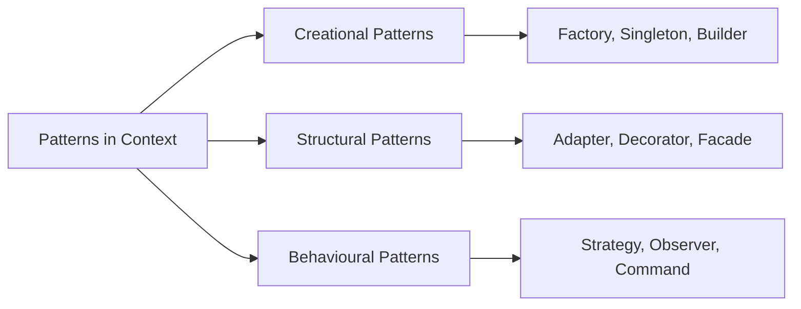

# Chapter 16: Design Patterns

> **Previous:** [15-concurrency](./15-concurrency.md) | **Next:** None

## Learning Objectives

After studying this chapter, students will be able to:

- Recognise when a design pattern is appropriate
- Implement creational patterns: Singleton, Factory Method, Builder
- Implement structural patterns: Adapter, Decorator, Facade
- Implement behavioural patterns: Observer, Strategy, Iterator
- Adapt classical patterns to idiomatic modern C++

## Chapter at a Glance

| Topic | Key Insight | Practical Takeaway |
|-------|-------------|-------------------|
| **Patterns in Context** | Proven solutions to recurring design problems | Patterns are guides, not recipes |
| **Creational Patterns** | Factory, Singleton, Builder, Prototype | Abstract object creation from clients |
| **Structural Patterns** | Adapter, Decorator, Facade, Composite | Compose classes into larger structures |
| **Behavioural Patterns** | Strategy, Observer, Command, Visitor | Define object interaction and responsibility |

## Chapter Roadmap



## 16.1 Patterns in Context


Design patterns are reusable solutions to recurring problems in software design. Catalogued by the "Gang of Four" (GoF) in 1994, they describe relationships and interactions between classes and objects. Patterns are not templates to be copied but rather conceptual guides to be adapted.

> **Remember:** Patterns are not silver bullets — applying a pattern to the wrong problem creates unnecessary complexity. Start simple and introduce patterns when a genuine need emerges.


Three categories:
- **Creational** — object creation mechanisms
- **Structural** — object composition and relationships
- **Behavioural** — object communication and responsibility

## 16.2 Creational Patterns

> **One-Sentence Takeaway:** Creational patterns (Factory, Singleton, Builder, Prototype) abstract object creation, decoupling clients from concrete types.
### 16.2.1 Singleton

The Singleton ensures a class has exactly one instance and provides a global access point.

```cpp
class Logger {
public:
    static Logger& instance() {
        static Logger instance;   // thread-safe in C++11
        return instance;
    }

    void log(const std::string& msg) {
        std::lock_guard<std::mutex> lock(mutex_);
        std::cout << "[LOG] " << msg << '\n';
    }

private:
    Logger() = default;
    ~Logger() = default;
    Logger(const Logger&) = delete;
    Logger& operator=(const Logger&) = delete;

    std::mutex mutex_;
};

// Usage:
Logger::instance().log("Application started");
```

Criticism: Singletons introduce global state, making testing difficult and hiding dependencies. Prefer dependency injection where feasible.

### 16.2.2 Factory Method

The Factory Method defines an interface for creating objects but lets subclasses decide which class to instantiate.

```cpp
class Product {
public:
    virtual ~Product() = default;
    virtual std::string operation() const = 0;
};

class ConcreteProductA : public Product {
public:
    std::string operation() const override {
        return "Product A";
    }
};

class ConcreteProductB : public Product {
public:
    std::string operation() const override {
        return "Product B";
    }
};

class Creator {
public:
    virtual ~Creator() = default;
    virtual std::unique_ptr<Product> factory_method() const = 0;

    std::string some_operation() const {
        auto product = factory_method();
        return "Creator: " + product->operation();
    }
};

class CreatorA : public Creator {
public:
    std::unique_ptr<Product> factory_method() const override {
        return std::make_unique<ConcreteProductA>();
    }
};

class CreatorB : public Creator {
public:
    std::unique_ptr<Product> factory_method() const override {
        return std::make_unique<ConcreteProductB>();
    }
};
```

### 16.2.3 Builder

The Builder separates the construction of a complex object from its representation, allowing the same construction process to create different representations.

```cpp
class Pizza {
public:
    void set_dough(const std::string& d) { dough_ = d; }
    void set_sauce(const std::string& s) { sauce_ = s; }
    void add_topping(const std::string& t) { toppings_.push_back(t); }
    void show() const {
        std::cout << "Pizza with " << dough_
                  << ", " << sauce_ << ", toppings: ";
        for (const auto& t : toppings_) std::cout << t << ' ';
        std::cout << '\n';
    }
private:
    std::string dough_;
    std::string sauce_;
    std::vector<std::string> toppings_;
};

class PizzaBuilder {
public:
    virtual ~PizzaBuilder() = default;
    virtual void build_dough() = 0;
    virtual void build_sauce() = 0;
    virtual void build_toppings() = 0;
    Pizza& result() { return pizza_; }
protected:
    Pizza pizza_;
};

class HawaiianPizzaBuilder : public PizzaBuilder {
public:
    void build_dough() override { pizza_.set_dough("pan"); }
    void build_sauce() override { pizza_.set_sauce("sweet"); }
    void build_toppings() override {
        pizza_.add_topping("ham");
        pizza_.add_topping("pineapple");
    }
};

class Director {
public:
    void construct(PizzaBuilder& builder) {
        builder.build_dough();
        builder.build_sauce();
        builder.build_toppings();
    }
};
```

## 16.3 Structural Patterns

> **One-Sentence Takeaway:** Structural patterns (Adapter, Decorator, Facade, Composite) compose classes and objects into larger structures.
### 16.3.1 Adapter

The Adapter converts one interface to another that the client expects.

```cpp
// Target interface
class Shape {
public:
    virtual void draw() = 0;
    virtual ~Shape() = default;
};

// Adaptee (incompatible interface)
class LegacyRectangle {
public:
    void display(int x, int y, int w, int h) {
        std::cout << "Rectangle at (" << x << "," << y
                  << "), size " << w << "x" << h << '\n';
    }
};

// Adapter
class RectangleAdapter : public Shape {
public:
    RectangleAdapter(int x, int y, int w, int h)
        : x_(x), y_(y), w_(w), h_(h) {}

    void draw() override {
        adaptee_.display(x_, y_, w_, h_);
    }

private:
    LegacyRectangle adaptee_;
    int x_, y_, w_, h_;
};
```

### 16.3.2 Decorator

The Decorator dynamically adds behaviour to an object without affecting others.

```cpp
class Coffee {
public:
    virtual ~Coffee() = default;
    virtual std::string description() const = 0;
    virtual double cost() const = 0;
};

class SimpleCoffee : public Coffee {
public:
    std::string description() const override { return "Coffee"; }
    double cost() const override { return 2.0; }
};

// Decorator base class
class CoffeeDecorator : public Coffee {
public:
    explicit CoffeeDecorator(std::unique_ptr<Coffee> coffee)
        : coffee_(std::move(coffee)) {}
protected:
    Coffee* wrapped() const { return coffee_.get(); }
private:
    std::unique_ptr<Coffee> coffee_;
};

class WithMilk : public CoffeeDecorator {
public:
    using CoffeeDecorator::CoffeeDecorator;
    std::string description() const override {
        return wrapped()->description() + ", milk";
    }
    double cost() const override {
        return wrapped()->cost() + 0.5;
    }
};

class WithSugar : public CoffeeDecorator {
public:
    using CoffeeDecorator::CoffeeDecorator;
    std::string description() const override {
        return wrapped()->description() + ", sugar";
    }
    double cost() const override {
        return wrapped()->cost() + 0.25;
    }
};

// Usage:
auto coffee = std::make_unique<WithMilk>(
    std::make_unique<WithSugar>(
        std::make_unique<SimpleCoffee>()));
std::cout << coffee->description() << ": $"
          << coffee->cost() << '\n';
```

### 16.3.3 Facade

The Facade provides a simplified interface to a complex subsystem.

```cpp
class CPU {
public:
    void power_on() { /* ... */ }
    void jump_to(size_t address) { /* ... */ }
};

class Memory {
public:
    void load(size_t address, const std::vector<uint8_t>& data) { /* ... */ }
};

class HardDrive {
public:
    std::vector<uint8_t> read(size_t sector, size_t size) { return {}; }
};

// Facade
class Computer {
public:
    void start() {
        cpu_.power_on();
        auto boot_data = hdd_.read(0, 512);
        mem_.load(0, boot_data);
        cpu_.jump_to(0);
        std::cout << "Computer started\n";
    }

private:
    CPU cpu_;
    Memory mem_;
    HardDrive hdd_;
};

// Client uses simple interface
int main() {
    Computer computer;
    computer.start();
}
```

## 16.4 Behavioural Patterns

> **One-Sentence Takeaway:** Behavioural patterns (Strategy, Observer, Command, Visitor) define how objects interact and distribute responsibility.
### 16.4.1 Observer

The Observer pattern defines a one-to-many dependency where state changes in one object are propagated to all dependents.

```cpp
class Observer {
public:
    virtual ~Observer() = default;
    virtual void update(const std::string& message) = 0;
};

class Subject {
public:
    void attach(std::shared_ptr<Observer> observer) {
        observers_.push_back(observer);
    }

    void notify(const std::string& message) {
        for (auto& obs : observers_) {
            if (auto ptr = obs.lock()) {
                ptr->update(message);
            }
        }
        // Clean up expired observers
        std::erase_if(observers_, [](const auto& wp) {
            return wp.expired();
        });
    }

private:
    std::vector<std::weak_ptr<Observer>> observers_;
};

class EmailNotifier : public Observer {
public:
    void update(const std::string& message) override {
        std::cout << "Email: " << message << '\n';
    }
};

class SMSNotifier : public Observer {
public:
    void update(const std::string& message) override {
        std::cout << "SMS: " << message << '\n';
    }
};

int main() {
    Subject subject;

    auto email = std::make_shared<EmailNotifier>();
    auto sms = std::make_shared<SMSNotifier>();

    subject.attach(email);
    subject.attach(sms);

    subject.notify("System update available");
}
```

### 16.4.2 Strategy

The Strategy pattern defines a family of interchangeable algorithms.

```cpp
class SortStrategy {
public:
    virtual ~SortStrategy() = default;
    virtual void sort(std::vector<int>& data) const = 0;
};

class BubbleSort : public SortStrategy {
public:
    void sort(std::vector<int>& data) const override {
        for (size_t i = 0; i < data.size(); ++i)
            for (size_t j = 0; j < data.size() - i - 1; ++j)
                if (data[j] > data[j + 1])
                    std::swap(data[j], data[j + 1]);
    }
};

class QuickSort : public SortStrategy {
public:
    void sort(std::vector<int>& data) const override {
        quicksort(data, 0, data.size() - 1);
    }

private:
    void quicksort(std::vector<int>& data,
                   size_t low, size_t high) const {
        if (low >= high) return;
        size_t pivot = partition(data, low, high);
        if (pivot > low)
            quicksort(data, low, pivot - 1);
        quicksort(data, pivot + 1, high);
    }

    size_t partition(std::vector<int>& data,
                     size_t low, size_t high) const {
        int pivot_val = data[high];
        size_t i = low;
        for (size_t j = low; j < high; ++j)
            if (data[j] < pivot_val)
                std::swap(data[i++], data[j]);
        std::swap(data[i], data[high]);
        return i;
    }
};

class Sorter {
public:
    explicit Sorter(std::unique_ptr<SortStrategy> strategy)
        : strategy_(std::move(strategy)) {}

    void set_strategy(std::unique_ptr<SortStrategy> strategy) {
        strategy_ = std::move(strategy);
    }

    void apply(std::vector<int>& data) const {
        strategy_->sort(data);
    }

private:
    std::unique_ptr<SortStrategy> strategy_;
};
```

### 16.4.3 Iterator

The Iterator pattern provides a way to access elements of an aggregate object sequentially without exposing its underlying representation. The STL's iterator model is the canonical C++ implementation.

```cpp
template <typename T>
class BinaryTree {
private:
    struct Node {
        T value;
        std::unique_ptr<Node> left;
        std::unique_ptr<Node> right;
    };

public:
    void insert(const T& value) { /* ... */ }

    // Iterator
    class InOrderIterator {
    public:
        using iterator_category = std::forward_iterator_tag;
        using value_type = T;
        using difference_type = std::ptrdiff_t;
        using pointer = const T*;
        using reference = const T&;

        InOrderIterator() = default;

        const T& operator*() const { return stack_.top()->value; }
        const T* operator->() const { return &stack_.top()->value; }

        InOrderIterator& operator++() {
            auto* node = stack_.top().get();
            stack_.pop();
            if (node->right) push_left(node->right.get());
            return *this;
        }

        bool operator!=(const InOrderIterator& other) const {
            return stack_ != other.stack_;
        }

    private:
        friend class BinaryTree;
        std::stack<const Node*> stack_;

        explicit InOrderIterator(const Node* root) {
            if (root) push_left(root);
        }

        void push_left(const Node* node) {
            while (node) {
                stack_.push(node);
                node = node->left.get();
            }
        }
    };

    InOrderIterator begin() const {
        return InOrderIterator(root_.get());
    }

    InOrderIterator end() const {
        return InOrderIterator();
    }

private:
    std::unique_ptr<Node> root_;
};
```

## Concept Comparison Table

| Category | Pattern | Purpose | Modern C++ Implementation |
|----------|---------|---------|-------------------------|
| Creational | Factory Method | Delegate object creation to subclasses | unique_ptr with polymorphic base |
| Creational | Singleton | Ensure single instance | Meyers singleton (static local) |
| Creational | Builder | Construct complex objects step by step | Chain fluent setters returning *this |
| Structural | Adapter | Convert one interface to another | Wrapper class with delegation |
| Structural | Decorator | Add responsibilities dynamically | Wrapper that forwards and extends |
| Structural | Facade | Simplified interface to subsystem | Single class delegating to subsystem |
| Behavioural | Strategy | Select algorithm at runtime | std::function or virtual interface |
| Behavioural | Observer | One-to-many dependency notification | std::function callbacks, signals |
| Behavioural | Command | Encapsulate request as object | std::function, packaged_task |

## Quick Reference

| Principle | Description |
|-----------|-------------|
| Program to interfaces, not implementations | Depend on abstract types, not concrete classes |
| Favour composition over inheritance | Compose behaviour through delegation rather than deep hierarchies |
| Single Responsibility | Each class should have one reason to change |
| Open/Closed | Open for extension, closed for modification |
| Dependency Inversion | Depend on abstractions, not concretions |

## Cross-Application Matrix

| Domain | How Concepts Apply |
|--------|-------------------|
| **Game Dev** | Strategy for AI behaviour, Observer for event systems, Command for input |
| **GUI Frameworks** | Observer for event handling, Decorator for widget styling, Command for undo |
| **Web Frameworks** | Factory for request handling, Strategy for authentication, Facade for API |
| **Compilers** | Visitor for AST traversal, Builder for code generation, Strategy for optimisation |
| **Middleware** | Adapter for protocol bridges, Facade for service interfaces, Proxy for lazy loading |

## Chapter Quiz

1. What is the main advantage of using the Factory Method pattern?
   A) It creates singletons
   B) It decouples client code from concrete types
   C) It improves runtime performance
   D) It reduces memory usage
   <details><summary>Answer</summary>**B)** Factory Method lets subclasses decide which concrete type to create, decoupling client code.</details>

2. The Meyers Singleton implementation uses:
   A) A global variable
   B) A static local variable inside a static method
   C) A shared_ptr
   D) A mutex-locked double-checked pattern
   <details><summary>Answer</summary>**B)** The Meyers Singleton uses a function-static local variable, which is thread-safe in C++11.</details>

3. Which pattern is best for adding behaviour to an object without affecting others of the same type?
   A) Adapter
   B) Decorator
   C) Facade
   D) Strategy
   <details><summary>Answer</summary>**B)** Decorator wraps an object to add responsibilities dynamically.</details>

4. The Observer pattern solves which problem?
   A) Object creation
   B) One-to-many dependency notification
   C) Algorithm selection
   D) Interface conversion
   <details><summary>Answer</summary>**B)** Observer establishes a one-to-many dependency: when one object changes, all dependents are notified.</details>

5. "Favour composition over inheritance" means:
   A) Never use inheritance
   B) Prefer delegating behaviour to contained objects over deep class hierarchies
   C) Use multiple inheritance whenever possible
   D) Inherit from std::enable_shared_from_this
   <details><summary>Answer</summary>**B)** Composition is more flexible than inheritance because behaviour can be changed at runtime.</details>

## 16.5 Summary

Design patterns capture proven solutions to recurring design problems. Creational patterns manage object creation, structural patterns compose objects, and behavioural patterns define communication. Modern C++ implements patterns with smart pointers, templates, and STL components. Patterns are guides, not prescriptions — adapt them to the specific problem rather than forcing a pattern into the code.

## Exercises

### Review Questions

1. What are the drawbacks of the Singleton pattern?
2. How does the Factory Method promote loose coupling?
3. Why is the Decorator pattern often preferred over subclassing?
4. What problem does the Facade pattern solve?
5. How do STL iterators embody the Iterator pattern?

### Application Problems

1. Implement a text formatter using the Strategy pattern. Define a `class TextFormatter` with strategies `UpperCase`, `LowerCase`, and `TitleCase`. Apply strategies to transform a `std::string`.
2. Create a simple logging system using the Observer pattern. The `Logger` (subject) broadcasts log messages. Implement `ConsoleObserver`, `FileObserver`, and `RemoteObserver` that each react to log events.

### Challenge Problem

3. Implement a simple dependency injection container using the Builder and Factory patterns together. The container should: register type mappings (interface to concrete implementation), support singleton and transient lifetimes, handle constructor dependency resolution recursively, and provide a `resolve<T>()` method that returns a `std::shared_ptr<T>`. Use `std::type_index` and `std::any` for type erasure. Demonstrate with a service layer that depends on a repository interface.
