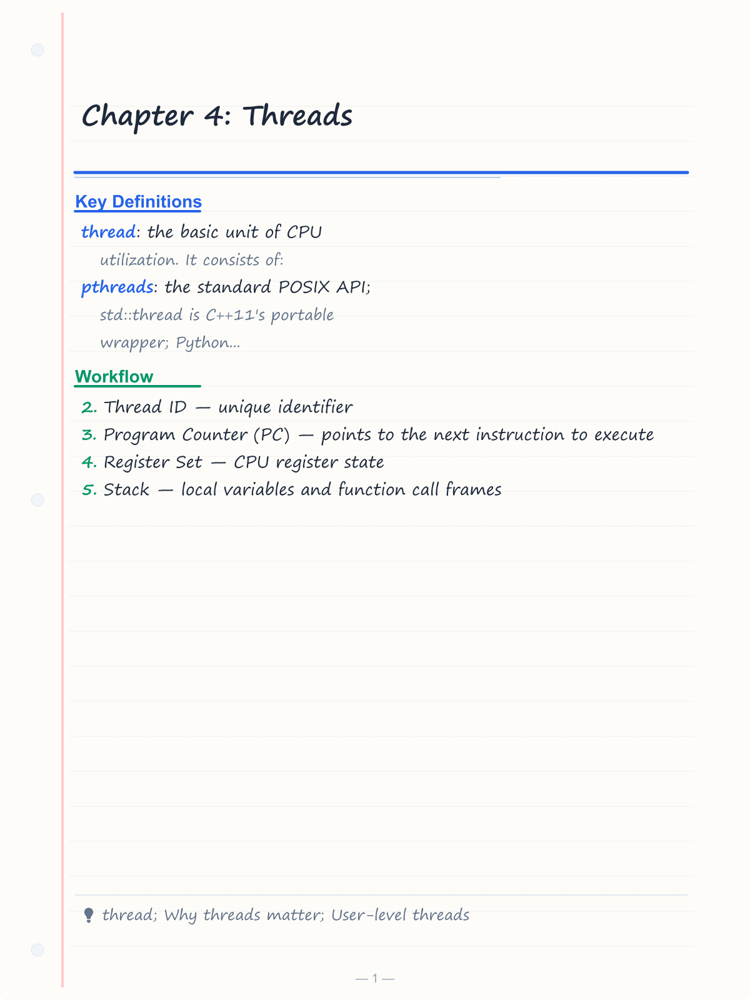
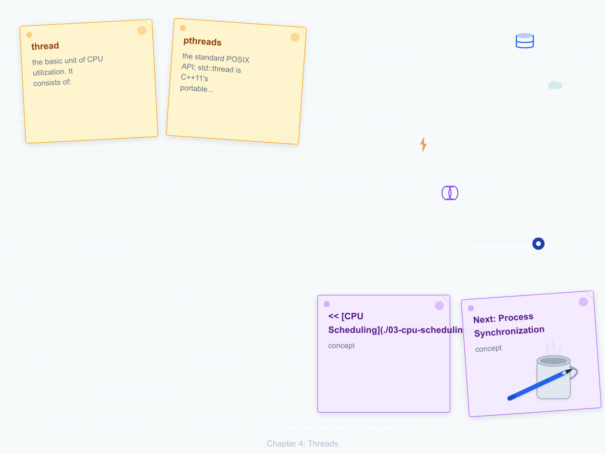
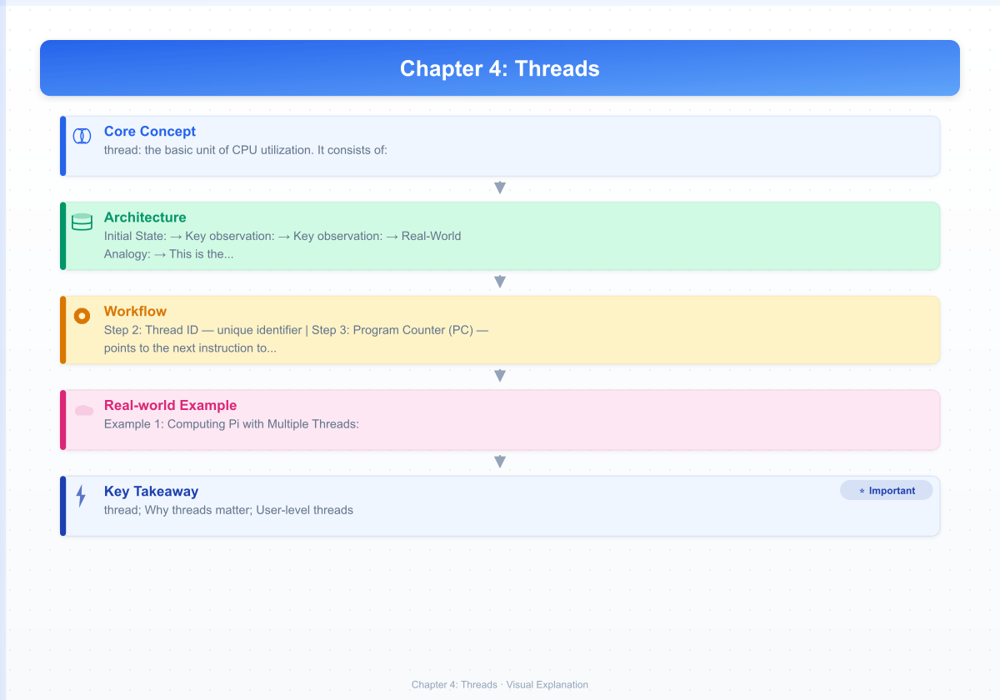

# Chapter 4: Threads

**<< [CPU Scheduling](./03-cpu-scheduling.md)** | [**Next: Process Synchronization**](./05-synchronization.md) >>

---

## Learning Objectives

- Define a thread and differentiate it from a process
- Compare user-level threads and kernel-level threads
- Explain the three multithreading models (many-to-one, one-to-one, many-to-many)
- Use POSIX threads (pthreads) for multithreaded programming
- Identify issues in multithreaded programs (safety, liveness, performance)
- Understand how threading maps to modern multicore hardware
- Implement multithreaded programs in C++ (std::thread) and Python (threading)

<!-- Image Gallery -->
<section class="lesson-visuals" aria-label="Visual learning resources">
  <header><span>VISUAL LEARNING</span><h2>See it. Review it. Remember it.</h2></header>
  <a class="lesson-visual-card" href="../../assets/images/lessons/operating-systems/04-threads/handwritten-notes.png" target="_blank" rel="noopener">
    
    <span><strong>Handwritten notes</strong>Condensed notes for deliberate review.</span>
  </a>
  <a class="lesson-visual-card" href="../../assets/images/lessons/operating-systems/04-threads/sticky-notes.png" target="_blank" rel="noopener">
    
    <span><strong>Sticky-note revision</strong>Fast recall prompts for revision.</span>
  </a>
  <a class="lesson-visual-card" href="../../assets/images/lessons/operating-systems/04-threads/visual-explanation.png" target="_blank" rel="noopener">
    
    <span><strong>Visual concept guide</strong>A connected explanation of the key ideas.</span>
  </a>
</section>
<!-- End Image Gallery -->


---

## Why Threads Matter

Imagine an office with **10 workers sharing one desk**. Each worker has their own notebook (stack) and pen (registers), but they share the same desk, reference books (code section), filing cabinet (data section), and phone line (file descriptors). When one worker gets a call (blocking I/O), the others keep working. If they each had their own separate desk (process), they would need 10 desks — costly space, slow to set up, and they can't easily share information.

**Threads are those workers sharing one desk.** A process is the desk itself. Threads within the same process share the address space but have their own stack and registers. This makes thread creation 10–100× faster than process creation because we don't duplicate the entire desk — just the notebook.

In modern computing:
- A **web server** handles 10,000+ concurrent connections using thread pools
- A **browser** uses one thread for rendering, one for networking, one for JavaScript
- A **database** uses threads for parallel query execution
- Your **OS** uses kernel threads to keep the UI responsive while background tasks run

Without threads, every concurrent task would require a separate process — more memory, slower creation, harder communication. Threads make concurrency practical.

---

## Chapter at a Glance

| Topic | Key Points |
|-------|------------|
| **Thread Concept** | Lightweight process; unit of CPU utilization with own stack/registers, shares address space |
| **Why Threads** | Responsiveness, resource sharing, economy, scalability |
| **User-Level Threads** | Managed by thread library; fast but kernel sees single process |
| **Kernel-Level Threads** | Managed by OS; slower but kernel schedules independently |
| **Multithreading Models** | Many-to-One, One-to-One, Many-to-Many, Two-Level |
| **Thread Libraries** | pthreads (POSIX), std::thread (C++), threading (Python) |
| **Thread Pools** | Pre-created threads for efficient task execution |
| **Threading Issues** | fork() safety, cancellation, signal handling, race conditions, deadlock |
| **Real Systems** | Linux NPTL (one-to-one), Windows (one-to-one), Java (JVM-threads), Go (goroutines) |

---

## Chapter Roadmap

<div class="mermaid">
flowchart LR
    A[Thread Concept] --> B[Why Threads Matter]
    B --> C[Thread vs Process]
    C --> D[User-Level vs Kernel-Level]
    D --> E[Multithreading Models]
    E --> F[Thread Libraries]
    F --> G[Thread Pools & Issues]
    G --> H[Interview Corner]
    H --> I[Real-World Applications]
    I --> J[Examples & Summary]
</div>

---

## Theory


---

### Thread Concept


#### Real-World Analogy

> **Office workers sharing a single desk.** Each worker gets their own notepad (stack) and pen (registers), but they all share the same desk surface (heap), reference library (code section), filing cabinet (global data), and office phone (file descriptors). Hiring a new worker just means handing them a fresh notepad — no need to buy a new desk.

#### Definition

A **thread** is the basic unit of CPU utilization. It consists of:
- **Thread ID** — unique identifier
- **Program Counter (PC)** — points to the next instruction to execute
- **Register Set** — CPU register state
- **Stack** — local variables and function call frames

Threads **share** with sibling threads within the same process:
- Code section (text)
- Data section (global variables, heap)
- Open file descriptors
- Signal handlers
- Current working directory
- User and group IDs

#### Visualization

```
Process Address Space
┌────────────────────────────────────┐
│          Code (text)               │  ← shared by all threads
├────────────────────────────────────┤
│          Data (globals)            │  ← shared by all threads
├────────────────────────────────────┤
│          Heap (dynamic)            │  ← shared by all threads
├──────────┬──────────┬──────────────┤
│ T1 Stack │ T2 Stack │ T3 Stack     │  ← each thread has its own
│ T1 PC/R  │ T2 PC/R  │ T3 PC/R      │
└──────────┴──────────┴──────────────┘
```

#### Numbered Steps of Thread Creation

1. Allocate a new thread control block (TCB) in the process's thread table
2. Assign a unique thread ID
3. Allocate a stack region (typically 1–8 MB for user threads)
4. Initialize the stack with the thread function's arguments
5. Set the program counter to the start of the thread function
6. Set the thread's register state to initial values
7. Add the thread to the ready queue
8. The scheduler eventually picks up the thread for execution

#### Pseudocode

```
FUNCTION CreateThread(start_function, arg):
    tcb = ALLOCATE_THREAD_CONTROL_BLOCK()
    tcb.id = NEXT_THREAD_ID()
    tcb.stack = ALLOCATE_STACK(STACK_SIZE)
    tcb.stack.InitializeWith(start_function, arg)
    tcb.pc = ADDRESS_OF(start_function)
    tcb.state = READY
    READY_QUEUE.ENQUEUE(tcb)
    RETURN tcb.id
END FUNCTION
```

#### Step-by-Step Dry Run: Creating Two Threads

Assume a single-core CPU. We create two threads that each print "Hello from thread X".

**Initial State:** Main thread (T_main) running, ready queue empty.

| Step | Action | Running | Ready Queue | Output |
|------|--------|---------|-------------|--------|
| 1 | T_main calls CreateThread("print_hello", arg1) | T_main | — | — |
| 2 | Allocate TCB for T1, stack=0x7f00, assign ID=1 | T_main | — | — |
| 3 | T1 state = READY, enqueue T1 | T_main | T1 | — |
| 4 | T_main calls CreateThread("print_hello", arg2) | T_main | T1 | — |
| 5 | Allocate TCB for T2, stack=0x8f00, assign ID=2 | T_main | T1 | — |
| 6 | T2 state = READY, enqueue T2 | T_main | T1, T2 | — |
| 7 | Timer interrupt → context switch needed | T_main | T1, T2 | — |
| 8 | Save T_main registers to its TCB | T_main | T1, T2 | — |
| 9 | Dequeue T1 from ready queue | T_main | T2 | — |
| 10 | Restore T1 registers from its TCB | T1 | T2 | — |
| 11 | T1 runs: set PC to print_hello | T1 | T2 | — |
| 12 | T1 loads arg into register, calls printf | T1 | T2 | "Hello from thread 1" |
| 13 | T1 returns, state = TERMINATED | T1 | T2 | — |
| 14 | Scheduler picks T2 | T1→T2 | — | — |
| 15 | Restore T2 registers | T2 | — | — |
| 16 | T2 runs print_hello | T2 | — | "Hello from thread 2" |
| 17 | T2 returns, state = TERMINATED | T2 | — | — |

#### C++ Implementation (std::thread)

```cpp
#include <iostream>
#include <thread>
#include <vector>

void print_hello(int id) {
    std::cout << "Hello from thread " << id << " (tid: "
              << std::this_thread::get_id() << ")" << std::endl;
}

int main() {
    std::vector<std::thread> threads;
    const int NUM_THREADS = 5;

    for (int i = 0; i < NUM_THREADS; ++i) {
        threads.emplace_back(print_hello, i);
    }

    for (auto& t : threads) {
        t.join();
    }

    std::cout << "Main: All threads done." << std::endl;
    return 0;
}
```

Compile with: `g++ -std=c++11 -pthread program.cpp -o program`

#### Python Implementation (threading)

```python
import threading
import time

def print_hello(id):
    print(f"Hello from thread {id} (tid: {threading.get_ident()})")

threads = []
NUM_THREADS = 5

for i in range(NUM_THREADS):
    t = threading.Thread(target=print_hello, args=(i,))
    threads.append(t)
    t.start()

for t in threads:
    t.join()

print("Main: All threads done.")
```

#### Complexity Analysis

| Operation | Time Complexity | Why |
|-----------|----------------|-----|
| Thread creation | O(1) | Allocate TCB + stack — fixed-size operations |
| Thread termination | O(1) | Mark TCB as free, release stack |
| Thread context switch | O(1) | Save/restore ~20 registers — constant time |
| Thread join | O(1) | Check termination flag, block if not done |
| Thread creation (kernel-level) | O(n) where n = threads in process | Kernel must update scheduler data structures |
| Memory overhead per thread | O(S) where S = stack size | Typically 1–8 MB for user stack, ~16 KB for kernel stack |

#### Advantages of Threads

| Advantage | Explanation |
|-----------|-------------|
| Responsiveness | Program stays responsive even if one thread blocks (e.g., UI thread while network thread waits) |
| Resource Sharing | Threads automatically share address space — no need for IPC mechanisms |
| Economy | Thread creation is 10–100× cheaper than process creation; context switch is 5–10× faster |
| Scalability | Threads can execute in parallel on multiple CPU cores |
| Communication | Threads communicate via shared memory — no pipes, sockets, or shared memory syscalls needed |

#### Disadvantages of Threads

| Disadvantage | Explanation |
|--------------|-------------|
| No protection between threads | One thread's wild pointer can corrupt another thread's stack |
| Synchronization complexity | Shared data requires locks, mutexes, semaphores — easy to introduce deadlocks |
| Debugging difficulty | Non-deterministic interleaving makes bugs hard to reproduce |
| Signal handling ambiguity | Which thread receives an asynchronous signal? |
| Stack size limitation | Thread stacks are fixed-size — recursion-heavy code can overflow |

#### Edge Cases

1. **Thread safety**: If two threads write to the same global variable without synchronization, the result is undefined (data race). Example: `counter++` compiles to load-increment-store — two threads can interleave and lose one update.

2. **Race condition**: The outcome depends on the non-deterministic ordering of thread execution. A classic race: thread A checks if a file exists, thread B deletes it, then thread A tries to open it.

3. **Stack overflow**: Each thread has a fixed stack size (default ~8 MB on Linux, ~1 MB on Windows). Deep recursion or large stack allocations cause SIGSEGV. Use `pthread_attr_setstacksize()` to adjust.

4. **Thread creation failure**: If the system runs out of memory or reaches the thread limit (`/proc/sys/kernel/threads-max`), `pthread_create()` returns EAGAIN.

5. **Detached threads**: If a detached thread's function throws an unhandled exception (C++) or raises an exception (Python), the program terminates — there is no way to join and retrieve the exception.

6. **False sharing**: Two threads modify different variables that happen to share the same cache line. The cache coherency protocol forces constant invalidation, killing performance (this is not a correctness bug but a performance disaster).

---

### Thread vs Process Comparison


| Aspect | Process | Thread |
|--------|---------|--------|
| Address space | Separate | Shared |
| Creation time | Slow (fork + COW setup) | Fast (allocate TCB + stack) |
| Context switch | Heavy (MMU, TLB flush, page table switch) | Lightweight (register save/restore only) |
| Communication | IPC (pipes, shared memory, sockets, signals) | Direct memory access (shared globals) |
| Protection | OS-enforced isolation (segfault in one process doesn't affect others) | Programmer-managed (one thread crash = whole process crash) |
| Resource overhead | High (PCB, page tables, file descriptor table, signal table) | Low (just TCB + stack) |
| Multiprocessor scaling | Yes — processes can run on different cores | Yes — threads can run on different cores |
| Ownership | Owns resources (files, sockets, signals) | Shares process resources |
| Number limit | Lower (constrained by memory for address space) | Higher (thousands per process possible) |

---

### User-Level Threads


#### Real-World Analogy

> **A library with self-organizing reading groups.** A librarian (kernel) sees only one "group" checking in. Inside, the group coordinator (thread library) splits readers into smaller circles (threads). When one reader wants a new book, the coordinator quickly swaps them — no librarian needed. But if the whole group needs to check out together (blocking syscall), everyone waits.

#### Definition

User-level threads are managed entirely by a **thread library in user space** without any kernel involvement. The kernel sees only a single process with one program counter. The thread library handles creation, scheduling, and switching entirely in user mode.

#### How It Works

1. Thread library maintains a **thread table** in user space (one entry per thread: PC, register state, stack pointer, state)
2. The library implements its own scheduler (Round Robin, Priority, etc.)
3. Thread switching is done by **saving registers** to the thread table and **loading registers** from the next thread
4. A timer signal (SIGALRM, SIGVTALRM) can preempt the current thread

#### Numbered Steps of User-Level Thread Creation

1. Thread library function (e.g., `thread_create()`) is called
2. Library allocates a new entry in the user-space thread table
3. Library allocates a stack from the process heap (using `malloc`)
4. Library initializes the stack frame with the thread function and arguments
5. Library sets the thread state to READY
6. Library adds the thread to its internal ready queue
7. No system call is made — the kernel is not involved

#### User-Level Thread Context Switch (Numbered Steps)

1. Running thread calls `thread_yield()` or a timer signal fires
2. Library saves the current thread's registers (PC, SP, general-purpose registers) into the thread table
3. Library sets the current thread's state to READY and enqueues it in the ready queue
4. Library dequeues the next thread from the ready queue
5. Library sets the next thread's state to RUNNING
6. Library restores the next thread's registers from the thread table
7. Library executes a `ret` or `jmp` instruction to the next thread's saved PC
8. The next thread resumes execution — **no system call, no kernel trap, no mode switch**

#### Pseudocode

```
FUNCTION UserThreadCreate(start_func, arg):
    tcb = MALLOC(sizeof(ThreadControlBlock))
    tcb.id = next_thread_id++
    tcb.stack = MALLOC(STACK_SIZE)
    tcb.stack.InitializeWith(start_func, arg)
    tcb.pc = start_func
    tcb.sp = tcb.stack + STACK_SIZE  // stack grows down
    tcb.state = READY
    ready_queue.APPEND(tcb)
    return tcb.id

FUNCTION UserThreadYield():
    running_tcb = ready_queue.REMOVE_CURRENT()
    SAVE_REGISTERS(running_tcb)
    running_tcb.state = READY
    ready_queue.APPEND(running_tcb)
    next_tcb = ready_queue.REMOVE_NEXT()
    next_tcb.state = RUNNING
    RESTORE_REGISTERS(next_tcb)
    JUMP_TO(next_tcb.pc)
```

#### Step-by-Step Dry Run: User-Level Thread Switch

Two user-level threads T1 and T2 are managed by the thread library. No kernel-level threads exist.

| Step | Action | Running | Ready Queue | Syscall? | Time |
|------|--------|---------|-------------|----------|------|
| 1 | T1 calls `thread_yield()` | T1 | T2 | No | t=10 |
| 2 | Library saves T1's registers (eax=0x5, ebx=0x... , esp=0x7f00, eip=0x4012) | T1→save | T2 | No | t=10 |
| 3 | Library sets T1.state = READY | — | T2, T1 | No | t=10 |
| 4 | Library dequeues T2 from ready queue | — | T1 | No | t=10 |
| 5 | Library sets T2.state = RUNNING | — | T1 | No | t=11 |
| 6 | Library restores T2's registers (eax=0x0, esp=0x8f00, eip=0x402a) | — | T1 | No | t=11 |
| 7 | Library jumps to T2's saved PC (0x402a) | T2 | T1 | No | t=11 |
| 8 | T2 resumes execution | T2 | T1 | No | t=11 |

**Key observation:** Total context switch time ≈ 5–10 μs (just register save/restore + queue operations). No system call. No mode switch (user→kernel→user).

#### C++ Simulation (User-Level Threads using ucontext)

```cpp
#include <iostream>
#include <ucontext.h>
#include <vector>

ucontext_t main_ctx, t1_ctx, t2_ctx;
char t1_stack[8192], t2_stack[8192];

void thread_function_1() {
    std::cout << "Thread 1: Running" << std::endl;
    swapcontext(&t1_ctx, &main_ctx);  // yield back to main
    std::cout << "Thread 1: Resumed" << std::endl;
}

void thread_function_2() {
    std::cout << "Thread 2: Running" << std::endl;
    swapcontext(&t2_ctx, &main_ctx);  // yield back to main
    std::cout << "Thread 2: Resumed" << std::endl;
}

int main() {
    getcontext(&t1_ctx);
    t1_ctx.uc_link = &main_ctx;
    t1_ctx.uc_stack.ss_sp = t1_stack;
    t1_ctx.uc_stack.ss_size = sizeof(t1_stack);
    makecontext(&t1_ctx, thread_function_1, 0);

    getcontext(&t2_ctx);
    t2_ctx.uc_link = &main_ctx;
    t2_ctx.uc_stack.ss_sp = t2_stack;
    t2_ctx.uc_stack.ss_size = sizeof(t2_stack);
    makecontext(&t2_ctx, thread_function_2, 0);

    std::cout << "Main: Starting threads..." << std::endl;
    swapcontext(&main_ctx, &t1_ctx);  // start T1
    std::cout << "Main: Back from T1" << std::endl;
    swapcontext(&main_ctx, &t2_ctx);  // start T2
    std::cout << "Main: Back from T2" << std::endl;

    return 0;
}
```

#### Python Implementation (user-level — threading module)

Python threads are user-level from the language perspective (managed by the Python interpreter) but are backed by kernel threads in CPython:

```python
import threading
import time

result = []

def worker(name):
    for i in range(3):
        result.append(f"{name}: iteration {i}")
        time.sleep(0.001)  # yield opportunity

threads = []
for name in ["A", "B", "C"]:
    t = threading.Thread(target=worker, args=(name,))
    threads.append(t)
    t.start()

for t in threads:
    t.join()

for line in result:
    print(line)
```

#### Complexity Analysis

| Operation | Time Complexity | Why |
|-----------|----------------|-----|
| User-level thread creation | O(1) | Just malloc TCB + stack — no syscall |
| User-level context switch | O(1) | Save/restore ~20 registers — no kernel trap |
| User-level thread join | O(1) | Check a flag in the TCB, busy-wait or yield |
| Blocking on I/O in one ULT | Blocks all — kernel unaware of individual ULTs |
| Creating N user-level threads | O(N) | N allocations, no kernel involvement per thread |

#### Advantages of User-Level Threads

| Advantage | Explanation |
|-----------|-------------|
| Ultra-fast creation | No system call — pure user-space allocation |
| Ultra-fast context switch | Save/restore registers — ~5–10 μs vs ~50–100 μs for kernel threads |
| OS-independent | Works on any OS that supports processes |
| Custom scheduling | Library can implement application-specific scheduling policies (e.g., priority, deadline) |
| Low memory overhead | Only a TCB and a stack — no kernel stack or kernel TCB |
| No kernel involvement | No traps, no mode switches — all operations in user space |

#### Disadvantages of User-Level Threads

| Disadvantage | Explanation |
|--------------|-------------|
| No true parallelism | Kernel schedules the process, not individual threads — one thread at a time |
| Blocking syscall blocks all | If one thread calls read(), the entire process blocks — kernel doesn't know about other threads |
| Page fault blocks all | When one thread causes a page fault, the entire process waits for the page I/O |
| Cannot leverage multi-core | Only one kernel thread = only one CPU core used |
| Thread library complexity | Custom scheduler, timer management, signal handling — all in user space |
| Priority inversion awareness | No way to signal the kernel about thread priorities |

#### Edge Cases

1. **Deadlock in user space**: If the thread library's scheduler holds a lock while yielding, other threads can't acquire it — the library must be reentrant.

2. **Blocking I/O in one thread**: If T1 calls `read(fd, buf, 1024)` and the file descriptor blocks, the kernel puts the entire process to sleep. T2 never runs even if it has work to do. Solution: use non-blocking I/O or check `select()` before reading.

3. **Timer signal race**: If the thread library uses SIGVTALRM for preemption, a signal arriving during a library function can corrupt the thread table unless signals are masked during critical sections.

4. **Stack exhaustion**: With thousands of threads, total stack memory can exhaust the address space. Each thread's stack is allocated from the process heap — no swap or kernel stack to fall back on.

5. **Non-preemptive library**: If the library is cooperative (yield-based), one thread in an infinite loop halts all others — no preemption mechanism exists.

---

### Kernel-Level Threads


#### Real-World Analogy

> **A restaurant with individual waitstaff.** Each waiter (kernel thread) is separately employed and managed by the manager (kernel). If one waiter takes a long time at a table, the others keep serving. The manager can assign waiters to different sections (CPU cores). Each waiter has their own notepad and apron (stack + registers) but shares the restaurant's kitchen (process resources).

Waitstaff can serve different tables in parallel (parallelism) and each waiter works independently — if one is slow, it doesn't affect others (independent blocking).

#### Definition

Kernel-level threads are managed directly by the **operating system kernel**. Each thread is a separately schedulable entity. The kernel maintains a thread control block (TCB) in kernel space for every thread.

#### How It Works

1. The kernel maintains a **thread table** in kernel space (one entry per thread system-wide)
2. Each thread has its own **kernel stack** for handling system calls
3. Thread creation, scheduling, and synchronization are done via **system calls**
4. The kernel scheduler treats each thread as an independent schedulable entity
5. On Linux, `clone()` is the system call that creates kernel threads (with CLONE_VM flag to share address space)

#### Numbered Steps of Kernel-Level Thread Creation

1. Application calls `pthread_create()` (user space)
2. The pthread library calls the `clone()` system call (or equivalent on other OS)
3. Kernel allocates a new thread ID (TID) system-wide
4. Kernel allocates a thread control block (TCB) in kernel memory
5. Kernel allocates a kernel stack (~16 KB) for handling syscalls and exceptions
6. Kernel sets up the user-space stack and instruction pointer
7. Kernel adds the thread to the scheduler's ready queue
8. `clone()` returns to user space with the new thread's TID
9. The user-space thread continues from `clone()` return in parallel

#### Kernel-Level Thread Context Switch (Numbered Steps)

1. Timer interrupt fires → CPU enters kernel mode (mode switch)
2. Kernel saves the current thread's registers onto its kernel stack
3. Kernel saves the kernel stack pointer into the TCB
4. Kernel calls the scheduler to pick the next thread
5. Scheduler selects the next thread (may be from a different process)
6. If switching processes: switch page table (CR3 register) — TLB flush needed
7. Kernel loads the next thread's kernel stack pointer from its TCB
8. Kernel restores the next thread's saved registers from its kernel stack
9. CPU returns to user mode (mode switch) — thread resumes

#### Pseudocode

```
FUNCTION KernelThreadCreate(start_func, arg):
    tid = ALLOCATE_THREAD_ID()
    tcb = ALLOCATE_KERNEL_TCB()
    tcb.tid = tid
    tcb.pid = CURRENT_PROCESS.pid
    tcb.user_stack = ALLOCATE_USER_STACK(USER_STACK_SIZE)
    tcb.kernel_stack = ALLOCATE_KERNEL_STACK(KERNEL_STACK_SIZE)
    tcb.pc = start_func
    tcb.registers = INITIAL_REGISTER_STATE
    tcb.page_table = CURRENT_PROCESS.page_table  // shared!
    tcb.state = READY
    SCHEDULER.ENQUEUE(tcb)
    return tid

FUNCTION KernelThreadSwitch():
    SAVE_REGISTERS_TO_KERNEL_STACK(CURRENT_THREAD)
    SAVE_KERNEL_SP_TO_TCB(CURRENT_THREAD)
    CURRENT_THREAD.state = READY
    SCHEDULER.ENQUEUE(CURRENT_THREAD)
    next_thread = SCHEDULER.DEQUEUE()
    IF next_thread.pid != CURRENT_THREAD.pid:
        SWITCH_PAGE_TABLE(next_thread.page_table)  // expensive!
    LOAD_KERNEL_SP_FROM_TCB(next_thread)
    RESTORE_REGISTERS_FROM_KERNEL_STACK(next_thread)
    RETURN_TO_USER_MODE()
```

#### Step-by-Step Dry Run: Kernel-Level Context Switch

Two kernel threads K1 and K2 in the same process on a single-core CPU.

| Step | Action | Mode | Running | Ready Queue | Time |
|------|--------|------|---------|-------------|------|
| 1 | K1 is running user code | User | K1 | K2 | t=50 |
| 2 | Timer interrupt fires → CPU enters kernel mode | Kernel | K1 | K2 | t=50 |
| 3 | CPU pushes registers (eax, ebx, ecx, edx, esi, edi, ebp, esp, eip, eflags) onto K1's kernel stack | Kernel | K1 | K2 | t=51 |
| 4 | Kernel saves kernel_stack_pointer to K1's TCB | Kernel | K1 | K2 | t=51 |
| 5 | Scheduler called → selects K2 | Kernel | K1 | K2 | t=51 |
| 6 | K1.state = READY, enqueue K1 | Kernel | — | K2, K1 | t=52 |
| 7 | K2.state = RUNNING, dequeue K2 | Kernel | — | K1 | t=52 |
| 8 | Load K2's kernel_stack_pointer from K2's TCB | Kernel | — | K1 | t=52 |
| 9 | Pop registers from K2's kernel stack | Kernel | — | K1 | t=53 |
| 10 | `iret` instruction → return to user mode | User | K2 | K1 | t=53 |
| 11 | K2 resumes execution | User | K2 | K1 | t=53 |

**Key observation:** Total context switch ≈ 50–100 μs. Includes two mode switches (user→kernel→user), two stack operations, and scheduler dispatch. The TLB flush is avoided here because K1 and K2 share the same address space.

#### C++ Implementation (kernel threads via std::thread)

```cpp
#include <iostream>
#include <thread>
#include <mutex>
#include <vector>

std::mutex print_mutex;

void worker(int id, int iterations) {
    for (int i = 0; i < iterations; ++i) {
        std::lock_guard<std::mutex> lock(print_mutex);
        std::cout << "Kernel thread " << id
                  << " (system thread: " << std::this_thread::get_id()
                  << ") iteration " << i << std::endl;
    }
}

int main() {
    std::vector<std::thread> threads;
    const int NUM_THREADS = 4;

    for (int i = 0; i < NUM_THREADS; ++i) {
        threads.emplace_back(worker, i, 3);
    }

    std::cout << "Main: " << NUM_THREADS
              << " kernel threads created. They may run in parallel."
              << std::endl;

    for (auto& t : threads) {
        t.join();
    }

    std::cout << "Main: All threads completed." << std::endl;
    return 0;
}
```

#### Python Implementation (threading — actually kernel-backed)

```python
import threading
import os

def worker(id, iterations):
    for i in range(iterations):
        print(f"Kernel thread {id} (PID: {os.getpid()}, TID: {threading.get_ident()}) iteration {i}")

threads = []
NUM_THREADS = 4

for i in range(NUM_THREADS):
    t = threading.Thread(target=worker, args=(i, 3))
    threads.append(t)
    t.start()

print(f"Main: {NUM_THREADS} threads started (process PID: {os.getpid()})")

for t in threads:
    t.join()

print("Main: All threads done.")
```

#### Complexity Analysis

| Operation | Time Complexity | Why |
|-----------|----------------|-----|
| Kernel thread creation | O(1) | System call, allocate TCB + stacks — ~100× slower than user-level |
| Kernel context switch | O(1) | Save/restore registers + mode switch (user↔kernel) — ~50–100 μs |
| Scheduler dispatch | O(n) or O(1) | Depends on scheduler (O(1) in Linux CFS, O(n) in older schedulers) |
| Page table switch | O(1) | Single CR3 register write, but **TLB flush invalidates all cached translations** |
| Thread join (kernel) | O(1) | Wait on kernel-managed futex/event object |
| Blocking I/O | Only the calling thread blocks — other threads in process continue |
| Multiprocessor parallelism | Full — each kernel thread can run on a different CPU core |

#### Advantages of Kernel-Level Threads

| Advantage | Explanation |
|-----------|-------------|
| True parallelism | Kernel schedules each thread independently — can run on multiple cores simultaneously |
| Independent blocking | One thread blocking on I/O doesn't affect others in the same process |
| Preemption | Kernel can preempt any thread at any time via timer interrupt — no cooperative yielding needed |
| System call safety | Each thread has its own kernel stack — simultaneous system calls from different threads are safe |
| Priority scheduling | Kernel can prioritize threads by type (UI thread gets higher priority than background computation) |
| Signal handling | Kernel can deliver signals to specific threads (synchronous signals go to the offending thread) |

#### Disadvantages of Kernel-Level Threads

| Disadvantage | Explanation |
|--------------|-------------|
| Slow creation and switching | Requires system call (mode switch) — 50–100 μs vs 5–10 μs for user-level |
| Higher memory overhead | Each thread needs a kernel stack (~16 KB) and a TCB in non-swappable kernel memory |
| OS-specific API | pthreads (POSIX), Windows Thread API, Solaris threads — not portable at system-call level |
| Scalability limits | Creating 10,000 kernel threads consumes significant kernel memory and scheduler overhead |
| Context switch penalty | Full register save/restore + mode switch = ~10× slower than user-level |
| Portability | Kernel threading models differ between OSes (Linux one-to-one, older Solaris many-to-many) |

#### Edge Cases

1. **Thread limits**: Linux limits threads per user (`/proc/sys/kernel/threads-max`, typically ~100,000) and per process (`/proc/sys/vm/max_map_count`). Exceeding these causes `EAGAIN`.

2. **Stack overflow**: Kernel thread stack overflow writes into the guard page → SIGSEGV → whole process crashes. The kernel can detect this if guard pages are enabled (`/proc/sys/vm/mmap_min_addr`).

3. **Priority inversion**: A high-priority thread waits for a lock held by a low-priority thread that's been preempted by medium-priority threads. Linux addresses this with priority inheritance (RT mutexes).

4. **Thread explosion**: Creating too many kernel threads causes scheduler thrashing — the kernel spends more time switching between threads than doing useful work.

5. **fork() in threaded programs**: Linux's `fork()` duplicates only the calling thread in the child process. If the child doesn't call `exec()` immediately, the other threads' states are lost — mutexes they held become permanently locked.

6. **setuid() in threads**: When one thread calls `setuid()`, should all threads in the process change their UID? POSIX says yes, but signal delivery semantics become ambiguous.

### User-Level vs Kernel-Level Threads — Full Comparison


| Feature | User-Level Threads | Kernel-Level Threads |
|---------|-------------------|---------------------|
| **Managed by** | Thread library in user space | OS kernel |
| **Creation speed** | ~5–10 μs (no system call) | ~50–200 μs (clone syscall) |
| **Context switch speed** | ~5–10 μs (register save/restore only) | ~50–100 μs (mode switch + register save/restore) |
| **Parallelism** | None (kernel sees one process) | Full (kernel schedules each thread independently) |
| **Blocking I/O** | Blocks ALL threads in the process | Blocks only the calling thread |
| **Memory overhead** | Low (TCB + user stack only) | High (TCB + kernel stack + user stack) |
| **Kernel stack** | Not needed | ~16 KB per thread (non-swappable) |
| **OS awareness** | Kernel is completely unaware | Kernel sees and manages each thread |
| **Scheduling** | Application-defined (cooperative or custom preemptive) | OS-defined (Round Robin, CFS, priority-based) |
| **Multi-core usage** | Cannot utilize multiple cores | Full multi-core utilization |
| **Thread count limit** | Can create thousands (limited by heap memory) | Limited by kernel memory and process limits |
| **System call overhead** | System call blocks entire process | System call affects only the calling thread |
| **Portability** | Works on any OS with process support | OS-specific APIs (pthreads is portable library interface) |
| **Debugging** | Harder — debugger sees only the process | Easier — OS debugger sees individual threads |
| **Preemption** | Requires timer signal (SIGVTALRM) or cooperative yield | Full kernel preemption via timer interrupt |
| **Priority inheritance** | Not possible (kernel doesn't know about thread states) | Possible (kernel can boost priority of lock holder) |
| **Examples** | GNU Pth, early Solaris threads, fibers | Linux NPTL, Windows threads, Solaris 9+ |
| **Fork in threaded program** | Duplicates entire user-level thread state | `fork()` duplicates only the calling kernel thread |

---

### Multithreading Models


#### Real-World Analogy

> **A company's project management structure.** Different ways to organize teams and managers:
> - **Many-to-One**: Many employees (threads) report to one manager (kernel thread). If the manager is in a meeting, nobody can work. Simple but inefficient.
> - **One-to-One**: Each employee has their own manager. Expensive (many managers) but everyone can work independently.
> - **Many-to-Many**: Employees are grouped into teams, each team has a manager. Fewer managers than employees, but managers can be dynamically reassigned.

#### Overview of Models

| Model | User Threads : Kernel Threads | Parallelism | Blocking | Complexity | Used In |
|-------|------------------------------|-------------|----------|------------|---------|
| Many-to-One | N : 1 | None | One blocks all | Low (user library only) | Solaris Green Threads, GNU Pth |
| One-to-One | N : N | Full | Independent blocking | Moderate (kernel TCB per thread) | Linux NPTL, Windows, Solaris 9+ |
| Many-to-Many | N : M (M &lt;= N) | Partial | Library-controlled | High (two schedulers) | Solaris 8, IRIX |
| Two-Level | N : M + 1:1 optional | Full for bound threads | Mixed | Very high | Solaris 8-9 (hybrid) |

---

#### Many-to-One Model

Many user-level threads (N) are mapped to a single kernel thread (1).

```
User space:    T1    T2    T3    T4    T5
                 \    |    /
Kernel space:       K1          (single kernel entity)
```

**Real-World Analogy:** A self-service checkout line. Multiple customers (threads) share one machine (kernel thread). If one customer has a price check (blocks), the entire line stops. Quick and cheap to add customers, but terrible throughput.

##### Numbered Steps

1. Thread library creates N user-level threads
2. All N threads are mapped to the single kernel thread
3. The kernel sees one process with one PC — it cannot distinguish threads
4. The thread library handles scheduling in user space
5. When any thread makes a blocking system call, the kernel blocks the entire process (all threads)
6. The thread library can use non-blocking I/O to mitigate blocking

##### Pseudocode

```
FUNCTION ManyToOneCreate(T count):
    kernel_thread = KERNEL_CREATE_THREAD()
    FOR i = 1 TO count:
        user_tcb = ALLOC_USER_TCB()
        user_tcb.map_to = kernel_thread
        user_lib.ready_queue.ENQUEUE(user_tcb)
    RETURN

FUNCTION ManyToOneSchedule():
    next = user_lib.ready_queue.DEQUEUE()
    user_lib.SWITCH_TO(next)
    // no kernel involvement — pure user space
```

##### Dry Run: Many-to-One Blocking Behavior

Two user threads T1 (doing file read) and T2 (computation). Single kernel thread K1.

| Step | Action | User Running | Kernel Running | Output |
|------|--------|-------------|----------------|--------|
| 1 | T1 runs, calls read(fd, buf, 1024) | T1 | K1 | — |
| 2 | Library sees T1 will block | T1 | K1 | — |
| 3 | Library switches to T2 (user space) | T1→T2 | K1 | — |
| 4 | T2 runs computation | T2 | K1 | "Computing..." |
| 5 | T2 eventually calls read() — library has no choice but to use kernel read | T2 | K1 | — |
| 6 | **Kernel blocks K1** (single kernel thread) → **T1 and T2 both block** | blocked | blocked | — |
| 7 | **No progress possible** until the file read completes | blocked | blocked | — |

**This is the fundamental problem:** even though T1 was ready, it got blocked because T2 made a blocking call. In one-to-one, T2 would block alone and T1 would continue.

##### C++ Simulation

```cpp
#include <iostream>
#include <thread>
#include <atomic>

// Simulates many-to-one model — all threads share a single worker thread
class ManyToOnePool {
    std::thread worker;
    std::atomic<bool> running{false};
public:
    void start() {
        running = true;
        worker = std::thread([this] {
            while (running) {
                std::cout << "[Kernel thread] Running user tasks (one at a time)" << std::endl;
                std::this_thread::sleep_for(std::chrono::milliseconds(500));
            }
        });
    }
    void stop() { running = false; if (worker.joinable()) worker.join(); }
};

int main() {
    ManyToOnePool pool;
    pool.start();
    std::cout << "Many-to-One: All user threads map to one kernel thread" << std::endl;
    std::this_thread::sleep_for(std::chrono::seconds(2));
    pool.stop();
    return 0;
}
```

##### Python Implementation

```python
import threading
import time

# Simulating many-to-one: Python threads with GIL act similar to many-to-one
# (only one thread runs Python bytecode at a time due to GIL)
shared_resource = 0

def user_thread(name):
    global shared_resource
    for i in range(5):
        shared_resource += 1
        print(f"User thread {name}: iteration {i}, shared={shared_resource}")
        time.sleep(0.01)  # yield

threads = [threading.Thread(target=user_thread, args=(chr(65+i),)) for i in range(3)]
for t in threads: t.start()
for t in threads: t.join()
print(f"Final shared: {shared_resource}")
```

##### Complexity Analysis

| Operation | Complexity | Why |
|-----------|------------|-----|
| Thread creation | O(1) | Just alloc user TCB — no kernel involvement |
| Context switch | O(1) | Pure user-space register save/restore |
| Blocking I/O impact | Blocks N threads | Single kernel thread means any block stops all |
| Parallelism | None | One kernel thread = one CPU core |
| Memory per thread | ~8 KB stack + TCB | No kernel stack per thread |

##### Advantages & Disadvantages

| Advantages | Disadvantages |
|------------|---------------|
| Very fast thread creation and switching | No true parallelism on multi-core |
| Minimal memory overhead | Blocking system call blocks ALL threads |
| OS-independent — works anywhere | Page fault blocks entire process |
| Custom scheduling policy | Cannot preempt threads (unless SIGVTALRM) |
| Can create thousands of threads | Thread library complexity increases |

##### Edge Cases

1. **Cooperative vs preemptive scheduling**: If threads are cooperative (yield-based), one thread in an infinite loop blocks everyone — even if other threads have urgent work.

2. **Non-blocking I/O requirement**: To mitigate the "block all" problem, the thread library must wrap blocking syscalls with non-blocking variants or use `select()`/`epoll()` to check availability first.

3. **GIL interaction**: Python's Global Interpreter Lock behaves similarly to many-to-one for CPU-bound tasks — only one thread runs Python bytecode at a time, but I/O operations release the GIL.

---

#### One-to-One Model

Each user-level thread maps to a separate kernel-level thread.

```
User space:    T1    T2    T3    T4
               |     |     |     |
Kernel space:  K1    K2    K3    K4
```

**Real-World Analogy:** Each employee has their own manager. If an employee makes a mistake (blocks), their manager handles it — other employees continue working. Hire 10 people, hire 10 managers. Expensive, but independent.

##### Numbered Steps

1. User thread calls `pthread_create()` or `std::thread()`
2. The library calls `clone()` (Linux) or `CreateThread()` (Windows)
3. Kernel allocates a unique TCB and kernel stack
4. Kernel creates the thread as a separate schedulable entity
5. Kernel may schedule the thread on a different CPU core
6. When the thread makes a blocking system call, only that kernel thread blocks
7. Other threads continue executing independently

##### Pseudocode

```
FUNCTION OneToOneCreate(user_func, arg):
    tcb = KERNEL_CREATE_THREAD(user_func, arg)
    // tcb has its own kernel stack, user stack, TID
    SCHEDULER.ENQUEUE(tcb)
    RETURN tcb.tid

FUNCTION OneToOneBlock(tcb):
    // Only THIS thread blocks
    tcb.state = BLOCKED
    SCHEDULER.SWITCH()  // picks next ready thread
```

##### Dry Run: One-to-One Blocking Behavior

Two kernel threads K1 (file read) and K2 (computation). Dual-core CPU.

| Step | Action | Core 0 | Core 1 | Output |
|------|--------|--------|--------|--------|
| 1 | K1 starts file read | K1 | K2 | — |
| 2 | K1 calls `read()` → syscall → K1 blocks on I/O | idle | K2 | — |
| 3 | Kernel moves K1 to wait queue | idle | K2 | — |
| 4 | Kernel picks another thread (none available) for core 0 | idle | K2 | — |
| 5 | K2 runs computation | idle | K2 | "Computing..." |
| 6 | File read completes → K1 moves to ready queue | idle | K2 | — |
| 7 | Kernel schedules K1 on core 0 | K1 | K2 | — |
| 8 | K1 processes read data | K1 | K2 | "Got data!" |

**Key:** K2 was never blocked by K1's I/O. Both threads made independent progress. With many-to-one, step 2 would have blocked everything.

##### C++ Implementation

```cpp
#include <iostream>
#include <thread>
#include <vector>
#include <numeric>

void compute_partial_sum(const std::vector<int>& data, int start, int end, long long& result) {
    result = std::accumulate(data.begin() + start, data.begin() + end, 0LL);
    std::cout << "Thread " << std::this_thread::get_id()
              << " computed sum[" << start << ":" << end << "] = "
              << result << std::endl;
}

int main() {
    std::vector<int> data(1000000);
    for (int i = 0; i < 1000000; ++i) data[i] = i;

    const int NUM_THREADS = 4;
    std::vector<std::thread> threads;
    std::vector<long long> partials(NUM_THREADS, 0);
    int chunk = 1000000 / NUM_THREADS;

    for (int i = 0; i < NUM_THREADS; ++i) {
        int start = i * chunk;
        int end = (i == NUM_THREADS - 1) ? 1000000 : start + chunk;
        threads.emplace_back(compute_partial_sum, std::cref(data), start, end, std::ref(partials[i]));
    }

    for (auto& t : threads) t.join();

    long long total = std::accumulate(partials.begin(), partials.end(), 0LL);
    std::cout << "Total sum: " << total << " (expected: " << 499999500000LL << ")" << std::endl;

    return 0;
}
```

##### Python Implementation

```python
import threading
import time

def worker(name, duration):
    print(f"Thread {name}: Starting work for {duration}s")
    time.sleep(duration)  # blocks only this thread
    print(f"Thread {name}: Done")

threads = [
    threading.Thread(target=worker, args=("A", 2)),
    threading.Thread(target=worker, args=("B", 1)),
]

start = time.time()
for t in threads: t.start()
for t in threads: t.join()
elapsed = time.time() - start
print(f"Total time: {elapsed:.2f}s (would be ~3s with many-to-one, {elapsed:.2f}s with one-to-one on multi-core)")
```

##### Complexity Analysis

| Operation | Complexity | Why |
|-----------|------------|-----|
| Thread creation | O(1) | System call, allocate TCB + 2 stacks — ~100× slower than many-to-one |
| Context switch | O(1) | Mode switch + registers — ~50–100 μs |
| Memory per thread | ~8 MB user stack + ~16 KB kernel stack | Plus kernel TCB in non-swappable memory |
| Parallelism | Full | N kernel threads can run on N cores simultaneously |
| Blocking impact | 1/N | Only the blocked thread is affected |

##### Advantages & Disadvantages

| Advantages | Disadvantages |
|------------|---------------|
| True parallelism on multi-core | Higher creation overhead (system call) |
| Blocking one thread doesn't affect others | More memory per thread |
| Kernel handles scheduling and preemption | Thread count limited by kernel resources |
| Straightforward implementation | Context switch is slower (mode switch) |
| Priority inheritance and RT scheduling | Creating thousands of threads impacts performance |
| Works well with synchronous I/O | Not as scalable as many-to-many for huge thread counts |

##### Edge Cases

1. **Thread explosion**: Creating 10,000 threads triggers all 10,000 system calls. Each thread needs ~8 MB virtual address space for its stack = 80 GB virtual memory. The kernel's scheduler also needs to manage 10,000 entities — O(10,000) scheduling overhead.

2. **Priority inversion with real-time threads**: A high-priority RT thread waiting for a lock held by a low-priority thread. Medium-priority threads preempt the low-priority holder. Linux addresses this with priority inheritance (`PTHREAD_PRIO_INHERIT`).

3. **Hard thread limit**: Linux enforces `vm.max_map_count` (default 65530) which limits the number of memory-mapped regions including thread stacks. Creating more threads than this limit causes create failures.

---

#### Many-to-Many Model (Two-Level Model)

Multiple user-level threads multiplex onto a smaller or equal number of kernel threads.

```
User space:   T1   T2   T3   T4   T5   T6
                \   |   /     \   |   /
                LWP1         LWP2       LWP3
Kernel space:    K1           K2         K3
```

**Real-World Analogy:** A consulting firm with senior partners (kernel threads) and junior consultants (user threads). Multiple juniors report to each senior. If one senior is busy in a meeting, other seniors keep working. The juniors under the busy senior are blocked, but juniors under other seniors continue. Efficient — fewer managers than employees, but each manager handles their own team independently.

##### Numbered Steps

1. The application creates N user-level threads
2. The thread library creates M kernel threads (LWPs — LightWeight Processes), where M ≤ N
3. The library maps user threads to available LWPs dynamically
4. When a user thread is ready, the library assigns it to an idle LWP
5. If a user thread blocks, the LWP enters the kernel — but other LWPs continue
6. The library can also "bind" critical threads to dedicated LWPs (one-to-one for priority threads)

##### Pseudocode

```
FUNCTION ManyToManyCreate(user_threads_count, kernel_threads_count):
    FOR i = 1 TO kernel_threads_count:
        lwp[i] = KERNEL_CREATE_THREAD()
    FOR i = 1 TO user_threads_count:
        ut[i] = ALLOC_USER_TCB()
        ut[i].assigned_lwp = NULL  // not yet bound
    RETURN

FUNCTION ManyToManySchedule():
    FOR each ready user thread u:
        find idle LWP l
        IF found:
            u.assigned_lwp = l
            SWITCH_LWP(l, u)  // context switch on kernel thread l to user thread u
        ELSE:
            u stays in ready queue
```

##### Dry Run: Many-to-Many Scheduling

3 kernel threads (K1, K2, K3) and 6 user threads (T1-T6). All 6 user threads are compute-bound.

| Step | Action | K1 | K2 | K3 | Blocked |
|------|--------|------|------|------|---------|
| 1 | Initial mapping | T1 | T2 | T3 | — |
| 2 | T4 ready, K3 idle (T3 blocked on I/O) | T1 | T2 | T4 | T3 |
| 3 | T5 ready, K2 idle (T2 blocked) | T1 | T5 | T4 | T3,T2 |
| 4 | T3 unblocks → library finds all LWPs busy → T3 queued | T1 | T5 | T4 | — |
| 5 | T1 completes → library maps T3 to K1 | T3 | T5 | T4 | — |
| 6 | T6 ready, no idle LWPs → T6 queued | T3 | T5 | T4 | — |

**Key:** 3 kernel threads serve 6 user threads. Blocking doesn't stop all work — only the threads on the blocking LWP wait.

##### C++ Simulation (Many-to-Many Thread Pool)

```cpp
#include <iostream>
#include <thread>
#include <vector>
#include <queue>
#include <mutex>
#include <condition_variable>
#include <functional>
#include <atomic>

class ManyToManyPool {
    std::vector<std::thread> workers;
    std::queue<std::function<void()>> tasks;
    std::mutex mtx;
    std::condition_variable cv;
    std::atomic<bool> stop{false};

public:
    ManyToManyPool(int num_lwp) {
        for (int i = 0; i < num_lwp; ++i) {
            workers.emplace_back([this] {
                while (true) {
                    std::function<void()> task;
                    {
                        std::unique_lock<std::mutex> lock(mtx);
                        cv.wait(lock, [this] { return stop || !tasks.empty(); });
                        if (stop && tasks.empty()) return;
                        task = std::move(tasks.front());
                        tasks.pop();
                    }
                    task();
                }
            });
        }
    }

    void enqueue(std::function<void()> task) {
        {
            std::lock_guard<std::mutex> lock(mtx);
            tasks.push(std::move(task));
        }
        cv.notify_one();
    }

    ~ManyToManyPool() {
        stop = true;
        cv.notify_all();
        for (auto& w : workers) w.join();
    }
};

int main() {
    ManyToManyPool pool(3);  // 3 kernel threads (LWPs)

    for (int i = 0; i < 6; ++i) {
        pool.enqueue([i] {
            std::cout << "User thread " << i
                      << " on LWP thread " << std::this_thread::get_id()
                      << std::endl;
            std::this_thread::sleep_for(std::chrono::milliseconds(100));
        });
    }

    std::this_thread::sleep_for(std::chrono::seconds(1));
    std::cout << "Many-to-Many: 3 LWPs handled 6 user threads" << std::endl;
    return 0;
}
```

##### Python Simulation

```python
import threading
import time
import queue

class ManyToManyScheduler:
    def __init__(self, lwp_count):
        self.task_queue = queue.Queue()
        self.lwp_count = lwp_count
        self.lwps = []

    def _lwp_worker(self, lwp_id):
        while True:
            try:
                user_thread_task = self.task_queue.get(timeout=1)
                print(f"LWP-{lwp_id} executing task on {threading.current_thread().name}")
                user_thread_task()
                self.task_queue.task_done()
            except queue.Empty:
                break

    def start(self):
        for i in range(self.lwp_count):
            t = threading.Thread(target=self._lwp_worker, args=(i,), name=f"LWP-{i}")
            t.start()
            self.lwps.append(t)

    def enqueue(self, task):
        self.task_queue.put(task)

    def join(self):
        for t in self.lwps: t.join()

scheduler = ManyToManyScheduler(lwp_count=3)
scheduler.start()

for i in range(6):
    scheduler.enqueue(lambda i=i: print(f"  User-thread {i} running"))

scheduler.join()
print("Many-to-Many: Complete")
```

##### Complexity Analysis

| Operation | Complexity | Why |
|-----------|------------|-----|
| Thread creation (user) | O(1) | User-level TCB allocation — same as many-to-one |
| Thread creation (LWP) | O(M) | M system calls to create kernel threads |
| Scheduling | O(N/M) | User scheduler maps N threads to M LWPs |
| Blocking impact | ~1/M | Only threads on the blocking LWP are affected |
| Memory | Between many-to-one and one-to-one | M kernel stacks + N user stacks |
| Implementation complexity | High | Two schedulers (user + kernel) must coordinate |

##### Advantages & Disadvantages

| Advantages | Disadvantages |
|------------|---------------|
| Multiplexes many user threads onto few kernel threads | Complex to implement — two schedulers |
| More parallelism than many-to-one | Can still have convoys (threads on same LWP) |
| Less kernel overhead than one-to-one | Kernel scheduler doesn't know user thread priorities |
| Can bind critical threads to dedicated LWPs | Only a few OSes implement it (Solaris, IRIX) |
| Efficient for apps with many threads but limited parallelism | User library must handle all blocking scenarios |

##### Edge Cases

1. **Convoy problem**: If N user threads are mapped to M LWPs and one LWP has a long-running user thread, other user threads waiting for that LWP are delayed — even if other LWPs are idle.

2. **Starvation**: The user-level scheduler must ensure fairness. A user thread that always gets selected by the user scheduler can monopolize an LWP.

3. **Binding critical threads**: Some implementations allow "bound" threads (one user thread → one dedicated kernel thread). This complicates the scheduling model — bound and unbound threads coexist.

4. **Upcall complexity**: When a kernel thread blocks, the user-level scheduler needs an "upcall" from the kernel to reassign the blocking thread's user threads to other LWPs. This requires kernel support that most modern OSes don't provide.

---

### Thread Libraries


#### Real-World Analogy

> **A toolbox for building desks.** You could build a desk from raw lumber (raw kernel syscalls), or you could use a toolkit with pre-cut pieces and instructions (thread library). The toolkit hides the complexity of measurements and cuts — you just assemble. Different toolkits exist for different purposes: pthreads is the universal handyman's toolkit, C++ std::thread is the modern power-tool kit, Python threading is the "quick assembly" kit.

#### Overview

A thread library provides an API for creating, managing, and synchronizing threads. Three main approaches:

1. **Library entirely in user space** — no kernel support (GNU Pth)
2. **Library backed by kernel threads** — each library thread maps to a kernel thread (pthreads with NPTL)
3. **Hybrid** — library manages user threads on top of kernel threads (older Solaris threads)

---

#### POSIX Threads (pthreads)

The industry-standard threading API on Unix-like systems. IEEE POSIX 1003.1c defines the interface.

**Common Functions:**

| Function | Purpose |
|----------|---------|
| `pthread_create()` | Create a new thread |
| `pthread_join()` | Wait for a thread to exit |
| `pthread_exit()` | Terminate the calling thread |
| `pthread_self()` | Get the calling thread's ID |
| `pthread_detach()` | Make thread unjoinable (resources freed on exit) |
| `pthread_cancel()` | Request thread cancellation |
| `pthread_mutex_lock()` | Acquire a mutex |
| `pthread_mutex_unlock()` | Release a mutex |
| `pthread_cond_wait()` | Wait on a condition variable |
| `pthread_cond_signal()` | Signal one waiting thread |

**Numbered Steps: Creating Threads with pthreads**

1. Declare a `pthread_t` variable to hold the thread ID
2. Define the thread function: `void* thread_func(void* arg)`
3. Call `pthread_create(&tid, NULL, thread_func, arg)`
4. The function runs in a new kernel thread
5. Call `pthread_join(tid, NULL)` to wait for completion

**Pseudocode for pthread_create:**

```
FUNCTION pthread_create(tid, attr, start_func, arg):
    #if NPTL (one-to-one model):
        clone_flags = CLONE_VM | CLONE_FILES | CLONE_SIGHAND | CLONE_THREAD
        child_tid = clone(start_func, new_stack, clone_flags, arg)
        *tid = child_tid
        return 0 if success else error_code
    #else (user-level):
        allocate_user_tcb()
        assign_to_next_available_lwp()
        return 0
```

**Dry Run: Thread Join with pthreads**

| Step | Action | T1 State | T2 State | Main State |
|------|--------|----------|----------|------------|
| 1 | Main creates T1 | READY | — | RUNNING |
| 2 | Main creates T2 | READY | READY | RUNNING |
| 3 | Main calls `pthread_join(T1)` | RUNNING | READY | **BLOCKED** |
| 4 | T1 finishes → T1 TERMINATED | TERMINATED | READY | BLOCKED |
| 5 | Thread join unblocks main | TERMINATED | READY | RUNNING |
| 6 | Main calls `pthread_join(T2)` | TERMINATED | RUNNING | BLOCKED |
| 7 | T2 finishes → main unblocked | TERMINATED | TERMINATED | RUNNING |

**C++ Implementation (pthreads C API)**

```c
#include <stdio.h>
#include <pthread.h>
#include <stdlib.h>

#define NUM_THREADS 5

typedef struct {
    int id;
    const char* message;
} thread_data_t;

void* thread_function(void* arg) {
    thread_data_t* data = (thread_data_t*)arg;
    printf("Thread %d: %s\n", data->id, data->message);
    return NULL;
}

int main() {
    pthread_t threads[NUM_THREADS];
    thread_data_t data[NUM_THREADS];

    for (int i = 0; i < NUM_THREADS; i++) {
        data[i].id = i;
        data[i].message = "Hello from pthread!";
        int rc = pthread_create(&threads[i], NULL, thread_function, &data[i]);
        if (rc) {
            fprintf(stderr, "Error creating thread %d: %d\n", i, rc);
            exit(1);
        }
    }

    for (int i = 0; i < NUM_THREADS; i++) {
        pthread_join(threads[i], NULL);
    }

    printf("Main: All %d threads completed.\n", NUM_THREADS);
    return 0;
}
```

Compile with: `gcc program.c -lpthread`

**Python Implementation (via ctypes for demonstration)**

```python
import threading
import time

def thread_function(id, message):
    print(f"Thread {id}: {message}")

NUM_THREADS = 5
threads = []

for i in range(NUM_THREADS):
    t = threading.Thread(target=thread_function, args=(i, "Hello from threading!"))
    threads.append(t)
    t.start()

for t in threads:
    t.join()

print(f"Main: All {NUM_THREADS} threads completed.")
```

---

#### C++ Standard Threads (std::thread)

Modern C++ thread support since C++11. Wraps pthreads (or Windows threads) with a type-safe, RAII interface.

**Common Functions:**

| Function | Purpose |
|----------|---------|
| `std::thread(func, args...)` | Create thread that runs func(args...) |
| `t.join()` | Wait for thread t to finish |
| `t.detach()` | Let thread t run independently |
| `std::this_thread::get_id()` | Get current thread's ID |
| `std::this_thread::sleep_for(dur)` | Sleep current thread |
| `std::mutex` | Mutual exclusion lock |
| `std::lock_guard<mutex>` | RAII mutex wrapper |
| `std::condition_variable` | Thread notification |

**Numbered Steps**

1. Include `<thread>` header
2. Write a callable (function, lambda, or functor)
3. Create `std::thread t(func, args...)` — thread starts immediately
4. Call `t.join()` to wait for completion, or `t.detach()` to release
5. Always join or detach before thread object destructor runs (or `std::terminate()` is called)

**Pseudocode for std::thread constructor:**

```
FUNCTION std::thread::thread(func, args...):
    // internally calls pthread_create or CreateThread
    internal_tid = SYSTEM_CREATE_THREAD(func, args)
    this.native_handle = internal_tid
```

**C++ Implementation (std::thread with lambda)**

```cpp
#include <iostream>
#include <thread>
#include <vector>
#include <algorithm>

int main() {
    std::vector<std::thread> threads;
    const int COUNT = 5;

    for (int i = 0; i < COUNT; ++i) {
        threads.emplace_back([i] {
            std::cout << "Lambda thread " << i
                      << " on core? " << std::this_thread::get_id()
                      << std::endl;
        });
    }

    std::for_each(threads.begin(), threads.end(), [](std::thread& t) {
        t.join();
    });

    std::cout << "Main: All " << COUNT << " lambda threads done." << std::endl;
    return 0;
}
```

**Complexity Analysis for std::thread**

| Operation | Complexity | Why |
|-----------|------------|-----|
| std::thread construction | O(1) + syscall | Wraps pthread_create/CreateThread |
| std::thread::join() | O(1) | Block until futex/event signals |
| std::thread::detach() | O(1) | Mark thread as detached in TCB |
| Thread destructor with no join/detach | std::terminate() | Safety: prevents silent thread leak |

**Advantages & Disadvantages**

| Advantages | Disadvantages |
|------------|---------------|
| Type-safe and portable (POSIX + Windows) | Somewhat verbose for simple tasks |
| RAII with lock_guard for exception safety | No built-in thread pool |
| Lambda support makes inline threading natural | Thread destruction rules can surprise beginners |
| Part of the standard — no external dependencies | No built-in async/await pattern |

**Edge Cases**

1. **Unjoined thread**: If a `std::thread` is destroyed without calling `join()` or `detach()`, the program calls `std::terminate()` and crashes. Always join or detach.

2. **Exception in thread**: Exceptions thrown in a thread function cannot be caught in the creating thread. The exception causes `std::terminate()`. Use `std::exception_ptr` or `std::future` to propagate exceptions.

3. **Move-only threads**: `std::thread` is move-only (not copyable). You must use `std::move()` or emplace to put threads into containers.

---

#### Python Threading Library

Python's `threading` module provides thread support with a higher-level interface. Python threads are backed by OS threads (one-to-one), but the Global Interpreter Lock (GIL) serializes Python bytecode execution, making them behave like many-to-one for CPU-bound tasks.

**Common Functions:**

| Function | Purpose |
|----------|---------|
| `threading.Thread(target=func, args=())` | Create a thread object |
| `t.start()` | Start the thread |
| `t.join(timeout=None)` | Wait for thread to finish |
| `threading.current_thread()` | Get current thread object |
| `threading.Lock()` | Mutual exclusion lock |
| `threading.RLock()` | Reentrant lock (same thread can acquire multiple times) |
| `threading.Semaphore(n)` | Semaphore with initial value n |
| `threading.Event()` | Simple signaling between threads |

**Numbered Steps**

1. Import the `threading` module
2. Define a function or callable class
3. Create a `Thread` object: `t = threading.Thread(target=func, args=(arg,))`
4. Call `t.start()` — thread begins execution
5. Optionally call `t.join()` to wait for completion

**Python Implementation**

```python
import threading
import time

counter = 0
counter_lock = threading.Lock()

def safe_increment(thread_id, iterations):
    global counter
    for i in range(iterations):
        with counter_lock:
            counter += 1
    print(f"Thread {thread_id}: done, counter = {counter}")

threads = []
for i in range(5):
    t = threading.Thread(target=safe_increment, args=(i, 10000))
    threads.append(t)
    t.start()

for t in threads:
    t.join()

print(f"Final counter: {counter} (expected: 50000)")
```

**Complexity Analysis**

| Operation | Complexity | Why |
|-----------|------------|-----|
| Thread creation | O(1) + syscall | Backed by OS thread creation |
| GIL acquisition | O(1) | But GIL contention hurts CPU-bound performance |
| Lock acquire/release | O(1) | Fast path via Python's C implementation |
| Thread join | O(1) | Wait on kernel event |

**Advantages & Disadvantages**

| Advantages | Disadvantages |
|------------|---------------|
| Very easy to use — simple API | GIL prevents true parallelism for CPU-bound Python code |
| Thread-local storage via `threading.local()` | I/O-bound tasks benefit despite GIL |
| Built-in synchronization primitives (Lock, RLock, Semaphore, Event, Condition) | Thread lifecycle errors can be silent |
| Daemon threads for background tasks | No built-in thread pool (use `concurrent.futures`) |

**Edge Cases**

1. **GIL and CPU-bound work**: Python threads cannot execute pure Python bytecode in parallel. Use `multiprocessing` for CPU-bound tasks or release the GIL via C extensions (NumPy, Cython).

2. **I/O-bound is fine**: The GIL is released during I/O operations (`read()`, `write()`, `sleep()`, `select()`). Python threading excels for I/O-bound workloads.

3. **Daemon threads**: A `daemon=True` thread is killed abruptly when the main thread exits — resources may be left in an inconsistent state.

4. **Deadlock with multiple locks**: Acquiring locks in different orders across threads causes deadlock. Use `with lock:` and acquire locks in a consistent global order.

---

### Thread Pools


#### Real-World Analogy

> **A taxi fleet at an airport.** Instead of building a new car for every passenger (create thread per task), the taxi company keeps a fleet of 10 cars ready at the stand (thread pool). Passengers arrive and take the next available taxi. If all taxis are busy, passengers wait. When a taxi returns from a trip, it goes to the back of the queue — ready for the next passenger. No time wasted building cars.

#### Definition

A **thread pool** creates a fixed number of threads at startup. These threads sit idle in a pool, waiting for work. When a task arrives, one idle thread is assigned. When the task completes, the thread returns to the pool.

#### Numbered Steps: Thread Pool Operation

1. **Initialization**: Create N worker threads at program startup
2. Each worker thread enters a loop, waiting on a condition variable
3. **Task submission**: Main thread enqueues a task into a shared work queue
4. **Worker dispatch**: The pool signals one idle worker
5. The worker dequeues and executes the task
6. **Task completion**: Worker marks the task done and checks for more work
7. If no work, worker goes back to waiting
8. **Shutdown**: Pool signals all workers to exit and joins them

#### Pseudocode

```
FUNCTION ThreadPoolCreate(num_threads):
    FOR i = 1 TO num_threads:
        worker = CREATE_THREAD(WorkerLoop)
        pool.workers.APPEND(worker)
    pool.task_queue = EMPTY_QUEUE()
    pool.mutex = CREATE_MUTEX()
    pool.cv = CREATE_CONDITION_VAR()

FUNCTION ThreadPoolSubmit(task_func, arg):
    task = ALLOCATE_TASK(task_func, arg)
    LOCK(pool.mutex)
    pool.task_queue.ENQUEUE(task)
    UNLOCK(pool.mutex)
    SIGNAL(pool.cv)  // wake one idle worker

FUNCTION WorkerLoop():
    WHILE pool is not shutdown:
        LOCK(pool.mutex)
        WHILE pool.task_queue is EMPTY and not shutdown:
            WAIT(pool.cv, pool.mutex)  // releases mutex, blocks
        IF shutdown: BREAK
        task = pool.task_queue.DEQUEUE()
        UNLOCK(pool.mutex)
        task.func(task.arg)
```

#### Dry Run: Thread Pool with 2 Workers, 4 Tasks

Pool: 2 worker threads (W1, W2). Tasks: T1 (2s), T2 (1s), T3 (1s), T4 (2s).

| Time | Action | W1 | W2 | Queue |
|------|--------|------|------|--------|
| t=0 | Submit T1 | idle | idle | T1 |
| t=0 | W1 picks T1 | **T1(2s)** | idle | empty |
| t=1 | Submit T2 | **T1(2s)** | idle | T2 |
| t=1 | W2 picks T2 | **T1(2s)** | **T2(1s)** | empty |
| t=2 | Submit T3 | **T1(2s)** | **T2(1s)** | T3 |
| t=2 | Submit T4 | **T1(2s)** | **T2(1s)** | T3,T4 |
| t=3 | T2 done → W2 picks T3 | **T1(2s)** | **T3(1s)** | T4 |
| t=3 | T1 done → W1 picks T4 | **T4(2s)** | **T3(1s)** | empty |
| t=4 | T3 done | **T4(2s)** | idle | empty |
| t=6 | T4 done | idle | idle | empty |

**Total wall time:** 6s. Without pool (thread per task): 4 threads created, ~4ms overhead per creation. With pool: 0 creation overhead after initial 2 threads.

#### C++ Implementation (Thread Pool)

```cpp
#include <iostream>
#include <thread>
#include <vector>
#include <queue>
#include <mutex>
#include <condition_variable>
#include <functional>
#include <atomic>

class ThreadPool {
    std::vector<std::thread> workers;
    std::queue<std::function<void()>> tasks;
    std::mutex queue_mutex;
    std::condition_variable cv;
    std::atomic<bool> stop_flag{false};

public:
    explicit ThreadPool(size_t num_threads) {
        for (size_t i = 0; i < num_threads; ++i) {
            workers.emplace_back([this] {
                while (true) {
                    std::function<void()> task;
                    {
                        std::unique_lock<std::mutex> lock(queue_mutex);
                        cv.wait(lock, [this] {
                            return stop_flag || !tasks.empty();
                        });
                        if (stop_flag && tasks.empty())
                            return;
                        task = std::move(tasks.front());
                        tasks.pop();
                    }
                    task();
                }
            });
        }
    }

    void enqueue(std::function<void()> task) {
        {
            std::lock_guard<std::mutex> lock(queue_mutex);
            tasks.push(std::move(task));
        }
        cv.notify_one();
    }

    ~ThreadPool() {
        stop_flag = true;
        cv.notify_all();
        for (auto& worker : workers) {
            worker.join();
        }
    }
};

int main() {
    ThreadPool pool(4);  // 4 worker threads

    for (int i = 0; i < 8; ++i) {
        pool.enqueue([i] {
            std::cout << "Task " << i
                      << " executed by thread " << std::this_thread::get_id()
                      << std::endl;
            std::this_thread::sleep_for(std::chrono::milliseconds(100));
        });
    }

    std::this_thread::sleep_for(std::chrono::seconds(1));
    std::cout << "Main: All tasks submitted and completed." << std::endl;
    // pool destructor will join all threads
    return 0;
}
```

#### Python Implementation (Thread Pool)

```python
from concurrent.futures import ThreadPoolExecutor
import threading
import time

def task(n):
    thread_name = threading.current_thread().name
    print(f"Task {n} on {thread_name}")
    time.sleep(0.1)
    return n * n

# Using ThreadPoolExecutor (higher-level than manual pool)
with ThreadPoolExecutor(max_workers=4) as executor:
    futures = [executor.submit(task, i) for i in range(8)]
    results = [f.result() for f in futures]

print(f"Results: {results}")
```

#### Complexity Analysis

| Operation | Complexity | Why |
|-----------|------------|-----|
| Pool initialization | O(P) | Create P worker threads once |
| Task submission | O(1) amortized | Lock + queue push + signal — queue may resize |
| Task execution | O(task) | Actual work — no overhead from thread creation |
| Task throughput | O(P) | P workers execute up to P tasks in parallel |
| Memory (idle pool) | O(P) * stack size | P threads * ~8 MB virtual stack each |
| Pool shutdown | O(P) | Signal + join all P workers |

#### Advantages & Disadvantages

| Advantages | Disadvantages |
|------------|---------------|
| Eliminates per-task thread creation overhead | Optimal pool size is workload-dependent |
| Bounds resource usage (prevents thread explosion) | Idle threads consume memory |
| Smooths out bursty workloads | Queue management adds complexity |
| Workers can be reused for multiple tasks | Not suitable for very long-running tasks (they hold workers) |
| Easy to monitor and manage | Poor task prioritization (FIFO queue only) |

#### Edge Cases

1. **Pool sizing**: Too few workers → tasks queue up (underutilization). Too many workers → context switch overhead dominates (CPU thrashing). Rule of thumb: `pool_size = num_cores * (1 + wait_time/service_time)` for I/O-bound, `pool_size = num_cores` for CPU-bound.

2. **Starvation**: If one task blocks indefinitely (infinite loop, deadlock), it ties up a worker forever → all workers eventually consumed → pool can't make progress. Consider task timeouts or cancellation mechanisms.

3. **Task queue overflow**: If tasks arrive faster than workers can process them, the queue grows indefinitely → memory exhaustion. Use a bounded queue with rejection or backpressure.

4. **Graceful shutdown**: Workers must finish their current task before exiting. Interrupting a worker mid-task can leave shared state inconsistent. Set a stop flag and allow the current task to complete.

5. **Thread-local state**: Workers hold thread-local data (e.g., database connections). Reusing workers means thread-local state persists across tasks. Task A's state might leak into task B's execution. Clean thread-locals between tasks.

---

### Threading Issues


#### fork() in Multithreaded Programs

If one thread calls `fork()`, the child process should duplicate only the calling thread or all threads? Two options:

- `fork()` duplicates only the calling thread (Linux behavior)
- If `exec()` is called immediately after fork(), only duplicating the calling thread is sufficient
- If the child does not call `exec()`, all threads should be duplicated

**Danger:** If a non-forking thread holds a mutex, the mutex is duplicated in the locked state in the child — but the lock-holder thread doesn't exist in the child. The mutex is permanently locked. Solution: call `pthread_atfork()` to register prepare/parent/child handlers.

#### Thread Cancellation

A thread can be **cancelled** before it finishes:

- **Deferred cancellation**: Target thread periodically checks if it should cancel (safe, default). Thread must reach a cancellation point (`pthread_testcancel()`, `read()`, `write()`, `sleep()`, etc.)
- **Asynchronous cancellation**: Target thread is cancelled immediately (dangerous — could leave resources in inconsistent state, memory leaks)

```c
pthread_cancel(thread_id);  // Request cancellation (deferred by default)
pthread_setcanceltype(PTHREAD_CANCEL_ASYNCHRONOUS, NULL);  // async mode
pthread_setcancelstate(PTHREAD_CANCEL_DISABLE, NULL);  // disable cancellation
```

#### Signal Handling

- **Synchronous signals**: Delivered to the offending thread (SIGSEGV for invalid memory access, SIGFPE for divide-by-zero, SIGILL for illegal instruction)
- **Asynchronous signals**: Delivered to the process; the OS delivers to any thread not blocking the signal (SIGINT from Ctrl+C, SIGTERM, SIGHUP)
- `pthread_sigmask()` controls per-thread signal blocking
- `sigwait()` allows a dedicated thread to handle all signals

#### Thread Safety

A function is **thread-safe** if it works correctly when called simultaneously by multiple threads.

**Achieving thread safety:**
1. Use mutexes to protect shared data
2. Use thread-local storage (`__thread` in C, `thread_local` in C++, `threading.local()` in Python)
3. Use atomic operations for simple increments/updates
4. Make functions **reentrant** — rely only on parameters and local variables, not global state

**Common non-thread-safe functions:** `strtok()`, `rand()`, `gmtime()`, `ctime()` (they use static buffers). Use reentrant versions: `strtok_r()`, `rand_r()`, `gmtime_r()`, `ctime_r()`.

#### Race Conditions

A **race condition** occurs when the behavior of a program depends on the relative timing of events in multiple threads.

**Example:** Two threads increment a shared counter without synchronization.

```
Thread A: load counter (value = 5)
Thread B: load counter (value = 5)      ← B loaded before A stored!
Thread A: increment (value = 6)
Thread A: store counter (= 6)
Thread B: increment (value = 6)          ← should be 7!
Thread B: store counter (= 6)            ← LOST UPDATE!
```

**Prevention:** Use mutexes, atomic operations, or lock-free data structures.

### Threading Models Comparison (All Four Models)


| Feature | Many-to-One | One-to-One | Many-to-Many | Two-Level |
|---------|-------------|------------|--------------|-----------|
| **Mapping** | N user : 1 kernel | 1 user : 1 kernel | N user : M kernel (M ≤ N) | N user : M kernel + bound 1:1 |
| **Parallelism** | None | Full | Partial (up to M cores) | Full for bound, partial for unbound |
| **Blocking impact** | All threads block | Only one thread blocks | Threads on same LWP block | Varies by mapping |
| **Creation speed** | Fastest (~5 μs) | Slow (~100 μs + syscall) | Moderate (fast user + M syscalls) | Moderate |
| **Context switch** | ~5 μs (user space) | ~50–100 μs (kernel) | ~5 μs (user) + occasional kernel | Varies |
| **Memory overhead** | Lowest (~8 KB/thread) | Highest (~8 MB/thread) | Medium (M kernel stacks) | Medium-High |
| **Implementation complexity** | Low | Low | High | Very High |
| **Scalability (10K threads)** | Excellent | Poor (kernel overload) | Good | Good |
| **OS support** | Requires library only | Most modern OSes | Legacy (Solaris, IRIX) | Legacy (Solaris 8/9) |
| **Scheduling control** | Application-defined | OS-defined | Two schedulers coordinate | Complex coordination |
| **Priority inheritance** | Not possible | Possible (kernel handles) | Limited | Limited |
| **Preemption** | Cooperative or signal-based | Full kernel preemption | Library + kernel | Library + kernel |
| **Modern usage** | Fibers, coroutines, cooperative multitasking | Default for Linux, Windows, macOS | No longer mainstream | No longer mainstream |

---

### Interview Corner


#### Q1: What is the difference between a thread and a process?

**Answer:** A process is an independent execution entity with its own address space, resources, and IPC requirements. A thread is a lightweight execution unit within a process that shares the address space with sibling threads. Key differences: threads are cheaper to create (10–100× faster), communicate via shared memory (no IPC needed), and context switching is faster (no TLB flush within same process). However, threads lack protection boundaries — one thread crash kills the entire process.

#### Q2: How do you choose the optimal thread pool size?

**Answer:** It depends on the workload type:

- **CPU-bound tasks** (computation-heavy, no waiting): `pool_size = number_of_cores` (or `num_cores + 1` to compensate for page faults)
- **I/O-bound tasks** (network, disk, database): `pool_size = num_cores * (1 + wait_time / service_time)`. If the I/O wait is 10× the compute time on 8 cores: `8 * (1 + 10) = 88 threads`
- **Mixed workload**: Profile with different pool sizes and measure throughput. Start with `num_cores * 2` and tune.
- **Rule of thumb for web servers**: 200–400 threads for 8 cores with typical I/O workloads

**Formula derivation:** For an I/O-bound task, a thread spends `W` seconds waiting and `S` seconds computing. Each core can handle `(W+S)/S` threads without contention. Total: `cores * (W+S)/S = cores * (1 + W/S)`.

#### Q3: What is thread safety? How do you achieve it?

**Answer:** A function or data structure is thread-safe if it behaves correctly when accessed by multiple threads simultaneously. Achieved through:
1. **Mutex exclusion** — lock shared data before access
2. **Atomic operations** — hardware-guaranteed indivisible operations (CAS, fetch-and-add)
3. **Thread-local storage** — each thread has its own copy of data
4. **Immutable data** — read-only data is inherently thread-safe
5. **Lock-free data structures** — use atomic operations without mutexes (complex but high-performance)
6. **Reentrant functions** — no internal static state, only use stack variables and parameters

#### Q4: Explain deadlock and its four necessary conditions (Coffman conditions).

**Answer:** Deadlock occurs when two or more threads are blocked forever, each waiting for a resource the other holds. Four necessary conditions (all must hold):
1. **Mutual exclusion** — resources cannot be shared
2. **Hold and wait** — a thread holds resources while waiting for others
3. **No preemption** — resources cannot be forcibly taken from threads
4. **Circular wait** — there exists a cycle of threads each waiting for the next

**Prevention:** Break any one condition (e.g., enforce lock ordering to break circular wait).

#### Q5: What is false sharing? How do you prevent it?

**Answer:** False sharing occurs when two threads modify different variables that reside on the same CPU cache line (typically 64 bytes). The cache coherency protocol invalidates the entire cache line, forcing memory re-reads — even though the threads modify unrelated data. This causes 10–100× performance degradation.

**Prevention:** Pad data structures to cache-line boundaries (64-byte alignment). In C++: `alignas(64)` or use `std::hardware_destructive_interference_size`. In C: `__attribute__((aligned(64)))`.

#### Q6: What happens when you call `fork()` in a multithreaded program?

**Answer:** POSIX defines that `fork()` duplicates only the calling thread in the child process. This creates several problems:
1. Other threads' mutexes are duplicated in locked state — lock-holder thread doesn't exist in child
2. Memory locks (`mlockall()`) are inherited but unlock semantics are unclear
3. `pthread_atfork()` handlers can help: prepare (acquire all locks in parent), parent (release in parent), child (release in child)
4. If `exec()` follows immediately, only duplicating the calling thread is sufficient

#### Q7: User-level threads vs kernel-level threads — which is better?

**Answer:** Neither is universally better; they serve different needs:
- **User-level**: Best for applications needing fast creation/switching of many threads (10,000+) with cooperative scheduling and no parallelism requirement. Used in legacy systems, library-level threading, some runtime systems.
- **Kernel-level**: Best for applications requiring true parallelism, independent blocking, OS scheduling, and preemption. Used in modern server applications, databases, UI frameworks.
- **Modern approach**: Most systems use one-to-one (Linux NPTL, Windows) and handle scale via thread pools rather than massive thread counts.

#### Q8: Explain Amdahl's Law in context of threads.

**Answer:** Amdahl's Law gives the theoretical speedup from parallelization:
`Speedup = 1 / (S + (1-S)/N)` where S = serial fraction, N = processors.
With 8 cores and 10% serial code: `Speedup = 1 / (0.1 + 0.9/8) = 4.7x`. Even with infinite cores, maximum speedup is `1/S = 10x`. This means thread-level parallelism has diminishing returns unless the serial portion is minimized.

#### Q9: What is a race condition? Give an example.

**Answer:** A race condition occurs when the program's output depends on the non-deterministic interleaving of thread execution. Classic example: two threads incrementing a shared counter (`counter++`). The operation compiles to: (1) load counter into register, (2) increment register, (3) store register back. If both threads execute step 1 before either executes step 3, one increment is lost. The race condition manifests as the counter being less than expected.

#### Q10: How do you debug multithreaded programs?

**Answer:**
1. **Thread sanitizers**: `clang -fsanitize=thread` or GCC `-fsanitize=thread` detects data races at runtime
2. **Valgrind Helgrind/DRD**: Tool for detecting synchronization errors
3. **GDB**: `info threads`, `thread N`, `backtrace`, `set scheduler-locking on`
4. **Strace/Ltrace**: Trace system calls to understand thread blocking patterns
5. **Logging with thread IDs**: Include `std::this_thread::get_id()` or `pthread_self()` in all log messages
6. **Assertions**: Check invariants at synchronization points
7. **Reproducibility**: Stress testing with `stress` or `load` tools to increase interleaving probability

---

### Applications in Real Systems


#### Linux (NPTL — Native POSIX Threads Library)

Linux uses the **one-to-one model** via NPTL (Native POSIX Thread Library), introduced in glibc 2.3.2 (Linux kernel 2.6).

**Key details:**
- Each user thread maps to a separate kernel thread (one-to-one)
- Threads are created via the `clone()` system call with flags: `CLONE_VM | CLONE_FILES | CLONE_SIGHAND | CLONE_THREAD`
- Linux 2.6+ uses the **O(1) scheduler** and later **Completely Fair Scheduler (CFS)** for threads
- NPTL replaced the older LinuxThreads implementation which had significant limitations (signals, PID issues)
- Thread group concept: all threads in a process share the same PID (TGID = thread group ID) but have unique TIDs

**Limitations of LinuxThreads (pre-NPTL):**
- Each thread had a unique PID → signal delivery was broken (signals went to only one PID)
- `getpid()` returned different values in different threads
- Thread limits were low (due to PID namespace exhaustion)

**NPTL improvements:**
- Threads share a TGID → signals work correctly
- `getpid()` returns the same value in all threads of a process
- Thread limit raised to ~100,000
- Futex (fast userspace mutex) for efficient synchronization

**C++ example (checking Linux thread model):**

```cpp
#include <iostream>
#include <thread>
#include <unistd.h>
#include <sys/syscall.h>

int main() {
    auto t = std::thread([]{
        std::cout << "Thread TID: " << syscall(SYS_gettid)
                  << " PID: " << getpid()
                  << " TGID: " << getpid()
                  << " (same as PID — one-to-one model)" << std::endl;
    });
    t.join();
    std::cout << "Main TID: " << syscall(SYS_gettid)
              << " PID: " << getpid() << std::endl;
    return 0;
}
```

#### Windows Threads

Windows uses the **one-to-one model**. Each Windows thread is a kernel-managed entity.

**Key details:**
- Created via `CreateThread()` kernel32 API
- Each thread has a `_ETHREAD` (executive thread block) and `_KTHREAD` (kernel thread block)
- Threads are scheduled by the **Windows Dispatcher** (priority-based, 32 levels: 0–31)
- Fiber API allows user-level threading on top of kernel threads (similar to many-to-many)
- Windows supports **thread pools** natively via `ThreadPool.h` (C++17) or the older `QueueUserWorkItem()`

**C++ example (Windows threads via Windows API):**

```cpp
#include <windows.h>
#include <iostream>

DWORD WINAPI ThreadProc(LPVOID lpParam) {
    int id = (int)(INT_PTR)lpParam;
    std::cout << "Windows thread " << id << " running" << std::endl;
    return 0;
}

int main() {
    HANDLE threads[5];
    for (int i = 0; i < 5; ++i) {
        threads[i] = CreateThread(
            NULL,           // default security
            0,              // default stack size
            ThreadProc,     // thread function
            (LPVOID)(INT_PTR)i,  // parameter
            0,              // creation flags (0 = run immediately)
            NULL            // thread ID (optional)
        );
    }
    WaitForMultipleObjects(5, threads, TRUE, INFINITE);
    for (auto h : threads) CloseHandle(h);
    std::cout << "All Windows threads done." << std::endl;
    return 0;
}
```

#### Java Threads

Java threads have evolved across JVM implementations:

- **Original JDK 1.1 (Solaris)**: Green threads (user-level, many-to-one) — no parallelism
- **HotSpot JVM (Linux/Windows)**: Native threads — one-to-one mapping to OS threads
- **Java 21+ Virtual Threads**: User-level threads (fibers) managed by the JVM — millions of threads possible. When a virtual thread blocks, it "parks" rather than blocking the underlying carrier thread.

**Key details:**
- `java.lang.Thread` wraps an OS thread (pre-Java 21)
- `Executors.newCachedThreadPool()` = thread pool that creates threads on demand
- `Executors.newFixedThreadPool(n)` = bounded pool
- **Virtual Threads** (Project Loom): `Thread.startVirtualThread(runnable)` or `Executors.newVirtualThreadPerTaskExecutor()`

**Java Example (Virtual Threads):**

```java
import java.util.concurrent.*;

public class Main {
    public static void main(String[] args) throws Exception {
        // Virtual thread — user-level, millions possible
        Thread vt = Thread.startVirtualThread(() -> {
            System.out.println("Virtual thread: " + Thread.currentThread());
        });
        vt.join();

        // Platform thread — OS-backed
        Thread pt = new Thread(() -> {
            System.out.println("Platform thread: " + Thread.currentThread());
        });
        pt.start();
        pt.join();
    }
}
```

#### Go Goroutines

Go uses a custom **M:N scheduling model** — M goroutines (user-level) multiplexed onto N OS threads (kernel-level). This is essentially a many-to-many implementation.

**Key details:**
- Goroutines are user-level threads (lightweight, ~2 KB stack initial)
- Go runtime creates OS threads (`M`) that run a scheduler (`P` — processor context)
- `GOMAXPROCS` controls the number of OS threads used (default: number of CPU cores)
- Goroutines are scheduled cooperatively and preemptively by the Go runtime
- Channels provide safe communication between goroutines (CSP model)
- Creating 1,000,000 goroutines is feasible (~2 GB total stack initially)

**Go Example:**

```go
package main

import (
    "fmt"
    "runtime"
    "sync"
)

func worker(id int, wg *sync.WaitGroup) {
    defer wg.Done()
    fmt.Printf("Goroutine %d on OS thread %d\n", id, runtime.GOMAXPROCS(0))
}

func main() {
    var wg sync.WaitGroup
    for i := 0; i < 10; i++ {
        wg.Add(1)
        go worker(i, &wg)  // goroutine — user-level
    }
    wg.Wait()
    fmt.Println("All goroutines done.")
}
```

**Comparison of Real Systems:**

| Feature | Linux NPTL | Windows | Java (pre-21) | Java Virtual Threads | Go Goroutines |
|---------|-----------|---------|---------------|---------------------|---------------|
| **Model** | One-to-One | One-to-One | One-to-One | Many-to-Many | M:N |
| **Thread type** | Kernel | Kernel | Kernel | User (fiber) | User |
| **Min stack** | ~8 MB VM | ~1 MB | Platform-dependent | ~10 KB | ~2 KB |
| **Max threads** | ~100K | ~16K per process | ~16K | Millions | Millions |
| **Creation speed** | ~100 μs | ~150 μs | ~150 μs | ~1 μs | ~0.2 μs |
| **Context switch** | ~50–100 μs | ~50–100 μs | ~50–100 μs | ~0.1 μs | ~0.1 μs |
| **Scheduling** | CFS (kernel) | Priority (kernel) | CFS (kernel) | Work-stealing (JVM) | Work-stealing (runtime) |
| **Language integration** | C/POSIX | Win32 API | JVM bytecode | JVM | Native (Go compiler) |
| **Best for** | System programming | Desktop apps | Enterprise apps | High-concurrency servers | Cloud-native services |

---

## Examples

### Example 1: Computing Pi with Multiple Threads

```c
#include <stdio.h>
#include <pthread.h>
#include <stdlib.h>

#define NUM_THREADS 4
#define NUM_STEPS 1000000

double step;
double partial_sums[NUM_THREADS];

void *compute(void *arg) {
    int id = *(int *)arg;
    double x, sum = 0.0;

    for (int i = id; i < NUM_STEPS; i += NUM_THREADS) {
        x = (i + 0.5) * step;
        sum += 4.0 / (1.0 + x * x);
    }

    partial_sums[id] = sum;
    return NULL;
}

int main() {
    pthread_t threads[NUM_THREADS];
    int ids[NUM_THREADS];

    step = 1.0 / NUM_STEPS;

    for (int i = 0; i < NUM_THREADS; i++) {
        ids[i] = i;
        pthread_create(&threads[i], NULL, compute, &ids[i]);
    }

    double total = 0.0;
    for (int i = 0; i < NUM_THREADS; i++) {
        pthread_join(threads[i], NULL);
        total += partial_sums[i];
    }

    double pi = total * step;
    printf("Computed pi = %.15f\n", pi);
    printf("Error = %.15f\n", pi - 3.141592653589793);

    return 0;
}
```

### Example 2: Amdahl's Law

The theoretical speedup from parallelization is bounded by the serial portion of the program:

```
Speedup = 1 / (S + (1-S)/N)

Where:
  S = fraction of program that is serial
  N = number of processors
```

If 10% of a program is serial, the maximum speedup on 16 cores is:
```
Speedup = 1 / (0.1 + 0.9/16) = 1 / (0.1 + 0.05625) = 6.4x
```

Even with infinite cores, the speedup cannot exceed 1/S = 10x.

**Speedup table for varying cores and serial fractions:**

| Cores | S = 5% | S = 10% | S = 25% | S = 50% |
|-------|--------|---------|---------|---------|
| 1 | 1.0x | 1.0x | 1.0x | 1.0x |
| 2 | 1.9x | 1.8x | 1.6x | 1.3x |
| 4 | 3.5x | 3.1x | 2.3x | 1.6x |
| 8 | 5.9x | 4.7x | 2.9x | 1.8x |
| 16 | 9.1x | 6.4x | 3.4x | 1.9x |
| 64 | 13.6x | 8.3x | 3.8x | 2.0x |
| ∞ | 20.0x | 10.0x | 4.0x | 2.0x |

### Example 3: Producer-Consumer with Condition Variables

```c
#include <stdio.h>
#include <pthread.h>
#include <stdlib.h>
#include <unistd.h>

#define BUFFER_SIZE 5

int buffer[BUFFER_SIZE];
int count = 0, in = 0, out = 0;

pthread_mutex_t mutex = PTHREAD_MUTEX_INITIALIZER;
pthread_cond_t not_full = PTHREAD_COND_INITIALIZER;
pthread_cond_t not_empty = PTHREAD_COND_INITIALIZER;

void* producer(void* arg) {
    int id = *(int*)arg;
    for (int i = 0; i < 10; i++) {
        pthread_mutex_lock(&mutex);
        while (count == BUFFER_SIZE) {
            pthread_cond_wait(&not_full, &mutex);
        }
        buffer[in] = i + id * 100;
        printf("Producer %d: produced %d at slot %d\n", id, buffer[in], in);
        in = (in + 1) % BUFFER_SIZE;
        count++;
        pthread_cond_signal(&not_empty);
        pthread_mutex_unlock(&mutex);
        usleep(100000);  // simulate work
    }
    return NULL;
}

void* consumer(void* arg) {
    int id = *(int*)arg;
    for (int i = 0; i < 10; i++) {
        pthread_mutex_lock(&mutex);
        while (count == 0) {
            pthread_cond_wait(&not_empty, &mutex);
        }
        int item = buffer[out];
        printf("Consumer %d: consumed %d from slot %d\n", id, item, out);
        out = (out + 1) % BUFFER_SIZE;
        count--;
        pthread_cond_signal(&not_full);
        pthread_mutex_unlock(&mutex);
        usleep(200000);  // simulate work
    }
    return NULL;
}

int main() {
    pthread_t producers[2], consumers[2];
    int ids[2] = {1, 2};

    pthread_create(&producers[0], NULL, producer, &ids[0]);
    pthread_create(&producers[1], NULL, producer, &ids[1]);
    pthread_create(&consumers[0], NULL, consumer, &ids[0]);
    pthread_create(&consumers[1], NULL, consumer, &ids[1]);

    for (int i = 0; i < 2; i++) {
        pthread_join(producers[i], NULL);
        pthread_join(consumers[i], NULL);
    }

    printf("All done. Final count: %d\n", count);
    return 0;
}
```

---

> [TIP]
> Threads share the **same address space** — communication between threads is trivial (just read/write shared variables), but this introduces synchronization challenges. Thread creation is 10-100x faster than process creation.

> [WARNING]
> User-level threads cannot take advantage of multiple CPU cores because the kernel sees only one process. Use kernel-level threads (one-to-one model) for true parallelism on multi-core systems.

> [NOTE]
> The **many-to-many** model combines the best of both worlds: user-level thread management for fast operations plus kernel-level scheduling for true parallelism, but its complexity led to its abandonment in modern OSes.

> [IMPORTANT]
> Thread pools should be sized based on workload: `num_cores` for CPU-bound, `num_cores * (1 + wait/service)` for I/O-bound. Getting pool size wrong leads to underutilization or thrashing.

---

## Concept Comparison

| Feature | User-Level Threads | Kernel-Level Threads |
|-------|------------------|--------------------|
| Managed by | Thread library (user space) | OS kernel |
| Context Switch | Fast (no system call) ~5 μs | Slower (system call) ~50–100 μs |
| Parallelism | None (kernel sees one process) | Full (kernel schedules each thread) |
| Blocking | One thread blocks → all block | Independent blocking |
| Creation time | ~5–10 μs | ~50–200 μs |
| Memory per thread | ~8 KB stack + TCB | ~8 MB user stack + ~16 KB kernel stack |
| Multi-core | Cannot utilize | Full utilization |
| Max threads | Thousands (heap-limited) | Thousands (kernel-limited) |
| Example | GNU Pth, fibers, green threads | Linux NPTL, Windows threads |

### Threading Models Comparison

| Feature | Many-to-One | One-to-One | Many-to-Many | Two-Level |
|---------|-------------|------------|--------------|-----------|
| User : Kernel | N : 1 | 1 : 1 | N : M (M ≤ N) | N : M + 1:1 bound |
| Parallelism | None | Full | Partial | Full (bound) |
| Blocking | All block | One blocks | LWP group blocks | Varies |
| Complexity | Low | Low | High | Very High |
| Modern OS | GIL (Python), fibers | Linux, Windows, macOS | Legacy only | Legacy only |

---

## Quick Reference

| Term | Definition |
|------|------------|
| **Thread** | Lightweight process with own stack and registers, sharing address space with siblings |
| **User-Level Thread** | Thread managed entirely in user space without kernel awareness |
| **Kernel-Level Thread** | Thread managed and scheduled by the OS kernel |
| **Thread Pool** | Collection of pre-created threads awaiting work assignments |
| **Parallelism** | Multiple threads executing simultaneously on different CPU cores |
| **Concurrency** | Multiple threads making progress via interleaving (may run on one core) |
| **Race Condition** | Program behavior depends on non-deterministic thread interleaving |
| **Deadlock** | Two or more threads blocked forever waiting for each other's resources |
| **False Sharing** | Performance degradation when threads modify different variables on the same cache line |
| **Amdahl's Law** | Formula for theoretical speedup from parallelization: `1/(S + (1-S)/N)` |
| **TCB** | Thread Control Block — kernel data structure containing thread state, registers, stack pointer |
| **LWP** | LightWeight Process — kernel thread used as an intermediate entity in many-to-many models |
| **NPTL** | Native POSIX Threads Library — Linux's high-performance threading implementation |
| **GIL** | Global Interpreter Lock — Python's mechanism that serializes bytecode execution |
| **Futex** | Fast userspace mutex — Linux's efficient hybrid user/kernel synchronization primitive |
| **Pthreads** | POSIX threads API — portable threading interface on Unix-like systems |
| **Fiber** | User-level thread that is cooperatively scheduled, typically manually yielded |
| **Goroutine** | Go language's lightweight user-level thread managed by the Go runtime |
| **Virtual Thread** | Java 21+ user-level thread (Project Loom) for massive concurrency |
| **CLONE_VM** | Linux `clone()` flag that shares memory between parent and child (creates a thread-like entity) |

---

## Cross-Application Matrix

| Concept | Web Server | Database | Embedded System | Smartphone |
|-------|----------|--------|---------------|----------|
| **Thread per Request** | Serve concurrent HTTP connections (Apache prefork/worker) | Event loop + worker threads (MySQL InnoDB) | Parallel sensor data processing | Handle concurrent UI + network tasks |
| **Thread Pool** | Bounded worker pool (NGINX, Tomcat) | Connection pool + query thread pool (PostgreSQL) | Fixed worker pool for real-time control | AsyncTask thread pool (Android) |
| **Kernel Threads** | Needed for multi-core parallelism | Essential for parallel query execution | Less critical (often single-core) | Essential for background services |
| **User-Level Threads** | Coroutine-based servers (Nginx Lua, Go net/http) | In-memory databases using fibers | Lightweight task scheduling | Green threads for async programming |
| **One-to-One Model** | Linux NPTL, Windows IIS | All major databases | RTOS threads (FreeRTOS) | Android ART threads |
| **Thread Safety** | Request handler stateless design | ACID transactions + MVCC | ISR safety + atomic operations | Main thread for UI, worker threads for data |
| **Race Condition** | Data races in shared session state | Lost update in concurrent transactions | Shared peripheral register access | UI update from background thread crash |
| **Amdahl's Law** | Serial request parsing limits speedup | Serial transaction log writes bounds throughput | Serial ADC reads limit sampling rate | Serial rendering pipeline limits FPS |

---

## Chapter Quiz

1. Main advantage of threads over processes?
   - a) Better security
   - b) Lower creation overhead and shared address space
   - c) Automatic synchronization
   - d) No context switching needed

2. In which model does the kernel see only one process?
   - a) Many-to-One
   - b) One-to-One
   - c) Many-to-Many
   - d) Two-level

3. Which thread type achieves true parallelism on multi-core?
   - a) User-level threads
   - b) Kernel-level threads
   - c) Green threads
   - d) Fiber threads

4. What is the optimal thread pool size for CPU-bound tasks on 8 cores?
   - a) 4
   - b) 8
   - c) 64
   - d) 256

5. Which of the following is NOT a necessary condition for deadlock?
   - a) Mutual exclusion
   - b) Hold and wait
   - c) Preemption
   - d) Circular wait

6. What does `CLONE_VM` do in Linux's `clone()` syscall?
   - a) Creates a new virtual memory area
   - b) Shares memory between parent and child (thread creation)
   - c) Maps virtual to physical addresses
   - d) Enables virtual memory management

7. What happens when a user-level thread calls a blocking I/O operation?
   - a) Only that thread blocks, others continue
   - b) All threads in the process block
   - c) The kernel creates a new thread to handle I/O
   - d) The thread library switches to another thread automatically

8. Which of the following is TRUE about Go goroutines?
   - a) They are kernel-level threads
   - b) They start with a ~2 KB stack
   - c) They cannot communicate via channels
   - d) They require a syscall to create

9. What is false sharing?
   - a) Two threads modifying the same variable without locks
   - b) Two threads modifying different variables on the same cache line
   - c) A thread incorrectly sharing its stack with another thread
   - d) Sharing a mutex between unrelated threads

10. According to Amdahl's Law, if 25% of a program is serial, what is the maximum speedup with infinite cores?
    - a) 2x
    - b) 4x
    - c) 8x
    - d) 16x

**Answers:** 1-b, 2-a, 3-b, 4-b, 5-c, 6-b, 7-b, 8-b, 9-b, 10-b

---

## Summary

- A **thread** is a lightweight unit of CPU execution sharing address space with sibling threads
- **Why threads matter**: Responsiveness, resource sharing, economy, scalability — they make concurrent programming practical
- **User-level threads** are fast (no kernel involvement) but cannot utilize multiple cores or handle blocking calls well
- **Kernel-level threads** support parallelism and independent blocking but have higher creation/switch overhead
- **Four threading models**: Many-to-One (simple, no parallelism), One-to-One (full parallelism, expensive), Many-to-Many (flexible, complex), Two-Level (hybrid, legacy)
- **Thread pools** amortize creation cost and bound resource usage — size based on workload type
- **pthreads** is the standard POSIX API; **std::thread** is C++11's portable wrapper; **Python threading** is easy but GIL-limited for CPU-bound work
- **Interview essentials**: thread vs process, pool sizing formula, deadlock conditions, Amdahl's Law, race conditions
- **Real-world**: Linux uses NPTL (one-to-one), Windows uses one-to-one, Java evolved from green threads to native to virtual threads, Go uses M:N goroutine scheduling
- **Amdahl's Law** governs the theoretical speedup: `1/(S + (1-S)/N)` — the serial portion is the bottleneck
- **Threading issues**: fork() in threaded programs is dangerous, cancellation can leak resources, signal handling requires care

---

## Exercises

### Basic

1. What are the differences between a thread and a process? List at least four.
2. Write a program that creates 10 threads, each printing its own ID. Verify that IDs from different threads can interleave.
3. What happens if you forget to call `pthread_join()`? What if the main thread exits before all threads finish?
4. Explain the difference between concurrency and parallelism. Give a real-world example of each.
5. What is the Global Interpreter Lock in Python? How does it affect thread performance?

### Intermediate

6. Write a producer-consumer program using pthreads and a mutex-protected shared buffer. Create 2 producer threads and 2 consumer threads.
7. Compare the performance of `fork()` vs `pthread_create()`. Create 1000 processes vs 1000 threads, measuring total creation time.
8. Explain the many-to-many threading model. Under what circumstances does it outperform one-to-one? When does it underperform?
9. Write a program that demonstrates a data race. Fix it using a mutex. Measure the difference in execution time.
10. Implement a program that demonstrates false sharing. Measure the performance difference with and without cache-line padding.

### Advanced

11. Implement a simple thread pool: a fixed set of worker threads that pull tasks from a queue. The queue should support `enqueue(void (*function)(void*), void *arg)`.
12. Write a program that demonstrates the **false sharing** problem: two threads writing to adjacent heap variables that share a cache line. Measure the slowdown. Fix with alignment.
13. The Linux `clone()` system call allows fine-grained control over what is shared between parent and child. Research the CLONE_VM, CLONE_FILES, and CLONE_SIGHAND flags. Write a small program that creates a process that shares memory with its parent (like a thread) but has its own PID.
14. Implement the dining philosophers problem with N philosophers. Use mutexes for chopsticks. Detect and prevent deadlock. Measure how many philosophers can eat simultaneously.
15. Write a multithreaded web crawler that fetches pages concurrently using a thread pool. Respect `robots.txt`. Limit concurrent connections. Handle errors gracefully.

---

### TypeScript Thread Pool and Parallelism Simulator

The following TypeScript implementation models thread pools, work stealing, Amdahl's Law computation, and race condition detection:

```typescript
/**
 * Thread Pool & Concurrency Simulator
 * Models: thread pool, work stealing, Amdahl's Law, race conditions
 */
interface Task {
  id: number;
  duration: number;   // simulated work units
  type: 'cpu' | 'io';
}

class ThreadPool {
  private workers: number;
  private queue: Task[] = [];
  private completed = 0;
  private totalTasks = 0;
  private time = 0;
  private log: string[] = [];

  constructor(workers: number) {
    this.workers = workers;
  }

  submit(tasks: Task[]): void {
    this.queue.push(...tasks);
    this.totalTasks += tasks.length;
  }

  run(): { makespan: number; throughput: number; avgLatency: number } {
    const latencies: number[] = [];
    const workerLoads = new Array(this.workers).fill(0);

    while (this.completed < this.totalTasks || this.queue.length > 0) {
      const availableWorkers = this.workers - workerLoads.filter(l => l > 0).length;

      for (let w = 0; w < this.workers && this.queue.length > 0; w++) {
        if (workerLoads[w] === 0) {
          const task = this.queue.shift()!;
          workerLoads[w] = task.duration;
          latencies.push(this.time + task.duration);
          this.log.push(`[t=${this.time}] Worker ${w} started Task ${task.id} (duration=${task.duration}, type=${task.type})`);
        }
      }

      // Advance time by minimum remaining work
      const minWork = Math.min(...workerLoads.filter(l => l > 0));
      if (minWork === Infinity) break;

      this.time += minWork;
      for (let w = 0; w < this.workers; w++) {
        if (workerLoads[w] > 0) {
          workerLoads[w] -= minWork;
          if (workerLoads[w] === 0) {
            this.completed++;
            this.log.push(`[t=${this.time}] Worker ${w} completed task — ${this.completed}/${this.totalTasks}`);
          }
        }
      }
    }

    const makespan = this.time;
    const throughput = this.totalTasks / makespan;
    const avgLatency = latencies.reduce((s, l) => s + l, 0) / latencies.length;
    return { makespan, throughput: parseFloat(throughput.toFixed(4)), avgLatency: parseFloat(avgLatency.toFixed(2)) };
  }

  getLog(): string[] { return [...this.log]; }
}

/**
 * Amdahl's Law calculator
 */
function amdahlsLaw(serialFraction: number, numCores: number): number {
  return 1 / (serialFraction + (1 - serialFraction) / numCores);
}

/**
 * Gustafson's Law (scaled speedup)
 */
function gustafsonsLaw(serialFraction: number, numCores: number): number {
  return serialFraction + (1 - serialFraction) * numCores;
}

/**
 * Optimal thread pool sizing
 */
function optimalPoolSize(numCores: number, waitTime: number, serviceTime: number): number {
  return numCores * (1 + waitTime / serviceTime);
}

// Amdahl's Law analysis
console.log('=== Amdahl\'s Law Speedup ===');
for (const s of [0.05, 0.10, 0.25, 0.50]) {
  for (const cores of [1, 2, 4, 8, 16, 64]) {
    console.log(`  S=${(s*100).toFixed(0)}% serial, ${cores} cores: ${amdahlsLaw(s, cores).toFixed(2)}x`);
  }
}

console.log('\n=== Optimal Thread Pool Size ===');
console.log(`  CPU-bound (8 cores): ${optimalPoolSize(8, 0, 1)} threads`);
console.log(`  I/O-bound (8 cores, wait=10ms, service=1ms): ${optimalPoolSize(8, 10, 1)} threads`);
console.log(`  Mixed (8 cores, wait=2ms, service=1ms): ${optimalPoolSize(8, 2, 1)} threads`);

// Thread pool simulation
console.log('\n=== Thread Pool Simulation ===');
const pool = new ThreadPool(4);
pool.submit([
  { id: 1, duration: 5, type: 'cpu' },
  { id: 2, duration: 3, type: 'io' },
  { id: 3, duration: 7, type: 'cpu' },
  { id: 4, duration: 2, type: 'io' },
  { id: 5, duration: 4, type: 'cpu' },
  { id: 6, duration: 6, type: 'io' },
  { id: 7, duration: 8, type: 'cpu' },
  { id: 8, duration: 3, type: 'io' }
]);
console.log(pool.run());
```

### Thread Safety in TypeScript: Race Condition Detector

```typescript
/**
 * Simple race condition detector for concurrent operations
 */
class RaceConditionDetector {
  private counter = 0;
  private expectedValue = 0;
  private interleavings: string[] = [];

  // Simulates counter++ without synchronization (3-step: load, inc, store)
  async unsafeIncrement(id: number): Promise<void> {
    const before = this.counter;
    this.interleavings.push(`Thread ${id}: LOAD counter = ${before}`);

    // Simulate context switch between load and store
    await new Promise(r => setImmediate(r));

    const after = before + 1;
    this.interleavings.push(`Thread ${id}: STORE counter = ${after}`);
    this.counter = after;
  }

  async runUnsafe(threads: number, iterations: number): Promise<number> {
    this.counter = 0;
    this.expectedValue = threads * iterations;
    this.interleavings = [];

    const promises: Promise<void>[] = [];
    for (let t = 0; t < threads; t++) {
      for (let i = 0; i < iterations; i++) {
        promises.push(this.unsafeIncrement(t));
      }
    }

    await Promise.all(promises);
    return this.counter;
  }

  analyze(): string {
    const actual = this.counter;
    const expected = this.expectedValue;
    const raceDetected = actual !== expected;
    const lostUpdates = expected - actual;
    return JSON.stringify({
      expected,
      actual,
      raceDetected,
      lostUpdates,
      details: raceDetected
        ? `${lostUpdates} increments lost due to race condition`
        : 'No data race — all increments preserved'
    }, null, 2);
  }
}

// Demonstrate race condition
async function main() {
  const detector = new RaceConditionDetector();
  const result = await detector.runUnsafe(5, 1000);
  console.log('Race Result:', detector.analyze());
}
main();
```

### Additional Chapter Quiz Questions

11. What is the primary reason user-level threads cannot achieve parallelism on multi-core systems?
    - a) They run at too low a priority
    - b) The kernel sees only one thread (the process)
    - c) They don't have a stack
    - d) They cannot perform I/O

12. What is a "fiber" in Windows?
    - a) A kernel-level thread
    - b) A user-level thread that is manually scheduled
    - c) A hardware thread
    - d) A type of process

13. In Linux NPTL, what is the relationship between user threads and kernel threads?
    - a) Many user threads map to one kernel thread
    - b) One user thread maps to one kernel thread
    - c) Many user threads map to many kernel threads
    - d) No relationship

14. What is the main advantage of the many-to-many threading model?
    - a) Simpler implementation than one-to-one
    - b) Combines fast user-level creation with kernel-level parallelism
    - c) Requires no kernel support
    - d) Uses the least memory

15. Which of the following best describes Java Virtual Threads (Project Loom)?
    - a) Kernel threads managed by the JVM
    - b) User-level threads that can number in the millions
    - c) Native OS threads with a Java wrapper
    - d) Thread pools that reuse kernel threads

**Answers:** 11-b, 12-b, 13-b, 14-b, 15-b

### Additional Exercises

#### Basic
16. Write a TypeScript function that calculates the optimal thread pool size for a given workload. The function should take: number of cores, average service time, and average wait time. Explain the formula.
17. Use `htop` or `ps -eLf` on a Linux system to identify which processes have multiple threads. Pick three multi-threaded processes and identify what each thread is likely doing.

#### Intermediate
18. Implement a work-stealing thread pool simulator in TypeScript: each worker has its own task queue; when a worker's queue is empty, it steals tasks from another worker's queue. Compare the makespan of work-stealing vs. a global queue across 100 tasks with varying durations.
19. Reproduce the race condition example above in TypeScript using async/await with setImmediate to force context switches. Show that without proper locking (an atomic counter or mutex), the final counter value is less than expected.

#### Advanced
20. Implement a reader-writer lock in TypeScript using Promises. Multiple readers should be able to access simultaneously, but writers need exclusive access. Show that under a read-heavy workload (90% reads, 10% writes), the reader-writer lock outperforms a simple mutex.
21. Implement a lock-free hash map in TypeScript using atomic operations and CAS (compare-and-swap) semantics. Support put(), get(), and delete(). Show that it is thread-safe without using any mutex or lock.

## Further Reading

- **Silberschatz, Galvin, Gagne** — Operating System Concepts (Chapter 4: Threads & Concurrency)
- **Tanenbaum** — Modern Operating Systems (Chapter 2: Processes and Threads)
- **Goetz et al.** — Java Concurrency in Practice
- **Williams** — C++ Concurrency in Action
- **Linux man pages**: `pthread_create(3)`, `clone(2)`, `futex(2)`, `sched(7)`
- **NPTL Design**: https://www.kernel.org/doc/ols/2002/ols2002-pages-286-296.pdf
- **Amdahl's Law**: https://en.wikipedia.org/wiki/Amdahl%27s_law
- **Project Loom (Java Virtual Threads)**: JEP 444
