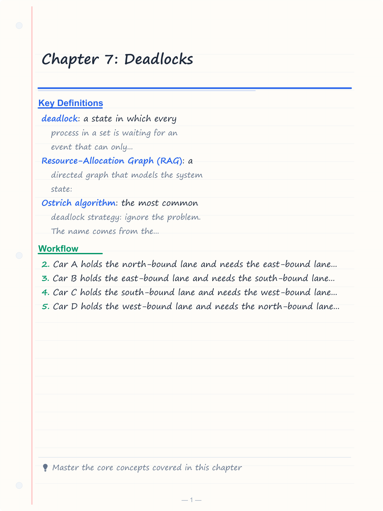
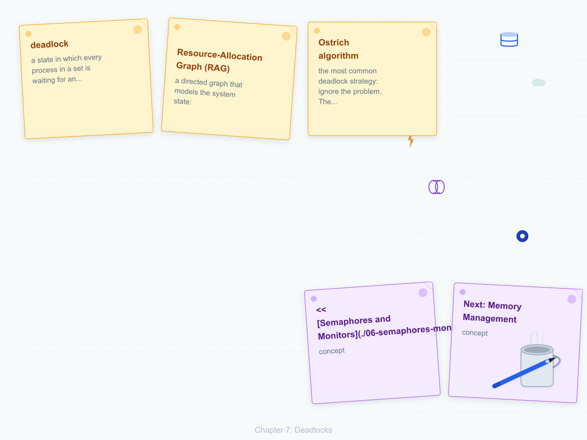
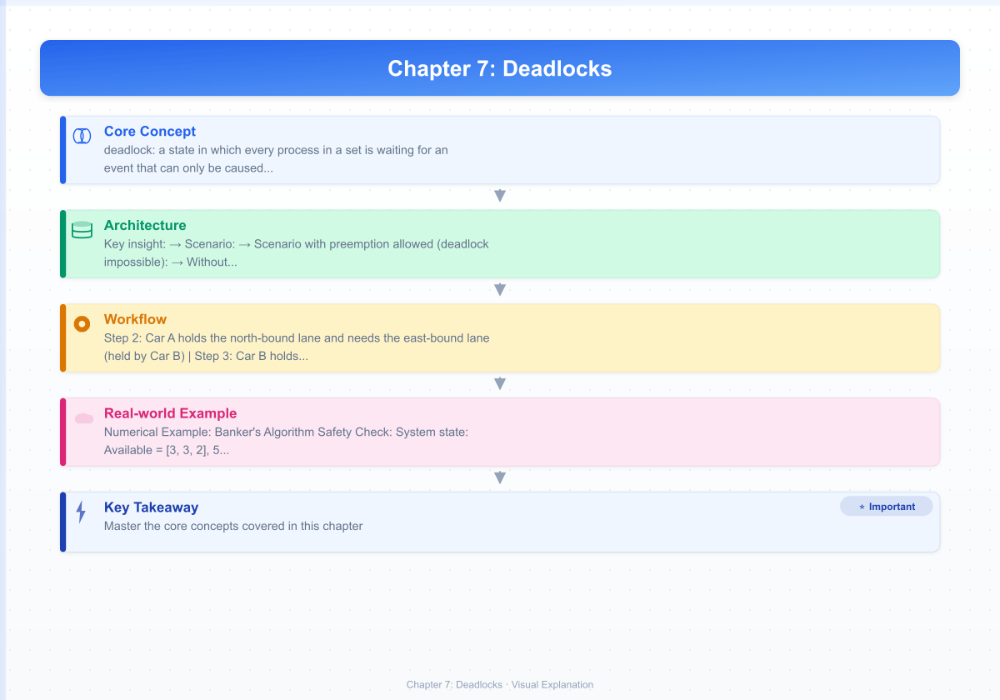

# Chapter 7: Deadlocks

**<< [Semaphores and Monitors](./06-semaphores-monitors.md)** | [**Next: Memory Management**](./08-memory-management.md) >>

---

## Learning Objectives

- Characterize deadlocks using the four necessary conditions
- Construct and interpret resource-allocation graphs with cycle analysis
- Apply deadlock prevention by breaking one of the four conditions
- Implement Banker's algorithm for deadlock avoidance with full trace
- Design deadlock detection algorithms for single and multiple resource types
- Compare recovery strategies: process termination vs resource preemption
- Understand deadlock in real systems: Linux lockdep, InnoDB, Java JVM

<!-- Image Gallery -->
<section class="lesson-visuals" aria-label="Visual learning resources">
  <header><span>VISUAL LEARNING</span><h2>See it. Review it. Remember it.</h2></header>
  <a class="lesson-visual-card" href="../../assets/images/lessons/operating-systems/07-deadlocks/handwritten-notes.png" target="_blank" rel="noopener">
    
    <span><strong>Handwritten notes</strong>Condensed notes for deliberate review.</span>
  </a>
  <a class="lesson-visual-card" href="../../assets/images/lessons/operating-systems/07-deadlocks/sticky-notes.png" target="_blank" rel="noopener">
    
    <span><strong>Sticky-note revision</strong>Fast recall prompts for revision.</span>
  </a>
  <a class="lesson-visual-card" href="../../assets/images/lessons/operating-systems/07-deadlocks/visual-explanation.png" target="_blank" rel="noopener">
    
    <span><strong>Visual concept guide</strong>A connected explanation of the key ideas.</span>
  </a>
</section>
<!-- End Image Gallery -->


## Chapter at a Glance

| Topic | Key Points |
|-------|------------|
| **Deadlock** | Set of blocked processes, each holding a resource waiting for another held by another |
| **Necessary Conditions** | Mutual exclusion, hold-and-wait, no preemption, circular wait (all 4 required) |
| **Prevention** | Break at least one condition → most commonly circular wait via resource ordering |
| **Avoidance** | Banker Algorithm: safe state ensures no deadlock even with maximum claims |
| **Detection** | Wait-for graph cycle detection for single-instance; O(m·n²) algorithm for multi-instance |
| **Recovery** | Process termination or resource preemption with victim selection and rollback |

## Chapter Roadmap

<div class="mermaid">
flowchart LR
    A[Deadlock Concept] --> B[Necessary Conditions]
    B --> C[Resource-Allocation Graphs]
    C --> D[Prevention]
    C --> E[Avoidance: Banker's Algorithm]
    C --> F[Detection: Wait-for Graph]
    F --> G[Recovery]
    G --> H[Real Systems & Interview Corner]
</div>

## Theory


---

### Deadlock Definition


A **deadlock** is a state in which every process in a set is waiting for an event that can only be caused by another process in the set. Since all are waiting, none can proceed → the system is permanently blocked.

#### Real-World Analogy: The Four-Car Intersection

Imagine four cars arrive simultaneously at a four-way stop, each wanting to turn left across oncoming traffic:

```
        Car A (wants to go straight)
            ↑
    Car D ← ✚ → Car B (wants to turn left)
            ↓
        Car C (wants to turn left)
```

- Car A holds the north-bound lane and needs the east-bound lane (held by Car B)
- Car B holds the east-bound lane and needs the south-bound lane (held by Car C)
- Car C holds the south-bound lane and needs the west-bound lane (held by Car D)
- Car D holds the west-bound lane and needs the north-bound lane (held by Car A)

Each car holds one resource (its lane) and waits for another. Nobody moves. **Deadlock.**

#### Formal Definition

```
Deadlock ⇔ ∀ Pᵢ ∈ DeadlockSet: Pᵢ is waiting for a resource held by Pⱼ ∈ DeadlockSet
         ∧ ∀ Pᵢ ∈ DeadlockSet: Pᵢ will never release its held resources
         ∧ The set is non-empty
```

#### Numbered Steps to Identify a Deadlock

1. Identify the set of suspicious processes (those in waiting state)
2. For each process, record which resources it holds and which it requests
3. Build a directed dependency graph (process → resource → process)
4. Detect cycles in the graph
5. If a cycle exists and all resources in the cycle are single-instance → deadlock confirmed
6. If a cycle exists with multi-instance resources → check if sufficient instances break the cycle (may or may not be deadlock)
7. If no cycle exists → no deadlock

#### Pseudocode: Deadlock Detection (Single-Instance Resources)

```
INPUT:  Wait-for matrix W[n][n] where W[i][j] = 1 if Pᵢ waits for Pⱼ
OUTPUT: true if deadlock detected

FUNCTION hasDeadlock(W, n):
    visited[n] = {false}
    recStack[n] = {false}
    
    FOR each process i FROM 0 TO n-1:
        IF NOT visited[i]:
            IF dfsCycleDetect(W, i, visited, recStack, n):
                RETURN true
    
    RETURN false

FUNCTION dfsCycleDetect(W, v, visited, recStack, n):
    visited[v] = true
    recStack[v] = true
    
    FOR each neighbor u FROM 0 TO n-1:
        IF W[v][u] = 1:
            IF NOT visited[u]:
                IF dfsCycleDetect(W, u, visited, recStack, n):
                    RETURN true
            ELSE IF recStack[u]:
                RETURN true           // Cycle found → deadlock
    
    recStack[v] = false               // Backtrack
    RETURN false
```

#### Dry Run Trace Table: Cycle Detection

System with 4 processes, single-instance resources:

| Step | visited[] | recStack[] | Current P | Neighbor | Action |
|------|-----------|------------|-----------|----------|--------|
| Init | [F,F,F,F] | [F,F,F,F] | - | - | Start DFS from P0 |
| 1 | [T,F,F,F] | [T,F,F,F] | P0 | P1 | W[0][1]=1, recurse |
| 2 | [T,T,F,F] | [T,T,F,F] | P1 | P2 | W[1][2]=1, recurse |
| 3 | [T,T,T,F] | [T,T,T,F] | P2 | P3 | W[2][3]=1, recurse |
| 4 | [T,T,T,T] | [T,T,T,T] | P3 | P0 | W[3][0]=1, recStack[0]=T → CYCLE! |
| 5 | - | - | - | - | Deadlock detected: P0→P1→P2→P3→P0 |

#### Complexity Analysis

| Metric | Value | Why |
|--------|-------|-----|
| **Time Complexity** | O(n²) | DFS traverses adjacency matrix; each edge examined once |
| **Space Complexity** | O(n) | visited[] and recStack[] arrays of size n |
| **For n=100 processes** | ~10,000 checks | Acceptable for periodic detection |

#### Advantages & Disadvantages

| Advantage | Disadvantage |
|-----------|-------------|
| Simple to implement | Only works for single-instance resource types |
| Early detection possible | Periodic invocation may miss transient deadlocks |
| Algorithm is deterministic | Cycle does not guarantee deadlock for multi-instance |
| Low overhead (O(n²)) | Does not identify which processes to terminate optimally |

---

### The Four Necessary Conditions


For a deadlock to occur, all four conditions must hold **simultaneously**. Breaking any one prevents deadlock.

#### Detailed Condition Table

| # | Condition | Definition | Real-World Analogy | How to Break | Practical Cost |
|---|-----------|-----------|-------------------|--------------|----------------|
| 1 | **Mutual Exclusion** | At least one resource must be held in non-sharable mode | A conference room can only hold one meeting at a time | Make resources sharable (spooling, read-only) | Not always possible; some resources inherently exclusive |
| 2 | **Hold and Wait** | A process holding resources waits to acquire more held by others | You hold your parking spot while waiting for another spot to open | Request all resources at once, or release before requesting | Low utilization; resources idle while held unnecessarily |
| 3 | **No Preemption** | Resources cannot be forcibly taken → must be released voluntarily | A book you're reading cannot be taken from your hands | Allow preemption (OS can take resources) | Complex; may corrupt state if preempted mid-update |
| 4 | **Circular Wait** | There exists a cycle where P₀ waits for P₁, P₁ waits for P₂, ..., Pₙ waits for P₀ | Four cars blocking each other at an intersection | Enforce total resource ordering | Most practical; ordering must be global and respected |

#### Condition 1: Mutual Exclusion in Detail

```
Without Mutual Exclusion:
  Resource R is sharable (e.g., read-only file)
  P0 and P1 both access R simultaneously → no blocking → no deadlock

With Mutual Exclusion:
  Resource R is non-sharable (e.g., printer, mutex lock)
  P0 holds R, P1 requests R → P1 blocks → potential deadlock ingredient
```

**Key insight:** Not all resources must be non-sharable → only one. If at least one resource in the cycle is exclusive, mutual exclusion is satisfied.

#### Condition 2: Hold and Wait in Detail

**Scenario:** Process P0 holds a tape drive (R1) and requests a printer (R2). Meanwhile P1 holds the printer (R2) and requests the tape drive (R1).

```
P0: holds(R1) + wait(R2)
P1: holds(R2) + wait(R1)
     ↑ Both hold something AND wait for something → hold-and-wait satisfied
```

#### Condition 3: No Preemption in Detail

**Scenario with preemption allowed (deadlock impossible):**

```
P0 holds R1, requests R2 → R2 not available
OS preempts R1 from P0, gives to P1
P1 completes, releases R1 and R2
P0 restarts with fresh resources
```

**Without preemption**, P0 keeps R1 forever while waiting → deadlock persists.

#### Condition 4: Circular Wait in Detail

```
Circular wait exists iff there is a cycle in the wait-for graph:

   P0 → P1 → P2 → P3 → P0
   
   Each arrow means "waits for resource held by"
   
   If the cycle has k processes, all k conditions for circular wait are met.
   Removing any one edge breaks the cycle.
```

#### Necessary Conditions: Formal Proof Sketch

```
Theorem: Deadlock ⇒ (Mutual Exclusion ∧ Hold-and-Wait ∧ No Preemption ∧ Circular Wait)
Proof:
  - If no mutual exclusion: all resources sharable → no process ever blocks → no deadlock
  - If no hold-and-wait: process either has no resources or requests nothing → no circular dependency
  - If preemption allowed: OS can forcibly take resources → blocked process can progress
  - If no circular wait: dependency graph is acyclic → by topological order, some process can complete
  Therefore, deadlock implies all four.
  
Converse is false: all four conditions can hold without deadlock (e.g., processes may not all be waiting)
```

---

### Resource-Allocation Graphs


A **Resource-Allocation Graph (RAG)** is a directed graph that models the system state:

- **Processes** (circles Pᵢ): active entities that request/use resources
- **Resources** (squares Rⱼ with dots for instances): system resources
- **Request edge** (Pᵢ → Rⱼ): process i wants resource j
- **Assignment edge** (Rⱼ → Pᵢ): resource j is allocated to process i

#### RAG Construction Rules

1. When process Pᵢ requests resource Rⱼ: add a request edge Pᵢ → Rⱼ
2. When the request is granted: convert to assignment edge Rⱼ → Pᵢ
3. When Pᵢ releases Rⱼ: remove the assignment edge

#### RAG Example: Deadlock State

```
      ┌─────────────────┐
      │                 │
      ▼                 │
     R1 ──► P2 ──► R2 ──┤──► P3
      ▲         │        │      ▲
      │         └────R3──┘      │
      │                         │
      P1 ◄──────────────────────┘
```

**Resource types:** R1 (1 instance), R2 (1 instance), R3 (1 instance)

**Edges:**
- P1 → R1 (request), R1 → P1 (assigned): P1 holds R1
- P1 → R2 (request): P1 wants R2
- P2 → R2 (request), R2 → P2 (assigned): P2 holds R2
- P2 → R3 (request): P2 wants R3
- P3 → R3 (request), R3 → P3 (assigned): P3 holds R3
- P3 → R1 (request): P3 wants R1

**Cycle:** P1 → R2 → P2 → R3 → P3 → R1 → P1 ← **DEADLOCK**

#### Cycles vs Deadlock: The Complete Analysis

| Scenario | Single-Instance Resources | Multi-Instance Resources |
|----------|--------------------------|-------------------------|
| No cycle | No deadlock | No deadlock |
| Cycle present | **Deadlock** guaranteed | **May or may not** be deadlock |
| Multiple cycles | Deadlocked set = union of all processes in cycles | Must analyze each cycle independently |

#### Multi-Instance RAG Example: Cycle but No Deadlock

```
Resources: R1 (2 instances), R2 (2 instances)

     R1 (2 dots: ●●)
      ↙  ↘
    P1    P2
     ↘  ↙
     R2 (2 dots: ●●)
```

**State:**
- P1 holds 1 instance of R1, requests 1 instance of R2
- P2 holds 1 instance of R2, requests 1 instance of R1

**Cycle:** P1 → R2 → P2 → R1 → P1

**But:** R1 has 2 instances; P2 only needs 1. If the second R1 is free, P2's request can be granted. P2 completes, releases R2, P1 gets R2. **No deadlock!**

#### RAG Reduction Algorithm (Deadlock Check)

```
FUNCTION isDeadlock(RAG):
    REPEAT:
        Find a process Pᵢ whose request edges can all be satisfied
        (for each request edge Pᵢ → Rⱼ, there is a free instance of Rⱼ)
        IF found:
            Remove Pᵢ (pretend it finishes and releases all resources)
        ELSE:
            BREAK
    UNTIL no more processes can be removed
    
    IF all processes removed: NO DEADLOCK
    ELSE: DEADLOCK → remaining processes are deadlocked
```

#### Dry Run: RAG Reduction

System: R1 (2 instances), R2 (1 instance). P0 holds R1×1, requests R2. P1 holds R2, requests R1×1. P2 holds R1×1.

| Iteration | Process | Request can be satisfied? | Reason | Action |
|-----------|---------|--------------------------|--------|--------|
| 1 | P0 | No | R2 held by P1 | Skip |
| 1 | P1 | **Yes** | Free R1 instance available (R1 has 2, P0 holds 1, P2 holds 1 → 0 free → wait, P2 holds 1, P0 holds 1, free=0 → No) | Let me recalculate |

Let me redo with clearer state:

R1 has 3 instances. Initial allocation: P0:1, P1:0, P2:1. Available R1=1, R2=1. P0 needs R2. P1 needs R1×1. P2 needs nothing.

| Iteration | Process | Holds | Needs | Available | Can run? |
|-----------|---------|-------|-------|-----------|----------|
| 1 | P2 | R1×1 | none | R1=1, R2=1 | Yes |
| After P2 | release R1 | - | - | R1=2, R2=1 | - |
| 2 | P1 | none | R1×1 | R1=2, R2=1 | Yes |
| After P1 | - | - | - | R1=2, R2=1 | - |
| 3 | P0 | R1×1 | R2×1 | R1=2, R2=1 | Yes |
| All removed → **No deadlock** | | | | | |

#### Edge Case: RAG with Multiple Resource Units

```
Resources: R1 (5 instances), R2 (3 instances)

Process  P0: holds R1×3, holds R2×1, requests R2×1
Process  P1: holds R1×2, requests R1×1
Process  P2: holds R2×2, requests R1×1

Available: R1=0, R2=0

Check:
- P0 needs R2×1 but R2=0 available → blocked
- P1 needs R1×1 but R1=0 available → blocked
- P2 needs R1×1 but R1=0 available → blocked

All blocked → DEADLOCK (even though each resource has multiple instances)
```

#### RAG Complexity Analysis

| Aspect | Value | Why |
|--------|-------|-----|
| **Construction** | O(E) where E = #edges | Each request/allocation adds one edge |
| **Cycle detection (single-instance)** | O(V+E) | DFS on graph with V vertices |
| **Reduction (multi-instance)** | O(n·m) | n processes, m resources; each iteration checks all processes |
| **Space** | O(n·m) | Adjacency matrix or edge list |

#### Advantages & Disadvantages of RAG Approach

| Advantage | Disadvantage |
|-----------|-------------|
| Visual and intuitive | Becomes unmanageable with >20 processes |
| Simple cycle → deadlock for single-instance | Multi-instance requires reduction (more complex) |
| Foundation for all deadlock algorithms | Does not capture resource ordering constraints |
| O(V+E) detection is fast | Must rebuild graph on every state change |

---

### Deadlock Prevention


Prevention ensures at least one of the four necessary conditions **cannot** hold. This is a negative approach: design the system to make deadlock structurally impossible.

#### Strategy 1: Breaking Mutual Exclusion

**Approach:** Make resources sharable.

**Methods:**
- **Spooling:** Printer spooler accepts all print jobs, schedules them sequentially. Process never "holds" the printer.
- **Read-only sharing:** Multiple processes can read the same file.
- **Copy-on-write:** Each process gets its own copy.

```c
// Printer spooling → mutual exclusion broken
// Process writes to spool directory; spooler daemon prints
FILE *spool = fopen("/var/spool/print/myjob.txt", "w");
fprintf(spool, "Hello, printer!\n");
fclose(spool);
// Process never holds the physical printer
```

**Problem:** Some resources are inherently non-sharable (mutex locks, tape drives, DMA buffers).

| A | D |
|---|-----|
| No special OS mechanism needed | Not universally applicable |
| Zero runtime overhead | Only works for spoolable devices |

#### Strategy 2: Breaking Hold and Wait

**Approach #1 → Request all at once:**
Process must request **all** resources before execution begins.

```c
// Protocol: request all, then execute
void process_work() {
    // Phase 1: Request ALL resources upfront
    request(R1);
    request(R2);
    request(R3);
    
    // Phase 2: Use resources (never requests again)
    use(R1);
    use(R2);
    
    // Phase 3: Release all
    release(R1);
    release(R2);
    release(R3);
}
```

**Approach #2 → Release before requesting:**
Process can only request resources when it holds none.

```c
void process_work() {
    request(R1);
    use(R1);
    release(R1);      // Must release before next request
    
    request(R2);       // Now holds no resources
    request(R3);       // Request multiple at once is OK
    use(R2);
    use(R3);
    release(R2);
    release(R3);
}
```

**Dry Run: Hold-and-Wait Prevention**

```
System: R1, R2, R3 (1 instance each)

Without prevention (deadlock possible):
  P0: request(R1) → granted → request(R2) → BLOCKED (P1 holds R2)
  P1: request(R2) → granted → request(R1) → BLOCKED (P0 holds R1)
  Result: DEADLOCK

With "request all at once" prevention:
  P0: request(R1, R2, R3) → not all available → P0 BLOCKED (never starts)
  P1: request(R1, R2, R3) → R1 held by P0, R2 free, R3 free → not all available → P1 BLOCKED
  
Wait both are blocked before starting. This is terrible for utilization.

Better with ordering:
  System enforces: request all at process creation
  P0 declares need (R1, R2). OS checks: R1 free, R2 free → grant. P0 runs.
  P1 declares need (R1). OS checks: R1 now held by P0 → P1 must wait.
  P0 finishes, releases R1, R2 → P1 gets R1, runs.
  No deadlock, but poor concurrency.
```

| A | D |
|---|-----|
| Simple to implement | Starvation possible (process may wait indefinitely for all resources) |
| No runtime overhead | Low resource utilization |
| Deadlock impossible | Must know future requirements (often impossible) |

#### Strategy 3: Breaking No Preemption

**Approach:** If a process holding resources requests more and cannot get them, it must **release all currently held resources**.

```c
// Protocol with preemption
bool request_with_preemption(int resource_id) {
    while (true) {
        if (try_acquire(resource_id)) {
            return true;  // Got the resource
        } else {
            // Resource not available → preempt ourselves
            release_all_held_resources();
            // Now we hold nothing. Re-acquire everything.
            // This creates a fresh start.
        }
    }
}
```

**Numbered Steps:**

1. Process P requests resource R
2. If R is available → grant, return
3. If R is not available → P releases **all** resources it currently holds
4. P is added to the wait queue for all needed resources (old ones + new one)
5. When all are available → P resumes with all resources
6. P must be able to restart from the last checkpoint (rollback required)

**Problem:** Rollback requires checkpoint state. If P was updating a critical data structure, releasing the lock mid-update corrupts the data.

| A | D |
|---|-----|
| No starvation (eventually all resources become available) | Requires rollback capability |
| Moderate resource utilization | Not possible for all resource types (mutex, kernel locks) |
| Easy to implement for stateless resources | High overhead from repeated acquire-release cycles |

#### Strategy 4: Breaking Circular Wait (Most Practical)

**Approach:** Impose a **total ordering** of all resource types. A process can only request resources in strictly increasing order.

```c
// Resource ordering: R1 < R2 < R3 < R4
// Process can request in order: R1 then R2 then R3
// But NEVER R3 then R1 (decreasing order)

void safe_process() {
    acquire(R1);    // OK → starting with lowest
    acquire(R2);    // OK → R1 < R2
    use_resources();
    release(R2);
    release(R1);
}

// This would be ILLEGAL:
void unsafe_process() {
    acquire(R2);    // OK 
    acquire(R1);    // VIOLATION → R1 < R2 but we hold R2
}
```

**Proof that resource ordering prevents deadlock:**

```
Assume deadlock exists despite ordering. Then there is a cycle:
  P0 → Rⱼ → P1 → Rₖ → P2 → ... → Pn → Rₗ → P0

By the ordering rule:
  If Pᵢ holds Rₐ and requests Rᵦ, then a < b.
  
In the cycle, each process requests a resource held by the next:
  P0 holds Rₓ and wants Rⱼ: x < j
  P1 holds Rⱼ and wants Rₖ: j < k
  ...by transitivity: x < j < k < ... < l < x
  
But this implies x < x, which is impossible.
Therefore no cycle can exist → no deadlock.
```

**Dry Run: Resource Ordering Prevention**

```
System: Resources R0(R1), R1(R2), R2(Printer), R3(Tape)
Ordering: R0(0) < R1(1) < R2(2) < R3(3)

Scenario → P0 needs R1 and R3:
  Step 1: request(R1) → OK, order starts at 0
  Step 2: request(R3) → OK, 1 < 3
  Step 3: use, release(R3), release(R1) ✓

Scenario → P1 needs R2 and R1:
  Step 1: request(R2) → OK
  Step 2: request(R1) → BLOCKED (would violate ordering) 
  Solution: P1 should request R1 first, then R2

Scenario → P0 holds R0, requests R2:
  P0: holds R0(0), requests R2(2) → OK, 0 < 2

Scenario → P1 holds R1, requests R2:
  P1: holds R1(1), requests R2(2) → OK, 1 < 2
  
If P0 also wants R1: must request in order R0 → R1 → R2
If P1 also wants R0: must request R0 first, then R1, then R2
  → never holds R1 while requesting R0 → no cycle
```

| A | D |
|---|-----|
| Most practical prevention method | Requires global agreement on ordering |
| Low runtime overhead | May force unnatural access patterns |
| Simple to implement | Not all resources can be ordered (e.g., identical mutexes) |
| Used in many real systems (Linux kernel) | Application-level ordering requires discipline |

#### Prevention Strategy Comparison

| Condition Broken | Implementation Difficulty | Resource Utilization | Practical Use |
|-----------------|-------------------------|---------------------|--------------|
| Mutual Exclusion | Easy (spooling) | High | Limited (printers only) |
| Hold and Wait | Easy | Low (all-at-once) or Medium (release-before-request) | Rare |
| No Preemption | Hard (needs rollback) | Medium | Rare (DB transactions) |
| Circular Wait | Medium | Medium-High | **Most common** (Linux, databases) |

---

### Deadlock Avoidance → Banker's Algorithm


Avoidance requires that the system knows in advance the **maximum** number of resources each process will ever need. The system decides whether granting a request would leave the system in a **safe state**.

#### Real-World Analogy: The Banker

A banker has limited funds (₹10,000). Several businesses need loans:

```
Banker (OS) with ₹10,000 capital (available resources)
  ┌─────────────────────────────────────┐
  │  Biz A: max ₹7K, already owes ₹2K   │  Needs up to ₹5K more
  │  Biz B: max ₹3K, already owes ₹1K   │  Needs up to ₹2K more  
  │  Biz C: max ₹9K, already owes ₹5K   │  Needs up to ₹4K more
  └─────────────────────────────────────┘
           Cash on hand: ₹2K

The banker asks: "If I grant Biz B's request for ₹1K more, can all businesses
eventually finish?" This is the safety check.
```

#### Safe State Definition

A state is **safe** if there exists a sequence of process executions that allows every process to complete.

```
Safe State:
    ┌─────────────────────────────────────┐
    │ Available = 3 units                │
    │                                    │
    │ P2 needs 2, has 2 → can finish     │
    │ After P2: available = 5            │
    │ P1 needs 5, has 2 → can finish     │
    │ After P1: available = 7            │
    │ P0 needs 7, has 0 → can finish ✓   │
    │                                    │
    │ Safe sequence: <P2, P1, P0>        │
    └─────────────────────────────────────┘

Unsafe State (but not deadlock):
    ┌─────────────────────────────────────┐
    │ Available = 1 unit                 │
    │                                    │
    │ No process has Need ≤ Available    │
    │ All processes could still progress  │
    │ if they release resources          │
    │ But we can't guarantee it          │
    │ → UNSAFE (future deadlock possible) │
    └─────────────────────────────────────┘

Deadlock:
    ┌─────────────────────────────────────┐
    │ Available = 0 units                │
    │ All processes blocked, waiting     │
    │ None can release resources         │
    │ → DEADLOCK                         │
    └─────────────────────────────────────┘
```

#### Banker's Algorithm Data Structures

```
n = number of processes
m = number of resource types

Available[m]:     Available[j] = k → k instances of Rⱼ are free
Max[n][m]:        Max[i][j] = k → Pᵢ will need at most k instances of Rⱼ
Allocation[n][m]: Allocation[i][j] = k → Pᵢ currently holds k instances
Need[n][m]:       Need[i][j] = Max[i][j] - Allocation[i][j]
Request[i][m]:    Request[i][j] = k → Pᵢ is requesting k instances of Rⱼ

Invariants:
  Need[i][j] ≥ 0 for all i, j
  Allocation[i][j] ≤ Max[i][j] for all i, j
  Σ Allocation[i][j] + Available[j] = total instances of Rⱼ
```

#### Safety Algorithm (Banker's Core)

```
INPUT:  Available, Allocation, Need
OUTPUT: true if state is safe, false otherwise

FUNCTION isSafe(Available, Allocation, Need, n, m):
    Work[m] = Available[m]            // Copy of available resources
    Finish[n] = {false}               // All processes initially unfinished
    
    // Find an unfinished process that can complete
    WHILE true:
        found = false
        FOR i = 0 TO n-1:
            IF Finish[i] == false AND Need[i] ≤ Work:
                // Pᵢ can complete
                Work = Work + Allocation[i]
                Finish[i] = true
                found = true
        
        IF NOT found:
            BREAK               // No more processes can run
    
    // Check if all finished
    FOR i = 0 TO n-1:
        IF Finish[i] == false:
            RETURN false        // Unsafe state
    
    RETURN true                 // Safe state
    
    // Note: ≤ operator on vectors means all elements satisfy ≤ individually
    // Need[i] ≤ Work ⇔ ∀ j: Need[i][j] ≤ Work[j]
```

#### Resource-Request Algorithm

```
INPUT:  Process i, Request[m]
OUTPUT: true if request granted, false otherwise

FUNCTION requestResources(i, Request):
    // Step 1: Check if request ≤ Need
    IF Request > Need[i]:           // Error: exceeded max claim
        RETURN false
    
    // Step 2: Check if request ≤ Available
    IF Request > Available:         // Not enough resources right now
        RETURN false                // Pᵢ must wait
    
    // Step 3: Pretend to allocate
    Available = Available - Request
    Allocation[i] = Allocation[i] + Request
    Need[i] = Need[i] - Request
    
    // Step 4: Check if resulting state is safe
    IF isSafe(Available, Allocation, Need, n, m):
        RETURN true                 // Request granted
    ELSE:
        // Roll back the pretend allocation
        Available = Available + Request
        Allocation[i] = Allocation[i] - Request
        Need[i] = Need[i] + Request
        RETURN false                // Request denied
```

#### Full Multi-Step Dry Run: 5 Processes, 3 Resources

```
System state:
  Total resources: R0=10, R1=5, R2=7
  
  Process | Max      | Allocation | Need       | Available
  --------|----------|------------|------------|----------
  P0      | [7, 5, 3] | [0, 1, 0]  | [7, 4, 3]  | [3, 3, 2]
  P1      | [3, 2, 2] | [2, 0, 0]  | [1, 2, 2]  |
  P2      | [9, 0, 2] | [3, 0, 2]  | [6, 0, 0]  |
  P3      | [2, 2, 2] | [2, 1, 1]  | [0, 1, 1]  |
  P4      | [4, 3, 3] | [0, 0, 2]  | [4, 3, 1]  |
```

**Step 1 → Safety Check on Initial State:**

```
Available = [3, 3, 2]

Iteration 1:
  P0: Need=[7,4,3] > Available=[3,3,2] → cannot run
  P1: Need=[1,2,2] ≤ Available=[3,3,2] → CAN RUN ✓
  Execute P1:
    Work = [3,3,2] + Allocation[1]=[2,0,0] = [5,3,2]
    Finish[1] = true

Iteration 2:
  P0: Need=[7,4,3] > Work=[5,3,2] → cannot run
  P2: Need=[6,0,0] > Work=[5,3,2] → cannot run
  P3: Need=[0,1,1] ≤ Work=[5,3,2] → CAN RUN ✓
  Execute P3:
    Work = [5,3,2] + Allocation[3]=[2,1,1] = [7,4,3]
    Finish[3] = true

Iteration 3:
  P0: Need=[7,4,3] ≤ Work=[7,4,3] → CAN RUN ✓
  Execute P0:
    Work = [7,4,3] + Allocation[0]=[0,1,0] = [7,5,3]
    Finish[0] = true

Iteration 4:
  P2: Need=[6,0,0] ≤ Work=[7,5,3] → CAN RUN ✓
  Execute P2:
    Work = [7,5,3] + Allocation[2]=[3,0,2] = [10,5,5]
    Finish[2] = true

Iteration 5:
  P4: Need=[4,3,1] ≤ Work=[10,5,5] → CAN RUN ✓
  Execute P4:
    Work = [10,5,5] + Allocation[4]=[0,0,2] = [10,5,7]
    Finish[4] = true

All Finish[i] = true → SYSTEM IS SAFE
Safe sequence: P1 → P3 → P0 → P2 → P4
```

**Dry Run Trace Table (Step-by-Step):**

| Iter | Process | Need | Work (Start) | Need ≤ Work? | Work (End) | Finish |
|------|---------|------|-------------|--------------|------------|--------|
| 1 | P0 | [7,4,3] | [3,3,2] | No | - | - |
| 1 | P1 | [1,2,2] | [3,3,2] | **Yes** | [5,3,2] | Yes |
| 2 | P0 | [7,4,3] | [5,3,2] | No | - | - |
| 2 | P2 | [6,0,0] | [5,3,2] | No | - | - |
| 2 | P3 | [0,1,1] | [5,3,2] | **Yes** | [7,4,3] | Yes |
| 3 | P0 | [7,4,3] | [7,4,3] | **Yes** | [7,5,3] | Yes |
| 4 | P2 | [6,0,0] | [7,5,3] | **Yes** | [10,5,5] | Yes |
| 5 | P4 | [4,3,1] | [10,5,5] | **Yes** | [10,5,7] | Yes |

**Step 2 → P1 requests [1, 0, 2]:**

```
P1 Request = [1, 0, 2]

Check 1: Request ≤ Need[1]? [1,0,2] ≤ [1,2,2] → Yes ✓
Check 2: Request ≤ Available? [1,0,2] ≤ [3,3,2] → Yes ✓

Pretend allocation:
  Available = [3,3,2] - [1,0,2] = [2,3,0]
  Allocation[1] = [2,0,0] + [1,0,2] = [3,0,2]
  Need[1] = [1,2,2] - [1,0,2] = [0,2,0]

New state:
  Process | Allocation | Need       | Available
  --------|-----------|------------|----------
  P0      | [0, 1, 0] | [7, 4, 3]  | [2, 3, 0]
  P1      | [3, 0, 2] | [0, 2, 0]  |
  P2      | [3, 0, 2] | [6, 0, 0]  |
  P3      | [2, 1, 1] | [0, 1, 1]  |
  P4      | [0, 0, 2] | [4, 3, 1]  |

Safety check on new state:

Iteration 1:
  P0: [7,4,3] > [2,3,0] → No
  P1: [0,2,0] ≤ [2,3,0] → YES → Work = [5,3,2], Finish[1]=true
  (check P2, P3, P4: none can run yet)

Iteration 2:
  P0: [7,4,3] > [5,3,2] → No
  P3: [0,1,1] ≤ [5,3,2] → YES → Work = [7,4,3], Finish[3]=true

Iteration 3:
  P0: [7,4,3] ≤ [7,4,3] → YES → Work = [7,5,3], Finish[0]=true

Iteration 4:
  P2: [6,0,0] ≤ [7,5,3] → YES → Work = [10,5,5], Finish[2]=true

Iteration 5:
  P4: [4,3,1] ≤ [10,5,5] → YES → Work = [10,5,7], Finish[4]=true

All finished → SAFE → Request GRANTED
Safe sequence: P1 → P3 → P0 → P2 → P4
```

**Step 3 → What if P4 requests [3, 3, 0]?**

```
Current available = [2, 3, 0]

P4 Request = [3, 3, 0]

Check 1: Request ≤ Need[4]? [3,3,0] ≤ [4,3,1] → Yes ✓
Check 2: Request ≤ Available? [3,3,0] ≤ [2,3,0] → No → Request DENIED
(P4 must wait)
```

**Step 4 → What if P0 requests [0, 2, 0]?**

```
Current available = [2, 3, 0]

P0 Request = [0, 2, 0]

Check 1: Request ≤ Need[0]? [0,2,0] ≤ [7,4,3] → Yes ✓
Check 2: Request ≤ Available? [0,2,0] ≤ [2,3,0] → Yes ✓

Pretend allocation:
  Available = [2,3,0] - [0,2,0] = [2,1,0]
  Allocation[0] = [0,1,0] + [0,2,0] = [0,3,0]
  Need[0] = [7,4,3] - [0,2,0] = [7,2,3]

Safety check:
  P1: [0,2,0] > [2,1,0] → No
  P3: [0,1,1] > [2,1,0] → No
  P4: [4,3,1] > [2,1,0] → No
  P0: [7,2,3] > [2,1,0] → No
  P2: [6,0,0] > [2,1,0] → No
  
  No process can run → UNSAFE → Request DENIED
```

#### Banker's Algorithm: C++ Implementation

```cpp
#include <iostream>
#include <vector>
#include <algorithm>

using namespace std;

class BankersAlgorithm {
private:
    int n;                              // Number of processes
    int m;                              // Number of resource types
    vector<vector<int>> max_claim;      // Max matrix
    vector<vector<int>> allocation;      // Allocation matrix
    vector<vector<int>> need;            // Need matrix
    vector<int> available;               // Available vector

public:
    BankersAlgorithm(int processes, int resources)
        : n(processes), m(resources),
          max_claim(processes, vector<int>(resources, 0)),
          allocation(processes, vector<int>(resources, 0)),
          need(processes, vector<int>(resources, 0)),
          available(resources, 0) {}

    void setMax(int pid, const vector<int>& max_res) {
        max_claim[pid] = max_res;
    }

    void setAllocation(int pid, const vector<int>& alloc) {
        allocation[pid] = alloc;
    }

    void setAvailable(const vector<int>& avail) {
        available = avail;
    }

    void calculateNeed() {
        for (int i = 0; i < n; i++) {
            for (int j = 0; j < m; j++) {
                need[i][j] = max_claim[i][j] - allocation[i][j];
            }
        }
    }

    bool isSafe(vector<int>& safeSeq) {
        vector<int> work = available;
        vector<bool> finish(n, false);

        cout << "\n=== Safety Algorithm Execution ===\n";
        cout << "Initial Work: [";
        for (int j = 0; j < m; j++) {
            cout << work[j] << (j < m - 1 ? ", " : "");
        }
        cout << "]\n\n";

        int completed = 0;
        while (completed < n) {
            bool found = false;

            for (int i = 0; i < n; i++) {
                if (!finish[i]) {
                    bool canRun = true;
                    for (int j = 0; j < m; j++) {
                        if (need[i][j] > work[j]) {
                            canRun = false;
                            break;
                        }
                    }

                    if (canRun) {
                        cout << "P" << i << " can run. Need=[";
                        for (int j = 0; j < m; j++)
                            cout << need[i][j] << (j < m-1 ? "," : "");
                        cout << "] <= Work=[";
                        for (int j = 0; j < m; j++)
                            cout << work[j] << (j < m-1 ? "," : "");
                        cout << "]\n";

                        for (int j = 0; j < m; j++) {
                            work[j] += allocation[i][j];
                        }

                        cout << "  New Work: [";
                        for (int j = 0; j < m; j++)
                            cout << work[j] << (j < m-1 ? ", " : "");
                        cout << "]\n";

                        finish[i] = true;
                        safeSeq.push_back(i);
                        found = true;
                        completed++;
                    }
                }
            }

            if (!found) {
                // Print deadlocked processes
                cout << "\nUNSAFE STATE: Deadlocked processes: ";
                for (int i = 0; i < n; i++) {
                    if (!finish[i]) cout << "P" << i << " ";
                }
                cout << "\n";
                return false;
            }
        }

        cout << "\nSafe sequence found: ";
        for (int p : safeSeq) cout << "P" << p << " ";
        cout << "\n";
        return true;
    }

    bool requestResources(int pid, const vector<int>& request) {
        cout << "\n=== P" << pid << " requests [";
        for (int j = 0; j < m; j++)
            cout << request[j] << (j < m-1 ? "," : "");
        cout << "] ===\n";

        // Step 1: Check if request ≤ need
        for (int j = 0; j < m; j++) {
            if (request[j] > need[pid][j]) {
                cout << "ERROR: Request exceeds maximum claim.\n";
                return false;
            }
        }
        cout << "Step 1: Request ≤ Need ✓\n";

        // Step 2: Check if request ≤ available
        for (int j = 0; j < m; j++) {
            if (request[j] > available[j]) {
                cout << "Step 2: Request > Available → must wait\n";
                return false;
            }
        }
        cout << "Step 2: Request ≤ Available ✓\n";

        // Step 3: Pretend to allocate
        for (int j = 0; j < m; j++) {
            available[j] -= request[j];
            allocation[pid][j] += request[j];
            need[pid][j] -= request[j];
        }

        // Step 4: Safety check
        vector<int> safeSeq;
        if (isSafe(safeSeq)) {
            cout << "Step 4: State is SAFE → Request GRANTED ✓\n";
            return true;
        } else {
            // Rollback
            for (int j = 0; j < m; j++) {
                available[j] += request[j];
                allocation[pid][j] -= request[j];
                need[pid][j] += request[j];
            }
            cout << "Step 4: State is UNSAFE → Request DENIED ✗\n";
            return false;
        }
    }

    void printState() {
        cout << "\nCurrent System State:\n";
        cout << "Process | Max        | Allocation | Need       |\n";
        cout << "--------|-----------|-----------|-----------|\n";
        for (int i = 0; i < n; i++) {
            cout << "P" << i << "      | [";
            for (int j = 0; j < m; j++)
                cout << max_claim[i][j] << (j < m-1 ? "," : "");
            cout << "] | [";
            for (int j = 0; j < m; j++)
                cout << allocation[i][j] << (j < m-1 ? "," : "");
            cout << "] | [";
            for (int j = 0; j < m; j++)
                cout << need[i][j] << (j < m-1 ? "," : "");
            cout << "] |\n";
        }
        cout << "Available: [";
        for (int j = 0; j < m; j++)
            cout << available[j] << (j < m-1 ? ", " : "");
        cout << "]\n";
    }
};

int main() {
    // 5 processes, 3 resource types
    BankersAlgorithm ba(5, 3);

    ba.setAvailable({3, 3, 2});

    ba.setMax(0, {7, 5, 3});
    ba.setMax(1, {3, 2, 2});
    ba.setMax(2, {9, 0, 2});
    ba.setMax(3, {2, 2, 2});
    ba.setMax(4, {4, 3, 3});

    ba.setAllocation(0, {0, 1, 0});
    ba.setAllocation(1, {2, 0, 0});
    ba.setAllocation(2, {3, 0, 2});
    ba.setAllocation(3, {2, 1, 1});
    ba.setAllocation(4, {0, 0, 2});

    ba.calculateNeed();
    ba.printState();

    // Test initial safety
    vector<int> safeSeq;
    cout << "\nInitial safety check:";
    if (ba.isSafe(safeSeq)) {
        cout << "System is in SAFE state.\n";
    } else {
        cout << "System is in UNSAFE state.\n";
    }

    // P1 requests [1, 0, 2]
    ba.requestResources(1, {1, 0, 2});

    ba.printState();

    return 0;
}
```

#### Banker's Algorithm: Python Implementation

```python
class BankersAlgorithm:
    """
    Banker's Algorithm for Deadlock Avoidance
    
    Complexity: O(m * n^2) where m = resources, n = processes
    Space: O(m * n) for the matrices
    """
    
    def __init__(self, processes: int, resources: int):
        self.n = processes
        self.m = resources
        self.max_claim = [[0] * resources for _ in range(processes)]
        self.allocation = [[0] * resources for _ in range(processes)]
        self.need = [[0] * resources for _ in range(processes)]
        self.available = [0] * resources
    
    def set_max(self, pid: int, max_res: list):
        self.max_claim[pid] = max_res[:]
    
    def set_allocation(self, pid: int, alloc: list):
        self.allocation[pid] = alloc[:]
    
    def set_available(self, avail: list):
        self.available = avail[:]
    
    def calculate_need(self):
        for i in range(self.n):
            for j in range(self.m):
                self.need[i][j] = self.max_claim[i][j] - self.allocation[i][j]
    
    def is_safe(self) -> tuple:
        """
        Check if current state is safe.
        Returns: (is_safe: bool, safe_sequence: list)
        """
        work = self.available[:]
        finish = [False] * self.n
        safe_sequence = []
        
        print("\n=== Safety Algorithm ===")
        print(f"Initial Work: {work}")
        
        while len(safe_sequence) < self.n:
            found = False
            
            for i in range(self.n):
                if not finish[i]:
                    # Check if Need[i] <= Work
                    can_run = all(self.need[i][j] <= work[j] 
                                for j in range(self.m))
                    
                    if can_run:
                        print(f"P{i} can run. Need={self.need[i]} "
                              f"<= Work={work}")
                        for j in range(self.m):
                            work[j] += self.allocation[i][j]
                        print(f"  New Work: {work}")
                        finish[i] = True
                        safe_sequence.append(i)
                        found = True
            
            if not found:
                deadlocked = [f"P{i}" for i in range(self.n) if not finish[i]]
                print(f"UNSAFE. Deadlocked: {deadlocked}")
                return False, []
        
        print(f"Safe sequence: {safe_sequence}")
        return True, safe_sequence
    
    def request_resources(self, pid: int, request: list) -> bool:
        """
        Handle resource request from process pid.
        Returns True if request granted, False otherwise.
        """
        print(f"\n=== P{pid} requests {request} ===")
        
        # Step 1: Check request <= need
        for j in range(self.m):
            if request[j] > self.need[pid][j]:
                print("ERROR: Request exceeds maximum claim!")
                return False
        print("Step 1 ✓: Request <= Need")
        
        # Step 2: Check request <= available
        for j in range(self.m):
            if request[j] > self.available[j]:
                print("Step 2 ✗: Request > Available → must wait")
                return False
        print("Step 2 ✓: Request <= Available")
        
        # Step 3: Pretend allocation
        for j in range(self.m):
            self.available[j] -= request[j]
            self.allocation[pid][j] += request[j]
            self.need[pid][j] -= request[j]
        
        # Step 4: Safety check
        safe, seq = self.is_safe()
        if safe:
            print(f"Step 4 ✓: SAFE → Request GRANTED. Sequence: {seq}")
            return True
        else:
            # Rollback
            for j in range(self.m):
                self.available[j] += request[j]
                self.allocation[pid][j] -= request[j]
                self.need[pid][j] += request[j]
            print("Step 4 ✗: UNSAFE → Request DENIED, rolled back")
            return False
    
    def print_state(self):
        """Print current system state."""
        print("\nCurrent System State:")
        print(f"{'Process':<10} {'Max':<15} {'Allocation':<15} {'Need':<15}")
        print("-" * 55)
        for i in range(self.n):
            print(f"P{i:<10} {str(self.max_claim[i]):<15} "
                  f"{str(self.allocation[i]):<15} {str(self.need[i]):<15}")
        print(f"{'Available:':<10} {str(self.available):<15}")


# Test the implementation
if __name__ == "__main__":
    # 5 processes, 3 resource types
    ba = BankersAlgorithm(5, 3)
    ba.set_available([3, 3, 2])
    
    ba.set_max(0, [7, 5, 3])
    ba.set_max(1, [3, 2, 2])
    ba.set_max(2, [9, 0, 2])
    ba.set_max(3, [2, 2, 2])
    ba.set_max(4, [4, 3, 3])
    
    ba.set_allocation(0, [0, 1, 0])
    ba.set_allocation(1, [2, 0, 0])
    ba.set_allocation(2, [3, 0, 2])
    ba.set_allocation(3, [2, 1, 1])
    ba.set_allocation(4, [0, 0, 2])
    
    ba.calculate_need()
    ba.print_state()
    
    # Test: P1 requests [1, 0, 2]
    ba.request_resources(1, [1, 0, 2])
    ba.print_state()
    
    # Test: P4 requests [3, 3, 0] → should be denied
    ba.request_resources(4, [3, 3, 0])
    
    # Test: P0 requests [0, 2, 0] → should be denied (unsafe)
    ba.request_resources(0, [0, 2, 0])
```

**Python Output (Expected Trace):**

```
Current System State:
Process    Max             Allocation      Need
-------------------------------------------------------
P0         [7, 5, 3]       [0, 1, 0]       [7, 4, 3]
P1         [3, 2, 2]       [2, 0, 0]       [1, 2, 2]
P2         [9, 0, 2]       [3, 0, 2]       [6, 0, 0]
P3         [2, 2, 2]       [2, 1, 1]       [0, 1, 1]
P4         [4, 3, 3]       [0, 0, 2]       [4, 3, 1]
Available: [3, 3, 2]

=== P1 requests [1, 0, 2] ===
Step 1 ✓: Request <= Need
Step 2 ✓: Request <= Available

=== Safety Algorithm ===
Initial Work: [2, 3, 0]
P1 can run. Need=[0, 2, 0] <= Work=[2, 3, 0]
  New Work: [5, 3, 2]
P3 can run. Need=[0, 1, 1] <= Work=[5, 3, 2]
  New Work: [7, 4, 3]
P0 can run. Need=[7, 2, 3] <= Work=[7, 4, 3]
  New Work: [7, 5, 3]
P2 can run. Need=[6, 0, 0] <= Work=[7, 5, 3]
  New Work: [10, 5, 5]
P4 can run. Need=[4, 3, 1] <= Work=[10, 5, 5]
  New Work: [10, 5, 7]
Safe sequence: [1, 3, 0, 2, 4]
Step 4 ✓: SAFE → Request GRANTED. Sequence: [1, 3, 0, 2, 4]
```

#### Complexity Analysis of Banker's Algorithm

| Operation | Time Complexity | Why |
|-----------|----------------|-----|
| Safety check | O(m·n²) | For each of n processes (outer loop), we scan n processes × m resources |
| Resource request | O(m·n²) | One safety check after pretend allocation |
| Need calculation | O(m·n) | Single pass through n×m matrix |
| Space | O(m·n) | Store Max, Allocation, Need matrices |

**Detailed breakdown of safety check O(m·n²):**

```
Outer loop: runs up to n times (once per process)
  For each iteration:
    Scan all n processes: O(n)
      For each unfinished process, check m resources: O(m)
  Inner complexity: O(n·m)
Total: O(n × n·m) = O(m·n²)

With n=5, m=3: 5 × 5 × 3 = 75 operations → trivial
With n=100, m=10: 100 × 100 × 10 = 100,000 operations → still reasonable
```

#### Advantages & Disadvantages of Banker's Algorithm

| Advantage | Disadvantage |
|-----------|-------------|
| Guarantees deadlock freedom | Requires advance knowledge of maximum resource needs |
| No resource utilization sacrifice | Processes rarely declare true max → over-reservation |
| Graceful handling of requests | O(m·n²) complexity scales quadratically |
| Rollback ensures no unsafe decisions | Starvation not addressed (process may wait forever for unsafe state to clear) |
| Theoretically optimal | Impractical for most real OS (processes don't know future needs) |

#### Edge Cases in Banker's Algorithm

**Edge Case 1: Multiple Resource Units per Type**

```
System: R0=2 instances, R1=2 instances
P0: Max=[2,1], Allocation=[1,0], Need=[1,1]
P1: Max=[1,2], Allocation=[0,1], Need=[1,1]
Available=[1,1]

Safety check:
  P0: Need=[1,1] ≤ Work=[1,1] → run → Work=[2,1]
  P1: Need=[1,1] ≤ Work=[2,1] → run → Work=[2,2]
  SAFE

Scenario where multi-instance prevents deadlock but single-instance wouldn't:
  If Available=[0,1]:
    P0: Need=[1,1] > [0,1] → blocked
    P1: Need=[1,1] > [0,1] → blocked
    UNSAFE (potential deadlock)
```

**Edge Case 2: Process with Zero Max Need**

```
P0: Max=[0,0,0], Allocation=[0,0,0], Need=[0,0,0]
  → Always finishable, trivially safe
  → Acts as resource donor (has nothing, needs nothing)
```

**Edge Case 3: Available Exactly Equals Need**

```
P0: Need=[2,1], Work=[2,1]
  → Exact match, can run
  → After completion: Work += Allocation
```

**Edge Case 4: Deadlock Detection vs Avoidance Distinction**

```
Avoidance says: "This state could lead to deadlock, deny the request."
Detection says: "I'll allow it. If deadlock happens, I'll find and fix it."

In an avoidance system, unsafe ≠ deadlock. The system is being conservative.
```

---

### Deadlock Detection


If the system does not prevent or avoid deadlocks, it must be able to **detect** them.

#### Detection Algorithm: Single Instance per Resource Type

Use a **wait-for graph** → derived from the resource-allocation graph by removing resources and connecting processes directly.

```
RAG to Wait-for Graph Conversion:

RAG:                    Wait-for Graph:
P1 → R1 → P2            P1 → P2 (P1 waits for P2)
P2 → R2 → P3   ===>     P2 → P3 (P2 waits for P3)
P3 → R1                 P3 → P1 (P3 waits for P1, since P3→R1 and R1→P1)
R1 → P1
R2 → P2, P3

Algorithm: For each resource R with instances, connect each process
holding R to each process waiting for R.
```

**Wait-for Graph Cycle Detection (DFS):**

```python
def has_deadlock(wait_for_graph, n):
    """
    Detect deadlock in a wait-for graph.
    Args:
        wait_for_graph: n×n adjacency matrix
        n: number of processes
    Returns:
        (has_deadlock, deadlocked_processes)
    """
    visited = [False] * n
    rec_stack = [False] * n
    deadlocked = []
    
    def dfs(v):
        visited[v] = True
        rec_stack[v] = True
        
        for u in range(n):
            if wait_for_graph[v][u]:  # v waits for u
                if not visited[u]:
                    if dfs(u):
                        return True
                elif rec_stack[u]:
                    # Cycle detected → collect processes in cycle
                    # (simplified: mark all in current recursion stack)
                    return True
        
        rec_stack[v] = False
        return False
    
    for i in range(n):
        if not visited[i]:
            if dfs(i):
                # Collect deadlocked processes
                for v in range(n):
                    if rec_stack[v]:
                        deadlocked.append(v)
                return True, deadlocked
    
    return False, []

# Example wait-for graph
# P0 → P1 → P2 → P0 (cycle = deadlock)
graph = [
    [0, 1, 0],  # P0 waits for P1
    [0, 0, 1],  # P1 waits for P2
    [1, 0, 0],  # P2 waits for P0
]

deadlock, processes = has_deadlock(graph, 3)
print(f"Deadlock detected: {deadlock}")
print(f"Deadlocked processes: {processes}")
# Output: Deadlock detected: True
# Output: Deadlocked processes: [0, 1, 2]
```

#### Detection Algorithm: Multiple Instances per Resource Type

Similar to Banker's safety algorithm but modified:

```
FUNCTION detectDeadlock(Available, Allocation, Request, n, m):
    Work[m] = Available[m]
    Finish[n] = {false}
    
    // Initialize: processes with zero allocation are finished
    FOR i = 0 TO n-1:
        IF Allocation[i] == [0, 0, ..., 0]:
            Finish[i] = true
        ELSE:
            Finish[i] = false
    
    // Find an unfinished process whose request ≤ work
    WHILE true:
        found = false
        FOR i = 0 TO n-1:
            IF NOT Finish[i] AND Request[i] ≤ Work:
                Work = Work + Allocation[i]
                Finish[i] = true
                found = true
        
        IF NOT found:
            BREAK
    
    // Any process still unfinished → deadlocked
    FOR i = 0 TO n-1:
        IF NOT Finish[i]:
            mark Pᵢ as deadlocked
    
    RETURN any unfinished found
```

#### Detection Algorithm: C Implementation

```c
#include <stdio.h>
#include <stdbool.h>

#define N 5  // processes
#define M 3  // resource types

int available[N] = {0, 0, 0};  // NOTE: this is confusing naming
// Let's use proper names
int avail[M] = {0, 1, 0};
int allocation[N][M] = {
    {0, 1, 0},  // P0
    {2, 0, 0},  // P1
    {3, 0, 2},  // P2
    {2, 1, 1},  // P3
    {0, 0, 2}   // P4
};
int request[N][M] = {
    {0, 0, 0},  // P0 → request = Need from Banker
    {2, 0, 2},  // P1
    {0, 0, 0},  // P2
    {1, 0, 0},  // P3
    {0, 0, 2}   // P4
};

bool detect_deadlock() {
    int work[M];
    bool finish[N];
    
    // Initialize work = available
    for (int j = 0; j < M; j++)
        work[j] = avail[j];
    
    // Initialize finish: processes with zero allocation are done
    for (int i = 0; i < N; i++) {
        bool zero_alloc = true;
        for (int j = 0; j < M; j++) {
            if (allocation[i][j] != 0) {
                zero_alloc = false;
                break;
            }
        }
        finish[i] = zero_alloc;
    }
    
    bool changed;
    do {
        changed = false;
        for (int i = 0; i < N; i++) {
            if (!finish[i]) {
                bool can_run = true;
                for (int j = 0; j < M; j++) {
                    if (request[i][j] > work[j]) {
                        can_run = false;
                        break;
                    }
                }
                if (can_run) {
                    for (int j = 0; j < M; j++)
                        work[j] += allocation[i][j];
                    finish[i] = true;
                    changed = true;
                    printf("P%d can complete. Work = [%d,%d,%d]\n",
                           i, work[0], work[1], work[2]);
                }
            }
        }
    } while (changed);
    
    // Check for deadlocked processes
    bool deadlock = false;
    printf("\nDeadlocked processes: ");
    for (int i = 0; i < N; i++) {
        if (!finish[i]) {
            printf("P%d ", i);
            deadlock = true;
        }
    }
    
    if (!deadlock)
        printf("None → system is deadlock-free\n");
    printf("\n");
    return deadlock;
}

int main() {
    printf("=== Deadlock Detection ===\n");
    printf("Available: [%d,%d,%d]\n", avail[0], avail[1], avail[2]);
    
    if (detect_deadlock())
        printf("DEADLOCK DETECTED\n");
    else
        printf("No deadlock\n");
    
    return 0;
}
```

#### Detection Dry Run Trace Table

```
State:
  Available: [0, 1, 0]
  Process | Allocation | Request (Need)
  --------|-----------|----------------
  P0      | [0, 1, 0] | [0, 0, 0]
  P1      | [2, 0, 0] | [2, 0, 2]
  P2      | [3, 0, 2] | [0, 0, 0]
  P3      | [2, 1, 1] | [1, 0, 0]
  P4      | [0, 0, 2] | [0, 0, 2]

Initial Finish:
  P0: Allocation=[0,1,0] ≠ zero → Finish[0]=false
  P1: Allocation=[2,0,0] ≠ zero → Finish[1]=false
  P2: Allocation=[3,0,2] ≠ zero → Finish[2]=false
  P3: Allocation=[2,1,1] ≠ zero → Finish[3]=false
  P4: Allocation=[0,0,2] ≠ zero → Finish[4]=false

Iteration | Process | Request | Work (Start) | Request ≤ Work? | Work (End) | Finish
----------|---------|---------|-------------|-----------------|------------|-------
1         | P0      | [0,0,0] | [0,1,0]     | Yes             | [0,2,0]   | True
1         | P1      | [2,0,2] | [0,2,0]     | [2 > 0 → No]    | -          | -
1         | P2      | [0,0,0] | [0,2,0]     | Yes             | [3,2,2]   | True
1         | P3      | [1,0,0] | [3,2,2]     | Yes             | [5,3,3]   | True
1         | P4      | [0,0,2] | [5,3,3]     | Yes             | [5,3,5]   | True

All finished → NO DEADLOCK
```

**Scenario with actual deadlock:**

```
  Available: [0, 0, 0]
  Process | Allocation | Request
  --------|-----------|--------
  P0      | [1, 0, 0] | [0, 1, 0]   → wants R2, holds R1
  P1      | [0, 1, 0] | [0, 0, 1]   → wants R3, holds R2
  P2      | [0, 0, 1] | [1, 0, 0]   → wants R1, holds R3

Iteration | Process | Request | Work | Request ≤ Work? | Finish
----------|---------|---------|------|-----------------|-------
1         | P0      | [0,1,0] | [0,0,0] | No (1>0)    | -
1         | P1      | [0,0,1] | [0,0,0] | No (1>0)    | -
1         | P2      | [1,0,0] | [0,0,0] | No (1>0)    | -
2         | No process can run → all remain unfinished

DEADLOCK: P0, P1, P2 all deadlocked
```

#### Detection Algorithm Complexity

| Aspect | Value | Why |
|--------|-------|-----|
| **Time Complexity** | O(m·n²) | Same as Banker: scan all n processes, up to n times, each checking m resources |
| **Space Complexity** | O(m·n) | Store available (m), allocation (n×m), request (n×m) |
| **For n=100, m=10** | ~100K operations | Runs in milliseconds; can be invoked periodically |

#### How Often to Run Detection

| Frequency | Approach | Trade-off |
|-----------|----------|-----------|
| Continuous | Check after every resource request | Maximum overhead, instant detection |
| Periodic | Every T time units or N requests | Tunable; may miss short deadlocks |
| On-demand | Triggered by process timeout/blocking | Low overhead; detection delay equals timeout duration |

#### Edge Case: Circular Wait Detection in Multi-Instance

```
Resources: R1 (2 instances), R2 (2 instances)

P0: holds R1×2, needs R2×1
P1: holds R2×2, needs R1×1
P2: holds nothing, needs nothing (idle)

Available: R1=0, R2=0

Detection:
  P2: Allocation=[0,0] → Finish[2]=true (no resources held)
  P0: Need=[0,1] > Work=[0,0] → blocked
  P1: Need=[1,0] > Work=[0,0] → blocked
  Result: DEADLOCK between P0 and P1

Even with multi-instance resources, exhaustion of all instances
creates circular wait.
```
---

### Deadlock Recovery


Once a deadlock is detected, the system must **recover**. Two main approaches exist.

#### Approach 1: Process Termination

**Option A → Abort all deadlocked processes:**
```c
void abort_all_deadlocked(bool deadlocked[], int n) {
    for (int i = 0; i < n; i++) {
        if (deadlocked[i]) {
            printf("Aborting P%d\n", i);
            terminate_process(i);  // Force kill
        }
    }
}
```

| Pro | Con |
|-----|-----|
| Simple, guaranteed recovery | Expensive: lost computation |
| Breaks all cycles at once | Processes may have held locks for hours |

**Option B → Abort one process at a time:**
```c
void abort_one_by_one(int deadlocked[], int count) {
    // Sort by cost (ascending)
    sort_by_cost(deadlocked, count);
    
    for (int i = 0; i < count; i++) {
        terminate_process(deadlocked[i]);
        if (!detect_deadlock()) {
            printf("Deadlock broken after aborting P%d\n", deadlocked[i]);
            return;
        }
    }
}
```

| Pro | Con |
|-----|-----|
| Lower overhead: only abort what's necessary | Must re-run detection after each abort (O(m·n²) each time) |
| Selective: choose victim with minimum cost | May take multiple iterations |

**Selection Criteria (victim selection):**

```
Cost function for victim selection:
  cost(P) = w₁·priority(P)⁻¹ + w₂·runtime(P) + w₃·resources_held(P) + w₄·remaining_time(P)

Where:
  priority(P)   = process priority (higher = more important → higher cost to abort)
  runtime(P)    = CPU time used so far (more runtime = more lost work → higher cost)
  resources_held(P) = number of resources held (more resources to reclaim → lower cost)
  remaining_time(P) = estimated time to completion (more remaining = lower cost to abort)
  w₁, w₂, w₃, w₄ = weighting factors
```

**Numbered Steps for Process Termination Recovery:**

1. Detect deadlock, get set of deadlocked processes D
2. For each process Pᵢ ∈ D, compute cost(Pᵢ) using selection criteria
3. Sort D by cost in descending order (highest cost = worst to abort)
4. Select victim Pⱼ = lowest cost process in D
5. Terminate Pⱼ and all its child threads
6. Reclaim all resources held by Pⱼ
7. Run deadlock detection again
8. If deadlock persists, go to step 2 with reduced set D \ {Pⱼ}
9. If deadlock resolved, resume normal operation

#### Approach 2: Resource Preemption

Forcibly take resources from a process and give them to others.

```c
typedef struct {
    int process_id;
    int resource_id;
    int instances_needed;
    void *checkpoint_state;
} PreemptionTarget;

PreemptionTarget select_victim_resource(bool deadlocked[], int n, int m) {
    // Select the process holding the fewest resources
    // (minimizes rollback cost)
    int min_resources = INT_MAX;
    int victim = -1;
    int resource = -1;
    
    for (int i = 0; i < n; i++) {
        if (deadlocked[i]) {
            for (int j = 0; j < m; j++) {
                if (allocation[i][j] > 0 && allocation[i][j] < min_resources) {
                    min_resources = allocation[i][j];
                    victim = i;
                    resource = j;
                }
            }
        }
    }
    
    PreemptionTarget target = {victim, resource, min_resources, NULL};
    return target;
}
```

**Three Challenges of Preemption:**

| Challenge | Description | Solution |
|-----------|-------------|----------|
| **1. Victim Selection** | Which process/resource to preempt? | Preempt processes holding preemptable resources (memory pages, not mutexes) |
| **2. Rollback** | Preempted process must be restored to safe state | Checkpoint at known safe points (syscall boundaries, transaction commits) |
| **3. Starvation** | Same process repeatedly selected | Include preemption count in cost metric: cost(P) × (1 + preemption_count(P)) |

**Numbered Steps for Resource Preemption:**

1. Identify preemptable resources from deadlocked set (schedulable resources only: CPU, memory, disk space)
2. Select victim process Pⱼ using weighted cost function that includes preemption history
3. Checkpoint: save process state at last safe point (register file, stack pointer)
4. Preempt: forcibly remove resource from Pⱼ (revoke memory pages, take back disk blocks)
5. Restart Pⱼ from last checkpoint (may lose some computation)
6. Allocate preempted resource to the waiting process
7. Record preemption in Pⱼ's starvation counter
8. If deadlock persists, repeat from step 1

#### Comparison: Termination vs Preemption

| Criterion | Process Termination | Resource Preemption |
|-----------|-------------------|-------------------|
| **Simplicity** | Simple to implement | Complex: needs checkpoint/rollback |
| **Speed** | Fast (kill is instant) | Slower (rollback takes time) |
| **Data loss** | All computation lost | Only work since last checkpoint lost |
| **Starvation risk** | None (process is gone) | High (same victim repeatedly) |
| **Applicability** | All resource types | Only preemptable resources |
| **OS usage** | Rare (manual kill -9) | Virtual memory (page eviction) |
| **Database usage** | Transaction abort | Row-level lock release |

---

### Prevention vs Avoidance vs Detection: Complete Comparison


| Dimension | Prevention | Avoidance (Banker) | Detection + Recovery |
|-----------|-----------|-------------------|---------------------|
| **Strategy** | Make deadlock structurally impossible | Evaluate each request; deny if leads to unsafe state | Allow deadlock to occur, then detect and fix |
| **Resource utilization** | Low (especially hold-and-wait prevention) | Moderate | High |
| **Throughput** | Lower | Moderate | High |
| **Advance knowledge needed** | None | Yes → processes must declare Max need | None |
| **Runtime overhead** | Low (check ordering) | High (O(m·n²) per request) | Low (periodic detection) |
| **Implementation complexity** | Low (circular wait ordering) | High (maintain matrices, safe state check) | Moderate (detection algorithm + recovery) |
| **When deadlock possible?** | Never | Never (conservative) | Yes, but handled |
| **Starvation possible?** | Yes (hold-and-wait) | Yes (process may wait indefinitely for safe state) | Yes (during preemption) |
| **Real-world use** | Linux kernel lock ordering | Rare (some DB systems) | Databases (InnoDB), some OS |
| **Best for** | Embedded systems, kernels | Systems with known workloads | General purpose systems |

---

### Interview Corner


#### Q1: Deadlock vs Starvation → What's the Difference?

| Property | Deadlock | Starvation |
|----------|----------|------------|
| **Definition** | Set of processes blocked forever, each waiting for a resource held by another | A process is indefinitely delayed because higher-priority processes always get the resource first |
| **Blocked set** | ≥ 2 processes involved | 1 process is the victim |
| **Can affected processes run?** | No → all are blocked waiting | The starving process could run if scheduler allowed it |
| **Resource held by victim?** | Yes → each holds resources | Maybe → starving process may hold no resources |
| **Self-recovery** | Impossible without external action | Possible when load decreases |
| **Detection** | Cycle in wait-for graph | No cycle → just unfair scheduling |
| **Resolution** | Terminate or preempt | Priority aging, fair scheduling |
| **Analogy** | Four cars blocking intersection | One car stuck behind constantly passing traffic, never getting a gap |

**Code example: Starvation (not deadlock)**

```c
// Starvation scenario → not a deadlock
// High-priority thread keeps acquiring mutex, low-priority thread never gets it

pthread_mutex_t mutex = PTHREAD_MUTEX_INITIALIZER;

void *high_priority_task(void *arg) {
    while (1) {
        pthread_mutex_lock(&mutex);
        // Does work, releases quickly
        pthread_mutex_unlock(&mutex);
        sched_yield();  // Yields CPU but keeps mutex priority advantage
    }
}

void *low_priority_task(void *arg) {
    while (1) {
        pthread_mutex_lock(&mutex);  // May never acquire if high priority always gets it first
        printf("Low priority task running\n");
        pthread_mutex_unlock(&mutex);
    }
}
// This is STARVATION, not deadlock:
// - Only one process (low priority) is affected
// - No circular wait
// - Low-priority could run if scheduler chose it
```

**Code example: Deadlock (different from starvation)**

```c
// Deadlock → two processes each holding one lock, waiting for the other
pthread_mutex_t mutex_a = PTHREAD_MUTEX_INITIALIZER;
pthread_mutex_t mutex_b = PTHREAD_MUTEX_INITIALIZER;

void *task_a(void *arg) {
    pthread_mutex_lock(&mutex_a);
    sleep(1);
    pthread_mutex_lock(&mutex_b);  // Blocks → B holds mutex_b
    pthread_mutex_unlock(&mutex_b);
    pthread_mutex_unlock(&mutex_a);
}

void *task_b(void *arg) {
    pthread_mutex_lock(&mutex_b);
    sleep(1);
    pthread_mutex_lock(&mutex_a);  // Blocks → A holds mutex_a
    pthread_mutex_unlock(&mutex_a);
    pthread_mutex_unlock(&mutex_b);
}
// This is DEADLOCK:
// - Both processes blocked
// - Circular wait: A→B→A
// - Both hold resources
```

#### Q2: Dining Philosophers → Deadlock-Free Solution

**The Problem:** 5 philosophers sit at a round table. Each needs 2 chopsticks to eat. Each picks up left chopstick, then right. If all pick up left simultaneously, deadlock.

**Deadlock-Free Solution Using Resource Ordering:**

```c
#include <stdio.h>
#include <pthread.h>
#include <unistd.h>

#define N 5
pthread_mutex_t chopsticks[N];

void *philosopher(void *arg) {
    int id = *(int *)arg;
    int left = id;
    int right = (id + 1) % N;
    
    while (1) {
        // Think
        printf("Philosopher %d thinking...\n", id);
        usleep(100000);
        
        // Resource ordering: always pick up lower-numbered chopstick first
        int first = (left < right) ? left : right;
        int second = (left < right) ? right : left;
        
        pthread_mutex_lock(&chopsticks[first]);
        pthread_mutex_lock(&chopsticks[second]);
        
        printf("Philosopher %d eating...\n", id);
        usleep(100000);
        
        pthread_mutex_unlock(&chopsticks[second]);
        pthread_mutex_unlock(&chopsticks[first]);
    }
    return NULL;
}

int main() {
    pthread_t philosophers[N];
    int ids[N];
    
    for (int i = 0; i < N; i++)
        pthread_mutex_init(&chopsticks[i], NULL);
    
    for (int i = 0; i < N; i++) {
        ids[i] = i;
        pthread_create(&philosophers[i], NULL, philosopher, &ids[i]);
    }
    
    for (int i = 0; i < N; i++)
        pthread_join(philosophers[i], NULL);
    
    return 0;
}
```

**Proof of deadlock freedom:**

```
For N philosophers with ordered chopstick pickup:
  - Chopsticks numbered 0, 1, 2, 3, 4
  - Each philosopher picks up min(left, right) first, then max(left, right)
  - Philosopher 0: left=0, right=1 → picks 0 then 1
  - Philosopher 1: left=1, right=2 → picks 1 then 2
  - Philosopher 2: left=2, right=3 → picks 2 then 3
  - Philosopher 3: left=3, right=4 → picks 3 then 4
  - Philosopher 4: left=4, right=0 → picks 0 then 4 (0 < 4, picks 0 first!)

At most 4 philosophers can hold chopstick 0 (one gets it).
The one who gets 0 will also get their second chopstick.
No cycle can form because:
  - To have a cycle, we'd need P₀ waiting for P₁, P₁ waiting for P₂, etc.
  - But P₄ picks up 0 first (not 4), and 0 is the lowest number
  - P₄ cannot be part of a decreasing-order cycle
```

**Alternative Solution: Limit the number of eaters.**

```c
// Allow at most 4 philosophers to eat simultaneously
// Known as the "concurrent dining" solution
sem_t eaters;  // Initialized to N-1 = 4

void *philosopher_sem(void *arg) {
    int id = *(int *)arg;
    int left = id;
    int right = (id + 1) % N;
    
    while (1) {
        think(id);
        sem_wait(&eaters);  // Only N-1 can try to eat at once
        pthread_mutex_lock(&chopsticks[left]);
        pthread_mutex_lock(&chopsticks[right]);
        eat(id);
        pthread_mutex_unlock(&chopsticks[right]);
        pthread_mutex_unlock(&chopsticks[left]);
        sem_post(&eaters);
    }
}
```

#### Q3: What is the Ostrich Algorithm?

The **Ostrich algorithm** is the most common deadlock strategy: **ignore the problem**. The name comes from the (false) belief that ostriches bury their heads in the sand.

```
Strategy: Do nothing. If a deadlock occurs, reboot the system.

Used by: Most general-purpose OS (Linux, Windows, macOS) for most resources.

Rationale:
  - Deadlocks are rare in correctly designed systems
  - Cost of prevention (reduced utilization, O(m·n²) checks) exceeds cost of occasional reboot
  - Users are tolerant of occasional freezes if they're infrequent
  - Developer effort is better spent elsewhere

When it fails: Consider a system controlling a nuclear reactor. A deadlock
that triggers a reboot could be catastrophic. Safety-critical systems MUST
use prevention or avoidance.

Counterpoint: Modern systems have so many concurrent components that
deadlocks are becoming more frequent. The Ostrich algorithm is less
acceptable for cloud services with 99.999% uptime SLAs.
```

#### Q4: Can Deadlock Occur with a Single Process?

```
No. Deadlock requires at least 2 processes.
A single process can block (wait for I/O, wait for a resource held by itself),
but this is not deadlock:
  - If it holds a resource and waits for the same resource: not possible
    (requesting what you already hold is granted immediately)
  - If it waits for a resource held by itself: trivial cycle but avoidable
  - No other process involved → no circular wait

Exception: A single multithreaded process can deadlock internally when
two threads in the same process deadlock over its own mutexes.
```

#### Q5: What Happens When a Deadlock is Detected in a Database?

```
InnoDB deadlock detection (MySQL):
  1. InnoDB maintains a wait-for graph of transactions
  2. On every lock wait, InnoDB runs cycle detection
  3. If cycle found, choose the transaction that did the least work (fewest locks)
  4. Roll back that transaction (undo all its changes)
  5. Release its locks → other transaction can proceed
  6. The aborted transaction gets error: "Deadlock found when trying to get lock"
  7. Application must retry the transaction

Example:
  Transaction T1: UPDATE accounts SET balance=balance-100 WHERE id=1;
                  (locks row 1)
  Transaction T2: UPDATE accounts SET balance=balance-100 WHERE id=2;
                  (locks row 2)
  T1: UPDATE accounts SET balance=balance+100 WHERE id=2;
      (waits for T2's row 2 lock)
  T2: UPDATE accounts SET balance=balance+100 WHERE id=1;
      (waits for T1's row 1 lock)
  
  InnoDB detects cycle T1→T2→T1.
  Victim: the transaction that modified fewer rows (T2, or whichever is "younger").
  T2 is rolled back. T1 continues.
```

---

### Applications in Real Systems


#### 1. Linux Kernel lockdep (Lock Dependency Validator)

The Linux kernel uses **lockdep** to prevent deadlocks at compile time and runtime.

```
How lockdep works:
  1. Every lock in the kernel is assigned a unique class (not just address)
  2. When a lock is acquired, lockdep records the acquisition in a dependency graph
  3. lock = lockdep_hash_entry(lock class, lock instance)
  
  4. On each lock acquisition, lockdep checks:
     a. Is this a new lock dependency? (lock A → lock B never seen before)
     b. If yes, add edge to dependency graph
     c. Check if adding the edge creates a cycle
     d. If cycle: print full backtrace of both acquisitions → DEADLOCK DETECTED

  5. Example lockdep output:
     [ INFO: possible circular locking dependency detected ]
     -------------------------------------------------------
     WARNING: possible circular locking dependency detected
     
     kworker/0:1 is trying to acquire lock:
      (&mm->mmap_lock){++++}-{3:3}, at: handle_mm_fault+0x...
     
     but task is already holding lock:
      (&sb->s_type->i_mutex_key){+.+.}-{3:3}, at: ext4_file_write+0x...
     
     which lock already depends on the new lock.
     
     -> #0 (&mm->mmap_lock){++++}-{3:3}:
        down_read+0x3b/0x50
        handle_mm_fault+0x...
     -> #1 (&sb->s_type->i_mutex_key){+.+.}-{3:3}:
        mutex_lock+0x...
        ext4_file_write+0x...
     
     Possible unsafe locking scenario:
           CPU0                    CPU1
           ----                    ----
      lock(&sb->s_type->i_mutex_key);
                                   lock(&mm->mmap_lock);
                                   lock(&sb->s_type->i_mutex_key);
      lock(&mm->mmap_lock);
     
      *** DEADLOCK ***

  6. lockdep runs at boot time OR when lock class first acquired (static key)
  7. Once all dependencies validated → lockdep shuts up (no runtime cycle detection)
  8. If new code path creates new dependency → lockdep re-validates
  
  Key insight: lockdep detects potential deadlocks statically (before they occur).
  It verifies that kernel lock ordering has no cycles.
```

**Numbered Steps of lockdep Operation:**

1. Kernel initializes, registers all lock classes
2. Thread T acquires lock L1 (class C1) → lockdep records T holds C1
3. Thread T acquires lock L2 (class C2) while holding C1 → lockdep records dependency C1 → C2
4. Thread T releases L2, then L1
5. Later, thread U acquires lock L2 (class C2) → recorded
6. Thread U acquires lock L1 (class C1) while holding C2 → dependency C2 → C1
7. lockdep detects: C1 → C2 AND C2 → C1 → CIRCULAR DEPENDENCY!
8. lockdep prints "possible circular locking dependency detected" warning
9. Kernel developers get a bug report, fix the ordering

#### 2. Database Deadlock Detection (MySQL InnoDB)

```
InnoDB Deadlock Detection System:
  
  Architecture:
    ┌─────────────────────────────────────────────┐
    │  Transaction Manager                       │
    │  ┌─────────────┐  ┌─────────────────────┐  │
    │  │ Lock System  │  │ Deadlock Detector   │  │
    │  │ - row locks  │  │ - wait-for graph    │  │
    │  │ - gap locks  │  │ - cycle detection   │  │
    │  │ - table locks│  │ - victim selection  │  │
    │  └─────────────┘  └─────────────────────┘  │
    │         │                    │               │
    │         ▼                    ▼               │
    │  ┌─────────────────────────────────────┐    │
    │  │ Rollback Engine (undo log)          │    │
    │  └─────────────────────────────────────┘    │
    └─────────────────────────────────────────────┘

  Detection trigger: Every time a transaction waits for a lock
  
  Algorithm:
    1. Transaction T1 requests lock on resource held by T2
    2. Lock system calls deadlock detector before putting T1 to sleep
    3. Detector builds/updates wait-for graph
    4. Runs DFS cycle detection (O(n) where n = active transactions)
    5. If cycle found → victim selection
    6. Victim = transaction with the fewest rows modified (cheapest to roll back)
    7. Victim transaction is aborted with error: 
       ERROR 1213 (40001): Deadlock found when trying to get lock
    8. All locks held by victim are released
    9. Other transactions can proceed

  Configuration:
    innodb_deadlock_detect = ON     (default, can be disabled)
    innodb_lock_wait_timeout = 50   (seconds before timeout, fallback)
    
  Disabling deadlock detection:
    - When deadlocks are rare and detection overhead is measurable
    - Without detection: transactions wait until innodb_lock_wait_timeout
    - Trade-off: detection is O(n), timeout wastes 50 seconds
```

**Deadlock Detection Trace in InnoDB:**

```
mysql> SHOW ENGINE INNODB STATUS\G
-------------------------
LATEST DETECTED DEADLOCK
-------------------------
2024-01-15 10:30:45 0x7f1234
*** (1) TRANSACTION:
TRANSACTION 28746, ACTIVE 2 sec starting index read
mysql tables in use 1, locked 1
LOCK WAIT 2 lock struct(s), heap size 1136
MySQL thread id 8, OS thread handle 14000, query id 100
UPDATE accounts SET balance = balance - 100 WHERE id = 1

*** (1) HOLDS THE LOCK(S):
RECORD LOCKS space id 5 page no 3 n bits 72 index PRIMARY of table
  `bank`.`accounts` trx id 28746 lock_mode X locks rec but not gap
  Record lock, heap no 2 PHYSICAL RECORD: ...

*** (1) WAITING FOR THIS LOCK TO BE GRANTED:
RECORD LOCKS space id 5 page no 3 n bits 72 index PRIMARY of table
  `bank`.`accounts` trx id 28746 lock_mode X locks rec but not gap
  Record lock, heap no 3 PHYSICAL RECORD: ...

*** (2) TRANSACTION:
TRANSACTION 28745, ACTIVE 3 sec
mysql tables in use 1, locked 1
2 lock struct(s), heap size 1136
MySQL thread id 9, OS thread handle 15000, query id 101
UPDATE accounts SET balance = balance + 100 WHERE id = 2

*** (2) HOLDS THE LOCK(S):
RECORD LOCKS space id 5 page no 3 n bits 72 index PRIMARY ...
  Record lock, heap no 3

*** (2) WAITING FOR THIS LOCK TO BE GRANTED:
RECORD LOCKS space id 5 page no 3 n bits 72 index PRIMARY ...
  Record lock, heap no 2

*** WE ROLL BACK TRANSACTION (2)
```

#### 3. Java Thread Dump and Deadlock Detection

Java has built-in deadlock detection via the JVM. When you take a thread dump, the JVM reports deadlocked threads.

```java
// Example: Java deadlock that can be detected via thread dump
public class JavaDeadlockExample {
    private static final Object lock1 = new Object();
    private static final Object lock2 = new Object();
    
    public static void main(String[] args) {
        Thread t1 = new Thread(() -> {
            synchronized (lock1) {
                System.out.println("Thread 1: locked lock1");
                try { Thread.sleep(100); } catch (InterruptedException e) {}
                
                synchronized (lock2) {  // Deadlock here
                    System.out.println("Thread 1: locked lock2");
                }
            }
        });
        
        Thread t2 = new Thread(() -> {
            synchronized (lock2) {
                System.out.println("Thread 2: locked lock2");
                try { Thread.sleep(100); } catch (InterruptedException e) {}
                
                synchronized (lock1) {  // Deadlock here
                    System.out.println("Thread 2: locked lock1");
                }
            }
        });
        
        t1.start();
        t2.start();
    }
}
```

**Detecting Deadlock with jstack:**

```
$ jstack -l <pid>
    
Found one Java-level deadlock:
=============================
"Thread-1":
  waiting to lock monitor 0x00007f8b8c004b00 (object 0x000000076b5f6d10,
                                                a java.lang.Object),
  which is held by "Thread-0"

"Thread-0":
  waiting to lock monitor 0x00007f8b8c004c00 (object 0x000000076b5f6d20,
                                                a java.lang.Object),
  which is held by "Thread-1"

Java stack information for the threads listed above:
===================================================
"Thread-1":
    at JavaDeadlockExample.lambda$main$1(JavaDeadlockExample.java:24)
    - waiting to own <0x000000076b5f6d10> (a java.lang.Object)
    - locked <0x000000076b5f6d20> (a java.lang.Object)
    
"Thread-0":
    at JavaDeadlockExample.lambda$main$0(JavaDeadlockExample.java:13)
    - waiting to own <0x000000076b5f6d20> (a java.lang.Object)
    - locked <0x000000076b5f6d10> (a java.lang.Object)

Found 1 deadlock.
```

**Programmatic Deadlock Detection in Java:**

```java
import java.lang.management.ManagementFactory;
import java.lang.management.ThreadInfo;
import java.lang.management.ThreadMXBean;

public class DeadlockDetector {
    private final ThreadMXBean threadMXBean = ManagementFactory.getThreadMXBean();
    
    public long[] findDeadlockedThreads() {
        return threadMXBean.findDeadlockedThreads();
        // Returns array of deadlocked thread IDs, or null if none
    }
    
    public void printDeadlockInfo() {
        long[] deadlockedIds = findDeadlockedThreads();
        if (deadlockedIds == null) {
            System.out.println("No deadlock detected");
            return;
        }
        
        ThreadInfo[] threadInfos = threadMXBean.getThreadInfo(deadlockedIds, true, true);
        System.out.println("DEADLOCK DETECTED: " + deadlockedIds.length + " threads involved");
        
        for (ThreadInfo info : threadInfos) {
            System.out.println("Thread: " + info.getThreadName() + " (ID: " + info.getThreadId() + ")");
            System.out.println("  State: " + info.getThreadState());
            System.out.println("  Lock: " + info.getLockName());
            System.out.println("  Lock Owner: " + info.getLockOwnerName());
            System.out.println("  Stack trace:");
            for (StackTraceElement element : info.getStackTrace()) {
                System.out.println("    " + element);
            }
        }
    }
    
    public static void main(String[] args) throws InterruptedException {
        DeadlockDetector detector = new DeadlockDetector();
        
        // Run deadlock detection periodically
        while (true) {
            long[] deadlocked = detector.findDeadlockedThreads();
            if (deadlocked != null) {
                detector.printDeadlockInfo();
                // Attempt recovery: interrupt deadlocked threads
                for (long id : deadlocked) {
                    Thread thread = findThreadById(id);
                    if (thread != null) {
                        thread.interrupt();
                        System.out.println("Interrupted thread " + id);
                    }
                }
            }
            Thread.sleep(5000);  // Check every 5 seconds
        }
    }
    
    private static Thread findThreadById(long id) {
        for (Thread t : Thread.getAllStackTraces().keySet()) {
            if (t.getId() == id) return t;
        }
        return null;
    }
}
```

#### 4. Distributed Deadlock Detection

In distributed systems, deadlock detection spans multiple machines.

```
Types of distributed deadlocks:
  1. Resource Deadlock: Process on machine A holds resource, 
     process on machine B wants it (and vice versa)
  2. Communication Deadlock: Processes waiting for messages from 
     each other in a cycle (no resource involved)

Detection approaches:
  a. Centralized: One coordinator collects all wait-for info
     - Pro: Simple
     - Con: Single point of failure, bottleneck
     
  b. Hierarchical: Tree of detectors, each subtree reports up
     - Pro: Scalable, fault-tolerant
     - Con: Detection delay increases with tree depth
     
  c. Distributed: Each node detects locally, propagates probes
     - Pro: No single point of failure
     - Con: Complex, phantom deadlocks possible
     
  d. Edge-chasing (Chandy-Misra-Haas, 1983):
     - Special probe message circulates along wait edges
     - If probe returns to initiator → deadlock detected
     - Each probe contains: (initiator, current, predecessor, transaction)
```

**Edge-Chasing Algorithm (Distributed Deadlock):**

```
// Probe format: (i, j, k) → initiated by Pᵢ, sent from Pⱼ to Pₖ
// Pⱼ waits for Pₖ (Pⱼ → Pₖ in wait-for graph)

PROCEDURE send_probe(i, j, k):
    // Pⱼ sends probe to Pₖ on behalf of initiator Pᵢ
    // Pₖ is the process Pⱼ is waiting for
    IF Pₖ is waiting for some process:
        FOR each Pₘ that Pₖ waits for:
            send probe (i, k, m) to Pₘ

UPON receiving probe (i, j, k):
    // Pₖ received probe (i, j, k)
    IF Pₖ is blocked:
        IF k == i:  // Probe returned to initiator
            DEADLOCK DETECTED!
            Print: "Deadlock involving Pᵢ, ..., Pₖ"
            Initiate recovery
        ELSE:
            // Forward probe along wait edges
            send_probe(i, k, next) for each blocked Pₖ → next
    ELSE:
        // Pₖ is not blocked → discard probe
        RETURN
```

---

### Advanced Edge Cases and Practical Considerations


#### Edge Case: Nested Locking with Shared Resources

```
Thread A: lock(R1) → lock(R2) → unlock(R2) → unlock(R1)
Thread B: lock(R2) → lock(R1) → unlock(R1) → unlock(R2)

If A acquires R1, B acquires R2 simultaneously:
  A: holds R1, waits for R2
  B: holds R2, waits for R1
  → Deadlock!

Fix: Consistent lock ordering (always R1 before R2)
```

#### Edge Case: Lock Splitting and Deadlock

```
// Lock splitting for performance can introduce deadlocks

pthread_mutex_t table_lock;  // Protects entire hash table
// vs
pthread_mutex_t bucket_locks[N];  // One lock per bucket

// With per-bucket locks:
void transfer(int from_bucket, int to_bucket) {
    // Must lock BOTH buckets → potential deadlock
    pthread_mutex_lock(&bucket_locks[from_bucket]);
    // ... thread switch here ...
    pthread_mutex_lock(&bucket_locks[to_bucket]);
    
    // Move data from 'from' to 'to'
    
    pthread_mutex_unlock(&bucket_locks[to_bucket]);
    pthread_mutex_unlock(&bucket_locks[from_bucket]);
}

// Two threads transferring in opposite directions → deadlock
// Fix: always lock the smaller bucket number first
void transfer_safe(int from, int to) {
    int first = min(from, to);
    int second = max(from, to);
    pthread_mutex_lock(&bucket_locks[first]);
    pthread_mutex_lock(&bucket_locks[second]);
    // ... transfer ...
    pthread_mutex_unlock(&bucket_locks[second]);
    pthread_mutex_unlock(&bucket_locks[first]);
}
```

#### Edge Case: Reader-Writer Lock Deadlock

```c
// Reader-writer lock deadlock scenario
pthread_rwlock_t rwlock = PTHREAD_RWLOCK_INITIALIZER;

void *reader(void *arg) {
    pthread_rwlock_rdlock(&rwlock);   // Reader acquires read lock
    // ... do some reading ...
    pthread_rwlock_wrlock(&rwlock);   // Trying to upgrade to write lock
    // DEADLOCK if another reader holds the lock!
    pthread_rwlock_unlock(&rwlock);
}

// Most implementations do NOT allow read→write upgrade for this reason.
// Solution: release read lock first, then acquire write lock.
void *reader_fixed(void *arg) {
    pthread_rwlock_rdlock(&rwlock);
    // ... read ...
    pthread_rwlock_unlock(&rwlock);   // Release read
    pthread_rwlock_wrlock(&rwlock);   // Acquire write separately
    pthread_rwlock_unlock(&rwlock);
}
```

---

### TypeScript Deadlock Detection and Banker's Algorithm Simulator

The following TypeScript implementation models deadlock detection via wait-for graphs, Banker's algorithm, and resource allocation:

```typescript
/**
 * Deadlock Detection & Avoidance Simulator
 * Implements: Banker's Algorithm, Wait-For Graph cycle detection,
 *             Resource Allocation Graph, Deadlock detection
 */
class BankersAlgorithm {
  private processes: number;
  private resources: number;
  private available: number[];
  private max: number[][];
  private allocation: number[][];
  private need: number[][];

  constructor(available: number[], max: number[][], allocation: number[][]) {
    this.processes = max.length;
    this.resources = available.length;
    this.available = [...available];
    this.max = max.map(r => [...r]);
    this.allocation = allocation.map(r => [...r]);
    this.need = max.map((row, i) => row.map((val, j) => val - allocation[i][j]));
  }

  isSafeState(): { safe: boolean; safeSequence: number[] } {
    const work = [...this.available];
    const finish = new Array(this.processes).fill(false);
    const sequence: number[] = [];
    let count = 0;

    while (count < this.processes) {
      let found = false;
      for (let i = 0; i < this.processes; i++) {
        if (!finish[i] && this.need[i].every((n, j) => n <= work[j])) {
          // This process can finish
          for (let j = 0; j < this.resources; j++) {
            work[j] += this.allocation[i][j];
          }
          finish[i] = true;
          sequence.push(i);
          found = true;
          count++;
        }
      }

      if (!found) {
        // No process can proceed — unsafe state
        return { safe: false, safeSequence: sequence };
      }
    }

    return { safe: true, safeSequence: sequence };
  }

  requestResources(pid: number, request: number[]): string {
    // Check if request exceeds declared maximum
    for (let j = 0; j < this.resources; j++) {
      if (request[j] > this.need[pid][j]) {
        return `DENIED: Process P${pid} requested more than its maximum claim`;
      }
    }

    // Check if resources are available
    for (let j = 0; j < this.resources; j++) {
      if (request[j] > this.available[j]) {
        return `DENIED: Resources not available — P${pid} must wait`;
      }
    }

    // Pretend to allocate
    const savedAlloc = this.allocation.map(r => [...r]);
    const savedAvail = [...this.available];
    const savedNeed = this.need.map(r => [...r]);

    for (let j = 0; j < this.resources; j++) {
      this.available[j] -= request[j];
      this.allocation[pid][j] += request[j];
      this.need[pid][j] -= request[j];
    }

    // Check if resulting state is safe
    const { safe, safeSequence } = this.isSafeState();
    if (safe) {
      return `GRANTED: Resources allocated to P${pid}. Safe sequence: P${safeSequence.join(' → P')}`;
    } else {
      // Roll back
      this.allocation = savedAlloc;
      this.available = savedAvail;
      this.need = savedNeed;
      return `DENIED: Unsafe state would result. Request from P${pid} would lead to deadlock.`;
    }
  }

  releaseResources(pid: number, release: number[]): void {
    for (let j = 0; j < this.resources; j++) {
      this.available[j] += release[j];
      this.allocation[pid][j] -= release[j];
      this.need[pid][j] += release[j];
    }
  }

  printState(): string {
    const header = `Available: [${this.available.join(', ')}]\n`;
    const rows = ['PID\tAlloc\t\tMax\t\tNeed'];
    for (let i = 0; i < this.processes; i++) {
      rows.push(`P${i}\t[${this.allocation[i].join(',')}]\t[${this.max[i].join(',')}]\t[${this.need[i].join(',')}]`);
    }
    return header + rows.join('\n');
  }
}

class WaitForGraph {
  private adjacency: Map<number, Set<number>> = new Map();

  addEdge(from: number, to: number): void {
    if (!this.adjacency.has(from)) this.adjacency.set(from, new Set());
    this.adjacency.get(from)!.add(to);
  }

  hasCycle(): { cycle: boolean; cyclePath: number[] } {
    const visited = new Set<number>();
    const recStack = new Set<number>();
    const parent = new Map<number, number>();

    const dfs = (node: number): number | null => {
      visited.add(node);
      recStack.add(node);

      const neighbors = this.adjacency.get(node) || new Set();
      for (const neighbor of neighbors) {
        if (!visited.has(neighbor)) {
          parent.set(neighbor, node);
          const result = dfs(neighbor);
          if (result !== null) return result;
        } else if (recStack.has(neighbor)) {
          return neighbor; // Cycle found — return cycle start
        }
      }

      recStack.delete(node);
      return null;
    };

    for (const node of this.adjacency.keys()) {
      if (!visited.has(node)) {
        const cycleStart = dfs(node);
        if (cycleStart !== null) {
          // Reconstruct cycle path
          const path = [cycleStart];
          let current = cycleStart;
          do {
            current = parent.get(current)!;
            path.push(current);
          } while (current !== cycleStart);
          return { cycle: true, cyclePath: path.reverse() };
        }
      }
    }

    return { cycle: false, cyclePath: [] };
  }

  printGraph(): string {
    const edges: string[] = [];
    for (const [from, toSet] of this.adjacency) {
      for (const to of toSet) {
        edges.push(`P${from} → P${to}`);
      }
    }
    return edges.join('\n');
  }
}

// Banker's Algorithm example
console.log('=== Banker\'s Algorithm ===');
const banker = new BankersAlgorithm(
  [3, 3, 2],  // Available
  [            // Max
    [7, 5, 3],
    [3, 2, 2],
    [9, 0, 2],
    [2, 2, 2],
    [4, 3, 3]
  ],
  [            // Allocation
    [0, 1, 0],
    [2, 0, 0],
    [3, 0, 2],
    [2, 1, 1],
    [0, 0, 2]
  ]
);
console.log(banker.printState());
console.log(`\nSafe state check:`, banker.isSafeState());
console.log(`\nP1 request [1,0,2]:`, banker.requestResources(1, [1, 0, 2]));

// Wait-for graph cycle detection
console.log('\n=== Wait-For Graph Deadlock Detection ===');
const wfg = new WaitForGraph();
wfg.addEdge(1, 2); // P1 waiting for P2
wfg.addEdge(2, 3); // P2 waiting for P3
wfg.addEdge(3, 1); // P3 waiting for P1 — cycle!
console.log(wfg.printGraph());
console.log('Cycle detected:', wfg.hasCycle());
```

### Numerical Example: Banker's Algorithm Safety Check


**System state:** Available = [3, 3, 2], 5 processes with Max and Allocation shown.

**Need matrix** = Max - Allocation:
| PID | Need |
|-----|------|
| P0 | [7, 4, 3] |
| P1 | [1, 2, 2] |
| P2 | [6, 0, 0] |
| P3 | [0, 1, 1] |
| P4 | [4, 3, 1] |

**Safety algorithm trace:**
1. Work = [3, 3, 2]. Need[0]=[7,4,3] > Work. Skip.
2. Need[1]=[1,2,2] ≤ Work. P1 can finish. Work = [3,3,2]+[2,0,0] = [5,3,2].
3. Need[3]=[0,1,1] ≤ Work. P3 can finish. Work = [5,3,2]+[2,1,1] = [7,4,3].
4. Need[4]=[4,3,1] ≤ Work. P4 can finish. Work = [7,4,3]+[0,0,2] = [7,4,5].
5. Need[2]=[6,0,0] ≤ Work. P2 can finish. Work = [7,4,5]+[3,0,2] = [10,4,7].
6. Need[0]=[7,4,3] ≤ Work. P0 can finish. Work = [10,4,7]+[0,1,0] = [10,5,7].
**Safe sequence:** P1 → P3 → P4 → P2 → P0

### Additional Chapter Quiz Questions


9. What is the time complexity of Banker's algorithm safety check?
   - a) O(n)
   - b) O(m·n)
   - c) O(m·n²)
   - d) O(2ⁿ)

10. In the resource allocation graph, what does a cycle with multi-instance resources indicate?
    - a) Certain deadlock
    - b) Possible deadlock (depends on reduction)
    - c) No deadlock
    - d) Starvation

11. What is the "Ostrich algorithm" for deadlocks?
    - a) Actively preventing deadlocks
    - b) Ignoring the possibility of deadlocks
    - c) Detecting and recovering from deadlocks
    - d) Avoiding deadlocks via Banker's algorithm

12. Which deadlock prevention strategy is most practical in real systems?
    - a) Eliminate mutual exclusion
    - b) Eliminate hold-and-wait (acquire all at once)
    - c) Enforce lock ordering (eliminate circular wait)
    - d) Allow preemption of resources

13. In MySQL InnoDB, what happens when a deadlock is detected?
    - a) The server crashes
    - b) One transaction is rolled back (the one that modified fewer rows)
    - c) Both transactions are rolled back
    - d) The deadlock is ignored

**Answers:** 9-c, 10-b, 11-b, 12-c, 13-b

### Additional Exercises


#### Basic
14. Given the resource allocation graph: P1 → R1 → P2 → R2 → P3 → R1 (with R1 having 1 instance, R2 having 1 instance), determine whether a deadlock exists. Draw the wait-for graph to confirm.

#### Intermediate
15. Write a TypeScript implementation of the Banker's algorithm that handles up to 10 processes and 5 resource types. The implementation should accept a sequence of resource requests and grant or deny each request based on safety. Display the safe sequence in each case.

#### Advanced
16. Implement the **distributed deadlock detection** algorithm (Chandy-Misra-Haas edge chasing). The implementation should support probe messages that traverse the wait-for graph across simulated nodes. When a probe returns to the initiator, a deadlock is declared. Demonstrate with a 4-node distributed system.
17. Implement **wound-wait** and **wait-die** deadlock prevention schemes. Create a scenario with 3 transactions where the schemes prevent deadlock. Compare wound-wait and wait-die in terms of restarts per transaction.

### Quick Reference

- **Deadlock** requires four conditions: mutual exclusion, hold-and-wait, no preemption, circular wait
- **Resource-allocation graphs** detect cycles; single-instance cycle = deadlock, multi-instance needs reduction
- **Prevention** breaks one condition; circular wait via resource ordering is most practical
- **Avoidance (Banker's algorithm)** uses O(m·n²) safety checks before granting each request
- **Detection** uses wait-for graph (single-instance) or Banker-like algorithm (multi-instance)
- **Recovery** via process termination (simple but lossy) or resource preemption (complex but preserves work)
- **Real systems**: Linux lockdep validates ordering at boot; InnoDB detects cycles on every lock wait; Java's jstack reports deadlocks on demand
- **The Ostrich algorithm** (ignore deadlocks) is most common in general-purpose OS

### Quick Reference

| Term | Definition |
|------|------------|
| **Deadlock** | Permanent blocking due to circular resource waiting |
| **Safe State** | State from which all processes can complete without deadlock |
| **Banker Algorithm** | Avoidance algorithm using maximum claims and safe-state checking |
| **Wait-for Graph** | Directed graph showing process wait relationships (single-instance detection) |
| **RAG** | Resource-Allocation Graph with processes (circles) and resources (squares) |
| **lockdep** | Linux kernel lock dependency validator |
| **Edge Chasing** | Distributed deadlock detection via probe messages |

### Cross-Application Matrix

| Concept | Web Server | Database | Embedded System | Smartphone | Cloud Service |
|---------|-----------|---------|----------------|------------|--------------|
| **Prevention** | Lock ordering in worker threads | Lock ordering in InnoDB | No dynamic allocation | iOS lock ranking | Distributed lock ordering |
| **Avoidance** | Rarely used | Two-phase locking (2PL) | Safety-critical systems | Resource budgeting | Coordinated scheduling |
| **Detection** | timeout → restart | InnoDB cycle detection | Watchdog timer reset | ANR detection | Edge-chasing probes |
| **Recovery** | Kill worker process | Rollback victim transaction | System restart | Force-close app | Circuit breaker trip |

### Chapter Quiz

1. Which is NOT a necessary condition for deadlock?
   - a) Mutual exclusion
   - b) Preemption
   - c) Hold-and-wait
   - d) Circular wait

2. What does the Banker Algorithm check before granting resources?
   - a) Resource availability
   - b) Whether resulting state is safe
   - c) Process priority
   - d) CPU utilization

3. If a resource-allocation graph has a cycle but uses multi-instance resources:
   - a) There is definitely a deadlock
   - b) There is definitely not a deadlock
   - c) There may or may not be a deadlock
   - d) The graph is invalid

4. What is the time complexity of Banker's safety algorithm?
   - a) O(n)
   - b) O(m·n)
   - c) O(m·n²)
   - d) O(2ⁿ)

5. Most general-purpose OS handle deadlocks by:
   - a) Prevention
   - b) Avoidance
   - c) Detection+recovery
   - d) Ignoring them (ostrich algorithm)

6. How does MySQL InnoDB detect deadlocks?
   - a) Periodic polling of all transactions
   - b) Wait-for graph analysis on every lock wait
   - c) Timeout-based detection only
   - d) Hardware deadlock detection

7. In the dining philosophers problem, which solution guarantees deadlock freedom?
   - a) Each philosopher picks up left chopstick first
   - b) Each philosopher picks up the lower-numbered chopstick first
   - c) Allowing all 5 philosophers to eat simultaneously
   - d) Using a single global chopstick lock

8. Deadlock and starvation differ because:
   - a) Starvation affects multiple processes simultaneously
   - b) Deadlock requires a cycle, starvation does not
   - c) Starvation requires resource preemption
   - d) Deadlock is always temporary

**Answers:** 1-b, 2-b, 3-c, 4-c, 5-d, 6-b, 7-b, 8-b

### Exercises

#### Basic

1. List the four necessary conditions for deadlock and explain each in one sentence.
2. Draw the resource-allocation graph for: P1 holds R1, wants R2; P2 holds R2, wants R1. Is this a deadlock?
3. What is the difference between deadlock prevention and deadlock avoidance?
4. Explain the Ostrich algorithm. Why is it the most common deadlock strategy?

#### Intermediate

5. Given a system with three resource types (A:10, B:5, C:7) and processes:
   - P0: Max (7,5,3), Allocation (0,1,0)
   - P1: Max (3,2,2), Allocation (2,0,0)
   - P2: Max (9,0,2), Allocation (3,0,2)
   - P3: Max (2,2,2), Allocation (2,1,1)
   - P4: Max (4,3,3), Allocation (0,0,2)
   Use Banker's algorithm to determine if (3,3,0) available is a safe state. Show the full trace.

6. Convert the following RAG to a wait-for graph. Then detect if there is a deadlock:
   - P0 → R1 → P1 (R1 has 1 instance)
   - P1 → R2 → P2 (R2 has 1 instance)
   - P2 → R1 (requesting R1)
   - P1 also holds R3, P2 also holds R3 (R3 has 2 instances)

7. Implement a wait-for graph cycle detection algorithm in Python. Test it with a graph that has a cycle and one that doesn't.

8. For the dining philosophers problem with 5 philosophers, prove that the resource-ordering solution (pick up lower-numbered chopstick first) prevents deadlock. What changes if there are 6 philosophers?

9. Research and explain how PostgreSQL handles deadlocks differently from MySQL InnoDB. What are the trade-offs?

#### Advanced

10. Implement Banker's algorithm for a system with up to 10 processes and 5 resource types. Your program should accept resource request vectors and either grant or deny them, displaying the safe sequence with a full trace table.

11. Design a deadlock detection system for a distributed database with 3 nodes. Use the edge-chasing algorithm. Simulate a deadlock scenario across nodes.

12. The **wound-wait** and **wait-die** schemes are alternative deadlock prevention methods used in databases. Research both, implement them, and compare with Banker's algorithm. Which has better resource utilization?

13. Consider the dining philosophers problem with resource ordering. Assign chopsticks numbers 0-4. Philosopher i must acquire the lower-numbered chopstick first, then the higher. Prove this prevents deadlock. Find a scenario where starvation is still possible.

