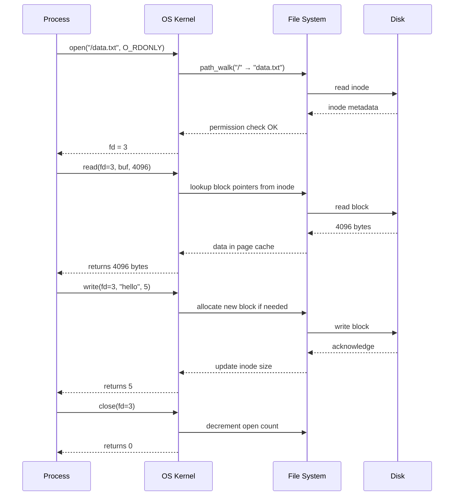

# Chapter 10: File Systems

**<< [Virtual Memory](./09-virtual-memory.md)** | [**Next: File System Implementation**](./11-file-system-impl.md) >>

---

## Learning Objectives

- Define a file and describe its attributes, operations, and types
- Differentiate sequential, direct, and indexed file access methods
- Compare single-level, two-level, tree-structured, acyclic-graph, and general-graph directories
- Explain file system mounting and the unified namespace concept
- Describe file sharing mechanisms (hard links, symbolic links, consistency semantics)
- Distinguish between contiguous, linked, and indexed disk allocation strategies
- Analyse complexity trade-offs in access methods and directory structures
- Apply C++ and Python implementations for file and directory operations
- Understand file protection via ACLs and capability lists
- Compare real-world file systems: ext4, NTFS, FAT32, APFS

<!-- Image Gallery -->
<div style="display:flex;flex-wrap:wrap;gap:4px;margin:16px 0;padding:12px;background:#f8fafc;border-radius:8px;border:1px solid #e2e8f0;">
<a href="../../../assets/images/lessons/operating-systems/10-file-systems/hero.svg" target="_blank" rel="noopener">
  
</a>
<a href="../../../assets/images/lessons/operating-systems/10-file-systems/handwritten-notes.svg" target="_blank" rel="noopener">
  
</a>
<a href="../../../assets/images/lessons/operating-systems/10-file-systems/sticky-notes.svg" target="_blank" rel="noopener">
  
</a>
<a href="../../../assets/images/lessons/operating-systems/10-file-systems/visual-explanation.svg" target="_blank" rel="noopener">
  
</a>
<a href="../../../assets/images/lessons/operating-systems/10-file-systems/architecture.svg" target="_blank" rel="noopener">
  
</a>
<a href="../../../assets/images/lessons/operating-systems/10-file-systems/workflow.svg" target="_blank" rel="noopener">
  
</a>
<a href="../../../assets/images/lessons/operating-systems/10-file-systems/mindmap.svg" target="_blank" rel="noopener">
  
</a>
<a href="../../../assets/images/lessons/operating-systems/10-file-systems/comparison.svg" target="_blank" rel="noopener">
  
</a>
<a href="../../../assets/images/lessons/operating-systems/10-file-systems/cheatsheet.svg" target="_blank" rel="noopener">
  
</a>
<a href="../../../assets/images/lessons/operating-systems/10-file-systems/interview-quiz.svg" target="_blank" rel="noopener">
  
</a>
<a href="../../../assets/images/lessons/operating-systems/10-file-systems/social-card.svg" target="_blank" rel="noopener">
  
</a>
</div>
<!-- End Image Gallery -->


## Chapter at a Glance

| Topic | Key Points |
|-------|------------|
| **File Concept** | Named collection of related data; persistent storage abstraction |
| **File Attributes** | Name, identifier, type, location, size, protection, timestamps |
| **Access Methods** | Sequential, Direct/Random, Indexed (via index table) |
| **Directory Structure** | Single-level, two-level, tree-structured, acyclic-graph, general-graph |
| **Protection** | Read/write/execute per user/group/other; ACLs, capabilities |
| **Mounting** | Attaching a file system to a mount point in the directory tree |
| **File Allocation** | Contiguous, linked, indexed strategies (overview) |

## Chapter Roadmap

<div class="mermaid">
flowchart LR
    A[File Concept] --> B[File Attributes & Operations]
    B --> C[File Types]
    C --> D[Access Methods]
    D --> E[Directory Structures]
    E --> F[Mounting]
    F --> G[Protection]
    G --> H[Real-World FS]
    H --> I[Summary]
</div>

## Theory


### File Concept

<a href="../../../assets/images/diagrams/operating-systems/10-file-systems/file-concept-handwritten.svg" target="_blank" rel="noopener">
  
</a>
<a href="../../../assets/images/diagrams/operating-systems/10-file-systems/file-concept-diagram.svg" target="_blank" rel="noopener">
  
</a>
<a href="../../../assets/images/diagrams/operating-systems/10-file-systems/file-concept-sticky.svg" target="_blank" rel="noopener">
  
</a>


A **file** is a named collection of related information recorded on secondary storage. Files are the primary abstraction the OS provides for persistent data storage.

**Real-world analogy:** A file is like a library book. The book has a title (file name), call number (inode/identifier), content (data), borrower card (protection), and due-date stamp (timestamps). The library shelf (directory) organises books so you can find them.

**Numbered steps — how a file is created (OS perspective):**

1. Application calls `open()` with O_CREAT flag
2. OS allocates a free inode from the inode table
3. OS initialises inode metadata (owner, permissions, timestamps, size=0)
4. OS creates a directory entry mapping the file name to the inode number
5. OS returns a file descriptor to the calling process
6. File now exists but occupies zero data blocks

**Pseudocode — file creation:**

```
FUNCTION create_file(path, permissions):
    inode_table <- read_superblock().inode_table
    free_inode <- find_free_inode(inode_table)
    IF free_inode IS NULL:
        RETURN ERROR("Disk full — no free inodes")
    init_inode(free_inode, permissions, current_time(), 0)
    parent_dir <- get_parent_dir(path)
    name <- get_filename(path)
    parent_dir.entries[name] <- free_inode.number
    mark_inode_used(free_inode)
    write_inode_table(inode_table)
    RETURN SUCCESS
```

**C++ Implementation — file create/write/read:**

```cpp
#include <iostream>
#include <fstream>
#include <string>
#include <filesystem>
#include <system_error>

namespace fs = std::filesystem;

class FileSystemDemo {
public:
    static void createAndWrite(const std::string& path, const std::string& data) {
        std::ofstream ofs(path, std::ios::binary | std::ios::trunc);
        if (!ofs) {
            throw std::runtime_error("Failed to create file: " + path);
        }
        ofs.write(data.data(), data.size());
        ofs.close();
        std::cout << "Created: " << path
                  << " (" << data.size() << " bytes)\n";
    }

    static std::string readFile(const std::string& path) {
        std::ifstream ifs(path, std::ios::binary | std::ios::ate);
        if (!ifs) {
            throw std::runtime_error("Failed to open: " + path);
        }
        std::streamsize size = ifs.tellg();
        ifs.seekg(0, std::ios::beg);
        std::string buffer(static_cast<size_t>(size), '\0');
        ifs.read(buffer.data(), size);
        return buffer;
    }

    static void showFileInfo(const std::string& path) {
        std::error_code ec;
        fs::file_status status = fs::status(path, ec);
        if (ec) {
            std::cerr << "Error: " << ec.message() << "\n";
            return;
        }
        auto size = fs::file_size(path, ec);
        auto ftime = fs::last_write_time(path, ec);
        std::cout << "File: " << path << "\n"
                  << "  Size: " << size << " bytes\n"
                  << "  Type: " << static_cast<int>(status.type()) << "\n";
    }
};

int main() {
    try {
        FileSystemDemo::createAndWrite("demo.txt", "Hello, File System!");
        std::string content = FileSystemDemo::readFile("demo.txt");
        std::cout << "Read back: " << content << "\n";
        FileSystemDemo::showFileInfo("demo.txt");
        fs::remove("demo.txt");
    } catch (const std::exception& e) {
        std::cerr << e.what() << "\n";
        return 1;
    }
    return 0;
}
```

**Python Implementation — file operations:**

```python
import os
import time
from pathlib import Path

class FileDemo:
    @staticmethod
    def create_and_write(path: str, data: str) -> int:
        with open(path, 'wb') as f:
            f.write(data.encode('utf-8'))
        size = os.path.getsize(path)
        print(f"Created: {path} ({size} bytes)")
        return size

    @staticmethod
    def read_file(path: str) -> str:
        with open(path, 'rb') as f:
            return f.read().decode('utf-8')

    @staticmethod
    def show_attributes(path: str) -> None:
        stat = os.stat(path)
        print(f"File: {path}")
        print(f"  Size: {stat.st_size} bytes")
        print(f"  Inode: {stat.st_ino}")
        print(f"  Permissions: {oct(stat.st_mode)}")
        print(f"  Modified: {time.ctime(stat.st_mtime)}")
        print(f"  Owner UID: {stat.st_uid}  Group GID: {stat.st_gid}")

if __name__ == "__main__":
    fd = FileDemo()
    fd.create_and_write("demo.txt", "Hello, Python File System!")
    content = fd.read_file("demo.txt")
    print(f"Read back: {content}")
    fd.show_attributes("demo.txt")
    os.remove("demo.txt")
```

 **TypeScript Implementation — File System Permissions Simulator:**

```typescript
/**
 * FileSystemPermissions: A TypeScript simulator for Unix-style
 * file system permission checking. Demonstrates how the OS
 * validates read/write/execute access based on owner, group, and world.
 */
type Permission = 'r' | 'w' | 'x';
type PermissionSet = { owner: Permission[]; group: Permission[]; others: Permission[] };

class Inode {
  constructor(
    public readonly id: number,
    public readonly ownerUid: number,
    public readonly groupGid: number,
    public perms: PermissionSet,
    public size: number = 0
  ) {}
}

class FileSystemPermissions {
  private inodes: Map<number, Inode> = new Map();

  createFile(ino: number, uid: number, gid: number, perms: PermissionSet): void {
    this.inodes.set(ino, new Inode(ino, uid, gid, perms));
  }

  checkAccess(ino: number, uid: number, gid: number, requested: Permission): boolean {
    const inode = this.inodes.get(ino);
    if (!inode) throw new Error(`Inode ${ino} not found`);

    const permMap = (p: Permission[]): boolean => p.includes(requested);

    if (uid === inode.ownerUid) return permMap(inode.perms.owner);
    if (gid === inode.groupGid) return permMap(inode.perms.group);
    return permMap(inode.perms.others);
  }

  simulate(): void {
    // Create a file with rw-r--r-- (owner r+w, group r, others r)
    this.createFile(42, 1000, 100, {
      owner: ['r', 'w'],
      group: ['r'],
      others: ['r']
    });

    interface TestCase { desc: string; uid: number; gid: number; perm: Permission; expect: boolean; }
    const tests: TestCase[] = [
      { desc: 'Owner writes own file', uid: 1000, gid: 100, perm: 'w', expect: true },
      { desc: 'Owner reads own file', uid: 1000, gid: 100, perm: 'r', expect: true },
      { desc: 'Group member reads', uid: 1001, gid: 100, perm: 'r', expect: true },
      { desc: 'Group member writes (denied)', uid: 1001, gid: 100, perm: 'w', expect: false },
      { desc: 'Other reads', uid: 2000, gid: 200, perm: 'r', expect: true },
      { desc: 'Other writes (denied)', uid: 2000, gid: 200, perm: 'w', expect: false },
      { desc: 'Other executes (denied)', uid: 2000, gid: 200, perm: 'x', expect: false },
    ];

    for (const t of tests) {
      const result = this.checkAccess(42, t.uid, t.gid, t.perm);
      const status = result === t.expect ? '✓ PASS' : '✗ FAIL';
      console.log(`${status} | ${t.desc}: ${result} (expected ${t.expect})`);
    }
  }
}

// Run the simulator
const fsPerms = new FileSystemPermissions();
fsPerms.simulate();
```

**Mermaid Diagram — File Operation Lifecycle:**



**Complexity Analysis:**

| Operation | Time | Space | Why |
|-----------|------|-------|-----|
| Create | O(1) amortised | O(1) | Inode allocation + single directory entry insert |
| Open    | O(d) where d = path depth | O(1) | Must traverse each directory component in path |
| Read    | O(n) where n = bytes read | O(n) buffer | Must copy data from kernel buffer to user space |
| Write   | O(n) where n = bytes written | O(1) | May trigger block allocation if file grows |
| Delete  | O(1) amortised + O(d) path walk | O(1) | Free inode + remove directory entry |

**A&D Table — File Concept:**

| Advantage | Disadvantage |
|-----------|-------------|
| Provides persistent storage abstraction | Metadata overhead for small files |
| Uniform interface via system calls | File system fragmentation over time |
| Enables sharing between processes | Naming collisions without directories |
| Supports multiple access patterns | Fixed max file size (depending on FS) |

**Edge Cases:**

| Edge Case | Scenario | Mitigation |
|-----------|----------|------------|
| Zero-length file | `touch empty.txt` | Valid; inode allocated but no data blocks |
| File name too long | 300-char name on FAT32 | FS enforces NAME_MAX (255 on ext4) |
| Special characters | `/` in file name | Reserved character; rejected by OS |
| Concurrent create | Two processes create same path | OS serialises via directory mutex |

---

#### File Attributes

Every file has metadata stored in its **inode** (Unix) or **file control block** (general OS theory).

**Real-world analogy:** A passport has: name (file name), passport number (inode), nationality (type), issuing country (device location), photo (size), visa pages (protection), issue/expiry dates (timestamps), and holder (owner). All this metadata travels with the passport but is distinct from the passport content itself.

| Attribute | Description | Example |
|-----------|-------------|---------|
| Name | Human-readable symbolic identifier | "report.pdf" |
| Identifier | Unique numeric tag within the file system | Inode # 123456 |
| Type | Regular file, directory, device, pipe, socket | S_IFREG |
| Location | Pointer to file location on device | Block # 8901 |
| Size | Current size in bytes, blocks, or pages | 16384 bytes (4 blocks) |
| Protection | Access control (read, write, execute permissions) | rwxr-xr-x |
| Timestamps | Creation, last access, last modification times | 2026-06-23 10:00 |
| User identification | Owner, group | uid=1000, gid=100 |

**C++ — reading file attributes:**

```cpp
#include <iostream>
#include <filesystem>
#include <ctime>

namespace fs = std::filesystem;

void printAttributes(const fs::path& p) {
    std::error_code ec;
    auto ft = fs::last_write_time(p, ec);
    auto size = fs::file_size(p, ec);
    auto perms = fs::status(p).permissions();
    std::cout << "Name: " << p.filename() << "\n"
              << "Size: " << size << "\n"
              << "Permissions: " << std::hex << static_cast<int>(perms) << "\n";
}

int main() {
    printAttributes("example.txt");
    return 0;
}
```

---

#### File Operations

The OS provides system calls for these fundamental file operations:

**Real-world analogy:** A restaurant order: **Create** = chef prepares a new recipe card; **Open** = waiter brings the menu; **Read** = you read the menu items; **Write** = you write your order; **Seek** = you skip to the dessert section; **Delete** = order is finished and cleared; **Close** = waiter takes the menu away.

**Numbered steps — Open + Read cycle:**

1. Process calls `open("/home/user/file.txt", O_RDONLY)`
2. OS looks up path in directory tree (traverses `/` → `home` → `user` → `file.txt`)
3. OS reads inode for `file.txt`, checks read permission
4. OS allocates a file descriptor (FD) in the process's FD table
5. OS creates a system-wide open-file entry with current offset = 0
6. OS returns FD to process
7. Process calls `read(fd, buf, 100)`
8. OS uses FD to find open-file entry → inode → block pointers
9. OS reads disk block(s) containing next 100 bytes
10. OS copies data to user buffer, advances offset by 100
11. Process calls `close(fd)`
12. OS decrements open-file reference count; if zero, removes entry

**Pseudocode — open system call:**

```
FUNCTION open_file(path, flags):
    inode <- path_walk(path)
    IF inode IS NULL:
        RETURN ERROR("File not found")
    IF NOT check_permission(inode, flags):
        RETURN ERROR("Permission denied")
    fd <- allocate_fd(current_process)
    open_file_entry <- create_open_file_entry(inode, flags)
    current_process.fd_table[fd] <- open_file_entry
    RETURN fd

FUNCTION path_walk(path):
    components <- split(path, '/')
    current_inode <- root_inode
    FOR EACH component IN components:
        IF component == "": CONTINUE
        IF NOT is_directory(current_inode):
            RETURN NULL
        dir_data <- read_blocks(current_inode)
        entry <- find_in_dir(dir_data, component)
        IF entry IS NULL:
            RETURN NULL
        current_inode <- get_inode(entry.inode_number)
    RETURN current_inode
```

**C++ Implementation — file operations with error handling:**

```cpp
#include <iostream>
#include <fstream>
#include <string>
#include <vector>

class FileOps {
public:
    static int createFile(const std::string& path) {
        std::ofstream ofs(path);
        if (!ofs) { return -1; }
        ofs.close();
        return 0;
    }

    static long openAndRead(const std::string& path, std::vector<char>& buffer) {
        std::ifstream ifs(path, std::ios::binary | std::ios::ate);
        if (!ifs) { return -1; }
        std::streamsize size = ifs.tellg();
        ifs.seekg(0, std::ios::beg);
        buffer.resize(static_cast<size_t>(size));
        ifs.read(buffer.data(), size);
        return static_cast<long>(size);
    }

    static long writeFile(const std::string& path, const char* data, size_t len) {
        std::ofstream ofs(path, std::ios::binary | std::ios::app);
        if (!ofs) { return -1; }
        ofs.write(data, static_cast<std::streamsize>(len));
        return static_cast<long>(len);
    }

    static bool deleteFile(const std::string& path) {
        return std::remove(path.c_str()) == 0;
    }

    static long seekPosition(const std::string& path, size_t pos) {
        std::ifstream ifs(path);
        if (!ifs) { return -1; }
        ifs.seekg(static_cast<std::streamoff>(pos));
        return static_cast<long>(ifs.tellg());
    }
};

int main() {
    FileOps::createFile("test.dat");
    FileOps::writeFile("test.dat", "Hello World", 12);
    std::vector<char> buf;
    FileOps::openAndRead("test.dat", buf);
    std::cout << std::string(buf.begin(), buf.end()) << "\n";
    FileOps::deleteFile("test.dat");
    return 0;
}
```

**Python Implementation — all file operations:**

```python
import os

class FileOperations:
    @staticmethod
    def create(path: str) -> bool:
        try:
            with open(path, 'x'):
                pass
            return True
        except FileExistsError:
            return False

    @staticmethod
    def read_all(path: str) -> bytes:
        with open(path, 'rb') as f:
            return f.read()

    @staticmethod
    def write_append(path: str, data: bytes) -> int:
        with open(path, 'ab') as f:
            f.write(data)
            return len(data)

    @staticmethod
    def seek_read(path: str, offset: int, size: int) -> bytes:
        with open(path, 'rb') as f:
            f.seek(offset)
            return f.read(size)

    @staticmethod
    def delete(path: str) -> bool:
        try:
            os.remove(path)
            return True
        except FileNotFoundError:
            return False

    @staticmethod
    def truncate(path: str, length: int = 0) -> None:
        with open(path, 'r+b') as f:
            f.truncate(length)


if __name__ == "__main__":
    fo = FileOperations()
    assert fo.create("test.bin") == True
    fo.write_append("test.bin", b"AAAA")
    data = fo.read_all("test.bin")
    assert data == b"AAAA"
    fo.delete("test.bin")
    print("All operations passed.")
```

**A&D Table — File Operations:**

| Operation | Advantage | Disadvantage |
|-----------|-----------|-------------|
| Create | Simple API | Race condition if file exists |
| Open | Returns lightweight FD | Path traversal is O(depth) |
| Read | Efficient block transfer | Must context-switch to kernel |
| Write | Buffer cache accelerates | May block on synchronous write |
| Seek | O(1) reposition | Only works on random-access devices |
| Close | Releases kernel resources | Must flush buffers first |

**Edge Cases — File Operations:**

| Edge Case | Description | Handling |
|-----------|-------------|----------|
| Open non-existent | File not found | Return ENOENT |
| Write to read-only FD | Permission mismatch | Return EBADF or EPERM |
| Read past EOF | Partial read | Return fewer bytes than requested |
| Close already closed FD | Double close | Return EBADF |
| Seek beyond EOF | Hole creation | Sparse file — reads return zeros |

---

#### File Types

**Real-world analogy:** A package's shipping label indicates its contents: FRAGILE (image file delivers visual data), PERISHABLE (temp file must be consumed quickly), DOCUMENTS (text file). The postal service uses the label to decide how to handle each package — just as the OS uses file type to decide how to interpret data.

Most OS recognise file types to determine how to handle the data:

```
Common file types:
  .exe, .com     — Executable files
  .txt, .doc     — Text/document files
  .c, .java      — Source code
  .o, .obj       — Object files
  .lib, .a       — Libraries
  .jpg, .png     — Image files
  .mp3, .wav     — Audio files
  .mp4, .mov     — Video files
  .tar, .zip     — Archive/compressed files
  .sh, .bat      — Script files
  .so, .dll, .dylib — Shared libraries
  .conf, .ini, .json, .yaml — Configuration files
```

Unix-like systems use the file's **magic number** (first few bytes) to determine type, not the extension. Windows uses the extension.

**C++ — detect file type via magic number:**

```cpp
#include <iostream>
#include <fstream>
#include <vector>
#include <string>
#include <unordered_map>

class FileTypeDetector {
    std::unordered_map<std::string, std::string> magicMap;

public:
    FileTypeDetector() {
        magicMap["%PDF"] = "PDF Document";
        magicMap["\x89PNG"] = "PNG Image";
        magicMap["\xFF\xD8\xFF"] = "JPEG Image";
        magicMap["PK\x03\x04"] = "ZIP Archive";
        magicMap["GIF8"] = "GIF Image";
        magicMap["\x7FELF"] = "ELF Executable";
    }

    std::string detect(const std::string& path) {
        std::ifstream ifs(path, std::ios::binary);
        if (!ifs) return "Unknown";
        char header[8] = {0};
        ifs.read(header, 8);
        for (const auto& [magic, desc] : magicMap) {
            if (std::string(header).substr(0, magic.size()) == magic)
                return desc;
        }
        return "Unknown/Text";
    }
};

int main(int argc, char* argv[]) {
    if (argc < 2) {
        std::cerr << "Usage: " << argv[0] << " <file>\n";
        return 1;
    }
    FileTypeDetector detector;
    std::cout << argv[1] << ": " << detector.detect(argv[1]) << "\n";
    return 0;
}
```

**Python — detect file type:**

```python
import struct
import os

class FileTypeDetector:
    MAGIC = {
        b'\x89PNG': 'PNG Image',
        b'\xff\xd8\xff': 'JPEG Image',
        b'GIF8': 'GIF Image',
        b'%PDF': 'PDF Document',
        b'PK\x03\x04': 'ZIP Archive',
        b'\x7fELF': 'ELF Executable',
        b'MZ': 'Windows PE Executable',
    }

    def detect(self, path: str) -> str:
        if not os.path.exists(path):
            return "File not found"
        with open(path, 'rb') as f:
            header = f.read(8)
        for magic, desc in self.MAGIC.items():
            if header.startswith(magic):
                return desc
        return "Unknown / Text file"

if __name__ == "__main__":
    d = FileTypeDetector()
    print(d.detect("test.pdf"))   # PDF Document
    print(d.detect("image.png"))  # PNG Image
```

**Edge Cases — File Type Mismatch:**

| Scenario | Problem | Consequence |
|----------|---------|-------------|
| .exe renamed to .txt | Type confusion | OS may try to execute text → error |
| Magic number mismatch | Extension lies | Unix ignores extension; reads magic |
| No magic number | Plain text file | Treated as text regardless of extension |
| Corrupt header | Unreadable file | Magic bytes gone; type detection fails |
| Empty file | Zero-length file | No magic bytes; detected as unknown |

---

### Access Methods

<a href="../../../assets/images/diagrams/operating-systems/10-file-systems/access-methods-handwritten.svg" target="_blank" rel="noopener">
  
</a>
<a href="../../../assets/images/diagrams/operating-systems/10-file-systems/access-methods-diagram.svg" target="_blank" rel="noopener">
  
</a>
<a href="../../../assets/images/diagrams/operating-systems/10-file-systems/access-methods-sticky.svg" target="_blank" rel="noopener">
  
</a>


#### Sequential Access

The simplest method. Data is read in order, from beginning to end.

**Real-world analogy:** A cassette tape. To get to song #5, you must fast-forward through songs 1-4. You cannot jump directly. Reading a scroll — you unroll from left to right.

**Numbered steps — sequential read of 3 records:**

1. File pointer at offset 0
2. Read record 1 → pointer advances past record 1
3. Read record 2 → pointer advances past record 2
4. Read record 3 → pointer advances past record 3
5. To re-read record 2, you must reset to 0 and read 1 and 2

```
read next    → read next block, advance pointer
write next   → write block, advance pointer
reset        → set pointer to beginning
```

**Pseudocode — sequential file read:**

```
FUNCTION sequential_read(file_descriptor, buffer, n):
    current_offset <- file_descriptor.offset
    bytes_read <- read_from_disk(file_descriptor.inode, current_offset, n)
    file_descriptor.offset <- current_offset + bytes_read
    RETURN bytes_read

FUNCTION sequential_write(file_descriptor, buffer, n):
    current_offset <- file_descriptor.offset
    bytes_written <- write_to_disk(file_descriptor.inode, current_offset, buffer, n)
    file_descriptor.offset <- current_offset + bytes_written
    file_descriptor.inode.size <- max(file_descriptor.inode.size, file_descriptor.offset)
    RETURN bytes_written

FUNCTION reset(file_descriptor):
    file_descriptor.offset <- 0
```

**Dry Run — Sequential Read (file contains [A, B, C, D, E]):**

| Step | Operation | Offset Before | Bytes Read | Offset After | Result |
|------|-----------|---------------|------------|--------------|--------|
| 1 | reset | 5 | - | 0 | Ready |
| 2 | read buf 1 | 0 | 1 | 1 | A |
| 3 | read buf 1 | 1 | 1 | 2 | B |
| 4 | read buf 1 | 2 | 1 | 3 | C |
| 5 | read buf 3 | 3 | 2 | 5 | D, E |
| 6 | read buf 1 | 5 | 0 | 5 | EOF |

**C++ Implementation — sequential file processing:**

```cpp
#include <iostream>
#include <fstream>
#include <string>
#include <vector>

class SequentialFile {
    std::fstream stream;
    std::string path;
public:
    SequentialFile(const std::string& p) : path(p) {}

    void writeRecord(const std::string& record) {
        stream.open(path, std::ios::binary | std::ios::app);
        if (!stream) {
            stream.open(path, std::ios::binary | std::ios::out);
        }
        stream.write(record.data(), static_cast<long>(record.size()));
        stream.write("\n", 1);
        stream.close();
    }

    std::vector<std::string> readAll() {
        std::vector<std::string> records;
        stream.open(path, std::ios::binary | std::ios::in);
        if (!stream) return records;
        std::string line;
        while (std::getline(stream, line)) {
            records.push_back(line);
        }
        stream.close();
        return records;
    }

    void reset() {
        stream.close();
    }
};

int main() {
    SequentialFile sf("seq.dat");
    sf.writeRecord("Record 1");
    sf.writeRecord("Record 2");
    sf.writeRecord("Record 3");
    auto all = sf.readAll();
    for (const auto& r : all) {
        std::cout << r << "\n";
    }
    std::remove("seq.dat");
    return 0;
}
```

**Python Implementation — sequential access:**

```python
import os

class SequentialFile:
    def __init__(self, path: str):
        self.path = path
        self.offset = 0

    def write_next(self, data: bytes) -> int:
        with open(self.path, 'ab') as f:
            f.write(data)
        self.offset = os.path.getsize(self.path)
        return len(data)

    def read_next(self, n: int) -> bytes:
        with open(self.path, 'rb') as f:
            f.seek(self.offset)
            data = f.read(n)
        self.offset += len(data)
        return data

    def reset(self) -> None:
        self.offset = 0

    def __len__(self) -> int:
        return os.path.getsize(self.path)


if __name__ == "__main__":
    sf = SequentialFile("seq_test.bin")
    sf.write_next(b"AAA")
    sf.write_next(b"BBB")
    sf.reset()
    print(sf.read_next(3))  # b'AAA'
    print(sf.read_next(3))  # b'BBB'
    print(sf.read_next(3))  # b'' (EOF)
    os.remove("seq_test.bin")
```

**Complexity Analysis:**

| Aspect | Complexity | Why |
|--------|-----------|-----|
| Read n bytes | O(n) | Must transfer each byte sequentially |
| Write n bytes | O(n) | Sequential write is fastest due to minimal seeking |
| Space overhead | O(1) | No index structures needed |
| reset | O(1) | Just set pointer to 0 |

**A&D Table — Sequential Access:**

| Advantage | Disadvantage |
|-----------|-------------|
| Simple implementation | Slow for random access |
| Low overhead (no index) | Must read from start to reach target |
| Optimal for streaming | Inefficient for large datasets with sparse queries |
| Works on tape/stream devices | Cannot insert in middle efficiently |

---

#### Direct Access (Relative Access)

A file is composed of fixed-length logical records. A program can read or write records in any order.

**Real-world analogy:** A vinyl record player. The tonearm can be placed directly on any track. A filing cabinet — each folder has a tab number; you open drawer, go directly to tab #47.

**Numbered steps — direct read of record n:**

1. Compute byte offset = (record_number - 1) * record_size
2. `lseek(fd, offset, SEEK_SET)` repositions the file pointer
3. `read(fd, buffer, record_size)` reads exactly one record
4. File pointer is now at the start of the next record

```
read n       → read block n (where n is a logical record number)
write n      → write block n
seek n       → position to record n
```

**Pseudocode — direct access:**

```
FUNCTION direct_read(file_descriptor, record_number, record_size):
    offset <- (record_number - 1) * record_size
    IF offset >= file_descriptor.inode.size:
        RETURN ERROR("Record beyond EOF")
    file_descriptor.offset = offset
    RETURN read_from_disk(file_descriptor.inode, offset, record_size)

FUNCTION direct_write(file_descriptor, record_number, record_size, data):
    offset <- (record_number - 1) * record_size
    file_descriptor.offset = offset
    bytes_written <- write_to_disk(file_descriptor.inode, offset, data, record_size)
    file_descriptor.inode.size <- max(file_descriptor.inode.size, offset + bytes_written)
    RETURN bytes_written
```

**Dry Run — Direct Access (file with record_size=4 bytes, records=[ABCD, EFGH, IJKL, MNOP]):**

| Step | Operation | Compute Offset | Read | Result |
|------|-----------|---------------|------|--------|
| 1 | read record 3 | (3-1)*4 = 8 | bytes 8-11 | IJKL |
| 2 | read record 1 | (1-1)*4 = 0 | bytes 0-3 | ABCD |
| 3 | read record 4 | (4-1)*4 = 12 | bytes 12-15 | MNOP |
| 4 | write record 2 with "WXYZ" | (2-1)*4 = 4 | write bytes 4-7 | WXYZ |
| 5 | read record 2 | (2-1)*4 = 4 | bytes 4-7 | WXYZ |

**C++ Implementation — direct access file:**

```cpp
#include <iostream>
#include <fstream>
#include <vector>
#include <cstring>

struct Record {
    char data[32];
};

class DirectAccessFile {
    std::fstream stream;
    std::string path;
    static constexpr int REC_SIZE = sizeof(Record);

public:
    DirectAccessFile(const std::string& p) : path(p) {
        stream.open(path, std::ios::binary | std::ios::in | std::ios::out);
        if (!stream) {
            stream.open(path, std::ios::binary | std::ios::out);
            stream.close();
            stream.open(path, std::ios::binary | std::ios::in | std::ios::out);
        }
    }

    Record read(int recordNum) {
        Record r{};
        stream.seekg((recordNum - 1) * REC_SIZE);
        stream.read(r.data, REC_SIZE);
        if (stream.gcount() < REC_SIZE) {
            std::memset(r.data, 0, REC_SIZE);
        }
        return r;
    }

    void write(int recordNum, const Record& r) {
        stream.seekp((recordNum - 1) * REC_SIZE);
        stream.write(r.data, REC_SIZE);
        stream.flush();
    }

    ~DirectAccessFile() { stream.close(); }
};

int main() {
    DirectAccessFile daf("direct.dat");
    daf.write(1, Record{"Alice"});
    daf.write(2, Record{"Bob"});
    daf.write(5, Record{"Eve — sparse write"});
    Record r1 = daf.read(5);
    std::cout << "Record 5: " << r1.data << "\n";
    Record r2 = daf.read(1);
    std::cout << "Record 1: " << r2.data << "\n";
    std::remove("direct.dat");
    return 0;
}
```

**Python Implementation — direct access:**

```python
import os
import struct

class DirectAccessFile:
    def __init__(self, path: str, record_size: int = 32):
        self.path = path
        self.record_size = record_size
        self._ensure_file()

    def _ensure_file(self) -> None:
        if not os.path.exists(self.path):
            with open(self.path, 'wb'):
                pass

    def _offset(self, record_num: int) -> int:
        return (record_num - 1) * self.record_size

    def read_record(self, record_num: int) -> bytes:
        with open(self.path, 'rb') as f:
            f.seek(self._offset(record_num))
            return f.read(self.record_size)

    def write_record(self, record_num: int, data: bytes) -> None:
        data = data.ljust(self.record_size, b'\x00')[:self.record_size]
        with open(self.path, 'r+b') as f:
            f.seek(self._offset(record_num))
            f.write(data)

    def num_records(self) -> int:
        size = os.path.getsize(self.path)
        return size // self.record_size


if __name__ == "__main__":
    daf = DirectAccessFile("direct_test.db", 16)
    daf.write_record(1, b"Alice")
    daf.write_record(3, b"Charlie")  # Sparse — record 2 is zeros
    print(daf.read_record(1))  # Alice
    print(daf.read_record(2))  # zeros
    print(daf.read_record(3))  # Charlie
    print(f"Total records: {daf.num_records()}")
    os.remove("direct_test.db")
```

**Complexity Analysis:**

| Aspect | Complexity | Why |
|--------|-----------|-----|
| Read record n | O(1) | Direct computation of offset |
| Write record n | O(1) | Same offset computation |
| Sparse write | O(1) if hole supported | File system creates holes |
| Sequential scan all records | O(N) | Must iterate all blocks |

**A&D Table — Direct Access:**

| Advantage | Disadvantage |
|-----------|-------------|
| O(1) access to any record | Records must be fixed-length |
| Supports sparse files | Wasted space for variable data |
| Efficient for indexed lookup | No ordering guarantee by content |

---

#### Indexed Access

Builds an index on top of direct access. The index contains pointers to blocks holding records with specific keys.

**Real-world analogy:** A library card catalogue. You look up a book by title in the catalogue (index), which tells you the exact shelf and row (block number). You walk directly to that location. Without the catalogue, you'd search every shelf sequentially.

```
Customer Index:
  Key: Smith, J. → Record in block 47
  Key: Jones, A. → Record in block 12
  Key: Lee, C.   → Record in block 89
```

**Numbered steps — indexed lookup for "Smith":**

1. Search index for key "Smith, J." (binary search if sorted, hash if hash index)
2. Index entry maps key to block number 47
3. Compute offset = (47 - 1) * record_size within the data file
4. Seek to offset and read the record
5. If index is multi-level and block is not in first-level, follow the pointer

**Pseudocode — indexed access:**

```
FUNCTION indexed_read(index_file, data_file, key):
    index <- load_index(index_file)
    entry <- search_index(index, key)   // binary search or hash lookup
    IF entry IS NULL:
        RETURN ERROR("Key not found")
    offset <- (entry.block_number - 1) * RECORD_SIZE
    RETURN direct_read(data_file, offset, RECORD_SIZE)

FUNCTION search_index(index, key):
    // Binary search on sorted index
    low <- 0
    high <- len(index) - 1
    WHILE low <= high:
        mid <- (low + high) / 2
        IF index[mid].key == key:
            RETURN index[mid]
        ELSE IF index[mid].key < key:
            low <- mid + 1
        ELSE:
            high <- mid - 1
    RETURN NULL
```

**Dry Run — Indexed Access (index table with 4 entries):**

| Step | Operation | Key Searched | Mid | Compare | Range | Result |
|------|-----------|-------------|-----|---------|-------|--------|
| 1 | binary search | Lee | mid=1 (Jones) | Lee > Jones | low=2, high=3 |
| 2 | binary search | Lee | mid=2 (Lee) | Lee == Lee | Found → block 47 |
| 3 | direct read | - | block 47 | offset = (47-1)*32 = 1472 | Read record |

Index Table:

| Key | Block |
|-----|-------|
| Adams, R. | 12 |
| Jones, A. | 34 |
| Lee, C. | 47 |
| Smith, J. | 89 |

**C++ Implementation — simple indexed file:**

```cpp
#include <iostream>
#include <fstream>
#include <map>
#include <string>
#include <vector>

class IndexedFile {
    std::string dataPath;
    std::string indexPath;
    std::map<std::string, int> index;

    void loadIndex() {
        index.clear();
        std::ifstream ifs(indexPath);
        if (!ifs) return;
        std::string key;
        int block;
        while (ifs >> key >> block) {
            index[key] = block;
        }
    }

    void saveIndex() {
        std::ofstream ofs(indexPath);
        for (const auto& [key, block] : index) {
            ofs << key << " " << block << "\n";
        }
    }

public:
    IndexedFile(const std::string& dp, const std::string& ip)
        : dataPath(dp), indexPath(ip) {
        loadIndex();
    }

    void insert(const std::string& key, const std::string& data) {
        std::fstream dfs(dataPath, std::ios::binary | std::ios::app | std::ios::out);
        auto pos = static_cast<int>(dfs.tellp());
        dfs << data << "\n";
        dfs.close();
        index[key] = pos;
        saveIndex();
    }

    std::string lookup(const std::string& key) {
        loadIndex();
        if (index.find(key) == index.end()) return "[NOT FOUND]";
        int block = index[key];
        std::ifstream dfs(dataPath);
        dfs.seekg(block);
        std::string value;
        std::getline(dfs, value);
        return value;
    }
};

int main() {
    IndexedFile idxf("indexed_data.dat", "index.idx");
    idxf.insert("Smith", "Engineer, age 34");
    idxf.insert("Jones", "Doctor, age 45");
    std::cout << idxf.lookup("Smith") << "\n";
    std::cout << idxf.lookup("Lee") << "\n";
    std::remove("indexed_data.dat");
    std::remove("index.idx");
    return 0;
}
```

**Python Implementation — indexed file with binary search:**

```python
import os
import bisect

class IndexedFile:
    def __init__(self, data_path: str, index_path: str):
        self.data_path = data_path
        self.index_path = index_path
        self.index: list[tuple[str, int]] = []
        self._load()

    def _load(self) -> None:
        self.index = []
        if not os.path.exists(self.index_path):
            return
        with open(self.index_path, 'r') as f:
            for line in f:
                parts = line.strip().split('|')
                if len(parts) == 2:
                    self.index.append((parts[0], int(parts[1])))
        self.index.sort()

    def _save(self) -> None:
        with open(self.index_path, 'w') as f:
            for key, offset in self.index:
                f.write(f"{key}|{offset}\n")

    def insert(self, key: str, value: str) -> None:
        with open(self.data_path, 'a') as f:
            offset = f.tell()
            f.write(f"{value}\n")
        self.index.append((key, offset))
        self.index.sort()
        self._save()

    def lookup(self, key: str) -> str | None:
        keys = [k for k, _ in self.index]
        pos = bisect.bisect_left(keys, key)
        if pos < len(self.index) and self.index[pos][0] == key:
            _, offset = self.index[pos]
            with open(self.data_path, 'r') as f:
                f.seek(offset)
                return f.readline().strip()
        return None

    def __contains__(self, key: str) -> bool:
        keys = [k for k, _ in self.index]
        pos = bisect.bisect_left(keys, key)
        return pos < len(self.index) and self.index[pos][0] == key


if __name__ == "__main__":
    idxf = IndexedFile("data.txt", "index.txt")
    idxf.insert("Smith", "Engineer, age 34")
    idxf.insert("Jones", "Doctor, age 45")
    idxf.insert("Lee", "Lawyer, age 29")
    print(idxf.lookup("Lee"))   # Lawyer, age 29
    print(idxf.lookup("Adams")) # None
    os.remove("data.txt")
    os.remove("index.txt")
```

**Complexity Analysis:**

| Aspect | Complexity | Why |
|--------|-----------|-----|
| Index search (sorted) | O(log M) | Binary search on M index entries |
| Index search (hash) | O(1) average | Direct hash computation |
| Insert | O(M) | Insert into sorted index + write data |
| Index rebuild | O(M log M) | Sort all entries |
| Data retrieval | O(1) | Direct offset from index |

**A&D Table — Indexed Access:**

| Advantage | Disadvantage |
|-----------|-------------|
| Fast lookup by any key | Index maintenance overhead |
| Supports variable-length records | Index takes additional disk space |
| Multiple indices for different keys | Index must be consistent with data |
| Efficient for range queries (B-tree) | Insert/delete more expensive |

---

#### Access Methods Comparison

| Feature | Sequential | Direct | Indexed |
|---------|-----------|--------|---------|
| Access pattern | Linear from start | Random by record number | Random by key value |
| Record size | Variable | Fixed | Variable (typically) |
| Seek overhead | None (appends only) | O(1) seek | O(1) + index lookup |
| Insert efficiency | O(1) at end only | O(1) (sparse OK) | O(log M) index update |
| Space overhead | None | None | Index file |
| Use case | Logs, streaming | DBMS files, paging | DBMS tables, search |
| Complexity | O(n) read | O(1) read/write | O(log M) lookup |
| Sorting | Natural order | None by default | Via key order |
| Sparse support | No | Yes | Depends on index |
| Concurrency | Append only lock | Record-level locking | Index-level locking |

---

### Directory Structure

<a href="../../../assets/images/diagrams/operating-systems/10-file-systems/directory-structure-handwritten.svg" target="_blank" rel="noopener">
  
</a>
<a href="../../../assets/images/diagrams/operating-systems/10-file-systems/directory-structure-diagram.svg" target="_blank" rel="noopener">
  
</a>
<a href="../../../assets/images/diagrams/operating-systems/10-file-systems/directory-structure-sticky.svg" target="_blank" rel="noopener">
  
</a>


Directories provide a way to organise files in a hierarchical structure. Each directory maps file names to inode/file control block references.

**Real-world analogy (all five types together):**

- **Single-Level:** One giant bookshelf in a room. Every book on one shelf.
- **Two-Level:** A bookshelf per person. Alice has her shelf, Bob has his. Same book title on different shelves is fine.
- **Tree-structured:** A library with sections (Fiction, Science), sub-sections (Computer Science → OS), and books.
- **Acyclic-graph:** Two library sections both reference the same reference book (shared via link).
- **General-graph:** The reference book's appendix points back to earlier chapters (cycle) — a reader could loop forever.

#### Single-Level Directory

All files are in one directory. Simple, but naming conflicts are inevitable in multi-user systems.

```
┌───────────────────────┐
│   / Directory          │
│   ├── thesis.docx      │
│   ├── report.pdf       │
│   ├── data.csv         │
│   └── photo.jpg        │
└───────────────────────┘
```

**Problem**: Two users cannot each have a file called `readme.txt`.

**Real-world analogy:** A single kitchen drawer where everyone throws all utensils. Spoons, knives, peelers — all mixed. Two people cannot each own "favourite knife" without conflict.

**Pseudocode — single-level directory search:**

```
FUNCTION single_level_lookup(directory, filename):
    entries <- read_directory(directory)
    FOR EACH entry IN entries:
        IF entry.name == filename:
            RETURN entry.inode_number
    RETURN NULL
```

**C++ — single-level directory simulation:**

```cpp
#include <iostream>
#include <map>
#include <string>

class SingleLevelDir {
    std::map<std::string, int> entries;
    int nextInode = 1;

public:
    bool create(const std::string& name) {
        if (entries.count(name)) return false;  // Conflict!
        entries[name] = nextInode++;
        return true;
    }

    int lookup(const std::string& name) {
        auto it = entries.find(name);
        return (it != entries.end()) ? it->second : -1;
    }

    void list() const {
        for (const auto& [name, inode] : entries) {
            std::cout << name << " (inode " << inode << ")\n";
        }
    }
};

int main() {
    SingleLevelDir dir;
    dir.create("thesis.docx");
    dir.create("data.csv");
    // This would fail:
    if (!dir.create("thesis.docx"))
        std::cout << "Name conflict: thesis.docx already exists\n";
    dir.list();
    return 0;
}
```

**A&D Table — Single-Level Directory:**

| Advantage | Disadvantage |
|-----------|-------------|
| Simplest implementation | No name isolation between users |
| O(n) lookup trivial | No sub-directory grouping |
| Minimal metadata | File count limited by single directory size |

---

#### Two-Level Directory

Each user has their own directory. A master file directory (MFD) is indexed by user.

```
MFD: ┌──────────────────────────────┐
     │ User1 ──→ UFD1               │
     │ User2 ──→ UFD2               │
     └──────────────────────────────┘

UFD1:        UFD2:
thesis.docx  readme.txt
data.csv     project.c
```

**Advantage**: Isolation between users. No name conflicts.
**Disadvantage**: Users cannot cooperate easily.

**Real-world analogy:** Apartment building mailboxes. Each resident (user) has their own mailbox (UFD). The lobby directory (MFD) lists all residents. You cannot put mail in someone else's box.

**Pseudocode — two-level directory lookup:**

```
FUNCTION two_level_lookup(mfd, username, filename):
    ufd <- find_user(mfd, username)
    IF ufd IS NULL:
        RETURN ERROR("User not found")
    entries <- read_directory(ufd)
    FOR EACH entry IN entries:
        IF entry.name == filename:
            RETURN entry.inode_number
    RETURN NULL
```

**C++ — two-level directory simulation:**

```cpp
#include <iostream>
#include <map>
#include <string>

class TwoLevelDir {
    std::map<std::string, std::map<std::string, int>> users;
    int nextInode = 100;

public:
    bool createFile(const std::string& user, const std::string& file) {
        if (users[user].count(file)) return false;
        users[user][file] = nextInode++;
        return true;
    }

    int lookup(const std::string& user, const std::string& file) {
        auto uit = users.find(user);
        if (uit == users.end()) return -1;
        auto fit = uit->second.find(file);
        return (fit != uit->second.end()) ? fit->second : -1;
    }

    void listUser(const std::string& user) {
        for (const auto& [file, inode] : users[user]) {
            std::cout << "  " << file << " (ino " << inode << ")\n";
        }
    }
};

int main() {
    TwoLevelDir fs;
    fs.createFile("alice", "thesis.docx");
    fs.createFile("bob", "thesis.docx");  // Same name, different user — OK
    std::cout << "Alice's files:\n"; fs.listUser("alice");
    std::cout << "Bob's files:\n";   fs.listUser("bob");
    return 0;
}
```

**A&D Table — Two-Level Directory:**

| Advantage | Disadvantage |
|-----------|-------------|
| User isolation (no cross-user name conflict) | No sub-directory grouping within a user |
| Simple to implement | No easy file sharing between users |
| Each user independent | User cannot organise files into categories |

---

#### Tree-Structured Directory

A tree of arbitrary depth. Each directory may contain files and subdirectories.

```
/
├── home/
│   ├── user1/
│   │   ├── docs/
│   │   └── pics/
│   └── user2/
│       └── project/
├── etc/
│   ├── passwd
│   └── hosts
├── usr/
│   ├── bin/
│   └── lib/
└── var/
    └── log/
```

Unix/Linux: root is `/`. Windows: each volume has a root like `C:\`.

**Real-world analogy:** A company org chart. CEO (root) has VPs (subdirs), who have managers, who have ICs (files). To find an employee, you follow the reporting chain from the CEO down.

**Numbered steps — lookup `/home/user1/docs/report.pdf`:**

1. Start at root inode `/` (inode 2 on ext4)
2. Read root directory entries, find `home` → inode #128
3. Read directory inode #128, find `user1` → inode #200
4. Read directory inode #200, find `docs` → inode #310
5. Read directory inode #310, find `report.pdf` → inode #512
6. Return inode #512 for further operations

**Pseudocode — tree-structured directory traversal:**

```
FUNCTION path_walk(path):
    components <- split(path, '/')
    current_inode <- root_inode
    FOR EACH component IN components:
        IF component == "" OR component == ".":
            CONTINUE
        IF component == "..":
            current_inode <- current_inode.parent
            CONTINUE
        entries <- read_directory_blocks(current_inode)
        entry <- linear_search(entries, component)
        IF entry IS NULL:
            RETURN NULL  // Path not found
        current_inode <- read_inode(entry.inode_number)
    RETURN current_inode
```

**Dry Run Trace — path walk for `/home/user1/docs/report.pdf`:**

| Step | Component | Current Inode | Directory Entries | Found? | Next Inode |
|------|-----------|---------------|-------------------|--------|------------|
| 1 | (start) | 2 (/) | [etc, home, usr, var] | - | - |
| 2 | home | 2 | etc→4, home→8, usr→16, var→32 | Yes | 8 |
| 3 | user1 | 8 | user1→50, user2→60 | Yes | 50 |
| 4 | docs | 50 | docs→70, pics→75 | Yes | 70 |
| 5 | report.pdf | 70 | report.pdf→100, notes.txt→101 | Yes | 100 (file inode) |

**C++ Implementation — tree directory traversal:**

```cpp
#include <iostream>
#include <filesystem>
#include <vector>
#include <string>

namespace fs = std::filesystem;

class TreeDirectory {
public:
    static void walk(const fs::path& root, int depth = 0) {
        try {
            for (const auto& entry : fs::directory_iterator(root)) {
                for (int i = 0; i < depth; ++i)
                    std::cout << "  ";
                if (entry.is_directory()) {
                    std::cout << "[DIR]  " << entry.path().filename() << "\n";
                    walk(entry.path(), depth + 1);
                } else if (entry.is_regular_file()) {
                    std::cout << "[FILE] " << entry.path().filename()
                              << " (" << entry.file_size() << " bytes)\n";
                } else if (entry.is_symlink()) {
                    std::cout << "[LINK] " << entry.path().filename()
                              << " -> " << fs::read_symlink(entry.path()) << "\n";
                }
            }
        } catch (const fs::filesystem_error& e) {
            std::cerr << "Error: " << e.what() << "\n";
        }
    }

    static size_t countFiles(const fs::path& root) {
        size_t count = 0;
        for (const auto& entry : fs::recursive_directory_iterator(root)) {
            if (entry.is_regular_file()) ++count;
        }
        return count;
    }

    static size_t totalSize(const fs::path& root) {
        size_t total = 0;
        for (const auto& entry : fs::recursive_directory_iterator(root)) {
            if (entry.is_regular_file())
                total += entry.file_size();
        }
        return total;
    }
};

int main(int argc, char* argv[]) {
    fs::path start = (argc > 1) ? argv[1] : ".";
    TreeDirectory::walk(start);
    std::cout << "\nFiles: " << TreeDirectory::countFiles(start)
              << ", Total size: " << TreeDirectory::totalSize(start) << " bytes\n";
    return 0;
}
```

**Python Implementation — tree directory walk:**

```python
import os
import stat

def walk_directory(root: str, depth: int = 0) -> None:
    try:
        entries = sorted(os.scandir(root), key=lambda e: (not e.is_dir(), e.name))
    except PermissionError:
        return

    for entry in entries:
        indent = "  " * depth
        try:
            if entry.is_dir(follow_symlinks=False):
                print(f"{indent}[DIR]  {entry.name}")
                walk_directory(entry.path, depth + 1)
            elif entry.is_file(follow_symlinks=False):
                size = entry.stat().st_size
                print(f"{indent}[FILE] {entry.name} ({size} bytes)")
            elif entry.is_symlink():
                target = os.readlink(entry.path)
                print(f"{indent}[LINK] {entry.name} -> {target}")
        except OSError:
            print(f"{indent}[ERR]  {entry.name}")


def count_files(root: str) -> tuple[int, int]:
    file_count = 0
    total_bytes = 0
    for dirpath, _, filenames in os.walk(root):
        for f in filenames:
            try:
                fp = os.path.join(dirpath, f)
                st = os.lstat(fp)
                if stat.S_ISREG(st.st_mode):
                    file_count += 1
                    total_bytes += st.st_size
            except OSError:
                pass
    return file_count, total_bytes


if __name__ == "__main__":
    import sys
    path = sys.argv[1] if len(sys.argv) > 1 else "."
    walk_directory(path)
    fc, tb = count_files(path)
    print(f"\nTotal: {fc} files, {tb} bytes")
```

**A&D Table — Tree-Structured Directory:**

| Advantage | Disadvantage |
|-----------|-------------|
| Natural hierarchical organisation | Path traversal O(depth) |
| No naming conflicts across subtrees | Hard to share files across branches |
| Supports relative and absolute paths | Deleting a directory must be recursive |
| Efficient for organise-by-project | Cycle prevention needed for symlinks |

---

#### Acyclic-Graph Directory

A tree with shared subdirectories and files (via links). Allows a file to appear in multiple directories.

```
/home/user1/
    ├── docs/
    │   └── report.pdf
    ├── pics/ ─── link ───→ /home/user2/shared_pics/
    └── note.txt ←── link ──── /home/user2/memo.txt
```

**Real-world analogy:** A shared Google Drive folder. Two teams each have the folder in their drive tree, but it points to the same physical storage. If one team updates a file, both see the change.

**Hard links** (Unix): Multiple directory entries pointing to the same inode. Deleting one does not delete the file (the inode's reference count decrements). File is only deleted when the count reaches zero.

**Symbolic links** (symlinks): A special file containing a path to another file. If the target is deleted, the symlink becomes dangling.

**C++ — hard link and symlink creation:**

```cpp
#include <iostream>
#include <filesystem>

namespace fs = std::filesystem;

int main() {
    fs::path original = "original.txt";

    // Create original file
    { std::ofstream ofs(original); ofs << "Shared content\n"; }

    // Hard link — same inode
    fs::create_hard_link(original, "hard_link.txt");

    // Symbolic link — new inode pointing to path
    fs::create_symlink(original, "sym_link.txt");

    auto printStat = [](const fs::path& p) {
        auto s = fs::status(p);
        std::cout << p << " — inode: "
                  << fs::equivalent(p, original)
                  << ", type: " << static_cast<int>(s.type()) << "\n";
    };

    printStat("original.txt");
    printStat("hard_link.txt");
    printStat("sym_link.txt");

    // Remove original
    fs::remove(original);
    std::cout << "After removing original:\n";
    // Hard link still works
    std::cout << "hard_link.txt exists: " << fs::exists("hard_link.txt") << "\n";
    // Symlink is dangling
    std::cout << "sym_link.txt exists: " << fs::exists("sym_link.txt") << "\n";

    fs::remove("hard_link.txt");
    fs::remove("sym_link.txt");
    return 0;
}
```

**Python — hard links and symlinks:**

```python
import os

def demonstrate_links():
    # Create original
    with open("original.txt", "w") as f:
        f.write("Shared content\n")

    # Hard link
    os.link("original.txt", "hard_link.txt")

    # Symbolic link
    os.symlink("original.txt", "sym_link.txt")

    print(f"original inode:  {os.stat('original.txt').st_ino}")
    print(f"hard link inode: {os.stat('hard_link.txt').st_ino}")  # Same!
    print(f"sym link inode:  {os.stat('sym_link.txt').st_ino}")   # Different!

    # Remove original
    os.remove("original.txt")
    with open("hard_link.txt") as f:
        print(f"Hard link still works: {f.read()}")
    print(f"Symlink exists: {os.path.exists('sym_link.txt')}")  # False

    os.remove("hard_link.txt")
    os.remove("sym_link.txt")

if __name__ == "__main__":
    demonstrate_links()
```

**A&D Table — Links:**

| Property | Hard Link | Symbolic Link |
|----------|-----------|---------------|
| Inode | Same as target | Different inode |
| Target deleted | Data survives | Becomes dangling |
| Cross-file-system | No | Yes |
| Directory link | Limited (root only) | Yes |
| Space | Zero (just directory entry) | Path string size |
| Performance | Same as direct access | Extra path lookup |

---

#### General-Graph Directory

Allows cycles through symbolic links. A directory can point back to an ancestor, creating a cycle.

**Real-world analogy:** A museum exhibit with mirrors arranged so that looking into one shows you an earlier exhibit behind you — creating a visual loop. If you follow the reflections, you see the same exhibit repeatedly.

**Problem**: `ls -R` can loop forever. Implementations must detect cycles.

**Dry Run — cycle detection during directory traversal:**

Directory tree with cycle: `/a/b/c/` → symlink back to `/a/`

| Step | Current Dir | Visited Set | Action |
|------|------------|-------------|--------|
| 1 | /a | {/a} | Read entries -> b |
| 2 | /a/b | {/a, /a/b} | Read entries -> c |
| 3 | /a/b/c | {/a, /a/b, /a/b/c} | Read entries -> symlink to /a |
| 4 | /a (via symlink) | Already in {/a, /a/b, /a/b/c} | **Cycle detected! Stop.** |

**C++ — cycle-safe directory traversal using visited set:**

```cpp
#include <iostream>
#include <filesystem>
#include <unordered_set>
#include <system_error>

namespace fs = std::filesystem;

class CycleSafeWalker {
    std::unordered_set<fs::path> visited;

public:
    void walk(const fs::path& dir, int depth = 0) {
        fs::path canonical = fs::canonical(dir);
        if (visited.count(canonical)) {
            std::cout << std::string(depth * 2, ' ')
                      << "[CYCLE] " << dir << " (already visited)\n";
            return;
        }
        visited.insert(canonical);

        try {
            for (const auto& entry : fs::directory_iterator(dir)) {
                std::cout << std::string(depth * 2, ' ')
                          << entry.path().filename() << "\n";
                if (entry.is_directory()) {
                    walk(entry.path(), depth + 1);
                }
            }
        } catch (const fs::filesystem_error& e) {
            std::cerr << "Error accessing " << dir << ": " << e.what() << "\n";
        }
    }
};

int main() {
    CycleSafeWalker walker;
    walker.walk(".");
    return 0;
}
```

**Python — cycle detection with resolved paths:**

```python
import os

def walk_cycle_safe(root: str, visited: set | None = None, depth: int = 0):
    if visited is None:
        visited = set()

    real = os.path.realpath(root)
    if real in visited:
        print(f"{'  ' * depth}[CYCLE] {root}")
        return
    visited.add(real)

    try:
        entries = sorted(os.scandir(root), key=lambda e: e.name)
    except PermissionError:
        return

    for entry in entries:
        print(f"{'  ' * depth}{'[DIR] ' if entry.is_dir() else ''}{entry.name}")
        if entry.is_dir() and not entry.is_symlink():
            walk_cycle_safe(entry.path, visited, depth + 1)
        elif entry.is_symlink():
            try:
                target = os.path.realpath(entry.path)
                if os.path.isdir(target):
                    walk_cycle_safe(target, visited, depth + 1)
            except OSError:
                pass

if __name__ == "__main__":
    walk_cycle_safe(".")
```

**A&D Table — General-Graph Directory:**

| Advantage | Disadvantage |
|-----------|-------------|
| Maximum flexibility for sharing | Cycle detection required |
| Shared subtrees across users | Garbage collection complexity |
| Symlinks can cross FS boundaries | Reference counting fails with cycles |

---

#### Directory Structures Comparison (5 Types)

| Feature | Single-Level | Two-Level | Tree | Acyclic-Graph | General-Graph |
|---------|-------------|-----------|------|---------------|---------------|
| Levels | 1 | 2 (MFD + UFD) | Arbitrary | Arbitrary | Arbitrary |
| Name isolation | No | By user | By path | By path | By path |
| Sharing | No | No | No | Yes (links) | Yes (symlinks) |
| Cycle prevention | N/A | N/A | N/A | Enforced | Not enforced |
| Lookup complexity | O(N) | O(U + N) | O(depth) | O(depth) | O(depth) + cycle check |
| Delete complexity | O(1) | O(N) per user | Recursive O(N) | Unlink | Garbage collection |
| Use case | Embedded / toy | Early Unix | General purpose | Unix/Linux today | Specialised sharing |

---

### Mounting

<a href="../../../assets/images/diagrams/operating-systems/10-file-systems/mounting-handwritten.svg" target="_blank" rel="noopener">
  
</a>
<a href="../../../assets/images/diagrams/operating-systems/10-file-systems/mounting-diagram.svg" target="_blank" rel="noopener">
  
</a>
<a href="../../../assets/images/diagrams/operating-systems/10-file-systems/mounting-sticky.svg" target="_blank" rel="noopener">
  
</a>


A file system must be **mounted** before it can be accessed. Mounting attaches a new file system's root directory to a mount point in the existing directory tree.

**Real-world analogy:** Plugging in an extension cord. The wall outlet is the mount point. The extension cord (new file system) extends the reach of the electrical system. Unplugging removes it. You cannot plug a 220V appliance into a 110V outlet (incompatible FS types).

```bash
# Linux: mount a USB drive
mount /dev/sdb1 /mnt/usb

# After mounting, files on /dev/sdb1 are accessible at /mnt/usb/
```

**Numbered steps — mount operation:**

1. OS validates the device (`/dev/sdb1`) exists and is accessible
2. OS reads the superblock from the device to confirm valid file system type
3. OS checks the mount point (`/mnt/usb`) is an existing directory
4. OS verifies the mount point is not already a mount point for another FS
5. OS records the mount in the kernel mount table (device, mount point, FS type, flags)
6. OS marks the mount point's inode with a "mount point" flag
7. Subsequent access to `/mnt/usb` is redirected to the root inode of the mounted FS

**Pseudocode — mount system call (simplified):**

```
FUNCTION mount(device_path, mount_point, fs_type, flags):
    superblock <- read_superblock(device_path)
    IF superblock.magic_number != fs_type.magic:
        RETURN ERROR("Invalid file system on device")

    mount_point_inode <- path_walk(mount_point)
    IF mount_point_inode IS NULL:
        RETURN ERROR("Mount point does not exist")
    IF NOT is_directory(mount_point_inode):
        RETURN ERROR("Mount point is not a directory")
    IF is_mounted(mount_point):
        RETURN ERROR("Mount point already in use")

    entry <- create_mount_entry()
    entry.device = device_path
    entry.mount_point = mount_point
    entry.fs_type = fs_type
    entry.root_inode = superblock.root_inode
    mount_table.append(entry)

    mount_point_inode.flags |= FS_MOUNT_POINT
    RETURN SUCCESS
```

**C++ — mount simulation (using platform API):**

```cpp
#include <iostream>
#include <sys/mount.h>
#include <errno.h>
#include <cstring>

int main() {
    const char* device = "/dev/sdb1";
    const char* mountPoint = "/mnt/data";
    const char* fsType = "ext4";

    int ret = mount(device, mountPoint, fsType, 0, nullptr);
    if (ret != 0) {
        std::cerr << "mount failed: " << strerror(errno) << "\n";

        // Common mount errors
        switch (errno) {
            case EBUSY:  std::cerr << "  -> Device or mount point busy\n"; break;
            case EINVAL: std::cerr << "  -> Invalid FS type or superblock\n"; break;
            case ENOENT: std::cerr << "  -> Device or mount point not found\n"; break;
            case EPERM:  std::cerr << "  -> Need root privileges\n"; break;
        }
        return 1;
    }

    std::cout << "Successfully mounted " << device
              << " at " << mountPoint << "\n";

    // Unmount
    // umount(mountPoint);
    return 0;
}
```

**Python — mount simulation with os module:**

```python
import os
import subprocess
import sys

def mount_fs(device: str, mount_point: str, fs_type: str = "auto") -> bool:
    try:
        result = subprocess.run(
            ["mount", "-t", fs_type, device, mount_point],
            capture_output=True, text=True, check=False
        )
        if result.returncode != 0:
            print(f"Mount failed: {result.stderr.strip()}")
            return False
        print(f"Mounted {device} at {mount_point}")
        return True
    except FileNotFoundError:
        print("mount command not available (not running as root?)")
        return False

def list_mounts() -> None:
    with open("/proc/mounts", "r") as f:
        for line in f:
            print(line.strip())

def unmount_fs(mount_point: str) -> bool:
    try:
        subprocess.run(["umount", mount_point], check=True, capture_output=True)
        return True
    except subprocess.CalledProcessError as e:
        print(f"Umount failed: {e.stderr.decode().strip()}")
        return False


if __name__ == "__main__":
    if len(sys.argv) > 2:
        mount_fs(sys.argv[1], sys.argv[2])
    else:
        print("Usage: mount.py <device> <mount_point>")
        list_mounts()
```

**Complexity Analysis:**

| Operation | Complexity | Why |
|-----------|-----------|-----|
| Mount | O(1) + validation | Check device, write mount table entry |
| Unmount | O(1) + flush | Flush buffers, remove mount table entry |
| Access via mount point | O(depth) + O(1) redirect | Path walk to mount point then redirect |
| Path walk crossing mount | O(depth1 + depth2) | Walk to mount point + walk inside mounted FS |

**A&D Table — Mounting:**

| Advantage | Disadvantage |
|-----------|-------------|
| Unified namespace across devices | Mount ordering matters |
| Hot-pluggable removable media | Unmount requires no open files |
| Multiple FS types coexist | Mount point hides existing directory contents |
| Security via mount flags (ro, noexec, nosuid) | Bind mounts can confuse path resolution |

**Edge Cases — Mounting:**

| Edge Case | Description | Handling |
|-----------|-------------|----------|
| Mount on non-empty dir | Existing files hidden | Contents reappear after unmount |
| Double mount | Same mount point used twice | Returns EBUSY |
| Recursive mount | FS mounted inside itself | OS detects cycle in mount table |
| Device in use | Device already mounted | Returns EBUSY |
| Wrong FS type | superblock doesn't match | Returns EINVAL |
| Mount point deleted | rmdir of mount point | Returns EBUSY (directory busy) |
| Read-only device | Write mount on read-only HW | Falls back to ro or returns EROFS |

---

### File Allocation Overview

<a href="../../../assets/images/diagrams/operating-systems/10-file-systems/file-allocation-overview-handwritten.svg" target="_blank" rel="noopener">
  
</a>
<a href="../../../assets/images/diagrams/operating-systems/10-file-systems/file-allocation-overview-diagram.svg" target="_blank" rel="noopener">
  
</a>
<a href="../../../assets/images/diagrams/operating-systems/10-file-systems/file-allocation-overview-sticky.svg" target="_blank" rel="noopener">
  
</a>


File allocation strategies determine how disk blocks are assigned to files. These are covered in depth in Chapter 11; here we summarise the three classic strategies.

**Real-world analogy:** Three ways to store a novel across multiple notebooks:

- **Contiguous**: Write the entire novel in one continuous section of notebooks — fast to read, but hard to extend.
- **Linked**: Each notebook page has a note saying "continued on page X" — flexible but slow.
- **Indexed**: A table of contents page lists all page numbers for each chapter — fast access with some overhead.

| Feature | Contiguous | Linked | Indexed |
|---------|-----------|--------|---------|
| Allocation | Single contiguous block | Each block points to next | Index block holds pointers |
| Read speed | O(1) seek per read | O(N) seeks for scattered blocks | O(1) via index, then O(1) |
| External fragmentation | Yes (tombstone problem) | No | No |
| File growth support | Poor (must pre-allocate) | Easy (append new block) | Moderate (extend index) |
| Space overhead | None | Per-block pointer | Index block(s) |
| Use case | Tape, ISO files | Early FAT | Unix ext2/3, NTFS |
| Max file size | Contiguous space available | (Block size * 2^address_bits) | Pointers per index * blocks |

**A&D Table — File Allocation:**

| Strategy | Advantage | Disadvantage |
|----------|-----------|-------------|
| Contiguous | Fast sequential read, simple | External fragmentation, hard to grow |
| Linked | No fragmentation, easy growth | Sequential read is slow (random seeks) |
| Indexed | Direct access, no fragmentation | Index block overhead, index fits N blocks |

---

### Protection

<a href="../../../assets/images/diagrams/operating-systems/10-file-systems/protection-handwritten.svg" target="_blank" rel="noopener">
  
</a>
<a href="../../../assets/images/diagrams/operating-systems/10-file-systems/protection-diagram.svg" target="_blank" rel="noopener">
  
</a>
<a href="../../../assets/images/diagrams/operating-systems/10-file-systems/protection-sticky.svg" target="_blank" rel="noopener">
  
</a>


#### Access Control Lists (ACLs)

Unix-style permissions (9 bits): `rwx` for owner, group, and others.

```bash
$ ls -l thesis.docx
-rw-r--r-- 1 alice students 10240 Jun 1 10:00 thesis.docx
# Owner (alice): rw-  (read + write)
# Group (students): r--  (read only)
# Others: r--  (read only)
```

**Real-world analogy:** An office building key system:
- **Owner key** (rwx): Opens all doors, including the executive suite.
- **Group key** (r-x): Opens your department's floor but not the executive suite.
- **Other key** (---): Visitor — cannot enter any locked door without escort.

Extended permissions allowing fine-grained access for specific users:

```bash
# Linux ACL example
setfacl -m u:bob:rw thesis.docx   # Give bob read+write
setfacl -m g:staff:rx thesis.docx  # Give staff read+execute
```

#### Capability Lists

A capability is an unforgeable token that grants specific rights to an object. Unlike ACLs (which list who can access an object), capabilities list what objects a process can access.

**Real-world analogy:** A concert wristband. The wristband (capability) itself proves you have access to the VIP area. You don't need to check a guest list (ACL) — the band is the credential.

**ACL vs Capabilities Comparison:**

| Aspect | ACL | Capability |
|--------|-----|------------|
| Association | "Who can access this object?" | "What can this process access?" |
| Revocation | Easy — modify ACL entry | Hard — must revoke and reissue capabilities |
| Granularity | Per-user or per-group | Per-object per-process |
| Implementation | Extended attributes | File descriptor (FD) table |
| Example | `setfacl` on Linux | `fd = open(...)` returns capability token |
| Confused deputy | More vulnerable | Resistant (capability = right + reference) |

**C++ — checking file permissions:**

```cpp
#include <iostream>
#include <filesystem>
#include <system_error>

namespace fs = std::filesystem;

void checkPermissions(const fs::path& path) {
    std::error_code ec;
    auto perms = fs::status(path, ec).permissions();

    using enum fs::perms;
    auto show = [&](fs::perms p, const char* label) {
        std::cout << label << ": " << ((perms & p) != perms::none ? "YES" : "NO") << "\n";
    };

    std::cout << "Permissions for " << path << ":\n";
    show(owner_read,  "Owner Read");
    show(owner_write, "Owner Write");
    show(owner_exec,  "Owner Execute");
    show(group_read,  "Group Read");
    show(others_read, "Others Read");
}

int main() {
    checkPermissions("test.txt");
    return 0;
}
```

**Python — checking and setting permissions:**

```python
import os
import stat

def check_permissions(path: str) -> None:
    st = os.stat(path)
    mode = st.st_mode
    print(f"Owner: read={bool(mode & stat.S_IRUSR)}, "
          f"write={bool(mode & stat.S_IWUSR)}, "
          f"execute={bool(mode & stat.S_IXUSR)}")
    print(f"Group: read={bool(mode & stat.S_IRGRP)}, "
          f"write={bool(mode & stat.S_IWGRP)}")
    print(f"Other: read={bool(mode & stat.S_IROTH)}, "
          f"write={bool(mode & stat.S_IWOTH)}")

def set_ac_like(path: str, user: str, perm: int) -> None:
    """Simulate ACL by changing group permissions (simplified)"""
    os.chmod(path, perm)

if __name__ == "__main__":
    with open("perm_test.txt", "w") as f:
        f.write("test")
    check_permissions("perm_test.txt")
    os.chmod("perm_test.txt", stat.S_IRUSR | stat.S_IWUSR | stat.S_IRGRP | stat.S_IROTH)
    os.remove("perm_test.txt")
```

---

### Interview Corner

<a href="../../../assets/images/diagrams/operating-systems/10-file-systems/interview-corner-handwritten.svg" target="_blank" rel="noopener">
  
</a>
<a href="../../../assets/images/diagrams/operating-systems/10-file-systems/interview-corner-diagram.svg" target="_blank" rel="noopener">
  
</a>
<a href="../../../assets/images/diagrams/operating-systems/10-file-systems/interview-corner-sticky.svg" target="_blank" rel="noopener">
  
</a>


#### Q1: What is the difference between a hard link and a symbolic link?

| Aspect | Hard Link | Symbolic Link |
|--------|-----------|---------------|
| Inode | Shares the same inode as target | Has its own inode |
| Data | Points directly to data blocks | Points to a path string |
| Cross-FS | Not allowed | Allowed |
| Directory | Not allowed (except `.` and `..`) | Allowed |
| Dangling after delete | No (data survives) | Yes (path becomes invalid) |
| Performance | Same as original file | Extra indirection |
| `ls -l` link count | Increases | Stays 1 |

**When to use each:**
- Hard link: When you need the same file to appear in multiple directories without duplication, and both are on the same file system.
- Symlink: When you need cross-file-system references, directory links, or human-readable path pointers (e.g., `/usr/bin/python3` → `python3.11`).

#### Q2: What happens when you mount a file system to a non-empty directory?

The original directory contents become **hidden** for the duration of the mount. They reappear when the file system is unmounted. This is why mount points are conventionally empty directories.

#### Q3: File System vs DBMS — when to use which?

| Aspect | File System | DBMS |
|--------|-------------|------|
| Data model | Bytes / records | Relations (tables) |
| Query language | None (system calls) | SQL |
| ACID | Usually not | Yes |
| Indexing | Directory tree + optional | B-tree, hash, bitmap |
| Concurrency | Advisory locks | Transaction isolation levels |
| Recovery | fsck / chkdsk | Write-ahead log (WAL) |
| Use case | Documents, binaries, logs | Structured data with relationships |

**Interview tip:** "A file system is like a warehouse — you put boxes on shelves and remember where they are. A DBMS is like a librarian — you ask for all books by 'Smith' published after 2020, and the librarian brings them."

#### Q4: What is a mount point, and how does the VFS handle cross-FS mounts?

A mount point is a directory in the existing tree where a new file system is attached. The VFS maintains a mount table: when a path walk crosses into a mounted FS, the VFS transparently follows the mount table entry to the root inode of the new FS. The application never knows a boundary was crossed.

#### Q5: Can you create a hard link to a directory on Linux?

Only the superuser can create hard links to directories (and it is almost never done). The `.` and `..` entries inside every directory are the only standard hard-linked directories. Most `ln` commands reject directory hard links to prevent cycles.

#### Q6: Explain the "inode" concept in 30 seconds.

An inode (index node) is the on-disk metadata structure for a file. It stores everything *except* the file name and data: permissions, timestamps, size, owner, and 12-15 block pointers that locate the file's data on disk. The file name lives in a directory entry that maps name → inode number.

#### Q7: What is the difference between `stat()` and `lstat()`?

- `stat()` follows symbolic links — returns info about the target file.
- `lstat()` returns info about the symlink itself (not the target).
- `fstat()` operates on an open file descriptor.

#### Q8: How does the OS prevent infinite loops when traversing a general-graph directory?

1. **Path-length limit**: Refuse paths longer than PATH_MAX (4096 on Linux).
2. **Visited inode set**: Track all inodes visited during traversal; stop if revisited.
3. **`follow_symlinks=False`**: Some tools never follow symlinks during recursive operations.
4. **Garbage collection**: Periodic cycle detection via mark-sweep.

---

### Applications in Real Systems

<a href="../../../assets/images/diagrams/operating-systems/10-file-systems/applications-in-real-systems-handwritten.svg" target="_blank" rel="noopener">
  
</a>
<a href="../../../assets/images/diagrams/operating-systems/10-file-systems/applications-in-real-systems-diagram.svg" target="_blank" rel="noopener">
  
</a>
<a href="../../../assets/images/diagrams/operating-systems/10-file-systems/applications-in-real-systems-sticky.svg" target="_blank" rel="noopener">
  
</a>


#### ext4 (Fourth Extended File System) — Linux

- Journaling file system (default on most Linux distros)
- Max file size: 16 TB (with 4K blocks)
- Max volume size: 1 EB
- Uses inodes with extent-based block mapping (replaces ext3's indirect block pointers)
- Supports extents, delayed allocation, multi-block allocator
- Backward compatible with ext2/ext3

**Key innovation (extents):** Instead of listing every block, ext4 records contiguous block ranges as (start block, length) pairs. A 128 MB file might need just 1 extent entry instead of 32,768 individual block pointers.

#### NTFS (New Technology File System) — Windows

- Journaling file system (default on Windows NT+)
- Max file size: 16 EB (theoretical)
- Max volume size: 256 TB (practical)
- Uses **Master File Table ($MFT)** — a relational database of file records
- Features: Alternate data streams (ADS), compression, encryption (EFS), disk quotas, sparse files, reparse points (junction points)
- ACL-based security model (inheritable permissions)

**Key innovation ($MFT):** A B-tree of file records. Small files (< 512 bytes) are stored *inside* the MFT record itself (resident data) — no separate data blocks needed. This is called **immediate file** or **resident file**.

#### FAT32 (File Allocation Table) — Legacy / Removable Media

- No journaling — vulnerable to corruption on unclean shutdown
- Max file size: 4 GB (minus 1 byte)
- Max volume size: 2 TB (with 512-byte sectors)
- Max files per directory: 65,536 (root: 512 entries)
- Uses a File Allocation Table (linked list of clusters)
- Universally supported (USB drives, cameras, game consoles)

**Key limitation (4 GB file cap):** The 32-bit block pointer restricts individual files to 4 GB. This is why FAT32 cannot store HD video files larger than 4 GB.

#### APFS (Apple File System) — macOS / iOS

- Modern copy-on-write (CoW) file system
- Snapshots, cloning, encryption (per-file key)
- Space sharing (multiple volumes share same free space pool)
- Fast directory sizing (O(1) for file count)
- Sparse files by default
- Crash-safe (fsync not needed for metadata — Apple's controversial "safe" model)

**Key innovation (cloning):** `cp --clone` copies a file in O(1) by sharing data blocks. Actual copying happens only when either file is modified (copy-on-write). This makes Time Machine snapshots instant and space-efficient.

#### Comparison Table

| Feature | ext4 | NTFS | FAT32 | APFS |
|---------|------|------|-------|------|
| OS | Linux | Windows | Universal | macOS/iOS |
| Journaling | Yes | Yes | No | CoW (equivalent) |
| Max file size | 16 TB | 16 EB | 4 GB | 8 EB |
| Max volume | 1 EB | 256 TB | 2 TB | Unlimited |
| Min fragmentation | Extents + mballoc | MFT defrag | High (linked list) | CoW (low) |
| Compression | No (ext2/3 only) | Yes (LZNT1) | No | Yes (firmlink) |
| Encryption | ext4 encrypt | EFS | No | Per-file AES-XTS |
| Snapshots | LVM / btrfs | Volume shadow copy | No | Native (clone) |
| Directory structure | HTree (B-tree) | B+ tree | Unsorted linked list | B-tree |

---

### Virtual File Systems (VFS)

<a href="../../../assets/images/diagrams/operating-systems/10-file-systems/virtual-file-systems-vfs-handwritten.svg" target="_blank" rel="noopener">
  
</a>
<a href="../../../assets/images/diagrams/operating-systems/10-file-systems/virtual-file-systems-vfs-diagram.svg" target="_blank" rel="noopener">
  
</a>
<a href="../../../assets/images/diagrams/operating-systems/10-file-systems/virtual-file-systems-vfs-sticky.svg" target="_blank" rel="noopener">
  
</a>


The **Virtual File System** (VFS) provides an abstraction layer that allows the OS to support multiple file system types transparently. Applications use the same system calls (`open()`, `read()`, `write()`) regardless of the underlying file system.

```
Application
    ↓
System Calls (open, read, write, close)
    ↓
VFS Interface (generic operations)
    ↓
┌─────┬─────┬─────┬─────┬─────┐
│ext4 │btrfs│xfs  │ntfs │nfs  │
└─────┴─────┴─────┴─────┴─────┘
    ↓
Device Drivers
    ↓
Physical Storage
```

The VFS defines a set of operations that every file system must implement:
- `create()` / `delete()`
- `open()` / `close()`
- `read()` / `write()`
- `mkdir()` / `rmdir()`
- `link()` / `unlink()`
- `readdir()`
- `stat()` / `chmod()` / `chown()`

**Key VFS data structures:**

| Structure | Purpose |
|-----------|---------|
| **super_block** | Mounted FS metadata (type, root inode, block size) |
| **inode** | File metadata (permissions, size, block pointers) |
| **dentry** | Directory entry (name → inode mapping, with caching) |
| **file** | Open file instance (current offset, flags, inode ref) |
| **file_operations** | Function pointers for read/write/seek/ioctl |
| **inode_operations** | Function pointers for create/lookup/mkdir/unlink |
| **super_operations** | Function pointers for read_inode/write_inode/sync_fs |

---

## Examples

### Example 1: File Operations in C

```c
#include <stdio.h>
#include <fcntl.h>
#include <unistd.h>
#include <string.h>
#include <sys/stat.h>

int main() {
    // Create and open a file
    int fd = open("example.txt", O_CREAT | O_WRONLY | O_TRUNC, 0644);
    if (fd < 0) {
        perror("open");
        return 1;
    }

    // Write some data
    const char *text = "Hello, File System!\n";
    ssize_t written = write(fd, text, strlen(text));
    if (written < 0) {
        perror("write");
        close(fd);
        return 1;
    }

    printf("Wrote %zd bytes\n", written);
    close(fd);

    // Now read it back
    fd = open("example.txt", O_RDONLY);
    if (fd < 0) {
        perror("open for read");
        return 1;
    }

    char buffer[256] = {0};
    ssize_t bytes = read(fd, buffer, sizeof(buffer) - 1);
    if (bytes < 0) {
        perror("read");
        close(fd);
        return 1;
    }

    printf("Read %zd bytes: %s", bytes, buffer);
    close(fd);

    return 0;
}
```

### Example 2: Directory Traversal

```c
#include <stdio.h>
#include <dirent.h>
#include <sys/stat.h>
#include <string.h>

void list_directory(const char *path, int depth) {
    DIR *dir = opendir(path);
    if (!dir) {
        perror("opendir");
        return;
    }

    struct dirent *entry;
    while ((entry = readdir(dir)) != NULL) {
        // Skip . and ..
        if (strcmp(entry->d_name, ".") == 0 || strcmp(entry->d_name, "..") == 0) {
            continue;
        }

        // Indent by depth
        for (int i = 0; i < depth; i++) {
            printf("  ");
        }

        char full_path[1024];
        snprintf(full_path, sizeof(full_path), "%s/%s", path, entry->d_name);

        struct stat st;
        if (stat(full_path, &st) == 0) {
            if (S_ISDIR(st.st_mode)) {
                printf("[DIR]  %s\n", entry->d_name);
                list_directory(full_path, depth + 1);  // Recursively list subdirectories
            } else if (S_ISREG(st.st_mode)) {
                printf("[FILE] %s (%ld bytes)\n", entry->d_name, st.st_size);
            } else if (S_ISLNK(st.st_mode)) {
                printf("[LINK] %s\n", entry->d_name);
            }
        }
    }

    closedir(dir);
}

int main() {
    list_directory(".", 0);
    return 0;
}
```

### Example 3: Hard Links vs Symbolic Links

```bash
$ echo "original content" > original.txt

# Hard link — same inode, same data
$ ln original.txt hardlink.txt
$ ls -li original.txt hardlink.txt
12345 -rw-r--r-- 2 alice staff 17 Jun 1 10:00 original.txt
12345 -rw-r--r-- 2 alice staff 17 Jun 1 10:00 hardlink.txt
# Same inode (12345) — they are the same file!

# Symbolic link — separate file pointing to original
$ ln -s original.txt symlink.txt
$ ls -li symlink.txt
12346 lrwxr-xr-x 1 alice staff 12 Jun 1 10:01 symlink.txt → original.txt
# Different inode, different file

# Delete original
$ rm original.txt
$ cat hardlink.txt   # Works! (data still exists)
$ cat symlink.txt    # Fails: No such file or directory
```

### Example 4: Python — mount table reader

```python
def read_mount_table(path="/proc/mounts"):
    """Read and display the current mount table."""
    mounts = []
    with open(path, "r") as f:
        for line in f:
            parts = line.strip().split()
            if len(parts) >= 4:
                mounts.append({
                    "device": parts[0],
                    "mount_point": parts[1],
                    "fs_type": parts[2],
                    "options": parts[3]
                })
    return mounts

if __name__ == "__main__":
    for m in read_mount_table():
        print(f"{m['device']:20s} on {m['mount_point']:20s} "
              f"type {m['fs_type']:8s} ({m['options']})")
```

### Example 5: C++ — detect cyclic directory

```cpp
#include <iostream>
#include <filesystem>
#include <unordered_set>
#include <vector>

namespace fs = std::filesystem;

bool hasCycle(const fs::path& dir, std::unordered_set<fs::path>& visited) {
    try {
        fs::path real = fs::canonical(dir);
        if (visited.contains(real)) return true;
        visited.insert(real);

        for (const auto& entry : fs::directory_iterator(dir)) {
            if (entry.is_symlink() && entry.is_directory()) {
                if (hasCycle(entry.path(), visited)) return true;
            } else if (entry.is_directory()) {
                if (hasCycle(entry.path(), visited)) return true;
            }
        }
    } catch (...) {}
    return false;
}

int main(int argc, char* argv[]) {
    fs::path root = argc > 1 ? argv[1] : ".";
    std::unordered_set<fs::path> visited;
    std::cout << "Cycle detected: " << std::boolalpha
              << hasCycle(root, visited) << "\n";
    return 0;
}
```

---

> [TIP]
> A **tree-structured directory** is the most common organisation. Each user has a subtree rooted at their home directory. Absolute paths start at root (`/home/user/file`); relative paths at current directory.

> [WARNING]
> **Cyclic graph directories** (with symbolic links) allow cycles. `ls -R` can loop forever. Implementations must detect cycles (path-length limits or garbage collection). Always use cycle-safe traversal in production code.

> [NOTE]
> Unix file protection uses a 9-bit permission mask: three groups (owner, group, other) x three permissions (read=4, write=2, execute=1). `chmod 755` gives owner rwx, group r-x, other r-x. ACLs extend this with per-user granularity.

> [NOTE]
> In ext4, an inode is 256 bytes. With 1% of disk reserved for inodes, a 1 TB disk can hold about 500 million inodes. Running out of inodes is possible even when free space exists (`df -i` to check).

---

## Concept Comparison

### Access Methods

<a href="../../../assets/images/diagrams/operating-systems/10-file-systems/access-methods-handwritten.svg" target="_blank" rel="noopener">
  
</a>
<a href="../../../assets/images/diagrams/operating-systems/10-file-systems/access-methods-diagram.svg" target="_blank" rel="noopener">
  
</a>
<a href="../../../assets/images/diagrams/operating-systems/10-file-systems/access-methods-sticky.svg" target="_blank" rel="noopener">
  
</a>


| Feature | Sequential Access | Direct Access | Indexed Access |
|-------|-----------------|-------------|--------------|
| Read Pattern | Data read in order from beginning | Random record by number | Via index key lookup |
| Storage Type | Tape, streaming | Disk | Disk with index structures |
| Overhead | Minimal | Fixed-size records needed | Index management overhead |
| Use Case | Log files, media streaming | Database files, paging | Large data with metadata search |
| Complexity | O(n) read | O(1) read/write | O(log M) lookup |
| Insert | O(1) at end | O(1) sparse | O(M) index update |
| Deletion | O(1) truncate | O(1) sparse | O(M) index update |
| Concurrency | Append-only lock | Record-level lock | Index + data locks |

### Directory Structures

| Feature | Single-Level | Two-Level | Tree | Acyclic-Graph | General-Graph |
|---------|-------------|-----------|------|---------------|---------------|
| Name conflict | Yes | No (per-user) | No (per-path) | No | No |
| Sharing | No | No | No | Yes (links) | Yes (symlinks) |
| Cycles | N/A | N/A | N/A | No | Possible |
| Lookup | O(N) | O(User + N) | O(depth) | O(depth) | O(depth) + cycle |
| Implementation | Embedded | Early Unix | Most systems | Unix/Linux | Specialised |
| Suitability | Single user | Multi-user simple | General purpose | File sharing | Complex sharing |

### File Allocation (overview)

| Feature | Contiguous | Linked | Indexed |
|---------|-----------|--------|---------|
| Fragmentation | External | None | None |
| Sequential read | Fast (minimal seeks) | Slow (random seeks) | Fast (index then sequential) |
| Direct access | Yes (O(1)) | No (O(N)) | Yes (O(1) via index) |
| File growth | Hard | Easy | Moderate |
| Space overhead | None | Per-block pointer | Index block(s) |
| Real system | ISO 9660 | FAT32 | ext2/3, NTFS |

---

## Quick Reference

| Term | Definition |
|------|------------|
| **File** | Named, persistent collection of data on secondary storage |
| **Directory** | Maps file names to file control blocks (inodes) |
| **Mount Point** | Directory where a file system attaches to the system tree |
| **Inode** | Unix file metadata (permissions, timestamps, block pointers) |
| **Symbolic Link** | Points to another file by name (crosses file systems) |
| **Hard Link** | Directory entry to an inode (same file system only) |
| **VFS** | Abstraction layer allowing multiple FS types under uniform API |
| **Superblock** | FS metadata (type, block size, inode count, free blocks) |
| **MFT** | Master File Table — NTFS's relational database of file records |
| **Extent** | Contiguous block range (ext4: start block + length) |
| **ACL** | Access Control List — fine-grained per-user permissions |
| **Capability** | Unforgeable token granting access rights to an object |
| **File Descriptor** | Integer handle for an open file in a process |
| **Dirent** | Directory entry (name + inode number) |
| **Alias** | Empty file path string in the directory entry. |

## Real-World File System Comparison Table

| Feature | ext4 (Linux) | NTFS (Windows) | FAT32 (Universal) | APFS (macOS) | XFS (Linux) |
|---------|-------------|----------------|-------------------|-------------|-------------|
| **Max Volume Size** | 1 EiB | 256 TB | 2 TB (32-bit) / 128 PB (64-bit) | 8 EiB | 8 EiB |
| **Max File Size** | 16 TiB | 256 TB | 4 GB | 8 EiB | 8 EiB |
| **Max Filename Length** | 255 bytes | 255 UTF-16 chars | 8.3 (short) / 255 (LFN) | 255 UTF-8 chars | 255 bytes |
| **Journaling** | Yes (metadata + data options) | Yes ($LogFile) | No | Yes (CoW journal) | Yes (metadata only) |
| **Extents** | Yes | Yes (runs) | No | Yes | Yes |
| **Inline Data** | No | Yes (resident in MFT) | No | Yes | No |
| **Snapshots** | No (LVM/ZFS) | Yes (VSS) | No | Yes (CoW clones) | No (LVM/ZFS) |
| **Compression** | No | Yes (LZNT1) | No | Yes (zlib, lz4) | No |
| **Encryption** | Yes (ext4 encrypt) | Yes (EFS, BitLocker) | No | Yes (APFS encrypt) | No |
| **Sparse Files** | Yes | Yes | No | Yes | Yes |
| **Check Tool** | e2fsck | chkdsk | scandisk / fsck | fsck_apfs | xfs_repair |
| **Typical Use** | Linux desktops/servers | Windows OS/drives | USB drives, cameras | Mac/iOS devices | Large-file servers |
| **Year Introduced** | 2008 (Linux 2.6.28) | 1993 (NT 3.1) | 1996 (Win95 OSR2) | 2017 (macOS High Sierra) | 1994 (SGI IRIX) |

## Cross-Application Matrix

| Concept | Web Server | Database | Embedded System | Smartphone |
|-------|----------|--------|---------------|----------|
| Directory | Tree (inodes) | B+ tree ($MFT) | B-tree | Schema/tablespace |
| Access Control | 9-bit permission + ACL | Security descriptors | Unix + ACL | GRANT/REVOKE |
| Mounting | mount command | Drive letters (C:) | Fstab + auto-mount | Attach database |
| Links | Hard + symlink | Shortcut + junction | Symlink + hard link | Foreign keys |
| Allocation | ext4 / XFS | Raw device or FS | Flash-friendly (UBIFS) | APFS (CoW) |
| Journaling | ext4 journal | WAL (Write-Ahead Log) | JFFS2 | APFS journal |

---

## Chapter Quiz

1. Which directory structure supports cycles?
   - a) Tree-structured
   - b) Acyclic-graph
   - c) General-graph
   - d) Single-level

2. The Unix inode stores:
   - a) File name
   - b) File metadata + block pointers
   - c) File content only
   - d) Directory path

3. chmod 644 gives which permissions?
   - a) r-x,rwx,---
   - b) rwx,r-x,r-x
   - c) rw-,r--,r--
   - d) rw-,rw-,rw-

4. Which access method requires fixed-length records?
   - a) Sequential
   - b) Direct
   - c) Indexed
   - d) Both b and c

5. What happens to a hard link when the original file is deleted?
   - a) Both are deleted
   - b) Only the original is deleted; hard link survives
   - c) Hard link becomes dangling
   - d) OS crashes

6. Which file system uses a Master File Table (MFT) with resident data for small files?
   - a) ext4
   - b) NTFS
   - c) FAT32
   - d) APFS

7. The VFS dentry cache stores:
   - a) File data
   - b) Name-to-inode mappings
   - c) Disk block numbers
   - d) File permissions only

8. Which file allocation strategy suffers from external fragmentation?
   - a) Contiguous
   - b) Linked
   - c) Indexed
   - d) All of the above

9. What is the max file size in FAT32?
   - a) 2 GB
   - b) 4 GB
   - c) 16 TB
   - d) 16 EB

10. A symbolic link that points to a deleted file is called:
    - a) Dead link
    - b) Orphan link
    - c) Dangling link
    - d) Broken symlink

11. In the Unix inode model, which pointer level allows the largest file size?
    - a) Direct pointers
    - b) Single indirect
    - c) Double indirect
    - d) Triple indirect

12. What is the primary purpose of the VFS (Virtual File System) layer?
    - a) Accelerate file reads via caching
    - b) Provide a uniform interface across different file system types
    - c) Encrypt file data at rest
    - d) Compress file data transparently

13. Which file system feature does APFS (Apple File System) use to create instant file copies?
    - a) Journaling
    - b) Copy-on-Write (CoW) cloning
    - c) Extent-based allocation
    - d) Inline compression

14. What is the maximum path component length in most modern Unix file systems?
    - a) 64 characters
    - b) 128 characters
    - c) 255 characters
    - d) 512 characters

15. In an acyclic-graph directory, what mechanism is used to prevent traversal loops?
    - a) Reference counting
    - b) Cycle detection during traversal
    - c) Path length limits
    - d) No loops possible (acyclic by definition)

**Answers:** 1-c, 2-b, 3-c, 4-d, 5-b, 6-b, 7-b, 8-a, 9-b, 10-d, 11-d, 12-b, 13-b, 14-c, 15-d

---

## Summary

- A file is the OS's primary abstraction for persistent storage — named, typed, protected
- File operations: create, open, read, write, seek (lseek), delete, close
- File access: sequential (most common), direct (databases), indexed (DBMS with key lookup)
- Directory structure evolved from flat (single-level) to two-level to tree-structured to acyclic-graph
- Acyclic-graph uses hard links (same inode) and symbolic links (path references)
- General-graph allows cycles; requires cycle detection during traversal
- Mounting attaches a file system to the directory hierarchy at a mount point
- File sharing is controlled by permissions (rwx), ACLs, and capability lists
- File allocation: contiguous (fast, fragmented), linked (flexible, slow), indexed (balanced)
- VFS allows multiple file system types to coexist under a uniform API
- Real systems: ext4 (Linux — extents, journaling), NTFS (Windows — MFT, ADS), FAT32 (universal, 4 GB cap), APFS (macOS — CoW, cloning)
- `open()`, `read()`, `write()`, `close()`, `lseek()` are the fundamental file operations
- Hard links survive deletion of the original; symbolic links become dangling
- Complexity: path walk = O(depth), direct access = O(1), indexed lookup = O(log M), sequential read = O(n)

---

## Exercises

### Basic

1. List five file attributes stored by the OS. What system call retrieves them?
2. Compare sequential and direct file access. Give a use case for each.
3. What is a symbolic link? What happens if the target file is deleted?
4. Explain the difference between a hard link and a symbolic link in terms of inode usage.
5. What is a mount point? Why must it typically be an empty directory?

### Intermediate

6. Write a program that recursively traverses a directory tree, counting files and directories. Report the total number of each, total disk usage (in bytes), and average file size.
7. Create a file, create a hard link to it, and a symbolic link to it. Use `stat()` to compare the inode numbers, link counts, and file sizes. Explain the differences.
8. Explain how the VFS abstraction layer works. Why is it important that Linux supports ext4, btrfs, XFS, and NTFS simultaneously?
9. Implement a simple indexed file where the index is a sorted array of (key, offset) pairs. Support insert, lookup (binary search), and sequential scan. Compare performance against direct access.
10. Write a cycle-safe directory walker in Python that uses a set of real paths to detect and report symlink cycles.

### Advanced

11. Implement a simple **relational database** using direct-access files. Each record is a fixed-length struct. Support insert by key, lookup by key (direct access via hash), and sequential scan. Benchmark the operations.
12. The `strace` tool shows system calls. Run `strace -e trace=open,read,write,close cat /etc/passwd` and explain each system call and its role in file access.
13. Implement a FUSE (Filesystem in Userspace) file system that presents a read-only view of a tar file. When `readdir()` is called, list the tar's contents. When `read()` is called, extract and return the data from the tar. Use libfuse.
14. Implement a simple file protection simulator: a file has an owner (UID), group (GID), and 9-bit permission mask. Write a `check_access(uid, gid, request)` function that returns true/false based on Unix permission semantics.
15. Compare the performance of sequential vs direct access on a 1 GB file. Write a benchmark that reads 10,000 records of 1024 bytes each — first sequentially, then randomly. Measure and explain the difference.

### Additional Exercises

16. **File type detection by magic numbers**: Write a program that reads the first 8 bytes of a file and identifies its type (PDF, PNG, ELF, ZIP, etc.) based on magic number signatures. Add support for at least 10 file types.

17. **Hard link count investigation**: Create a file, then create 3 hard links to it. Use `stat()` to show the link count after each hard link creation. Then delete the original file and show the link count again. Explain what happened to the data blocks.

18. **Directory tree depth analyzer**: Write a program that traverses a directory tree and reports the maximum depth, average depth, and depth distribution (histogram). Use `nftw()` (C) or `os.walk()` (Python).

19. **File system mount simulator**: Implement a simplified mount table simulator in TypeScript. Support `mount(device, mountPoint, fsType)` and `unmount(mountPoint)`. Resolve path lookups by walking the mount table to find the correct device.

20. **Access control list (ACL) simulator**: Extend the Unix permission model to support ACLs — a list of (user, permission) entries. Implement `setAcl(path, user, permissions)` and `checkAccess(path, uid, operation)`. ACL entries should override the basic Unix permissions.

21. **Sparse file detector**: Write a program that detects sparse files (files with holes) by examining the number of allocated blocks vs the file size. On Linux, use `stat()` to compare `st_blocks * 512` with `st_size`. Create a sparse file by seeking past the end and writing.

22. **File system benchmarking suite**: Write a benchmark that measures and compares: create throughput (files/sec), read throughput (MB/s), write throughput (MB/s), delete throughput (files/sec), metadata operation latency (stat/open/close in μs), and directory traversal speed for directories with 10, 100, 1000, and 10000 entries.

23. **Inode usage analyzer**: Write a program that reads the ext4 superblock from a disk image or mounted partition and reports: total inodes, free inodes, used inodes, inode utilization percentage, and inode size. Use `statfs()` or parse the superblock directly.

24. **Symbolic link resolution chain**: Write a function that follows a chain of symbolic links up to a maximum depth (e.g., 40). If the chain exceeds the limit or forms a loop, report an error. Use `readlink()` repeatedly. Test with a self-referential symlink loop.

25. **File system journaling simulation**: Simulate a write-ahead journal in TypeScript. Before each file system operation (create, write, delete), write a log entry to a journal. On "crash", replay the journal to restore a consistent state. Demonstrate that partially completed operations are rolled back.
