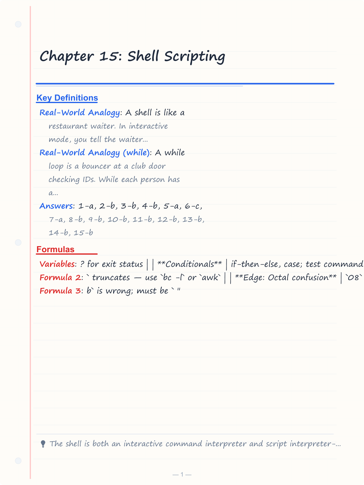
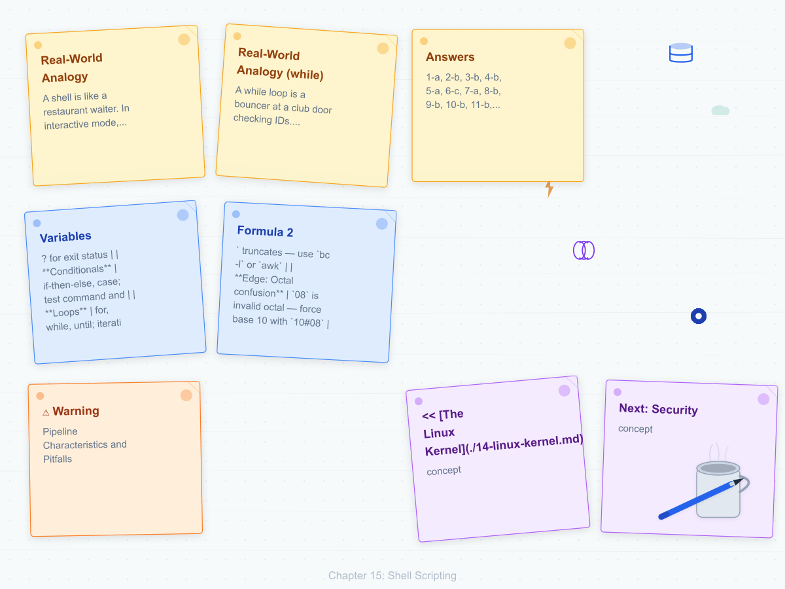
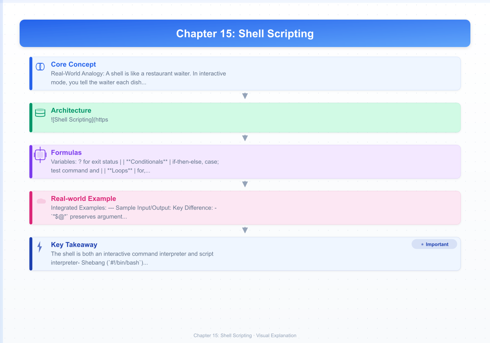

# Chapter 15: Shell Scripting

**<< [The Linux Kernel](./14-linux-kernel.md)** | [**Next: Security**](./16-security.md) >>

---

## Learning Objectives

- Understand the role of the shell as both a command interpreter and scripting language
- Write shell scripts with variables, conditionals, loops, and functions
- Use pipes and redirection to combine commands into pipelines
- Manage processes: background execution, job control, signals, and process substitution
- Use common text-processing utilities: grep, sed, awk, cut, sort, uniq
- Debug and write robust shell scripts with proper error handling

<!-- Image Gallery -->
<section class="lesson-visuals" aria-label="Visual learning resources">
  <header><span>VISUAL LEARNING</span><h2>See it. Review it. Remember it.</h2></header>
  <a class="lesson-visual-card" href="../../assets/images/lessons/operating-systems/15-shell-scripting/handwritten-notes.png" target="_blank" rel="noopener">
    
    <span><strong>Handwritten notes</strong>Condensed notes for deliberate review.</span>
  </a>
  <a class="lesson-visual-card" href="../../assets/images/lessons/operating-systems/15-shell-scripting/sticky-notes.png" target="_blank" rel="noopener">
    
    <span><strong>Sticky-note revision</strong>Fast recall prompts for revision.</span>
  </a>
  <a class="lesson-visual-card" href="../../assets/images/lessons/operating-systems/15-shell-scripting/visual-explanation.png" target="_blank" rel="noopener">
    
    <span><strong>Visual concept guide</strong>A connected explanation of the key ideas.</span>
  </a>
</section>
<!-- End Image Gallery -->


## Chapter at a Glance

| Topic | Key Points |
|-------|------------|
| **Shell Basics** | Command interpreter; Linux default is Bash (Bourne Again SHell) |
| **Variables** | User-defined, environment, positional parameters; $? for exit status |
| **Conditionals** | if-then-else, case; test command [ ] and [[ ]] |
| **Loops** | for, while, until; iterating over files and command output |
| **Functions** | Reusable code blocks; local variables with local keyword |
| **Script Control** | exit, return, break, continue, error handling with trap |
| **I/O Redirection** | stdin/stdout/stderr manipulation; here-docs, here-strings |
| **Text Processing** | grep, sed, awk, sort, uniq, cut, wc, head, tail |

## Chapter Roadmap

<div class="mermaid">
flowchart LR
    A[Shell & Bash Basics] --> B[Variables & Parameters]
    B --> C[Conditionals]
    B --> D[Loops]
    C --> E[Functions]
    D --> E
    E --> F[I/O Redirection & Pipes]
    F --> G[Text Processing: grep/sed/awk]
    G --> H[Job Control & Signals]
    H --> I[Process Substitution]
    I --> J[Error Handling & Debugging]
    J --> K[Real-World Scripts]
    K --> L[Interview Corner]
    L --> M[Summary]
</div>

## Theory


---

## Section 1: Shell Basics

### What is a Shell?

A **shell** is a command-line interpreter that provides an interface between the user and the operating system kernel. It operates in two modes:

1. **Interactive mode**: Reads commands from the terminal, executes them, and displays results in real time.
2. **Script mode**: Reads commands from a file (script) and executes them sequentially without user interaction.

**Real-World Analogy**: A shell is like a restaurant waiter. In interactive mode, you tell the waiter each dish one at a time, and they bring it immediately. In script mode, you hand the waiter a written order card with multiple items, and they execute the entire sequence.

### The Shebang (#!)

Every script starts with a **shebang** — a magic byte sequence that tells the kernel which interpreter to execute the file with:

```bash
#!/bin/bash
```

**Numbered Steps — Script Execution**:
1. Kernel reads the first line of the script file
2. Detects `#!` magic bytes (0x23 0x21)
3. Extracts the interpreter path (`/bin/bash`)
4. Invokes `/bin/bash /path/to/script arg1 arg2 ...`
5. Bash reads and executes script commands line by line

**Pseudocode**:
```
function execute_script(path):
    first_line = read_first_line(path)
    if first_line starts_with "#!":
        interpreter = extract_path(first_line)
        args = extract_arguments(first_line)
        fork_and_exec(interpreter, path + args)
    else:
        fork_and_exec("/bin/sh", path)
```

**Dry Run — Script Execution**:
```
Step | Component          | State / Action
1    | Shebang detected   | #!/bin/bash found at line 1
2    | Kernel reads       | Interpreter = /bin/bash
3    | Fork + Exec        | PID=1234 created, bash loaded
4    | Script loaded      | 50 commands read into memory
5    | Command 1 runs     | echo "Hello" → stdout
6    | Command 2 runs     | ls -la → stdout
7    | Exit               | exit code 0 returned to parent
```

### Common Unix Shells

| Shell | Path | Features |
|-------|------|----------|
| Bourne (sh) | `/bin/sh` | Original Unix shell, minimal features, POSIX-compliant |
| Bash | `/bin/bash` | Bourne Again SHell — de facto standard, advanced features |
| Zsh | `/bin/zsh` | Extended Bash, powerful tab-completion, theming, oh-my-zsh |
| Fish | `/usr/bin/fish` | User-friendly, auto-suggestions, web-based config, Sane defaults |
| Dash | `/bin/dash` | Lightweight, fast, Debian /bin/sh default |

### Shell Features Comparison

| Feature | sh (Bourne) | Bash | Zsh | Fish |
|---------|-------------|------|-----|------|
| Shebang | `#!/bin/sh` | `#!/bin/bash` | `#!/bin/zsh` | `#!/usr/bin/fish` |
| Arrays | No | Yes (`arr=(1 2 3)`) | Yes (1-indexed!) | Yes (1-indexed) |
| Associative Arrays | No | Yes (`declare -A`) | Yes | Yes |
| [[ ]] extended test | No | Yes | Yes | N/A |
| Globbing qualifiers | No | No | Yes (`*.txt(om)`) | Yes |
| Auto-correction | No | No | Optional | Yes |
| Tab completion | Basic | Programmable | Powerful + fuzzy | Built-in |
| Prompt theming | No | PS1 + plugins | oh-my-zsh | Web-based |
| POSIX compliance | Full | Partial | Partial | No |
| Scripting ecosystem | Minimal | Largest | Growing | Small |
| Interactive UX | Minimal | Good | Excellent | Excellent |

**Selection Guide**:
- Use `#!/bin/sh` for maximum portability (POSIX-only features)
- Use `#!/bin/bash` for scripts needing arrays, [[ ]], or process substitution
- Use Zsh for interactive daily driving; Fish for beginners
- Never use Zsh/Fish for shared scripts — they may not be installed

### Shell Basics — Complexity & Edge Cases

| Aspect | Analysis |
|--------|----------|
| **Time Complexity** | O(n) where n = number of commands in script (sequential execution) |
| **Space Complexity** | O(1) extra beyond script size |
| **Why O(n)?** | Each command is executed linearly; no recursion or nested iteration in basic execution |
| **Edge: Shebang missing** | Falls back to `/bin/sh` or current shell; behavior may differ |
| **Edge: No execute permission** | `chmod +x script.sh` required or invoke as `bash script.sh` |
| **Edge: Carriage returns** | Windows line endings (`\r\n`) break shebang — use `dos2unix` |
| **Edge: BOM marker** | UTF-8 BOM at file start corrupts shebang detection |

**A&D Table**:

| Advantage | Disadvantage |
|-----------|-------------|
| Ubiquitous on Unix systems | Weak data structures (no native hash maps) |
| Glue language — ties tools together | Slow for CPU-intensive work |
| No compilation needed | Error-prone quoting rules |
| Powerful one-liners | Debugging is primitive (set -x) |

**Python Equivalent — Running a System Command**:
```python
import subprocess, sys

# Equivalent to: ./script.sh arg1 arg2
result = subprocess.run(
    ["bash", "script.sh", "arg1", "arg2"],
    capture_output=True, text=True
)
print(result.stdout)
print(f"Exit code: {result.returncode}")
```

---

## Section 2: Variables

### Variable Basics

Variables store data for use throughout the script.

**Real-World Analogy**: Variables are like labeled storage bins in a warehouse. You write a label (name) on the bin and put a value inside. You can retrieve the value by referring to the label, change what's inside, or pass the entire bin to another worker.

**Numbered Steps — Variable Expansion**:
1. Parser encounters `$name` or `${name}` in the command line
2. Shell looks up `name` in the variable table (hash map)
3. If found, replaces `$name` with its value (text substitution)
4. If not found, replaces with empty string (or error with `set -u`)
5. Performs word splitting on the expanded result
6. Performs glob expansion on the resulting words
7. Executes the final command

**Pseudocode**:
```
function expand_variable(var_name, shell_state):
    if var_name in shell_state.variables:
        return shell_state.variables[var_name]
    else if set_u_enabled:
        raise UnboundVariableError(var_name)
    else:
        return ""   # silently empty

function assign_variable(name, value, shell_state):
    if readonly_flag(name, shell_state):
        raise ReadonlyError(name)
    shell_state.variables[name] = value
```

**Dry Run — Variable Assignment and Expansion**:
```
Step | Code                   | state["name"] | state["count"] | Output
1    | name="Alice"          | "Alice"       | unset          |
2    | count=10              | "Alice"       | "10"           |
3    | echo "Hello $name"    | "Alice"       | "10"           | Hello Alice
4    | sum=$((count + 5))    | "Alice"       | "10"           |
5    | echo $sum             | "Alice"       | "10"           | 15
6    | echo "count=$count"   | "Alice"       | "10"           | count=10
```

### Variable Types and Operations

```bash
#!/bin/bash

# --- Assignment (NO spaces around =) ---
name="Alice"
count=10
greeting="Hello, $name!"   # Variable expansion in double quotes
literal='Hello, $name!'    # Single quotes: literal $name

# --- Read-only variable ---
readonly pi=3.14159
# pi=3.14  # ERROR: readonly variable

# --- Environment variables ---
export PATH="$PATH:/custom/bin"
export APP_ENV="production"

# --- Command substitution (two syntaxes) ---
today=$(date +%Y-%m-%d)       # Modern syntax (preferred)
also_today=`date +%Y-%m-%d`   # Legacy backtick syntax

# --- Arithmetic ---
sum=$((count + 5))
product=$((4 * 7))
mod=$((17 % 3))

# --- Variable expansion modifiers ---
filename="photo.jpg"
echo "${filename%.jpg}.png"   # photo.png (remove suffix)
echo "${filename#photo}"      # .jpg (remove prefix)
echo "${filename:0:5}"        # photo (substring, offset 0 length 5)

# --- Default values ---
echo "${username:-guest}"     # Use "guest" if username is unset/null
echo "${username:=guest}"     # Assign "guest" to username if unset
echo "${username:?Error: username required}"  # Error exit if unset
```

**Sample Input/Output**:
```
$ bash variables.sh
Hello, Alice!
Hello, $name!
photo.png
.jpg
photo
guest
```

### Special Variables Reference

```bash
echo "Script name:  $0"       # ./script.sh
echo "First arg:    $1"       # first positional parameter
echo "Second arg:   $2"       # second positional parameter
echo "All args (\$@): $@"     # "arg1 arg2 arg3" (individual words)
echo "All args (\$*): $*"     # "arg1 arg2 arg3" (single word)
echo "Args count:   $#"       # 3
echo "Exit code:    $?"       # 0 (success) or nonzero
echo "PID:          $$"       # 1234 (current script PID)
echo "Last BG PID:  $!"       # 1235 (last background process PID)
echo "Options flag: $-"       # hB (current shell option flags)
```

### Variables — Complexity & A&D

| Aspect | Analysis |
|--------|----------|
| **Assignment** | O(1) — hash map insertion |
| **Expansion** | O(v) where v = value length (string copy) |
| **Command Substitution** | O(n + s) — fork + n commands + s output reading |
| **Why O(1) assignment?** | Shell uses hash table for variable storage; average O(1) lookup |
| **Edge: Spaces in values** | `name=John Doe` sets `name=John` and tries to run `Doe` — QUOTE! |
| **Edge: Unset variable** | With `set -u`: fatal error. Without: expands to empty string |
| **Edge: Export scope** | Exported vars go to child processes only; parent unaffected |
| **Edge: Readonly override** | Attempting to modify readonly var kills script (cannot trap) |

**A&D Table**:

| Advantage | Disadvantage |
|-----------|-------------|
| Dynamic typing (no type declarations) | All values are strings (even numbers) |
| Easy interpolation in strings | No native boolean type (use 0/1 or "true"/"false") |
| Powerful modifier syntax (%, #, :) | Modifiers are easy to forget or confuse |
| Indirect expansion (`${!var}`) | No structured data beyond arrays |

**Python Equivalent**:
```python
import os

# --- Assignment ---
name = "Alice"
count = 10

# --- String interpolation ---
greeting = f"Hello, {name}!"

# --- Environment variables ---
os.environ["APP_ENV"] = "production"

# --- Command substitution equivalent ---
import subprocess
today = subprocess.run(
    ["date", "+%Y-%m-%d"],
    capture_output=True, text=True
).stdout.strip()

# --- Default values ---
username = os.environ.get("username", "guest")

# --- Substring ---
filename = "photo.jpg"
print(filename[:-4] + ".png")  # photo.png
print(filename[:5])            # photo

# --- Special variables equivalent ---
import sys
script_name = sys.argv[0]
first_arg = sys.argv[1] if len(sys.argv) > 1 else None
args_count = len(sys.argv) - 1
```

---

## Section 3: Operators

### Arithmetic Operators

```bash
#!/bin/bash

a=10
b=3

# Integer arithmetic with $(( ))
echo $((a + b))    # 13  Addition
echo $((a - b))    # 7   Subtraction
echo $((a * b))    # 30  Multiplication
echo $((a / b))    # 3   Integer division (truncates)
echo $((a % b))    # 1   Modulus
echo $((a ** b))   # 1000  Exponentiation (Bash 4+)

# Increment/decrement
echo $((a++))      # 10 (post-increment)
echo $((++a))      # 12 (pre-increment after post)
echo $((a--))      # 12 (post-decrement)

# Compound assignment
((a += 5))   # a = a + 5
((a *= 2))   # a = a * 2
((a -= 3))   # a = a - 3

# Bitwise operators
echo $((a & b))    # AND    → bitwise
echo $((a | b))    # OR     → bitwise
echo $((a ^ b))    # XOR    → bitwise
echo $((a << 1))   # Left shift
echo $((a >> 1))   # Right shift
echo $((~a))       # Bitwise NOT

# Using let (older syntax)
let sum=a+b
let count++
```

**Real-World Analogy**: Arithmetic operators are like a calculator's button panel. Each button performs a specific mathematical transformation on the displayed value. The `$(( ))` syntax is like locking the calculator into "math mode" so the shell knows to interpret symbols as operations rather than literal text.

**Dry Run — Arithmetic Evaluation**:
```
Step | Expression      | a | b | Result | Note
1    | a=10           | 10| ? |        | Assignment
2    | b=3            | 10| 3 |        | Assignment
3    | $((a + b))     | 10| 3 | 13     | Addition
4    | $((a / b))     | 10| 3 | 3      | Truncation!
5    | $((a % b))     | 10| 3 | 1      | Remainder
6    | $((a ** 2))    | 10| 3 | 100    | Exponentiation
7    | ((a += 5))     | 15| 3 |        | Compound, no output
```

**Edge Cases**:
- Division by zero: causes fatal error, script terminates
- Floating point: NOT supported - use `bc` or `awk`
- Overflow: Bash uses 64-bit signed integers
- Leading zeros: `08` and `09` cause errors in some contexts (treated as octal)

### Comparison Operators

```bash
#!/bin/bash

# Integer comparison in [ ]
# -eq, -ne, -lt, -le, -gt, -ge
[ "$a" -eq "$b" ]   # Equal
[ "$a" -ne "$b" ]   # Not equal
[ "$a" -lt "$b" ]   # Less than
[ "$a" -le "$b" ]   # Less than or equal
[ "$a" -gt "$b" ]   # Greater than
[ "$a" -ge "$b" ]   # Greater than or equal

# String comparison in [ ]
[ "$a" = "$b" ]     # Equal (single = for POSIX)
[ "$a" != "$b" ]    # Not equal
[ -z "$a" ]         # True if a is empty (zero length)
[ -n "$a" ]         # True if a is non-empty

# Integer comparison in (( )) — C-style
(( a == b ))        # Equal
(( a != b ))        # Not equal
(( a < b ))         # Less than
(( a <= b ))        # Less than or equal
(( a > b ))         # Greater than
(( a >= b ))        # Greater than or equal

# String comparison in [[ ]] — pattern matching
[[ "$a" == "$b" ]]   # Equal
[[ "$a" != "$b" ]]   # Not equal
[[ "$a" < "$b" ]]    # Lexicographic less than
[[ "$a" > "$b" ]]    # Lexicographic greater than
[[ "$a" == foo* ]]   # Glob pattern match
[[ "$a" =~ ^foo ]]   # Regex match (Bash 3+)
```

**Real-World Analogy**: Comparison operators are like a quality inspection station. Each part (variable) is measured against a specification (the value being compared). The operator determines what kind of measurement check is performed: "is this exactly equal?", "is it larger?", "does it match the pattern template?"

### Logical Operators

```bash
# AND
[ "$a" -gt 0 ] && [ "$b" -lt 10 ]    # In separate [ ]
[[ "$a" -gt 0 && "$b" -lt 10 ]]      # In [[ ]] (single test)
(( a > 0 && b < 10 ))                # In (( ))

# OR
[ "$a" -gt 0 ] || [ "$b" -lt 10 ]

# NOT
[ ! -f "$file" ]                     # True if file does NOT exist

# Ternary-like behavior with && and ||
[ -f "$file" ] && echo "exists" || echo "missing"
```

### Operators — Complexity & A&D

| Aspect | Analysis |
|--------|----------|
| **Arithmetic** | O(1) — integer ops are constant time on CPU |
| **String Comparison** | O(min(n,m)) — character-by-character comparison |
| **Regex Match (=~)** | O(n * p) worst case where p = pattern complexity |
| **Edge: Floating point** | `$(( ))` truncates — use `bc -l` or `awk` |
| **Edge: Octal confusion** | `08` is invalid octal — force base 10 with `10#08` |
| **Edge: [[ vs [ speed]** | [[ is built-in (no fork); [ is external on some shells |

---

## Section 4: Conditionals

### if/then/elif/else

**Real-World Analogy**: A conditional is like an airport baggage sorting system. Each bag (the value being tested) travels down a conveyor belt (the script). At each junction (if statement), a sensor checks a property of the bag (file exists? string equals?). Based on the sensor reading, the bag is diverted to a specific chute (then/elif/else branch).

**Numbered Steps — if Statement Execution**:
1. Shell evaluates the test command (`[ ... ]`, `[[ ... ]]`, or `(( ... ))`)
2. If exit code is 0 (success/true), execute the `then` block
3. If exit code is non-zero (failure/false), skip to next `elif` or `else`
4. At `elif`, evaluate a second test condition
5. If no condition matches, execute the `else` block
6. Continue after the `fi` marker

**Pseudocode**:
```
function evaluate_if(conditions, shell_state):
    for (test_cmd, block) in zip(conditions, blocks):
        exit_code = execute_and_get_exit_code(test_cmd)
        if exit_code == 0:       # true
            execute_block(block)
            return
    # Optional else
    if else_block exists:
        execute_block(else_block)
```

**Dry Run — File Check Conditional**:
```
Step | Code                          | $?  | file exists? | Action
1    | if [ -f /etc/hosts ]         |     |              | Evaluate test
2    | test /etc/hosts exists        | 0   | yes          | Test returns 0
3    | then echo "found"             |     |              | Execute then block
4    | Output: "found"               |     |              |
```

```bash
#!/bin/bash

# Basic if/then/elif/else
if [ "$1" = "start" ]; then
    echo "Starting..."
elif [ "$1" = "stop" ]; then
    echo "Stopping..."
elif [ "$1" = "restart" ]; then
    echo "Restarting..."
    $0 stop
    $0 start
else
    echo "Usage: $0 {start|stop|restart}"
    exit 1
fi

# File tests
if [ -f /etc/passwd ]; then
    echo "Password file exists"
fi

if [ -d /tmp ]; then
    echo "/tmp is a directory"
fi

# Logical combination
if [ -f "$file" ] && [ -r "$file" ]; then
    echo "File exists and is readable"
fi

# [[ ]] — extended test (Bash-only)
if [[ "$name" == A* ]]; then
    echo "Name starts with A"
fi

if [[ "$response" =~ ^[Yy](es)?$ ]]; then
    echo "User confirmed"
fi

# (( )) — arithmetic test
if (( a > 10 )); then
    echo "a is greater than 10"
fi

# Testing command success
if grep -q "error" logfile; then
    echo "Errors found!"
fi
```

**Sample Input/Output**:
```
$ bash conditionals.sh start
Starting...

$ bash conditionals.sh restart
Stopping...
Starting...
```

### case Statement

```bash
#!/bin/bash

case "$1" in
    start|begin)
        echo "Starting..."
        echo "Service launched"
        ;;
    stop|end)
        echo "Stopping..."
        ;;
    restart)
        $0 stop
        $0 start
        ;;
    --verbose|-v)
        echo "Verbose mode"
        ;;
    [0-9][0-9])
        echo "Two-digit number: $1"
        ;;
    *)
        echo "Unknown: $1"
        exit 1
        ;;
esac
```

**Real-World Analogy**: A `case` statement is like a hotel room key card dispenser. You insert a card (the value), and depending on which floor number is encoded, it activates only that floor's button on the elevator. No if-else chain needed — direct matching.

**Dry Run — case Statement**:
```
Step | Code                     | $1    | Matches? | Action
1    | case "$1" in             | start |          | Evaluate
2    | start|begin)             | start | YES      | Match found
3    | echo "Starting..."       |       |          | Execute block
4    | ;;                       |       |          | Break out of case
5    | Output: "Starting..."    |       |          |
```

### Conditional — Complexity & A&D

| Aspect | Analysis |
|--------|----------|
| **if/elif chain** | O(k) where k = number of conditions (sequential evaluation) |
| **case statement** | O(m) average where m = pattern count (linear scan, optimized) |
| **Pattern match (==)** | O(n) glob match on string length n |
| **Regex match (=~)** | O(n*p) worst case regex backtracking |
| **Why case over if?** | More readable for multi-way branches; supports pattern matching |
| **Edge: Missing then** | Syntax error — each `if` needs a `then` |
| **Edge: Space in [ ]** | `[$a=$b]` is wrong; must be `[ "$a" = "$b" ]` |
| **Edge: Forgotten fi** | Shell reports "unexpected end of file" at end of script |
| **Edge: Empty string test** | `[ "$var" = "" ]` or `[ -z "$var" ]` — both check emptiness |

**Python Equivalent**:
```python
import sys

action = sys.argv[1] if len(sys.argv) > 1 else ""

# Equivalent to case statement
match action:
    case "start" | "begin":
        print("Starting...")
    case "stop" | "end":
        print("Stopping...")
    case "restart":
        subprocess.run([sys.argv[0], "stop"])
        subprocess.run([sys.argv[0], "start"])
    case _:
        print(f"Unknown: {action}")
        sys.exit(1)
```

---

## Section 5: Loops

### for Loop

**Real-World Analogy**: A `for` loop is like a factory conveyor belt where each item passes under a sensor that performs the same operation. The belt runs once per item, processes it, and moves on. When the belt is empty (no more items), it stops automatically.

**Numbered Steps — for Loop**:
1. Construct the list of words to iterate over (brace expansion, glob, or explicit list, command output)
2. Assign the first word to the loop variable
3. Execute the loop body
4. Assign the next word to the loop variable
5. Repeat steps 3-4 until no words remain
6. Continue after the `done` marker

**Pseudocode**:
```
function for_loop(word_list, body_function, shell_state):
    for word in word_list:
        shell_state.variables["loop_var"] = word
        exit_code = body_function(word, shell_state)
        if exit_code != 0:
            return exit_code
    return 0
```

**Dry Run — for Loop with Range**:
```
Step | i   | Condition      | Body Output
1    | 0   | i=0            |
2    | 0   | Loop body      | "Number: 0"
3    | 1   | i++ → i=1      |
4    | 1   | Loop body      | "Number: 1"
5    | 2   | i++ → i=2      |
...  | ... | ...            | ...
6    | 9   | Loop body      | "Number: 9"
7    | 10  | 10 < 10 false  | Loop exits
```

```bash
#!/bin/bash

# for loop over explicit list
for color in red green blue yellow; do
    echo "Color: $color"
done

# for loop over brace expansion
for i in {1..5}; do
    echo "Number: $i"
done

# for loop with step (Bash 4+)
for i in {1..10..2}; do
    echo "Odd: $i"
done

# for loop over glob results (files)
for file in *.txt; do
    echo "Text file: $file"
    wc -l "$file"
done

# for loop over command output
for user in $(cut -d: -f1 /etc/passwd); do
    echo "User: $user"
done

# C-style for loop
for ((i=0; i<10; i++)); do
    echo "i = $i"
done

# For loop with array
fruits=("apple" "banana" "cherry")
for fruit in "${fruits[@]}"; do
    echo "Fruit: $fruit"
done
```

**Sample Input/Output**:
```
$ bash forloop.sh
Color: red
Color: green
Color: blue
Color: yellow
Number: 1
Number: 2
Number: 3
Number: 4
Number: 5
Odd: 1
Odd: 3
Odd: 5
Odd: 7
Odd: 9
```

### while and until Loops

```bash
#!/bin/bash

# while loop — runs while condition is true
count=0
while [ $count -lt 5 ]; do
    echo "Count: $count"
    count=$((count + 1))
done

# Reading a file line by line (idiomatic)
while IFS= read -r line; do
    echo "Line: $line"
done < "input.txt"

# Infinite loop with break
while true; do
    read -p "Enter input (q to quit): " input
    [ "$input" = "q" ] && break
    echo "You said: $input"
done

# until loop — runs until condition becomes true
count=10
until [ $count -eq 0 ]; do
    echo "Countdown: $count"
    count=$((count - 1))
done
```

**Real-World Analogy (while)**: A `while` loop is a bouncer at a club door checking IDs. While each person has a valid ID (condition is true), they're allowed in (the body executes). The first person without ID stops the process entirely.

**Dry Run — while Loop with Counter**:
```
Step | count | Condition: count < 5 | Output        | Action
1    | 0     | 0 < 5 = TRUE         | "Count: 0"    | Enter body
2    | 1     | 1 < 5 = TRUE         | "Count: 1"    | count++
3    | 2     | 2 < 5 = TRUE         | "Count: 2"    | count++
4    | 3     | 3 < 5 = TRUE         | "Count: 3"    | count++
5    | 4     | 4 < 5 = TRUE         | "Count: 4"    | count++
6    | 5     | 5 < 5 = FALSE        |               | Exit loop
```

### Loop Control: break and continue

```bash
for i in {1..10}; do
    if [ $i -eq 5 ]; then
        break      # Exit loop entirely when i=5
    fi
    echo "i = $i"
done
# Output: i=1, i=2, i=3, i=4

for i in {1..10}; do
    if [ $((i % 2)) -eq 0 ]; then
        continue   # Skip even numbers
    fi
    echo "Odd: $i"
done
# Output: Odd: 1, 3, 5, 7, 9
```

### Loops — Complexity & A&D

| Aspect | Analysis |
|--------|----------|
| **for over list** | O(n * b) where n = items, b = body complexity |
| **while/until** | O(t * b) where t = iterations until termination |
| **Reading file line by line** | O(l) where l = lines (one read per line) |
| **Edge: Word splitting** | `for x in $(cat file)` splits on IFS, not lines — use `read -r` |
| **Edge: `for file in $(ls)`** | NEVER — breaks with spaces, newlines, special chars |
| **Edge: IFS= read -r** | Preserves leading/trailing whitespace and backslashes |
| **Edge: Empty loop body** | `; done` works but semicolons or newline before `done` required |
| **Edge: Off-by-one** | `while [ $i -le 10 ]` vs `-lt` — careful with boundary |

**Python Equivalent**:
```python
# for loop over list
for color in ["red", "green", "blue"]:
    print(f"Color: {color}")

# for loop with range
for i in range(1, 11):
    print(f"Number: {i}")

# Step range
for i in range(1, 11, 2):
    print(f"Odd: {i}")

# Glob equivalent
import glob
for file in glob.glob("*.txt"):
    print(f"Text file: {file}")

# while loop
count = 0
while count < 5:
    print(f"Count: {count}")
    count += 1

# Reading file line by line
with open("input.txt") as f:
    for line in f:
        print(f"Line: {line.rstrip()}")

# break and continue
for i in range(1, 11):
    if i == 5:
        break
    print(f"i = {i}")

for i in range(1, 11):
    if i % 2 == 0:
        continue
    print(f"Odd: {i}")
```

---

## Section 6: Functions

### Function Definition and Invocation

**Real-World Analogy**: A function is like a recipe card in a kitchen. The card lists ingredients (parameters) and instructions (body). A cook (the script) can use the same card repeatedly with different ingredients without rewriting the steps. Some cards produce a finished dish (return value), others just perform actions (void functions).

**Numbered Steps — Function Execution**:
1. Function definition is read and stored in memory (not executed yet)
2. When called, positional parameters `$1`, `$2`, ... are set to the arguments
3. `$0` remains the script name (not the function name)
4. `local` variables are created in a new scope
5. Body commands are executed sequentially
6. `return` sets exit code and exits function (optional)
7. Original positional parameters are restored

**Pseudocode**:
```
function define_function(name, body, shell_state):
    shell_state.functions[name] = body

function call_function(name, args, shell_state):
    if name not in shell_state.functions:
        raise CommandNotFoundError(name)
    saved_params = shell_state.positional_params
    shell_state.positional_params = args
    push_new_scope()
    exit_code = execute_block(shell_state.functions[name])
    pop_scope()
    shell_state.positional_params = saved_params
    return exit_code
```

**Dry Run — Function Call**:
```
Step | Code                      | $1      | Local name | Output
1    | greet() { ... }            |         |            | Function stored
2    | greet "World"              | "World" |            | Call with arg
3    | local name="$1"            | "World" | "World"    | Local var created
4    | echo "Hello, $name!"       | "World" | "World"    | 
5    | Output:                    |         |            | Hello, World!
6    | Function returns           |         |            | Scope restored
```

```bash
#!/bin/bash

# Function definition (two syntaxes)
greet() {
    local name="$1"        # local variable — scoped to function
    echo "Hello, $name!"
}

function error_exit {
    echo "ERROR: $1" >&2
    exit 1
}

# Functions returning exit codes
is_even() {
    [ $(( $1 % 2 )) -eq 0 ]
    return $?              # return is optional; last exit code used
}

is_even_number() {
    local num=$1
    if [ $((num % 2)) -eq 0 ]; then
        return 0           # 0 = success/true in shell
    else
        return 1           # non-zero = failure/false
    fi
}

# Function with output capture (stdout as "return value")
get_date() {
    echo "$(date +%Y-%m-%d)"
}

# Calling functions
greet "World"
error_exit "Critical failure"   # This will terminate the script

if is_even 42; then
    echo "42 is even"
fi

today=$(get_date)
echo "Today is $today"
```

**Sample Input/Output**:
```
$ bash functions.sh
Hello, World!
ERROR: Critical failure
```

### Variable Scope in Functions

```bash
#!/bin/bash

global_var="I am global"

my_func() {
    local local_var="I am local"
    global_var="Modified by function"   # Modifies global
    echo "Inside: local_var=$local_var"
    echo "Inside: global_var=$global_var"
}

my_func
echo "Outside: global_var=$global_var"
echo "Outside: local_var=$local_var"    # Empty — scope lost

# Output:
# Inside: local_var=I am local
# Inside: global_var=Modified by function
# Outside: global_var=Modified by function
# Outside: local_var=
```

### Functions — Complexity & A&D

| Aspect | Analysis |
|--------|----------|
| **Definition** | O(1) — stored in shell function table |
| **Call overhead** | O(1) — scope push/pop and param shift |
| **Return value** | Only integers 0-255 via `return`; strings via stdout capture |
| **Edge: Missing return** | Exit code is from last executed command |
| **Edge: Return vs exit** | `return` exits function; `exit` kills the entire script |
| **Edge: local keyword** | Not POSIX — use subshell `(...)` for portable local scope |
| **Edge: Recursion** | Supported but stack depth limited (~10k in Bash) |
| **Edge: Function name collision** | Functions shadow external commands — `ls() { echo "noop"; }` breaks `ls` |

**Python Equivalent**:
```python
def greet(name):
    """Function with parameter and local scope"""
    message = f"Hello, {name}!"
    print(message)

def is_even(num):
    """Return boolean from function"""
    return num % 2 == 0

def get_date():
    """Return string from function"""
    from datetime import date
    return date.today().isoformat()

# Calling functions
greet("World")

if is_even(42):
    print("42 is even")

today = get_date()
print(f"Today is {today}")
```

---

## Section 7: I/O Redirection

### File Descriptors

| Number | Name | Default | Description |
|--------|------|---------|-------------|
| 0 | stdin | Keyboard | Standard input |
| 1 | stdout | Screen | Standard output |
| 2 | stderr | Screen | Standard error |

**Real-World Analogy**: File descriptors are like colored pipes in a factory. The white pipe (stdin) brings raw materials in. The green pipe (stdout) sends finished products out. The red pipe (stderr) sends waste and error alerts. Redirection is a valve that re-routes material between pipes or to/from storage tanks (files).

**Numbered Steps — Output Redirection**:
1. Shell opens (or creates) the target file
2. If `>`, the file is truncated to zero length
3. If `>>`, the file is opened for append
4. File descriptor 1 (stdout) is dup2'd to the opened file
5. The command executes; all stdout output goes to the file
6. The original stdout is restored after the command

**Pseudocode**:
```
function redirect_output(file_path, mode, command_function):
    if mode == "overwrite":
        fd = open(file_path, O_WRONLY|O_CREAT|O_TRUNC, 0644)
    elif mode == "append":
        fd = open(file_path, O_WRONLY|O_CREAT|O_APPEND, 0644)
    saved_stdout = dup(1)        # Save original stdout
    dup2(fd, 1)                  # Replace stdout with file
    execute_command(command_function)
    dup2(saved_stdout, 1)        # Restore stdout
    close(fd)
```

**Dry Run — Redirection**:
```
Step | Operation           | FD 0 (stdin) | FD 1 (stdout) | FD 2 (stderr)
1    | Default state       | keyboard     | screen        | screen
2    | command > out.txt   | keyboard     | out.txt       | screen
3    | echo "hello" runs   | keyboard     | "hello"→file | screen
4    | After command       | keyboard     | screen        | screen
```

### Redirection Operators

| Operator | Name | Example | Action |
|----------|------|---------|--------|
| `>` | Output redirect | `cmd > file` | stdout → file (overwrite) |
| `>>` | Append output | `cmd >> file` | stdout → file (append) |
| `<` | Input redirect | `cmd < file` | stdin ← file |
| `<<` | Here-document | `cmd << EOF` | stdin ← inline text until delimiter |
| `<<<` | Here-string | `cmd <<< "text"` | stdin ← single string |
| `2>` | Stderr redirect | `cmd 2> file` | stderr → file |
| `2>>` | Append stderr | `cmd 2>> file` | stderr → file (append) |
| `&>` | Both streams | `cmd &> file` | stdout + stderr → file (Bash) |
| `>&` | Alternate both | `cmd >& file` | stdout + stderr → file |
| `2>&1` | Merge stderr→stdout | `cmd 2>&1` | stderr → same as stdout |
| `1>&2` | Merge stdout→stderr | `cmd 1>&2` | stdout → same as stderr |
| `>/dev/null` | Discard stdout | `cmd >/dev/null` | stdout → void |
| `2>/dev/null` | Discard stderr | `cmd 2>/dev/null` | stderr → void |
| `&>/dev/null` | Discard both | `cmd &>/dev/null` | stdout + stderr → void |

```bash
#!/bin/bash

# Output redirection
ls > files.txt                 # stdout to file (overwrite)
echo "new line" >> files.txt   # stdout to file (append)

# Input redirection
sort < unsorted.txt            # stdin from file
tr 'a-z' 'A-Z' < input.txt    # Transform stdin from file

# Here document — inline multi-line input
cat << EOF
This is a multi-line
"here document" that
preserves whitespace.
EOF

# Here document with indentation (<<-)
cat <<- END
    This text is indented with tabs
    The <<- strips leading tabs.
END

# Here string — single-line input
grep "error" <<< "line 1: error found
line 2: ok"

# Discard output to /dev/null
command > /dev/null         # Suppress stdout only
command 2> /dev/null        # Suppress stderr only
command &> /dev/null        # Suppress both stdout and stderr

# File descriptor manipulation
command 2>&1                # Merge stderr into stdout stream
command 2>&1 | less         # Both stdout and stderr through pager

# Redirect to stdout/stderr explicitly
echo "Error occurred" >&2   # Write to stderr

# Exec with redirection — redirect for the rest of the script
exec > logfile 2>&1         # All subsequent output to logfile
echo "This goes to logfile"
echo "So does this error" >&2
```

**Sample Input/Output**:
```
$ bash heredoc.sh
This is a multi-line
"here document" that
preserves whitespace.

$ grep "error" <<< "test line"
(no output — no match)

$ grep "error" <<< "this line has an error"
this line has an error
```

### Named Pipes (FIFOs)

A named pipe is a filesystem entry that acts as a pipe between processes:

```bash
#!/bin/bash

# Create a named pipe
mkfifo mypipe

# Reader in background
cat mypipe &

# Writer
echo "Hello through pipe" > mypipe

# Cleanup
wait
rm mypipe
```

**Real-World Analogy**: A named pipe is like a physical mail slot between two rooms. Process A drops a letter (data) into the slot. Process B retrieves it from the other side. Unlike a regular pipe (which is a temporary tube), a named pipe persists in the wall — anyone who knows the slot's location can use it.

### I/O Redirection — Complexity & A&D

| Aspect | Analysis |
|--------|----------|
| **File redirect** | O(1) system call (dup2) — constant overhead |
| **Here-document** | O(n) where n = document size (written to temp file first) |
| **Pipe overhead** | O(b) buffer copy between processes |
| **Edge: `>` vs `>>`** | Truncation vs append — choose carefully for logs |
| **Edge: `&>` portability** | Not POSIX — use `2>&1` for maximum portability |
| **Edge: Here-doc delimiter** | Must be on its own line with no trailing whitespace |
| **Edge: Here-doc quoting** | `<< 'EOF'` prevents variable expansion; `<< EOF` expands |
| **Edge: clobber prevention** | `set -o noclobber` prevents `>` from overwriting existing files |
| **Edge: stdout buffering** | Output may be buffered in pipes — use `stdbuf` or `unbuffer` |

**Python Equivalent**:
```python
# Output redirection
with open("files.txt", "w") as f:
    import subprocess
    subprocess.run(["ls"], stdout=f)

# Append
with open("files.txt", "a") as f:
    f.write("new line\n")

# Input redirection
with open("unsorted.txt") as f:
    lines = sorted(f.readlines())

# Here-document equivalent
text = """
This is a multi-line
document that
preserves whitespace.
"""
print(text)

# stderr redirect
import sys
print("Error occurred", file=sys.stderr)

# Discard output
subprocess.run(["command"], stdout=subprocess.DEVNULL)

# Merge stderr into stdout
result = subprocess.run(
    ["command"],
    capture_output=True, text=True,
    stderr=subprocess.STDOUT
)
```

---

## Section 8: Pipes and Pipelines

### Basic Pipes

Pipes connect the standard output of one command to the standard input of another:

```bash
# Syntax: cmd1 | cmd2 | cmd3
ps aux | grep firefox
cat access.log | grep "404" | wc -l
sort data.txt | uniq -c | sort -rn | head -10
```

**Real-World Analogy**: A pipe is like an assembly line in a car factory. Station 1 (ps aux) builds the chassis. Station 2 (grep) installs specific parts. Station 3 (wc -l) counts the completed cars. Each station receives the output of the previous one as its input, operating simultaneously.

**Numbered Steps — Pipeline Execution**:
1. Shell creates a pipe (in-memory buffer with two file descriptors)
2. Forks a process for each command in the pipeline
3. For each command, connects its stdin to the pipe's read end (except first)
4. For each command, connects its stdout to the pipe's write end (except last)
5. All processes run in parallel, not sequentially
6. The pipe buffer (typically 64KB on Linux) holds data between producer and consumer
7. Shell waits for all processes in the pipeline to finish

**Pseudocode**:
```
function execute_pipeline(commands):
    n = len(commands)
    pipes = [create_pipe() for _ in range(n-1)]
    
    for i in range(n):
        pid = fork()
        if pid == 0:                    # Child
            if i > 0:                   # Not first: read from prev pipe
                dup2(pipes[i-1].read_fd, STDIN_FILENO)
            if i < n-1:                 # Not last: write to next pipe
                dup2(pipes[i].write_fd, STDOUT_FILENO)
            close_all_pipe_fds()
            exec(commands[i])
        
    close_all_pipe_fds()
    for i in range(n):                  # Parent waits
        waitpid(children[i])
```

**Dry Run — Pipeline: grep "error" log.txt | wc -l**:
```
Step | Component          | Action
1    | Shell              | Creates pipe with fd[0] (read) and fd[1] (write)
2    | Fork grep          | PID=100: stdout → pipe write end
3    | Fork wc            | PID=101: stdin ← pipe read end
4    | grep "error" runs | Reads log.txt, writes matching lines to pipe
5    | wc -l runs         | Reads lines from pipe, counts them
6    | grep exits         | Pipe write end closes
7    | wc finishes        | Reads EOF, prints count, exits
8    | Shell prints       | Output: 42
```

```bash
#!/bin/bash

# Pipeline examples with analysis
echo "=== Top 10 CPU-consuming processes ==="
ps aux --sort=-%cpu | head -11

echo "=== HTTP 404 count ==="
cat access.log | grep " 404 " | wc -l

echo "=== Most frequent IPs ==="
awk '{print $1}' access.log | sort | uniq -c | sort -rn | head -5

echo "=== Sorted file sizes ==="
ls -l | awk '{print $5, $9}' | sort -rn

echo "=== Pipeline with stderr merge ==="
find / -name "*.conf" 2>&1 | head -5
```

**Sample Input/Output**:
```
$ bash pipelines.sh
=== Top 10 CPU-consuming processes ===
USER       PID %CPU %MEM    VSZ   RSS TTY      STAT START   TIME COMMAND
root         1  0.0  0.3  56780  6780 ?        Ss   10:00   0:02 systemd
...

=== HTTP 404 count ===
42
```

### Pipeline Characteristics and Pitfalls

```bash
# Exit code of pipeline is exit code of LAST command
false | true    # Exit code = 0 (true's exit code)
set -o pipefail # Makes pipeline fail if ANY command fails
false | true    # Exit code = 1 (with pipefail)

# Midnight commander pattern: tee to see intermediate output
echo "data" | tee /tmp/debug.txt | wc -c

# Multiple input streams
{ echo "header"; cat data.txt; echo "footer"; } | wc -l
```

### Pipes — Complexity & A&D

| Aspect | Analysis |
|--------|----------|
| **Execution model** | Parallel — all commands run simultaneously |
| **Buffer size** | 64KB default pipe capacity on Linux |
| **Time complexity** | O(max(t1, t2, ..., tn)) — dominated by slowest command |
| **Memory** | O(buf) — buffered between processes, not entire dataset |
| **Edge: pipefail** | Without it, pipe exit code is from last command only |
| **Edge: SIGPIPE** | If reader closes pipe, writer gets SIGPIPE (exit 141) |
| **Edge: Broken pipe** | `yes | head -5` — yes gets SIGPIPE when head closes |
| **Edge: Large data** | Pipes avoid temp files — use for streaming large datasets |

---

## Section 9: Filters

Filters are commands that read stdin and write to stdout, designed for use in pipelines.

### Common Filter Commands

```bash
#!/bin/bash

# head / tail — select portions of input
head -n 20 file.txt          # First 20 lines
tail -n 20 file.txt          # Last 20 lines
tail -f /var/log/syslog      # Follow growing file
head -n -5 file.txt          # All except last 5 lines
tail -n +5 file.txt          # All from line 5 onwards

# sort — order lines
sort file.txt                # Alphabetical
sort -n file.txt             # Numeric
sort -r file.txt             # Reverse
sort -u file.txt             # Unique (same as sort | uniq)
sort -t: -k3 -n /etc/passwd # Sort by field 3, colon-separated
sort -k2,2 -k1,1 file.txt   # Sort by field 2, then field 1

# uniq — remove/find duplicates (requires sorted input)
uniq file.txt                # Remove adjacent duplicates
uniq -c file.txt             # Count occurrences
uniq -d file.txt             # Only duplicates
uniq -u file.txt             # Only unique lines

# cut — extract columns
cut -d: -f1,3 /etc/passwd    # Fields 1 and 3 (colon-separated)
cut -c1-10 file.txt          # Characters 1-10
cut -f2-4 data.tsv           # Fields 2-4 (tab-separated default)

# wc — word count
wc -l file.txt               # Lines
wc -w file.txt               # Words
wc -c file.txt               # Characters (bytes)
wc -m file.txt               # Characters (multi-byte aware)

# tr — translate/delete characters
tr 'a-z' 'A-Z' < file.txt   # Uppercase
tr -d ' ' < file.txt         # Delete spaces
tr -s ' ' < file.txt         # Squeeze repeated spaces
tr '\n' ' ' < file.txt       # Replace newlines with spaces

# tee — split output (T-junction)
echo "data" | tee file.txt | wc -c    # Write to file AND pipe
cmd | tee -a log.txt                   # Append to log

# nl — number lines
nl file.txt                  # Number non-empty lines
nl -ba file.txt              # Number all lines (including blank)
```

**Real-World Analogy**: Filters are like a water treatment plant. Each filter stage handles one specific transformation: `sort` arranges molecules by size, `uniq -c` counts each type, `cut` extracts specific chemical components, `tr` converts elements, `wc` measures total volume.

**Sample Input/Output**:
```
$ cat data.txt
apple
banana
apple
cherry
banana

$ sort data.txt | uniq -c | sort -rn
   2 banana
   2 apple
   1 cherry

$ cut -d: -f1 /etc/passwd | head -3
root
daemon
bin

$ echo "hello world" | tr 'a-z' 'A-Z'
HELLO WORLD
```

### Filters — Complexity & A&D

| Aspect | Analysis |
|--------|----------|
| **head / tail** | O(min(n, k)) — reads only needed lines |
| **sort** | O(n log n) — merge sort implementation |
| **uniq** | O(n) — single pass, requires pre-sorted input |
| **cut** | O(n) — linear scan per line |
| **wc** | O(n) — single pass character/line counting |
| **tr** | O(n) — character-by-character translation |
| **tee** | O(n) — stream copy to file and stdout simultaneously |
| **Why sort needs O(n log n)?** | Comparison-based ordering; best possible for comparison sort |
| **Edge: sort memory (large files)** | Uses external merge sort with temp files for > memory |
| **Edge: uniq needs sorting** | Without sort, only ADJACENT duplicates removed |
| **Edge: cut delimiter** | Default is tab, not space. For spaces, use `awk` |
| **Edge: tr limitations** | Works with single characters only, not strings or patterns |

---

## Section 10: Process Substitution

### Process Substitution (Bash/Zsh)

Process substitution feeds the output (or input) of a command as if it were a file:

```bash
# Syntax: <(command) for output, >(command) for input
diff <(ls dir1) <(ls dir2)
grep "error" <(tail -100 logfile)
```

**Real-World Analogy**: Process substitution is like a translator who listens to a speech and produces a transcript in real time. The `<(command)` creates a virtual transcript file from the ongoing speech. Other tools can read this "file" as if it were a regular document, without ever saving it to disk.

**Numbered Steps — Process Substitution**:
1. Shell executes the command inside `<( )` in a subshell
2. Shell creates a named pipe (FIFO) or /dev/fd entry
3. The command's stdout is connected to this pipe
4. A filename like `/dev/fd/63` is substituted in place of `<(command)`
5. The outer command opens this file (the pipe) for reading
6. Data flows from inner command to outer command through the pipe

**Pseudocode**:
```
function process_substitution(command_str):
    pipe_fds = create_pipe()
    if os_type == "Linux":
        # Use /dev/fd/N trick — symlink to pipe fd
        result = link_to_fd(pipe_fds.read_fd)
    else:
        # Fallback: named pipe
        temp_path = "/tmp/psub.$$"
        mkfifo(temp_path)
        background_fork → command_str > temp_path
        result = temp_path
    
    return result   # Returns "path" that can be used as file arg
```

**Dry Run — diff &lt;(ls dir1) <(ls dir2)**:
```
Step | Component              | Action
1    | Shell                  | Evaluates <(ls dir1) → /dev/fd/63
2    | Shell                  | Evaluates <(ls dir2) → /dev/fd/64
3    | Fork ls dir1           | PID=100, stdout=63
4    | Fork ls dir2           | PID=101, stdout=64
5    | diff reads /dev/fd/63  | Gets listing of dir1
6    | diff reads /dev/fd/64  | Gets listing of dir2
7    | ls processes exit      | Pipes close
8    | diff prints differences | Output to terminal
```

```bash
#!/bin/bash

# Compare two directory listings
diff <(ls dir1) <(ls dir2)

# Search across multiple files as if one stream
grep "TODO" <(cat src/*.js) <(cat lib/*.js)

# Process substitution for input to while loop
while IFS= read -r line; do
    echo "Remote: $line"
done < <(ssh user@host "ls /tmp")

# Using >() for output process substitution
ls -l > >(grep ".txt" > txt_files.txt) 2>&1

# Complex: diff sorted files without temp files
diff <(sort file1.txt) <(sort file2.txt)
```

### Process Substitution — Complexity & A&D

| Aspect | Analysis |
|--------|----------|
| **Overhead** | O(1) pipe creation + fork per substitution |
| **Data flow** | Streaming — no temp file needed |
| **Portability** | Not POSIX — Bash/Zsh only; not in /bin/sh |
| **Edge: /dev/fd on Linux** | Works natively; macOS has /dev/fd but may behave differently |
| **Edge: Named pipe fallback** | Some systems emulate with temp FIFOs |
| **Edge: Multiple reads** | Data is consumed once (pipe behavior) — can't re-read |
| **Edge: Background process** | Inner command runs in background implicitly |

**Python Equivalent**:
```python
import subprocess

# Equivalent to diff <(ls dir1) <(ls dir2)
result1 = subprocess.run(["ls", "dir1"], capture_output=True, text=True)
result2 = subprocess.run(["ls", "dir2"], capture_output=True, text=True)

import difflib
diff = difflib.unified_diff(
    result1.stdout.splitlines(),
    result2.stdout.splitlines()
)
print("\n".join(diff))
```

---

## Section 11: Job Control

### Background and Foreground Processes

**Real-World Analogy**: Job control is like a busy chef multitasking in a kitchen. The chef starts boiling water (background — doesn't need attention), then starts chopping vegetables (foreground — needs active attention). The chef can pause chopping (Ctrl+Z) to check the boiling water, then resume chopping. Each active task is a "job" the chef tracks.

**Numbered Steps — Background Execution**:
1. Shell parses command with `&` suffix
2. Forks a child process (the job)
3. Job runs in a separate process group
4. Shell does NOT call `waitpid` immediately — returns prompt
5. Job continues running in background
6. When job finishes, shell prints notification before next prompt

**Pseudocode**:
```
function start_background_job(command):
    pid = fork()
    if pid == 0:                         # Child
        setpgid(0, 0)                    # New process group
        set_signal(SIGINT, SIG_IGN)      # Ignore Ctrl+C
        exec(command)
    # Parent
    job_id = next_available_job_number()
    jobs_table[job_id] = {
        pid: pid,
        command: command,
        state: "Running",
        pgid: pid
    }
    print_job_info(job_id, pid, command)
    return prompt()
```

**Dry Run — Job Control**:
```
Step | User Action          | Shell State               | Output
1    | sleep 30 &           | Job [1] running (PID 100) | [1] 100
2    | sleep 60 &           | Job [2] running (PID 101) | [2] 101
3    | jobs                 | Both running              | [1]- Running sleep 30
     |                      |                           | [2]+ Running sleep 60
4    | fg %2                | Job [2] in foreground     | (waits for sleep 60)
5    | Ctrl+Z               | Job [2] suspended         | [2]+ Stopped sleep 60
6    | bg %2                | Job [2] running (bg)      | [2] sleep 60 &
7    | kill %1              | Job [1] terminated        | [1] Terminated
```

```bash
#!/bin/bash

# Start a background job
sleep 30 &
echo "Background PID: $!"

# Start multiple jobs
sleep 60 &
find / -name "*.conf" > /tmp/conffiles.txt 2>/dev/null &

# List all background jobs
jobs
# Output: [1]  Running                 sleep 30 &
#         [2]-  Running                 find / -name "*.conf" &>/dev/null &

# Bring specific job to foreground
fg %1               # Brings job 1 to foreground

# Suspend foreground job with Ctrl+Z
# [1]+  Stopped                 sleep 30

# Resume suspended job in background
bg %1

# Terminate a job
kill %1             # Sends SIGTERM to job 1
kill -9 %2          # Sends SIGKILL to job 2 (force kill)

# Wait for all background jobs to finish
wait

# Wait for specific job
wait %1

# Run immune to hangups
nohup long_running_command &

# Disown — remove job from shell's job table
disown %1           # Job continues running, but shell no longer tracks it
```

### Job Control Commands

| Command | Purpose | Example |
|---------|---------|---------|
| `command &` | Start in background | `sleep 10 &` |
| `jobs` | List background jobs | `jobs -l` (show PIDs) |
| `fg %n` | Bring job n to foreground | `fg %1` |
| `bg %n` | Resume suspended job in background | `bg %1` |
| `kill %n` | Send signal to job | `kill -TERM %1` |
| `wait %n` | Wait for job to finish | `wait %1` |
| `disown %n` | Remove from job table | `disown` |
| `nohup cmd` | Run immune to hangups | `nohup script.sh &` |
| `Ctrl+Z` | Suspend foreground job | (suspend) |
| `Ctrl+C` | Terminate foreground job | (terminate) |

### Parallel Job Execution Pattern

```bash
#!/bin/bash
# Run N jobs in parallel with max concurrency

MAX_JOBS=4
task_completed() {
    echo "Task $1 completed"
}

# Launch jobs with concurrency control
for i in {1..20}; do
    # Wait if we already have MAX_JOBS running
    while [ "$(jobs -r | wc -l)" -ge "$MAX_JOBS" ]; do
        sleep 1
    done
    
    # Launch the task
    (sleep $((RANDOM % 5)); task_completed $i) &
done

# Wait for all remaining jobs
wait
echo "All tasks completed"
```

### Job Control — Complexity & A&D

| Aspect | Analysis |
|--------|----------|
| **Fork overhead** | O(1) — process creation cost (~us on modern kernels) |
| **Context switch** | Kernel scheduler overhead for background processes |
| **Parallel speedup** | Up to N× where N = CPU cores (limited by I/O vs CPU) |
| **Edge: Zombie processes** | Unwaited children become zombies — always `wait` |
| **Edge: Orphaned jobs** | When shell exits, background children get SIGHUP (use nohup) |
| **Edge: Job number limit** | Shell-specific limit on tracked jobs (default 1000 in Bash) |
| **Edge: Race condition** | `wait` may miss jobs that finish before `wait` is reached |
| **Edge: `jobs -r` vs `jobs -s`** | `-r` = running, `-s` = stopped; use `-r` for active process count |

---

## Section 12: Signal Handling

### Signal Concepts

Signals are software interrupts sent to processes to notify them of events:

| Signal | Number | Action | Meaning |
|--------|--------|--------|---------|
| SIGINT | 2 | Terminate | Ctrl+C — interrupt |
| SIGQUIT | 3 | Core dump | Ctrl+\ — quit with core |
| SIGKILL | 9 | Terminate | Force kill (cannot be caught) |
| SIGTERM | 15 | Terminate | Graceful termination (default for kill) |
| SIGSTOP | 19 | Stop | Ctrl+Z (cannot be caught) |
| SIGTSTP | 20 | Stop | Ctrl+Z (can be caught) |
| SIGHUP | 1 | Terminate | Hangup — terminal closed |
| SIGPIPE | 13 | Terminate | Broken pipe — write to closed pipe |
| SIGUSR1 | 10 | User-defined | Custom purpose |
| SIGUSR2 | 12 | User-defined | Custom purpose |

**Real-World Analogy**: Signals are like phone calls to a process. SIGTERM is a polite call saying "please wrap up and close." SIGKILL is a SWAT team kicking down the door — no warning, no cleanup. SIGINT (Ctrl+C) is an urgent interruption. SIGTSTP (Ctrl+Z) is "put that on hold." SIGHUP is the landlord evicting you because the building is closing.

### The trap Command

```bash
#!/bin/bash

# Cleanup function for graceful termination
cleanup() {
    echo "Cleaning up..."
    rm -f /tmp/temp_$$
    echo "Done. Exiting."
    exit 0
}

# Register trap for specific signals
trap cleanup SIGINT SIGTERM

# Ignore Ctrl+C completely
trap '' SIGINT

# Reset signal handling to default
trap - SIGINT

# Trap with multiple signals and custom message
trap 'echo "Error at line $LINENO"; exit 1' ERR

# Trap script exit (always runs)
trap 'echo "Script finished at $(date)"' EXIT

# Trap debug — runs before every command
trap 'echo "DEBUG: about to run: $BASH_COMMAND"' DEBUG

# Main loop
echo "Running. PID: $$"
while true; do
    echo "Working..."
    sleep 2
done
```

**Numbered Steps — Signal Delivery**:
1. A signal is generated (Ctrl+C → SIGINT sent to foreground process group)
2. Kernel checks process signal disposition (default / ignore / handler)
3. If handler registered, kernel interrupts process execution
4. Process saves context and runs signal handler
5. Handler executes (e.g., cleans temp files)
6. Process returns from handler and resumes normal execution
7. If signal is SIGKILL or SIGSTOP, process cannot intercept

**Pseudocode**:
```
function deliver_signal(pid, signal_number):
    pcb = get_process_control_block(pid)
    
    if signal_number in {SIGKILL, SIGSTOP}:
        # Cannot be caught or ignored
        handle_default(signal_number, pcb)
        return
    
    disposition = pcb.signal_dispositions[signal_number]
    
    if disposition == DEFAULT:
        handle_default(signal_number, pcb)   # Terminate/stop/ignore
    elif disposition == IGNORE:
        return                                # Do nothing
    elif disposition == HANDLER:
        push_signal_frame(pcb.stack)          # Save context
        set_pc(pcb, handler_address)          # Jump to handler
```

**Dry Run — Trap on SIGINT**:
```
Step | Event              | Signal | Handler? | Action
1    | User presses Ctrl+C | SIGINT | cleanup  | Kernel checks disposition
2    | Kernel routes       | SIGINT | cleanup  | Process interrupted
3    | cleanup() runs      |        |          | rm -f /tmp/temp_1234
4    | exit 0 called       |        |          | Script terminates cleanly
5    | Parent notified     |        |          | Exit code 0 reported
```

### Shell Script Timeout Pattern

```bash
#!/bin/bash

# Run a command with timeout
timeout_cmd() {
    local timeout=$1
    local cmd="$2"
    
    # Execute command in background
    eval "$cmd" &
    local cmd_pid=$!
    
    # Wait with timeout
    local waited=0
    while [ $waited -lt $timeout ]; do
        if ! kill -0 $cmd_pid 2>/dev/null; then
            wait $cmd_pid
            return $?
        fi
        sleep 1
        waited=$((waited + 1))
    done
    
    # Timeout reached — kill the command
    kill $cmd_pid 2>/dev/null
    echo "TIMEOUT: $cmd exceeded ${timeout}s" >&2
    return 124
}

timeout_cmd 5 "sleep 10"
echo "Exit code: $?"   # 124
```

### Signal Handling — Complexity & A&D

| Aspect | Analysis |
|--------|----------|
| **Handler registration** | O(1) — signal table entry update |
| **Signal delivery** | O(1) — kernel interrupt mechanism |
| **Handler execution** | O(h) where h = handler complexity |
| **Edge: Re-entrancy** | Signal handler may interrupt itself — use reentrant functions only |
| **Edge: Race condition** | Between checking and acting on volatile state |
| **Edge: Foreground-only signals** | SIGINT, SIGTSTP only affect foreground process group |
| **Edge: trap '' vs trap -** | `trap ''` = ignore; `trap -` = reset to default |
| **Edge: Background job signals** | Background jobs may ignore SIGINT by default |

**Python Equivalent**:
```python
import signal
import sys
import os
import time

def cleanup_handler(signum, frame):
    """Clean up and exit"""
    print(f"Received signal {signum}")
    try:
        os.remove(f"/tmp/temp_{os.getpid()}")
    except FileNotFoundError:
        pass
    print("Cleaned up. Exiting.")
    sys.exit(0)

# Register signal handlers
signal.signal(signal.SIGINT, cleanup_handler)   # Ctrl+C
signal.signal(signal.SIGTERM, cleanup_handler)  # kill

# Ignore a signal
signal.signal(signal.SIGHUP, signal.SIG_IGN)

# Timeout pattern
import subprocess
try:
    result = subprocess.run(
        ["sleep", "10"],
        timeout=5
    )
except subprocess.TimeoutExpired:
    print("TIMEOUT: command exceeded 5s")
```

---

## Section 13: Regular Expressions

### Regex in Shell Scripting

Regular expressions are patterns that describe text. They are used with `grep -E`, `sed`, `awk`, and `[[ =~ ]]`.

**Real-World Analogy**: A regex is like a stencil for a spray-painting assembly line. The stencil has holes (the pattern) cut in specific shapes. When a text passes under the stencil, only the parts matching the hole shapes get sprayed (matched). Complex patterns like `[A-Z]+` are stencils that match any sequence of capital letters.

### Basic vs Extended Regex

| Feature | Basic (BRE) | Extended (ERE) |
|---------|-------------|-----------------|
| Literal character | `a` | `a` |
| Any character | `.` | `.` |
| Zero or more | `*` | `*` |
| One or more | `\+` | `+` |
| Zero or one | `\?` | `?` |
| Alternation | `\|` | `|` |
| Grouping | `\(` `\)` | `(` `)` |
| Bracket expr | `[abc]` | `[abc]` |
| Start anchor | `^` | `^` |
| End anchor | `$` | `$` |
| Word boundary | `\b` | `\b` |

### Common Regex Patterns

| Pattern | Matches | Example Match |
|---------|---------|---------------|
| `^[A-Z].*` | Line starting with capital letter | `Hello world` |
| `[0-9]+` | One or more digits | `42`, `0`, `8675309` |
| `[a-zA-Z0-9._%+-]+@[a-zA-Z0-9.-]+\.[a-zA-Z]{2,}` | Email | `user@example.com` |
| `https?://[^ ]+` | URL | `https://example.com` |
| `^[ \t]*$` | Blank line (space or tab only) | (empty) |
| `\b\d{1,3}\.\d{1,3}\.\d{1,3}\.\d{1,3}\b` | IP address | `192.168.1.1` |
| `^[^,]+,` | First field in CSV | `field1,` |
| `[aeiou]` | Any vowel | `e` in "hello" |

### Regex in grep

```bash
#!/bin/bash

# Extended regex (−E)
grep -E '^[A-Z]' file.txt          # Lines starting with capital letter
grep -E '(error|fail)' log.txt     # Lines with "error" or "fail"
grep -E '^.{10,20}$' file.txt      # Lines 10-20 characters long
grep -E 'https?://' urls.txt       # Lines with http:// or https://

# Perl-compatible regex (grep -P) — GNU grep
grep -P '\b\d{3}\b' file.txt       # Exactly 3-digit numbers

# Regex with context
grep -E 'ERROR' -A 2 -B 1 log.txt  # ERROR + 2 lines after + 1 line before
```

### Regex in sed

```bash
#!/bin/bash

# sed with extended regex (-E)
sed -E 's/[0-9]+/NUM/g' file.txt       # Replace all numbers with "NUM"
sed -E 's/^[ \t]+//' file.txt          # Strip leading whitespace
sed -E 's/[ \t]+$//' file.txt          # Strip trailing whitespace
sed -E 's/^.*(".*").*$/\1/' file.txt   # Extract first quoted string
sed -E '/^#|^$/d' config.sh            # Delete comments and blank lines
sed -E 's/([a-z]+)@([a-z]+)/\1 at \2/' # Replace @ with "at" in emails
```

**Dry Run — sed Substitution**:
```
Step | Input line                 | Pattern    | Replacement | Output
1    | "error: file not found"    | s/error/ERROR/ |          | "ERROR: file not found"
2    | "warning: error in module" | s/error/ERROR/ |          | "warning: ERROR in module"
3    | "all ok"                   | s/error/ERROR/ |          | "all ok" (no change)
4    | "error error error"        | s/error/ERROR/g |         | "ERROR ERROR ERROR"
```

### Regex in awk

```bash
#!/bin/bash

# awk regex matching
awk '/^[0-9]/ { print NR, $0 }' file.txt   # Lines starting with digit
awk '$1 ~ /^[A-Z]/ { print }' file.txt     # Field 1 starts with capital
awk '$1 !~ /^#/ { print }' file.conf       # Lines not starting with #

# Field matching with regex
awk -F: '$1 ~ /^root/ { print $0 }' /etc/passwd
awk '$3 ~ /^1/ { print $1, $3 }' data.txt  # Field 3 starts with "1"
```

### Regex in Bash [[ ]] with =~

```bash
#!/bin/bash

# Bash regex matching with =~
if [[ "$email" =~ ^[a-zA-Z0-9._%+-]+@[a-zA-Z0-9.-]+\.[a-zA-Z]{2,}$ ]]; then
    echo "Valid email"
fi

# Captured groups with BASH_REMATCH
if [[ "Error: file not found" =~ ^([A-Za-z]+):\ (.+)$ ]]; then
    echo "Type: ${BASH_REMATCH[1]}"    # "Error"
    echo "Message: ${BASH_REMATCH[2]}" # "file not found"
fi

# Regex in case statement (extglob required)
shopt -s extglob
case "$input" in
    +([0-9])) echo "Number" ;;
    +([a-z])) echo "Lowercase word" ;;
    *) echo "Other" ;;
esac
```

### Regex — Complexity & A&D

| Aspect | Analysis |
|--------|----------|
| **BRE matching** | O(n) with Thompson NFA — linear in input length |
| **ERE matching** | O(n) generally, but backtracking can reach O(2^n) |
| **Perl-compatible (PCRE)** | O(n) with backtracking optimizations; catastrophic on bad patterns |
| **Why catastrophic?** | `(a+)+b` on "aaaaac" → backtracking explosion in nested quantifiers |
| **Edge: ^ and $ anchors** | Without anchors, regex matches anywhere in line |
| **Edge: Greedy vs lazy** | `.*` is greedy (matches as much as possible); `.*?` is lazy (some engines) |
| **Edge: Backslash hell** | In shell, `\` needs doubling in double quotes and tripling in regex |
| **Edge: locale issues** | `[a-z]` order differs by locale — use `[a-zA-Z]` for stability |

---

## Section 14: sed — Stream Editor

### sed Core Concepts

**Real-World Analogy**: `sed` is like an automated document editing conveyor belt. Each line of a file passes under an editing head that applies programmed transformations. The head can substitute text, delete lines, insert new text, or print selective sections. Multiple editing heads can be chained, and each operation can be restricted to specific lines matching address patterns.

**Numbered Steps — sed Execution**:
1. Read next line from input into the pattern space
2. Apply address match (if specified): does line match the address?
3. If address matches (or no address), apply the command
4. Unless `-n` flag, print pattern space to output
5. Clear pattern space (or hold if using hold space)
6. Repeat until input exhausted

**Pseudocode**:
```
function sed_execute(commands, input_stream):
    for each line in input_stream:
        pattern_space = line
        
        for (address, command) in commands:
            if address == null or line_matches_address(pattern_space, address):
                pattern_space = apply_command(command, pattern_space)
        
        if not suppress_default_print:
            output(pattern_space)
```

**Dry Run — sed 's/cat/DOG/'**:
```
Step | Input line         | Pattern space before | Substitution        | Pattern space after | Output
1    | "the cat sat"      | "the cat sat"       | cat→DOG             | "the DOG sat"       | "the DOG sat"
2    | "caterpillar"      | "caterpillar"       | cat→DOG             | "DOGerpillar"       | "DOGerpillar"
3    | "dog and cat"      | "dog and cat"       | cat→DOG             | "dog and DOG"       | "dog and DOG"
4    | "no match here"    | "no match here"     | cat→?               | "no match here"     | "no match here"
```

### sed Commands Reference

```bash
#!/bin/bash

# ==================== SUBSTITUTION ====================
sed 's/old/new/' file              # Replace FIRST occurrence per line
sed 's/old/new/g' file             # Replace ALL occurrences per line
sed 's/old/new/2' file             # Replace SECOND occurrence per line
sed 's/old/new/g' file > newfile   # Write to new file
sed -i 's/old/new/g' file          # In-place edit (modify file)
sed -i.bak 's/old/new/g' file      # In-place with .bak backup

# ==================== ADDRESSING ====================
sed '3s/old/new/' file             # Line 3 only
sed '10,20s/old/new/' file         # Lines 10-20
sed '10,+5s/old/new/' file         # Line 10 through line 15
sed '5,$s/old/new/' file           # Line 5 to end of file
sed '/pattern/s/old/new/' file     # Lines matching /pattern/
sed '/start/,/stop/s/old/new/' file # Range between patterns

# ==================== DELETION ====================
sed '/^#/d' file                   # Delete comment lines
sed '/^$/d' file                   # Delete empty lines
sed '1d' file                      # Delete first line
sed '$d' file                      # Delete last line
sed '3,5d' file                    # Delete lines 3-5
sed '/^#/d; /^$/d' file           # Delete comments AND blank lines

# ==================== PRINT ====================
sed -n '5,10p' file                # Print lines 5-10 only (-n suppresses auto-print)
sed -n '/error/p' file             # Print lines containing "error"
sed -n '1~2p' file                 # Print odd-numbered lines (1, 3, 5, ...)

# ==================== MULTI-COMMAND ====================
sed -e 's/foo/bar/' -e 's/baz/qux/' file   # Multiple -e expressions
sed 's/foo/bar/; s/baz/qux/' file           # Semicolon separated

# ==================== HOLD SPACE ====================
sed -n 'G; h' file                 # Double-space output

# ==================== ADVANCED ====================
# Transform XML-like tags to attributes
sed -E 's/<([^>]+)>([^<]*)<\/\1>/\1=\2/' tags.txt

# Uppercase first character of each word
sed 's/\b\(.\)/\u\1/g' text.txt

# Insert line before/after match
sed '/pattern/i\Inserted before' file     # i = insert before
sed '/pattern/a\Inserted after' file      # a = append after
```

### sed Use Cases

```bash
#!/bin/bash

# Strip HTML tags
sed -E 's/<[^>]*>//g' index.html > plaintext.txt

# Remove trailing whitespace
sed -i 's/[ \t]*$//' *.py

# Join all lines
sed ':a; N; $!ba; s/\n/ /g' file.txt

# Print sections between markers
sed -n '/# BEGIN CONFIG/,/# END CONFIG/p' config.sh

# Replace but only in lines NOT matching a pattern
sed '/important/!s/foo/bar/' file.txt

# Convert CSV to tab-separated
sed 's/,/\t/g' data.csv
```

---

## Section 15: awk — Pattern Scanning and Processing

### awk Core Concepts

**Real-World Analogy**: awk is a miniature spreadsheet for text. Each line is a row, and each word/field is a cell. You can filter rows (`$3 > 50`), transform cells (`$1 = toupper($1)`), compute totals (sum of column 2), and format reports — all in a compact language.

**Numbered Steps — awk Execution**:
1. Execute BEGIN block (if present) — runs once before any input
2. Read next line from input
3. Split line into fields `$1`, `$2`, ..., `$NF` based on field separator (FS)
4. Evaluate the pattern (condition): if true, execute the action block
5. If no pattern but action block exists, execute for every line
6. If no action block but pattern exists, print matching lines (default action)
7. Repeat from step 2 until input exhausted
8. Execute END block (if present) — runs once after all input

**Pseudocode**:
```
function awk_execute(patterns_actions, input_streams):
    execute_blocks(patterns_actions.BEGIN)
    
    for stream in input_streams:
        for line in stream:
            NR += 1
            $0 = line
            fields = split(line, FS)
            NF = len(fields)
            $1, $2, ..., $NF = fields
            
            for (pattern, action) in patterns_actions:
                if evaluate_pattern(pattern):
                    result = execute_action(action)
                    if "next" command: break
    
    execute_blocks(patterns_actions.END)
```

**Dry Run — awk '$3 > 50 { print $1 }'**:
```
Step | Input line          | $1    | $2  | $3   | $3 > 50? | Output
1    | "Alice 30 45"      | Alice | 30  | 45   | FALSE    |
2    | "Bob 25 60"        | Bob   | 25  | 60   | TRUE     | Bob
3    | "Charlie 35 42"    | Charlie| 35  | 42   | FALSE    |
4    | "Diana 28 75"      | Diana | 28  | 75   | TRUE     | Diana
```

### awk Built-in Variables

| Variable | Meaning | Default |
|----------|---------|---------|
| `NR` | Current record (line) number | 1-based |
| `NF` | Number of fields in current record | 0 for empty |
| `$0` | Entire current record | |
| `$1..$NF` | Individual fields | |
| `FS` | Field separator | space/tab (whitespace) |
| `OFS` | Output field separator | space |
| `RS` | Record separator | newline |
| `ORS` | Output record separator | newline |
| `FILENAME` | Current input file name | |
| `FNR` | Record number within current file | |

```bash
#!/bin/bash

# ==================== BASIC FIELD EXTRACTION ====================
awk '{ print $1, $3 }' file.txt              # Print fields 1 and 3
awk -F: '{ print $1, $6 }' /etc/passwd      # With custom field separator
awk '{ print NR, NF, $0 }' file.txt          # Line number, field count, whole line

# ==================== PATTERN MATCHING ====================
awk '/error/ { print $0 }' log.txt           # Lines containing "error"
awk '$3 > 50 { print $1, $3 }' data.txt      # Conditional on field value
awk '$1 ~ /^A/ { print }' names.txt          # Field 1 starts with 'A'

# ==================== BEGIN AND END ====================
awk 'BEGIN { sum=0 } { sum += $1 } END { print "Total:", sum }' numbers.txt
awk 'BEGIN { print "=== REPORT ===" }
     { print NR ": " $0 }
     END { print "=== END ===" }' file.txt

# ==================== COMPUTATIONS ====================
awk '{ sum += $1; count++ } END { print "Average:", sum/count }' data.txt
awk 'NR>1 { print $2 - prev } { prev = $2 }' timeseries.txt

# ==================== FORMATTING ====================
awk '{ printf "%-15s %5d %8.2f\n", $1, $2, $3 }' file.txt

# ==================== ARRAYS (ASSOCIATIVE) ====================
awk '{ count[$1]++ } END { for (k in count) print k, count[k] }' log.txt
awk '!seen[$0]++' file.txt                   # Remove duplicates (order-preserving)

# ==================== MULTI-FILE ====================
awk 'FNR==1 { print "=== " FILENAME " ===" } 1' *.txt
```

### awk One-Liners

```bash
# Print every line that is a prime number (simple heuristic)
awk '{ for(i=2;i<=$1/2;i++) if($1%i==0) next } $1>1' numbers.txt

# Transpose a matrix
awk '{ for(i=1;i<=NF;i++) a[i,NR]=$i; max=NF } END { for(i=1;i<=max;i++) { for(j=1;j<=NR;j++) printf "%s ", a[i,j]; print "" } }'

# Running total
awk '{ print $0, total+=$NF }' data.txt

# Group by month and sum
awk -F'[- ]' '{ sum[$2] += $NF } END { for (m in sum) print m, sum[m] }' sales.csv

# Cross-tabulation
awk '{ ct[$1][$2]++ } END { for (i in ct) for (j in ct[i]) print i, j, ct[i][j] }' pairs.txt
```

### awk — Complexity & A&D

| Aspect | Analysis |
|--------|----------|
| **Time complexity** | O(n * f) — n = lines, f = operations per line |
| **Memory (assoc arrays)** | O(k) where k = unique keys in array |
| **Sorting** | awk does NOT sort — pipe to sort |
| **Edge: Field separator** | Default is whitespace (any run of spaces/tabs) |
| **Edge: Empty fields** | `:a::b:` with -F: → 4 fields, $2 and $3 are empty |
| **Edge: Missing END block** | Final processing not possible |
| **Edge: Gawk extensions** | `sorted_in` for sorted array traversal (gawk-specific) |

**Python Equivalent**:
```python
# awk '{ sum += $1 } END { print sum }' numbers.txt
with open("numbers.txt") as f:
    total = sum(int(line.split()[0]) for line in f if line.strip())
    print(total)

# awk -F: '{ print $1, $6 }' /etc/passwd
with open("/etc/passwd") as f:
    for line in f:
        fields = line.strip().split(":")
        print(fields[0], fields[5])
```

---

## Section 16: grep/sed/awk — Putting It All Together

### Pattern-Based Text Processing Ecosystem

| Tool | Best For | Example Use Case |
|------|----------|------------------|
| grep | Finding lines that match a pattern | "Which log lines contain ERROR?" |
| sed | Transforming text (substitute, delete, insert) | "Replace all IPs with xxx.xxx.xxx.xxx" |
| awk | Field-oriented processing and computation | "Sum column 3 grouped by column 1" |
| sort | Ordering lines | "Arrange by timestamp" |
| uniq | Deduplication | "Count unique visitors" |

### Integrated Examples

```bash
#!/bin/bash

# Composite: find top 10 error-producing IPs from nginx log
grep " 500 " access.log | awk '{print $1}' | sort | uniq -c | sort -rn | head -10

# Composite: find large files modified in last week
find /tmp -type f -mtime -7 | xargs ls -l | awk '$5 > 1000000 { print $5, $NF }'

# Composite: CSV to HTML table conversion
awk -F, 'BEGIN {
    print "<table>";
    print "<tr><th>" $0 "</th></tr>"
}
NR==1 {
    print "<tr>";
    for(i=1;i<=NF;i++) printf "<th>%s</th>", $i;
    print "</tr>";
    next
}
{
    print "<tr>";
    for(i=1;i<=NF;i++) printf "<td>%s</td>", $i;
    print "</tr>";
}
END { print "</table>" }' data.csv

# Report: disk usage by directory type with awk
du -sh /*/ 2>/dev/null | sort -rh | head -10 | awk '
BEGIN { printf "%-30s %s\n", "Directory", "Size"; print "---" }
{ printf "%-30s %s\n", $2, $1 }'

# Log summary by hour
cat access.log | awk '{ print substr($4, 2, 3) }' | sort | uniq -c | sort -rn
```

### grep/sed/awk — Usage Decision Matrix

| Task | grep | sed | awk | Why |
|------|------|-----|-----|-----|
| Find lines containing "error" | YES | | | grep is optimized for search |
| Replace foo → bar in file | | YES | | sed is the stream editor |
| Sum column 3 by column 1 | | | YES | awk has associative arrays |
| Delete lines 5-10 | | YES | | sed has line addressing |
| Print unique field values | | | YES | awk can track seen values |
| Count word frequency | | | YES | awk associative arrays |
| Remove HTML tags | | YES | | sed regex substitution |
| Extract first field of every line | | | YES | awk field splitting |
| Find duplicates across fields | | | YES | awk multi-key arrays |

---

## Section 17: Interview Corner

### Subshell vs Current Shell

```bash
#!/bin/bash

# Current shell execution: variables persist
var="original"
. ./sub_script.sh    # Source — runs in current shell
# OR
source ./sub_script.sh  # Same as above

# Subshell execution: changes are isolated
var="original"
( var="modified"; echo "Inside: $var" )   # Subshell
echo "Outside: $var"     # Still "original" — subshell can't affect parent!

# Command grouping in current shell
{ var="modified"; echo "Inside: $var"; }  # Same shell
echo "Outside: $var"     # Now "modified" — no subshell!
```

| Aspect | Subshell `( )` | Current Shell `{ }` | Sourcing `. file` |
|--------|----------------|---------------------|-------------------|
| Variable changes persist? | No | Yes | Yes |
| Directory changes persist? | No | Yes | Yes |
| Performance | Fork overhead | No fork | No fork |
| Use case | Isolated side effects | Group commands | Load functions/config |

### $@ vs $*

```bash
#!/bin/bash
# script: args_test.sh

echo "Using \$@:"
for arg in "$@"; do
    echo "  [$arg]"
done

echo "Using \$*:"
for arg in $*; do
    echo "  [$arg]"
done

echo "Using \"\$*\":"
for arg in "$*"; do
    echo "  [$arg]"
done
```

**Sample Input/Output**:
```
$ bash args_test.sh "file name.txt" "another arg" third
Using $@:
  [file name.txt]
  [another arg]
  [third]
Using $*:
  [file]
  [name.txt]
  [another]
  [arg]
  [third]
Using "$*":
  [file name.txt another arg third]
```

**Key Difference**:
- `"$@"` preserves argument boundaries — each quoted arg stays together
- `$*` without quotes — all args split by IFS (space)
- `"$*"` — all args concatenated into one string with first IFS character

### Exit Code Handling

```bash
#!/bin/bash

# Always check exit codes
grep "error" log.txt
if [ $? -ne 0 ]; then
    echo "No errors found (or grep failed)"
fi

# Idiomatic: check directly
if grep -q "error" log.txt; then
    echo "Errors found"
fi

# Exit code ranges
# 0     = success
# 1     = general error
# 2     = misuse of shell builtin
# 126   = command not executable
# 127   = command not found
# 128   = invalid exit argument
# 128+N = killed by signal N (e.g., 130 = Ctrl+C = 128+2)
# 255   = exit status out of range

# Capture and use exit code
cmd="grep 'something' nonexistent.txt"
if ! eval "$cmd"; then
    echo "Command failed: $?"
fi

# Exit code of pipe (without pipefail)
false | true
echo $?    # 0 (exit of last command = true)

# With pipefail
set -o pipefail
false | true
echo $?    # 1 (exit of first failing command = false)
```

### Debugging Shell Scripts

```bash
#!/bin/bash

# Debugging techniques

# 1. Syntax checking (no execution)
# bash -n script.sh

# 2. Trace execution (prints each command before running)
# bash -x script.sh
# Or within script:
set -x   # Enable tracing
# ... code to trace ...
set +x   # Disable tracing

# 3. Verbose mode (prints input lines as read)
# bash -v script.sh

# 4. Combined debugging
# bash -vx script.sh

# 5. Debug with line numbers and function calls
debug() {
    echo "DEBUG: $BASH_SOURCE:$LINENO $FUNCNAME: $*" >&2
}

my_function() {
    debug "entering with args: $*"
    local result=$(( $1 + $2 ))
    debug "computed: $result"
    echo $result
}

# 6. Using trap for debugging
trap 'echo "ERROR at $LINENO: $BASH_COMMAND"' ERR

# 7. Assertions
assert() {
    if [ $? -ne 0 ]; then
        echo "Assertion failed at $LINENO: $1" >&2
        exit 1
    fi
}
```

### Advanced Debugging — The xtrace PS4 Prompt

```bash
#!/bin/bash

# Customize the xtrace prompt (PS4) for better debugging
export PS4='+(${BASH_SOURCE}:${LINENO}): ${FUNCNAME[0]:+${FUNCNAME[0]}(): }'

set -x
my_func() {
    local x=10
    echo $x
}
my_func
set +x
```

**Sample Output**:
```
+(script.sh:7): my_func(): local x=10
+(script.sh:8): my_func(): echo 10
10
```

### Interview Corner — Complexity & A&D

| Aspect | Analysis |
|--------|----------|
| **Subshell** | Fork + exec: O(1) but expensive for tightly-looping scripts |
| **Source (.)** | No fork — O(1) constant cost regardless of file size |
| **$@ vs $*** | $@ preserves IFS splits; $* joins; critical for filenames with spaces |
| **Exit code 0** | NOT boolean false — 0 = success in shell! |
| **Edge: `exit 256`** | Wraps to 0! Valid range is 0-255 |
| **Edge: `set -e` gotcha** | Exits on ANY unchecked failure — can be surprising with grep no-match |
| **Edge: Debugging fork** | `set -x` in subshell only traces that subshell |

---

## Section 18: Applications in Real Systems

### CI/CD Scripts (GitHub Actions / GitLab CI)

```bash
#!/bin/bash
# Example: CI build script

set -euo pipefail

# Environment validation
check_env() {
    local required_vars=("NODE_VERSION" "BUILD_DIR" "DEPLOY_KEY")
    for var in "${required_vars[@]}"; do
        if [ -z "${!var:-}" ]; then
            echo "Error: $var is not set" >&2
            exit 1
        fi
    done
}

build_project() {
    echo "=== Installing dependencies ==="
    npm ci --frozen-lockfile
    
    echo "=== Running linter ==="
    npm run lint
    
    echo "=== Running tests ==="
    npm run test:ci
    
    echo "=== Building ==="
    npm run build
    
    echo "=== Running integration tests ==="
    npm run test:e2e
}

deploy() {
    local branch="${CI_COMMIT_BRANCH:-$(git rev-parse --abbrev-ref HEAD)}"
    
    case "$branch" in
        main|master)
            echo "Deploying to production..."
            rsync -avz --delete build/ user@prod:/var/www/app/
            ;;
        develop)
            echo "Deploying to staging..."
            rsync -avz build/ user@staging:/var/www/app/
            ;;
        *)
            echo "Branch $branch: no deployment configured"
            ;;
    esac
}

# Main
check_env
build_project
deploy
```

### System Administration Scripts

```bash
#!/bin/bash
# Example: System health check

set -euo pipefail

REPORT_FILE="/tmp/health_report_$(date +%Y%m%d_%H%M%S).txt"

check_disk() {
    local threshold=80
    echo "=== DISK USAGE ==="
    df -h | awk -v thr=$threshold 'NR>1 {
        use = $5 + 0
        if (use >= thr) print "WARNING: " $6 " at " $5 " usage"
    }'
}

check_memory() {
    echo "=== MEMORY ==="
    free -h
    local mem_avail=$(free | awk '/Mem:/ {print $7}')
    local mem_total=$(free | awk '/Mem:/ {print $2}')
    local mem_pct=$((100 * (mem_total - mem_avail) / mem_total))
    if [ $mem_pct -gt 90 ]; then
        echo "WARNING: Memory usage at ${mem_pct}%"
    fi
}

check_processes() {
    echo "=== TOP PROCESSES ==="
    ps aux --sort=-%mem | head -6
}

check_failed_services() {
    echo "=== FAILED SERVICES ==="
    systemctl --failed --no-legend | awk '{print $1}' || true
}

check_logs() {
    echo "=== RECENT ERRORS ==="
    journalctl -p err -n 20 --no-pager 2>/dev/null || true
}

send_alert() {
    if [ -s "$REPORT_FILE" ]; then
        mail -s "Health Report: $(hostname)" admin@example.com < "$REPORT_FILE"
    fi
}

# Main
{
    echo "Health Report: $(hostname) at $(date)"
    echo "================================="
    check_disk
    check_memory
    check_processes
    check_failed_services
    check_logs
} > "$REPORT_FILE"

cat "$REPORT_FILE"
[ $# -eq 0 ] || send_alert   # Send email if any arg given
```

### Docker Entrypoint Script

```bash
#!/bin/bash
# Example: Docker entrypoint with signal forwarding

set -euo pipefail

# Forward SIGTERM to child processes
cleanup() {
    echo "Received SIGTERM, shutting down..."
    kill -TERM "$child_pid" 2>/dev/null
    wait "$child_pid"
    exit 0
}
trap cleanup SIGTERM SIGINT

# Initialize application
init_app() {
    echo "=== Initializing application ==="
    
    # Check required environment variables
    : "${DB_HOST:?Required}"
    : "${DB_PORT:=5432}"
    : "${APP_ENV:=production}"
    
    # Wait for dependencies
    echo "Waiting for database at $DB_HOST:$DB_PORT..."
    while ! nc -z "$DB_HOST" "$DB_PORT" 2>/dev/null; do
        sleep 1
    done
    echo "Database ready"
    
    # Run migrations
    if [ "${RUN_MIGRATIONS:-false}" = "true" ]; then
        echo "Running database migrations..."
        npm run migrate
    fi
    
    echo "=== Application initialized ==="
}

# Execute command
if [ $# -eq 0 ]; then
    # Default command
    init_app
    echo "Starting application server..."
    exec node server.js  &
else
    # User-specified command
    exec "$@"
fi

child_pid=$!
wait "$child_pid"
```

### Log Rotation Script

```bash
#!/bin/bash
# Example: Log rotation with compression and retention

LOG_DIR="/var/log/myapp"
RETENTION_DAYS=30
MAX_SIZE_MB=100

rotate_logs() {
    local log_file="$1"
    local base="${log_file%.*}"
    
    if [ ! -f "$log_file" ]; then
        return
    fi
    
    # Check file size
    local size=$(stat -f%z "$log_file" 2>/dev/null || stat -c%s "$log_file" 2>/dev/null)
    local max_bytes=$((MAX_SIZE_MB * 1024 * 1024))
    
    if [ "$size" -lt "$max_bytes" ]; then
        return  # No rotation needed
    fi
    
    # Compress current log
    gzip -c "$log_file" > "${base}_$(date +%Y%m%d_%H%M%S).log.gz"
    
    # Truncate original (don't delete — writing process needs fd)
    : > "$log_file"
    
    echo "Rotated: $log_file ($((size / 1024 / 1024)) MB)"
}

cleanup_old_logs() {
    find "$LOG_DIR" -name "*.gz" -mtime +$RETENTION_DAYS -delete
}

# Find and rotate all log files
find "$LOG_DIR" -name "*.log" -type f | while IFS= read -r logfile; do
    rotate_logs "$logfile"
done

cleanup_old_logs
```

### Database Backup Script

```bash
#!/bin/bash
# Example: Automated database backup with verification

DB_NAME="${1:?Usage: $0 <database_name>}"
BACKUP_DIR="/var/backups/mysql"
TIMESTAMP=$(date +%Y%m%d_%H%M%S)
BACKUP_FILE="${BACKUP_DIR}/${DB_NAME}_${TIMESTAMP}.sql.gz"
RETENTION_COUNT=14

# Ensure backup directory exists
mkdir -p "$BACKUP_DIR"

# Perform backup
echo "Backing up $DB_NAME..."
if mysqldump --single-transaction --routines --triggers "$DB_NAME" | gzip > "$BACKUP_FILE"; then
    local size=$(stat -f%z "$BACKUP_FILE" 2>/dev/null || stat -c%s "$BACKUP_FILE" 2>/dev/null)
    echo "Backup created: $BACKUP_FILE ($((size / 1024 / 1024)) MB)"
else
    echo "Backup FAILED for $DB_NAME" >&2
    rm -f "$BACKUP_FILE"
    exit 1
fi

# Verify backup integrity
echo "Verifying backup integrity..."
gunzip -t "$BACKUP_FILE"
if [ $? -eq 0 ]; then
    echo "Integrity check passed"
else
    echo "Integrity check FAILED" >&2
    exit 1
fi

# Remove old backups
ls -t "${BACKUP_DIR}/${DB_NAME}_"*.sql.gz 2>/dev/null | tail -n +$((RETENTION_COUNT + 1)) | while IFS= read -r old; do
    echo "Removing old backup: $old"
    rm -f "$old"
done

echo "Backup completed successfully"
```

---

## Section 19: Writing Robust Shell Scripts (Best Practices)

### The Safety Trifecta

```bash
#!/bin/bash

# The holy trinity of safe scripting
set -euo pipefail

# What each does:
# -e:  Exit immediately if any command exits with non-zero status
# -u:  Treat unset variable as an error (exit immediately)
# -o pipefail: Fail pipeline if any command fails, not just last
```

### Error Handling Patterns

```bash
#!/bin/bash

set -euo pipefail

# Validate arguments
if [ $# -ne 2 ]; then
    echo "Usage: $0 <input_file> <output_file>" >&2
    exit 1
fi

INPUT_FILE="$1"
OUTPUT_FILE="$2"

# Check prerequisites
for cmd in awk sed grep curl; do
    if ! command -v "$cmd" &> /dev/null; then
        echo "Error: $cmd is not installed" >&2
        exit 1
    fi
done

# Check input file
if [ ! -r "$INPUT_FILE" ]; then
    echo "Error: Cannot read $INPUT_FILE" >&2
    exit 1
fi

# Safe temp file with cleanup
TEMP_FILE=$(mktemp /tmp/script_XXXXXX)
trap 'rm -f "$TEMP_FILE"' EXIT

# Main function pattern
main() {
    echo "Processing $INPUT_FILE..."
    # ... main logic ...
    echo "Done. Output written to $OUTPUT_FILE"
}

main
```

### Input Validation

```bash
#!/bin/bash

# Integer validation
validate_integer() {
    local value=$1
    local name=$2
    if ! [[ "$value" =~ ^[0-9]+$ ]]; then
        echo "Error: $name must be an integer, got '$value'" >&2
        exit 1
    fi
}

# File validation
validate_file() {
    local path=$1
    local name=$2
    if [ ! -f "$path" ]; then
        echo "Error: $name '$path' not found" >&2
        exit 1
    fi
    if [ ! -r "$path" ]; then
        echo "Error: $name '$path' not readable" >&2
        exit 1
    fi
}

validate_integer "$1" "port"
validate_file "$2" "config"
```

---

## Section 20: Edge Cases Reference

| Edge Case | Problem | Solution |
|-----------|---------|----------|
| Filename with spaces | `for f in $(ls)` splits on spaces | `for f in *` |
| Empty variable | `rm -rf $var` with var="" → `rm -rf /` | `rm -rf "${var:?}"` |
| Newline in filename | `while read line` stops at newline | `read -d ''` with null delimiter |
| Quoting in [ ] | `[ $var = "" ]` fails if var is empty | `[ "$var" = "" ]` |
| Double-escape in sed | `sed "s/$var/.../"` breaks if var has / | Use `|` delimiter: `sed "s|$var||"` |
| Test command vs [ vs [[ | `[ ]` is a command, `[[ ]]` is keyword | Use `[[ ]]` in Bash |
| Exit code inversion | `! grep ...` negates exit code | `if ! grep -q ...; then` |
| IFS and read | Default IFS strips whitespace | `IFS= read -r line` |
| Brace expansion order | `{1..10}` is expanded before variable expansion | Use C-style `for ((i=1;i<=n;i++))` |
| SIGPIPE in pipelines | `head` closes pipe early | Writer gets SIGPIPE exit 141 |
| Here-doc delimiter spacing | `EOF ` (trailing space) breaks match | `EOF` at column 0, no trailing whitespace |
| Array init with command output | `arr=($(cmd))` splits on IFS | `readarray -t arr < <(cmd)` |
| Function shadowing | `ls() { ... }` breaks all `ls` calls | Avoid naming functions after commands |
| set -e unexpected exit | `grep` returning 1 (no match) exits script | Prefix with `!` or use `|| true` |

---

## Summary

- The shell is both an interactive command interpreter and script interpreter
- Shebang (`#!/bin/bash`) specifies the interpreter for scripts
- Variables use `$name` or `${name}` for expansion; arithmetic with `$((...))`
- Conditionals: `if`, `case`; loops: `for`, `while`, `until`
- Pipes (`|`) connect commands into powerful pipelines
- Redirection controls stdin/stdout/stderr (`>`, `<`, `2>`, `&>`)
- Job control: background (`&`), foreground, suspend, `nohup`
- `grep` for pattern matching, `sed` for stream editing, `awk` for field processing
- `trap` handles signals; `set -euo pipefail` for robust scripts
- Named pipes (FIFOs) allow inter-process communication through the filesystem
- Process substitution (`<()`) treats command output as a file
- `$@` preserves argument boundaries; `$*` concatenates them
- Subshells `( )` isolate changes; sourcing `. file` executes in current shell
- Debug with `set -x`, syntax check with `bash -n`, trace with `bash -v`

## TypeScript Implementation — Shell Interpreter Simulator

```typescript
/**
 * ShellSimulator: A minimal Unix shell interpreter in TypeScript
 * demonstrating command parsing, execution, pipes, and redirection
 * as the kernel would handle them.
 */
interface Command {
  program: string;
  args: string[];
  redirectInput?: string;   // < file
  redirectOutput?: string;  // > file
  redirectAppend?: string;  // >> file
  pipeTo?: Command;         // | next command
}

class ShellParser {
  /** Parse a command line into a Command AST */
  parse(line: string): Command | null {
    line = line.trim();
    if (!line || line.startsWith('#')) return null;

    // Handle pipes (split on |)
    const pipeParts = line.split('|').map(s => s.trim());
    if (pipeParts.length > 1) {
      const first = this.parseSingle(pipeParts[0]);
      let current = first;
      for (let i = 1; i < pipeParts.length; i++) {
        current!.pipeTo = this.parseSingle(pipeParts[i]);
        current = current!.pipeTo;
      }
      return first;
    }
    return this.parseSingle(line);
  }

  private parseSingle(part: string): Command {
    const cmd: Command = { program: '', args: [] };
    const tokens: string[] = [];
    let current = '';
    let inQuote: string | null = null;

    // Tokenize respecting quotes
    for (const ch of part) {
      if (inQuote) {
        if (ch === inQuote) inQuote = null;
        else current += ch;
      } else if (ch === '"' || ch === "'") {
        inQuote = ch;
      } else if (ch === ' ') {
        if (current) { tokens.push(current); current = ''; }
      } else {
        current += ch;
      }
    }
    if (current) tokens.push(current);

    // Identify redirection operators and program
    for (let i = 0; i < tokens.length; i++) {
      if (tokens[i] === '<') cmd.redirectInput = tokens[++i];
      else if (tokens[i] === '>') cmd.redirectOutput = tokens[++i];
      else if (tokens[i] === '>>') cmd.redirectAppend = tokens[++i];
      else if (!cmd.program) { cmd.program = tokens[i]; }
      else cmd.args.push(tokens[i]);
    }
    return cmd;
  }
}

/** Execute a command AST (simulated — prints what the kernel would do) */
class ShellExecutor {
  private fileSystem: Map<string, string> = new Map();

  constructor() {
    // Simulate some files
    this.fileSystem.set('/bin/echo', 'builtin');
    this.fileSystem.set('/bin/ls', 'builtin');
    this.fileSystem.set('/bin/cat', 'builtin');
    this.fileSystem.set('/tmp/data.txt', 'hello world\nline 2\nline 3');
  }

  execute(ast: Command): number {
    if (!ast) return 0;

    console.log(`[KERNEL] fork+exec: ${ast.program} ${ast.args.join(' ')}`);

    // Handle redirections
    if (ast.redirectInput) {
      const content = this.fileSystem.get(ast.redirectInput);
      console.log(`[KERNEL] fd 0 (stdin) redirected from ${ast.redirectInput}`);
      console.log(`[DATA] Input contains: ${content ? content.substring(0, 40) : '(empty)'}`);
    }
    if (ast.redirectOutput) {
      console.log(`[KERNEL] fd 1 (stdout) redirected to ${ast.redirectOutput}`);
    }
    if (ast.redirectAppend) {
      console.log(`[KERNEL] fd 1 (stdout) appended to ${ast.redirectAppend}`);
    }

    // Handle pipe
    if (ast.pipeTo) {
      console.log(`[KERNEL] pipe() created — fd[0] for reading, fd[1] for writing`);
      console.log(`[KERNEL] stdout of ${ast.program} → pipe fd[1]`);
      console.log(`[KERNEL] pipe fd[0] → stdin of ${ast.pipeTo.program}`);
      this.execute(ast.pipeTo);
    }

    // Simulate command execution
    switch (ast.program) {
      case 'echo': console.log(`  [stdout] ${ast.args.join(' ')}`); break;
      case 'ls':   console.log(`  [stdout] file1.txt  file2.txt  script.sh`); break;
      case 'cat':
        if (ast.redirectInput) {
          const content = this.fileSystem.get(ast.redirectInput);
          console.log(`  [stdout] ${content || '(file not found)'}`);
        }
        break;
      default:
        console.log(`  [KERNEL] exec failed: ${ast.program}: not found`);
        return 127;
    }
    return 0;
  }

  runCommand(line: string): void {
    console.log(`\n$ ${line}`);
    const parser = new ShellParser();
    const ast = parser.parse(line);
    if (ast) this.execute(ast);
  }
}

// Example usage
const shell = new ShellExecutor();
shell.runCommand('echo "Hello, World"');
shell.runCommand('cat < /tmp/data.txt');
shell.runCommand('ls -la | grep txt');
shell.runCommand('echo "log entry" >> /var/log/app.log');
shell.runCommand('unknown_command');
```

## Quick Reference

| Term | Definition |
|------|------------|
| **$?** | Exit status of last command (0=success, nonzero=failure) |
| **$0, $1, ...** | Positional parameters: script name, first arg, etc. |
| **$@** | All arguments as separate words (use "$@" to preserve quoting) |
| **$#** | Number of positional parameters |
| **stdin/stdout/stderr** | Standard input (0), output (1), error (2) |
| **Shebang** | #!/bin/bash — tells kernel to use Bash |
| **PID** | Process ID ($$ = current script, $! = last background) |
| **EOF** | End-of-file; here-document delimiter |

## Cross-Application Matrix

| Concept | Web Server | Database | Embedded System | Smartphone |
|---------|-----------|----------|-----------------|------------|
| Loops | Process log rotation | CI/CD pipeline steps | Build automation | Batch file processing |
| Conditionals | Check disk usage | Validate deployment | Test exit codes | Data validation |
| Functions | Common admin tasks | Reusable pipeline stages | Utility library | Data transform |
| Error Handling | Alert on failures | Retry logic | Assertions | Log errors + skip |
| I/O Redirection | Log management | Backup streaming | Firmware flashing | File export |
| Signal Handling | Graceful restart | Connection draining | Watchdog timer | App lifecycle |

## Chapter Quiz

1. Purpose of shebang (#!/bin/bash)?
   - a) Specify interpreter
   - b) Add comments
   - c) Set env vars
   - d) Define author

2. What does $? represent?
   - a) All arguments
   - b) Exit status of last command
   - c) PID of script
   - d) Script name

3. Why quote variables ("$var") in Bash?
   - a) Make read-only
   - b) Prevent word splitting and globbing
   - c) Improve performance
   - d) Declare arrays

4. What is the difference between $@ and $*?
   - a) $@ is faster; $* is slower
   - b) $@ preserves argument boundaries; $* concatenates them
   - c) $@ counts arguments; $* lists them
   - d) No difference

5. What does `set -euo pipefail` protect against?
   - a) Unset variables, unchecked errors, partial pipeline failures
   - b) Syntax errors only
   - c) Slow performance
   - d) File permission issues

6. Which signal cannot be caught or ignored?
   - a) SIGINT
   - b) SIGTERM
   - c) SIGKILL
   - d) SIGHUP

7. What is the difference between `(cmd)` and `{ cmd; }` in Bash?
   - a) (cmd) runs in a subshell; { cmd; } runs in the current shell
   - b) (cmd) is faster; { cmd; } is slower
   - c) (cmd) outputs to file; { cmd; } outputs to screen
   - d) No difference

8. What does `2>&1` do?
   - a) Redirects stdout to stderr
   - b) Redirects stderr to stdout
   - c) Redirects both to /dev/null
   - d) Creates a new file descriptor

9. In awk, what does `NR` and `NF` represent?
   - a) NR = line count, NF = file count
   - b) NR = record number, NF = field count
   - c) NR = new record, NF = next field
   - d) NR = name reference, NF = number format

10. What is process substitution `<()`?
    - a) Replaces text in a file
    - b) Feeds command output as a file argument
    - c) Submits a process to the background
    - d) Replaces one process with another

11. What does `set -x` do in a Bash script?
    - a) Exit on errors
    - b) Print commands and their arguments as they execute
    - c) Export all variables
    - d) Enable extended globbing

12. What is the difference between `[ ]` and `[[ ]]` in Bash?
    - a) No difference
    - b) `[ ]` is a POSIX test command; `[[ ]]` is a Bash keyword with more features
    - c) `[[ ]]` is faster
    - d) `[ ]` works only with numbers

13. What does the `trap` command do in Bash?
    - a) Trace command execution
    - b) Set a handler for when a signal is received
    - c) Trap errors in a pipeline
    - d) Capture command output into a variable

14. Which statement about `read -r` is correct?
    - a) -r makes read return immediately without waiting
    - b) -r disables backslash escape interpretation
    - c) -r reads from a file instead of stdin
    - d) -r reads only raw binary data

15. What is the purpose of `exec 3<> /dev/tcp/host/port` in Bash?
    - a) Execute a command on a remote host
    - b) Open a bidirectional TCP connection on file descriptor 3
    - c) Redirect stderr to a network socket
    - d) It is invalid syntax in Bash

**Answers**: 1-a, 2-b, 3-b, 4-b, 5-a, 6-c, 7-a, 8-b, 9-b, 10-b, 11-b, 12-b, 13-b, 14-b, 15-b

## Exercises

### Basic

1. Write a script that lists all files in the current directory, sorted by size (largest first). Include the file size and name in the output.
2. Write a script that renames all `.txt` files in a directory to `.bak` extension.
3. Write a script that counts the number of files in a directory, broken down by extension (e.g., `.txt: 5`, `.jpg: 12`, `.md: 3`).

### Intermediate

4. Write a script that monitors a log file (use `tail -f`) for lines containing "ERROR" and sends an email alert (use `mail` or write to a file) if more than 10 errors appear in 60 seconds.
5. Write a script that takes a directory path and creates a dated backup: `backup_project_2026-06-09_1430.tar.gz`. The script should keep only the last 7 backups and delete older ones.
6. Write an Apache/nginx log analyzer that generates an HTML report with tables showing top IPs, top URLs, response code distribution, and a simple line chart using inline SVG.

### Advanced

7. Write a shell script that implements a simple **pipeline scheduler**: given a file listing commands and their estimated run times, schedule them across N parallel workers. Use job control (`wait -n`, background processes) to execute up to N tasks in parallel. Report completion times.
8. Write a script that performs **fuzzy file search**. Given a partial filename, search the entire filesystem and show matches. Use a fast find strategy: search home directory first, then common locations (`/etc`, `/var/log`), and only if not found search `/usr` and `/opt`. Show the search path and time taken.
9. Write a **shell-based REPL** calculator that supports variables, arithmetic, and a history command. Use `read -e` (readline) for line editing, store history in a file, and support `+`, `-`, `*`, `/`, `%` operators with `$((...))` evaluation.

### Additional Exercises

10. **Shell pipeline latency benchmark**: Write a script that measures the latency of a pipeline by piping 1 million lines through `cat | grep | sort | uniq | wc -l`. Use `time` to measure real, user, and sys time. Run 5 times and report average, min, and max. Explain where the time goes (context switches, buffer copies, process scheduling).

11. **Self-modifying script**: Write a Bash script that reads its own source code, adds a comment with the current timestamp to the end of the file, and then re-executes itself. Be careful to avoid infinite loops. Use this to demonstrate how scripts can modify themselves.

12. **Parallel SSH executor**: Write a script that takes a list of hostnames and a command, then executes the command on all hosts in parallel using background SSH processes. Collect stdout and stderr from each host separately. Show which hosts succeeded and which failed. Use a timeout of 30 seconds per host.

13. **Interactive menu system**: Write a Bash script that displays an interactive menu using `select`. Options should include: show disk usage, show memory info, show network connections, show running processes, show system uptime, show logged-in users. Use `case` for handling each selection. Add a confirmation prompt for destructive actions.

14. **CSV to Markdown table converter**: Write a Bash script that reads a CSV file from stdin and outputs a Markdown-formatted table. Support: header detection (first row), column alignment (left/right/center), quoted fields with commas inside them, and empty fields. Benchmark against a Python implementation using `pandas`.

15. **Recursive dependency resolver**: Write a Bash script that simulates a package manager dependency resolver. Given a file listing packages and their dependencies (e.g., `openssl: zlib,ca-certificates`), compute the full dependency closure in topological order. Detect circular dependencies and report them. Use associative arrays.

16. **Log rotation with compression**: Write a script that rotates log files: when a log file exceeds a configurable max size (e.g., 100 MB), compress it with `gzip`, rename with timestamp suffix, and keep only the last N rotated logs. Support: daily rotation at midnight (using `cron`), size-based rotation, and manual rotation via signal.

17. **Regex-based log summarizer**: Write a Bash script using `grep`, `sed`, and `awk` that takes an Apache access log and produces: number of requests per hour, top 10 IP addresses by request count, top 10 URLs by request count, HTTP status code distribution (2xx, 3xx, 4xx, 5xx), and average response size by endpoint. Output as a formatted table.

18. **Markov chain text generator in Bash**: Write a Bash script that generates random text using a Markov chain approach. Read a text file, build a frequency table of word triplets, then generate text by picking the next word based on the previous two. Use `awk` for the frequency table and sorting. Compare output quality with input text.

19. **Bash-based unit test framework**: Design and implement a minimal unit test framework in Bash. Support: `assert_eq`, `assert_ne`, `assert_true`, `assert_false`, `describe`/`it` blocks, test setup/teardown functions, and a summary report with pass/fail counts and execution time. Write tests for the framework itself (self-testing).

20. **Environment migration script**: Write a script that migrates a development environment configuration: export all environment variables (filtering out sensitive ones), installed package list, aliases, functions, and shell options from one machine. The script should generate a "restore" script that can recreate the environment on another machine.
