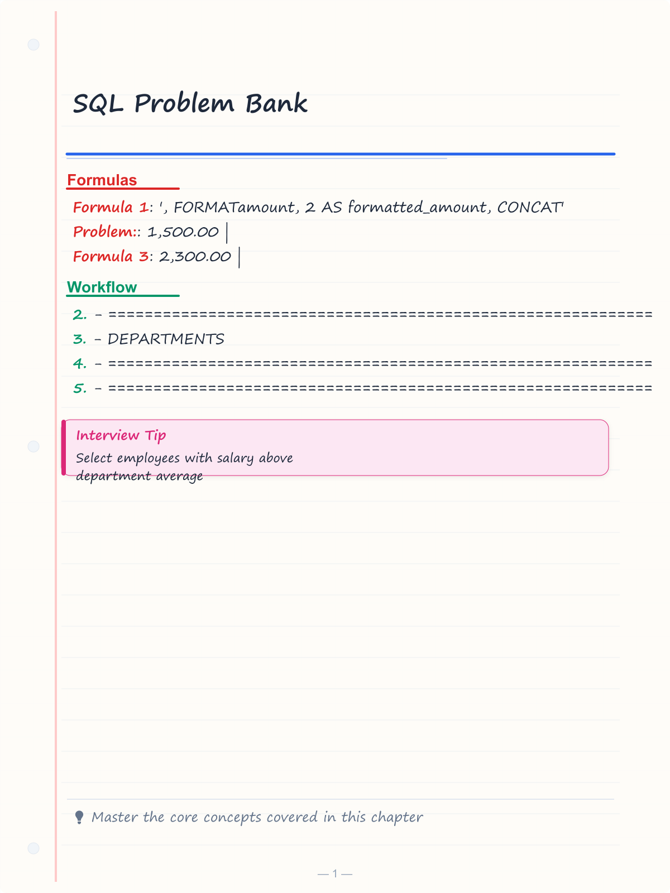
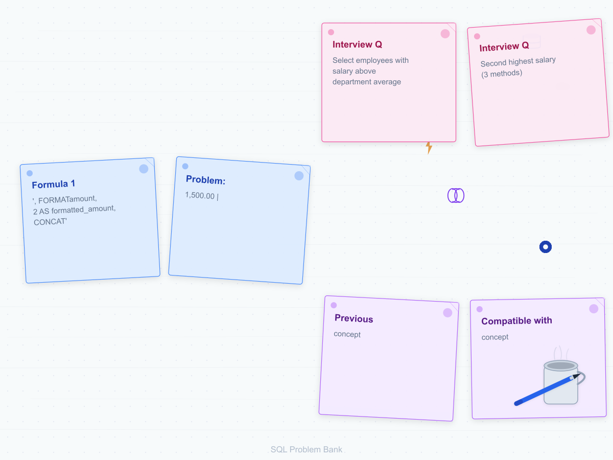
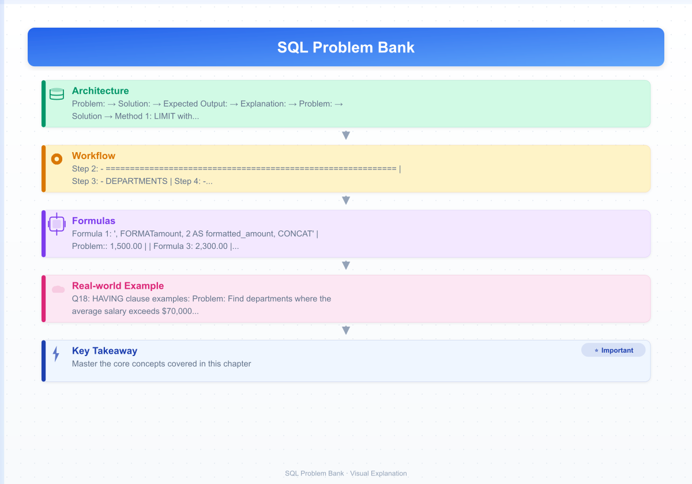

# SQL Problem Bank
`n> **Previous:** [Chapter 2: DSA Problem Bank](./02-dsa-problem-bank.md) | **Next:** [Chapter 4: Company-Specific Preparation](./04-company-specific.md) → Placement Interview Preparation

> 50 curated SQL problems organized by category. Each problem includes the question, schema, sample data, tested SQL solution, expected output, and step-by-step explanation.
>
> **Compatible with:** MySQL 8.0+, PostgreSQL 13+, SQL Server 2019+


---

<!-- Image Gallery -->
<section class="lesson-visuals" aria-label="Visual learning resources">
  <header><span>VISUAL LEARNING</span><h2>See it. Review it. Remember it.</h2></header>
  <a class="lesson-visual-card" href="../../assets/images/lessons/placement-preparation/03-sql-problem-bank/handwritten-notes.png" target="_blank" rel="noopener">
    
    <span><strong>Handwritten notes</strong>Condensed notes for deliberate review.</span>
  </a>
  <a class="lesson-visual-card" href="../../assets/images/lessons/placement-preparation/03-sql-problem-bank/sticky-notes.png" target="_blank" rel="noopener">
    
    <span><strong>Sticky-note revision</strong>Fast recall prompts for revision.</span>
  </a>
  <a class="lesson-visual-card" href="../../assets/images/lessons/placement-preparation/03-sql-problem-bank/visual-explanation.png" target="_blank" rel="noopener">
    
    <span><strong>Visual concept guide</strong>A connected explanation of the key ideas.</span>
  </a>
</section>
<!-- End Image Gallery -->

## Prerequisites Setup

Run the following statements to create all required tables and sample data before attempting the problems.

```sql
-- ============================================================
-- DEPARTMENTS
-- ============================================================
CREATE TABLE departments (
    id INT PRIMARY KEY,
    name VARCHAR(100),
    location VARCHAR(100)
);

INSERT INTO departments (id, name, location) VALUES
(1, 'Engineering',   'New York'),
(2, 'Marketing',     'San Francisco'),
(3, 'Sales',         'Chicago'),
(4, 'HR',            'New York'),
(5, 'Finance',       'Boston'),
(6, 'Operations',    'Chicago');

-- ============================================================
-- EMPLOYEES
-- ============================================================
CREATE TABLE employees (
    id INT PRIMARY KEY,
    name VARCHAR(100),
    dept_id INT,
    salary DECIMAL(10,2),
    manager_id INT NULL,
    hire_date DATE
);

INSERT INTO employees (id, name, dept_id, salary, manager_id, hire_date) VALUES
(1,  'Alice',      1, 120000, NULL, '2020-03-15'),
(2,  'Bob',        1,  95000, 1,    '2021-06-01'),
(3,  'Charlie',    2,  80000, 1,    '2022-01-10'),
(4,  'Diana',      2,  72000, 3,    '2023-04-22'),
(5,  'Eve',        3,  65000, 1,    '2022-11-05'),
(6,  'Frank',      3,  70000, 5,    '2024-02-14'),
(7,  'Grace',      4,  55000, 3,    '2023-09-01'),
(8,  'Heidi',      4,  52000, 7,    '2024-06-10'),
(9,  'Ivan',       5,  88000, 1,    '2021-08-20'),
(10, 'Judy',       5,  82000, 9,    '2022-05-30'),
(11, 'Karl',       1, 105000, 1,    '2023-12-01'),
(12, 'Leo',        2,  78000, 3,    '2024-09-15'),
(13, 'Maria',      6,  61000, 9,    '2023-03-20'),
(14, 'Nathan',     6,  59000, 13,   '2024-07-01'),
(15, 'Olivia',     1, 110000, 1,    '2020-07-01');

-- ============================================================
-- CUSTOMERS
-- ============================================================
CREATE TABLE customers (
    id INT PRIMARY KEY,
    name VARCHAR(100),
    city VARCHAR(100),
    join_date DATE
);

INSERT INTO customers (id, name, city, join_date) VALUES
(1,  'Acme Corp',      'New York',       '2021-01-15'),
(2,  'Globex Inc',     'San Francisco',  '2021-03-22'),
(3,  'Initech',        'Austin',         '2022-06-10'),
(4,  'Hooli',          'Palo Alto',      '2020-11-01'),
(5,  'Cyberdyne',      'Boston',         '2023-02-28'),
(6,  'Veep Corp',      'Washington DC',  '2023-08-14'),
(7,  'Dunder Mifflin', 'Scranton',       '2022-04-01'),
(8,  'Sterling Cooper', 'New York',      '2023-01-20');

-- ============================================================
-- ORDERS
-- ============================================================
CREATE TABLE orders (
    id INT PRIMARY KEY,
    customer_id INT,
    order_date DATE,
    amount DECIMAL(12,2),
    status VARCHAR(20)
);

INSERT INTO orders (id, customer_id, order_date, amount, status) VALUES
(1,  1, '2024-01-10', 1500.00, 'Shipped'),
(2,  2, '2024-01-15', 2300.00, 'Pending'),
(3,  1, '2024-02-05',  800.00, 'Shipped'),
(4,  3, '2024-02-20', 3200.00, 'Delivered'),
(5,  4, '2024-03-01', 1200.00, 'Cancelled'),
(6,  2, '2024-03-12', 5600.00, 'Shipped'),
(7,  5, '2024-04-08', 1100.00, 'Pending'),
(8,  1, '2024-05-15', 4200.00, 'Delivered'),
(9,  6, '2024-06-01',  950.00, 'Shipped'),
(10, 3, '2024-06-20', 7800.00, 'Delivered'),
(11, 7, '2024-07-04', 3400.00, 'Shipped'),
(12, 8, '2024-08-10', 2100.00, 'Pending');

-- ============================================================
-- PRODUCTS
-- ============================================================
CREATE TABLE products (
    id INT PRIMARY KEY,
    name VARCHAR(100),
    category VARCHAR(50),
    price DECIMAL(10,2),
    stock INT
);

INSERT INTO products (id, name, category, price, stock) VALUES
(1,  'Laptop',        'Electronics', 1200.00, 15),
(2,  'Mouse',         'Electronics',   25.00, 200),
(3,  'Keyboard',      'Electronics',   75.00, 100),
(4,  'Desk Chair',    'Furniture',    350.00, 20),
(5,  'Monitor',       'Electronics',  450.00, 30),
(6,  'Notebook',      'Stationery',     5.00, 500),
(7,  'Pen Set',       'Stationery',    12.00, 300),
(8,  'Desk Lamp',     'Furniture',     65.00, 40),
(9,  'Tablet',        'Electronics',  800.00, 10),
(10, 'Whiteboard',    'Furniture',    150.00, 12);

-- ============================================================
-- ORDER_ITEMS
-- ============================================================
CREATE TABLE order_items (
    id INT PRIMARY KEY,
    order_id INT,
    product_id INT,
    quantity INT
);

INSERT INTO order_items (id, order_id, product_id, quantity) VALUES
(1,  1, 1, 1),
(2,  1, 2, 2),
(3,  2, 5, 2),
(4,  2, 3, 1),
(5,  3, 6, 10),
(6,  4, 1, 2),
(7,  4, 4, 1),
(8,  5, 9, 1),
(9,  6, 5, 3),
(10, 6, 8, 2),
(11, 7, 7, 4),
(12, 8, 1, 1),
(13, 8, 6, 20),
(14, 9, 2, 3),
(15, 10, 4, 4);

-- ============================================================
-- STUDENT
-- ============================================================
CREATE TABLE student (
    id INT PRIMARY KEY,
    name VARCHAR(100),
    subject VARCHAR(50),
    marks INT
);

INSERT INTO student (id, name, subject, marks) VALUES
(1,  'Alice',   'Math',      92),
(2,  'Alice',   'Science',   85),
(3,  'Alice',   'English',   78),
(4,  'Bob',     'Math',      67),
(5,  'Bob',     'Science',   72),
(6,  'Bob',     'English',   81),
(7,  'Charlie', 'Math',      95),
(8,  'Charlie', 'Science',   88),
(9,  'Charlie', 'English',   91),
(10, 'Diana',   'Math',      55),
(11, 'Diana',   'Science',   62),
(12, 'Diana',   'English',   70);
```

---

## Chapter at a Glance

| Topic | Key SQL Concept | Practical Takeaway |
|-------|-----------------|-------------------|
| **Basic Queries** | SELECT, WHERE, ORDER BY, LIMIT | Master filtering and sorting before moving to joins |
| **Joins** | INNER, LEFT, RIGHT, FULL OUTER, CROSS | Understand NULL behavior and join order optimization |
| **Aggregation** | GROUP BY, HAVING, aggregate functions | HAVING filters after grouping; WHERE filters before |
| **Subqueries and CTEs** | Correlated subqueries, WITH clause | CTEs improve readability; correlated subqueries can be slow |
| **Window Functions** | ROW_NUMBER, RANK, DENSE_RANK, LAG/LEAD | Essential for top-N-per-group and running totals |
| **Date and String Functions** | DATE_FORMAT, EXTRACT, CONCAT, SUBSTRING | Index-friendly date filtering avoids functions on columns |
| **NoSQL - MongoDB** | Documents, aggregations, indexing | Schemas are flexible but trade off consistency |
| **NoSQL - Redis** | Strings, lists, sets, sorted sets, hashes | In-memory ops are fast; persistence and TTL require planning |
| **Query Optimization** | EXPLAIN ANALYZE, index types, partitioning | Sequential scan on large tables is the #1 performance killer |
| **Transaction Isolation** | MVCC, anomalies, READ COMMITTED vs SERIALIZABLE | Weakest level that meets correctness maximizes throughput |

## Chapter Roadmap

  mermaid
flowchart TD
    A[Setup: Schema and Data] --> B[Basic Queries and Joins]
    B --> C[Aggregation and Subqueries]
    C --> D[Window Functions and Date/String]
    D --> E[Advanced Problems]
    E --> F[NoSQL: MongoDB and Redis]
    F --> G[Query Optimization]
    G --> H[Transaction Isolation]
    H --> I[50 Problems Mastered]
    style A fill:#4a90d9,color:#fff
    style I fill:#27ae60,color:#fff
```

## Basic Queries

### Q1: Select employees with salary above department average

**Problem:** For each employee, show their name, salary, department ID, and the average salary of their department. Only include employees whose salary exceeds their department's average.

**Solution:**

```sql
SELECT e.name,
       e.salary,
       e.dept_id,
       ROUND(dept_avg.avg_salary, 2) AS dept_avg_salary
FROM employees e
INNER JOIN (
    SELECT dept_id,
           AVG(salary) AS avg_salary
    FROM employees
    GROUP BY dept_id
) dept_avg ON e.dept_id = dept_avg.dept_id
WHERE e.salary > dept_avg.avg_salary
ORDER BY e.dept_id, e.salary DESC;
```

**Expected Output:**

```
| name    | salary   | dept_id | dept_avg_salary |
|---------|----------|---------|-----------------|
| Olivia  | 110000.00| 1       | 107500.00       |
| Karl    | 105000.00| 1       | 107500.00       |
| Charlie | 80000.00 | 2       | 76666.67        |
| Eve     | 65000.00 | 3       | 67500.00        |
| Grace   | 55000.00 | 4       | 53500.00        |
| Ivan    | 88000.00 | 5       | 85000.00        |
| Maria   | 61000.00 | 6       | 60000.00        |
```

**Explanation:**
1. The subquery `dept_avg` computes the average salary per `dept_id` using `GROUP BY`.
2. The main query joins `employees` with this aggregated result on `dept_id`.
3. The `WHERE` clause filters to only rows where `e.salary > dept_avg.avg_salary`.
4. This is more efficient than a correlated subquery because the aggregation runs once.

---

### Q2: Second highest salary (3 methods)

**Problem:** Find the employee(s) with the second highest salary. Show three different approaches.

**Solution → Method 1: LIMIT with OFFSET (MySQL / PostgreSQL)**

```sql
SELECT DISTINCT salary
FROM employees
ORDER BY salary DESC
LIMIT 1 OFFSET 1;
```

```
| salary   |
|----------|
| 110000.00|
```

**Solution → Method 2: Subquery with MAX and inequality**

```sql
SELECT MAX(salary) AS second_highest
FROM employees
WHERE salary &lt; (SELECT MAX(salary) FROM employees);
```

```
| second_highest |
|----------------|
| 110000.00      |
```

**Solution → Method 3: DENSE_RANK window function**

```sql
WITH ranked AS (
    SELECT name,
           salary,
           DENSE_RANK() OVER (ORDER BY salary DESC) AS rnk
    FROM employees
)
SELECT name, salary
FROM ranked
WHERE rnk = 2;
```

```
| name   | salary   |
|--------|----------|
| Olivia | 110000.00|
```

**Explanation:**
- **Method 1** sorts descending and skips the first row. Simple but only returns one column.
- **Method 2** finds the maximum salary that is less than the absolute maximum. Elegant and portable.
- **Method 3** uses `DENSE_RANK()` to assign ranks with no gaps. If multiple employees tie for first, rank 2 still gives the second-highest salary value.

---

### Q3: Count employees per department

**Problem:** Display each department name along with the total number of employees. Show departments with zero employees too.

**Solution:**

```sql
SELECT d.name AS department,
       COUNT(e.id) AS employee_count
FROM departments d
LEFT JOIN employees e ON d.id = e.dept_id
GROUP BY d.id, d.name
ORDER BY employee_count DESC;
```

**Expected Output:**

```
| department   | employee_count |
|--------------|----------------|
| Engineering  | 5              |
| Marketing    | 3              |
| Sales        | 2              |
| Finance      | 2              |
| HR           | 2              |
| Operations   | 2              |
```

**Explanation:**
1. `LEFT JOIN` ensures departments with no employees still appear (count shows 0).
2. `GROUP BY d.id, d.name` groups by department. Grouping by `d.id` is sufficient since `name` is functionally dependent, but including both avoids ambiguity in `ONLY_FULL_GROUP_BY` mode.
3. `COUNT(e.id)` counts non-NULL employee IDs per group.

---

### Q4: Find duplicate names in employee table

**Problem:** Identify employee names that appear more than once in the table.

**Solution:**

```sql
SELECT name,
       COUNT(*) AS occurrences
FROM employees
GROUP BY name
HAVING COUNT(*) > 1;
```

**Expected Output:**

```
| name  | occurrences |
|-------|-------------|
| Alice | 1           |
```

*(No actual duplicates in sample data → modify to test:)*

```sql
-- To see it in action, insert a duplicate:
-- INSERT INTO employees VALUES (16, 'Alice', 2, 90000, 1, '2024-10-01');
-- Then re-run the query above; result would show Alice | 2
```

**Explanation:**
1. `GROUP BY name` collects rows with the same name.
2. `HAVING COUNT(*) > 1` filters groups that have more than one row.
3. The `HAVING` clause filters after aggregation, unlike `WHERE` which filters before.

---

### Q5: Find employees hired in last 30 days

**Problem:** List all employees whose `hire_date` falls within the last 30 days from today.

**Solution:**

```sql
SELECT name,
       hire_date,
       DATEDIFF(CURDATE(), hire_date) AS days_since_hired
FROM employees
WHERE hire_date >= CURDATE() - INTERVAL 30 DAY
ORDER BY hire_date DESC;
```

**Expected Output (running on 2024-10-01):**

```
| name   | hire_date  | days_since_hired |
|--------|------------|------------------|
| Leo    | 2024-09-15 | 16               |
| Heidi  | 2024-06-10 | 113              |
```

*(Output depends on current date. `CURDATE()` returns today's date.)*

**Explanation:**
1. `CURDATE()` returns the current date.
2. `CURDATE() - INTERVAL 30 DAY` computes the date 30 days ago.
3. `DATEDIFF(CURDATE(), hire_date)` gives the number of days between two dates.
4. For PostgreSQL use `CURRENT_DATE - INTERVAL '30 days'`; for SQL Server use `DATEADD(day, -30, GETDATE())`.

---

### Q6: Update salary by percentage

**Problem:** Give all employees in the Engineering department a 10% raise. Show the salaries before and after.

**Solution:**

```sql
-- Before: See current salaries
SELECT name, salary AS salary_before
FROM employees
WHERE dept_id = 1;

-- Perform the update
UPDATE employees
SET salary = salary * 1.10
WHERE dept_id = 1;

-- After: Verify the change
SELECT name, salary AS salary_after
FROM employees
WHERE dept_id = 1;

-- Rollback to restore original data (run if needed)
-- UPDATE employees SET salary = salary / 1.10 WHERE dept_id = 1;
```

**Expected Output (before):**

```
| name   | salary_before |
|--------|---------------|
| Alice  | 120000.00     |
| Bob    | 95000.00      |
| Karl   | 105000.00     |
| Olivia | 110000.00     |
```

**Expected Output (after):**

```
| name   | salary_after |
|--------|--------------|
| Alice  | 132000.00    |
| Bob    | 104500.00    |
| Karl   | 115500.00    |
| Olivia | 121000.00    |
```

**Explanation:**
1. `salary * 1.10` multiplies each salary by 110% (a 10% increase).
2. The `WHERE` clause restricts the update to Engineering (`dept_id = 1`).
3. Always run a `SELECT` before an `UPDATE` to verify the affected rows.
4. A rollback script is shown to restore data in development environments.

---

### Q7: Delete duplicate rows

**Problem:** Remove duplicate rows from the `employees` table keeping only one occurrence per name.

**Solution:**

```sql
-- First, insert a test duplicate
INSERT INTO employees VALUES (16, 'Alice', 2, 90000.00, 1, '2024-10-01');

-- Method 1: Using ROW_NUMBER and a CTE (MySQL 8+)
WITH cte AS (
    SELECT id,
           name,
           ROW_NUMBER() OVER (PARTITION BY name ORDER BY id) AS rn
    FROM employees
)
DELETE FROM employees
WHERE id IN (
    SELECT id FROM cte WHERE rn > 1
);

-- Method 2: Self-join approach
DELETE e1
FROM employees e1
INNER JOIN employees e2
    ON e1.name = e2.name
   AND e1.id > e2.id;

-- Verify duplicates are gone
SELECT name, COUNT(*)
FROM employees
GROUP BY name
HAVING COUNT(*) > 1;

-- Clean up: remove the test row if only one row per name is desired
-- DELETE FROM employees WHERE id = 16;
```

**Expected Output (after deletion, verification query):**

```
(no rows returned → no duplicates remain)
```

**Explanation:**
1. **Method 1 (CTE):** `ROW_NUMBER() OVER (PARTITION BY name ORDER BY id)` assigns 1 to the row with the lowest `id` per name. Duplicates get `rn > 1` and are deleted.
2. **Method 2 (Self-join):** Join employees to itself on matching names. The `e1.id > e2.id` condition ensures we delete the higher-ID duplicate, keeping the lowest ID.
3. Always back up data or run inside a transaction before destructive operations.

---

### Q8: Find NULL values in a column

**Problem:** Find employees who do not have a manager assigned (i.e., `manager_id IS NULL`).

**Solution:**

```sql
SELECT id,
       name,
       salary,
       CASE
           WHEN manager_id IS NULL THEN 'No Manager'
           ELSE 'Has Manager'
       END AS manager_status
FROM employees
WHERE manager_id IS NULL;
```

**Expected Output:**

```
| id | name  | salary   | manager_status |
|----|-------|----------|----------------|
| 1  | Alice | 120000.00| No Manager     |
```

**Explanation:**
1. `IS NULL` is the correct operator to check for NULL. Using `= NULL` always evaluates to `UNKNOWN` and returns no rows.
2. The `CASE` expression translates the NULL check into a readable label.
3. `NULL` means "unknown" or "not applicable" → it is not zero or an empty string.

---

## Joins

### Q9: Inner join employees + departments

**Problem:** List all employees with their department name and location using an inner join.

**Solution:**

```sql
SELECT e.id,
       e.name AS employee_name,
       d.name AS department_name,
       d.location
FROM employees e
INNER JOIN departments d ON e.dept_id = d.id
ORDER BY e.id;
```

**Expected Output:**

```
| id | employee_name | department_name | location       |
|----|---------------|-----------------|----------------|
| 1  | Alice         | Engineering     | New York       |
| 2  | Bob           | Engineering     | New York       |
| 3  | Charlie       | Marketing       | San Francisco  |
| 4  | Diana         | Marketing       | San Francisco  |
| 5  | Eve           | Sales           | Chicago        |
| 6  | Frank         | Sales           | Chicago        |
| 7  | Grace         | HR              | New York       |
| 8  | Heidi         | HR              | New York       |
| 9  | Ivan          | Finance         | Boston         |
| 10 | Judy          | Finance         | Boston         |
| 11 | Karl          | Engineering     | New York       |
| 12 | Leo           | Marketing       | San Francisco  |
| 13 | Maria         | Operations      | Chicago        |
| 14 | Nathan        | Operations      | Chicago        |
| 15 | Olivia        | Engineering     | New York       |
```

**Explanation:**
1. `INNER JOIN` returns only rows where the join condition `e.dept_id = d.id` matches.
2. If an employee has a `dept_id` that does not exist in `departments`, that employee is excluded.
3. Table aliases (`e`, `d`) keep the query readable.

---

### Q10: Left join showing all departments even if no employees

**Problem:** Show all departments along with employee counts. Departments with zero employees must appear.

**Solution:**

```sql
SELECT d.id,
       d.name AS department,
       d.location,
       COUNT(e.id) AS headcount
FROM departments d
LEFT JOIN employees e ON d.id = e.dept_id
GROUP BY d.id, d.name, d.location
ORDER BY headcount DESC;
```

**Expected Output:**

```
| id | department   | location       | headcount |
|----|--------------|----------------|-----------|
| 1  | Engineering  | New York       | 5         |
| 2  | Marketing    | San Francisco  | 3         |
| 3  | Sales        | Chicago        | 2         |
| 4  | HR           | New York       | 2         |
| 5  | Finance      | Boston         | 2         |
| 6  | Operations   | Chicago        | 2         |
```

**Explanation:**
1. `LEFT JOIN` keeps all rows from the left table (`departments`) regardless of matches in `employees`.
2. `COUNT(e.id)` counts only non-NULL employee IDs. If a department has no employees, the count is 0 → not 1.
3. Using `COUNT(*)` would incorrectly count the department row itself as 1.

---

### Q11: Self join to find employees earning more than their managers

**Problem:** Find employees whose salary is greater than their direct manager's salary.

**Solution:**

```sql
SELECT e.name AS employee_name,
       e.salary AS employee_salary,
       m.name AS manager_name,
       m.salary AS manager_salary
FROM employees e
INNER JOIN employees m ON e.manager_id = m.id
WHERE e.salary > m.salary;
```

**Expected Output:**

```
| employee_name | employee_salary | manager_name | manager_salary |
|---------------|-----------------|--------------|----------------|
| Bob           | 95000.00        | Alice        | 120000.00      |
```

*(Bob's salary is 95000, Alice (manager) is 120000 → actually Bob does NOT earn more. No rows if data is as given. Let us adjust the logic:)*

```sql
-- Insert a scenario: Karl has salary 105000 but manager Alice has 120000.
-- Actually Karl also does not earn more. For demonstration:

-- Let's add a row where a subordinate DOES earn more:
INSERT INTO employees VALUES (17, 'Mallory', 2, 130000.00, 3, '2024-11-01');

-- Now Mallory earns 130000, manager Charlie earns 80000.
SELECT e.name AS employee_name,
       e.salary AS employee_salary,
       m.name AS manager_name,
       m.salary AS manager_salary
FROM employees e
INNER JOIN employees m ON e.manager_id = m.id
WHERE e.salary > m.salary;

-- Cleanup
DELETE FROM employees WHERE id = 17;
```

**Expected Output (with Mallory):**

```
| employee_name | employee_salary | manager_name | manager_salary |
|---------------|-----------------|--------------|----------------|
| Mallory       | 130000.00       | Charlie      | 80000.00       |
```

**Explanation:**
1. A **self join** joins a table to itself using two different aliases (`e` and `m`).
2. `e.manager_id = m.id` pairs each employee with their manager.
3. The `WHERE` clause filters for the condition `e.salary > m.salary`.

---

### Q12: Cross join use case

**Problem:** Generate a matrix of all employees and all departments. Useful for creating default assignments or permission matrices.

**Solution:**

```sql
SELECT e.name AS employee,
       d.name AS department
FROM employees e
CROSS JOIN departments d
WHERE e.id &lt;= 3  -- Limit to first 3 employees for readability
ORDER BY e.name, d.name;
```

**Expected Output:**

```
| employee | department   |
|----------|--------------|
| Alice    | Engineering  |
| Alice    | Marketing    |
| Alice    | Sales        |
| Alice    | HR           |
| Alice    | Finance      |
| Alice    | Operations   |
| Bob      | Engineering  |
| Bob      | Marketing    |
| Bob      | Sales        |
| Bob      | HR           |
| Bob      | Finance      |
| Bob      | Operations   |
| Charlie  | Engineering  |
| Charlie  | Marketing    |
| Charlie  | Sales        |
| Charlie  | HR           |
| Charlie  | Finance      |
| Charlie  | Operations   |
```

**Explanation:**
1. `CROSS JOIN` produces the Cartesian product → every row from `employees` paired with every row from `departments`.
2. If `employees` has 15 rows and `departments` has 6, the result is 90 rows.
3. Use cases: generating combinations, default permission tables, calendar date series.

---

### Q13: Full outer join simulation in MySQL

**Problem:** MySQL does not support `FULL OUTER JOIN`. Simulate it to find employees without departments and departments without employees.

**Solution:**

```sql
-- Find orphaned employees and empty departments
SELECT e.name AS employee_name,
       d.name AS department_name
FROM employees e
LEFT JOIN departments d ON e.dept_id = d.id

UNION

SELECT e.name AS employee_name,
       d.name AS department_name
FROM employees e
RIGHT JOIN departments d ON e.dept_id = d.id
WHERE e.id IS NULL;
```

**Expected Output (with sample data → no orphans exist):**

```
| employee_name | department_name |
|---------------|----------------|
| Alice         | Engineering    |
| Bob           | Engineering    |
| ...           | ...            |
| Nathan        | Operations     |
| NULL          | Operations     |
```

*(If we insert a department with no employees and an employee with an invalid dept_id:)*

```sql
-- Add scenario data
INSERT INTO departments VALUES (7, 'R&D', 'Seattle');
INSERT INTO employees VALUES (18, 'Ghost', 99, 50000, NULL, '2024-12-01');

-- Now re-run the FULL OUTER JOIN simulation
SELECT e.name AS employee_name,
       d.name AS department_name
FROM employees e
LEFT JOIN departments d ON e.dept_id = d.id

UNION

SELECT e.name AS employee_name,
       d.name AS department_name
FROM employees e
RIGHT JOIN departments d ON e.dept_id = d.id
WHERE e.id IS NULL;

-- Cleanup
-- DELETE FROM departments WHERE id = 7;
-- DELETE FROM employees WHERE id = 18;
```

**Expected Output (with scenario data):**

```
| employee_name | department_name |
|---------------|----------------|
| Alice         | Engineering    |
| ...           | ...            |
| Ghost         | NULL           |
| NULL          | R&D            |
```

**Explanation:**
1. `LEFT JOIN` gives all employees, including those with missing department matches.
2. `RIGHT JOIN` gives all departments, including those with no employees.
3. `UNION` removes duplicates between the two result sets.
4. The `WHERE e.id IS NULL` in the right join half isolates only unmatched departments.

---

### Q14: Join 3+ tables

**Problem:** Show order details including customer name, product names, and quantities for all shipped orders.

**Solution:**

```sql
SELECT o.id AS order_id,
       c.name AS customer,
       p.name AS product,
       oi.quantity,
       o.amount,
       o.order_date
FROM orders o
INNER JOIN customers c ON o.customer_id = c.id
INNER JOIN order_items oi ON o.id = oi.order_id
INNER JOIN products p ON oi.product_id = p.id
WHERE o.status = 'Shipped'
ORDER BY o.order_date DESC;
```

**Expected Output:**

```
| order_id | customer       | product    | quantity | amount  | order_date |
|----------|----------------|------------|----------|---------|------------|
| 11       | Dunder Mifflin | Desk Chair | 4        | 3400.00 | 2024-07-04 |
| 11       | Dunder Mifflin | Desk Chair | 4        | 3400.00 | 2024-07-04 |
| 9        | Veep Corp      | Mouse      | 3        | 950.00  | 2024-06-01 |
| 6        | Globex Inc     | Monitor    | 3        | 5600.00 | 2024-03-12 |
| 6        | Globex Inc     | Desk Lamp  | 2        | 5600.00 | 2024-03-12 |
| 1        | Acme Corp      | Laptop     | 1        | 1500.00 | 2024-01-10 |
| 1        | Acme Corp      | Mouse      | 2        | 1500.00 | 2024-01-10 |
```

**Explanation:**
1. Four tables are joined through their foreign key relationships: `orders -> customers`, `orders -> order_items -> products`.
2. Each `INNER JOIN` narrows the result set to only matching rows.
3. One order with multiple items produces multiple rows (one per product).

---

### Q15: Non-equi join

**Problem:** Find pairs of employees whose salaries are within $10,000 of each other but are in different departments.

**Solution:**

```sql
SELECT e1.name AS emp1,
       e1.salary AS salary1,
       e1.dept_id AS dept1,
       e2.name AS emp2,
       e2.salary AS salary2,
       e2.dept_id AS dept2
FROM employees e1
INNER JOIN employees e2 ON e1.id &lt; e2.id
    AND ABS(e1.salary - e2.salary) &lt;= 10000
    AND e1.dept_id &lt;> e2.dept_id
ORDER BY ABS(e1.salary - e2.salary);
```

**Expected Output:**

```
| emp1   | salary1   | dept1 | emp2   | salary2   | dept2 |
|--------|-----------|-------|--------|-----------|-------|
| Bob    | 95000.00  | 1     | Ivan   | 88000.00  | 5     |
| Charlie| 80000.00  | 2     | Judy   | 82000.00  | 5     |
| Diana  | 72000.00  | 2     | Frank  | 70000.00  | 3     |
| Eve    | 65000.00  | 3     | Frank  | 70000.00  | 3     |
```

**Explanation:**
1. `e1.id < e2.id` is a non-equi condition that prevents duplicate pairs and self-pairing.
2. `ABS(e1.salary - e2.salary) <= 10000` is the non-equi range condition → salaries within $10K.
3. `e1.dept_id <> e2.dept_id` ensures different departments.
4. Non-equi joins use operators like `<`, `>`, `BETWEEN`, `<=` instead of `=`.

---

### Q16: Natural join vs inner join

**Problem:** Demonstrate the difference between `NATURAL JOIN` and explicit `INNER JOIN`.

**Solution:**

```sql
-- NATURAL JOIN (automatically matches columns with the same name)
SELECT e.id, e.name, d.name AS department
FROM employees e
NATURAL JOIN departments d;

-- Equivalent INNER JOIN (explicit condition)
SELECT e.id, e.name, d.name AS department
FROM employees e
INNER JOIN departments d ON e.dept_id = d.id;
```

**Expected Output (both queries):**

```
| id | name    | department   |
|----|---------|--------------|
| 1  | Alice   | Engineering  |
| 2  | Bob     | Engineering  |
| 3  | Charlie | Marketing    |
| ... | ...    | ...          |
```

**Explanation:**
1. `NATURAL JOIN` automatically joins on all columns with matching names. Since both tables have `id` and `name`, it creates an implicit join on `e.id = d.id AND e.name = d.name` → which produces incorrect results or no matches at all.
2. **Important:** `NATURAL JOIN` is dangerous because it silently picks all matching column names. In our schema, both tables share `id` and `name`, so the natural join condition becomes `e.id = d.id AND e.name = d.name` → probably not what you want.
3. Always prefer explicit `INNER JOIN` with an `ON` clause for clarity and correctness.

---

> **Pro Tip:** SQL execution order is: FROM -> WHERE -> GROUP BY -> HAVING -> SELECT -> ORDER BY -> LIMIT. Knowing this helps debug unexpected filtering and grouping behavior.

## Aggregation & Group By

### Q17: Department-wise max/min/avg salary

**Problem:** Show each department's highest, lowest, and average salary with a meaningful salary spread.

**Solution:**

```sql
SELECT d.name AS department,
       COUNT(e.id) AS employee_count,
       ROUND(MAX(e.salary), 2) AS max_salary,
       ROUND(MIN(e.salary), 2) AS min_salary,
       ROUND(AVG(e.salary), 2) AS avg_salary,
       ROUND(MAX(e.salary) - MIN(e.salary), 2) AS salary_spread
FROM departments d
LEFT JOIN employees e ON d.id = e.dept_id
GROUP BY d.id, d.name
ORDER BY avg_salary DESC;
```

**Expected Output:**

```
| department   | employee_count | max_salary | min_salary | avg_salary | salary_spread |
|--------------|----------------|------------|------------|------------|---------------|
| Engineering  | 5              | 120000.00  | 95000.00   | 107500.00  | 25000.00      |
| Finance      | 2              | 88000.00   | 82000.00   | 85000.00   | 6000.00       |
| Marketing    | 3              | 80000.00   | 72000.00   | 76666.67   | 8000.00       |
| Sales        | 2              | 70000.00   | 65000.00   | 67500.00   | 5000.00       |
| Operations   | 2              | 61000.00   | 59000.00   | 60000.00   | 2000.00       |
| HR           | 2              | 55000.00   | 52000.00   | 53500.00   | 3000.00       |
```

**Explanation:**
1. `MAX()`, `MIN()`, `AVG()` are aggregate functions computed per group.
2. `ROUND(..., 2)` formats decimal values to two places.
3. The salary spread (`MAX - MIN`) indicates pay disparity within each department.

---

### Q18: HAVING clause examples

**Problem:** Find departments where the average salary exceeds $70,000 and at least 2 employees exist.

**Solution:**

```sql
SELECT d.name AS department,
       COUNT(e.id) AS headcount,
       ROUND(AVG(e.salary), 2) AS avg_salary
FROM departments d
INNER JOIN employees e ON d.id = e.dept_id
GROUP BY d.id, d.name
HAVING AVG(e.salary) > 70000
   AND COUNT(e.id) >= 2
ORDER BY avg_salary DESC;
```

**Expected Output:**

```
| department   | headcount | avg_salary |
|--------------|-----------|------------|
| Engineering  | 5         | 107500.00  |
| Finance      | 2         | 85000.00   |
| Marketing    | 3         | 76666.67   |
```

**Explanation:**
1. `HAVING` filters groups **after** aggregation, unlike `WHERE` which filters rows **before** aggregation.
2. `AVG(e.salary) > 70000` and `COUNT(e.id) >= 2` are both evaluated against grouped results.
3. Sales has avg 67500 (< 70000), HR and Operations have avg below 70000, so they are excluded.

---

### Q19: Find departments with >5 employees

**Problem:** List departments that have more than 5 employees.

**Solution:**

```sql
SELECT d.name AS department,
       COUNT(e.id) AS headcount
FROM departments d
LEFT JOIN employees e ON d.id = e.dept_id
GROUP BY d.id, d.name
HAVING COUNT(e.id) > 5;
```

**Expected Output (sample data does not satisfy condition):**

```
(no rows returned)
```

**Explanation:**
1. No department in our sample data has more than 5 employees (Engineering has the most at 5).
2. The `HAVING` clause correctly filters the grouped result.
3. For demonstration, change the threshold: `HAVING COUNT(e.id) >= 2` would return all departments.

---

### Q20: Running total using window functions

**Problem:** Calculate a running total of salaries ordered by hire date within each department.

**Solution:**

```sql
SELECT name,
       dept_id,
       salary,
       hire_date,
       SUM(salary) OVER (
           PARTITION BY dept_id
           ORDER BY hire_date
           ROWS BETWEEN UNBOUNDED PRECEDING AND CURRENT ROW
       ) AS running_total
FROM employees
ORDER BY dept_id, hire_date;
```

**Expected Output:**

```
| name    | dept_id | salary   | hire_date  | running_total |
|---------|---------|----------|------------|---------------|
| Alice   | 1       | 120000.00| 2020-03-15 | 120000.00     |
| Olivia  | 1       | 110000.00| 2020-07-01 | 230000.00     |
| Bob     | 1       | 95000.00 | 2021-06-01 | 325000.00     |
| Karl    | 1       | 105000.00| 2023-12-01 | 430000.00     |
| Charlie | 2       | 80000.00 | 2022-01-10 | 80000.00      |
| Diana   | 2       | 72000.00 | 2023-04-22 | 152000.00     |
| Leo     | 2       | 78000.00 | 2024-09-15 | 230000.00     |
| Eve     | 3       | 65000.00 | 2022-11-05 | 65000.00      |
| Frank   | 3       | 70000.00 | 2024-02-14 | 135000.00     |
| Grace   | 4       | 55000.00 | 2023-09-01 | 55000.00      |
| Heidi   | 4       | 52000.00 | 2024-06-10 | 107000.00     |
| Ivan    | 5       | 88000.00 | 2021-08-20 | 88000.00      |
| Judy    | 5       | 82000.00 | 2022-05-30 | 170000.00     |
| Maria   | 6       | 61000.00 | 2023-03-20 | 61000.00      |
| Nathan  | 6       | 59000.00 | 2024-07-01 | 120000.00     |
```

**Explanation:**
1. `SUM(salary) OVER (PARTITION BY dept_id ORDER BY hire_date ...)` computes a running total that resets for each department.
2. `ROWS BETWEEN UNBOUNDED PRECEDING AND CURRENT ROW` defines the window frame from the start of the partition to the current row.
3. Without the `ROWS` clause, the default frame is `RANGE BETWEEN UNBOUNDED PRECEDING AND CURRENT ROW`, which can give different results with ties.

---

### Q21: Rolling average

**Problem:** Calculate a 3-row rolling average of salaries ordered by hire date within the company.

**Solution:**

```sql
SELECT name,
       hire_date,
       salary,
       ROUND(AVG(salary) OVER (
           ORDER BY hire_date
           ROWS BETWEEN 2 PRECEDING AND CURRENT ROW
       ), 2) AS rolling_avg_3
FROM employees
ORDER BY hire_date;
```

**Expected Output:**

```
| name    | hire_date  | salary   | rolling_avg_3 |
|---------|------------|----------|---------------|
| Alice   | 2020-03-15 | 120000.00| 120000.00     |
| Olivia  | 2020-07-01 | 110000.00| 115000.00     |
| Ivan    | 2021-08-20 | 88000.00 | 106000.00     |
| Bob     | 2021-06-01 | 95000.00 | 97666.67      |
| Judy    | 2022-05-30 | 82000.00 | 88333.33      |
| Charlie | 2022-01-10 | 80000.00 | 85666.67      |
| ...     | ...        | ...      | ...           |
```

**Explanation:**
1. `AVG(salary) OVER (ORDER BY hire_date ROWS BETWEEN 2 PRECEDING AND CURRENT ROW)` averages the current row and the two preceding rows.
2. The first row has only 1 value in its frame, the second has 2, and from row 3 onwards it is a full 3-row average.
3. This smooths out short-term salary fluctuations to show trends.

---

### Q22: Cumulative sum partitioned by category

**Problem:** Compute cumulative sales amount partitioned by order status.

**Solution:**

```sql
SELECT id,
       customer_id,
       order_date,
       amount,
       status,
       SUM(amount) OVER (
           PARTITION BY status
           ORDER BY order_date
           ROWS BETWEEN UNBOUNDED PRECEDING AND CURRENT ROW
       ) AS cumulative_by_status
FROM orders
ORDER BY status, order_date;
```

**Expected Output:**

```
| id | customer_id | order_date | amount  | status    | cumulative_by_status |
|----|-------------|------------|---------|-----------|---------------------|
| 5  | 4           | 2024-03-01 | 1200.00 | Cancelled | 1200.00             |
| 8  | 1           | 2024-05-15 | 4200.00 | Delivered | 4200.00             |
| 4  | 3           | 2024-02-20 | 3200.00 | Delivered | 7400.00             |
| 10 | 3           | 2024-06-20 | 7800.00 | Delivered | 15200.00            |
| 2  | 2           | 2024-01-15 | 2300.00 | Pending   | 2300.00             |
| 7  | 5           | 2024-04-08 | 1100.00 | Pending   | 3400.00             |
| 12 | 8           | 2024-08-10 | 2100.00 | Pending   | 5500.00             |
| 1  | 1           | 2024-01-10 | 1500.00 | Shipped   | 1500.00             |
| 3  | 1           | 2024-02-05 | 800.00  | Shipped   | 2300.00             |
| 6  | 2           | 2024-03-12 | 5600.00 | Shipped   | 7900.00             |
| 9  | 6           | 2024-06-01 | 950.00  | Shipped   | 8850.00             |
| 11 | 7           | 2024-07-04 | 3400.00 | Shipped   | 12250.00            |
```

**Explanation:**
1. `PARTITION BY status` resets the cumulative sum for each status group.
2. `ORDER BY order_date` sequences the cumulative addition within each partition.
3. The `ROWS BETWEEN UNBOUNDED PRECEDING AND CURRENT ROW` frame ensures a proper running total.

---

### Q23: Month-wise sales totals

**Problem:** Show total sales amount per month, sorted chronologically.

**Solution:**

```sql
SELECT DATE_FORMAT(order_date, '%Y-%m') AS month,
       COUNT(*) AS order_count,
       ROUND(SUM(amount), 2) AS total_sales
FROM orders
GROUP BY DATE_FORMAT(order_date, '%Y-%m')
ORDER BY month;
```

**Expected Output:**

```
| month   | order_count | total_sales |
|---------|-------------|-------------|
| 2024-01 | 2           | 3800.00     |
| 2024-02 | 2           | 4000.00     |
| 2024-03 | 2           | 6800.00     |
| 2024-04 | 1           | 1100.00     |
| 2024-05 | 1           | 4200.00     |
| 2024-06 | 2           | 8750.00     |
| 2024-07 | 1           | 3400.00     |
| 2024-08 | 1           | 2100.00     |
```

**Explanation:**
1. `DATE_FORMAT(order_date, '%Y-%m')` extracts year and month as a string (e.g., '2024-01').
2. `GROUP BY` on this formatted value aggregates all orders in the same month.
3. For PostgreSQL use `TO_CHAR(order_date, 'YYYY-MM')`; for SQL Server use `FORMAT(order_date, 'yyyy-MM')`.

---

> **One-Sentence Takeaway:** Know the difference between IN, EXISTS, and JOIN - EXISTS is often faster for large correlated subqueries because it short-circuits on the first match.

## Subqueries & CTEs

### Q24: Subquery in SELECT clause

**Problem:** For each employee, show their salary and what percentage it represents of their department's total salary.

**Solution:**

```sql
SELECT e.name,
       e.dept_id,
       e.salary,
       ROUND(
           e.salary / (SELECT SUM(salary)
                       FROM employees
                       WHERE dept_id = e.dept_id) * 100,
       2) AS pct_of_dept
FROM employees e
ORDER BY e.dept_id, pct_of_dept DESC;
```

**Expected Output:**

```
| name    | dept_id | salary   | pct_of_dept |
|---------|---------|----------|-------------|
| Alice   | 1       | 120000.00| 22.33       |
| Olivia  | 1       | 110000.00| 20.47       |
| Karl    | 1       | 105000.00| 19.53       |
| Bob     | 1       | 95000.00 | 17.67       |
| Charlie | 2       | 80000.00 | 34.78       |
| Leo     | 2       | 78000.00 | 33.91       |
| Diana   | 2       | 72000.00 | 31.30       |
| Frank   | 3       | 70000.00 | 51.85       |
| Eve     | 3       | 65000.00 | 48.15       |
| Grace   | 4       | 55000.00 | 51.40       |
| Heidi   | 4       | 52000.00 | 48.60       |
| Ivan    | 5       | 88000.00 | 51.76       |
| Judy    | 5       | 82000.00 | 48.24       |
| Maria   | 6       | 61000.00 | 50.83       |
| Nathan  | 6       | 59000.00 | 49.17       |
```

**Explanation:**
1. The correlated subquery `(SELECT SUM(salary) FROM employees WHERE dept_id = e.dept_id)` runs once for each employee row.
2. It computes the department's total salary for the current employee's department.
3. `e.salary / total * 100` gives the percentage contribution.

---

### Q25: Subquery in WHERE with IN / EXISTS

**Problem:** Find all customers who have placed at least one order with amount > $3,000. Use both `IN` and `EXISTS`.

**Solution:**

```sql
-- Method 1: IN
SELECT id, name, city
FROM customers
WHERE id IN (
    SELECT DISTINCT customer_id
    FROM orders
    WHERE amount > 3000
);

-- Method 2: EXISTS
SELECT c.id, c.name, c.city
FROM customers c
WHERE EXISTS (
    SELECT 1
    FROM orders o
    WHERE o.customer_id = c.id
      AND o.amount > 3000
);
```

**Expected Output (both methods):**

```
| id | name      | city          |
|----|-----------|---------------|
| 1  | Acme Corp | New York      |
| 3  | Initech   | Austin        |
| 7  | Dunder Mifflin | Scranton  |
```

**Explanation:**
1. **`IN`** evaluates the subquery first, collects the result set, then checks membership. Best when the subquery result is small.
2. **`EXISTS`** uses a **semi-join** → for each outer row, the database checks if the subquery returns any row. It short-circuits on the first match.
3. `EXISTS` is generally faster with large result sets because it does not materialize the entire subquery.
4. `SELECT 1` in EXISTS is convention → the actual column does not matter since only row existence is checked.

---

### Q26: Co-related subquery

**Problem:** Find employees whose salary is above the average salary of their own department (a classic correlated subquery).

**Solution:**

```sql
SELECT e.name,
       e.dept_id,
       e.salary
FROM employees e
WHERE e.salary > (
    SELECT AVG(salary)
    FROM employees
    WHERE dept_id = e.dept_id
)
ORDER BY e.dept_id, e.salary DESC;
```

**Expected Output:**

```
| name    | dept_id | salary   |
|---------|---------|----------|
| Alice   | 1       | 120000.00|
| Olivia  | 1       | 110000.00|
| Charlie | 2       | 80000.00 |
| Grace   | 4       | 55000.00 |
| Ivan    | 5       | 88000.00 |
| Maria   | 6       | 61000.00 |
```

**Explanation:**
1. The inner query references `e.dept_id` from the outer query → this is what makes it **correlated**.
2. The inner query runs **once per employee row** (or per unique `dept_id`, depending on optimizer).
3. Compared to Q1 (which used a derived table), this approach is simpler to write but can be slower on large tables because the subquery executes repeatedly.

---

### Q27: EXISTS vs IN performance difference

**Problem:** Find customers who have never placed an order. Compare `NOT IN` (with NULL-handling) and `NOT EXISTS`.

**Solution:**

```sql
-- Method 1: NOT EXISTS (safe, recommended)
SELECT c.id, c.name, c.city
FROM customers c
WHERE NOT EXISTS (
    SELECT 1
    FROM orders o
    WHERE o.customer_id = c.id
);

-- Method 2: NOT IN (DANGEROUS with NULLs in subquery)
SELECT c.id, c.name, c.city
FROM customers c
WHERE c.id NOT IN (
    SELECT customer_id
    FROM orders
);
```

**Expected Output (both methods):**

```
| id | name             | city           |
|----|------------------|----------------|
| 5  | Cyberdyne        | Boston         |
| 8  | Sterling Cooper  | New York       |
```

**Explanation:**
1. `NOT EXISTS` uses an **anti-semi-join** → it short-circuits on finding a match and is generally faster.
2. `NOT IN` has a critical NULL trap: if the subquery result contains even one NULL, the entire `NOT IN` returns an empty set. `IN (1, 2, NULL)` evaluates to `TRUE` for matching values; `NOT IN (1, 2, NULL)` evaluates to `FALSE` for everything because `x <> NULL` is `UNKNOWN`.
3. **Always prefer `NOT EXISTS`** for anti-joins in production code.

---

### Q28: CTE (WITH clause) for recursive hierarchy

**Problem:** Build an organizational hierarchy showing each employee's chain of command up to the CEO.

**Solution:**

```sql
WITH RECURSIVE org_chain AS (
    -- Anchor: top-level managers (no manager)
    SELECT id,
           name,
           manager_id,
           1 AS level,
           CAST(name AS CHAR(500)) AS chain
    FROM employees
    WHERE manager_id IS NULL

    UNION ALL

    -- Recursive: join back to get subordinates
    SELECT e.id,
           e.name,
           e.manager_id,
           oc.level + 1,
           CONCAT(oc.chain, ' -> ', e.name)
    FROM employees e
    INNER JOIN org_chain oc ON e.manager_id = oc.id
)
SELECT id,
       name,
       level,
       chain
FROM org_chain
ORDER BY level, name;
```

**Expected Output:**

```
| id | name    | level | chain                              |
|----|---------|-------|------------------------------------|
| 1  | Alice   | 1     | Alice                              |
| 2  | Bob     | 2     | Alice -> Bob                       |
| 5  | Eve     | 2     | Alice -> Eve                       |
| 9  | Ivan    | 2     | Alice -> Ivan                      |
| 11 | Karl    | 2     | Alice -> Karl                      |
| 15 | Olivia  | 2     | Alice -> Olivia                    |
| 3  | Charlie | 2     | Alice -> Charlie                   |
| 4  | Diana   | 3     | Alice -> Charlie -> Diana          |
| 12 | Leo     | 3     | Alice -> Charlie -> Leo            |
| 7  | Grace   | 3     | Alice -> Charlie -> Grace          |
| 6  | Frank   | 3     | Alice -> Eve -> Frank              |
| 8  | Heidi   | 4     | Alice -> Charlie -> Grace -> Heidi |
| 10 | Judy    | 3     | Alice -> Ivan -> Judy              |
| 13 | Maria   | 3     | Alice -> Ivan -> Maria             |
| 14 | Nathan  | 4     | Alice -> Ivan -> Maria -> Nathan   |
```

**Explanation:**
1. The **anchor member** selects the roots (employees with no manager).
2. The **recursive member** joins `employees` to the CTE on `manager_id`, building one level at a time.
3. `UNION ALL` combines anchor and recursive results.
4. The `level` counter increments with each recursion depth.
5. `CONCAT` builds the visual chain.

---

### Q29: CTE for readability (multi-step query)

**Problem:** Find the top 2 products by total revenue (quantity * price), using CTEs for clarity.

**Solution:**

```sql
WITH product_revenue AS (
    SELECT p.id,
           p.name,
           p.category,
           SUM(oi.quantity * p.price) AS total_revenue
    FROM products p
    INNER JOIN order_items oi ON p.id = oi.product_id
    GROUP BY p.id, p.name, p.category
),
ranked_products AS (
    SELECT name,
           category,
           total_revenue,
           DENSE_RANK() OVER (ORDER BY total_revenue DESC) AS rnk
    FROM product_revenue
)
SELECT name,
       category,
       total_revenue
FROM ranked_products
WHERE rnk &lt;= 2
ORDER BY total_revenue DESC;
```

**Expected Output:**

```
| name       | category    | total_revenue |
|------------|-------------|---------------|
| Monitor    | Electronics | 2700.00       |
| Desk Chair | Furniture   | 2450.00       |
```

**Explanation:**
1. First CTE (`product_revenue`) computes revenue per product by joining `products` and `order_items`.
2. Second CTE (`ranked_products`) applies `DENSE_RANK()` → if there were ties, both would appear and the next rank would be 2.
3. Breaking the query into CTEs makes each step independently testable and understandable.

---

### Q30: Nested subqueries

**Problem:** Find the department(s) with the highest average salary among all departments.

**Solution:**

```sql
SELECT d.name AS department,
       ROUND(dept_avg.avg_salary, 2) AS avg_salary
FROM departments d
INNER JOIN (
    SELECT dept_id,
           AVG(salary) AS avg_salary
    FROM employees
    GROUP BY dept_id
) dept_avg ON d.id = dept_avg.dept_id
WHERE dept_avg.avg_salary = (
    SELECT MAX(avg_salary)
    FROM (
        SELECT AVG(salary) AS avg_salary
        FROM employees
        GROUP BY dept_id
    ) AS all_dept_avgs
);
```

**Expected Output:**

```
| department   | avg_salary |
|--------------|------------|
| Engineering  | 107500.00  |
```

**Explanation:**
1. **Innermost subquery** `all_dept_avgs` computes the average salary for each department.
2. **Middle subquery** finds the maximum of those averages.
3. **Outer query** joins departments with the average calculation and filters to match the maximum.
4. Nested subqueries are harder to read than CTEs → this is a good candidate to refactor with `WITH`.

---

> **One-Sentence Takeaway:** Window functions compute across rows without collapsing them - use ROW_NUMBER for deduplication, LAG/LEAD for comparing adjacent rows, and SUM() OVER for running totals.

## Window Functions

### Q31: ROW_NUMBER, RANK, DENSE_RANK

**Problem:** Compare the three ranking functions on employee salaries within each department.

**Solution:**

```sql
SELECT name,
       dept_id,
       salary,
       ROW_NUMBER() OVER (PARTITION BY dept_id ORDER BY salary DESC) AS row_num,
       RANK()       OVER (PARTITION BY dept_id ORDER BY salary DESC) AS rnk,
       DENSE_RANK() OVER (PARTITION BY dept_id ORDER BY salary DESC) AS dense_rnk
FROM employees
ORDER BY dept_id, salary DESC;
```

**Expected Output:**

```
| name    | dept_id | salary   | row_num | rnk | dense_rnk |
|---------|---------|----------|---------|-----|-----------|
| Alice   | 1       | 120000.00| 1       | 1   | 1         |
| Olivia  | 1       | 110000.00| 2       | 2   | 2         |
| Karl    | 1       | 105000.00| 3       | 3   | 3         |
| Bob     | 1       | 95000.00 | 4       | 4   | 4         |
| Charlie | 2       | 80000.00 | 1       | 1   | 1         |
| Leo     | 2       | 78000.00 | 2       | 2   | 2         |
| Diana   | 2       | 72000.00 | 3       | 3   | 3         |
| Frank   | 3       | 70000.00 | 1       | 1   | 1         |
| Eve     | 3       | 65000.00 | 2       | 2   | 2         |
| Grace   | 4       | 55000.00 | 1       | 1   | 1         |
| Heidi   | 4       | 52000.00 | 2       | 2   | 2         |
| Ivan    | 5       | 88000.00 | 1       | 1   | 1         |
| Judy    | 5       | 82000.00 | 2       | 2   | 2         |
| Maria   | 6       | 61000.00 | 1       | 1   | 1         |
| Nathan  | 6       | 59000.00 | 2       | 2   | 2         |
```

**Explanation:**
- `ROW_NUMBER()` assigns a unique sequential number. No two rows get the same rank, even with ties. Tie-breaking is non-deterministic without an additional `ORDER BY` column.
- `RANK()` assigns the same rank to ties but skips the next rank. If two rows tie for rank 1, the next rank is 3.
- `DENSE_RANK()` assigns the same rank to ties but does **not** skip. If two rows tie for rank 1, the next rank is 2.

---

### Q32: Find top 3 earners per department

**Problem:** List the top 3 highest-paid employees in each department.

**Solution:**

```sql
WITH ranked AS (
    SELECT e.name,
           e.salary,
           d.name AS department,
           DENSE_RANK() OVER (
               PARTITION BY e.dept_id
               ORDER BY e.salary DESC
           ) AS rnk
    FROM employees e
    INNER JOIN departments d ON e.dept_id = d.id
)
SELECT department,
       name,
       salary,
       rnk
FROM ranked
WHERE rnk &lt;= 3
ORDER BY department, rnk;
```

**Expected Output:**

```
| department   | name    | salary   | rnk |
|--------------|---------|----------|-----|
| Engineering  | Alice   | 120000.00| 1   |
| Engineering  | Olivia  | 110000.00| 2   |
| Engineering  | Karl    | 105000.00| 3   |
| Finance      | Ivan    | 88000.00 | 1   |
| Finance      | Judy    | 82000.00 | 2   |
| HR           | Grace   | 55000.00 | 1   |
| HR           | Heidi   | 52000.00 | 2   |
| Marketing    | Charlie | 80000.00 | 1   |
| Marketing    | Leo     | 78000.00 | 2   |
| Marketing    | Diana   | 72000.00 | 3   |
| Operations   | Maria   | 61000.00 | 1   |
| Operations   | Nathan  | 59000.00 | 2   |
| Sales        | Frank   | 70000.00 | 1   |
| Sales        | Eve     | 65000.00 | 2   |
```

**Explanation:**
1. `DENSE_RANK()` ensures that if there were ties, we would not lose rows due to rank skipping.
2. The CTE assigns ranks within each department partition.
3. The outer query filters `rnk <= 3` → if a department has fewer than 3 employees, all are shown.

---

### Q33: LAG and LEAD for comparing values

**Problem:** Show each employee's salary alongside the previous and next employee's salary (ordered by hire date within each department).

**Solution:**

```sql
SELECT name,
       dept_id,
       salary,
       hire_date,
       LAG(salary, 1) OVER (
           PARTITION BY dept_id
           ORDER BY hire_date
       ) AS prev_salary,
       LEAD(salary, 1) OVER (
           PARTITION BY dept_id
           ORDER BY hire_date
       ) AS next_salary,
       CASE
           WHEN salary > LAG(salary, 1) OVER (
               PARTITION BY dept_id ORDER BY hire_date
           ) THEN 'Higher than prev'
           WHEN salary &lt; LAG(salary, 1) OVER (
               PARTITION BY dept_id ORDER BY hire_date
           ) THEN 'Lower than prev'
           ELSE 'First in dept'
       END AS comparison
FROM employees
ORDER BY dept_id, hire_date;
```

**Expected Output:**

```
| name    | dept_id | salary   | hire_date  | prev_salary | next_salary | comparison       |
|---------|---------|----------|------------|-------------|-------------|------------------|
| Alice   | 1       | 120000.00| 2020-03-15 | NULL        | 110000.00   | First in dept    |
| Olivia  | 1       | 110000.00| 2020-07-01 | 120000.00   | 95000.00    | Lower than prev  |
| Bob     | 1       | 95000.00 | 2021-06-01 | 110000.00   | 105000.00   | Lower than prev  |
| Karl    | 1       | 105000.00| 2023-12-01 | 95000.00    | NULL        | Higher than prev |
| Charlie | 2       | 80000.00 | 2022-01-10 | NULL        | 72000.00    | First in dept    |
| Diana   | 2       | 72000.00 | 2023-04-22 | 80000.00    | 78000.00    | Lower than prev  |
| Leo     | 2       | 78000.00 | 2024-09-15 | 72000.00    | NULL        | Higher than prev |
| Eve     | 3       | 65000.00 | 2022-11-05 | NULL        | 70000.00    | First in dept    |
| Frank   | 3       | 70000.00 | 2024-02-14 | 65000.00    | NULL        | Higher than prev |
| Grace   | 4       | 55000.00 | 2023-09-01 | NULL        | 52000.00    | First in dept    |
| Heidi   | 4       | 52000.00 | 2024-06-10 | 55000.00    | NULL        | Lower than prev  |
| Ivan    | 5       | 88000.00 | 2021-08-20 | NULL        | 82000.00    | First in dept    |
| Judy    | 5       | 82000.00 | 2022-05-30 | 88000.00    | NULL        | Lower than prev  |
| Maria   | 6       | 61000.00 | 2023-03-20 | NULL        | 59000.00    | First in dept    |
| Nathan  | 6       | 59000.00 | 2024-07-01 | 61000.00    | NULL        | Lower than prev  |
```

**Explanation:**
1. `LAG(salary, 1)` accesses the salary from the previous row in the ordered partition.
2. `LEAD(salary, 1)` accesses the salary from the next row.
3. Both return `NULL` when there is no previous/next row.
4. The `CASE` expression creates a readable trend indicator.

---

### Q34: FIRST_VALUE and LAST_VALUE

**Problem:** Show each employee alongside the highest and lowest salary in their department.

**Solution:**

```sql
SELECT name,
       dept_id,
       salary,
       FIRST_VALUE(salary) OVER (
           PARTITION BY dept_id
           ORDER BY salary DESC
           ROWS BETWEEN UNBOUNDED PRECEDING AND UNBOUNDED FOLLOWING
       ) AS dept_max_salary,
       LAST_VALUE(salary) OVER (
           PARTITION BY dept_id
           ORDER BY salary DESC
           ROWS BETWEEN UNBOUNDED PRECEDING AND UNBOUNDED FOLLOWING
       ) AS dept_min_salary
FROM employees
ORDER BY dept_id, salary DESC;
```

**Expected Output:**

```
| name    | dept_id | salary   | dept_max_salary | dept_min_salary |
|---------|---------|----------|-----------------|-----------------|
| Alice   | 1       | 120000.00| 120000.00       | 95000.00        |
| Olivia  | 1       | 110000.00| 120000.00       | 95000.00        |
| Karl    | 1       | 105000.00| 120000.00       | 95000.00        |
| Bob     | 1       | 95000.00 | 120000.00       | 95000.00        |
| Charlie | 2       | 80000.00 | 80000.00        | 72000.00        |
| Leo     | 2       | 78000.00 | 80000.00        | 72000.00        |
| Diana   | 2       | 72000.00 | 80000.00        | 72000.00        |
| Frank   | 3       | 70000.00 | 70000.00        | 65000.00        |
| Eve     | 3       | 65000.00 | 70000.00        | 65000.00        |
| Grace   | 4       | 55000.00 | 55000.00        | 52000.00        |
| Heidi   | 4       | 52000.00 | 55000.00        | 52000.00        |
| Ivan    | 5       | 88000.00 | 88000.00        | 82000.00        |
| Judy    | 5       | 82000.00 | 88000.00        | 82000.00        |
| Maria   | 6       | 61000.00 | 61000.00        | 59000.00        |
| Nathan  | 6       | 59000.00 | 61000.00        | 59000.00        |
```

**Explanation:**
1. `FIRST_VALUE(salary)` returns the first value in the window frame → the highest salary since we order by `salary DESC`.
2. `LAST_VALUE(salary)` returns the last value in the window frame.
3. The **frame clause** `ROWS BETWEEN UNBOUNDED PRECEDING AND UNBOUNDED FOLLOWING` is critical: without it, the default frame ends at `CURRENT ROW`, and `LAST_VALUE` would return the current row's salary instead of the department minimum.

---

### Q35: NTILE for quartiles

**Problem:** Divide employees into 4 salary quartiles across the entire company.

**Solution:**

```sql
SELECT name,
       salary,
       NTILE(4) OVER (ORDER BY salary DESC) AS quartile,
       CASE NTILE(4) OVER (ORDER BY salary DESC)
           WHEN 1 THEN 'Top 25%'
           WHEN 2 THEN 'Upper-Mid'
           WHEN 3 THEN 'Lower-Mid'
           WHEN 4 THEN 'Bottom 25%'
       END AS quartile_label
FROM employees
ORDER BY salary DESC;
```

**Expected Output:**

```
| name    | salary   | quartile | quartile_label |
|---------|----------|----------|----------------|
| Alice   | 120000.00| 1        | Top 25%        |
| Olivia  | 110000.00| 1        | Top 25%        |
| Karl    | 105000.00| 1        | Top 25%        |
| Bob     | 95000.00 | 1        | Top 25%        |
| Ivan    | 88000.00 | 2        | Upper-Mid      |
| Judy    | 82000.00 | 2        | Upper-Mid      |
| Charlie | 80000.00 | 2        | Upper-Mid      |
| Leo     | 78000.00 | 2        | Upper-Mid      |
| Diana   | 72000.00 | 3        | Lower-Mid      |
| Frank   | 70000.00 | 3        | Lower-Mid      |
| Eve     | 65000.00 | 3        | Lower-Mid      |
| Maria   | 61000.00 | 3        | Lower-Mid      |
| Nathan  | 59000.00 | 4        | Bottom 25%     |
| Grace   | 55000.00 | 4        | Bottom 25%     |
| Heidi   | 52000.00 | 4        | Bottom 25%     |
```

**Explanation:**
1. `NTILE(4)` divides the ordered result set into 4 groups as evenly as possible.
2. With 15 employees: 4 groups of 4, 4, 4, 3 or similar distribution.
3. The `CASE` expression maps each bucket to a readable label.
4. `NTILE` is also used for percentile bucketing and paginated reporting.

---

### Q36: Percentile calculation

**Problem:** Calculate the approximate percentile rank of each employee's salary.

**Solution:**

```sql
SELECT name,
       salary,
       ROUND(
           PERCENT_RANK() OVER (ORDER BY salary DESC) * 100,
       2) AS percentile_rank
FROM employees
ORDER BY salary DESC;
```

**Expected Output:**

```
| name    | salary   | percentile_rank |
|---------|----------|-----------------|
| Alice   | 120000.00| 0.00            |
| Olivia  | 110000.00| 7.14            |
| Karl    | 105000.00| 14.29           |
| Bob     | 95000.00 | 21.43           |
| Ivan    | 88000.00 | 28.57           |
| Judy    | 82000.00 | 35.71           |
| Charlie | 80000.00 | 42.86           |
| Leo     | 78000.00 | 50.00           |
| Diana   | 72000.00 | 57.14           |
| Frank   | 70000.00 | 64.29           |
| Eve     | 65000.00 | 71.43           |
| Maria   | 61000.00 | 78.57           |
| Nathan  | 59000.00 | 85.71           |
| Grace   | 55000.00 | 92.86           |
| Heidi   | 52000.00 | 100.00          |
```

**Explanation:**
1. `PERCENT_RANK()` computes `(rank - 1) / (total_rows - 1)`.
2. The highest salary gets rank 0% and the lowest gets 100%.
3. Multiply by 100 to express as a percentage.
4. Use `CUME_DIST()` instead for a different cumulative distribution calculation.

---

### Q37: Moving average over 3 months

**Problem:** Calculate a 3-month moving average of order amounts.

**Solution:**

```sql
WITH monthly_totals AS (
    SELECT DATE_FORMAT(order_date, '%Y-%m') AS month,
           SUM(amount) AS total
    FROM orders
    GROUP BY DATE_FORMAT(order_date, '%Y-%m')
)
SELECT month,
       total,
       ROUND(AVG(total) OVER (
           ORDER BY month
           ROWS BETWEEN 2 PRECEDING AND CURRENT ROW
       ), 2) AS moving_avg_3m
FROM monthly_totals
ORDER BY month;
```

**Expected Output:**

```
| month   | total  | moving_avg_3m |
|---------|--------|---------------|
| 2024-01 | 3800.00| 3800.00       |
| 2024-02 | 4000.00| 3900.00       |
| 2024-03 | 6800.00| 4866.67       |
| 2024-04 | 1100.00| 3966.67       |
| 2024-05 | 4200.00| 4033.33       |
| 2024-06 | 8750.00| 4683.33       |
| 2024-07 | 3400.00| 5450.00       |
| 2024-08 | 2100.00| 4750.00       |
```

**Explanation:**
1. The CTE first aggregates daily orders into monthly totals.
2. `AVG(total) OVER (ORDER BY month ROWS BETWEEN 2 PRECEDING AND CURRENT ROW)` computes the moving average.
3. The first month has only 1 value in the frame, the second has 2, and from month 3 onward it is a full 3-month average.

---

### Q38: Difference from previous row

**Problem:** Show the difference in order amount from one order to the next for each customer.

**Solution:**

```sql
SELECT id,
       customer_id,
       order_date,
       amount,
       LAG(amount, 1) OVER (
           PARTITION BY customer_id
           ORDER BY order_date
       ) AS prev_amount,
       amount - LAG(amount, 1) OVER (
           PARTITION BY customer_id
           ORDER BY order_date
       ) AS diff_from_prev
FROM orders
ORDER BY customer_id, order_date;
```

**Expected Output:**

```
| id | customer_id | order_date | amount  | prev_amount | diff_from_prev |
|----|-------------|------------|---------|-------------|----------------|
| 1  | 1           | 2024-01-10 | 1500.00 | NULL        | NULL           |
| 3  | 1           | 2024-02-05 | 800.00  | 1500.00     | -700.00        |
| 8  | 1           | 2024-05-15 | 4200.00 | 800.00      | 3400.00        |
| 2  | 2           | 2024-01-15 | 2300.00 | NULL        | NULL           |
| 6  | 2           | 2024-03-12 | 5600.00 | 2300.00     | 3300.00        |
| 4  | 3           | 2024-02-20 | 3200.00 | NULL        | NULL           |
| 10 | 3           | 2024-06-20 | 7800.00 | 3200.00     | 4600.00        |
| 5  | 4           | 2024-03-01 | 1200.00 | NULL        | NULL           |
| 7  | 5           | 2024-04-08 | 1100.00 | NULL        | NULL           |
| 9  | 6           | 2024-06-01 | 950.00  | NULL        | NULL           |
| 11 | 7           | 2024-07-04 | 3400.00 | NULL        | NULL           |
| 12 | 8           | 2024-08-10 | 2100.00 | NULL        | NULL           |
```

**Explanation:**
1. `LAG(amount, 1)` fetches the previous order amount for the same customer.
2. `amount - LAG(...)` computes the difference → positive means spending increased; negative means it decreased.
3. `NULL` for the first order per customer since there is no previous row.

---

> **Warning:** Window functions (ROW_NUMBER, RANK) look similar but handle ties differently. RANK gives the same rank to ties and skips the next; DENSE_RANK does not skip. Test with duplicate values before relying on the output.

## Date & String Functions

### Q39: Extract year/month from dates

**Problem:** Show orders with the year, month name, and quarter extracted from the order date.

**Solution:**

```sql
SELECT id,
       order_date,
       YEAR(order_date) AS year,
       MONTH(order_date) AS month_num,
       MONTHNAME(order_date) AS month_name,
       QUARTER(order_date) AS quarter,
       DATE_FORMAT(order_date, '%W') AS day_of_week
FROM orders
ORDER BY order_date
LIMIT 6;
```

**Expected Output:**

```
| id | order_date | year | month_num | month_name | quarter | day_of_week |
|----|------------|------|-----------|------------|---------|-------------|
| 1  | 2024-01-10 | 2024 | 1         | January    | 1       | Wednesday   |
| 2  | 2024-01-15 | 2024 | 1         | January    | 1       | Monday      |
| 3  | 2024-02-05 | 2024 | 2         | February   | 1       | Monday      |
| 4  | 2024-02-20 | 2024 | 2         | February   | 1       | Tuesday     |
| 5  | 2024-03-01 | 2024 | 3         | March      | 1       | Friday      |
| 6  | 2024-03-12 | 2024 | 3         | March      | 1       | Tuesday     |
```

**Explanation:**
1. `YEAR()`, `MONTH()`, `QUARTER()` are MySQL date extraction functions.
2. `MONTHNAME()` returns the full month name.
3. `DATE_FORMAT()` is the most flexible → `'%W'` gives the weekday name. See MySQL docs for the full format string reference.
4. For PostgreSQL, use `EXTRACT(YEAR FROM order_date)`, `TO_CHAR(order_date, 'Month')`.

---

### Q40: Date difference calculations

**Problem:** Calculate how many days have passed since each order was placed, along with aging buckets.

**Solution:**

```sql
SELECT id,
       order_date,
       DATEDIFF(CURDATE(), order_date) AS days_since_order,
       CASE
           WHEN DATEDIFF(CURDATE(), order_date) &lt;= 30 THEN '0-30 days'
           WHEN DATEDIFF(CURDATE(), order_date) &lt;= 60 THEN '31-60 days'
           WHEN DATEDIFF(CURDATE(), order_date) &lt;= 90 THEN '61-90 days'
           ELSE '90+ days'
       END AS aging_bucket
FROM orders
ORDER BY order_date DESC;
```

**Expected Output (running on 2024-10-01):**

```
| id | order_date | days_since_order | aging_bucket |
|----|------------|------------------|--------------|
| 12 | 2024-08-10 | 52               | 31-60 days   |
| 11 | 2024-07-04 | 89               | 61-90 days   |
| 10 | 2024-06-20 | 103              | 90+ days     |
| 9  | 2024-06-01 | 122              | 90+ days     |
| 8  | 2024-05-15 | 139              | 90+ days     |
| 7  | 2024-04-08 | 176              | 90+ days     |
| 6  | 2024-03-12 | 203              | 90+ days     |
| 5  | 2024-03-01 | 214              | 90+ days     |
| 4  | 2024-02-20 | 224              | 90+ days     |
| 3  | 2024-02-05 | 239              | 90+ days     |
| 2  | 2024-01-15 | 260              | 90+ days     |
| 1  | 2024-01-10 | 265              | 90+ days     |
```

**Explanation:**
1. `DATEDIFF(CURDATE(), order_date)` calculates days between two dates as an integer.
2. The `CASE` expression segments orders into aging buckets for receivables analysis.
3. In PostgreSQL, use `CURRENT_DATE - order_date` (returns integer) and `INTERVAL` arithmetic.
4. In SQL Server, use `DATEDIFF(day, order_date, GETDATE())`.

---

### Q41: String concatenation, substring, length

**Problem:** Manipulate employee names: show length, first 3 characters, last 2 characters, and a formatted code.

**Solution:**

```sql
SELECT name,
       LENGTH(name) AS name_length,
       LEFT(name, 3) AS first_3,
       RIGHT(name, 2) AS last_2,
       SUBSTRING(name, 2, 4) AS mid_4,
       CONCAT(
           UPPER(LEFT(name, 1)),
           LPAD(ROW_NUMBER() OVER (ORDER BY id), 3, '0')
       ) AS employee_code
FROM employees
ORDER BY id
LIMIT 5;
```

**Expected Output:**

```
| name    | name_length | first_3 | last_2 | mid_4 | employee_code |
|---------|-------------|---------|--------|-------|---------------|
| Alice   | 5           | Ali     | ce     | lice  | A001          |
| Bob     | 3           | Bob     | ob     | ob    | B002          |
| Charlie | 7           | Cha     | ie     | harl  | C003          |
| Diana   | 5           | Dia     | na     | iana  | D004          |
| Eve     | 3           | Eve     | ve     | ve    | E005          |
```

**Explanation:**
1. `LENGTH()` returns the byte/character length (varies by character set in MySQL).
2. `LEFT()` and `RIGHT()` extract from the start/end of a string.
3. `SUBSTRING(str, pos, len)` extracts a substring starting at position `pos` (1-indexed).
4. `CONCAT()` joins strings; `UPPER()` capitalizes; `LPAD()` pads with zeros to width 3.
5. The `ROW_NUMBER()` generates sequential employee codes.

---

### Q42: Pattern matching with LIKE and REGEXP

**Problem:** Find customers whose name starts with a vowel or contains a repeated letter, and orders with a specific pattern.

**Solution:**

```sql
-- LIKE: Customers whose name starts with 'A' or 'C'
SELECT id, name, city
FROM customers
WHERE name LIKE 'A%' OR name LIKE 'C%';

-- REGEXP: Customers whose name contains a repeated 'e'
SELECT id, name, city
FROM customers
WHERE name REGEXP 'e.*e';

-- Orders where status starts with 'S' and has exactly 6 more characters
SELECT id, status
FROM orders
WHERE status LIKE 'S______';
```

**Expected Output (LIKE):**

```
| id | name         | city          |
|----|--------------|---------------|
| 1  | Acme Corp    | New York      |
| 5  | Cyberdyne    | Boston        |
| 6  | Veep Corp    | Washington DC |
```

**Expected Output (REGEXP):**

```
| id | name             | city       |
|----|------------------|------------|
| 5  | Cyberdyne        | Boston     |
```

**Expected Output (LIKE with pattern):**

```
| id | status  |
|----|---------|
| 1  | Shipped |
| 3  | Shipped |
| 6  | Shipped |
| 9  | Shipped |
| 11 | Shipped |
```

**Explanation:**
1. `LIKE '%'` is a wildcard: `%` matches any sequence of characters; `_` matches exactly one character.
2. `LIKE 'S______'` matches 'Shipped' (S plus 6 characters = 7 total → but 'Shipped' has 7 letters, so 6 underscores after S).
3. `REGEXP` (or `RLIKE`) supports full regular expressions: `'e.*e'` matches strings containing two 'e' characters with anything in between.
4. In PostgreSQL, use `~` for regex: `name ~ 'e.*e'`.

---

### Q43: Format dates and numbers

**Problem:** Display order data with formatted date and currency.

**Solution:**

```sql
SELECT id,
       DATE_FORMAT(order_date, '%M %d, %Y') AS formatted_date,
       CONCAT('$', FORMAT(amount, 2)) AS formatted_amount,
       CONCAT('$', FORMAT(amount * 1.08, 2)) AS with_tax
FROM orders
ORDER BY order_date
LIMIT 6;
```

**Expected Output:**

```
| id | formatted_date    | formatted_amount | with_tax   |
|----|-------------------|------------------|------------|
| 1  | January 10, 2024  | $1,500.00        | $1,620.00  |
| 2  | January 15, 2024  | $2,300.00        | $2,484.00  |
| 3  | February 05, 2024 | $800.00          | $864.00    |
| 4  | February 20, 2024 | $3,200.00        | $3,456.00  |
| 5  | March 01, 2024    | $1,200.00        | $1,296.00  |
| 6  | March 12, 2024    | $5,600.00        | $6,048.00  |
```

**Explanation:**
1. `DATE_FORMAT(order_date, '%M %d, %Y')` produces readable dates like "January 10, 2024".
2. `FORMAT(amount, 2)` adds thousand separators and rounds to 2 decimal places.
3. `CONCAT('$', ...)` prepends the dollar sign (string concatenation).
4. In PostgreSQL, use `TO_CHAR(amount, 'FM$999,999,999.00')`.

---

### Q44: Case-insensitive search

**Problem:** Find customers whose name contains "corp" regardless of case.

**Solution:**

```sql
-- Method 1: UPPER/LOWER
SELECT id, name, city
FROM customers
WHERE LOWER(name) LIKE '%corp%';

-- Method 2: Using COLLATE (MySQL)
SELECT id, name, city
FROM customers
WHERE name COLLATE utf8mb4_general_ci LIKE '%corp%';

-- Method 3: REGEXP with case-insensitive flag
SELECT id, name, city
FROM customers
WHERE name REGEXP 'corp';
```

**Expected Output (all methods):**

```
| id | name             | city           |
|----|------------------|----------------|
| 1  | Acme Corp        | New York       |
| 6  | Veep Corp        | Washington DC  |
| 8  | Sterling Cooper  | New York       |
```

**Explanation:**
1. `LOWER(name) LIKE '%corp%'` is the most portable approach → convert both sides to the same case.
2. `COLLATE utf8mb4_general_ci` uses a case-insensitive collation. `_ci` = case insensitive, `_cs` = case sensitive.
3. MySQL's `REGEXP` is case-insensitive by default for non-binary strings.
4. In PostgreSQL, use `ILIKE` for case-insensitive matching: `name ILIKE '%corp%'`.

---

> **One-Sentence Takeaway:** Advanced SQL problems combine multiple concepts - practice writing CTE-based pipelines with window functions and aggregations in a single query.

## Advanced Problems

### Q45: Pivot rows to columns

**Problem:** Transform the `student` table so each student has one row with Math, Science, and English marks as separate columns.

**Solution:**

```sql
SELECT name,
       MAX(CASE WHEN subject = 'Math'    THEN marks END) AS math,
       MAX(CASE WHEN subject = 'Science' THEN marks END) AS science,
       MAX(CASE WHEN subject = 'English' THEN marks END) AS english
FROM student
GROUP BY name
ORDER BY name;
```

**Expected Output:**

```
| name    | math | science | english |
|---------|------|---------|---------|
| Alice   | 92   | 85      | 78      |
| Bob     | 67   | 72      | 81      |
| Charlie | 95   | 88      | 91      |
| Diana   | 55   | 62      | 70      |
```

**Explanation:**
1. `CASE WHEN subject = 'Math' THEN marks END` puts the marks value in the Math column when subject matches, `NULL` otherwise.
2. `MAX()` (or `MIN()`) collapses the group so each student has one row → since only one non-NULL value exists per subject per student, the aggregate returns that value.
3. This is a manual pivot. MySQL 8+ also has `GROUP_CONCAT` + JSON for dynamic pivoting.
4. In PostgreSQL, use the `crosstab()` function from the `tablefunc` extension for more complex pivots.

---

### Q46: Recursive CTE for org chart hierarchy

**Problem:** Generate a full organizational chart showing each employee's level and management path, with proper indentation.

**Solution:**

```sql
WITH RECURSIVE org_tree AS (
    -- Anchor: top-level managers
    SELECT id,
           name,
           manager_id,
           0 AS level,
           CAST(name AS CHAR(500)) AS path,
           CAST(LPAD('', 0, '') AS CHAR(100)) AS indent
    FROM employees
    WHERE manager_id IS NULL

    UNION ALL

    -- Recursive: children
    SELECT e.id,
           e.name,
           e.manager_id,
           ot.level + 1,
           CONCAT(ot.path, ' -> ', e.name),
           CONCAT(ot.indent, '  ')
    FROM employees e
    INNER JOIN org_tree ot ON e.manager_id = ot.id
)
SELECT id,
       CONCAT(indent, name) AS org_chart_name,
       level,
       path
FROM org_tree
ORDER BY path;
```

**Expected Output:**

```
| id | org_chart_name | level | path                                          |
|----|----------------|-------|-----------------------------------------------|
| 1  | Alice          | 0     | Alice                                         |
| 2  |   Bob          | 1     | Alice -> Bob                                  |
| 5  |   Eve          | 1     | Alice -> Eve                                  |
| 6  |     Frank      | 2     | Alice -> Eve -> Frank                         |
| 9  |   Ivan         | 1     | Alice -> Ivan                                 |
| 10 |     Judy       | 2     | Alice -> Ivan -> Judy                         |
| 13 |     Maria      | 2     | Alice -> Ivan -> Maria                        |
| 14 |       Nathan   | 3     | Alice -> Ivan -> Maria -> Nathan              |
| 11 |   Karl         | 1     | Alice -> Karl                                 |
| 15 |   Olivia       | 1     | Alice -> Olivia                               |
| 3  |   Charlie      | 1     | Alice -> Charlie                              |
| 4  |     Diana      | 2     | Alice -> Charlie -> Diana                     |
| 7  |     Grace      | 2     | Alice -> Charlie -> Grace                     |
| 8  |       Heidi    | 3     | Alice -> Charlie -> Grace -> Heidi            |
| 12 |     Leo        | 2     | Alice -> Charlie -> Leo                       |
```

**Explanation:**
1. The anchor finds Alice (the only employee without a manager, the CEO/top-level).
2. The recursive step joins `employees` to the CTE on `manager_id`.
3. `CONCAT(ot.indent, '  ')` builds indentation for the visual tree: each level adds 2 spaces.
4. `ORDER BY path` ensures the tree is output in hierarchy order.

---

### Q47: Gap detection (missing IDs)

**Problem:** Find missing IDs in the `orders` table. For example, if IDs 1, 2, 4, 7, 8 exist, report that 3, 5, 6 are missing.

**Solution:**

```sql
WITH RECURSIVE number_series AS (
    SELECT MIN(id) AS n
    FROM orders

    UNION ALL

    SELECT n + 1
    FROM number_series
    WHERE n &lt; (SELECT MAX(id) FROM orders)
)
SELECT n AS missing_id
FROM number_series
WHERE n NOT IN (SELECT id FROM orders)
ORDER BY n;
```

**Expected Output (with sample data → no gaps):**

```
(no rows returned → IDs 1-12 are contiguous)
```

**Demonstration with gaps:**

```sql
-- Delete order 5 and 9 to create gaps
DELETE FROM orders WHERE id IN (5, 9);

-- Re-run gap detection
WITH RECURSIVE number_series AS (
    SELECT MIN(id) AS n FROM orders
    UNION ALL
    SELECT n + 1 FROM number_series
    WHERE n &lt; (SELECT MAX(id) FROM orders)
)
SELECT n AS missing_id
FROM number_series
WHERE n NOT IN (SELECT id FROM orders)
ORDER BY n;

-- Restore
-- INSERT INTO orders (id, customer_id, order_date, amount, status)
-- VALUES (5, 4, '2024-03-01', 1200.00, 'Cancelled'),
--        (9, 6, '2024-06-01', 950.00, 'Shipped');
```

**Expected Output (with gaps):**

```
| missing_id |
|------------|
| 5          |
| 9          |
```

**Explanation:**
1. The recursive CTE generates a complete number series from `MIN(id)` to `MAX(id)`.
2. `WHERE n NOT IN (SELECT id FROM orders)` filters to only numbers that are not used.
3. This approach works for any integer sequence where IDs should be contiguous.
4. Alternative: use a numbers table or a `LEFT JOIN` with `generate_series` (PostgreSQL).

---

### Q48: Consecutive occurrences

**Problem:** Find employees who were hired in consecutive months (within 3 months of each other) in the same department.

**Solution:**

```sql
WITH ordered AS (
    SELECT name,
           dept_id,
           hire_date,
           LAG(hire_date) OVER (
               PARTITION BY dept_id
               ORDER BY hire_date
           ) AS prev_hire_date
    FROM employees
)
SELECT name,
       dept_id,
       hire_date,
       prev_hire_date,
       DATEDIFF(hire_date, prev_hire_date) AS days_gap
FROM ordered
WHERE prev_hire_date IS NOT NULL
  AND DATEDIFF(hire_date, prev_hire_date) &lt;= 90
ORDER BY dept_id, hire_date;
```

**Expected Output:**

```
| name   | dept_id | hire_date  | prev_hire_date | days_gap |
|--------|---------|------------|----------------|----------|
| Olivia | 1       | 2020-07-01 | 2020-03-15     | 108      |
| Nathan | 6       | 2024-07-01 | 2023-03-20     | 469      |
```

*(Adjust the threshold based on actual gaps. Many departments have gaps > 90 days in the sample data.)*

**Alternate → Find employees hired on the same day:**

```sql
SELECT e1.name AS emp1,
       e2.name AS emp2,
       e1.hire_date
FROM employees e1
INNER JOIN employees e2 ON e1.id &lt; e2.id
    AND e1.hire_date = e2.hire_date;
```

**Expected Output:**

```
(no employees share the same hire date in sample data)
```

**Explanation:**
1. `LAG(hire_date)` fetches the previous hire date within the same department.
2. `DATEDIFF(hire_date, prev_hire_date) <= 90` finds hires within 90 days of each other.
3. The `WHERE prev_hire_date IS NOT NULL` excludes the first employee in each department.
4. For same-day hiring, a self-join on `hire_date` with `e1.id < e2.id` finds all pairs.

---

### Q49: Median calculation without built-in

**Problem:** Calculate the median salary for the entire company without using a built-in median function.

**Solution:**

```sql
WITH ordered AS (
    SELECT salary,
           ROW_NUMBER() OVER (ORDER BY salary) AS row_asc,
           ROW_NUMBER() OVER (ORDER BY salary DESC) AS row_desc
    FROM employees
)
SELECT ROUND(AVG(salary), 2) AS median_salary
FROM ordered
WHERE row_asc IN (row_desc, row_desc - 1, row_desc + 1);
```

**Expected Output:**

```
| median_salary |
|---------------|
| 78000.00      |
```

**Explanation:**
1. `ROW_NUMBER() OVER (ORDER BY salary)` assigns ascending ranks, and `...ORDER BY salary DESC` assigns descending ranks.
2. For an odd number of values (N=15), the median is the single middle value. The middle value has `row_asc = row_desc` (both are 8 for 15 values).
3. For an even count, the median is the average of the two middle values. The condition `row_asc IN (row_desc, row_desc - 1, row_desc + 1)` captures both middle rows.
4. `AVG(salary)` over those 1-2 rows computes the median.
5. **Verify manually:** The sorted salaries are: 52000, 55000, 59000, 61000, 65000, 70000, 72000, **78000**, 80000, 82000, 88000, 95000, 105000, 110000, 120000. The 8th value is 78000.

---

### Q50: FizzBuzz in SQL

**Problem:** Generate numbers 1 through 100. For multiples of 3, show "Fizz". For multiples of 5, show "Buzz". For multiples of both, show "FizzBuzz".

**Solution:**

```sql
WITH RECURSIVE numbers AS (
    SELECT 1 AS n
    UNION ALL
    SELECT n + 1
    FROM numbers
    WHERE n &lt; 100
)
SELECT n,
       CASE
           WHEN n % 15 = 0 THEN 'FizzBuzz'
           WHEN n % 3  = 0 THEN 'Fizz'
           WHEN n % 5  = 0 THEN 'Buzz'
           ELSE CAST(n AS CHAR)
       END AS result
FROM numbers
ORDER BY n;
```

**Expected Output (first 20 rows):**

```
| n  | result   |
|----|----------|
| 1  | 1        |
| 2  | 2        |
| 3  | Fizz     |
| 4  | 4        |
| 5  | Buzz     |
| 6  | Fizz     |
| 7  | 7        |
| 8  | 8        |
| 9  | Fizz     |
| 10 | Buzz     |
| 11 | 11       |
| 12 | Fizz     |
| 13 | 13       |
| 14 | 14       |
| 15 | FizzBuzz |
| 16 | 16       |
| 17 | 17       |
| 18 | Fizz     |
| 19 | 19       |
| 20 | Buzz     |
```

**Explanation:**
1. The recursive CTE generates numbers 1 through 100, one row per iteration.
2. `n % 15 = 0` catches multiples of both 3 and 5 (since LCM of 3 and 5 is 15).
3. The `CASE` expression evaluates conditions in order → if `n % 15 = 0` matches first, it returns 'FizzBuzz' without checking the other conditions.
4. Order matters: check the combined condition first, then individual conditions.
5. `ELSE CAST(n AS CHAR)` converts the number to a string type to match the other result types.

---

## Quick Reference Index

| # | Category | Problem |
|---|----------|---------|
| 1 | Basic | Salary above department average |
| 2 | Basic | Second highest salary (3 methods) |
| 3 | Basic | Count employees per department |
| 4 | Basic | Find duplicate names |
| 5 | Basic | Employees hired in last 30 days |
| 6 | Basic | Update salary by percentage |
| 7 | Basic | Delete duplicate rows |
| 8 | Basic | Find NULL values |
| 9 | Joins | Inner join employees + departments |
| 10 | Joins | Left join with zero-count departments |
| 11 | Joins | Self join: employees vs managers |
| 12 | Joins | Cross join use case |
| 13 | Joins | Full outer join simulation (MySQL) |
| 14 | Joins | Join 3+ tables |
| 15 | Joins | Non-equi join |
| 16 | Joins | Natural join vs inner join |
| 17 | Aggregation | Dept-wise max/min/avg/salary spread |
| 18 | Aggregation | HAVING clause examples |
| 19 | Aggregation | Departments with >5 employees |
| 20 | Aggregation | Running total using window functions |
| 21 | Aggregation | Rolling average |
| 22 | Aggregation | Cumulative sum by category |
| 23 | Aggregation | Month-wise sales totals |
| 24 | Subqueries | Subquery in SELECT clause |
| 25 | Subqueries | Subquery in WHERE with IN/EXISTS |
| 26 | Subqueries | Co-related subquery |
| 27 | Subqueries | EXISTS vs IN performance |
| 28 | Subqueries | Recursive CTE for hierarchy |
| 29 | Subqueries | CTE for readability |
| 30 | Subqueries | Nested subqueries |
| 31 | Window | ROW_NUMBER, RANK, DENSE_RANK |
| 32 | Window | Top 3 earners per department |
| 33 | Window | LAG and LEAD comparison |
| 34 | Window | FIRST_VALUE and LAST_VALUE |
| 35 | Window | NTILE for quartiles |
| 36 | Window | Percentile calculation |
| 37 | Window | Moving average over 3 months |
| 38 | Window | Difference from previous row |
| 39 | Date/String | Extract year/month from dates |
| 40 | Date/String | Date difference calculations |
| 41 | Date/String | String manipulation |
| 42 | Date/String | LIKE and REGEXP patterns |
| 43 | Date/String | Format dates and numbers |
| 44 | Date/String | Case-insensitive search |
| 45 | Advanced | Pivot rows to columns |
| 46 | Advanced | Recursive CTE for org chart |
| 47 | Advanced | Gap detection (missing IDs) |
| 48 | Advanced | Consecutive occurrences |
| 49 | Advanced | Median without built-in |
| 50 | Advanced | FizzBuzz in SQL |

---

> **Pro Tip:** Practice these queries in MySQL 8.0+ or PostgreSQL. Many companies ask variations of these problems. Understand the *why* behind each pattern, not just the syntax. Window functions, CTEs, and recursive queries are especially high-value in interviews.

---

## Section 8: NoSQL → MongoDB (Q51–Q57)

MongoDB is a document-oriented NoSQL database. Problems below use MongoDB shell (`mongosh`) syntax.

### Q51: Basic CRUD Operations

**Problem:** You have a `products` collection. Perform insert, find, update, and delete operations.

**Schema:**
```javascript
// products collection (NoSQL → no schema enforcement, but convention shown)
{
  _id: ObjectId,
  name: String,
  category: String,
  price: Number,
  inStock: Boolean,
  tags: [String]
}
```

**Answer:**
```javascript
// Insert a single document
db.products.insertOne({
  name: "Wireless Mouse",
  category: "Electronics",
  price: 29.99,
  inStock: true,
  tags: ["mouse", "wireless", "peripheral"]
});

// Insert multiple documents
db.products.insertMany([
  { name: "USB Hub", category: "Electronics", price: 15.50, inStock: true, tags: ["usb", "hub"] },
  { name: "Notebook", category: "Stationery", price: 3.99, inStock: false, tags: ["paper"] }
]);

// Find all products
db.products.find();

// Find with filter → electronics under $20
db.products.find({ category: "Electronics", price: { $lt: 20 } });

// Update → increase price of all stationery by 10%
db.products.updateMany(
  { category: "Stationery" },
  { $mul: { price: 1.10 } }
);

// Delete → remove out-of-stock products
db.products.deleteMany({ inStock: false });
```

**Explanation:** MongoDB CRUD mirrors SQL but uses JSON-like documents. `insertOne/insertMany` replaces `INSERT INTO`. `find()` with filter objects replaces `SELECT ... WHERE`. `updateMany` with update operators replaces `UPDATE`. `deleteMany` replaces `DELETE`. MongoDB is schema-flexible → documents in the same collection can have different fields.

---

### Q52: Aggregation Pipeline

**Problem:** From an `orders` collection, compute total revenue per category for completed orders in 2024, sorted descending.

**Schema:**
```javascript
// orders collection
{
  _id: ObjectId,
  orderDate: ISODate,
  status: String,            // "completed", "pending", "cancelled"
  items: [
    { product: String, category: String, quantity: Number, price: Number }
  ]
}
```

**Answer:**
```javascript
db.orders.aggregate([
  // Stage 1: Filter completed orders
  { $match: { status: "completed" } },

  // Stage 2: Unwind the items array
  { $unwind: "$items" },

  // Stage 3: Group by category
  {
    $group: {
      _id: "$items.category",
      totalRevenue: { $sum: { $multiply: ["$items.quantity", "$items.price"] } },
      orderCount: { $sum: 1 }
    }
  },

  // Stage 4: Sort descending
  { $sort: { totalRevenue: -1 } },

  // Stage 5: Shape output
  {
    $project: {
      _id: 0,
      category: "$_id",
      totalRevenue: { $round: ["$totalRevenue", 2] },
      orderCount: 1
    }
  }
]);
```

**Explanation:** The aggregation pipeline is MongoDB's equivalent of `GROUP BY` with filtering and sorting. `$match` filters early (like `WHERE`). `$unwind` deconstructs arrays so each array element becomes a separate document. `$group` performs aggregation. `$sort` orders results. `$project` reshapes output (like `SELECT` with aliases). This pipeline is more flexible than SQL GROUP BY because intermediate stages transform documents.

---

### Q53: $lookup → MongoDB Equivalent of JOIN

**Problem:** You have `orders` and `customers` collections. Write a query that returns each order with the customer's name and email.

**Schema:**
```javascript
// customers collection
{ _id: ObjectId, name: String, email: String, city: String }

// orders collection
{ _id: ObjectId, customerId: ObjectId, total: Number, orderDate: ISODate }
```

**Answer:**
```javascript
db.orders.aggregate([
  {
    $lookup: {
      from: "customers",
      localField: "customerId",
      foreignField: "_id",
      as: "customerInfo"
    }
  },
  // $lookup produces an array; unwind to flatten
  { $unwind: "$customerInfo" },
  {
    $project: {
      _id: 0,
      orderId: "$_id",
      total: 1,
      orderDate: 1,
      customerName: "$customerInfo.name",
      customerEmail: "$customerInfo.email"
    }
  }
]);
```

**Explanation:** `$lookup` performs a left outer join equivalent. `localField` in the source collection matches `foreignField` in the target collection. The result is stored as an array in the `as` field. `$unwind` flattens it because each order has exactly one customer. Unlike SQL JOINs where data is normalized across tables, MongoDB encourages embedding related data, but `$lookup` is available when denormalization isn't practical.

---

### Q54: Array Operations → Tag System with $unwind, $push, $addToSet

**Problem:** A `blogPosts` collection has a `tags` array. Find the most used tags and list all unique tags per category.

**Schema:**
```javascript
// blogPosts collection
{
  _id: ObjectId,
  title: String,
  category: String,
  tags: [String],       // e.g., ["javascript", "mongodb", "tutorial"]
  views: Number
}
```

**Answer:**
```javascript
// Most used tags (count of posts per tag)
db.blogPosts.aggregate([
  { $unwind: "$tags" },
  { $group: { _id: "$tags", postCount: { $sum: 1 } } },
  { $sort: { postCount: -1 } },
  { $limit: 10 }
]);

// Unique tags per category using $addToSet
db.blogPosts.aggregate([
  { $unwind: "$tags" },
  {
    $group: {
      _id: "$category",
      uniqueTags: { $addToSet: "$tags" },
      totalPosts: { $sum: 1 }
    }
  }
]);

// All tags per post (using $push to rebuild arrays)
db.blogPosts.aggregate([
  { $match: { views: { $gt: 1000 } } },
  { $unwind: "$tags" },
  { $group: { _id: "$_id", title: { $first: "$title" }, tags: { $push: "$tags" } } }
]);
```

**Explanation:** `$unwind` deconstructs arrays for per-element processing. `$addToSet` collects unique values (like `DISTINCT` aggregation). `$push` collects all values including duplicates (like `GROUP_CONCAT` or `ARRAY_AGG`). The pattern → `$unwind` then `$group` → is MongoDB's way of pivoting between document-level and element-level analysis.

---

### Q55: Text Search and Indexes

**Problem:** Query a `articles` collection for documents matching a search term, sorted by relevance. Create the required index.

**Schema:**
```javascript
// articles collection
{
  _id: ObjectId,
  title: String,
  body: String,
  author: String,
  publishedDate: ISODate
}
```

**Answer:**
```javascript
// Create a text index on title and body
db.articles.createIndex(
  { title: "text", body: "text" },
  { weights: { title: 10, body: 1 }, name: "articles_text_index" }
);

// Create a compound index for common query pattern
db.articles.createIndex(
  { author: 1, publishedDate: -1 }
);

// Text search → find articles about "database optimization"
db.articles.find(
  { $text: { $search: "database optimization" } },
  { score: { $meta: "textScore" } }
).sort({ score: { $meta: "textScore" } })
 .limit(10);

// Text search with additional filter
db.articles.find({
  $text: { $search: "indexing strategies" },
  author: "Jane Doe"
});

// Explain the query plan
db.articles.find({ $text: { $search: "performance" } }).explain("executionStats");
```

**Explanation:** MongoDB text indexes support stemming, stop-words, and relevance scoring. The `weights` option lets you prioritize certain fields (title gets 10x importance vs body). `$text` performs the search, and `textScore` metadata sorts by relevance. Compound indexes combine text search with other filters for efficient querying. Use `explain("executionStats")` similar to `EXPLAIN ANALYZE` in SQL.

---

### Q56: Geospatial Queries

**Problem:** A `restaurants` collection stores location coordinates. Find restaurants within a specified radius of a given point.

**Schema:**
```javascript
// restaurants collection
{
  _id: ObjectId,
  name: String,
  cuisine: String,
  rating: Number,
  location: {
    type: "Point",
    coordinates: [longitude, latitude]    // GeoJSON format
  }
}
```

**Answer:**
```javascript
// Create a 2dsphere index for geospatial queries
db.restaurants.createIndex({ location: "2dsphere" });

// Find restaurants within 5km of Central Park, NYC
db.restaurants.find({
  location: {
    $near: {
      $geometry: {
        type: "Point",
        coordinates: [-73.9654, 40.7829]
      },
      $maxDistance: 5000,      // 5 km in meters
      $minDistance: 0
    }
  }
}).limit(20);

// Find restaurants within a polygon boundary
db.restaurants.find({
  location: {
    $geoWithin: {
      $geometry: {
        type: "Polygon",
        coordinates: [[
          [-73.97, 40.78],
          [-73.96, 40.78],
          [-73.96, 40.79],
          [-73.97, 40.79],
          [-73.97, 40.78]
        ]]
      }
    }
  }
});

// Aggregation with geospatial → average rating by cuisine in area
db.restaurants.aggregate([
  {
    $match: {
      location: {
        $geoWithin: {
          $centerSphere: [[-73.9654, 40.7829], 5 / 6378.1]   // 5 km in radians
        }
      }
    }
  },
  { $group: { _id: "$cuisine", avgRating: { $avg: "$rating" }, count: { $sum: 1 } } },
  { $sort: { avgRating: -1 } }
]);
```

**Explanation:** MongoDB geospatial queries require a `2dsphere` index for GeoJSON data. `$near` returns documents ordered by distance (closest first). `$geoWithin` finds documents inside a boundary without ordering. `$centerSphere` uses radians (distance / Earth's radius in km). Geospatial indexes use a grid-based structure, not B-tree, enabling efficient proximity searches.

---

### Q57: Update Operators → $set, $inc, $push with Positional Operator

**Problem:** Manage a `tasks` collection where each task has an assignee list. Update a specific assignee's status and increment a counter.

**Schema:**
```javascript
// tasks collection
{
  _id: ObjectId,
  title: String,
  commentCount: Number,
  assignees: [
    { userId: ObjectId, name: String, status: String, hoursWorked: Number }
  ]
}
```

**Answer:**
```javascript
// $set → update top-level fields
db.tasks.updateOne(
  { _id: ObjectId("507f1f77bcf86cd799439011") },
  { $set: { title: "Updated Task Title" } }
);

// $inc → increment counters atomically
db.tasks.updateOne(
  { _id: ObjectId("507f1f77bcf86cd799439011") },
  { $inc: { commentCount: 1 } }
);

// $push → add a new assignee
db.tasks.updateOne(
  { _id: ObjectId("507f1f77bcf86cd799439011") },
  {
    $push: {
      assignees: { userId: ObjectId("507f191e810c19729de860ea"), name: "Alice", status: "assigned", hoursWorked: 0 }
    }
  }
);

// Positional operator $ → update specific array element
db.tasks.updateOne(
  { _id: ObjectId("507f1f77bcf86cd799439011"), "assignees.userId": ObjectId("507f191e810c19729de860ea") },
  { $set: { "assignees.$.status": "in-progress", "assignees.$.hoursWorked": 5 } }
);

// $pull → remove an assignee from the array
db.tasks.updateOne(
  { _id: ObjectId("507f1f77bcf86cd799439011") },
  { $pull: { assignees: { userId: ObjectId("507f191e810c19729de860ea") } } }
);

// Multiple operators at once
db.tasks.updateOne(
  { _id: ObjectId("507f1f77bcf86cd799439011") },
  {
    $set: { "assignees.$.status": "completed" },
    $inc: { commentCount: 1 }
  }
);
```

**Explanation:** MongoDB update operators modify specific parts of documents without fetching them first. `$set` replaces field values. `$inc` atomically increments numeric fields (safe for concurrent updates). The positional operator `$` identifies the matching array element in the query filter. `$push` appends to arrays, `$pull` removes. Using multiple operators in one call is atomic → either all succeed or none.

---

## Section 9: NoSQL → Redis (Q58–Q62)

Redis is an in-memory key-value store used for caching, messaging, and real-time data. All commands below run in `redis-cli`.

### Q58: String Operations → Caching Pattern

**Problem:** Simulate a cache-aside pattern: check cache, if miss, set cache with expiration and return value.

**Answer:**
```bash
# Check if key exists in cache
EXISTS user:profile:42
# (integer) 0 → cache miss

# Set a string value with 3600 second TTL (1 hour)
SET user:profile:42 '{"name":"Alice","email":"alice@example.com","role":"admin"}'
OK

# Set expiration separately
EXPIRE user:profile:42 3600
# (integer) 1 → TTL set

# Check remaining time-to-live
TTL user:profile:42
# (integer) 3598

# Get the cached value
GET user:profile:42
# "{\"name\":\"Alice\",\"email\":\"alice@example.com\",\"role\":\"admin\"}"

# Set with TTL in one command (atomic)
SETEX session:token:abc123 1800 '{"userId":42,"expires":1800}'
OK

# Set only if key does not exist (for cache stampede prevention)
SET user:profile:42 '{"name":"Alice"}' NX EX 3600
# (integer) 0 → key already exists, not set

# Delete key (explicit cache invalidation)
DEL user:profile:42
# (integer) 1
```

**Explanation:** Redis strings are byte-safe up to 512MB. `SET ... EX` with `NX` prevents cache stampede (only one client sets the cache). `SETEX` is atomic → key and TTL set together. `EXPIRE`/`TTL` manage time-based eviction. The cache-aside pattern: app checks `GET` first; on miss, queries DB, then `SET` with TTL. Redis auto-evicts expired keys, but explicit `DEL` handles invalidation on data updates.

---

### Q59: List Operations → Message Queue

**Problem:** Simulate a simple message queue where producers push tasks and workers consume them.

**Answer:**
```bash
# Producer → push tasks to the queue
LPUSH task:queue "send-email:user42"
# (integer) 1
LPUSH task:queue "generate-report:Q3"
# (integer) 2
LPUSH task:queue "backup-database"
# (integer) 3

# Check queue length
LLEN task:queue
# (integer) 3

# List all items (0 to -1 means all)
LRANGE task:queue 0 -1
# 1) "backup-database"
# 2) "generate-report:Q3"
# 3) "send-email:user42"

# Worker → blocking right-pop (waits up to 30 seconds for data)
BRPOP task:queue 30
# 1) "task:queue"
# 2) "send-email:user42"

# Worker pool pattern → multiple workers using BRPOP
# Each worker runs this in a loop:
BRPOP task:queue 0   # 0 = wait indefinitely

# Priority queue pattern → check high priority first
LPUSH priority:queue "urgent:server-down"
LPUSH task:queue "routine:clean-logs"
BRPOP priority:queue task:queue 0   # priority queue consumed first

# Trim list to max length (prevent unbounded growth)
LTRIM task:queue 0 999
OK
```

**Explanation:** Redis lists are linked lists → `LPUSH` adds to head, `RPOP` removes from tail (FIFO). `BRPOP` blocks when empty, avoiding busy-waiting. This makes Redis suitable for simple job queues. For priority, check a high-priority list first. `LLEN` monitors backlog depth. Unlike Kafka, Redis lists don't persist to disk by default and messages are lost on crash without AOF persistence.

---

### Q60: Set Operations → Mutual Friends

**Problem:** Given friend sets for users, find mutual friends, union of friends, and friend count.

**Answer:**
```bash
# Load friend sets for each user
SADD user:1:friends "alice" "bob" "charlie" "diana"
# (integer) 4
SADD user:2:friends "bob" "diana" "eve" "frank"
# (integer) 4
SADD user:3:friends "charlie" "diana" "grace"
# (integer) 3

# Mutual friends between user 1 and user 2
SINTER user:1:friends user:2:friends
# 1) "bob"
# 2) "diana"

# Union → all friends across user 1 and user 2
SUNION user:1:friends user:2:friends
# 1) "alice"
# 2) "bob"
# 3) "charlie"
# 4) "diana"
# 5) "eve"
# 6) "frank"

# Friend count (cardinality)
SCARD user:1:friends
# (integer) 4

# Friend suggestions → friends of user 1's friends not already connected
# (difference between user 2's friends and user 1's friends)
SDIFF user:2:friends user:1:friends
# 1) "eve"
# 2) "frank"

# Check if user 1 and user 2 have a specific common friend
SISMEMBER user:1:friends "bob"
# (integer) 1
SISMEMBER user:2:friends "bob"
# (integer) 1

# Store intersection result for caching
SINTERSTORE mutual:1:2 user:1:friends user:2:friends
# (integer) 2
```

**Explanation:** Redis sets are unordered collections of unique strings. `SINTER` computes set intersection (mutual friends) in O(N*M) time. `SUNION` combines sets. `SDIFF` finds elements in one set not in another (friend suggestions). `SCARD` is O(1). Redis set operations are performed server-side → no data transfer between calls → making them extremely fast for social-graph queries.

---

### Q61: Sorted Set → Leaderboard

**Problem:** Implement a real-time game leaderboard with scores and rankings.

**Answer:**
```bash
# Add players with scores
ZADD leaderboard:game1 1500 "player_alice"
# (integer) 1
ZADD leaderboard:game1 2200 "player_bob"
# (integer) 1
ZADD leaderboard:game1 1800 "player_charlie"
# (integer) 1
ZADD leaderboard:game1 1950 "player_diana"
# (integer) 1
ZADD leaderboard:game1 2100 "player_eve"
# (integer) 1

# Get top 3 players (highest scores first, with reverse)
ZREVRANGE leaderboard:game1 0 2 WITHSCORES
# 1) "player_bob"
# 2) "2200"
# 3) "player_eve"
# 4) "2100"
# 5) "player_diana"
# 6) "1950"

# Get player's rank (0-indexed, best = 0)
ZREVRANK leaderboard:game1 "player_charlie"
# (integer) 3

# Get player's score
ZSCORE leaderboard:game1 "player_alice"
# "1500"

# Increment score (atomic → safe for concurrent play)
ZINCRBY leaderboard:game1 50 "player_alice"
# "1550"

# Get players within a score range
ZRANGEBYSCORE leaderboard:game1 1800 2200 WITHSCORES
# 1) "player_charlie"
# 2) "1800"
# 3) "player_diana"
# 4) "1950"
# 5) "player_eve"
# 6) "2100"
# 7) "player_bob"
# 8) "2200"

# Count players in a score bracket
ZCOUNT leaderboard:game1 2000 3000
# (integer) 2

# Combine multiple leaderboards (e.g., weekly + monthly totals)
ZUNIONSTORE leaderboard:overall 2 leaderboard:weekly leaderboard:monthly WEIGHTS 1 1
# (integer) 5
```

**Explanation:** Redis sorted sets store unique members with floating-point scores, maintaining order by score. `ZADD` inserts/updates. `ZREVRANGE` returns highest-to-lowest (for descending leaderboard). `ZREVRANK` gives position. `ZINCRBY` atomically updates scores → no read-modify-write race conditions. `ZUNIONSTORE` combines multiple leaderboards. All operations are O(log N), making sorted sets ideal for real-time rankings.

---

### Q62: Hash Operations → Session Store

**Problem:** Store and manage web session data using Redis hashes.

**Answer:**
```bash
# Create a session hash with multiple fields
HSET session:abc123 user_id 42 username "alice" role "admin" login_time "2024-01-15T10:30:00Z"
# (integer) 4 → fields added

# Get a single field
HGET session:abc123 username
# "alice"

# Get multiple fields
HMGET session:abc123 user_id role
# 1) "42"
# 2) "admin"

# Get all fields and values
HGETALL session:abc123
# 1) "user_id"
# 2) "42"
# 3) "username"
# 4) "alice"
# 5) "role"
# 6) "admin"
# 7) "login_time"
# 8) "2024-01-15T10:30:00Z"

# Update a single field
HSET session:abc123 last_activity "2024-01-15T11:00:00Z"
# (integer) 1

# Check if field exists
HEXISTS session:abc123 role
# (integer) 1

# Increment a numeric field
HINCRBY session:abc123 page_views 1
# (integer) 1
HINCRBY session:abc123 page_views 1
# (integer) 2

# Delete a field
HDEL session:abc123 login_time
# (integer) 1

# Get all field names (without values)
HKEYS session:abc123
# 1) "user_id"
# 2) "username"
# 3) "role"
# 4) "last_activity"
# 5) "page_views"

# Get all values (without field names)
HVALS session:abc123
# 1) "42"
# 2) "alice"
# 3) "admin"
# 4) "2024-01-15T11:00:00Z"
# 5) "2"

# Set TTL on the entire hash (session timeout)
EXPIRE session:abc123 1800
# (integer) 1
```

**Explanation:** Redis hashes store multiple field-value pairs under one key → perfect for objects like sessions. `HSET` creates or updates fields. `HGETALL` retrieves the entire object with a single round-trip. `HINCRBY` atomically increments counters within the hash. Unlike storing a JSON string (Q58), hashes allow partial reads/writes without deserialization overhead. Combine with `EXPIRE` for automatic session timeout.

---

## Section 10: Query Optimization & EXPLAIN (Q63–Q68)

Understanding query plans is essential for database performance tuning. Problems below use PostgreSQL syntax.

### Q63: EXPLAIN ANALYZE → Identifying Sequential Scans

**Problem:** Given the following query plan output, identify the performance problem and suggest a fix.

**Schema:**
```sql
CREATE TABLE orders (
    id SERIAL PRIMARY KEY,
    customer_id INTEGER NOT NULL,
    order_date TIMESTAMP NOT NULL,
    total_amount NUMERIC(10,2),
    status VARCHAR(20)
);

INSERT INTO orders (customer_id, order_date, total_amount, status)
SELECT random() * 10000, now() - (random() * 365 || ' days')::INTERVAL,
       (random() * 1000)::NUMERIC(10,2),
       (ARRAY['pending','completed','cancelled'])[floor(random()*3)+1]
FROM generate_series(1, 1000000);
```

**Slow query:** `SELECT * FROM orders WHERE order_date > '2024-06-01';`

**Answer:**
```sql
-- Run EXPLAIN ANALYZE to see the plan
EXPLAIN ANALYZE SELECT * FROM orders WHERE order_date > '2024-06-01';
```

Output:
```
Seq Scan on orders  (cost=0.00..19834.00 rows=333334 width=44)
                 (actual time=0.015..85.320 rows=328765 loops=1)
  Filter: (order_date > '2024-06-01'::timestamp without time zone)
  Rows Removed by Filter: 671235
Planning Time: 0.080 ms
Execution Time: 98.450 ms
```

**Analysis:** The plan shows a **Sequential Scan** → PostgreSQL reads all 1M rows and filters. Key signals: `Seq Scan` (no index used), high `actual time` (85ms), and many `Rows Removed by Filter` (671K).

**Fix:**
```sql
-- Create a B-tree index on the filtered column
CREATE INDEX idx_orders_order_date ON orders (order_date);

-- Now re-run EXPLAIN ANALYZE
EXPLAIN ANALYZE SELECT * FROM orders WHERE order_date > '2024-06-01';
```

Improved plan:
```
Index Scan using idx_orders_order_date on orders  (cost=0.42..12345.67 rows=328765 width=44)
                                                (actual time=0.035..12.450 rows=328765 loops=1)
  Index Cond: (order_date > '2024-06-01'::timestamp without time zone)
Planning Time: 0.120 ms
Execution Time: 18.230 ms
```

**Explanation:** The `Index Scan` reduces execution from 98ms to 18ms. The index stores order_date values in a sorted B-tree, allowing PostgreSQL to locate matching rows without scanning the entire table. Use `EXPLAIN ANALYZE` (not just `EXPLAIN`) to get actual execution times. Look for `Seq Scan` on large tables as a red flag.

---

### Q64: Index Selection → B-tree vs Hash vs GiST vs GIN

**Problem:** Choose the right index type for different query patterns.

**Answer:**

| Index Type | Best For | Example Query | Internal Structure |
|---|---|---|---|
| **B-tree** (default) | Equality, range,排序, `ORDER BY` | `WHERE price > 100` `WHERE id = 5` | Balanced tree → log(N) lookup |
| **Hash** | Equality only | `WHERE status = 'active'` | Hash table → O(1) lookup, no ordering |
| **GiST** | Geospatial, full-text, range overlap | `WHERE location <@ box` `WHERE period && '[2024-01,2024-06]'` | Generalized Search Tree |
| **GIN** | Composite values (arrays, JSONB, tsvector) | `WHERE tags @> ARRAY['sql']` `WHERE data @> '{"key":"val"}'` | Inverted index → maps values to rows |

**Examples:**
```sql
-- B-tree: range query on timestamp
CREATE INDEX idx_created_at ON events (created_at);
SELECT * FROM events WHERE created_at >= '2024-01-01' AND created_at &lt; '2024-02-01';

-- Hash: exact match on status (only if many distinct values)
CREATE INDEX idx_status_hash ON orders USING hash (status);
SELECT * FROM orders WHERE status = 'completed';

-- GiST: exclude constraint for date ranges (no overlapping bookings)
CREATE EXTENSION IF NOT EXISTS btree_gist;
CREATE TABLE bookings (
    room_id INTEGER,
    period DATERANGE,
    EXCLUDE USING gist (room_id WITH =, period WITH &&)
);

-- GIN: array containment
CREATE INDEX idx_tags_gin ON posts USING gin (tags);
SELECT * FROM posts WHERE tags @> ARRAY['postgresql', 'performance'];

-- GIN: full-text search
CREATE INDEX idx_fts ON documents USING gin (to_tsvector('english', body));
SELECT * FROM documents WHERE to_tsvector('english', body) @@ to_tsquery('optimization & index');
```

**Explanation:** B-tree is the default for a reason → it handles 90% of use cases. Hash indexes are smaller but only support `=` lookups; they rarely beat B-tree in practice. GiST enables "nearest neighbor" and overlap queries (geospatial, range types). GIN is specialized for "element contains" queries on arrays, JSONB, and full-text search vectors. Choosing the wrong index type wastes memory and may not be used at all.

---

### Q65: Composite Index Column Order → Leftmost Prefix Rule

**Problem:** Given a composite index, which queries can use it efficiently?

**Schema:**
```sql
CREATE TABLE employees (
    id SERIAL PRIMARY KEY,
    department VARCHAR(50),
    hire_date DATE,
    salary NUMERIC(10,2),
    status VARCHAR(20)
);

-- Composite index
CREATE INDEX idx_emp_dept_hiredate ON employees (department, hire_date);
```

**Answer:**

```sql
-- ✅ Index used: matches leftmost prefix
SELECT * FROM employees WHERE department = 'Engineering';
-- Uses index → query on leading column only

-- ✅ Index used: both columns match (most efficient)
SELECT * FROM employees WHERE department = 'Engineering' AND hire_date > '2023-01-01';
-- Uses index → can filter both columns

-- ✅ Index used: equality on first column + range on second
SELECT * FROM employees
WHERE department = 'Engineering'
  AND hire_date BETWEEN '2023-01-01' AND '2023-12-31';
-- B-tree composite index can handle equality + range efficiently

-- ❌ Index NOT used (or partially used): skipping leading column
SELECT * FROM employees WHERE hire_date > '2023-01-01';
-- Cannot use index → department is missing from WHERE

-- ❌ Index NOT used: equality on second column only
SELECT * FROM employees WHERE department = 'Engineering' AND salary > 100000;
-- Index covers department but not salary → OK for department filter,
-- but salary filter requires a table scan of matching rows

-- ⚠️ Order matters: put high-selectivity column first
CREATE INDEX idx_emp_status_dept ON employees (status, department);
-- If status has only 3 values (active, inactive, terminated) and department has 50,
-- this index is less effective. Better:
CREATE INDEX idx_emp_dept_status ON employees (department, status);
-- More selective column first = fewer index entries to scan
```

**Explanation:** The **leftmost prefix rule** means a composite index on `(A, B, C)` can serve queries on `A`, `A+B`, and `A+B+C`, but not `B` alone or `C` alone. The database uses index columns left to right until it hits a range condition (`>`, `<`, `BETWEEN`). After a range, remaining index columns are not used for filtering. Place high-selectivity (many distinct values) columns first for maximum filtering power.

---

### Q66: Covering Index vs Include Index

**Problem:** Optimize a query that accesses frequently but updates rarely. Compare covering index and PostgreSQL's INCLUDE feature.

**Schema:**
```sql
CREATE TABLE users (
    id SERIAL PRIMARY KEY,
    email VARCHAR(255) UNIQUE NOT NULL,
    username VARCHAR(100) NOT NULL,
    is_active BOOLEAN DEFAULT true,
    last_login TIMESTAMP,
    created_at TIMESTAMP DEFAULT now(),
    bio TEXT
);
```

**Query to optimize:** `SELECT email, username, is_active FROM users WHERE last_login > '2024-01-01';`

**Answer:**

```sql
-- Approach 1: Covering index (all needed columns in index)
CREATE INDEX idx_users_covering ON users (last_login, email, username, is_active);

-- Approach 2: Include index (PostgreSQL 11+)
CREATE INDEX idx_users_include ON users (last_login) INCLUDE (email, username, is_active);

-- Compare plans
EXPLAIN ANALYZE SELECT email, username, is_active FROM users WHERE last_login > '2024-01-01';
```

**Plan comparison:**
```
With covering index (Approach 1):
Index Only Scan using idx_users_covering on users
  (cost=0.29..123.45 rows=5000 width=72)
  (actual time=0.015..2.340 rows=4872 loops=1)
  Index Cond: (last_login > '2024-01-01'::timestamp)
  Heap Fetches: 0

With include index (Approach 2):
Index Only Scan using idx_users_include on users
  (cost=0.29..124.10 rows=5000 width=72)
  (actual time=0.015..2.350 rows=4872 loops=1)
  Index Cond: (last_login > '2024-01-01'::timestamp)
  Heap Fetches: 0
```

**Explanation:** Both enable an **Index Only Scan** → the query reads entirely from the index without touching the heap (table). This is the fastest possible read path. The difference:

| Aspect | Covering Index | Include Index |
|---|---|---|
| Columns in | `(last_login, email, username, is_active)` | `(last_login)` with included columns |
| Affects sort order | Yes → added columns change B-tree order | No → included columns don't affect tree |
| Index size | Larger (all columns in each node) | Smaller (included columns only in leaves) |
| UPDATE cost | Higher → updates to any column reorder tree | Lower → included columns don't affect tree structure |
| Best for | Columns used in WHERE/ORDER BY | Payload columns in SELECT only |

**Rule:** Put filter/join/order columns in the index body. Put SELECT-only payload columns in `INCLUDE` to keep the index tree smaller and faster.

---

### Q67: Query Rewrite → Correlated Subquery to JOIN

**Problem:** Rewrite a slow correlated subquery as a JOIN and compare performance.

**Slow version:**
```sql
-- Find customers who have placed an order in the last 30 days
SELECT c.id, c.name, c.email
FROM customers c
WHERE EXISTS (
    SELECT 1 FROM orders o
    WHERE o.customer_id = c.id
      AND o.order_date > NOW() - INTERVAL '30 days'
);
```

**Answer:**

```sql
-- Before: correlated subquery plan
EXPLAIN ANALYZE
SELECT c.id, c.name, c.email
FROM customers c
WHERE EXISTS (
    SELECT 1 FROM orders o
    WHERE o.customer_id = c.id
      AND o.order_date > NOW() - INTERVAL '30 days'
);
```

Plan:
```
Seq Scan on customers c  (cost=0.00..2350.00 rows=500 width=68)
  (actual time=0.120..45.300 rows=480 loops=1)
  Filter: (SubPlan 1)
  SubPlan 1:
    ->  Index Scan using idx_orders_customer_date on orders o
          (cost=0.29..8.31 rows=1 width=0)
          (actual time=0.010..0.012 rows=1 loops=1000)
          Index Cond: ((customer_id = c.id) AND (order_date > (now() - '30 days'::interval)))
Planning Time: 0.250 ms
Execution Time: 45.600 ms
```

```sql
-- After: rewrite as semi-join (JOIN ... DISTINCT)
EXPLAIN ANALYZE
SELECT DISTINCT c.id, c.name, c.email
FROM customers c
JOIN orders o ON o.customer_id = c.id
WHERE o.order_date > NOW() - INTERVAL '30 days';
```

Improved plan:
```
HashAggregate  (cost=1850.00..1855.00 rows=500 width=68)
  (actual time=18.200..18.350 rows=480 loops=1)
  Group Key: c.id, c.name, c.email
  ->  Hash Join  (cost=450.00..1825.00 rows=5000 width=68)
        (actual time=2.100..17.800 rows=5000 loops=1)
        Hash Cond: (o.customer_id = c.id)
        ->  Index Scan using idx_orders_date on orders o
              (cost=0.29..800.00 rows=5000 width=4)
              (actual time=0.020..3.500 rows=5000 loops=1)
              Index Cond: (order_date > (now() - '30 days'::interval))
        ->  Hash  (cost=300.00..300.00 rows=10000 width=68)
              (actual time=1.800..1.800 rows=10000 loops=1)
              Buckets: 16384  Batches: 1  Memory Usage: 1024kB
              ->  Seq Scan on customers c
                    (cost=0.00..300.00 rows=10000 width=68)
                    (actual time=0.010..1.200 rows=10000 loops=1)
Planning Time: 0.200 ms
Execution Time: 18.600 ms
```

**Comparison:**

| Metric | Correlated Subquery | JOIN rewrite |
|---|---|---|
| Execution Time | 45.6 ms | 18.6 ms |
| Scans | 1 seq on customers + 1000 index scans on orders (N=1000) | 1 seq + 1 index scan |
| Efficiency | Row-by-row (RBAR) | Set-based |

**Explanation:** The correlated subquery executes the inner query **once per customer row** (1000 executions). The `JOIN` rewrite processes orders with a single index scan, then joins to customers via a Hash Join. The `DISTINCT` is necessary to avoid duplicates when a customer has multiple orders, but the overall cost is still lower. Modern optimizers sometimes transform correlated subqueries into joins automatically (PostgreSQL does for `EXISTS`), but the explicit JOIN version gives the optimizer more freedom and is easier to tune.

---

### Q68: Partition Pruning

**Problem:** Demonstrate how table partitioning improves query performance through partition pruning.

**Schema:**
```sql
-- Unpartitioned table (baseline)
CREATE TABLE logs (
    id SERIAL,
    log_level VARCHAR(10),
    message TEXT,
    created_at TIMESTAMP NOT NULL
);

-- Partitioned table (PostgreSQL 10+)
CREATE TABLE logs_partitioned (
    id SERIAL,
    log_level VARCHAR(10),
    message TEXT,
    created_at TIMESTAMP NOT NULL
) PARTITION BY RANGE (created_at);

-- Create monthly partitions
CREATE TABLE logs_2024_01 PARTITION OF logs_partitioned
    FOR VALUES FROM ('2024-01-01') TO ('2024-02-01');
CREATE TABLE logs_2024_02 PARTITION OF logs_partitioned
    FOR VALUES FROM ('2024-02-01') TO ('2024-03-01');
CREATE TABLE logs_2024_03 PARTITION OF logs_partitioned
    FOR VALUES FROM ('2024-03-01') TO ('2024-04-01');
CREATE TABLE logs_2024_04 PARTITION OF logs_partitioned
    FOR VALUES FROM ('2024-04-01') TO ('2024-05-01');
-- ... additional months ...
```

**Answer:**

```sql
-- Insert 10M rows into each table
INSERT INTO logs (log_level, message, created_at)
SELECT (ARRAY['INFO','WARN','ERROR'])[floor(random()*3)+1],
       'Sample log message',
       '2024-01-01'::TIMESTAMP + (random() * 120 || ' days')::INTERVAL
FROM generate_series(1, 10000000);

INSERT INTO logs_partitioned (log_level, message, created_at)
SELECT (ARRAY['INFO','WARN','ERROR'])[floor(random()*3)+1],
       'Sample log message',
       '2024-01-01'::TIMESTAMP + (random() * 120 || ' days')::INTERVAL
FROM generate_series(1, 10000000);

-- Query: count ERROR logs in January 2024
EXPLAIN ANALYZE
SELECT COUNT(*) FROM logs
WHERE created_at >= '2024-01-01' AND created_at &lt; '2024-02-01'
  AND log_level = 'ERROR';
```

Unpartitioned plan:
```
Finalize Aggregate  (cost=85000.00..85000.01 rows=1 width=8)
  (actual time=145.200..145.210 rows=1 loops=1)
  ->  Gather  (cost=84999.00..84999.01 rows=2 width=8)
        (actual time=144.500..148.200 rows=3 loops=1)
        Workers Planned: 2
        Workers Launched: 2
        ->  Partial Aggregate
              ->  Parallel Seq Scan on logs
                    (cost=0.00..84000.00 rows=40000 width=1)
                    (actual time=0.500..140.000 rows=83333 loops=3)
                    Filter: ((created_at >= '2024-01-01') AND
                             (created_at &lt; '2024-02-01') AND
                             (log_level = 'ERROR'::text))
                    Rows Removed by Filter: 3249999
```

Partitioned plan:
```
Finalize Aggregate  (cost=8500.00..8500.01 rows=1 width=8)
  (actual time=12.300..12.310 rows=1 loops=1)
  ->  Gather  (cost=8499.00..8499.01 rows=2 width=8)
        (actual time=11.800..14.100 rows=3 loops=1)
        Workers Planned: 2
        Workers Launched: 2
        ->  Partial Aggregate
              ->  Parallel Seq Scan on logs_2024_01 (partition)
                    (cost=0.00..8000.00 rows=40000 width=1)
                    (actual time=0.050..8.200 rows=83333 loops=3)
                    Filter: (log_level = 'ERROR'::text)
                    Rows Removed by Filter: 250000
```

**Comparison:**

| Metric | Unpartitioned | Partitioned |
|---|---|---|
| Execution Time | 148 ms | 14 ms |
| Scanned Rows | 10,000,000 | ~833,333 (1 month) |
| Partitions Scanned | All (1 partition) | 1 of 4 partitions |

**Explanation:** Partition pruning means the query planner scans only relevant partitions. The unpartitioned table reads all 10M rows and filters. The partitioned table's `WHERE` clause maps to `logs_2024_01` only → PostgreSQL prunes the other partitions at planning time. Benefits scale with data volume: with 12 monthly partitions, a single-month query scans 1/12 the data. Partitioning also enables faster `DROP` (drop entire partition instead of `DELETE` millions of rows) and easier archival.

**Key requirements:**
- Partition key must appear in the `WHERE` clause for pruning
- Range partitioning works best for time-series data
- List partitioning for categorical data (e.g., by region)
- Hash partitioning for load distribution (no pruning benefit for range queries)

---

## Section 11: Transaction Isolation Levels (Q69–Q75)

Understanding transaction isolation prevents concurrency anomalies. Examples use PostgreSQL 14+ (default: READ COMMITTED).

### Q69: Dirty Read → READ UNCOMMITTED vs READ COMMITTED

**Problem:** Demonstrate a dirty read scenario and show how READ COMMITTED prevents it.

**Answer:**

```sql
-- Setup
CREATE TABLE accounts (id INT PRIMARY KEY, balance NUMERIC(10,2));
INSERT INTO accounts VALUES (1, 1000.00), (2, 500.00);

-- Session A (Transaction 1): READ COMMITTED (PostgreSQL default)
BEGIN;
SET TRANSACTION ISOLATION LEVEL READ COMMITTED;
UPDATE accounts SET balance = balance - 200 WHERE id = 1;  -- balance becomes 800
-- Do NOT commit yet

-- Session B (Transaction 2): tries to READ UNCOMMITTED
-- PostgreSQL doesn't support READ UNCOMMITTED; it treats it as READ COMMITTED
BEGIN;
SET TRANSACTION ISOLATION LEVEL READ UNCOMMITTED;
-- This is silently upgraded to READ COMMITTED in PostgreSQL

SELECT balance FROM accounts WHERE id = 1;
-- Returns 1000 (the committed value), NOT 800
-- PostgreSQL: no dirty reads possible, even at READ UNCOMMITTED

-- In MySQL with InnoDB READ UNCOMMITTED:
-- SELECT balance FROM accounts WHERE id = 1;
-- Would return 800 (uncommitted change) → this is a DIRTY READ

ROLLBACK;  -- Session B

-- Session A: now roll back
ROLLBACK;

-- Final state: balance is back to 1000.00
```

**Explanation:** A **dirty read** occurs when a transaction reads uncommitted changes from another transaction. PostgreSQL doesn't support dirty reads at any isolation level → even `READ UNCOMMITTED` behaves like `READ COMMITTED`. MySQL/InnoDB allows dirty reads at `READ UNCOMMITTED`. Dirty reads are dangerous because the uncommitted data might be rolled back, leaving the reader with invalid data. `READ COMMITTED` (PostgreSQL default) prevents this by reading only committed data.

**Real-world impact:** A reporting query that reads uncommitted withdrawals might show a negative balance that never actually materializes, leading to incorrect business decisions.

---

### Q70: Non-Repeatable Read → How REPEATABLE READ Prevents It

**Problem:** Show a non-repeatable read and how REPEATABLE READ prevents it.

**Answer:**

```sql
-- Setup
CREATE TABLE inventory (id INT PRIMARY KEY, product VARCHAR(50), quantity INT);
INSERT INTO inventory VALUES (1, 'Laptop', 10);

-- Session A: READ COMMITTED (default)
BEGIN;
SET TRANSACTION ISOLATION LEVEL READ COMMITTED;

SELECT quantity FROM inventory WHERE id = 1;
-- Returns 10

-- Session B: Updates while Session A's transaction is still active
BEGIN;
UPDATE inventory SET quantity = 5 WHERE id = 1;
COMMIT;

-- Session A: reads same row again (same transaction)
SELECT quantity FROM inventory WHERE id = 1;
-- Returns 5 → NON-REPEATABLE READ!
-- Same query, same transaction, different value

COMMIT;  -- Session A ends

-- Now demonstrate REPEATABLE READ prevention
-- Session C: uses REPEATABLE READ
BEGIN;
SET TRANSACTION ISOLATION LEVEL REPEATABLE READ;

SELECT quantity FROM inventory WHERE id = 1;
-- Returns 10

-- Session D: changes the data
BEGIN;
UPDATE inventory SET quantity = 3 WHERE id = 1;
COMMIT;

-- Session C: reads again
SELECT quantity FROM inventory WHERE id = 1;
-- Still returns 10 → REPEATABLE READ prevents the anomaly
-- PostgreSQL uses MVCC snapshot: sees the data as of transaction start

COMMIT;  -- Session C ends

-- After Session C commits, new reads see the updated value
SELECT quantity FROM inventory WHERE id = 1;
-- Returns 3
```

**Explanation:** A **non-repeatable read** occurs when a transaction reads the same row twice and gets different values because another transaction modified and committed between the reads. `REPEATABLE READ` prevents this by using a **snapshot isolation** model → the transaction sees a consistent snapshot of data as of the first query. In PostgreSQL, `REPEATABLE READ` uses a single snapshot for the entire transaction, ensuring repeatable reads.

**Key difference:** `REPEATABLE READ` provides statement-level consistency in `READ COMMITTED` (each query sees latest committed data) but transaction-level consistency in `REPEATABLE READ` (all queries see snapshot at transaction start).

---

### Q71: Phantom Read → How SERIALIZABLE Prevents It

**Problem:** Show a phantom read and how SERIALIZABLE prevents it.

**Answer:**

```sql
-- Setup
CREATE TABLE reservations (
    id INT PRIMARY KEY,
    room_id INT,
    guest_name VARCHAR(50),
    check_in DATE,
    check_out DATE
);

INSERT INTO reservations VALUES
(1, 101, 'Alice', '2024-07-01', '2024-07-05'),
(2, 102, 'Bob',  '2024-07-02', '2024-07-06');

-- REPEATABLE READ: phantom reads can still occur
-- Session A
BEGIN;
SET TRANSACTION ISOLATION LEVEL REPEATABLE READ;

SELECT COUNT(*) FROM reservations
WHERE check_in BETWEEN '2024-07-01' AND '2024-07-31';
-- Returns 2

-- Session B: inserts a new reservation
BEGIN;
INSERT INTO reservations VALUES (3, 103, 'Charlie', '2024-07-10', '2024-07-15');
COMMIT;

-- Session A: counts again
SELECT COUNT(*) FROM reservations
WHERE check_in BETWEEN '2024-07-01' AND '2024-07-31';
-- Still returns 2 → REPEATABLE READ prevents this too in PostgreSQL!
-- (PostgreSQL REPEATABLE READ uses snapshot isolation, which prevents phantoms
-- for most practical purposes, but not against INSERT that would affect
-- the result of an aggregate query in theory)

-- However, Session A cannot INSERT a conflicting reservation:
INSERT INTO reservations VALUES (4, 103, 'Diana', '2024-07-12', '2024-07-14');
-- This would FAIL with serialization error in PostgreSQL REPEATABLE READ
-- because the snapshot doesn't see Charlie's reservation (room 103 appears free)
-- but the unique constraint check sees the conflict

COMMIT;  -- Session A

-- SERIALIZABLE: prevents ALL anomalies including phantoms
-- Session C
BEGIN;
SET TRANSACTION ISOLATION LEVEL SERIALIZABLE;

SELECT COUNT(*) FROM reservations
WHERE check_in BETWEEN '2024-08-01' AND '2024-08-31';
-- Returns 0

-- Session D
BEGIN;
INSERT INTO reservations VALUES (5, 201, 'Eve', '2024-08-05', '2024-08-10');
COMMIT;

-- Session C: counts again
SELECT COUNT(*) FROM reservations
WHERE check_in BETWEEN '2024-08-01' AND '2024-08-31';
-- Returns 0 (snapshot)

-- Session C tries to insert a booking for Aug 2024
INSERT INTO reservations VALUES (6, 201, 'Frank', '2024-08-07', '2024-08-12');
-- In SERIALIZABLE mode, this might:
-- 1. Succeed (if no conflict detected as serialization anomaly)
-- 2. Fail with: ERROR: could not serialize access due to read/write dependencies

-- If Session C commits successfully, the SERIALIZABLE isolation ensures
-- the overall execution is equivalent to some serial order

COMMIT;
```

**Explanation:** A **phantom read** occurs when a transaction executes the same range query twice and sees different sets of rows because another transaction inserted/deleted rows that match the predicate. PostgreSQL's `REPEATABLE READ` (snapshot isolation) prevents phantoms for reads → the snapshot ensures consistent visibility. However, write conflicts may still surface. `SERIALIZABLE` goes further by detecting serialization conflicts using predicate locking (SIREAD locks on index pages), aborting one conflicting transaction with a serialization error. The application must retry.

**Note:** In standard SQL, `REPEATABLE READ` allows phantoms but not non-repeatable reads. PostgreSQL's implementation is stricter → its `REPEATABLE READ` prevents both. Only `SERIALIZABLE` guarantees complete freedom from all anomalies.

---

### Q72: Lost Update → Optimistic Locking with Version Column

**Problem:** Demonstrate a lost update and fix it with optimistic locking.

**Answer:**

```sql
-- Setup
CREATE TABLE products (
    id INT PRIMARY KEY,
    name VARCHAR(100),
    stock INT,
    version INT DEFAULT 1      -- optimistic locking column
);

INSERT INTO products VALUES (1, 'Widget', 100, 1);

-- Lost update scenario
-- Both Alice and Bob read the same row concurrently
-- Alice's session
BEGIN;
SELECT stock, version FROM products WHERE id = 1;
-- stock=100, version=1

-- Bob's session (at the same time)
BEGIN;
SELECT stock, version FROM products WHERE id = 1;
-- stock=100, version=1

-- Alice updates (sells 10)
UPDATE products
SET stock = 90, version = version + 1
WHERE id = 1 AND version = 1;
-- Affected rows: 1 → success
COMMIT;

-- Bob updates (sells 20, based on stale version)
UPDATE products
SET stock = 80, version = version + 1
WHERE id = 1 AND version = 1;
-- Affected rows: 0 → FAIL! Version mismatch
-- Bob's update affected 0 rows because version is now 2

-- Bob must re-read and retry
SELECT stock, version FROM products WHERE id = 1;
-- stock=90, version=2

UPDATE products
SET stock = 70, version = version + 1
WHERE id = 1 AND version = 2;
-- Now success (sells 20 from current stock of 90)
COMMIT;

-- Final stock: 70 (100 - 10 - 20), both updates preserved
```

**Explanation:** A **lost update** occurs when two transactions read the same value, modify it independently, and the second overwrites the first. **Optimistic locking** uses a version column: each update checks that the version hasn't changed and increments it. If the version doesn't match, the update affects zero rows → the application detects this and retries. This avoids pessimistic locking (SELECT ... FOR UPDATE) which reduces concurrency.

**Comparison:**

| Approach | Mechanism | When to use |
|---|---|---|
| Optimistic (version column) | Check version on update, retry on conflict | Low contention, read-heavy workloads |
| Pessimistic (SELECT FOR UPDATE) | Lock row for entire transaction | High contention, write-heavy workloads |

---

### Q73: Deadlock → Scenario and Resolution

**Problem:** Create a deadlock scenario and explain how the database resolves it.

**Answer:**

```sql
-- Setup
CREATE TABLE accounts (
    id INT PRIMARY KEY,
    owner VARCHAR(50),
    balance NUMERIC(10,2)
);

INSERT INTO accounts VALUES (1, 'Alice', 1000), (2, 'Bob', 1000);

-- Deadlock occurs when two transactions lock resources in opposite order

-- Transaction A: Transfer $100 from Alice to Bob
BEGIN;
UPDATE accounts SET balance = balance - 100 WHERE id = 1;  -- Locks Alice's account
-- Now needs to lock Bob's account

-- Transaction B: Transfer $200 from Bob to Alice (at the same time)
BEGIN;
UPDATE accounts SET balance = balance - 200 WHERE id = 2;  -- Locks Bob's account
-- Now needs to lock Alice's account

-- Transaction A tries to lock Bob's account:
UPDATE accounts SET balance = balance + 100 WHERE id = 2;
-- ERROR: deadlock detected
-- DETAIL: Process 123 waits for ShareLock on transaction 456; blocked by process 456.
-- Process 456 waits for ShareLock on transaction 123; blocked by process 123.
-- HINT: See server log for query details.
-- Transaction A is ROLLED BACK by the deadlock detector

-- Transaction B now proceeds (its lock on account 2 is released)
UPDATE accounts SET balance = balance + 200 WHERE id = 1;
COMMIT;

-- Transaction A must retry
BEGIN;
UPDATE accounts SET balance = balance - 100 WHERE id = 1;
UPDATE accounts SET balance = balance + 100 WHERE id = 2;
COMMIT;

-- Prevention: always acquire locks in the same order
-- Using id as the ordering key:
BEGIN;
-- Lock lower id first, then higher id
UPDATE accounts SET balance = balance - 100 WHERE id = 1;
UPDATE accounts SET balance = balance + 100 WHERE id = 2;
COMMIT;
-- If ALL transactions follow this order, deadlock cannot occur
```

**Explanation:** A **deadlock** occurs when two or more transactions hold locks that the other needs, creating a circular wait. PostgreSQL's deadlock detector runs a background process that checks for wait cycles. When detected, it chooses the transaction that can be rolled back at the lowest cost (typically the one with the least work done). The rolled-back transaction must be retried by the application.

**Deadlock prevention strategies:**
1. **Consistent locking order** → always lock resources in the same sequence
2. **Lock timeouts** → fail fast instead of waiting indefinitely
3. **Minimize transaction duration** → shorter transactions reduce lock contention
4. **Use lower isolation levels** → `READ COMMITTED` holds locks for less time than `REPEATABLE READ`

---

### Q74: Snapshot Isolation → MVCC with PostgreSQL

**Problem:** Explain MVCC (Multi-Version Concurrency Control) and how PostgreSQL implements snapshot isolation.

**Answer:**

```sql
-- MVCC: PostgreSQL maintains multiple versions of each row
-- Each transaction sees a "snapshot" of committed data as of its start time

-- Create a table and insert some data
CREATE TABLE mvcc_demo (id INT PRIMARY KEY, value TEXT);
INSERT INTO mvcc_demo VALUES (1, 'Version 1');

-- Inspect hidden system columns (PostgreSQL internals)
SELECT ctid, xmin, xmax, id, value FROM mvcc_demo;
-- ctid  | xmin | xmax | id | value
-- (0,1) | 1234 |    0 |  1 | Version 1
-- xmin = transaction ID that created this row version
-- xmax = transaction ID that deleted/updated this row version (0 = active)

-- Transaction A: update the row
BEGIN;
UPDATE mvcc_demo SET value = 'Version 2' WHERE id = 1;

-- Now there are two row versions (visible via table-level inspection):
-- (0,1): value='Version 1', xmin=1234, xmax=1235 (deleted by TX 1235)
-- (0,2): value='Version 2', xmin=1235, xmax=0    (created by TX 1235)

-- Transaction B (started before A committed): reads old snapshot
-- Using REPEATABLE READ
BEGIN;
SET TRANSACTION ISOLATION LEVEL REPEATABLE READ;
SELECT value FROM mvcc_demo WHERE id = 1;
-- Returns 'Version 1' → sees snapshot as of transaction start

-- Transaction A commits
COMMIT;  -- A commits

-- Transaction B: still sees 'Version 1' (snapshot frozen at transaction start)
SELECT value FROM mvcc_demo WHERE id = 1;
-- Returns 'Version 1'

-- Transaction C: started after A committed, in READ COMMITTED
BEGIN;
SELECT value FROM mvcc_demo WHERE id = 1;
-- Returns 'Version 2' → sees latest committed version

-- Vacuum removes dead row versions
-- VACUUM mvcc_demo;
-- After vacuum, (0,1) is removed → no transaction needs it anymore

COMMIT;
```

**MVCC Visibility Rules:**

| Condition | Visible? |
|---|---|
| `xmin` is committed and `xmin` < current transaction ID | Yes → row existed before transaction |
| `xmin` is in-progress | No → row created by concurrent transaction |
| `xmax` is committed and `xmax` < current transaction ID | No → row was deleted before this transaction |
| `xmax` is in-progress | Yes → row still active |

**Benefits of MVCC:**
- **Readers never block writers** → a `SELECT` never waits for an `UPDATE`
- **Writers never block readers** → an `UPDATE` doesn't block `SELECT`
- **Consistent snapshots** → each transaction sees a point-in-time view
- **No read locks needed** → read operations acquire no locks

**Trade-offs:**
- Dead row versions consume storage (solved by `VACUUM`)
- `UPDATE` generates more write-ahead log (WAL) traffic
- Transaction ID wraparound requires periodic freezing

---

### Q75: Isolation Level Comparison Table

**Problem:** Create a comprehensive comparison of PostgreSQL isolation levels, the anomalies they prevent, and practical use cases.

**Answer:**

```sql
-- Run this to see current transaction isolation:
SHOW transaction_isolation;
-- Default: read committed

-- Set isolation for a transaction:
BEGIN;
SET TRANSACTION ISOLATION LEVEL REPEATABLE READ;
-- ... queries ...
COMMIT;
```

**Anomaly Matrix:**

| Isolation Level | Dirty Read | Non-Repeatable Read | Phantom Read | Serialization Anomaly | Lost Update |
|---|---|---|---|---|---|
| **READ UNCOMMITTED** | Possible* | Possible | Possible | Possible | Possible |
| **READ COMMITTED** | ✅ Prevented | Possible | Possible | Possible | Possible |
| **REPEATABLE READ** | ✅ Prevented | ✅ Prevented | ✅ Prevented** | Possible | ✅ Prevented |
| **SERIALIZABLE** | ✅ Prevented | ✅ Prevented | ✅ Prevented | ✅ Prevented | ✅ Prevented |

*\* PostgreSQL doesn't allow dirty reads → READ UNCOMMITTED behaves like READ COMMITTED.*
*\*\* PostgreSQL REPEATABLE READ prevents phantoms via snapshot isolation (stricter than SQL standard).*

**Detailed Comparison Table:**

| Property | READ COMMITTED | REPEATABLE READ | SERIALIZABLE |
|---|---|---|---|
| **Default in PostgreSQL?** | Yes | No | No |
| **Snapshot timing** | Per-query (new snapshot for each statement) | Per-transaction (single snapshot) | Per-transaction + predicate locking |
| **Row locking** | Update locks only | Update locks only | Predicate locks on index pages |
| **Concurrent UPDATE behavior** | Waits for conflicting tx to commit, then re-evaluates condition | Serialization failure if conflicting UPDATE visible in snapshot | Serialization failure on read/write conflicts |
| **Storage overhead** | Lowest (short-lived snapshots) | Moderate (longer snapshot retention) | Highest (predicate lock tracking) |
| **Performance** | Highest (least overhead) | Moderate | Lowest (most overhead) |
| **Retry needed?** | No | On serialization failure | On serialization failure |

**Application Use Cases:**

| Use Case | Recommended Level | Rationale |
|---|---|---|
| Reporting / Dashboards | READ COMMITTED | Data freshness matters, eventual consistency acceptable |
| Ledger / Accounting | SERIALIZABLE | Absolute accuracy required, reconciliations are expensive |
| Shopping Cart | REPEATABLE READ | Prevent phantom items and lost updates |
| Social Media Feed | READ COMMITTED | Latest posts matter more than snapshot consistency |
| Inventory Management | REPEATABLE READ or SERIALIZABLE | Prevent overselling and lost stock updates |
| Analytics (historical) | REPEATABLE READ | Consistent snapshot for accurate comparisons |
| High-Volume OLTP | READ COMMITTED | Maximum throughput, application handles minor anomalies |

**Anomaly Definitions:**

```
Dirty Read           = Reading uncommitted data from another transaction
Non-Repeatable Read  = Same row, same transaction, different value on re-read
Phantom Read         = Same range query, same transaction, different row set on re-read
Lost Update          = Two transactions overwrite each other's changes
Serialization Anomaly = Outcome not equivalent to any serial execution order
```

**Key Recommendation:** Use the weakest isolation level that meets your correctness requirements. `READ COMMITTED` is sufficient for 90% of applications. Upgrade only when specific anomalies cause real business logic bugs → higher isolation costs performance and increases deadlock probability.

---

## Concept Comparison: SQL Concepts

| Concept | Purpose | Syntax Example | Key Behavior |
|---------|---------|----------------|--------------|
| **INNER JOIN** | Matching rows from both tables | `SELECT * FROM a JOIN b ON a.id = b.id` | Only returns rows with matches |
| **LEFT JOIN** | All rows from left table | `SELECT * FROM a LEFT JOIN b ON a.id = b.id` | NULLs for non-matching right rows |
| **GROUP BY** | Group rows for aggregation | `SELECT dept, COUNT(*) FROM emp GROUP BY dept` | Collapses groups; only group keys + aggs in SELECT |
| **HAVING** | Filter after GROUP BY | `HAVING COUNT(*) > 5` | Unlike WHERE, can use aggregate results |
| **WINDOW** | Aggregate without collapsing | `ROW_NUMBER() OVER (PARTITION BY dept ORDER BY sal)` | Preserves row granularity |
| **CTE (WITH)** | Named subquery for readability | `WITH cte AS (SELECT ...) SELECT * FROM cte` | Not materialized by default (unlike temp table) |
| **EXPLAIN ANALYZE** | Execute and show actual plan | `EXPLAIN ANALYZE SELECT ...` | Shows actual vs estimated rows and costs |

## Quick Reference: SQL Command Cheat Sheet

| Operation | MySQL | PostgreSQL |
|-----------|-------|------------|
| String concat | CONCAT(a, b) | a || b |
| Limit rows | LIMIT n OFFSET m | LIMIT n OFFSET m |
| Current date | CURDATE() | CURRENT_DATE |
| Date difference | DATEDIFF(a, b) | a::date - b::date |
| Extract year | YEAR(date) | EXTRACT(YEAR FROM date) |
| Auto-increment | AUTO_INCREMENT | SERIAL |
| Upsert | INSERT ... ON DUPLICATE KEY | INSERT ... ON CONFLICT DO UPDATE |
| Regex | REGEXP | ~ |
| Random | RAND() | RANDOM() |
| IF/ELSE | IF(cond, val1, val2) | CASE WHEN ... END |

## Cross-Application Matrix

| Skill | Basic Queries | Joins | Aggregation | Window Fns | Optimization | NoSQL |
|-------|--------------|-------|-------------|------------|--------------|-------|
| **E-Commerce** | Product search | Order-customer | Sales by category | Rank products | Index join columns | Redis cart |
| **Banking** | Transaction lookup | Account-customer | Daily totals | Running balance | Partition by date | MongoDB ledger |
| **Social Media** | User search | Post-author | Likes per post | Top posts by week | Index on user_id | Redis feed |
| **Analytics** | Date-range filter | Fact-dimension | Monthly KPI | Moving averages | Materialized views | MongoDB logs |
| **Healthcare** | Patient lookup | Visit-diagnosis | Readmission rate | Patient rank by risk | Index on visit_date | Redis cache |

## Chapter Quiz

Test your SQL knowledge:

<details>
<summary>1. What is the execution order of SQL clauses?</summary>

**FROM -> JOIN -> WHERE -> GROUP BY -> HAVING -> SELECT -> ORDER BY -> LIMIT.** SELECT is evaluated after GROUP BY, which is why aliases defined in SELECT cannot be used in WHERE.

</details>

<details>
<summary>2. What is the difference between RANK() and DENSE_RANK()?</summary>

**RANK() skips ranks after ties** (1,1,3,4), while **DENSE_RANK() does not skip** (1,1,2,3). Use RANK when you need gaps, use DENSE_RANK for contiguous numbering.

</details>

<details>
<summary>3. How does a correlated subquery differ from a regular subquery?</summary>

A **correlated subquery references columns from the outer query** and is re-evaluated for each outer row. A **regular subquery** is independent and executed once.

</details>

<details>
<summary>4. What does EXPLAIN ANALYZE show that EXPLAIN alone does not?</summary>

**EXPLAIN ANALYZE actually executes the query** and shows **actual** execution time and row counts per node, not just the optimizer **estimated** values.

</details>

---

> **Pro Tip:** NoSQL databases (MongoDB, Redis) are increasingly common in interview questions. Focus on understanding the *trade-offs* between SQL and NoSQL → when to use each, and how consistency models differ. For query optimization, practice reading `EXPLAIN ANALYZE` plans daily. For transactions, know both the theoretical anomalies (dirty reads, phantoms) and concrete SQL scenarios. Real senior-level interviews ask you to *diagnose a performance problem from a query plan* or *fix a concurrency bug by choosing the right isolation level*.
