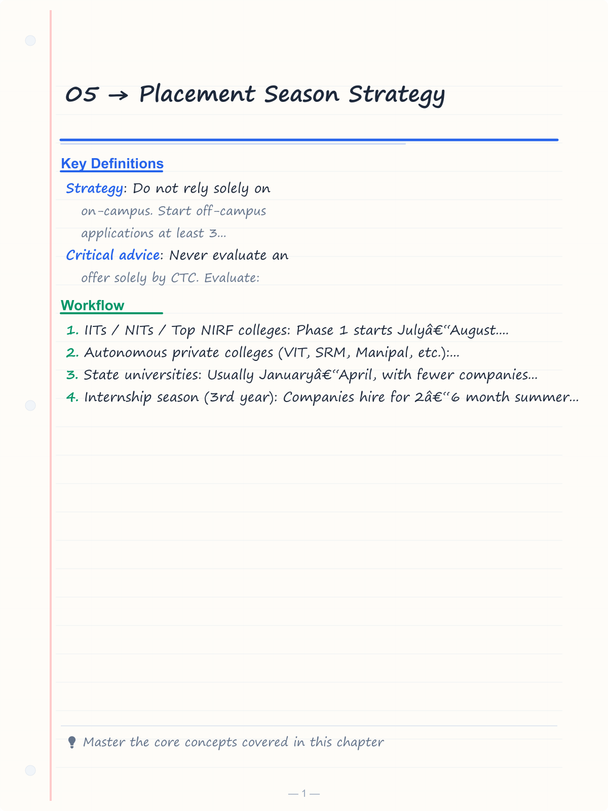
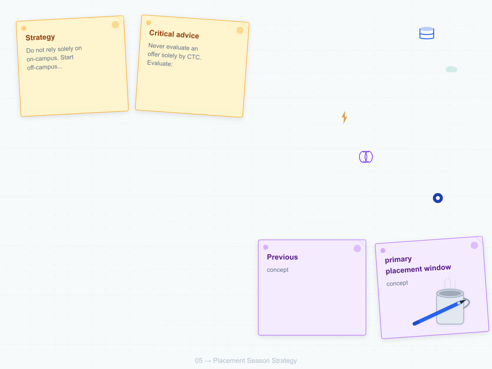
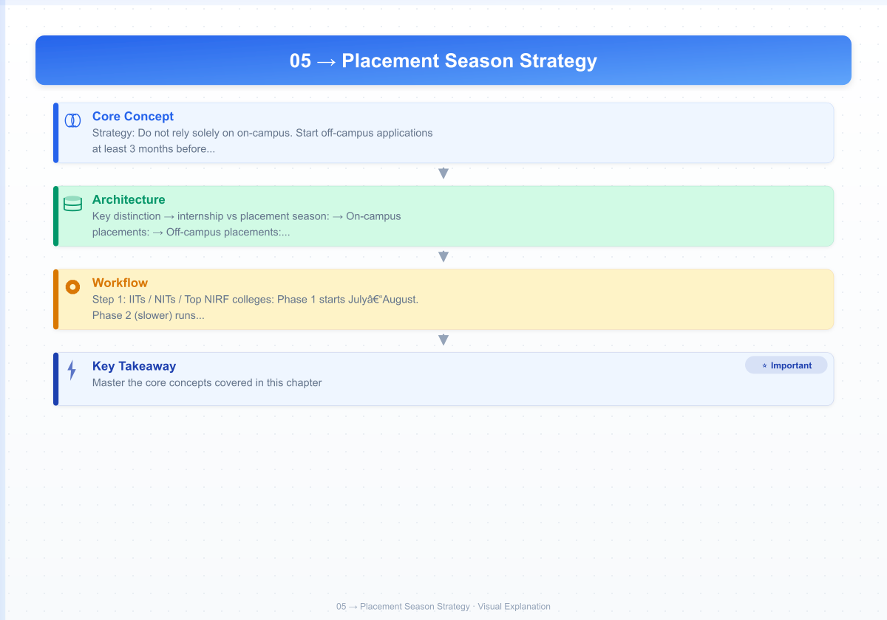
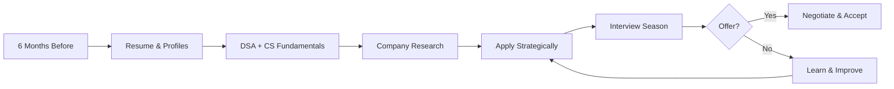

# 05 → Placement Season Strategy

> **Previous:** [04 — Company-Specific Preparation](04-company-specific.md)  
> **Next:** [06 — HR Interview, GD & Soft Skills](06-hr-gd-soft-skills.md)


<!-- Image Gallery -->
<section class="lesson-visuals" aria-label="Visual learning resources">
  <header><span>VISUAL LEARNING</span><h2>See it. Review it. Remember it.</h2></header>
  <a class="lesson-visual-card" href="../../assets/images/lessons/placement-preparation/05-placement-strategy/handwritten-notes.png" target="_blank" rel="noopener">
    
    <span><strong>Handwritten notes</strong>Condensed notes for deliberate review.</span>
  </a>
  <a class="lesson-visual-card" href="../../assets/images/lessons/placement-preparation/05-placement-strategy/sticky-notes.png" target="_blank" rel="noopener">
    
    <span><strong>Sticky-note revision</strong>Fast recall prompts for revision.</span>
  </a>
  <a class="lesson-visual-card" href="../../assets/images/lessons/placement-preparation/05-placement-strategy/visual-explanation.png" target="_blank" rel="noopener">
    
    <span><strong>Visual concept guide</strong>A connected explanation of the key ideas.</span>
  </a>
</section>
<!-- End Image Gallery -->

## Chapter at a Glance

| Section | Content |
|---------|---------|
| Placement Season Overview | Timeline, on-campus vs off-campus dynamics |
| Before the Season | Resume, profile optimization, company research |
| Core Preparation | DSA, CS fundamentals, aptitude, communication |
| Application Strategy | Company tiers, dream companies, backup plans |
| During the Season | Interview scheduling, rejection handling, offer negotiation |
| Quick Reference | Interview day checklist, final tips |



## Placement Season Overview

### When Placement Season Happens


Placement season in Indian engineering colleges follows a predictable cycle tied to the academic calendar. For most colleges (IITs, NITs, IIITs, top private universities), the schedule is:


The **primary placement window** runs from **July to December of your 3rd year (6th/7th sem merge)** for most colleges. However, the exact schedule depends on:

- **IITs / NITs / Top NIRF colleges**: Phase 1 starts July–August. Phase 2 (slower) runs September–December. By January most students are placed.
- **Autonomous private colleges (VIT, SRM, Manipal, etc.)**: September–March window. Multiple phases across the year.
- **State universities**: Usually January–April, with fewer companies visiting.

> **Pro Tip:** Internship PPOs are often easier to get than full-time offers because you compete within a smaller intern batch. Treat your internship as a 2-month extended interview.

**Key distinction → internship vs placement season:**
- **Internship season (3rd year)**: Companies hire for 2–6 month summer internships. Many convert to full-time offers (PPO/PPI).
- **Placement season (final year)**: Full-time job hiring. The focus of this guide.

### On-Campus vs Off-Campus


**On-campus placements:**
- Companies visit your college directly
- Less competition (only your batchmates)
- Usually no experience required
- Pre-placement talks help understand the role
- The college handles logistics, eligibility checks
- **Limitation**: You can only sit for companies that visit your college. If your college has poor recruiter diversity, you miss opportunities.

**Off-campus placements:**
- You apply directly through company portals (Google careers, Amazon jobs, LinkedIn)
- Competition is national → you compete with thousands
- More rounds, longer hiring cycles
- You must track deadlines yourself
- No "college tier" advantage → your resume and skills speak
- **Advantage**: You can target any company regardless of your college's reputation

**Strategy**: Do not rely solely on on-campus. Start off-campus applications at least 3 months before the season. Many top hires come from off-campus.

### Pool Campus vs Individual College Drives


**Pool campus drives:**
- Multiple colleges participate in a common placement drive
- Organized by a host college (e.g., VIT pool campus, NIT pool campus)
- Companies bring a fixed number of offers shared across colleges
- More competition but access to more companies
- Usually involves travel to the host college

**Individual college drives:**
- The company visits only your college
- Competition limited to your batch
- Higher chance of shortlisting per seat
- Usually better company preparation → pre-placement talks are tailored

**Which is better?** Individual drives are easier to crack because competition is smaller. Pool campus drives give access to companies that would not otherwise visit your college. Attend both.

### Dream vs Super Dream vs Mass Recruiters


Colleges typically classify recruiters into three tiers:

**Mass Recruiters (also called "Mass"):**
- Hire in bulk → 50 to 300+ students per company
- Examples: TCS, Infosys, Wipro, Accenture, Cognizant, Tech Mahindra, LTI
- CTC range: 3–7 LPA
- Focus: Basic coding, aptitude, communication
- **Strategy**: Do not settle here if you have potential. Use these as backup.

**Dream Companies:**
- Moderate hiring (10–50 per college)
- Examples: Deloitte, Capgemini (A4), Walmart, Samsung, Cisco, Bosch, Adobe (sometimes), Oracle, American Express
- CTC range: 10–20 LPA
- Focus: DSA, moderate system design, HR fit
- **Strategy**: Target these seriously. This is where most good students land.

**Super Dream Companies:**
- Low hiring volume (1–10 per college)
- Examples: Google, Microsoft, Amazon, Atlassian, Uber, Stripe, Rubrik, Tower Research, D.E. Shaw, Goldman Sachs
- CTC range: 25 LPA – 1.5 Cr+ (including stocks)
- Focus: Advanced DSA, system design, LLD, deep CS fundamentals
- **Strategy**: Prepare 6+ months in advance. These require dedicated, focused preparation.

### CTC Ranges Explained


CTC (Cost to Company) is **NOT your take-home salary**. It is the total cost the company incurs for you, including:

**Components of CTC:**

| Component | Description | Example |
|-----------|-------------|---------|
| Fixed base salary | Monthly salary credited to your bank | 12 LPA = ~80K/month after PF |
| Variable pay | Performance-linked bonus (10-20% typical) | 15 LPA with 15% variable = 12.75L fixed + 2.25L variable |
| Stock / RSU | Restricted Stock Units, vest over 4 years | Amazon SDE-1: ~14L annual stock vest (over 4 years) |
| Joining bonus | One-time amount paid at joining | 1L – 5L (common in super dream) |
| Relocation bonus | One-time for moving to the office city | 50K – 2L |
| Perks | Meal cards, cab, phone, insurance, etc. | ~50K–1L annually |

**Real take-home estimates:**

| Offered CTC | Approximate Monthly Take-home (In-hand) |
|-------------|--------------------------------------|
| 3.5 LPA (TCS) | ~25K–28K |
| 7 LPA (Mass) | ~50K–55K |
| 12 LPA (Dream) | ~85K–95K |
| 20 LPA (Dream) | ~1.3L–1.5L |
| 30 LPA (Super Dream) | ~1.8L–2.2L |
| 50 LPA+ (Super Dream) | ~2.5L–3.5L + stock |

**Critical advice**: Never evaluate an offer solely by CTC. Evaluate:
1. **Base vs variable ratio** → high variable (30%+) means you may not get full CTC
2. **Stock vesting schedule** → 4-year cliff means you see nothing for year 1
3. **Growth potential** → a lower CTC at a high-growth company often beats a higher CTC at a stagnant one
4. **Role and learning** → an SDE role at 12 LPA builds more long-term value than an IT support role at 15 LPA

---

## Pre-Placement Preparation Timeline

### 6 Months Before: Foundation + Resume Building


This is the most critical period. Students who start 6 months before the season consistently outperform those who start 1 month before.

**Weeks 1–8: Data Structures & Algorithms (DSA)**

Pick one language (preferably Java or C++ for placement → Python is acceptable but fewer companies use it for interviews) and master:

- **Arrays & Strings**: Two-pointer, sliding window, prefix sum, Kadane's algorithm
- **Linked Lists**: Reversal, merge, detect cycle, fast-slow pointer
- **Stacks & Queues**: Monotonic stack, deque, priority queue
- **Trees**: Traversals (DFS 3 ways, BFS, Morris), BST, LCA, diameter
- **Graphs**: BFS, DFS, topological sort, Dijkstra, Bellman-Ford, Floyd-Warshall, union-find
- **Dynamic Programming**: 0/1 knap, unbounded knap, LCS, LIS, MCM, DP on trees, DP on graphs
- **Sorting & Searching**: Binary search (standard + advanced on answers), merge sort, quicksort, heap sort
- **Hashing**: HashMap, HashSet questions, two-sum family
- **Tries & Heaps**: Prefix problems, top-K, median in stream
- **Bit Manipulation**: XOR tricks, subset generation

Target: Solve **200+ quality problems** on LeetCode (top 150 + company-specific tagged questions).

**Weeks 9–12: Resume Building**

- Create a **one-page resume** (NO two-page resumes for campus placements)
- Sections: Education → Projects → Skills → Achievements → (optional) Work Experience
- Each project must follow the format: *"Built [X] using [tech stack] to achieve [measurable outcome]"*
- Add GitHub and LinkedIn links
- Get it reviewed by 2–3 seniors who were placed in dream/super dream companies
- Use the **STAR format** for work experience entries
- Quantify everything (e.g., "Reduced API latency by 40%" not "Improved performance")

**Resume template (proven format):**

```
[Name]
[Phone] | [Email] | [LinkedIn] | [GitHub]

EDUCATION
[B.Tech] in [Branch], [College Name] → [CGPA] (till [Semester])
[Year of Passing → 2026]

SKILLS
Languages: C++, Java, Python, JavaScript
Frameworks: React, Node.js, Spring Boot
Tools: Git, Docker, PostgreSQL, MongoDB, AWS (EC2, S3)

PROJECTS
[Project Name] | [Month Year]–[Month Year]
- Built [X] using [tech stack]
- Implemented [specific feature] which [impact]
- [Quantified result] → e.g., served 500+ daily users

[Second Project Name] | [Month Year]–[Month Year]
- Similar format as above

ACHIEVEMENTS
- Solved 400+ DSA problems on LeetCode (contest rating 1800+)
- Ranked X in [Competition Name] among Y participants
- Won [Hackathon Name] → built [project] in 36 hours

RELEVANT COURSEWORK
Data Structures & Algorithms, Operating Systems, DBMS, Computer Networks, OOP
```

**Weeks 13–16: CS Fundamentals + Side Projects**

- Cover: OS (processes, threads, synchronization, deadlock, memory management, page replacement)
- Cover: DBMS (normalization, indexing, transactions, ACID, joins, query optimization)
- Cover: Computer Networks (OSI/TCP layers, HTTP/HTTPS, TCP vs UDP, DNS, CDN, load balancers)
- Cover: OOP (SOLID, design patterns → singleton, factory, observer, strategy)
- Cover: System Design basics (for dream companies: scalability, caching, db sharding, CAP theorem, consistent hashing)

**Weeks 17–20: Company-Specific Preparation**

- Research the companies that visited your college last year
- Collect the previous year's placement papers and questions from seniors
- Create a shortlist of 20 companies (10 dream, 10 super dream)
- Solve company-tagged LeetCode questions
- Watch company-specific interview experience videos

**Weeks 21–24: Mock Interviews + Final Polish**

- Give at least **10 mock interviews** → 5 DSA-focused, 3 CS fundamentals, 2 full-length
- Mock platforms: Pramp, interviewbit, or pair with a friend
- Record yourself to catch verbal fillers: "umm", "actually", "you know"
- Practice **whiteboard coding** → write on paper/whiteboard, not just in IDE
- Time your solutions: you should solve Medium in 15–20 minutes

### 3 Months Before: Intensified Preparation


**Week 1–4: Full-length Mock Assessments**

Take timed assessments exactly mimicking placement tests:
- 60 minutes: 20 aptitude + 2 coding questions
- 90 minutes: 15 subject MCQs + 3 coding questions
- Use platforms: HackerRank, CodeSignal, HackerEarth (most companies use these)

**Week 5–8: Company Deep Research**

For each target company, create a one-page profile:

```
COMPANY: [Name]
ROLES: SDE | SDET | Data Engineer
CTC: [Range]
PREVIOUS YEAR QUESTIONS:
- [Q1 with link]
- [Q2 with link]
INTERVIEW PATTERN:
- Round 1: 1 coding + 15 MCQs (60 min)
- Round 2: 2 Medium-hard DSA (45 min)
- Round 3: System design / LLD (45 min)
PRIORITY: Dream / Super Dream / Safety
STATUS: Applied / Yet to apply
```

Build a spreadsheet like this:

| Company | Priority | Role | CTC Range | Applied | Round Status | Notes |
|---------|----------|------|-----------|---------|-------------|-------|
| Google | Super Dream | SDE | 30L+ | No | → | Strong system design prep needed |
| Microsoft | Super Dream | SDE | 25L+ | No | → | Focus on CS fundamentals |
| Amazon | Super Dream | SDE | 20L+ | No | → | LP preparation critical |
| Deloitte | Dream | Consultant | 12L | No | → | Aptitude heavy |
| TCS | Safety | Digital | 7L | No | → | Just keep as backup |

**Week 9–12: Group Study + Discussion**

- Form a study group of 4–5 serious peers
- Daily 1-hour group discussion on DSA problems (each person solves and explains)
- Weekly mock interviews within the group
- Share company updates and new openings
- Solve problems on a shared whiteboard or online collaborative editor

### 1 Month Before: Targeted Preparation


**Company-Wise Revision:**
- For each company in your shortlist, revise their frequently asked topics
- Amazon: OOD + Leadership Principles (prepare 6-8 stories)
- Google: Hard DSA + Googleyness questions
- Microsoft: System design + design questions
- Mass recruiters: Aptitude + basic coding + communication

**Cheat Sheet Creation:**
Make one-page cheat sheets for:
1. **DSA patterns** → 10 common problem patterns with template code
2. **SQL queries** → joins, aggregation, subqueries, window functions
3. **OS concepts** → difference tables for processes/threads, deadlock conditions, page replacement algorithms
4. **DBMS** → Normalization forms, ACID vs BASE, index types
5. **Networking** → HTTP methods, status codes, TCP handshake, DNS resolution
6. **System Design** → blueprints for URL shortener, chat app, rate limiter, design Twitter

**Communication Practice:**
- Record yourself explaining a Medium DP problem in under 5 minutes
- Practice the "think out loud" interview style
- Prepare your "Tell me about yourself" (60 seconds, punchy, skill-focused)
- Prepare answers for: "Why this company?", "Where do you see yourself in 5 years?"

### 1 Week Before: Revision Strategy


**Last 7 days schedule:**

| Day | Focus Area | Action Items |
|-----|------------|-------------|
| Day 7 | Arrays + Strings | Solve 10 Medium+ problems, revise two-pointer patterns |
| Day 6 | Trees + Graphs | Revise traversals, solve 5 Medium+ problems |
| Day 5 | DP | Revise top 10 DP patterns, solve 5 Medium problems |
| Day 4 | CS Fundamentals | Read OS, DBMS, Networking cheat sheets (2 hours each) |
| Day 3 | Company-specific | Read company notes, watch interview experience videos |
| Day 2 | Mock interview | Full-length mock with a senior |
| Day 1 | Rest + Light revision | Read cheat sheets, prepare documents, sleep 8 hours |

**Day before the interview:**
- Do NOT solve new hard problems → panic kills confidence
- Review your resume → know every line, every number, every technology
- Read the company's mission, values, recent product news
- Prepare 3 thoughtful questions to ask the interviewer
- Check your internet, webcam, microphone, and background (if remote)
- Lay out your clothes, ID card, water bottle
- Set 3 alarms. Tell a family member or roommate about the interview time.
- Sleep by 10 PM

### What to Have Ready


**Documents folder (digital copies + 3 printed sets):**

- Resume (PDF) → 5+ copies
- ID card (college + government: Aadhar, PAN)
- Passport-size photos (8-10)
- Mark sheets: 10th, 12th, all semester transcripts
- CGPA certificate
- Category certificate (if applicable)
- Gap certificate (if applicable) → signed explanation for any year gap
- Portfolio/GitHub link printed
- Offer letter from previous internship (if any)
- LOR (if applying off-campus)
- Bank details (for joining forms)

**Digital profiles (must be updated and polished):**

| Platform | What to Update |
|----------|---------------|
| LinkedIn | Profile photo, headline, about section, projects, experience, skills, recommendations |
| GitHub | Pin top 3 repositories, write README for each project, clean commit history |
| LeetCode | Public profile with contest participation, solve count |
| HackerRank | Certificates, problem-solving badges |
| CodeChef / Codeforces | Rating visible, recent contests participated |
| Portfolio website | Optional but impressive: host on GitHub Pages with your resume, projects, blogs |

**Preparation log:**
Keep a daily log of problems solved, concepts learned, and mocks attempted. On days you feel demotivated, flip through the log to see how far you have come.

---

## Company Targeting Strategy

### How to Shortlist Companies Aligned With Your Profile


**Step 1: Self-assessment**

Rate yourself honestly on a scale of 1–5 in each category:

| Category | Rating (1–5) | Notes |
|----------|-------------|-------|
| DSA (LeetCode Rating) | → | <1600 = weak, 1600–1900 = decent, 1900+ = strong |
| CS Fundamentals | → | Can I explain OS/DBMS/Networking to a peer? |
| System Design | → | Have I built a distributed system before? |
| Projects | → | Do I have 2+ solid projects? |
| Communication | → | Can I explain technical ideas clearly? |
| Aptitude | → | Can I solve basic quant/logical reasoning fast? |
| CGPA | → | Is it above 8? Above 7? |

**Step 2: Categorize companies by your readiness**

| Your DSA Level | Target Companies |
|---------------|-----------------|
| LeetCode &lt; 1500 | Mass recruiters + lower dream (Deloitte, Capgemini, Cognizant) |
| LeetCode 1500–1800 | Dream companies (Samsung, Walmart, Cisco, Oracle) |
| LeetCode 1800+ | Super Dream + Dream (Google, Microsoft, Amazon, Atlassian) |
| LeetCode 2000+ + System Design | Super Dream (Uber, Stripe, Rubrik, Tower Research) |

**Step 3: Match with role preferences**

| You Enjoy | Roles to Target |
|-----------|----------------|
| Building features, algorithms, architecture | SDE (Software Development Engineer) |
| Testing, automation, QA processes | SDET (Software Development Engineer in Test) |
| Data pipelines, ETL, analytics | Data Engineer |
| ML models, predictions, probability | ML Engineer / Data Scientist |
| Infra, CI/CD, cloud, deployment | DevOps Engineer, SRE |
| Client interaction, solution architecture | Solutions Engineer / Consultant |
| Frontend, UI, user experience | Frontend Engineer |

**Example shortlists for different profiles:**

**Profile A: Strong DSA (1900+), CGPA 8.5+, Good Projects**
```
SUPER DREAM (target 3-4):
- Google, Microsoft, Amazon, Uber

DREAM (target 3-4):
- Atlassian, Adobe, Salesforce, Walmart

SAFETY (keep 1-2):
- Infosys, TCS Digital → apply but do not spend prep time
```

**Profile B: Average DSA (1550), CGPA 7.5, Decent Projects**
```
DREAM (target 4-5):
- Samsung, Cisco, Oracle, Deloitte, Capgemini

MASS (target 3-4):
- TCS, Wipro, Accenture, Tech Mahindra

OFF-CAMPUS:
- Smaller startups (AngelList, LinkedIn Easy Apply)
```

### Balancing Dream Companies vs Safety Options


**The portfolio approach:** Treat your placement attempts like an investment portfolio.

- **70% effort** → Dream and Super Dream companies (high risk, high reward)
- **20% effort** → Safety companies (medium reward, high probability)
- **10% effort** → Mass recruiters (low reward, almost guaranteed)

**Critical rule: Accept the first safe offer.**

Here is why: If you get a mass recruiter offer in August, accept it. Do NOT think "I will get Microsoft later." The later companies are uncertain. Having a mass recruiter offer in hand gives you:
- **Psychological safety**: You are already placed. Interview pressure reduces significantly.
- **Negotiation leverage**: Some dream companies fast-track already-placed candidates
- **Strategic option**: You can always decline later if you get a better offer

**What most top performers do:**
1. Get placed in a mass recruiter / safety in the first 2–3 months
2. Continue preparing for dream companies
3. If a dream company offer comes, upgrade
4. If no dream company offer comes, they still have a job

### Understanding Job Profiles


**SDE (Software Development Engineer):**
- What you do: Write production code, design features, debug, code review, deploy
- Interview focus: DSA (Arrays, Strings, Graph, DP), System Design (for senior roles), CS fundamentals
- Preparation priority: DSA (60%), Projects (20%), CS fundamentals (10%), System Design (10%)
- Best for: People who love coding, building products, solving algorithmic challenges

**SDET (Software Development Engineer in Test):**
- What you do: Write automation tests, build testing frameworks, CI/CD, quality gates
- Interview focus: DSA (easier than SDE), testing concepts, automation frameworks, scripting
- Preparation priority: DSA (30%), OOP + Testing (40%), Automation skills (20%), CS basics (10%)
- Best for: People who enjoy breaking things, designing robust systems, automation
- Note: Often underrated. Many SDETs transition to SDE internally after 1–2 years.

**Data Engineer:**
- What you do: Build ETL pipelines, data warehouses, streaming systems, data lakes
- Interview focus: SQL (advanced), DSA (Medium), distributed systems, big data tools (Spark, Kafka)
- Preparation priority: SQL (40%), DSA (25%), System Design (20%), Big Data (15%)
- Best for: People who love data, databases, large-scale systems

**ML Engineer / Data Scientist:**
- What you do: Build and deploy ML models, feature engineering, A/B tests, model monitoring
- Interview focus: ML concepts, probability/stats, DSA (Medium), system design (for MLE roles)
- Preparation priority: ML theory (30%), Coding (20%), Stats (25%), Case studies (25%)
- Best for: People with strong math background, research interest, Python proficiency

**DevOps / SRE:**
- What you do: Infrastructure, CI/CD, monitoring, incident response, reliability engineering
- Interview focus: Linux, networking, Kubernetes, cloud platforms, scripting
- Preparation priority: Linux (25%), Cloud (25%), Scripting (20%), Networking (15%), DSA (15%)
- Best for: People who love infra, automation, operations, and chaos engineering

**Consultant (Tech):**
- What you do: Client-facing role, solution design, tech strategy, implementation oversight
- Interview focus: Aptitude, communication, case studies, basic tech knowledge
- Preparation priority: Aptitude (30%), Communication (30%), Case studies (30%), Tech (10%)
- Best for: People who enjoy business + technology intersection, client interaction

### Role-Based Preparation Differences


**If targeting SDE (most common):**

You need the **deepest DSA preparation**. Spend:
- 50% time on DSA (LeetCode Medium + Hard)
- 15% on LLD/OOD (design patterns, class diagrams)
- 15% on projects (be ready to explain architecture decisions)
- 10% on CS fundamentals
- 10% on system design (for dream/super dream)

**Must-solve patterns for SDE:**
1. Two-pointer technique
2. Sliding window variants
3. BFS / DFS on trees and graphs
4. DP → knap, LCS, LIS, matrix DP
5. Binary search on answer
6. Heap / Priority Queue for top-K
7. Union-Find for connectivity
8. Trie for string problems
9. Monotonic stack
10. Backtracking + recursion

**If targeting SDET:**

You need **lighter DSA** but deeper **testing knowledge**:
- 30% on DSA (LeetCode Easy-Medium)
- 30% on testing concepts (unit, integration, E2E, smoke, regression)
- 20% on automation tools (Selenium, Appium, JUnit, TestNG, Playwright)
- 10% on API testing (Postman, REST Assured)
- 10% on CI/CD basics (Jenkins, GitHub Actions)

**Example SDET interview question:**
*"Design a test plan for a login feature: username/password authentication with 2FA."*
Your answer should cover:
- Test scenarios: valid, invalid, boundary, edge cases
- Negative testing: SQL injection, brute force protection
- Performance: load testing with 10K concurrent requests
- Automation: Selenium script structure
- CI/CD integration: run tests on every PR

**If targeting Data Engineer:**

You need **mastery of SQL**:
- Subqueries, CTEs, window functions (RANK, DENSE_RANK, ROW_NUMBER, LEAD, LAG)
- Joins (inner, left, right, full, cross, self)
- Aggregation (GROUP BY, HAVING, FILTER, PIVOT)
- Query optimization (EXPLAIN, indexing, partitions)
- Working with dates, strings, NULL handling

And **distributed systems basics**:
- MapReduce paradigm
- Spark transformations and actions
- Kafka topics, partitions, consumer groups
- Data warehousing (star schema, snowflake)

---

## Round-by-Round Breakdown

### Resume Shortlisting: What Gets Through


**The brutal truth:** Recruiters spend **6–10 seconds** scanning your resume before deciding to shortlist. Here is what they look for, in order:

1. **CGPA** → Many companies have hard cutoffs: 7.0 / 7.5 / 8.0 / 8.5
2. **Branch** → CS/IT gets priority. But ECE, EE, Mechanical get shortlisted too if projects fit.
3. **DSA preparation signal** → LeetCode count, CodeChef rating, coding contest rankings
4. **Projects** → Is there at least one impressive project relevant to the role?
5. **Internship** (if any) → Brand name matters. Even a small company internship shows industry exposure.
6. **Achievements** → Hackathon wins, open source contributions, patent, research paper
7. **Skills listed** → Are they relevant to the role? Java + Spring Boot for backend role? React for frontend role?

**What gets your resume rejected immediately:**

- **Typos** in the first 3 lines (yes, recruiters check)
- **CGPA below cutoff** (hard filter → do not waste effort if you know your CGPA is below 7)
- **No tech stack alignment** → applying for an SDE role with no coding project
- **Generic language** → "Worked on a project" without measurable outcomes
- **Poor formatting** → inconsistent fonts, misaligned bullets, wrong section order
- **Exaggeration** → claiming "expert" in 15 technologies (you appear as a beginner in all)
- **No GitHub/LinkedIn link** or dead links

**How to maximize shortlisting chances:**

- Tailor the resume for each company (yes, it is worth it for dream companies)
- Use action verbs: built, designed, implemented, optimized, shipped, automated
- Keep the one-page limit → NO exceptions
- Get 2 batches of reviews: 1 from a placement cell senior, 1 from an industry professional
- Upload to ATS (Applicant Tracking System) checkers → most companies use ATS to parse resumes before a human sees them
- Use **standard fonts** (Calibri, Arial, Times New Roman, 10–12pt) → fancy fonts break ATS parsing

### Online Assessment: Aptitude + Coding


**Format → expected structure:**

```
Total time: 60–120 minutes
Sections:
1. Quantitative Aptitude (10–15 MCQs)   → 15–20 minutes
2. Logical Reasoning (10–15 MCQs)       → 10–15 minutes
3. Verbal Ability (5–10 MCQs)           → 5–10 minutes
4. Coding (2–3 problems)                → 30–60 minutes
5. CS Subject MCQs (optional)           → 10–15 minutes
```

**Aptitude preparation strategy (do not ignore):**

Mass recruiters and many dream companies **fail candidates on aptitude** before even looking at coding. The weightage is often 50:50.

| Topic | Frequency | Key Formulas / Concepts |
|-------|-----------|------------------------|
| Percentages, Profit/Loss | Very high | % change, successive % |
| Time-Speed-Distance | High | Relative speed, avg speed |
| Time-Work | High | Work rate = 1/time |
| Ratios & Proportions | High | Mixture, alligation |
| Permutations & Combinations | Medium | nPr, nCr, circular arrangement |
| Probability | Medium | Conditional, Bayes |
| Number Systems | Medium | HCF/LCM, remainder theorem |
| Data Interpretation | Very high | Tables, bar charts, pie charts |
| Syllogisms | High | Venn diagrams, statements |
| Blood Relations | Medium | Family tree |
| Coding-Decoding | Medium | Pattern recognition |
| Clocks & Calendars | Low | Angle between hands, odd days |

**Coding assessment strategy:**

Most coding assessments have 2–3 questions with increasing difficulty:
- **Q1 (Easy)**: Arrays, strings, hashmap → 15 minutes
- **Q2 (Medium)**: Greedy, trees, binary search → 25 minutes
- **Q3 (Medium-Hard)**: DP, graphs, advanced → 30 minutes

> **Remember:** Coding assessments are a marathon, not a sprint. The candidates who pass partial test cases on all questions often score higher than those who ace one and leave two blank.

**Golden rules for coding assessments:**

1. **Skip Q3 if stuck** → A wrong submission on Q3 with negative marking can lose more marks than leaving it blank (on some platforms).
2. **Pass partial test cases** → On HackerRank/HackerEarth, even 50% pass on all 3 questions beats 100% on 1 question.
3. **Read all questions first** → Spend 2 minutes scanning all questions. Solve the easiest first.
4. **Handle edge cases** → Empty input, single element, max constraints, negative numbers, overflow.
5. **Optimize only if needed** → For coding assessments, brute force with optimizations scores more than incomplete optimal solution.
6. **Test with sample** → Always run against the given sample. Many students fail because their output format is wrong.
7. **Language choice** → Use the language you are fastest in. In assessments, speed matters.

### Technical Round 1: DSA + Problem-Solving


**Format:** 45–60 minutes. 1–2 coding problems on a shared editor or whiteboard.

**What interviewers assess (in order):**
1. **Communication**: Do you think out loud? Or do you go silent?
2. **Problem understanding**: Do you ask clarifying questions before coding?
3. **Approach**: Is your solution logically sound? Can you explain the trade-offs?
4. **Code quality**: Clean code? Good variable names? Edge cases handled?
5. **Optimization**: Can you improve from brute force to optimal?

**10 actual interview questions with solution approaches:**

---

**Q1: Two Sum (LeetCode 1)**
*Given an array of integers and a target, return indices of two numbers that add up to the target.*

**Approach:** Use a HashMap to store seen elements. For each element, check if `target - current` exists in map.
- **Time:** O(n), **Space:** O(n)
- **Follow-up:** What if the array is sorted? Use two-pointer (O(1) space).

---

**Q2: Longest Substring Without Repeating Characters (LeetCode 3)**
*Find the length of the longest substring without repeating characters.*

**Approach:** Sliding window with HashSet/HashMap. Expand the right pointer. When a duplicate is found, shrink from the left until the duplicate is removed.
- **Time:** O(n), **Space:** O(min(m,n)) where m is character set size
- **Key insight:** The HashMap version stores char → index, allowing the left pointer to jump directly.

---

**Q3: Merge Intervals (LeetCode 56)**
*Given an array of intervals, merge all overlapping intervals.*

**Approach:** Sort by start time. Iterate: if current interval overlaps with the last merged interval (current.start &lt;= last.end), merge by updating last.end to max(last.end, current.end). Otherwise, add as a new interval.
- **Time:** O(n log n) for sorting, **Space:** O(n) for output
- **Edge case:** Intervals with same start time.

---

**Q4: LRU Cache (LeetCode 146)**
*Design a data structure that follows LRU cache eviction policy.*

**Approach:** HashMap + Doubly Linked List. HashMap gives O(1) lookups. The doubly linked list maintains access order. On get(): move the accessed node to head. On put(): if capacity reached, remove the node before tail (LRU), add new node at head.
- **Time:** O(1) for both get and put
- **Key insight:** Java LinkedHashMap can be used in interviews but implementing manually scores higher.

---

**Q5: Word Ladder (LeetCode 127)**
*Given beginWord, endWord, and a word list, find the length of the shortest transformation sequence.*

**Approach:** BFS on implicit graph. Each word is a node. Two words are connected if they differ by one character. Use BFS from beginWord. For each word, try changing each character to 'a'–'z' and check if the resulting word is in the dictionary.
- **Time:** O(M² * N) where M = word length, N = word list size
- **Optimization:** Bidirectional BFS → search from both beginWord and endWord simultaneously. Reduces search space significantly.

---

**Q6: Maximum Subarray Sum (LeetCode 53, Kadane's Algorithm)**
*Find the contiguous subarray with the largest sum.*

**Approach:** Kadane's algorithm. Maintain `currentSum` and `maxSum`. For each element, decide: start new subarray (element alone) or extend existing subarray (current + element).
```
currentSum = max(nums[i], currentSum + nums[i])
maxSum = max(maxSum, currentSum)
```
- **Time:** O(n), **Space:** O(1)
- **Follow-up:** Return the subarray itself, not just the sum.

---

**Q7: Top K Frequent Elements (LeetCode 347)**
*Given an array, return the K most frequent elements.*

**Approach 1:** HashMap for frequency + sorting by value → O(n log n)
**Approach 2 (optimal):** HashMap + Bucket sort (array of lists indexed by frequency) → O(n)

Or use a Min-Heap of size K: add elements; if heap size exceeds K, pop the smallest frequency.
- **Time:** O(n log K), **Space:** O(n)
- **Key insight:** Bucket sort is optimal when frequency range is bounded by array size.

---

**Q8: Binary Tree Level Order Traversal (LeetCode 102)**
*Return the level order traversal of a binary tree (left to right, level by level).*

**Approach:** BFS using a Queue. Process nodes level by level. For each level, store the count of nodes at that level (queue size before processing the level). Pop that many nodes, add their values, push their children.
```
queue.add(root)
while (!queue.isEmpty())
    levelSize = queue.size()
    for (i = 0; i < levelSize; i++)
        node = queue.poll()
        level.add(node.val)
        if (node.left != null) queue.add(node.left)
        if (node.right != null) queue.add(node.right)
    result.add(level)
```
- **Time:** O(n), **Space:** O(n)
- **Variant:** Zigzag level order → alternate direction using a flag.

---

**Q9: Longest Palindromic Substring (LeetCode 5)**
*Given a string, find the longest palindromic substring.*

**Approach:** Expand around center. Each character (and each gap between characters) is a potential palindrome center. There are 2n−1 centers. Expand outward while the characters match.
```
for (i = 0 to n-1)
    expand(i, i)      // odd length
    expand(i, i+1)    // even length
```
- **Time:** O(n²), **Space:** O(1)
- **Alternative:** Manacher's algorithm (O(n)) → mention it for bonus points but code the expand approach.

---

**Q10: Course Schedule (LeetCode 207 → Topological Sort)**
*Given numCourses and prerequisites, can you finish all courses? (Detect cycle in a directed graph)*

**Approach 1 (DFS):** Build adjacency list. Use `visited` states: 0 = unvisited, 1 = visiting, 2 = visited. If you encounter a node in state 1, there is a cycle. Return false.

**Approach 2 (Kahn's algorithm):** BFS-based topological sort. Compute in-degree for each node. Push nodes with 0 in-degree to queue. Process and decrement neighbors. If all nodes are processed, no cycle exists.
- **Time:** O(V + E), **Space:** O(V + E)
- **Key insight:** Kahn's algorithm is more intuitive for interviews because you can visualize the topological order.

---

### Technical Round 2: System Design / LLD


**Format:** 45–60 minutes. Usually a design question for dream/super dream companies.

**Low-Level Design (LLD) → Object-Oriented Design:**
- Design a parking lot
- Design a chess game
- Design a library management system
- Design a vending machine
- Design an elevator system

**How to approach LLD questions:**

1. **Clarify requirements** → "What are the core features? Is there a UI or just API?"
2. **Identify core objects** → Classes, interfaces, inheritance
3. **Define relationships** → Association, aggregation, composition
4. **Apply design patterns** → Singleton, Factory, Strategy, Observer where appropriate
5. **Show code** → Write clean class definitions with methods and fields
6. **Discuss edge cases** → Concurrent access, error handling, persistence

**Example LLD skeleton → Parking Lot:**

```
enum VehicleType { BIKE, CAR, TRUCK }
enum SpotStatus { OCCUPIED, AVAILABLE }

class ParkingSpot {
    String id;
    VehicleType type;
    SpotStatus status;
    Vehicle parkedVehicle;
    // park(), unpark(), isAvailable()
}

class ParkingFloor {
    String floorId;
    Map<VehicleType, List<ParkingSpot>> spots;
    // findAvailableSpot(VehicleType), parkVehicle(), vacateSpot()
}

class ParkingLot {
    List<ParkingFloor> floors;
    ParkingRate rate;
    // parkVehicle(Vehicle), unparkVehicle(), calculateFee()
}

class EntranceGate {
    ParkingLot parkingLot;
    Ticket generateTicket(Vehicle, ParkingSpot);
}

class ExitGate {
    Ticket processPayment(Ticket, PaymentMethod);
}
```

**High-Level Design (HLD) → System Design:**
- Design URL shortener (TinyURL)
- Design a chat system (WhatsApp)
- Design a social media feed (Instagram / Twitter)
- Design a rate limiter
- Design a distributed cache

**How to approach HLD:**

1. **Requirements** → Functional + Non-functional + Scale estimates
2. **High-level architecture** → Draw boxes: client → LB → API servers → DB → cache
3. **Database schema** → Tables, indexes, partitioning strategy
4. **Key algorithms** → Consistent hashing, bloom filters, etc.
5. **Trade-offs** → Why one choice over another (CAP theorem implications)
6. **Deep dives** → 2–3 components in detail (the interesting parts)

**Example HLD skeleton → URL Shortener:**

```
Key ideas:
- Hash function: Base62 encode a unique ID (7 chars = 62^7 ≈ 3.5 trillion URLs)
- Distributed ID generation: Snowflake ID (Twitter) or Redis INCR
- Cache: LRU cache for read-heavy traffic (reads >> writes, 99:1 ratio)
- DB: Cassandra (write-optimized) or PostgreSQL with strong indexing
- Redirection: HTTP 301 (permanent) or 302 (temporary) based on analytics needs
- Analytics: Separate async service that writes to a time-series DB

API Design:
POST /shorten { originalUrl, customAlias?, ttl? }
GET /{shortCode} → 301 Redirect
GET /{shortCode}/stats → Click analytics
```

### HR Round: Common Questions with Answers


**Format:** 15–20 minutes. Mostly behavioral and cultural fit assessment.

**Purpose:** The HR round is NOT to reject (if you reach here, the tech team has approved you). HR checks:
- Are you a genuine person or making up stories?
- Will you fit in the team culture?
- Do you have any major red flags (attitude, honesty)?
- Are your salary expectations aligned?

**Common questions and how to answer:**

---

**Q1: Tell me about yourself.**
*Structure: Present → Past → Future*
- Present: "I am a final-year CS student at [College], specializing in full-stack development."
- Past: "I have built [project 1] and [project 2], which gave me hands-on experience with [tech stack]."
- Future: "I am looking to apply my skills in a challenging SDE role, which is why I am excited about [Company]."

**Keep it 60 seconds. Do NOT repeat your resume verbatim.**

---

**Q2: Why do you want to join our company?**
*Bad answer:* "Good package and brand name."
*Good answer:* "I have been following [Company]'s work on [specific product/tech]. I am particularly impressed by [specific achievement]. I believe my skills in [tech stack] align well with what your team is building, and I want to contribute to [specific area]."

**Research the company before the interview.** Mention their GitHub, recent product launch, engineering blog post.

---

**Q3: What are your strengths and weaknesses?**
*Strength:* Pick a technical trait and back it with proof.
"My biggest strength is debugging complex systems. In my last project, I tracked down a memory leak that had been in production for 3 months by adding detailed heap dump analysis."

*Weakness:* Pick a real weakness (not a fake "I work too hard") AND show improvement.
"I used to rush into coding without fully understanding requirements, which led to rework. I have since adopted a practice of writing down requirements and confirming them with stakeholders before writing a single line of code."

---

**Q4: Where do you see yourself in 5 years?**
*Bad answer:* "In your position." (Sounds arrogant)
*Good answer:* "I see myself as a senior engineer → someone who is technically deep in [area], mentors junior developers, and contributes to architectural decisions. I want to grow with the company for the long term."

---

**Q5: Why is there a gap in your education? / Why do you have a backlog?**
*Honesty is the only policy here.*
"I had a medical issue in [semester] which affected my academic performance. I have since recovered and my subsequent performance shows consistent improvement." OR
"I initially struggled with [subject], but I learned from that experience and developed better study habits. I cleared the backlog in my next attempt and have maintained a [CGPA] since."

**Never lie.** HR will verify with your college. If you are caught lying, you will be banned from the placement process entirely.

---

**Q6: Do you have any questions for us?**
*Always say YES. Ask 2-3 thoughtful questions.*

Good questions:
- "What does the typical first 90 days look like for an engineer joining the team?"
- "What is the tech stack you primarily use, and how do you decide when to adopt new technologies?"
- "How is mentorship structured for new hires?"
- "What is the most technically challenging problem your team is solving right now?"

Bad questions:
- "What is the salary?" (Wait for them to bring this up)
- "Do I have to work late?" (Shows poor attitude)
- "How many leaves do I get?" (Can ask HR, not in the interview round)

---

## Handling Rejections and Multiple Offers

### How to Handle Rejection Constructively


**The reality of rejection:** Every successful person has been rejected multiple times. Here are some statistics from placements:

- Average student: faces 5–15 rejections before first offer
- Top performer (IIT/NIT): faces 3–8 rejections before dream offer
- Off-campus applicant: faces 20–50+ rejections before first offer

**Rejection is a numbers game**, not a reflection of your ability.

**The 24-hour rule:**
- You have 24 hours to feel disappointed, angry, and frustrated
- After 24 hours, analyze what went wrong and make a concrete plan to fix it
- Do NOT join placement WhatsApp groups during this time → the noise will damage your morale

**Post-rejection analysis template:**

After each rejection, write down:

```
COMPANY: [Name]
ROUND REJECTED: OA / Tech 1 / Tech 2 / HR

WHAT WENT WRONG:
- [ ] Could not solve the coding problem (which one?)
- [ ] Ran out of time
- [ ] Communication broke down
- [ ] Could not answer CS fundamentals
- [ ] Could not explain project properly
- [ ] Blanked on system design question

ACTION ITEMS:
1. [Specific problem to practice]
2. [Topic to revise]
3. [Skill to improve]

VERDICT: Was this a skill gap or a bad day?
```

**What not to do after rejection:**

- Do NOT blame the company, the interviewer, or the placement cell
- Do NOT compare yourself with already-placed friends
- Do NOT give up and stop preparing
- Do NOT burn bridges → you may interview at the same company in the next drive
- Do NOT spread negativity in your peer group

**Growth mindset reframe:**
- Every rejection is a data point, not a verdict
- "I am not rejected. I am currently undiscovered."
- The best software engineers in the world were rejected by Google, Amazon, and Microsoft at some point

### Negotiating Offers


**When negotiation is possible:**

- You have another offer from a comparable company
- You are in the top 5% of candidates (reflected in interview feedback)
- The company has a formal negotiation process (most super dream companies do)
- You are applying off-campus (on-campus offers have less flexibility)

**What you can negotiate:**

| Item | Negotiable? | Strategy |
|------|-------------|----------|
| Fixed base salary | Sometimes | Has the most headroom in off-campus offers |
| Joining bonus | Yes | "I have another offer with [amount] joining bonus. Can you match it?" |
| Stock / RSU | Yes | Especially after the offer is made and you have leverage |
| Relocation bonus | Rarely | Small negotiation, usually fixed |
| Annual variable % | No | Standard across bands for the role |
| Designation | Rarely | Usually fixed by experience level |

**What to say (script for phone/email):**

```
"Thank you for the offer. I am really excited to join [Company]. Based on my
research and comparing with my other offer from [Competitor], I was hoping
we could discuss the compensation. I have an offer of [X] from [Competitor].
Is there flexibility in the base salary or RSU component to bring it closer
to [target number]? I am very keen to join your team."
```

**What NOT to say:**
- "This offer is too low." → Aggressive, creates bad feeling
- "My friend got more." → Irrelevant, weak argument
- "I will join only if you give me X." → Ultimatums kill offers
- "This is my only offer so give me more." → Reveals you have no leverage

**Know when to stop negotiating:**

- If the recruiter says "this is our final offer" → take it or leave it
- If you have negotiated twice → third time looks greedy
- If the amount you are negotiating over is small relative to the total → let it go
- If the company is your top choice and the offer is fair → accept with gratitude

### Accepting vs Declining Offers


**When to accept:**

- The company is in your "acceptable" list (not necessarily top choice)
- The deadline is approaching and you have no other offers
- It is a mass recruiter or safety option → accept and continue preparing for better ones
- The role aligns with your long-term career goals

**When to decline:**

- You already have a better offer (higher CTC, better role, better brand)
- The role is completely misaligned (e.g., support role when you want development)
- The company culture has a known bad reputation (excessive work hours, high attrition)
- You have a strong reason to believe you will get a better offer soon (but no guarantee)

**Acceptance template (email/portal):**

```
Subject: Offer Acceptance → [Name] → [College]

Dear [Recruiter Name],

Thank you for extending this offer. I am excited to accept the position of
[Role] at [Company]. I look forward to contributing to the team and growing
with the organization.

I have completed the acceptance formalities on the portal.

Please let me know the next steps regarding the onboarding process,
documentation, and the joining date.

Best regards,

[Name]
[Phone Number]
[College Name]
```

**Declination template (polite → important for maintaining relationships):**

```
Subject: Offer Decision → [Name]

Dear [Recruiter Name],

Thank you for offering me the [Role] position at [Company]. I truly appreciate
the time the team spent interviewing me and learning about the exciting work
being done at [Company].

After careful consideration, I have decided to accept another opportunity that
aligns more closely with my current career goals. This was not an easy decision,
as I hold [Company] in high regard.

I hope we can cross paths again in the future.

Best regards,

[Name]
```

### Explaining Gaps and Backlogs


**Backlogs (active):**
- Some companies have **no backlog** policies → you cannot sit for the drive if you have any active backlog
- Some allow 1–2 backlogs → check eligibility criteria carefully
- Actively clear backlogs before the placement season starts
- If you have a backlog during the drive, be honest when asked

**How to frame backlog explanation:**

- "I had a backlog in [subject] during [semester]. I learned valuable lessons about time management and cleared it in the next attempt."
- Do NOT blame the professor, the system, or circumstances
- Show that it is behind you and you have grown from it

**Academic gap (year drop, gap year):**

- Prepare a **gap certificate** signed by a gazetted officer or notary
- Prepare a clear, honest explanation:
  - Health reasons: Medical certificate required
  - Family reasons: Documented proof helps
  - Competitive exam preparation: Acceptable if you did something productive (GATE, CAT, etc.)
  - "Did nothing" → the worst answer. Even if you were preparing for exams, frame it as "Focused on skill development in programming"

**For the interview:**
- Keep the answer to 30 seconds. Do not dwell on it.
- Pivot quickly: "I took a year to prepare for [exams]. Although I did not clear them, I gained deep programming skills during this period, which is reflected in my projects."

### Mental Health During Placement Season


**This is the most important section in this entire guide.**

Placement season is a mental health minefield. Students experience:
- **Anxiety**: "What if I am not placed while everyone else is?"
- **Imposter syndrome**: "I do not deserve this offer. The interviewer made a mistake."
- **Depression**: "I have tried 10 companies and failed all. I am worthless."
- **Jealousy**: "My roommate got placed in Google. Why not me?"
- **Burnout**: 12-hour study days, no exercise, poor sleep, caffeine dependence

**Recognize the warning signs:**

- You have stopped eating properly or are overeating
- You cannot sleep without scrolling through your phone for 2+ hours
- You feel physically sick before interviews
- You have stopped talking to friends and family
- You believe "I will be happy only after I get placed"
- You measure your self-worth by your offer status

**Mental health strategies that work:**

1. **Create a "no-placement" safe zone:**
   - 30 minutes a day of zero placement talk → watch a show, read a novel, play a game
   - Keep 1 day per week completely placement-free → no preparation, no discussions

2. **Separate identity from outcomes:**
   - You are not "an unplaced student" → you are a person who happens to be in a placement process
   - Your friends who love you do not care about your offer status
   - One offer or 50 rejections, your fundamental worth does not change

3. **Physical health is mental health:**
   - 20 minutes of walking every day → non-negotiable
   - Do not skip meals → blood sugar crashes affect interview performance
   - Limit caffeine → 2 cups max. More caffeine = more anxiety.
   - Sleep 7+ hours → sleep deprivation reduces problem-solving ability by 30%+

4. **Use your support system:**
   - Talk to parents (even if they do not understand the tech part → they understand stress)
   - Talk to seniors who went through placements last year
   - Use college counseling if available → free and confidential
   - Do NOT compare with batchmates who have been placed

5. **Process rejection healthily:**
   - Cry if you need to. Seriously. Let it out.
   - Write down why you are disappointed → naming the emotion reduces its power
   - Call a friend who is NOT in the placement hunt
   - Eat a good meal, sleep, and wake up to a fresh start

6. **Know when to take a break:**
   - If you have failed 5+ companies in a row, stop and reassess for 2–3 days
   - A short break is not "wasting time" → a burned-out you fails more interviews
   - Use the break to change strategy, not to doom-scroll LinkedIn

**A note for friends and family:**
- If someone you know is in placement season, check on them without asking "Got placed?"
- Offer company, not advice. Cook them a meal. Take them for a walk.
- The best support is presence without pressure.

**Final thought on mental health:**

> Placement season is temporary. Your career is 40+ years. One bad season does not define your future. Some of the most successful engineers I know were not placed on campus. They found their path through off-campus hiring, startups, or graduate school. The campus placement is one door. If that door closes, there are 10 more. Keep walking.

---

## Sample Placement Timeline Calendar

### Month-by-Month Planner (Starting 6 Months Before Season)


```
MONTH 1 (February) → Foundation Phase
├── Week 1: Arrays + Strings → solve 30 problems
├── Week 2: Linked Lists + Stacks/Queues → solve 20 problems
├── Week 3: Trees → solve 25 problems
├── Week 4: Graphs → solve 20 problems
└── Goal: 100 problems solved

MONTH 2 (March) → Deep DSA Phase
├── Week 1: Dynamic Programming → solve 25 problems
├── Week 2: Greedy + Backtracking → solve 15 problems
├── Week 3: Recursion + Hashing → solve 15 problems
├── Week 4: Revision of topics covered → solve 25 mixed problems
└── Goal: 180 problems solved

MONTH 3 (April) → CS Fundamentals + Resume
├── Week 1: Operating Systems → read Galvin chapters, solve 50 MCQs
├── Week 2: DBMS → normalization, indexing, queries → solve 30 SQL queries
├── Week 3: Computer Networks → OSI, TCP/IP, HTTP → solve 50 MCQs
├── Week 4: OOP Concepts + Design Patterns → implement 5 patterns
└── Goal: Resume finalized, reviewed by 3 people

MONTH 4 (May) → Company-Specific Prep
├── Week 1: Target sheet of 20 companies created
├── Week 2: Amazon-specific → solve 20 company-tagged questions
├── Week 3: Google/Microsoft-specific → solve 20 company-tagged questions
├── Week 4: Dream company mix → solve topic-specific problems
└── Goal: Company shortlist ready, solving tagged questions

MONTH 5 (June) → Mock Interview + Aptitude
├── Week 1: 5 full-length aptitude tests (timed)
├── Week 2: 3 DSA mock interviews with seniors
├── Week 3: 2 CS fundamentals mock interviews
├── Week 4: 2 system design mocks (for dream/super dream)
└── Goal: 10 mocks done, confidence improving

MONTH 6 (July) → PLACEMENT SEASON BEGINS
├── Week 1: Final revision + document preparation
├── Week 2: Attend first company assessments
├── Week 3: Interview calls start → give your best
├── Week 4: Multiple interviews → stay calm, sleep well
└── Goal: At least 1 offer in hand
```

### Sample Week During Peak Season


```
Monday
├── 7:00 AM → Wake up, exercise, breakfast
├── 9:00 AM – 12:00 PM → Company assessment (if scheduled)
├── 12:00 PM – 1:00 PM → Lunch + break
├── 1:00 PM – 4:00 PM → Interview preparation (DSA + revise CS fundamentals)
├── 4:00 PM – 5:00 PM → Rest, listen to music
├── 5:00 PM – 7:00 PM → Mock interview with peer group
├── 7:00 PM – 8:00 PM → Dinner, family time
├── 8:00 PM – 10:00 PM → Light revision + plan for tomorrow
├── 10:00 PM → Phone away, read or meditate
├── 11:00 PM → Sleep
```

### Documents Checklist (Printable)


```
ALL DOCUMENTS → PRINT 3 SETS
â–¡ Resume (latest, 1 page, 5 copies)
â–¡ 10th marksheet
â–¡ 12th marksheet
â–¡ All semester mark sheets (print both sides if possible)
â–¡ CGPA certificate (signed by college)
â–¡ College ID card (original + photocopy)
â–¡ Government ID (Aadhar / PAN / Passport)
â–¡ Passport-size photos (8-10 recent)
□ Category certificate (SC/ST/OBC → if applicable)
â–¡ Gap certificate (if applicable)
â–¡ Internship offer letter (if any)
â–¡ Previous work experience letter (if any)
â–¡ LOR (if applying off-campus)

DIGITAL FOLDER
â–¡ All documents scanned as PDF (named clearly)
â–¡ Resume PDF (named: YourName_Resume.pdf)
â–¡ Resume DOCX (for editing if needed)
â–¡ Portfolio website link (if applicable)
â–¡ GitHub profile link
â–¡ LeetCode / HackerRank profile links

ONLINE PROFILES → UPDATED
â–¡ LinkedIn (headline, about, experience, skills, recommendations)
â–¡ GitHub (README for all projects, pinned repos)
â–¡ LeetCode (public profile with recent activity)
â–¡ HackerRank (skill certifications)
â–¡ CodeChef / Codeforces (if applicable)
â–¡ Portfolio (if applicable)
```

---

## Quick Reference: Interview Day Checklist

```
NIGHT BEFORE:
â–¡ Clothes ironed and ready (formals, clean shoes)
â–¡ ID card and documents in bag
â–¡ Water bottle filled
â–¡ Phone charged
â–¡ Alarm set (main + backup)
â–¡ Interview time confirmed
â–¡ Link / room number noted

MORNING OF:
â–¡ Shower, fresh, dressed in formals
â–¡ Breakfast eaten (not heavy, not skipped)
â–¡ 10 minutes deep breathing / meditation
â–¡ 1 quick glance at cheat sheet
â–¡ Documents bag checked
â–¡ Reach venue / log in 10 minutes early

DURING THE INTERVIEW:
â–¡ Greet interviewer with a smile
□ "May I take notes?" → always ask
□ Think out loud → never go silent
â–¡ Ask clarifying questions before coding
â–¡ Write clean code with proper variable names
â–¡ Discuss test cases and edge cases
â–¡ At the end: ask 2 thoughtful questions
â–¡ Thank the interviewer for their time

AFTER THE INTERVIEW:
â–¡ Note down questions you were asked
â–¡ Note what went well, what did not
â–¡ Rest for 30 minutes
â–¡ Prepare for the next interview if scheduled
□ Result does not matter now → it is out of your hands
```

---

## Concept Comparison: Placement Prep Approaches

| Approach | Focus | Best For | Risk |
|----------|-------|----------|------|
| Depth-First | Master one topic at a time | Students with 6+ months | May miss breadth |
| Breadth-First | Cover all topics shallowly | Students with 2-3 months | May lack depth for hard rounds |
| Mixed (Recommended) | Rotate topics, deepen gradually | Everyone | Requires good planning |
| Mock-Driven | Learn through mock interviews | Interview-nervous students | May skip fundamentals |
| Project-Based | Build + learn simultaneously | Portfolio-focused roles | Slower placement prep |

## Cross-Application Matrix

| Strategy Element | Applies To FAANG | Applies To Product | Applies To Service | Notes |
|----------------|-----------------|-------------------|-------------------|-------|
| DSA Practice | Critical | Critical | Moderate | 300+ problems recommended |
| CS Fundamentals | Important | Important | Moderate | OOP, DBMS, OS, Networks |
| System Design | Important | Good-to-have | Rarely | Focus on LLD for service roles |
| Resume Building | Essential | Essential | Essential | One-page, ATS-optimized |
| Mock Interviews | Highly recommended | Recommended | Recommended | 5+ mocks minimum |
| Aptitude Practice | Moderate | Moderate | Critical | Service companies emphasize this |
| Communication | Essential | Essential | Essential | STAR format, clarity |

## Chapter Quiz

**Q1:** What is the recommended minimum number of DSA problems to solve before the placement season?

- A) 50
- B) 150
- C) 300
- D) 500

<details><summary><b>Answer&lt;/b></summary&gt;C) 300 problems — this covers most common patterns with sufficient depth for all company tiers.</details>

**Q2:** Which placement phase do most IITs follow?

- A) January–April
- B) September–March
- C) July–December
- D) March–June

<details><summary><b>Answer&lt;/b></summary&gt;C) July–December (Phase 1 starts July–August, Phase 2 runs September–December).</details>

**Q3:** Which resume format do most ATS systems prefer?

- A) Two-column layout with graphics
- B) Reverse-chronological plain text
- C) Creative infographic style
- D) Narrative paragraph format

<details><summary><b>Answer&lt;/b></summary&gt;B) Reverse-chronological plain text — ATS systems parse single-column, text-based resumes most reliably.</details>

**Q4:** What should you do immediately after receiving a rejection from one interview?

- A) Skip all remaining interviews
- B) Note what went wrong and prepare for the next one
- C) Email the recruiter asking why
- D) Take a week off

<details><summary><b>Answer&lt;/b></summary&gt;B) Note what went wrong and prepare for the next one. Rejections are data points, not stop signs.</details>

---

## One-Sentence Takeaway

Systematic, consistent preparation over 6 months beats sporadic intense study every time. Start with a plan, track your progress, and treat every rejection as a learning opportunity.

## Final Words

Placement season is a test of preparation, not intelligence. The student who solved 300 DSA problems, practiced 10 mocks, and had a clean resume will outperform the naturally gifted student who prepared for 2 weeks. Consistency beats brilliance.

- **Start early.** The best time to start was 6 months ago. The second best time is today.
- **Be systematic.** A preparation plan followed imperfectly beats no plan at all.
- **Build relationships.** Your peers are not your competition → they are your network for life.
- **Handle setbacks.** The placement season is 6 months long. You will face rejections. How you respond determines your outcome.
- **Keep perspective.** A job is a job. It is not who you are. It is what you do. Your health, relationships, and growth matter more.

Good luck. You have got this.
