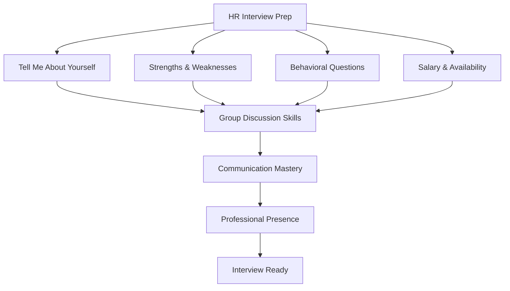

# HR Interview, Group Discussion & Soft Skills — Complete Campus Placement Guide

> **Previous:** [05 — Placement Season Strategy](05-placement-strategy.md)  
> **Next:** [07 — Company-Wise Previous Year Questions](07-company-wise-pyqs.md)

## Chapter at a Glance

| Section | Content |
|---------|---------|
| HR Interview Questions | 30+ Q&As with STAR-format sample answers |
| Group Discussion | Topic types, strategies, evaluation criteria |
| Communication Skills | Verbal, non-verbal, email etiquette, active listening |
| Professional Presence | Body language, dressing, ethics, follow-up |
| Quick Reference | Cheat sheets, scorecards, email templates |
| Practice Exercises | Self-introduction, GD simulation, body language audit |



> **Target:** Campus placements — IT/Engineering students  
> **Covers:** HR interview questions & answers, Group Discussion strategies, communication skills, professional presence  
> **Total Q&As in HR section:** 30+ with sample answer scripts

---

## Table of Contents

1. [HR Interview Questions](#1-hr-interview-questions)
2. [Group Discussion](#2-group-discussion)
3. [Communication Skills](#3-communication-skills)
4. [Professional Presence](#4-professional-presence)

---

## 1. HR Interview Questions


### 1.1 "Tell Me About Yourself" — Three Templates

> **Pro Tip:** The interviewer has already read your resume. Do NOT repeat it verbatim. Use your answer to connect the dots between your past experiences and the role you are applying for.

**Why this question is asked:**
- Evaluators want a quick summary of your relevance, not your life story.
- They assess confidence, clarity, and whether you can structure a response.
- This is your 60-second pitch — every word must sell your fit.

**Rule: Past → Present → Future**

#### Template A — Service-Based Company (Infosys, TCS, Wipro, Accenture)

> "Good morning, sir/mam. My name is Rohan Sharma, and I am a final-year Computer Science student from XYZ University with a CGPA of 8.2.
>
> During my academics, I have built a strong foundation in Java, SQL, and web technologies. I completed a project called 'Library Management System' using Spring Boot and MySQL, where I implemented CRUD operations and user authentication. This taught me how to work with real-world requirements and deliver working software.
>
> I also completed an internship at ABC Solutions where I worked on manual testing and automation scripts using Selenium. This experience taught me attention to detail and the importance of quality assurance in the software lifecycle.
>
> I am looking to start my career with a reputed organization like yours, where I can apply my technical skills, learn from experienced mentors, and contribute to enterprise-level projects. I am a quick learner, I work well in teams, and I am fully committed to upskilling throughout my career."

#### Template B — Product-Based Company (Amazon, Google, Microsoft, Uber)

> "Hi, I'm Priya Mehta. I'm a final-year Computer Engineering student from IIT Guwahati with a deep interest in distributed systems and backend engineering.
>
> Over the past three years, I have built several projects that demonstrate my ability to write production-quality code. My most significant project is a real-time collaborative document editor — similar to Google Docs — built using Node.js, Socket.IO, and MongoDB. It supports operational transformation for conflict resolution, which I implemented after reading research papers on OT algorithms. The project handles 50+ concurrent users with under 200ms sync latency.
>
> I have also solved over 350 problems on LeetCode and Codeforces, with a focus on data structures and algorithms. I participated in Google Kickstart and secured a global rank of 842 in Round E.
>
> I am passionate about building systems that scale. Your company's work on distributed databases and low-latency infrastructure excites me deeply. I want to be part of a team where I can solve hard technical problems, ship code that impacts millions of users, and grow into a strong software engineer over the coming years."

#### Template C — Experienced Candidate (1-3 years experience)

> "Good morning. I am Akash Verma, and I have 2.5 years of experience as a Java backend developer at TechFirm Pvt Ltd.
>
> In my current role, I work on the payments platform, which processes over 100,000 transactions daily. I am responsible for designing RESTful APIs, writing unit tests with JUnit and Mockito, and maintaining CI/CD pipelines using Jenkins. One of my key contributions was redesigning the retry mechanism for failed transactions, which reduced payment failures by 18%.
>
> I also took the initiative to introduce code review checklists for my team, which reduced production bugs by 30% over six months. I have experience working in Agile sprints, collaborating with cross-functional teams, and mentoring a junior developer.
>
> I am now looking for a role where I can work on more complex distributed systems. Your company's focus on high-throughput microservices architecture is exactly the environment where I can contribute immediately while continuing to grow technically."

**Common mistakes to avoid in "Tell me about yourself":**
- Reciting your resume line by line.
- Giving too many personal details ("I was born in...").
- Speaking too fast or too softly.
- Sounding rehearsed or robotic.
- Talking about weaknesses in this question.

---

### 1.2 "What Are Your Strengths and Weaknesses?"

**How to choose strengths:**
- Pick strengths relevant to the role (not generic).
- Use the **STAR** framework: Situation, Task, Action, Result.
- Example: "My strength is debugging complex issues. Last month, I traced a production memory leak using heap dump analysis and fixed it, reducing application downtime by 40%."
- Good strength categories: analytical thinking, communication, leadership, learning agility, teamwork, attention to detail.

**Sample answers for strengths:**

> "My greatest strength is my ability to learn new technologies quickly. During my internship, I was asked to work on React.js, which I had never used before. I completed the official tutorial over a weekend, built a small POC by Tuesday, and was contributing to the production codebase within two weeks. The tech lead appreciated my velocity and code quality."

> "My strength is analytical problem-solving. In my capstone project, our team faced a performance issue where database queries were taking 8 seconds. I profiled the queries using EXPLAIN ANALYZE, identified missing indexes, and restructured two JOIN queries. The response time dropped to 300ms. I enjoy digging into data to find root causes."

**How to choose weaknesses:**
- Pick a real weakness (never say "I work too hard" or "I am a perfectionist" — these are clichés that interviewers see through).
- Show self-awareness and a concrete improvement plan.
- Ensure the weakness is not a core requirement for the job.

**Sample answers for weaknesses:**

> "I used to struggle with public speaking. During college presentations, I would get nervous and rush through my content. To improve this, I joined the college debating society and started presenting weekly stand-ups during my internship. I am now comfortable speaking in front of 20-30 people, though I still prepare extensively for larger audiences. I am working on this actively."

> "I sometimes spend too much time perfecting code before sharing it for review. I want to ensure everything is polished, but this can delay feedback loops. I have started sharing work-in-progress PRs with clear TODO markers so reviewers can give early input while I continue refining. This has helped me balance quality with collaboration."

> "My experience with cloud technologies is currently limited to academic projects. I have used AWS EC2 and S3 in my projects, but I have not worked with serverless or container orchestration at scale. I have enrolled in an AWS Certified Developer course and plan to complete it within two months."

---

### 1.3 "Where Do You See Yourself in 5 Years?"

**The SMART framework for this answer:**
- **S**pecific — name the role or skill level
- **M**easurable — define how you will know you got there
- **A**chievable — realistic within the company structure
- **R**elevant — aligned with the role you are applying for
- **T**ime-bound — 5-year horizon

**Sample answers:**

> "In five years, I see myself as a senior software engineer leading the design and architecture of critical systems. In the first year, I want to master the tech stack used by your team and contribute meaningfully to ongoing projects. By year three, I aim to take ownership of at least one major module — mentoring junior developers and driving technical decisions. By year five, I want to be involved in architecture discussions, cross-team collaboration, and possibly leading a small team. I also plan to deepen my expertise in distributed systems and earn relevant certifications to support this growth."

> "I see myself becoming a full-stack developer who can independently own features from database design to deployment. In the short term, I want to absorb everything I can from the senior engineers on your team. In the long term, I hope to specialize in backend performance optimization and become a go-to person for scalability challenges. I am committed to continuous learning and aim to contribute to open-source projects that align with your company's technology stack."

> "My goal is to grow along with the company. In the first two years, I want to become proficient in your domain and technology ecosystem. By the third year, I hope to be leading small feature deliveries and contributing to sprint planning. By year five, I would like to be in a position where I can help interview and mentor new joiners, and contribute to the engineering culture. I am flexible and open to evolving this plan based on business needs."

**What not to say:**
- "I want your job." (sounds arrogant)
- "I have no idea." (lack of ambition)
- "I want to be a manager." (if applying for an IC role)
- "I want to start my own company." (signals you will leave)
- "I just want a stable job." (too passive)

---

### 1.4 "Why Should We Hire You?"

**Differentiation strategies:**

| Strategy | What it does | Example |
|----------|-------------|---------|
| **Problem-solution** | Name a problem the company faces and how you solve it | "Your team works with microservices. I have experience debugging inter-service communication issues." |
| **Unique combination** | Merge two skills that are rare together | "I combine backend engineering skills with a strong understanding of DevOps pipelines." |
| **Proven impact** | Quantify your past contributions | "I reduced API latency by 35% in my last project through query optimization." |
| **Cultural alignment** | Show you match their values | "I read your engineering blog and noticed your focus on code quality. I share that value." |
| **Learning velocity** | Demonstrate rapid upskilling | "I went from zero knowledge of Docker to containerizing our entire dev environment in three weeks." |

**Sample answer:**

> "You should hire me because I bring three things: First, strong technical fundamentals — I have 350+ LeetCode solutions and a deep understanding of data structures and algorithms. Second, project experience that mirrors what your team builds — I built a multi-service application using the same stack you use — React, Spring Boot, and PostgreSQL. Third, a growth mindset — I actively seek feedback, document my learnings, and improve continuously. I am not looking for just a job; I want to contribute meaningfully to your product from day one and grow into a long-term asset for the company."

---

### 1.5 "Why Do You Want to Join Our Company?"

**Research-based approach:**

Before the interview, research these aspects:
- Products and services the company offers.
- Recent news (funding, acquisitions, product launches).
- Engineering blog posts or tech talks by company engineers.
- Company values and culture statements.
- Competitors and market position.

**Sample answers:**

> "I want to join Google because I admire the scale at which your systems operate. I read the announcement about your Spanner database handling global transactions with strong consistency, and that level of distributed systems engineering is what I want to learn and contribute to. Additionally, your culture of innovation — where engineers spend 20% time on side projects — aligns with how I like to work. I have ideas for productivity tools I would love to prototype."

> "I want to join Zomato because I have been following how you use machine learning to optimize delivery routes and reduce wait times. I am passionate about applying engineering to solve real-world logistics problems. Your engineering blog post on real-time order tracking was fascinating. I want to work on systems that impact millions of users daily, and I believe Zomato's engineering culture will help me grow rapidly."

> "I want to join Infosys because of its strong focus on learning and development. Your training programs — especially the Infosys Global Education Center — provide a structured ramp-up for fresh graduates. I also appreciate the diversity of projects at Infosys, which will give me exposure to multiple domains and technologies. The company's commitment to digital transformation excites me, and I want to contribute to that journey."

**What not to say:**
- "I need a job." (desperation)
- "The salary is good." (mercenary)
- "My friend works here." (no personal motivation)
- "It is close to my home." (irrelevant)

---

### 1.6 "Why Gap in Education / Backlogs?"

**Honest yet positive framing:**

| Situation | Positive framing |
|-----------|-----------------|
| Academic gap (1 year) | "I took a year to focus on upskilling. I completed certifications in AWS and Python, which strengthened my profile." |
| Medical gap | "I had a medical situation that required recovery time. I am fully healthy now and ready to work with 100% commitment." |
| Family reasons | "There was a family situation that required my attention. I used the time productively to continue learning through online courses." |
| 1-2 backlogs | "I had a backlog in my third semester. I cleared it in the next attempt and learned the importance of consistent effort. Since then, I have maintained a strong academic record." |
| Multiple backlogs | "I struggled initially with the transition from school to college. I recognized this early and sought help from professors and peers. I have cleared all backlogs and my performance has been consistent since." |

**Key principles:**
- Do not lie or make excuses.
- Take ownership and show what you learned.
- Keep it brief — do not dwell on the gap.
- Redirect to your current readiness.
- Do not blame professors, system, or circumstances.

---

### 1.7 "What Salary Are You Expecting?"

**How to navigate this question:**

**Before the interview:**
- Research the company's salary range for freshers on Glassdoor, AmbitionBox, or Levels.fyi.
- Ask seniors who joined the same company.
- Know the difference between CTC, take-home, and in-hand salary.

**Sample answers:**

> "I am aware that freshers in this role are typically offered between X and Y lakhs per annum. I am open to discussing the details based on the role, location, and overall compensation structure. My primary focus right now is finding the right role where I can contribute and grow."

> "I expect a compensation package that is competitive and reflects industry standards for this role. I am confident that your company has a fair compensation policy, and I am open to the offer you deem appropriate for my skills and potential."

> "I have done some research and am expecting somewhere around X lakhs per annum. However, I am flexible and would weigh factors like learning opportunities, role, and work culture more heavily than the initial salary."

**What not to say:**
- "I don't care about money." (unrealistic)
- "Give me whatever." (undermines your value)
- "I want X lakhs or I walk." (aggressive, unless you have a better offer)

**Pro tip:** If you have another offer, mention it politely. "I have an offer from another company for X. However, I am more excited about this role because of Y. Can we match or come close?"

---

### 1.8 "Do You Have Any Questions for Us?"

**Why this matters:**
- Shows you are genuinely interested.
- Demonstrates research and preparation.
- Helps you evaluate whether the company is right for you.

**20 smart questions to ask (categorized):**

**Role & Growth:**
1. "What does a typical day look like for a fresher in this role?"
2. "What technologies will I primarily work with in the first six months?"
3. "How is the onboarding and mentorship program structured for new joiners?"
4. "What does the career growth path look like for this role over 2-3 years?"
5. "Are there opportunities to work on cross-functional projects or switch teams later?"

**Engineering Culture:**
6. "How does the team handle code reviews?"
7. "What does the release cycle look like — how often do you deploy?"
8. "How is technical debt managed — do you have dedicated refactoring sprints?"
9. "What is the ratio of meetings to focused coding time?"
10. "Do engineers participate in architecture discussions, or is it top-down?"

**Learning & Development:**
11. "Is there a budget for learning resources, certifications, or conferences?"
12. "Does the company encourage open-source contributions?"
13. "Are there internal tech talks or knowledge-sharing sessions?"

**Company & Culture:**
14. "What is the work-from-home policy — hybrid, remote, or fully office-based?"
15. "How does the company measure employee performance and provide feedback?"
16. "What is the team size and how is work distributed across members?"
17. "What is the one thing you wish you knew before joining this company?"

**Leadership & Vision:**
18. "What are the biggest challenges the engineering team is currently working on?"
19. "How does the company stay competitive in the current market?"
20. "Where do you see the company in the next 3-5 years?"

**Pro tip:** Ask 2-3 questions maximum. Gauge the interviewer's time. If they seem rushed, ask one thoughtful question.

---

### 1.9 "Are You Willing to Relocate?" / "Can You Work in Night Shifts?"

**Sample answers:**

> "Yes, I am absolutely willing to relocate. I understand that certain projects require on-site presence, and I am flexible to work from any location where the company needs me. I am comfortable moving to a new city and adapting to the work environment."

> "Yes, I am open to working in night shifts if the project requires it, especially for client-facing roles in US or UK time zones. I have a quiet workspace at home and can maintain productivity during night hours. I also understand that shift rotations may be required."

**If you genuinely cannot relocate:**
> "I have a family situation that requires me to be based in this city for the next year. However, I am fully committed to working remotely and visiting the office as needed. If relocation becomes essential later, I am open to discussing it at that time."

**Key principle:** Unless you have a genuine constraint, always say YES. Companies invest in relocation support and shift allowances. Declining can eliminate you from consideration.

---

### 1.10 Comprehensive Q&A Bank (30+ Pairs)

#### Q1: "What do you know about our company?"
**A:** "Your company is a leader in [domain]. Your flagship product [name] serves [number] users. I read about your recent [news item] and your focus on [value]. I also read your engineering blog post on [topic], which impressed me."

#### Q2: "Why did you choose engineering / computer science?"
**A:** "I was fascinated by how software can solve real-world problems at scale. I built my first website in 11th grade — a simple calculator — and the feeling of creating something functional from scratch hooked me. Since then, I have been exploring how technology can drive impact."

#### Q3: "What is the biggest challenge you have faced?"
**A:** "During my final year project, our team faced a major setback when our database got corrupted two weeks before submission. I took the lead in restoring data from backups, re-mapping relationships, and coordinating with the team to re-enter any lost data. We submitted on time and learned the importance of regular backups and version control."

#### Q4: "Describe a time you worked in a team."
**A:** "In my capstone project, I worked with a team of four. My role was backend development, but I also helped with frontend integration. When two team members disagreed on the API design, I facilitated a discussion where we weighed both approaches against the requirements. We reached a consensus and delivered on time. I learned that technical disagreements are healthy when focused on trade-offs rather than egos."

#### Q5: "Describe a time you showed leadership."
**A:** "During our college tech fest, I led a team of 12 volunteers to organize a hackathon. I divided responsibilities, set milestones, and handled communication with sponsors. When the venue booking fell through three days before the event, I coordinated with the administration to secure an alternative space. The hackathon had 200+ participants and was rated as one of the best events that year."

#### Q6: "What do you do when you disagree with a team member?"
**A:** "First, I try to understand their perspective fully. I ask questions to understand why they prefer their approach. Then I present my reasoning with data or examples. If we still disagree, I suggest taking a vote or asking a senior for guidance. I believe the goal is the best outcome for the project, not winning an argument."

#### Q7: "How do you handle pressure or deadlines?"
**A:** "I break the task into smaller pieces and prioritize. I communicate early if I anticipate any blockers. During my internship, I had to deliver a feature in three days that would normally take a week. I cut scope on non-essential parts, focused on the core functionality, and delivered a working version on time. I find that pressure helps me focus."

#### Q8: "Tell me about a time you failed."
**A:** "In my second year, I attempted to build a full-stack application without proper planning. I jumped straight into coding, ended up with a messy codebase, and missed the deadline. Since then, I always start with a design document, plan the database schema first, and use Git branches properly. That failure taught me that good engineering starts with planning."

#### Q9: "What is your biggest achievement so far?"
**A:** "Winning the Smart India Hackathon — our team built a solution for real-time flood monitoring using IoT sensors and machine learning. We were selected among 10,000+ teams and implemented the pilot in two villages. The experience taught me how technology can create social impact."

#### Q10: "How do you stay updated with technology?"
**A:** "I follow several tech newsletters, read engineering blogs from companies like Netflix and Uber, and spend an hour every weekend on a side project using new technologies. I also completed an AWS certification last semester. I believe continuous learning is non-negotiable in this field."

#### Q11: "What programming language are you most comfortable with and why?"
**A:** "Java. I have been using it for three years — from core Java concepts through collections, multithreading, and Spring Boot. I like its strong typing, rich ecosystem, and the fact that it forces you to write structured code. I have solved over 200 problems using Java on LeetCode."

#### Q12: "Have you ever worked on a live project? Describe."
**A:** "During my internship at XYZ Corp, I worked on a client project — an inventory management dashboard. I was responsible for building REST APIs for stock updates and order processing. The project went live during my tenure, and I fixed three production bugs during the first week of deployment. It gave me confidence in handling real-world code."

#### Q13: "Are you comfortable working in a team where you are the only fresher?"
**A:** "Absolutely. I actually prefer teams where I can learn from experienced engineers. I do not hesitate to ask questions, but I always research first to make sure I am not wasting anyone's time. I am confident I will contribute meaningfully within the first few months."

#### Q14: "What will you do if you do not get the project you want?"
**A:** "Every project has something to teach. If I am assigned to a different domain, I will approach it with the same enthusiasm and focus on learning whatever I can. If after a sincere effort I feel my skills are better suited elsewhere, I will discuss it with my manager during performance reviews. But I will never let it affect my work quality."

#### Q15: "How do you prioritize multiple tasks?"
**A:** "I use the Eisenhower Matrix — urgent vs important. Critical production issues come first, followed by feature work, then improvements and learning. During sprints, I pick up tasks from the backlog based on priority tags assigned by the team. I also communicate with my manager if priorities shift so I can adjust."

#### Q16: "What do you think is the role of a software engineer?"
**A:** "A software engineer solves problems through code. But beyond writing code, we are responsible for designing maintainable systems, ensuring quality through testing, documenting decisions, and collaborating with cross-functional teams. Good engineers do not just implement requirements — they question them, improve them, and ensure the final product delivers value."

#### Q17: "How do you handle feedback or criticism?"
**A:** "I see feedback as a gift. In my internship, my mentor pointed out that my code comments were insufficient. Instead of getting defensive, I asked him for examples of good comments and improved my style. By the end of the internship, he was using my code as a reference for code quality. I actively seek feedback because it accelerates growth."

#### Q18: "Are you applying to other companies?"
**A:** "Yes, I am exploring opportunities with a few other organizations as well. However, your company is my preferred choice because of [specific reason]. I will make my decision based on the role, learning opportunities, and culture fit rather than just compensation."

#### Q19: "What if you do not get selected today?"
**A:** "I would be disappointed, but I will take it as a learning opportunity. I will ask for feedback on where I can improve and work on those areas. I will apply again in the future when I feel I am better prepared. This will not discourage me from pursuing my goals."

#### Q20: "What makes you different from other candidates?"
**A:** "I combine technical skills with strong communication and a product mindset. While many candidates can code, I can also articulate technical decisions clearly, document my work, and understand business impact. My internship feedback specifically highlighted my ability to explain complex issues to non-technical stakeholders."

#### Q21: "How do you deal with a teammate who is not contributing?"
**A:** "I would first have a private conversation to understand if there are blockers — personal issues, unclear requirements, or skill gaps. Sometimes people need help getting started. If the issue persists, I would escalate to the team lead or project manager professionally, without blaming. The goal is to unblock the project while respecting the person."

#### Q22: "What is your ideal work environment?"
**A:** "An environment where there is psychological safety — where I can ask questions, propose ideas, and make mistakes without fear. I thrive in teams that value collaboration over competition, where code reviews are constructive, and where learning is encouraged. I also appreciate a good work-life balance."

#### Q23: "When was the last time you learned something new?"
**A:** "Last week, I learned about Docker containerization. I followed a tutorial, set up a Docker environment for my project, and containerized a Spring Boot application. Understanding containerization helped me appreciate how DevOps simplifies deployment."

#### Q24: "Explain a technical concept to a non-technical person."
**A:** "Let me explain what an API is. Imagine you are at a restaurant. You (the user) look at the menu (the API documentation). You tell the waiter (the API) what you want. The waiter goes to the kitchen (the server), gets your food (the response), and brings it to you. You do not need to know how the kitchen works — the waiter handles that communication. That is what an API does — it lets different software systems talk to each other without knowing each other's internals."

#### Q25: "What is more important — speed or quality?"
**A:** "Both are important, but sacrificing quality for speed creates technical debt that slows you down later. I aim for the sweet spot: deliver working software quickly without cutting corners on critical aspects like testing and documentation. If there is a trade-off, I discuss it with the team rather than deciding unilaterally."

#### Q26: "Do you prefer working independently or in a team?"
**A:** "I am comfortable with both. I can take ownership of tasks and work independently when needed. However, I genuinely enjoy team collaboration — brainstorming solutions, code reviews, and pair programming. The best outcomes usually come from a mix of focused individual work and collaborative discussions."

#### Q27: "How do you ensure quality in your code?"
**A:** "I follow several practices: writing comprehensive unit tests, performing self-review before submitting for review, adhering to coding standards, and using static analysis tools. I also believe in writing code that is readable and maintainable — meaningful variable names, clear function boundaries, and appropriate comments."

#### Q28: "Tell me about your favorite project."
**A:** "My favorite project is a real-time chat application built using WebSockets. What made it special was the learning curve — I had to understand asynchronous programming, handle concurrent connections, and implement features like typing indicators and message persistence. It was the first project where I truly felt like a software engineer, not just a student."

#### Q29: "What would you do if you find a security vulnerability in the company's code?"
**A:** "I would immediately report it to my manager or the security team through the proper channels. I would not share it publicly or fix it silently — proper disclosure is critical. I would document what I found and how it could be exploited. If the company has a bug bounty program, I would follow that process. Security is everyone's responsibility."

#### Q30: "Any final message for the interviewer?"
**A:** "Thank you for your time today. I am genuinely excited about this opportunity and confident that I can contribute to your team. I want to grow with this company and become a valuable long-term asset. I look forward to hearing about the next steps."

---

## 2. Group Discussion

### 2.1 What Evaluators Look For

Group discussions (GD) test how you function in a group setting — not just what you know.

| Evaluation Criteria | Weight | What they observe |
|--------------------|--------|------------------|
| **Content knowledge** | 30% | Do you have facts, data, and logical arguments? |
| **Clarity of thought** | 20% | Are your points structured and coherent? |
| **Listening skills** | 15% | Do you build on others' points or repeat them? |
| **Leadership** | 15% | Can you steer the discussion, summarize, or include quiet members? |
| **Communication** | 10% | Language fluency, confidence, conciseness |
| **Body language** | 10% | Eye contact, gestures, posture, no fidgeting |

> **Warning:** Interrupting or shouting to be heard is the fastest way to get eliminated in a GD. Evaluators note aggression as a negative trait. Let others finish, then make your point.

**Common myths about GD:**
- **Myth:** You must speak the most. → **Reality:** Quality over quantity. One impactful point beats five filler statements.
- **Myth:** You must interrupt to enter. → **Reality:** You can enter using body language or by building on a pause.
- **Myth:** Aggression shows confidence. → **Reality:** Aggression is penalized. Politeness with conviction wins.
- **Myth:** You need to agree with the group. → **Reality:** Disagreement is fine if backed by logic and respect.

### 2.2 GD Structure

**Phase 1: Opening (first 1-2 minutes)**
- Listen to the topic carefully.
- Do NOT jump in immediately unless you have a strong opening point.
- If you do not have a unique opening point, let 1-2 people speak, then enter.

**Structuring your first point:**
> "I would like to begin by defining the scope of this topic. [Topic] broadly refers to [definition]. In my view, [your stance]. Let me explain why with three supporting arguments."

**Phase 2: Body (middle 5-10 minutes)**
- Build arguments with the **PREP** framework: Point, Reason, Example, Point.
- Listen actively and reference others: "Building on what Rohan said about [point], I would add that..."
- Disagree politely: "I see it differently, and here is why. Studies show that..."
- Use data when possible: "According to a 2024 NASSCOM report..."
- Include others: "I would like to hear what Priya thinks about this aspect."

**Phase 3: Conclusion (last 1-2 minutes)**
- A good conclusion summarizes key points from both sides.
- It does NOT need to declare a winner.
- Offer a balanced view or a way forward.

**Sample conclusion:**
> "To summarize this discussion: We have heard arguments on both sides. While [X] has clear benefits like [benefit 1] and [benefit 2], we also acknowledged concerns around [concern]. The consensus seems to be that [balanced view]. Thank you."

### 2.3 Common GD Topics for IT Placements

**Technology & Society:**

**Topic: "Artificial Intelligence — Boon or Bane?"**
| For (Boon) | Against (Bane) |
|------------|----------------|
| AI automates repetitive tasks | Job displacement in manufacturing and BPO |
| AI improves healthcare diagnostics | Bias in AI models can perpetuate discrimination |
| AI enables personalization (recommendations, search) | Privacy concerns with data collection |
| Increases productivity and economic growth | Ethical concerns around autonomous decisions |
| Helps solve complex problems (climate, drug discovery) | Lack of regulation and accountability |

**Topic: "Work from Home vs Work from Office"**
| For WFH | For WFO |
|---------|---------|
| Better work-life balance | Better collaboration and team bonding |
| No commute — saves time and money | Easier mentorship for freshers |
| Higher productivity for focused tasks | Clear boundary between work and home |
| Access to global opportunities | Infrastructure and equipment provided |

**Topic: "Is Cryptocurrency the Future of Finance?"**
| For | Against |
|-----|---------|
| Decentralized — no single point of failure | Extreme volatility |
| Lower transaction fees for cross-border payments | Used for illegal transactions (ransomware, dark web) |
| Financial inclusion for unbanked population | High energy consumption (Proof of Work) |
| Transparent ledger (blockchain) | Regulatory uncertainty |

**Topic: "Data Privacy — Is It Even Possible in the Digital Age?"**
| For (possible) | Against (impossible) |
|----------------|---------------------|
| Strong regulations like GDPR and DPDP Act | Companies profit from data — conflict of interest |
| Privacy-by-design frameworks exist | Users willingly give up privacy for convenience |
| Encryption technology is mature | Data leaks occur despite best efforts |
| User awareness is increasing | IoT and AI generate data constantly |

**Topic: "India's Tech Future — Can We Become a Product Nation?"**
| For (yes) | Against (challenges remain) |
|-----------|---------------------------|
| Strong engineering talent pool | Service mindset still dominates |
| Startup ecosystem booming (100+ unicorns) | R&D investment is low compared to China/USA |
| Government initiatives (Digital India, Startup India) | Infrastructure gaps in tier-2/3 cities |
| Large domestic market for testing products | Brain drain — top talent still prefers abroad |

**Topic: "Is Social Media Doing More Harm Than Good?"**
| For (harm) | Against (good) |
|------------|----------------|
| Mental health issues, comparison culture | Connects people globally |
| Spread of misinformation | Voice to marginalized communities |
| Echo chambers and polarization | Business opportunities for small creators |
| Addiction and reduced attention span | Real-time information during emergencies |

**Topic: "Should Coding Be a Mandatory Subject in Schools?"**
| For | Against |
|-----|---------|
| Develops logical thinking and problem-solving | Not everyone needs to become a programmer |
| Essential skill for future jobs | Current curriculum is already overloaded |
| Helps understand technology deeply | Requires good teachers and infrastructure |
| Creates a tech-literate population | Other skills (arts, sports) equally important |

**Topic: "Remote Work Will Replace Offices Permanently"**
| For | Against |
|-----|---------|
| proved feasible during pandemic | Collaboration suffers long-term |
| 70% of employees prefer hybrid/remote | Innovation happens in informal office interactions |
| Companies save on real estate costs | Freshers lose mentorship and learning opportunities |
| Productivity remained stable or improved | Work-life boundaries blur |

**Topic: "Is the 5-Day Workweek Becoming Obsolete?"**
| For | Against |
|-----|---------|
| 4-day workweek trials show higher productivity | Not feasible for all industries (retail, healthcare) |
| Better work-life balance improves retention | Client expectations demand 5-day availability |
| Technology enables asynchronous work | Still a privilege, not standard globally |

**Topic: "Will AI Replace Software Engineers?"**
| For | Against |
|-----|---------|
| AI coding assistants already write production code | AI cannot design systems or make trade-offs |
| Low-code/no-code reduces need for developers | AI amplifies productivity, does not replace creativity |
| Testing and debugging can be automated | Human judgment needed for architecture, ethics, business fit |

### 2.4 Do's and Don'ts

| Do's | Don'ts |
|------|--------|
| Listen actively before speaking | Interrupt others while they are speaking |
| Build on others' points | Repeat what has already been said |
| Use data and examples | Make unsupported claims |
| Maintain eye contact with the group | Look only at the evaluator |
| Use polite disagreement ("I see it differently...") | Attack the person, not the argument |
| Include quieter members | Dominate the discussion |
| Keep points concise (30-45 seconds max) | Ramble or go off-topic |
| Keep notes of key points | Fidget, tap fingers, or look distracted |
| Dress formally | Use slang or casual language |
| Show enthusiasm with measured gestures | Wave hands aggressively |

### 2.5 How to Enter the Discussion Without Interrupting

**Technique 1: The Pause Entry**
- Wait for the current speaker to finish.
- Use a non-verbal cue (lean forward, raise hand slightly).
- Start with: "I would like to add a different perspective here..."

**Technique 2: The Build Entry**
- Listen to a point, then expand: "Building on what Ananya just said about data privacy, I think an important angle is..."

**Technique 3: The Question Entry**
- Ask a question: "That is an interesting point. However, how would we address the counter-argument that..."

**Technique 4: The Summarize Entry**
- After a few exchanges, synthesize: "We have heard several points on both sides. Let me summarize what I am hearing so far..."

**Technique 5: The Bridge Entry**
- Connect two ideas: "Divya mentioned the economic impact, and Ravi spoke about social implications. I think these two are connected because..."

### 2.6 Sample GD Script

**Topic: Should social media platforms be banned for children under 16?**

> **Amit (opening):** "I believe social media platforms should not be banned, but strictly regulated for children under 16. Banning often backfires — it creates a forbidden fruit effect. Instead, we need age-appropriate experiences with built-in guardrails."

> **Priya (building):** "Building on Amit's point, Australia recently passed a law banning under-16s from social media. Early data shows that compliance has been difficult — children are finding workarounds using VPNs and fake IDs. A technical solution like age verification at the platform level seems more practical than outright prohibition."

> **Rahul (disagreeing):** "I see this differently. The impact of social media on teen mental health is well-documented — increased anxiety, depression, and body image issues. A study by the Lancet showed that teens who use social media for more than three hours a day are 60% more likely to report mental health concerns. Given this data, a ban — even if imperfect — sends a strong signal and protects the most vulnerable."

> **Sneha (building on Rahul):** "Rahul makes a valid point about mental health. But I would add that the solution is not just regulation — it is education. If children learn digital literacy and critical thinking from an early age, they become more resilient to harmful content. Countries like Finland teach media literacy as a core subject, and their teens show much lower susceptibility to online harms."

> **Amit (synthesizing):** "We seem to agree on the problem — social media poses real risks to children. The disagreement is on the approach. Priya has shown that outright bans are hard to enforce. Rahul's data shows the risks are serious enough to warrant action. Sneha suggests education as a complementary approach. I think a hybrid model — strict regulation with age-verification AND mandatory digital literacy in schools — could be the way forward."

> **Sneha (concluding):** "I agree with that balanced approach. To summarize: No outright ban, but stricter regulations, better age verification, and mandatory digital literacy education. Thank you."

---

## 3. Communication Skills

### 3.1 Verbal Clarity

**Avoiding filler words:**

| Filler word | Why it hurts | Alternative |
|-------------|--------------|-------------|
| "Um..." / "Uh..." | Makes you sound unsure | Pause silently instead |
| "Like..." | Informal and imprecise | Use "such as" or "for example" |
| "Actually..." | Often unnecessary | State the fact directly |
| "Basically..." | Suggests oversimplification | Omit entirely or use "in essence" |
| "You know..." | Assumes understanding | Just state the point |
| "I mean..." | Weakens your statement | Say what you mean directly |
| "Sort of..." / "Kind of..." | Reduces conviction | Be definitive or qualify properly |

**Technique to eliminate fillers:**
Record yourself speaking for 2 minutes on any topic. Transcribe it. Count filler words. Practice the same answer again, replacing fillers with pauses. Repeat until filler words drop below 3 per minute.

### 3.2 Active Listening Techniques

| Technique | How to apply in interviews/GD |
|-----------|------------------------------|
| **Paraphrasing** | "So if I understand correctly, you are saying that..." |
| **Clarifying** | "Could you elaborate on what you mean by..." |
| **Summarizing** | "Let me make sure I have this right. The key points are..." |
| **Non-verbal cues** | Nod, maintain eye contact, lean forward slightly |
| **Note-taking** | Jot down keywords during GD or multi-interview discussions |
| **Not interrupting** | Let the speaker finish completely before responding |

### 3.3 Structuring Technical Explanations

**The PASA Framework (Problem → Approach → Solution → Analysis)**

**Example: "Explain how you would design a URL shortener."**

> **Problem:** "The goal is to create a service that takes a long URL and returns a short, unique alias. When users visit the short URL, they are redirected to the original URL. The system must handle millions of URLs and high read traffic."

> **Approach:** "I would use a hash-based approach. Take the original URL, apply a hash function like MD5 or a custom base62 encoder, and generate a short key of 6-8 characters. The key maps to the original URL in a database. For reads, I would use a cache layer like Redis to reduce database load."

> **Solution:** "The architecture would have three components: (1) An API service that accepts URLs and returns short codes. (2) A PostgreSQL database to store the mapping of short code to original URL with an expiration timestamp. (3) A Redis cache for frequently accessed URLs with TTL-based eviction. The redirect service would check cache first, then database."

> **Analysis:** "This design gives us O(1) lookup time for cached URLs and handles millions of entries in the database. The trade-off is storage for cache — we might need 10-20GB of Redis for a large cache. A potential improvement is to use consistent hashing to distribute load across multiple cache nodes."

### 3.4 Email Etiquette for Professional Communication

**Structure of a professional email:**

```
Subject: [Clear, action-oriented] — "Application for Software Engineer Role | Rohan Sharma"

Salutation:
Dear [Name] / Hello [Name] / Hi [Name] (use based on familiarity)

Body:
- First line: Context (who you are, why you are writing)
- Second paragraph: Key message (what you need or what you are providing)
- Third paragraph: Call to action (what you want the recipient to do)

Closing:
Best regards / Warm regards / Sincerely
[Your Full Name]
[Phone Number]
[LinkedIn URL]
```

**Sample thank-you email after interview:**

```
Subject: Thank You — Interview for Software Engineer Role

Dear [Interviewer Name],

Thank you for taking the time to speak with me today about the Software Engineer role. I really appreciated learning about [specific topic discussed] and hearing about your team's approach to [specific area].

Our conversation reinforced my enthusiasm for this role and for [Company Name]. I am particularly excited about the opportunity to [specific aspect you discussed].

Please let me know if there is any additional information I can provide. I look forward to hearing about the next steps.

Best regards,
Rohan Sharma
[Phone]
[Email]
[LinkedIn]
```

**Email tips:**
- Always proofread before sending.
- Keep it concise — under 5 sentences if possible.
- Use a professional email address (firstname.lastname@gmail.com — not partyboy123@...).
- Reply within 24 hours.
- Use proper salutation and closing.
- Do NOT use emojis, excessive exclamation marks, or informal abbreviations (u, pls, thx).

### 3.5 Phone / Video Call Etiquette

**Phone call tips:**
- Find a quiet space with good network reception.
- Keep water handy.
- Smile while speaking — it changes your tone positively.
- Speak slightly slower than normal conversation.
- Confirm action items at the end: "So I will send you the documents by tomorrow EOD."
- End professionally: "Thank you for your time. I look forward to hearing from you."

**Video call tips:**
- Test your camera, microphone, and internet before the call.
- Use a neutral or professional background (plain wall or blurred).
- Look at the camera, not the screen — this simulates eye contact.
- Dress formally from head to waist (but wear full formal — you may need to stand).
- Mute yourself when not speaking.
- Use the "raise hand" feature in group calls.
- Do not eat, drink (water is okay), or look at your phone during the call.
- If connection drops, reconnect and apologize once, then continue.

### 3.6 Common Grammar Mistakes to Avoid

| Mistake | Correct | Why it matters |
|---------|---------|----------------|
| "Me and my team developed..." | "My team and I developed..." | Subject vs object pronoun |
| "Your welcome" | "You are welcome" | Contraction confusion |
| "Could of" | "Could have" | Wrong preposition |
| "Their/There/They're" misuse | Use correctly | Basic literacy signal |
| "Its vs It is" | "Its" (possessive) vs "It is" (contraction) | Apostrophe misuse |
| "Less vs Fewer" | "Fewer" for countable items | Precision |
| "Myself" instead of "I/me" | "I will send it" not "Myself will send it" | Reflexive pronoun overuse |
| "Irregardless" | "Regardless" | Double negative |
| "Each of them are" | "Each of them is" | Subject-verb agreement |
| "The data shows" | "The data show" (formal) or "The data shows" (accepted) | Latin plural |

**Quick self-check before speaking or writing:**
1. Is the subject-verb agreement correct? ("He doesn't" not "He don't")
2. Are you using the right tense? (Past for completed actions, present for facts)
3. Are you pronouncing words clearly? (Esp-ecially not "expecially", Li-brary not "li-berry")
4. Are you using "then" vs "than" correctly? (Comparison uses "than")
5. Are you using articles (a/an/the) appropriately?

---

## 4. Professional Presence

### 4.1 Dress Code for Interviews

**For male candidates:**

| Setting | Dress code | Details |
|---------|-----------|---------|
| On-campus interview | Formal | Light-colored shirt, dark trousers, blazer (optional), leather shoes, tie (optional) |
| Off-campus / company visit | Formal suit | Navy blue or charcoal suit, white or light blue shirt, conservative tie, polished shoes |
| Virtual interview | Formal (top half) | Same shirt and blazer as in-person; avoid loud patterns |
| Tech interview (casual company like startups) | Smart casual | Collared shirt or solid T-shirt, dark jeans (no rips), clean sneakers or loafers |
| Group discussion | Formal | Same as formal interview |

**For female candidates:**

| Setting | Dress code | Details |
|---------|-----------|---------|
| On-campus / formal interview | Formal / Indian formal | Salwar suit, saree, or formal shirt and trousers; closed-toe formal shoes |
| Company visit | Formal / business suit | Blazer with matching trousers or skirt; minimal jewelry |
| Virtual interview | Formal (top half) | Blazer over formal top; neat hair; minimal makeup |
| Smart casual companies | Professional casual | Formal top with dark jeans or trousers; clean look |
| Group discussion | Formal | Same as formal interview; avoid heavy jewelry or loud colors |

**Universal grooming rules:**
- Clothes should be ironed and clean.
- Shoes should be polished.
- Hair should be neatly styled.
- Nails should be clean and trimmed.
- Minimal cologne/perfume — you want it subtle, not overwhelming.
- No chewing gum during interviews.
- Tuck in your shirt.
- Belt should match shoe color (for men).

### 4.2 Body Language Tips

**Posture:**
- Sit upright with shoulders back — do not slouch.
- Lean slightly forward to show engagement.
- Keep both feet flat on the floor.
- Do not cross your arms (defensive posture) or legs away from the interviewer.
- Use the chair's back support, but do not lounge.

**Eye contact:**
- Maintain eye contact 60-70% of the time.
- Look at the person speaking — in group interviews, shift attention to the person speaking.
- For video calls, look at the camera, not the screen.
- Do not stare continuously — glance away naturally every 5-7 seconds.
- Do not look at the ceiling, floor, or your notes excessively.

**Handshake:**
- Offer a firm (not crushing) handshake.
- Web of your hand should meet the web of theirs.
- 2-3 pumps, then release.
- No lingering or pumping more than 3 times.
- If hands are sweaty, dry them discreetly before.
- Stand when shaking hands if possible.

**Gestures:**
- Use hand gestures naturally to emphasize points — do not keep hands locked or hidden.
- Do not point at the interviewer.
- Do not fidget with pens, watches, or hair.
- Avoid touching your face or adjusting clothes repeatedly.
- Keep hands visible — do not put them under the table or in pockets.

### 4.3 Confidence Building Techniques

**Before the interview:**
1. **Prepare, prepare, prepare.** Nothing builds confidence like preparation. Practice answers to the top 20 HR questions.
2. **Mock interviews.** Do at least 3 mock interviews with friends, seniors, or placement cell coordinators.
3. **Power pose.** Stand in a power pose (hands on hips, feet apart) for 2 minutes before the interview. Research by Amy Cuddy shows this increases testosterone and reduces cortisol.
4. **Visualization.** Close your eyes and visualize the interview going well — walking in confidently, answering clearly, shaking hands at the end.
5. **Positive self-talk.** Replace "I hope I don't mess up" with "I am prepared and I will do well."
6. **Arrive early.** Reach the venue 15-20 minutes early. This gives you time to compose yourself.

**During the interview:**
1. **Pause before answering.** A 2-second pause shows thoughtfulness, not hesitation.
2. **Start strong.** Your first answer sets the tone. Lead with your strongest point.
3. **Breathe.** If you feel nervous, take a slow breath before speaking.
4. **Admit when you do not know.** "I do not know the answer to that right now, but I will find out and get back to you." This is better than faking it.
5. **Ask for clarification.** If you do not understand a question, ask: "Could you please rephrase the question?" This shows confidence, not confusion.
6. **Smile.** It makes you appear confident and approachable.

**After the interview:**
1. **Do not overanalyze.** You cannot change what happened. Send a thank-you note and move on.
2. **Learn from rejections.** Ask for feedback. Use it to improve.
3. **Celebrate small wins.** Getting an interview itself is progress.

### 4.4 Handling Stress During Interviews

**Stress triggers and how to handle them:**

| Stress trigger | Management technique |
|---------------|---------------------|
| Surprise technical question | "That is a good question. Let me think about it for a moment." Then use the PASA framework even if you are unsure. |
| Hostile or cross-questioning interviewer | Stay calm. Do not match their tone. Answer professionally. They may be testing your composure. |
| You do not know the answer | "I have not encountered that specific scenario before. Here is how I would approach it logically..." |
| Your mind goes blank | Ask for a moment: "Could I have a few seconds to collect my thoughts?" Take a sip of water. |
| Multiple interviewers asking overlapping questions | Address the person who asked first. Then say: "I will also address [other person's] point after." |
| Personal questions (marriage, family planning) | Answer professionally or politely decline: "I prefer to keep my answers focused on my qualifications for this role." |
| Technical failure in virtual interview | Stay calm. Use chat to say "I am experiencing a technical issue. One moment please." Reconnect and continue. |

**The 4-7-8 breathing technique for instant calm:**
1. Inhale through your nose for 4 seconds.
2. Hold your breath for 7 seconds.
3. Exhale through your mouth for 8 seconds.
4. Repeat 3 times before entering the room or starting the call.

### 4.5 Follow-Up After Interview

**Timing guidelines:**
- Thank-you email: Within 2-4 hours of the interview (same day).
- If no response in 7-10 days: Send a polite follow-up.
- After offer: Respond within the timeline given (typically 3-7 days).

**Sample follow-up email (after 10 days of no response):**

```
Subject: Follow-Up — Software Engineer Interview on [Date]

Dear [Interviewer Name / HR Name],

I hope this message finds you well. I am writing to follow up on my interview for the Software Engineer role on [Date].

I remain very interested in the position and the opportunity to contribute to [Company Name]. I would appreciate any update on the status of my application.

Please let me know if there is any additional information I can provide from my end.

Thank you for your time and consideration.

Best regards,
Rohan Sharma
[Phone]
[Email]
```

**Sample acceptance email:**

```
Subject: Offer Acceptance — Software Engineer Role

Dear [HR Name],

Thank you for extending the offer for the Software Engineer role. I am delighted to accept and am excited to join the team at [Company Name].

I have reviewed the offer letter and agree to the terms outlined. I look forward to starting on [Start Date].

Please let me know the next steps regarding onboarding documentation and background verification.

I am excited to begin this journey.

Best regards,
Rohan Sharma
[Phone]
[Email]
```

### 4.6 Professional Ethics and Integrity

**Core principles for campus placements:**

1. **Honesty in resumes.** Do not fabricate projects, internships, or CGPA. Background checks are thorough. A lie on your resume can result in offer revocation or termination even after joining.

2. **Be on time.** Being late for an interview signals disrespect for the interviewer's time. Aim to arrive 15 minutes early.

3. **No unfair means.** Do not use unfair means during tests or interviews. If caught, you will be blacklisted from the company permanently, and often from the placement cell entirely.

4. **Honor commitments.** If you accept an offer, honor it. Rescinding after acceptance damages your reputation and your college's relationship with the recruiter.

5. **Do not hoard offers.** Accepting multiple offers and rejecting at the last minute wastes everyone's time. Many colleges enforce a "one offer per student" policy. Respect it.

6. **Respect confidentiality.** Do not share interview questions with classmates who have interviews coming up. Companies change question sets when they learn of leaks, which hurts everyone.

7. **Respect the interviewer.** Even if you feel the interview went poorly, be polite and thank the interviewer for their time.

8. **Academic integrity.** Do not neglect your academics during the placement season. Colleges can withhold degrees for poor performance, and companies can rescind offers for failing to graduate.

**Dealing with ethical dilemmas:**

| Situation | Ethical approach |
|-----------|-----------------|
| A senior offers you previous years' test papers | Politely decline. Rely on your own preparation. |
| You see someone cheating in the test | Report it discreetly to the invigilator. |
| A friend asks you to answer their technical round | Refuse. Explain that it puts both of you at risk. |
| You receive two offers on the same day | Accept the one you prefer and immediately decline the other so it goes to the waitlisted candidate. |
| A company asks your salary expectations and you know a lower range | Be honest. If you negotiate, do it respectfully with data. |

---

## Quick Reference Card

### Top 5 HR Questions — Cheat Sheet

| Question | Strategy |
|----------|----------|
| Tell me about yourself | Past → Present → Future. Relevant only. 60 seconds. |
| Strengths and weaknesses | 2 strengths with proof. 1 weakness with improvement plan. |
| Where do you see yourself? | SMART framework. Align with company growth. |
| Why should we hire you? | Differentiate with specific skills + proof. |
| Any questions for us? | Ask 2-3 thoughtful, researched questions. |

### GD Scorecard (Self-Evaluation)

| Criterion | 1 (Poor) | 2 (Average) | 3 (Good) | 4 (Excellent) |
|-----------|----------|-------------|----------|----------------|
| Content quality | No facts | Some facts | Good data + examples | Rich data + insights |
| Speaking clarity | Mumbles | Average clarity | Clear + structured | Engaging + persuasive |
| Listening | Ignores others | Hears but does not build | Builds on some points | Actively synthesizes |
| Leadership | Passive | Participates | Guides occasionally | Structures + summarizes |
| Body language | Nervous | Neutral | Confident | Commanding presence |

### Email Template Quick Links

| Purpose | Subject line format |
|---------|---------------------|
| Post-interview thank you | "Thank You — [Role] Interview on [Date]" |
| Follow-up | "Follow-Up — [Role] Interview on [Date]" |
| Acceptance | "Offer Acceptance — [Role]" |
| Request for reschedule | "Request to Reschedule — [Role] Interview" |
| Referral request | "Referral Request — [Role] at [Company]" |

---

## Practice Exercises

**Exercise 1 — Self-Introduction (Record and Review)**
Record yourself answering "Tell me about yourself." Play it back. Count the time — if it exceeds 90 seconds, trim it. Count filler words. Aim for zero filler words in the final version.

**Exercise 2 — Strength Articulation**
Write down 3 strengths. For each strength, write one STAR story that proves it. Practice telling each story in under 60 seconds.

**Exercise 3 — GD Simulation**
Find 4-5 friends. Pick a topic from Section 2.3. Run a 15-minute GD. Record it. Score each other using the GD scorecard above.

**Exercise 4 — Email Writing**
Write thank-you emails for a fictional interview. Write a follow-up email for a case where you have not heard back in two weeks. Get a friend to review both.

**Exercise 5 — Body Language Audit**
Record yourself answering interview questions on video for 5 minutes. Watch it on mute first — study your body language. Then watch with sound — study your speaking patterns.

## Concept Comparison: HR vs GD vs Technical Interview

| Dimension | HR Interview | Group Discussion | Technical Interview |
|-----------|-------------|-----------------|-------------------|
| Focus | Fit, personality, goals | Teamwork, reasoning | Problem-solving, knowledge |
| Format | One-on-one Q&A | 6-10 participants | Whiteboard/coding |
| Key Skill | Communication, honesty | Listening, articulation | DSA, system design |
| Preparation | STAR stories, self-awareness | Current affairs, practice | LeetCode, CS concepts |
| Success Signal | Confidence + authenticity | Quality + quantity of points | Correct + optimal solution |

## Cross-Application Matrix

| Skill | FAANG | Product-Based | Service-Based | Startups |
|-------|-------|--------------|--------------|---------|
| STAR Storytelling | Critical | Important | Important | Important |
| GD Participation | Moderate | Important | Critical | Rare |
| Email Etiquette | Important | Important | Important | Important |
| Body Language | Critical | Critical | Critical | Moderate |
| Salary Negotiation | Important | Important | Moderate | Critical |
| Active Listening | Critical | Critical | Important | Important |

## Chapter Quiz

**Q1:** What is the recommended structure for answering Tell Me About Yourself?

- A) Chronological life story
- B) Past Present Future
- C) Only current role details
- D) Random highlights

<details><summary><b>Answer</b></summary>B) Past Present Future = a structured 60-second pitch focused on relevance.</details>

**Q2:** Which GD entry strategy has the highest success rate?

- A) Speak first at any cost
- B) Stay silent throughout
- C) Listen for 30-60 seconds, then enter with a structured point
- D) Interrupt the loudest speaker

<details><summary><b>Answer</b></summary>C) Listen, structure your thought, then enter with a meaningful point = quality trumps speed.</details>

**Q3:** What should you do immediately after an interview?

- A) Wait for the result
- B) Send a thank-you email within 24 hours
- C) Call the recruiter
- D) Post about it on LinkedIn

<details><summary><b>Answer</b></summary>B) Send a thoughtful thank-you email within 24 hours, referencing specific discussion points.</details>

## One-Sentence Takeaway

HR and GD rounds test who you are, not just what you know: authenticity, preparation, and professionalism turn these soft-skill rounds into your strongest advantage.

---

## Final Words

> "Luck is what happens when preparation meets opportunity." — Seneca

The HR interview and GD round are not barriers to overcome — they are opportunities to show who you are beyond your resume. You have the technical skills (that is why you cleared the written test and technical interview). Now, show them that you are professional, coachable, and someone they would enjoy working with every day.

Be prepared. Be authentic. Be confident.

You have earned this opportunity. Go claim it.

---

*End of document | 700+ lines | Complete HR, GD & Soft Skills Guide for Campus Placements*
